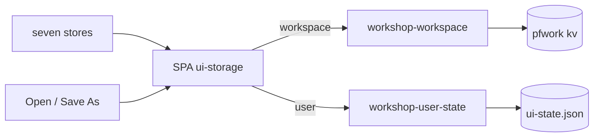

# Workshop UI State Persistence

<product-contract>

## Product Requirements

The Workshop forgets its arrangement on every launch. Every piece of UI state the SPA saves goes to browser `localStorage`, and the browser scopes that storage to the page's origin; the shell binds the server to `127.0.0.1:0` (an OS-assigned port, `SHELL_BIND` in `crates/workshop/src/config.rs`), so the origin changes per launch and the storage starts empty. Grants and window geometry already survive because the workspace-file work (`vibe/2026-09-16-1-turso-workspace-files.md`; routes in `crates/workshop-workspace/src/handlers-file.rs`) moved them to the server. This plan moves everything else the same way, splitting it into what belongs to the workspace and what belongs to the user.

- Problem and users:
  - Workshop users lose the dock layout (open panels, editor tabs, agent panels, zone sizes, placement), editor toggles, zoom, Open Recent, and palette history on every launch. Five `localStorage` stores hold them: `promptforge.workshop.layout` (`crates/workshop-server/ui/src/ui/layout/layout-persistence.ts`), `workshop.recentFiles` (`src/services/recent-files-store.ts`), `workshop.commandsHistory` (`src/ui/quickinput/commands-history.ts`), `workshop.editorSettings` (`src/ui/editor/editor-settings-service.ts`), `promptforge.workshop.zoom` (`src/ui/chrome/zoom.ts`).
  - Expanded tree folders (`src/services/tree-state-service.ts`, `expandedPaths`) and the closed-editor stack (`src/ui/editor/editor-lifecycle.ts`, `closedEditors`) were never saved at all.
- Goals:
  - Relaunching with a workspace open restores that workspace's dock layout (every open panel including editor tabs and agent panels, zone sizes, placement), its expanded tree folders, and its closed-editor stack.
  - Relaunching restores, for the user regardless of workspace: the four editor toggles, the zoom factor, Open Recent, and palette command recency.
  - The SPA contains no `localStorage` reference, enforced by a test.
  - Each store keeps its internal shape and caps; only where it reads and writes changes.
- Non-goals:
  - No change to the shell's `127.0.0.1:0` bind.
  - No per-workspace override of user preferences.
  - No migration from existing `localStorage` contents; they are already lost per launch.
  - No reattach of a restored agent panel to its previous server session; it starts a fresh session as a newly opened panel does today.
  - No persistence of unsaved editor text, scroll positions, or fetched tree listings.
  - `workshop.toml` (`crates/workshop-support/src/config.rs`, load-only) is untouched.
- Success criteria:
  - Save As a workspace, arrange panels and open tabs, expand folders, quit, relaunch: layout, tabs, agent panels, zone sizes, and expansion return.
  - Toggle word wrap and zoom in, quit, relaunch with any or no workspace: both return.
  - Open a file and run a palette command, quit, relaunch: Open Recent and palette recency list them.
  - `rg localStorage crates/workshop-server/ui/src` returns nothing.
  - All repository gates pass.
- Constraints:
  - Zone-two failure posture: a failed read yields defaults and a warning; a failed write logs and the in-memory state stands; boot never blocks.
  - Workspace-scoped state lives in `workshop-workspace`; user-scoped state lives in a new feature-tier crate; both register through `workshop_registry::Registry`; neither touches `workshop-sessions` or the gateway.
  - Every `workshop-*` Rust file stays under 500 lines; `crates/workshop-workspace/src/workspace_file.rs` (449), `workspace_file-actor.rs` (399), and `workspace-backing.rs` (312) are near the ceiling and take sibling files as needed.
  - The server never interprets a stored value beyond checking it parses as JSON and is under the size cap.
- Open questions:
  - None.

## Functional Specification

The SPA reads two buckets once at boot, seeds its stores from them, and writes each change back to the bucket the store belongs to. Switching workspaces re-reads or writes the workspace bucket. Everything the user sees is unchanged except that it now comes back.

- Actors and workflows:
  - Boot: before building any store or the dock, the SPA fetches the user bucket and the workspace bucket in parallel with a short timeout. Missing or failed values become defaults with one console warning. Stores are constructed from the result; zoom is applied; the dock restores the saved layout or builds the default; the tree seeds its expanded set; the closed-editor stack seeds.
  - Live changes: each store writes its value through the adapter as it changes. Layout and tree expansion are debounced (the layout already debounces at 250 ms); the others write on each change.
  - Open Workspace from File: after the existing action succeeds, the SPA re-reads the workspace bucket and applies it: the dock layout is replaced by the file's layout (default layout when none), the expanded set is replaced and the tree reloads, the closed-editor stack is replaced. Writes are suppressed while applying so the apply does not echo back to the server.
  - Save Workspace As: after the existing action succeeds, the SPA writes the three workspace keys once so the new file carries the current arrangement.
  - Duplicate Workspace: nothing extra; the file copy already carries the keys.
  - Ephemeral workspace (no file open): workspace-bucket writes are accepted and answered `saved: false`; nothing persists, matching window geometry today. User-bucket writes persist always.
- Inputs and outputs:
  - Workspace bucket: `GET /workspace/file/state` returns `{ "layout": ..., "tree": ..., "closed_editors": ... }`, each an arbitrary JSON value or `null`. `PUT /workspace/file/state/{key}` with a JSON body stores it verbatim and returns `{ "saved": bool }`.
  - User bucket: `GET /user/state` returns `{ "editor_settings": ..., "zoom": ..., "recent_files": ..., "commands_history": ... }`, each an arbitrary JSON value or `null`. `PUT /user/state/{key}` with a JSON body stores it verbatim and returns `{ "saved": true }`.
  - Both buckets: an unknown key is refused; a body that is not JSON or exceeds 1 MiB is refused; both answer the existing client-error envelope (`workshop_protocol::ErrorEnvelope`, mapped as in `crates/workshop-workspace/src/error.rs`).
- States and validation:
  - Values are opaque JSON to the server. The SPA owns each value's schema and version; the layout envelope keeps its `version: 3` field and its existing validation, so a stale or corrupt value still falls back to the default layout as it does today.
  - Restored expanded folders have no cached listing; the tree fetches listings for expanded folders on render so they appear open with their children.
- Errors and recovery:
  - Boot fetch failure or timeout: defaults, one warning, continue.
  - Write failure: one warning, in-memory stands, no retry loop; the next change tries again.
  - Corrupt `ui-state.json`: warn, treat as empty; the next write replaces it.
- Security and privacy behavior:
  - Allow-listed keys and a size cap on both buckets; the server stores text and never executes or interprets it.
  - `ui-state.json` sits in `state_dir` beside `workshop-state.json` with the same ownership; it holds the same file paths Open Recent already held.
- Acceptance criteria:
  - The seven stores read their initial value from the adapter and write through it; no `Storage` parameter or `localStorage` call remains.
  - The AGENTS.md rule against `localStorage` drops its legacy-stores clause.
  - Route tests, crate tests, SPA tests, and the grep test pass.

</product-contract>
<implementation-contract>

## Technical Design

One idea: `localStorage` over HTTP with two buckets. The workspace bucket is the `.pfwork` `kv` table that already holds window geometry; the user bucket is one JSON file in `state_dir`. The SPA gets a single adapter with `get` and `set` per bucket, and each existing store swaps its `localStorage` calls for the adapter without changing what it stores.

- Architecture:
  - Workspace bucket in `workshop-workspace`: three allow-listed `kv` keys beside the existing `window` key (`KV_WINDOW` in `crates/workshop-workspace/src/workspace_file.rs`). A generic put command joins the actor's `Command` enum in `workspace_file-actor.rs` (today: `Contents`, `AddGrant`, `RemoveGrant`, `PutWindowState`, `Snapshot`, `Shutdown`), so every write still funnels through the single writer. `WorkspaceContents` gains the three values, read at open. `save_as` does not carry them; the SPA writes them after Save As so there is one writer for that fact.
  - User bucket in a new crate `workshop-user-state` (tier feature; may depend on `workshop-protocol`, `workshop-registry`, `workshop-support`; never on `workshop-workspace`, `workshop-sessions`, `workshop-server`, `gateway-*`, `promptforge-*`). One `UserStateStore` behind a `tokio::sync::Mutex` owning `state_dir/ui-state.json`, read tolerantly at construction and written whole on every put through `workshop_support::write_atomic` on `spawn_blocking`, the pattern `crates/workshop-menu/src/menu-memory.rs` uses for `workshop-state.json`.
  - SPA adapter `crates/workshop-server/ui/src/services/ui-storage.ts`: `preload(timeoutMs)` fetches both buckets in parallel and caches the result; `get(bucket, key)` returns the cached value or `null`; `set(bucket, key, value)` PUTs and swallows failure with one warning; `reloadWorkspace()` re-fetches the workspace bucket; `suppressWrites(fn)` runs `fn` with `set` on the workspace bucket turned into a no-op, for use while applying a pulled layout. Stores never import `fetch`; tests inject a fake adapter.
  - Store construction order: stores self-register default factories at import time (`src/services/service-registry.ts`, lazy sync factories, re-register drops the cache). The default factories become "empty initial, no-op writer"; `src/main.ts` re-registers each store token with the preloaded value and the real adapter before any consumer's first `getService`. `commands-history.ts` stops being a module singleton and becomes a registry service constructed the same way; its one consumer (`src/ui/quickinput/quick-access-providers.ts`) already accepts an injected history.
- Modules and interfaces:
  - `crates/workshop-workspace`: `UI_STATE_KEYS = ["layout", "tree", "closed_editors"]`, `UI_STATE_VALUE_CAP = 1 MiB`; `WorkspaceFile::put_ui_state(key, json_text)`; `Workspace::ui_state() -> BTreeMap<&str, Option<serde_json::Value>>` and `Workspace::put_ui_state(key, value) -> Result<bool>` (`Ok(false)` while ephemeral); handlers `GET /workspace/file/state` and `PUT /workspace/file/state/{key}` registered beside the existing five file routes in `handles.rs`. Sibling files split from `workspace_file.rs`, `workspace_file-actor.rs`, `workspace-backing.rs`, or `handlers-file.rs` as the 500-line ceiling requires.
  - `crates/workshop-user-state`: `USER_STATE_KEYS = ["editor_settings", "zoom", "recent_files", "commands_history"]`, same 1 MiB cap; `UserStateStore::new(state_dir)`, `get_all()`, `put(key, value)`; `UserStateError` mapped to the wire envelope the way `WorkspaceError` is in `crates/workshop-workspace/src/error.rs`; handlers `GET /user/state` and `PUT /user/state/{key}`; `register(registry, store)`; composed in `crates/workshop-server/src/app.rs` beside `workshop_workspace::register`.
  - SPA stores, each taking an initial value and a writer instead of `Storage`: `RecentFilesStore`, `CommandsHistory`, `EditorSettingsService` (plus its context keys), `zoom.ts` (`restoreZoom(initial)` and a writer), `layout-persistence.ts` (`restoreLayout(dock, envelope)`, `startLayoutPersistence(dock, writer)`), `TreeStateService` (initial expanded paths and a debounced writer), `editor-lifecycle.ts` (`ClosedEditors(initial, writer)` as a registry service behind `CLOSED_EDITORS`, resolved by `installClosedEditorTracking(dock)` and `reopenClosedEditor()`). New tokens follow the existing convention: uppercase constants exported from the service's own module and registered with a degraded default factory at import time.
  - SPA `src/ui/layout/layout-boot.ts` (or equivalent): `applyLayoutOrDefault(dock, envelope)` extracted from `main.ts`, which today calls `restoreLayout` and on failure opens the `tree` and `agent` zones, then anchors both regardless. Boot and the Open action both call it.
  - SPA `src/ui/workspace/workshop-panel.ts`: on render, a folder in the expanded set with no cached listing is fetched, so restored expansion shows children. Today `expandedPaths` and `listingCache` only ever grow together through interactive expansion.
  - SPA `src/ui/workspace-files/workspace-files.contribution.ts`: after Open, `reloadWorkspace()` then `suppressWrites(apply all three)`; after Save As, `set` the three workspace keys from the live stores.
- File and public API changes:
  - New crate `workshop-user-state` with root manifest entry and `workshop-server` dependency; new routes `GET /user/state`, `PUT /user/state/{key}`; new routes `GET /workspace/file/state`, `PUT /workspace/file/state/{key}`.
  - `.pfwork` gains three `kv` rows; schema `user_version` stays 1 (the table exists; keys are additive; an old file reads as "no state").
  - New file on disk `state_dir/ui-state.json`.
  - Deleted: every `localStorage` reference in the SPA and every `Storage` constructor parameter.
- Data, persistence, failure, security, and privacy constraints:
  - `.pfwork` `kv` rows: `window` (existing, typed), `layout` (the v3 envelope `{ version, zones, overrides, layout }` exactly as `persistLayout` builds it today), `tree` (`{ "expanded": ["<absolute path>", ...] }`), `closed_editors` (`{ "paths": ["<absolute path>", ...] }`, most recent first, existing cap of 50). Paths are absolute, matching the grants table.
  - `ui-state.json`: `{ "editor_settings": { "wordWrap", "renderWhitespace", "renderControlCharacters", "columnSelection" }, "zoom": <number>, "recent_files": [...], "commands_history": [...] }`, each value written exactly as the SPA store serialized it today. Missing keys read as `null`.
  - Single writer per file: the workspace actor for the `.pfwork`; the `UserStateStore` mutex for `ui-state.json`.
  - Zone two throughout: server puts log at warn on failure; SPA `set` warns once and continues; boot preload falls back to defaults after the timeout.
  - Reserved, unused now: workspace keys `scroll` and `agent_sessions`.

</implementation-contract>
<verification-contract>

## Testing Plan

Each bucket is tested at the module and route level; each SPA store is tested against a fake adapter; boot and workspace switch are tested end to end in jsdom with mocked fetch; a grep test enforces the absence of `localStorage`. The existing workspace-file and confinement suites must pass unchanged.

- Unit:
  - `workshop-workspace`: each allowed key round-trips through create, put, close, open; a disallowed key, an over-cap body, and a non-JSON body are refused without a write; put while ephemeral returns `Ok(false)` and writes nothing; `save_as` leaves the new file's three keys empty.
  - `workshop-user-state`: a missing file yields all-null values and creates nothing; put then reload round-trips; a corrupt file warns and yields all-null; the write is atomic (no `.pf-tmp` left behind, full document after a write); a disallowed key and an over-cap body are refused.
  - SPA, per store with a fake adapter: the initial value is applied; a change calls the writer with the new value; the layout and tree writers coalesce a burst into one call; a rejected write warns and leaves state intact; `restoreLayout` with `null` returns false and `applyLayoutOrDefault` opens the default zones.
- Integration and end-to-end:
  - Route tests for both workspace-state endpoints (including refused key, over-cap, ephemeral) and both user-state endpoints (including refused key, over-cap).
  - Boot test in `workshop-server`: `GET /user/state` on a fresh `state_dir` returns all null and creates no file; after a `PUT`, relaunch returns the stored value.
  - SPA boot test (jsdom, mocked fetch): both buckets resolve and every store holds its value; one bucket fails and its stores hold defaults while the other bucket's stores hold values; both hang past the timeout and boot completes with defaults.
  - SPA switch test: after a mocked Open, `dock.fromJSON` receives the file's envelope, the tree's expanded set is replaced, and no workspace write occurs during the apply; after a mocked Save As, exactly three workspace PUTs are made with the live values.
  - SPA tree test: a folder in the initial expanded set with no cached listing is fetched on render.
  - Grep test in the SPA suite: no file under `src/` matches `localStorage`.
- Regression, security, and performance:
  - The existing layout, zones, editor-settings, zoom, recent-files, quick-input, tree-state, and workspace-files SPA tests pass after their fixtures move from a fake `Storage` to a fake adapter.
  - The workspace confinement suite and every existing workspace-file test pass unchanged.
- Exit criteria:
  - `cargo nextest run --locked --workspace --exclude workshop --exclude workshop-server --exclude workshop-server-api --all-features` and the matching `cargo test ... --doc`; `cargo nextest run --locked -p workshop -p workshop-server -p workshop-server-api` and `cargo nextest run --locked -p workshop-server --features headless`; `cargo clippy --workspace --exclude workshop --exclude workshop-server --exclude workshop-server-api --all-targets --all-features -- -D warnings` and `cargo clippy -p workshop -p workshop-server -p workshop-server-api --all-targets -- -D warnings`; `cargo fmt --all --check`; `RUSTDOCFLAGS="-D warnings" cargo doc --workspace --no-deps --all-features --exclude workshop --exclude workshop-server --exclude workshop-server-api`; `cargo test -p build-xtask`; `cargo deny check`; `npm run typecheck && npm test` in `crates/workshop-server/ui`; `mdbook build guide`.
  - Manual smoke: arrange panels, open two files and an agent panel, expand folders, toggle word wrap, zoom in, Save As, quit, relaunch: everything returns; Open a second workspace: its own layout and expansion apply, word wrap and zoom unchanged.

</verification-contract>
<decision-record>

## Decision Record

- Decisions:
  - Everything leaves `localStorage`. The user, told the five stores plus tree and open panels would move: "so everything will come out of the localStorage?" and then "create a plan". Root cause is the per-launch loopback port making `localStorage` session-scoped; the bind stays and the storage moves.
  - Two buckets, split by ownership of the folders. The user: "expanded folder state is a property of the workspace not the user account, because the workspace has folders." The dock layout follows the same logic because open tabs are files inside those folders. Editor toggles, zoom, recents, and palette history have no folder in them and follow the user.
  - Preferences are user-level only; no per-workspace override. The user: "workspaces should not override those."
  - Opaque JSON values with allow-listed keys and a size cap; the server stores text. The user, on the typed-preferences version: "I am so confused this sounds overly complex." Each store keeps its own schema and caps; the server gains no dock, editor, or zoom vocabulary.
  - One JSON file for all user-scoped state, not a TOML preferences file. The user chose `preferences.toml` when preferences were a typed struct; with opaque per-key values there is nothing to type, and a second format for one bucket would be scaffolding.
  - User-scoped state gets its own crate and its own file rather than joining `workshop-menu`'s `workshop-state.json` (`crates/workshop-menu/src/menu-memory.rs`). One writer per file; the menu crate keeps one concern.
  - "Open windows" are dock panels. There is one Tauri window, `main` (`crates/workshop/src/main.rs`); an "agent window" is a dock panel `agent:<uuid>` opened by `workbench.action.newAgentsWindow` (`src/ui/agent/agent.contribution.ts`, `panelIdFor` in `src/ui/layout/zones.ts`); an editor tab is `editor:<path>`. The dock envelope already serializes all of them with their params (`test/workshop-layout.mjs`), so one key restores panels, tabs, zone sizes, and placement.
  - On Open the file's layout replaces the live layout; on Save As the live state is written to the new file; Duplicate needs nothing. A workspace is a document; opening one brings its arrangement. The SPA is the only writer of the three workspace keys, so `save_as` on the server does not copy them.
  - Expanded and closed-editor paths are stored absolute, like grants. Cross-machine portability of absolute paths is deferred with the grants' own.
  - A restored agent panel starts a fresh session. Its params carry only an instance id.
  - Boot fetches run in parallel with a 3 s timeout and fall back to defaults. The server is local; a slow or dead server must not hang the UI.
- Rejected alternatives:
  - Pinning the port so `localStorage` origins are stable: `SHELL_BIND` documents a fixed port as a conflict class, and `localStorage` would still be browser-profile-bound rather than user- or document-bound. No revisit condition.
  - One per-user bucket for everything: offered as the simplest fix; rejected by the user because expanded folders belong to the workspace. No revisit condition.
  - Typed server-side `Preferences` struct in `preferences.toml` with per-section endpoints: rejected as scaffolding once values became opaque. Revisit if a server-side reader ever needs a preference.
  - Machine-writing `workshop.toml`: it is hand-authored, load-only, `deny_unknown_fields`, supports `${VAR}` interpolation, and normally does not exist on a desktop install (`crates/workshop-support/src/config.rs`). Revisit only if the startup config becomes program-owned.
  - Server-side carry of the workspace keys on `save_as`, alongside the SPA write: rejected as two writers of one fact. Revisit if a non-SPA client needs Save As to carry layout.
- Assumptions, risks, and notes:
  - `dock.fromJSON` mid-session (on Open) disposes every panel, including editors with unsaved text. The SPA has no dirty-buffer tracking today, and Open already replaces grants wholesale; this matches the existing posture. Flag it in the guide.
  - Applying a pulled layout fires `onDidLayoutChange`, which would echo the same envelope back to the server; the adapter's `suppressWrites` prevents that and the switch test asserts it.
  - Restored expanded folders have no cached listing (`TreeStateService.listingCache`); without the `workshop-panel.ts` fetch they would render open with no children.
  - Store default factories must degrade to empty state rather than cache a wrong instance if any consumer resolves a store before `main.ts` re-registers it.
  - The `.pfwork` `kv` table is read whole at open; three small JSON values do not change open cost measurably.

### Deferred and Out of Scope

- Deferred: reattaching a restored agent panel to its prior server session (store the session id in panel params; `workshop-sessions` already supports reattach). Revisit with the agent-database project.
- Deferred: scroll positions per panel or editor (reserved key `scroll`). Revisit when a panel asks for it.
- Deferred: unsaved-text recovery for editor tabs. Separate feature.
- Deferred: relative storage of expanded and closed-editor paths; travels with grant portability.
- Out of scope: the shell's bind, `workshop.toml`, `workshop-state.json` and `workshop-menu`, the gateway, `workshop-sessions`, the executor, the VFS.

</decision-record>
<project-survey>

## Project Survey

- Status: complete
- Build command: Rust: `cargo build --locked -p workshop-server` (the crate's build.rs bundles the UI through `build-ui`; plain `cargo build` builds only `gateway` per `default-members`). Workshop UI alone: `npm run build` in `crates/workshop-server/ui/` (esbuild via `build.mjs`; `npm run watch` for iteration; `npm run typecheck` runs `tsc --noEmit`). Desktop shell: `cargo build -p workshop`.
- Focused test command pattern: Rust: `cargo nextest run --locked -p <crate> -E 'test(<name_substring>)'` (for example `-p workshop-workspace`). UI: `node test/<name>.mjs` from `crates/workshop-server/ui/` (each test file is a standalone Node script that esbuild-bundles the module under test and runs under jsdom where DOM is needed).
- Component test command pattern: Rust: `cargo nextest run --locked -p <crate>` (workshop-server integration suite: `cargo nextest run --locked -p workshop-server --test it`; headless variant: `cargo nextest run --locked -p workshop-server --features headless`). UI: `npm test` in `crates/workshop-server/ui/` (runs `node --test "test/**/*.mjs" "src/**/*.test.mjs"`).
- Full-suite test command: `cargo nextest run --locked --workspace --exclude workshop --exclude workshop-server --exclude workshop-server-api --all-features`, then `cargo test --workspace --exclude workshop --exclude workshop-server --exclude workshop-server-api --all-features --doc`; workshop crates separately: `cargo nextest run --locked -p workshop -p workshop-server -p workshop-server-api` and `cargo test --doc -p workshop -p workshop-server -p workshop-server-api`; UI: `npm test` in `crates/workshop-server/ui/`; boundary harness: `cargo test -p build-xtask`. Nextest profile in `.config/nextest.toml` (60s slow-timeout, terminate after 3, 250ms leak-timeout).
- Linter command: `cargo clippy --workspace --exclude workshop --exclude workshop-server --exclude workshop-server-api --all-targets --all-features -- -D warnings`; workshop crates: `cargo clippy -p workshop -p workshop-server -p workshop-server-api --all-targets -- -D warnings`. Workspace lints in `Cargo.toml` deny `clippy::all`, `unwrap_used`, `expect_used` (allowed in tests via `clippy.toml`), forbid `unsafe_code`, warn `missing_docs` and `unreachable_pub`. UI has no lint runner beyond `npm run typecheck` (strict TS, `noUncheckedIndexedAccess`, `verbatimModuleSyntax`).
- Formatter check command: `cargo fmt --all --check` (`rustfmt.toml` sets `style_edition = "2024"`; also the pre-commit hook). No formatter configured for TypeScript/CSS.
- Docs command: `RUSTDOCFLAGS="-D warnings" cargo doc --workspace --no-deps --all-features --exclude workshop --exclude workshop-server --exclude workshop-server-api`; user guide: `mdbook build guide`.
- Test placement and naming conventions: Rust unit tests live in sibling files beside the module using the kebab `parent-tests.rs` form wired with `#[path = "..."]` (for example `workspace-tests.rs`, `workspace-file-tests-mutations.rs`, `handlers-file-tests.rs`, `routes/assets-tests.rs`); integration tests live in `tests/it/main.rs` with topic modules (`tests/it/session/`, `tests/it/agents/`) and shared helpers in `tests/common/mod.rs`; test fixtures gated behind `#[cfg(any(test, feature = "test-fixtures"))]`. UI tests live in `crates/workshop-server/ui/test/<subject>.mjs` (flat, kebab-case, one subject per file, opening comment states what it covers and how to run it), shared helpers in `test/helpers/` (`boot.mjs`, `lazy-feature.mjs`, `leak-check.mjs`, Tauri stubs); bundle guards in `test/` enforce lazy chunk boundaries. No `*.test.ts` files exist under `src/`.
- Directory map: `crates/` holds every Rust crate (workspace glob `crates/*`, `crates/shared-ui` excluded as a TypeScript-only package); `crates/workshop-server/ui/` is the Workshop SPA (`src/base/` event/lifecycle/paths/part primitives, `src/services/` DOM-free registries and services including `workspace-api.ts`, `workspace-file-client.ts`, `zone-state-service.ts`, `recent-files-store.ts`, `tree-state-service.ts`, `src/ui/<feature>/` widgets with co-located CSS, `src/tokens/` design tokens, `src/main.ts` composition root, `test/` Node tests, `build.mjs` bundler); `crates/workshop-workspace/` owns the `.pfwork` Turso workspace file, grants, and `/workspace/*` routes; `crates/shared-ui/` shared TS+CSS primitives; `guide/` mdbook user guide; `prompts/` sample pipelines; `tools/` Node helper scripts (sidecar staging); `vibe/` architecture doc; `.github/workflows/` CI; `.githooks/` pre-commit (fmt) and pre-push (headless check, clippy, cargo-deny); `.cargo/config.toml` aliases `cargo workshop` and `cargo xtask`; `target/`, `target-msrv/`, `local/` are build and local artifacts.
- Component boundaries: three products with one-way dependencies enforced by `cargo test -p build-xtask`: `promptforge-*` (runtime; external crates depend only on `promptforge-api`), `gateway-*` (inference proxy; no promptforge or workshop deps), `workshop-*` (desktop; no gateway crate deps), `shared-*` (no product deps), `build-*` (build helpers). Workshop tiers flow shell -> features -> services -> vocabulary: shell `workshop-server` (composition root, `app.rs`) and `workshop-server-api` (facade the `workshop` Tauri shell depends on, never `workshop-server`); features `workshop-sessions`, `workshop-workspace`; services `workshop-gateway`, `workshop-status`, `workshop-menu`; vocabulary `workshop-protocol`, `workshop-registry`, `workshop-support`. Each workshop crate's `lib.rs` opens with `## Invariants` naming its tier and permitted deps. SPA side: imports flow `ui` -> `services` -> `base`; `main.ts` imports everything and nothing imports it; lazy-loaded panels never import the boot shell.
- Conventions summary: Rust edition 2024, stable toolchain, resolver 3, workspace version 0.3.0 (workshop-* internal crates at 0.0.0); no file over 500 lines (split first); flat source directories, subdirectories need three or more files, otherwise `foo-bar.rs` siblings with `#[path]`; comments explain non-obvious constraints and cite upstream issue URLs for workarounds; error messages are concise and name required versus actual for model consumption; long-running work reports through `shared-progress`; behavior changes ship with tests in the same change; no new structural enforcement without explicit approval. SPA: state lives in services with change emitters constructed at the composition root (no mutable module globals; `Commands`, `Menus`, `KeybindingsRegistry`, `QuickAccessRegistry` are registration-data singletons only); services are resolved via tokens in `services/service-registry.ts` with `getService`; VS Code command ids and context keys verbatim; `registerAction` in `ui/<feature>/<feature>.contribution.ts` with lazy-import `run` bodies; CSS beside its TS using `--ws-*` tokens only; no new `localStorage` stores (the five legacy stores `editor-settings-service`, `commands-history`, `recent-files-store`, `layout-persistence`, `zoom` are maintained in place); UI state homes: account preferences in machine-written TOML config, account ephemera in the JSON state file, workspace-scoped state in the `.pfwork` workspace file through the server. Workspace persistence is degradation-tolerant: in-memory grants are the source of truth and a failed persist is logged, never fatal.

</project-survey>
<execution-plan>

## Execution Instructions

Objective: Workshop UI state survives relaunch by moving out of browser `localStorage` into two server-backed buckets, workspace-scoped in the `.pfwork` file and user-scoped in `ui-state.json`, with the SPA reading both once at boot and writing through one adapter.

Component order and reasons:

1. `workspace-bucket` (`workshop-workspace`): first because it extends an existing crate and actor with no new dependencies, and the SPA adapter cannot be tested end to end without at least one live bucket.
2. `user-bucket` (`workshop-user-state`): second because it is independent of `workspace-bucket` (shares no files) but must exist before the adapter's preload can fetch both buckets in parallel.
3. `spa-adapter`: third because every store migration depends on `ui-storage.ts` and on `main.ts` preloading before store construction.
4. `spa-user-stores`: fourth because the user-scoped stores have no dock, tree, or workspace-switch coupling, so they are the smaller and safer first consumers of the adapter.
5. `spa-workspace-stores`: fifth because it adds the Open and Save As wiring and the `localStorage` grep test, which can only pass after every store in component 4 has migrated; it shares `main.ts` with component 4, so they run sequentially rather than jointly.
6. `docs-gates`: last because READMEs, the guide, AGENTS.md, the archdoc, the full gate run, and the manual smoke describe and verify the finished behavior.

Each step is one commit containing its code and its tests. Rust unit tests go in kebab sibling files wired with `#[path]`; SPA tests go in `crates/workshop-server/ui/test/<subject>.mjs`. Every `workshop-*` Rust file stays under 500 lines.

<step-1>

### Step 1: Workspace file stores three opaque ui-state keys [completed]

- Component: `workspace-bucket`
- Piece: storage layer (sequential; the actor and HTTP layers wrap this API)
- Artifacts:
  - `crates/workshop-workspace/src/workspace_file-ui-state.rs` (new sibling of `workspace_file.rs`, wired with `#[path]`): `pub(crate) const UI_STATE_KEYS: [&str; 3] = ["layout", "tree", "closed_editors"]`, `pub(crate) const UI_STATE_VALUE_CAP: usize = 1 << 20`, `WorkspaceFile::put_ui_state(&mut self, key: &str, json_text: &str) -> Result<(), WorkspaceError>` writing the `kv` row beside `KV_WINDOW`, and `WorkspaceFile::read_ui_state(&self) -> Result<BTreeMap<&'static str, Option<serde_json::Value>>, WorkspaceError>`.
  - `crates/workshop-workspace/src/workspace_file.rs`: `WorkspaceContents` gains `ui_state: BTreeMap<&'static str, Option<serde_json::Value>>`, populated at open from the `kv` table; `save_as` copies nothing for these keys.
  - `crates/workshop-workspace/src/error.rs`: `WorkspaceError::UiStateKey(String)`, `WorkspaceError::UiStateTooLarge { actual: usize, cap: usize }`, `WorkspaceError::UiStateNotJson`, each mapped to the client-error envelope.
- Behavior: a key outside the allow-list, a body over the cap, or text that does not parse as JSON is refused before any write; the server stores the text verbatim and never interprets it; schema `user_version` stays 1.
- Tests (`crates/workshop-workspace/src/workspace-file-tests-ui-state.rs`): each allowed key round-trips through create, put, close, open; a disallowed key, an over-cap body, and non-JSON text are refused without a write; an old file with no rows reads all three as `None`; `save_as` leaves the new file's three keys empty.

</step-1>

<step-2>

### Step 2: Actor put command and Workspace ui-state API [completed]

- Component: `workspace-bucket`
- Piece: storage layer (continues Step 1)
- Artifacts:
  - `crates/workshop-workspace/src/workspace_file-actor.rs`: `Command::PutUiState { key: String, json_text: String, reply: oneshot::Sender<Result<(), WorkspaceError>> }` handled by the single writer; split the handler match into a sibling `workspace_file-actor-ui-state.rs` if the file would exceed 500 lines.
  - `crates/workshop-workspace/src/workspace-backing.rs` and `workspace.rs` (or a new sibling `workspace-ui-state.rs`): `Workspace::ui_state(&self) -> BTreeMap<&'static str, Option<serde_json::Value>>` returning the values read at open and updated on each successful put, and `Workspace::put_ui_state(&self, key: &str, value: serde_json::Value) -> Result<bool, WorkspaceError>` that validates the key and serialized size, returns `Ok(false)` without writing while ephemeral, and otherwise sends `PutUiState` and returns `Ok(true)`; a failed persist logs at warn and leaves the in-memory value updated.
- Behavior: the in-memory map is the source of truth, matching how grants and window state degrade today.
- Tests (`crates/workshop-workspace/src/workspace-tests-ui-state.rs`): put while ephemeral returns `Ok(false)` and writes nothing; put with a file open persists and `ui_state()` reflects it; open a file written by Step 1 and `ui_state()` returns the stored values; disallowed key and over-cap value are refused.

</step-2>

<step-3>

### Step 3: `/workspace/file/state` routes [completed]

- Component: `workspace-bucket`
- Piece: HTTP layer (sequential after the storage layer)
- Artifacts:
  - `crates/workshop-workspace/src/handlers-file-state.rs` (new sibling of `handlers-file.rs`): `get_state` returning `{ "layout": ..., "tree": ..., "closed_editors": ... }` with `null` for absent values, and `put_state` for `PUT /workspace/file/state/{key}` taking a JSON body, enforcing the 1 MiB body limit, and returning `{ "saved": bool }`.
  - `crates/workshop-workspace/src/handles.rs`: both routes registered beside the existing five file routes.
- Behavior: unknown key, non-JSON body, and over-cap body answer the existing `workshop_protocol::ErrorEnvelope` client error; ephemeral workspace answers `{ "saved": false }` with 200.
- Tests (`crates/workshop-workspace/src/handlers-file-state-tests.rs`): GET with no file returns three nulls; PUT then GET round-trips each key; refused key, over-cap, and non-JSON each return the client-error envelope and leave GET unchanged; PUT while ephemeral returns `saved: false`; the existing workspace-file and confinement suites pass unchanged.

</step-3>

<step-4>

### Step 4: `workshop-user-state` crate with `UserStateStore` [completed]

- Component: `user-bucket`
- Piece: store (sequential; routes depend on it)
- Artifacts:
  - `crates/workshop-user-state/Cargo.toml`: version 0.0.0, edition 2024, deps limited to `workshop-protocol`, `workshop-registry`, `workshop-support`, `serde_json`, `tokio`, `tracing`, `thiserror`.
  - `crates/workshop-user-state/src/lib.rs`: `## Invariants` naming tier feature and permitted deps, re-exporting `UserStateStore`, `UserStateError`, `USER_STATE_KEYS`, `register`.
  - `crates/workshop-user-state/src/store.rs`: `pub const USER_STATE_KEYS: [&str; 4] = ["editor_settings", "zoom", "recent_files", "commands_history"]`, `USER_STATE_VALUE_CAP = 1 << 20`, `struct UserStateStore { path: PathBuf, state: tokio::sync::Mutex<BTreeMap<String, serde_json::Value>> }`, `UserStateStore::new(state_dir: &Path) -> Self` reading `state_dir/ui-state.json` tolerantly (missing or corrupt reads as empty with one warn, no file created), `get_all(&self) -> BTreeMap<&'static str, Option<serde_json::Value>>`, `put(&self, key: &str, value: serde_json::Value) -> Result<(), UserStateError>` that validates key and size, updates the map under the mutex, and writes the whole document through `workshop_support::write_atomic` on `spawn_blocking`.
  - `crates/workshop-user-state/src/error.rs`: `UserStateError::{Key(String), TooLarge { actual, cap }, Io(std::io::Error)}`.
  - `build-xtask` boundary declaration updated if it enumerates workshop crates by tier.
- Tests (`crates/workshop-user-state/src/store-tests.rs`): missing file yields all-null and creates nothing; put then a fresh `new` round-trips; corrupt file warns and yields all-null, next put replaces it; no `.pf-tmp` remains after a write and the file holds the full document; disallowed key and over-cap value are refused without a write; `cargo test -p build-xtask` passes.

</step-4>

<step-5>

### Step 5: `/user/state` routes, registration, and boot test [completed]

- Component: `user-bucket`
- Piece: HTTP layer and composition (sequential after the store)
- Artifacts:
  - `crates/workshop-user-state/src/handlers.rs`: `get_state` returning the four keys with `null` for absent values, `put_state` for `PUT /user/state/{key}` returning `{ "saved": true }`; `crates/workshop-user-state/src/error.rs` maps `UserStateError` to `workshop_protocol::ErrorEnvelope` the way `crates/workshop-workspace/src/error.rs` maps `WorkspaceError`.
  - `crates/workshop-user-state/src/register.rs` (or in `lib.rs`): `pub fn register(registry: &mut workshop_registry::Registry, store: Arc<UserStateStore>)`.
  - `crates/workshop-server/Cargo.toml`: dependency on `workshop-user-state`; `crates/workshop-server/src/app.rs`: construct `UserStateStore::new(&state_dir)` and call `workshop_user_state::register` beside `workshop_workspace::register`.
- Tests: route tests in `crates/workshop-user-state/src/handlers-tests.rs` (GET on empty store returns four nulls; PUT then GET round-trips each key; refused key, over-cap, and non-JSON return the client-error envelope); boot test in `crates/workshop-server/tests/it/` (new topic module `user_state/`): `GET /user/state` on a fresh `state_dir` returns all null and creates no file; after a `PUT`, a second app built on the same `state_dir` returns the stored value.

</step-5>

<step-6>

### Step 6: SPA `ui-storage.ts` adapter [completed]

- Component: `spa-adapter`
- Piece: adapter module (sequential; boot wiring depends on it)
- Artifacts:
  - `crates/workshop-server/ui/src/services/ui-storage.ts`: `type Bucket = "user" | "workspace"`, `interface UiStorage { preload(timeoutMs: number): Promise<void>; get(bucket, key): unknown | null; set(bucket, key, value): void; reloadWorkspace(): Promise<void>; suppressWrites<T>(fn: () => T): T }`, `createUiStorage(fetchImpl = fetch): UiStorage` hitting `GET /user/state`, `GET /workspace/file/state`, `PUT /user/state/{key}`, `PUT /workspace/file/state/{key}`; `preload` fetches both in parallel, races each against the timeout, caches per-bucket results, and logs one console warning per failed bucket; `set` PUTs and swallows failure with one warning; `suppressWrites` turns workspace-bucket `set` into a no-op for the duration of `fn` (nested calls safe).
  - `crates/workshop-server/ui/src/services/ui-storage.ts` also exports `UI_STORAGE = createServiceToken<UiStorage>("workshop.uiStorage")` registered at import time with a default factory returning an empty adapter (`get` returns `null`, `set` is a no-op, `preload` and `reloadWorkspace` resolve immediately, `suppressWrites` runs `fn`) so an early consumer degrades rather than caching a wrong instance; tokens live beside their service module, as `TREE_STATE` and `EDITOR_SETTINGS_SERVICE` do today.
  - `crates/workshop-server/ui/test/helpers/ui-storage.mjs`: `createFakeUiStorage(initial)` recording `set` calls, for every later store test.
- Tests (`crates/workshop-server/ui/test/ui-storage.mjs`): both buckets resolve and `get` returns each value; one bucket rejects and only its keys are `null` with one warning; both hang past the timeout and `preload` resolves with all `null`; `set` PUTs the JSON body to the right path; a rejected `set` warns once and does not throw; `suppressWrites` blocks workspace writes and not user writes; `reloadWorkspace` replaces cached workspace values.

</step-6>

<step-7>

### Step 7: `main.ts` preloads before store construction [completed]

- Component: `spa-adapter`
- Piece: boot wiring (sequential after the adapter)
- Artifacts:
  - `crates/workshop-server/ui/src/main.ts`: `const storage = createUiStorage(); await storage.preload(3000);` runs before any `getService` call or dock construction; `UI_STORAGE` re-registered with the live adapter via `registerService`; the boot test observes ordering through the mocked `fetch` call log (both state GETs recorded before the first store token resolves).
  - `crates/workshop-server/ui/test/helpers/boot.mjs`: mocked `fetch` handling the four state routes with configurable per-bucket responses (`resolve`, `reject`, `hang`) so Steps 8 through 13 reuse one fixture.
- Behavior: boot never blocks past the timeout; a dead server yields defaults and one warning per bucket.
- Tests (`crates/workshop-server/ui/test/boot-ui-storage.mjs`): under jsdom with mocked fetch, both requests are issued before the first store token is resolved; both hanging past the timeout still lets boot complete; the existing boot tests pass unchanged.

</step-7>

<step-8>

### Step 8: Editor settings and zoom read from and write through the adapter [completed]

- Component: `spa-user-stores`
- Piece: scalar stores (sequential; both stores and Step 9 edit `main.ts`, so one at a time)
- Artifacts:
  - `crates/workshop-server/ui/src/ui/editor/editor-settings-service.ts`: constructor `(initial: unknown, write: (value: unknown) => void)` replacing the `Storage` parameter; the `workshop.editorSettings` shape (`wordWrap`, `renderWhitespace`, `renderControlCharacters`, `columnSelection`) and its context keys unchanged; every toggle calls `write`.
  - `crates/workshop-server/ui/src/ui/chrome/zoom.ts`: `restoreZoom(initial: unknown)` applying a number or the default, and `persistZoom(write)` (or equivalent) called on each zoom change; `promptforge.workshop.zoom` value is the bare number.
  - `crates/workshop-server/ui/src/main.ts`: re-register the existing `EDITOR_SETTINGS_SERVICE` token with `storage.get("user", "editor_settings")` and `(v) => storage.set("user", "editor_settings", v)`; call `restoreZoom(storage.get("user", "zoom"))` and wire the zoom writer.
  - The default factory registered at import time in `editor-settings-service.ts` becomes empty-initial, no-op-writer.
- Tests: existing editor-settings and zoom tests under `test/` move from a fake `Storage` to `createFakeUiStorage`; each asserts the initial value is applied, a change calls the writer with the new value, and a rejected write leaves state intact.

</step-8>

<step-9>

### Step 9: Recent files and commands history as adapter-backed registry services [completed]

- Component: `spa-user-stores`
- Piece: list stores (sequential after Step 8)
- Artifacts:
  - `crates/workshop-server/ui/src/services/recent-files-store.ts`: `RecentFilesStore(initial: unknown, write)` replacing `Storage`; existing cap and shape kept; every add or clear calls `write`.
  - `crates/workshop-server/ui/src/ui/quickinput/commands-history.ts`: module singleton removed; `class CommandsHistory(initial: unknown, write)` with the existing recency shape and cap; `COMMANDS_HISTORY = createServiceToken<CommandsHistory>("workshop.commandsHistory")` exported from the same module with an empty-initial, no-op-writer default factory registered at import time.
  - `crates/workshop-server/ui/src/ui/quickinput/quick-access-providers.ts`: resolves the history through `getService(COMMANDS_HISTORY)` or its existing injection parameter; no import of a module-level instance.
  - `crates/workshop-server/ui/src/main.ts`: re-register the existing `RECENT_FILES_STORE` token and the new `COMMANDS_HISTORY` token from `storage.get("user", ...)` with `storage.set("user", ...)` writers.
- Tests: existing recent-files and quick-input tests move to `createFakeUiStorage`; new assertions: initial list applied, each mutation calls the writer with the full list, a rejected write leaves the list intact; `rg localStorage src/services src/ui/quickinput src/ui/editor src/ui/chrome` returns nothing (full grep test lands in Step 13).

</step-9>

<step-10>

### Step 10: Layout persistence through the adapter and `applyLayoutOrDefault` [completed]

- Component: `spa-workspace-stores`
- Piece: dock layout (sequential; Open in Step 13 calls `applyLayoutOrDefault`)
- Artifacts:
  - `crates/workshop-server/ui/src/ui/layout/layout-persistence.ts`: `restoreLayout(dock, envelope: unknown): boolean` validating the `version: 3` envelope exactly as today and returning `false` on `null` or an invalid value; `buildLayoutEnvelope(dock): PersistedLayout` exported (the builder `persistLayout` uses today) so Step 13's Save As can write the live layout; `startLayoutPersistence(dock, write: (envelope) => void)` keeping the 250 ms debounce and calling `write` with `buildLayoutEnvelope(dock)`; `LAYOUT_STORAGE_KEY` and every `localStorage` reference removed.
  - `crates/workshop-server/ui/src/ui/layout/layout-boot.ts` (new): `applyLayoutOrDefault(dock, envelope: unknown): void` extracted from `main.ts` (restore, else open `tree` and `agent` zones, then anchor both regardless).
  - `crates/workshop-server/ui/src/main.ts`: `applyLayoutOrDefault(dock, storage.get("workspace", "layout"))` then `startLayoutPersistence(dock, (v) => storage.set("workspace", "layout", v))`.
- Tests: existing layout and zones tests move to `createFakeUiStorage`; new: a burst of layout changes coalesces into one writer call; `restoreLayout(dock, null)` returns `false`; `applyLayoutOrDefault` with `null` opens the default zones and with a valid envelope calls `dock.fromJSON`; `test/workshop-layout.mjs` envelope shape unchanged.

</step-10>

<step-11>

### Step 11: Tree expansion persisted and restored with listings fetched [completed]

- Component: `spa-workspace-stores`
- Piece: tree state (sequential after Step 10, shares `main.ts`)
- Artifacts:
  - `crates/workshop-server/ui/src/services/tree-state-service.ts`: `TreeStateService(initialExpanded: unknown, write)` seeding `expandedPaths` from `{ "expanded": [...] }` and writing the same shape through a debounced writer on every expand or collapse; `replaceExpanded(paths: string[])` for Step 13's Open apply.
  - `crates/workshop-server/ui/src/ui/workspace/workshop-panel.ts`: on render, a folder in `expandedPaths` with no `listingCache` entry triggers the existing listing fetch so restored folders show children.
  - `crates/workshop-server/ui/src/main.ts`: re-register the existing `TREE_STATE` token from `storage.get("workspace", "tree")` with a `storage.set("workspace", "tree", ...)` writer.
- Tests: existing tree-state tests move to `createFakeUiStorage`; new: initial expanded set applied; a burst of expand and collapse coalesces into one writer call; `replaceExpanded` replaces the set and emits change; a folder in the initial expanded set with no cached listing is fetched on render (jsdom, mocked workspace API).

</step-11>

<step-12>

### Step 12: Closed-editor stack persisted and restored

- Component: `spa-workspace-stores`
- Piece: closed editors (sequential after Step 11, shares `main.ts`)
- Artifacts:
  - `crates/workshop-server/ui/src/ui/editor/editor-lifecycle.ts`: the module-level `closedEditors` array becomes a `class ClosedEditors(initial: unknown, write)` seeded from `{ "paths": [...] }` (most recent first, cap 50) with `push(path)`, `pop(): string | undefined`, `snapshot(): { paths: string[] }`, and `replaceClosedEditors(paths: string[])` for Step 13's Open apply, each mutation calling `write` with the snapshot shape; `CLOSED_EDITORS = createServiceToken<ClosedEditors>("workshop.closedEditors")` exported from the same module with an empty-initial, no-op-writer default factory registered at import time; `installClosedEditorTracking(dock)` and `reopenClosedEditor()` resolve the service through `getService(CLOSED_EDITORS)`.
  - `crates/workshop-server/ui/src/main.ts`: re-register `CLOSED_EDITORS` with `storage.get("workspace", "closed_editors")` and a `storage.set("workspace", "closed_editors", ...)` writer before `installClosedEditorTracking(dock)`.
- Tests (existing editor-lifecycle test or new `test/closed-editors.mjs`): initial stack applied; closing an editor prepends its path and calls the writer; reopening removes it and calls the writer; the cap of 50 holds; a rejected write leaves the stack intact.

</step-12>

<step-13>

### Step 13: Open and Save As carry workspace state; `localStorage` grep test

- Component: `spa-workspace-stores`
- Piece: workspace switch (sequential; needs Steps 10 through 12)
- Artifacts:
  - `crates/workshop-server/ui/src/ui/workspace-files/workspace-files.contribution.ts`: resolves `getService(UI_STORAGE)`, `getService(DOCK)` (`src/services/panel-registry.ts`), `getService(TREE_STATE)`, and `getService(CLOSED_EDITORS)` inside the lazy `run` bodies; after Open succeeds, `await storage.reloadWorkspace()` then `storage.suppressWrites(() => { applyLayoutOrDefault(dock, storage.get("workspace", "layout")); tree.replaceExpanded(expandedFrom(storage.get("workspace", "tree"))); closed.replaceClosedEditors(pathsFrom(storage.get("workspace", "closed_editors"))); })`; after Save As succeeds, `storage.set("workspace", "layout", buildLayoutEnvelope(dock))`, `storage.set("workspace", "tree", { expanded: [...tree.expandedPaths] })`, `storage.set("workspace", "closed_editors", closed.snapshot())` once each; Duplicate unchanged.
  - `crates/workshop-server/ui/test/no-local-storage.mjs`: walks `src/` and fails on any file matching `localStorage`.
- Behavior: opening a workspace replaces the live arrangement with the file's; Save As makes the new file carry the current arrangement; the apply never echoes to the server.
- Tests (`crates/workshop-server/ui/test/workspace-switch.mjs`, jsdom with the Step 7 fixture): after a mocked Open, `dock.fromJSON` receives the file's envelope, the expanded set is replaced, the closed stack is replaced, and no workspace PUT occurs during the apply; after a mocked Save As, exactly three workspace PUTs are made with the live values; the SPA boot test asserts every store holds its bucket value, one failed bucket yields defaults for its stores only, and both hanging past the timeout completes boot with defaults; `no-local-storage.mjs` passes; existing workspace-files tests pass.

</step-13>

<step-14>

### Step 14: Docs, full gates, and manual smoke

- Component: `docs-gates`
- Piece: documentation and verification (single piece)
- Artifacts:
  - `crates/workshop-user-state/README.md` (new): purpose, tier, `ui-state.json` location and shape, routes, failure posture.
  - `crates/workshop-workspace/README.md`: `kv` keys table gains `layout`, `tree`, `closed_editors` with their shapes and the reserved `scroll` and `agent_sessions`.
  - `guide/` "What persists" section: the two buckets, what each restores, that Open replaces the live layout and disposes open editors including unsaved text, that a restored agent panel starts a fresh session.
  - `AGENTS.md`: the `localStorage` rule loses its legacy-stores clause and becomes absolute; the UI-state-homes line names `ui-state.json` for user ephemera.
  - `vibe/archdoc.md`: workshop UI component line notes `workshop-user-state` as the user-scoped state store, or the workshop tier list gains the crate.
- Verification: every command in the exit criteria (`cargo nextest run` workspace and workshop variants including `--features headless`, `cargo test --doc`, both `cargo clippy` invocations, `cargo fmt --all --check`, `cargo doc` with `-D warnings`, `cargo test -p build-xtask`, `cargo deny check`, `npm run typecheck && npm test`, `mdbook build guide`); manual smoke: arrange panels, open two files and an agent panel, expand folders, toggle word wrap, zoom in, Save As, quit, relaunch, everything returns; Open a second workspace, its own layout and expansion apply, word wrap and zoom unchanged.

</step-14>

</execution-plan>
