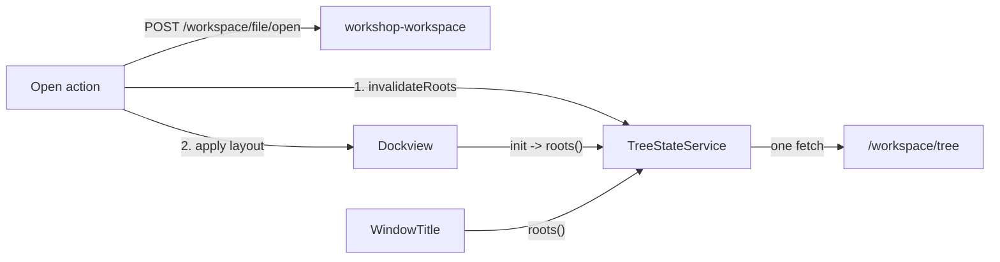

# Workspace Files Debt Removal

<product-contract>

## Product Requirements

- Scope and target work: `promptforge`, baseline `upstream/master` (`09f29994`), endpoint and disposition `HEAD` (`9a5ca202`), 30 commits under `vibe/2026-09-16-1-turso-workspace-files.md` and `vibe/2026-09-16-2-workshop-ui-state.md`. Worktree clean. Two analysis partitions (`upstream/master..a2beaf49`, `a2beaf49..HEAD`), each independently challenged. Operator added two items outside the debt set: the `/workspace/tree` double-fetch at boot (OP-001) and `guide/src/workshop/02-workbench.md` line 37 (OP-002).
- Cleanup goals: no durable-data loss path through Open, Save As, or quit; the `.pfwork` on disk is complete after a graceful quit; every Open Recent row does what its label says; persisted `grants.position` and `added_at` mean what the README says for every producer; the tree never paints a previous workspace's roots after a switch; one roots fetch per boot and per workspace change; contributor rules and the guide describe the shipped behavior.
- Non-goals: no `.pfwork` schema change (`user_version` stays 1); no change to the `recent_files` persisted shape; no change to wire routes or the `workshop_protocol::ErrorEnvelope`; no crash-safety guarantee beyond what a WAL already gives; no repair of files already written with re-encoded positions.
- Success criteria: every check in Testing Plan passes; the manual reproductions in Debt Inventory no longer reproduce; all repository gates pass (`cargo nextest` workspace and workshop variants including `--features headless`, `cargo test --doc`, both `cargo clippy` runs, `cargo fmt --all --check`, `cargo doc -D warnings`, `cargo test -p build-xtask`, `cargo deny check`, `npm run typecheck && npm test` in `crates/workshop-server/ui`, `mdbook build guide`).

### Debt Inventory

Accepted debt added by the target (all present at HEAD):

- **TWF-001** (introduced, high). Opening the workspace file that is already open unlinks the WAL the live database still uses. Evidence: `Workspace::open_file` in [crates/workshop-workspace/src/workspace-backing.rs](crates/workshop-workspace/src/workspace-backing.rs) never compares `path` with the current backing; `swap_backing` closes the previous backing; `close_database` in [crates/workshop-workspace/src/workspace_file-actor.rs](crates/workshop-workspace/src/workspace_file-actor.rs) runs `PRAGMA wal_checkpoint(TRUNCATE)`, drops the connection, then `remove_empty_wal_sidecar` unlinks `<path>-wal` when it is 32 bytes or smaller. turso 0.7.2 keys its process-wide `DATABASE_MANAGER` on OS file identity and shares one WAL handle across connections, so the new actor keeps appending to an unlinked file. Commits `5e5d93a5`, `68ec4922`, `ff020055`. Impact: every write after the reopen is lost at quit (compounded by TWF-002). Reversal cost: small. Target state: opening the current file reloads contents without touching the backing; a regression test covers it.
- **TWF-002** (introduced, medium). No checkpoint at server shutdown. `serve_thread` in [crates/workshop-server/src/serve.rs](crates/workshop-server/src/serve.rs) drains registry tasks then `runtime.shutdown_timeout(RUNTIME_TEARDOWN)`; the workspace backing is never closed, so after every quit the folder holds `Name.pfwork` (stale) beside `Name.pfwork-wal` (every write since the last switch). The guide and README promise "exactly one file" that the user can copy, move, and back up. Commits `5e5d93a5`, `68ec4922`, `1b806a21`, `e70c8659`. Impact: a copy or backup of the main file alone drops every grant, geometry, layout, and closed-editor write. Reversal cost: small. Target state: graceful shutdown closes the backing inside the registry task grace window; docs state that a `-wal` sidecar exists only while the Workshop is running.
- **TWF-003** (introduced, low). Open Recent and Ctrl+P list `.pfwork` paths and dispatch `vscode.open` for them, which always fails (confinement or `binary_file` 415). `announceSwitched` in [crates/workshop-server/ui/src/ui/workspace-files/workspace-files.contribution.ts](crates/workshop-server/ui/src/ui/workspace-files/workspace-files.contribution.ts) adds the path to `RECENT_FILES_STORE`; [crates/workshop-server/ui/src/ui/workspace/open-recent.ts](crates/workshop-server/ui/src/ui/workspace/open-recent.ts) renders every entry as `vscode.open`. Commits `ff020055`, `12a8b074`, `e70c8659` (guide: "a record only"). Reversal cost: small if kind is inferred from the extension; a persisted-shape change otherwise (rejected). Target state: a `.pfwork` row opens that workspace directly.
- **TWF-004** (introduced, low). Save As re-encodes `grants.position` in canonical path order with one shared `added_at`, contradicting the README schema comment ("insertion order") and the guide ("in the order you granted them"). `Workspace::grant_rows` iterates a `BTreeSet<PathBuf>`; `replace_all` discards `position` and `added_at`. Commits `20c9dae0`, `68ec4922`, `e70c8659`. Impact: persisted user files carry false history for the declared future consumer; not recoverable after the fact. Reversal cost: small. Target state: memory keeps each grant's insertion sequence and time; Save As writes them.
- **UM-001** (introduced, low). On Open, the tree paints the previous workspace's roots before the roots cache is invalidated: `applyOpenedWorkspaceState` runs `applyLayoutOrDefault` (re-creates the tree panel, whose `init` calls `loadRoots` and hits the stale `ROOTS_KEY` cache) and `replaceExpanded` (second stale render) before `announceSwitched` dispatches `WORKSPACE_CHANGED_EVENT`, the only caller of `invalidateRoots`. The `rootsGeneration` comment in [crates/workshop-server/ui/src/ui/layout/workshop-panel.ts](crates/workshop-server/ui/src/ui/layout/workshop-panel.ts) and the third block of `test/workshop-panel-restore.mjs` describe the reverse order, which production never runs. Commits `d50a6bb7`, `53bc4659`. Reversal cost: low. Target state: roots are invalidated before the apply; comment and test describe the real sequence; the shipped ordering has a test.
- **UM-002** (introduced, low). [AGENTS.md](AGENTS.md) line 63 routes "account preferences" to a "machine-written TOML config" that has no code, route, or allow-list, while the same work shipped editor toggles and zoom into `ui-state.json`, and says "three named buckets" where two exist. Commit `a2c56dfb`. Target state: the rule names two homes.

Operator-requested items (outside the debt set):

- **OP-001**. `/workspace/tree` is fetched twice at boot and twice per `WORKSPACE_CHANGED_EVENT`: `WorkshopTreePanel.loadRoots` and `WindowTitle.refresh` via `defaultListRoots` in [crates/workshop-server/ui/src/ui/chrome/command-center.ts](crates/workshop-server/ui/src/ui/chrome/command-center.ts) each call `fetchTree(null)` with no shared cache. Pre-existing in part; fixed here because the UM-001 remedy touches the same seam.
- **OP-002**. `guide/src/workshop/02-workbench.md` line 37: "Zoom keeps working even when storage is blocked, such as in private mode" is stale; zoom persists through `/user/state`.

Exposed pre-existing debt, reported separately and excluded from remediation:

- **EX-001**: `recent-files-store.ts` is a kind-less list of path strings. TWF-003 is worked around by extension inference; a typed entry would touch the persisted `recent_files` shape.
- **X-01**: SPA boot tests reach tree-shaken seams by regex-rewriting built bundle chunks (`test/helpers/bundle-seams.mjs`). Predates the target; acceptable until it breaks.
- **C-01**: `TreeStateService.listingCache` keeps the previous workspace's directory listings across Open (`invalidateRoots` drops only `ROOTS_KEY`), so quick-open can offer paths no longer granted; the server refuses them. Pre-existing policy. The UM-001 work item is the natural place to clear the whole cache on Open if the operator expands scope.

Rejected candidates: 32 (residual-but-acceptable 15, weak or speculative 15, false 1, unrelated pre-existing 1 plus C-01). Chief reasons: no demonstrated consequence (turso weight, `Debouncer` generality, duplicated `isRecord`, stringly bucket keys, triple validation); existing test or zone-two posture already covers it (`saved: true` on failed actor write, cache-before-PUT, blocking boot reopen); sidecar-rename residue is vocabulary only; `mousedown.detail` double-click is the upstream-sanctioned pattern.

## Functional Specification

User-visible behavior after the debt is removed. Every workflow below is a fix for a debt ID in the Debt Inventory; nothing else changes.

- Actors and workflows:
  - Open Workspace from File choosing the file that is already open (TWF-001): the Workshop re-reads that file's grants and UI state and applies them; no new file handle is opened, no `-wal` sidecar is removed, and every later grant, geometry, layout, and closed-editor write survives quit and relaunch.
  - Quit with a file-backed workspace open (TWF-002): graceful shutdown folds the write-ahead log into `Name.pfwork` and removes the sidecar, so the folder holds exactly one file at rest. While the Workshop has the file open, `Name.pfwork-wal` may sit beside it; the guide says to quit before copying or backing up.
  - Open Recent and Ctrl+P (TWF-003): an entry ending in `.pfwork` is listed in its own group and, when chosen, opens that workspace directly (no picker), running the same sequence as Open Workspace from File. Text file entries behave as today.
  - Save As (TWF-004): the new file's `grants.position` is the order the folders were granted and each row's `added_at` is the time that grant was made, whether the grants were made in a file-backed or an ephemeral session.
  - Open a second workspace (UM-001): the tree never shows the previous workspace's roots after the server has switched; the new roots are fetched once and rendered once.
  - Boot (OP-001): `/workspace/tree` roots are fetched exactly once; the window title and the tree share that result. Every later `WORKSPACE_CHANGED_EVENT` refetches once.
  - Contributor and user docs (UM-002, OP-002, TWF-002, TWF-003): `AGENTS.md` names two persistence homes; the guide's zoom paragraph no longer mentions blocked browser storage; the workspace-files guide and README describe the sidecar and the working Open Recent rows.
- Inputs and outputs: no wire route, request, or response shape changes. `workbench.action.openWorkspace` accepts an optional path argument in the SPA command registry; without it the picker opens as today.
- States and validation: `Workspace::open_file` on the current backing path is idempotent. `close_backing()` on an ephemeral workspace is a no-op. `TreeStateService.roots()` returns a cached listing, a shared in-flight fetch, or starts one; `invalidateRoots()` discards both.
- Errors and recovery: a failed shutdown close logs at warn and does not delay teardown past the existing grace window. A failed direct open from Open Recent reports the same error toast as Open Workspace from File. A failed roots fetch leaves the fallback title and the tree's error row as today.
- Acceptance criteria: the manual reproductions in Execution Instructions no longer reproduce; every test named in Testing Plan passes; the full gate list passes.

</product-contract>
<implementation-contract>

## Technical Design

- **Same-file reopen (TWF-001)**, `crates/workshop-workspace/src/workspace-backing.rs`: `Workspace::open_file` canonicalizes `path` (via `workshop_support` path helpers if present, else `std::fs::canonicalize`) and compares with the current backing's canonical path. On a match it calls `contents()` on the existing `WorkspaceFile`, runs `replace_all` and re-seeds `ui_state`, and returns without opening a second handle or calling `swap_backing`. No change to `close_database`; the sidecar removal stays correct once no second opener exists. Document the turso process-wide registry hazard in a comment beside the guard.
- **Shutdown close (TWF-002)**: `Workspace::close_backing()` becomes a production method (rename or wrap `close_backing_for_test`); it takes the current backing, awaits `WorkspaceFile::close()`, and leaves the workspace ephemeral. `workshop_workspace::register` additionally registers one `BackgroundTaskAdapter` whose `spawn` returns a `ShutdownHandle::new(move || workspace.close_backing())` (the actor already runs; the adapter supplies only the shutdown lever, mirroring how `workshop-status` and `workshop-gateway` register tasks in their `handles.rs`). `serve_thread` already awaits every registry task's `shutdown()` before `shutdown_timeout`, so no change to `serve.rs`. Bound the close with the existing grace window; a timed-out close logs at warn.
- **Grant order in memory (TWF-004)**, `crates/workshop-workspace/src/workspace-backing.rs` and `workspace.rs`: the granted set gains per-grant metadata (`position: i64`, `added_at: String`) kept beside the `BTreeSet<PathBuf>` (a `BTreeMap<PathBuf, GrantMeta>` or the set replaced by the map; `granted_roots()` keeps returning canonical order for the tree). `replace_all` stores each row's `position` and `added_at`; `grant()` on an ephemeral workspace assigns `position = max + 1` and `now_rfc3339()`; `grant_rows()` emits rows sorted by `position` with their own `added_at`. `WorkspaceFile::create` already trusts caller order, so Save As now carries true history; Duplicate is unchanged.
- **Open Recent workspace rows (TWF-003)**, SPA: `workbench.action.openWorkspace` accepts an optional path argument; when present it skips the picker and runs the existing open sequence (`openWorkspaceFile`, `applyOpenedWorkspaceState`, `announceSwitched`). `open-recent.ts` renders entries ending in `.pfwork` as `{ command: "workbench.action.openWorkspace", args: [path] }` in their own group (`1_workspaces`), and the quick-access provider dispatches the same for those entries. Kind is inferred from the extension at render time; the `recent_files` shape is unchanged.
- **Single roots load (UM-001, OP-001)**, `crates/workshop-server/ui/src/services/tree-state-service.ts`: `roots(fetch = fetchTree): Promise<TreeListing>` returns the cached `ROOTS_KEY` listing, else a memoized in-flight promise that caches on success and clears the in-flight slot on settle; `invalidateRoots()` also clears the in-flight slot so a load started before invalidation is not reused (this subsumes `rootsGeneration`, which is removed with its comment). `WorkshopTreePanel.loadRoots` and `WindowTitle`'s default `listRoots` both call `getService(TREE_STATE).roots()`. `applyOpenedWorkspaceState` calls `tree.invalidateRoots()` as its first statement inside `suppressWrites`, so the re-created panel's first `loadRoots` fetches the new roots; `announceSwitched` still dispatches `WORKSPACE_CHANGED_EVENT` for the other listeners, and its `onWorkspaceChanged` invalidation finds nothing stale and the memoized promise serves the title's refresh.
- **Docs (UM-002, OP-002, TWF-002, TWF-003)**: `AGENTS.md` line 63 names two homes (user bucket `ui-state.json` via `/user/state`, workspace bucket `.pfwork` via `/workspace/file/state`) and drops the TOML clause; `guide/src/workshop/02-workbench.md` line 37 says zoom keeps working when the saved value cannot be read or written, only persistence is skipped; `guide/src/workshop/workspace-files.md` and `crates/workshop-workspace/README.md` state that a `Name.pfwork-wal` sidecar sits beside the file while the Workshop has it open and is folded in at quit (copy or back up after quitting), and drop "a record only" for Open Recent.

</implementation-contract>
<verification-contract>

## Testing Plan

- **TWF-001** (`crates/workshop-workspace/src/workspace-tests-backing.rs` or new `workspace-tests-reopen.rs`): open a file, grant a root, `open_file` the same path (and a differently spelled path to the same file), grant a second root, drop the workspace without `close`, assert the `-wal` still exists and reopening from disk shows both grants; a second test asserts `open_file` on the same path does not create a new actor (observable via a counter on the test fixture or the file's `Contents` token).
- **TWF-002** (`crates/workshop-server/tests/it/`, new `workspace_shutdown.rs`): build an app on a temp `state_dir`, Save As into a temp folder, grant a root, shut the app down gracefully, list the folder: exactly one file, and a fresh open shows the grant. Unit test in `workshop-workspace`: `close_backing()` on an ephemeral workspace is a no-op that returns `Ok`.
- **TWF-003** (`test/open-recent.mjs`, `test/workspace-files.mjs`): a `.pfwork` entry renders in `1_workspaces` with `workbench.action.openWorkspace` and the path arg; a text path still renders `vscode.open`; `workbench.action.openWorkspace` with a path arg posts to `/workspace/file/open` without invoking the picker; the quick-access provider dispatches the workspace command for `.pfwork` hits.
- **TWF-004** (`crates/workshop-workspace/src/workspace-tests-backing.rs`): on a file-backed workspace grant `z` then `a`, Save As, open the new file: positions are `z=0`, `a=1` with two distinct `added_at`; on an ephemeral workspace grant `z` then `a`, Save As: same ordering; `replace_all` from a file preserves stored positions and times through a subsequent Save As.
- **UM-001, OP-001** (`test/workshop-panel-restore.mjs`, `test/workspace-switch.mjs`, `test/boot-ui-storage.mjs`, `test/command-center.mjs`): the boot fetch log contains exactly one `GET /workspace/tree` with `path=null` before the dock renders; after a mocked Open, no render of the previous roots occurs once `/workspace/file/open` resolves and the roots are fetched exactly once; two concurrent `roots()` calls share one fetch; `invalidateRoots()` during an in-flight load causes the next call to fetch again; the restore test's third block is retargeted to the real sequence (invalidate, apply layout, `replaceExpanded`, event) and asserts one fetch and one copy of each root; `WindowTitle` with the default `listRoots` reads the shared cache (no second fetch).
- **UM-002, OP-002** (SPA test suite, new assertions in an existing docs guard or a small `test/docs-claims.mjs`): `rg -n "TOML config" AGENTS.md` is empty; `rg -n "storage is blocked" guide/src` is empty; `mdbook build guide` passes.
- **Regression**: every existing `workshop-workspace` test (119 at HEAD), the confinement suite, and the SPA suite (125 at HEAD) pass unchanged except where retargeted above.
- **Exit**: the full gate list in Product Requirements.

</verification-contract>
<decision-record>

## Decision Record

- Reversible decisions:
  - Same-file reopen reloads contents rather than refusing (TWF-001): a refusal would surface a confusing error for a harmless action; reload matches Open's "replace grants wholesale" contract. Consequence: a same-file Open re-reads the file's grants and ui-state, which is idempotent.
  - Shutdown close registers through `BackgroundTaskAdapter` instead of an explicit call in `serve.rs` (TWF-002): keeps the composition root free of subsystem shutdown logic and reuses the existing grace-window loop. Consequence: the adapter's `spawn` spawns nothing, which the comment must say.
  - No per-write checkpoint (TWF-002): a WAL between quits is ordinary database behavior; the contract fixed is "complete file after quit", not "complete file at every instant". Docs say so. Consequence: a crash still leaves a sidecar, which turso replays on the next open.
  - Grant order kept in memory (TWF-004) rather than carrying the previous file's rows through Save As: the latter leaves ephemeral-then-Save-As files with fabricated order. Consequence: `Workspace` holds one more field per grant; `granted_roots()` still returns canonical order for display.
  - Kind by extension (TWF-003) instead of a typed recents entry: avoids a persisted-shape change on `recent_files`. Consequence: a `.pfwork` opened as a text file (never today) would be misclassified; acceptable.
  - Memoized `roots()` on `TreeStateService` replaces `rootsGeneration` (UM-001, OP-001): a single in-flight promise plus invalidation covers the overlap the counter guarded and the double-fetch. Consequence: `WindowTitle` now depends on `TREE_STATE`; `ui/chrome` importing `services` is the allowed direction.
  - Invalidate before apply rather than reorder `announceSwitched` ahead of the apply (UM-001): the event has five other dispatchers and two listeners that must see the final stores; moving it would change what `command-center` and the panel observe.
- User-resolved architecture choices: none required. No change touches a public interface, persisted or wire format, component ownership, dependency direction, or trust boundary.
- Rejected alternatives: pinning `remove_empty_wal_sidecar` to a sole-opener check (needs engine introspection turso does not expose); documenting the two `position` producers instead of fixing them (leaves false history in user files); a `Recent Workspaces` submenu (more surface than the defect warrants); clearing the whole `listingCache` on Open (C-01, pre-existing; offered as an opt-in).
- Assumptions and risks: the TWF-001 consequence chain is derived from turso 0.7.2 registry sources, not observed; the regression test is the confirmation. The TWF-002 shutdown race is characterized from tokio semantics; the integration test settles it. `dock.fromJSON` re-creates panel content synchronously (documented in `layout-boot.ts`); the switch test relies on it.

</decision-record>
<project-survey>

## Project Survey

- Status: complete
- Build command: `cargo build` (default-members builds only `gateway`); desktop app is `cargo build -p workshop`; SPA bundle is `npm run build` in `crates/workshop-server/ui` (esbuild via `build.mjs`); `cargo workshop` and `cargo xtask` aliases run `build-workshop` and `build-xtask`.
- Focused test command pattern: `cargo nextest run --locked -p <crate> <test_name_filter>` (e.g. `cargo nextest run --locked -p workshop-workspace open_file`); single SPA test file: `node --test test/<name>.mjs` in `crates/workshop-server/ui`.
- Component test command pattern: `cargo nextest run --locked -p <crate>` (add `--features headless` for the `workshop-server` headless variant, `--test it` to target a crate's integration binary); SPA: `npm test` in `crates/workshop-server/ui` (runs `test/**/*.mjs` and `src/**/*.test.mjs` under `node --test`, jsdom available).
- Full-suite test command: `cargo nextest run --locked --workspace --exclude workshop --exclude workshop-server --exclude workshop-server-api --all-features`, then `cargo test --workspace --exclude workshop --exclude workshop-server --exclude workshop-server-api --all-features --doc`; workshop crates separately: `cargo nextest run --locked -p workshop -p workshop-server -p workshop-server-api`, `cargo nextest run --locked -p workshop-server --features headless`, `cargo test --doc -p workshop -p workshop-server -p workshop-server-api`; structural harness `cargo test -p build-xtask`; SPA `npm run typecheck && npm test` in `crates/workshop-server/ui`; `cargo deny check`. Nextest config in `.config/nextest.toml` (60s slow timeout, `heavy` group for tool-picker and STT crates). SPA builds need `npm ci` in `crates/workshop-server/ui` and `crates/gateway-config-ui/ui` first.
- Linter command: `cargo clippy --workspace --exclude workshop --exclude workshop-server --exclude workshop-server-api --all-targets --all-features -- -D warnings`; workshop: `cargo clippy -p workshop -p workshop-server -p workshop-server-api --all-targets -- -D warnings`; pre-push hook also runs `cargo check -p gateway --no-default-features`. Workspace lints: `unsafe_code = forbid`, `unwrap_used`/`expect_used` deny, `missing_docs`/`unreachable_pub` warn, clippy `all` deny and `pedantic` warn. SPA: `npm run typecheck` (`tsc --noEmit`).
- Formatter check command: `cargo fmt --all --check` (also the pre-commit hook). No JS formatter configured.
- Docs command: `RUSTDOCFLAGS="-D warnings" cargo doc --workspace --no-deps --all-features --exclude workshop --exclude workshop-server --exclude workshop-server-api`; user guide `mdbook build guide` (`guide/book.toml`, sources in `guide/src`).
- Test placement and naming conventions: Rust unit tests live in kebab sibling files next to the module, wired with `#[cfg(test)] #[path = "foo-tests.rs"] mod tests;` (e.g. `workspace.rs` -> `workspace-tests.rs`, `workspace-tests-backing.rs`, `handlers-file-tests.rs`); crate integration tests live in `tests/it/main.rs` (one `it` binary per crate, e.g. `workshop-workspace/tests/it`, `gateway/tests/it`); benches under `benches/` (promptforge-api, promptforge-lua). SPA tests are `.mjs` files in `crates/workshop-server/ui/test/` named after the unit under test (`workshop-panel-restore.mjs`, `command-center.mjs`), with shared helpers in `test/helpers/` (bundle seams via regex-rewritten built chunks); colocated `src/**/*.test.mjs` also runs. Behavior changes ship with tests in the same change; structural checks require explicit user approval.
- Directory map: `crates/` holds all 47 workspace members (`build-*` output builders incl. `build-xtask` structural harness and `build-ui` esbuild driver; `gateway*` inference gateway, config, local models, STT, routing, web search; `promptforge-*` executor family with `promptforge-api` as the single public door; `shared-*` cross-product substrate incl. `shared-vfs`, `shared-progress`, `shared-gateway-discovery`; `workshop*` Tauri shell, `workshop-server` in-process server with the TypeScript SPA under `crates/workshop-server/ui/` (`src/base`, `src/services`, `src/tokens`, `src/ui/<feature>/`, `test/`), `workshop-workspace` for `.pfwork` Turso workspace files, `workshop-user-state` for `ui-state.json`, plus sessions, registry, protocol, menu, status, support, gateway adapter); `crates/shared-ui` is a non-Rust TS+CSS package excluded from the Cargo glob. `guide/` is the mdbook user guide; `prompts/` example prompt files; `tools/` Node staging and TTS scripts; `vibe/` dated plan documents and `archdoc.md`; `.githooks/` pre-commit (fmt) and pre-push (check, clippy, deny); `.github/workflows/ci.yml` is the gate source of truth; `.cargo/config.toml` aliases and static CRT on Windows; `deny.toml`, `clippy.toml`, `rustfmt.toml`, `rust-toolchain.toml` at root; `target/`, `target-msrv/`, `local/` are build and local artifacts.
- Component boundaries: dependency direction is shell -> features -> services -> vocabulary. `workshop-*` must not depend on `gateway-*`; `gateway-*` must not depend on `promptforge-*` or `workshop-*`; `promptforge-*` must not depend on `gateway-*` or `workshop-*`; crates outside `promptforge-*` depend only on `promptforge-api`; the `workshop` shell depends on `workshop-server-api` never `workshop-server`; `shared-*` depends on no product crate. Rules bind normal, dev, build, and target deps and are enforced by `cargo test -p build-xtask`. Per archdoc: executor -> gateway, store, Lua VM boundary, shared substrate; gateway -> shared substrate; CLI -> executor, gateway, store, shared; workshop UI -> executor, gateway, store, shared (persists user UI state via `workshop-user-state`, workspace UI state via `.pfwork`); store -> VFS layer (`shared-vfs` + `promptforge-vfs` policy gate); Lua VM boundary -> gateway, store, shared. SPA: `ui` -> `services` -> `base`, `main.ts` is the composition root; lazy-loaded panels never import the boot shell.
- Conventions summary: Rust edition 2024, resolver 3, workspace version 0.3.0 (workshop-* internal crates 0.0.0), BSL-1.0. No file over 500 lines (split first). Source directories flat by default; a subdirectory needs three or more files, otherwise kebab siblings with `#[path]` attributes (`workspace-backing.rs`, `workspace_file-actor.rs`). Every `workshop-*` lib.rs opens with a `//!` doc carrying `## Invariants`; SPA concern directories carry the same in `index.ts`. Comments explain non-obvious constraints and cite upstream issue URLs for workarounds. Error messages are model-consumable: concise, required vs actual. Long-running work reports via `shared-progress`. Cargo features gate real constraints only. Runtime paths never compile native deps or install process-global state. SPA: no `localStorage` (all persistence via `ui-storage` adapter to server; two homes are `ui-state.json` via `/user/state` and the `.pfwork` file via `/workspace/file/state`, each an allow-listed key added server-side first); CSS beside its TS using `--ws-*` tokens only; VS Code command ids and context keys verbatim; `registerAction` in eager `ui/<feature>/<feature>.contribution.ts` with lazy-imported heavy chunks; state in services with change emitters, not module globals. Pinned turso `=0.7.2` with default features off.

</project-survey>
<execution-plan>

## Execution Instructions

Three components in dependency order. `workshop-workspace` goes first: its two work items share `workspace-backing.rs` and the docs describe its shutdown behavior. The SPA goes second: it is independent of the crate but the docs also describe its Open Recent rows. Docs and gates go last because they state what the first two shipped. Every step lands as one commit holding its code and its tests; each component's steps are contiguous.

<step-1>

### Step 1: Same-file reopen guard in `Workspace::open_file` (TWF-001) [completed]

- Component: `workshop-workspace`
- Piece: WAL safety (sequential with Step 2; both edit `workspace-backing.rs`, and Step 2 reuses the reload path this step introduces)
- Debt: TWF-001

Change `Workspace::open_file` in `crates/workshop-workspace/src/workspace-backing.rs` to canonicalize `path` (via the `workshop_support` path helpers if one exists, else `std::fs::canonicalize`) and compare it with the current backing's canonical path taken from `backing_parts()`. On a match: call `contents()` on the existing `WorkspaceFile`, run `replace_all(contents.grants)`, replace the backing's `ui_state` map in place under the write lock, call `remember(path)`, and return `Ok(())` without `WorkspaceFile::open` or `swap_backing`. On a mismatch: the existing sequence. Add a comment beside the guard naming the turso 0.7.2 process-wide `DATABASE_MANAGER` keyed on OS file identity and the shared WAL handle, so a reader knows why a second opener of the same file must never exist. Add a private `reload_current(&self, file, path)` helper if the branch pushes the file past 500 lines, or split a `workspace-reopen.rs` sibling wired with `#[path]`.

Tests, in a new `crates/workshop-workspace/src/workspace-tests-reopen.rs` wired from `workspace.rs` with `#[cfg(test)] #[path = "workspace-tests-reopen.rs"] mod tests_reopen;`:

- `reopening_the_current_file_keeps_the_wal_and_later_grants`: Save As into a temp dir, grant root one, `open_file` the same path, then `open_file` a differently spelled path to the same file (a `.` segment or different case on Windows), grant root two, drop the `Workspace` without `close_backing_for_test`, assert `<path>-wal` exists, open the file from disk with `WorkspaceFile::open` and assert both grants are present.
- `reopening_the_current_file_starts_no_second_actor`: assert the backing's `WorkspaceFile` is the same handle before and after (compare `Arc` pointers via a `ptr_eq` helper exposed under `cfg(test)`, or a `#[cfg(test)]` open counter on `WorkspaceFile::open`).
- `reopening_the_current_file_reapplies_its_grants`: revoke a grant in memory only through a direct `revoke` (not `revoke_and_persist`), `open_file` the same path, assert the grant is back.

Verify: `cargo nextest run --locked -p workshop-workspace`, `cargo clippy -p workshop-workspace --all-targets -- -D warnings`, `cargo fmt --all --check`. Existing 119 tests unchanged.

</step-1>

<step-2>

### Step 2: Graceful shutdown closes the backing (TWF-002) [completed]

- Component: `workshop-workspace`
- Piece: WAL safety (second of two)
- Debt: TWF-002

In `crates/workshop-workspace/src/workspace-backing.rs`: rename `close_backing_for_test` to a production `pub async fn close_backing(&self)` that takes the current backing out of `self.backing` under the write lock (leaving the workspace ephemeral, `None`), awaits `WorkspaceFile::close()`, and returns; on an ephemeral workspace it returns without work. Keep a `#[cfg(any(test, feature = "test-fixtures"))] pub async fn close_backing_for_test(&self)` shim that calls `close_backing()` so the fourteen existing call sites compile unchanged, or update the call sites and drop the shim. Doc comment states the shutdown contract: the file on disk is complete and the `-wal` sidecar is gone after the call.

In `crates/workshop-workspace/src/handles.rs`: add `pub fn register_tasks(registry: &Registry, workspace: &Workspace) -> Registration` that calls `registry.register_task(Arc::new(BackgroundTaskAdapter::new({ let workspace = workspace.clone(); move || { let workspace = workspace.clone(); ShutdownHandle::new(move || async move { workspace.close_backing().await }) } })))`, mirroring `crates/workshop-status/src/handles.rs` and `crates/workshop-gateway/src/handles.rs`. The comment on the adapter says the actor already runs and `spawn` spawns nothing; the adapter exists only to hand the registry a shutdown lever (per the Decision Record). Re-export from `crates/workshop-workspace/src/lib.rs`. Add no timeout of its own: `serve_thread` already arms a watchdog with `SHUTDOWN_GRACE` around the whole `task.shutdown().await` drain (`crates/workshop-server/src/serve.rs` lines 285-296), so the close is bounded by the shell; a close that returns an error logs at `warn`. In `crates/workshop-server/src/app.rs`, next to the `workshop_status::register_tasks` hold at line 371, add `registrations.hold(workshop_workspace::register_tasks(&registry, &workspace))`. No change to `serve.rs`.

Tests:

- Unit, in `workspace-tests-backing.rs`: `close_backing_on_an_ephemeral_workspace_is_a_no_op` (call twice; `current().path` stays `None`; no panic). `close_backing_leaves_one_file_and_no_sidecar`: Save As, grant, `close_backing`, assert the folder has exactly one entry and `WorkspaceFile::open` shows the grant.
- Integration, new `crates/workshop-server/tests/it/workspace_shutdown.rs` with `mod workspace_shutdown;` added to `tests/it/main.rs`: using `common::TestServer` and `spawn_gateway`, spawn a server on a temp `state_dir`, `POST /workspace/file/save-as` into a temp folder, `POST /workspace/grant` a temp root, call `ServerHandle::shutdown` (through `TestServer::shutdown_keeping_state_dir`), list the folder and assert exactly one file named `Name.pfwork`, then `TestServer::spawn_in` on the same `state_dir` and assert `GET /workspace/file` shows the grant (the last-workspace pointer reopens it).

Verify: `cargo nextest run --locked -p workshop-workspace`, `cargo nextest run --locked -p workshop-server --test it -E 'test(workspace_shutdown)'`, `cargo nextest run --locked -p workshop-server --features headless`, `cargo clippy -p workshop -p workshop-server -p workshop-server-api --all-targets -- -D warnings`, `cargo test -p build-xtask` (the new `workshop-server -> workshop-workspace` call is an existing dependency direction).

</step-2>

<step-3>

### Step 3: Grant order and time kept in memory (TWF-004)

- Component: `workshop-workspace`
- Piece: grant metadata (one step; sequential after Step 2 because it edits the same `workspace-backing.rs` and `workspace.rs`)
- Debt: TWF-004

In `crates/workshop-workspace/src/workspace.rs`: add `pub(crate) struct GrantMeta { position: u32, added_at: String }` and change `grants: Arc<RwLock<BTreeSet<PathBuf>>>` to `Arc<RwLock<BTreeMap<PathBuf, GrantMeta>>>`. `grant()` inserts with `position = max existing + 1` (or `0` when empty) and `added_at = now_rfc3339()`, leaving an already-granted path's meta untouched; `revoke()` removes the entry; `granted_roots()` keeps returning the map's keys in canonical order so the tree, confinement checks, and `WorkspaceRootsAdapter` see no change. `position` stays `u32` to match `GrantRow`.

In `workspace-backing.rs`: `replace_all` stores each row's `position` and `added_at` in the map; `grant_rows()` collects `(path, meta)` pairs, sorts by `position`, and emits `GrantRow { path, position, added_at }` with each grant's own time, dropping the shared `now_rfc3339()` stamp and the "memory keeps no grant times" doc sentence. `grant_and_persist` passes the assigned meta into the `GrantRow` it sends to `add_grant` (the file still assigns the stored position on insert; the in-memory position is what Save As writes). `Workspace::current` and `WorkspaceSummary` are unchanged. `WorkspaceFile::create` already trusts caller order, so Save As now writes true history; Duplicate is unchanged.

Tests, in `workspace-tests-backing.rs` (split a `workspace-tests-grants.rs` sibling if the file passes 500 lines):

- `save_as_from_a_file_backed_workspace_keeps_grant_order_and_times`: Save As, grant `z` then `a` (with a short sleep or an injected clock so the two `added_at` differ), Save As to a second path, `WorkspaceFile::open` it: `z` at position 0, `a` at position 1, two distinct `added_at`.
- `save_as_from_an_ephemeral_workspace_keeps_grant_order_and_times`: same on `Workspace::new()`.
- `replace_all_preserves_stored_positions_through_save_as`: build a file with rows `(b, 5, t1)`, `(a, 7, t2)`, `open_file` it, Save As, open the copy: `b` before `a` with `t1`, `t2` intact.

Verify: `cargo nextest run --locked -p workshop-workspace` (including the confinement suite unchanged), `cargo clippy -p workshop-workspace --all-targets -- -D warnings`, `cargo fmt --all --check`, `RUSTDOCFLAGS="-D warnings" cargo doc -p workshop-workspace --no-deps`.

</step-3>

<step-4>

### Step 4: Open Recent and Ctrl+P open `.pfwork` entries directly (TWF-003)

- Component: `workshop-server/ui` SPA
- Piece: Open Recent workspace rows (one step; lands before Steps 5 and 6 because those also edit `workspace-files.contribution.ts`)
- Debt: TWF-003

In `crates/workshop-server/ui/src/ui/workspace-files/workspace-files.contribution.ts`: change `openWorkspaceFromFile` to `openWorkspaceFromFile(path?: unknown)`; when `typeof path === "string"` skip the Tauri picker and run `openWorkspaceFile(path)`, `applyOpenedWorkspaceState()`, `announceSwitched(path)` with the same error toast on failure; otherwise the picker flow as today. The `workbench.action.openWorkspace` `addAction` keeps its id, title, and menu placement.

In `crates/workshop-server/ui/src/ui/workspace/open-recent.ts`: add `isWorkspaceFilePath(path: string): boolean` (case-insensitive `.pfwork` suffix); in the menu builder, entries matching it render as `{ command: "workbench.action.openWorkspace", args: [path], title: baseName(path), group: "1_workspaces", order }` and stay out of `3_files`; the quick-access provider's accept dispatches `commands.execute("workbench.action.openWorkspace", path)` for those hits and `vscode.open` otherwise, with `reportCommandFailure` naming the command run. Update the header comment that describes the three groups. `recent-files-store.ts` is untouched (kind is inferred at render time; EX-001 stays excluded).

Tests:

- `test/open-recent.mjs` (new, beside `test/recent-files-store.mjs`, using the same jsdom and service-registry helpers `test/quick-access.mjs` uses): a `.pfwork` entry renders in `1_workspaces` with `workbench.action.openWorkspace` and the path arg; a `.md` entry still renders `vscode.open` in `3_files`; the quick-access provider dispatches the workspace command for a `.pfwork` hit and `vscode.open` for a text hit.
- `test/workspace-files.mjs`: `workbench.action.openWorkspace` run with a path arg posts to `/workspace/file/open` with that path and never imports the dialog plugin (stub `openWorkspaceFile` and assert the picker stub is not called); run without an arg still reaches the picker.

Verify: `node --test test/open-recent.mjs`, `node --test test/workspace-files.mjs`, `node --test test/quick-access.mjs`, `npm run typecheck` in `crates/workshop-server/ui`.

</step-4>

<step-5>

### Step 5: One shared roots load on `TreeStateService` (OP-001)

- Component: `workshop-server/ui` SPA
- Piece: single roots load (sequential: Step 6 relies on the invalidation semantics introduced here)
- Debt: OP-001 (and the fetch-sharing half of UM-001)

In `crates/workshop-server/ui/src/services/tree-state-service.ts`: add `private rootsInFlight: Promise<TreeListing> | null = null` and `roots(fetch: (path: null) => Promise<TreeListing> = fetchTree): Promise<TreeListing>` that returns `Promise.resolve(this.listing(ROOTS_KEY))` when cached, else the existing in-flight promise, else starts `fetch(null)`, stores it in `rootsInFlight`, caches under `ROOTS_KEY` on success only if that promise is still the in-flight one, and clears the slot on settle. `invalidateRoots()` deletes `ROOTS_KEY` and sets `rootsInFlight = null`, so a load started before the invalidation neither caches nor is handed to later callers. Update the class doc comment near line 71.

In `crates/workshop-server/ui/src/ui/layout/workshop-panel.ts`: `loadRoots` becomes `const listing = await this.state.roots(); this.render(listing)` (keeping the error row path); remove `rootsGeneration`, its comment at lines 49-54, and the two generation checks. In `crates/workshop-server/ui/src/ui/chrome/command-center.ts`: `defaultListRoots` becomes `async () => (await getService(TREE_STATE).roots()).entries`; the `ListRoots` injection point for tests stays. `ui/chrome` importing `services` is the allowed direction.

Tests:

- `test/tree-state-service.mjs`: two concurrent `roots()` calls share one fetch (counter on an injected fetch); a cached listing answers without a fetch; `invalidateRoots()` during an in-flight load makes the next `roots()` fetch again and the stale load does not populate the cache; a rejected fetch clears the slot so the next call retries.
- `test/command-center.mjs`: `WindowTitle` with the default `listRoots` reads a listing already cached on `TREE_STATE` and issues no fetch.
- `test/boot-ui-storage.mjs`: the boot fetch log contains exactly one `GET /workspace/tree` with `path=null` before the dock renders (extend the existing fetch recorder; `npm run build` first because this suite reads built chunks through `test/helpers/bundle-seams.mjs`).

Verify: `node --test test/tree-state-service.mjs`, `node --test test/command-center.mjs`, `npm run build && node --test test/boot-ui-storage.mjs`, `node --test test/workshop-panel-restore.mjs` (still passing on the old ordering until Step 6 retargets it), `npm run typecheck`.

</step-5>

<step-6>

### Step 6: Invalidate roots before applying an opened workspace (UM-001)

- Component: `workshop-server/ui` SPA
- Piece: single roots load (second of two)
- Debt: UM-001

In `crates/workshop-server/ui/src/ui/workspace-files/workspace-files.contribution.ts`: inside `applyOpenedWorkspaceState`, make `tree.invalidateRoots()` the first statement inside the `storage.suppressWrites` callback, before `applyLayoutOrDefault`, so the re-created tree panel's `init` calls `roots()` on an empty cache and fetches the new workspace's roots once; `replaceExpanded` then renders those roots. `announceSwitched` keeps dispatching `WORKSPACE_CHANGED_EVENT` for `command-center` and the panel's `onWorkspaceChanged`; that second `invalidateRoots` finds a fresh cache or an in-flight load for the same workspace, and `WindowTitle.refresh` is served by the memoized promise, so the switch fetches once. Update the doc comment on `applyOpenedWorkspaceState` and the `announceSwitched` comment ("the tree invalidation" is no longer its job).

Tests:

- `test/workshop-panel-restore.mjs`: retarget the third block from the reversed order it describes today to the real sequence (invalidate, apply layout, `replaceExpanded`, event) and assert one fetch and one copy of each root in the rendered tree.
- `test/workspace-switch.mjs`: after a mocked `POST /workspace/file/open` resolves, no render containing the previous workspace's roots occurs, and `GET /workspace/tree?path=null` is fetched exactly once for the switch (count across the panel and the title).

Verify: `node --test test/workshop-panel-restore.mjs`, `node --test test/workspace-switch.mjs`, `node --test test/workspace-files.mjs`, `npm run typecheck && npm test` in `crates/workshop-server/ui` (125 tests at HEAD plus those added in Steps 4 to 6).

</step-6>

<step-7>

### Step 7: Docs describe the shipped behavior; exit gates and manual reproductions (UM-002, OP-002, TWF-002, TWF-003)

- Component: docs and gates
- Piece: documentation and exit (one step; depends on Steps 1 to 6 having landed)
- Debt: UM-002, OP-002, and the doc halves of TWF-002 and TWF-003; then verification of all of the above

Edits:

- `AGENTS.md` line 63: two homes by scope, account state to `ui-state.json` in the state directory (`workshop-user-state`, `/user/state`) and workspace-scoped state to the `.pfwork` file (`/workspace/file/state`); drop the TOML clause and "three".
- `guide/src/workshop/02-workbench.md` line 37: replace the "storage is blocked, such as in private mode" sentence with: zoom keeps working when the saved value cannot be read or written; only the persistence is skipped.
- `guide/src/workshop/workspace-files.md`: after line 31, a paragraph stating that while the Workshop has the file open a `Name.pfwork-wal` sidecar may sit beside it and is folded into the file when you quit, so copy or back up after quitting; rewrite line 53 so a workspace entry under Open Recent opens that workspace directly, and remove "a record only".
- `crates/workshop-workspace/README.md` near line 13: the same sidecar note in contributor terms (WAL folded in by `close_backing` at graceful shutdown; a crash leaves a sidecar turso replays on the next open) and the `grants.position`/`added_at` schema comment confirmed as insertion order from both producers.
- Run `cargo run -p build-user-guide` so the tracked export `guide/promptforge-workshop-guide.md` (line 144 carries the same stale zoom sentence) and any `index.md` files regenerate from `guide/src`.

Tests: new `crates/workshop-server/ui/test/docs-claims.mjs` that reads the repository files with `node:fs` and asserts `AGENTS.md` does not contain `TOML config` or `three named buckets`, and no file under `guide/src` contains `storage is blocked` or `a record only`; `mdbook build guide` passes.

Verify: `node --test test/docs-claims.mjs`, `mdbook build guide`, `git diff --exit-code -- guide/promptforge-workshop-guide.md` after the regeneration is committed (the export must match `guide/src`).

Exit gates, run after the docs edits in the same step. Run the full gate list from Product Requirements in the repository root: `cargo nextest run --locked --workspace --exclude workshop --exclude workshop-server --exclude workshop-server-api --all-features`; `cargo test --workspace --exclude workshop --exclude workshop-server --exclude workshop-server-api --all-features --doc`; `cargo nextest run --locked -p workshop -p workshop-server -p workshop-server-api`; `cargo nextest run --locked -p workshop-server --features headless`; `cargo test --doc -p workshop -p workshop-server -p workshop-server-api`; both `cargo clippy` invocations from Project Survey with `-D warnings`; `cargo fmt --all --check`; `RUSTDOCFLAGS="-D warnings" cargo doc --workspace --no-deps --all-features --exclude workshop --exclude workshop-server --exclude workshop-server-api`; `cargo test -p build-xtask`; `cargo deny check`; `npm run typecheck && npm test` in `crates/workshop-server/ui`; `mdbook build guide`.

Manual reproductions in the built `workshop` app (`cargo build -p workshop`), each of which must no longer reproduce: Save As, Open Workspace from File choosing the same file, grant a folder, quit, relaunch: the grant is present. Save As, grant, quit, list the folder: exactly one file. Open Recent workspace row: the workspace opens with no picker. Open a second workspace and watch the tree: no flash of the old roots. Boot with the network log open: one `/workspace/tree` request.

Fixes surfaced by the gates or the reproductions land in this step's commit, each with its regression test. The manual reproductions need the desktop shell and are left to the operator when no display is available.

</step-7>

Explicit exclusions, unchanged from the Debt Inventory: EX-001 (typed recents entries), X-01 (bundle seam rewriting in `test/helpers/bundle-seams.mjs`), C-01 (directory listing cache on Open) unless the operator expands scope; no `.pfwork` schema change (`user_version` stays 1); no per-write checkpoint; no change to `serve.rs`; no change to wire routes or `workshop_protocol::ErrorEnvelope`.

</execution-plan>
