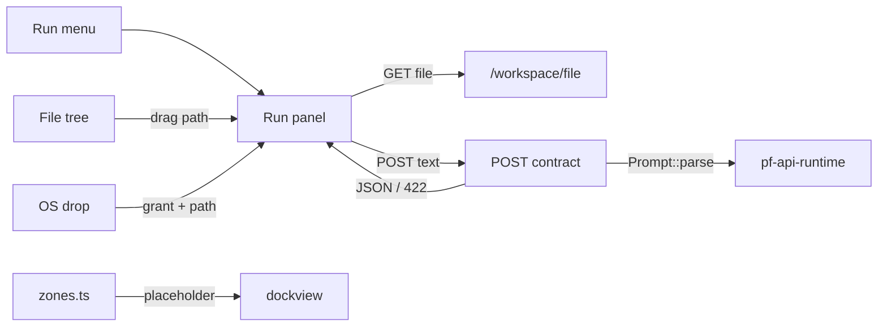

# Minimal Run Window

<product-contract>

## Product Requirements

The Workshop can open and edit PromptForge prompts but has no way to express "run this": no Run window exists in any form. This plan delivers the window alone - empty or pre-filled, parsing the chosen prompt into contract rows - plus a zone-stability fix that stops the dock from resizing itself when a zone's last panel closes, in-session and across relaunch. Executing runs, run identity, drafts, and artifact addressing are later work; the user's instruction was "Just the bare minimum."

- Problem and users: A Workshop user with a prompt file open cannot reach a run form at all; the only path to one is the unimplemented full Run-window plan. Separately, closing the last editor document destroys the document zone's dock group, forcing the workspace and agent zones to resize - the user's words: "incredibly irritating." Users are the Workshop's operators (today the PromptForge maintainers).
- Goals:
  - A Run menu item opens a Run window; with no prompt editor focused the window is empty (a prompt picker control, and dropping a prompt file onto it works); with a prompt editor focused the window opens filled with that editor's file and parses it. The user's two behaviors, verbatim: "pressing Run menu item with no promptforge prompt in focus brings up an empty Run window (just a control to select the prompt, and dragging should work)" and "pressing Run menu item with a promptforge prompt window in focus will bring up the Run window, fill in the prompt field, and parse the prompt."
  - A parsed prompt renders one row per declared contract item (input, output, each arg, each capability, each tool slot, each model role, the tool-iteration cap) and a Run button; the user's standing words on the form: "let's keep the UI simple, one row for each thing."
  - While a window is loading, its panel tab title carries an animated shimmer (muted gray text with a light highlight sweeping left to right); the user's words: "the title text on the panel tab to have an animated blend... gray with a light gray highlight blend and it moves from left to right." The effect is a new shared-ui element so the agent window can adopt it later for its Thinking/Planning text.
  - Dragging a prompt file works from both the OS file explorer and the Workshop's own workspace file tree (user's choice when offered OS-only, tree-only, or both).
  - Zones never resize on their own unless a genuinely new zone needs space; closing a zone's last panel leaves the zone's space intact, and the layout survives quit and relaunch. The user's words: "boot-time layout must be fixed."
- Non-goals: executing a run (the Run button's click handler is empty); run identity (no qids); drafts or form persistence; the `/_promptforge/` artifact grammar, providers, and links; `runs/` storage; untitled-workspace work; shell changes; the `workshop-sessions` rename; an F5 keybinding.
- Success criteria: the Run menu item with no editor focused opens an empty window whose picker and drop target both load a prompt; with a prompt editor focused it opens filled and shows rows; a prompt with a broken frontmatter key shows the parser's message with its line number; two opens yield two windows; closing the last editor leaves the workspace and agent zones pixel-identical; quitting with no editors open and relaunching restores the same three-zone layout; every gate in the Testing Plan passes.
- Constraints:
  - Product boundaries from the repository's `AGENTS.md`: crates outside the promptforge family may depend only on `promptforge-api-runtime` and `promptforge-api-types`, never on `promptforge-parser` directly; no source file over 500 lines (enforced by `crates/build-xtask/src/tidy.rs`); every participating crate's `lib.rs` opens with an `## Invariants` header; behavior changes ship with tests.
  - Tier rules from `crates/build-xtask/src/tidy.rs` (lines 11-22): feature crates (`workshop-sessions`, `workshop-user-state`, `workshop-workspace`) may depend on vocabulary and service crates only, never on another feature crate. Tidy constrains `workshop-*` edges only; a `promptforge-api-runtime` edge on a feature crate is allowed.
  - The SPA talks to the server only over HTTP and the workbench socket; the Run panel never reads disk - prompt text arrives through the existing confined file route (`crates/workshop/workspace/src/handlers.rs`, `GET /workspace/file`).
  - OS file drops yield real paths only inside the desktop shell (Chromium hides them); the existing bridge is `crates/workshop/server/ui/src/ui/workspace/workspace-drops.ts`.
  - The full Run-window plan's contract wire format and error shape are the compatibility target; this slice must not foreclose it.
- Open questions: None

## Functional Specification

An operator picks New Run Window from the Run menu. The window opens empty when no prompt editor is focused, or filled with the focused editor's file and parsing immediately. Choosing or dropping a prompt file in an empty window loads it the same way. The window shows a loading indicator, then one row per contract item with a Run button that does nothing, or the parser's error with its line number. Independently, closing any zone's last panel keeps the zone's space: an inert placeholder holds the group open at its recorded size until a real panel arrives, and placeholders persist in the saved layout so a relaunch restores the same zones.

- Actors and workflows:
  - Operator, New Run Window with no prompt editor focused: the Run menu item opens an empty Run window holding a prompt field (text input plus a Browse button) and a drop target.
  - Operator, New Run Window with a prompt editor focused: the same menu item opens the window with the prompt field filled from the focused editor's file path and begins loading.
  - Operator, choose a prompt: Browse opens the native picker filtered to `.md`, grants the picked path through the existing grant flow, and loads it. Dropping a `.md` file from the OS explorer or dragging one from the workspace tree loads it the same way (an OS drop is granted before it is read).
  - Operator, close a zone's last panel: the zone's group stays alive at its size, holding an inert placeholder; opening a real panel into the zone replaces the placeholder.
  - Operator, quit and relaunch: the saved layout restores every zone at its previous size, placeholders included.
- Inputs and outputs:
  - `POST /prompts/contract` with `{ "name": "papergate.md", "text": "<file text>" }` answers `200` with the contract JSON (Technical Design) or `422` with `{"error":{"code":"parse_<kind>","message":"line N: <parser text>"}}`.
  - `GET /workspace/file?path=...` (existing route, unchanged) supplies the prompt text; the panel sends text, never a path, to the parse route.
  - Panel params `{ instance: string; path?: string }`; panel id `run:<instance>`; title `Run` or `Run: <basename>`.
- States and validation: panel states are `empty` (no prompt), `loading` (the tab title shimmers; the body stays blank), `ready` (rows and the Run button), and `error` (parser or transport message as one row, with Choose Prompt available). A generation counter discards a superseded load. Validation is the parser's alone; the rows mark required args and required capabilities, and no bind-time validation runs.
- Errors and recovery: a parse failure answers `422` and the window shows the message with its line number and offers Choose Prompt; a transport failure shows the same error row with the HTTP failure text; a failed grant on drop leaves the window empty with the grant error reported through the existing error catalog.
- Security and privacy behavior: the panel never reads disk; prompt text arrives through the confined `GET /workspace/file`, so the path jail stays in one crate. The parse route merges into the workspace router and inherits the server's cross-site guard and deadline wrapper. An OS-dropped path is granted through the existing `POST /workspace/grant` flow before any read. The server stores nothing new; draft text never leaves the panel.
- Acceptance criteria:
  - New Run Window with no editor focused opens an empty window; Browse, OS drop, and tree drag each load a prompt and reach `ready`.
  - New Run Window with a prompt editor focused opens filled, the tab title shimmers while loading, then rows appear; every frontmatter key present in the prompt appears as exactly one row; a prompt without `args:` shows the single `prose` box.
  - A prompt with a broken YAML key shows the parser's message with its line number in the window.
  - Two opens produce two windows with distinct ids.
  - Closing the last editor leaves the left and right zone widths pixel-identical and the main zone alive with its placeholder; closing the last agent panel preserves the right zone the same way.
  - Quit with no editors open, relaunch: all three zones restore at their previous sizes, the main zone holding its placeholder.
  - The Run button is enabled in `ready` and does nothing when clicked.

</product-contract>
<implementation-contract>

## Technical Design

One server route in `workshop-workspace` parses prompt text into a contract DTO; one new SPA concern renders the Run window; one layout-layer mechanism keeps zones alive with placeholder panels. The route lives beside the confined file route because prompt files are the workspace's domain; the placeholder design makes empty zones unrepresentable, which is what fixes both the in-session resize and the boot-time restore. Every cross-module contact reuses an existing seam: the workspace router, the panel registry, the action registry, the native-drop bridge.

- Architecture:

- Modules and interfaces:
  - Server route, new module `crates/workshop/workspace/src/handlers-prompts.rs` (the crate's existing files are near the 500-line ceiling, so this stays its own module): `POST /prompts/contract`, body `{ "name": string, "text": string }`, merged into the existing workspace router in `crates/workshop/workspace/src/handlers.rs` so it inherits the `with_deadline` wrapper and the cross-site guard. The handler calls `Prompt::parse(&text, &name, &NullObserver::default())` (`promptforge_api_runtime::Prompt`; `NullObserver` at `promptforge_api_runtime::types::observe`) and on success answers the contract JSON built by hand from `prompt.frontmatter()` accessors - the parser types are `Deserialize`-only (`crates/promptforge/parser/src/lib.rs`, `frontmatter()` at lines 467-469), so the DTO is hand-written `Serialize` structs. On failure it answers `422` with the standard envelope; the code is `parse_frontmatter | parse_structure | parse_fence | parse_list | parse_lua` from `ParseErrorKind`, and the message is the error's `Display` prefixed `line N: ` when `ParseError::line()` is `Some`.
  - Contract wire format (identical to the full Run-window plan, so this slice is forward-compatible): `{ name, description, promptforge, max_tool_iterations, input, output, capabilities[], tools[], args{implicit,fields[]}, models[] }`; `tools[]` is tagged `kind: "exact" | "fuzzy"`; `args.fields[]` carries `name/type/optional/default/description`; `input` and `output` are `null` when absent; `max_tool_iterations` is `null` for the runtime default; `args.implicit` is true when `args:` is absent and `fields` then holds the single `prose` field.
  - Re-export gap: `crates/promptforge-api-runtime/src/parser.rs` (lines 23-26) re-exports only `Block, FileDecl, Frontmatter, MAX_TOOL_ITERATIONS, MaxToolIterations, ParseError, ParseErrorKind, Prompt, Section, promptforge_version`. Matching `ToolSlot::Exact/Fuzzy` requires naming the type, and the product-door rule forbids a `promptforge-parser` dependency. Add `ArgsDecl, ArgDecl, ArgType, CapabilityDecl, FuzzySlot, ModelKeyword, ModelRole, ModelRoles, ToolSlot, ToolSlots` to that `pub use promptforge_parser::{...}` list. `promptforge-parser` itself is unchanged.
  - SPA `ui/run/` concern under `crates/workshop/server/ui/src`: `index.ts` (`registerPanelFactory("run", () => new RunPanel())`), `run.contribution.ts` (the menu action), `run-panel.ts` (`RunPanel extends WorkshopPart`, the state machine), `run-rows.ts` (one renderer per contract section), `run-panel.css` (row layout); plus `services/run-api.ts` (typed narrowing of every contract field, `request`/`readJson` from `services/json-request.ts`, a private `httpFailure` the way `services/workspace-api.ts` keeps one).
  - Shimmer tab title: a new shared-ui element, `crates/shared-ui/shimmer.css` (a `.ws-shimmer-text` class), cloning Cursor's own agent-panel status shimmer exactly. The reference implementation, verbatim from the local Cursor installation (`resources/app/out/vs/workbench/workbench.desktop.main.css`, class `.make-shine`, confirmed in `workbench.desktop.main.js` as the class on the "Thinking" / "Planning next moves" status spans): `background-image: linear-gradient(90deg, color-mix(in srgb, <foreground> 60%, transparent) 0, <same> 25%, <bright-foreground> 60%, <same> 75%, <same> 100%)` with `background-size: 200% 100%`, `background-clip: text` (plus `-webkit-` prefix), `-webkit-text-fill-color: transparent`, and `@keyframes shine { 0% { background-position: 200% 0 } to { background-position: -200% 0 } }` at `2s linear infinite`. The base maps to the shared-ui foreground token at 60% via `color-mix`; the bright stop maps to the primary text token (Cursor uses `--cursor-text-primary`). Cursor's classic variant has no reduced-motion handling but its newer glass variant does, so `.ws-shimmer-text` follows the glass variant: under `prefers-reduced-motion: reduce` the animation, gradient, clip, and transparent fill are all removed and the text renders as solid muted foreground. (Upstream VS Code's `chat-thinking-shimmer` is the same idea with the highlight at 50%, `background-size: 400%`, and a `120%` sweep; Cursor's 60%/200%/`200%` variant is the clone target because it is the one the user sees daily.) Because tab titles re-render, a negative `animation-delay` of `-((Date.now() - epoch) % 2000)ms` against a module-level epoch keeps the sweep continuous across re-renders (the same trick upstream VS Code uses). The `run` panel type registers a custom tab renderer (`RunTab`, modeled on `AgentTab` in `crates/workshop/server/ui/src/ui/layout/panel-types.ts` lines 160-206) whose title span carries `.ws-shimmer-text` while the panel is `loading`; the tab registers itself by panel id in a small module map on `init` and removes itself on dispose, and `RunPanel` calls `setLoading(boolean)` through that map on every state transition. `main.ts` gains the `shared-ui/shimmer.css` import beside the new `controls.css` import.
  - Panel identity follows the agent-panel pattern: `openInZone("run", { instance: crypto.randomUUID(), path? })`, and `panelIdFor` in `crates/workshop/server/ui/src/ui/layout/zones.ts` gains a `run:${instance}` branch. No server-allocated identity exists in this slice.
  - Menu action in `run.contribution.ts`: one `registerAction`, id `workbench.action.newRunWindow`, title `New Run Window`, `menu: [{ id: MenuId.MenubarRunMenu, group: "0_run", order: 1 }]`, no keybinding, body `openInZone("run", { instance: crypto.randomUUID(), path: asEditor(getService(DOCK).activePanel)?.filePath() ?? undefined })` (`asEditor` at `crates/workshop/server/ui/src/ui/editor/editor-commands.ts` lines 54-77; `filePath()` at `ui/editor/editor-panel.ts` lines 132-135). The disabled debug stubs in `ui/menu/stubs.contribution.ts` (lines 159-161, `precondition: "false"`) stay untouched; the new row lands above them.
  - Rows (`run-rows.ts`): input is a text field plus Browse; output a text field; each arg by `type` (string text, boolean checkbox, integer/number numeric with step 1 for integer, prefilled from `default`, marked required when not optional; the implicit case is one multiline `prose` box); each capability a checkbox, disabled when required; each tool a read-only `exact: <path>` or `fuzzy: <want>` row with an `optional` marker; each model role read-only keywords and `min_context`; `max_tool_iterations` numeric with a `runtime default` placeholder when null. Controls use `shared-ui/controls.css` (`main.ts` gains the import). The footer Run button is enabled in `ready` with an empty click handler.
  - Drag from the workspace tree (new capability): tree rows in `crates/workshop/server/ui/src/ui/layout/workshop-panel.ts` (the `ws-workshop-tree__row` buttons, click-opens-editor at lines 280-285) gain `draggable` and a `dragstart` that sets the `dataTransfer` type `application/x-workshop-path` to `entry.path` (files only). The Run panel's drop zone accepts that type on `dragover`/`drop`.
  - Drag from the OS: `crates/workshop/server/ui/src/ui/workspace/workspace-drops.ts` already bridges native drops through `promptforge:file-drop` and grants each path; extend it minimally so that on drop, when `event.target.closest("[data-ws-file-drop]")` matches, it dispatches `CustomEvent("workshop:file-drop", { detail: { paths } })` on that element after granting. The Run panel marks its drop zone with `data-ws-file-drop` and listens; the first `.md` path wins. In a plain browser this source silently does nothing (tree drag still works).
  - Zone stability, confined to the layout layer. Root cause, verified in the installed dockview bundle: `removePanel` defaults `removeEmptyGroup: true`, so `_doRemovePanel` calls `removeGroup` the moment a group's last panel leaves, and every close path funnels through it (`panel.api.close()` -> `group.model.closePanel` -> `doClose` -> `accessor.removePanel(panel, undefined)`). Dockview has no per-zone keep-empty option (`noPanelsOverlay: 'emptyGroup'` applies only to the last group in the whole dock). The mechanism:
    - Size memory: `zones.ts` records each zone group's last known `{ width, height }`, refreshed on `dock.onDidLayoutChange`.
    - Resurrection: `dock.onDidRemoveGroup` - when the removed group was a zone's live group and other groups survive, re-create the group in the same tick (a `queueMicrotask` if dockview's mutation lock requires it - still before paint, so no visible resize) at `rebuildPosition(zone)` hosting the placeholder panel, then `setSize` to the recorded dimensions. One mechanism covers every close path uniformly: tab close, `api.close()`, Close Editor, middle click.
    - Placeholder panel: a new trivial `PanelType` `"placeholder"` with inert content ("Open a file to begin" for main), never given zone overrides. When `openInZone` adds a real panel into a zone whose group holds only the placeholder, the placeholder is removed first.
    - Boot stability: placeholders are included in layout persistence - a zone holding a placeholder is never empty, so `dock.toJSON()` keeps the group with its size and `restoreLayout` (`crates/workshop/server/ui/src/ui/layout/layout-persistence.ts`) recreates it through the registered placeholder factory, sizes intact. The only boot requirement is registering the `placeholder` panel type before `restoreLayout` runs.
    - Explicit closes stay explicit: distinguish "group died because its last panel closed" (resurrect) from an explicit group close (let it die) by event order - a last-panel close fires `onDidRemovePanel` for the group's final panel immediately before `onDidRemoveGroup`; an explicit `removeGroup` does not. Guard resurrection during `fromJSON` and `resetZones` (a restoring flag wrapping `restoreLayout`, the one caller) so layout reloads and workspace switches never spawn placeholders.
    - Opening a genuinely new zone (first agent panel, first Run window) still takes the space it needs; that case is unchanged.
- File and public API changes:
  - `promptforge-api-runtime`: the ten contract-type re-exports in `src/parser.rs`.
  - `workshop-workspace`: new `src/handlers-prompts.rs`; the router in `src/handlers.rs` gains `POST /prompts/contract`; `Cargo.toml` gains a workspace-inherited `promptforge-api-runtime` dependency.
  - SPA: new `ui/run/` concern and `services/run-api.ts`; new `crates/shared-ui/shimmer.css`; `services/panel-registry.ts` gains the `run` (with its `RunTab` tab component) and `placeholder` panel types; `ui/layout/zones.ts` gains the `run:${instance}` id branch, size memory, and resurrection; `ui/workbench.contributions.ts` imports `run.contribution`; `ui/layout/workshop-panel.ts` gains tree drag-out; `ui/workspace/workspace-drops.ts` gains the drop-target dispatch; `main.ts` gains the `shared-ui/controls.css` and `shared-ui/shimmer.css` imports.
  - No changes to `workshop-sessions`, the shell, the registry or protocol crates, or any manifest beyond the one dependency edge.
- Data, persistence, failure, security, and privacy constraints:
  - Persisted: nothing new. The layout envelope (`crates/workshop/server/ui/src/ui/layout/layout-persistence.ts`, workspace bucket key `layout`, schema version 3) now carries placeholder panels inside `dock.toJSON()`; the schema version is unchanged because a placeholder is an ordinary serialized panel.
  - The parse route is pure: no state, no disk, no clock; a failed parse is a `422` value, never a thrown 500.
  - A superseded panel load is discarded by generation counter, so a fast Choose-Prompt-then-drop sequence never renders stale rows.
  - The path jail, the cross-site guard, and the drop-grant flow are untouched; the new route and drop target inherit them.
  - Resurrection never fires during `fromJSON`, `resetZones`, or an explicit group close; a zone that the user deliberately closes stays closed.

</implementation-contract>
<verification-contract>

## Testing Plan

Server tests live in `workshop-workspace` beside the route; SPA tests use the existing `ui/test/` `.mjs` harness with mocked `fetch`; zone tests drive the dock through the same harness. The gates are the crate's test suite, the workspace-wide structural harness, and the SPA test suite.

- Unit:
  - Route: a full-frontmatter prompt answers `200` with every contract section present and ordered; a broken YAML key answers `422` with code `parse_frontmatter` and the line number in the message; a prompt without `args:` yields `args.implicit: true` and the single `prose` field; a Lua error answers `422` with `parse_lua`.
  - Contract DTO: `tools[]` exact and fuzzy variants serialize with the `kind` tag; absent `input`/`output` serialize as `null`; `max_tool_iterations` serializes `null` for the runtime default.
  - `run-api.ts`: narrowing rejects an unknown `tool.kind` and an unknown arg `type`; a `422` envelope surfaces code and message.
- Integration and end-to-end:
  - Menu item with no editor focused opens an empty window; with a prompt editor focused it opens filled and reaches `ready` (mocked `fetch`).
  - Browse, OS drop (desktop bridge event), and tree drag each load a prompt; a tree `dragstart` sets `application/x-workshop-path`; a drop on the zone loads the first `.md`.
  - A parse failure renders the error row with the line number and offers Choose Prompt.
  - The tab title carries `.ws-shimmer-text` in `loading` and loses it on `ready` and `error`; under `prefers-reduced-motion: reduce` the title renders static.
  - Zone stability: closing the last editor leaves the left and right zone widths pixel-identical and the main group alive with its placeholder; opening a new editor reuses that group and drops the placeholder; closing the last agent panel preserves the right zone; a workspace switch and a layout restore never create placeholders; quit with no editors open, relaunch, and all three zones restore at their previous sizes with the placeholder in main.
- Regression, security, and performance:
  - The existing cross-site guard tests keep passing with the new route mounted (the guard covers it by construction).
  - A drop on a non-target element grants paths exactly as today, with no `workshop:file-drop` dispatch.
  - The debug stubs in the Run menu remain present and disabled.
  - `cargo test -p build-xtask` passes: no file over 500 lines, invariants headers intact, tier graph unchanged except the one allowed dependency edge.
- Exit criteria: every test above passes; the acceptance criteria in the Functional Specification all hold; no regressions in the existing workspace, editor, and layout test suites.

</verification-contract>
<decision-record>

## Decision Record

- Decisions:
  - The parse route lives in `workshop-workspace`, not `workshop-sessions`. Rationale: the route's domain is prompt files, which live behind the workspace jail beside `GET /workspace/file`; sessions is slated for a rename/split and should not gain out-of-domain content. Cost is one dependency edge (`promptforge-api-runtime`), explicitly allowed by the product-door rules. The user chose this when offered sessions (zero new edges), workspace (domain fit), and a new crate.
  - The `workshop-sessions` rename is deferred. Rationale: `workshop-agents` is the right eventual name but a half-truth while the `/ws` workbench socket and the catalog relay still live there; the rename lands when the socket splits into a `workshop-ws` crate. The user's words: "I do not like the name workshop/sessions"; the user selected deferral when offered rename-now and keep.
  - Crates are named for their domain, not their routes. Rationale: routes are transport; the current crate serves three route families (`/ws`, `/agents/ws`, `/v1/models`) with no common prefix, so route-naming is unnameable in practice. A future prompt subsystem crate would be `workshop-prompts` serving `/prompts/*` - domain and route aligned - but one route does not justify a crate.
  - Parse failures answer `422`, a new status convention (existing routes use `400`). Rationale: forward compatibility with the full Run-window plan, which specifies `422` with `parse_<kind>` codes.
  - The contract wire format is identical to the full Run-window plan's. Rationale: this slice is a carve-out; keeping the format means no rework when the full plan lands.
  - Panel identity is a client-side UUID (`run:<instance>`), following the agent-panel pattern. Rationale: server-allocated qids are deferred with the rest of the identity work; a UUID needs no server round trip and no persistence.
  - One menu item, no keybinding. Rationale: the user specified "pressing Run menu item" for both behaviors; F5 belongs to the full plan's Run Prompt command.
  - The debug stubs in the Run menu stay untouched. Rationale: they are placeholders for future debug commands, not for this window; the new item lands in its own group above them.
  - The window shows contract rows plus an enabled Run button with an empty click handler. Rationale: the user selected rows over status-only when asked; the button exists so the window's shape is final, and does nothing because execution is out of scope.
  - Loading is signaled by a shimmering tab title, not an in-body indicator. Rationale: the user's words - "instead of a 3-dot indicator I want the title text on the panel tab to have an animated blend... gray with a light gray highlight blend and it moves from left to right" - and their suggestion to make it a shared-ui element. The clone target is Cursor's own `.make-shine` class, recovered verbatim from the local Cursor installation's `workbench.desktop.main.css` (the class on its "Thinking" / "Planning next moves" status spans); the user was right that the effect exists, and right that it was not in the Workshop's own code. `crates/shared-ui/shimmer.css` creates it once; the agent window adopts it for its own status text later.
  - Dragging works from both the OS explorer and the workspace tree. Rationale: the user selected both when offered OS-only or tree-only.
  - Zone stability uses placeholder panels with size memory and resurrection, not dockview options. Rationale: the installed dockview defaults `removeEmptyGroup: true` on every close path and offers no per-zone keep-empty option; one resurrection mechanism covers all close paths uniformly.
  - Placeholders are included in layout persistence. Rationale: a zone holding a placeholder is never empty, so `toJSON` keeps the group with its size and boot-time restore works with no extra machinery. The user's words: "boot-time layout must be fixed."
- Rejected alternatives:
  - Parse route in `workshop-sessions`: zero new dependency edges, but adds out-of-domain content to a crate the user wants renamed and split. Revisit if the workspace dependency edge proves disruptive.
  - A new `workshop-prompts` crate now: cleanest domain/route symmetry, but FEATURES edits, compose wiring, and invariants ceremony for one route. Revisit when a second prompt route exists.
  - Renaming `workshop-sessions` to `workshop-agents` now: mechanical but touches many manifests and imports, and the name stays a half-truth until the socket split. Revisit at the `workshop-ws` split.
  - Answering parse failures with `400` to match existing routes: consistent locally, but forecloses the full plan's `422` contract. Revisit only if the full plan changes.
  - Excluding placeholders from layout persistence: simpler panel semantics, but boot-time restore would need a separate size-record and rebuild path. Rejected because inclusion fixes boot for free.
- Assumptions, risks, and notes:
  - Dockview internals (`removeEmptyGroup` default, close-path funneling, event order) were verified against the installed bundle (`crates/workshop/server/ui/node_modules/dockview/dist/dockview.js`); a dockview upgrade could change them - the resurrection logic must be re-verified on upgrade.
  - The explicit-close versus last-panel-close distinction relies on event ordering (`onDidRemovePanel` before `onDidRemoveGroup`); if testing shows the order is not reliable, the fallback is to resurrect except during restore/reset, accepting that an explicit group close of a zone's whole group resurrects once.
  - Resurrection inside dockview's mutation notification may require `queueMicrotask`; both orderings complete before paint, so neither flickers.
  - OS drops yield real paths only in the desktop shell; in a plain browser only tree drags work. This is a platform constraint, not a bug.
  - The full Run-window plan (`run_window_panel_f61d1568.plan.md`) remains the compatibility target for the wire format, the error shape, qids, drafts, and artifact addressing; this slice must not foreclose it and is written so each deferred item lands as an addition, not a rework.
  - The Workshop once had its own shimmer: promptforge git history holds a deleted `thinking.css` (commit `da896ac3`) with a `.mur-think-label--prefill` gradient-sweep class and `mur-think-shimmer` keyframes. The clone target remains Cursor's `.make-shine` per the user's instruction ("I want a clone"), but the deleted file is there if its palette choices are ever wanted.

### Deferred and Out of Scope

- Deferred: server-allocated qids and `POST /workspace/qids` (revisit with the full Run-window plan); `run_drafts` and form persistence across relaunch (same); the `/_promptforge/` artifact grammar, providers, and links (same); untitled-workspace machinery (same); `runs/` storage and run execution (same); the `workshop-sessions` -> `workshop-agents` rename (revisit at the `workshop-ws` socket split); an F5 keybinding for Run Prompt (revisit with the full plan's command set).
- Out of scope: executing a run; the run event trace; model-catalog lookup for model roles; shell changes; OS deep-link registration; write access to any artifact.

</decision-record>
<project-survey>

## Project Survey

- Status: complete
- Build: `cargo build` (default-members builds only the gateway, which compiles on a fresh macOS/Linux clone with no CUDA toolkit or Tauri system packages); desktop app is explicit: `cargo build -p workshop`; release orchestrator via alias `cargo workshop` (`cargo run -p build-workshop --`); never run standalone `cargo check --workspace` beside clippy (clippy is a superset and shares no artifacts), except the headless feature gate `cargo check -p gateway --no-default-features`.
- Focused test command pattern: `cargo nextest run --locked -p <crate> <test-name-filter>` for a single test or module within one crate.
- Component test command pattern: `cargo nextest run --locked -p <crate>` for one crate; a single integration target runs as `cargo test -p <crate> --test it [name]` (e.g. `cargo test -p gateway-stt --test it architecture`).
- Full-suite test command: `cargo nextest run --locked --workspace --exclude workshop --exclude workshop-server --exclude workshop-server-api --all-features`, then doctests via `cargo test --workspace --exclude workshop --exclude workshop-server --exclude workshop-server-api --all-features --doc`; workshop crates separately: `cargo nextest run --locked -p workshop -p workshop-server -p workshop-server-api`; structural harness: `cargo test -p build-xtask`.
- Linter: `cargo clippy --workspace --exclude workshop --exclude workshop-server --exclude workshop-server-api --all-targets --all-features -- -D warnings`; workshop: `cargo clippy -p workshop -p workshop-server -p workshop-server-api --all-targets -- -D warnings`.
- Formatter check: `cargo fmt --all --check`.
- Docs: `cargo doc --workspace --no-deps --all-features --exclude workshop --exclude workshop-server --exclude workshop-server-api` with `RUSTDOCFLAGS="-D warnings"`; user guide: `mdbook build guide`.
- Test placement and naming: unit tests live in-module (`#[cfg(test)]`); integration tests live in a crate-level `tests/` tree with the target named `it` (a `tests/it/` directory of submodules, sometimes with `common/` helpers), invoked as `--test it`; `tests/` and `benches/` trees are exempt from the flat-source rule and follow Cargo target conventions; behavior changes ship with tests in the same change.
- Directory map: `crates/` is the public/shared layer (gateway-api, gateway-api-discovery, promptforge-api-runtime, promptforge-api-types, shared-*, workspace-hack, build-* tooling); `crates/promptforge/`, `crates/gateway/`, `crates/workshop/` are manifestless private family containers (gateway's STT subsystem nests at `crates/gateway/stt/`); `crates/shared-ui` is a TypeScript+CSS package, not a Rust crate; `guide/` is the mdbook user guide; `prompts/` holds prompt pipelines; `tools/`, `vibe/` (archdoc), `local/`, `images/` support development; `.cargo/config.toml` pins rust-lld + static CRT on Windows and defines the `workshop` and `xtask` aliases.
- Component boundaries: three products - PromptForge executor (prompt markdown + Lua pipelines), Gateway (independent OpenAI-compatible inference service), Workshop (Tauri desktop shell + in-process server). Dependencies flow shell -> features -> services -> vocabulary, never upward. Workshop crates (`workshop-*`) never depend on gateway crates beyond the public pair gateway-api/gateway-api-discovery; gateway crates never depend on promptforge or workshop crates; promptforge's one door is promptforge-api-runtime + promptforge-api-types; shared-* crates depend on no product crates; the workshop shell depends on workshop-server-api, never workshop-server. The archdoc invariants A1-A9 bind gateway readiness ordering, credential confinement, SSRF revalidation, loopback/origin rejection, routing atomicity, chat-template neutralization, Tauri capability scoping, and the Lua scheduler/handle discipline.
- Conventions summary: edition 2024, BSL-1.0, workspace lints forbid unsafe_code and deny unwrap_used/expect_used with clippy pedantic warn; no file exceeds 500 lines (split first, then edit); source directories are flat by default - subdirectories need three or more files, otherwise kebab siblings `foo-bar.rs` wired with `#[path]`; every workshop-* lib.rs and SPA concern index.ts opens with a `## Invariants` dependency marker; CSS lives beside its TypeScript using --ws-* tokens, no raw values, no localStorage (persisted state via ui-storage to `/user/state` or the `.pfwork` workspace file); errors are written for model consumption (concise, factual, required-vs-actual); reuse existing facilities before adding machinery; hakari-managed workspace-hack unifies features; long-running work reports through shared-progress.

</project-survey>
<execution-plan>

## Execution Instructions

<step-1>

### Step 1: Server prompt-contract route [completed]

- Component: `none`

Add the ten contract-type re-exports (`ArgsDecl, ArgDecl, ArgType, CapabilityDecl, FuzzySlot, ModelKeyword, ModelRole, ModelRoles, ToolSlot, ToolSlots`) to the `pub use promptforge_parser::{...}` list in `crates/promptforge-api-runtime/src/parser.rs` (lines 23-26); `promptforge-parser` itself is unchanged. Create `crates/workshop/workspace/src/handlers-prompts.rs` with the `POST /prompts/contract` handler: body `{ "name": string, "text": string }`, calls `Prompt::parse(&text, &name, &NullObserver::default())`, answers `200` with the hand-written `Serialize` contract DTO (`{ name, description, promptforge, max_tool_iterations, input, output, capabilities[], tools[] tagged kind: "exact" | "fuzzy", args{implicit,fields[]}, models[] }`; absent `input`/`output` and runtime-default `max_tool_iterations` serialize as `null`; absent `args:` yields `args.implicit: true` with the single `prose` field) built from `prompt.frontmatter()` accessors, or `422` with `{"error":{"code":"parse_<kind>","message":"line N: <parser text>"}}` from `ParseErrorKind` and `ParseError::line()`. Merge the route into the workspace router in `crates/workshop/workspace/src/handlers.rs` so it inherits `with_deadline` and the cross-site guard, and add the workspace-inherited `promptforge-api-runtime` dependency to the crate manifest. Tests in the same commit: full-frontmatter prompt answers `200` with every section present and ordered; broken YAML key answers `422` `parse_frontmatter` with the line number; missing `args:` yields the implicit `prose` field; a Lua error answers `422` `parse_lua`; DTO serialization covers exact/fuzzy `kind` tags and the `null` cases. Gate: `cargo test -p workshop-workspace` and `cargo test -p build-xtask` (500-line ceiling, invariants headers, tier graph with the one allowed edge).

</step-1>

<step-2>

### Step 2: Run window SPA and zone stability

- Component: `none`

Build the `ui/run/` concern under `crates/workshop/server/ui/src`: `index.ts` (`registerPanelFactory("run", () => new RunPanel())`), `run-panel.ts` (`RunPanel extends WorkshopPart` with the `empty`/`loading`/`ready`/`error` state machine, generation counter discarding superseded loads, prompt field with Browse through the existing grant flow, drop zone marked `data-ws-file-drop`, text loaded via `GET /workspace/file` and posted to `POST /prompts/contract`), `run-rows.ts` (one renderer per contract section: input text-plus-Browse, output text, per-arg controls by `type` with required markers and defaults, implicit `prose` multiline box, capability checkboxes disabled when required, read-only exact/fuzzy tool rows, read-only model-role rows, `max_tool_iterations` numeric with `runtime default` placeholder, footer Run button enabled in `ready` with an empty click handler), `run-panel.css`, and `run.contribution.ts` (`registerAction` id `workbench.action.newRunWindow`, title `New Run Window`, `menu: [{ id: MenuId.MenubarRunMenu, group: "0_run", order: 1 }]`, body `openInZone("run", { instance: crypto.randomUUID(), path: asEditor(getService(DOCK).activePanel)?.filePath() ?? undefined })`, imported from `ui/workbench.contributions.ts`; the disabled debug stubs stay untouched). Add `services/run-api.ts` (typed narrowing of every contract field, `request`/`readJson` from `services/json-request.ts`, private `httpFailure`). Add `crates/shared-ui/shimmer.css` with `.ws-shimmer-text` cloning Cursor's `.make-shine` (60%/200% gradient, `background-clip: text`, `2s linear infinite` `shine` keyframes, full removal under `prefers-reduced-motion: reduce`, negative `animation-delay` against a module-level epoch) and a `RunTab` custom tab renderer (modeled on `AgentTab` in `ui/layout/panel-types.ts`) whose title span carries `.ws-shimmer-text` while `loading`, registered by panel id in a module map with `setLoading(boolean)`; `main.ts` gains the `shared-ui/controls.css` and `shared-ui/shimmer.css` imports. Wire `services/panel-registry.ts` with the `run` (with `RunTab`) and `placeholder` panel types, and `ui/layout/zones.ts` with the `run:${instance}` branch in `panelIdFor`. Add tree drag-out: `ws-workshop-tree__row` buttons in `ui/layout/workshop-panel.ts` gain `draggable` and `dragstart` setting `application/x-workshop-path` to `entry.path` (files only). Extend `ui/workspace/workspace-drops.ts` so a drop matching `event.target.closest("[data-ws-file-drop]")` dispatches `CustomEvent("workshop:file-drop", { detail: { paths } })` on that element after granting; the Run panel loads the first `.md` path. Implement zone stability in `ui/layout/zones.ts`: per-zone size memory refreshed on `dock.onDidLayoutChange`; resurrection on `dock.onDidRemoveGroup` (re-create the zone group at `rebuildPosition(zone)` hosting the inert `placeholder` panel, then `setSize` to the recorded dimensions, in the same tick or a `queueMicrotask`); the explicit-close heuristic (`onDidRemovePanel` for the group's final panel immediately before `onDidRemoveGroup` means resurrect, otherwise let it die); a restoring flag wrapping `restoreLayout` so `fromJSON` and `resetZones` never spawn placeholders; `openInZone` removes a zone's placeholder before adding a real panel; the `placeholder` panel type is registered before `restoreLayout` runs so placeholders persist in `dock.toJSON()` and survive relaunch. Tests in the same commit (`ui/test/` harness, mocked `fetch`): empty open, pre-filled open reaching `ready`, Browse/OS-drop/tree-drag loads, tree `dragstart` sets the MIME type, parse-failure error row with line number and Choose Prompt, `run-api.ts` narrowing rejects unknown `tool.kind` and arg `type` and surfaces `422` code/message, shimmer class present in `loading` and absent in `ready`/`error`, static title under reduced motion, two opens yield two windows, closing the last editor leaves side zones pixel-identical with the main placeholder alive, opening an editor reuses the group and drops the placeholder, closing the last agent panel preserves the right zone, workspace switch and layout restore create no placeholders, quit-and-relaunch restores all three zones at prior sizes with the main placeholder, drops on non-target elements grant without dispatching, and the debug stubs remain present and disabled. Gate: the SPA `ui/test/` suite passes and every acceptance criterion in the Functional Specification holds.

</step-2>

</execution-plan>
