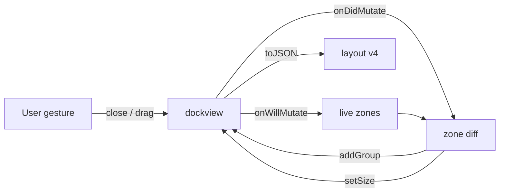

# Empty Zone Groups

<product-contract>

## Product Requirements

When a Workshop zone loses its last panel, the layout layer keeps the zone's space by inserting an inert "placeholder" panel, which shows a tab labelled "Placeholder" and a hint body. The user does not want that panel: "I hate the placeholder panel." Dockview draws an empty group natively, with an empty tab strip and a blank content area, and the user accepts that rendering: "I don't mind an empty tab strip." This plan removes the placeholder and keeps the zones alive as genuinely empty groups.

- Problem and users: Workshop operators (today the PromptForge maintainers) close the last editor or the last agent panel and are left looking at a tab named "Placeholder" holding a hint. The mechanism behind it also depends on dockview's internal event order to tell a last-panel close from an explicit group close, misses the case where the last panel is dragged out of a zone (the zone dissolves), and writes `placeholder:*` panels into the saved workspace layout, so removing it later needs a persisted-data decision.
- Goals:
  - A zone whose last panel closes, or whose last panel is dragged into another zone, stays on screen as an empty dockview group at its recorded size, with an empty tab strip and a blank body. No tab, no label, no hint text.
  - The next panel opened into that zone fills the empty group; the surviving zones keep their widths through both the emptying and the refill.
  - Quitting and relaunching restores every zone, empty ones included, at the previous sizes, with nothing in the saved layout that names the workaround.
  - The layout layer relies on dockview's documented layout mutation boundary rather than on the relative order of two internal removal events.
  - The SPA runs the current dockview release, 8.3.1, so the group lifecycle contract the redesign relies on is the one upstream documents.
- Non-goals: hiding the empty tab strip; a gesture for retiring a zone permanently (hiding remains `toggleZoneVisibility`); changing which zone a panel type opens in; touching the Run window, the parse route, the gateway, or any Rust crate; migrating existing v3 layout envelopes.
- Success criteria: closing the last editor leaves the main zone as an empty group at its prior width with zero panels and no element whose text is "Placeholder"; dragging the last panel out of a zone leaves an empty group behind; opening an editor lands in the empty main group; relaunch restores empty zones at their sizes; a saved layout envelope contains no id starting with `placeholder:`; the placeholder panel type, its module, its CSS, and its registry entry no longer exist; the SPA typecheck, build, and test suite pass on dockview 8.3.1.
- Constraints:
  - Product boundaries from the repository's `AGENTS.md`: no source file over 500 lines; every SPA concern `index.ts` opens with an `## Invariants` header; behavior changes ship with tests in the same change; CSS uses `--ws-*` tokens and lives beside its TypeScript; no `localStorage`.
  - The SPA depends on `dockview` (which re-exports `dockview-core`); `package.json` declares `^8.2.0` and `package-lock.json` currently resolves 8.2.0. CI installs with `npm ci`, so the lockfile is the pin.
  - `main.ts` configures the dock with `noPanelsOverlay: "emptyGroup"` and `disableFloatingGroups: true`; both stay.
  - Persisted layout envelopes live under the `.pfwork` workspace bucket key `layout`, versioned by `LAYOUT_SCHEMA_VERSION` in `crates/workshop/server/ui/src/ui/layout/layout-persistence.ts`; a version mismatch already falls back to the default layout.
- Open questions: None

## Functional Specification

An operator closes the last tab in a zone. The zone stays exactly where it was, at the same width and height, now showing an empty tab strip and a blank body. Dragging the last tab out of a zone into another zone leaves the same empty group behind. Opening a file, agent, or Run window into that zone fills the empty group. Quitting with an empty zone and relaunching restores it empty at the same size. Nothing labelled "Placeholder" appears anywhere.

- Actors and workflows:
  - Operator, close a zone's last panel: the group survives as an empty dockview group at its recorded size; the other zones do not move.
  - Operator, drag a zone's last panel into another zone: the source zone survives as an empty group at its recorded size; the dragged panel lands where dropped.
  - Operator, open a panel into an empty zone: the panel joins the empty group; the group's size is unchanged.
  - Operator, quit and relaunch: every zone restores at its previous size, empty zones included, through dockview's own serialization of empty groups.
  - Operator, open a workspace or restore a layout mid-session: the restored layout is applied as saved; no extra groups are created by the zone layer during the restore.
  - Operator on an older workspace file: a saved layout written under schema version 3 (which may contain placeholder panels) is not restored; the workbench boots the default layout once and saves the new schema.
- Inputs and outputs: no new wire or file formats. `LAYOUT_SCHEMA_VERSION` becomes 4. `dock.toJSON()` output for an empty zone is an ordinary grid leaf with `views: []`.
- States and validation: a zone is live when the zone registry maps it to a group id that `dock.getGroup` resolves; it is absent when it has never been opened this session or was removed by restore or reset. The layer keeps a zone live across every user-initiated layout mutation once it has been live; it never creates a zone that was not live before the mutation.
- Errors and recovery: a failed `fromJSON` continues to fall back to `resetZones()` plus the default layout, unchanged. If `dock.addGroup` throws during a rebuild, the error propagates to the console as today's `addPanel` would; no retry.
- Security and privacy behavior: unchanged. No new storage, no new network, no new trust boundary.
- Acceptance criteria:
  - Closing the last editor leaves the main zone's group alive with `panels.length === 0`, width unchanged, and the left and right zone widths pixel-identical to before the close.
  - Closing the last agent panel leaves the right zone alive and empty at its prior width.
  - Dragging the last panel out of a zone (via `panel.api.moveTo({ group })`) leaves the source zone alive and empty.
  - Relocating a whole zone group (via `group.api.moveTo`) does not create a second group for that zone.
  - Opening an editor into an empty main zone lands in that group (same group id) and the group keeps its width.
  - Relaunch with two empty zones restores both at their recorded widths, empty.
  - A mid-session `restoreLayout` and `resetZones()` create no groups beyond those in the restored layout.
  - A zone never opened this session is not created by an unrelated mutation.
  - The saved envelope contains no panel id or grid view starting with `placeholder:` and reports `version: 4`.
  - No element in the workbench DOM has the text "Placeholder", and `PanelType` no longer includes `"placeholder"`.
  - On dockview 8.3.1, `npm run typecheck`, `npm run build`, and `npm test` pass in `crates/workshop/server/ui`.

</product-contract>
<implementation-contract>

## Technical Design

The zone layer stops modelling "empty" with a panel and models it with what dockview already has: a group with no panels. Rebuilding a dead zone becomes `dock.addGroup(position)` instead of `dock.addPanel(placeholder)`. Detecting a dead zone moves from two internal removal events with an ordering heuristic to dockview's documented layout mutation boundary: snapshot which zones are live before a top-level mutation, compare after it settles, rebuild any zone that lost its group. Everything the placeholder needed (a panel type, a tab renderer, CSS, an eviction step in `openInZone`, an id branch, a persisted panel record) is deleted.

- Architecture:

- Dockview facts relied on (verified in the installed `dockview-core` bundle at 8.2.0; the first step upgrades to 8.3.1 and the coder re-verifies each against `node_modules/dockview-core/dist/package/main.esm.mjs` before relying on it):
  - `DockviewApi.addGroup(options?: AddGroupOptions): DockviewGroupPanel` creates a panel-less group; `AddGroupOptions` accepts `{ referenceGroup: string | DockviewGroupPanel; direction?: Direction }`, the shape `rebuildPosition()` already builds. It is exported from `dockview`.
  - The default watermark is an empty `div.dv-watermark` with no text and no controls, so an empty group draws as a blank body under an empty tab strip.
  - `fromJSON` creates each grid leaf's group before opening its views, so a leaf with `views: []` restores as an empty group at its saved size; `toJSON` serializes empty leaves. Nothing custom needs to be persisted.
  - `DockviewApi.onWillMutateLayout` and `onDidMutateLayout` (type `Event<DockviewLayoutMutationEvent>`, `event.kind` in `add | remove | move | float | popout | tab-group | load | clear`, `event.origin` in `user | api`) bracket each top-level structural change exactly once, including compound drags. `addGroup` and `addPanel` open their own `add` bracket, so a rebuild performed inside `onDidMutateLayout` re-enters the bracket once with the zone already live again.
  - `noPanelsOverlay: "emptyGroup"` (already set in `main.ts`) keeps the dock's sole remaining group when its last panel closes.
- Modules and interfaces:
  - `crates/workshop/server/ui/src/ui/layout/zones.ts`:
    - Delete the module-level `lastPanelRemoval` record and its type. Keep `zoneSizes` and `restoring`.
    - Add module-level `let liveBefore: readonly ZoneName[] | null = null`.
    - `initZones`: remove the `onDidRemovePanel` and `onDidRemoveGroup` subscriptions. Add `dockview.onWillMutateLayout(() => { liveBefore = restoring ? null : ZONE_NAMES.filter((zone) => liveGroup(zone) !== undefined); })` and `dockview.onDidMutateLayout((event) => { const before = liveBefore; liveBefore = null; if (before === null || restoring || event.kind === "load" || event.kind === "clear" || dock === null || dock.groups.length === 0) { return; } for (const zone of before) { if (liveGroup(zone) === undefined) { resurrectZone(zone); } } })`. Keep the `onDidMovePanel` and `onDidLayoutChange` subscriptions as they are.
    - `resurrectZone(zone)`: replace the `panelTypeEntry("placeholder")` lookup and `dock.addPanel({...})` with `const position = rebuildPosition(zone); if (position === undefined) { return; } const group = dock.addGroup(position);`, then `zoneState().setGroup(zone, group.id)`, `group.api.setSize(recorded)` when a size is recorded, and the existing loop re-asserting every other zone's recorded size. Rename to `rebuildZone` if preferred; the doc comment describes an empty group, not a placeholder.
    - `rebuildPosition`: return type `AddGroupOptions | undefined` (import the type from `dockview`); the returned object literals are unchanged. `openInZone` continues to pass the result to `addPanel` as `position`, which accepts the same `{ referenceGroup, direction }` shape.
    - `openInZone`: delete the placeholder eviction loop (`for (const occupant of [...group.panels]) ...`) and the `type !== "placeholder"` guard. The `addPanel` call with `position: { referenceGroup: group.id }` lands the panel in the empty group.
    - `panelIdFor`: delete the `type === "placeholder"` branch. `panelTypeFromId` is unchanged.
    - Header comment: rewrite the zone-stability paragraphs to describe empty groups and name the dockview facts above, the verified version (`dockview-core` 8.3.1 per `package-lock.json`), and `test/zone-stability.mjs` as the detecting test. Remove the sentence claiming persisted sizes ride the layout envelope through placeholder panels.
  - `crates/workshop/server/ui/src/ui/layout/placeholder-panel.ts`: delete the file.
  - `crates/workshop/server/ui/src/ui/layout/index.ts`: remove the `PlaceholderPanel` import and the `registerPanelFactory("placeholder", ...)` registration and its comment.
  - `crates/workshop/server/ui/src/services/panel-registry.ts`: remove `"placeholder"` from the `PanelType` union and delete the `registerPanelType({ type: "placeholder", ... })` block with its comment.
  - `crates/workshop/server/ui/src/ui/layout/zones.css`: delete the `.ws-placeholder-panel` and `.ws-placeholder-panel__hint` rules and their comment. Add no replacement unless the blank body visibly mismatches the dock background in the jsdom-free manual check; if it does, one rule on `.dv-watermark-container` using an existing `--ws-*` background token.
  - `crates/workshop/server/ui/src/ui/layout/layout-persistence.ts`: `LAYOUT_SCHEMA_VERSION = 4`, with the comment above it updated: v4 drops the placeholder panel type, and a v3 snapshot could restore a `placeholder:*` panel as an unknown-panel stub, so it falls back to the default layout. `withZoneRestore` usage is unchanged.
- File and public API changes:
  - Modified: `zones.ts`, `zones.css`, `layout/index.ts`, `panel-registry.ts`, `layout-persistence.ts`, `package.json` (optional range lift to `^8.3.1`), `package-lock.json` (8.3.1 for `dockview` and `dockview-core`).
  - Deleted: `placeholder-panel.ts`.
  - Tests: `test/zone-stability.mjs` rewritten; `test/workshop-zones.mjs` and `test/agent-stt-boot.mjs` adjusted where they reference `placeholder:*`; any other `test/` or `src/` reference to the `placeholder` panel type removed (the unknown-panel fallback in `panel-types.ts` and its `panel-registry.mjs` test use the word for a different thing and stay).
  - Docs: `guide/src/workshop/02-workbench.md` paragraph beginning "Closing every panel in a zone collapses that zone" rewritten to: closing or dragging away a zone's last panel leaves the zone in place, empty, at its current size; the next panel opened into that zone fills it. Then `cargo run -p build-user-guide` regenerates the tracked export `guide/promptforge-workshop-guide.md`; both files are committed together. The "unknown panel" sentence in the same file stays.
  - No Rust source changes. No change to `main.ts` dock options.
- Data, persistence, failure, security, and privacy constraints:
  - Persisted: the layout envelope schema version moves from 3 to 4. v3 envelopes are not migrated; `parsePersisted` returns null for them and the caller boots the default layout, as it did for v1 and v2 before. The envelope's `layout` payload is dockview's own `toJSON`, now free of `placeholder:*` panels.
  - The rebuild runs synchronously inside `onDidMutateLayout`, after the triggering mutation has settled, so no half-moved panel is observed and no frame is painted between the group's death and its rebuild.
  - Resurrection is suppressed while `restoring` is set (the `withZoneRestore` wrapper around `fromJSON`) and for `load` and `clear` mutation kinds, so layout restores, workspace switches, and `resetZones` create no groups.
  - A zone that was not live before a mutation is never created by it; the first panel opened into a zone still creates the zone through `openInZone` as today.

</implementation-contract>
<verification-contract>

## Testing Plan

All tests run in the SPA harness under `crates/workshop/server/ui` (`node --test`, jsdom, real dockview). The gates are the SPA typecheck, the esbuild bundle, and the full SPA suite, plus the docs-claims test that checks the assembled guide against its sources.

- Unit and integration (`test/zone-stability.mjs`, rewritten):
  - Closing the last editor leaves the main zone's group alive with zero panels at width 600, and the left and right zone widths unchanged.
  - Opening an editor into the empty main zone lands in the same group id and the group keeps its width.
  - Closing the last agent panel leaves the right zone alive and empty at width 320.
  - Dragging the last panel out of a zone with `panel.api.moveTo({ group: <other zone group> })` leaves the source zone alive and empty.
  - Relocating a whole zone group with `group.api.moveTo(...)` leaves exactly one group mapped to that zone.
  - A relaunch (new dock, `restoreLayout` with the saved envelope) restores both empty zones at their recorded widths with zero panels.
  - A mid-session `restoreLayout` creates no groups beyond the restored layout's; `resetZones()` followed by the default layout creates none either.
  - A zone that was never opened is not created when an unrelated zone mutates.
  - `buildLayoutEnvelope` reports `version: 4` and contains no key under `layout.panels` and no grid view id starting with `placeholder:`.
  - No element in `document.body` has `textContent === "Placeholder"` after the last-editor close.
- Adjusted existing tests: `test/workshop-zones.mjs` asserts three groups with the resurrected zone's group empty instead of asserting `getPanel("placeholder:main")`; `test/agent-stt-boot.mjs` drops its placeholder-removal step.
- Regression: every other `test/**/*.mjs` and `src/**/*.test.mjs` file passes unchanged on dockview 8.3.1; `test/docs-claims.mjs` passes against the regenerated guide export.
- Upgrade gate (first step, before any zone change): with only the lockfile changed, `npm ci`, `npm run typecheck`, `npm run build`, and `npm test` pass, so any breakage from 8.3.1 is attributed to the upgrade.
- Exit criteria: `npm run typecheck`, `npm run build`, and `npm test` pass in `crates/workshop/server/ui`; `rg -n "placeholder" crates/workshop/server/ui/src crates/workshop/server/ui/test` matches only the unrelated uses (quick input, prompt input placeholders, `run-rows.ts` input placeholders, the unknown-panel fallback and its test); `git diff --exit-code -- guide/promptforge-workshop-guide.md` is clean after `cargo run -p build-user-guide`; every acceptance criterion in the Functional Specification holds.

</verification-contract>
<decision-record>

## Decision Record

- Decisions:
  - Empty dockview groups replace the placeholder panel. Rationale: the user rejected the placeholder ("I hate the placeholder panel") and accepts the native rendering ("I don't mind an empty tab strip"); dockview creates, draws, serializes, and restores empty groups without help, so the layer needs no panel, tab, CSS, or persisted record of its own.
  - Dead zones are detected on the layout mutation boundary (`onWillMutateLayout` / `onDidMutateLayout`), not on `onDidRemoveGroup`. Rationale: the boundary is documented to fire once per top-level mutation including compound drags, so one snapshot-and-diff covers close, drag-out, float-out, and any future removal path uniformly, and the rebuild runs after the mutation settles instead of nested inside a drag. `onDidRemoveGroup` is suppressed inside dockview's moving lock on some paths and not others, which is what produced the drag-out gap.
  - Dockview is upgraded to 8.3.1 first, as its own commit. Rationale: 8.3.1 (2026-09-10) documents the group-lifecycle contract and fixes the float-out case of `onDidRemoveGroup` (#1636); 8.3.0 fixes drop placement (#1621). Landing the upgrade alone with the existing suite isolates upgrade fallout from redesign fallout.
  - `LAYOUT_SCHEMA_VERSION` moves to 4 with no migration. Rationale: v3 envelopes may contain `placeholder:*` panels that would restore as unknown-panel stubs once the type is gone; the version check already routes a mismatch to the default layout, which is how v1 and v2 were retired. One reset per workspace file is the accepted cost.
  - Zones never die outside restore and reset; there is no gesture to retire a zone. Rationale: the only zone-level affordance the SPA offers is hide (`toggleZoneVisibility`), and the old "explicit close of a placeholder-only group" gesture had no UI path. An `api.removeGroup` call from code would rebuild the zone; no SPA code makes one.
  - The empty tab strip stays visible. Rationale: the user accepts it, and it is the drop target for tabs. `group.model.header.hidden` is a runtime toggle dockview persists as `hideHeader` if a hidden strip is ever wanted.
  - `package.json` keeps its caret range. Rationale: the lockfile is the pin under `npm ci`; lifting the range to `^8.3.1` is permitted but changes nothing CI installs.
- Rejected alternatives:
  - Keep the placeholder panel but hide its tab: still a fake panel in the layout and in persisted data, and the body hint remains. Rejected by the user's stated preference.
  - Strip `placeholder:*` panels from the envelope at save and re-inject at load: preserves the persisted format at v3 but keeps the panel type and adds a second restore path. Moot once the panel is gone.
  - Pre-emptive placeholder insertion before the last real panel closes: dockview's built-in tab close does not pass through SPA code, so there is no interception point without a custom tab renderer on every panel type.
  - `queueMicrotask` deferral inside `onDidRemoveGroup`: unnecessary once the hook is the settled mutation boundary.
  - A read-side scrub of v3 envelopes: a permanent shim for a handful of local workspace files. Rejected in favor of the established schema bump.
- Assumptions, risks, and notes:
  - `onWillMutateLayout` fires before dockview's internal group removal for every user path that can empty a zone. Verified for close and drag on 8.2.0 by reading the bundle; the coder re-verifies on 8.3.1. Falsifier: the drag-out test fails because the snapshot was taken after the source group died.
  - A rebuild inside `onDidMutateLayout` re-enters the bracket through `addGroup`'s own `add` mutation. On re-entry the zone is live, so the diff is empty and no loop forms. Falsifier: a stack overflow or duplicate group in the last-editor-close test.
  - `rebuildPosition` returns `undefined` when the dock has no groups; the `dock.groups.length === 0` guard in the hook makes that unreachable in practice, and `resurrectZone` returns early if it happens.
  - The upgrade may surface unrelated test drift (8.3.0 changed drop placement and the context menu). Such drift is fixed in the upgrade step and stays attributable to it.
  - `cargo run -p build-user-guide` requires a working Rust toolchain; it regenerates every export, and only `guide/promptforge-workshop-guide.md` should change.

### Deferred and Out of Scope

- Deferred: none.
- Out of scope: D-PF-002 (`workspace-hack` feature propagation into the gateway closure), the Run button's execution path, the `POST /prompts/contract` route, rustls, reqwest, and clippy configuration, and any change to the gateway or the Rust workspace beyond regenerating the guide export.

</decision-record>
<project-survey>

## Project Survey

- Status: complete
- Build: this plan touches only the Workshop SPA under `crates/workshop/server/ui`; its build is `npm run build` (esbuild via `build.mjs`) run in that directory after `npm ci`. The Rust workspace builds with `cargo build` (default-members build the gateway); the desktop app is `cargo build -p workshop`; no Rust source changes in this plan.
- Focused test command pattern: `node --test test/<file>.mjs` run in `crates/workshop/server/ui` (for example `node --test test/zone-stability.mjs`). For Rust crates the pattern is `cargo nextest run --locked -p <crate> <test-name-filter>`.
- Component test command pattern: `npm test` in `crates/workshop/server/ui` runs `node --test "test/**/*.mjs" "src/**/*.test.mjs"`. For Rust crates: `cargo nextest run --locked -p <crate>`.
- Full-suite test command: for this plan's scope, `npm run typecheck && npm run build && npm test` in `crates/workshop/server/ui`, then `cargo test -p build-xtask` (the structural harness: 500-line ceiling, invariants headers, tier graph). The Rust workspace suite is `cargo nextest run --locked --workspace --exclude workshop --exclude workshop-server --exclude workshop-server-api --all-features` plus `cargo nextest run --locked -p workshop -p workshop-server -p workshop-server-api`; it is not required here because no Rust source changes.
- Linter: `npm run typecheck` (`tsc --noEmit`) in `crates/workshop/server/ui`. Rust: `cargo clippy --workspace --exclude workshop --exclude workshop-server --exclude workshop-server-api --all-targets --all-features -- -D warnings`; not required here.
- Formatter check: `None` for the SPA (no formatter script is declared in `package.json`). Rust: `cargo fmt --all --check`; not required here.
- Docs: `cargo run -p build-user-guide` regenerates `guide/src/SUMMARY.md`, each part's `index.md`, and the tracked exports `guide/promptforge-*.md` from `guide/src`; `mdbook build guide` builds the book. `test/docs-claims.mjs` in the SPA suite checks the workshop export for stale phrases.
- Test placement and naming: SPA tests are `.mjs` files under `crates/workshop/server/ui/test/` named for the concern they cover (`zone-stability.mjs`, `workshop-zones.mjs`), driven by `node --test` with jsdom and the real dockview bundle; a test file builds a dock through the same registration path as `main.ts`, uses `check(label, condition)` helpers, and exits non-zero on any failure. Rust unit tests live in-module under `#[cfg(test)]`; integration tests under `tests/it/` as the `it` target. Behavior changes ship with tests in the same change.
- Directory map: `crates/` holds the public and shared layer (`gateway-api`, `promptforge-api-runtime`, `promptforge-api-types`, `shared-*`, `workspace-hack`, `build-*` tooling); `crates/promptforge/`, `crates/gateway/`, `crates/workshop/` are manifestless private family containers; `crates/workshop/server/ui` is the Workshop SPA (TypeScript, esbuild, `src/ui/<concern>/` directories each with an `index.ts` barrel, `src/services/` for registries and HTTP clients, `test/` for the harness); `crates/shared-ui` is a TypeScript and CSS package consumed by the SPA; `guide/` is the mdbook user guide with tracked concatenated exports; `vibe/` holds `archdoc.md`, `dependency-surface.md`, and the plan ledger; `.github/workflows/ci.yml` runs `npm ci`, `npm run typecheck`, `npm run build`, `npm test` for the SPA.
- Component boundaries: three products - PromptForge executor, Gateway, Workshop. Inside the SPA, `src/ui/layout/` owns the dock, zones, panel types, and layout persistence; `src/services/panel-registry.ts` is the registry every concern registers its panel type with; concerns depend on `services/` and `base/`, never on each other's internals; persisted UI state goes through `ui-storage` to `/user/state` or the `.pfwork` workspace file. Dockview is the only layout engine; the SPA talks to the server over HTTP and the workbench socket only.
- Conventions summary: TypeScript strict, no casts for narrowing (field-by-field type guards); each concern `index.ts` opens with an `## Invariants` comment; CSS beside its TypeScript using `--ws-*` tokens, no raw values; module-level state is allowed for session-scoped placement but documented in a header comment; comments explain the dockview behavior relied on and name the version verified; no file over 500 lines; errors are concise and factual; reuse existing facilities before adding machinery.

</project-survey>
<execution-plan>

## Execution Instructions

All commands run in `crates/workshop/server/ui` unless a path says otherwise. Each step is one commit containing its code and its tests.

<step-1>

### Step 1: Upgrade dockview to 8.3.1 [completed]

- Component: `none`
- Goal: the SPA runs `dockview` and `dockview-core` 8.3.1 with the existing suite green, so any redesign fallout in Step 2 is attributable to the redesign and not to the upgrade.
- Changes:
  - `package-lock.json`: `npm install dockview@8.3.1` (or `npm update dockview dockview-core`) so both `dockview` and `dockview-core` resolve to 8.3.1. Optionally lift the `dockview` range in `package.json` to `^8.3.1`; the caret range stays, the lockfile is the pin under `npm ci`.
  - Existing tests under `test/**/*.mjs` and `src/**/*.test.mjs`: fix any drift 8.3.1 introduces (8.3.0 changed drop placement and the context menu). No zone, placeholder, or schema change in this step.
- Tests: the unchanged suite is the test. `npm ci`, `npm run typecheck`, `npm run build`, `npm test` all pass with only the lockfile (and optionally `package.json` and drifted tests) modified.
- Commit: lockfile bump plus any drift fixes, message naming dockview 8.3.1.

</step-1>

<step-2>

### Step 2: Empty zone groups replace the placeholder panel

- Component: `none`
- Goal: a zone whose last panel closes or is dragged away stays as an empty dockview group at its recorded size; the placeholder panel type and every artifact of it are gone; the layout schema is v4; the guide describes the new behavior.
- Pre-check: re-verify each dockview fact in Technical Design against `node_modules/dockview-core/dist/package/main.esm.mjs` at 8.3.1 (`addGroup` and `AddGroupOptions` shape, empty default watermark, `fromJSON` restoring `views: []` leaves, `onWillMutateLayout` / `onDidMutateLayout` bracketing and re-entry on `addGroup`, `noPanelsOverlay: "emptyGroup"` behavior). Record any deviation in the `zones.ts` header comment before writing code that depends on it.
- Changes:
  - `src/ui/layout/zones.ts`: delete `lastPanelRemoval` and its type; add module-level `liveBefore: readonly ZoneName[] | null`; in `initZones` replace the `onDidRemovePanel` and `onDidRemoveGroup` subscriptions with `onWillMutateLayout` (snapshot live zones unless `restoring`) and `onDidMutateLayout` (skip when snapshot is null, `restoring`, `event.kind` is `load` or `clear`, or the dock has no groups; rebuild every zone in the snapshot whose group is gone); keep `onDidMovePanel` and `onDidLayoutChange`. `resurrectZone` (or `rebuildZone`) calls `dock.addGroup(rebuildPosition(zone))`, records the group id via `zoneState().setGroup`, applies the recorded size with `group.api.setSize`, and re-asserts every other zone's recorded size. `rebuildPosition` returns `AddGroupOptions | undefined` (type imported from `dockview`). `openInZone` loses the placeholder eviction loop and the `type !== "placeholder"` guard. `panelIdFor` loses the `placeholder` branch. Header comment rewritten to describe empty groups, the dockview facts relied on, the verified version (8.3.1 per `package-lock.json`), and `test/zone-stability.mjs` as the detecting test.
  - `src/ui/layout/placeholder-panel.ts`: deleted.
  - `src/ui/layout/index.ts`: remove the `PlaceholderPanel` import and the `registerPanelFactory("placeholder", ...)` call and comment; keep the `## Invariants` header.
  - `src/services/panel-registry.ts`: remove `"placeholder"` from `PanelType`; delete the `registerPanelType({ type: "placeholder", ... })` block and comment.
  - `src/ui/layout/zones.css`: remove `.ws-placeholder-panel` and `.ws-placeholder-panel__hint` and their comment. Add one `.dv-watermark-container` rule using an existing `--ws-*` background token only if a manual check shows the blank body mismatching the dock background.
  - `src/ui/layout/layout-persistence.ts`: `LAYOUT_SCHEMA_VERSION = 4`; comment explains v4 drops the placeholder panel type and v3 snapshots fall back to the default layout.
  - `guide/src/workshop/02-workbench.md` (repository root): rewrite the paragraph beginning "Closing every panel in a zone collapses that zone" to say closing or dragging away a zone's last panel leaves the zone in place, empty, at its current size, and the next panel opened into that zone fills it; keep the "unknown panel" sentence. Run `cargo run -p build-user-guide` from the repository root and commit the regenerated `guide/promptforge-workshop-guide.md` in the same commit.
- Tests:
  - `test/zone-stability.mjs` rewritten to the Testing Plan's cases: last-editor close leaves main alive, empty, width 600, left and right widths unchanged; editor reopen lands in the same group id at the same width; last-agent close leaves right alive and empty at 320; `panel.api.moveTo({ group })` drag-out leaves the source zone alive and empty; `group.api.moveTo` relocation yields exactly one group for that zone; relaunch restores both empty zones at recorded widths with zero panels; mid-session `restoreLayout` and `resetZones()` create no extra groups; a never-opened zone is not created by an unrelated mutation; `buildLayoutEnvelope` reports `version: 4` with no `placeholder:` panel or grid view id; no element in `document.body` has `textContent === "Placeholder"`.
  - `test/workshop-zones.mjs`: assert three groups with the rebuilt zone's group empty instead of `getPanel("placeholder:main")`.
  - `test/agent-stt-boot.mjs`: drop the placeholder-removal step.
  - Remove any remaining `src/` or `test/` reference to the `placeholder` panel type; the unknown-panel fallback in `panel-types.ts` and its `panel-registry.mjs` test, and input placeholders, stay.
- Gate: `npm run typecheck`, `npm run build`, `npm test`; `cargo test -p build-xtask` from the repository root; `rg -n "placeholder" src test` matches only the unrelated uses listed in Exit criteria; `git diff --exit-code -- guide/promptforge-workshop-guide.md` is clean after regeneration.
- Commit: all of the above as one commit.

</step-2>

</execution-plan>
