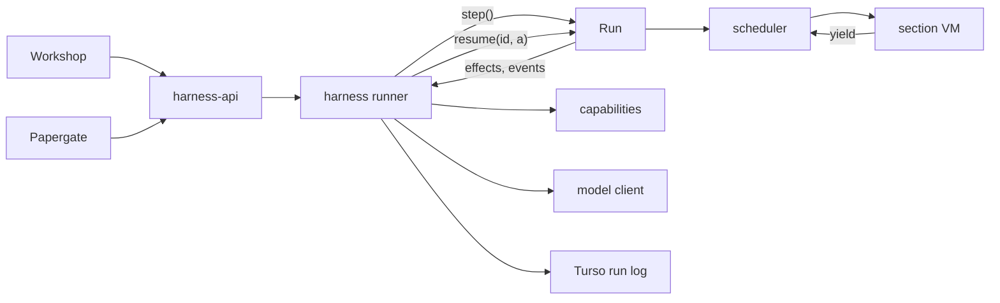

# Sans-IO engine and harness product

All paths are relative to the PromptForge repository root. Repository facts are cited by path; every fact is included so a reader without the conversation can act on this plan.

Status: decomposed into 51 steps and reviewed against every `AGENTS.md` in the repository on 2026-09-18 (see the "AGENTS.md review" entry in the Decision Record). No step has started. Execution begins at Step 1; Steps 1-7 touch no engine crate and may run on a branch alongside Steps 8-40.

<product-contract>

## Product Requirements

PromptForge runs Markdown prompts whose sections contain Lua. Today the component that runs them (the executor) mixes a pure scheduler with the machinery that talks to the outside world: it spawns tokio tasks for network calls, builds an HTTP client, holds callbacks into the host, and implements two author features (`models.loop` and `fanout`) in Rust in ways that block or serialize other work. This plan splits it into an engine that never touches the outside world and a harness product that does all of it, records everything, and is what Workshop and Papergate depend on. The engine's whole host interface becomes four functions.

### Terms used throughout

- Prompt: a Markdown file with front matter, an H1 title, and H2 sections; each section holds prose and fenced Lua blocks. Source: `crates/promptforge/parser/`.
- Section VM: the sandboxed Lua state created fresh for each section entry. No Lua state survives leaving a section.
- Chain: one line of section execution inside a run (walk the sections in order, `jump`, fall through). The scheduler keeps an arena of chains. A `call(target)` starts a child chain and blocks the caller; `fanout` starts many.
- Yield and shim: Lua cannot suspend across a call into Rust, so every suspending author function (`models.infer`, `call`, `tools.call`, ...) is a few lines of Lua that `coroutine.yield` a request table and receive an answer. The scheduler validates the yield, acts on it, and resumes the coroutine. Source: `crates/promptforge/lua/src/coro.rs`, `__impl_coro.lua`.
- Structural yield: a request the scheduler answers by itself (start a chain, wait for a task). Leaf yield: a request that needs the outside world (a model round, a tool call, operator input, a store operation, a timer).
- Effect: a leaf yield turned into a value the engine returns to its host; the host performs it and returns an `EffectAnswer`. The term is from algebraic effect handlers: the engine performs an effect, the harness handles it.
- Event: something the engine reports (a section started, a model replied, a tool ran). Returned as values alongside effects; replaces today's `Observer` callback trait.
- Task: a chain started with `spawn` and tracked by id so its owner can wait on it, inspect it, or cancel it. `fanout` becomes a Lua function over tasks.
- Engine: the `promptforge-*` crates after this plan. Pure: no async, no network, no clock, no callbacks.
- Harness: the new `harness-*` product. Owns tokio, performs every effect, keeps the run log, supervises sessions.
- `var`: the author's clipboard table that rolls forward across sections within a chain and is discarded when a `call` chain ends. Tasks follow `var`.
- Store and claims: the run-scoped virtual filesystem authors reach through `store.*`, with a claims model that detects two concurrent identities touching one path. Source: `crates/shared-vfs/`, `crates/promptforge/store/`.
- Capability: a host-installed bundle of tools a prompt declares in front matter (web search, shell, ...). Source today: `crates/promptforge-api-types/src/capabilities.rs`.
- Workshop: the desktop product (`crates/workshop/`). Papergate: an external consumer of the executor in its own repository.

- Problem and users:
  - The scheduler (`crates/promptforge-api-runtime/src/execute/scheduler.rs`) is already a coroutine driver with all Lua on one thread, but four things keep it from being a pure state machine: `models.loop` runs as Rust `async` on the driver thread holding the section VM across network waits, so while one fanout arm's loop waits on a model no other arm can be resumed (documented in `dispatch_loop`); `fanout` is about 600 lines of scheduler-internal join code; leaf I/O is `tokio::spawn`ed inside the crate and collected on a channel; the HTTP client, capability registry, input broker, observer, debug capture, and `ui()` snapshot are all host callbacks reaching into or out of the run.
  - Users: prompt authors (Lua surface), models running inside prompts (tool surface), the Workshop desktop app and Papergate (host surface), and maintainers who need a testable core.
- Goals:
  - The engine crates (`promptforge-api-runtime`, `promptforge-api-types`, everything under `crates/promptforge/`) declare no dependency on `tokio`, `tokio-util`, `async-trait`, or `reqwest`, enforced by a test on declared manifest dependencies.
  - The engine's host interface is `Run::new`, `Run::step`, `Run::resume`, `Run::cancel`. `step` returns the effects to perform and the events produced; nothing in the engine awaits, blocks, reads a clock, or calls a host callback.
  - Fanout arms that run `models.loop` interleave at every model round and tool call, so N arms have up to N model rounds in flight.
  - Authors gain `spawn`, `when_any`, `when_all`, `ready`, `status`, `note`, `events`, `cancel` under a `tasks` namespace; `fanout` keeps its signature and semantics.
  - Models gain background tasks and a bounded blocking wait, in the same shape Cursor gives its own agent: start, cancel, inspect, await with a timeout, results pushed as messages.
  - A `harness-*` product owns the effect loop, every performer, session supervision, and a Turso-backed log of every effect, answer, and event in one ordered stream.
  - `workshop-sessions` is dissolved into the harness; Workshop and Papergate depend on `harness-api`.
- Non-goals:
  - Replaying a recorded run, or resuming a cancelled task by re-execution. The log is written so both are possible later; nothing reads it back into the engine. Their contracts are recorded under Deferred.
  - A live clock in Lua (`now()`), an author-visible timer task, Lua string-hash seed control, parallel Lua within one run, the compactor framework, any gateway product change.
- Success criteria:
  - `cargo check -p promptforge-api-runtime` succeeds, and `cargo test -p build-xtask` proves that its non-dev dependency tables, and those of every crate under `crates/promptforge/`, contain none of the forbidden crates.
  - A plain `#[test]` drives a three-arm fanout to completion with a serial performer, feeding answers in reverse order, with no tokio and no mock HTTP server.
  - Two runs with the same seed, `started_at`, and answers produce identical effect and event sequences, including every `Provenance` and `sys.id`, on prompts that avoid Lua `pairs`.
  - Workshop's agent integration suites pass against `harness-api` with import and construction changes only; their assertions are unchanged.
  - Every existing engine test suite passes through a test-support driver (which adapts the returned event stream to the recording observers those suites install), or is rewritten at prompt level where it called the deleted Rust loop directly.
- Constraints:
  - One thread runs every chain step; the scheduler is unreachable from Lua; the `coroutine` global is stripped after the shims capture `yield` (`crates/promptforge/lua/src/coro.rs`).
  - Yield cannot cross the C boundary, so every author-visible suspending function is a Lua shim, never an mlua callback.
  - Claims model: a chain's store access is spawned from its parent's at chain start and released at chain end before any waiter resumes; a run result is never delivered while an in-flight store operation still holds an access clone.
  - Typed errors never flatten: when an answer fails, the scheduler keeps the typed error and substitutes it when the shim's Lua `error()` surfaces as the coroutine's failure.
  - Product matrix (`crates/build-xtask/src/product.rs`): families by name prefix, private containers with one named public door, `shared-*` depends on no product. New structural checks need explicit approval; the user approved four in this plan (2026-09-18): the harness family row, the engine manifest test, the retired-symbol source scan, and the harness `clippy.toml` check. Extending the existing 500-line ceiling check to `harness-*` crates is a scope change to a check that already exists, not a new check.
  - Workspace lints: `unsafe_code` forbidden, `unwrap_used`/`expect_used` denied, pedantic clippy; files under 500 lines; flat source directories; Cargo features gate real constraints only.
  - `{{ }}` prose substitution stays data-only; no call syntax is added.
- Open questions: None.

## Functional Specification

Three actors see the change. Prompt authors keep every function they have and gain a `tasks` namespace for background work with timeouts. Models inside a prompt gain five tools, enabled by the author, for starting, inspecting, awaiting, and cancelling background tasks, with results arriving as messages. Hosts drive a run by asking the engine what it needs, doing it, and handing the result back; the harness is the one host in the workspace and Workshop talks to it.

- Actors and workflows:
  - Author, existing surface unchanged: `models.infer(handle?, prompt)`, `models.loop(handle?, messages, compactor?)`, `call(target, input?)`, `fanout(worker, collection)`, `tools.call(alias_or_tool, args)`, `user_input()`, `store.*`. `models.loop` and `fanout` are now written in Lua but behave the same, except as listed under acceptance criteria.
  - Author, new `tasks` namespace (available in every section and in the H1 pass):
    - `spawn(target, opts?) -> Task` starts a chain over section `target` and returns at once. `opts.input` overrides the chain's args; `opts.item` becomes the `item` global and `{{ item }}` in the target; `opts.index` becomes `sys.index`. The caller's `var` seeds the chain. Depth is the caller's plus one, capped as `call` is.
    - `tasks.when_any(set, opts?) -> Task, ok, result` waits until the first task in `set` finishes and returns which one, whether it succeeded, and its final text or error value. `opts.timeout` (seconds) returns `nil` if nothing finished in time; the tasks keep running.
    - `tasks.when_all(set, opts?) -> results, timed_out` waits for every task and returns `{ task, ok, result }` per member in input order. It never raises because a member failed; the author decides. With a timeout, unfinished members are absent and `timed_out` is true.
    - `tasks.ready(task)`, `tasks.pending(filter?)`, `tasks.cancel(task)`: non-blocking check, list of the caller's live tasks (optionally by origin `author` or `model`), abort.
    - `tasks.status(task) -> table`: `target`, `origin`, `state` (`running`/`done`/`cancelled`/`abandoned`), `ok`, current `section`, what it is `blocked` on (`chat`, `tool_call`, `user_input`, `store`, `timer`, `tasks`, `call`, or nil), `turns`, owned `tasks`, `depth`, latest `note`. No elapsed time, because the engine has no clock.
    - `tasks.note(text)`: from inside a task, publish a one-line progress note visible in `status`.
    - `tasks.events(task, opts?) -> sequence`: the task's content events so far (`{ kind, section, turn, text }`), answered from the harness's log, so unbounded; `opts.last = n` for the most recent `n`.
    - `Task` is a plain table `{ task = id }` with no methods (Lua host handles are methodless per `crates/promptforge/lua/AGENTS.md` and archdoc A9; every operation is a `tasks.*` namespace function); every `tasks.*` function accepts the table or the bare integer, so a handle stored in `var` works unchanged.
  - Author, ownership rules (tasks follow `var`): only the spawning chain may wait on, inspect, or cancel a task, with one addition: a chain may call `tasks.status`, `tasks.events`, and `tasks.note` on its own task (`sys.taskid`), which is how a task reports progress and how an agent reads its own history. Tasks survive `jump` and fall-through, keep running while the owner is blocked in `call` or a wait, transfer from the H1 pass to the main walk, and end when their owner's `call` chain or spawned chain ends. A chain that ends with live author-spawned tasks fails with an error naming them; aborting a chain aborts everything it owns.
  - Model, enabled by the author calling `tools.allow_tasks(targets?)` in a section (`targets` optionally restricts which sections may be started):
    - `task { target, input? }` starts a background chain and returns `Task id=N started`.
    - `task_cancel { id }`, `task_status { id }`, `task_events { id, last? }` mirror the author functions; status is trusted, events are marked untrusted because they contain another chain's model output.
    - `await_tasks { timeout? }` blocks the model's tool call until one of its tasks finishes or the timeout passes, returning the finished tasks' results, or `timed out; tasks 3, 5 still running`. With no tasks and a timeout it is a sleep. With neither it returns `nothing to wait for`.
    - Results the model did not await are appended as messages (`Task id=N (## Heading) completed: ...`, `failed: ...`, `was canceled: the author cancelled it` after an explicit `tasks.cancel`, `was abandoned: <why the owner ended>` with the reason `the section ended`, `the tool loop was exhausted`, or `the owner failed`) before its next model round. A chain ending with live model-started tasks abandons them and records `TaskAbandoned`; the model is not told because it has no next round in that chain.
  - Harness (host of the engine): parse the prompt; resolve declared capabilities and assemble a tool catalog; build a `RunContext` with a fresh random seed and the wall-clock start time; call `Run::new`; loop: `step`, perform each returned effect on tokio, log every effect, answer, and event, `resume` each answer as it arrives, until `Done`.
  - Workshop: opens sessions through `harness-api`, renders the event and delta streams, supplies operator input, builds the `ui()` snapshot, and pushes the gateway binding (base URL, key, generation) to the harness whenever the gateway it supervises is started or replaced; the harness rebuilds its capability registry on each push, as today's `EffectExecutor` does on a generation change. Papergate: switches its dependency from the engine to `harness-api` and supplies its own gateway binding the same way.
- Inputs and outputs:
  - Engine in: a parsed prompt (shared through `Arc`), its args string, and a `RunContext` (name, seed, `started_at`, limits, current model, per-run VFS, tool catalog, filled tool and model bindings, `ui` snapshot, cancel handle). Engine out per `step`: a list of `(EffectId, Effect)` to perform and a list of `Event`s produced, or the final `RunResult` with the last events.
  - Effects: `Chat` (one model round: binding, messages, the concrete list of advertised tool schemas, options), `ToolCall` (tool id, alias, JSON args), `UserInput`, `Store` (a store operation with the chain's access handle), `Timer` (seconds), `TaskEvents` (task id, optional last-n). Answers mirror them, plus `Dropped` meaning the host will not perform this effect. Each effect has a serializable projection, `EffectRecord`, which is the effect minus live handles (the store access); the log stores records, and only records deserialize.
  - Harness out: session events and streaming deltas to its client; a Turso database with `runs` and `records` tables.
- States and validation:
  - A run is `Pending` (effects may be outstanding) until `Done`. `Done` is never reported while any issued effect is unanswered; the host must answer or drop every effect first. This preserves the claims rule that a store operation's access handle is released before the result is delivered.
  - A task is `running`, `done` (result undelivered), `delivered`, `cancelled` (someone called cancel on it), or `abandoned` (its owner chain ended while it was live, so the engine ended it). `abandoned` is a distinct terminal state so the log and the model notice can tell "was stopped on purpose" from "lost its owner". Waiting on a delivered task is an error; cancelling anything is idempotent.
  - `{{ }}` paths must resolve to JSON data; a function, userdata, or thread is rejected. `sys` holds only data fields (`when`, `id`, `model`, `index`, `taskid`); `sys.now` is removed.
  - Structural identity is deterministic: every chain (the main walk, a `call` child, a spawned task) has a hierarchical chain id, its parent chain's id extended by the parent's local child counter, with `call` children and spawns sharing that counter; a task's id is its chain's id; a section's `sys.id` is its chain's id extended by the chain's local entry counter. Two runs with the same inputs produce the same ids regardless of how their chains interleave, and a `call` child never collides with its parent because they are different chains.
- Errors and recovery:
  - Every failure that reaches Lua is a table `{ kind, message, ... }` whose `tostring` is the message, so `pcall` callers that print it see no change and callers that branch can read `kind`. Kinds: `tool_loop_exhausted`, `context_exhausted` (with `reason`), `empty_model_reply` (with `finish_reason`), `out_of_scope_tool`, `unbound_tool`, `tool`, `task_not_owned`, `task_consumed`, `tasks_live`, `cancelled`, `lua`, `internal`.
  - A model-issued tool call whose tool fails yields the failure text to the model as an untrusted result and the loop continues; a script-issued `tools.call` whose tool fails raises at the call site. Model tasks that outlive their owner are abandoned (ended by the engine, recorded as `TaskAbandoned`); author tasks that outlive their owner are a hard error. The two principals are treated differently on purpose: the author's leak is a bug, the model's is recoverable.
  - Store claims violations still end the run without resuming Lua. Cancellation from the host aborts every chain and reports `Cancelled` once outstanding effects are answered or dropped.
- Security and privacy behavior:
  - Trust boundaries are unchanged: bound tool output and any text from another chain's model (task results, `task_events`) is wrapped as untrusted before a model sees it; `task_status` is trusted because it is scheduler fact.
  - The engine holds no credentials and opens no connections; the harness holds the model client and capability implementations, as `workshop-sessions` does today.
  - The run log contains model inputs and outputs verbatim, as the current JSONL session log does; it lives in the same state directory.
- Acceptance criteria:
  - Behavior changes an author can observe, all accepted: fanout arms running loops interleave instead of serializing; `models.loop` counts against the Lua instruction quota (a few hundred instructions per round); a section ending with live author tasks fails (no existing prompt spawns tasks); `pcall` error values are tables (nothing in `prompts/` or tests compares one to a string); fanout iterates a hash-shaped collection in sorted key order instead of undefined order; `ui()` is the snapshot taken at run start (the documented contract already says a change takes effect on the next run); `sys.now` is removed and two guide sentences change (`guide/src/language/04-lua-globals-and-store.md`); `sys.id` values change form but remain unique within a run.
  - Everything else authors can observe is unchanged, including every error message text that `fanout` and `models.loop` produce today.

</product-contract>
<implementation-contract>

## Technical Design

The engine keeps the scheduler's existing shape (one thread, a chain arena, yield and resume) and removes everything that reached outside it. Two author features move from Rust into the Lua shim file so that every network wait inside them becomes an ordinary yield. A task arena replaces the fanout join machinery. The host boundary becomes four methods on `Run`, exchanging effects and events as serializable values. The harness is a new product family that performs effects on tokio, logs them to Turso, and absorbs the session machinery from Workshop.



- Architecture:
  - Engine (`promptforge-api-runtime` and its private crates under `crates/promptforge/`): a deterministic state machine. Given the same `RunContext` and the same sequence of answers it produces the same effects, events, and ids. It performs no I/O, reads no clock, and holds no host trait objects.
  - Harness (`harness-*`): the engine's only production host. It owns the tokio runtime, one performer per effect kind, the model HTTP client (moved from `crates/promptforge/model-client/src/client/`), the capability registry and first-party capabilities (moved from `crates/promptforge-api-types/src/capabilities.rs` and `crates/promptforge/{web,webfetch,web-search}/`), the input wait registry and supervisor (moved from `crates/workshop/sessions/`), and the run log.
  - Family rules added to `crates/build-xtask/src/product.rs`: `harness-*` may depend on `promptforge-api-runtime`, `promptforge-api-types`, `gateway-api`, `gateway-api-discovery`, and `shared-*`, never on `workshop-*` or private `gateway-*` crates; `workshop-*` may depend on `harness-api`; `promptforge-*` and `gateway-*` never depend on `harness-*`. Container `crates/harness/` is private with `harness-api` as its door, the same shape as `crates/promptforge/` with `promptforge-api-runtime`.
  - Layout: `crates/harness-api/` (public), `crates/harness/runner/` (effect loop, performer traits, cancellation, supervision), `crates/harness/models/` (model client), `crates/harness/capabilities/` (registry, activation, and the `Capability`, `Tool`, and `InputBroker` traits; depends on no provider), `crates/harness/{web,webfetch,web-search}/` (the first-party capabilities as `harness-web`, `harness-webfetch`, `harness-web-search`; the two providers depend on `harness-capabilities` for the `Tool` trait, and `harness-sessions` depends on all of them to register the first-party set), `crates/harness/log/` (Turso), `crates/harness/sessions/` (discovery, session state, waits, supervisor state machine).
- Modules and interfaces:
  - `Run` (`crates/promptforge-api-runtime/src/execute/run.rs`, new):

    ````rust
    pub struct Run { /* Arc<Prompt>, run state, scheduler, cancel flag, seed */ }
    pub enum Step {
        Pending { effects: Vec<(EffectId, Provenance, Effect)>, events: Vec<Event> },
        Done { result: RunResult, events: Vec<Event> },
    }
    // Every Event variant carries `provenance: Provenance` beside `execution` and `section`.
    pub enum Effect {
        Chat { binding: ModelBinding, messages: Vec<Message>, tools: Vec<ToolSchema>, options: CompletionOptions },
        ToolCall { tool: ToolId, alias: String, args: serde_json::Value },
        UserInput { execution: String, section: String },
        Store { access: Arc<Access>, op: StoreOp },
        Timer { seconds: f64 },
        TaskEvents { task: TaskId, last: Option<u32> },
    }
    pub enum EffectAnswer {
        Chat(Result<Completion, CompletionError>),
        ToolCall(Result<ToolOutput, ToolError>),
        UserInput(Result<InputOutcome, InputError>),
        Store(Result<StoreOutcome, shared_vfs::VfsError>),
        Timer,
        TaskEvents(Vec<Event>),
        Dropped,
    }
    impl Run {
        pub fn new(prompt: Arc<Prompt>, args: &str, ctx: RunContext) -> Run;
        pub fn step(&mut self) -> Step;
        pub fn resume(&mut self, id: EffectId, answer: EffectAnswer);
        pub fn cancel(&mut self);
    }
    ````

  - `Run` contract: `step` drains the ready queue and returns when no chain can proceed without an answer, or when the run is over. `Pending` with an empty effect list means "waiting on effects already issued." `Done` is withheld while any effect is unanswered. `resume` applies one answer, buffers that round's events, and re-queues the chain; an unknown id is an internal error; `Dropped` resumes the chain with a `cancelled` error and is itself an answer, so the harness writes an answer row for it and every effect in the log has exactly one answer. `cancel` sets a flag the Lua instruction hook already polls; the next `step` aborts every chain. `Run` is `Send`; one caller at a time; the thread may change between calls. The contract is incremental: one `resume` per arriving answer, then `step`, so an arm advances while its siblings' effects are still in flight.
  - `Event` (`crates/promptforge-api-types/src/event.rs`, replacing `observe.rs` and the `Observer` and `DebugCapture` traits): one enum. Lifecycle variants for run, section, model turn, tool call, input wait, and store operations (one per member of today's `Observation` enum), plus `TaskStarted { task, target, origin, input, item, index, var }` carrying the spawn seeds, `TaskSucceeded`, `TaskFailed`, `TaskCancelled`, `TaskAbandoned` (the owner ended first), and `TaskResumed` (reserved, unused until resume lands). Content variants: `Thinking`, `AssistantReply`, `AssistantToolCalls`, `ToolResult`, `UserInput`, `TaskNotice`, `TaskNote`. Debug variants: `Request`, `Response`. Every variant carries `execution`, `section`, and `provenance`; effects carry theirs in the `Step::Pending` tuple, `(EffectId, Provenance, Effect)`, so the harness can write `task_id` and `task_seq` for every record without inspecting the payload.
  - `Provenance { task: TaskId, seq: u32 }` on every effect and event (not `Origin`: `shared_vfs::observe::Origin` already names the claims origin label one crate below, and `TaskOrigin` names the spawning principal; three `Origin`s in one dependency chain would mislead): the nearest enclosing task (the main walk is task 0; a `call` child reports its parent's task, which is unambiguous because a `call` blocks its parent, so the two never interleave) and a per-task counter. This lets the harness slice its log by task and order within a task, and it is what a UI groups by; in durable-execution vocabulary it is the effect's replay key, and its doc comment says so. `EffectId` stays an opaque run-wide handle for in-flight correlation.
  - `ReplayError { Nondeterminism, Fatal }` in `promptforge-api-types`, defined now and unused until replay lands: `Nondeterminism` means a re-executed run or task issued an effect or event that disagrees with its record; `Fatal` means the record itself is malformed or internally inconsistent. The two are kept apart because the first is a property of the code under replay and the second of the log, and each demands a different remedy.
  - `Flags` (a `#[repr(u32)]` bitset, reserve-forever numbering) on `RunContext` and in the run record, empty in this plan. When a future engine change alters an exit rule or protocol detail, it runs the new behavior live and sets its flag, and a later replay honors the flag only if the original run recorded it. The gate function is deferred with replay; the field exists so the first such change has somewhere to record itself.
  - `Event` implements `Serialize` and `Deserialize`. `Effect` implements `Serialize` only through `EffectRecord`, its projection minus live handles (`Effect::record(&self) -> EffectRecord`); `EffectRecord` implements both. The store access handle cannot be deserialized into existence, and nothing in this plan reads an effect back into the engine, so the asymmetry costs nothing.
  - Protocol (`crates/promptforge/lua/src/protocol.rs`), the request vocabulary Lua yields: leaf requests `Infer`, `Chat { messages, binding, tools }`, `ToolCall { alias, args, call_id }`, `UserInput`, `Store`, `TaskEvents`; structural requests `Call`, `Spawn { target, input, item, index, var, origin }`, `Timer { seconds }`, `WhenAny { tasks }`, `Ready`, `Status`, `Note`, `Cancel`, `Pending`, `DrainTaskNotices`. Removed: `Loop`, `Fanout`, `Mcp` and their answers, `parse_loop`, `parse_fanout`, `LuaFanoutResult`, the registry-key plumbing that let Rust append to the author's message table, `append_message_record`, `invoke_selected`. A `Chat` from a section VM with `tools: None` means "the section's current tool scope, including local Lua tools"; the agent VM keeps passing an explicit list, and one arm serves both. `ChatResult` gains `overflow` (the request was refused before or by the provider as too large; no round ran) and reports an empty reply as a completed round with `reply` absent, so Lua applies the exit rules. `ToolCall.call_id: Some` marks a model-issued call: it always resumes with content (a tool's own failure becomes untrusted failure text), and `ToolResult` fires under that id; `None` is a script call and keeps today's behavior. A call to a local Lua tool is answered inside `step` on the parked chain's VM; no effect is issued. The five model built-ins (`task`, `task_cancel`, `task_status`, `task_events`, `await_tasks`) are recognized by name in the `tool_call` arm before alias lookup.
  - `models.loop` shim (`crates/promptforge/lua/src/__impl_coro.lua`): per round, drain pending model-task notices into `messages`; yield `chat`; on `overflow` call the compactor (default raises `context_exhausted`); on tool calls, yield one `tool_call` per call with its `call_id`, buffer the results, then append the assistant tool-call record and one tool record per result so the author's list never shows a half-answered batch; on a reply, append and return; on an empty reply with `finish_reason == "stop"` after at least one answered tool call, append an empty assistant record and return (the model's clean exit); otherwise raise `empty_model_reply`; after the iteration cap raise `tool_loop_exhausted`. New chunk captures beside `yield` and `var_snapshot`: `max_tool_iterations`, `max_fanout_concurrency`, `compactors`, `raise(kind, fields)`, `collection_members`, `render_item`, `drain_task_notices`. The shim emits no events; the scheduler emits each round's events (turn advance, debug capture, turn completed or failed or truncated, thinking, reply or tool calls) when it applies the `Chat` answer, and rejects an out-of-scope tool name against the scope it advertised for that round.
  - `fanout` shim (same file): `collection_members` (array part in order, then hash part as `{ key, value }` sorted by key); empty collection raises before any spawn; worker validation happens in the `Spawn` arm so its message is byte-identical; up to `max_fanout_concurrency` arms live, refilled on every `when_any` completion; results placed by collection index; `tool_loop_exhausted` in an arm becomes the incomplete stub (`## <item>\n\nUNKNOWN\n\n(section incomplete: tool loop exhausted)`) and the fanout continues; any other arm failure cancels the live arms and re-raises. `when_all` is not used because refill must happen between completions. The fanout cannot leak tasks: every arm is delivered by `when_any` or cancelled before the function returns or raises.
  - Scheduler (`crates/promptforge-api-runtime/src/execute/scheduler.rs`, split into `scheduler.rs` plus the `scheduler/` directory holding `dispatch.rs`, `tasks.rs`, `walk.rs` in standard module layout, because a three-file group is a directory under the repository's flat-directory rule, and to stay under the 500-line ceiling): keeps `chains`, `ready`, `pending`, `stack`; adds `tasks: HashMap<TaskId, TaskSlot { backing: Chain | Effect, owner, origin, target, state }>` (an effect-backed slot is the internal timeout timer), and on each chain `owner`, `waiting_on`, `advertised` (the last round's tool scope), `task_notices` (undelivered model-task notices), `note`; keeps a run-level event buffer drained by `step`. Removes the fanout join tables and arm templates, the tokio channel, join handles, the abort bookkeeping, the lazy gateway client, and the run-global id counters. `finish(chain)` checks the chain's own live tasks (author-origin: the outcome becomes `tasks_live`; model-origin: abandoned, each slot set to `Abandoned` with a `TaskAbandoned` event carrying why the owner ended), then completes the chain's task slot and wakes a waiting owner or queues a notice. Terminal slots (`Done`, `Cancelled`, `Abandoned`) persist until their result is delivered or their owner ends, so `status` can report the terminal state; `Cancelled` and `Abandoned` are delivered to a waiter as `ok = false` with a `cancelled` or `abandoned` error value. `abort_subtree` also aborts every chain the aborted chain owns. A stall (nothing ready, nothing pending, nothing waiting) is an internal error. The H1 hand-off reassigns H1's tasks to the main walk chain. `await_tasks` reuses the `WhenAny` arm from the `tool_call` path: park on the chain's model tasks plus an optional timer, drain notices on wake, cancel an unfired timer, resume with the rendered text.
  - Identity: no run-global counters. Every chain has a hierarchical chain id: its parent chain's id extended by the parent's local child counter, which `call` children and spawned tasks share, so a parent and its `call` child are distinct chains with distinct ids. A task's id is its chain's id. A section's `sys.id` is its chain's id extended by the chain's local entry counter. `EffectId` is allocated from a run-wide counter because it is an opaque in-flight handle that need not reproduce. The encoding of chain ids and `sys.id` (packed integer or path string) is chosen after surveying what reads `sys.id`; the property is the requirement.
  - Tool bindings and `Environment` (`crates/promptforge-api-runtime/src/execute/{bindings,environment}.rs`): `ToolBinding` carries id, alias, schema, description, output kind, and conflicts, never an implementation. `Environment` keeps `base_vfs`, `max_depth`, and a `ToolCatalog` the host supplies; `prepare` builds the per-run VFS, fills tool slots by id against the catalog, fills model bindings against the current model, and reports `Requirements`. Capability activation and conflict checking leave the engine.
  - `RunContext` after the change: `name`, `seed` (u64, host-drawn; the nonce guard derives from it), `flags` (empty `Flags`), `started_at` (`Timestamp`, UTC milliseconds, rendered to RFC 3339 for `sys.when` by a std-only formatter), `limits`, `model`, `vfs`, `tools` (catalog), `tool_bindings`, `model_bindings`, `ui` (a JSON value snapshot), `cancel` (a sync `CancelHandle`: an `AtomicBool` parent-child tree with `cancel`, `is_cancelled`, `child`). Removed: `observer`, `client`, `input_broker`, `on_delta`, `debug`.
  - Harness effect loop (`crates/harness/runner/`): `step`; append events to the log; for each effect append it and spawn a performer (`tokio::spawn`, or `spawn_blocking` for `Store`) that sends `(id, answer)` on a channel; `select!` over the channel and the session's cancel; on an answer, append it and `resume`; on cancel, `run.cancel()`, abort in-flight performers, await blocking-pool store operations so their access handles release, answer each outstanding effect `Dropped`, then `step` to `Done`. Performers are one trait per effect kind: `ChatPerformer` (model client, streams deltas to the session), `ToolPerformer` (resolves the tool id against activated capabilities), `InputPerformer` (wait registry), `StorePerformer`, `TimerPerformer` (`tokio::time::sleep`; tokio's timer wheel multiplexes every pending sleep, so no harness-side heap is needed), `TaskEventsPerformer` (reads the log). Events are committed before the producing step's effects are issued, because a running task may read history through `TaskEvents`.
  - Harness run preparation: parse; resolve declared capabilities, check co-activation conflicts, activate with `RunServices { vfs, cancel }`, assemble the `ToolCatalog` and the id-to-implementation table; build `RunContext` with a fresh seed and `started_at`, both logged; `Environment::prepare`; fail on unmet requirements with today's model-readable notice; `Run::new`; loop.
  - `harness-api` exposes `Harness` (from config: agents path, state dir), `Harness::set_gateway(binding)` (base URL, key, generation; the client calls it at startup and on every gateway replacement, and the harness rebuilds its capability registry and model client when the generation changes, which is what `EffectExecutor` does today against `workshop-gateway`'s snapshot), `Session` (launch, send input, cancel, close, subscribe to events and deltas), and the event and delta types clients render. The harness never depends on `workshop-gateway`; the binding is data pushed across the door.
  - Harness session lifecycle: a run is `Alive`, then `Closing` once cancel or close is requested (outstanding effects are being answered or dropped), then `Closed` once `Run` reports `Done`; the supervisor's pure `transition` reducer (moved from `crates/workshop/sessions/src/agents/supervisor/transition.rs`) gains one pure rule, `effective_interrupt(interrupt, saw_terminal)`: a genuine terminal outcome that arrives before a late cancel or timeout wins, and the synthetic terminal frame for an interrupt is rendered in exactly one place. This replaces the hand-managed `active_run.take()`, `finish_run`, and generation bookkeeping in today's `EffectExecutor`. The reducer's matches stay wildcard-free so a new variant is a compile error, with a fixture-coverage test.
- File and public API changes:
  - `promptforge-api-runtime`: removes `execute::run`, `Environment::run`, `execute/gateway.rs`, `GatewaySource`, `execute/tool_loop.rs`, `dispatch_loop`, `run_loop`, the `client` module, and the dependencies `tokio`, `async-trait`, `tracing`, `rand`, `time`. Adds `execute/run.rs`. `now_rfc3339_checked` in `execute/support.rs` becomes an infallible formatter over `Timestamp`; `Error::TimestampFormat` goes. Public surface: `Run`, `Step`, `Effect`, `EffectAnswer`, `EffectId`, `Event`, `Provenance`, `RunContext`, `RunLimits`, `Environment`, `Requirements`, `RunResult`, `RunError`, `Prompt`, `promptforge_version`, `types`. A `test-support` feature provides a serial driver (`drive(run, perform) -> (RunResult, Vec<Event>)`), an adapter that replays a returned `Vec<Event>` into the recording-observer trait the existing suites install (so those suites compile and pass without rewriting their assertions), and, under dev-dependencies, a tokio driver with the existing axum mock gateway, so the current suites keep running while they migrate.
  - `promptforge-api-types`: removes `tokio`, `tokio-util`, `async-trait`, `rand`, the async `Tool` trait, and `capabilities.rs` (the `InputBroker` trait is in `promptforge-api-runtime/src/input.rs` and leaves from there); `observe.rs` becomes `event.rs`; `events.rs` (`EventLog`, `RuntimeEvent`, `RuntimeEventKind`) is deleted, its read-side role passing to the `TaskEvents` effect; adds `Timestamp`, `Provenance`, `TaskId`, `ReplayError`, `Flags`. Keeps `ToolId`, `ToolSchema`, `ToolOutput`, `ToolError`, `InputOutcome`, `InputError`, catalogs, metrics, untrusted guards.
  - `promptforge-model-client`: `client/transport.rs`, `reqwest`, and `url` move to `crates/harness/models/`; `client/wire.rs` (serde wire shapes, no HTTP) stays as vocabulary so the engine's own suites can speak to the mock gateway without depending on a harness crate. Vocabulary (`Message`, `Completion`, `CompletionResult`, `CompletionError`, `ToolSchema`, `ToolCall`, `CompletionOptions`, `ModelBinding`, metrics) stays.
  - `promptforge-lua`: removes `tokio` and `runtime_events.rs` (the agent-only `runtime.events()` view; `tasks.events` replaces it); `dispatch_tool` in `src/dispatch.rs` splits into the sync `prepare_dispatch` (counts, trust classification, nonce wrap, `ToolResult` event) used at `resume`, and the async race, which leaves. `__impl_coro.lua` gains the loop, fanout, `tasks`, and timeout shims and loses nothing authors call.
  - `crates/promptforge/{web,webfetch,web-search}/` move to `crates/harness/{web,webfetch,web-search}/` as `harness-web`, `harness-webfetch`, `harness-web-search`; the registry and activation move to `crates/harness/capabilities/`.
  - `crates/workshop/sessions/` is deleted; its `agents/supervisor/*`, `agents/lifecycle.rs`, `agents/environment.rs`, `agents/session.rs`, `input.rs`, `input-tool.rs`, agent discovery, and the embedded `chat.md` move to `crates/harness/sessions/`; `session-log.rs` (JSONL) is deleted in Step 35 and its role is taken by `crates/harness/log/` (Turso) in Step 48. `agents.rs`, `agents/socket.rs`, `session.rs`, `session-menu.rs`, `relay.rs`, `relay-tests.rs`, `state.rs`, and the protocol frames stay in Workshop (moved into `workshop-server`); `workshop-server` depends on `harness-api`.
  - `crates/build-xtask/src/product.rs`: the `harness` family, its matrix row, the container door, and a manifest test that every engine crate's non-dev dependency tables exclude `tokio`, `tokio-util`, `async-trait`, `reqwest` (declared dependencies, so `workspace-hack` unification is irrelevant). Two further guards in the same crate: a source-identifier scan over the engine crates (comments and strings stripped) that fails when a retired symbol reappears, seeded with `install_agent_chat_shim`, `EventsSnapshot`, `install_runtime_events`, `GatewaySource`, `run_models_loop`, `LuaFanoutResult`, `Observer`, `DebugCapture`; and a check that every `crates/harness/` crate carries a `clippy.toml` whose `disallowed-methods` names `tokio::spawn` and `tokio::task::spawn_blocking`, so the harness spawns only through one instrumented wrapper in `harness-runner` that tags the task with its `EffectId` and `Provenance`.
  - Guide: `guide/src/language/04-lua-globals-and-store.md` loses the `sys.now` sentence and documents `sys.id`'s hierarchical form and the `tasks` namespace; regenerate the assembled guide. Root `AGENTS.md` Roles and Structure gain the harness in Step 1 (so the authoritative doc never lags the tree); crate-level `AGENTS.md` files are rewritten in the step that moves or renames what they describe (Steps 27, 36, 37, 38, 47). Papergate's migration (its current engine calls and their `harness-api` replacements) is written as a note for its own repository.
- Data, persistence, failure, security, and privacy constraints:
  - Run log (`crates/harness/log/`, Turso, already a workspace dependency): `runs` (`run_id`, `session_id`, `agent`, `prompt_hash`, `seed`, `flags`, `started_at`, `ended_at`, `outcome`, `final_text`, `error_kind`, `error_message`) and `records` (`run_id`, `seq` per run, `task_id`, `task_seq`, `kind` in `effect | answer | event`, `effect_id`, `payload` JSON holding an `EffectRecord`, `EffectAnswer`, or `Event`, `at`), indexed on `(run_id, task_id, task_seq)`. Append-only; `seq` is the loop's order, not the clock's. Session transcript views, Workshop reconnect, and `TaskEventsPerformer` read `records` where `kind = 'event'`. Nothing reads `answer` rows back into the engine.
  - Determinism delivered: given the same `RunContext` and answer sequence, effects, events, `Provenance`s, and `sys.id`s are identical, except where author Lua iterates a table with `pairs` (Lua randomizes the string hash seed per state; control of it is deferred).
  - The engine reads no clock: `started_at` is an input, timeouts are `Timer` effects. Under a future replay no timer would sleep.
  - Cancellation aborts in-flight performers in the harness; the engine only observes a flag and drops. The claims rule holds because `Done` is withheld until every store effect is answered or dropped and the harness awaits blocking-pool store operations before dropping them.
  - Trust: tool output and cross-chain model text are nonce-wrapped as untrusted before a model reads them, as today; `task_status` is trusted.

</implementation-contract>
<verification-contract>

## Testing Plan

The existing engine suites (about 14,000 lines under `crates/promptforge-api-runtime/src/execute/tests/` and `tests/suite/`, mostly `#[tokio::test]` against an axum mock gateway) remain the acceptance tests for the Lua loop and the Lua fanout, run through the test-support tokio driver. New engine behavior is tested with the serial sans-IO driver in plain `#[test]`s, which need no runtime and no HTTP. Harness crates get unit tests with fake performers and an in-memory Turso database; Workshop's integration suites run unchanged against `harness-api`.

- Unit:
  - `promptforge-lua`: the structured error table round-trips (`kind`, `tostring`, typed substitution when it surfaces as a coroutine failure); every `ChatResult` rendering including `overflow`; `collection_members` ordering; the `tasks` shims' argument handling.
  - Scheduler and tasks: `spawn`/`when_any`/`when_all`/`ready`/`status`/`note`/`cancel` semantics; `when_all` reporting a failed member without raising; both timeout outcomes for each wait (timer wins: `nil` or `timed_out`, members keep running, no `tasks_live` at chain end; member wins: timer cancelled and its effect dropped); `status` for a parked and a finished task; ownership errors; survival across `jump`; termination at `call` end; H1 transfer; the `tasks_live` message text; `abort_subtree` over owned tasks; stall detection with a waiting chain; hierarchical ids identical across two runs whose fanout arms finish in different orders.
  - Model tasks: a scripted mock model emitting `task`, `task_cancel`, `task_status`, `task_events`, `await_tasks`; notices delivered before the next round; `await_tasks` returning on completion and on timeout with the still-running list; `nothing to wait for`; `canceled for you` on loop exhaustion; cancellation recorded only as an event at chain end; author adoption via `tasks.pending`; allowlist rejection; sibling chains stepping while one is parked in `await_tasks`.
  - `Run` with the serial driver: the doc example; a three-arm fanout with answers fed in reverse order; `Done` withheld while a `Store` effect is outstanding and delivered after `Dropped`; the event stream matching the former observer sequence; the determinism property (same seed, `started_at`, answers: identical effects, events, `Provenance`s, `sys.id`s); the batching-pairing property: the same answers delivered one per `step` and all at once per `step` (and in shuffled arrival order within a batch) produce identical effects, events, and ids, which is the engine-side analogue of Temporal's incremental-versus-replay pairing; a task whose owner ends first reports `abandoned`, not `cancelled`, in both its event and the model notice.
  - `harness-runner` with fake performers: log record order, cancellation drops outstanding effects, store answers awaited before `Done`, timers answered and aborted. `harness-log`: round-trip against in-memory Turso; per-task slice ordering.
- Integration and end-to-end:
  - `execute/tests/{tool_loop,models_loop,exec_flow,model_and_reply,local_tools,tool_scoping,exit_rules,observations}.rs` through the tokio test-support driver for the Lua loop; `tool_loop.rs` tests that called `run_prose_inference` directly are rewritten at prompt level.
  - `fanout.rs` and `execute/tests/scheduler.rs` for the Lua fanout: collection order, refill on any completion, fail-fast with exactly one terminal event per arm, exhausted stub, empty collection, list-section worker, nested fanout, claims violation across arms.
  - `harness-sessions` inherits `workshop-sessions`' suites (`agents/tests.rs`, `input-tests.rs`, `transition-tests.rs`) relocated. Workshop server suites (`crates/workshop/server/tests/it/agents/*`, `chat_gate/*`, `realtime_relay.rs`) unchanged against `harness-api`.
- Regression, security, and performance:
  - The `build-xtask` manifest test fails on any forbidden dependency in an engine crate; the retired-symbol scan fails on a seeded name reintroduced in a fixture and passes on a fixture where the same name appears only in a `#[cfg(test)]` module, a comment, or a string (the scan covers non-test engine sources only); the harness `clippy.toml` check fails on a harness crate missing the `disallowed-methods` entries; the family matrix fixtures cover the harness row and the container door.
  - Identity: a prompt whose section `call`s a child section produces distinct `sys.id`s for parent and child entries; a fanout inside a `call` child produces ids nested under the child's chain id.
  - Supervisor reducer: table tests for `effective_interrupt` (terminal before interrupt wins; interrupt before terminal renders the synthetic frame once) and a fixture-coverage test over every interrupt variant.
  - The `models_loop` criterion bench (`crates/promptforge-api-runtime/benches/models_loop.rs`) shows no round-overhead regression from the Lua loop.
  - Trust wrapping asserted on task results and `task_events` reaching a model.
- Exit criteria:
  - The workspace gate list in `AGENTS.md`: `cargo fmt --all --check`; both clippy invocations with `-D warnings`; `cargo check -p gateway --no-default-features`; nextest for the workspace set and the workshop set; doctests; rustdoc with `-D warnings`; `cargo test -p build-xtask`; `cargo deny check`; `cargo hakari verify`.
  - Stop and re-plan when an existing test's expected event order or error text changes for a reason not listed under Acceptance criteria, or after two consecutive failures with the same signature on one item.

</verification-contract>
<decision-record>

## Decision Record

- Decisions:
  - Invert control: the engine returns the work it needs instead of performing it. Rationale: the scheduler was already a yield/resume state machine with I/O bolted on at the leaves; returning leaf yields as values removes the runtime dependency and makes the engine a deterministic function of its inputs. User's words: "the executor runs until it reaches a point where it wants inference or a tool call, and then it returns to the caller and then the caller provides the service."
  - `models.loop` in Lua over `chat` and `tool_call` yields, not a Rust state machine on the chain. Rationale: the loop's state becomes coroutine locals, the VM is live between rounds because the yields are the coroutine suspending, the fanout-with-loop serialization disappears, and the compactor framework gets a natural home. User's words: "rewrite models.loop in Lua so it can yield as a coroutine more often."
  - `spawn`, `when_any`, `when_all`, `cancel` as Lua shims over a task arena; `fanout` rewritten in Lua on top. Rationale: the scheduler already held an open set of chains; the task shims expose it and about 600 lines of join code become forty lines of Lua. User's words: "Can we then reimplement fanout() in lua, in terms of spawn()?"
  - `when_any` over a set is the only scheduler wait primitive; `when_all` and `join` are Lua over it, and `when_all` never raises for a member's failure. Rationale: fanout's refill and fail-fast need "first of any"; a raising `when_all` would force a cancel-or-leak choice on the other members that is wrong for half the callers. User's words: "having tasks.when_any tasks.when_all instead of just tasks.wait."
  - Tasks follow `var`: survive `jump` and fall-through, end with `call` and spawned chains, transfer from H1 to the walk, owner-only access, plain-data handles. Rationale: authors already hold the `var` model, and it matches the chain arena exactly.
  - Author task leak is a hard error; model task leak is a soft cancel with a notice to the model. Rationale: mirrors the existing rule that a tool's failure is the model's result record rather than the run's error; the author's mistake is a bug, the model's is recoverable. User's words: "subagents spawned by Lua become a hard error on chain termination. While subagents spawned by the model ... become soft warnings."
  - Effects and events are values returned from `step`; no callbacks remain. Rationale: the engine becomes pure, the harness gets one ordered stream, tests assert on a vector; delivery granularity is one step, which is Lua-fast. User's words: "that Vec<EffectId,Effect> and Vec<Event> sounds amazing!"
  - Incremental `step`/`resume`, never a batch API; `Done` withheld while effects are outstanding, `Dropped` as the host's release. Rationale: fanout parallelism at the leaves depends on resuming one arm while others' effects are in flight; the claims rule needs no join handles inside the engine.
  - Tool bindings carry ids, not implementations; capabilities move to the harness. Rationale: the harness performs tool calls, so the engine never needs the async `Tool` trait, and `async-trait` leaves the engine's types.
  - Tokio lives in the harness. `execute::run` and `Environment::run` are removed rather than preserved. Rationale: their one production consumer is moving into the harness; test-support drivers serve the engine's own suites. User's words: "so where does the tokio go" and "the engine's public API has to change ... its not a big change."
  - A `harness-*` product rather than a layer inside `promptforge-*` or `workshop-*`. Rationale: its own dependency discipline (tokio, Turso, the model client, capabilities; never Workshop), its own public door, and a second consumer (Papergate), the test a separate `engine-*` product failed. User's words: "move workshop/sessions functionality into a new top-level product called harness-*."
  - The harness owns the effect loop, not a wrapper around `run`. Rationale: replay, resume, and a single ordered log only exist if the harness sees every effect and answer. User's words: "yes of course the harness owns the effect loop."
  - Turso for the run log. Rationale: already a workspace dependency, and the run history is the workload that justifies it. User's words: "I am 100% certain on Turso, the value-add is enormous."
  - `{{ }}` stays data-only; `sys` holds only data. Rationale: substitution is documented as data, and admitting calls opens prose to invoking tools. User's words: "I want the narrow rule. No function calls in {{ }}."
  - No clock in the engine: `sys.when` is an input, timeouts are `Timer` effects, `sys.now` is removed. Rationale: nothing reads `sys.now`; effects are for rare explicit reads. User's words: "We should ship without now() and only when we need it."
  - Timeouts as an option on the wait shims, with the timer internal. Rationale: the shim always cancels the timer, so no leak question and no new author-visible task kind. User's words: "What about when_any_with_timeout(60, {t1,t2,t3})?"
  - The model gets `task`, `task_cancel`, `task_status`, `task_events`, `await_tasks`, not `when_any`/`when_all`. Rationale: Cursor's own shape (fire-and-forget with pushed results plus a bounded blocking wait like `AwaitShell`); a model has no idle loop; `await_tasks` covers the defensive check-in. User's words: "it might want to defensively put a 60s checkup timer on it."
  - History lives in the harness, present state in the engine; `tasks.events` is an effect answered from the log. Rationale: unbounded there, free here, reached like every other external read; the `step` stream is pulled so it needs no buffer or backpressure. User's words: "there should not be a limit."
  - Replay hints in the engine, replay logic in the harness: `Provenance` on every effect and event, hierarchical deterministic ids, spawn seeds on `TaskStarted`, `TaskResumed` reserved. Rationale: cheap now and painful to retrofit into a log schema; the engine knows a task is new or revived (a structural fact) but not where a replayed prefix ends (a harness fact). User's words: "The engine can distinguish between 'new task starting' versus 'existing task resumed'."
  - Manifest test on declared dependencies rather than `cargo tree` on the closure. Rationale: immune to `workspace-hack` feature unification; the shape `crates/shared-vfs/Cargo.toml` already uses.
  - Adopt the ten ranked findings of the 2026-09-18 field study of six references (lash, everruns, paigasus-helikon, Temporal sdk-core, zed, str0m), with three timing adjustments: the behavior-flag gate, at-most-once claim/settle for tool effects, and the child token-budget auto-cancel wait for replay or for harness policy; the flag field and column land now so the first replay-breaking change has somewhere to record itself. Rationale: every ranked finding maps to a named deficit and all but one were confirmed by two or more references. User's words: "should we simply adopt all the findings?" and "Yep. Do you recommendation."
  - Take the field's names where the field converges and we have no local reason otherwise: `Effect`, `Event`, `Nondeterminism` and `Fatal` for the two replay error kinds, `Abandoned` for a task that lost its owner, `perform` for what the harness does to an effect. Keep ours where the name carries a semantic the field's does not: `Run::step` and `Run::resume` (a whole batch per step, and a Lua coroutine really resumes; the sans-IO `poll_output`/`handle_input` pair implies one item per call and a drain contract we do not have), `when_any`/`when_all` (chosen from C++; no convergent alternative in the field), `Task`, `Provenance` for the replay key (the field's word would be `Origin`, but `shared-vfs` already uses `Origin` for claims labels and `TaskOrigin` names the spawning principal), `Dropped` (the host declined an effect, a different thing from `Abandoned`). Rationale: shared vocabulary helps readers who know the references, but borrowing a name without its contract misleads them.
  - Retired-symbol scan and a harness-side `tokio::spawn` ban as guards, not conventions. Rationale: the subject's fingerprint found 90-plus "legacy engine" anchors and dead protocol arms that a review did not catch; everruns and lash make the same class of rule a test or a lint, and the repository already has the `build-xtask` harness to hold them.
  - `Abandoned` distinct from `Cancelled`. Rationale: a task that lost its owner and a task someone stopped are different facts for the log, the UI, and the model notice; lash keeps them apart for the same reason.
  - A pure "terminal beats late interrupt" rule and an `Alive`/`Closing`/`Closed` lifecycle in the harness supervisor. Rationale: paigasus-helikon reduces the race to one function with wildcard-free matches, str0m's three-state lifecycle makes the host's question "is it closed"; both replace bookkeeping the subject's `EffectExecutor` does by hand.
  - Deterministic fanout member order; `FANOUT_ARM_*` events retired for `TASK_*`; spawned chains use `call`'s target resolution. Rationale: one rule per concept; fanout is no longer a scheduler concept.
  - Interim dependency shape (added at decomposition): between the step that retires `execute::run` and the step that deletes `workshop-sessions`, `tokio` is an optional dependency of `promptforge-api-runtime` enabled only by `test-support`, and the engine manifest guard exempts an optional dependency whose sole enabling feature is `test-support`; the deletion step moves `tokio` to dev-dependencies and removes the exemption. Rationale: a dev-dependency is invisible to `workshop-sessions`, so the plan's interim cannot run on a dev-only driver; the exemption is the smallest bend and ends with the interim.
  - `client/wire.rs` stays in `promptforge-model-client` as pure vocabulary; only `client/transport.rs`, `reqwest`, and `url` move to `harness-models` (added at decomposition). Rationale: the engine's own suites drive the axum mock gateway through a dev-only tokio driver that needs the wire types and a dev-dependency on `reqwest`; a dev-dependency on `harness-models` would violate the product matrix.
  - `harness-api` carries a temporary `bridge` module of re-exports (model client, capability registry and activation, moved session pieces) during the migration, removed when `workshop-sessions` is deleted (added at decomposition). Rationale: `workshop-*` may name only `harness-api`, so each move can be one small commit instead of one deletion commit that moves everything.
  - The three web crates move as siblings `crates/harness/{web,webfetch,web-search}/` renamed with the `harness-` prefix, and `crates/harness/capabilities/` holds the `Tool` trait, registry, and activation and depends on no provider; the providers depend on it for the trait, and `harness-sessions` is the one crate that depends on both sides and registers the first-party capabilities (added at decomposition; direction fixed at the AGENTS.md review because the reverse is a cycle: `webfetch/src/tool.rs` and `web-search/src/web_search.rs` implement `Tool`). Rationale: families are keyed by name prefix and the matrix has no nested containers; folding three crates into one would erase `harness-webfetch`'s own test target for invariant A3.
  - `tasks.events`, `task_events`, and the `TaskEvents` effect land with the Run API, not with the model-tasks component (added at decomposition). Rationale: before `Run` exists the engine has no history source to answer them; the test drivers answer from their event buffer.
  - AGENTS.md review (2026-09-18, after decomposition): every `AGENTS.md` in the repository (root plus 27 crate files) was checked against every step. Decisions, each recorded where it applies in the text above: `Task` handles are methodless (lua AGENTS.md and archdoc A9 forbid colon methods on host handles; user chose to drop the methods rather than take an exception); the retired-symbol scan and the harness `clippy.toml` check received the explicit approval the root Engineering rule requires; the three-file scheduler split is a `scheduler/` directory and `protocol.rs` is split before it is edited (flat-directory and 500-line rules); parentless kebab filenames became plain modules and `loop.rs` was renamed because `loop` is a keyword; `harness-capabilities` depends on no provider and the providers depend on it (the plan's original direction was a cycle); code moved out of `workshop-sessions` sheds `workshop_registry` and `workshop-server` registers the `Harness` handle at boot (matrix rule and workshop-server AGENTS.md); root AGENTS.md Roles and Structure are updated in Step 1 and every crate AGENTS.md in the step that changes what it describes, because AGENTS.md is authoritative and must not lag the tree; `harness-*` crates carry the `## Invariants` marker and the ceiling check extends to them; `EventLog`, `events.rs`, `runtime_events.rs`, and the JSONL session log are deleted rather than adapted (user accepted that Workshop writes no JSONL between Steps 35 and 48); the runtime AGENTS.md store-scope rule is reworded around minted `Access` handles; the replay key is `Provenance`, not `Origin`, because `shared_vfs::observe::Origin` and `TaskOrigin` already hold that word; a chain may call `status`, `events`, and `note` on its own task.
  - Execution review (2026-09-18, after the AGENTS.md review): a full read of the step text for data flow and ambiguity fixed eight things: `Provenance` has a concrete home (a field on every `Event`, the middle element of the `Step::Pending` effect tuple); `test_support::Performers` is a struct of boxed async closures, so `workshop-sessions` implements no test-support trait in the interim; the Step 28 events-to-observer adapter moves into `test_support` at Step 35 when its last production consumer dies; Step 8 records the `models_loop` bench baseline that Step 14 compares against; the harness spawn-ban check also covers the door crate `harness-api`; `drive_run`'s sink is typed as `FnMut(Event)` and deltas travel on a separate `DeltaSink`; every file in `workshop-sessions` is named in either the move-to-harness list or the stay-in-Workshop list, and only the two moved files shed `workshop_registry`; the async `InputBroker` trait is deleted at Step 47 once `InputPerformer` replaces its only implementor.
  - `Run` owns its prompt (`Arc<Prompt>`) rather than borrowing it. Rationale: the harness holds a `Run` across awaits for the run's whole life and stores it beside the prompt it came from; a borrowed prompt would make that pair self-referential. Added at review.
  - How the execution steps are cut: dependency order first; between independent steps the less risky one first (risk being files touched, public interface or persisted shape changed, existing test expectations changed); safe additive work front-loaded as far as dependencies allow; fine-grained steps with one narrow test each and light per-step testing; the rich suites concentrated in checkpoint steps that add no product code, placed at least at the Lua loop complete, tasks and fanout complete, model tasks complete, the Run API complete with the engine dependency-free, the harness runner and log complete, and `workshop-sessions` deleted. Rationale: small commits are easy to review and revert, and a regression surfaces at a known checkpoint rather than anywhere. User's words: "ordered in dependency order, and for tie breaker from least risky to most risky. Front load the safe stuff as much as possible. Use fine grained steps but if you do that then go VERY light on the testing. Bake well-defined more rich test checkpoints into the plan."
  - This plan supersedes the earlier "Harness API crate" plan (workspace plan file `harness_api_crate_7eaf6056`), which created `harness-api` on the callback `Observer` design with a per-run Turso record ordered by causal position, section name, and chain id, plus a `workshop-runs` crate and a Run-button table. What carries over from it: PaperGate lives at `wg21-paperflow/crates/papergate` and path-depends on `promptforge-core`, a crate that no longer exists, so its migration note (Step 50) starts from a broken dependency, not a working one; `turso` is pinned `=0.7.2` and `workshop-workspace` already has the `open_database`, `SCHEMA_V1` with `PRAGMA user_version`, one-actor-per-file pattern the run log copies; `WorkshopObserver` in `crates/workshop/gateway/src/observer.rs` is an in-tree `Observer` implementor that Step 35 converts; and the Run window's requirement that events appear in one deterministic order never decided by wall clock is met by the log's loop-assigned `seq` and per-task `Provenance`, so a client can order by `(seq)` for arrival or by `(task_id, task_seq)` for per-task causality without a clock. Not carried over: the observer-based recorder, the `Coordinates { chain_id }` change to `Observer::observe`, and the `workshop-runs` crate and Run-button UI, which are a later client of `harness-api` outside this plan.
- Rejected alternatives:
  - A Rust state machine for `models.loop` stored on the chain. Reason: an explicit phase enum re-entering every exit rule across two resume points per round, and the compactor framework stays hard. Revisit: never, unless Lua instruction cost per round proves measurable.
  - A single blocking `join` instead of `when_any(set)`. Reason: fanout's refill and fail-fast react to any arm ending. Revisit: none.
  - A `when_all` that raises on the first member failure. Reason: forces cancel-or-leak on the remaining members. Revisit: none.
  - `step(now)` threading a timestamp through every step. Reason: feeds a `sys.now` field nobody reads; effects are for rare explicit reads. Revisit: none; `now()` as an effect is the deferred design.
  - `now()` as an effect, or `sys.now()` as a function, shipped now. Reason: no consumer in the tree. Revisit: the first prompt that needs a live clock (the known candidate is the Mentographist, an interviewer prompt kept outside this repository in the workspace's `tools-public/agents/mentograph.md`, which stamps each transcript turn with the time it was asked).
  - An author-visible `completes_after(seconds)` timer task. Reason: an internal timer on the wait shims covers timeouts with no leak question. Revisit: a prompt needing a bare sleep or a timer composed with something that is not a task.
  - Zero-argument function calls inside `{{ }}`. Reason: opens prose to tool invocation; the user chose data-only. Revisit: none.
  - `when_any`/`when_all` as model tools. Reason: a model has no idle loop; results arrive as messages; `await_tasks` covers the blocking case. Revisit: none.
  - A bounded ring buffer of events inside the engine for `tasks.events`. Reason: a bound on retained history is a memory policy with no correct value, and the harness log already holds all of it. Revisit: none.
  - Scheduler-level pause/resume of a parked chain (freeze, later re-dispatch its pending request). Reason: re-issues the stuck operation and re-runs non-idempotent tool calls; resume-by-re-execution with a substituted answer is the correct mechanism. Revisit: none.
  - The engine consuming replay history (`resume_task(id, history)`). Reason: puts the log's shape and a replay mode inside the pure core; the harness can match exactly because the engine is deterministic. Revisit: none.
  - A separate `engine-*` product for the sans-IO core. Reason: an `engine-` prefix classifies as no family in `product.rs` (fewer rules, not more); the core has no consumer independent of PromptForge. Revisit: a second consumer wanting the engine without the product (another workspace product, a WASM build, a separate release).
  - Keeping a tokio driver and `execute::run` inside `promptforge-api-runtime` behind a feature. Reason: superseded once the harness exists as the only production host. Revisit: none.
  - A `cargo tree` CI gate on the feature-off closure. Reason: collides with `workspace-hack` unification. Revisit: none; the manifest test replaces it.
  - Doing nothing. Reason: leaves the fanout-with-loop serialization, the tokio coupling, and the join machinery; forecloses replay and the compactor work. Revisit: none.
- Assumptions, risks, and notes:
  - Lua randomizes its string hash seed per state, so author code iterating with `pairs` is not reproducible across runs. The plan's determinism claims exclude that case; bit-exact replay needs the deferred seed control.
  - The `sys.id` encoding is chosen during implementation after surveying readers; the guide (`guide/promptforge-language-guide.md`) documents it as an id, and no prompt in the tree assumes consecutive integers.
  - The engine tests total about 14,000 lines; they migrate gradually behind the test-support drivers, not in one change.
  - Between the engine change landing and the harness sessions crate landing, `workshop-sessions` runs on the test-support tokio driver, which means a production crate enables the runtime's `test-support` feature for that interval. This bends the repository's rule that features gate constraints rather than product shape; it is accepted as a temporary state, called out in the commit that introduces it, and removed by the commit that deletes `workshop-sessions`. The interim state must pass the Workshop suites.
  - Local Lua tool handlers run inside `step` synchronously; they are sandboxed Lua whose only effect is on VM state, so they are compatible with re-execution.
  - Turso's footprint (59 exclusive crates per `vibe/dependency-surface.md`) is accepted; the run log is its justifying workload.
  - `promptforge-tool-picker` is being removed by a separate plan (`vibe/2026-09-18-2-remove-tool-picker.md`); this plan assumes it is gone or ignores it.
  - Papergate's code change lands in its own repository; this plan produces only the migration note.
  - The field study these additions come from ("What to steal for PromptForge: sans-IO engine, harness, effect and event streams, run log, replay, subtasks", 2026-09-18, six references at pinned commits) found the subject already matches or beats the references on effects-as-data at the script boundary, the single-owner scheduler, structural cancellation, the pure supervisor reducer, and test-enforced tiers; those are preserved, not redesigned.
  - Gateway supervision stays in Workshop (`crates/workshop/gateway/`); the harness receives the binding as data through `Harness::set_gateway` and never depends on `workshop-gateway`. Papergate supplies its own binding the same way.

### Deferred and Out of Scope

- Deferred, replay: a run is bit-exact reproducible from its log. Contract: construct `RunContext` with the logged `seed` and `started_at`, feed `answer` rows through `resume` in `seq` order, expect identical effects and events including `Provenance` and `sys.id`; no timer sleeps. Prerequisites: Lua string-hash seed control (a build-level define of `luai_makeseed` calling a function the engine sets before creating the state), a replay driver in `harness-runner`, a divergence report. Revisit: when resume or audit needs it.
- Deferred, resume a cancelled task by re-execution: spawn the task again from its `TaskStarted` seeds under its original id (a revive variant of `Spawn` emitting `TaskResumed`), feed its own recorded answers until exhausted, then go live; the resumer may supply the answer for the effect the task was cancelled inside (`task_resume { id, answer? }`, `tasks.resume(t, answer?)`). The harness owns history, matching, divergence, and the substituted answer; the engine owns only the revive request. Revisit: with replay.
- Deferred, `now()`: a bare global yield shim producing a `Now` effect answered with a `Timestamp`. Revisit: first consumer.
- Deferred, author-visible `completes_after`: one exposed line plus a `tasks_live` exemption for effect-backed tasks. Revisit: first consumer.
- Deferred, a task mailbox (`tasks.send`, `inbox()`) for redirecting a running task without cancelling it. Revisit: a case resume-by-re-execution does not cover.
- Deferred, the behavior-flag gate (`try_use_flag(flag, should_record)`): run new behavior live and record the flag; on replay honor it only if the original run recorded it. The `Flags` field and column land in this plan; the gate has no job until replay exists. Revisit: the first engine change that would alter a recorded run's effects or events.
- Deferred, at-most-once claim/settle for tool effects across a restart (`Claimed | AlreadySettled | AlreadyRunning | DeterminismViolation`). The harness performs each effect exactly once within a run today. Revisit: with resume-by-re-execution, where a re-issued tool effect must not run twice.
- Deferred, child budget auto-cancel: the harness cancels a spawned task whose token usage or context crosses a threshold, a policy computed from the log. Revisit: when a prompt's subtasks are observed to run away.
- Deferred, the field-study idioms that map to no listed deficit or do not apply: Temporal's per-effect `fsm!` state-machine macro (we have one scheduler, not dozens of machines), its non-SDK wake detection (the engine holds no futures), its lookahead pre-resolution and transition coverage; zed's two-projection tool output; str0m's borrowed `&mut` handles and per-subsystem output queues. Revisit: none scheduled.
- Deferred, the compactor framework (replacement-returning callbacks, in-place history rewrite). Revisit: after the Lua loop lands.
- Deferred, publishing the events-to-observer adapter (which this plan ships under the runtime's `test-support` feature for its own suites) as a supported API for out-of-tree consumers. Revisit: an out-of-tree consumer asks.
- Out of scope: parallel Lua within one run; gateway product changes; Papergate's own code changes; the `workshop-runs` crate and the Run-button flat event table from the superseded "Harness API crate" plan (a later `harness-api` client).

</decision-record>
<project-survey>

## Project Survey

- Status: complete
- Build command: `cargo build --locked -p gateway` (default-members is `crates/gateway/app` only, so plain `cargo build` builds the gateway; desktop app is `cargo build --locked -p workshop`; `cargo check -p gateway --no-default-features` is the headless feature gate). Toolchain: stable Rust, edition 2024, resolver 3, `rust-lld` linker with static CRT on `x86_64-pc-windows-msvc` (`.cargo/config.toml`). UI bundles are esbuild via `crates/build-ui` and need `npm ci --prefix crates/workshop/server/ui` and `npm ci --prefix crates/gateway/config-ui/ui` first.
- Focused test command pattern: `cargo nextest run --locked -p <crate> <filter>` for a crate or single test; `cargo test --locked -p <crate> --test <target> <name>` for one integration target (CI uses this form, e.g. `cargo test -p gateway-stt --test it architecture`); doctests only via `cargo test -p <crate> --doc`.
- Component test command pattern: engine crates `cargo nextest run --locked -p promptforge-api-runtime -p promptforge-lua -p promptforge-api-types --all-features`; gateway `cargo nextest run --locked -p gateway --all-features`; workshop partition `cargo nextest run --locked -p workshop -p workshop-server -p workshop-server-api` plus `cargo nextest run --locked -p workshop-server --features headless`; structural harness `cargo test -p build-xtask`; SPA `npm test` (and `npm run typecheck`, `npm run build`) inside `crates/workshop/server/ui` or `crates/gateway/config-ui/ui`.
- Full-suite test command: `cargo nextest run --locked --workspace --exclude workshop --exclude workshop-server --exclude workshop-server-api --all-features`, then `cargo test --workspace --exclude workshop --exclude workshop-server --exclude workshop-server-api --all-features --doc`, then `cargo nextest run --locked -p workshop -p workshop-server -p workshop-server-api` and `cargo test --doc -p workshop -p workshop-server -p workshop-server-api`. Nextest config in `.config/nextest.toml` (60s slow-timeout, terminate after 3, `heavy` test group for the whisper STT crates).
- Linter command: `cargo clippy --workspace --exclude workshop --exclude workshop-server --exclude workshop-server-api --all-targets --all-features -- -D warnings`; workshop partition `cargo clippy -p workshop -p workshop-server -p workshop-server-api --all-targets -- -D warnings`. Never run a standalone `cargo check --workspace` beside clippy. Workspace lints: `unsafe_code = "forbid"`, `missing_docs`, `unreachable_pub`, `missing_debug_implementations` warn; clippy `all` and `pedantic` deny, `unwrap_used` and `expect_used` deny (allowed in tests via `clippy.toml`), `doc_markdown` allow. Supply chain: `cargo deny check` (`deny.toml`) and `cargo audit`; CI also fails if `ring` enters the gateway's normal dependency closure.
- Formatter check command: `cargo fmt --all --check` (`rustfmt.toml`: `style_edition = "2024"`; also the pre-commit hook in `.githooks/`).
- Docs command: `RUSTDOCFLAGS="-D warnings" cargo doc --workspace --no-deps --all-features --exclude workshop --exclude workshop-server --exclude workshop-server-api`; user guide `mdbook build guide` (`guide/book.toml`, sources assembled by `cargo run -p build-user-guide`). Rustdoc `broken_intra_doc_links` and `private_intra_doc_links` deny.
- Test placement and naming conventions: integration tests are one target per crate, `tests/it/main.rs` with one module file per area (`tests/it/boot.rs`, `tests/it/support.rs`) for most crates; `promptforge-api-runtime` names its target `tests/suite/main.rs` (`execution.rs`, `fanout.rs`, `parsing.rs`, `prepare.rs`, `shipped.rs`, `support.rs`, `vfs.rs`) with prompt fixtures under `tests/prompts/{valid,invalid,execution}/*.md`; shared fixtures live in `tests/fixtures/` or `tests/common/`. Unit tests sit beside the module: a single file uses the kebab sibling form wired by `#[path]` (`src/capabilities-tests.rs`, `src/lua-coro-tests.rs`, `src/tools-tests.rs`, `src/compactors-tests.rs`), three or more files become a `tests/` subdirectory with `mod.rs` (`src/execute/tests/{mod,scheduler,tool_loop,...}.rs`, `src/model/tests/`, `src/fanout/tests.rs`). Test names are long snake_case sentences (`a_process_lifetime_lease_recovers_after_its_owner_is_terminated`). Benches use criterion with `harness = false` (`crates/promptforge/lua/benches/surface.rs`, `crates/promptforge-api-runtime/benches/`). Dev-only helpers are gated behind a `test-support` feature (`promptforge-parser`) or `src/test_support.rs`. Behavior changes ship with tests in the same change; structural tests need explicit user approval.
- Directory map: `Cargo.toml` (workspace manifest, explicit member list because the family containers are excluded), `crates/` (public and shared layer: `gateway-api`, `gateway-api-discovery`, `promptforge-api-runtime`, `promptforge-api-types`, `shared-loopback`, `shared-progress`, `shared-vfs`, `workspace-hack` (cargo-hakari), `build-llama-cuda`, `build-ui`, `build-user-guide`, `build-workshop`, `build-xtask`, and `shared-ui` which is a TypeScript+CSS package, not a crate), `crates/promptforge/` (manifestless private container: `lua`, `parser`, `store`, `vfs`, `model-client`, `web`, `webfetch`, `web-search`), `crates/gateway/` (private container: `app` (package `gateway`, binary `promptforge-gateway`), `cloud-providers`, `config`, `config-ui` (with `ui/` SPA), `local`, `logging`, `protocol`, `routing`, `web-search`, `stt/{api,engine,backend-whisper,whisper-ffi}`), `crates/workshop/` (private container: `shell` (package `workshop`, Tauri), `server` (with `ui/` SPA), `server-api`, `gateway`, `menu`, `protocol`, `registry`, `sessions`, `status`, `support`, `user-state`, `workspace`), `guide/` (mdbook user guide and assembled `promptforge-*-guide.md` exports), `prompts/` (shipped prompt files), `tools/` (Node `.mjs` release helpers with `.test.mjs` siblings), `vibe/` (architecture doc `archdoc.md`, dated plan and rulebook records, comparison notes), `.github/workflows/` (`ci.yml` plus release, nightly, guide, miri, installer workflows), `.githooks/` (pre-commit fmt, pre-push headless check + clippy + deny), `.config/` (`nextest.toml`, `hakari.toml`), `.cargo/config.toml` (aliases `cargo workshop`, `cargo xtask`), `local/`, `images/`, `target/`, `target-msrv/`.
- Component boundaries: dependencies flow one way: shell -> features -> services -> vocabulary. `shared-*` crates depend on no product crate (`shared-vfs` is std-only). `promptforge-api-types` depends only on `shared-vfs`. `promptforge-api-runtime` is the one door into the promptforge family: it depends on `promptforge-lua`, `promptforge-parser`, `promptforge-store`, `promptforge-vfs`, `promptforge-model-client`, `promptforge-web`, `promptforge-web-search`, and today on `tokio`, `async-trait`, `tracing`, `rand`, `time`, `mlua`. `promptforge-lua` (section VM, coroutine protocol in `coro.rs` and `__impl_coro.lua`, host surface, `models/` and `tools/` userdata) depends on `promptforge-api-types`, `promptforge-model-client`, `promptforge-store`, `mlua`, `tokio`. Executor internals live in `promptforge-api-runtime/src/execute/` (`scheduler.rs`, `engine.rs`, `section_vm.rs`, `tool_loop.rs`, `bindings.rs`, `protocol.rs`) with `fanout/` beside it. Gateway public surface is `gateway-api` and `gateway-api-discovery`; everything under `crates/gateway/` is family-private, and gateway crates never depend on promptforge or workshop. Workshop crates may name only the gateway public pair and the promptforge door; `workshop` (shell) depends on `workshop-server-api`, never `workshop-server`. `build-*` crates are exempt meta tooling. Container crates may depend only on `crates/` root crates and their own siblings. `cargo test -p build-xtask` and `cargo test -p gateway-stt --test it architecture` enforce this matrix from every manifest and from cargo metadata; the rules bind normal, dev, build, and target-specific dependencies alike.
- Conventions summary: `AGENTS.md` is authoritative and `vibe/archdoc.md` lists nine invariants (A1-A9; A8 and A9 govern the Lua VM boundary: scheduler state changes only via typed `Request` variants yielded by the installed shim; host capabilities are namespace functions over plain values with frozen methodless handles). Reuse or minimally extend an existing facility before adding machinery. Cargo features gate real constraints (toolchain, native builds), not product shape. Runtime and serve paths never compile native code, exit the process, or install process-global state; libraries return failures. Long-running work reports through `shared-progress`. Unsafe code is forbidden workspace-wide; the STT FFI crate is the owned exception with per-block safety comments. Every workaround comment cites its upstream issue URL. No file exceeds 500 lines (split before editing). Source directories are flat: one or two child files sit beside the parent as `foo-bar.rs` with `#[path]`, three or more become a `foo/` directory. Every `workshop-*` `lib.rs` opens with a `//!` doc carrying `## Invariants`. Error messages are written for model consumption: concise, required-versus-actual. Every member inherits `[lints] workspace = true`, `workspace-hack`, and workspace metadata (`version.workspace`, `edition.workspace`); crates are `publish = false` with `readme`, `description`, `keywords`, `categories`. Third-party pins carry a comment explaining the choice. SPA: CSS beside its TypeScript, `--ws-*` tokens only, no `localStorage`, state persists through the server. Build steps never write into the repository (CI fails on a dirty tree).

</project-survey>
<execution-plan>

## Execution Instructions

Nine components in dependency order, each cut into pieces and then into steps. Each step is one commit holding its code and its test. `Checkpoint` names the checkpoint step that will catch a mistake made in that step. `COMPONENT` scope means the component test command pattern from the Project Survey for the crates the step touched; `FULL` means the full-suite command plus the exit-criteria gate list. The stop conditions in the Testing Plan apply to every step. In step text, "today" and "today's" mean the repository as it stands before Step 1.

The steps are cut to the operator's rules, recorded in the Decision Record: dependency order first; between independent steps the less risky one goes first, where risk is the number of files touched, whether a public interface or persisted shape changes, and whether an existing test's expectation must change; safe additive work (types, skeleton crates, guards with fixtures, pure moves) is front-loaded as far as dependencies allow; steps are fine-grained with one narrow test each; and the richer suites run at checkpoint steps (14, 21, 24, 40, 44, 51) that add no product code.

Component order and the reason for each placement:

1. Structural guards (`build-xtask`, Steps 1-3): additive test code with fixtures, lowest risk; nothing may land in `crates/harness/` before the family row exists.
2. Harness scaffolding (`harness-api`, `crates/harness/*`, Steps 4-5): empty crates and a data-only type surface; independent of the engine; gives the code moved later a home, so no staging location is needed.
3. Harness log (`crates/harness/log/`, Steps 6-7): payloads are JSON, so it does not wait on `Event`'s final shape; independent of the engine; the runner needs it.
4. Lua loop (engine, Steps 8-14): first of the serial engine chain; the Run API assumes every remaining wait in the scheduler is a leaf yield.
5. Tasks and fanout (engine, Steps 15-21): needs the Lua loop so arms interleave; model tasks need the arena.
6. Model tasks (engine, Steps 22-24): ordinary tasks with an origin tag; independent of the Run API and less risky, so it goes first of the two.
7. Run API and engine purity (engine, Steps 25-40): changes the public interface and the manifests; last of the engine chain.
8. Harness runner (`crates/harness/{runner,models,capabilities}`, Steps 41-44): drives `step`/`resume`, so it needs 7; writes the log, so it needs 3.
9. Harness sessions and Workshop migration (Steps 45-51): needs 8 and 3; deletes `workshop-sessions` in the step that switches Workshop to `harness-api`.

Pieces inside a component are sequential. Components 1 to 3 touch no engine crate, so their steps may proceed on a separate branch alongside components 4 to 7 and merge in the listed order.

<step-1>

### Step 1: Harness family row in the product matrix [completed]

- Component: Structural guards
- Piece: family matrix
- Checkpoint: Step 40
- Do: In `crates/build-xtask/src/product.rs` add the `harness` family (name prefix `harness-`) to `family()`; matrix rules: `harness-*` may depend on `promptforge-api-runtime`, `promptforge-api-types`, `gateway-api`, `gateway-api-discovery`, and `shared-*`, never on `workshop-*` or a private `gateway-*` crate; `workshop-*` may depend on `harness-api`; `promptforge-*` and `gateway-*` never depend on `harness-*`; container `crates/harness/` is private with `harness-api` as its door. Add manifest fixtures for each rule. Extend the existing 500-line ceiling and `## Invariants` marker check in `build-xtask` from `workshop-*` to `workshop-*` and `harness-*` (a scope change to an existing check, so code that leaves `workshop-sessions` for `harness-sessions` stays under the ceiling). In the same commit update root `AGENTS.md`, which is authoritative and must not lag the tree: the Roles section gains a Harness line (the engine's only production host: tokio, performers, sessions, the run log); the Structure section gains `crates/harness/` as a fourth manifestless private container with `harness-api` as its one door, the `harness-*` dependency rules above, "workshop crates may name the gateway public pair, the promptforge door, and `harness-api`", and "`promptforge-*` and `gateway-*` crates must not depend on harness crates"; the Structural Rules section's `## Invariants` and ceiling sentences say `workshop-*` and `harness-*`.
- Test: one accepting and one rejecting fixture per new rule in the existing matrix fixture suite; the ceiling and marker fixtures cover a `harness-*` crate.

</step-1>

<step-2>

### Step 2: Engine manifest guard as a fixture-tested function [completed]

- Component: Structural guards
- Piece: engine guards
- Checkpoint: Step 40
- Do: Add `crates/build-xtask/src/engine_deps.rs` (a plain module; the kebab `parent-label.rs` form is only for siblings of an existing parent module, and `build-xtask/src/` has no `engine.rs`) with `forbidden_engine_dependencies(manifest: &Path) -> Vec<Violation>` scanning `[dependencies]`, `[build-dependencies]`, and target-specific tables (never `[dev-dependencies]`) for `tokio`, `tokio-util`, `async-trait`, `reqwest`. Exempt an entry marked `optional = true` whose only enabling feature is `test-support` (interim rule; Step 49 removes it). The function is not yet run over the tree; Step 39 makes it live.
- Test: fixtures for a clean manifest, a forbidden crate in `[dependencies]`, the same crate in `[dev-dependencies]` only (passes), and an optional `test-support`-gated entry (passes).

</step-2>

<step-3>

### Step 3: Retired-symbol scan and harness clippy-ban check [completed]

- Component: Structural guards
- Piece: engine guards
- Checkpoint: Step 40
- Do: Add `crates/build-xtask/src/retired_symbols.rs` (plain module, same reason as Step 2) with `retired_symbols(source_root, seeds) -> Vec<Hit>` that strips comments and string literals, skips `#[cfg(test)]` modules, `tests/` directories, and any module path containing `test_support`, and reports identifier matches; seed list `install_agent_chat_shim`, `EventsSnapshot`, `install_runtime_events`, `GatewaySource`, `run_models_loop`, `LuaFanoutResult`, `Observer`, `DebugCapture` (not live until Step 39). Add `crates/build-xtask/src/harness_bans.rs` (plain module) with `harness_clippy_bans(container: &Path, door: &Path)` requiring every crate directory under `crates/harness/` and the door crate `crates/harness-api/` to carry a `clippy.toml` whose `disallowed-methods` names `tokio::spawn` and `tokio::task::spawn_blocking`; wire it into `cargo test -p build-xtask` now (vacuously true while the container is empty or absent and while the door directory is absent; Steps 4 and 5 create them).
- Test: scan fixtures (seed in code fails; seed only in a comment, string, or `#[cfg(test)]` module passes); ban fixtures (missing file, missing entry, complete).

</step-3>

<step-4>

### Step 4: `harness-api` door with its type surface

- Component: Harness scaffolding
- Piece: public door
- Checkpoint: Step 40
- Do: Create `crates/harness-api/` (workspace member, `publish = false`, metadata, `[lints] workspace = true`, `workspace-hack`, `//!` doc with `## Invariants`, and the `clippy.toml` with the two `disallowed-methods` entries that Step 3's check requires of the door; a per-crate `clippy.toml` replaces the root one rather than merging with it, so it must also restate the root's `allow-unwrap-in-tests` and `allow-expect-in-tests` settings). Define `HarnessConfig { agents_path, state_dir }`, `GatewayBinding { base_url, key, generation }`, `Harness::new(config)`, `Harness::set_gateway(binding)` storing the latest binding, `Harness::gateway()`, and the data types clients render: `SessionId`, `LaunchRequest`, `SessionEvent`, `Delta`. `Session` is declared as an opaque handle whose methods land in Step 48. Regenerate `workspace-hack`.
- Test: `set_gateway` called twice leaves `gateway().generation` at the latest value.

</step-4>

<step-5>

### Step 5: Skeleton crates under `crates/harness/` with the spawn wrapper

- Component: Harness scaffolding
- Piece: container
- Checkpoint: Step 40
- Do: Create `harness-runner`, `harness-models`, `harness-capabilities`, `harness-log`, `harness-sessions` under `crates/harness/{runner,models,capabilities,log,sessions}/`, each with manifest metadata, `[lints] workspace = true`, `workspace-hack`, a `//!` doc carrying `## Invariants` (what the crate may and may not depend on; the marker is what puts the crate under the ceiling check extended in Step 1), and a `clippy.toml` with the two `disallowed-methods` entries (restating the root `allow-unwrap-in-tests` and `allow-expect-in-tests` settings, as in Step 4). Add `crates/harness/runner/src/spawn.rs` with `spawn_tagged<T: Display>(tag, fut)` and `spawn_blocking_tagged<T: Display>(tag, f)`, the only sites that call `tokio::spawn` and `tokio::task::spawn_blocking` (under `#[allow(clippy::disallowed_methods)]`), each opening a `tracing` span named by the tag. Add the members to `Cargo.toml`; regenerate `workspace-hack`.
- Test: `cargo test -p build-xtask` passes with the matrix and `harness_clippy_bans` reporting six crates (five in the container plus the door); the wrapper runs a future to completion in a `#[tokio::test]`.

</step-5>

<step-6>

### Step 6: Turso run log schema and append path

- Component: Harness log
- Piece: write path
- Checkpoint: Step 44
- Do: In `crates/harness/log/src/` add `schema.rs` (DDL for `runs`: `run_id`, `session_id`, `agent`, `prompt_hash`, `seed`, `flags`, `started_at`, `ended_at`, `outcome`, `final_text`, `error_kind`, `error_message`; `records`: `run_id`, `seq`, `task_id`, `task_seq`, `kind` in `effect | answer | event`, `effect_id`, `payload` JSON, `at`; index on `(run_id, task_id, task_seq)`), `append.rs` with `RunLog::open(path)`, `RunLog::in_memory()`, `begin_run(RunMeta) -> RunId`, `append(run, Record { task_id, task_seq, kind, effect_id, payload: serde_json::Value }) -> Seq`, `end_run(run, RunOutcome)`. Append-only; `seq` is assigned by the log in call order.
- Test: in-memory round-trip of a run with three records; `seq` strictly increasing; `end_run` fills `ended_at` and `outcome`.

</step-6>

<step-7>

### Step 7: Run log read path

- Component: Harness log
- Piece: read path
- Checkpoint: Step 44
- Do: Add `crates/harness/log/src/read.rs` with `records(run, RecordFilter { kind, task, last })`, `events_for_task(run, task, last) -> Vec<serde_json::Value>` ordered by `task_seq`, and `transcript(run)` (all `event` rows in `seq` order) for session views and reconnect.
- Test: two interleaved tasks appended out of order by `task_seq`; each per-task slice comes back in `task_seq` order; `last = n` returns the final `n`.

</step-7>

<step-8>

### Step 8: Split `scheduler.rs` and `protocol.rs` before editing them

- Component: Lua loop
- Piece: preparation
- Checkpoint: Step 14
- Do: Split `crates/promptforge-api-runtime/src/execute/scheduler.rs` (2548 lines) into `scheduler.rs` (state, `chains`, `ready`, `pending`, `stack`, the step loop) and a `scheduler/` directory in standard module layout: `scheduler/dispatch.rs` (request arms), `scheduler/tasks.rs` (today's fanout join tables and arm bookkeeping, rewritten in Step 20), `scheduler/walk.rs` (section walk, `jump`, fall-through, H1 hand-off). A directory, not `scheduler-*.rs` siblings, because the flat-directory rule in `AGENTS.md` rehydrates a three-file kebab group into a directory. Split `crates/promptforge/lua/src/protocol.rs` (2900 lines, 1448 before its `#[cfg(test)]` module) the same way into `protocol.rs` plus a `protocol/` directory (request types, answer types, parse, render, tests), since Steps 10, 16, 18, 19, 20, and 31 edit it and the rule is split first, then edit. Before either split, run `crates/promptforge-api-runtime/benches/models_loop.rs` on the unmodified tree and record the numbers as a new bullet "`models_loop` bench baseline (pre-Step-8)" under "Assumptions, risks, and notes" in this plan's Decision Record; Step 14 compares against them. No behavior change.
- Test: none new; the existing `execute/tests/scheduler.rs` suite and the `promptforge-lua` protocol tests pass unchanged (a pure move has no failing-test-first shape).

</step-8>

<step-9>

### Step 9: Structured error values

- Component: Lua loop
- Piece: vocabulary
- Checkpoint: Step 14
- Do: In `crates/promptforge/lua/src/__impl_coro.lua` add a chunk capture `raise(kind, fields)` that builds `{ kind, message, ... }` with a `__tostring` metamethod returning `message`. In `crates/promptforge/lua/src/coro.rs` keep the table when a shim's `error()` surfaces as the coroutine failure, and convert every Rust-raised error reaching Lua into the same shape. Add `crates/promptforge/lua/src/error-value.rs` naming the kinds `tool_loop_exhausted`, `context_exhausted` (with `reason`), `empty_model_reply` (with `finish_reason`), `out_of_scope_tool`, `unbound_tool`, `tool`, `task_not_owned`, `task_consumed`, `tasks_live`, `cancelled`, `lua`, `internal`.
- Test (`lua-coro-tests.rs`): `pcall` receives a table whose `tostring` equals today's message text and whose `kind` is readable; a typed Rust error substituted at the coroutine boundary keeps its kind.

</step-9>

<step-10>

### Step 10: Protocol additions for the Lua loop

- Component: Lua loop
- Piece: vocabulary
- Checkpoint: Step 14
- Do: In `crates/promptforge/lua/src/protocol.rs` add `Chat.tools: Option<Vec<ToolSchema>>` (a section VM yields `None`; the agent VM keeps its explicit list), `ChatResult { overflow: bool, reply: Option<..>, finish_reason }` (an empty reply is a completed round with `reply` absent), and `ToolCall.call_id: Option<String>`. Render `overflow` and the absent reply into the Lua answer table.
- Test: parse and render round trips for each new field, including the `tools: None` shape.

</step-10>

<step-11>

### Step 11: `Chat` dispatch arm for the section VM

- Component: Lua loop
- Piece: runtime arms
- Checkpoint: Step 14
- Do: In `scheduler/dispatch.rs` handle `Chat` from a section VM: `tools: None` resolves to the section's current tool scope including local Lua tools; record the advertised scope on the chain as `advertised`; when the answer arrives emit turn advance, debug capture, turn completed or failed or truncated, thinking, and reply or tool calls, and reject a tool name outside `advertised` with `out_of_scope_tool`. The leaf work still runs through today's spawned path; only the arm and its events are new.
- Test: a fixture section yielding one `chat` round produces the same observation sequence the Rust loop produces for the same mock reply; an out-of-scope tool name fails with `out_of_scope_tool`.

</step-11>

<step-12>

### Step 12: `tool_call` arm with `call_id` and inline local tools

- Component: Lua loop
- Piece: runtime arms
- Checkpoint: Step 14
- Do: In `scheduler/dispatch.rs` and `crates/promptforge/lua/src/dispatch.rs`: `call_id: Some` (model-issued) always resumes with content, a tool's own failure becomes untrusted failure text, and `ToolResult` fires under that id; `call_id: None` (script) keeps today's raise-at-call-site behavior. A call to a local Lua tool is answered on the parked chain's VM inside dispatch with no leaf work. Reserve the names `task`, `task_cancel`, `task_status`, `task_events`, `await_tasks` before alias lookup (they answer `unbound_tool` until Steps 22, 23, and 31).
- Test: a failing bound tool with `call_id` resumes with untrusted failure text; the same tool without `call_id` raises kind `tool`; a local Lua tool call issues no leaf work.

</step-12>

<step-13>

### Step 13: `models.loop` in Lua and the Rust loop deleted

- Component: Lua loop
- Piece: shim and deletion
- Checkpoint: Step 14
- Do: In `__impl_coro.lua` write `models.loop` over `chat` and `tool_call` yields with new captures `max_tool_iterations` and `compactors` (and a `drain_task_notices` call that is a no-op until Step 23): per round yield `chat`; on `overflow` call the compactor (default raises `context_exhausted`); on tool calls yield one `tool_call` per call with its `call_id`, buffer the results, then append the assistant tool-call record and one tool record per result; on a reply append and return; on an empty reply with `finish_reason == "stop"` after at least one answered tool call append an empty assistant record and return; otherwise raise `empty_model_reply`; after the cap raise `tool_loop_exhausted`. Delete `execute/tool_loop.rs`, `dispatch_loop`, `run_loop`, `Request::Loop` and its answer, `parse_loop`, `invoke_selected`, `append_message_record`, and the registry-key plumbing. Rewrite the `tool_loop.rs` tests that called `run_prose_inference` at prompt level. Error texts stay byte-identical.
- Test: `models_loop.rs` and `exit_rules.rs` pass; a new prompt-level test asserts the author's message list never shows a half-answered tool batch.

</step-13>

<step-14>

### Step 14: Checkpoint 1, Lua loop complete

- Component: Lua loop
- Piece: checkpoint
- Checkpoint: this step
- Do: No product code. Run the engine suites `exec_flow`, `models_loop`, `tool_loop`, `model_and_reply`, `local_tools`, `tool_scoping`, `exit_rules`, `observations` at `COMPONENT` scope. Add a test that `models.loop` counts against the Lua instruction quota by a few hundred instructions per round. Run `crates/promptforge-api-runtime/benches/models_loop.rs` against the pre-Step-8 baseline recorded in the Decision Record by Step 8 and record the new numbers beside it in the same bullet.
- Test: every listed suite green; the bench shows no round-overhead regression beyond noise.

</step-14>

<step-15>

### Step 15: Hierarchical deterministic identity

- Component: Tasks and fanout
- Piece: identity
- Checkpoint: Step 21
- Do: Survey every reader of `sys.id` in `prompts/`, `guide/`, and tests; choose the encoding (packed integer or path string) and record it in the decision record. Add `ChainId` and `TaskId` (a task's id is its chain's id) to `crates/promptforge-api-types/src/ids.rs`. In `scheduler.rs` and `scheduler/walk.rs` replace the run-global `next_id` counters: each chain's id is its parent's id extended by the parent's local child counter (shared by `call` children and spawns); a section's `sys.id` is its chain's id extended by the chain's local entry counter. Update the one guide sentence that describes `sys.id`.
- Test: a section that `call`s a child produces distinct `sys.id`s for parent and child entries; two runs of the same prompt produce identical ids.

</step-15>

<step-16>

### Step 16: Task arena and `spawn`

- Component: Tasks and fanout
- Piece: arena
- Checkpoint: Step 21
- Do: In `scheduler/tasks.rs` add `tasks: HashMap<TaskId, TaskSlot { backing: Chain | Effect, owner, origin, target, state }>` with `TaskState { Running, Done, Delivered, Cancelled, Abandoned }` and, on each chain, `owner`, `waiting_on`, `task_notices`, `note`. Add `Request::Spawn { target, input, item, index, var, origin }` to `protocol.rs`, sharing `call`'s target resolution, depth cap, and worker validation (message byte-identical). Add the `tasks.spawn(target, opts?)` shim returning a methodless `Task` table `{ task = id }`; every `tasks.*` accepts the table or the bare integer. Set `sys.taskid`. Emit `TaskStarted { task, target, origin, input, item, index, var }`, `TaskSucceeded`, `TaskFailed` as observations.
- Test: `spawn` returns before the child runs; the child's completion moves its slot to `Done`; the seeds on `TaskStarted` match the spawn arguments.

</step-16>

<step-17>

### Step 17: Chain-end rules for tasks

- Component: Tasks and fanout
- Piece: arena
- Checkpoint: Step 21
- Do: In `scheduler/tasks.rs` and `scheduler/walk.rs`: `finish(chain)` checks the chain's live tasks (author origin: the outcome becomes `tasks_live` naming the ids), then completes the chain's slot and wakes a waiting owner or queues a notice; `abort_subtree` also aborts every chain the aborted chain owns; the H1 hand-off reassigns H1's tasks to the main walk chain; tasks survive `jump` and fall-through and end with their owner's `call` chain; a stall (nothing ready, pending, or waiting) is an internal error. Terminal slots persist until delivered or the owner ends.
- Test: the `tasks_live` message text names the leaked ids; a task spawned in H1 is reachable from the main walk; `abort_subtree` ends an owned task's chain.

</step-17>

<step-18>

### Step 18: Waits, status, notes, and cancel

- Component: Tasks and fanout
- Piece: waits
- Checkpoint: Step 21
- Do: Add `Request::WhenAny { tasks }`, `Ready`, `Status`, `Pending`, `Note`, `Cancel` and their arms in `scheduler/dispatch.rs`; `when_any` is the only scheduler wait primitive. Shims in `__impl_coro.lua`: `tasks.when_any(set) -> task, ok, result`, `tasks.when_all(set) -> results` (Lua over `when_any`, never raises for a member), `tasks.ready`, `tasks.status` (fields `target`, `origin`, `state`, `ok`, `section`, `blocked`, `turns`, `tasks`, `depth`, `note`), `tasks.pending(filter?)`, `tasks.note(text)`, `tasks.cancel`. Owner-only access raises `task_not_owned`, except that `status`, `note`, and (from Step 31) `events` accept the caller's own `sys.taskid`; waiting on a delivered task raises `task_consumed`; cancel is idempotent and emits `TaskCancelled`; a `Cancelled` or `Abandoned` slot is delivered as `ok = false` with a `cancelled` or `abandoned` error value. Timeouts land in Step 19.
- Test: `when_all` reports a failed member without raising; `status` for a parked and a finished task; a non-owner is refused.

</step-18>

<step-19>

### Step 19: Timeouts through effect-backed timer slots

- Component: Tasks and fanout
- Piece: waits
- Checkpoint: Step 21
- Do: Add `Request::Timer { seconds }` as a leaf yield producing an effect-backed `TaskSlot` (internal, never author-visible); `opts.timeout` on `tasks.when_any` (returns `nil` when the timer wins) and `tasks.when_all` (returns `results, timed_out` with unfinished members absent); when a member wins the shim cancels the timer and the scheduler drops its leaf work. Until Step 30 the timer is served by today's spawned leaf path.
- Test: both outcomes for each wait (timer wins: `nil` or `timed_out`, members keep running, no `tasks_live` at chain end; member wins: the timer is cancelled).

</step-19>

<step-20>

### Step 20: `fanout` in Lua and the join machinery deleted

- Component: Tasks and fanout
- Piece: fanout
- Checkpoint: Step 21
- Do: In `__impl_coro.lua` add captures `collection_members` (array part in order, then hash part as `{ key, value }` sorted by key), `render_item`, `max_fanout_concurrency`, and write `fanout(worker, collection)`: empty collection raises before any spawn; up to `max_fanout_concurrency` arms live, refilled on every `when_any` completion; results placed by collection index; `tool_loop_exhausted` in an arm becomes the incomplete stub `## <item>\n\nUNKNOWN\n\n(section incomplete: tool loop exhausted)`; any other arm failure cancels live arms and re-raises. Delete the join tables and arm templates in `scheduler/tasks.rs`, `resolve_arm_target`, `Request::Fanout`, `parse_fanout`, `LuaFanoutResult`; retire `FANOUT_ARM_*` observations for the `TASK_*` ones. Update `fanout.rs` expectations for sorted hash order and `TASK_*` events; every fanout error text stays byte-identical. Update the Workshop consumers in `crates/workshop/sessions/` that match on `Observation` for the retired `FANOUT_ARM_*` variants.
- Test: `fanout.rs` and `execute/tests/scheduler.rs` pass with the updated expectations; a hash-shaped collection iterates in sorted key order.

</step-20>

<step-21>

### Step 21: Checkpoint 2, tasks and fanout complete

- Component: Tasks and fanout
- Piece: checkpoint
- Checkpoint: this step
- Do: No product code. Add the fanout acceptance tests the Testing Plan names: refill on any completion, fail-fast with exactly one terminal event per arm, exhausted stub, empty collection, list-section worker, nested fanout, claims violation across arms; hierarchical ids identical across two runs whose arms finish in different orders; a fanout inside a `call` child nests under the child's chain id; three arms each running `models.loop` have three model rounds in flight at once. Run at `COMPONENT` scope.
- Test: every listed test and suite green.

</step-21>

<step-22>

### Step 22: Model task origin and the start, cancel, status built-ins

- Component: Model tasks
- Piece: built-ins
- Checkpoint: Step 24
- Do: Add `TaskOrigin { Author, Model }` on `TaskSlot`; `tools.allow_tasks(targets?)` in `crates/promptforge/lua/src/tools/`, recording the allowlist on the section; in the `tool_call` arm resolve `task { target, input? }` (returns `Task id=N started`), `task_cancel { id }`, `task_status { id }` (trusted) before alias lookup, rejecting a target outside the allowlist; `tasks.pending` honors the `author`/`model` filter. At chain end a live model-origin task is abandoned: slot `Abandoned`, event `TaskAbandoned { why }` with `the section ended`, `the tool loop was exhausted`, or `the owner failed`.
- Test: a scripted mock model starts a task and reads its status; an owner that ends first leaves the task `abandoned`, not `cancelled`, in the event.

</step-22>

<step-23>

### Step 23: Notices and `await_tasks`

- Component: Model tasks
- Piece: delivery
- Checkpoint: Step 24
- Do: Add `Request::DrainTaskNotices`; the `models.loop` shim drains notices into `messages` before each `chat` round with the texts `Task id=N (## Heading) completed: ...`, `failed: ...`, `was canceled: the author cancelled it`, `was abandoned: <why>`; emit `TaskNotice`. Add `await_tasks { timeout? }` in the `tool_call` arm reusing the `WhenAny` arm over the chain's model tasks plus an optional timer: drain on wake, cancel an unfired timer, render the finished results, `timed out; tasks 3, 5 still running`, `nothing to wait for`, or a plain sleep when only a timeout is given.
- Test: a notice arrives before the next round; `await_tasks` returns on completion and on timeout with the still-running list; a sibling chain steps while one is parked in `await_tasks`.

</step-23>

<step-24>

### Step 24: Checkpoint 2b, model tasks complete

- Component: Model tasks
- Piece: checkpoint
- Checkpoint: this step
- Do: No product code. Add the model-task suite the Testing Plan names, driven by a scripted mock model: `task`, `task_cancel`, `task_status`, and `await_tasks` (`task_events` lands in Step 31); a notice delivered before the next round; `await_tasks` returning on completion, on timeout with the still-running list, `nothing to wait for`, and as a plain sleep; `was canceled` versus `was abandoned` notice text; author adoption through `tasks.pending({ origin = "model" })`; allowlist rejection; a sibling chain stepping while one is parked in `await_tasks`. Run at `COMPONENT` scope.
- Test: every listed test green.

</step-24>

<step-25>

### Step 25: Engine vocabulary types

- Component: Run API and engine purity
- Piece: vocabulary
- Checkpoint: Step 40
- Do: In `promptforge-api-types` add `Timestamp` (UTC milliseconds, `to_rfc3339()` written over std only), `Provenance { task: TaskId, seq: u32 }` with a doc comment naming it the replay key (named to avoid `shared_vfs::observe::Origin` and `TaskOrigin`), `ReplayError { Nondeterminism, Fatal }`, `Flags` (`#[repr(u32)]` bitset, reserve-forever numbering, empty), and `event.rs` with the `Event` enum (`Serialize`, `Deserialize`): lifecycle variants one per member of today's `Observation`, `TaskStarted`, `TaskSucceeded`, `TaskFailed`, `TaskCancelled`, `TaskAbandoned`, `TaskResumed` (reserved), content variants `Thinking`, `AssistantReply`, `AssistantToolCalls`, `ToolResult`, `UserInput`, `TaskNotice`, `TaskNote`, debug variants `Request`, `Response`; every variant carries `execution`, `section`, and `provenance: Provenance`. The file is `event.rs` (singular) beside the existing `events.rs`; both `observe.rs` and `events.rs` stay until Step 38 deletes them.
- Test: `to_rfc3339()` agrees with the `time` crate on a table of sample values including leap days; `Event` serde round-trip for one variant of each group.

</step-25>

<step-26>

### Step 26: Sync `CancelHandle`

- Component: Run API and engine purity
- Piece: vocabulary
- Checkpoint: Step 40
- Do: Add `CancelHandle` to `promptforge-api-types` (`AtomicBool` parent-child tree with `cancel`, `is_cancelled`, `child`). Type and tests only: the scheduler still awaits the tokio cancellation token in its `select!`, so `RunContext` and the Lua instruction hook switch to `CancelHandle` in Step 30, where that `select!` is deleted.
- Test: a child handle observes its parent's cancel; a parent does not observe a child's.

</step-26>

<step-27>

### Step 27: `prepare_dispatch` split

- Component: Run API and engine purity
- Piece: preparation
- Checkpoint: Step 40
- Do: In `crates/promptforge/lua/src/dispatch.rs` split `dispatch_tool` into the sync `prepare_dispatch` (counts, trust classification, nonce wrap, `ToolResult` event) and the async race that awaits the tool; the race is deleted in Step 30. Pure refactor; `dispatch.rs` (523 lines today) comes under the ceiling in the split. Update the `crates/promptforge/lua/AGENTS.md` line "`dispatch_tool` is the single tool-dispatch body used by every executor" to name `prepare_dispatch`.
- Test: the existing dispatch tests pass; a new unit test drives `prepare_dispatch` with a canned output and asserts the wrapped text and counts.

</step-27>

<step-28>

### Step 28: Events as values with `Provenance`

- Component: Run API and engine purity
- Piece: inversion
- Checkpoint: Step 40
- Do: The scheduler stops calling the `Observer`; it pushes `Event`s into a run-level buffer, filling each event's `provenance` field from the chain's nearest enclosing task (main walk is task 0; a `call` child reports its parent's task) and a per-task counter; the same counter stamps the effects Step 29 issues, so effects and events from one task share one sequence. Add `execute/events_to_observer.rs` (plain module; there is no `execute/events.rs` parent for a kebab sibling): `forward(events, observer, on_delta, debug)` mapping each `Event` to today's `Observer`, `on_delta`, and `DebugCapture` calls. `execute::run` drains the buffer after every dispatch round and forwards.
- Test: the `observations.rs` suite passes unchanged through the adapter; `Provenance.seq` is strictly increasing within one task across a fanout.

</step-28>

<step-29>

### Step 29: Effects as values behind an internal performer table

- Component: Run API and engine purity
- Piece: inversion
- Checkpoint: Step 40
- Do: Add `crates/promptforge-api-runtime/src/execute/run.rs` with `Effect { Chat, ToolCall, UserInput, Store, Timer }`, `EffectRecord` via `Effect::record()`, `EffectAnswer` (one variant per effect plus `Dropped`), and `EffectId` (a run-wide counter). Each leaf arm (`infer` and `chat`, `tool_call`, `user_input`, `store`, `timer`) now builds an `Effect` and hands it to an internal `Performers` table inside the scheduler that still spawns today's leaf work and posts `(EffectId, EffectAnswer)` on the existing channel; `pending` is keyed by `EffectId`; every answer is applied through one `apply_answer(id, answer)` that emits the round's events. No public API changes; `execute::run` is untouched. Reword the `crates/promptforge-api-runtime/AGENTS.md` line "Store write scope remains private to Core's execution machinery" (it names `WriteScope`, which the claims model already replaced) as "Store access is decided only by the executor: every `Access` handle is minted from the chain's claims inside the engine; a host performing a `Store` effect uses the handle it was given and never derives, widens, or retains store scope."
- Test: every leaf request kind produces exactly one `Effect` whose `EffectRecord` round-trips through serde; the existing engine suites pass unchanged.

</step-29>

<step-30>

### Step 30: `Run::step` and `Run::resume`; the tokio internals deleted

- Component: Run API and engine purity
- Piece: inversion
- Checkpoint: Step 40
- Do: In `run.rs` add `Run { new(prompt: Arc<Prompt>, args, ctx), step, resume, cancel }` and `Step { Pending { effects: Vec<(EffectId, Provenance, Effect)>, events: Vec<Event> }, Done { result, events } }`. `step` drains the ready queue and returns the issued effects (each with the provenance stamped when the leaf arm built it) and buffered events; `Done` is withheld while any effect is unanswered; `resume` applies one answer through `apply_answer`; `Dropped` resumes the chain with a `cancelled` error and counts as the answer; an unknown id is an internal error; `cancel` sets the sync `CancelHandle` flag, and `RunContext` and the Lua instruction hook switch from the tokio token to `CancelHandle` here (`workshop-sessions` bridges its token at the call site). Delete the tokio channel, join handles, abort bookkeeping, the internal `Performers` table, and the async race in `crates/promptforge/lua/src/dispatch.rs`. Reimplement `execute::run` as a tokio loop over `Run` using the existing client, capability registry, and input broker as performers so every suite keeps passing. `Run` is `Send` and owns its prompt through `Arc<Prompt>`.
- Test: `Done` is withheld while a `Store` effect is outstanding and delivered after `Dropped`; a static assertion that `Run` is `Send`; a child `CancelHandle` cancel is observed by the instruction hook; the full engine suites pass through the reimplemented `execute::run`.

</step-30>

<step-31>

### Step 31: Serial driver, `TaskEvents`, and the determinism tests

- Component: Run API and engine purity
- Piece: drivers
- Checkpoint: Step 40
- Do: Add the `test-support` feature to `promptforge-api-runtime` with `test_support::drive(run, perform: FnMut(EffectId, &Effect) -> EffectAnswer) -> (RunResult, Vec<Event>)`, std only. Add `Request::TaskEvents { task, last }`, the `tasks.events(task, opts?)` shim (owner-only, plus the caller's own `sys.taskid`, per the Step 18 rule), and the `task_events { id, last? }` built-in (results marked untrusted); the serial driver and `execute::run` answer `TaskEvents` from their own event buffer. Write the plain `#[test]`s: the doc example; a three-arm fanout with answers fed in reverse order; the determinism property (same seed, `started_at`, answers: identical effects, events, `Provenance`s, `sys.id`s); the batching-pairing property (answers one per `step`, all at once, and shuffled within a batch produce identical output); a task whose owner ends first reports `abandoned` in both event and notice.
- Test: the listed tests, none using tokio or HTTP.

</step-31>

<step-32>

### Step 32: `RunContext` inputs replace the clock

- Component: Run API and engine purity
- Piece: context
- Checkpoint: Step 40
- Do: `RunContext` gains `seed: u64` (host-drawn; the nonce guard derives from it), `flags: Flags`, `started_at: Timestamp`, `ui: serde_json::Value` (snapshot at run start). `sys.when` renders through `Timestamp::to_rfc3339`; `now_rfc3339_checked` in `execute/support.rs` becomes infallible and `Error::TimestampFormat` is deleted; remove `sys.now` and the two guide sentences in `guide/src/language/04-lua-globals-and-store.md`; `ui()` returns the snapshot. `workshop-sessions` supplies seed, time, and snapshot at the call site.
- Test: two runs with the same seed and `started_at` produce identical nonces and `sys.when`; `sys.now` is absent from the globals.

</step-32>

<step-33>

### Step 33: Tool bindings by id and the `Environment` shrink

- Component: Run API and engine purity
- Piece: context
- Checkpoint: Step 40
- Do: `ToolBinding` in `execute/bindings.rs` carries id, alias, schema, description, output kind, and conflicts, never an implementation. `Environment` keeps `base_vfs`, `max_depth`, and a host-supplied `ToolCatalog`; `prepare` builds the per-run VFS, fills tool slots by id, fills model bindings against the current model, and reports `Requirements`. Move capability activation and conflict checking into a new `execute/activation.rs` called only by the `execute::run` tokio loop. Remove `observer`, `client`, `input_broker`, `on_delta`, `debug` from `RunContext`; the loop's performers hold them. The engine's own code stops naming the async `Tool` and `InputBroker` traits; the traits themselves move with `activation.rs` in Step 37.
- Test: `prepare` fills a slot by id against a catalog; an unmet requirement produces today's model-readable notice text.

</step-33>

<step-34>

### Step 34: `harness-api` as the bridge for `workshop-sessions`

- Component: Run API and engine purity
- Piece: interim
- Checkpoint: Step 40
- Do: `harness-api` gains a `bridge` module that re-exports, from the `promptforge-api-runtime` door, the model client, the capability registry, and `activation`. `workshop-sessions` adds `harness-api` and imports those names through it. Pure indirection; the re-exports are temporary and are removed in Step 49.
- Test: none new; the Workshop suites pass unchanged (an import path change has no failing-test-first shape).

</step-34>

<step-35>

### Step 35: Retire `execute::run`; `workshop-sessions` on the tokio test driver

- Component: Run API and engine purity
- Piece: interim
- Checkpoint: Step 40
- Do: Move the tokio loop from `execute::run` to `test_support::tokio_driver::drive_tokio(run, performers, sink: impl FnMut(Event), cancel)` behind `test-support`, with `tokio` an optional dependency enabled only by that feature. `Performers` is a struct of boxed async closures, one per effect kind (`chat: Box<dyn FnMut(Effect) -> BoxFuture<EffectAnswer> + Send>` and so on), not a set of traits, so a caller supplies behavior without implementing anything from `test_support`. Move `execute/events_to_observer.rs` (Step 28) into `test_support/` behind the same feature; after this step its only consumers are the drivers. `workshop-sessions` enables `test-support`, builds `Performers` as closures over the bridge's client, activated capabilities, and its own input broker, and drives `Run` through `drive_tokio`; the commit message calls out the interim. `workshop-sessions` deletes its JSONL session log (`session-log.rs`) here rather than adapting it: Workshop writes no JSONL between this step and Step 48, when the Turso run log takes over (accepted by the user at the AGENTS.md review). Every in-tree `Observer` and `EventLog` consumer converts to `Event` in this step: `WorkshopObserver` in `crates/workshop/gateway/src/observer.rs` keeps its memory log and broadcast over `Event` and drops its JSONL recorder and `EventLog` read side (the memory log serves reconnect until Step 48); `agents/socket.rs`, `agents/session.rs`, `agents/tests.rs`, and `crates/workshop/server/tests/it/{chat_gate,observer}.rs` switch from `RuntimeEvent`, `RuntimeEventKind`, and `EventLog` to `Event`. This is what lets Step 38 delete the trait and `events.rs` without breaking a Workshop crate. Delete `execute::run`, `Environment::run`, `execute/gateway.rs`, `GatewaySource`, and the `client` module.
- Test: the Workshop agent integration suites pass; the engine suites pass through `drive_tokio`; `grep -r "impl Observer for" crates/` outside `test_support` returns nothing, and nothing outside the engine crates names `EventLog`, `RuntimeEvent`, or `RuntimeEventKind`.

</step-35>

<step-36>

### Step 36: Model transport moves to `harness-models`

- Component: Run API and engine purity
- Piece: moves
- Checkpoint: Step 40
- Do: Move `crates/promptforge/model-client/src/client/transport.rs` with `reqwest` and `url` to `crates/harness/models/src/`; `client/wire.rs` stays in `promptforge-model-client` as pure vocabulary (if it imports `reqwest`, split the serde types out first). The bridge re-export in `harness-api` now points at `harness-models`. `promptforge-api-runtime` adds `reqwest` under `[dev-dependencies]` for the tokio driver's mock-gateway `Chat` performer. Rewrite `crates/promptforge/model-client/AGENTS.md`: the crate now owns the model-binding, wire, and metrics vocabulary, not the transport; add `crates/harness/models/AGENTS.md` carrying the transport rules that leave with the code (a Gateway model client, not a universal transport; metrics vocabulary canonical in `promptforge-api-types`, never a parallel model). Regenerate `workspace-hack`.
- Test: the model-client transport tests relocate and pass against the axum mock in `harness-models`; the engine suites still pass.

</step-36>

<step-37>

### Step 37: Capabilities move to the harness

- Component: Run API and engine purity
- Piece: moves
- Checkpoint: Step 40
- Do: Move `crates/promptforge/{web,webfetch,web-search}/` to `crates/harness/{web,webfetch,web-search}/` renamed `harness-web`, `harness-webfetch`, `harness-web-search`; move `promptforge-api-types/src/capabilities.rs` (registry) and `execute/activation.rs` into `harness-capabilities`, which depends on no provider crate. The dependency runs the other way: `harness-webfetch` and `harness-web-search` implement `Tool` (`webfetch/src/tool.rs`, `web-search/src/web_search.rs`), so they depend on `harness-capabilities` for the trait; `harness-web` stays a support crate under them; `harness-sessions` (Step 48) is the one crate that depends on `harness-capabilities` and both providers and registers the first-party capabilities when it builds the registry. (The reverse direction, capabilities depending on the providers, is a cycle.) During the interim, `workshop-sessions` still needs a registry with the first-party capabilities registered: the `harness-api` bridge exposes `first_party_registry() -> Registry`, and `harness-api` depends on the two provider crates for that function (it is the container door, so it may); Step 48 moves the registration into `harness-sessions` and Step 49 removes the bridge function and that dependency. Move the async `Tool` trait from `promptforge-api-types/src/tools/registry.rs` and the `InputBroker` trait from `promptforge-api-runtime/src/input.rs` (that is where it lives today, not in the types crate) into `harness-capabilities` beside the registry. Move `crates/promptforge/{web-search,webfetch}/AGENTS.md` with their crates, renamed for the new crate names; the "never depends on Core or a Gateway product crate" rule stays, and "Tool vocabulary comes from `promptforge-api-types`'s `tools` module" becomes "the `Tool` trait comes from `harness-capabilities`; tool id, schema, output, and error vocabulary from `promptforge-api-types`". The bridge re-export points at `harness-capabilities`. Update invariant A3 in `vibe/archdoc.md` to the new crate name. Regenerate `workspace-hack`.
- Test: the relocated capability suites pass; `cargo test -p build-xtask` accepts the new container members.

</step-37>

<step-38>

### Step 38: Engine manifests without runtime dependencies

- Component: Run API and engine purity
- Piece: moves
- Checkpoint: Step 40
- Do: Delete `observe.rs` (`Observation`, `Observer`, `DebugCapture`), `promptforge-api-types/src/events.rs` (`EventLog`, `RuntimeEvent`, `RuntimeEventKind`), and `crates/promptforge/lua/src/runtime_events.rs` (the agent-only `runtime.events()` lazy view over `EventLog`, with `install_runtime_events` and `EventsSnapshot`, both already on the retired-symbol seed list; no in-tree prompt or the embedded `chat.md` calls it). Read-side history now has one path: the `TaskEvents` effect from Step 31, answered by the host from its log; an agent that needs its own history reads `tasks.events(sys.taskid)`. Rewrite the `crates/promptforge-api-types/AGENTS.md` line "Read-side history uses the separate `EventLog` input, never the report channel" as "Read-side history is requested through the `TaskEvents` effect and answered by the host; the engine never reads back the events it returned." The recording observer the engine suites install moves to `test_support::recording` as `RecordingObserver`, with the adapter from Step 28 retargeted to it; Workshop is unaffected because it has consumed `Event`s since Step 35. Rewrite the `crates/promptforge-api-types/AGENTS.md` line "Everything reported through `Observer` is report-only" as "Every `Event` the engine returns is report-only; reported data cannot steer an execution decision." Remove `tokio-util`, `async-trait`, `tracing`, `rand`, `time`, `reqwest`, `url` from the non-dev dependency tables of every engine manifest (`promptforge-api-runtime`, `promptforge-api-types`, all of `crates/promptforge/`; `time` may stay under `[dev-dependencies]` for the Step 25 agreement test); `tokio` remains only as the optional `test-support` dependency of the runtime. Regenerate `workspace-hack`.
- Test: `cargo check -p promptforge-api-runtime` (no features) succeeds; the engine suites pass with `--all-features`.

</step-38>

<step-39>

### Step 39: Guards go live

- Component: Run API and engine purity
- Piece: guards
- Checkpoint: Step 40
- Do: In `build-xtask` run `forbidden_engine_dependencies` over `promptforge-api-runtime`, `promptforge-api-types`, and every crate under `crates/promptforge/`, and `retired_symbols` over their non-test sources with the seed list, as part of `cargo test -p build-xtask`.
- Test: `cargo test -p build-xtask` passes on the tree and fails when a seed symbol is reintroduced in a scratch fixture.

</step-39>

<step-40>

### Step 40: Checkpoint 3, Run API complete and the engine dependency-free

- Component: Run API and engine purity
- Piece: checkpoint
- Checkpoint: this step
- Do: No product code. Enable every remaining engine suite through `drive_tokio` or the serial driver; add the events-stream test that the returned `Event` sequence matches the former observer sequence for the `observations.rs` fixtures; re-run the `models_loop` bench; run the Workshop suites in the interim state. Run at `FULL` scope: the exit-criteria gate list, including `cargo test -p build-xtask`, `cargo deny check`, and `cargo hakari verify`.
- Test: all green; any changed event order or error text not listed under Acceptance criteria stops the plan.

</step-40>

<step-41>

### Step 41: Performer traits and the effect loop

- Component: Harness runner
- Piece: effect loop
- Checkpoint: Step 44
- Do: In `crates/harness/runner/src/` add `performers.rs` with `ChatPerformer`, `ToolPerformer`, `InputPerformer`, `StorePerformer`, `TimerPerformer`, `TaskEventsPerformer` (one trait per effect kind) and a `Performers` bundle; `effect_loop.rs` (`loop` is a Rust keyword and cannot be a module name) with `drive_run(run, performers, log, cancel, sink: impl FnMut(Event)) -> RunOutcome` (the sink receives `Event`s only; streaming deltas are not events and travel on a `DeltaSink` the `ChatPerformer` is constructed with in Step 42): `step`; append events to the log before issuing the step's effects; for each effect append its `EffectRecord` and start its performer through `spawn_tagged` (or `spawn_blocking_tagged` for `Store`) sending `(EffectId, EffectAnswer)` on a channel; `select!` over the channel and `cancel`; on an answer append it and `resume`; on cancel call `run.cancel()`, abort in-flight performers, await blocking-pool store operations, answer each outstanding effect `Dropped`, and `step` to `Done`. Replace the `Display` tag from Step 5 with `(EffectId, Provenance)`.
- Test: with fake performers and an in-memory `RunLog`, record order is events, effects, answers per step; cancellation writes one `Dropped` answer per outstanding effect; a slow store answer is awaited before `Done`.

</step-41>

<step-42>

### Step 42: Chat, timer, store, and task-events performers

- Component: Harness runner
- Piece: performers
- Checkpoint: Step 44
- Do: `harness-models`: `ChatPerformer` over the moved transport, constructed with a `DeltaSink` (a channel sender) to which it streams deltas as they arrive; the run's `Event` sink is separate. `harness-runner`: `TimerPerformer` on `tokio::time::sleep`, `StorePerformer` running the store operation on the blocking pool, `TaskEventsPerformer` reading `RunLog::events_for_task`.
- Test: a timer effect is answered after its duration and aborted on cancel; `TaskEvents` returns the per-task slice with `last = n`; a chat round against the axum mock streams deltas in order.

</step-42>

<step-43>

### Step 43: Run preparation and the tool performer

- Component: Harness runner
- Piece: preparation
- Checkpoint: Step 44
- Do: `harness-capabilities`: `resolve(registry, declared) -> Result<Activated, ConflictError>` over a `Registry` the caller built (the crate knows no concrete provider) and `activate(RunServices { vfs, cancel }) -> (ToolCatalog, ToolTable)`; `ToolPerformer` resolving a `ToolId` against the table. `harness-runner`: `prepare_run(prompt_path, args, services) -> Prepared { run, ctx, performers }`, where `services` carries the `Registry` the caller built (in production `harness-sessions`, Step 48; in this step's tests a registry of fixture tools), the VFS, the cancel handle, and the log: parse, resolve and activate, build `RunContext` with a fresh seed and `started_at` (both written to `runs`), `Environment::prepare`, fail on unmet requirements with today's notice text, `Run::new`.
- Test: an unmet requirement yields today's notice text; two prepared runs draw different seeds and both appear in `runs`.

</step-43>

<step-44>

### Step 44: Checkpoint 4, harness runner and log complete

- Component: Harness runner
- Piece: checkpoint
- Checkpoint: this step
- Do: No product code. Add an end-to-end test that drives a fixture prompt through `prepare_run` and `drive_run` against the axum mock gateway with an in-memory log and asserts the full record stream, including `Provenance` columns and one answer row per effect. Run `harness-runner`, `harness-models`, `harness-capabilities`, `harness-log` at `COMPONENT` scope and then the `FULL` gate list.
- Test: all green.

</step-44>

<step-45>

### Step 45: Pure session pieces move to `harness-sessions`

- Component: Harness sessions and Workshop migration
- Piece: moves
- Checkpoint: Step 51
- Do: Move `crates/workshop/sessions/src/agents/supervisor/transition.rs` with `transition-tests.rs`, `agents/lifecycle.rs`, agent discovery, and the embedded `chat.md` to `crates/harness/sessions/src/`; `harness-api::bridge` re-exports them; `workshop-sessions` imports through the bridge. Moved code sheds every `workshop_registry` import (`harness-*` never depends on `workshop-*`). Today five files in `workshop-sessions` use `Registry`, `Push`, `WorkspaceRoots`, or `StatusChannel`: `agents/session.rs` and `agents/environment.rs` move to the harness (Step 48) and must shed it, with anything they read from the registry becoming a parameter received as data or a callback through `harness-api`, in the same shape as `GatewayBinding`; `agents.rs`, `session.rs`, and `state.rs` are Workshop-side composition, stay in Workshop (Step 49), and keep the registry. No behavior change.
- Test: the relocated `transition-tests.rs` and discovery tests pass in `harness-sessions`; Workshop suites unchanged.

</step-45>

<step-46>

### Step 46: Lifecycle states and `effective_interrupt`

- Component: Harness sessions and Workshop migration
- Piece: supervisor
- Checkpoint: Step 51
- Do: In `harness-sessions` add `SessionState { Alive, Closing, Closed }` and the pure rule `effective_interrupt(interrupt, saw_terminal)` to the reducer: a terminal outcome that arrives before a late cancel or timeout wins, and the synthetic terminal frame for an interrupt is rendered in exactly one place. All matches wildcard-free.
- Test: table tests for both orderings; a fixture-coverage test that visits every interrupt variant.

</step-46>

<step-47>

### Step 47: Input wait registry and `InputPerformer`

- Component: Harness sessions and Workshop migration
- Piece: moves
- Checkpoint: Step 51
- Do: Move `input.rs`, `input-tool.rs`, and `input-tests.rs` from `workshop-sessions` to `harness-sessions`, shedding any `workshop_registry` use as in Step 45; implement `InputPerformer` over the wait registry and delete the async `InputBroker` trait from `harness-capabilities` (moved there in Step 37; `SessionInputBroker` in `input-tool.rs` was its only implementor and becomes the `InputPerformer`, so the trait would have no implementor and no caller); `harness-api::bridge` re-exports; `workshop-sessions` imports through it. Move the rule "the input broker backs only the script-side `user_input()` function; no `user_input` tool is ever advertised to a model unless a prompt explicitly adds it" from `crates/promptforge-api-runtime/AGENTS.md` to a new `crates/harness/sessions/AGENTS.md`, since the broker now lives there.
- Test: relocated `input-tests.rs` pass; an `Effect::UserInput` is answered when the registry receives the operator's text.

</step-47>

<step-48>

### Step 48: `Session` and `Harness` runtime

- Component: Harness sessions and Workshop migration
- Piece: session runtime
- Checkpoint: Step 51
- Do: In `harness-sessions` add `session.rs` (launch through `prepare_run` and `drive_run`, send input, cancel, close, subscribe to events and deltas) and `environment.rs` (moved from `workshop-sessions/agents/environment.rs`, its `workshop_registry::WorkspaceRoots` read replaced by a roots value the client passes through `harness-api`), driven by the reducer from Step 46. `Harness::set_gateway` rebuilds the capability registry and model client when `generation` changes, registering the first-party capabilities from `harness-web-search` and `harness-webfetch` (this is the one place a provider crate is named; `harness-sessions` depends on both plus `harness-capabilities`). Transcript and reconnect reads come from `RunLog::transcript`, replacing the in-memory log that has served reconnect since Step 35. Fill in the `harness-api` `Session` methods declared in Step 4.
- Test: a generation change rebuilds the registry and client; a transcript read after reconnect matches the log; `Closing` answers outstanding effects `Dropped` before `Closed`.

</step-48>

<step-49>

### Step 49: Workshop on `harness-api`; `workshop-sessions` deleted

- Component: Harness sessions and Workshop migration
- Piece: switch
- Checkpoint: Step 51
- Do: `workshop-server` constructs `Harness` from `harness-api` at the boot composition root and registers its handle into `workshop-registry` like every other subsystem (per `crates/workshop/server/AGENTS.md`: subsystems register handles at boot; one subsystem's handles are never passed into another's constructor), wires the `GatewayBinding` push from `workshop-gateway` at that same root at startup and on every replacement, and supplies workspace roots and the status channel to the harness as data; `Session`s are opened through the registered `Harness`; move every file still in `crates/workshop/sessions/src/` to `crates/workshop/server/src/agents/`: `agents.rs` (rewritten to open sessions through `harness-api`), `agents/socket.rs`, `session.rs`, `session-menu.rs`, `relay.rs`, `relay-tests.rs`, `state.rs`, and the protocol frame handling (`lib.rs` dissolves into the server's module tree; its `## Invariants` doc merges into `workshop-server`'s); then delete `crates/workshop/sessions/`. Remove `harness-api::bridge`. No production crate enables `test-support` now: move `tokio` in `promptforge-api-runtime` to `[dev-dependencies]`, keep `test-support` as a feature that the runtime's own integration tests enable through the self dev-dependency pattern `promptforge-parser` already uses (`[dev-dependencies] promptforge-api-runtime = { path = ".", features = ["test-support"] }`), because `tests/suite/` compiles as a separate crate and cannot see `#[cfg(test)]` items, and delete the `test-support` exemption from `forbidden_engine_dependencies` and its fixture. Regenerate `workspace-hack`.
- Test: `crates/workshop/server/tests/it/agents/*`, `chat_gate/*`, `realtime_relay.rs` pass with import and construction changes only; `cargo test -p build-xtask` passes without the exemption.

</step-49>

<step-50>

### Step 50: Documentation and the Papergate note

- Component: Harness sessions and Workshop migration
- Piece: docs
- Checkpoint: Step 51
- Do: Root `AGENTS.md` (Roles and Structure were updated in Step 1; here only the opening product sentence and any remaining prose that says three products); READMEs for the new crates; `vibe/archdoc.md` components list gains the harness and the executor entry drops its gateway dependency; `guide/src/language/04-lua-globals-and-store.md` documents `sys.id`'s hierarchical form and the `tasks` namespace; the agent guide's `runtime.events()` chapter (assembled into `guide/promptforge-agent-guide.md`) is rewritten around `tasks.events`, since Step 38 deleted `runtime.events()`; regenerate the assembled guides with `cargo run -p build-user-guide`. Write `vibe/papergate-harness-migration.md` (an undated note; the dated `YYYY-MM-DD-N-` names are reserved for plan seeds) listing each engine call Papergate makes today and its `harness-api` replacement.
- Test: `mdbook build guide` succeeds and the tree is clean after regeneration (documentation has no failing-test-first shape).

</step-50>

<step-51>

### Step 51: Checkpoint 5, `workshop-sessions` deleted

- Component: Harness sessions and Workshop migration
- Piece: checkpoint
- Checkpoint: this step
- Do: No product code. Add the trust-wrapping assertions on task results and `task_events` reaching a model; run the identity tests, the supervisor table tests, and the full Workshop partition against `harness-api`. Run at `FULL` scope: the complete exit-criteria gate list from the Testing Plan.
- Test: all green; the plan is complete.

</step-51>

</execution-plan>
