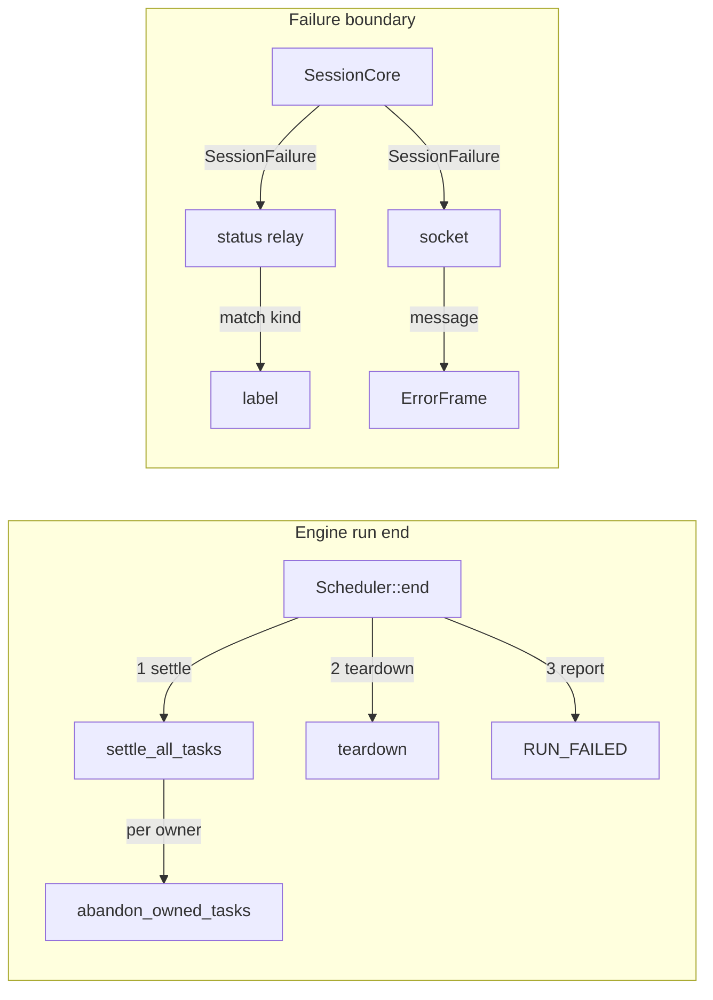

# Harness Debt Removal

<product-contract>

## Product Requirements

The sans-io engine harness work (52 commits, `37be5c6d..4b47e885`, `Plan: vibe/2026-09-18-4-sans-io-engine-harness.md`) left two debts that the Debt Collector accepted after an independent challenge. Both are introduced by that work, both are still present at `4b47e885`, and both have a settled remedy. Everything else the Collector examined was rejected or is pre-existing and out of scope.

- Problem and users:
  - DEBT-SANSIO-01 (introduced by `3f7cc2ef`): when a run ends as a whole - the host cancels it, or a fatal answer such as a store-claims determinism conflict ends it - the scheduler tears every chain down without settling the tasks those chains own. A task that fired `TaskStarted` and was still live is persisted to the run log and reported to observers with a start and no terminal, and its slot reads `running` forever. Per-chain endings do settle tasks (`settle_owned_tasks`, `abort_subtree`); only whole-run exits skip it. The introducing commit says so itself: "an arm stranded by run cancellation or a determinism violation reports no terminal of its own, so the exactly-once-terminal contract no longer holds on those paths." Users: anyone reading a cancelled run's transcript by task - the Workshop, Papergate, the acceptance suites' own `terminals_per_started_task` helper.
  - PF-DEBT-B-01 (introduced by `58047a43`, placed by `216dcda5`): the harness session erases the typed `Event::ModelTurnFailed` / `Event::ToolCallFailed` events into the sentences `"Model turn failed in agent ..."` / `"Tool call failed in agent ..."` and broadcasts them on `Session::subscribe_errors() -> broadcast::Receiver<String>`. The Workshop shell recovers the failure kind by `message.starts_with(label)` against its own copy of those words, falling back to `"Agent failed"` - the label that tells the operator the agent's run ended. A one-sided reword in the harness silently relabels every survived turn as a dead agent; nothing compiles wrong, nothing fails. Users: Workshop operators reading the status bar.
- Goals:
  - Every task that fires `TaskStarted` receives exactly one terminal event on every run-termination path, and that terminal precedes the run's own end boundary.
  - The failure kind crosses the harness/workshop boundary as a Rust enum the compiler checks on both sides. The English sentence stays, as display text for the operator and the model; the Rust code never derives meaning from it.
- Non-goals: the exposed pre-existing debt (oversized `crates/promptforge/webfetch/src/{tool,config}.rs`, missing `## Invariants` markers on the `harness-web*` crates); all 52 rejected candidates; any architecture-record update; any change to the websocket error frame's wire shape; any refactor the two fixes do not require.
- Success criteria: the two focused tests in the Testing Plan pass; the existing suites for the touched crates pass; clippy, fmt, and the xtask structural harness stay green; `rg -n "starts_with" crates/workshop/server/src/agents/status.rs` matches nothing.
- Constraints (from `AGENTS.md` and `vibe/archdoc.md`): no source file over 500 lines; behavior changes ship with tests in the same change; `unwrap_used` and `expect_used` are denied outside tests; every `workshop-*` `lib.rs` opens with `## Invariants`; engine crates never name a harness crate; the Workshop names the harness only through `harness-api`. Operator constraint for this run: exactly two commits, minimal tests - one regression test per debt plus the re-pin of the one existing test the change breaks.
- Open questions: None

## Functional Specification

A Workshop operator cancels an agent whose program has a background task parked mid-round. The run log now shows that task ending, `abandoned` with reason `run_terminated`, before the run's own `RUN_FAILED` boundary; no task in the transcript reads `running` after the run has ended. Separately, when a model round fails and the program survives it, the status bar still reads `Model turn failed`; when the run itself dies it still reads `Agent failed`; but the shell now learns which it was from a typed value, and a future reword of the sentence cannot change the label.

- Actors and workflows:
  - Host cancels a run with live tasks: the scheduler settles every live task slot (state `Abandoned`, reason `RunTerminated`, one `TaskAbandoned` observation each, in ascending `TaskId` order), then tears the chains down, then reports `RUN_FAILED`. A task whose backing chain is aborted as part of settling another task's owner reports its terminal through the existing abort path exactly once; no slot reports twice.
  - A fatal answer ends the run (`apply_answer` returns `Err`, e.g. `Error::Determinism`): same settlement, same order.
  - A run ends successfully: the root chain's `settle_owned_tasks` has already ended its tasks; the run-level pass finds no live slot and emits nothing.
  - Harness observes `Event::ModelTurnFailed` or `Event::ToolCallFailed`: it broadcasts `SessionFailure { kind: FailureKind::ModelTurnFailed | ToolCallFailed, message: "<boundary> in agent `<section>`" }`.
  - Supervisor reports a run that ended in error: `SessionFailure { kind: FailureKind::RunFailed, message }`. Supervisor reports the synthetic terminal of an interrupt: `SessionFailure { kind: FailureKind::Interrupted, message }`.
  - Workshop status relay receives a `SessionFailure`: `failure_label(kind)` maps `ModelTurnFailed -> "Model turn failed"`, `ToolCallFailed -> "Tool call failed"`, `RunFailed | Interrupted -> "Agent failed"`, by exhaustive match; the push carries `failure.message` as before.
  - Workshop socket receives a `SessionFailure`: it sends `ErrorFrame::new(failure.message, None)`. The frame's bytes are identical to today's.
- Inputs and outputs: `AbandonReason` gains the serde variant `run_terminated` (additive; the run log is pre-release with no durable consumers). `subscribe_errors` returns `broadcast::Receiver<SessionFailure>`. No websocket, HTTP, or file format changes.
- States and validation: a task slot is live when `TaskState::is_live()`; run-level settlement moves every live slot to `Abandoned` with `ok = Some(false)`. `FailureKind` is a closed set of four; it is deliberately not `#[non_exhaustive]` so that `workshop-server`'s match is exhaustive and a new variant fails its build (the entire point of the fix; both crates are `publish = false` in one workspace).
- Errors and recovery: unchanged. The errors channel stays an ephemeral broadcast; a lagged receiver misses reports as today.
- Security and privacy behavior: unchanged; no new trust boundary.
- Acceptance criteria:
  - Cancelling a run while an author-spawned task is parked yields, in the recorded observations, exactly one terminal per started task, every terminal before the run-end boundary, and the stranded task's terminal is `abandoned` with `AbandonReason::RunTerminated`.
  - `on_error` given each `FailureKind` pushes a `Severity::Error`, `Activity::General` status whose label is the mapping above; the message is passed through unchanged.
  - `crates/workshop/server/src/agents/status.rs` contains no `starts_with` and no `SURVIVED_TURN_LABELS`.
  - `harness_api::{FailureKind, SessionFailure}` resolve; `harness_api::Session::subscribe_errors` returns `broadcast::Receiver<SessionFailure>`.

</product-contract>
<implementation-contract>

## Technical Design

Two independent, small changes: the scheduler gains a run-level settlement pass that reuses the per-owner abandonment machinery; the harness error channel gains a type.

- DEBT-SANSIO-01, engine:
  - `crates/promptforge-api-types/src/ids.rs`: add `AbandonReason::RunTerminated` with a doc comment ("The run itself ended - cancelled by the host or ended by a fatal answer - while the task was live; the engine ended it with the run."). The enum derives serde with `rename_all = "snake_case"`, so the wire spelling is `run_terminated`. Additive on a public enum; no existing variant changes.
  - `crates/promptforge-api-runtime/src/execute/scheduler/tasks.rs`: add `pub(super) fn settle_all_tasks(&mut self, reason: AbandonReason)`. It collects the distinct owners of every live slot (`slot.state.is_live()`), sorts them ascending by `ChainIndex`, and calls `self.abandon_owned_tasks(owner, reason)` for each, discarding the returned leaked list (no one receives an outcome for a run that is ending). Because `abandon_owned_tasks` aborts a task's backing chain, which abandons that chain's own tasks through `abort_subtree`, a nested slot is already terminal by the time its owner comes up in the loop and is skipped by `is_live()`; no slot reports twice. Nested tasks ended that way carry `OwnerAborted`, which is accurate for them.
  - `crates/promptforge-api-runtime/src/execute/scheduler/drive.rs`: in `Scheduler::end`, call `self.settle_all_tasks(AbandonReason::RunTerminated)` immediately before `self.teardown()`, so every `TaskAbandoned` observation precedes the `RUN_SUCCEEDED` / `RUN_FAILED` report. Rewrite the `end` and `teardown` doc comments: the run's end settles every live task exactly once, then tears down; delete the sentence "no task event fires - the run's own end is the record".
  - `crates/promptforge-api-runtime/src/execute/scheduler/notices.rs`: the model-notice text for `Abandoned(AbandonReason)` gains a `RunTerminated` arm if its match is exhaustive over the reason (the coder checks; if the match already uses a wildcard, no change).
  - `crates/promptforge-api-runtime/src/test_support/recording-observation.rs`: no change expected; the recorder stores the reason as a value.
- PF-DEBT-B-01, harness-sessions:
  - `crates/harness/sessions/src/session.rs` (or a sibling `session-failure.rs` wired by `#[path]` if `session.rs` would pass 500 lines): define
    - `#[derive(Clone, Copy, Debug, PartialEq, Eq)] pub enum FailureKind { ModelTurnFailed, ToolCallFailed, RunFailed, Interrupted }` - documented, not `#[non_exhaustive]`.
    - `#[derive(Clone, Debug, PartialEq, Eq)] pub struct SessionFailure { pub kind: FailureKind, pub message: String }` - a passive data bag by design: the kind is the machine-readable fact, the message is display text for the operator and the model.
  - `SessionCore::errors` becomes `broadcast::Sender<SessionFailure>`; `SessionCore::report(&self, kind: FailureKind, message: String)`.
  - `SessionCore::observe` (the `ModelTurnFailed | ToolCallFailed` arm): pick the kind by the matched variant and call `self.report(kind, format!("{boundary} in agent `{section}`"))`; the sentence is unchanged.
  - `crates/harness/sessions/src/session/supervisor.rs`: `report_failure` passes `FailureKind::RunFailed`; the interrupt-frame report in the closing path passes `FailureKind::Interrupted`.
  - `Session::subscribe_errors(&self) -> broadcast::Receiver<SessionFailure>`; doc comment updated to name the kind.
  - `crates/harness-api/src/lib.rs`: re-export `FailureKind` and `SessionFailure` beside `Session`.
- PF-DEBT-B-01, workshop-server:
  - `crates/workshop/server/src/agents/status.rs`: `relay` takes `broadcast::Receiver<SessionFailure>`; `on_error(failure: &SessionFailure, push: &Push)` calls `push.push_failure(failure_label(failure.kind), &failure.message, Activity::General)`; `failure_label(kind: FailureKind) -> &'static str` is an exhaustive `match` returning `"Model turn failed"`, `"Tool call failed"`, or `RUN_FAILED_LABEL`. Delete `SURVIVED_TURN_LABELS` and its doc comment; keep `RUN_FAILED_LABEL`. Rewrite the `on_error` doc comment to say the session reports the kind and the shell labels it.
  - `crates/workshop/server/src/agents/socket.rs`: `errors_rx: Option<broadcast::Receiver<SessionFailure>>`; the receive arm sends `ErrorFrame::new(failure.message, None)`. No other change.
- File and public API changes:
  - Modified: `ids.rs`, `tasks.rs`, `drive.rs`, possibly `notices.rs`; `session.rs`, `supervisor.rs`, `harness-api/src/lib.rs`; `status.rs`, `status-tests.rs`, `socket.rs`; one engine test module gains one test.
  - Public API: `AbandonReason` gains a variant; `harness_api` gains `FailureKind` and `SessionFailure`; `Session::subscribe_errors` changes its item type. All three are in-workspace, `publish = false` surfaces.
- Data, persistence, failure, security, and privacy constraints: the run log's `abandon_reason` column or JSON gains a new value, additive. No migration; the log is pre-release. Nothing else persisted, wired, or trusted changes.

</implementation-contract>
<verification-contract>

## Testing Plan

Minimal by operator instruction: one regression test per debt, plus the re-pin of the one existing test the type change breaks. Existing suites are the regression net.

- DEBT-SANSIO-01, focused (one new test in `crates/promptforge-api-runtime/src/execute/tests/`, beside the existing task tests, reusing the `terminals_per_started_task` helper and the serial driver with a cancel handle): a program spawns a task (`tasks.spawn`) that parks on a chat round, the test cancels the run while the task is live, then asserts (a) every started task has exactly one terminal, (b) the stranded task's terminal is `abandoned` with `AbandonReason::RunTerminated`, (c) every task terminal is observed before the run-end lifecycle boundary. Before the fix, (a) fails: the task has zero terminals.
- PF-DEBT-B-01, focused: `crates/workshop/server/src/agents/status-tests.rs::every_error_report_pushes_a_terminal_failure_status` is re-pinned to construct `SessionFailure { kind, message }` for each of the four kinds and assert the label mapping and message pass-through. The compile-time exhaustive match is the primary guard; this test pins the label text.
- Regression: `cargo nextest run --locked -p promptforge-api-runtime --all-features` (fanout and model-task acceptance suites include the exactly-one-terminal checks on the paths they already cover); `cargo nextest run --locked -p harness-sessions -p harness-api`; `cargo nextest run --locked -p workshop-server` and with `--features headless`.
- Architecture: `cargo test -p build-xtask` (500-line ceiling, invariants headers, engine manifest guard, retired symbols, dependency matrix).
- Exit criteria: the above pass; `cargo fmt --all --check`; `cargo clippy --workspace --exclude workshop --exclude workshop-server --exclude workshop-server-api --all-targets --all-features -- -D warnings` and `cargo clippy -p workshop -p workshop-server -p workshop-server-api --all-targets -- -D warnings`; `rg -n "starts_with|SURVIVED_TURN_LABELS" crates/workshop/server/src/agents/status.rs` matches nothing.

</verification-contract>
<decision-record>

## Decision Record

- Decisions:
  - Run-level termination settles tasks through a settle-all pass in `Scheduler::end` before `teardown`, reusing `abandon_owned_tasks`. Rationale: the arena, the abandonment machinery, and the `TaskAbandoned` observation already exist; one loop over live owners closes the gap without a second code path. Confidence high: mechanism verified end-to-end by the Collector's analyst and challenger.
  - `AbandonReason::RunTerminated` is an additive variant. Rationale: the model notice and the log should say the run ended, not that an owner returned; the run log is pre-release with no durable consumers, so the additive value costs nothing.
  - Failure kinds cross the harness/workshop boundary as `FailureKind`, with the sentence retained as `SessionFailure::message`. Rationale, from the operator: the English sentence is for the LLM and the user; the Rust code uses idiomatic typed patterns. This is the user-resolved architecture choice (option (a) of the Collector's escalation).
  - `FailureKind` is not `#[non_exhaustive]`. Rationale: the guarantee the fix buys is that a new kind fails `workshop-server`'s build until it is labelled; a non-exhaustive enum forces a wildcard arm downstream and gives that guarantee away. Both crates are private members of one workspace.
  - Four kinds, not two: `RunFailed` and `Interrupted` are distinct facts the supervisor already knows; collapsing them into the label would re-erase information at the producer. Both map to `"Agent failed"` today.
  - Exactly two commits, one test per debt. Operator instruction for this run.
- Rejected alternatives:
  - Route run termination through `abort_subtree(root)`: conflates run-end with chain-abort semantics and re-enters teardown ordering the chains already handle.
  - Documentation-only for DEBT-SANSIO-01 (teach readers to infer termination from `RUN_FAILED`): leaves the plan's `abandoned` vocabulary contradicted and makes per-task log slicing silently lossy.
  - Shared prefix-token constant re-exported through `harness-api` (option (b)): the compiler would check the constant's name, not the classification; the shell would still call `starts_with` on a sentence.
  - Accept PF-DEBT-B-01 with a comment (option (c)): the silent-mislabel path stays open.
- Assumptions, risks, and notes:
  - `abandon_owned_tasks` on an owner whose backing chain is aborted ends nested tasks before the loop reaches their owners, so `is_live()` filters them and no slot reports twice. Falsifier: the new test's `terminals_per_started_task` shows a task with two terminals.
  - The successful-run path finds no live slot at `end` because the root chain's `settle_owned_tasks` ran first. Falsifier: an existing acceptance test observes a new `TaskAbandoned` on a run that succeeded.
  - The websocket error frame carries `SessionFailure::message` byte-for-byte as today, so no SPA change is needed. Falsifier: an SPA test asserting the error frame text fails.
  - `session.rs` is near the 500-line ceiling; if the new types push it over, they move to `session-failure.rs` wired by `#[path]`, per the flat-directory convention.

### Deferred and Out of Scope

- Deferred: a second DEBT-SANSIO-01 test on the determinism-violation path (fatal answer ends the run). Reason: operator asked for minimal tests; the cancel path exercises the same `end` funnel. Revisit if a store-conflict regression is ever observed.
- Out of scope: the exposed pre-existing webfetch oversize and missing `## Invariants` markers; every rejected candidate from the Collector run; architecture-record edits; SPA changes.

</decision-record>
<project-survey>

## Project Survey

- Status: complete
- Build command: `cargo build --locked -p gateway` (default-members is `crates/gateway/app` only, so plain `cargo build` builds the gateway; desktop app is `cargo build --locked -p workshop`; `cargo check -p gateway --no-default-features` is the headless feature gate). Toolchain: stable Rust, edition 2024, resolver 3, `rust-lld` linker with static CRT on `x86_64-pc-windows-msvc` (`.cargo/config.toml`). UI bundles are esbuild via `crates/build-ui` and need `npm ci --prefix crates/workshop/server/ui` and `npm ci --prefix crates/gateway/config-ui/ui` first.
- Focused test command pattern: `cargo nextest run --locked -p <crate> <filter>` for a crate or single test; `cargo test --locked -p <crate> --test <target> <name>` for one integration target (CI uses this form, e.g. `cargo test -p gateway-stt --test it architecture`); doctests only via `cargo test -p <crate> --doc`.
- Component test command pattern: engine crates `cargo nextest run --locked -p promptforge-api-runtime -p promptforge-lua -p promptforge-api-types --all-features`; harness crates `cargo nextest run --locked -p harness-sessions -p harness-api -p harness-runner`; gateway `cargo nextest run --locked -p gateway --all-features`; workshop partition `cargo nextest run --locked -p workshop -p workshop-server -p workshop-server-api` plus `cargo nextest run --locked -p workshop-server --features headless`; structural harness `cargo test -p build-xtask`; SPA `npm test` (and `npm run typecheck`, `npm run build`) inside `crates/workshop/server/ui` or `crates/gateway/config-ui/ui`.
- Full-suite test command: `cargo nextest run --locked --workspace --exclude workshop --exclude workshop-server --exclude workshop-server-api --all-features`, then `cargo test --workspace --exclude workshop --exclude workshop-server --exclude workshop-server-api --all-features --doc`, then `cargo nextest run --locked -p workshop -p workshop-server -p workshop-server-api` and `cargo test --doc -p workshop -p workshop-server -p workshop-server-api`. Nextest config in `.config/nextest.toml` (60s slow-timeout, terminate after 3, `heavy` test group for the whisper STT crates).
- Linter command: `cargo clippy --workspace --exclude workshop --exclude workshop-server --exclude workshop-server-api --all-targets --all-features -- -D warnings`; workshop partition `cargo clippy -p workshop -p workshop-server -p workshop-server-api --all-targets -- -D warnings`. Never run a standalone `cargo check --workspace` beside clippy. Workspace lints: `unsafe_code = "forbid"`, `missing_docs`, `unreachable_pub`, `missing_debug_implementations` warn; clippy `all` and `pedantic` deny, `unwrap_used` and `expect_used` deny (allowed in tests via `clippy.toml`), `doc_markdown` allow. Supply chain: `cargo deny check` (`deny.toml`) and `cargo audit`; CI also fails if `ring` enters the gateway's normal dependency closure.
- Formatter check command: `cargo fmt --all --check` (`rustfmt.toml`: `style_edition = "2024"`; also the pre-commit hook in `.githooks/`).
- Docs command: `RUSTDOCFLAGS="-D warnings" cargo doc --workspace --no-deps --all-features --exclude workshop --exclude workshop-server --exclude workshop-server-api`; user guide `mdbook build guide` (`guide/book.toml`, sources assembled by `cargo run -p build-user-guide`). Rustdoc `broken_intra_doc_links` and `private_intra_doc_links` deny.
- Test placement and naming conventions: integration tests are one target per crate, `tests/it/main.rs` with one module file per area for most crates; `promptforge-api-runtime` names its target `tests/suite/main.rs` with prompt fixtures under `tests/prompts/`. Unit tests sit beside the module: a single file uses the kebab sibling form wired by `#[path]` (`src/agents/status-tests.rs`), three or more files become a `tests/` subdirectory with `mod.rs` (`src/execute/tests/{mod,tasks,fanout_acceptance,model_task_acceptance,...}.rs`). Test names are long snake_case sentences (`every_error_report_pushes_a_terminal_failure_status`). Dev-only helpers are gated behind a `test-support` feature or `src/test_support.rs`; the engine's serial driver and recording observer live there. Behavior changes ship with tests in the same change; structural tests need explicit user approval.
- Directory map: `Cargo.toml` (workspace manifest, explicit member list), `crates/` (public and shared layer: `gateway-api`, `gateway-api-discovery`, `harness-api`, `promptforge-api-runtime`, `promptforge-api-types`, `shared-*`, `workspace-hack`, `build-*`), `crates/promptforge/` (private container: `lua`, `parser`, `store`, `vfs`, `model-client`, `web`, `webfetch`, `web-search`), `crates/harness/` (private container: `sessions`, `runner`, `log`, `models`, `capabilities`), `crates/gateway/` (private container), `crates/workshop/` (private container: `shell` (package `workshop`), `server` (package `workshop-server`, with `ui/` SPA), `server-api`, `sessions`, `status`, `registry`, `protocol`, `support`, ...), `guide/`, `prompts/`, `tools/`, `vibe/` (`archdoc.md`, dated plan records), `.github/workflows/`, `.githooks/`, `.config/`, `.cargo/config.toml`.
- Component boundaries: dependencies flow one way: shell -> features -> services -> vocabulary. `promptforge-api-types` is the vocabulary (`AbandonReason`, `TaskId`, `Event`). `promptforge-api-runtime` is the sans-io engine: deterministic, no clock, no RNG, no tokio outside `test-support`; its host interface is `Run::new`, `step`, `resume`, `cancel`. Engine crates never name a harness crate (enforced by `engine_guards` in `build-xtask` via tidy). The harness (`crates/harness/*`) hosts the engine, owns the run log, performs effects, and reaches the gateway through its public protocol crates only. `harness-api` is the Workshop's one door into the harness; `workshop-server` names `harness_api::Session` and its re-exports, never a `crates/harness/*` crate directly. `cargo test -p build-xtask` enforces the matrix from every manifest.
- Conventions summary: `AGENTS.md` is authoritative and `vibe/archdoc.md` lists the invariants. Reuse or minimally extend an existing facility before adding machinery. Libraries return failures; runtime paths never exit the process or install process-global state. Unsafe code is forbidden workspace-wide. No file exceeds 500 lines (split before editing). Source directories are flat: one or two child files sit beside the parent as `foo-bar.rs` with `#[path]`, three or more become a `foo/` directory. Every `workshop-*` `lib.rs` opens with a `//!` doc carrying `## Invariants`. Error messages are written for model consumption: concise, required-versus-actual. Every member inherits `[lints] workspace = true`; crates are `publish = false`. Doc comments explain the invariant and the reason and name the detecting test where one exists.

</project-survey>
<execution-plan>

## Execution Instructions

Two commits, one per debt, independent of each other. Each contains its code and its test. Commands run from the repository root.

<step-1>

### Step 1: Settle live tasks when the run ends [completed]

- Component: `none`
- Goal: every task that fired `TaskStarted` receives exactly one terminal on host cancellation and on a fatal-answer run end, before the run's own end boundary.
- Changes:
  - `crates/promptforge-api-types/src/ids.rs`: add `AbandonReason::RunTerminated` with its doc comment.
  - `crates/promptforge-api-runtime/src/execute/scheduler/tasks.rs`: add `pub(super) fn settle_all_tasks(&mut self, reason: AbandonReason)` - distinct owners of live slots, sorted ascending, each passed to `abandon_owned_tasks(owner, reason)`, leaked list discarded, with a doc comment naming the no-double-terminal argument.
  - `crates/promptforge-api-runtime/src/execute/scheduler/drive.rs`: `Scheduler::end` calls `self.settle_all_tasks(AbandonReason::RunTerminated)` before `self.teardown()`; rewrite the `end` and `teardown` doc comments to the new contract.
  - `crates/promptforge-api-runtime/src/execute/scheduler/notices.rs`: add the `RunTerminated` notice arm if the reason match is exhaustive.
- Tests: one new test in `crates/promptforge-api-runtime/src/execute/tests/` (in the existing task test module, or a sibling file registered in `mod.rs`), reusing `terminals_per_started_task` and the serial driver: spawn a task that parks on a chat round, cancel the run, assert exactly one terminal per started task, the stranded task's terminal is `abandoned` with `RunTerminated`, and every task terminal precedes the run-end boundary. Focused command: `cargo nextest run --locked -p promptforge-api-runtime --all-features <test-name>`.
- Gate: `cargo nextest run --locked -p promptforge-api-runtime -p promptforge-api-types --all-features`; `cargo fmt --all --check`; `cargo clippy --workspace --exclude workshop --exclude workshop-server --exclude workshop-server-api --all-targets --all-features -- -D warnings`; `cargo test -p build-xtask`.
- Commit: one commit holding the `ids.rs`, `tasks.rs`, `drive.rs`, and (if touched) `notices.rs` changes plus the new test.

</step-1>

<step-2>

### Step 2: Type the harness failure boundary

- Component: `none`
- Goal: the Workshop learns a session failure's kind from `FailureKind`, not from the sentence; the sentence remains display text.
- Changes:
  - `crates/harness/sessions/src/session.rs` (or `session-failure.rs` via `#[path]` if the ceiling requires): `FailureKind { ModelTurnFailed, ToolCallFailed, RunFailed, Interrupted }` and `SessionFailure { kind, message }`; `SessionCore::errors: broadcast::Sender<SessionFailure>`; `SessionCore::report(kind, message)`; the `observe` failure arm picks the kind from the matched event and keeps the sentence; `Session::subscribe_errors() -> broadcast::Receiver<SessionFailure>` with its doc comment naming the kind.
  - `crates/harness/sessions/src/session/supervisor.rs`: `report_failure` uses `FailureKind::RunFailed`; the interrupt-frame report uses `FailureKind::Interrupted`.
  - `crates/harness-api/src/lib.rs`: re-export `FailureKind` and `SessionFailure`.
  - `crates/workshop/server/src/agents/status.rs`: relay and `on_error` take `SessionFailure`; `failure_label(kind: FailureKind) -> &'static str` by exhaustive match; delete `SURVIVED_TURN_LABELS`; keep `RUN_FAILED_LABEL`; rewrite the doc comments.
  - `crates/workshop/server/src/agents/socket.rs`: `errors_rx` carries `SessionFailure`; the frame is built from `failure.message`.
- Tests: re-pin `crates/workshop/server/src/agents/status-tests.rs::every_error_report_pushes_a_terminal_failure_status` to feed `SessionFailure` values for all four kinds and assert label mapping plus message pass-through. Focused command: `cargo nextest run --locked -p workshop-server every_error_report_pushes_a_terminal_failure_status`.
- Gate: `cargo nextest run --locked -p harness-sessions -p harness-api -p workshop-server`; `cargo nextest run --locked -p workshop-server --features headless`; `rg -n "starts_with|SURVIVED_TURN_LABELS" crates/workshop/server/src/agents/status.rs` matches nothing; `cargo fmt --all --check`; `cargo clippy --workspace --exclude workshop --exclude workshop-server --exclude workshop-server-api --all-targets --all-features -- -D warnings`; `cargo clippy -p workshop -p workshop-server -p workshop-server-api --all-targets -- -D warnings`; `cargo test -p build-xtask`.
- Commit: one commit holding the `session.rs` (or `session-failure.rs`), `supervisor.rs`, `harness-api/src/lib.rs`, `status.rs`, `socket.rs` changes plus the re-pinned `status-tests.rs`.

</step-2>

</execution-plan>
