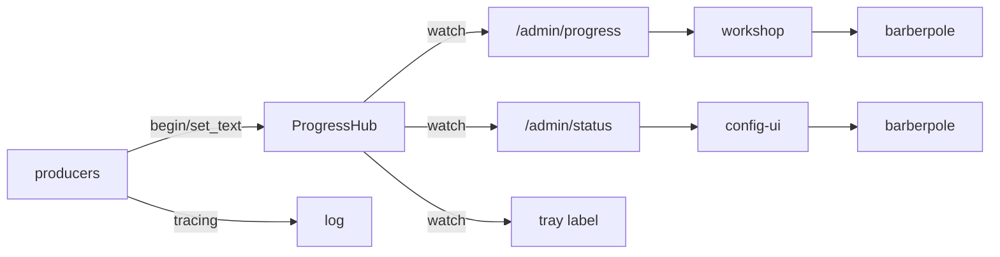

# Gateway API Types, Busy-Text Progress, and the Barberpole

<product-contract>

## Product Requirements

The PromptForge workspace has two products, the Gateway and the Workshop, that should share only their protocol. Today they share a progress-reporting library with weighted operation trees that no consumer needs, the Gateway's public types crate has no external consumers, the status bar hides its LEDs whenever anything is busy, two mechanisms enforce one dependency matrix, and the top-level policy file describes rules the tree no longer matches. This plan reduces the shared surface to two public crates (types and discovery), collapses progress to a busy flag plus a text, replaces the determinate progress bar with an indeterminate barberpole in both UIs, and brings enforcement and policy back into agreement.

- Problem and users: maintainers of the `promptforge` repository. The Gateway (`crates/gateway/`) and Workshop (`crates/workshop/`) families are coupled through `crates/shared-progress`, whose hub, weighted tree, handles, remote importer, and meter are used on both sides (`crates/shared-progress/src/{hub,tree,handle,remote,render}.rs`). The public crate `crates/gateway-api` is imported by no crate outside the gateway family (no `gateway-api` dependency in any `crates/harness*/**/Cargo.toml` or `crates/workshop/**/Cargo.toml`). The status bar shell swaps its LED group out for the progress bar (`crates/shared-ui/status-bar.ts` `renderSlot`), so live LEDs disappear while work runs.
- Goals:
  - Exactly two public gateway crates: `gateway-api-types` (wire vocabulary) and `gateway-api-discovery` (unchanged). Everything else under `crates/gateway/` is private.
  - Progress is one primitive: a producer begins an activity with a text, may replace the text, and ends it. No fractions, weights, leaves, or hierarchy anywhere in the machinery or on the wire.
  - Both status bars (Workshop SPA and Gateway config UI) show the activity text and an indeterminate barberpole, 144px wide, placed left of the LED indicators, which are never hidden.
  - The progress machinery lives inside the gateway family as private `gateway-progress`; the Workshop depends on the wire type only.
  - One dependency-matrix mechanism (`crates/build-xtask/src/product.rs`); the redundant `crates/gateway/stt/api/tests/it/architecture.rs` and its CI step are removed.
  - The `//! ## Invariants` marker is mandatory for every `workshop-*` and `harness-*` crate (Tauri shell `workshop` exempt), enforced by `crates/build-xtask/src/tidy.rs`.
  - Policy text (`AGENTS.md`, `crates/README.md`, crate-level `AGENTS.md`) matches the tree.
- Non-goals:
  - A shared typed HTTP client for the gateway (a client is code; each consumer keeps its own).
  - Moving the gateway app's admin and cache wire types into `gateway-api-types`.
  - Splitting `crates/shared-loopback`.
  - Changing the `gateway-protocol` dependency on `gateway-config`, splitting the gateway app crate, reshaping `crates/gateway/stt/`, or renaming the `shared-cloud-providers` binary.
  - Letting `promptforge-*` crates depend on `gateway-api-types`.
  - A flat-directory structural check or a `harness-*` scaffold in `new_crate`.
- Success criteria:
  - `cargo test -p build-xtask` passes with `PUBLIC_GATEWAY = ["gateway-api-types", "gateway-api-discovery"]` and the name-based marker rule.
  - No crate outside `crates/gateway/` depends on `gateway-progress`; no crate anywhere depends on `shared-progress` or `gateway-api`.
  - `GET /admin/progress` streams `{"busy":bool,"text":string}` snapshots; `GET /admin/status` reports a top-level `progress` object and no `fraction`.
  - The Workshop status frame has `busy: bool` and no `progress` object; the barberpole shows while busy and the LEDs stay visible throughout.
  - The full verification gate set passes once, on the final step.
- Constraints:
  - Dependency direction rules of the repository hold for every dependency kind (normal, dev, build, target): promptforge-* never depends on gateway/workshop/harness; gateway-* never depends on promptforge/workshop/harness; workshop-* may reach gateway crates only through the public pair; harness-* may reach gateway crates only through the public pair; family containers are private (`crates/build-xtask/src/product.rs`).
  - No file in a crate that carries the Invariants marker may exceed 500 lines (`crates/build-xtask/src/tidy.rs`, `MAX_FILE_LINES = 500`).
  - Source directories are flat: a `src/` subdirectory needs three or more files; one or two files sit beside the parent as `parent-label.rs` with `#[path]`.
  - No new structural enforcement beyond the approved marker rule.
  - Component CSS uses tokens, no raw colors or sizes (`crates/shared-ui/tokens.css`).
  - Activity text is user-visible and crosses the wire; it must never contain a bearer key, credential, or other secret.
  - Tests stay fast and light during execution: each step runs only its focused tests; the full gate set runs once at the end.
- Open questions: None

## Functional Specification

Gateway producers report a single live activity text. The gateway publishes the newest live text as a busy/text snapshot to its SSE stream, its status endpoint, and its tray label. The Workshop decodes the snapshot and pushes a busy frame to its status bar; the config UI polls the status endpoint. Both status bars render the text and a barberpole while busy and return the LED group to rest when idle.

- Actors and workflows:
  - Producer (gateway internals: `gateway-local`, `gateway-stt`, `gateway-stt-backend-whisper`, the `gateway` app): calls `hub.begin(text)` to get an `Activity` guard, optionally `activity.set_text(text)` as work proceeds, and drops the guard when done. A download loop formats its own percent into the text on each whole-percent change (`"Downloading qwen3-8b.gguf 45%"`). The producer logs its own `started` and `finished` lines with `tracing::info!` and failures with `tracing::warn!` or `tracing::error!`; no per-percent log lines.
  - Gateway SSE (`crates/gateway/app/src/admin/progress.rs`): on subscribe, sends the current snapshot first, then one event per change, plus the existing heartbeat comments.
  - Gateway status (`crates/gateway/app/src/admin/status.rs`): adds a top-level `progress` object with the current snapshot; the queue's `active` entry keeps `name` and loses `fraction`.
  - Gateway tray (`crates/gateway/app/src/tray/logic.rs` `status_label`): `"Running - {text}"` while busy; the existing model summary when idle.
  - Workshop consumer (`crates/workshop/gateway/src/gateway_progress.rs`): decodes each snapshot from the SSE stream, applies the show-delay and minimum-visible policy, and calls `push_busy(text, ...)` or `push_idle()`.
  - Config UI (`crates/gateway/config-ui/ui/src/components/status-bar.ts`): on each status poll, `setBusy(progress.busy)` and the text from `progress.text` while busy; existing model summary when idle.
  - Enforcement (`crates/build-xtask`): `cargo test -p build-xtask` fails when a `workshop-*` or `harness-*` crate other than `workshop` lacks the marker, or when a marked crate has a file over 500 lines.
- Inputs and outputs:
  - Wire type (public, `crates/gateway-api-types/src/progress.rs`): `Progress { busy: bool, text: String }`, serde JSON `{"busy":true,"text":"Downloading qwen3-8b.gguf 45%"}`. `Default` is idle with empty text.
  - `GET /admin/progress`: `text/event-stream`, each `data:` line one `Progress` JSON.
  - `GET /admin/status`: existing document plus `"progress": {"busy":..,"text":..}`; `active.fraction` removed.
  - Workshop `StatusBarUpdate` / `StatusFrame`: `busy: bool` replaces `progress: Option<Progress>`; `workshop_protocol::Progress` is deleted.
  - `Push::push_busy(label, description, activity)` replaces `Push::push_progress(label, description, current, total, activity)` (`crates/workshop/registry/src/push.rs`).
  - `POST /v1/cache` SSE download stream: unchanged; it continues to report raw byte counts (`crates/gateway/app/src/cache.rs` `ChannelProgress`).
- States and validation:
  - Hub state: an ordered list of live activities `(id, text)` in begin order. Published snapshot: `busy = !list.is_empty()`, `text = last live text` or empty. When the newest ends, the next most recent shows.
  - Workshop anti-flicker: the barberpole appears only after an activity has been busy for 1s (`SHOW_DELAY`), stays at least 500ms once shown (`MIN_VISIBLE`); these constants move from `crates/workshop/status/src/progress.rs` to the workshop-gateway consumer.
  - Barberpole: hidden when idle (`display: none`), so the LEDs shift left by 144px plus the group gap when it appears; the LEDs are never given `hidden`.
  - Reduced motion: the barberpole animation stops and renders static stripes under `prefers-reduced-motion: reduce`.
- Errors and recovery:
  - Malformed SSE payload: the Workshop decoder keeps its existing `GatewayError::Malformed` path (`crates/workshop/gateway/src/gateway/progress.rs`).
  - Producer failure: the activity guard drops on every exit path (RAII), so a failed operation never leaves the bar busy; the producer logs the failure.
  - Version skew: a Workshop attaching to an already-running older Gateway (the tray keeps the gateway alive across Workshop restarts) will fail to decode the old event shape until the Gateway restarts. Accepted; noted for the release.
- Security and privacy behavior: activity text is displayed in the Workshop status bar, the config UI, the tray, and the gateway log; producers must never include a bearer key, API key, or other credential in it. The bearer-key secrecy invariants of `workshop-gateway` and `harness-models` remain unchanged.
- Acceptance criteria:
  - Beginning an activity publishes `busy: true` with its text; dropping the last guard publishes `busy: false`; a nested begin shows the newest text and falls back on drop; `set_text` republishes.
  - The Workshop status bar shows the barberpole and text after 1s of busy, keeps it at least 500ms, and never hides the LED group.
  - The config UI shows the barberpole and text while `progress.busy`.
  - The tray label reads `"Running - {text}"` while busy.
  - No file under `crates/gateway/local/src/artifacts/` computes a fraction for the hub; the download loop formats its percent into text.
  - `cargo test -p build-xtask` fails on a fixture `harness-*` crate without the marker and passes on the `workshop` shell without one.

</product-contract>
<implementation-contract>

## Technical Design

Two public crates remain at the workspace root for the gateway family. `gateway-api-types` (renamed from `gateway-api`) holds the provider sheet schema, the model vocabulary, and the new `Progress` wire type; it depends on `serde`, `time`, and no workspace crate. `shared-progress` is rewritten in place to about 150 lines around a `watch` channel, then moved into `crates/gateway/progress` as private `gateway-progress`. The Workshop drops every dependency on the machinery and decodes the wire type alone. The shared status bar shell replaces its `<progress>` element with a barberpole that sits beside, not over, the LED group.

- Architecture:



  - Public gateway crates: `crates/gateway-api-types` and `crates/gateway-api-discovery`. Private container `crates/gateway/` gains `progress/`. `PUBLIC_GATEWAY` in `crates/build-xtask/src/product.rs` becomes `["gateway-api-types", "gateway-api-discovery"]`; container privacy makes `gateway-progress` private with no further code.
  - Progress and logging are separate channels. The hub feeds UIs only. The hub-to-tracing bridge `crates/gateway/app/src/render.rs` is deleted; producers log directly.
- Modules and interfaces:

```rust
// crates/gateway-api-types/src/progress.rs  (public wire type)
#[derive(Debug, Clone, Default, PartialEq, Eq, Serialize, Deserialize)]
pub struct Progress { pub busy: bool, pub text: String }

// crates/gateway/progress/src/lib.rs  (private machinery, package gateway-progress)
pub struct ProgressHub { /* Mutex<Vec<(u64, String)>> in begin order + watch::Sender<Progress> */ }
impl ProgressHub {
    pub fn new() -> Self;
    pub fn begin(&self, text: impl Into<String>) -> Activity;
    pub fn current(&self) -> Progress;
    pub fn subscribe(&self) -> tokio::sync::watch::Receiver<Progress>;
}
pub struct Activity { /* Arc<hub inner>, id */ }
impl Activity { pub fn set_text(&self, text: impl Into<String>); }
impl Drop for Activity { /* remove own entry, republish */ }
```

  - `gateway-progress` depends on `gateway-api-types`, `tokio` (`sync` only), `workspace-hack`. The `time` and `tracing` dependencies and the `serde` feature of `shared-progress` are dropped.
  - Shared status bar shell (`crates/shared-ui/status-bar.ts`): `renderSlot(SlotProgress | null)` becomes `setBusy(busy: boolean)`; the `progress` field and `SlotProgress` type are removed; a `barberpole` element is appended to `.status-bar__right` immediately before the indicators group; the indicators group never receives `hidden`.
  - Workshop push facade (`crates/workshop/registry/src/push.rs`): `push_busy(label, description, activity)` replaces `push_progress`. `push_idle()` unchanged.
  - Workshop protocol (`crates/workshop/protocol`): `StatusBarUpdate.busy: bool` replaces `progress: Option<Progress>`; `Progress` deleted. SPA `StatusFrame` (`crates/workshop/ui/src/services/protocol.ts`) mirrors it.
  - Enforcement (`crates/build-xtask/src/tidy.rs`): `participating_crates` selects the union of (a) every crate whose package name is `workshop-*` or `harness-*` or `harness-api`, excluding the package `workshop`, and (b) every crate carrying the marker (so `build-xtask` stays in deliberately). A crate in set (a) whose `src/lib.rs` lacks `//! ## Invariants` is a violation.
- File and public API changes:

Before (only what changes):

```
crates/
  gateway-api/                    public, retires
    src/{lib.rs, metadata.rs}     sheet schema + model vocabulary
  shared-progress/                shared, retires
    src/{lib,event,tree,handle,hub,remote,render}.rs   ~1,200 lines
  shared-ui/
    status-bar.{ts,css}           slot swaps progress bar over the LEDs
    tokens.css                    --progress-width: 96px
  gateway/
    app/src/{commands,cache,boot_load,config_apply,runner}.rs   tree producers
    app/src/render.rs             hub-to-tracing bridge
    app/src/admin/{progress,status}.rs   fraction on the wire
    app/src/tray/logic.rs         "Running - label (34%)"
    local/src/artifacts/progress.rs      byte-to-fraction adapter
    local/src/{artifacts,runtime,server,cache}.rs   tree producers
    local/src/artifacts/{download,digest,archive,verified}.rs   tree producers
    stt/api/src/{artifacts,generation,service}.rs   tree producers
    stt/api/src/realtime/{session,route,registry}.rs   tree producers
    stt/api/tests/it/architecture.rs     redundant boundary matrix
    stt/backend-whisper/src/{model,config}.rs   tree producers
    config-ui/ui/src/components/status-bar.ts   renders percent bar
  workshop/
    protocol/                     StatusBarUpdate.progress: Option<Progress>
    registry/src/push.rs          push_progress(current, total)
    server/src/app.rs             creates the ProgressHub
    server/src/agents/session-menu.rs   push_step fractions
    status/src/{progress,progress-tests,handles}.rs   hub renderer, ProgressMeter
    gateway/src/gateway_progress.rs     RemoteOperation import
    ui/src/parts/status/status-bar.ts   renderSlot(frame.progress)
  harness/webfetch/src/{tool,config}.rs   1,250 and 747 lines, unmarked crate
  build-xtask/src/{product,tidy}.rs
.github/workflows/ci.yml          "Check product dependency boundaries" step
AGENTS.md, crates/README.md, crates/gateway/README.md
```

After:

```
crates/
  gateway-api-types/              public, renamed
    src/{lib.rs, metadata.rs}     unchanged content
    src/progress.rs               Progress { busy, text }
  gateway-api-discovery/          public, untouched
  shared-ui/
    status-bar.{ts,css}           barberpole left of LEDs; setBusy(bool)
    tokens.css                    --progress-width: 144px
  gateway/
    progress/                     private, package gateway-progress
      src/lib.rs                  ProgressHub, Activity (~150 lines)
    app/src/...                   begin/set_text producers; own tracing lines
    app/src/render.rs             deleted
    app/src/admin/{progress,status}.rs   Progress snapshot; top-level progress
    app/src/tray/logic.rs         "Running - text"
    local/src/artifacts/progress.rs      deleted
    local, stt/api, stt/backend-whisper  begin/set_text producers
    stt/api/tests/it/architecture.rs     deleted
    config-ui/ui/src/components/status-bar.ts   text + setBusy
  workshop/
    protocol/                     StatusBarUpdate.busy: bool
    registry/src/push.rs          push_busy(label, description, activity)
    server/src/app.rs             no hub
    server/src/agents/session-menu.rs   push_busy at switch start
    status/                       progress.rs and progress-tests.rs deleted; no register_tasks
    gateway/src/gateway_progress.rs     decode Progress, anti-flicker, Push
    ui/src/parts/status/status-bar.ts   setBusy(frame.busy)
  harness/{web,webfetch,web-search}/src/lib.rs   ## Invariants added
  harness/webfetch/src/            tool.rs and config.rs split under 500 lines
  build-xtask/src/{product,tidy}.rs   PUBLIC_GATEWAY renamed; name-based marker rule
.github/workflows/ci.yml          boundary step removed
AGENTS.md, crates/README.md, crates/gateway/README.md   updated
```

  - Dependents of `gateway-api` to repoint to `gateway-api-types`: `crates/gateway/{config,protocol,cloud-providers,app}/Cargo.toml`; source `use gateway_api::` in `crates/gateway/config/src/config.rs`, `crates/gateway/protocol/src/wire.rs`, the sheet builder in `crates/gateway/cloud-providers/src/`, `crates/gateway/app/src/cloud_models.rs` and its `tests/`, `crates/gateway/app/tests/it/cloud_models.rs`. Root `Cargo.toml` `[workspace.dependencies]` entry renamed.
  - `shared-progress` move: `git mv crates/shared-progress crates/gateway/progress`; package `gateway-progress`; root `Cargo.toml` `members` gains `"crates/gateway/progress"` (containers are excluded from the glob), `[workspace.dependencies]` swaps `shared-progress` for `gateway-progress`; `crates/gateway/{app,local,stt/api,stt/backend-whisper}/Cargo.toml` and `use shared_progress::` repointed.
  - Barberpole CSS (`crates/shared-ui/status-bar.css`, `crates/shared-ui/tokens.css`): `--progress-width: 144px` (1.5in at CSS 96dpi, px so it composes with sibling px tokens); `--progress-height: 6px` and the `--progress-track`/`--progress-fill`/`--progress-glow` tokens reused with comments updated; `repeating-linear-gradient(-45deg, ...)` stripes with period `2 * --progress-height`, `background-size` twice the period, `@keyframes` sliding `background-position` one period per loop, linear infinite; `border-radius: calc(var(--progress-height) / 2)`, `overflow: hidden`; the slot's `min-width: var(--progress-width)` is removed.
  - Policy text: `AGENTS.md` lines naming the public pair, the harness may-depend list, the public-surface summary, the `shared-progress` reporting rule, the `architecture` test clause, the SPA paths `ui/editor/` and `ui/agent/` (now `parts/editor/`, `parts/agent/`), the example `ui/agent/agent-session.css` (now `parts/agent/agent-session.css`), the SPA `index.ts` marker half of the Invariants sentence (dropped), and the "No file exceeds 500 lines" sentence (scoped to marked crates). Six harness `lib.rs` Invariants blocks (`crates/harness-api`, `crates/harness/{sessions,runner,models,log,capabilities}`) rename `gateway-api`. `crates/harness/{sessions,models}/AGENTS.md` and `crates/promptforge-api-runtime/AGENTS.md` lose prose duplicated from their `lib.rs` or the root file; "Core" becomes `promptforge-api-runtime` in `crates/promptforge/parser/AGENTS.md`, `crates/promptforge-api-runtime/AGENTS.md`, `crates/harness/webfetch/AGENTS.md`, `crates/harness/web-search/AGENTS.md`. `crates/README.md` and `crates/gateway/README.md` follow. Dated records under `vibe/` are not edited.
- Data, persistence, failure, security, and privacy constraints:
  - `Progress` is additive-friendly: any future field carries `#[serde(default)]`; no schema version.
  - The hub's `watch` channel keeps only the latest snapshot; there is no coalescer and no event replay beyond the current snapshot on subscribe.
  - `Activity` is an RAII guard; every producer exit path ends its activity.
  - No producer places credentials in activity text.
  - `POST /v1/cache` keeps its own byte-count SSE protocol; `ChannelProgress` drops its tree leaf and additionally sets the activity text.
  - Workspace lints apply: `unsafe_code = "forbid"`, clippy `all` and `pedantic` deny, `unwrap_used`/`expect_used` deny (root `Cargo.toml` `[workspace.lints]`).

</implementation-contract>
<verification-contract>

## Testing Plan

Each step runs only the focused tests of the crates it touches; the full gate set runs exactly once, on the final step. The behavior change is the progress rewrite; its net is new hub unit tests plus the ported producer, endpoint, tray, and workshop frame tests. Everything else is a move, rename, or deletion covered by existing tests.

- Unit:
  - `gateway-api-types`: `Progress` serde round trip and `Default`.
  - `gateway-progress`: begin publishes busy with text; last drop publishes idle; nested begin shows the newest and falls back on drop; `set_text` republishes; `subscribe` receives each change.
  - Gateway app: `admin/progress-tests.rs` asserts the snapshot-first stream; `admin/status-tests.rs` asserts the top-level `progress` object and absent `fraction`; `tray/logic.rs` tests assert `"Running - {text}"`; `cache.rs` tests assert byte counts still flow and the activity text is set.
  - Producer crates (`gateway-local`, `gateway-stt`, `gateway-stt-backend-whisper`): existing tree-snapshot assertions ported to `hub.current()` / watch assertions; the download loop test asserts percent-in-text on whole-percent change.
  - Workshop: `gateway_progress-tests*.rs` ported to pushed busy/idle frames with the anti-flicker timing; `protocol/tests/it/frames.rs`, `registry/src/push-tests.rs`, `registry/tests/it/main.rs` updated for `busy`.
  - `build-xtask`: fixtures for the renamed `PUBLIC_GATEWAY`; a fixture `harness-*` crate without the marker fails; the `workshop` shell without one passes.
  - shared-ui: `crates/workshop/ui/test/shared-status-bar.mjs` asserts `setBusy(true)` shows the barberpole and leaves the indicators visible; `setBusy(false)` hides it.
- Integration and end-to-end:
  - Gateway app `tests/it/{progress,queue,boot}.rs` exercise the SSE stream, the queue status, and boot loading against the new shape.
  - Workshop server `tests/it/session/status.rs` asserts `busy` frames on the `/ws` socket.
  - Both UI test flows (`npm test` in `crates/workshop/ui` and `crates/gateway/config-ui/ui` where configured).
- Regression, security, and performance:
  - No regression net exists for the deleted determinate bar or weights; their removal is the intent.
  - Bearer-key secrecy tests in `workshop-gateway` and `harness-models` are unchanged and must keep passing.
  - The hub's publish path is a `Mutex` plus `watch::send`; no benchmark is required.
- Exit criteria (final step only): `cargo fmt --all --check`; `cargo clippy --workspace --exclude workshop --exclude workshop-server --exclude workshop-server-api --all-targets --all-features -- -D warnings` and `cargo clippy -p workshop -p workshop-server -p workshop-server-api --all-targets -- -D warnings`; `cargo nextest run --locked --workspace --exclude workshop --exclude workshop-server --exclude workshop-server-api --all-features` and `cargo test --workspace --exclude workshop --exclude workshop-server --exclude workshop-server-api --all-features --doc` and `cargo nextest run --locked -p workshop -p workshop-server -p workshop-server-api`; `RUSTDOCFLAGS="-D warnings" cargo doc --workspace --no-deps --all-features --exclude workshop --exclude workshop-server --exclude workshop-server-api`; `mdbook build guide`; `cargo check -p gateway --no-default-features`; `cargo test -p build-xtask` (`.github/workflows/ci.yml`).

</verification-contract>
<decision-record>

## Decision Record

- Decisions:
  - Two public gateway crates, types and discovery; all machinery private. Rationale: the protocol is the only legitimate shared surface. User: "I want to have one or two public crates and everything else completely private"; "Types is not code."
  - The public types crate is named `gateway-api-types`, parallel to `promptforge-api-types`. User: "gateway-api-types # types-only, no tokio".
  - The `Sheet` schema and model vocabulary move with the rename; `gateway-api` retires. User: "yes move Sheet and related, and this will retire gateway-api?"
  - Progress is a bool and a producer-owned string; the machinery never sees a number. User: "cut the producer down to a bool for on/off barberpole, and a string of text"; "we can just show a percentage at the end of the string no?"
  - No weights, leaves, or hierarchy. User: "the weights were a dumb idea"; "does this get rid of progress owners having leaves and hierarchy and all that shit?"
  - Indeterminate barberpole instead of a determinate bar; left of the LEDs; LEDs never hidden; 144px wide. User: "get rid of progress bar completely and just show a perpetually moving horizontal barberpole and it goes to the left of the LEDs, so the LEDs do not get hidden"; "make it about 1.5 inches wide".
  - Progress and logging are separate; the hub-to-tracing bridge is deleted; producers log start, finish, and error only. User: "I don't see a point to logging a download beyond 'Download started' and 'Download finished' (or errored)."
  - No `fraction` field kept on the wire "just in case"; additive fields are free later under `#[serde(default)]`.
  - Concurrent activities: newest live text wins; fall back on drop. Overlap is narrow (the command queue serializes slow work in `crates/gateway/app/src/commands.rs`; only `POST /v1/cache` downloads run outside it).
  - The redundant `architecture.rs` matrix and its CI step are removed; crate-level `AGENTS.md` prose duplicated from `lib.rs` Invariants or the root file is trimmed; "Core" is renamed. User: "I like the removals."
  - One structural addition: the Invariants marker is mandatory by family name, with `build-xtask` kept under the ceiling deliberately. User approved a small addition budget: "you pick, up to 80 tokens worth of additions."
  - `/admin/status` gains a top-level `progress` object; `active.fraction` is removed; `active.name` is kept.
  - The Workshop anti-flicker policy (1s show delay, 500ms minimum visible) moves to the workshop-gateway consumer.
  - The SPA `index.ts` marker sentence in `AGENTS.md` is dropped rather than enforced.
  - Tests stay focused per step; full gates once at the end. User: "keep tests fast and light until the end."
- Rejected alternatives:
  - Merge everything into one `gateway` crate for language-level privacy: compile-time regression on a 35k-line app crate; the xtask matrix already gives policy-level privacy. Revisit if the matrix proves insufficient.
  - A shared typed gateway client (`gateway-api-client`): a client is code, and code is the coupling being removed; `/v1/chat/completions` is OpenAI's protocol, so reimplementation is the price of compatibility. Revisit if a third in-process consumer of the admin protocol appears.
  - Sever the consumer half of `shared-progress` into the Workshop and keep the tree machinery: the hub would have to be duplicated on both sides, and the semantics are the subtle part. Superseded by removing the machinery entirely.
  - Keep weights but ignore them in the Workshop: leaves a large producer surface for one internal log renderer. Superseded.
  - Keep the hub-to-tracing bridge with 5% cadence: solves a problem the bridge itself created. Superseded.
  - Keep `fraction: Option<f64>` on `Progress`: an unread field is a promise with no consumer; adding it later is one line.
  - A flat-directory structural check and a `harness-*` scaffold in `new_crate`: outside the approved addition budget.
  - Removing `retired_symbols`: a documented permanent guard; left in place.
- Assumptions, risks, and notes:
  - Producer migration touches roughly 150 call sites across `gateway-local`, `gateway-stt`, `gateway-stt-backend-whisper`, and the gateway app (count from a grep for `.leaf(`, `.register(`, `.child(`, `set_fraction`, `set_units`, `.complete(`, `.fail(`, `ProgressHandle`, `ProgressTree`); mostly deletions plus one `begin` per operation. Each site is read, not mechanically replaced, so producers that used `fail()` as a signal get an explicit `tracing` line.
  - A missed `tracing::info!` at a former renderer-logged site makes the log quieter; the review checks each producer for start and finish lines.
  - Wire skew between an older running Gateway and a newer Workshop is accepted and noted for release.
  - Splitting `crates/harness/webfetch/src/tool.rs` (1,250 lines) and `config.rs` (747 lines) is a behavior-preserving refactor; existing tests are the net.
  - `.github/workflows/ci.yml` runs `cargo test -p gateway-stt --test it architecture` at a dedicated step and `cargo nextest run --locked -p gateway-api-discovery ...` at two places; only the former is removed.
  - `harness-models` documents that harness crates may depend on `gateway-api`; no harness crate does. The permission is renamed, not exercised.

### Deferred and Out of Scope

- Deferred: splitting `crates/shared-loopback` per family; revisit when either product needs a loopback rule the other does not.
- Deferred: moving admin and cache wire types (`/admin/status`, `/v1/cache` events) into `gateway-api-types`; revisit when a second consumer needs them typed.
- Deferred: the flat-directory check (two violations today: `crates/harness/sessions/src/session/` with two files; `crates/promptforge-api-runtime/src/fanout/` with `mod.rs` and `tests.rs`); revisit with the next approved enforcement budget.
- Out of scope: `gateway-api-client`; the `gateway-protocol` dependency on `gateway-config`; splitting the gateway app crate; reshaping `crates/gateway/stt/`; renaming the `shared-cloud-providers` binary; allowing `promptforge-*` to depend on `gateway-api-types`; routing `POST /v1/cache` downloads through the command queue; a `(+N more)` suffix for overlapping activities.

</decision-record>
<project-survey>

## Project Survey

- Status: complete
- Build command: `cargo build --locked -p gateway` (workspace default-members is `crates/gateway/app` only; desktop app is `cargo build --locked -p workshop`; headless gate `cargo check -p gateway --no-default-features`).
- Focused test command pattern: `cargo nextest run --locked -p <crate> <test_name_filter>` (nextest does not run doctests; use `cargo test --locked -p <crate> <test_name_filter>` for a single named test or doctest; integration tests use `--test it <filter>`).
- Component test command pattern: `cargo nextest run --locked -p <crate> --all-features` for non-workshop crates; workshop crates as `cargo nextest run --locked -p workshop -p workshop-server -p workshop-server-api`, plus `cargo nextest run --locked -p workshop-server --features headless`.
- Full-suite test command: `cargo nextest run --locked --workspace --exclude workshop --exclude workshop-server --exclude workshop-server-api --all-features` then `cargo test --workspace --exclude workshop --exclude workshop-server --exclude workshop-server-api --all-features --doc`; workshop crates separately as above, plus `cargo test --doc -p workshop -p workshop-server -p workshop-server-api`. Structural harness: `cargo test -p build-xtask` (the `gateway-stt` `architecture` integration test exists at survey time and is deleted by Step 1; do not run it).
- Linter command: `cargo clippy --workspace --exclude workshop --exclude workshop-server --exclude workshop-server-api --all-targets --all-features -- -D warnings`; workshop: `cargo clippy -p workshop -p workshop-server -p workshop-server-api --all-targets -- -D warnings`. Never run a standalone `cargo check --workspace` beside clippy. Supply chain: `cargo deny check`, `cargo audit`.
- Formatter check command: `cargo fmt --all --check` (pre-commit hook runs it; `rustfmt.toml` sets `style_edition = "2024"`).
- Docs command: `RUSTDOCFLAGS="-D warnings" cargo doc --workspace --no-deps --all-features --exclude workshop --exclude workshop-server --exclude workshop-server-api`; user guide `mdbook build guide`. Rustdoc lints `broken_intra_doc_links` and `private_intra_doc_links` are `deny`.
- Test placement and naming conventions: unit tests live in a sibling file `<parent>-tests.rs` wired from the parent with `#[cfg(test)] #[path = "<parent>-tests.rs"] mod tests;` (92 such files), or in a `tests/` subdirectory of the module when three or more files exist; integration tests are a single Cargo target `tests/it/main.rs` with one module per concern (`tests/it/<concern>.rs`), invoked as `--test it`; benches under `benches/`. Test names are long snake_case sentences (e.g. `a_direct_launch_recovers_the_lease_from_a_terminated_owner`). `clippy.toml` allows `unwrap`/`expect` in tests only. Nextest config in `.config/nextest.toml` (60s slow-timeout, `heavy` test group for the STT crates). UI tests: `npm test` in `crates/workshop/ui` and `crates/gateway/config-ui/ui` (also `npm run typecheck`, `npm run build`).
- Directory map: `Cargo.toml` (workspace, resolver 3, edition 2024, version 0.3.0, shared `[workspace.lints]` with clippy `all` and `pedantic` deny, `unsafe_code = "forbid"`, `unwrap_used`/`expect_used` deny); `crates/` root is the public and shared layer: `gateway-api`, `gateway-api-discovery`, `promptforge-api-runtime`, `promptforge-api-types`, `harness-api`, `shared-loopback`, `shared-progress`, `shared-vfs`, `workspace-hack` (cargo-hakari, `.config/hakari.toml`), `build-*` meta tooling (`build-xtask`, `build-workshop`, `build-ui`, `build-user-guide`, `build-llama-cuda`), and `shared-ui` (TypeScript+CSS, not a Rust crate); manifestless family containers `crates/promptforge/` (lua, parser, store, vfs, model-client), `crates/gateway/` (app, cloud-providers, config, config-ui, local, logging, protocol, routing, web-search, `stt/` with api, engine, backend-whisper, whisper-ffi), `crates/workshop/` (shell = package `workshop`, server, server-api, gateway, menu, protocol, registry, status, support, user-state, workspace, `ui/`), `crates/harness/` (runner, models, capabilities, log, sessions, web, webfetch, web-search); `guide/` (mdbook sources and per-product guide exports); `prompts/` (sample `.md` prompt pipelines); `tools/` (Node `.mjs` scripts: `stage-gateway-sidecar.mjs`, `gateway-tts-live.mjs`, with `.test.mjs` siblings); `vibe/archdoc.md` (architecture doc); `.github/workflows/ci.yml` and siblings (CI); `.githooks/` (pre-commit fmt, pre-push headless check, clippy, deny); `.cargo/config.toml` (aliases `cargo xtask`, `cargo workshop`; Windows `rust-lld` and static CRT); `rust-toolchain.toml` (stable); `deny.toml`, `dist-workspace.toml`, `gateway.local.example.toml`; `AGENTS.md` (repo policy) and `crates/README.md` (crate catalogue).
- Component boundaries: dependencies flow one way, shell -> features -> services -> vocabulary; `shared-*` crates depend on no product crates (`shared-vfs` is std-only). PromptForge is one door: outside crates depend only on `promptforge-api-runtime` and `promptforge-api-types`; `promptforge-api-runtime` is the only crate permitted into `crates/promptforge/`; promptforge-* never depends on gateway, workshop, or harness. Gateway's public pair is `gateway-api` and `gateway-api-discovery`; nothing outside the family depends into `crates/gateway/`; gateway-* never depends on promptforge or workshop; inside `crates/gateway/stt/` only `gateway-stt` is family-visible. Harness's one door is `harness-api`; harness-* may depend on `promptforge-api-runtime`, `promptforge-api-types`, `gateway-api`, `gateway-api-discovery`, and shared-*, never on workshop or private gateway crates; promptforge-* and gateway-* never depend on harness. Workshop-* never depends on gateway crates beyond the public pair, reaches harness only through `harness-api`, and the `workshop` shell depends on `workshop-server-api` never `workshop-server`. Composed rule: a crate inside a family container may depend only on `crates/` root crates and its own siblings; build-* crates are exempt. Rules bind normal, dev, build, and target-specific dependencies; `cargo test -p build-xtask` enforces the matrix.
- Conventions summary: Rust 2024 edition on stable, `--locked` everywhere; clippy `all` + `pedantic` at deny with `-D warnings`, `missing_docs` and `unreachable_pub` warn, `unsafe_code` forbidden except in explicitly owned boundaries with a safety comment before each block; no file exceeds 500 lines (split before editing); source directories flat by default, a subdirectory needs three or more files, otherwise sibling `foo-bar.rs` with `#[path]`; every workshop-* and harness-* `lib.rs` opens with a `//!` doc containing a `## Invariants` marker listing allowed dependencies; behavior changes ship with tests in the same change; no new structural enforcement (parsers, snapshots, allowlists, counts, ceilings) without explicit user approval; a Cargo feature gates a real constraint, not product shape; runtime and serve paths never compile native code or install process-global state, returning failures instead of exiting; long-running work reports via `shared-progress`; comments explain non-obvious constraints and cite upstream issue URLs for workarounds; error messages are concise and model-consumable naming required versus actual; workspace dependency versions live in `[workspace.dependencies]` with path crates at `version = "0.3.0"` (workshop sub-crates at `0.0.0`) and every member inherits `workspace-hack`; build steps never write into the repository (CI checks a clean tree); SPA: CSS beside TypeScript, `--ws-*` tokens only, no `localStorage`.

</project-survey>
<execution-plan>

## Execution Instructions

Objective: reduce the Gateway's shared surface to `gateway-api-types` and `gateway-api-discovery`, collapse progress to a busy flag plus producer-owned text rendered as a barberpole in both UIs, move the machinery into the private gateway family, and bring enforcement and policy text back into agreement with the tree.

Component order and reasons:

1. `gateway-api-types`: first, because every later step names `gateway_api_types::Progress`, and the boundary matrix must know the new public name before any dependent moves.
2. `shared-ui`: second, because both UI consumers (the Workshop SPA in component 3, the config UI in component 4) call `setBusy`; it depends on nothing else in this plan.
3. `workshop`: third, before the machinery rewrite, because `workshop-status`, `workshop-server`, and `workshop-gateway` import `shared_progress` tree, renderer, and `RemoteOperation` items that component 4 deletes; moving the Workshop to the wire type first keeps every commit compiling across the whole workspace. Between Steps 3 and 4 a Workshop attached to a Gateway that still emits the old event shape takes the decoder's existing `Malformed` path and the bar stays idle; this is the same runtime-only skew the decision record already accepts for release.
4. `gateway-progress`: fourth, once no crate outside the gateway family depends on `shared-progress`. Two sequential pieces: the in-place rewrite with every consumer (Step 4), then the move into `crates/gateway/progress` with the policy text that names it (Step 5). The move follows the Workshop change so no workshop crate ever depends into the container.
5. `enforcement`: last, independent of the progress work, sequenced after component 4 so `AGENTS.md` is edited by one step at a time. Two sequential pieces: the harness web crates are made compliant (Step 6) before the rule that demands compliance lands (Step 7), so `cargo test -p build-xtask` passes at every commit. The final step runs the full gate set.

Piece construction: components 1, 2, and 3 are single pieces. In component 4, machinery and consumers (producers, endpoints, tray, config UI) are built jointly inside Step 4 because neither compiles without the other. Components 4 and 5 each have two sequential pieces, one step per piece.

Each step runs only the focused tests listed in it. The full gate set runs once, in Step 7. Each step is one commit containing its code and tests.

<step-1>

### Step 1: Rename the public types crate and add the Progress wire type [completed]

- Component: gateway-api-types
- Piece: crate rename and wire type
- Depends on: none
- Artifacts:
  - `git mv crates/gateway-api crates/gateway-api-types`; package name `gateway-api-types`; crate-level doc names the new crate; root `Cargo.toml` `[workspace.dependencies]` entry renamed (the members glob picks the directory up).
  - New `crates/gateway-api-types/src/progress.rs`: `pub struct Progress { pub busy: bool, pub text: String }` deriving `Debug, Clone, Default, PartialEq, Eq, Serialize, Deserialize`; `pub mod progress;` and `pub use progress::Progress;` in `lib.rs`; the crate depends on `serde`, `time`, `workspace-hack`, and no other workspace crate.
  - Repoint `crates/gateway/{config,protocol,cloud-providers,app}/Cargo.toml` and every `use gateway_api::` in `crates/gateway/config/src/config.rs`, `crates/gateway/protocol/src/wire.rs`, the sheet builder under `crates/gateway/cloud-providers/src/`, `crates/gateway/app/src/cloud_models.rs` and its tests, and `crates/gateway/app/tests/it/cloud_models.rs`.
  - `crates/build-xtask/src/product.rs`: `PUBLIC_GATEWAY = ["gateway-api-types", "gateway-api-discovery"]`; fixtures and violation messages renamed.
  - Delete `crates/gateway/stt/api/tests/it/architecture.rs` and its `mod architecture;` line in `crates/gateway/stt/api/tests/it/main.rs`; remove the "Check product dependency boundaries" step (`cargo test -p gateway-stt --test it architecture`) from `.github/workflows/ci.yml`; the two `gateway-api-discovery` nextest invocations stay.
- Tests:
  - `crates/gateway-api-types/src/progress-tests.rs`: serde round trip of `{"busy":true,"text":"Downloading qwen3-8b.gguf 45%"}`; `Default` is `busy: false` with empty text.
  - `cargo nextest run --locked -p gateway-api-types`; `cargo test -p build-xtask`; `cargo check -p gateway --all-targets`; `cargo check -p gateway-stt --tests`.
- Commit: `Rename gateway-api to gateway-api-types and add Progress`

</step-1>

<step-2>

### Step 2: Barberpole in the shared status bar shell [completed]

- Component: shared-ui
- Piece: status bar shell
- Depends on: none
- Artifacts:
  - `crates/shared-ui/tokens.css`: `--progress-width: 144px` (comment: 1.5in at CSS 96dpi, px so it composes with sibling px tokens); `--progress-height: 6px`; `--progress-track`, `--progress-fill`, `--progress-glow` kept with comments updated for the barberpole.
  - `crates/shared-ui/status-bar.css`: `.status-bar__barberpole` with `width: var(--progress-width)`, `height: var(--progress-height)`, `border-radius: calc(var(--progress-height) / 2)`, `overflow: hidden`, `repeating-linear-gradient(-45deg, ...)` stripes with period `calc(2 * var(--progress-height))`, `background-size` twice the period, `@keyframes` sliding `background-position` one period per loop, linear infinite; `display: none` when idle; static stripes with the animation stopped under `@media (prefers-reduced-motion: reduce)`; the slot's `min-width: var(--progress-width)` removed.
  - `crates/shared-ui/status-bar.ts`: remove the `<progress>` element, the `progress` field, the `SlotProgress` type, and `renderSlot`; add `setBusy(busy: boolean)` toggling the barberpole element, which is appended to `.status-bar__right` immediately before the indicators group; the indicators group never receives `hidden`.
  - Interim call sites so both UIs keep type-checking until their own steps: `crates/workshop/ui/src/parts/status/status-bar.ts` calls `setBusy(frame.progress !== null)`; `crates/gateway/config-ui/ui/src/components/status-bar.ts` calls `setBusy` from the presence of `active` in the current status document. Steps 3 and 4 replace these.
- Tests:
  - `crates/workshop/ui/test/shared-status-bar.mjs`: `setBusy(true)` shows the barberpole and leaves the indicators visible; `setBusy(false)` hides it; the barberpole precedes the indicators group in DOM order.
  - `npm test` and `npm run typecheck` in `crates/workshop/ui`; `npm test` and `npm run typecheck` in `crates/gateway/config-ui/ui` where configured.
- Commit: `Replace the status bar progress element with a barberpole`

</step-2>

<step-3>

### Step 3: Workshop consumes the Progress wire type

- Component: workshop
- Piece: Rust and TypeScript halves, one binary
- Depends on: Step 1 (`gateway_api_types::Progress`), Step 2 (`setBusy`)
- Artifacts:
  - `crates/workshop/protocol`: `StatusBarUpdate.busy: bool` replaces `progress: Option<Progress>`; `workshop_protocol::Progress` deleted.
  - `crates/workshop/registry/src/push.rs`: `Push::push_busy(label, description, activity)` replaces `push_progress(label, description, current, total, activity)`; `push_idle()` unchanged.
  - `crates/workshop/gateway/src/gateway_progress.rs`: decode each SSE `data:` line as `gateway_api_types::Progress`; `SHOW_DELAY = 1s` and `MIN_VISIBLE = 500ms` move here from `crates/workshop/status/src/progress.rs`; busy calls `push_busy` after the show delay, idle calls `push_idle` no sooner than the minimum visible; the `GatewayError::Malformed` path in `crates/workshop/gateway/src/gateway/progress.rs` kept; the `RemoteOperation` import removed; `crates/workshop/gateway/Cargo.toml` adds `gateway-api-types` and drops `shared-progress`.
  - `crates/workshop/status`: delete `src/progress.rs`, `src/progress-tests.rs`, and `register_tasks`; remove the `ProgressMeter` use from `src/handles.rs`; drop `shared-progress` from `Cargo.toml`.
  - `crates/workshop/server/src/app.rs`: no `ProgressHub`; `crates/workshop/server/src/agents/session-menu.rs`: `push_step` fractions become one `push_busy` at switch start; the switch's existing terminal `push_status_update` or `push_failure` (both `busy: false`) ends it, so no `push_idle` is added; `shared-progress` removed from every remaining workshop manifest.
  - SPA: `crates/workshop/ui/src/services/protocol.ts` `StatusFrame.busy: boolean` with no `progress`; `crates/workshop/ui/src/parts/status/status-bar.ts` `setBusy(frame.busy)`.
- Tests:
  - `crates/workshop/gateway/src/gateway_progress-tests*.rs` ported: a busy snapshot pushes after 1s, idle arriving within 500ms of showing is deferred, an idle snapshot before the show delay pushes nothing, a malformed payload errors; `crates/workshop/protocol/tests/it/frames.rs`, `crates/workshop/registry/src/push-tests.rs`, `crates/workshop/registry/tests/it/main.rs` updated for `busy`; `crates/workshop/server/tests/it/session/status.rs` asserts `busy` frames on `/ws`.
  - `cargo nextest run --locked -p workshop-gateway -p workshop-protocol -p workshop-registry -p workshop-status`; `cargo nextest run --locked -p workshop-server --features headless`; `cargo test -p build-xtask`; `npm test` and `npm run typecheck` in `crates/workshop/ui`.
- Commit: `Move the Workshop status bar to the Progress wire type`

</step-3>

<step-4>

### Step 4: Rewrite the progress machinery and migrate every gateway producer

- Component: gateway-progress
- Piece: in-place rewrite; machinery (`ProgressHub`, `Activity`) and consumers (producers, endpoints, tray, config UI) built jointly
- Depends on: Step 1, Step 2, Step 3 (no workshop dependency on `shared-progress` remains, so the whole workspace compiles after this commit)
- Artifacts:
  - `crates/shared-progress/src/lib.rs` rewritten to about 150 lines: `ProgressHub { inner: Arc<Inner> }` with `Inner { live: Mutex<Vec<(u64, String)>>, next_id: AtomicU64, tx: watch::Sender<Progress> }`; `new()`, `begin(text) -> Activity`, `current() -> Progress`, `subscribe() -> watch::Receiver<Progress>`; `Activity { inner: Arc<Inner>, id: u64 }` with `set_text` and a `Drop` that removes its entry and republishes; snapshot rule `busy = !live.is_empty()`, `text = last live text or ""`. Delete `event.rs`, `tree.rs`, `handle.rs`, `remote.rs`, `render.rs`. `Cargo.toml`: depends on `gateway-api-types`, `tokio` (`sync`), `workspace-hack`; `time`, `tracing`, and the `serde` feature dropped.
  - Producers migrated to `hub.begin` / `activity.set_text` with RAII guards on every exit path and their own `tracing::info!` start and finish lines, `tracing::warn!`/`tracing::error!` on failure, no per-percent logs: `crates/gateway/app/src/{commands,cache,boot_load,config_apply,runner}.rs`; `crates/gateway/local/src/{artifacts,runtime,server,cache}.rs` and `artifacts/{download,digest,archive,verified}.rs`; `crates/gateway/stt/api/src/{artifacts,generation,service}.rs` and `realtime/{session,route,registry}.rs`; `crates/gateway/stt/backend-whisper/src/{model,config}.rs`. Sites to find: `.leaf(`, `.register(`, `.child(`, `set_fraction`, `set_units`, `.complete(`, `.fail(`, `ProgressHandle`, `ProgressTree`; each site is read, not mechanically replaced, and a former `fail()` signal becomes an explicit `tracing` line. No credential ever enters activity text.
  - Download loop in `crates/gateway/local/src/artifacts/download.rs` formats `"Downloading {name} {pct}%"` into the text on each whole-percent change; delete `crates/gateway/local/src/artifacts/progress.rs` and `crates/gateway/app/src/render.rs`.
  - `crates/gateway/app/src/admin/progress.rs`: subscribe, send the current snapshot first, then one `data:` line per change, heartbeat comments kept. `crates/gateway/app/src/admin/status.rs`: top-level `progress: Progress`; `active.fraction` removed, `active.name` kept. `crates/gateway/app/src/tray/logic.rs` `status_label`: `"Running - {text}"` while busy, the model summary when idle. `crates/gateway/app/src/cache.rs` `ChannelProgress`: byte counts unchanged on the `POST /v1/cache` stream, tree leaf removed, activity text set.
  - `crates/gateway/config-ui/ui/src/components/status-bar.ts`: `setBusy(progress.busy)` and `progress.text` while busy, model summary when idle (replaces the Step 2 interim call); `gateway-api.ts` status type gains `progress: { busy: boolean; text: string }` and loses `active.fraction`.
- Tests:
  - `crates/shared-progress/src/lib-tests.rs`: begin publishes busy with text; last drop publishes idle; nested begin shows the newest and falls back on drop; `set_text` republishes; `subscribe` receives each change.
  - Gateway app: `admin/progress-tests.rs` asserts the snapshot-first stream; `admin/status-tests.rs` asserts the top-level `progress` object and absent `fraction`; `tray/logic` tests assert `"Running - {text}"`; `cache` tests assert byte counts still flow and the text is set; `tests/it/{progress,queue,boot}.rs` against the new shape.
  - Producer crates: tree-snapshot assertions ported to `hub.current()` / watch assertions; the download loop test asserts percent-in-text on each whole-percent change.
  - `cargo nextest run --locked -p shared-progress -p gateway -p gateway-local -p gateway-stt -p gateway-stt-backend-whisper --all-features`; `cargo check -p gateway --no-default-features`; `npm test` and `npm run typecheck` in `crates/gateway/config-ui/ui`.
- Commit: `Collapse progress to a busy flag and producer-owned text`

</step-4>

<step-5>

### Step 5: Move the machinery into the gateway family and align policy text

- Component: gateway-progress
- Piece: move and policy text
- Depends on: Step 4; Step 3 (no workshop crate depends into the container)
- Artifacts:
  - `git mv crates/shared-progress crates/gateway/progress`; package `gateway-progress`; root `Cargo.toml` `members` gains `"crates/gateway/progress"` (containers are excluded from the glob); `[workspace.dependencies]` swaps `shared-progress` for `gateway-progress`; `crates/gateway/{app,local,stt/api,stt/backend-whisper}/Cargo.toml` and every `use shared_progress::` repointed to `gateway_progress`.
  - `AGENTS.md`: public pair named `gateway-api-types` and `gateway-api-discovery`; harness may-depend list renamed; public-surface summary updated; the `shared-progress` reporting rule becomes `gateway-progress`, gateway family only; the `architecture` test clause removed; SPA paths `ui/editor/` and `ui/agent/` become `parts/editor/` and `parts/agent/`, the example becomes `parts/agent/agent-session.css`; the SPA `index.ts` marker half of the Invariants sentence dropped. The 500-line sentence is left for Step 7.
  - Six harness Invariants blocks rename `gateway-api` to `gateway-api-types`: `crates/harness-api/src/lib.rs`, `crates/harness/{sessions,runner,models,log,capabilities}/src/lib.rs`.
  - `crates/harness/{sessions,models}/AGENTS.md` and `crates/promptforge-api-runtime/AGENTS.md` lose prose duplicated from their `lib.rs` or the root file; "Core" becomes `promptforge-api-runtime` in `crates/promptforge/parser/AGENTS.md`, `crates/promptforge-api-runtime/AGENTS.md`, `crates/harness/webfetch/AGENTS.md`, `crates/harness/web-search/AGENTS.md`.
  - `crates/README.md` and `crates/gateway/README.md` catalogue the renamed and moved crates. Dated records under `vibe/` are not edited.
- Tests:
  - `cargo test -p build-xtask` (container privacy makes `gateway-progress` private with no new code); `cargo nextest run --locked -p gateway-progress`; `cargo check -p gateway --all-targets`; `cargo check -p gateway --no-default-features`.
  - `rg -n 'shared[-_]progress' --glob '!vibe/**' --glob '!target/**'` and `rg -nP 'gateway[-_]api(?![-_a-z])' --glob '!vibe/**' --glob '!target/**'` return nothing outside the documented `retired_symbols` guard.
- Commit: `Move progress into the gateway family as gateway-progress`

</step-5>

<step-6>

### Step 6: Mark the harness web crates and split webfetch under the ceiling

- Component: enforcement
- Piece: crates made compliant, before the rule
- Depends on: Step 5 (harness Invariants blocks already name `gateway-api-types`; `AGENTS.md` is untouched here)
- Artifacts:
  - `crates/harness/{web,webfetch,web-search}/src/lib.rs` open with a `//!` doc containing `## Invariants` listing allowed dependencies, in the form of the six existing harness blocks.
  - `crates/harness/webfetch/src/tool.rs` (1,250 lines) and `config.rs` (747 lines) split into sibling files under 500 lines each, wired with `#[path]` per the flat-directory convention, behavior preserved; invariant A3 (redirect revalidation, non-global address denial, exact host-and-address exceptions) unchanged.
- Tests:
  - Existing `harness-webfetch` tests are the net; `cargo nextest run --locked -p harness-webfetch -p harness-web -p harness-web-search --all-features`; `cargo test -p build-xtask` (the three crates now participate through the marker and pass the 500-line rule).
- Commit: `Mark harness web crates and split webfetch files under 500 lines`

</step-6>

<step-7>

### Step 7: Make the Invariants marker mandatory by family name

- Component: enforcement
- Piece: the rule and the final gate
- Depends on: Step 6
- Artifacts:
  - `crates/build-xtask/src/tidy.rs`: `participating_crates` returns the union of (a) every crate whose package name starts with `workshop-` or `harness-` or equals `harness-api`, excluding the package `workshop`, and (b) every crate carrying the marker (so `build-xtask` stays in deliberately); a crate in set (a) whose `src/lib.rs` lacks `//! ## Invariants` is a violation naming the crate and the missing marker.
  - Fixtures: a `harness-*` crate without the marker fails; the `workshop` shell without one passes; a marked non-family crate still participates in the 500-line rule.
  - `AGENTS.md`: the "No file exceeds 500 lines" sentence scoped to crates carrying the marker; the marker described as mandatory for `workshop-*` and `harness-*` (shell `workshop` exempt).
- Tests:
  - `cargo test -p build-xtask`.
  - Full gate set (Testing Plan exit criteria), run once here: `cargo fmt --all --check`; `cargo clippy --workspace --exclude workshop --exclude workshop-server --exclude workshop-server-api --all-targets --all-features -- -D warnings`; `cargo clippy -p workshop -p workshop-server -p workshop-server-api --all-targets -- -D warnings`; `cargo nextest run --locked --workspace --exclude workshop --exclude workshop-server --exclude workshop-server-api --all-features`; `cargo test --workspace --exclude workshop --exclude workshop-server --exclude workshop-server-api --all-features --doc`; `cargo nextest run --locked -p workshop -p workshop-server -p workshop-server-api`; `RUSTDOCFLAGS="-D warnings" cargo doc --workspace --no-deps --all-features --exclude workshop --exclude workshop-server --exclude workshop-server-api`; `mdbook build guide`; `cargo check -p gateway --no-default-features`; `cargo test -p build-xtask`; `npm test` in `crates/workshop/ui` and `crates/gateway/config-ui/ui`.
- Commit: `Require the Invariants marker for workshop and harness crates`

</step-7>

</execution-plan>
