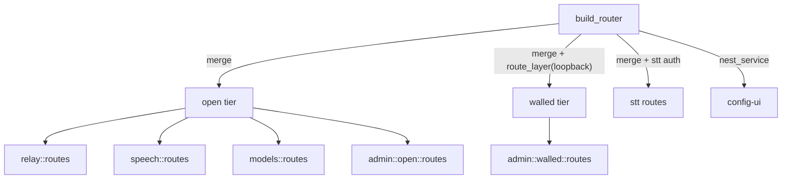

# Gateway Route Decentralization

Source: the field study "PromptForge Gateway: How to Structure an axum Server" (2026-09-20, five axum references dived at pinned commits). Three of five references (Windmill, Svix, llm-gateway-rs) decentralize route registration and name the tier in the constructor or path; the subject's `AuthedCaller`, single `GatewayError`, loopback wall, and lint set already beat every reference and are do-not-touch. This continues `2026-09-17-3-gateway-app-decomp`, which split handlers out of `lib.rs` but deliberately kept the route table whole; the study found that every reference at this scale moves the mounts out too.

## Target shape

## Branch and concurrency

- Base: `vibe2` HEAD at plan time (`5be00f3c`), fast-forwarded onto `vibe3`. The progress plan's Steps 1-3 are already in; the only gateway-app difference from the profiled tree is the `gateway_api_types` rename in `cloud_models.rs`.
- Concurrent with: `2026-09-20-2-gateway-api-types-progress` Steps 4-5 on `vibe2`, which rewrite `admin/progress.rs`, `admin/progress-tests.rs`, `admin/status.rs`, edit progress sites in `commands.rs` (24), `boot_load.rs` (30), `runner.rs` (12), `cache.rs` (8), `config_apply.rs` (7), delete `render.rs`, and rename `shared_progress` to `gateway_progress`.
- Steps 1-4 here run now. Expected rebase cost against their Steps 4-5: one hunk each in `lib.rs` (do not re-add `mod render`), `admin/status.rs` (add their `progress` field to the typed struct), `admin/progress.rs` and `admin/progress-tests.rs` (modify/delete: take their content at the new `admin/open/` path), plus a `rg` sweep for `shared_progress`.
- Steps 5 and 6 are gated on the progress plan's Step 5 commit (`Move progress into the gateway family as gateway-progress`). Step 5 here moves the `apply_config` body that their Step 4 edits in 7 places; concurrent execution would force a manual re-application of those edits inside a moved function. Do not start Step 5 or 6 until that commit is on `vibe2` and this branch is rebased onto it.
- Their Steps 6-7 (harness marker, webfetch split, tidy rule) touch nothing in the gateway app and may land in any order relative to this plan.

## Repo conventions that bind this plan

- Unit tests live in a sibling `<parent>-tests.rs` wired with `#[cfg(test)] #[path = "<parent>-tests.rs"] mod tests;`, never inline. The Step 3 registry test is a `-tests.rs` sibling of wherever the registry assembly lives.
- A `src/` subdirectory needs three or more files; `admin/walled/` (13) and `admin/open/` (5) qualify. A one- or two-file split uses `parent-label.rs` with `#[path]`.
- Integration tests are the single `tests/it/main.rs` target with one module per concern, invoked as `--test it`.
- Focused tests per step: `cargo nextest run --locked -p gateway <filter>`; `cargo check -p gateway --no-default-features` after any `#[cfg]` move. The full gate set (the progress plan's exit criteria) runs once, after Step 4 or Step 6, whichever is last to land.
- The 500-line ceiling does not bind this crate (no `## Invariants` marker); no new enforcement is added.

## Step 1: Delete copied glue (Findings 3 and 2)

Pure mechanical, no route moves, verified by the existing suite.

- Add `pub(crate) async fn blocking<T>(work) -> Result<T, GatewayError>` in `error.rs` wrapping `spawn_blocking` and mapping the join once to a new `GatewayError::BlockingTask` (500, `blocking_task_failed`) (Windmill's `blocking` helper; Svix re-raises the panic). Replace the join-mapping sites in `config_write.rs`, `env_file.rs` (2), `config_apply.rs` (4), `config_pending.rs` (2), `chat_templates.rs`, `admin/profiles.rs`, `reveal.rs`, `system.rs`, `orphans.rs`, `model_info.rs`, `cache.rs` (3), `cloud_models.rs` (the cache write; the launch-time read already handles its join with a warn). `SystemMetrics` and `system_metrics()` had no producer left and are removed. Every replaced mapping was already a 500 except the `cloud_models.rs` write (502 `cloud_models_unavailable`), which a panicked blocking task never was.
- Deferred to Step 5: the two `commands.rs` sites (`provision_model`, `unload_model`) handle the join inside a three-arm match beside `leaf.complete()` / `leaf.fail()` lines the progress plan's Step 4 rewrites; touching them now buys a merge conflict for two lines.
- Add `WireQuery<T>` and `WirePath<T>` beside `WireJson` in `error.rs` (Svix `ValidatedQuery` shape, `Rejection = GatewayError`). Delete the seven deferred `Result<Extractor, Rejection>` params and their copied `map_err` line in `config_write.rs`, `env_file.rs` (2), `reveal.rs`, `model_info.rs`, `hf.rs` (2). The three `Json` sites switch to `WireJson` as-is. Fallible extractors are listed after `AuthedCaller` so an unauthenticated caller earns 401 before its malformed input earns 400; `model_info.rs` and `hf.rs` had the deferred param before the caller and are reordered.
- Verified: clippy `-D warnings`, fmt, headless check, rustdoc `-D warnings`, nextest 469 passed.
- Commit: `Centralize blocking-task and extractor-rejection mapping`

## Step 2: Per-area routes() and the walled directory (Findings 1 and 4, merged)

- Each area module gains `pub(crate) fn routes() -> Router<AppState>` returning exactly its current mounts. Move `web_search`, `health`, `config_ui_redirect` out of `lib.rs` into their modules.
- Move the 13 flat walled modules (`system`, `hf`, `reveal`, `cloud_models`, `env_file`, `config_write`, `config_pending`, `config_apply`, `model_info`, `orphans`, `chat_templates`, `shutdown`, `handoff`) under `admin/walled/`; the existing `admin/{config,profiles,progress,queue,status}` become `admin/open/`. `admin::walled::routes()` merges its children; `build_router` applies `route_layer(require_loopback)` to that one merge.
- Feature-gated areas: keep `#[cfg]` on the `mod` and on the merge line (or return `Router::new()` in non-feature builds, per Windmill), whichever keeps the URL space identical.
- Verify mounts identical, then add a `LoopbackCaller` extractor (Svix per-tier extractor) wrapping `AuthedCaller` plus the loopback check, and switch every `admin/walled/` handler signature to it. The `route_layer` wall stays as defense in depth.
- `build_router` becomes a dozen merges plus the STT merge, SPA nest, and host wall; drop the `too_many_lines` waiver.
- As executed: `admin/config.rs` (the 21-line `GET /admin/config`) folded into `config_write.rs`, which became `admin/walled/config.rs`, so the `/admin/config` path has one owning module; `config_write_error` and `error_chain` now live there. The catalog wire types (`CatalogModelsResponse`, `CatalogModelInfo`, `SpeechCatalogModelInfo`) and their one test moved from `model_info.rs` to `models.rs` and a new `models-tests.rs`, so `model_info.rs` is the pure walled GGUF route and can sit behind `#[cfg(feature = "local")]` at the `mod` line. `health` and `web_search` became one-file area modules at the crate root; `config_ui_redirect` joined `handoff.rs` as the second route of the browser entry onto the SPA. `handoff`'s two routes take no caller (the handoff mints the credential). `LoopbackCaller` has `Rejection = Response`: the wall's bare 403 for a non-loopback or peerless caller, checked before auth, then `GatewayError`'s envelope for auth; its five tests live in `auth-loopback-tests.rs`.
- Verified: all 35 route paths present before and after; clippy `-D warnings`, fmt, headless check, rustdoc `-D warnings`, `cargo test -p build-xtask`, nextest 474 passed (469 plus the 5 new extractor tests).
- Commit: `Install routes per area behind tier-named constructors`

## Step 3: Route registry with a tier kind (Finding 6)

- Each area declares `const` route infos with a tier kind (mistral.rs `RouteInfo`) and binds them in `routes()`. One test asserts every registered path sits under the kind its module directory claims.
- Shrink the 80-line doc paragraph at the top of `lib.rs` to the tier model and a pointer at the registry.
- As executed: `registry.rs` holds `Tier { Open, Walled }`, `RouteInfo { path, methods, tier }` with `const fn open` / `walled`, and `all()`, which concatenates every area's `pub(crate) const ROUTES: &[RouteInfo]` under the same feature gates `build_router` merges under; `admin::open::registry()` and `admin::walled::registry()` do the same for their children. Every `routes()` binds `INFO.path`, never a literal. `build_router` logs the registry at debug level ("route mounted", path, methods, tier) so the registry has a production consumer. `registry-tests.rs` sweeps it against the assembled router: every walled route refuses a LAN peer and a peerless caller with 403 and admits a loopback peer (not 403, 404, or 405); every open route answers a LAN peer with something other than 403, 404, or 405; paths are unique and both tiers non-empty. Captures are filled with values that fail the handler's own validation, and the fixture's `HfProxy` points at a dead port, so the sweep never reaches the network. The hand-listed `walled_requests()` and bearer-only sweeps in `loopback-tests.rs` (which had drifted: `/shutdown` was missing) are replaced by these; its tempdir fixture moved to `test_support::walled_fixture`, and it keeps the SPA mount, feature-state, and host-wall tests the registry cannot enumerate.
- Verified: clippy `-D warnings`, fmt, headless check, rustdoc `-D warnings`, nextest 475 passed.
- Commit: `Declare routes as typed registry entries with a tier kind`

## Step 4: Typed admin responses (Finding 5)

- One `Serialize` struct per admin reply in the module that produces it, replacing `json!` literals in `admin/open/status.rs`, `admin/open/profiles.rs`, `admin/walled/config_apply.rs`, `admin/walled/config_pending.rs`, `admin/walled/env_file.rs`. Wire JSON stays byte-identical; the integration tests become shape tests against a type. When rebased onto the progress plan's Step 4, `StatusResponse` carries `progress: gateway_api_types::Progress` and no `active.fraction`.
- As executed: `ProfilesReply`, `SwitchProfileReply` (profiles), `ShadowReply` (config, shared by `PUT /admin/config` and `PUT /admin/env`), `ApplyReply`, `RevertReply` (config_apply), `PendingReply`, `DirtyReply` (config_pending), `EnvReply`, `EnvSection` (env_file), plus `CancelReply` (queue) and `OrphansReply` (orphans) for uniformity. `PendingReply.profile` stays a `serde_json::Value`: it is the config document itself with `active_profile` inserted, dynamic by nature. `dirty_reply`'s unit test now asserts on struct fields. `admin/open/status.rs` is deferred to Step 5: the progress plan's Step 4 rewrites its reply body (adds `progress`, drops `active.fraction`), and typing it now would put the two changes in the same lines.
- Verified: clippy `-D warnings`, fmt, headless check, rustdoc `-D warnings`, nextest 475 passed.
- Commit: `Type the admin reply shapes`

## Step 5: Split config_apply.rs (Finding 7) - GATED

- Gate: the progress plan's Step 5 commit is on `vibe2` and this branch is rebased onto it.
- Move `apply_config` and its snapshot types beside the other commands (`commands.rs` is already 1,400+ lines, so a `commands-apply.rs` sibling with `#[path]`); `admin/walled/config_apply.rs` keeps two thin handlers. Keep the apply mutex acquisition in the same relative position. This is the one step that can shift behavior.
- Also in this step, the two pieces deferred from Steps 1 and 4 because their lines are the progress plan's: the two `commands.rs` `spawn_blocking` sites (`provision_model`, `unload_model`) move to `blocking()`, and `admin/open/status.rs` gets a typed `StatusReply` carrying their `progress: gateway_api_types::Progress` field and no `active.fraction`.
- Commit: `Move the apply command body beside the other commands`

## Step 6 (optional): AppState builder (Finding 8) - GATED

- Same gate as Step 5; their Step 4 edits 12 progress sites in `runner.rs`.
- Only if the test harness churn from Steps 2 and 4 multiplies `from_parts` calls. Confidence low; `runner.rs` is mostly the serve loop, not assembly.

## Constraints

- Steps 1, 2, 3 are pure structure: status and error envelope for every route, including malformed query/path, must be byte-identical. Step 4 changes the serializer, not the JSON.
- Invariant: `tests/it/` plus the in-process loopback and auth tests. They move last and only to follow a renamed module path, never to change an assertion.
- Do not touch: `dialect.rs`, `routing.rs`, `tray/`, `shared-loopback`, the STT and config-ui crate boundaries, `GatewayError::classify()`.
- Per step: `cargo clippy -p gateway --all-targets --all-features -- -D warnings` clean, `cargo nextest run --locked -p gateway --all-features` green, `cargo check -p gateway --no-default-features`, `cargo fmt --all --check`, then one commit carrying the code, its tests, and this file's todo statuses.
- Stop condition: two consecutive failures on one step stop the run for a re-plan.
