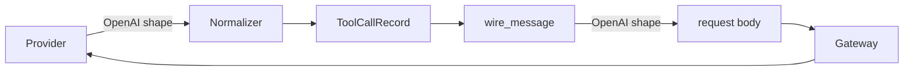

# Fix replayed tool_calls wire shape

<product-contract>

## Product Requirements

A run that replays an earlier assistant turn containing tool calls fails against any OpenAI-protocol upstream: the engine renders each replayed call as `{id, name, arguments}` with `arguments` as a JSON object, and strict endpoints (OpenAI, Azure via OpenRouter, vLLM's OpenAI server) reject the request with 400. The first tool-calling turn succeeds; the turn carrying the tool results fails, so any prompt whose section calls a tool and then continues cannot complete through the harness. Observed at master `b64c1c9d`; the same conversation in OpenAI wire shape returns 200 from the same gateway and model. The fix makes the engine emit the OpenAI shape at the one rendering site and pins the contract with an end-to-end test.

- Problem and users: replayed assistant `tool_calls` reach OpenAI-protocol endpoints in a provider-neutral shape the endpoint's schema rejects (400); affected users are prompt authors and hosts running tool-calling prompts through `harness-api` against `openai`-protocol upstreams, hosted or self-hosted.
- Goals: replayed tool calls reach an `openai`-protocol endpoint as `{"id", "type": "function", "function": {"name", "arguments": "<JSON string>"}}`; the inverse property (projected output re-parsable by the engine's own inbound normalizer) is enforced at the HTTP boundary; the gateway logs the upstream error code/type so a future 400 does not require a logging proxy.
- Non-goals: no gateway request-path rewriting; no new provider dialects or adapter matrix; no change to the neutral record format or to replay/determinism semantics.
- Success criteria: the api-runtime end-to-end suite passes with a mock gateway that validates inbound `tool_calls` against the OpenAI schema; the papergate reproduction's follow-up turn returns 200 against an OpenAI-protocol endpoint.
- Constraints: the gateway's verbatim-passthrough design (WIRE-001, `crates/gateway/protocol/src/wire.rs`) is preserved; the client-facing error envelope stays body-free (F5); `ToolCallRecord.arguments` is always an object.
- Open questions: None

## Functional Specification

The engine validates and projects an author-built message list into wire messages immediately before every model dispatch. The projection's rendering of assistant tool-call records changes from the neutral triple to the OpenAI function-call shape; everything else about the projection (validation rules, healing, metadata stripping) is unchanged. The gateway gains a bounded, structured log line when an upstream returns a non-success status.

- Actors and workflows: the engine's projection (`wire_message`, `crates/promptforge/lua/src/projection.rs`) renders records per dispatch; transports serialize the request verbatim; the gateway validates minimal shape and forwards verbatim; the upstream validates against the OpenAI schema.
- Inputs and outputs: input is the neutral `ToolCallRecord { id, name, arguments }` (`crates/promptforge/lua/src/protocol/request.rs`, lines 355-367); output is `{"id", "type": "function", "function": {"name", "arguments"}}` with `arguments` a JSON-encoded string decoding to an object.
- States and validation: the inverse property holds - projected tool-call turns are re-parsable by `parse_openai_tool_calls` (`crates/promptforge/model-client/src/normalize.rs`, line 192), which requires `type == "function"`, an object `function`, a nonblank string `function.name`, and string `function.arguments` decoding to an object.
- Errors and recovery: the api-runtime mock gateway answers 400 with a diagnostic body when an inbound request violates the OpenAI tool_calls schema, so a shape regression fails the suite naming the shape rather than surfacing a bare 400.
- Security and privacy behavior: the client-facing gateway envelope stays body-free (F5); the new gateway log carries structured `status`, `code`/`type`, and a bounded, control-escaped `error.message`, never the raw upstream body at warn level, because upstream error bodies can echo prompt content or credentials.
- Acceptance criteria: a two-round tool-calling conversation replays through the mock gateway with every `messages[].tool_calls[]` entry schema-valid; the captured failing request from the bug report, re-rendered by the fixed projection, matches the shape that returned 200.

</product-contract>
<implementation-contract>

## Technical Design

The gateway is OpenAI-compatible at its edge and OpenAI-canonical internally; it forwards to OpenAI upstreams and translates `OpenAI -> provider` for non-OpenAI upstreams. The engine therefore dogfoods the gateway's OpenAI ingress contract rather than inventing a second wire dialect: its outbound `messages` are OpenAI-shaped, exactly like a third-party OpenAI client's. Records stay neutral internally; only the wire rendering changes. With one universal language on the wire there is no third format for the gateway to translate, which removes the dialect mismatch by construction.

- Architecture: the engine's inbound parser (`parse_openai_tool_calls`) already requires the OpenAI shape, and its request builder (`crates/promptforge/model-client/src/client/request.rs`) already emits OpenAI dialect for tool schemas, `tool_choice`, and stream options; the projection's neutral rendering was the lone holdout, a shape the engine's own parser would reject.
- Modules and interfaces: `wire_message` in `crates/promptforge/lua/src/projection.rs` (lines 286-302) renders each call as `{"id": call.id, "type": "function", "function": {"name": call.name, "arguments": call.arguments.to_string()}}`; the gateway diagnostics change sits in `OpenAiUpstream::post` (`crates/gateway/protocol/src/upstream.rs`, lines 273-282), shared by chat, embeddings, rerank, speech, and streaming, so the log applies broadly - intended.
- File and public API changes: `crates/promptforge/lua/src/projection.rs` (rendering, function doc lines 264-267, module doc lines 25-27 which currently claim the output is "the provider-neutral wire shape the gateway speaks"); `crates/promptforge/lua/src/protocol/request.rs` (`ToolCallRecord` doc, lines 355-357: record stays neutral, `wire_message` renders the OpenAI wire shape); `crates/promptforge/model-client/src/client/wire.rs` (`Message.tool_calls` field doc: the live path echoes the backend array verbatim while the projection path re-renders from the neutral record, so key order and whitespace can differ from the provider's original); `crates/promptforge/lua/src/projection-tests.rs`; `crates/promptforge-api-runtime/src/execute/tests.rs`; `crates/gateway/protocol/src/upstream.rs`. No public API signatures change.
- Data, persistence, failure, security, and privacy constraints: `arguments` serialization uses `Value::to_string`, which is infallible - not `serde_json::to_string(..).unwrap_or_default()`, whose failure mode would silently send `arguments: ""`, the same class of silent degradation this fix removes; records and run logs are untouched, so replay/determinism is unaffected; the arguments-always-object invariant must hold at every `ToolCallRecord` construction path (inbound parse, Lua `messages.new` builders, test helpers), because a non-object there would stringify to wire `arguments` that decode to a non-object and be rejected by the engine's own parser.

</implementation-contract>
<verification-contract>

## Testing Plan

Unit tests pin the exact wire shape at the projection; an end-to-end api-runtime test enforces the inverse property at the HTTP boundary, which the unit pin cannot give because `parse_openai_tool_calls` is `pub(crate)` to `model-client` and cannot be called from `lua`. The gateway diagnostics change is covered by the existing `upstream.rs` test harness patterns. Manual verification reruns the original reproduction.

- Unit: update the two existing projection tests that assert the neutral shape - `a_complete_tool_exchange_projects_verbatim` (`crates/promptforge/lua/src/projection-tests.rs`, line 210) and `a_text_fragment_merges_into_a_following_tool_call_turn` (line 262) - from `{"id", "name", "arguments": {}}` to `{"id", "type": "function", "function": {"name", "arguments": "{}"}}` (the `call()` helper at line 42 builds `arguments: json!({})`); add one focused test pinning the wire JSON for a two-call assistant turn mirroring the bug report's captured request, asserting by re-decoding (`serde_json::from_str::<Value>` on the `function.arguments` string equals the original object) rather than raw string equality, so a future `preserve_order` feature does not make the test brittle.
- Integration and end-to-end: add `fn assert_openai_tool_calls(body: &Value) -> Result<(), String>` to `crates/promptforge-api-runtime/src/execute/tests.rs`, mirroring `parse_openai_tool_calls`; have the `ScriptedGateway` completion handler (lines 823-1053, which records every inbound body via `requests()`) run it on each request and answer 400 with a diagnostic body on violation, exactly as a real OpenAI endpoint or vLLM's OpenAI server does; with the validator in place, the existing `models_loop_repeats_model_tool_rounds_and_appends_each_exchange` (`crates/promptforge-api-runtime/src/execute/tests/models_loop.rs`, line 147) already exercises the regression, since it drives two tool rounds and a follow-up turn - the exact failing sequence; add a dedicated test (e.g. `replayed_tool_calls_reach_the_mock_gateway_in_the_openai_shape`) that drives the same loop and asserts on `gateway.requests()[1]["messages"]` that the assistant tool-call entry matches the OpenAI schema.
- Regression, security, and performance: the inverse property is the durable guard - any future projected-shape change the inbound parser rejects fails the api-runtime suite; vLLM validates the same schema, so self-hosted endpoints are covered by the same fix; confirm no golden or fixture anywhere asserts the neutral wire shape (regenerate any that do); confirm the gateway log cannot emit raw upstream bodies at warn.
- Exit criteria: `cargo test -p promptforge-lua -p promptforge-model-client -p promptforge-api-runtime -p gateway-protocol` plus the gateway app integration suite (`-p gateway-app`, `tests/it`) all pass; manual rerun of the papergate reproduction from `crates/papergate/TESTING.md` on branch `papergate-harness-api` (this checkout is `master` with no `crates/papergate`) confirms the follow-up turn returns 200, or a local two-round `models.loop` reproduction via the api-runtime test driver substitutes.

</verification-contract>
<decision-record>

## Decision Record

- Decisions:
  - Fix in the engine's projection, not the gateway: with the gateway OpenAI-canonical internally, the engine dogfoods the OpenAI ingress contract and the mismatch disappears by construction; the gateway's verbatim passthrough (WIRE-001) is preserved and every OpenAI-protocol consumer (gateway endpoints, the local llama upstream, vLLM direct) is fixed at once. User's words: selected "Engine projection (Recommended) - wire_message renders the exact inverse of parse_openai_tool_calls; one function changes, fixes every OpenAI-protocol consumer, records stay neutral".
  - Serialize `arguments` with `Value::to_string`, never `serde_json::to_string(..).unwrap_or_default()`: a silent fallback would send `arguments: ""`, the same class of silent degradation the fix exists to remove, and `Value::to_string` cannot fail. User's words: "Do **not** use `serde_json::to_string(..).unwrap_or_default()`".
  - Assert the wire pin by re-decoding the `arguments` string, not raw string equality: a future `preserve_order` feature would reorder the compact string and make a string-equality test brittle. User's plan edit.
  - Enforce the contract end-to-end through the `ScriptedGateway` rather than cross-crate unit calls: `parse_openai_tool_calls` is `pub(crate)` to `model-client`, so the inverse property can only be pinned at the HTTP boundary. User's plan edit.
  - Log structured upstream `code`/`type` plus a bounded, escaped `error.message`, not the raw body: upstream error bodies can echo prompt content or credentials, and the client envelope must stay body-free (F5). User's words: selected "Yes, include it as a final plan step", then revised the step to structured fields.
  - Run the consumer/invariant audit before touching code: the audit carries a stop-and-re-plan gate, and running it first makes the gate real instead of retrospective. User's words: "yes apply step reorder".
- Rejected alternatives:
  - Gateway ingress heuristic rewriting of `messages[].tool_calls`: breaks the verbatim-passthrough design (WIRE-001), requires shape sniffing of client payloads, and fixes only the gateway path. Revisit only if the gateway ever adopts a second ingress dialect.
  - Logging the raw upstream error body at warn level: violates F5's body-free posture toward logs as well as clients. Revisit only with confirmed redaction-layer coverage of the tracing fields.
- Assumptions, risks, and notes:
  - Assumption (gated by the audit): no consumer of projected `tool_calls` depends on the neutral wire shape - expected consumers are `harness-models` transports (serialize verbatim), the gateway (presence-only validation), and the engine test client. If any consumer depends on the neutral shape, stop and re-plan.
  - Risk: a `ToolCallRecord` construction path (inbound parse, Lua `messages.new` builders, test helpers) could place a non-object in `arguments`; the audit cites the guaranteeing line range for each path.
  - Note: this checkout is `master` with no `crates/papergate`; the manual reproduction runs from branch `papergate-harness-api` or is substituted by a local two-round `models.loop` driver.
  - Note: `OpenAiUpstream::post` is shared by chat, embeddings, rerank, speech, and streaming, so the new log line applies to all of them; this is intended.
  - Note: whether the `gateway/logging` redaction layer (`crates/gateway/logging/src/redact.rs`) applies to the new tracing fields is confirmed during implementation; if it does not, the log keeps to structured code/type plus the escaped `error.message`.

### Deferred and Out of Scope

- Deferred: a provider-specific adapter matrix for non-OpenAI upstreams; revisit when a non-OpenAI upstream protocol is added behind the gateway's `Upstream` trait.
- Out of scope: changing the neutral `ToolCallRecord` storage format; changing gateway request-path forwarding; harness-side surfacing of upstream 400 bodies beyond the gateway log line.

</decision-record>
<project-survey>

## Project Survey

- Status: complete
- Build command: `cargo build` (builds only the gateway, the workspace default-member; use `cargo build -p <package>` for others, e.g. `cargo build -p workshop` for the desktop app)
- Focused test command pattern: `cargo nextest run --locked -p <package> <test-name-filter>`
- Component test command pattern: `cargo nextest run --locked -p <package> --all-features` (workshop crates: `cargo nextest run --locked -p workshop -p workshop-server -p workshop-server-api`); structural/boundary harness: `cargo test -p build-xtask`
- Full-suite test command: `cargo nextest run --locked --workspace --exclude workshop --exclude workshop-server --exclude workshop-server-api --all-features`, then doctests via `cargo test --workspace --exclude workshop --exclude workshop-server --exclude workshop-server-api --all-features --doc`; workshop crates separately via `cargo nextest run --locked -p workshop -p workshop-server -p workshop-server-api`
- Linter command: `cargo clippy --workspace --exclude workshop --exclude workshop-server --exclude workshop-server-api --all-targets --all-features -- -D warnings` (workshop: `cargo clippy -p workshop -p workshop-server -p workshop-server-api --all-targets -- -D warnings`); never run standalone `cargo check --workspace` beside clippy except the headless gate `cargo check -p gateway --no-default-features`
- Formatter check command: `cargo fmt --all --check`
- Docs command: `cargo doc --workspace --no-deps --all-features --exclude workshop --exclude workshop-server --exclude workshop-server-api` with `RUSTDOCFLAGS="-D warnings"`; user guide via `mdbook build guide`
- Test placement and naming conventions: unit tests live beside the source file as `foo-tests.rs` siblings wired with `#[path = "foo-tests.rs"] mod tests;` (e.g. `projection.rs` / `projection-tests.rs` in `crates/promptforge/lua/src`), or inline `mod tests`; larger suites get a `tests/` subdirectory inside `src` (e.g. `crates/promptforge/lua/src/protocol/tests/`); integration tests follow Cargo target conventions in crate-level `tests/` trees (e.g. `crates/gateway/app/tests/it/`); benches live in crate-level `benches/` (criterion); nextest profiles and a `heavy` test-group for FFI-heavy STT suites are configured in `.config/nextest.toml`
- Directory map: `crates/` holds the whole workspace: public root crates (`promptforge-api-runtime`, `promptforge-api-types`, `gateway-api-types`, `gateway-api-discovery`, `harness-api`), shared substrate crates (`shared-*`, `shared-vfs`, `workspace-hack`), four manifestless family containers (`crates/promptforge/`, `crates/gateway/`, `crates/workshop/`, `crates/harness/`) holding private family crates (gateway's STT subsystem nests at `crates/gateway/stt/`), and `build-*` meta tooling (`build-xtask` structural harness, `build-ui`, `build-user-guide`, etc.); `crates/shared-ui` is a TypeScript+CSS package, not a Rust crate; `guide/` is the mdbook user guide; `prompts/` holds prompt pipelines; `tools/` holds Node helper scripts; `vibe/` holds planning docs including `archdoc.md`; `.config/` holds nextest and hakari config; `.github/workflows/` holds CI
- Component boundaries (from `vibe/archdoc.md`): executor (sans-I/O deterministic state machine, no host trait objects) <- harness (only production host; tokio runtime, performers, sessions, Turso run log; public surface `harness-api`); gateway (independent server owning model routing and inference lifecycle; public pair `gateway-api-types` + `gateway-api-discovery`); CLI (thin shell adapter); workshop UI (Tauri desktop shell driving `harness-api`, attaching over the gateway protocol); store over the VFS layer (`shared-vfs` backends, `promptforge-vfs` policy gate); Lua VM boundary (sandbox/coroutine bridge, no I/O); shared substrate (`shared-*`, `shared-error-source`) depends on nothing; dependency rules: promptforge-* never depend on gateway/workshop/harness crates, gateway crates never depend on promptforge/workshop crates, workshop crates name only the gateway public pair plus `harness-api`, outside crates enter each family only through its public root crate
- Conventions summary: Rust edition 2024 on the stable toolchain (`rust-toolchain.toml`); workspace lints forbid `unsafe_code`, deny clippy `all`/`pedantic`/`unwrap_used`/`expect_used`, and deny broken rustdoc links; flat source directories by default - one or two related files stay as `foo-bar.rs` kebab siblings with explicit `#[path]` attributes, three or more rehydrate into a `foo/` subdirectory; every workshop-* and harness-* lib.rs opens with a mandatory `## Invariants` doc marker and no file in a marked crate exceeds 500 lines (enforced by `cargo test -p build-xtask`, which also enforces the tier graph and family privacy matrix); behavior changes ship with tests in the same change; comments explain non-obvious constraints and cite upstream issue URLs for workarounds; error messages are written for model consumption (concise, factual, required-vs-actual); CSS/TypeScript for the SPA lives self-contained per feature directory with `--ws-*` design tokens and no `localStorage`

</project-survey>
<execution-plan>

## Execution Instructions

<step-1>

### Step 1: Render replayed tool_calls in the OpenAI wire shape [completed]

- Component: `none`
- Audit gate (runs first, per the Decision Record): audit consumers of projected `tool_calls` (expected: `harness-models` transports, the gateway, the engine test client) and all goldens/fixtures for neutral-shape dependencies; verify the arguments-always-object invariant at every `ToolCallRecord` construction path (inbound parse in `crates/promptforge/model-client/src/normalize.rs`, Lua `messages.new` builders, test helpers), citing the guaranteeing line range for each. If any consumer depends on the neutral wire shape, stop and re-plan.
- Change `wire_message` in `crates/promptforge/lua/src/projection.rs` (lines 286-302) to render each call as `{"id", "type": "function", "function": {"name", "arguments"}}` with `arguments` serialized via `Value::to_string` (infallible; never `serde_json::to_string(..).unwrap_or_default()`).
- Update the four doc sites that assert the old contract: the `wire_message` function doc (`projection.rs` lines 264-267), the module doc (lines 25-27), the `ToolCallRecord` doc (`crates/promptforge/lua/src/protocol/request.rs` lines 355-357), and the `Message.tool_calls` field doc (`crates/promptforge/model-client/src/client/wire.rs`).
- Update the two neutral-shape projection tests in `crates/promptforge/lua/src/projection-tests.rs` (`a_complete_tool_exchange_projects_verbatim` line 210, `a_text_fragment_merges_into_a_following_tool_call_turn` line 262) to the OpenAI shape, and add one focused wire-shape pin for a two-call assistant turn that asserts by re-decoding the `function.arguments` string (`serde_json::from_str::<Value>` equals the original object), not raw string equality.
- Add `fn assert_openai_tool_calls(body: &Value) -> Result<(), String>` to `crates/promptforge-api-runtime/src/execute/tests.rs`, mirroring `parse_openai_tool_calls`; run it in the `ScriptedGateway` completion handler (lines 823-1053) on every recorded request, answering 400 with a diagnostic body on violation; add the dedicated test `replayed_tool_calls_reach_the_mock_gateway_in_the_openai_shape` asserting on `gateway.requests()[1]["messages"]`. The existing `models_loop_repeats_model_tool_rounds_and_appends_each_exchange` (`execute/tests/models_loop.rs` line 147) then exercises the regression.
- Tests: `cargo test -p promptforge-lua -p promptforge-api-runtime`; confirm no golden or fixture anywhere asserts the neutral wire shape (regenerate any that do).
- One commit containing the rendering change, doc updates, and all tests above.

</step-1>

<step-2>

### Step 2: Log bounded upstream error diagnostics and run exit criteria

- Component: `none`
- Add a structured, bounded log line in `OpenAiUpstream::post` (`crates/gateway/protocol/src/upstream.rs`, lines 273-282) when an upstream returns a non-success status: warn for 5xx, debug for 4xx, with fields `status`, `code`/`type`, and a bounded, control-escaped `error.message`; never log the raw upstream body (F5). Confirm whether the `gateway/logging` redaction layer (`crates/gateway/logging/src/redact.rs`) applies to these tracing fields; if it does not, keep to structured code/type plus the escaped message. Note this post is shared by chat, embeddings, rerank, speech, and streaming - the broad application is intended. Cover with the existing `upstream.rs` test harness patterns.
- Run the exit criteria: `cargo test -p promptforge-lua -p promptforge-model-client -p promptforge-api-runtime -p gateway-protocol` plus the gateway app integration suite (`-p gateway-app`, `tests/it`); then rerun the papergate reproduction from `crates/papergate/TESTING.md` on branch `papergate-harness-api` (this checkout is `master` with no `crates/papergate`) confirming the follow-up turn returns 200, or substitute a local two-round `models.loop` reproduction via the api-runtime test driver.
- One commit containing the log line and its tests; verification runs after it, per the Testing Plan.

</step-2>

</execution-plan>
