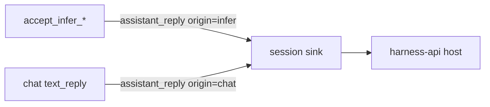

# Emit an infer-origin assistant_reply for tool-less model inference

<product-contract>

## Product Requirements

A Lua `models.infer(prose)` call in a section that advertises no tools returns the model's text to Lua, but the engine emits only `model_turn_completed` for that turn - no content event - so a host following session events through `harness-api` never sees the reply text, and no run outcome value is exposed either. Observed at master `b64c1c9d`: the event sequence for a tool-less infer section runs `model_turn_completed` straight to `lua_chunk_succeeded` with no `assistant_reply` and no `thinking`, while the text demonstrably arrives in Lua. The fix reports that round as an `assistant_reply` carrying `origin = infer`, so session-event clients see every model reply through the one reply kind, whether or not tools were advertised.

- Problem and users: the infer path emits no content event for a text result, so `harness-api` session-event clients (the papergate port being the driving case - it reads the run's last reply event as its report) cannot obtain a tool-less infer's text; affected users are prompt authors and hosts running agent sessions whose final step is a tool-less `models.infer`.
- Goals: every tool-less infer text turn emits an `assistant_reply` with `origin = infer` carrying the text, finish reason, model, and metrics; the event stream distinguishes text / empty / tool-batch outcomes for tool-less turns; infer reasoning emits `thinking` in parity with the chat path; session lifecycle treats an infer-origin `assistant_reply` exactly like a chat-origin one.
- Non-goals: no workshop agent-protocol mapping; no `RunOutcome`/`final_text` exposure through `harness-api` (tracked separately); no reader-tolerance shim for pre-change log readers.
- Success criteria: a host subscribed to `harness-api` session events sees an infer-origin `assistant_reply` between `model_turn_completed` and `lua_chunk_succeeded` for a tool-less infer turn; the success consumer is the session sink in `crates/harness/sessions/src/session.rs`, not "hosts" generally - because the origin is new information, a consumer that ignores it still gets the reply, and one that inspects it can separate the inference round.
- Constraints: the existing `assistant_reply` event keeps its meaning and gains a typed `origin`; `Event` stays `#[serde(tag = "kind", rename_all = "snake_case")]` and `#[non_exhaustive]`; the reply text remains documented as untrusted model output.
- Open questions: None

## Functional Specification

The engine's infer path reports a completed text round with the same event richness as a chat prose round, through the shared `assistant_reply` kind whose `origin` field marks the reply as a programmatic inference result rather than user-facing chat. The session sink folds both origins into its existing lifecycle and reply-stamping rules. Hosts that ignore `origin` see no change in the events they already read.

- Actors and workflows: `accept_infer_completion` (`crates/promptforge-api-runtime/src/execute/tools.rs`) calls the shared `report_model_turn`; the `Emitter` (`crates/promptforge-api-types/src/emitter.rs`) carries; the session sink (`crates/harness/sessions/src/session.rs`) settles, stamps, and forwards to the subscribed host.
- Inputs and outputs: input is the infer round's `Completion`; output is an `assistant_reply` event with `origin = infer` and payload `{turn, text, finish_reason, model, metrics, origin}` - the same fields as a chat reply plus the provenance - and a `thinking` event when the completion carries non-empty reasoning content.
- States and validation: event sequence for a tool-less infer turn is `model_turn_completed`, `thinking` (when present), `model_turn_truncated` (on a `length` finish), an infer-origin `assistant_reply`, mirroring the chat path's ordering in `served()` + `text_reply`; `reply_stamp` stamps an `AssistantReply` of either origin with the current round and advances it, applied identically live and on replay.
- Errors and recovery: a tool-call outcome on a tool-less infer remains the backend-protocol-violation error it is today; an unrecognized outcome likewise; no new failure modes.
- Security and privacy behavior: the `text` field is untrusted model output, documented as such on `AssistantReply`; no credential-bearing or raw-body data is added to any event.
- Acceptance criteria: the report's reproduction prompt (a section whose only model call is `return models.infer(prose)`) produces a session event stream containing an infer-origin `assistant_reply` with the reply text; no chat-origin reply is emitted for the infer turn; existing chat-path sessions are unchanged except that mixed infer-then-chat sessions see reply indices shift (accepted, pinned by test).

</product-contract>
<implementation-contract>

## Technical Design

`Event` is an internally-tagged, `#[non_exhaustive]` serde enum generated by the `events!` macro (`crates/promptforge-api-types/src/event.rs`, lines 85-88). The reply distinction is carried by a typed field on the existing reply variant, not by a second kind: `ReplyOrigin { Chat, Infer }` derives `Default` with `Chat` as its default, serializes `#[serde(rename_all = "snake_case")]`, and is attached to `AssistantReply` as `#[serde(default)] origin`. A new reader parses an old log with `origin` defaulting to `chat`; an old reader ignores the unknown `origin` field on a new log. No kind registry or golden enumerates event kinds, so no list beyond the macro invocation needs updating.

- Architecture: one `assistant_reply` event carries the provenance of the round that produced it (`origin`: `chat` or `infer`), superseding the separate `InferReply` variant. `AssistantReply` keeps its meaning as a model round's text reply and gains a typed provenance; session lifecycle treats both origins as one model-round content kind (turn settle, reply stamp), so an infer round is a first-class model round in session bookkeeping.
- Modules and interfaces: `crates/promptforge-api-types/src/event.rs` adds `ReplyOrigin { Chat, Infer }` and an `origin` field on `AssistantReply { turn, text, finish_reason, model, metrics, origin }`, field docs mirroring the rest including the untrusted-output note; `crates/promptforge-api-types/src/emitter.rs` gives `assistant_reply` an `origin` parameter and drops `infer_reply`; `crates/promptforge-api-runtime/src/execute/support.rs`'s shared `report_model_turn` takes a `ReplyOrigin` in place of the deleted `ReplyKind`, so the chat arm passes `Chat` and `accept_infer_completion` passes `Infer` with the same event ordering and payloads.
- File and public API changes: the three files above plus `crates/promptforge-api-runtime/src/execute/scheduler/chat.rs` and `crates/promptforge-api-runtime/src/execute/tools.rs` (origin at the two emit sites), `crates/promptforge-api-runtime/src/test_support/recording.rs` (drops `on_infer_reply`; `on_assistant_reply` gains the origin), `crates/promptforge-api-runtime/src/test_support/recording-forward.rs`, `crates/harness/sessions/src/session.rs` (one `AssistantReply` arm covers both origins in the settle and reply-stamp rules), and test files. The public API change is the `ReplyOrigin` enum and the extra `origin` parameter; `InferReply` and `Emitter::infer_reply` are removed.
- Data, persistence, failure, security, and privacy constraints: `origin` serializes snake_case and is `#[serde(default)]`, so old logs parse as `chat` and new logs carry the field; the reply text stays documented as untrusted model output; no new failure modes and no credential-bearing or raw-body data is added to any event.

</implementation-contract>
<verification-contract>

## Testing Plan

Unit tests pin the event's wire round-trip for both origins and the reply-stamp rule; the existing api-runtime infer suites gain sequence assertions; a sessions integration test pins the mixed-session reply-index sequence. The manual reproduction substitutes for the external papergate run, since this checkout has no `crates/papergate`.

- Unit: extend the event round-trip test in `crates/promptforge-api-types/src/event-tests.rs` with an `AssistantReply` case for `origin = infer` (and assert the `Chat` default); add session-sink unit coverage for `reply_stamp` under an `AssistantReply` of either origin (there is currently no test module in `session.rs`; add an inline `#[cfg(test)] mod tests` or a sibling `session-tests.rs` wired by `#[path]`), asserting an infer-origin reply stamps the current round and advances it and that `Thinking` still stamps without advancing.
- Integration and end-to-end: extend the infer tests in `crates/promptforge-api-runtime/src/execute/tests/debug_and_counts.rs`, which already drive tool-less `models.infer` rounds and inspect observed events, to assert the sequence `model_turn_completed` -> (`thinking` when present) -> an infer-origin `assistant_reply` with the text and that no chat-origin reply is emitted; add an infer test whose completion carries `reasoning_content` to cover the `thinking` parity path; extend `crates/harness/sessions/tests/it/session.rs` with a mixed infer-then-chat session asserting the reply-index sequence and confirming `settle_current_turn` fires on an infer-origin `AssistantReply` (pattern at `lifecycle.rs:130`); pin the chat emit site by asserting a chat round reports `origin = Chat` in `crates/promptforge-api-runtime/src/execute/tests/chat_arm.rs`.
- Regression, security, and performance: grep the sessions tests for any pre-existing reply-index assertion and renumber to the new sequence; confirm no wire snapshot or golden enumerates event kinds (step 1 of execution established none exists; assert it in the test pass); confirm the `text` field docs carry the untrusted-output note.
- Exit criteria: `cargo test -p promptforge-api-types -p promptforge-api-runtime -p harness-sessions` passes, then the wider harness suites; manual run of a prompt whose section calls `models.infer(prose)` tool-lessly through `harness-api` shows an infer-origin `assistant_reply` between `model_turn_completed` and `lua_chunk_succeeded` in the session event stream.

</verification-contract>
<decision-record>

## Decision Record

- Decisions:
  - Merge the infer reply into `AssistantReply` as a typed `origin: ReplyOrigin { Chat, Infer }`, superseding the earlier separate-`InferReply`-variant decision: one reply event keeps `AssistantReply`'s meaning intact while giving hosts provenance to distinguish an inference round from a chat turn; the field is `#[serde(default)]` with a `Chat` default.
  - Full session-lifecycle parity across origins (settle current turn, reply stamp advances the round): both origins are model-round content, and `reply_stamp` applies identically live and on replay, so reply indices in mixed infer-then-chat sessions move together (accepted, pinned by test).
  - Carry the origin through the recording observer rather than adding a second hook: `on_assistant_reply` gains an `origin` parameter and `on_infer_reply` is dropped, so runtime unit tests observe through the one reply hook; session tests read the raw event's `origin`. Chosen as the smaller change because the runtime tests observe through the `Observer` seam and cannot read raw events.
  - Defer the workshop agent-protocol mapping: workshop matches are wildcard/if-let, so nothing breaks; no workshop consumer requests infer text. User's words: selected "Defer workshop (Recommended)".
  - Emit `thinking` for non-empty infer reasoning content: parity with the chat path's `served()`; the bug report noted its absence from the infer sequence.
  - Capture model, metrics, thinking, and finish reason before the `match completion.result` partial move (E0382), mirroring `served()`'s documented ordering.
  - Keep the per-origin payloads identical: the shared `report_model_turn` fires the same sequence and emits exactly one `assistant_reply` carrying the caller's `origin`.
- Rejected alternatives:
  - A separate `InferReply` event variant: duplicates the reply payload and asks every host to learn a second kind; superseded by the merged `origin` field on `AssistantReply`.
  - Reusing `section` or `provenance` to mark the producing path: stringly-typed abuse of fields that already have jobs (replay key, reporting scope).
  - Exposing `RunOutcome.final_text` through `harness-api` as the only fix: complementary API addition that does not repair event-stream consistency (a host still could not distinguish text / empty / tool-batch for a tool-less turn). Deferred, not rejected outright.
- Assumptions, risks, and notes:
  - Note: `origin` is `#[serde(default)]` = `chat`, so an old reader ignores the unknown field on a new log and a new reader parses an old log; logs are readable in both directions.
  - Note: no kind registry or golden enumerates event kinds; the `lifecycle` module holds payload-free boundary events only, so the macro invocation is the only list to update.
  - Note: `call_metrics` hoists to `execute/support.rs`, the module `tools.rs` already imports `advance_turn` from.
  - Note: the `Observer` trait's default-bodied methods require `#[expect(unused_variables, ...)]` under the workspace's clippy deny-warnings configuration.

### Deferred and Out of Scope

- Deferred: workshop agent-protocol mapping (`AgentEventKind::InferReply` in `crates/workshop/protocol/src/agent.rs`, status handling in `crates/workshop/server/src/agents/status.rs`); revisit when a workshop consumer needs infer text.
- Deferred: exposing `RunOutcome` (`final_text`) through `harness-api`; revisit as a separate API addition.
- Out of scope: changing the meaning of `AssistantReply`'s existing fields; changing chat-path event ordering; any gateway or wire-protocol change.

</decision-record>
<project-survey>

## Project Survey

- Status: complete
- Build command: `cargo build --locked -p gateway` (gateway is the default member; `cargo build --locked -p workshop` for the desktop app, or `cargo workshop` for the staged one-command build; run `npm ci` in `crates/workshop/ui` and `crates/gateway/config-ui/ui` once first)
- Focused test command pattern: `cargo nextest run --locked -p <crate> <test_name_filter>` (alternately `cargo test --locked -p <crate> --test it <filter>`)
- Component test command pattern: `cargo nextest run --locked -p <crate>` (add `--all-features` where the crate gates features); workshop: `cargo nextest run --locked -p workshop -p workshop-server -p workshop-server-api`
- Full-suite test command: `cargo nextest run --locked --workspace --exclude workshop --exclude workshop-server --exclude workshop-server-api --all-features`, then doctests via `cargo test --workspace --exclude workshop --exclude workshop-server --exclude workshop-server-api --all-features --doc`
- Linter command: `cargo clippy --workspace --exclude workshop --exclude workshop-server --exclude workshop-server-api --all-targets --all-features -- -D warnings` (workshop: `cargo clippy -p workshop -p workshop-server -p workshop-server-api --all-targets -- -D warnings`); never run a standalone `cargo check --workspace` beside it
- Formatter check command: `cargo fmt --all --check`
- Docs command: `RUSTDOCFLAGS="-D warnings" cargo doc --workspace --no-deps --all-features --exclude workshop --exclude workshop-server --exclude workshop-server-api`; user guide: `mdbook build guide`; structural harness: `cargo test -p build-xtask`
- Test placement and naming conventions: Unit tests are inline `#[cfg(test)] mod tests` in source files; integration tests are a single `it` target rooted at `crates/<crate>/tests/it/main.rs`, with some crates using `tests/suite/` or standalone `tests/<name>.rs` targets; fixtures live in `tests/fixtures/` and shared helpers in `tests/common/`. Test functions are long snake_case sentences (e.g. `a_direct_launch_recovers_the_lease_from_a_terminated_owner`). Ordinary `cargo test` stays fully offline. UI packages under `crates/*/ui` test with `npm test`; Node scripts under `tools/` have sibling `*.test.mjs` files; benchmarks use criterion (dev-only).
- Directory map: The root holds the Cargo workspace manifests (`Cargo.toml`, `clippy.toml`, `rustfmt.toml`, `deny.toml`, `rust-toolchain.toml`, `dist-workspace.toml`), `README.md`/`AGENTS.md`, and the `.github/workflows/`, `.cargo/`, `.config/`, `.githooks/`, `crates/`, `guide/`, `images/`, `local/`, `prompts/`, `tools/`, and `vibe/` trees. `crates/` is the public and shared layer; the family containers `crates/promptforge/`, `crates/gateway/`, `crates/workshop/`, and `crates/harness/` are private and hold each product's crates; `crates/shared-ui` is a TypeScript+CSS package, not a Rust crate.
- Component boundaries: The architecture components are the executor, harness, gateway, CLI, workshop UI, store, VFS layer, Lua VM boundary, and shared substrate. Dependencies flow one way (`shell -> features -> services -> vocabulary`): the executor is sans-I/O and depends on the store, the Lua VM boundary, and the shared substrate; the harness hosts it; the gateway is independent; the CLI and workshop UI sit on top. Each family's public surface is a single root crate (`promptforge-api-runtime`/`promptforge-api-types`, `gateway-api-types`/`gateway-api-discovery`, `harness-api`), and no outside crate may depend into a family container.
- Conventions summary: Rust 2024 edition, BSL-1.0; workspace lints deny `unsafe_code`, `unwrap_used`, `expect_used`, and `all`/`pedantic` clippy; every workshop-*/harness-* lib.rs carries a `## Invariants` marker and its Rust files stay under 500 lines; source directories are flat until a sibling group reaches three files; behavior changes ship tests in the same change; comments explain non-obvious constraints and cite upstream issue URLs for workarounds; SPA CSS lives beside its TypeScript and uses `--ws-*` tokens; the SPA never touches `localStorage`, persisting UI state through the server; structural enforcement lives in `cargo test -p build-xtask`.

</project-survey>
<execution-plan>

## Execution Instructions

Components in dependency order; each is a shippable crate-level package:

1. `promptforge-api-types` - the event vocabulary. Placed first because the `origin` field on `AssistantReply` gates everything else: nothing compiles against it until it exists. No new dependency.
2. `promptforge-api-runtime` - the producer. Depends on the field; internally sequential because the `call_metrics` hoist must land before the emission that calls it.
3. `harness-sessions` - the consumer that settles and stamps the event. Depends on the field; internally sequential because the lifecycle arms must land before the sequence test that pins them.
4. `verification` - the exit-criteria run. Depends on all three prior components; single step.

> **Historical note (superseded plan).** Steps 1-6 below are the build record of the earlier, superseded design that introduced a distinct `InferReply` variant and `Emitter::infer_reply`. The shipped implementation instead merged that variant into `AssistantReply` as `origin: ReplyOrigin { Chat, Infer }` driven by the shared `report_model_turn`; the steps below are retained only as history and are **not** current instructions. Consult the Technical Design and Decision Record above for the delivered shape.

<step-1>

### Step 1 (superseded distinct-kind record): Add the InferReply event variant and Emitter::infer_reply [completed]

- Component: `promptforge-api-types`

Add the `InferReply { turn, text, finish_reason, model, metrics }` variant to the `events!` invocation in `crates/promptforge-api-types/src/event.rs` next to `AssistantReply` (line 328), with field docs mirroring that variant, including the untrusted-model-output note on `text`. Add `Emitter::infer_reply` in `crates/promptforge-api-types/src/emitter.rs`, mirroring `assistant_reply` (line 272).

Tests: extend the round-trip test in `crates/promptforge-api-types/src/event-tests.rs` (pattern at line 66) with an `InferReply` case.

Constraints: `Event` stays `#[serde(tag = "kind", rename_all = "snake_case")]` and `#[non_exhaustive]`; the existing `assistant_reply` meaning is untouched.

</step-1>

<step-2>

### Step 2 (superseded distinct-kind record): Hoist call_metrics into execute/support.rs [completed]

- Component: `promptforge-api-runtime`

Move `call_metrics` from `crates/promptforge-api-runtime/src/execute/scheduler/chat.rs` (line 59) to `crates/promptforge-api-runtime/src/execute/support.rs` as `pub(crate)`, and re-point `chat.rs` to the new path. The sibling module `tools.rs` already imports `advance_turn` from `support.rs`, so the hoist adds no new dependency edge.

Tests: existing chat-path and scheduler suites pass unchanged (`cargo nextest run --locked -p promptforge-api-runtime`), proving the hoist is behavior-preserving.

Sequencing: this must land before Step 3, which calls `support::call_metrics`.

</step-2>

<step-3>

### Step 3 (superseded distinct-kind record): Emit thinking and infer_reply from accept_infer_completion [completed]

- Component: `promptforge-api-runtime`

In `accept_infer_completion` (`crates/promptforge-api-runtime/src/execute/tools.rs`, lines 26-64): capture metrics, model, `reasoning_content`, and finish reason before the `match completion.result` partial move (E0382), mirroring `served()` (chat.rs lines 319-327); emit `thinking` after `MODEL_TURN_COMPLETED` when reasoning is non-empty; emit `infer_reply` in the `CompletionResult::Text` arm after the `model_turn_truncated` report and before `Ok(text)`; update the doc comment to name `infer_reply`.

Add `on_infer_reply` to the `Observer` trait in `crates/promptforge-api-runtime/src/test_support/recording.rs` with the sibling `#[expect(unused_variables, reason = ...)]` body, and forward the variant in `crates/promptforge-api-runtime/src/test_support/recording-forward.rs` (arms at lines 103 and 253).

Tests: extend `crates/promptforge-api-runtime/src/execute/tests/debug_and_counts.rs` to assert the sequence `model_turn_completed` -> (`thinking` when present) -> `infer_reply` carrying the text and that no `assistant_reply` is emitted; add a case whose completion carries `reasoning_content` for the thinking parity path.

Sequencing: observer forwarding and emission share one observation surface, so one test set covers the step completely.

</step-3>

<step-4>

### Step 4 (superseded distinct-kind record): Give InferReply session lifecycle parity [completed]

- Component: `harness-sessions`

In `crates/harness/sessions/src/session.rs`, add `Event::InferReply { .. }` to the settle arm (line 444) and to the stamped-and-advancing arm of `reply_stamp` (lines 470-474), so an infer reply settles the current turn and advances the round exactly like `AssistantReply`, identically live and on replay.

Tests: add an inline `#[cfg(test)] mod tests` (or a `session-tests.rs` sibling wired by `#[path]`) covering `reply_stamp` under `InferReply` (stamps the current round and advances) and under `Thinking` (stamps without advancing).

Sequencing: these arms must land before the integration test in Step 5 that pins their sequence.

</step-4>

<step-5>

### Step 5 (superseded distinct-kind record): Pin the mixed-session reply-index sequence [completed]

- Component: `harness-sessions`

Extend `crates/harness/sessions/tests/it/session.rs` with a mixed infer-then-chat session that asserts the reply-index sequence and confirms `settle_current_turn` fires on `InferReply` (pattern at `lifecycle.rs:130`). Grep the sessions tests for any pre-existing reply-index assertion and renumber it to the new sequence.

Tests: the new integration test, plus a check that no wire snapshot or golden enumerates event kinds.

</step-5>

<step-6>

### Step 6 (superseded distinct-kind record): Run the exit criteria and the manual reproduction [completed]

- Component: `verification`

Run `cargo test -p promptforge-api-types -p promptforge-api-runtime -p harness-sessions`, then the wider harness suites. Confirm no wire snapshot or golden enumerates event kinds and that the `text` field docs carry the untrusted-output note. Run the manual reproduction: a tool-less `return models.infer(prose)` section through `harness-api` shows `infer_reply` between `model_turn_completed` and `lua_chunk_succeeded` in the session event stream.

Tests: exit-criteria suites green; manual reproduction observed.

</step-6>

</execution-plan>
