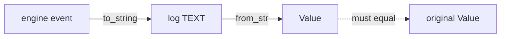

# Replay-grade JSON fidelity and deterministic Lua iteration

<product-contract>

## Product Requirements

A run's stored payloads must read back as the identical JSON value so that replay can compare re-executed results against them, and Lua table iteration must visit keys in the same order in every process. Today float text is not always parsed exactly, three timing fields carry nanosecond noise that need not survive, and Lua `pairs`/`next` walk a table in an unspecified hash order. This plan makes the log round-trip bit-for-bit, rounds those timings at their source, replaces `pairs`/`next` with sorted iteration, and records the rules.

- Problem and users: the run log writes a record's payload as JSON text and parses it back for replay, whose vocabulary lives at `crates/promptforge-api-types/src/replay.rs`. `serde_json`'s default parser is not exact, so `3.9078000000000004` reads back as `3.9078`, and Lua `pairs`/`next` iterate a table in an unspecified hash order, so two processes can visit the same table differently. The users are the replay path and any host that compares stored payloads.
- Goals: exact float parsing across the workspace; timing values rounded to microseconds at their source so their text form is short and parses exactly; a log fidelity test pinning `Value` identity and canonical text; sorted, deterministic `pairs`/`next`; and the round-trip rule and the iteration order written into the repository's author-facing guidance and the Lua language guide.
- Non-goals: no fork of `mlua`; no use of a configurable Lua hash seed; no replay implementation; no change to the Lua standard-library surface other than iteration order.
- Success criteria: `from_str(to_string(value))` equals the original `Value` for awkward floats, nested objects built in unsorted insertion order, and a real `AssistantReply` carrying `CallMetrics`; `pairs`/`next` yield the identical order in two fresh VMs for the same table; `cargo hakari verify` passes.
- Constraints: `serde_json` feature unification is owned by `crates/workspace-hack`; `Value::Object` is a `BTreeMap` because no crate enables `preserve_order`, so key order is already canonical and must stay so; non-finite floats cannot be stored faithfully, so producers reject them at the source.
- Open questions: None

## Functional Specification

The run log round-trips a payload textually, and a Lua author iterates a table deterministically. The log writes each record's payload with `serde_json::to_string` (`crates/harness/log/src/append.rs:96`) and reads it with `serde_json::from_str` (`crates/harness/log/src/read.rs:97`); the payload is already a `serde_json::Value` before it reaches the writer. Lua iteration becomes a pure function of the table's contents rather than of its internal hash state.

- Actors and workflows: the log writer serializes a `Value` payload to TEXT and the reader parses it back; a Lua author walks a table with `pairs` or `next` inside a section VM (`crates/promptforge/lua/src/vm.rs`).
- Inputs and outputs: input is an event payload (a `serde_json::Value`) or a Lua table; output is stored text plus a parsed `Value` equal to the input, and a key sequence that depends only on the table's contents.
- States and validation: a stored payload holds only finite numbers and canonical (sorted) object keys; `pairs`/`next` honor a `__pairs` metamethod, visit the array part first in index order, then hash keys by sort order, and skip any key whose value has become `nil` during traversal.
- Errors and recovery: a non-finite number is not storable as itself, so producers reject it before the log sees it; a value the parser cannot round-trip is a defect the fidelity test catches rather than a silent loss.
- Security and privacy behavior: no new data is stored and no new surface is exposed; the change removes a silent-loss path (a float whose text cannot round-trip) rather than adding one.
- Acceptance criteria: the fidelity test passes for the listed payloads; the iteration tests pass; the end-to-end agent run passes repeatedly.

</product-contract>
<implementation-contract>

## Technical Design

Three cross-module changes make replay comparison sound. The workspace enables `serde_json`'s `float_roundtrip` feature so every `from_str` is exact. The model client rounds its derived timing fields to microseconds so the values that reach the log have short, exactly-parsing text. The Lua VM replaces `pairs`/`next` with sorted iteration so table traversal is deterministic without touching `mlua`.

- Architecture: exactness is fixed once at the workspace dependency level rather than per call site; determinism is fixed at the Lua runtime boundary rather than inside `mlua`; timing rounding happens where the derived value is computed, so the logged text is short for every consumer.
- Modules and interfaces: `crates/promptforge/model-client/src/client/read.rs` computes `duration_ms` as `duration.as_secs_f64() * 1000.0` (lines 166-169) and `mean_itl_ms` from it (lines 152-157); both become whole-microsecond values. `crates/promptforge/lua/src/collection.rs` already defines a private `SortKey` (lines 24-55) used by the enumeration path at lines 124-125 and sorted at line 161; that ordering is extracted to a shared crate-internal helper and a new iteration installer reuses it.
- File and public API changes: the workspace root `Cargo.toml` (line 78) gains the `float_roundtrip` feature; `crates/workspace-hack/Cargo.toml` is regenerated. The Lua change adds crate-internal modules only (`collection-order`/`order` and `iteration`) and installs them in `SectionVm::new` after `harden` (`crates/promptforge/lua/src/vm.rs:275`). The compile-only VM (`crates/promptforge/lua/src/program.rs:13`) is untouched. No public API changes.
- Data, persistence, failure, security, and privacy constraints: the stored payload format does not change shape; exact parsing makes existing text read back exactly; object keys stay sorted because `Value::Object` is a `BTreeMap` (no crate enables `preserve_order`); a payload containing a non-finite number is impossible to store as itself, so the producers that can emit one already reject it at the source - temperature through `crates/promptforge/model-client/src/model/options.rs:23-29` and timer seconds through `crates/promptforge/lua/src/protocol/parse-tasks.rs:56-60` with a defensive repeat in `crates/promptforge-api-runtime/src/execute/scheduler/timer.rs:53-58`.

</implementation-contract>
<verification-contract>

## Testing Plan

Tests pin the log round-trip and the iteration order, and the change is gated by the workspace checks and a flake loop. The fidelity test covers the value shapes that fail today; the iteration tests cover the ordering rules; the exit criteria run the full suite and the guide build.

- Unit: in `crates/promptforge/model-client/src/client/read-tests.rs`, a `ClientTiming` built from a `Duration` with nanosecond noise serializes to a short decimal and `from_str(to_string(v))` equals `v` for all three fields, adjusting the existing `EPSILON` assertions (lines 129-131). In the Lua crate, `iteration-tests.rs` asserts string keys iterate in byte order regardless of insertion order, the array part precedes the hash part, mixed key types order bool < number < string, `__pairs` is honored, `next(t) == nil` on an empty table, a cleared field is skipped mid-traversal, and two fresh VMs produce the identical order for the same table.
- Integration and end-to-end: a new `crates/harness/log/tests/it/fidelity.rs` appends records whose payloads hold awkward floats (`0.1 + 0.2`, `3.9078000000000004`, `1e-7`, `1e21`, `f64::MAX`, negative zero), nested objects built with keys in non-sorted insertion order, arrays of mixed numbers, and a real `Event::AssistantReply` with `CallMetrics`; reading back asserts `stored.payload == original` and `to_string(&stored.payload) == to_string(&original)`. Run `cargo nextest run -p harness-models a_prepared_run_drives_end_to_end` twenty times in a loop; all must pass.
- Regression, security, and performance: confirm no crate enables `preserve_order` (so key order stays canonical) and none enables `float_roundtrip` today; add a unit test in `crates/promptforge-api-types/src/metrics.rs` proving that serializing a non-finite `f64` yields `null`, documenting why producers reject non-finite values at the source; audit every Rust-side `table.pairs()` walk that produces an ordered `Vec` rather than a `Value` (known sites: `crates/promptforge/lua/src/collection.rs`, already sorted, and `crates/promptforge/lua/src/tools/decode.rs:115`, which sinks into an object and is canonical) and sort or record each.
- Exit criteria: `cargo fmt --all --check`; workspace clippy with `-D warnings`; `cargo hakari verify`; `cargo test -p build-xtask` (new files stay within the repository's file-size convention); rustdoc with `RUSTDOCFLAGS="-D warnings"`; the full nextest suite plus doctests; the twenty-run flake loop; `mdbook build guide`.

</verification-contract>
<decision-record>

## Decision Record

The design settles four calls and rejects two alternatives. Determinism is achieved by replacing Lua's `pairs`/`next` with sorted iteration rather than by controlling the runtime's hash seed, because `mlua` seeds the state itself. Exactness is achieved by enabling exact parsing workspace-wide and by rounding derived timings at their source.

- Decisions:
  - Replace `pairs`/`next` with sorted iteration: `mlua` calls `luaL_makeseed` itself and exposes no hash-seed override, so determinism cannot be configured; sorting removes the dependency on internal hash state. User's words: selected replacing `pairs`/`next` with sorted iteration rather than forking `mlua`.
  - Enable `serde_json`'s `float_roundtrip` for the workspace and regenerate `crates/workspace-hack`: this fixes every `from_str` at once with no code change. User's plan decision.
  - Round `duration_ms` and `mean_itl_ms` to whole microseconds at their source: the logged text is then short and parses exactly even independent of the feature, and no downstream consumer sees noise. User's plan decision.
  - Keep canonical `BTreeMap` key order and pin it by test instead of switching to insertion order. User's plan decision.
- Rejected alternatives:
  - Fork `mlua` to control the Lua hash seed: sorted iteration makes it unnecessary for determinism; revisit only as an upstream `hash_seed` contribution.
  - Enable `preserve_order` to own key order: `Value::Object` is already canonical as a `BTreeMap`, and `preserve_order` adds a dependency and insertion-order semantics; revisit only if ordered keys are ever required.
  - Post-process logged text to repair floats: rejected in favor of exact parsing plus source rounding.
- Assumptions, risks, and notes:
  - Note: `.config/hakari.toml` states that CI runs `cargo hakari verify`, but no workflow under `.github/workflows` currently invokes it, so the check is run explicitly by this plan's exit criteria.
  - Note: `crates/harness/log/src/append.rs:96` serializes an already-built `Value` with `to_string`; the `to_value` conversion happens where the event is converted, not in the writer.
  - Risk: enabling `float_roundtrip` changes parsing for every crate's JSON; the fidelity test and the full suite bound the risk.
  - Assumption: no `HashMap`/`HashSet` appears in any logged type, and tool advertisement order is registration order, so key order is deterministic already.
  - Note: the Lua crate carries no file-size marker, but new files stay small per the repository convention.

### Deferred and Out of Scope

- Deferred: an `mlua` upstream `hash_seed` option (revisit as a separate upstream contribution); reconciling `vibe/scratch/vibe-ledger.md` to the superseded-design history (separate housekeeping).
- Out of scope: building replay itself; changing the Lua standard-library surface beyond iteration order.

</decision-record>
<project-survey>

## Project Survey

- Status: complete
- Build command: `cargo build --locked -p gateway` (the workspace default member; a bare `cargo build` builds only the gateway). Install the web UI dependencies first with `npm ci --prefix crates/workshop/ui` and `npm ci --prefix crates/gateway/config-ui/ui`, since both are bundled by esbuild during the Cargo build. The desktop app uses `cargo workshop`.
- Focused test command pattern: `cargo nextest run --locked -p <crate> <test-name-substring>` (add `--all-features` for workspace crates; the workshop crates drop it). One integration case: `cargo test --locked -p <crate> --test it <test-name>`. Doctests are not run by nextest, so they are separate: `cargo test -p <crate> --doc`.
- Component test command pattern: `cargo nextest run --locked -p <crate> --all-features`; the workshop partition `cargo nextest run --locked -p workshop -p workshop-server -p workshop-server-api`, plus `cargo nextest run --locked -p workshop-server --features headless`; the structural and boundary harness `cargo test -p build-xtask`; and the TypeScript package `npm test` (`node --test`) inside `crates/workshop/ui` and `crates/gateway/config-ui/ui`.
- Full-suite test command: `cargo nextest run --locked --workspace --exclude workshop --exclude workshop-server --exclude workshop-server-api --all-features`, then `cargo test --workspace --exclude workshop --exclude workshop-server --exclude workshop-server-api --all-features --doc`; the workshop crates separately via `cargo nextest run --locked -p workshop -p workshop-server -p workshop-server-api` and `cargo test --doc -p workshop -p workshop-server -p workshop-server-api`; plus `cargo test -p build-xtask`.
- Linter command: `cargo clippy --workspace --exclude workshop --exclude workshop-server --exclude workshop-server-api --all-targets --all-features -- -D warnings`; workshop: `cargo clippy -p workshop -p workshop-server -p workshop-server-api --all-targets -- -D warnings`. Supply-chain checks are `cargo deny check` and `cargo audit`. Clippy is a superset of `cargo check`, so never run a standalone `cargo check --workspace`; the one exception is the headless build-shape gate `cargo check -p gateway --no-default-features`.
- Formatter check command: `cargo fmt --all --check`.
- Docs command: `RUSTDOCFLAGS="-D warnings"` with `cargo doc --workspace --no-deps --all-features --exclude workshop --exclude workshop-server --exclude workshop-server-api`; the user guide builds with `mdbook build guide`, and its generated SUMMARY/index files regenerate with `cargo run -p build-user-guide`.
- Test placement and naming conventions: Rust unit tests are kebab sibling files beside the module they test, wired by an explicit path attribute (`src/auth.rs` with `#[path = "auth-tests.rs"] mod tests;`); a source group of three or more files becomes a `foo/` subdirectory and flattens back below three. Rust integration tests live under `tests/it/` with `main.rs` plus feature modules (`boot.rs`, `chat.rs`, `support.rs`) and run as the `it` target. Test function names are full snake_case sentences describing the behavior. TypeScript tests live in `test/**/*.mjs` under `crates/workshop/ui` or beside sources as `src/**/*.test.mjs` in `crates/gateway/config-ui/ui`, both run under `node --test`. `.config/nextest.toml` sets a 60s slow-timeout that terminates after 3 periods, a 250ms leak-timeout, and a `heavy` group (max 8 threads, 4 required per test) for the whisper STT crates.
- Directory map: the root holds `Cargo.toml`/`Cargo.lock` (workspace, resolver 3, default member `crates/gateway/app`), `rust-toolchain.toml` (stable), `rustfmt.toml` (edition 2024 style), `clippy.toml`, `deny.toml`, `dist-workspace.toml`, `AGENTS.md`, `README.md`, plus `.config/` (hakari and nextest), `.cargo/`, `.cursor/`, `.githooks/`, `.github/` (workflows and fixtures), `crates/` (all Rust crates and the `shared-ui` TypeScript+CSS package), `guide/` (mdBook sources), `images/`, `local/`, `prompts/`, `tools/` (Node scripts and a harness tool markdown), `vibe/` (architecture notes and dated plan logs), and `target/`/`target-msrv/` (build output). `crates/` splits into public root crates (`promptforge-api-runtime`, `promptforge-api-types`, `gateway-api-types`, `gateway-api-discovery`, `harness-api`, `shared-vfs`, `shared-loopback`, `shared-error-source`, `workspace-hack`), four manifestless family containers (`crates/promptforge/`: lua, parser, store, vfs, model-client; `crates/gateway/`: app, config, routing, local, web-search, logging, progress, protocol, cloud-providers, config-ui, and a nested `stt/`; `crates/workshop/`: shell (package `workshop`), server, server-api, gateway, menu, protocol, registry, status, support, user-state, workspace, ui; `crates/harness/`: runner, models, capabilities, log, sessions, web, webfetch, web-search), and `build-*` meta tooling (`build-xtask`, `build-ui`, `build-user-guide`, `build-workshop`, `build-llama-cuda`).
- Component boundaries: the executor (`promptforge-api-runtime`) is a deterministic sans-I/O state machine driven by `Run::new`, `step`, `resume`, and `cancel` that depends on the store, the Lua VM boundary, and shared substrate; the harness is its only production host, owning the tokio runtime, effect performers, the model HTTP client, the capability registry, sessions, and the Turso run log, with `harness-api` as its single public crate; the gateway is an independent server process owning model routing and provider access behind the two public crates `gateway-api-types` and `gateway-api-discovery`; the CLI and Workshop UI are thin adapters that drive runs through those public surfaces. Dependencies point one way, shell to features to services to vocabulary; the family containers are private (no outside crate may depend into them, only their root public crate is importable), promptforge-* must not depend on gateway/workshop/harness crates, gateway crates must not depend on promptforge/workshop crates, and workshop crates reach the harness only through `harness-api`. `cargo test -p build-xtask` enforces the tier graph, container privacy, the mandatory `## Invariants` marker, lint inheritance, and the 500-line ceiling.
- Conventions summary: Rust edition 2024 on the stable toolchain with workspace-inherited lints (clippy `all` and `pedantic` denied, `unwrap_used`/`expect_used` denied, `unsafe_code` forbidden, `missing_docs` warned); behavior changes ship with their tests in the same change and product tests are preserved during refactors. Every `workshop-*` and `harness-*` crate's lib.rs opens with a `//!` doc containing a `## Invariants` marker, and no file in a marked crate exceeds 500 lines. Source directories are flat by default. Comments explain a non-obvious constraint, and every external workaround cites its upstream issue URL. Errors and status messages are concise and self-contained for model consumption. A Cargo feature gates a real constraint rather than product shape. The TypeScript UI keeps CSS beside its TypeScript and uses `--ws-*` tokens instead of raw values, never uses `localStorage` (persistence goes through the `ui-storage` adapter to server-side state files), and keeps each feature directory self-contained. The guide follows house rules: no em-dash or double-dash, four-backtick code fences, and one-line paragraphs.

</project-survey>
<execution-plan>

## Execution Instructions

The work splits into six components in dependency order: workspace JSON exactness, replay-grade log round-trip, deterministic Lua iteration, a hardening audit, author-facing rules, and the verification gate. The workspace feature gates the round-trip result, the shared ordering helper gates the iteration installer, and the audits are independent of both.

<step-1>

### Step 1: Enable exact JSON parsing workspace-wide [completed]

- Component: workspace JSON exactness

Enable `serde_json`'s `float_roundtrip` feature on the workspace dependency in `Cargo.toml`, regenerate `crates/workspace-hack/Cargo.toml` with `cargo hakari generate`, and confirm `cargo hakari verify` passes.

</step-1>

<step-2>

### Step 2: Round ClientTiming fields to microseconds [completed]

- Component: replay-grade log round-trip

In `crates/promptforge/model-client/src/client/read.rs`, round `duration_ms` (from `duration.as_secs_f64() * 1000.0`) and `mean_itl_ms` to whole microseconds, with a doc comment naming the round-trip reason. Add a bit-exact round-trip unit test in `crates/promptforge/model-client/src/client/read-tests.rs` and adjust the existing `EPSILON` assertions.

</step-2>

<step-3>

### Step 3: Pin log payload fidelity [completed]

- Component: replay-grade log round-trip

Add `crates/harness/log/tests/it/fidelity.rs` covering awkward floats, nested objects built in non-sorted insertion order, mixed-number arrays, and a real `Event::AssistantReply` carrying `CallMetrics`; assert `stored.payload == original` and matching `to_string` text. Add the round-trip bullet to the `## Invariants` section of `crates/harness/log/src/lib.rs`.

</step-3>

<step-4>

### Step 4: Extract the shared ordering helper [completed]

- Component: deterministic Lua iteration

Extract `SortKey` and a `sort_key` helper from `crates/promptforge/lua/src/collection.rs` into a shared `pub(crate)` module and make `collection_members` reuse it.

</step-4>

<step-5>

### Step 5: Install sorted pairs and next [completed]

- Component: deterministic Lua iteration

Add `install_deterministic_iteration` replacing `pairs`/`next` with sorted iteration that honors `__pairs`, visits the array part first in index order, orders mixed keys bool < number < string, and skips keys cleared to `nil`. Add unit tests in `crates/promptforge/lua/src/iteration-tests.rs`.

</step-5>

<step-6>

### Step 6: Activate deterministic iteration in the section VM [completed]

- Component: deterministic Lua iteration

Call `install_deterministic_iteration` in `SectionVm::new` after `harden` in `crates/promptforge/lua/src/vm.rs` and add the test asserting two fresh VMs yield the identical key order for the same table.

</step-6>

<step-7>

### Step 7: Record the non-finite and canonical-order regressions

- Component: hardening audit

Add a unit test in `crates/promptforge-api-types/src/metrics.rs` proving a non-finite `f64` serializes to `null`, documenting why producers reject non-finite values at the source, and confirm no crate enables `preserve_order` so `Value::Object` key order stays canonical.

</step-7>

<step-8>

### Step 8: Audit ordered pair walks

- Component: hardening audit

Audit every Rust-side `table.pairs()` walk that produces an ordered `Vec` rather than a `Value` (known sites: `crates/promptforge/lua/src/collection.rs`, already sorted, and `crates/promptforge/lua/src/tools/decode.rs`), sorting or recording each site.

</step-8>

<step-9>

### Step 9: Write the author-facing rules

- Component: author-facing rules

Add the round-trip rule to the Engineering section of `AGENTS.md` and the sorted-`pairs` sentence to the Lua language guide under `guide/src`.

</step-9>

<step-10>

### Step 10: Run the exit checks

- Component: verification gate

Run `cargo fmt --all --check`, workspace clippy with `-D warnings`, `cargo hakari verify`, `cargo test -p build-xtask`, rustdoc with `RUSTDOCFLAGS="-D warnings"`, the full nextest suite plus doctests, the twenty-run loop of `a_prepared_run_drives_end_to_end`, and `mdbook build guide`.

</step-10>

</execution-plan>
