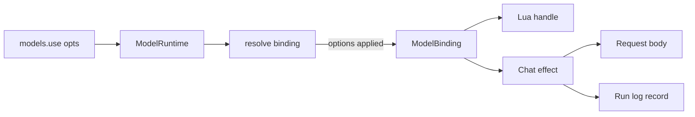

# Fix issues #69, #59, and #70

<product-contract>

## Product Requirements

Three open issues in the promptforge repository are fixed together, one commit each. Prompt authors can no longer set a sampling temperature or a generation cap (#69). macOS gateway builds emit two dead-code warnings (#59). Thinking-model turns die at a fixed 120-second timeout, and a prompt cannot ask a switchable model to stop thinking (#70).

- Problem and users:
  - #69: prompt authors, such as wg21-paperflow's papergate, cannot pin temperature or `max_tokens`, so repeated runs give different verdicts. Both were removed with `models.bind` in commit `0ac3e277`.
  - #59: maintainers building the gateway on macOS get `dead_code` warnings for `grayed` and `error_tint`, so a macOS `clippy -D warnings` run fails.
  - #70: harness hosts running thinking models hit the harness's 120-second cap on the whole stream, and `no-thinking` is reported unmet on every `Switchable` model.
- Goals:
  - A section can set `temperature` and `max_tokens` for the model it selects.
  - macOS gateway builds no longer warn about the two tray helpers.
  - `no-thinking` binds to a `Switchable` model and asks it to stop thinking.
  - A model stream times out only after a period in which no bytes arrive.
- Non-goals:
  - Sampling or generation-cap fields in the frontmatter.
  - A macOS CI job.
  - Gateway changes for #70.
  - Pushing or opening pull requests.
- Success criteria:
  - Values set through `models.use` reach the request body, pinned by a test.
  - `cargo clippy -p gateway --target aarch64-apple-darwin -- -D warnings` passes on a Mac.
  - A stream that outlasts the timeout while still sending bytes succeeds, and a silent one fails as a timeout.
- Constraints:
  - The frontmatter stays the prompt's contract: what the prompt requires from its environment.
  - Commits go directly on `vibe2`, and each has `close #N` as the second non-empty line of its message.
- Open questions: None

## Functional Specification

A prompt author sets the two invocation values as an optional table on `models.use`. They apply to rounds on that selection and are strictly validated. A `no-thinking` role binds to a model that never thinks or one that can switch thinking off. Model streams time out on silence, not on total duration.

- Actors and workflows:
  - A prompt author calls `models.use(label, { temperature = t, max_tokens = n })` in a section. Every round on that selection sends both values.
  - A prompt author gives a role `keywords: [no-thinking]`. Prepare accepts a `Never` or `Switchable` model, and rounds under the role ask for thinking off.
  - A harness host runs a long thinking turn. It completes as long as bytes keep arriving.
- Inputs and outputs:
  - Input: the optional second argument of `models.use`, a table with the keys `temperature` (a number from 0.0 to 2.0) and `max_tokens` (a positive integer).
  - Output: `temperature` and `max_tokens` in the chat request body and in the Chat effect's log record. The handle `models.use` returns shows both values.
- States and validation:
  - The options belong to the section's selection. A later `models.use` replaces both the selection and its options.
  - Rounds on the prompt-wide default, or on a `models.get` handle, send neither field.
  - Leaving a field out leaves the model's default in place.
- Errors and recovery:
  - The `models.use` call fails on a non-table second argument, a third argument, a non-string key, an unknown key, or an invalid value. The message names the option and gives required versus actual.
  - A provider that refuses a temperature fails that round with the provider's error.
  - `no-thinking` against an `Always` model is still refused at prepare.
  - A stream that receives no bytes for the timeout period fails as a `Transport` error, and `is_timeout()` and `is_retryable()` hold.
- Security and privacy behavior: No change.
- Acceptance criteria:
  - Every case in the Testing Plan passes, and every verification gate is clean.

</product-contract>
<implementation-contract>

## Technical Design

For #69, the Lua `models.use` call gains an optional argument. The options are applied to the binding in the single function both request paths use to resolve it, so the request and the run log agree. #59 is a per-platform compile gate. #70 changes one prepare check and the meaning of the harness timeout, without adding a setting. The frontmatter, the parser, and the gateway are unchanged.

- Architecture:

- Modules and interfaces:
  - `models.use` in `crates/promptforge-internal/lua/src/models.rs` records the validated options with the section's selection in `ModelRuntime`.
  - `resolve_model_binding` (`crates/promptforge-internal/lua/src/vm.rs:1350`) applies the options when a round runs on the selection. Both places that build Chat effects already call it: `crates/promptforge-internal/engine/src/execute/scheduler/chat.rs:160` and `scheduler/dispatch.rs:256`.
  - Handles hold their own copy of the binding (`crates/promptforge-internal/lua/src/protocol/parse.rs:240-264`). So the handle `models.use` returns sends the same values through `models.infer` and `models.loop`.
  - `fill_model_bindings` (`crates/promptforge-internal/engine/src/execute/fill.rs:84-94`) fails `no-thinking` only on `ThinkingMode::Always`.
  - `GatewayClient::complete` (`crates/harness/models/src/transport.rs:300-356`) bounds each receive instead of the whole request.
- File and public API changes:
  - New public method `ModelBinding::with_invocation` in `crates/promptforge-internal/model-client/src/model/options.rs`. The facade re-exports it, and it is listed in `crates/promptforge/public-api.txt`.
  - `models.use` gains an optional second argument, which is additive under `promptforge: 0`.
  - `RunLimits::request_timeout` keeps its signature. Its meaning becomes the longest wait for the next receive.
  - `grayed`, `error_tint`, and `tint` in `crates/gateway/app/src/tray/logic.rs` compile only on Windows, on Linux, and in tests.
- Data, persistence, failure, security, and privacy constraints:
  - The Chat effect's log record reads the binding's invocation (`crates/promptforge-internal/engine/src/execute/run-effect.rs:149-167`). The options must therefore be on the binding, so that the run log and replay match the request.
  - A timeout failure keeps the `ClientTimeout` marker.

</implementation-contract>
<verification-contract>

## Testing Plan

Each fix ships with its tests in the same commit. #69 is covered by Lua-crate unit tests and by an engine test that runs from Lua source to the request body. #70 is covered by prepare tests and by timing tests on the transport. #59 adds no tests; a clippy run on a Mac verifies it.

- Unit:
  - Lua crate (`crates/promptforge-internal/lua/src/models-tests.rs`):
    - The options table is accepted, the returned handle reads both values, and an integer temperature such as `0` works.
    - These are rejected: temperature `2.5`, `-0.1`, NaN (`0/0`), or a string; `max_tokens` of `0`, `-1`, `1.5`, or a string; an unknown key; a non-table second argument; and a third argument.
    - A later plain `models.use(label)` clears the options, so the handle's fields read nil.
  - Harness transport (`crates/harness/models/src/transport/tests/limits.rs`):
    - Keep `a_request_past_the_timeout_is_a_timeout_transport_failure` (lines 103-129, headers never arrive) and update its comment.
    - Steady stream: a 100ms budget, with chunks 50ms apart for about 250ms, then `[DONE]`. It must succeed.
    - Trickled event: a single SSE event written in small pieces 30ms apart under a 100ms budget, so the one event takes about 300ms to arrive. It must succeed, which proves the deadline resets on every receive.
    - Stall after the headers: one chunk, then silence. It must fail as `Transport` with `is_timeout()`.
- Integration and end-to-end:
  - In `crates/promptforge-internal/engine/src/execute/tests/model_and_reply.rs`, change the fixture of `models_use_forwards_binding_completion_options_to_the_gateway` to call `models.use('analyst', { temperature = 0, max_tokens = 256 })`.
    - Assert `body["temperature"] == 0.0` and `body["max_tokens"] == 256`, alongside the existing `enable_thinking` check.
    - Replace the stale comment saying roles declare no sampling fields.
    - This is the guard issue #69 asks for (its third ask).
  - A following section that runs on the prompt-wide default sends neither field. Check this through the scripted gateway's full request history; if the gateway doesn't expose that history, make it a separate test.
  - Prepare (`crates/promptforge-internal/engine/src/execute/tests/suite/prepare.rs`, beside the hard-keyword tests at lines 59-148):
    - A `no-thinking` role on a `Switchable` model prepares with no unmet requirements, and its request body has `enable_thinking: false`. The test runs through prepare against a `ScriptedGateway`. If the prepare suite can't reach the gateway helpers, it goes in `model_and_reply.rs` instead.
    - A `no-thinking` role on an `Always` model is still refused, with a notice naming `no-thinking` versus `Always`.
- Regression, security, and performance:
  - `models_infer_rejects_a_third_argument` (`crates/promptforge-internal/engine/src/lua/tests/errors.rs:23`) stays unchanged.
  - The existing `grayed` and `error_tint` tests (`crates/gateway/app/src/tray/logic.rs`, near lines 679 and 691) keep running on every platform.
- Exit criteria:
  - `cargo nextest run --locked --workspace --exclude workshop --exclude workshop-server --exclude workshop-server-api --all-features`
  - `cargo test --workspace --exclude workshop --exclude workshop-server --exclude workshop-server-api --all-features --doc`
  - `cargo clippy --workspace --exclude workshop --exclude workshop-server --exclude workshop-server-api --all-targets --all-features -- -D warnings`
  - `cargo fmt --all --check`
  - `cargo doc --workspace --no-deps --all-features --exclude workshop --exclude workshop-server --exclude workshop-server-api` with `RUSTDOCFLAGS="-D warnings"` (in PowerShell: `$env:RUSTDOCFLAGS="-D warnings"`)
  - `cargo doc -p promptforge --no-deps` with the same `RUSTDOCFLAGS`, without `--all-features`
  - `cargo +nightly-2026-09-05 xtask api --check` (the pinned nightly is named in `crates/build-xtask/src/api/toolchain.rs`)
  - `cargo test -p build-xtask`
  - `mdbook build guide`
  - `cargo check -p gateway --no-default-features`, the headless build shape that clippy with `--all-features` doesn't cover
  - On a Mac, run by the user: `cargo clippy -p gateway --target aarch64-apple-darwin -- -D warnings`
  - Optional: `cargo nextest run --locked -p workshop -p workshop-server -p workshop-server-api`. The workshop crates don't use the changed types.

</verification-contract>
<decision-record>

## Decision Record

- Decisions:
  - `temperature` and `max_tokens` are set per section, through an optional options table on `models.use`, not in the frontmatter. They are invocation settings, not requirements on the environment, so the frontmatter stays a pure contract. The selection is already section-scoped state, read when each round starts. User: "for max_tokens this needs to be configurable on a per-section basis. did you plan to put it only in the YAML? it arguably is not part of the prompt's contract." The user then chose "An optional table on the selection, `models.use('writer', { max_tokens = 4096 })`", and for temperature, "Yes: out of the YAML, set per section through the same Lua mechanism".
  - Both values are restored. Both were lost in the same commit, both already travel from the binding to the wire (`crates/promptforge-internal/model-client/src/client/request.rs:56-66`), and the Lua handle already exposes both fields (`crates/promptforge-internal/lua/src/models-userdata.rs:93-131`). User chose "Yes, restore both temperature and max_tokens".
  - The options apply only to rounds on that selection, and to the handle `models.use` returns. Rounds on the default model and on `models.get` handles keep the model's defaults, so an option cannot leak to a different selection. The returned handle wraps the adjusted binding, so inspecting it shows the real values, and passing it to `models.infer` or `models.loop` behaves the same as the selection. This follows from the user's choice of the selection-bound form.
  - A later `models.use` replaces the options along with the selection. The existing rule is that the latest selection steers the next round (`crates/promptforge-internal/lua/src/models.rs:95-100`). Merging options across calls would make a section's settings depend on its call history.
  - The options go onto the binding in `resolve_model_binding`, not only onto the request options. The effect's log record reads `binding.invocation()` (`crates/promptforge-internal/engine/src/execute/run-effect.rs:149-167`), so the request and the run log agree, and replay compares correctly. One function feeds both effect sites, so there is exactly one place where the options are applied.
  - The options table is validated strictly. Today the table is silently dropped (see the assumption below), which is the same kind of silent loss as #69 itself. Messages name the option and give required versus actual, because a model may read them as tool output.
  - `Temperature::new` stays the only temperature validator (`crates/promptforge-internal/model-client/src/model/options.rs:14-51`). Its type already makes an invalid temperature unrepresentable. The decoding helpers are adapted from the ones deleted in `0ac3e277`.
  - `ModelBinding::with_invocation` is the only public API addition. Rebuilding a binding from its getters through `ModelBinding::new` and `with_capabilities` would silently drop any field added later. The new builder mirrors `with_capabilities` (`options.rs:128-133`).
  - The decoding stays in `models.rs`, which grows from about 220 lines to about 310. A third `models-*.rs` file beside `models-userdata.rs` and `models-tests.rs` would trigger the repository's convention of turning a three-file sibling group into a `models/` directory, and this fix doesn't need that churn.
  - A declared temperature is sent as declared, and a provider that refuses it fails the round. Neither the gateway catalog nor the model descriptor records whether a model accepts temperature, so prepare has nothing to check against. Silently dropping the value would defeat pinning. User chose "Send it as declared; a provider that refuses it fails that round with the provider's error, documented in the guide".
  - No language-version bump. The new argument is optional and additive, and `promptforge: 0` has no per-version field gating (`crates/promptforge-internal/parser/src/build.rs:317`).
  - #59: the helpers compile only on Windows, on Linux, and in tests. macOS never calls them, by design: its template glyph is tinted by the system, and the phase shows only in the label and tooltip (`crates/gateway/app/src/tray/macos.rs:195-197`). The same file already gates `run_key_command` to its callers (`crates/gateway/app/src/tray/logic.rs:180-186`). Including `test` keeps the helper tests running everywhere. User: "can we fix this too".
  - #59: no macOS CI job. User chose "No, just the cfg fix; I'll verify on a Mac myself".
  - #70: `no-thinking` fails only on `Always`. A `Switchable` model can honor it, and the binding already asks for thinking off (`crates/promptforge-internal/engine/src/execute/context-bound.rs:59-66`) through `chat_template_kwargs.enable_thinking`. That is the switch the gateway contract names for switchable models (`crates/gateway-api-types/src/metadata.rs:13-18`). User chose "fix the no-thinking check (A) and switch the harness to first-byte plus idle deadlines (E)".
  - #70: every receive of one or more bytes resets the deadline. The same `request_timeout` value bounds the wait for headers and each body read, and there is no new setting. The harness always streams, so arriving bytes are the sign that a turn is alive. The gap before the first chunk includes prompt processing, which can be long for big local prompts, so the wait between chunks must not be shorter than the wait for headers. User: "for the timeout, each individual receive of 1 or more bytes should reset the timeout."
  - #70: the gateway stays unchanged. Streamed chat through it uses a client with only a connect timeout (`crates/gateway/protocol/src/http_util.rs:32-44`, `guide/src/gateway/11-serving-and-observing.md:57`). The 120-second 502 in the issue came from a non-streaming request, which the harness never sends. `FIRST_RESPONSE_TIMEOUT` (`crates/gateway/protocol/src/upstream.rs:487-499`) applies only to speech, and the 120-second client in `crates/gateway/cloud-providers/src/main.rs` belongs to the tool that builds the model catalog.
  - Commits: one per issue, directly on `vibe2`, with `close #N` as the message's second non-empty line, and no push or pull request unless asked. The convention is also recorded in the workspace commit rule, so future issue fixes follow it. User: "Every commit that fixes an issue should have as the 2nd non-empty line of the commit message "close #N" where N is the issue number". The user also chose "Commit both directly on vibe2, one commit per issue".
  - Decomposition: at most five steps, and one step per issue. Each issue is one commit with its own `close` line, so splitting an issue across steps would give it two commits. User: "keep steps tight (5 or less if possible)".
- Rejected alternatives:
  - Per-role `temperature` and `max_tokens` fields in the frontmatter, which is what the issue suggested and what an earlier plan did. That design needed `Temperature` to deserialize via `serde(try_from = "f64")` and a parser dependency on `promptforge-model-client`. It also needed `Eq` dropped from `ModelRole`, `ModelRoles`, `Frontmatter`, and `Prompt`. The alternative of `impl Eq for Temperature` is sound, because the value is always finite, but it contradicts the NaN tests in `options.rs`. Rejected because these are invocation settings, not contract. Revisit if roles need a default that every section inherits without calling `models.use`.
  - A per-role default in the frontmatter plus a per-section override. Rejected because it gives one value two sources. Revisit under the same condition as above.
  - A section-scoped setter such as `models.options({ ... })` that applies to every round in the section. Rejected because the user chose the selection-bound form. Revisit if authors need the settings on default-model or `models.get` handle rounds without calling `models.use`.
  - A per-call option on `models.infer` and `models.loop`. Rejected because it must be repeated at every call, and `models.infer` deliberately rejects a third argument. Revisit if a section needs different values from one round to the next.
  - Declaring one role per temperature and switching roles with `models.use`, the only way to vary temperature by section in the old design. Rejected because roles are contract, and this multiplies them.
  - An "accepts temperature" catalog capability, checked at prepare. Rejected as a large change across the gateway config, the catalog, and harness discovery. Revisit if provider refusals prove confusing in practice.
  - Silently dropping temperature for models that refuse it. Rejected because it defeats reproducibility without telling anyone.
  - #59: calling the helpers on macOS, or deleting them. Rejected because the system owns macOS tray tinting, while Windows and Linux need the helpers. Revisit if macOS moves off template glyphs.
  - #59: a gateway-only macOS clippy job (`cargo clippy --locked -p gateway --all-targets -- -D warnings` on `macos-latest`). The user declined it, and macOS runner minutes cost more. CI currently runs clippy on Linux (`.github/workflows/ci.yml:25-67`) and on Windows for the workshop crates only (`ci.yml:149-186`). Revisit if macOS-only warnings recur.
  - One topic branch per issue. Rejected because the user chose `vibe2`. Revisit if the fixes need separate pull requests.
  - #70: the engine sending both thinking spellings (`chat_template_kwargs` plus a provider-specific field). Rejected because some providers reject unknown fields, and it would put provider knowledge in the engine.
  - #70: separate budgets for headers and for gaps between chunks, like the gateway's speech path (`crates/gateway/protocol/src/upstream.rs:571-600`). Rejected because prompt processing happens before the first chunk, so a shorter between-chunk budget could kill a live turn, and one value is simpler. Revisit if a host needs faster stall detection mid-stream.
- Assumptions, risks, and notes:
  - Assumption: mlua ignores arguments beyond a callback's declared parameters, so `models.use('writer', { temperature = 0 })` is silently ignored today. The new rejection tests pin the new behavior either way.
  - Risk: OpenRouter may ignore `chat_template_kwargs.enable_thinking`. If it does, `no-thinking` passes prepare but Qwen keeps thinking. One real request through the gateway settles it.
  - Risk: macOS can't be checked from the Windows development machine, because a macOS-target clippy run fails building the C code in `aws-lc-sys` and `ring` (both in `Cargo.lock`). Other macOS-only warnings may also have appeared since #59 was filed.
  - Note: even with no timeout, the issue's thinking runs spent almost all of an 8,192-token budget on reasoning. `qwen3.8-flash` would return an empty reply and `qwen3.8-27b` a truncated one. Thinking-model turns need thinking off or a larger per-section `max_tokens`, which is why the `no-thinking` fix matters most.
  - Note: per-section temperature never existed as its own feature. It always lived on the binding (`git show 0ac3e27^:crates/promptforge-lua/src/models/decode.rs`).
  - Note: the existing gateway-body test binds the model directly (`crates/promptforge-internal/engine/src/execute/tests/model_and_reply.rs:21-30`), so it never exercised the prepare check.
  - Note: the combined guides (`guide/promptforge-*-guide.md`) are generated from `guide/src` by `cargo run -p build-user-guide` (`crates/build-user-guide/src/main.rs:1-81`).
  - Note: harness crates enforce a 500-line limit per file, checked by `cargo test -p build-xtask`. `transport.rs` is about 385 lines.
  - Note: paths are relative to the promptforge repository root, which is checked out locally at `promptforge2/`. The commit rule lives outside that repository, at `.cursor/rules/commit.mdc` in the enclosing workspace.
  - Note: the issues are https://github.com/cppalliance/promptforge/issues/69, https://github.com/cppalliance/promptforge/issues/59, and https://github.com/cppalliance/promptforge/issues/70.
  - Note: at planning time the tree was clean on `vibe2` at `1fd82c62`, 19 commits ahead of `upstream/master`, and no `vibe/ACTIVE` file existed. Every line number in this plan refers to that commit. When a line has moved, the named symbol, section heading, or quoted text is authoritative.
  - Note: `vibe2` has diverged from `origin/vibe2`: 1 commit exists only on the remote, and 156 exist only locally. This plan neither pulls nor pushes, so the divergence doesn't affect the run, but a later push needs a rebase or merge first.
  - Note: the pinned nightly `nightly-2026-09-05` needed by `xtask api` is installed on the development machine, as are `cargo-nextest` and `mdbook`.
  - Note: the commit-rule edit is in the enclosing workspace, not in the promptforge repository. It is done before the run, outside every step's commit.
  - Note: the run's commit-message stage writes a subject, one paragraph, optional bullets, and trailers. Its template has no slot for the `close #N` line. So after each message is written, and before it is amended into the commit, confirm that the second non-empty line is exactly `close #N` for that step's issue, and insert it between the subject and the paragraph if it's missing. In the same pass, replace the first line with the subject that the step's Commit bullet names.
  - Note: the run adds bookkeeping to the history. It first commits a copy of this plan under `vibe/` plus a `vibe/ACTIVE` marker, and Step 1 folds its changes into that commit, which therefore gets `close #69`. When all steps are done, it adds a final plan-closing commit. That commit fixes no issue, so it has no `close` line.

### Deferred and Out of Scope

- Deferred: having the gateway translate the thinking switch for remote upstreams, through a per-model setting modeled on `tool_dialect` (`crates/gateway/config/src/config.rs:500-547`). Revisit when a real OpenRouter request shows it ignores `chat_template_kwargs`.
- Deferred: exposing the request timeout through `harness-api`. The session currently hardcodes `RunLimits::new()` (`crates/harness/sessions/src/session/run.rs:86-87`). Revisit when a host needs a hard wall-clock ceiling.
- Deferred: making the gateway's 120-second non-streaming cap configurable (`crates/gateway/protocol/src/http_util.rs:20`), and adding an idle deadline to its streaming relay. Revisit when non-streaming clients hit the cap, or when stalled upstreams tie up concurrency slots.
- Deferred: any other macOS-only warnings the Mac clippy run finds. Revisit when that run reports them.
- Out of scope: a macOS CI job.
- Out of scope: pushing or opening pull requests.
- Out of scope: thinking control through the `models.use` options, since thinking stays with the role's keywords.

</decision-record>
<project-survey>

## Project Survey

- Status: complete
- Build command: `cargo build --locked -p gateway` (plain `cargo build` builds only the gateway, the sole default member); desktop app via `cargo workshop` (alias for `run -p build-workshop --`, stages the gateway sidecar then builds `workshop`); never bare `cargo build -p workshop` without a staged sidecar.
- Focused test command pattern: `cargo nextest run --locked -p <crate> --all-features <test-name-substring>`; drop `--all-features` for `workshop`, `workshop-server`, `workshop-server-api`; doctests are not run by nextest, use `cargo test --locked -p <crate> --all-features --doc <name>`; gateway fixture tests use `cargo test --locked -p gateway --no-default-features --features test-fixtures --test it <name>`.
- Component test command pattern: `cargo nextest run --locked -p <crate> --all-features` then `cargo test --locked -p <crate> --all-features --doc`; for the three workshop crates omit `--all-features`, and `workshop-server` also needs `cargo nextest run --locked -p workshop-server --features headless`; UI packages: `npm test` in `crates/workshop/ui` or `crates/gateway/config-ui/ui`.
- Full-suite test command: `cargo nextest run --locked --workspace --exclude workshop --exclude workshop-server --exclude workshop-server-api --all-features`, then `cargo test --workspace --exclude workshop --exclude workshop-server --exclude workshop-server-api --all-features --doc`, then `cargo nextest run --locked -p workshop -p workshop-server -p workshop-server-api` and `cargo test --doc -p workshop -p workshop-server -p workshop-server-api` (the workspace run includes `build-xtask`, the boundary and structural harness).
- Linter command: `cargo clippy --workspace --exclude workshop --exclude workshop-server --exclude workshop-server-api --all-targets --all-features -- -D warnings` and `cargo clippy -p workshop -p workshop-server -p workshop-server-api --all-targets -- -D warnings`, plus `cargo check -p gateway --no-default-features` (the only permitted standalone check); UI: `npm run typecheck` in each UI package; facade surface (when the `promptforge` facade changes): `cargo +<nightly pinned in crates/build-xtask/src/api/toolchain.rs> xtask api --check`.
- Formatter check command: `cargo fmt --all --check` (rustfmt `style_edition = "2024"`; also the pre-commit hook).
- Docs command: with `RUSTDOCFLAGS="-D warnings"` (PowerShell: `$env:RUSTDOCFLAGS="-D warnings"`), `cargo doc --workspace --no-deps --all-features --exclude workshop --exclude workshop-server --exclude workshop-server-api` and `cargo doc -p promptforge --no-deps` (default features); user guide: `mdbook build guide`.
- Test placement and naming conventions: unit tests live beside the module as `foo-tests.rs` wired by `#[cfg(test)] #[path = "foo-tests.rs"] mod tests;`, or as `foo/tests.rs` plus `foo/tests/*.rs` once a module's tests span three or more files (for example `engine/src/execute/tests/`); integration tests are one binary per crate at `tests/it/main.rs` (`tests/suite/main.rs` in `promptforge`) with topic submodules and a `support.rs` or `common/mod.rs` helper; prompt fixtures are Markdown under `tests/prompts/execution/` and `tests/prompts/invalid/`; benches in `benches/` (engine, lua); test functions are snake_case behavior sentences such as `a_direct_launch_recovers_the_lease_from_a_terminated_owner`; test files open with a `//!` scope line; `unwrap`/`expect` are allowed in tests only; UI tests are `node --test` files at `test/**/*.mjs` and `src/**/*.test.mjs`, and `tools/*.test.mjs` sit beside their scripts; behavior changes ship tests in the same change.
- Directory map: `crates/` root is the public layer (`promptforge` facade, `harness-api`, `gateway-api-types`, `gateway-api-discovery`, `shared-error-source`, `shared-loopback`, `shared-ui` TypeScript+CSS package, `workspace-hack` from cargo-hakari, and `build-xtask`, `build-workshop`, `build-ui`, `build-user-guide`, `build-llama-cuda` tooling); manifestless family containers `crates/promptforge-internal/` (engine, types, vfs, lua, parser, store, model-client), `crates/harness/` (runner, models, capabilities, log, sessions, web, webfetch, web-search), `crates/gateway/` (app is the gateway binary, cloud-providers, config, config-ui with its `ui/` SPA, local, logging, progress, protocol, routing, web-search, `stt/` api, engine, backend-whisper, whisper-ffi), `crates/workshop/` (shell is the Tauri `workshop` crate, server, server-api, gateway, menu, protocol, registry, status, support, user-state, workspace, `ui/` TypeScript SPA); `guide/` mdbook user guide and product guides; `prompts/` example prompt files; `tools/` Node scripts for sidecar staging and live TTS; `vibe/` architecture doc and dated plan logs; `.github/workflows/` CI (`ci.yml`) and release, nightly, guide, miri, CUDA workflows; `.config/` nextest and hakari config; `.githooks/` pre-commit fmt and pre-push clippy/deny; `.cargo/config.toml` rust-lld on Windows plus `cargo workshop` and `cargo xtask` aliases; `images/` README art.
- Component boundaries: executor (`promptforge-engine`) is sans-I/O and reached only through the `promptforge` facade, and promptforge crates never depend on gateway, workshop, or harness; harness is the executor's only production host, reached only through `harness-api`, and may depend on `promptforge`, the gateway public pair, and shared-*; gateway is an independent process whose public surface is `gateway-api-types` and `gateway-api-discovery`, depending only on shared-*; workshop runs shell `workshop` to `workshop-server-api` to `workshop-server` and subsystems, may name the promptforge facade, `harness-api`, and the gateway public pair, never private gateway or harness crates; shared-* depend on no product crate; a container crate depends only on root crates and its siblings (build-* exempt); tiers flow shell to features to services to vocabulary; `cargo test -p build-xtask` enforces the graph, container privacy, the `//! ## Invariants` marker in workshop-* and harness-* `lib.rs`, and lint inheritance.
- Conventions summary: Rust 2024 on stable; every member sets `[lints] workspace = true` and depends on `workspace-hack`; workspace lints forbid unsafe outside owned boundaries (unsafe blocks have safety comments), warn on missing docs and `unreachable_pub`, and deny clippy all plus pedantic plus `unwrap_used`/`expect_used`; all versions pinned in `[workspace.dependencies]` with a comment explaining each non-obvious pin; files in marker crates stay at or under 500 lines; source directories are flat, with 1 or 2 related files as kebab siblings via `#[path]` and 3 or more rehydrated into a subdirectory; comments state only constraints, and workarounds cite an upstream issue URL; errors use thiserror with model-readable required-versus-actual messages and third-party causes wrapped through `shared-error-source`; run-log JSON is canonical (sorted keys, `float_roundtrip`, never `preserve_order`); Cargo features gate only real constraints (`test-fixtures`, `headless`); builds must not write into the repository (UI bundles build into `OUT_DIR`, CI checks a clean tree); no new structural checks without explicit user approval; SPA keeps CSS beside its TypeScript, uses `--ws-*` tokens, and never touches `localStorage`.

</project-survey>
<execution-plan>

## Execution Instructions

<step-1>

### Step 1: Add temperature and max_tokens options to models.use (#69) [completed]

- Component: `models-use-options`

- Placement: first of three components. It depends on neither of the others. It precedes Step 3 because both edit `guide/src/language/06-models.md` and regenerate the combined guides, so a fixed order keeps each commit's generated guides matching its own source edits.
- Pieces, built sequentially inside this one step: (1) the `ModelBinding::with_invocation` builder, (2) the `models.use` options in the Lua crate, (3) tests, (4) docs and the pull-request text. The builder comes first because `resolve_model_binding` calls it and the facade listing can only be regenerated once it exists. The pieces share one step because the engine end-to-end test passes only when the builder, the decoding, and the application all work, and the plan requires one commit per issue.
- Before this step, outside every step's commit: edit `.cursor/rules/commit.mdc` in the enclosing workspace (`c:\Users\Vinnie\cursor`, not the promptforge repository). All three commit messages in this plan depend on it.
  - Add a `close #N` line to the message shape, where N is the issue number, after the subject and before the paragraph, present only when the commit fixes an issue.
  - Note that the issue number comes from the request, since the diff can't show it. This is the one allowed exception to the rule that the message is written from the diff alone.
  - Add a self-check item: when the commit fixes an issue, the second non-empty line is exactly `close #N`.
- Builder, in `crates/promptforge-internal/model-client/src/model/options.rs`:
  - Add `ModelBinding::with_invocation(self, invocation: ModelInvocation) -> Self` beside `with_capabilities` (lines 128-133), mirroring it and returning the binding with its invocation replaced. It is the only public API addition, and the `promptforge` facade re-exports it.
  - Regenerate `crates/promptforge/public-api.txt` with `cargo +nightly-2026-09-05 xtask api --bless`, then confirm with `cargo +nightly-2026-09-05 xtask api --check`.
- Lua options, in `crates/promptforge-internal/lua/src/models.rs`:
  - Take the `models.use` arguments in a form that sees a third argument and a non-table second argument, such as `MultiValue`, because a typed parameter list drops extra arguments.
  - Decode the optional table with helpers adapted from `value_as_temperature`, `decode_lua_number`, and `value_as_nonzero_u32` in `git show 0ac3e27^:crates/promptforge-lua/src/models/decode.rs`. `temperature` accepts a Lua integer or number and is validated only by `Temperature::new`. `max_tokens` is a positive integer stored as `NonZeroU32`.
  - Reject a non-table second argument, a third argument, a non-string key, an unknown key, and an invalid value. Each message names the option and gives required versus actual, for example `models.use option temperature 3 is outside the supported range [0.0, 2.0]`.
  - `ModelRuntime`'s selection (lines 80-101) becomes the label plus the validated options. A later `models.use` replaces both.
  - `resolve_model_binding` (`crates/promptforge-internal/lua/src/vm.rs:1350`) applies the options through `ModelBinding::with_invocation` only when the round runs on the selection. Start from the binding's current `ModelInvocation` and override only the fields the options set, so an omitted field keeps the model's default. Rounds on the prompt-wide default or on a `models.get` handle are unchanged. Both Chat-effect sites already call this function (`crates/promptforge-internal/engine/src/execute/scheduler/chat.rs:160` and `scheduler/dispatch.rs:256`), so the request body and the run-log record (`crates/promptforge-internal/engine/src/execute/run-effect.rs:149-167`) agree.
  - `models.use` returns `LuaModelHandle::from_binding` over the adjusted binding, so the handle sends the same values through `models.infer` and `models.loop`.
  - Keep the module doc and the `install_models` doc accurate. Keep the decoding in `models.rs` (about 310 lines afterward); do not add a third `models-*.rs` sibling.
- Tests:
  - `crates/promptforge-internal/lua/src/models-tests.rs`: the options table is accepted and the returned handle reads both values; an integer temperature such as `0` works; these are rejected: temperature `2.5`, `-0.1`, NaN (`0/0`), or a string, `max_tokens` of `0`, `-1`, `1.5`, or a string, an unknown key, a non-table second argument, and a third argument; a later plain `models.use(label)` clears the options, so the handle's fields read nil.
  - `crates/promptforge-internal/engine/src/execute/tests/model_and_reply.rs`: in `models_use_forwards_binding_completion_options_to_the_gateway`, change the fixture to call `models.use('analyst', { temperature = 0, max_tokens = 256 })`. Assert `body["temperature"] == 0.0` and `body["max_tokens"] == 256` beside the existing `enable_thinking` check, and replace the stale comment saying roles declare no sampling fields. This is the guard the issue's third ask requests.
  - A following section that runs on the prompt-wide default sends neither field. Check it through the scripted gateway's full request history, or as a separate test if the gateway doesn't expose that history.
  - Regression: `models_infer_rejects_a_third_argument` (`crates/promptforge-internal/engine/src/lua/tests/errors.rs:23`) stays unchanged and passing.
- Docs:
  - `guide/src/language/06-models.md`, "Selecting a model for a section" (around line 35): document the options table, the rules for both fields, and which rounds they apply to (the selection, plus the handle `models.use` returns). Say that a later `models.use` replaces them, that leaving a field out keeps the model's default, and that a provider that refuses a temperature fails the round with its own error.
  - Same file, "Inspecting a binding" (line 39): `temperature` and `max_tokens` show the section's options on the handle `models.use` returns, and read nil otherwise.
  - Same file, the migration note (line 104): the old `models.bind` options `temperature` and `max_tokens` now go in the `models.use` options table.
  - `guide/src/agent/03-chat-rounds.md` (line 76): replace "given at bind time" and "read nil when the bind declared none".
  - After the `guide/src` edits, regenerate the combined guides (`guide/promptforge-*-guide.md`) with `cargo run -p build-user-guide`.
- Pull-request text: the session running the plan drafts it, not the coding sub-agent, after this step's commit message is finalized. It is written as an **output** file outside the repository and summarized in the step's report; it is never written into the repository or committed. Do not open a pull request or post it. It answers the issue's four asks:
  - First ask: temperature and `max_tokens` are set per section with `models.use(label, { temperature = 0 })`, not per role in the frontmatter, which stays the prompt's contract. papergate's writer pin becomes one line in each section that runs the writer. If every section runs the writer, the line can go once in the shared library, which replays into every section.
  - Second ask: per-section temperature is exactly this mechanism.
  - Third ask: the engine test pins both values all the way to the request body.
  - Fourth ask: the value passes through to the provider, and a refusal becomes that round's error. This is documented. The new optional argument is additive under `promptforge: 0`, so no version bump is needed.
- Verification, all clean before committing:
  - `cargo nextest run --locked -p promptforge-lua -p promptforge-engine -p promptforge-model-client --all-features`
  - `cargo test --locked -p promptforge-lua -p promptforge-engine -p promptforge-model-client --all-features --doc`
  - `cargo clippy -p promptforge-lua -p promptforge-engine -p promptforge-model-client --all-targets --all-features -- -D warnings`
  - `cargo +nightly-2026-09-05 xtask api --check`, and `cargo doc -p promptforge --no-deps` with `$env:RUSTDOCFLAGS="-D warnings"`
  - `cargo test -p build-xtask`, `cargo fmt --all --check`, and `mdbook build guide`
- Commit: one commit directly on `vibe2`, with no push or pull request. It contains the builder, `public-api.txt`, the Lua changes, the tests, the `guide/src` edits, and the regenerated combined guides. The message is the subject `Add temperature and max_tokens options to models.use`, a blank line, `close #69`, a blank line, then the body the commit rule prescribes: one paragraph, plus optional bullets.

</step-1>

<step-2>

### Step 2: Gate tray icon tints to Windows and Linux (#59) [completed]

- Component: `tray-tint-gating`

- Placement: second of three components. It depends on neither of the others and shares no file with them, so its position is arbitrary.
- Pieces: a single piece, the compile gate with its doc note, so no sequential or joint choice arises.
- Work, in `crates/gateway/app/src/tray/logic.rs`:
  - Add `#[cfg(any(target_os = "windows", target_os = "linux", test))]` to `grayed` (line 428), `error_tint` (line 438), and `tint` (line 443). This mirrors the existing gate on `run_key_command` (lines 180-186). macOS never calls these helpers, because the system tints its template glyph (`crates/gateway/app/src/tray/macos.rs:195-197`).
  - Add a one-line doc note naming the callers: `crates/gateway/app/src/tray/windows.rs:127-129` and `crates/gateway/app/src/tray/linux.rs:324-326`.
- Tests: none added. The existing `grayed` and `error_tint` tests (near lines 679 and 691 of `logic.rs`) keep running on every platform, because the gate includes `test`.
- Verification, all clean before committing:
  - `cargo nextest run --locked -p gateway --all-features tray`
  - `cargo clippy -p gateway --all-targets --all-features -- -D warnings`
  - `cargo check -p gateway --no-default-features`
  - `cargo fmt --all --check`
  - The macOS check, `cargo clippy -p gateway --target aarch64-apple-darwin -- -D warnings`, is run by the user on a Mac. It can't build on the Windows development machine because of the C code in `aws-lc-sys` and `ring`.
- Commit: one commit directly on `vibe2`, with no push or pull request, containing only the `logic.rs` change. The message is the subject `Gate tray icon tints to Windows and Linux`, a blank line, `close #59`, a blank line, then the body the commit rule prescribes: one paragraph, plus optional bullets.

</step-2>

<step-3>

### Step 3: Bind no-thinking to switchable models and bound each stream receive (#70) [completed]

- Component: `thinking-and-stream-deadlines`

- Placement: third and last of three components. Its edit to `guide/src/language/06-models.md` (line 19) and its guide regeneration follow Step 1's edits to the same file. As the final step, it also runs the full exit criteria on the finished tree.
- Pieces, built sequentially inside this one step: (1) the `no-thinking` fill check, then (2) the transport's per-receive deadline. They don't depend on each other. They share one step because the plan requires one commit for #70, and the combined guides are regenerated once, after both pieces' guide edits.
- Fill check:
  - In `crates/promptforge-internal/engine/src/execute/fill.rs` (line 91, inside `fill_model_bindings` at lines 84-94), change the `NoThinking` condition to `model.thinking() == ThinkingMode::Always`, so `no-thinking` fails only on a model that always thinks.
  - No request change is needed: the binding already asks for thinking off (`crates/promptforge-internal/engine/src/execute/context-bound.rs:59-66`) through `chat_template_kwargs.enable_thinking`.
- Transport, in `crates/harness/models/src/transport.rs`, inside `GatewayClient::complete` (lines 300-356):
  - Remove `.timeout(self.request_timeout)` (line 318). Wrap `request.send()` in `tokio::time::timeout(self.request_timeout, ...)`.
  - Give `ResponseChunks` the timeout duration as a field, and wrap each read in `ResponseChunks::next_chunk` (lines 74-86) with it, so every receive of one or more bytes restarts the budget. The error-body path reads through the same chunks, so it is bounded too.
  - Map an elapsed tokio timeout to the `ClientTimeout` marker with a helper beside `transport_source` (lines 57-72). A timeout stays a `Transport` error for which `is_timeout()` and `is_retryable()` hold.
  - Update the comment above the removed call, and the doc comments on the `request_timeout` field (line 37), `DEFAULT_REQUEST_TIMEOUT` (lines 43-44), and `with_request_limits` (lines 207-235). The value stays 120 seconds, no new setting is added, and the gateway is unchanged.
  - In `crates/promptforge-internal/engine/src/execute/config-limits.rs` (lines 55-117), update the docs of `RunLimits::request_timeout` and `RunLimits::new`: the signature is unchanged, and the value now means the longest wait for the next receive.
  - `transport.rs` is about 385 lines and must stay at or under the harness 500-line limit.
- Tests:
  - `crates/promptforge-internal/engine/src/execute/tests/suite/prepare.rs`, beside the hard-keyword tests at lines 59-148: a `no-thinking` role on a `Switchable` model prepares with no unmet requirements, and its request body has `enable_thinking: false`, run through prepare against a `ScriptedGateway`. If the prepare suite can't reach the gateway helpers, put this test in `model_and_reply.rs` instead. A `no-thinking` role on an `Always` model is still refused, with a notice naming `no-thinking` versus `Always`.
  - `crates/harness/models/src/transport/tests/limits.rs`: keep `a_request_past_the_timeout_is_a_timeout_transport_failure` (lines 103-129, headers never arrive) and update its comment. Add three tests:
    - Steady stream: a 100ms budget, with chunks 50ms apart for about 250ms, then `[DONE]`. It succeeds.
    - Trickled event: a single SSE event written in small pieces 30ms apart under a 100ms budget, so the one event takes about 300ms to arrive. It succeeds, which proves the deadline resets on every receive.
    - Stall after the headers: one chunk, then silence. It fails as `Transport` with `is_timeout()`.
- Docs:
  - `guide/src/language/06-models.md` (line 19): `no-thinking` is satisfied by a model that never thinks or one whose thinking is switchable, and in the switchable case every round under the role asks for thinking off. The switch is forwarded as `chat_template_kwargs.enable_thinking`, so an upstream that ignores that field keeps its own default.
  - `guide/src/language/09-limits-and-errors.md` (line 24): replace "a 120 second request timeout" with a description of a limit of 120 seconds without progress.
  - After both edits, regenerate the combined guides with `cargo run -p build-user-guide`.
- Verification: first the focused runs, `cargo nextest run --locked -p promptforge-engine -p harness-models --all-features` and `cargo clippy -p promptforge-engine -p harness-models --all-targets --all-features -- -D warnings`. Then the full exit criteria on the finished tree, all clean:
  - `cargo nextest run --locked --workspace --exclude workshop --exclude workshop-server --exclude workshop-server-api --all-features`
  - `cargo test --workspace --exclude workshop --exclude workshop-server --exclude workshop-server-api --all-features --doc`
  - `cargo clippy --workspace --exclude workshop --exclude workshop-server --exclude workshop-server-api --all-targets --all-features -- -D warnings`
  - `cargo fmt --all --check`
  - With `$env:RUSTDOCFLAGS="-D warnings"`: `cargo doc --workspace --no-deps --all-features --exclude workshop --exclude workshop-server --exclude workshop-server-api`, and `cargo doc -p promptforge --no-deps` without `--all-features`
  - `cargo +nightly-2026-09-05 xtask api --check` (the pinned nightly is named in `crates/build-xtask/src/api/toolchain.rs`)
  - `cargo test -p build-xtask`
  - `mdbook build guide`
  - `cargo check -p gateway --no-default-features`
  - Optional: `cargo nextest run --locked -p workshop -p workshop-server -p workshop-server-api`. The workshop crates don't use the changed types.
  - Excluded: the Mac clippy run from Step 2, which the user performs.
- Commit: one commit directly on `vibe2`, with no push or pull request. It contains the fill change, the transport and `RunLimits` changes, the tests, the `guide/src` edits, and the regenerated combined guides. The message is the subject `Bind no-thinking to switchable models; idle model timeout`, a blank line, `close #70`, a blank line, then the body the commit rule prescribes: one paragraph, plus optional bullets.

</step-3>

</execution-plan>

