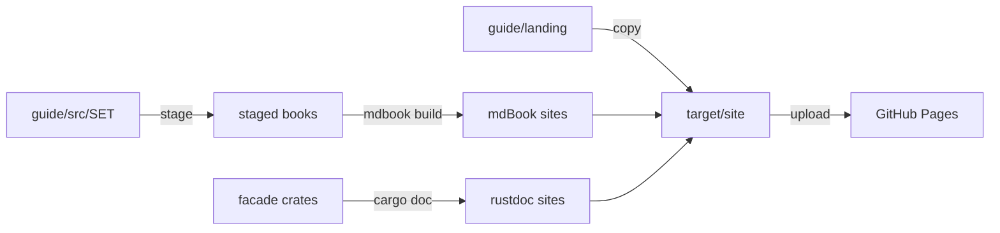

# Multi-product docs site

<product-contract>

## Product Requirements

The repository publishes one GitHub Pages site today: the combined mdBook user guide at the site root. This plan replaces it with one assembled site. Each product gets its own independent documentation, and a new landing page introduces the system and links to every product. PromptForge and Harness get rustdoc API references; Gateway, Workshop, and the prompt language get mdBooks; the landing page is hand-written HTML. Apart from the landing page copy, every new content file is a stub for the owner's own writing tooling.

- Problem and users:
  - Readers land on one combined user guide at the site root. The `promptforge` rustdoc is built only locally (the owner's command: `cargo doc -p promptforge --no-deps --all-features --open`) and in CI checks. It is never published.
  - Readers: prompt authors, agent-program authors, host developers embedding PromptForge, Gateway operators, and Workshop users.
  - Maintainers: the repository owner, who writes chapter content with separate custom tooling, plus CI.
- Goals:
  - Each product (PromptForge, Harness, Gateway, Workshop) has its own separate, self-contained documentation site with its own navigation and search.
  - A landing page at the site root lists every component, links to each one's docs, and gives the reader an overview of what the system is.
  - Tool mix: rustdoc for PromptForge and Harness, mdBook for Gateway and Workshop, a third mdBook for the Prompt Language and Agent Programs guides, and plain HTML for the landing page.
  - One command builds the whole site identically on a developer machine (Windows included) and in CI.
- Non-goals:
  - Writing chapter content, the Harness crate-level docs body, Workshop chapters, or landing images.
  - Documenting any Gateway or Workshop crate with rustdoc.
  - Changing where chapter sources live or how the owner's authoring tooling works.
- Success criteria:
  - `https://cppalliance.github.io/promptforge/` serves the landing page, and every link in the product table reaches a working product site.
  - Every product site shows a link back to the landing page.
  - A PR that touches only code never triggers the site check. A docs PR gets a site check in about a minute with a warm cache.
- Constraints:
  - GitHub Pages serves one site per repository, deployed from one uploaded folder. Every doc set is therefore built into a subfolder of one site folder.
  - The authoring tree `guide/src/<set>/` and the scratch tree `guide/scratch/<set>/` keep their paths.
  - The site build never writes to the checked-in tree.
  - The PR-time check must not slow down regular code commits.
  - All written copy uses plain English and never uses em dashes or double dashes.
  - The Pages build needs no Node, Tauri, or CUDA.
  - Files retired from the repository are moved to the workspace trash folder `cabinet/_trash/` (outside this repository), never deleted outright.
- Open questions:
  - None.

## Functional Specification

A reader enters at the landing page, reads a short overview of the system, and follows a product row into that product's own site. Every page of every site links back to the landing page. Authors keep writing chapters where they write them today; a single build command assembles the books, the API references, and the landing page into one folder. CI builds and deploys that folder on main, and runs a books-only check on docs PRs without ever deploying from a PR.

- Actors and workflows:
  - Reader: opens the landing page, reads the intro, picks a product row, follows its links into that product's site, and returns through the "All docs" link on every page.
  - Doc author: writes chapters into `guide/src/<set>/NN-<chapter>.md` with their own tooling. They run `cargo run -p build-user-guide` for checks and single-file exports, and preview with `cargo xtask site --books-only`.
  - Maintainer: runs `cargo xtask site` for a full local build, then opens `target/site/index.html`.
  - CI: on push to main/master or manual dispatch, builds the full site and deploys it. On a docs PR, it builds books only and never deploys.
- Inputs and outputs:
  - Site map, all under `https://cppalliance.github.io/promptforge/`:
    - `/` - HTML landing page: written intro, then a two-column product table (description and image slot). Its layout and full copy are specified under Technical Design.
    - `/promptforge/` - rustdoc of `promptforge`.
    - `/harness/` - rustdoc of `harness-api`.
    - `/gateway/` - mdBook, part The Gateway.
    - `/workshop/` - mdBook, part The Workshop (stub).
    - `/language/` - mdBook, parts The Prompt Language and Agent Programs.
  - Inputs:
    - Chapters under `guide/src/<set>/`.
    - Per-book configs under `guide/books/<book>/book.toml`.
    - Landing files under `guide/landing/`.
    - Shared navigation files under `guide/chrome/`.
    - The crate docs of `promptforge` and `harness-api`.
  - Output: `target/site/`, uploaded as the Pages artifact.
- States and validation:
  - Every chapter file has an H1 title (existing assembler check).
  - No chapter presents the removed `[workshop.stt]` section as usable unless it is described as rejected (existing check, now run over every set).
  - Every SUMMARY link resolves, checked per book.
  - `stage` rejects a relative output path.
  - Every link on the site resolves when the site is opened from disk over `file://`, following the link rule under Technical Design.
  - `cargo xtask site` fails when any landing-page link does not resolve to a built file.
- Errors and recovery:
  - Any failed check, mdBook error, or rustdoc error makes `cargo xtask site` exit nonzero and name the failure.
  - On a PR the failure shows on the PR. The check is not required, so it never blocks merging.
  - On main, the deploy job does not run after a failed build, and the previously deployed site stays live.
- Security and privacy behavior:
  - The site is static and holds no secrets.
  - Pages permissions (`pages: write`, `id-token: write`) are exercised only by the deploy path. PR runs never upload or deploy.
  - The repository guard (`github.repository == 'cppalliance/promptforge'`) stays on both jobs, so forks never build or deploy.
- Acceptance criteria:
  - `cargo xtask site` produces the full site map above in `target/site/`, and a second run with no changes produces it again in full.
  - Every landing link and every "All docs" link works when the site is opened from disk over `file://`.
  - `target/site/harness/crates.js` lists only `harness_api`.
  - `git status` is clean after a build.
  - A docs PR runs the books-only check; a code-only PR does not trigger the site workflow.

</product-contract>
<implementation-contract>

## Technical Design

Chapter sources stay where authors write them; a stage step copies them into per-book mdBook trees under `target/`, so the checked-in tree is never touched. A new `cargo xtask site` command drives the whole build. It stages the books, runs mdBook on each, runs rustdoc for the two API crates in an isolated target folder, and copies in the landing page. Two small shared files put an "All docs" link on every rustdoc and mdBook page. A new Pages workflow runs the command and deploys the result.

- Architecture:



  - Staged books live in `target/site-books/`; the rustdoc build uses `target/site-doc/`; the assembled site is `target/site/`. All three are under `target/`, which is already ignored.
  - Books are staged rather than moved because `tools/document.md`, `guide/CONTRIBUTING.md`, and `crates/workshop/ui/test/docs-claims.mjs` depend on chapters living in `guide/src/<set>/` and scratch in `guide/scratch/<set>/`. No chapter links across sets, so the split is safe.
- Modules and interfaces:
  - `build-user-guide` book table, the only list of books; nothing else names them:

```rust
const BOOKS: &[(&str, &[(&str, &str)])] = &[
    ("gateway", &[("gateway", "The Gateway")]),
    ("workshop", &[("workshop", "The Workshop")]),
    ("language", &[("language", "The Prompt Language"), ("agent", "Agent Programs")]),
];
```

  - `cargo run -p build-user-guide` (no arguments): runs the `[workshop.stt]` check over every set in `BOOKS` and writes the per-set single-file exports `guide/promptforge-<set>-guide.md`, now including `promptforge-workshop-guide.md`. It no longer writes a shared SUMMARY and no longer requires `guide/src/introduction.md`.
  - `cargo run -p build-user-guide -- stage <out>`: `<out>` must be absolute, and a relative path is rejected. For each book, it copies `guide/books/<book>/book.toml` and `guide/chrome/back-link.js` to `<out>/<book>/`, and each of the book's set folders to `<out>/<book>/src/<set>/`, matching `src = "src"` in every `book.toml`. It then renders each set's `index.md` in its staged set folder and the book's `SUMMARY.md` at `<out>/<book>/src/SUMMARY.md`, and runs the SUMMARY link check per book. It never writes to the checked-in tree.
  - `cargo xtask site [--books-only]`, run in this order:
    1. Clear `target/site/` and `target/site-books/`.
    2. Run `cargo run -p build-user-guide -- stage <root>/target/site-books` as a subprocess, so `build-xtask` still depends on no workspace crates. Every path the xtask passes to a child process is absolute, built from the workspace root.
    3. For each folder `stage` produced (read the directory; do not hardcode book names), run `$MDBOOK build <root>/target/site-books/<book> -d <root>/target/site/<book>`. `MDBOOK` is an environment variable that defaults to `mdbook`.
    4. For `(promptforge, promptforge)` and `(harness, harness-api)`:
       - Run `cargo clean --doc --target-dir <root>/target/site-doc`.
       - Run `cargo doc -p <crate> --no-deps --target-dir <root>/target/site-doc` with default features, the facade as hosts read it.
       - Pass the banner through `CARGO_ENCODED_RUSTDOCFLAGS` as `--html-before-content`, the `0x1f` separator, and the banner's absolute path. Never use `RUSTDOCFLAGS`, which splits on spaces and breaks on a checkout path that contains one.
       - Copy `target/site-doc/doc` to `target/site/<dir>/`, and write a redirect `index.html` there pointing to `<crate_underscored>/index.html`.
    5. Copy `guide/landing/*` to `target/site/`.
    6. Landing link check: scan `target/site/index.html` for every `href="..."` value. Ignore `http:`, `https:`, `mailto:`, and `#` targets. Every remaining href must end in a file name and resolve to an existing file under `target/site/`. With `--books-only`, skip hrefs whose first path segment is `promptforge` or `harness`, because those folders are not built. On failure, exit nonzero and list every broken href. A plain string scan is enough; no HTML parser dependency is added.
    - `--books-only` skips step 4. It is for PR runs and fast local previews of chapter edits.
    - The link check covers only the static landing links. The "All docs" links are built in JavaScript at page load, so they stay a manual `file://` check.
  - Navigation chrome:
    - `guide/chrome/banner.html` is the rustdoc "All docs" bar, injected through `--html-before-content`.
    - `guide/chrome/back-link.js` is the mdBook "All docs" link, injected into the menu bar through `additional-js`.
    - Both compute the site root relatively: rustdoc from `data-root-path` on the `rustdoc-vars` meta tag, mdBook from the `path_to_root` global. Their links therefore work under `file://` and under the Pages prefix.
- File and public API changes:
  - New scaffolding:
    - `guide/books/<book>/book.toml` for `gateway`, `workshop`, and `language`, each with `site-url = "/promptforge/<book>/"` and `additional-js = ["back-link.js"]`.
    - `guide/landing/index.html` and `guide/landing/style.css` with the landing page as specified, plus `guide/landing/img/.gitkeep`.
    - `guide/chrome/banner.html` and `guide/chrome/back-link.js`.
    - `guide/src/workshop/01-stub.md`, H1 only, so the assembler's H1 check passes.
    - `crates/harness-api/src/lib.md`, a one-line title stub.
  - `crates/build-user-guide/src/main.rs`: replace `SETS` with `BOOKS`, add the `stage` mode, and update the tests. Split the staging code into a `stage.rs` module if the file passes 500 lines.
  - `crates/build-xtask/src/main.rs`: add a `Some("site")` arm and update `usage()`. The command itself lives in a new `crates/build-xtask/src/site.rs`, using `std::fs` copy helpers rather than the shell so it runs on Windows.
  - `crates/harness-api/src/lib.rs`: add `#![doc = include_str!("lib.md")]` above the existing `//!` block. The existing invariants text stays after it.
  - New `.github/workflows/site.yml`, based on `.github/workflows/guide.yml`:
    - It adds the pinned `dtolnay/rust-toolchain` and `Swatinem/rust-cache` action SHAs used in `.github/workflows/ci.yml`, keeps the existing mdBook 0.4.44 download, and runs `MDBOOK=$PWD/mdbook cargo xtask site`.
    - Triggers: `push` to main/master and `workflow_dispatch`, for a full build and deploy, unfiltered. It runs after merge, so nobody waits on it.
    - Also triggered by `pull_request`, with a path filter so ordinary code PRs never trigger it:

```yaml
pull_request:
  paths:
    - guide/**
    - crates/build-user-guide/**
    - crates/build-xtask/src/site.rs
    - .github/workflows/site.yml
```

    - PR runs call `cargo xtask site --books-only`. The "Docs" and "Facade docs" steps in `.github/workflows/ci.yml` already build the `promptforge` and `harness-api` rustdoc on every PR. The PR check covers what CI does not: staging, the `[workshop.stt]` and H1 checks, SUMMARY links, mdBook, and the landing copy.
    - `actions/configure-pages`, `upload-pages-artifact`, and the deploy job are gated on `github.event_name != 'pull_request'`. The repository guard stays on both jobs.
    - Concurrency: deploys keep the shared `pages` group, with no cancel. PR runs use their own group, `site-pr-${{ github.ref }}`, with `cancel-in-progress: true`. They never queue behind a deploy, and a new push to a PR cancels its stale run.
    - It stays a separate workflow and is not made a required check, so it never gates merges of code PRs.
  - Housekeeping (factual path and command edits only, no new prose):
    - `documentation =` URLs: update only the facade crates. `crates/promptforge/Cargo.toml` becomes `https://cppalliance.github.io/promptforge/promptforge/promptforge/index.html`, and `crates/harness-api/Cargo.toml` becomes `https://cppalliance.github.io/promptforge/harness/harness_api/index.html`.
    - `tools/document.md` lines 89 and 288: `mdbook build guide` becomes `cargo xtask site --books-only`.
    - `guide/CONTRIBUTING.md`: the assembler owns the staged SUMMARY and index files, and the build command changes.
    - `crates/README.md`: update the `build-user-guide` description.
    - `.gitignore`: drop `/guide/book/`.
  - Retire (move to the trash tree `c:\Users\Vinnie\cursor\cabinet\_trash\promptforge2\`, keeping each file's repository-relative path, never delete): `guide/book.toml`, `guide/src/SUMMARY.md`, `guide/src/gateway/index.md`, `guide/src/language/index.md`, `guide/src/agent/index.md`, and `.github/workflows/guide.yml`.
  - Left for the owner:
    - `guide/src/introduction.md` stays in place, but no book uses it. It is landing-page source material, and the `intro` lens in `tools/document.md` still targets it.
    - The landing images (every row ships an image slot), the Workshop chapters, and the Harness `lib.md` body.
    - Delete `guide/src/workshop/01-stub.md` when the first real Workshop chapter lands. The authoring tooling writes `NN-<chapter>.md`, so otherwise the stub sits beside `01-<real>.md` and both appear in the book.
- Data, persistence, failure, security, and privacy constraints:
  - The site build writes only under `target/`. The checked-in tree stays clean.
  - The separate `target/site-doc` keeps the banner flag from invalidating the developer's normal `target/doc`. The cost is one extra check build of the harness dependency tree, which the CI cache absorbs.
  - Deploy-only permissions and steps never run on PR events.
  - Link rule for the whole site: every link targets a file, never a folder - `gateway/index.html`, not `gateway/`. Under `file://` a folder link opens a directory listing instead of the page. This applies to the landing links, the banner, the back-link script, and the rustdoc redirects.
  - All written copy uses plain English and never uses em dashes or double dashes.
  - Staged SUMMARY files carry no `Introduction` entry; each book opens on its first set's `index.md`.
  - Local prerequisites for building and testing: mdBook 0.4.x on `PATH` or named by `MDBOOK`, `cargo-nextest`, and Node for `crates/workshop/ui/test/docs-claims.mjs`. A step whose tests need a missing prerequisite returns blocked and names it.

### Existing repository state

- Current Pages deploy: `.github/workflows/guide.yml` builds `./mdbook build guide` with mdBook 0.4.44 and uploads `guide/book`. It is guarded by `github.repository == 'cppalliance/promptforge'` and uses concurrency group `pages` with no cancel.
- CI doc steps in `.github/workflows/ci.yml`:
  - The `docs` job sets `RUSTDOCFLAGS: -D warnings` and installs Node 22 for the UI crates.
  - It runs `cargo doc --workspace --no-deps --all-features --exclude workshop --exclude workshop-server --exclude workshop-server-api`.
  - It also runs `cargo doc -p promptforge --no-deps`, commented "The facade as hosts read it: the topic docs build with default features."
  - The Workshop crates are documented separately on Windows, and the Linux Tauri build needs `libwebkit2gtk-4.1-dev`.
- Guide assembler: `crates/build-user-guide/src/main.rs`.
  - `SETS` lists `gateway`, `language`, and `agent`.
  - It requires `guide/src/introduction.md`, runs the `[workshop.stt]` check, regenerates `guide/src/SUMMARY.md` and each `guide/src/<set>/index.md`, and writes `guide/promptforge-<set>-guide.md`.
  - `check_links` verifies SUMMARY link targets. Its tests build a fake guide tree that already includes a `workshop` set.
- Guide dependents:
  - `tools/document.md` writes chapters to `guide/src/<set>/NN-<chapter>.md` and scratch to `guide/scratch/<set>/`. It runs the assembler and requires `mdbook build guide` to pass (lines 89 and 288).
  - `guide/CONTRIBUTING.md` says the assembler owns SUMMARY and the per-set index files, and that CI never runs the generator.
  - `crates/workshop/ui/test/docs-claims.mjs` walks the markdown under `guide/src`.
  - `crates/README.md` describes `build-user-guide`.
  - `.gitignore` ignores `/guide/book/` and `/guide/scratch/`.
- `tools/dokuman-promptforge.md` maintains `crates/promptforge/src/lib.md` and one `<module>.md` per `pub mod` in `crates/promptforge/src/lib.rs`. This plan edits none of those pages. The new `crates/harness-api/src/lib.md` stub uses the same `lib.md` plus `include_str!` shape, so the same kind of tooling can target it later.
- Cross-set links: no chapter under `guide/src/<set>/` links to another set. Only `guide/src/introduction.md` and the generated `guide/src/SUMMARY.md` point across sets.
- Build tooling:
  - `crates/build-xtask/src/main.rs` dispatches subcommands (`new-crate`, `api`, `tidy`), and its crate docs state it depends on no workspace crates.
  - `.cargo/config.toml` defines the `xtask` alias as `run -p build-xtask --`.
  - `rust-toolchain.toml` pins the `stable` channel.
  - Crate docs across the workspace state a 500-line limit per file.
  - The workspace denies clippy `all` and `pedantic` (`Cargo.toml`).
- Crate facts behind the tool choices:
  - `crates/promptforge/src/lib.rs` builds its docs from `lib.md` and 14 topic `.md` files via `include_str!`.
  - `crates/harness-api/src/lib.rs` has only a short `//!` block, mostly internal invariants.
  - Neither `crates/promptforge/Cargo.toml` nor `crates/harness-api/Cargo.toml` defines features.
  - Every workspace crate is `publish = false`, and most set `documentation = "https://cppalliance.github.io/promptforge/"`.
  - `crates/gateway/app/Cargo.toml`'s default `config-ui` feature needs Node 22.
  - `crates/workshop/server-api/src/lib.rs` is re-exports only, for the desktop app.
  - `crates/build-xtask/src/product.rs` names `promptforge` and `harness-api` as the public faces of their families.

### Landing page

`guide/landing/index.html` holds a title, the intro prose, and then a `<table class="products">` with four rows and two columns. The left cell starts with the product name in bold, followed by the description and its doc links. The right cell is an image slot: a fixed-size `<div class="image-slot">` with a dashed border and the label "image", plus a comment naming the intended file (`img/<product>.png`). The owner swaps it for an `` when the art exists. `guide/landing/style.css` sets the column widths (about 60/40) and stacks the columns below 800px.

The copy below is written in full and ships verbatim.

**Title:** PromptForge

**Tagline:** Prompts as programs. Human judgment as source code.

**Intro:**

> PromptForge starts from one premise: human intent is the source code, and everything downstream of it (plans, prompts, reports) is a build artifact. Source is versioned and artifacts are regenerated, so getting a result back costs a run, not a reconstruction.
>
> That ordering follows from scarcity. Human judgment is scarce and model output is abundant, so models advise and compare while people decide. PromptForge protects the judgment you invest in two ways. The structure of your method lives in the prompt file itself, where the runtime enforces it: the sections, the control flow, and the models and tools the prompt may use. A rule written there cannot be forgotten when a model's context fills up. And every run is recorded, so the reasoning that built a pipeline is never lost.
>
> A PromptForge prompt is a Markdown file. The prose says what you want, and small Lua blocks decide what happens next: which model to ask, which tool to call, which section runs, and what fans out in parallel. The control flow belongs to you, not to the model. Runs are deterministic: replaying a recorded run with the same answers reproduces the same steps, so a run can be tested and audited. And because the program hosting a run performs all of its outside work, that program can stop a run cleanly at any point.
>
> The system has four components, and each one has its own documentation. They connect in one direction. The Workshop sits on the Harness, the Harness runs PromptForge programs, and every model call leaves through the Gateway. Each also stands on its own: you can embed PromptForge in your own Rust program, or run the Gateway as a standalone service for any OpenAI-compatible client.
>
> **Where to start.** To use PromptForge day to day, start with the Workshop. To run models for yourself or a team, start with the Gateway. To write prompts, read the Prompt Language guide. To embed prompt execution in your own program, start with the PromptForge API.

**Table rows** (left cell; the right cell is the image slot in every row):

- **PromptForge** - The library at the center. It parses PromptForge prompt files and runs them as a sans-I/O state machine. A run never opens a socket, touches a file, or reads the clock. It hands your program each model call, tool call, and timer as an *effect*, and it reports what happened as *events*. Every piece of outside work stays under the host's control. Links: [API reference](promptforge/index.html) and [Prompt Language guide](language/language/index.html).
- **Harness** - The runtime that puts PromptForge to work. It drives runs on an async runtime and performs their effects: model calls through the Gateway, web fetch and web search tools, and run-scoped files. It also supervises agent sessions and writes every run's effects, answers, and events to an append-only log. Clients like the Workshop reach it through one public API. Links: [API reference](harness/index.html) and [Agent Programs guide](language/agent/index.html).
- **Workshop** - The desktop application. It hosts the Harness in-process and opens a window onto your workspace, where you write and run prompts and agents with every run on the record. On startup it attaches to a running Gateway, or launches one if none is running. Links: [Workshop guide](workshop/index.html).
- **Gateway** - The one process that talks to model backends. It serves an OpenAI-compatible API (chat completions, embeddings, rerank, speech, and transcription), holds every credential, and routes each request to a configured remote provider or a local model on your own hardware. Nothing above it ever holds a vendor key. Links: [Gateway guide](gateway/index.html).

Copy sources:

- Premise, scarcity, and "moving parts": `guide/src/introduction.md`.
- Sans-I/O runs, effects and events, and prompt structure: `crates/promptforge/src/lib.md`.
- Determinism and replay: `crates/promptforge/src/replay.md`.
- Harness runtime, tools, and log: the crate docs in `crates/harness/runner/Cargo.toml`, `crates/harness/web/Cargo.toml`, `crates/harness/log/src/lib.rs`, and `crates/harness-api/src/lib.rs`.
- Workshop boot and window: `crates/workshop/desktop/src/main.rs`.
- Gateway surface: `crates/gateway/app/src/lib.rs`.
- Corrections to the old introduction:
  - Its "hash-chained" event store claim is dropped. No crate contains a hash chain; `crates/harness/log/src/lib.rs` describes an append-only Turso record.
  - Its "compiles the structural rules of your method into the runtime" line is restated as what the code does (`crates/promptforge/src/lib.md`): frontmatter declares the models, tools, and capabilities a prompt may use, the parser rejects unknown keys, and control flow lives in the prompt's Lua.

</implementation-contract>
<verification-contract>

## Testing Plan

Unit tests cover the book table, staging, and the existing checks inside `build-user-guide`. A full local build, run twice, proves the site assembles and rebuilds cleanly. A click-through over `file://` proves every link resolves. Two workflow runs prove the PR check fires only for docs changes.

- Unit:
  - `cargo test -p build-user-guide`: tests use `BOOKS` rather than `SETS`. New tests cover: `stage` writes one folder per book with its `book.toml`, `back-link.js`, set folders, and `SUMMARY.md`; `stage` rejects a relative output path; the per-book link check rejects a missing target; assembly stays deterministic. The existing chapter-order, index, link-check, and `[workshop.stt]` tests keep passing.
  - `cargo test -p build-xtask` keeps passing with the new `site` arm, and adds tests for the landing link check: all hrefs resolving passes, a missing target fails and is named, a folder href fails, external and fragment hrefs are ignored, and the books-only skip applies only to `promptforge/` and `harness/`.
- Integration and end-to-end:
  - Run `cargo xtask site` locally. Open `target/site/index.html` over `file://`, click every product-table link, then click each "All docs" link in all five sites.
  - `target/site/harness/crates.js` lists only `harness_api`. This confirms that `cargo clean --doc` isolates the sites. If it does not, fall back to one `--target-dir` per product.
  - Run `cargo xtask site` a second time with no changes, and confirm both rustdoc folders are fully populated again. This proves a clean doc folder forces a real rebuild on repeat runs.
  - `cargo xtask site --books-only` produces the landing page and the three books, and no rustdoc folders.
- Regression, security, and performance:
  - Clippy on `build-user-guide` and `build-xtask` passes; the workspace denies clippy pedantic (`Cargo.toml` `[workspace.lints.clippy]`).
  - `crates/workshop/ui/test/docs-claims.mjs` still finds markdown under `guide/src`.
  - The "Docs" and "Facade docs" steps in `.github/workflows/ci.yml` are unchanged and still pass.
  - `git status` is clean after a build: nothing is written to the checked-in tree.
- Exit criteria:
  - Every local item above passes.
  - Operator checks after the branch is pushed and merged, which no local commit cycle can run:
    - A PR touching `guide/src/` runs the site workflow books-only and neither uploads nor deploys.
    - A PR touching only crate code outside the path filter does not trigger the site workflow.
    - A warm-cache PR run finishes in about a minute.
    - The first push to main deploys the landing page at `https://cppalliance.github.io/promptforge/`, with all five product sites reachable from it.

</verification-contract>
<decision-record>

## Decision Record

The owner chose one assembled Pages site with a separate site per product and a hand-written landing page, and chose the tool for each product. Chapter sources stay in place and are staged at build time so the owner's authoring tooling keeps working. The owner delegated review fixes, which set the rules for paths, links, features, flags, and the PR check. No decision is open.

- Decisions:
  - One Pages site, one CI job building every doc set into a subfolder of one folder, with a hand-written landing page at the root. Rationale: GitHub Pages serves one site per repository. Owner: "Yes this: The main constraint is that GitHub Pages gives you one site per repo".
  - Separate docs per product plus a landing page listing every component. Owner: "I want each product to have its own. Separate doc, and I wanna have. A landing page that has the list of all the components."
  - Tool mix: rustdoc for PromptForge and Harness, mdBook for Gateway and Workshop, HTML landing page. Rationale: plain HTML allows a custom layout with images, which mdBook's theme resists. Owner: "RustDoc for PromptForge and Harness, mdbook for Gateway and Workshop, and maybe even HTML for the landing page so we can do 2 column layout plus images".
  - Prompt Language and Agent Programs become a third mdBook at `/language/`, linked from the PromptForge and Harness rows. Owner selected: "Keep them as a third mdBook (e.g. /language/), linked from the PromptForge and Harness cards".
  - The Gateway is mdBook only, with no wire-types rustdoc. An earlier selection ("Gateway user guide as primary, rustdoc for gateway-api-types (+ discovery) as secondary") conflicted with the later tool mix; the owner ruled that the later statement governs. Owner: "RustDoc for PromptForge and Harness, mdbook for Gateway and Workshop".
  - The Workshop gets a user guide rather than rustdoc. Rationale: no outside Rust consumers, and its crates need Node/esbuild and webkit2gtk to build. Owner selected: "A new Workshop user guide / download page, no rustdoc".
  - Content scope is stubs only, except the landing page. Owner: "dont be writing anything new just leave stubs. the writing I will take care of with other custom dokuman-flavored tooling". The later landing request is a scoped exception: "write me a decent intro on the landing page which explains what this all is. use the existing material for that and add what you think best".
  - The landing page is a table with one row per product and two columns: a description with the name in bold first, and an image placeholder. Owner: "I want a table on the landing page, one row for each product, two columns. a description of the component (name in bold first) and the 2nd column is a placeholder for a custom image".
  - Chapter sources stay in `guide/src/<set>/`, and books are staged into `target/site-books/`. Rationale: the owner's authoring tooling, the contributing guide, and a UI test depend on those paths.
  - Review fixes adopted: file-targeted links, `CARGO_ENCODED_RUSTDOCFLAGS`, absolute child-process paths, default-feature rustdoc, `BOOKS` as the only book list, `documentation =` updates only on the facade crates, the stub deletion note, and the intro wording corrections. Owner: "do the fixes you think best".
  - The PR-time check is path-filtered, books-only, in its own cancelable concurrency group, and not required. Owner: "a PR-time check sounds reasonable as long as it doesn't slow down regular code commits".
  - Steps 1 and 3 of the first decomposition (static configs, back-link, Workshop stub, and landing page) are one step. Rationale: they are static files with no Rust tests, and each step costs a full code, review, fix, and message cycle. Owner selected: "Merge Steps 1 and 3 into one scaffolding step".
  - `cargo xtask site` checks every landing link automatically and fails on a broken one. Rationale: it replaces a manual click-through and catches drift in the staged URL shape. Owner selected: "Add the automated landing link check".
  - Rustdoc builds use default features. Rationale: the published facade should read as hosts see it, as the `ci.yml` "Facade docs" step does, and a future test-only feature must not leak into published docs.
  - The rustdoc builds use a separate `target/site-doc` rather than `target/`. Rationale: the banner flag and `cargo clean --doc` must not wipe or invalidate the developer's normal `target/doc`.
  - Retired files move to `c:\Users\Vinnie\cursor\cabinet\_trash\promptforge2\` and keep their repository-relative paths. Rationale: moving them flat would make the three per-set `index.md` files overwrite each other, which cannot be undone. This falls under the owner's delegation of review fixes.
- Rejected alternatives:
  - One combined rustdoc for all crates, with shared search and cross-crate links. Reason: the owner wants independent sites. Revisit if cross-product linking becomes more valuable than independence.
  - Physically moving chapters to a new `docs/<book>/` tree. Reason: breaks the authoring tooling paths, the contributing guide, and the docs-claims test. Revisit if the authoring tooling is retargeted.
  - Keeping one mdBook with three parts under `/guide/`. Reason: superseded by the owner's per-product tool mix. Revisit never, unless the tool mix changes.
  - Folding the Language and Agent guides into rustdoc topic modules, splitting them into per-product books, or dropping them. Reason: the owner chose a third book. Revisit if the Agent Programs audience turns out to be Harness-only.
  - A secondary rustdoc site for `gateway-api-types` and `gateway-api-discovery`. Reason: the owner chose mdBook only for the Gateway. Revisit if Gateway consumers need a Rust reference for the model sheet or progress types.
  - Rustdoc of the `gateway` app crate for the HTTP surface. Reason: its default `config-ui` feature needs Node 22, and the HTTP surface is better served by the guide. Revisit if an HTTP API reference is wanted.
  - Rustdoc for `workshop-server-api` or `workshop-server`. Reason: no outside consumers, and it needs Node and esbuild. Revisit never, unless Workshop exposes a Rust API.
  - An mdBook-based landing page. Reason: mdBook cannot do a custom two-column layout with images without fighting its theme. Revisit never.
  - Alternating CSS-grid rows for the landing page. Reason: superseded by the owner's table request. Revisit never.
  - Passing the banner through `RUSTDOCFLAGS`. Reason: it splits on spaces and breaks on checkout paths that contain one. Revisit never.
  - Rustdoc with `--all-features`. Reason: a future test-only feature would be published. Revisit if a feature is added that hosts are meant to see.
  - One `--target-dir` per product as the primary design. Reason: it doubles the check build. Kept as the fallback if `cargo clean --doc` does not isolate sites.
  - Updating `documentation =` in all ~30 manifests. Reason: every crate is `publish = false`, so the field is never displayed. Revisit if any crate is published.
  - Full rustdoc in the PR check. Reason: it duplicates the `ci.yml` docs steps and slows docs PRs. Revisit if the rustdoc steps leave `ci.yml`.
  - Plain folder links (`gateway/`). Reason: under `file://` they open a directory listing. Revisit never.
- Assumptions, risks, and notes:
  - Assumption, medium-high confidence: cargo treats a doc build as stale when its output `index.html` is missing, so `cargo clean --doc` forces a real rebuild. The repeat-run test checks this; the per-product `--target-dir` fallback covers failure.
  - Assumption, medium confidence: stable rustdoc emits `data-root-path` on the `rustdoc-vars` meta tag, and mdBook 0.4.44 exposes a `path_to_root` global. The click-through test checks this.
  - Assumption, high confidence: `--html-before-content` is a stable rustdoc flag. mdBook honors `additional-js` and `site-url`, and interprets a relative `-d` against the book folder, which is why the xtask passes absolute paths.
  - Assumption: this checkout is GitHub `cppalliance/promptforge`, so the repository guard in the workflow matches.
  - Risk: a PR that changes only a shared dependency does not run the site check. This is accepted because the `ci.yml` docs steps build the rustdoc on every PR, and the books and landing page do not depend on crate code.
  - Risk: every landing link hardcodes the staged URL shape (for example `language/language/index.html`). The automated landing link check in `cargo xtask site` fails the build on drift.
  - Note: book URLs carry a doubled segment for single-set books (for example `/gateway/gateway/01-install-and-run.html`), which is accepted to keep staging uniform.
  - Note: a local `cargo xtask site` needs mdBook installed or `MDBOOK` pointing at it; on Windows the owner installs it once.
  - Note: the separate `target/site-doc` costs disk space locally and one extra check build; the CI cache (`Swatinem/rust-cache`) caches all of `target/`.

### Deferred and Out of Scope

- Deferred: cross-product rustdoc links from `harness-api` to `promptforge` through nightly `--extern-html-root-url`. Revisit when Harness docs reference PromptForge types enough to matter.
- Deferred: retargeting the `intro` lens in `tools/document.md` to the landing page. Revisit when the owner's tooling next regenerates the introduction.
- Out of scope: Workshop chapters, the Harness `lib.md` body, and landing images.
- Out of scope: rustdoc for any Gateway crate and all Workshop crates.

</decision-record>
<project-survey>

## Project Survey

- Status: complete
- Build command: `cargo build --locked -p gateway` (the workspace default member); the desktop app is built explicitly with `cargo build --locked -p workshop`; the two TypeScript UIs build with `npm ci && npm run build` inside `crates/workshop/ui` and `crates/gateway/config-ui/ui`
- Focused test command pattern: `cargo nextest run --locked -p <crate> <test-name-filter>` (add `--all-features` for non-workshop crates); doctests with `cargo test -p <crate> --doc`; a single UI or tools test file with `node --test <path>.test.mjs`
- Component test command pattern: `cargo nextest run --locked -p <crate> --all-features` for non-workshop crates, `cargo nextest run --locked -p <crate>` for workshop crates; `npm test` inside `crates/workshop/ui` or `crates/gateway/config-ui/ui`; boundary and structural harness with `cargo test -p build-xtask`
- Full-suite test command: `cargo nextest run --locked --workspace --exclude workshop --exclude workshop-server --exclude workshop-server-api --all-features`, then `cargo test --workspace --exclude workshop --exclude workshop-server --exclude workshop-server-api --all-features --doc`, then `cargo nextest run --locked -p workshop -p workshop-server -p workshop-server-api`
- Linter command: `cargo clippy --workspace --exclude workshop --exclude workshop-server --exclude workshop-server-api --all-targets --all-features -- -D warnings` and `cargo clippy -p workshop -p workshop-server -p workshop-server-api --all-targets -- -D warnings`; plus `cargo check -p gateway --no-default-features` for the headless gateway shape; UI type checks with `npm run typecheck` in each UI package
- Formatter check command: `cargo fmt --all --check` (rustfmt `style_edition = "2024"`)
- Docs command: `RUSTDOCFLAGS="-D warnings" cargo doc --workspace --no-deps --all-features --exclude workshop --exclude workshop-server --exclude workshop-server-api`; facade docs with `RUSTDOCFLAGS="-D warnings" cargo doc -p promptforge --no-deps`; user guide with `cargo xtask site` once Step 5 lands (`mdbook build guide` before that; Step 8 retires `guide/book.toml`, so the old command stops working); facade surface with `cargo +<pinned nightly> xtask api --check` against `crates/promptforge/public-api.txt`
- Test placement and naming conventions: Rust unit tests live in a kebab sibling `<module>-tests.rs` (or `tests-<label>.rs` inside a module subdirectory) wired with `#[cfg(test)] #[path = "<module>-tests.rs"] mod tests;`; integration tests live in one `tests/it/main.rs` target per crate with submodules beside it; shared test helpers sit in `test_support.rs` or `*-test-support.rs`; UI tests are `<name>.test.mjs` beside the TypeScript source (plus `test/**/*.mjs` in the workshop UI) run by `node --test`; nextest is the runner, with `.config/nextest.toml` capping the heavy STT suites
- Directory map:
  - `crates/` holds every Rust crate plus the TypeScript packages; public root crates (`promptforge`, `harness-api`, `gateway-api-types`, `gateway-api-discovery`, `shared-error-source`, `shared-loopback`), build tooling (`build-xtask`, `build-ui`, `build-user-guide`, `build-workshop`, `build-llama-cuda`), the `workspace-hack` hakari crate, and the `shared-ui` TypeScript and CSS package
  - `crates/promptforge-internal/` is the private engine family: engine, types, vfs, lua, parser, store, model-client
  - `crates/gateway/` is the private gateway family: app (the `gateway` binary), cloud-providers, config, config-ui (with its `ui/` TypeScript SPA), local, logging, progress, protocol, routing, web-search, and the nested `stt/` subsystem (api, engine, backend-whisper, whisper-ffi)
  - `crates/harness/` is the private harness family: runner, models, capabilities, log, sessions, web, webfetch, web-search
  - `crates/workshop/` is the private workshop family: desktop (Tauri app, package `workshop`), server, server-api, gateway, menu, protocol, registry, status, support, user-state, workspace, and the `ui/` TypeScript SPA
  - `guide/` is the mdBook user guide (`book.toml`, `src/` with agent, gateway, and language chapters, plus standalone guide files)
  - `prompts/` holds example prompt pipelines; `tools/` holds Node staging scripts and a docs-tool prompt; `images/` holds README and marketing art
  - `vibe/` holds architecture notes (`archdoc.md`), dated plans, and research; `.github/workflows/` holds CI, release, guide, nightly, and CUDA or STT jobs; `.githooks/` holds the fmt pre-commit and clippy pre-push hooks
- Component boundaries:
  - Four products (PromptForge, Gateway, Harness, Workshop) each expose a small public root layer and keep everything else in a manifestless private container; a container crate may depend only on `crates/` root crates and its own siblings
  - `promptforge` is the single facade over `promptforge-internal/*`; promptforge crates never depend on gateway, harness, or workshop crates
  - Gateway exposes only `gateway-api-types` and `gateway-api-discovery`; gateway crates never depend on promptforge, harness, or workshop crates
  - Harness depends on `promptforge`, the gateway public pair, and shared-* crates; its only public crate is `harness-api`
  - Workshop depends on the gateway public pair, `promptforge`, and `harness-api`; the desktop app depends on `workshop-server-api`, never `workshop-server`
  - shared-* crates depend on no product crate; build-* crates are exempt from container privacy
  - Inside workshop the tier flow is server to features to services to vocabulary; every workshop-* and harness-* `lib.rs` states its allowed dependencies in a `## Invariants` doc marker, enforced by `cargo test -p build-xtask`
- Conventions summary:
  - Rust edition 2024, resolver 3, workspace-wide lints: `unsafe_code = "forbid"`, clippy `all` and `pedantic` denied, `unwrap_used` and `expect_used` denied, `missing_docs` warned; unsafe lives only in owned boundaries with a safety comment before each block
  - Files in marker crates stay under 500 lines; source directories are flat unless a group reaches three files, with kebab siblings wired by `#[path]` below that
  - Behavior changes ship with tests; structural checks need explicit user approval; features gate real constraints only
  - Error and status messages are model-readable: concise, factual, naming required versus actual
  - Comments explain non-obvious constraints and cite upstream issue URLs for workarounds; dependency pins in `Cargo.toml` carry a reason comment
  - Run-log JSON round-trips exactly (`float_roundtrip`, sorted keys, no `preserve_order`)
  - SPA CSS sits beside its TypeScript, uses `--ws-*` tokens only, and never touches `localStorage`

</project-survey>
<execution-plan>

## Execution Instructions

Four components, in dependency order:

1. Doc scaffolding (Steps 1-2). First, because the assembler's real run needs the Workshop stub, staging copies `book.toml` and `back-link.js`, and the site command copies the landing page, checks its links, and injects the banner.
2. Book assembler (Steps 3-4). Second, because the site command shells out to `stage`.
3. Site command (Steps 5-6). Third, because it consumes the scaffolding and `stage`, and the workflow calls it.
4. Pages deployment (Steps 7-8). Last, because it calls `cargo xtask site`, and the retired files can go only after the assembler stops writing them and `site.yml` has replaced `guide.yml`.

Retired files move to `c:\Users\Vinnie\cursor\cabinet\_trash\promptforge2\`, keeping their repository-relative paths (see the Decision Record).

<step-1>

### Step 1: Static doc scaffolding and landing page [completed]

- Component: Doc scaffolding
- Piece: static scaffolding, covering the book configs, the mdBook back-link, the Workshop stub, and the landing page. These are static files with no Rust tests, so they share one commit; the Rust-side scaffolding follows in Step 2.
- Artifacts:
  - `guide/books/gateway/book.toml`, `guide/books/workshop/book.toml`, `guide/books/language/book.toml`, each with `title` set to "PromptForge Gateway Guide", "PromptForge Workshop Guide", and "PromptForge Language Guide" respectively, `authors`, `language`, and `src = "src"` carried over from `guide/book.toml`, `[output.html]` with the existing `git-repository-url`, `site-url = "/promptforge/<book>/"`, and `additional-js = ["back-link.js"]`.
  - `guide/chrome/back-link.js`: adds an "All docs" link to the mdBook menu bar, built from the `path_to_root` global and targeting the landing `index.html` file one level above the book, never a folder.
  - `guide/src/workshop/01-stub.md`: H1 only.
  - `guide/landing/index.html`: the title, tagline, and intro, then `<table class="products">` with four rows in the order PromptForge, Harness, Workshop, Gateway. The left cell holds the bold name, the description, and the doc links exactly as given under Landing page. The right cell holds `<div class="image-slot">` labeled "image" with a comment naming `img/<product>.png`.
  - `guide/landing/style.css`: columns of about 60/40, a fixed-size dashed image slot, and stacked columns below 800px.
  - `guide/landing/img/.gitkeep`.
- Tests: the landing copy matches the Landing page section word for word; the prose in every new file has no em dashes or double dashes; every landing `href` ends in a file name; `guide/landing/index.html` opened over `file://` renders the table and stacks it at a narrow window width; `node --test crates/workshop/ui/test/docs-claims.mjs` passes with the stub present; the old `mdbook build guide` still passes, since nothing it reads changed. The back-link and the landing links are proven end to end in Steps 5 and 6.
- Commit: book configs, back-link script, Workshop stub, and landing page.

</step-1>

<step-2>

### Step 2: Harness API doc stub and rustdoc banner [completed]

- Component: Doc scaffolding
- Piece: rustdoc scaffolding. Independent of Step 1; it follows Step 1 only because steps land one at a time.
- Artifacts:
  - `crates/harness-api/src/lib.md`: a one-line title stub.
  - `crates/harness-api/src/lib.rs`: `#![doc = include_str!("lib.md")]` above the existing `//!` block, with the invariants text kept after it.
  - `guide/chrome/banner.html`: the rustdoc "All docs" bar, reading `data-root-path` from the `rustdoc-vars` meta tag and targeting the landing `index.html` file one level above the doc root.
- Tests: `RUSTDOCFLAGS="-D warnings" cargo doc -p harness-api --no-deps` passes, and the `harness_api` page shows the `lib.md` title followed by the invariants text; `cargo test -p build-xtask` passes, including the `## Invariants` marker checks; the generated `target/doc/harness_api/index.html` carries `data-root-path` on its `rustdoc-vars` meta tag, which confirms the banner's assumption early.
- Commit: Harness API doc stub and rustdoc banner.

</step-2>

<step-3>

### Step 3: Book table and checks-and-exports default mode [completed]

- Component: Book assembler
- Piece: book table. Built before staging, because `stage` iterates the table.
- Artifacts:
  - `crates/build-user-guide/src/main.rs`: `const BOOKS` replaces `SETS`, exactly as shown under Technical Design. `assemble` runs `check_removed_workshop_stt_claims` and the `read_chapters` H1 check over every set in `BOOKS`, and writes `guide/promptforge-<set>-guide.md` for every set through `render_export`. It stops writing `guide/src/SUMMARY.md` and the per-set `index.md` files, and stops requiring `guide/src/introduction.md`.
  - `guide/promptforge-workshop-guide.md`: the new checked-in export, generated by the real run.
- Tests: update the in-file `mod tests` fixtures to use `BOOKS`. New cases: default mode writes an export for every set, including `workshop`; it writes no SUMMARY or index file; it runs without `introduction.md`; two runs produce identical output. The existing chapter-order, index, link-check, and `[workshop.stt]` tests keep passing. `cargo run -p build-user-guide` on the real tree adds only the Workshop export and leaves the other three exports unchanged. `cargo clippy -p build-user-guide --all-targets -- -D warnings` passes.
- Commit: book table, checks-and-exports default mode, updated tests, and the Workshop export.

</step-3>

<step-4>

### Step 4: Stage mode [completed]

- Component: Book assembler
- Piece: staging. Built after the book table.
- Artifacts:
  - A `stage <out>` arm in `main`.
  - The staging function, placed in `crates/build-user-guide/src/stage.rs` with a `stage-tests.rs` sibling wired by `#[path]` if `main.rs` would pass 500 lines. It is 359 lines today, so the split is likely.
  - Staging rejects a relative `<out>` with a message naming the path it got. For each book, it copies `guide/books/<book>/book.toml` and `guide/chrome/back-link.js` to `<out>/<book>/`, and each set folder to `<out>/<book>/src/<set>/`. It renders each set's `index.md` with `render_index` and the book's `src/SUMMARY.md` with `render_summary`, then runs `check_links` for that book. The staged SUMMARY has no `Introduction` entry, because `guide/src/introduction.md` is not staged; each book opens on its first set's `index.md`, which mdBook also writes as the book's `index.html`. It never writes to the checked-in tree.
- Tests: `stage` writes one folder per book with its `book.toml`, `back-link.js`, set folders, and `SUMMARY.md`; `stage` rejects a relative output path; the per-book link check rejects a missing target; staging output is deterministic. On the real tree, staging into a temporary absolute folder and then running `mdbook build` on one staged book both succeed, and `git status` stays clean. Clippy passes.
- Commit: stage mode and its tests.

</step-4>

<step-5>

### Step 5: Site command with the books pipeline and landing link check

- Component: Site command
- Piece: books pipeline. Built before the rustdoc piece, because it establishes the command, the absolute-path handling, and the copy helpers that the rustdoc piece reuses. `--books-only` is exactly this slice.
- Artifacts:
  - `crates/build-xtask/src/main.rs`: `mod site;`, a `Some("site")` arm, and a `usage()` line for `site [--books-only]`.
  - `crates/build-xtask/src/site.rs`, which does the following:
    - Resolves the workspace root and parses `--books-only`.
    - Clears `target/site/` and `target/site-books/`.
    - Runs `cargo run -p build-user-guide -- stage <root>/target/site-books` as a subprocess.
    - Reads the staged folders and runs `$MDBOOK build <abs book> -d <abs out>` on each, with `MDBOOK` defaulting to `mdbook`.
    - Copies `guide/landing/*` to `target/site/` with a recursive `std::fs` copy helper.
    - Runs the landing link check last, as specified under Technical Design: every relative `href` in `target/site/index.html` must name a file that exists under `target/site/`. With `--books-only`, hrefs into `promptforge/` and `harness/` are skipped. On failure it exits nonzero and lists every broken href.
    - Exits nonzero with a message naming the failed child process.
  - The rustdoc stage arrives in Step 6. Until then, both modes produce the books-only output, and the link check skips the rustdoc hrefs in both modes.
  - `crates/build-xtask/src/site-tests.rs`, wired by `#[path]`.
- Tests: unit tests cover argument parsing, staged-book discovery from a temporary folder, the recursive copy helper, and the link check. The link-check tests: a page whose hrefs all resolve passes; a missing target fails and is named; a folder href such as `gateway/` fails; external `http(s):`, `mailto:`, and `#` hrefs are ignored; the books-only skip applies only to `promptforge/` and `harness/`. `cargo test -p build-xtask` passes, including the 500-line and no-workspace-dependency checks, and clippy passes. End to end:
  - `cargo xtask site --books-only` produces the landing page plus `gateway/`, `workshop/`, and `language/`, and no `promptforge/` or `harness/` folders, and its link check passes.
  - Over `file://`, each book's "All docs" link returns to the landing page. This confirms the `path_to_root` assumption, which the static link check cannot see because the link is built in JavaScript.
  - `git status` is clean.
- Commit: `cargo xtask site` with the books pipeline and the landing link check.

</step-5>

<step-6>

### Step 6: Rustdoc pipeline in the site command

- Component: Site command
- Piece: rustdoc pipeline. Built after the books pipeline.
- Artifacts: the rustdoc stage in `crates/build-xtask/src/site.rs`, moved to a kebab sibling wired by `#[path]` if the file would pass 500 lines. It runs unless `--books-only` is set, over `(promptforge, promptforge)` and `(harness, harness-api)`:
  - `cargo clean --doc --target-dir <root>/target/site-doc`.
  - `cargo doc -p <crate> --no-deps --target-dir <root>/target/site-doc` with default features.
  - `CARGO_ENCODED_RUSTDOCFLAGS` set to `--html-before-content`, the `0x1f` separator, and the absolute path of `guide/chrome/banner.html`. Never `RUSTDOCFLAGS`.
  - Copy `target/site-doc/doc` to `target/site/<dir>/`, and write a redirect `index.html` there pointing to `<crate_underscored>/index.html`.
- Tests: unit tests show that the encoded-flags builder joins with `0x1f` and keeps a path containing a space intact, and that the redirect targets `<crate_underscored>/index.html`. End to end:
  - A full `cargo xtask site` produces the whole site map, and its link check, now covering the rustdoc hrefs too, passes.
  - `target/site/harness/crates.js` lists only `harness_api`. If it does not, switch to one `--target-dir` per product and record that in the Decision Record.
  - A second run with no changes repopulates both rustdoc folders in full.
  - Over `file://`, the banner's "All docs" link in both rustdoc sites returns to the landing page.
  - The developer's `target/doc` is untouched, `--books-only` still produces no rustdoc folders, and `git status` is clean.
- Commit: rustdoc pipeline and its tests.

</step-6>

<step-7>

### Step 7: Pages workflow cutover

- Component: Pages deployment
- Piece: workflow. Built before housekeeping, because `guide.yml` still reads the old book config until this step replaces it.
- Artifacts:
  - `.github/workflows/site.yml`, as specified under File and public API changes:
    - Triggers: `push` to main/master and `workflow_dispatch`, plus the path-filtered `pull_request`.
    - Setup: the pinned `dtolnay/rust-toolchain` and `Swatinem/rust-cache` SHAs from `ci.yml`, and the mdBook 0.4.44 download.
    - Build: `MDBOOK=$PWD/mdbook cargo xtask site`, with `--books-only` on PR events.
    - Deploy: `actions/configure-pages`, `upload-pages-artifact`, and the deploy job gated on `github.event_name != 'pull_request'`, with the Pages permissions granted only to the deploy path.
    - Concurrency and guard: the `pages` group with no cancel for deploys, `site-pr-${{ github.ref }}` with `cancel-in-progress: true` for PRs, and the repository guard on both jobs.
  - Move `.github/workflows/guide.yml` to the trash tree in the same commit, so two workflows never deploy the same Pages site.
- Tests: the workflow parses as YAML (and passes `actionlint` when it is installed); `ci.yml` is unchanged; the build commands the workflow runs, `cargo xtask site` and `cargo xtask site --books-only`, pass locally. The post-push checks are operator checks after merge, listed under Testing Plan exit criteria; they do not gate this step.
- Commit: site workflow, with `guide.yml` retired.

</step-7>

<step-8>

### Step 8: Retire the combined book and update references

- Component: Pages deployment
- Piece: housekeeping. Built after the workflow.
- Artifacts:
  - Move `guide/book.toml`, `guide/src/SUMMARY.md`, `guide/src/gateway/index.md`, `guide/src/language/index.md`, and `guide/src/agent/index.md` to the trash tree.
  - `.gitignore`: drop `/guide/book/`.
  - `tools/document.md` lines 89 and 288: `mdbook build guide` becomes `cargo xtask site --books-only`. That tool edits chapters only, so it does not need the slower rustdoc builds.
  - `guide/CONTRIBUTING.md`: the assembler owns the staged SUMMARY and index files, and the build command changes.
  - `crates/README.md`: the `build-user-guide` description.
  - `documentation =` in `crates/promptforge/Cargo.toml` and `crates/harness-api/Cargo.toml`, set to the URLs given under Housekeeping.
  - All of these are factual path and command edits, with no new prose.
- Tests: `cargo run -p build-user-guide` passes and does not recreate any retired file, and `cargo test -p build-user-guide` passes; a full `cargo xtask site` passes; `node --test crates/workshop/ui/test/docs-claims.mjs` still finds markdown under `guide/src`; `rg "mdbook build guide"` finds nothing in `tools/`, `guide/`, or `crates/README.md`; the `ci.yml` "Docs" and "Facade docs" commands pass unchanged; `git status` is clean after a build.
- Commit: combined book retired and references updated.

</step-8>

</execution-plan>
