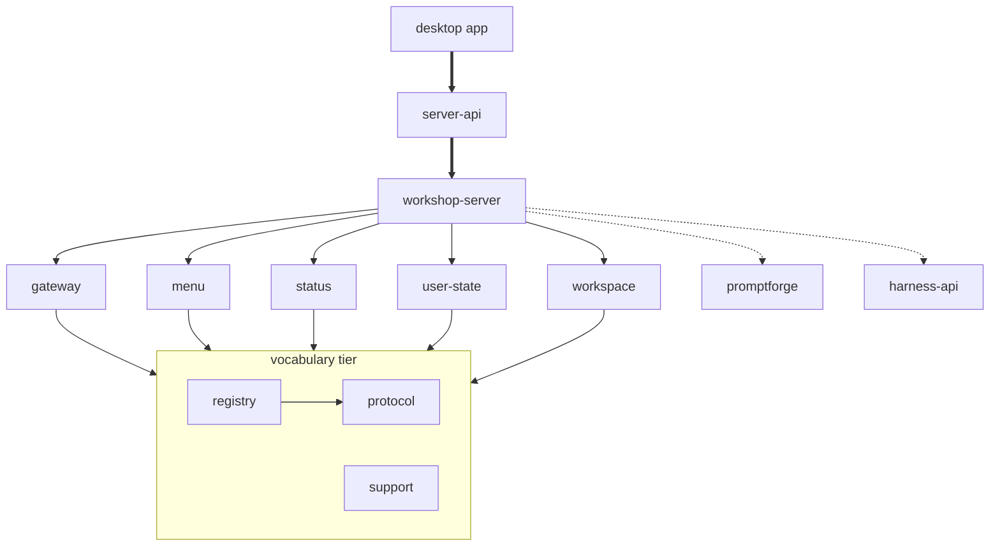

# Workshop structure

<product-contract>

## Product Requirements

The workshop fixes plan landed the bug fixes, test repairs, doc corrections, and crate map, and left every module move, rename, and surface trim for a structure plan. Six Workshop UI comments also still contradict the settled entry-bundle definition or cite plan steps no document names. This plan does both. It rewords the six comments, and it reshapes the workshop crates and UI so module names, file layout, public surfaces, and dependency edges match what the code does. User- and client-visible behavior changes only where Functional Specification says.

- Problem and users:
  - Users are the maintainers and agents working in `crates/workshop/`: the desktop app, the in-process server, the subsystem crates, and the Workshop UI. Agents read a file's header comment and a module's docs before editing, so false text and misleading names mislead the next change.
  - The user's product direction is to finish and polish the Tauri desktop app first and to design remote access afterwards: "it would probably be better to just finish the Tauri desktop application, polish it, and then port the server to work remotely". Polish work will touch the UI's workspace files, so their structure should settle first.
  - **Stale comments.** The settled entry-bundle definition (`AGENTS.md:33`) is "the eagerly loaded composition: `crates/workshop/ui/src/main.ts` and the `*.contribution.ts` modules it imports. Lazy panels never import a module inside it, directly or through another import. Everything else that eager and lazy code both import, such as `services/`, `base/`, and shared parts modules like `parts/layout/zones.ts`, is shared code." At `64b24eca`, on `master` and on the `vibe2` and `vibe3` branches, four headers contradict it and two comments cite unnamed plan steps:
    - `crates/workshop/ui/src/parts/agent/agent.contribution.ts:5-7`: "zones.ts is already in the entry bundle (main.ts boots the dock through it), so the call is direct"
    - `crates/workshop/ui/src/parts/run/run.contribution.ts:5-6`: "zones.ts is already in the entry bundle (main.ts boots the dock through it), so the open call is direct"
    - `crates/workshop/ui/src/parts/layout/layout.contribution.ts:3-4`: "main.ts already pulls zones into the entry bundle - so the run bodies are direct calls"
    - `crates/workshop/ui/src/parts/chrome/chrome.contribution.ts:3-4`: "main.ts already pulls window-chrome and zoom into the entry bundle - so the run bodies are direct calls"
    - `crates/workshop/ui/src/services/action-registry.ts:3`: "the three registries from steps 1-3"
    - `crates/workshop/ui/src/parts/agent/mode-chip.ts:4-5`: "the event is the seam the later wiring step consumes"
  - **The `/ws` socket is half split.**
    - The socket lives in `crates/workshop/server/src/workshop_socket.rs`, but `/ws` is still mounted by `agents/state.rs:136-143`, which imports `workshop_socket::upgrade`.
    - The agent socket imports `send_frame`, `send_error`, and `cross_site_refusal` from `workshop_socket` (`agents/socket.rs:42`, `agents/socket_frames.rs:13`).
    - `workshop_socket.rs:53` imports `SessionsState` from `agents::state`, and `workshop_socket-menu.rs:21-22` imports `SessionsState` and `value_from_bytes` from `agents`.
    - A `/ws` connection is still called a session (`run_session`, `SessionLog`, `NEXT_SESSION` at `workshop_socket.rs:58-108`), and its integration tests live under `crates/workshop/server/tests/it/session*`.
  - **The engine reaches every subsystem through `workshop-protocol`.** `crates/workshop/protocol/Cargo.toml:13` depends on `promptforge` only for the agent frame family in `protocol/src/agent.rs:3-4` (`Event`, `CallMetrics`, `ToolCallEvent`). Every subsystem depends on `workshop-protocol`, so `workshop-status` and `workshop-user-state` compile the engine and its vendored Lua sources.
  - **Dead and over-wide public surface.**
    - The gateway cache API (`cache_ensure`, `CacheResponse`, `CacheEvent`, `SsePayloadStream`, `crates/workshop/gateway/src/lib.rs:34-36`) has no caller in `crates/workshop/server` or `crates/workshop/desktop`.
    - `GatewayUpdater::replace_sidecar` (`crates/workshop/gateway/src/gateway_binding.rs:286`) is called only from tests. The desktop app uses `replace_sidecar_cancellable` (`crates/workshop/desktop/src/gateway/supervisor/mod.rs:124`).
    - Every gateway module is `pub` and also re-exported at the root (`lib.rs:25-43`).
    - The workspace crate exports about ten types and many methods that only it uses.
    - The server ships `#[doc(hidden)] pub mod fixtures` in every build (`crates/workshop/server/src/lib.rs:84-85`).
  - **Layout rule violations.** The repository's layout rule (`AGENTS.md:84`) requires a source subdirectory to hold at least three files, and a hyphenated sibling group of three or more to become a directory. At `64b24eca` it is broken by:
    - `crates/workshop/workspace/src/handlers/file/`, `handlers/file_state/`, and `workspace/backing/`, with one file each
    - `workspace_file/tests/` and `crates/workshop/gateway/src/gateway_progress/tests/`, with two files each
    - the `crates/workshop/menu/src/menu-*` group of three
    - `crates/workshop/workspace/src/workspace-stall.rs`, an `impl Workspace` declared from the crate root (`lib.rs:34-36`)
    - `crates/workshop/desktop/src/gateway/supervisor/mod.rs`, the tree's only `mod.rs`

    The rule does not say whether files in nested subdirectories count.
  - **Duplicated code.**
    - Integration-test setup is copied across four server suites.
    - A receive-or-pend helper over an optional `tokio::sync::broadcast::Receiver` exists as a generic at `crates/workshop/server/src/agents/socket.rs:74-81`, as a copy specialized to `WorkbenchSnapshot` at `agents/bindings.rs:159-166`, and as three inline blocks at `workshop_socket.rs:165-204`.
    - An envelope-to-response fallback appears four times across crates, and the heartbeat's stop and rebind arms three times.
    - The desktop app's launch-and-wait exists twice, the 1 MiB state cap twice, and the UI's reconnect backoff a third time in `crates/workshop/ui/src/services/realtime-transcription.ts`.
  - **UI parts coupling.**
    - The file tree panel lives in `crates/workshop/ui/src/parts/layout/workshop-panel.ts`, and `parts/layout/index.ts` registers its `tree` panel factory. `parts/layout/layout.contribution.ts:22` imports `focusWorkshopTree` and `toggleWorkshopPanel` from it for eager actions.
    - The tree panel's actions live in `parts/workspace/`, so `layout` and `workspace` import each other (`layout/workshop-panel.ts:31-32`, `workspace/file-actions.ts:17`).
    - `.pfwork` switching lives in a third folder, `parts/workspace-files/`.
    - `showPanelDialog` lives in `parts/editor/editor-dialog.ts`, and `WORKSPACE_CHANGED_EVENT` in `parts/workspace/workspace-drops.ts:42`, though other parts import both.
    - `COMMANDS_HISTORY` is the one service token still under `parts/` (`parts/quickinput/commands-history.ts:94`).
  - **Test gaps and a build-check gap.** The test gaps are listed under Testing Plan. The build check only forbids the desktop app from depending on `workshop-server` (`crates/build-xtask/src/product.rs:136-141`), so a desktop dependency on `workshop-gateway` would pass.
- Goals:
  - Every use of "entry bundle" under `crates/workshop/ui/src` agrees with the settled definition, and no comment under `crates/workshop/ui/src` or in `crates/workshop/ui/build.mjs` cites a plan step.
  - `workshop_socket` and `agents` don't import each other, and `/ws` owns its route and state.
  - `workshop-server` is the only workshop crate that depends on `promptforge`.
  - Each public item has exactly one public path and at least one user outside its crate, except test seams behind `test-fixtures`.
  - The layout rule holds everywhere in `crates/workshop/**/src`, under a wording that says how nested files count.
  - Each duplicated helper listed above exists once.
  - No import cycle between UI parts folders, and every service token lives in `services/`.
  - The test gaps listed under Testing Plan are closed.
  - The build check enforces the desktop app's dependency boundary.
- Non-goals:
  - No change to any wire frame's JSON shape. The one route rename is in Functional Specification.
  - No change to persisted formats (`ui-state.json`, `.pfwork`, `workshop.toml`).
  - No remote or browser access to the server.
  - No change to the desktop package name `workshop`.
  - No edits to `crates/promptforge*`, `crates/harness/*`, or `crates/gateway/*`.
  - No edits to `tools/document.md`; the user is handling it elsewhere.
  - No stale-phrase guard in `crates/workshop/ui/test/docs-claims.mjs`.
  - No structural check beyond the approved desktop dependency rule.
- Success criteria:
  - Every work item under Execution Instructions is done.
  - Every exit command is at least as green as its recorded baseline.
  - The retired-string and retired-path checks in the Testing Plan exit criteria pass.
- Constraints:
  - **Repository.**
    - Root `C:\Users\Vinnie\cursor\promptforge`, branch `master`, at or after `64b24eca` ("Close plan: workshop fixes"). All paths are relative to that root. Cited line numbers are at `64b24eca`; locate code by content.
    - Run in that main checkout. The `vibe3` branch in the `C:\Users\Vinnie\cursor\promptforge3` worktree is an ancestor of `master` that lacks `64b24eca`.
  - **Edit scope.** For any edit outside this list, stop and report:
    - `crates/workshop/**`
    - `crates/build-xtask/src/product.rs`, `crates/build-xtask/src/product-tests.rs`, `crates/build-xtask/src/tidy.rs`, and `crates/build-xtask/src/tidy-tests.rs`
    - `Cargo.lock`
    - root `AGENTS.md`
    - `.cursor/rules/workshop-architecture.mdc` and `.cursor/rules/workshop-spa.mdc`
    - `.github/workflows/ci.yml`, only where it names a moved path
    - this plan's repository copy under `vibe/`, and `vibe/ACTIVE`
  - **Structural checks.** A structural check is added only with the user's explicit approval (`AGENTS.md:59-60`). The desktop dependency rule is the one approved check in this plan.
  - **Cargo features** gate a real build constraint, never product shape (`AGENTS.md:62`).
  - **History shape.** Every commit builds and passes its focused tests.
    - A move uses `git mv`. A commit may combine moves with their wiring (`mod` lines, `#[path]` attributes, imports, path strings) and with content edits.
    - Before such a commit, `git diff --cached -M --name-status` must still list every moved file as an `R` entry, under git's default rename detection at 50 percent similarity.
    - When an edit would push a moved file below that, commit the move first and the edit after it.
  - **File-size ceiling.** Files in `workshop-*` crates stay at or under 500 physical lines (`AGENTS.md:83`). The desktop crate (package `workshop`) is exempt. If an edit would pass 500, split the file first along an existing seam. Near the limit at `64b24eca`:
    - `crates/workshop/workspace/src/workspace_file.rs` (490)
    - `crates/workshop/workspace/src/workspace/backing.rs` (478)
    - `crates/workshop/workspace/src/workspace/tests.rs` (472)
    - `crates/workshop/workspace/src/workspace/tests/backing.rs` (463)
    - `crates/workshop/menu/src/menu.rs` (446)
    - `crates/workshop/server/tests/it/heartbeat_loop.rs` (446)
    - `crates/workshop/gateway/src/heartbeat.rs` (433)
  - **Behavior changes ship with tests** in the same change. Preserve existing product and behavior tests through moves.
  - **Comments.** Comment-only edits change only comment lines, and a rewrapped comment stays within the width of the lines around it.
- Open questions: None

## Functional Specification

Nearly everything here is internal. Clients see one route path change and the UI's new refusal of malformed inbound frames. Users see one change: the desktop app's readiness wait now survives a stale discovery file. Every other change is a move, rename, trim, or test.

- Actors and workflows:
  - A maintainer or agent opens a module, reads its header and docs, follows imports, and edits.
  - A desktop user saves a workspace as a new `.pfwork` file, and launches the desktop app while a stale gateway discovery file is on disk.
- Inputs and outputs:
  - **Save Workspace As route.** `POST /workspace/file/save_as` (`crates/workshop/workspace/src/handlers/file.rs:33`) becomes `POST /workspace/file/save-as`, matching every other multi-word route (`/workspace/file/window-state`, `/admin/switch-profile`). The UI caller (`crates/workshop/ui/src/services/workspace-file-client.ts:157-158`) changes in the same commit. No alias is kept.
  - **Inbound agent frames.** `launch`, `attach`, and `cancel` on `/agents/ws` are parsed into a typed enum instead of ad hoc field reads (`crates/workshop/server/src/agents/socket.rs:234-290`). Accepted frames and every refusal frame keep their current JSON, codes, and text.
  - **Inbound frames in the UI.** `crates/workshop/ui/src/services/workshop-socket.ts:194-210` and `agent-socket.ts:234-283` check each inbound frame's required fields before dispatch. A frame that fails its check is dropped with one console warning naming its `type`, instead of reaching a handler through an `as unknown as` cast. The frames checked:
    - `agents`, `agent_session`, `agent_event`, `agent_delta`, `input_required`, `input_cancelled`, and `error` on `/agents/ws`
    - `status`, `models`, and `workbench` on `/ws`
- States and validation:
  - **State buckets are validated once.** The first layer to validate a UI-state value (key allowlist, 1 MiB cap, must parse) produces a validated value that lower layers accept without re-checking. Limits, codes, and messages are unchanged.
- Errors and recovery:
  - **Readiness wait with a stale discovery file.** Today both of the desktop app's wait loops end the wait with an error when a health probe on a discovery file fails (`crates/workshop/desktop/src/gateway/boot.rs:200-201`, `crates/workshop/desktop/src/gateway/supervisor/launch.rs:121-122`). A stale file pointing at a dead port can therefore fail boot or recovery, even after the new gateway has published a fresh file. After: the single merged wait keeps polling until its budget runs out, and it reports the last probe error if the budget expires.
- Security and privacy behavior:
  - Confinement, the lexical `..` rejection, the grant model, loopback-only binding, CSP, the cross-site guard, and the WebSocket origin checks are unchanged in strength.
  - The build check refuses a desktop dependency on any workshop crate except `workshop-server-api`, and a `workshop-server-api` dependency on any workshop crate except `workshop-server`.
- Acceptance criteria:
  - **Comments.**
    - `agent.contribution.ts` and `run.contribution.ts` say that `main.ts` imports `zones.ts` eagerly (it boots the dock through it), so the module is already loaded and the open call is direct. The rest of each sentence, about the lazy agent and run chunks, stays.
    - `layout.contribution.ts` says `main.ts` already loads zones eagerly, so the run bodies are direct calls. If the tree panel's actions have left this file, reword whatever header remains to match the file's contents.
    - `chrome.contribution.ts` says `main.ts` already loads window-chrome and zoom eagerly, so the run bodies are direct calls.
    - `action-registry.ts` names the three registries directly: the command registry, the menu registry, and the keybinding registry, with no reference to steps.
    - `mode-chip.ts` says the `agent-mode-changed` event is the seam for wiring the mode to the backend, and that nothing in the app listens to it yet. At `64b24eca` only the tests `crates/workshop/ui/test/mode-chip.mjs` and `crates/workshop/ui/test/agent-session-view.mjs` listen for it.
    - `crates/workshop/ui/src/parts/workbench.contributions.ts:7` ("entry bundle without dragging the feature chunks with it") already agrees with the definition and stays unchanged.
  - **Save Workspace As** works end to end through `/workspace/file/save-as`, and `/workspace/file/save_as` answers 404.
  - **Readiness wait.** A desktop boot whose discovery file first points at a dead port, then at the live gateway, completes. A boot whose file never points at a live gateway fails at the budget with the last probe error.
  - **UI frame guards.** Every frame in `crates/workshop/protocol/tests/fixtures/workshop-frames.json` and in the agent-frames fixture passes its guard. A copy of a fixture frame with a required field removed fails its guard, and the socket drops it without calling a handler.
  - Every other work item is a move, rename, trim, or test, and passes the existing suites unchanged.

</product-contract>
<implementation-contract>

## Technical Design

The crate graph loses one edge: `workshop-protocol` stops depending on `promptforge`, because the agent frame family moves into the server, its only producer. The build check gains the desktop boundary rule. Inside the server, a websocket helper module and a shared receive helper in `workshop-support` end the import cycle between the two sockets. The UI moves the tree panel and two shared helpers so its parts folders import one way, and it adds a runtime guard layer at its two socket boundaries.

- Architecture:
  - The target Cargo graph. Dotted edges are dependencies outside `crates/workshop`, and bold edges are enforced by the new build-check rule.

  - The runtime links through the registry (the gateway drives the menu, a catalog publish reconciles the menu, sessions read workspace roots) are unchanged.
- Modules and interfaces:
  - **Server websocket helpers.** A new `crates/workshop/server/src/websocket.rs` holds `send_frame`, `send_error`, and `cross_site_refusal`, moved from `workshop_socket.rs`. Both sockets import them from there.
  - **Shared receive helper.** The generic `recv_or_pending<T: Clone>(&mut Option<broadcast::Receiver<T>>)` (`crates/workshop/server/src/agents/socket.rs:74-81`) moves to `crates/workshop/support/src/bus.rs`, the crate's broadcast module. It replaces the specialized copy at `agents/bindings.rs:159-166` and the three inline blocks at `workshop_socket.rs:165-204`, which wait on `StatusBarUpdate`, `CatalogPush`, and `WorkbenchSnapshot` receivers.
  - **`/ws` owns its route and state.**
    - `workshop_socket` exposes its own router over its own state, holding `registry`, `origin_allowed`, and `restart_bound`. `/ws` reads all three, and today it is the only reader of `restart_bound`.
    - The registry accessors that more than one route uses (`registry`, `push`, `health`, `gateway_snapshot`, `origin_allowed`, today methods on `SessionsState` at `agents/state.rs:49-133`) move onto one shared `SocketState` in `websocket.rs`. Both states wrap it, so no accessor is written twice.
    - The state is registered through its own helper in `crates/workshop/server/src/app/compose.rs`.
    - `SessionsState` (`agents/state.rs:36-40`) keeps `registry` and `origin_allowed` for `/agents/ws` and `/v1/models`.
    - `agents/state.rs` stops mounting `/ws` and stops importing `workshop_socket::upgrade`.
    - `value_from_bytes` moves from `agents/relay.rs:58` to `workshop_socket-menu.rs`, its only caller.
    - Afterwards neither module imports the other.
  - **Agent wire types.** `crates/workshop/protocol/src/agent.rs` moves to `crates/workshop/server/src/agents/wire.rs`, with `AgentsFrame`, `AgentSessionFrame`, `AgentEventKind`, `AgentEvent`, `AgentEventFrame`, `render_tool_calls`, and `AgentEvent::from_event`. The name `wire` avoids confusion with the framing helpers in `agents/socket_frames.rs`. The same module gains a `Deserialize` enum for the inbound `launch`, `attach`, and `cancel` frames.
  - **`workshop-support` public additions.**
    - `recv_or_pending` in `bus.rs`.
    - A helper that turns a serializable error envelope and a status code into an axum response, with the status line's text as the fallback body. The support crate cannot name the protocol crate's envelope type, so the helper is generic over `Serialize`.
    - A public 1 MiB cap constant in `support::state_bucket`.
    - A validated state-bucket value type that `state_bucket` returns and lower layers accept.
  - **Gateway modules.**
    - The HTTP client module `gateway` becomes `client`, `gateway_binding` becomes `binding`, and `gateway_progress` becomes `progress`.
    - The client's progress SSE decoder `gateway/src/gateway/progress.rs` becomes `client/progress_stream.rs`, so it doesn't collide with the `progress` task module.
    - `refresh_catalog` and `refresh_profiles` move from `heartbeat-refresh.rs` (`:13`, `:63`) to a top-level `refresh.rs`, because the server's switch path calls them (`crates/workshop/server/src/workshop_socket-menu.rs:13`).
    - Every module is private, and the crate root's re-exports are the one public path.
  - **Desktop launch-and-wait.** Boot calls the cancellable wait in `crates/workshop/desktop/src/gateway/supervisor/launch.rs` with a token that is never cancelled. The blocking copy (`gateway/boot.rs:185-212`) and its duplicate constants go: `LAUNCH_TIMEOUT` and `POLL_INTERVAL` duplicate `RECOVERY_TIMEOUT` and `RECOVERY_POLL_INTERVAL` (30 s and 25 ms).
  - **UI.**
    - `COMMANDS_HISTORY` and a `CommandsHistory` interface move to `crates/workshop/ui/src/services/commands-history.ts`.
    - `WORKSPACE_CHANGED_EVENT` moves to `services/workspace-events.ts`.
    - `parts/editor/editor-dialog.ts` moves to `parts/shared/panel-dialog.ts`. It exports `PanelDialogButton`, `PanelDialogField`, `PanelDialogOptions`, and `showPanelDialog`, has no CSS, and depends only on `shared-ui/modal` and `base/lifecycle`. Its importers are `parts/workspace/add-folder.ts`, `parts/editor/editor-panel.ts`, and `parts/run/run-panel.ts`.
    - **The tree panel moves into `parts/workspace/`.**
      - `workshop-panel.ts` moves with its `.ws-workshop-tree` rules, extracted from `parts/layout/zones.css` into `parts/workspace/workshop-panel.css`.
      - A new `parts/workspace/index.ts` takes over what `parts/layout/index.ts` does today: the `tree` panel factory and the `sideBarVisible` and `auxiliaryBarVisible` context keys. `services/panel-registry.ts:187-195` maps `tree` to `../parts/workspace/index`.
      - At `64b24eca`, `parts/layout/index.ts` holds only the `tree` factory and those two context keys. Once they move it is empty, so it goes, and `tree` is the only panel-registry entry that pointed at it.
      - The Explorer and Primary Side Bar actions that call `focusWorkshopTree` and `toggleWorkshopPanel` (`parts/layout/layout.contribution.ts:22,41-59`) move into `parts/workspace/workspace.contribution.ts`, so no `parts/layout` module imports `parts/workspace`.
    - **Inbound frame guards** (type predicates) live beside the frame types in `services/protocol.ts`, or in a sibling module when that file would pass 500 lines.
- File and public API changes:
  - **Deleted:**
    - the gateway cache API and the SSE decoding that only it uses: `cache_ensure`, `CacheResponse`, `CacheEvent`, `SsePayloadStream`, `is_event_stream`, `payload_stream`, `SseDecoder`, and their tests. `sse.rs`'s `read` stays, because the list, switch, and profile calls use it.
    - `MenuBus::reconcile_catalog_for_test` (no callers)
    - `crates/workshop/ui/src/parts/take/index.ts`, `parts/stt/index.ts`, and `parts/shared/index.ts`, which are unused `export *` barrels
    - the redundant `workshop-workspace` dev-dependency at `crates/workshop/server/Cargo.toml:68-69`. The self dev-dependency at `:60` already turns on `workshop-workspace/test-fixtures` through `:56`.
  - **Gated behind `cfg(any(test, feature = "test-fixtures"))`:**
    - `pub mod fixtures` in `crates/workshop/server/src/lib.rs:84-85`, with its comment at `:76-83` corrected
    - `GatewayBinding::from_client` (`crates/workshop/gateway/src/gateway_binding.rs:146`)
    - `GatewayUpdater::replace_sidecar` (`:286`). Its only callers are tests in the gateway and desktop crates (for example `crates/workshop/desktop/src/gateway/tests/shutdown.rs:211`, `crates/workshop/desktop/src/quit-tests.rs:79`), and the desktop crate enables `test-fixtures` for its tests. The doc example at `:261` names the gated method as a test seam.
  - **Demoted to `pub(crate)`,** where nothing outside the crate uses them:
    - the gateway's labels and `HEARTBEAT_INTERVAL` (`heartbeat.rs:46-50,90`), `ResolvedGateway::{source, stale}`, `ProgressStream`, and `gateway_progress::Subscriber`
    - the workspace's `EntryKind`, `FileContents`, `GrantEntry`, `TreeEntry`, `TreeListing`, `WorkspaceSummary`, `WindowState`, `WorkspaceFileError`, and `routes`, plus the `Workspace` methods only the crate calls. Let the compiler's private-in-public errors settle the exact set.
    - `workshop_support::xorshift` (`crates/workshop/support/src/lib.rs:28`). Its production user is `support/src/backoff.rs:115`, and its only outside user is the gateway decoder test (`crates/workshop/gateway/src/gateway/tests/decoder.rs:5,131`), which is deleted with the cache API.
  - **Trimmed server re-exports.** `crates/workshop/server/src/lib.rs:69-104` keeps only what some file in `crates/workshop/server-api`, `crates/workshop/desktop`, or `crates/workshop/server/tests` names. `router` and `AppState` stay, because the server integration tests use them. `cross_site_guard`, `origin_allowed`, `SwitchProfileBody`, `GatewaySource`, and the duplicate `Push` paths go.
  - **One path for `handles`.** `workshop-status`, `workshop-menu`, `workshop-gateway`, and `workshop-workspace` change `pub mod handles` plus root re-exports to a private `mod handles` plus root re-exports, as `workshop-user-state` already does.
  - **Renamed:**
    - `/workspace/file/save_as` becomes `/workspace/file/save-as`
    - `Omit::Sessions` becomes `Omit::AgentSessions`, and `Omit` gains `UserState` (`crates/workshop/server/src/app.rs:244-256`)
    - `RecoveryCandidate::published` becomes `mark_published` (`crates/workshop/desktop/src/gateway/supervisor/recovery.rs:46`)
    - the support test `a_prompt_route_passes_through_its_deadline_untouched` becomes `a_quick_route_passes_through_its_deadline_untouched` (`crates/workshop/support/src/deadline.rs:134`)
- Data, persistence, failure, security, and privacy constraints:
  - No persisted format changes, and no wire JSON changes except the route path.
  - The shared fixtures keep their contents byte for byte. `crates/workshop/protocol/tests/fixtures/workshop-frames.json` stays where it is. The agent-frames fixture moves to `crates/workshop/server/tests/fixtures/agent-frames.json`.
  - `WorkspaceFileResponse` (`crates/workshop/workspace/src/handlers/file.rs:40-60`) is replaced by serializing `WorkspaceSummary` (`workspace.rs:111-121`) directly. Both already serialize the same field names (`path`, `name`, `grants`, `window_state`). But the DTO converts `path` with `to_string_lossy`, so `WorkspaceSummary`'s `path` field gets a serializer that makes the same lossy conversion. A non-UTF-8 path must still serialize, not fail.

</implementation-contract>
<verification-contract>

## Testing Plan

Record a baseline of every exit command before any change, and run the same commands at the end. Moves and renames need no new tests; their check is that the touched packages compile and their focused tests pass. The behavior changes, the UI frame guards, and the listed gaps each get tests. Building the `workshop` package needs the gateway sidecar staged. Run `cargo workshop` first, since it stages and then removes its own copy. Then run `cargo build --locked -p gateway --no-default-features`, then `node tools/stage-gateway-sidecar.mjs stage --target x86_64-pc-windows-msvc --source target/debug/promptforge-gateway.exe`.

- Unit:
  - **Server.**
    - `frame_entry`'s cursor and wire-index logic (`crates/workshop/server/src/agents/socket_frames.rs`), replacing the deferral note at `socket_frames-tests.rs:3-5`.
    - The `SwitchFailure::Transport`, `Shutdown`, and unrecognized-answer branches in `workshop_socket-menu.rs`. Integration tests cover `Refused` and `RestartTimeout` today.
    - `on_delta` in `agents/status.rs`.
    - Boot with `Omit::UserState` fails at the `UserStateStore` require check (`app/compose.rs:75`).
  - **Inbound agent frames.** Each of `launch`, `attach`, and `cancel` parses into its variant. Malformed frames produce the same refusal frames that `crates/workshop/server/tests/it/agents/refusals.rs` pins today.
  - **Subsystem registration.** `workshop-status`, `workshop-menu`, and `workshop-user-state` each test their own `register` in-crate, modeled on `crates/workshop/workspace/tests/it/main.rs:17,64`. `emitting_with_no_subscribers_is_a_no_op` (`crates/workshop/status/src/status.rs:91-94`) gets an assertion.
  - **Gateway.**
    - The socket scheme conversion (`gateway/src/gateway/socket.rs:29-44`): http to ws, https to wss, and a refused scheme.
    - The progress decoder handles CRLF, LF, CR, and mixed line terminators. Today `block_end` (`gateway/src/gateway/progress.rs:155-164`) recognizes only `\n\n` and `\r\n\r\n`.
  - **Workspace.**
    - `NotAFile` is returned through both `read_file` and `write_file` on a directory. Today only the status mapping covers it (`crates/workshop/workspace/src/error-tests.rs:86`).
    - The write-stall seam is exercised in-crate. Today only `crates/workshop/server/tests/it/save_timeout.rs:28` uses it.
    - A test pins the `/workspace/file/current` response JSON before `WorkspaceFileResponse` goes. On Unix, a workspace whose path is not valid UTF-8 still serializes, with the lossy conversion.
  - **Desktop.** `window_state::usable` (`crates/workshop/desktop/src/window_state.rs:398`).
  - **Support.** The envelope response helper's fallback path, the validated bucket type's constructor, and `recv_or_pending` for both `Some` and `None`.
- Integration and end-to-end:
  - **Save timeout.** The workspace-router test in `crates/workshop/server/tests/it/save_timeout.rs` drives only `workshop_workspace::routes_with_deadline` (`:30`). It moves into `crates/workshop/workspace/tests/it/`. The server keeps a test that drives the full `router` with the workspace write stall and asserts the JSON 408 on `PUT /workspace/file`.
  - **Realtime relay.** A test that a failed gateway connect answers 502, unless one under `crates/workshop/server/tests/it/realtime_relay/` already does.
  - **Readiness wait.** A discovery file that first points at a dead port and then at a live fixture gateway completes the wait. One that never points at a live gateway fails at the budget with the last probe error. Use the desktop app's injected clock (`crates/workshop/desktop/src/gateway/tests/`).
  - **Save Workspace As** through `/workspace/file/save-as`, and 404 on the old path.
  - **UI.** `crates/workshop/ui/test/workshop-wire-fixtures.mjs` and `crates/workshop/ui/test/agent-wire-fixtures.mjs` run every fixture frame through its guard. They also check that a frame with a required field removed is dropped without a handler call. Every inbound type the UI handles appears in one of the two fixtures; `error` appears in `workshop-frames.json`.
- Regression, security, and performance:
  - All existing traversal, confinement, CSP, cross-site, origin, and bind-refusal tests pass unchanged.
  - The shared frame fixtures are unchanged byte for byte. `git diff -M` on both JSON files shows only the agent fixture's rename.
  - The UI bundle guards (`crates/workshop/ui/test/lazy-css-entry-bundle.mjs` and the other bundle tests) pass. The tree panel's CSS moves to a different chunk, so update the guard's expected markers only to match the new lazy chunk, never to admit a lazy panel importing a contribution module.
- Exit criteria:
  - **Commands.** Each of these is at least as green as its baseline:
    - `cargo nextest run --locked --workspace --exclude workshop --exclude workshop-server --exclude workshop-server-api --all-features`
    - `cargo test --workspace --exclude workshop --exclude workshop-server --exclude workshop-server-api --all-features --doc`
    - `cargo nextest run --locked -p workshop -p workshop-server -p workshop-server-api`
    - `cargo nextest run --locked -p workshop-server --features headless`
    - `cargo nextest run --locked -p workshop-workspace --all-features` (on Windows)
    - `cargo test --doc -p workshop -p workshop-server -p workshop-server-api`
    - `cargo doc --locked --no-deps -p workshop-server --document-private-items` with `RUSTDOCFLAGS=-D warnings`
    - `cargo test -p build-xtask`
    - both clippy partitions with `-D warnings`
    - `cargo check -p gateway --no-default-features`
    - `cargo fmt --all --check`
    - the docs gate with `RUSTDOCFLAGS=-D warnings`, and the facade docs gate
    - `cargo +nightly-2026-09-05 xtask api --check`
    - `mdbook build guide`
    - `npm run build`, `npm test`, and `npm run typecheck` in `crates/workshop/ui`
    - `cargo workshop`
  - **Retired strings.** Each of these finds nothing:
    - `rg -n "in the entry bundle|into the entry bundle" crates/workshop/ui/src`
    - `rg -n -i "steps 1-3|wiring step|plan step" crates/workshop/ui/src crates/workshop/ui/build.mjs`
    - `rg -n "^promptforge|promptforge::" crates/workshop/protocol` (a dependency line or a `promptforge::` path)
    - `rg -n "cache_ensure|SseDecoder|CacheEvent|CacheResponse|SsePayloadStream|reconcile_catalog_for_test" crates/workshop`
    - `rg -n "run_session|SessionLog|NEXT_SESSION|Omit::Sessions" crates/workshop`
    - `rg -n "file/save_as" crates/workshop --glob "!**/node_modules/**" --glob "!**/dist/**"` finds only the test in `crates/workshop/workspace/tests/it/` that asserts the old route answers 404. The route is matched by its path, because `Workspace::save_as` is a real method name that stays.
    - `rg -n "gateway_binding::|gateway_progress::|heartbeat-refresh|parts/workspace-files|editor/editor-dialog|editor-dialog\.ts|files\.contribution|supervisor/mod\.rs|protocol/src/agent|tests/it/session" crates/workshop .cursor/rules AGENTS.md --glob "!**/node_modules/**" --glob "!**/dist/**"` (no doc, comment, or path still names a moved module)
    - `rg -n "include!\(" crates/workshop/server/tests`
    - `rg -n "export \*" crates/workshop/ui/src`
    - `rg -n "as unknown as" crates/workshop/ui/src/services/workshop-socket.ts crates/workshop/ui/src/services/agent-socket.ts`
    - `rg -n "createServiceToken" crates/workshop/ui/src/parts`
    - `rg -n "\.\./workspace/" crates/workshop/ui/src/parts/layout` (no `parts/layout` module imports `parts/workspace`)
  - **Retired paths.** None of these exists:
    - `crates/workshop/workspace/src/workspace-stall.rs`
    - `crates/workshop/workspace/src/handlers/file/`, `handlers/file_state/`, `workspace/backing/`, and `workspace_file/tests/`
    - `crates/workshop/gateway/src/gateway_progress/tests/`, or its renamed `progress/tests/`
    - `crates/workshop/menu/src/menu-memory.rs`
    - `crates/workshop/desktop/src/gateway/supervisor/mod.rs`
    - `crates/workshop/protocol/src/agent.rs`
    - `crates/workshop/server/tests/it/session.rs`
    - `crates/workshop/ui/src/parts/workspace-files/`
    - `crates/workshop/ui/src/parts/layout/workshop-panel.ts` and `crates/workshop/ui/src/parts/layout/index.ts`
    - `crates/workshop/ui/src/parts/editor/editor-dialog.ts`

</verification-contract>
<decision-record>

## Decision Record

- Decisions:
  - **One merged plan.** The structure work joins the pending comment rewording in this plan. The user said: "add the second plan, to this existing plan. The first plan is completed and has landed fully and been merged". The first plan is the workshop fixes plan, closed by `64b24eca`. Its record shows the user chose "Two plans: fixes first (bugs, CI gap, weakened tests, doc sweep, crate map), then a structure plan" (`vibe/2026-09-25-2-workshop-fixes.md:212`). This is that structure plan.
  - **Scope.** The fixes plan set aside "module moves, file-layout rule application, public-surface trimming, the `/ws` module split, the gateway cache API deletion, moving the agent frames out of `workshop-protocol`, the UI parts restructure, the desktop dependency build check, and the remaining test-coverage gaps" (`vibe/2026-09-25-2-workshop-fixes.md:238`). This plan takes all of them. The user also selected four sign-off items:
    - "Add one short crate map"
    - "New structural checks, which repo policy says need your approval: desktop may depend only on server-api, and server-api's re-export list is pinned exactly"
    - "Remove workshop-protocol's dependency on the promptforge engine, so status and user-state stop compiling Lua"
    - "Restructure UI parts: move the file tree panel out of layout, rename workspace and workspace-files, break the layout/workspace import cycle"

    The crate map already landed in `d3024c18`, so it adds no work here.
  - **The desktop dependency rule is approved.** The user selected it, which is the explicit approval the repository requires for a structural check (`AGENTS.md:59-60`). It guards a stable product boundary with no ordinary equivalent, because Cargo cannot say "only through the facade". It is small, and it closes a real gap: today a desktop dependency on `workshop-gateway` passes (`crates/build-xtask/src/product.rs:136-141`).
  - **Pinning `workshop-server-api`'s exact re-export list stays deferred.** It was the other half of the same selection. After the cost was laid out (see Deferred and Out of Scope), the user said: "workshop-server-api stays deferred".
  - **Move the agent frames into the server instead of mirroring engine types in `workshop-protocol`.** This is the most valuable structural item. `workshop-status` and `workshop-user-state` compile the engine and Lua only because protocol holds these frames. The server is their only producer and already depends on `promptforge`. A mirror of `CallMetrics` inside protocol would duplicate a rich engine type that must stay in sync by hand. The shared agent-frames fixture already pins the wire shape (Rust: `crates/workshop/protocol/tests/it/fixture.rs:12`; UI: `crates/workshop/ui/test/agent-wire-fixtures.mjs`), so drift stays caught after the move.
  - **The layout rule counts nested files.** A directory's count includes the files in its nested subdirectories, and the conversion applies at each level. Counting only direct files is unstable. `crates/workshop/gateway/src/gateway_progress/` holds `presenter.rs` and `tests.rs` plus a `tests/` directory with `presenter.rs` and `recovery.rs`. Flattening it on a direct count yields four `gateway_progress-*` siblings, which the same rule then turns back into a directory. Record the wording at `AGENTS.md:84` before any layout move.
  - **Delete the gateway cache API rather than gate it.** Cargo features gate real build constraints, never product shape (`AGENTS.md:62`), so a feature gate is not available for a product API. Nothing in the server or desktop app calls it. Deleting it also removes `SseDecoder::feed`, which grows its buffer without a limit (`crates/workshop/gateway/src/gateway/sse.rs:80-86`).
  - **Gate `replace_sidecar` and `from_client` as test seams instead of deleting them.** Both are called only from tests, and the `test-fixtures` feature already gates the crate's other test seams. Moving about fourteen test call sites to `replace_sidecar_cancellable` would add churn without changing what production runs.
  - **Put the shared receive helper in `workshop-support`'s `bus.rs`.** It waits on a `tokio::sync::broadcast::Receiver`, which is what `bus.rs` already wraps. One of its callers, `agents/bindings.rs`, is not a socket, so the new websocket module would be the wrong home.
  - **Gateway module names drop the crate name.** `client`, `binding`, and `progress` replace `gateway`, `gateway_binding`, and `gateway_progress`. The client's progress decoder becomes `progress_stream`, so it doesn't collide with the `progress` task module.
  - **Keep the `handles.rs` name in every crate,** and make each module doc's first line say it holds the subsystem's registration and any handle types. Renaming the files in two crates would make one word consistent at the cost of churn in five crates.
  - **Add `implements` clauses instead of renaming the parts classes** that share a name with their service interface. The clause gives the compiler the class-to-interface check. The one wrong import it enabled (`crates/workshop/ui/src/parts/workspace/workspace-drops.ts:28`) is fixed directly.
  - **Runtime guards instead of a compile-time `satisfies` over the fixture JSON.** With `resolveJsonModule`, TypeScript widens string values in imported JSON to `string`, so a frame union keyed on a literal `type` can't be checked against fixture JSON. See [microsoft/TypeScript#32063](https://github.com/microsoft/TypeScript/issues/32063) (open) and the [resolveJsonModule reference](https://www.typescriptlang.org/tsconfig/#resolveJsonModule). The guards also protect the live sockets, where a fixture test only protects the build.
  - **Rename `parts/workspace-files/` to `parts/workspace-document/`, and keep `parts/workspace/`.** Once the tree panel moves in, `workspace` holds exactly the workspace's roots, drops, tree, and File actions. The repository already calls a `.pfwork` file "the `.pfwork` document" (`AGENTS.md:90`). `parts/workspace/files.contribution.ts` becomes `workspace.contribution.ts`, the `<feature>.contribution.ts` name that `crates/workshop/ui/AGENTS.md:17` requires.
  - **Move the tree panel's eager actions with the panel.** `parts/layout/layout.contribution.ts:22` statically imports `focusWorkshopTree` and `toggleWorkshopPanel`. If those actions stayed in `layout`, moving the panel would turn the `layout`-to-`workspace` import around rather than remove it.
  - **Restructure the UI parts before desktop polish.** The user plans to finish and polish the desktop app next. That work will touch `workshop-panel.ts`, `file-actions.ts`, and `workspace-drops.ts`, so settling their locations first means polish lands on final paths. The cost is about seventeen UI test files with hard-coded paths (listed under Assumptions).
  - **Make `stt` and `take` import one way by moving one interface.** `take` imports only the type `SttInsertionContext` from `stt` (`crates/workshop/ui/src/parts/take/take-registry-types.ts:7`, `take-registry.ts:10`; defined at `parts/stt/stt.ts:9`). `stt` imports values from `take` (`parts/stt/realtime-stt.ts:17-22`). Moving the interface into `take/take-registry-types.ts` leaves only the `stt`-to-`take` edge.
  - **Serialize `WorkspaceSummary`'s path lossily.** The DTO it replaces converts with `to_string_lossy` (`crates/workshop/workspace/src/handlers/file.rs:40-60`), so the replacement must too, or a non-UTF-8 path would turn into a serialization failure.
  - **Rename the Save Workspace As route with no alias.** The Workshop UI is its only client (`crates/workshop/ui/src/services/workspace-file-client.ts:157-158`). The server serves that UI (`crates/workshop/server/src/routes/assets.rs:34-42`), and both ship together in the desktop app.
  - **The agent-frame tests become unit tests of the moved module** (`crates/workshop/server/src/agents/wire-tests.rs`), not a server integration test. An integration test would need a public re-export from `workshop-server`'s crate root that no other consumer uses, which the one-public-path goal forbids.
  - **About twenty commits, one per coherent change.** A first decomposition produced 51 steps, most of them move-only commits and small edits sharing one test run. The user rejected that: "51 commits what in the fuck are you shitting me?". They chose "About 20 steps: one per coherent change, and a move may include its wiring and small edits in the same commit as long as git still records it as a rename". The History shape constraint encodes the rename condition.
  - **The first step records only the baseline.** Its changes fold into the plan seed commit, so code edits there would hide inside a commit about the plan. The comment rewording joins the layout-rule wording in the second step instead.
  - **One launch-and-wait in the desktop app,** keeping the cancellable version. With a never-cancelled token it behaves like the blocking copy, and the merged loop is the one place the stale-file fix lands.
  - **Reword the comment headers instead of deleting the clause.** The point each header makes is still true: the call is direct because the target module is already loaded. Only the claim about which bundle holds it is wrong. When scoping the comment work, the user said: "create a new plan to fix the two leftovers. the tools/document.md I am handling elsewhere".
  - **Say "loaded eagerly", not any bundle term.** Under the settled definition, `zones.ts`, window-chrome, and zoom are shared code, not entry-bundle members. What the headers rely on is that `main.ts` already imports them eagerly, so that is what they should say.
  - **State the current fact in `mode-chip.ts`.** No production code listens for `agent-mode-changed`; only two tests do. The comment says so instead of pointing at a future plan step.
- Rejected alternatives:
  - **A stale-phrase guard in `crates/workshop/ui/test/docs-claims.mjs`.** It would be a structural check the user has not approved. Revisit if the user approves such guards.
  - **A `CallMetrics` mirror in `workshop-protocol`.** It duplicates an engine type by hand. Revisit if a second crate needs the agent frames without the engine.
  - **Deleting `replace_sidecar` and moving its test callers to `replace_sidecar_cancellable`.** It adds churn in two crates for no production change. Revisit if the gated seam drifts from the cancellable path's behavior.
  - **Putting the receive helper in the new server websocket module.** One caller is not a socket. Revisit if `bus.rs` stops being the broadcast home.
  - **Renaming `handles.rs` to `registration.rs`, or `handlers.rs` to `routes.rs`.** The churn outweighs the gain. Revisit if a crate gains a third file with a confusable name.
  - **Renaming the parts classes that share names with service interfaces.** Revisit if auto-import picks the wrong one again after the `implements` clauses land.
  - **Splitting UI files over 500 lines:**
    - `crates/workshop/ui/src/parts/chatbox/chat-box.ts` (596)
    - `parts/menu/menu.ts` (531)
    - `parts/editor/editor-panel.ts` (527)
    - `parts/editor/editor-surface.ts` (508)

    No rule sets a TypeScript ceiling. Revisit if one is adopted.
- Assumptions, risks, and notes:
  - `main.ts` imports `zones.ts`, window-chrome, and zoom statically at `64b24eca`; `main.ts:45` imports `parts/layout/zones.ts`. Confirm each import before rewording. If one is not a static `main.ts` import, describe how it actually loads instead.
  - Moving the tree panel into `parts/workspace/` gives it a new lazy chunk entry. If any lazy panel would then import a contribution module, stop and report instead of changing the entry-bundle definition.
  - The `launch` / `attach` / `cancel` enum must not change refusal text. Where serde's own error text would leak into a refusal, map it to the existing message.
  - UI tests hard-code paths that move. Their path strings change in the move commits. All are under `crates/workshop/ui/test/`:
    - `workshop-panel`: `workspace-switch.mjs:60`, `workshop-zones.mjs:2`, `workshop-panel-menu.mjs:2,42`, `workshop-panel-restore.mjs:2,46`, `helpers/tauri-dialog-stub.mjs:2`, `run-panel.mjs:3`
    - `parts/workspace`: `files-actions.mjs:2,36`, `open-recent.mjs:2,23`, `workspace-drops.mjs:1`, `menu-spec.mjs:35`, `menus.mjs:27`, `error-catalog.mjs:3,21`, `command-center.mjs:44`, `workshop-panel-restore.mjs:49`, `run-panel.mjs:32`
    - `parts/workspace-files`: `workspace-switch.mjs:2,49-50`, `workspace-files.mjs:2,46,52`, `menu-spec.mjs:36`
  - `crates/workshop/server/tests/it/session/menu/restart.rs:135-137` hard-codes the child-process test path `"session::menu::restart::validated_gateway_fixture_process"`. Derive it (for example from `module_path!()`) before or in the directory move, or the move compiles and then fails at runtime.
  - `crates/workshop/desktop/src/gateway.rs:10-16` already documents the `boot`/`supervisor` and `identity`/`recovery` import cycles as deliberate. The launch merge may remove one; update that doc to match whatever remains.
  - The `vibe2` branch (worktree `C:\Users\Vinnie\cursor\promptforge2`) holds `7f5e4cc8`, "Document every public item of the promptforge facade". It touches only `crates/promptforge/src/*.md`, which is outside this plan's scope, so it can't conflict. But merging it into `master` mid-run would shift the facade docs gate and the `xtask api --check` baseline. The user chose to finish this plan first: "I was thinking to make this plan run to finish before merging vibe2". So `vibe2` stays off `master` until this plan's exit gates pass and its close commit lands. Heavy builds or test runs in the `promptforge2` worktree during this run compete for CPU with this run's timing-sensitive tests. If a test fails only while that worktree is busy, treat it as intermittent and rerun it once before calling it a regression.
  - `64b24eca` is on the fork's `master` (`vinniefalco/promptforge`), where CI, Nightly, and STT Miri passed. `cppalliance/promptforge` `master` is at `890ae2f6`. If this work goes upstream by pull request, land the workshop fixes first, so the structure changes review on their own.
  - These review findings were already fixed at `64b24eca` and are not in scope:
    - the registry trait docs point at the implementing `handles.rs` (`crates/workshop/registry/src/traits.rs`)
    - the registry invariant names `Push::menu` as the one per-subsystem accessor (`crates/workshop/registry/src/lib.rs:28`)
    - the status bus is no longer called "observer" (`crates/workshop/status/src/status.rs:1`, `crates/workshop/server/src/workshop_socket.rs:3`)
    - every `crates/workshop/ui/src/parts/take/` file has a header comment
    - invalid JSON on `/ws` is tested (`crates/workshop/server/tests/it/session/status.rs:66-73`)
    - the Windows CI job runs the workspace tests (`.github/workflows/ci.yml:196`)
  - `crates/workshop/ui/src/services/text-control-service.ts:106-107` adds document focus listeners inside a service. That is not a violation: `crates/workshop/ui/AGENTS.md:5` says services own no views, and a focus listener is not a view.

### Deferred and Out of Scope

- Deferred: pinning `workshop-server-api`'s exact re-export list. `cargo xtask api` is hard-wired to the `promptforge` facade (`crates/build-xtask/src/api/load.rs:20`, `crates/build-xtask/src/api/listing.rs:28-32`). Pointing it at the server facade needs a second facade constant, a rustdoc load set, a committed listing, and the pinned nightly. All that would guard a ten-item facade whose names `crates/workshop/server-api/src/lib-tests.rs:18-35` already lock. Revisit when `cargo xtask api` supports more than one facade, or when the server facade gains a second consumer besides the desktop app.
- Deferred: tests for the desktop app's `menu.rs`, `linux_media.rs`, and `window_state::apply`, which need a Tauri runtime. Revisit when the desktop crate gets a runtime test harness.
- Deferred: the check-then-use window between confinement and file access, acknowledged in the `tree` handler's doc in `crates/workshop/workspace/src/handlers.rs`. Revisit when remote access is designed.
- Out of scope: remote or browser access to the server.
- Out of scope: renaming the desktop package `workshop`.
- Out of scope: `tools/document.md`, which the user is handling elsewhere.
- Out of scope: "plan" and "step" wording in Workshop UI test files.

</decision-record>
<project-survey>

## Project Survey

- Status: complete
- Build command: `cargo build --locked -p <package>` (plain `cargo build` builds only the default member `crates/gateway/app`; the desktop app is `cargo build --locked -p workshop`). Workshop UI bundle: `npm run build` in `crates/workshop/ui` (needs `npm ci` first; the cargo build scripts also drive it).
- Focused test command pattern: `cargo nextest run --locked -p <package> <test-name-filter>` (the workshop trio `workshop`, `workshop-server`, and `workshop-server-api` takes no `--all-features`; every other package, including the other `workshop-*` crates, adds `--all-features`); UI: `node --test test/<file>.mjs` from `crates/workshop/ui`.
- Component test command pattern: `cargo nextest run --locked -p <package> --all-features` for every package outside the workshop trio; workshop trio: `cargo nextest run --locked -p workshop -p workshop-server -p workshop-server-api`; extras: `cargo nextest run --locked -p workshop-workspace --all-features`, `cargo nextest run --locked -p workshop-server --features headless`; UI: `npm test` in `crates/workshop/ui` (plus `npm run typecheck`).
- Full-suite test command: `cargo nextest run --locked --workspace --exclude workshop --exclude workshop-server --exclude workshop-server-api --all-features`, then `cargo test --workspace --exclude workshop --exclude workshop-server --exclude workshop-server-api --all-features --doc`, then `cargo nextest run --locked -p workshop -p workshop-server -p workshop-server-api` and `cargo test --doc -p workshop -p workshop-server -p workshop-server-api`; structural harness `cargo test -p build-xtask`.
- Linter command: `cargo clippy --workspace --exclude workshop --exclude workshop-server --exclude workshop-server-api --all-targets --all-features -- -D warnings`; workshop: `cargo clippy -p workshop -p workshop-server -p workshop-server-api --all-targets -- -D warnings`. Never run a standalone `cargo check --workspace` beside these (only `cargo check -p gateway --no-default-features`).
- Formatter check command: `cargo fmt --all --check`.
- Docs command: `RUSTDOCFLAGS="-D warnings" cargo doc --workspace --no-deps --all-features --exclude workshop --exclude workshop-server --exclude workshop-server-api`; facade: `RUSTDOCFLAGS="-D warnings" cargo doc -p promptforge --no-deps`; workshop server: `RUSTDOCFLAGS="-D warnings" cargo doc --locked --no-deps -p workshop-server --document-private-items`; guide: `mdbook build guide`; API surface: `cargo +nightly-2026-09-05 xtask api --check` (the pinned nightly, named in `crates/build-xtask/src/api/toolchain.rs:19` and installed on this machine).
- Test placement and naming conventions: unit tests sit beside the module as a kebab sibling `foo-tests.rs` (or `foo-tests-<label>.rs`) wired by `#[cfg(test)] #[path = "foo-tests.rs"] mod tests;`, or in a `foo/tests/` subdirectory once there are three or more files; integration tests live in the crate's top-level `tests/`, usually one `tests/it/main.rs` binary with topic modules plus `tests/common/` and `tests/fixtures/`; test names are snake_case behavior sentences (for example `a_direct_launch_recovers_the_lease_from_a_terminated_owner`); Workshop UI tests are `crates/workshop/ui/test/<feature>.mjs` run by `node --test` with jsdom, and the gateway config UI uses `src/**/*.test.mjs` beside sources.
- Directory map: `crates/` holds all Rust crates, with public root crates (`promptforge`, `harness-api`, `gateway-api-types`, `gateway-api-discovery`, `shared-*`), build tooling (`build-xtask`, `build-workshop`, `build-ui`, `build-user-guide`, `build-llama-cuda`), `workspace-hack` (cargo-hakari), the `shared-ui` TypeScript/CSS package, and four manifestless private family containers (`promptforge-internal/`, `gateway/` with nested `gateway/stt/`, `workshop/`, `harness/`); `crates/workshop/` holds `desktop` (Tauri app, package `workshop`), `server`, `server-api`, subsystem crates, and `ui/` (TypeScript SPA); `guide/` is the mdbook user guide; `prompts/` holds example prompt pipelines; `tools/` holds Node helper scripts; `vibe/` holds plans, archdoc, and design notes; `local/` holds local config and fixtures; `.github/workflows/` is CI; `.githooks/` has pre-commit and pre-push hooks; `.config/` has nextest and hakari config.
- Component boundaries: executor (`promptforge` facade over `promptforge-internal/*`) is sans-I/O and depends on store, Lua VM boundary, and shared substrate; harness depends on promptforge, the gateway public pair, and shared-*, never workshop or private gateway crates, and exposes only `harness-api`; gateway depends only on shared substrate and never on promptforge or workshop; workshop crates depend on `promptforge`, `harness-api`, the gateway public pair, and shared-*, and the desktop app sees the server only through `workshop-server-api`; shared-* depend on no product crate; family container crates may depend only on crates at the `crates/` root and their siblings; inside workshop, dependencies flow server -> features -> services -> vocabulary; on the SPA side lazy panels never import the entry bundle; `cargo test -p build-xtask` enforces these.
- Conventions summary: workspace lints deny clippy `all` and `pedantic`, `unwrap_used`, `expect_used`, and forbid `unsafe_code` (unsafe only in owned FFI boundaries with a safety comment before each block); `missing_docs` and `unreachable_pub` warn; every workshop-* and harness-* `lib.rs` opens with a `//!` doc holding a `## Invariants` marker (desktop app exempt); marked crates cap Rust files at 500 lines; source directories are flat unless a subdirectory holds three or more files, with kebab siblings wired by `#[path]`; comments state only non-obvious constraints and cite upstream issue URLs for workarounds; error messages are concise, factual, and model-readable, naming required versus actual; behavior changes ship with tests; no new structural checks without user approval; features gate real constraints only; run-log JSON round-trips exactly; SPA CSS sits beside its TypeScript, uses `--ws-*` tokens, and never uses `localStorage`; edition 2024, `--locked` in CI.
- Run rules. Every step and every sub-agent role obeys these. They restate the plan's Constraints and step-wide rules, which sit outside the ranges sub-agents read.
  - Edit scope: `crates/workshop/**`; `crates/build-xtask/src/product.rs`, `crates/build-xtask/src/product-tests.rs`, `crates/build-xtask/src/tidy.rs`, and `crates/build-xtask/src/tidy-tests.rs`; `Cargo.lock`; root `AGENTS.md`; `.cursor/rules/workshop-architecture.mdc` and `.cursor/rules/workshop-spa.mdc`; `.github/workflows/ci.yml`, only where it names a moved path; the plan's repository copy under `vibe/`, and `vibe/ACTIVE`. Never edit `tools/document.md`, `crates/promptforge*`, `crates/harness/*`, `crates/gateway/*`, or `crates/workspace-hack`. For any edit outside the scope, stop and report.
  - File-size ceiling: Rust files in `workshop-*` crates stay at or under 500 physical lines; the desktop crate (package `workshop`) is exempt. Count a file's lines before editing it. If the edit would pass 500, split the file first along an existing seam.
  - Moves: a move uses `git mv`, the one index-changing command a coding or fix sub-agent may run. A step may combine moves with their wiring (`mod` lines, `#[path]` attributes, imports, path strings) and with content edits, provided every moved file still shows as a rename under git's default 50 percent similarity. Sub-agents check with `git diff HEAD -M --name-status`, and the dispatching session re-checks with `git diff --cached -M --name-status` after staging. When an edit would push a moved file below the threshold, stop and report the file instead of making the edit, so the move can commit on its own first.
  - Checks: a step runs its Tests line. "The trio" means `cargo nextest run --locked -p workshop -p workshop-server -p workshop-server-api`. "The headless run" means `cargo nextest run --locked -p workshop-server --features headless`. "The UI gates" means `npm run build`, `npm test`, and `npm run typecheck` in `crates/workshop/ui`, in that order, because `npm test` boots from `dist/`.
  - Clippy: a step that changes visibility, moves items between modules, or removes re-exports also runs clippy with `-D warnings` for every package it touches: the workshop clippy partition for the trio, and `cargo clippy -p <package> --all-targets --all-features -- -D warnings` for any other package. The workspace lints warn on `unreachable_pub`, and `-D warnings` turns that into an error.
  - Sidecar: building the `workshop` package needs the gateway sidecar staged under `crates/workshop/desktop/binaries/`. It is gitignored. Step 1 stages it, and it stays staged for the whole run. When it is missing, restage it with `cargo build --locked -p gateway --no-default-features`, then `node tools/stage-gateway-sidecar.mjs stage --target x86_64-pc-windows-msvc --source target/debug/promptforge-gateway.exe`.
  - Line numbers are at `64b24eca`; locate code by content. Paths change from the step that moves them onward: the gateway modules from Step 5, the workspace files from Step 8, the `/ws` integration tests from Step 12, the agent wire module from Step 13, and the UI files from Steps 18 and 19.
  - Behavior changes ship with tests in the same commit, and existing product and behavior tests survive every move. Comment-only edits change only comment lines, and a rewrapped comment stays within the width of the lines around it.
  - Intermittent failures: heavy work in the `C:\Users\Vinnie\cursor\promptforge2` worktree competes for CPU with timing-sensitive tests. Rerun a test that fails once before calling it a regression.

</project-survey>
<execution-plan>

## Execution Instructions

Rules for every step:

- **One commit per step,** holding only that step's code, tests, and plan mark. Step 1 changes no code, and its baseline results fold into the plan seed commit.
- **Run rules.** The edit scope, file-size ceiling, move rule, check shorthands ("the trio", "the headless run", "the UI gates"), clippy rule, sidecar, and line-number rule are in the Project Survey's `Run rules` bullet, where every sub-agent reads them.

Components, in dependency order: Wording (Steps 1-2), Build check (3), Gateway (4-6), Small crates (7), Workspace (8-9), Shared helpers (10), Server (11-15), Desktop (16-17), UI structure (18-19), UI wire guards (20), Docs and exit (21).

<step-1>

### Step 1: Record the baselines [completed]

- Component: Wording
- Component placement: first, because it has no dependencies, and the layout rule wording in Step 2 must land before any layout move.
- Piece: baseline, with no code change. Its results and completion mark fold into the plan seed commit.
- Confirm three things:
  - the repository is `C:\Users\Vinnie\cursor\promptforge` on `master`, at or after `64b24eca`, with a clean `git status`
  - the `vibe2` branch is not being merged into `master` during the run
  - `crates/workshop/ui/src/main.ts` statically imports `parts/layout/zones.ts`, window-chrome, and zoom. Record any that is not a static import, for Step 2's wording.
- Run `cargo workshop` first. It builds the gateway, stages its own sidecar, builds the desktop app, and removes the staged copy.
- Then stage the sidecar for the plan's `workshop` package runs: `cargo build --locked -p gateway --no-default-features`, then `node tools/stage-gateway-sidecar.mjs stage --target x86_64-pc-windows-msvc --source target/debug/promptforge-gateway.exe`. It is gitignored. Leave it staged until Step 21.
- Run every other exit command (copied verbatim from the Testing Plan's Exit criteria; Step 21 runs the same list):
  - `cargo nextest run --locked --workspace --exclude workshop --exclude workshop-server --exclude workshop-server-api --all-features`
  - `cargo test --workspace --exclude workshop --exclude workshop-server --exclude workshop-server-api --all-features --doc`
  - `cargo nextest run --locked -p workshop -p workshop-server -p workshop-server-api`
  - `cargo nextest run --locked -p workshop-server --features headless`
  - `cargo nextest run --locked -p workshop-workspace --all-features` (on Windows)
  - `cargo test --doc -p workshop -p workshop-server -p workshop-server-api`
  - `cargo doc --locked --no-deps -p workshop-server --document-private-items` with `RUSTDOCFLAGS=-D warnings`
  - `cargo test -p build-xtask`
  - both clippy partitions with `-D warnings`: `cargo clippy --workspace --exclude workshop --exclude workshop-server --exclude workshop-server-api --all-targets --all-features -- -D warnings` and `cargo clippy -p workshop -p workshop-server -p workshop-server-api --all-targets -- -D warnings`
  - `cargo check -p gateway --no-default-features`
  - `cargo fmt --all --check`
  - `cargo doc --workspace --no-deps --all-features --exclude workshop --exclude workshop-server --exclude workshop-server-api` and `cargo doc -p promptforge --no-deps`, each with `RUSTDOCFLAGS=-D warnings`
  - `cargo +nightly-2026-09-05 xtask api --check`
  - `mdbook build guide`
  - `npm run build`, `npm test`, and `npm run typecheck` in `crates/workshop/ui`. The workshop UI's `npm test` boots from `dist/`, so run `npm run build` before it.
- The retired-string and retired-path checks are not part of the baseline, because they are expected to fail until the work lands.
- Rerun each failing command once. A test that fails on only one of the two runs is intermittent.
- Record the results in a `Baseline results` list inside this step of the active plan: one line per command with pass or fail, pass counts where the tool prints them, and the names of failing and intermittent tests.
- Commit: the recorded baseline results only.
- Baseline results (2026-09-25, at `64b24eca` plus the plan seed, which adds only `vibe/` files; no command failed, so none was rerun and no test is intermittent):
  - Preconditions: pass. `C:\Users\Vinnie\cursor\promptforge` is on `master` with a clean `git status` and no merge in progress, and `vibe2` is checked out only in the `promptforge2` worktree. `crates/workshop/ui/src/main.ts` imports `parts/layout/zones`, `parts/chrome/window-chrome`, and `parts/chrome/zoom` statically, and it has no dynamic `import()`.
  - `cargo workshop`: pass
  - `cargo build --locked -p gateway --no-default-features`, then `node tools/stage-gateway-sidecar.mjs stage --target x86_64-pc-windows-msvc --source target/debug/promptforge-gateway.exe`: pass, sidecar staged
  - `cargo nextest run --locked --workspace --exclude workshop --exclude workshop-server --exclude workshop-server-api --all-features`: pass, 3936 passed, 54 skipped. One pass is marked leaky: `build-workshop::interruption platform_interrupt_after_staging_kills_child_cleans_and_fails`
  - `cargo test --workspace --exclude workshop --exclude workshop-server --exclude workshop-server-api --all-features --doc`: pass, 281 passed
  - `cargo nextest run --locked -p workshop -p workshop-server -p workshop-server-api`: pass, 252 passed, 4 skipped
  - `cargo nextest run --locked -p workshop-server --features headless`: pass, 146 passed, 2 skipped
  - `cargo nextest run --locked -p workshop-workspace --all-features`: pass, 150 passed, 0 skipped
  - `cargo test --doc -p workshop -p workshop-server -p workshop-server-api`: pass, 0 doctests
  - `cargo doc --locked --no-deps -p workshop-server --document-private-items` with `RUSTDOCFLAGS=-D warnings`: pass
  - `cargo test -p build-xtask`: pass, 169 passed, 18 ignored
  - `cargo clippy --workspace --exclude workshop --exclude workshop-server --exclude workshop-server-api --all-targets --all-features -- -D warnings`: pass
  - `cargo clippy -p workshop -p workshop-server -p workshop-server-api --all-targets -- -D warnings`: pass
  - `cargo check -p gateway --no-default-features`: pass
  - `cargo fmt --all --check`: pass
  - `cargo doc --workspace --no-deps --all-features --exclude workshop --exclude workshop-server --exclude workshop-server-api` with `RUSTDOCFLAGS=-D warnings`: pass
  - `cargo doc -p promptforge --no-deps` with `RUSTDOCFLAGS=-D warnings`: pass
  - `cargo +nightly-2026-09-05 xtask api --check`: pass, 0 violations, and the listing matches `public-api.txt`
  - `mdbook build guide`: pass
  - `npm run build` in `crates/workshop/ui`: pass
  - `npm test` in `crates/workshop/ui`: pass, 139 passed, 0 failed
  - `npm run typecheck` in `crates/workshop/ui`: pass

</step-1>

<step-2>

### Step 2: Reword the stale UI comments and clarify the layout rule [completed]

- Component: Wording
- Piece: one piece. All the edits are wording, and one set of text checks covers them.
- Artifacts:
  - Reword each entry-bundle clause to "loaded eagerly" wording, never a bundle term. Under the settled definition, `zones.ts`, window-chrome, and zoom are shared code, not entry-bundle members. What the headers rely on is that `main.ts` already imports them eagerly. At `64b24eca`, `crates/workshop/ui/src/main.ts` imports all three statically: window-chrome at `:34`, zoom at `:41`, and `parts/layout/zones.ts` at `:45`. If Step 1 recorded otherwise, describe how that module actually loads instead.
    - `crates/workshop/ui/src/parts/agent/agent.contribution.ts:5-7` and `parts/run/run.contribution.ts:5-6`: say that `main.ts` imports `zones.ts` eagerly (it boots the dock through it), so the module is already loaded and the open call is direct. The rest of each sentence, about the lazy agent and run chunks, stays.
    - `parts/layout/layout.contribution.ts:3-4`: say `main.ts` already loads zones eagerly, so the run bodies are direct calls.
    - `parts/chrome/chrome.contribution.ts:3-4`: say `main.ts` already loads window-chrome and zoom eagerly, so the run bodies are direct calls.
  - `crates/workshop/ui/src/services/action-registry.ts:3`: name the three registries directly, the command registry, the menu registry, and the keybinding registry, with no reference to steps.
  - `crates/workshop/ui/src/parts/agent/mode-chip.ts:4-5`: say the `agent-mode-changed` event is the seam for wiring the mode to the backend, and that nothing in the app listens to it yet. At `64b24eca` only the tests `crates/workshop/ui/test/mode-chip.mjs` and `crates/workshop/ui/test/agent-session-view.mjs` listen for it.
  - Any hit from `rg -n -i "plan step|steps? [0-9]" crates/workshop/ui/build.mjs`.
  - Leave `parts/workbench.contributions.ts:7` unchanged.
  - Root `AGENTS.md:84`: say that a directory's count includes the files in its nested subdirectories, and that the conversion applies at each level.
- Tests:
  - `rg -n "in the entry bundle|into the entry bundle" crates/workshop/ui/src` and `rg -n -i "steps 1-3|wiring step|plan step" crates/workshop/ui/src crates/workshop/ui/build.mjs` find nothing.
  - `npm run typecheck` and `node --test test/docs-claims.mjs` pass in `crates/workshop/ui`. The docs-claims test reads root `AGENTS.md`.
  - `cargo test -p build-xtask` stays at its baseline.
- Commit: comment and wording lines only.

</step-2>

<step-3>

### Step 3: Enforce the desktop dependency boundary [completed]

- Component: Build check
- Component placement: second, because it has no dependencies and should guard the facade edge before the server and desktop steps reshape their surfaces.
- Piece: one piece. The rule and the tidy table are built together because both live in `build-xtask` and share its test suite.
- Artifacts:
  - `crates/build-xtask/src/product.rs`, beside `boundary_breach` (`:136-141`): refuse a desktop dependency on any workshop crate except `workshop-server-api`, and a `workshop-server-api` dependency on any workshop crate except `workshop-server`.
    - The rule binds every dependency kind, like the rest of the matrix.
    - A crate's dev-dependency on itself is not an edge, and it passes. `crates/workshop/server-api/Cargo.toml:22` has `workshop-server-api = { path = ".", features = ["test-fixtures"] }`, which enables its own test fixtures.
    - At `64b24eca` the desktop app's only workshop dependency is `workshop-server-api`, as a normal dependency (`crates/workshop/desktop/Cargo.toml:21`) and as a dev-dependency with `test-fixtures` (`:63`). `workshop-server-api`'s only workshop dependency is `workshop-server` (`crates/workshop/server-api/Cargo.toml:18`). So the rule passes on the current tree.
  - `crates/build-xtask/src/product-tests.rs`, modeled on `:19-63`:
    - the allowed edges pass, including the self dev-dependency
    - a desktop dependency on `workshop-gateway` is refused
    - a `workshop-server-api` dependency on another workshop crate is refused
  - `crates/build-xtask/src/tidy.rs`: the tier table records each crate's directory, so the unreachable `unwrap_or("desktop")` fallback at `:86` goes. `crates/build-xtask/src/tidy-tests.rs:56,390-407` uses the tier constants and `allowed_dependencies` directly; update it to match the new table shape.
- Tests: `cargo test -p build-xtask`.
- Commit: the rule, the tidy table, and their tests.

</step-3>

<step-4>

### Step 4: Trim the gateway's public surface [completed]

- Component: Gateway
- Component placement: third, because the server and desktop steps should import the gateway through its final root paths.
- Piece: surface (Step 4), then module layout and heartbeat (Step 5), then deduplication and test gaps (Step 6). Sequential, because each edits files the previous one trimmed or moved.
- Artifacts:
  - `crates/workshop/gateway/src/lib.rs:34-36` and the `gateway` client module: delete `cache_ensure`, `CacheResponse`, `CacheEvent`, `SsePayloadStream`, `is_event_stream`, `payload_stream`, and `SseDecoder`. Keep `sse.rs`'s `read`, which the list, switch, and profile calls use.
  - Delete `crates/workshop/gateway/src/gateway/tests/cache.rs`, `tests/decoder.rs`, and the cache cases in `tests/timeouts.rs`.
  - `crates/workshop/support/src/lib.rs:28`: demote `xorshift` to `pub(crate)`. Its production user stays `support/src/backoff.rs:115`, and the deleted decoder test was its only outside user.
  - `crates/workshop/gateway/src/lib.rs:25-43`: every module becomes private, including `mod handles`, and the root re-exports are the one public path. The one exception is `test_gateway` (`lib.rs:31-32`), which stays `pub` behind its existing `cfg(any(test, feature = "test-fixtures"))`, because the server's test fixtures name items inside it.
    - The root re-exports cover everything the server and desktop app import today. That includes `refresh_catalog` and `refresh_profiles`, which `crates/workshop/server/src/workshop_socket-menu.rs:13` reaches through `heartbeat`.
    - Imports in `crates/workshop/server` and `crates/workshop/desktop` switch to the root paths.
  - `GatewayBinding::from_client` (`gateway_binding.rs:146`) and `GatewayUpdater::replace_sidecar` (`:286`) go behind `cfg(any(test, feature = "test-fixtures"))`. The doc example at `:261` names the gated method as a test seam.
  - `pub(crate)` for the labels and `HEARTBEAT_INTERVAL` (`heartbeat.rs:46-50,90`), `ResolvedGateway::{source, stale}`, `ProgressStream`, and `gateway_progress::Subscriber`.
- Tests:
  - `cargo nextest run --locked -p workshop-gateway -p workshop-support --all-features`
  - the trio
  - the workshop clippy partition with `-D warnings`
  - `rg -n "cache_ensure|SseDecoder|CacheEvent|CacheResponse|SsePayloadStream" crates/workshop` finds nothing
- Commit: the deletions, gating, visibility, and import edits.

</step-4>

<step-5>

### Step 5: Rename the gateway modules and share the heartbeat's stop-and-rebind logic [completed]

- Component: Gateway
- Artifacts:
  - By `git mv` under `crates/workshop/gateway/src/`, with their wiring:
    - `gateway.rs` and `gateway/` to `client.rs` and `client/`
    - `gateway/progress.rs` to `client/progress_stream.rs`
    - `gateway_binding.rs` and `gateway_binding/` to `binding.rs` and `binding/`
    - `gateway_progress.rs` and `gateway_progress/` to `progress.rs` and `progress/`
    - `gateway_progress/tests/presenter.rs` and `tests/recovery.rs` to `progress/tests-presenter.rs` and `progress/tests-recovery.rs`, wired from `progress/tests.rs` by `#[path]`. Counting nested files, `progress/` holds four and stays a directory, and its `tests/` holds two and flattens.
    - `heartbeat-refresh.rs` to `refresh.rs`, declared from `lib.rs` as a top-level module, with the root re-exports updated
  - `crates/workshop/gateway/src/heartbeat.rs` (433 lines at `64b24eca`; count before editing) reuses the progress loop's `Ended`, `until`, and `Signals` (`gateway_progress.rs:111-128,285` at `64b24eca`), and retires `Phase` (`heartbeat.rs:207-213`). The three `select!` copies (`:321,340,400`) and the four reset copies (`:236-237,247-248,253-254,274-276`) become one each.
- Tests:
  - `cargo nextest run --locked -p workshop-gateway --all-features`
  - `cargo nextest run --locked -p workshop-server heartbeat_loop`
  - `cargo nextest run --locked --no-run -p workshop -p workshop-server -p workshop-server-api`
  - `git diff --cached -M --name-status` lists every moved file as `R`, and neither `gateway_progress/tests/` nor `progress/tests/` exists.
- Commit: the moves, their wiring, and the heartbeat refactor.

</step-5>

<step-6>

### Step 6: Deduplicate the binding and the client, and close the gateway test gaps [completed]

- Component: Gateway
- Artifacts:
  - `binding.rs` and `binding/publication.rs`:
    - one `commit` helper (formerly `gateway_binding.rs:217-221` and `publication.rs:63-68`)
    - one `PublicationState` constructor (`:137-140`, `:159-162`)
    - no `generation` parameter on `build_snapshot` (`:133,202`, `publication.rs:43`)
    - `GatewaySnapshot` reads `base_url` and `api_key` from its client (`:23-31`)
  - `client.rs`: one private authorized GET-JSON helper behind `list_models`, `list_profiles`, and `profile_status` (formerly `gateway.rs:267-311`).
  - `client/socket.rs`:
    - one connect function, with the private alias (`:6-7,22-24`) gone
    - tests that the scheme conversion (`:29-44`) maps http to ws, https to wss, and refuses any other scheme
  - `client/progress_stream.rs`: `block_end` (formerly `gateway/progress.rs:155-164`) accepts CRLF, LF, CR, and mixed line terminators, with a test for each.
  - One stalled-TCP test stub shared by `heartbeat-tests.rs:78-91` and `client/tests/timeouts.rs:7-21`. It lives in `crates/workshop/gateway/src/test_gateway.rs`, the crate's existing test-fixture module, gated by `cfg(any(test, feature = "test-fixtures"))` in `lib.rs`.
- Tests:
  - `cargo nextest run --locked -p workshop-gateway --all-features`
  - `cargo nextest run --locked --no-run -p workshop -p workshop-server -p workshop-server-api`
- Commit: the deduplication, the decoder fix, and the new and shared tests.

</step-6>

<step-7>

### Step 7: Tidy the small crates [completed]

- Component: Small crates
- Component placement: fourth, after the gateway so every `handles.rs` follows one pattern, and before the workspace moves because nothing here touches a workspace file that moves.
- Piece: one piece. Every edit is covered by the small crates' own suites.
- Artifacts:
  - In-crate `register` tests in `workshop-status`, `workshop-menu`, and `workshop-user-state`, modeled on `crates/workshop/workspace/tests/it/main.rs:17,64`.
  - An assertion in `emitting_with_no_subscribers_is_a_no_op` (`crates/workshop/status/src/status.rs:91-94`).
  - `pub mod handles` becomes a private `mod handles` plus root re-exports in `workshop-status`, `workshop-menu`, and `workshop-workspace`. Any server or desktop import through a `::handles::` path switches to the root path.
  - The module doc of each `handles.rs` in status, menu, gateway, workspace, and user-state opens by saying it holds the subsystem's registration and any handle types.
  - By `git mv` under `crates/workshop/menu/src/`, `menu-memory.rs`, `menu-tests.rs`, and `menu-tests-memory.rs` become `menu/memory.rs`, `menu/tests.rs`, and `menu/tests-memory.rs`. `menu/tests-memory.rs` is wired from `menu/tests.rs` by `#[path = "tests-memory.rs"]`.
  - Delete `MenuBus::reconcile_catalog_for_test`.
  - Apply the chat-capable filter once per publish, replacing the repeats at `crates/workshop/menu/src/catalog.rs:76`, `catalog-chat.rs:51-55`, and `menu.rs:381,427,435`. `menu.rs` is 446 lines at `64b24eca`; count before editing.
- Tests:
  - `cargo nextest run --locked -p workshop-status -p workshop-menu -p workshop-user-state -p workshop-workspace -p workshop-gateway --all-features`
  - `cargo nextest run --locked --no-run -p workshop -p workshop-server -p workshop-server-api`
  - `cargo clippy -p workshop-status -p workshop-menu -p workshop-user-state -p workshop-workspace --all-targets --all-features -- -D warnings`, and the workshop clippy partition
  - every moved file shows as `R`, `menu-memory.rs` no longer exists, and `rg -n "reconcile_catalog_for_test" crates/workshop` finds nothing
- Commit: the tests, visibility and doc edits, the menu moves, the deletion, and the filter change.

</step-7>

<step-8>

### Step 8: Apply the layout rule to the workspace and rename the Save Workspace As route [completed]

- Component: Workspace
- Component placement: fifth, because the shared state-bucket and envelope helpers, the `save_timeout.rs` split, and the surface edits must hit the workspace's final paths.
- Piece: layout and route (Step 8), then the response type, surface, and test gaps (Step 9). Sequential, because content edits follow the moves.
- Artifacts:
  - By `git mv` under `crates/workshop/workspace/src/`, each new hyphen file wired from its parent by `#[path]`:
    - `handlers/file/tests.rs` to `handlers/file-tests.rs`
    - `handlers/file_state/tests.rs` to `handlers/file_state-tests.rs`
    - `workspace/backing/ui_state_memory.rs` to `workspace/backing-ui-state-memory.rs`
    - `workspace_file/tests/mutations.rs` and `ui_state_kv_tests.rs` to `workspace_file/tests-mutations.rs` and `tests-ui-state-kv.rs`
    - `workspace-stall.rs` to `workspace/stall.rs`, declared from `workspace.rs` under `test-fixtures` instead of from `lib.rs:34-36`
    - `workspace/tests_close.rs`, `tests_reopen.rs`, and `tests_switch.rs` to `workspace/tests/close.rs`, `reopen.rs`, and `switch.rs`
    - `workspace/tests/ui_state_memory_tests.rs` to `workspace/tests/ui_state_memory.rs`
  - `crates/workshop/workspace/src/handlers/file.rs:33`: `POST /workspace/file/save_as` becomes `POST /workspace/file/save-as`, with no alias.
  - `crates/workshop/ui/src/services/workspace-file-client.ts:157-158`: the caller uses the new path.
  - Every other place that names the old route switches to `/workspace/file/save-as`. The Rust method `Workspace::save_as` keeps its name.
    - Tests: `crates/workshop/workspace/src/handlers/file/tests.rs:118,259,378` (under its moved name), `crates/workshop/server/tests/it/workspace_shutdown.rs:66`, `crates/workshop/ui/test/workspace-switch.mjs:476,618,643`, and `crates/workshop/ui/test/workspace-files.mjs:456`.
    - Doc comments: `handlers/file.rs:63` and `workspace-file-client.ts:2`.
  - A test in `crates/workshop/workspace/tests/it/` that Save Workspace As works through `/workspace/file/save-as` and that `/workspace/file/save_as` answers 404.
- Tests:
  - `cargo nextest run --locked -p workshop-workspace --all-features`
  - `cargo nextest run --locked -p workshop-server workspace_shutdown`
  - the UI gates
  - `rg -n "file/save_as" crates/workshop --glob "!**/node_modules/**" --glob "!**/dist/**"` finds only the new 404 test
  - every moved file shows as `R`, and none of `crates/workshop/workspace/src/workspace-stall.rs`, `handlers/file/`, `handlers/file_state/`, `workspace/backing/`, or `workspace_file/tests/` exists
- Commit: the moves, their wiring, the route rename, its caller, and the test.

</step-8>

<step-9>

### Step 9: Replace the workspace response type, trim its surface, and close its test gaps [completed]

- Component: Workspace
- Artifacts:
  - First, a test that pins the `/workspace/file/current` response JSON (`path`, `name`, `grants`, `window_state`). Run it against the unchanged code before replacing anything.
  - `WorkspaceSummary` (`workspace.rs:111-121`) gets a `path` serializer that converts with `to_string_lossy`, so a non-UTF-8 path still serializes. `WorkspaceFileResponse` (`handlers/file.rs:40-60`) goes, and the handlers serialize `WorkspaceSummary`. The pin passes unchanged.
  - A Unix-only test that a workspace whose path is not valid UTF-8 serializes with the lossy conversion.
  - `pub(crate)` for `EntryKind`, `FileContents`, `GrantEntry`, `TreeEntry`, `TreeListing`, `WorkspaceSummary`, `WindowState`, `WorkspaceFileError`, `routes`, and the `Workspace` methods only the crate calls. Let the compiler's private-in-public errors settle the exact set, and keep anything a crate outside `workshop-workspace` names.
  - One `#[cfg(test)]` helper module holding `granted_dir`, `simplified`, `body_bytes`, and `json_body`, replacing the copies.
  - Tests that `read_file` and `write_file` on a directory both return `NotAFile`, and an in-crate test that exercises the write-stall seam.
  - `crates/workshop/workspace/Cargo.toml:13-15`: the `test-fixtures` comment names `WriteStallHandle`.
- Tests:
  - `cargo nextest run --locked -p workshop-workspace --all-features`
  - `cargo nextest run --locked --no-run -p workshop -p workshop-server -p workshop-server-api`
  - the workshop clippy partition with `-D warnings`

  Count lines before editing the files near 500: `workspace_file.rs` (490), `workspace/tests.rs` (472), and `workspace/tests/backing.rs` (463).
- Commit: the pin, the serializer, the removed type, the visibility edits, the helper module, the new tests, and the comment.

</step-9>

<step-10>

### Step 10: Share the envelope response and validate state buckets once [completed]

- Component: Shared helpers
- Component placement: sixth, after the workspace because both helpers replace copies at its final paths, and before the server component because the server's error mapping adopts the envelope helper.
- Piece: one piece. Both helpers live in `workshop-support` and are adopted by the same crates.
- Artifacts:
  - `crates/workshop/support`: a public helper, generic over `Serialize`, that turns an error envelope and a status code into an axum response, falling back to the status line's text as the body. It replaces the four copies at `crates/workshop/user-state/src/error.rs:93-94`, `crates/workshop/workspace/src/error.rs:274-275`, `crates/workshop/server/src/error.rs:127-128`, and `crates/workshop/server/src/agents/relay.rs:101-102`. Add a test of its fallback path.
  - `support::state_bucket`:
    - a public 1 MiB cap constant, replacing `crates/workshop/user-state/src/store.rs:22` and `crates/workshop/workspace/src/workspace_file/ui_state_kv.rs:21`
    - a validated value type that `state_bucket` returns (key allowlist, cap, must parse), which lower layers accept without re-checking. Add a test of its constructor.
  - Remove the second and third checks:
    - user-state: `handlers.rs:74` and `store.rs:82-85`
    - workspace: `handlers/file_state.rs:64`, `workspace/backing-ui-state-memory.rs:47-49`, and `workspace_file/ui_state_kv.rs:71-72`

    Limits, codes, and messages stay unchanged.
  - Rename `a_prompt_route_passes_through_its_deadline_untouched` to `a_quick_route_passes_through_its_deadline_untouched` (`crates/workshop/support/src/deadline.rs:134`).
- Tests:
  - `cargo nextest run --locked -p workshop-support -p workshop-user-state -p workshop-workspace --all-features`
  - the trio

  `workspace_file.rs` is 490 lines at `64b24eca`; count before editing it.
- Commit: both helpers, their adoption, the removed checks, and the tests.

</step-10>

<step-11>

### Step 11: Finish the `/ws` split [completed]

- Component: Server
- Component placement: seventh, after the gateway, workspace, and shared helpers it imports, and before the desktop and UI components that read its final surface and fixture paths.
- Piece: `/ws` split (Steps 11-12), then agent frames (Step 13), then surface (Step 14), then tests (Step 15). Sequential: the test directory move needs the derived child-process path, and the shared integration fixtures are written once at final test paths.
- Artifacts:
  - New `crates/workshop/server/src/websocket.rs` holding `send_frame`, `send_error`, and `cross_site_refusal`, moved out of `workshop_socket.rs`. `agents/socket.rs:42` and `agents/socket_frames.rs:13` import them from there.
  - `recv_or_pending<T: Clone>(&mut Option<broadcast::Receiver<T>>)` moves from `agents/socket.rs:74-81` to `crates/workshop/support/src/bus.rs`, with unit tests for `Some` and `None`. It replaces the copy at `agents/bindings.rs:159-166` and the three inline blocks at `workshop_socket.rs:165-204`.
  - `workshop_socket` gets its own router and state.
    - `SessionsState`'s methods (`agents/state.rs:49-133`) split by which routes read them. `/ws` reads `catalog`, `menu`, `health`, `gateway_snapshot`, `push`, `origin_allowed`, and `restart_bound`; `/agents/ws` reads `agents`, `push`, `origin_allowed`, and `registry`; `/v1/models` reads `health`, `push`, and `gateway_snapshot`.
    - The accessors more than one route uses (`registry`, `push`, `health`, `gateway_snapshot`, `origin_allowed`) move onto one small shared type, `SocketState` in `websocket.rs`, which holds `registry` and `origin_allowed`. Neither state duplicates them.
    - `/ws`'s state wraps `SocketState` and adds the `restart_bound` field and the `catalog` and `menu` accessors. It is registered through its own helper in `app/compose.rs`.
    - `SessionsState` wraps `SocketState` and adds the `agents` accessor.
    - `agents/state.rs` stops mounting `/ws` (`:136-143`) and importing `workshop_socket::upgrade`.
    - `value_from_bytes` moves from `agents/relay.rs:58` to `workshop_socket-menu.rs`.
  - `agents::register` returns a named struct whose fields `app/compose.rs:216` reads, instead of a tuple. The status and menu `register` functions already return named structs, which `crates/workshop/server/tests/it/heartbeat_loop.rs:36-60` reads field by field; leave those unchanged (the file is 446 lines; count before editing it).
  - Renames:
    - `run_session` to `run_connection`, `SessionLog` to `ConnectionLog`, and `NEXT_SESSION` to `NEXT_CONNECTION` (`workshop_socket.rs:58-108`). The open and close log lines become one consistent pair naming the workshop socket.
    - `Omit::Sessions` to `Omit::AgentSessions` (`app.rs:244-256`) and every caller, and "agent sessions" in the docs at `agents.rs:1` and `lib.rs:13`.
  - `crates/workshop/server/tests/it/session/menu/restart.rs:135-137` derives the child-process test path from `module_path!()`, instead of hard-coding `"session::menu::restart::validated_gateway_fixture_process"`, so Step 12's move keeps it working.
- Tests:
  - `cargo nextest run --locked -p workshop-support --all-features`
  - the trio and the headless run
  - the workshop clippy partition, and `cargo clippy -p workshop-support --all-targets --all-features -- -D warnings`
  - `rg -n "crate::agents" crates/workshop/server/src/workshop_socket.rs crates/workshop/server/src/workshop_socket-menu.rs` and `rg -n "workshop_socket" crates/workshop/server/src/agents crates/workshop/server/src/agents.rs` find nothing.
  - `rg -n "run_session|SessionLog|NEXT_SESSION|Omit::Sessions" crates/workshop` finds nothing.
- Commit: the helpers, the split, the renames, and the derived path.

</step-11>

<step-12>

### Step 12: Split the socket loops and move the `/ws` integration tests [completed]

- Component: Server
- Artifacts:
  - `run_connection` (`workshop_socket.rs:105-231` at `64b24eca`) and `run_socket` (`agents/socket.rs:84-207`) each become a dispatch over named per-branch functions, with no behavior change.
  - By `git mv`, `crates/workshop/server/tests/it/session.rs` and `tests/it/session/` become `tests/it/workshop_socket.rs` and `tests/it/workshop_socket/`. In the moved files only `mod` lines (starting with the one in `tests/it/main.rs`) and any `crate::session::` paths change.
- Tests:
  - the trio and the headless run
  - `cargo nextest run --locked -p workshop-server workshop_socket` passes, including the child-process restart test
  - every moved file shows as `R`, and `tests/it/session.rs` no longer exists
- Commit: the loop refactor and the test move.

</step-12>

<step-13>

### Step 13: Move the agent frames into the server [completed]

- Component: Server
- Artifacts:
  - By `git mv`, `crates/workshop/protocol/src/agent.rs` becomes `crates/workshop/server/src/agents/wire.rs`, and `crates/workshop/protocol/tests/fixtures/agent-frames.json` becomes `crates/workshop/server/tests/fixtures/agent-frames.json`.
  - Wiring for the move:
    - `mod wire;` in `crates/workshop/server/src/agents.rs`
    - the `mod agent` line and its re-exports removed from `crates/workshop/protocol/src/lib.rs`
    - imports from `workshop_protocol` switched to `crate::agents::wire` in the server
    - the fixture path string in `crates/workshop/ui/test/agent-wire-fixtures.mjs`

    No re-export is added to the server's crate root. The moved items were `pub` in protocol, and the server's `agents` module is private, so narrow them to `pub(crate)` wherever `unreachable_pub` would warn.
  - The agent-frame tests become unit tests of the moved module, in a new `crates/workshop/server/src/agents/wire-tests.rs`. `wire.rs` wires it by `#[cfg(test)] #[path = "wire-tests.rs"] mod tests;`.
    - The tests come from `crates/workshop/protocol/tests/it/frames.rs` (the cases that build `promptforge::event::Event`, about `:164-249`) and from `tests/it/fixture.rs`.
    - They read the fixture through `env!("CARGO_MANIFEST_DIR")` joined with `tests/fixtures/agent-frames.json`.
    - `protocol/tests/it/` keeps only the workshop-frame tests and any helper they still use.
  - Drop `promptforge` from `crates/workshop/protocol/Cargo.toml:13`, refresh `Cargo.lock`, and update protocol's `## Invariants` block and module docs so they no longer mention agent frames.
  - A `Deserialize` enum in `wire.rs` for `launch`, `attach`, and `cancel`, replacing the ad hoc field reads at `agents/socket.rs:234-290`.
    - Accepted frames and every refusal keep their JSON, codes, and text.
    - Where serde's error text would leak into a refusal, map it to the existing message.
    - Unit tests show that each frame parses into its variant, and that malformed frames produce the refusals `tests/it/agents/refusals.rs` pins.
- Tests:
  - `cargo nextest run --locked -p workshop-protocol -p workshop-status -p workshop-user-state --all-features`
  - `cargo nextest run --locked -p workshop-server wire`
  - the trio and the headless run
  - the workshop clippy partition, and `cargo clippy -p workshop-protocol --all-targets --all-features -- -D warnings`
  - `node --test test/agent-wire-fixtures.mjs` in `crates/workshop/ui`
  - `cargo tree -p workshop-status` and `cargo tree -p workshop-user-state` list no `promptforge` crate, and `rg -n "^promptforge|promptforge::" crates/workshop/protocol` finds nothing
  - `git diff --cached -M --name-status` lists `agent.rs` and the JSON as `R`, and the JSON's content is unchanged
- Commit: the moves, the relocated tests, the manifest, lock, and docs, and the inbound enum.

</step-13>

<step-14>

### Step 14: Trim the server's surface and share its require check [completed]

- Component: Server
- Artifacts:
  - By `git mv`, `crates/workshop/server/src/app/fixtures.rs` becomes `app/test_helpers.rs`, so only one module is called `fixtures`.
  - `crates/workshop/server/src/lib.rs:84-85`: `pub mod fixtures` goes behind `cfg(any(test, feature = "test-fixtures"))`, with its comment at `:76-83` corrected.
  - `lib.rs:69-104`: keep only what a file in `crates/workshop/server-api`, `crates/workshop/desktop`, or `crates/workshop/server/tests` names, including `router` and `AppState`. Remove `cross_site_guard`, `origin_allowed`, `SwitchProfileBody`, `GatewaySource`, and the duplicate `Push` paths.
  - Remove the redundant `workshop-workspace` dev-dependency at `crates/workshop/server/Cargo.toml:68-69`, and refresh `Cargo.lock`.
  - `Omit::UserState` in `app.rs`, with `register_user_state` (`app/compose.rs:56,181-193`) skipped when it is omitted. A unit test shows that boot with `Omit::UserState` fails at the `UserStateStore` require check (`app/compose.rs:75`).
  - One private helper replaces the five `require().map_or_else(|error| panic!(..))` blocks (`app.rs:112,126,133,218,236`).
  - `crates/workshop/server/src/routes/gateway_config.rs` keeps one dot-segment validator (`:61-66`, `:104-109`) and one response builder (`:121-131`, `:166-176`).
- Tests:
  - the trio and the headless run
  - the workshop clippy partition
  - `cargo test --doc -p workshop -p workshop-server -p workshop-server-api`
  - `cargo doc --locked --no-deps -p workshop-server --document-private-items` with `RUSTDOCFLAGS=-D warnings`
- Commit: the rename, the gating, the trimmed re-exports, the manifest edit, the new variant, and the two deduplications.

</step-14>

<step-15>

### Step 15: Restructure the server integration tests and close the server test gaps [completed]

- Component: Server
- Artifacts:
  - `crates/workshop/server/tests/it/chat_gate.rs:302-306` and `realtime_relay.rs:374-379` declare their children with `mod` instead of `include!`.
  - `crates/workshop/server/tests/common/mod.rs` gains a router-level helper that takes a config and returns the state and URL, plus one SSE echo builder, one typed catalog, and one connect-and-launch pair. Collapse the copies onto them: `tests/it/agents.rs:198-221`, `tests/it/chat_gate.rs:189-221`, `tests/it/workshop_socket.rs`, and `tests/it/workshop_socket/menu/restart.rs`.
  - Split `save_timeout.rs`:
    - The test in `crates/workshop/server/tests/it/save_timeout.rs` that drives only `workshop_workspace::routes_with_deadline` (`:30`) moves into `crates/workshop/workspace/tests/it/`. Add any dev-dependency it needs to `crates/workshop/workspace/Cargo.toml`.
    - The server keeps a test that drives the full `router` with the workspace write stall, and asserts the JSON 408 on `PUT /workspace/file`.
  - Server gap tests:
    - `agents/socket_frames-tests.rs`: tests of `frame_entry`'s cursor and wire-index logic, replacing the deferral note at `:3-5`
    - the `SwitchFailure::Transport`, `Shutdown`, and unrecognized-answer branches in `workshop_socket-menu.rs`
    - `on_delta` in `agents/status.rs`
    - a test under `tests/it/realtime_relay/` that a failed gateway connect answers 502, unless one already exists
- Tests:
  - the trio and the headless run
  - `cargo nextest run --locked -p workshop-workspace --all-features`
  - `rg -n "include!\(" crates/workshop/server/tests` finds nothing
- Commit: the module declarations, the shared fixtures, the split test, and the new tests.

</step-15>

<step-16>

### Step 16: Tidy the desktop gateway module and its tests [completed]

- Component: Desktop
- Component placement: eighth, after the gateway steps that gate `replace_sidecar` and fix the root paths the desktop app imports, and after the build check that guards its dependencies.
- Piece: mechanical tidy (Step 16), then the launch merge (Step 17). Sequential, so the one behavior change lands on the tidied module.
- Artifacts:
  - By `git mv`, `crates/workshop/desktop/src/gateway/supervisor/mod.rs` becomes `gateway/supervisor.rs`.
  - `pub(crate)` items used only under `gateway` become `pub(in crate::gateway)`.
  - `RecoveryCandidate::published` becomes `mark_published` (`gateway/supervisor/recovery.rs:46`).
  - The six `exit_joins_*` tests (`gateway/tests/recovery.rs:439,514,554,597,641,685`) move to `gateway/tests/cancellation.rs`.
  - `owned_candidate` (`tests/boot.rs:19`, `tests/identity.rs:7`) becomes one helper in `gateway/tests.rs`.
  - A test of `window_state::usable` (`crates/workshop/desktop/src/window_state.rs:398`).
- Tests:
  - `cargo nextest run --locked -p workshop`
  - the workshop clippy partition with `-D warnings`
  - the supervisor file shows as `R`, and `supervisor/mod.rs` no longer exists
- Commit: the move, the visibility edits, the rename, and the test changes.

</step-16>

<step-17>

### Step 17: Merge launch-and-wait and survive a stale discovery file [completed]

- Component: Desktop
- Artifacts:
  - Boot calls the cancellable wait in `gateway/supervisor/launch.rs` with a token that is never cancelled. The blocking copy (`gateway/boot.rs:185-212`) goes, along with `LAUNCH_TIMEOUT` and `POLL_INTERVAL`.
  - The merged wait keeps polling after a failed health probe until its budget runs out, and it reports the last probe error when it does.
  - `gateway.rs:10-16` documents whichever `boot`/`supervisor` and `identity`/`recovery` cycles remain.
  - Tests in `gateway/tests/`, using the injected clock where the merged wait takes one, and otherwise a short budget so real polling stays fast:
    - a discovery file that first points at a dead port and then at a live fixture gateway completes the wait
    - one that never points at a live gateway fails at the budget with the last probe error
- Tests: `cargo nextest run --locked -p workshop`.
- Commit: the merge, the fix, and its tests.

</step-17>

<step-18>

### Step 18: Settle the UI's service tokens, barrels, backoff, and contribution name [completed]

- Component: UI structure
- Component placement: ninth, after the Save Workspace As caller change and the agent fixture move, and before the wire guards so they land in settled service files.
- Piece: services, types, and names (Step 18), then the workspace parts restructure (Step 19). Sequential, because the tree panel's actions move into the renamed contribution.
- Artifacts:
  - `COMMANDS_HISTORY` and a `CommandsHistory` interface move from `parts/quickinput/commands-history.ts:94` to `crates/workshop/ui/src/services/commands-history.ts`. Update `main.ts:37` and `parts/quickinput/quick-access-providers.ts:31`.
  - `implements` clauses on the four parts classes that share a name with their service interface.
  - `parts/workspace/workspace-drops.ts:28` imports `StatusBar` from `services/`.
  - `SttInsertionContext` moves from `parts/stt/stt.ts:9` into `parts/take/take-registry-types.ts`. `stt` imports it from there, and the two `take` imports of it (`take-registry-types.ts:7`, `take-registry.ts:10`) become local, so no `take` file imports `stt`.
  - Delete `parts/take/index.ts`, `parts/stt/index.ts`, and `parts/shared/index.ts`.
  - `services/realtime-transcription.ts:9-10,105-106,334-342` uses `ReconnectBackoff` instead of its own backoff.
  - By `git mv`, `parts/workspace/files.contribution.ts` becomes `parts/workspace/workspace.contribution.ts`. Its importers change: `parts/workbench.contributions.ts` and any UI test path strings that name the file.
- Tests:
  - the UI gates
  - `rg -n "createServiceToken" crates/workshop/ui/src/parts` and `rg -n "export \*" crates/workshop/ui/src` find nothing
  - the contribution file shows as `R`
- Commit: the token, type, import, deletion, backoff, and rename changes.

</step-18>

<step-19>

### Step 19: Move the tree panel into workspace and settle the workspace folders

- Component: UI structure
- Artifacts:
  - **Tree panel.**
    - By `git mv`, `parts/layout/workshop-panel.ts` becomes `parts/workspace/workshop-panel.ts`. Its `.ws-workshop-tree` rules move from `parts/layout/zones.css` into a new `parts/workspace/workshop-panel.css` beside it.
    - A new `parts/workspace/index.ts` holds the `tree` panel factory and the `sideBarVisible` and `auxiliaryBarVisible` context keys, which move there from `parts/layout/index.ts`. `services/panel-registry.ts:187-195` maps `tree` to `../parts/workspace/index`.
    - At `64b24eca`, `parts/layout/index.ts` holds only the `tree` factory and those two context keys. Once they move it is empty, so it goes, and `tree` is the only panel-registry entry that pointed at it.
  - **Eager actions.** The Explorer and Primary Side Bar actions that call `focusWorkshopTree` and `toggleWorkshopPanel` (`parts/layout/layout.contribution.ts:22,41-59`) move into `parts/workspace/workspace.contribution.ts`. Reword whatever header remains in `layout.contribution.ts` to match its contents, keeping "loaded eagerly" wording.
  - **Folder rename.** By `git mv`, `parts/workspace-files/` becomes `parts/workspace-document/`, and `workspace-files.contribution.ts` becomes `workspace-document.contribution.ts`. Update `main.ts:40` (it imports `parts/workspace-files/index`) and `parts/workbench.contributions.ts`.
  - **Panel dialog.** By `git mv`, `parts/editor/editor-dialog.ts` becomes `parts/shared/panel-dialog.ts`. Update its importers `parts/workspace/add-folder.ts`, `parts/editor/editor-panel.ts`, and `parts/run/run-panel.ts`.
  - **Event constant.** `WORKSPACE_CHANGED_EVENT` moves from `parts/workspace/workspace-drops.ts:42` to `services/workspace-events.ts`, and every importer switches to it.
  - Update every path string under `crates/workshop/ui/test/` that names a file this step moves, and every test import of `WORKSPACE_CHANGED_EVENT`. Find them with `rg -n "workshop-panel|workspace-files|editor-dialog|WORKSPACE_CHANGED_EVENT" crates/workshop/ui/test`. Known path strings at `64b24eca`:
    - `workshop-panel`: `workspace-switch.mjs:60`, `workshop-zones.mjs:2`, `workshop-panel-menu.mjs:2,42`, `workshop-panel-restore.mjs:2,46`, `helpers/tauri-dialog-stub.mjs:2`, `run-panel.mjs:3`
    - `parts/workspace-files`: `workspace-switch.mjs:2,49-50`, `workspace-files.mjs:2,46,52`, `menu-spec.mjs:36`
    - Paths into `parts/workspace/` (`files-actions.mjs:2,36`, `open-recent.mjs:2,23`, `workspace-drops.mjs:1`, `menu-spec.mjs:35`, `menus.mjs:27`, `error-catalog.mjs:3,21`, `command-center.mjs:44`, `workshop-panel-restore.mjs:49`, `run-panel.mjs:32`) change only where they name a file that Step 18 or this step moves, because `parts/workspace/` keeps its name.
  - Update the bundle guards' expected markers only to match where the tree CSS now lands. If any lazy panel would import a contribution module, stop and report instead.
- Tests:
  - the UI gates, including `test/lazy-css-entry-bundle.mjs`
  - `rg -n "\.\./workspace/" crates/workshop/ui/src/parts/layout` and `rg -n "in the entry bundle|into the entry bundle" crates/workshop/ui/src` find nothing
  - every moved file shows as `R`
  - `parts/layout/workshop-panel.ts`, `parts/workspace-files/`, and `parts/editor/editor-dialog.ts` no longer exist
- Commit: the moves, the CSS, registration, and action handoff, the folder and dialog moves, and the event move.

</step-19>

<step-20>

### Step 20: Guard every inbound frame

- Component: UI wire guards
- Component placement: tenth, because the guards read both fixtures at their final paths (Step 13) and sit in service files that Steps 18 and 19 left settled.
- Piece: one piece. The frame types and the guards that narrow to them share one test set.
- Artifacts:
  - `SwitchProfileFrame` and an error-frame type in `crates/workshop/ui/src/services/protocol.ts`, and `switchProfile` (`workshop-socket.ts:171-172`) building its frame with `satisfies SwitchProfileFrame`.
  - A type predicate for each inbound frame. They live beside the frame types in `services/protocol.ts`, or in a sibling module if that file would pass 500 lines. The frames:
    - `agents`, `agent_session`, `agent_event`, `agent_delta`, `input_required`, `input_cancelled`, and `error` on `/agents/ws`
    - `status`, `models`, and `workbench` on `/ws`
  - `services/workshop-socket.ts:194-210` and `services/agent-socket.ts:234-283` dispatch only through the guards. A frame that fails its guard is dropped with one console warning naming its `type`.
  - `test/workshop-wire-fixtures.mjs` and `test/agent-wire-fixtures.mjs` check three things:
    - every fixture frame passes its guard
    - a copy with a required field removed fails, and is dropped without a handler call
    - every inbound type the UI handles appears in one of the two fixtures (`error` is in `workshop-frames.json`)
- Tests:
  - the UI gates
  - `rg -n "as unknown as" crates/workshop/ui/src/services/workshop-socket.ts crates/workshop/ui/src/services/agent-socket.ts` finds nothing
- Commit: the types, the guards, the dispatch change, and the fixture tests.

</step-20>

<step-21>

### Step 21: Update the docs and run the exit gates

- Component: Docs and exit
- Component placement: last, because the docs describe every move and the exit gates compare the finished tree with Step 1's baselines.
- Piece: one piece. The doc edits come first, then the gates.
- Artifacts:
  - `crates/workshop/AGENTS.md` (the crate map), `.cursor/rules/workshop-architecture.mdc`, and `.cursor/rules/workshop-spa.mdc`, updated for the moved modules, the new UI folder names, and the desktop dependency rule.
  - The other `AGENTS.md` files under `crates/workshop/`:
    - `crates/workshop/ui/AGENTS.md:13` lists the tokens that live in `services/`, and gains `COMMANDS_HISTORY`
    - `crates/workshop/desktop/AGENTS.md:11` names the supervisor, which is now `src/gateway/supervisor.rs` plus `supervisor/`
  - The `## Invariants` blocks and `//!` crate docs of `workshop-gateway` and `workshop-server`, which name their modules, plus a check that Step 13 left `workshop-protocol`'s block correct.
  - Root `AGENTS.md` and `.github/workflows/ci.yml`, only where they name a moved path.
- Tests (copied verbatim from the Testing Plan's Exit criteria):
  - Run `cargo workshop` first, as Step 1 did, because it stages and then removes its own sidecar copy. Then restage the sidecar with the two Run rules commands, so the commands below and the run's final verification can build the `workshop` package. It stays staged, since it is gitignored.
  - Each of these is at least as green as its Step 1 baseline. Read Step 1's `Baseline results` (grep the plan with `^</?step-1>`) for the comparison:
    - `cargo nextest run --locked --workspace --exclude workshop --exclude workshop-server --exclude workshop-server-api --all-features`
    - `cargo test --workspace --exclude workshop --exclude workshop-server --exclude workshop-server-api --all-features --doc`
    - `cargo nextest run --locked -p workshop -p workshop-server -p workshop-server-api`
    - `cargo nextest run --locked -p workshop-server --features headless`
    - `cargo nextest run --locked -p workshop-workspace --all-features` (on Windows)
    - `cargo test --doc -p workshop -p workshop-server -p workshop-server-api`
    - `cargo doc --locked --no-deps -p workshop-server --document-private-items` with `RUSTDOCFLAGS=-D warnings`
    - `cargo test -p build-xtask`
    - both clippy partitions with `-D warnings`: `cargo clippy --workspace --exclude workshop --exclude workshop-server --exclude workshop-server-api --all-targets --all-features -- -D warnings` and `cargo clippy -p workshop -p workshop-server -p workshop-server-api --all-targets -- -D warnings`
    - `cargo check -p gateway --no-default-features`
    - `cargo fmt --all --check`
    - `cargo doc --workspace --no-deps --all-features --exclude workshop --exclude workshop-server --exclude workshop-server-api` and `cargo doc -p promptforge --no-deps`, each with `RUSTDOCFLAGS=-D warnings`
    - `cargo +nightly-2026-09-05 xtask api --check`
    - `mdbook build guide`
    - `npm run build`, `npm test`, and `npm run typecheck` in `crates/workshop/ui`
    - `cargo workshop`, already run first above
  - Retired strings. Each of these finds nothing:
    - `rg -n "in the entry bundle|into the entry bundle" crates/workshop/ui/src`
    - `rg -n -i "steps 1-3|wiring step|plan step" crates/workshop/ui/src crates/workshop/ui/build.mjs`
    - `rg -n "^promptforge|promptforge::" crates/workshop/protocol` (a dependency line or a `promptforge::` path)
    - `rg -n "cache_ensure|SseDecoder|CacheEvent|CacheResponse|SsePayloadStream|reconcile_catalog_for_test" crates/workshop`
    - `rg -n "run_session|SessionLog|NEXT_SESSION|Omit::Sessions" crates/workshop`
    - `rg -n "file/save_as" crates/workshop --glob "!**/node_modules/**" --glob "!**/dist/**"` finds only the test in `crates/workshop/workspace/tests/it/` that asserts the old route answers 404. The route is matched by its path, because `Workspace::save_as` is a real method name that stays.
    - `rg -n "gateway_binding::|gateway_progress::|heartbeat-refresh|parts/workspace-files|editor/editor-dialog|editor-dialog\.ts|files\.contribution|supervisor/mod\.rs|protocol/src/agent|tests/it/session" crates/workshop .cursor/rules AGENTS.md --glob "!**/node_modules/**" --glob "!**/dist/**"` (no doc, comment, or path still names a moved module)
    - `rg -n "include!\(" crates/workshop/server/tests`
    - `rg -n "export \*" crates/workshop/ui/src`
    - `rg -n "as unknown as" crates/workshop/ui/src/services/workshop-socket.ts crates/workshop/ui/src/services/agent-socket.ts`
    - `rg -n "createServiceToken" crates/workshop/ui/src/parts`
    - `rg -n "\.\./workspace/" crates/workshop/ui/src/parts/layout` (no `parts/layout` module imports `parts/workspace`)
  - Retired paths. None of these exists:
    - `crates/workshop/workspace/src/workspace-stall.rs`
    - `crates/workshop/workspace/src/handlers/file/`, `handlers/file_state/`, `workspace/backing/`, and `workspace_file/tests/`
    - `crates/workshop/gateway/src/gateway_progress/tests/`, or its renamed `progress/tests/`
    - `crates/workshop/menu/src/menu-memory.rs`
    - `crates/workshop/desktop/src/gateway/supervisor/mod.rs`
    - `crates/workshop/protocol/src/agent.rs`
    - `crates/workshop/server/tests/it/session.rs`
    - `crates/workshop/ui/src/parts/workspace-files/`
    - `crates/workshop/ui/src/parts/layout/workshop-panel.ts` and `crates/workshop/ui/src/parts/layout/index.ts`
    - `crates/workshop/ui/src/parts/editor/editor-dialog.ts`
  - Record each result in an `Exit results` list inside this step, with the Step 1 baseline count beside it for comparison.
- Commit: the doc edits and the recorded exit results.

</step-21>

</execution-plan>
