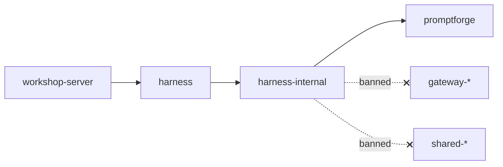

# Harness facade refactor

<product-contract>

## Product Requirements

The harness family's public API lives in `crates/harness-api`, whose name, location, and file layout differ from the `crates/promptforge/` facade, while its private crates sit in the `crates/harness/` container. This change makes `crates/harness/` a pure facade crate named `harness`, moves the private crates to `crates/harness-internal/`, and limits the family's dependencies outside itself to `promptforge`. It also makes every type on the harness public surface reachable through the facade, so the harness documentation tree has no unlinked harness types. Session, run-log, and Workshop behavior do not change.

- Problem and users:
  - The users are the maintainers of the promptforge3 workspace, Workshop (the harness's only client, through `crates/workshop/server`), and readers of the documentation site.
  - `crates/harness-api` only re-exports, but its layout breaks the facade shape rules that bind `crates/promptforge/`: grouped `use` lists and private `mod` files (`crates/harness-api/src/lib.rs` lines 22-35). No check applies those rules to it, because the shape check names only `crates/promptforge` (`crates/build-xtask/src/facade_shape.rs` line 26).
  - The product-boundary rules let harness crates depend on `gateway-api-types`, `gateway-api-discovery`, and `shared-*` crates (`crates/build-xtask/src/product.rs` lines 15-16 and 201-203), and `harness-log` depends on `shared-error-source` (`crates/harness/log/Cargo.toml` line 17). No harness crate depends on a gateway crate (`crates/harness/*/Cargo.toml`).
  - Public signatures name internal types the facade does not re-export: `LogError` through `LaunchError::Log` and `Session::transcript` (`crates/harness/sessions/src/runtime.rs` line 66, `crates/harness/sessions/src/session.rs` line 247), the log's `RunId` through `Session::run_ids` and `LogError::UnknownRun` (`session.rs` line 236, `crates/harness/log/src/error.rs` line 42), `SharedLog` through `Harness::log` (`runtime.rs` line 185), and the `shared-error-source` wrappers through `LogError`'s public fields (`error.rs` lines 20-39).
- Goals:
  - `crates/harness/` is the package `harness`, a pure facade laid out like `crates/promptforge/`.
  - `crates/harness-internal/` holds `capabilities`, `log`, `models`, `runner`, `sessions`, `web`, `web-search`, and `webfetch`, with package names unchanged (`harness-*`).
  - Outside its family, the harness depends only on `promptforge`, so it can be built, published, or moved out with nothing but `promptforge`.
  - Every type a harness public signature names is a facade re-export, a std type, or a third-party type.
  - The existing workspace checks enforce all of the above.
- Non-goals:
  - No behavior change to sessions, the run log, its schema, or Workshop.
  - No change to public item paths beyond the crate rename (`harness_api::X` becomes `harness::X`) and the new `harness::log` module.
- Success criteria:
  - `cargo test -p build-xtask` passes with the harness facade under the facade shape check, and fails when any harness crate depends on a gateway, shared, or workshop crate.
  - Workshop builds and passes its tests while depending on `harness` alone.
  - No harness type is unlinked in the harness rustdoc tree.
- Constraints:
  - When in doubt, do what the repository and build-xtask already do for `crates/promptforge/` and `crates/promptforge-internal/`. The Decision Record sets the scope of this rule.
  - Every landed change leaves the build and `cargo test -p build-xtask` passing.
  - The rename and the build-xtask updates that name the new package and directories land together. A package named plain `harness` falls outside the family classification until `family()` is updated (`crates/build-xtask/src/product.rs` lines 55-71), so the checks would stop covering the harness without reporting an error.
  - `workspace-hack` is exempt from the dependency rule: `family()` places it in no family (`product.rs` lines 55-71), and every member lists it (`Cargo.toml` lines 74-75).
- Open questions: None

## Functional Specification

Workshop reaches the harness only through `harness`, finding the same items at the same paths under the new crate name. The facade gains a `log` module holding the run-log error vocabulary its signatures already name, and the run-log handle leaves the default surface. Maintainers see violations from the existing checks when a harness crate breaks the new rules. Error messages and wire behavior do not change.

- Actors and workflows:
  - Workshop's server crate depends on `harness` and imports the items it imports from `harness_api` today (`crates/workshop/server/src/agents.rs` line 36, and the files listed under Execution Instructions).
  - Maintainers run `cargo test -p build-xtask` or `cargo xtask tidy` to enforce the structure, and `cargo xtask site` to build the documentation site. CI runs the same gates.
- Inputs and outputs:
  - The facade root exports `CatalogBinding`, `GatewayBinding`, `Harness`, `HarnessConfig`, `HostSnapshot`, `LaunchError`, `display_chain`, `Delta`, `DeltaKind`, `FailureKind`, `LaunchRequest`, `Session`, `SessionEvent`, `SessionFailure`, `SessionId`, `SessionState`, `WaitError`, and `WaitFrame`, the list in `crates/harness-api/src/lib.rs` lines 25-35. `display_chain` is a function (`crates/harness/runner/src/lib.rs` line 44).
  - `harness::cancel` exports `CancelHandle`, `current`, `is_cancelled`, `maybe_scope`, `scope`, and `wait_cancelled` (`crates/harness-api/src/cancel.rs` lines 6-8).
  - The new `harness::log` exports `LogError`, `RunId`, `DatabaseSource`, and `JsonSource`.
  - `Harness::log()` exists only when `harness-sessions` is built with its `test-support` feature, so the default surface never names `SharedLog`, which is `Arc<Mutex<RunLog>>` (`crates/harness/runner/src/effect_loop.rs` line 56).
- States and validation: the workspace checks report a violation when:
  - a harness crate depends on any `gateway-*` or `shared-*` crate;
  - a crate outside the family, `build-*` included, depends on a harness crate other than `harness`;
  - a crate outside `crates/harness-internal/` other than `harness` depends into it;
  - a facade source file holds anything but single-item re-exports rooted at a declared dependency and documented `pub mod` groups;
  - a `doc(hidden)` attribute appears under the harness facade or container;
  - a non-dev dependency table or a `[features]` value enables a harness crate's `test-support` feature;
  - an internal harness crate lacks its `clippy.toml` spawn bans.
- Errors and recovery:
  - `LogError` keeps its variants and messages. Its `Database` and `Payload` sources become `harness::log::DatabaseSource` and `harness::log::JsonSource`, which render and chain exactly like the `shared-error-source` types they replace (`crates/shared-error-source/src/lib.rs` lines 10-15).
  - Code that downcasts a run-log cause must name the harness wrapper instead of `shared_error_source`'s. Today only the harness-log tests downcast (`crates/harness/log/src/error.rs` lines 84 and 99).
- Security and privacy behavior:
  - A gateway bearer key is still never written to logs or `Debug` output. The facade test that pins it (`crates/harness-api/tests/it/gateway.rs` lines 38-49) moves with the facade tests.
  - The run-log handle and its full read and write API stay out of production builds, enforced by the extended leak guard.
- Acceptance criteria:
  - Every exit criterion in the Testing Plan passes.
  - The facade passes the shape check. `crates/harness-internal/` passes the container, spawn-ban, marker, ceiling, lint-inheritance, `doc(hidden)`, and leak checks.
  - No harness crate manifest names `shared-error-source` or a gateway crate.
  - Every public signature in the harness rustdoc tree links only to harness pages, std, or third-party crates.

</product-contract>
<implementation-contract>

## Technical Design

The harness adopts the promptforge family's two-part shape: a root facade of single-item re-exports, and a manifestless container of private crates that only the facade may reach. The build-xtask checks that already pair `promptforge` with `promptforge-internal` gain a matching entry pairing `harness` with `harness-internal`. The product-boundary rules tighten so `promptforge` is the family's only outside dependency. `harness-log` owns its error wrappers, so no shared crate appears on the harness surface, and nothing persisted or on the wire changes.

- Architecture:
  - The facade depends on `harness-runner`, `harness-sessions`, and `harness-log`, and re-exports from them. The internal crates depend only on `promptforge`, their container siblings, `workspace-hack`, and third-party crates.
  - Gateway model entries already reach the harness as `serde_json::Value` (`crates/harness/sessions/src/environment.rs` line 78), and no harness crate names a gateway crate, so the gateway ban needs no code change.
  - Check coverage after the change:
    - Facade shape check: both facades (`crates/build-xtask/src/facade_shape.rs`).
    - Container privacy: outside crates reach `crates/harness-internal/` only through `harness`, the same way they reach `crates/promptforge-internal/` only through `promptforge` (`crates/build-xtask/src/product.rs` lines 262-268).
    - Family facade rule: outside crates, `build-*` included, reach the harness family only through `harness`, mirroring the promptforge rule (`product.rs` lines 210-222).
    - `doc(hidden)` ban: both facades and both containers (`crates/build-xtask/src/doc_hidden.rs` lines 25-35).
    - `test-support` leak guard: promptforge crates and harness crates. Today it covers only the promptforge family (`crates/build-xtask/src/test_support_leak.rs` lines 194-207).
    - Marker, 500-line ceiling, and lint inheritance: the internal `harness-*` crates, bound by package name. The facade falls outside them, as `promptforge` does (`crates/build-xtask/src/tidy.rs` lines 271-276).
    - Spawn-ban `clippy.toml` check: the internal crates only (`crates/build-xtask/src/harness_bans.rs`).
    - Rustdoc site: the `harness/` folder documents the crate `harness` (`crates/build-xtask/src/site.rs` lines 38-39).
- Modules and interfaces:
  - The facade has `Cargo.toml`, `src/lib.rs`, `src/lib.md`, `src/cancel.md`, `src/log.md`, and `tests/suite/`. It has no README, no `clippy.toml`, and no `## Invariants` marker, matching `crates/promptforge/` (`crates/promptforge/Cargo.toml`, `crates/promptforge/src/lib.rs` line 1, `crates/promptforge/tests/suite/main.rs`).
  - `lib.rs` holds only single-item `pub use` lines and documented `pub mod` groups (`facade_shape.rs` lines 1-14).
  - `harness-log` exports `DatabaseSource` and `JsonSource`, shaped like the `shared-error-source` types (`crates/shared-error-source/src/lib.rs` lines 16-104): `#[derive(Debug, thiserror::Error)] #[error(transparent)]`, a private field, `as_inner`, `into_inner`, and `From`.
  - `harness-sessions` gains a `test-support` feature, which is the only way `Harness::log` is exposed.
- File and public API changes:
  - Directory moves: all eight `crates/harness/<crate>` directories go to `crates/harness-internal/<crate>`, and `crates/harness-api` goes to `crates/harness`.
  - Package `harness-api` becomes `harness`, and its workspace dependency entry changes to match (`Cargo.toml` line 43).
  - Public API: the crate path is renamed, `harness::log` is added, `Harness::log` moves behind `test-support`, and `LogError`'s source types become the harness wrappers.
  - The facade `documentation` URL changes from `.../harness/harness_api/index.html` to `.../harness/harness/index.html` (`crates/harness-api/Cargo.toml` line 13). Old deep links into `harness/harness_api/` break, but the `harness/` folder's `index.html` redirect keeps working (`site.rs` lines 129-133).
- Data, persistence, failure, security, and privacy constraints:
  - The run log's schema, files, and JSON round-trip rules are unchanged.
  - `LogError` renders and chains exactly as before, because the local wrappers use `#[error(transparent)]`.
  - A gateway bearer key is never written to logs or `Debug` output (`crates/harness-api/src/lib.rs` line 17).
  - `test-support` code never reaches a production build, and the leak guard enforces this for harness crates.

</implementation-contract>
<verification-contract>

## Testing Plan

The existing workspace gates cover this change: the build, the build-xtask architecture tests, the harness and Workshop suites, clippy, formatting, and the rustdoc build. New build-xtask tests pin each rule this change tightens, and the harness-log tests pin the new wrappers. A manual pass over the harness rustdoc tree confirms that no harness type is left unlinked.

- Unit:
  - harness-log: the two downcast tests reach `turso::Error` and `serde_json::Error` through the local wrappers (`crates/harness/log/src/error.rs` lines 68-103).
  - build-xtask fixtures move to the new names in `product-tests.rs`, `product-container-tests.rs`, `site-tests.rs`, `harness_bans-tests.rs`, and `facade_shape-tests.rs`, and `facade_shape-tests.rs` gains a harness facade case (all under `crates/build-xtask/src/`).
  - New product-rule tests:
    - A harness crate depending on `gateway-api-types` fails.
    - A harness crate depending on `shared-error-source` fails.
    - A harness crate depending on `workspace-hack` passes.
    - A non-workshop outside crate depending on `harness-runner` fails.
  - New leak-guard tests in `crates/build-xtask/src/test_support_leak-tests.rs`: enabling `harness-runner/test-support` from `[dependencies]` fails, and enabling it from `[dev-dependencies]` passes.
- Integration and end-to-end:
  - The facade's `tests/suite/` gateway-binding tests.
  - The `harness-sessions` integration tests, which call `harness.log()` through `test-support` (`crates/harness/sessions/tests/it/session.rs` lines 190, 253, 301, and 359; `session-close.rs` line 46) and `run_ids` (`session-infer.rs` line 211).
  - The `workshop-server` tests, including `crates/workshop/server/tests/it/agents/replacement.rs`.
  - `cargo doc -p harness --no-deps`, then a manual check of the harness pages for unlinked types.
- Regression, security, and performance:
  - `a_gateway_binding_never_prints_its_key` passes from its new location.
  - `cargo test -p shared-error-source` passes after its doc and comment edits.
  - No performance-sensitive code changes.
- Exit criteria:
  - `cargo check --workspace --all-targets`, excluding `workshop` when Tauri's system packages are missing.
  - `cargo test -p build-xtask -p harness -p harness-log -p harness-sessions -p shared-error-source -p workshop-server`
  - `cargo clippy --all-targets --all-features -- -D warnings`
  - `cargo fmt --all --check`
  - `cargo doc -p harness --no-deps`
  - `cargo xtask site --books-only` for the books and the link check, plus the rustdoc build of the harness tree, checked by hand so that no harness page leaves a type unlinked. A full `cargo xtask site` covers both when `mdbook` is installed (`crates/build-xtask/src/site.rs` lines 1-25).

</verification-contract>
<decision-record>

## Decision Record

- Decisions:
  - Make `crates/harness/` a pure facade and put the other crates in `crates/harness-internal/`, following the promptforge pair. The rationale is one structure for both families and a facade that the existing shape check enforces. User's words: "harness/ is a pure facade (like @promptforge3/crates/promptforge ) and the reset of the crates go in harness-internal (like @promptforge3/crates/promptforge-internal )".
  - Outside its family, the harness depends only on `promptforge`: no gateway, shared, or workshop crates. The rationale is that the harness can be built, published, or moved out alone, and that its documentation tree needs nothing outside the site. Each tree is built with `cargo doc -p <crate> --no-deps` into an empty folder (`crates/build-xtask/src/site.rs` lines 110-135). User's words: "harness only depends on promptforge (not gateway or shared or workshop)", confirmed as "\"the aim is that the harness can be built, published, or moved out with nothing but promptforge,\" yes this, and it helps because the documentation site is a single tree".
  - Proceed with the refactor. It is low risk and mostly moves and renames. The only real code changes are two local error wrappers, the facade `lib.rs`, and gating one method. User's words: "evaluate this change, is it good?"
  - When in doubt, do what the repository and build-xtask already do for `crates/promptforge/` and `crates/promptforge-internal/`. The rationale is that build-xtask already encodes that pairing in each check, so the harness becomes a second entry rather than new logic. User's words: "should this refactor should follow the same structure as promptforge-internal and promptforge? in other words, when in doubt look how those are handled in the build and the repo?"
    - Mirror: the directory layout, the facade's files and manifest, the facade shape check, the `doc(hidden)` ban, the `test-support` leak guard, the rule that outside crates reach the family only through its facade, the rustdoc site entry, and the workspace manifest entries.
    - Keep, because promptforge has no counterpart: the `## Invariants` marker, the 500-line ceiling, and lint inheritance on the internal `harness-*` crates, which bind by package name. Also keep the raw-tokio-spawn bans on the internal crates. The `crates/promptforge-internal/` crates have no marker.
  - Follow the promptforge facade in every detail:
    - No `## Invariants` block. `family_requires_marker` already skips a package named `harness`, just as it skips `promptforge` (`crates/build-xtask/src/tidy.rs` lines 271-276).
    - No README, and the `readme`, `keywords`, and `categories` manifest keys are dropped. All prose goes in `src/lib.md`, as in `crates/promptforge/src/lib.md`.
    - No `clippy.toml`. The shape check rules out any function in the facade, so a spawn ban there checks nothing (`crates/build-xtask/src/facade_shape.rs` lines 139-150).
    - Tests go in `tests/suite/`, like `crates/promptforge/tests/suite/`.
    - The comment above `[dependencies]` copies promptforge's (`crates/promptforge/Cargo.toml` lines 12-13).
    - Public paths stay as they are (root items plus `cancel`), so Workshop's change is only `harness_api::` to `harness::`.
  - `harness-log` gets its own `DatabaseSource` and `JsonSource`, and drops `shared-error-source`. The rationale is the dependency goal, and that the shared name bought no cross-crate use: every downcast to a shared wrapper is in the producing crate's own tests. Those are `crates/harness/log/src/error.rs`, `crates/workshop/workspace/src/workspace_file/tests.rs`, `crates/workshop/workspace/src/error-tests.rs`, `crates/workshop/user-state/src/error-tests.rs`, `crates/gateway/local/src/error.rs`, `crates/gateway/cloud-providers/src/lib.rs`, and `crates/gateway-api-discovery/src/error.rs`. The cost is about 50 lines that repeat part of the consolidation that created `shared-error-source`, which collapsed nine newtypes in seven crates onto three shared types (`vibe/2026-09-20-4-debt-removal.md` line 141). User's words: as for the dependency decision.
  - Re-export `LogError`, the log's `RunId`, `DatabaseSource`, and `JsonSource` in `harness::log`, and keep `Session::run_ids` public. The rationale is that these types are already reachable from public signatures, and without re-exports they have no page on the site. User's words: as for the dependency decision.
  - Put `Harness::log()` behind a `test-support` feature, and extend the `test-support` leak guard to the harness crates. The rationale:
    - Re-exporting `SharedLog` would put `RunLog`'s whole read and write API on the surface.
    - The `harness-sessions` integration tests need the method.
    - The guard covers only promptforge-family crates today (`crates/build-xtask/src/test_support_leak.rs` lines 194-207), so `harness-runner`'s existing `test-support` feature (`crates/harness/runner/Cargo.toml` lines 42-45) has no guard now.

    User's selection: "Gate it behind a test-support feature and extend the existing test-support leak guard to cover harness crates."
  - Tighten the product rules. A harness crate may not depend on any gateway crate, including the public pair, or on any shared crate. The rule that outside crates reach the family only through its facade is generalized to mirror promptforge's, replacing today's Workshop-only rule (`crates/build-xtask/src/product.rs` lines 195-197). The rationale is the dependency goal and the mirror rule. User's words: as for the dependency and mirror decisions.
  - Extend the `doc(hidden)` ban to the harness facade and container. The rationale is the mirror rule, and no harness source uses `doc(hidden)` today (search of `crates/harness/` and `crates/harness-api/`). User's words: as for the mirror decision.
- Rejected alternatives:
  - Keeping `shared-error-source` as an allowed `shared-*` exception. It adds no coupling between families, because it depends on nothing in the workspace (`crates/shared-error-source/src/lib.rs` lines 1-8), but it breaks the "nothing but promptforge" goal. Revisit if the harness stops being a separately buildable unit.
  - Re-exporting `SharedLog`. It would bring `RunLog`, `Record`, `RunMeta`, `StoredRecord`, and the rest of the run-log API into the public docs (`crates/harness/log/src/lib.rs` lines 40-44). Revisit if a client needs direct run-log access.
  - Making `Harness::log` and `Session::run_ids` crate-private. That breaks the `harness-sessions` integration tests that call them. Revisit if the `test-support` gate cannot be built, in which case it becomes the fallback in Execution Instructions.
  - Keeping the `## Invariants` block, README, and `clippy.toml` on the facade. The mirror rule rejects them. Revisit if the promptforge facade adopts them.
  - Keeping the Workshop-only facade rule. The general rule covers it and also binds `build-*` and unaffiliated crates. Revisit if an outside crate legitimately needs a private harness crate.
- Assumptions, risks, and notes:
  - Paths in this plan are relative to the root of the promptforge3 workspace repository.
  - Assumption: Cargo accepts `harness-sessions` listing itself under `[dev-dependencies]` to turn on its own `test-support`. Evidence (https://github.com/rust-lang/cargo/issues/2911, comment by epage on 2023-09-28, and https://doc.rust-lang.org/cargo/reference/features.html, "Feature resolver version 2"):
    - It is an undocumented workaround that works in the `path = "."` form under feature resolver 2, and it keeps the feature off in normal builds.
    - Whether the `workspace = true` form works is not established.
    - `cargo package` and `cargo publish` strip the self-dependency, so a published crate's tests would not get the feature.
    - Adding `default-features = false` avoids re-enabling defaults under `--no-default-features`.
    - The issue reports that cargo#9518 treats this as something that should not be allowed, so a future Cargo might reject it.
    - The workspace sets `resolver = "3"` (`Cargo.toml` line 2), which is assumed, not verified, to keep resolver 2's feature rules.
  - Risk: landing the rename without the build-xtask updates would leave the harness unchecked with no error. The atomic-change constraint covers it.
  - Assumption, not established by the rustdoc docs: rustdoc gives single-item re-exports from the internal crates their own pages in the facade's tree, as the promptforge tree relies on. The rustdoc build and manual check in the Testing Plan confirm it.
  - Note: in a tree built with `--no-deps`, a type from a crate whose docs are not in the folder renders unlinked, unless that crate sets `#![doc(html_root_url = "...")]` or rustdoc gets `--extern-html-root-url` (https://doc.rust-lang.org/rustdoc/write-documentation/the-doc-attribute.html, section "html_root_url"). Every workspace crate is `publish = false` (for example `crates/harness-api/Cargo.toml` line 7), so there is no docs.rs fallback.
  - Note: no harness facade signature names a `promptforge` type today. They use strings, `serde_json::Value`, and tokio receivers (`crates/harness/sessions/src/{session,runtime,environment,protocol,input}.rs`).
  - Note: after the rename the site shows two `CancelHandle` types, `promptforge::cancel::CancelHandle` and `harness::cancel::CancelHandle`. The sentence in `crates/promptforge-internal/types/src/cancel.rs` line 12 that says the tokio-aware token is "defined in `harness-api`" is already out of date, because it is defined in `harness-runner` (`crates/harness/runner/src/cancel.rs`).
  - Note: Workshop's local variables and a method named `harness` (`crates/workshop/server/src/agents.rs` lines 57-58, 110, and 146; `src/app/compose.rs` line 203; `src/agents/state.rs` line 100) are in the value namespace and do not clash with the crate name.
  - Cost: the harness can never use `gateway-api-types` (for example `ModelInfo`, `crates/gateway-api-types/src/lib.rs` line 18), so gateway data stays untyped JSON.
  - Note: publishing the facade also means publishing its internal crates, as `promptforge` needs its seven (`crates/promptforge/Cargo.toml` lines 14-22). The rule only guarantees that no gateway, shared, or workshop crate has to go along. For `workspace-hack`, `cargo hakari publish -p <crate>` removes the dependency for the duration of the publish, and publishing a stub workspace-hack crate is the other option (https://docs.rs/cargo-hakari/latest/cargo_hakari/publishing/index.html, sections A and B).
  - Note: both names are taken on crates.io by unrelated crates (https://crates.io/api/v1/crates/harness, a benchmarking crate; https://crates.io/api/v1/crates/promptforge, a prompt-formatting crate). Publishing from git or a private registry, or moving the harness out, is unaffected.
  - Note: nothing under `.github/` or `.config/` names a harness crate (search of both), so CI and hakari configuration need no edits.

### Deferred and Out of Scope

- Deferred: extending `cargo xtask api` and a committed `crates/harness/public-api.txt` to the harness facade. Revisit after this change lands. User's selection: "Do it as a separate follow-up change."
  - What the command does: it builds rustdoc JSON on the pinned nightly `nightly-2026-09-05` with `rustdoc-types` `0.61.0` (`crates/build-xtask/src/api/toolchain.rs` lines 18-21). It checks that each facade `use` names one internal item, that every path a public item names is a facade re-export, std, or an allowlisted crate, and that no public doc text names an internal crate. It compares the surface listing with the committed `public-api.txt` (`crates/build-xtask/src/api.rs` lines 1-35), and CI runs `cargo xtask api --check` (`.github/workflows/ci.yml` lines 383-418).
  - What the harness needs: point `FACADE` (`crates/build-xtask/src/api/load.rs` line 20) and `ENGINE_CONTAINER` (`crates/build-xtask/src/engine_guards.rs` line 19) at a second facade and container. Add `tokio` to the allowlist, since `serde_json` is already on it (`crates/build-xtask/src/api/items.rs` line 22). Commit the listing and add a second CI step.
- Deferred: rewriting the facade's `lib.md` into a full host guide like `crates/promptforge/src/lib.md`. This change only moves the existing prose there. Revisit when harness documentation work is scheduled.
- Deferred: promptforge's exception that lets internal crates dev-depend on the facade so their doc examples compile against facade paths. Revisit when a harness-internal doc example needs facade paths.
- Deferred: `#![doc(html_root_url = "https://cppalliance.github.io/promptforge/promptforge/")]` on the promptforge facade, which the shape check allows because it is a doc attribute (`crates/build-xtask/src/facade_shape.rs` lines 184-190). Revisit when a harness signature first names a `promptforge` type.
- Deferred: renaming for crates.io. Revisit if crates.io publication is pursued.
- Out of scope: the engine checks with no harness counterpart, which are the engine manifest guard (enforcing that the engine does no I/O) and the retired-symbol scan (`crates/build-xtask/src/engine_guards.rs` lines 1-33).
- Out of scope: the history logs in `vibe/`. Two `vibe/` files are not history logs and are updated: `vibe/archdoc.md`, the architecture record, and `vibe/papergate-harness-migration.md`, a forward-looking migration note for the `wg21-paperflow` repository.

</decision-record>
<project-survey>

## Project Survey

- Status: complete
- Build command: `cargo build --locked -p <package>`. A bare `cargo build --locked` builds only the default member, the gateway app (package `gateway`). The desktop app is `cargo build --locked -p workshop`. Clippy already compiles every target, so never run a standalone `cargo check --workspace` beside it.
- Focused test command pattern: `cargo nextest run --locked -p <package> --all-features <test-name-substring>`. Add `--lib` to run only unit tests, or `--test it` to run only the integration binary (the `promptforge` facade's binary is `--test suite`). For one doctest: `cargo test --locked -p <package> --all-features --doc <item-path>`. The trio `workshop`, `workshop-server`, and `workshop-server-api` drop `--all-features`.
- Component test command pattern: `cargo nextest run --locked -p <package> --all-features`, then `cargo test --locked -p <package> --all-features --doc`. The workshop trio drops `--all-features`, and `workshop-server` headless tests run with `--features headless`. Run `cargo test -p build-xtask` whenever a manifest, a dependency edge, or a crate's `## Invariants` marker changes.
- Full-suite test command: `cargo nextest run --locked --workspace --exclude workshop --exclude workshop-server --exclude workshop-server-api --all-features`, then `cargo test --workspace --exclude workshop --exclude workshop-server --exclude workshop-server-api --all-features --doc`, then `cargo nextest run --locked -p workshop -p workshop-server -p workshop-server-api`, then `cargo test -p build-xtask`. Facade surface gate: `cargo +nightly-2026-09-05 xtask api --check` (the pinned nightly lives in `crates/build-xtask/src/api/toolchain.rs` and is installed locally). UI suites: `npm test` in `crates/workshop/ui` and in `crates/gateway/config-ui/ui`.
- Linter command: `cargo clippy --workspace --exclude workshop --exclude workshop-server --exclude workshop-server-api --all-targets --all-features -- -D warnings`, and for the workshop trio `cargo clippy -p workshop -p workshop-server -p workshop-server-api --all-targets -- -D warnings`. Also `cargo check -p gateway --no-default-features` for the headless build shape. UI typecheck: `npm run typecheck` in both UI packages. Supply chain: `cargo deny check`.
- Formatter check command: `cargo fmt --all --check` (rustfmt `style_edition = "2024"`; the pre-commit hook runs the same).
- Docs command: `cargo doc --workspace --no-deps --all-features --exclude workshop --exclude workshop-server --exclude workshop-server-api` and facade docs `cargo doc -p promptforge --no-deps` (default features, no `--all-features`), both with `RUSTDOCFLAGS` set to `-D warnings` (in PowerShell: `$env:RUSTDOCFLAGS="-D warnings"` first). User guide: `cargo xtask site --books-only`.
- Test placement and naming conventions:
  - Unit tests sit in a sibling file wired at the bottom of the module as `#[cfg(test)] #[path = "<stem>-tests.rs"] mod tests;`, split further as `<stem>-tests-<label>.rs`. A large suite grows into a `src/<module>/tests/` subdirectory (for example `promptforge-engine`'s `src/execute/tests/`).
  - Integration tests are one binary per crate at `tests/it/main.rs` with one `mod` per area and helpers in `tests/it/support.rs`. The `promptforge` facade uses `tests/suite/main.rs` with prompt fixtures in `tests/prompts/`. A few gateway and STT crates keep standalone `tests/*.rs` files, plus `tests/common/` and `tests/fixtures/`.
  - Test binaries open with `#![expect(clippy::expect_used, clippy::unwrap_used, reason = "...")]` because the workspace denies both lints.
  - Test-only helpers live behind a `test-support` feature (promptforge-internal crates, `harness-runner`) or a `test-fixtures` feature (gateway and workshop crates), which is why test commands pass `--all-features`.
  - Test functions are named as full snake_case sentences, for example `a_direct_launch_recovers_the_lease_from_a_terminated_owner`.
- Directory map:
  - `crates/` holds every Rust crate plus the `shared-ui` TypeScript and CSS package. Public crates sit at the root: `promptforge` (the facade), `harness-api`, `gateway-api-types`, `gateway-api-discovery`, `shared-error-source`, `shared-loopback`, `workspace-hack` (cargo-hakari), and the `build-*` tooling crates (`build-xtask`, `build-workshop`, `build-ui`, `build-user-guide`, `build-llama-cuda`).
  - `crates/promptforge-internal/` is a manifestless private container for `engine`, `types`, `vfs`, `lua`, `parser`, `store`, and `model-client`.
  - `crates/harness/` is a manifestless private container for `runner`, `sessions`, `models`, `capabilities`, `log`, `web`, `webfetch`, and `web-search`.
  - `crates/gateway/` is a manifestless private container for `app`, `cloud-providers`, `config`, `config-ui`, `local`, `logging`, `progress`, `protocol`, `routing`, `web-search`, and the nested `stt/` subsystem (`api`, `engine`, `backend-whisper`, `whisper-ffi`).
  - `crates/workshop/` is a manifestless private container for `desktop` (package `workshop`), `server`, `server-api`, `gateway`, `menu`, `protocol`, `registry`, `status`, `support`, `user-state`, `workspace`, and the `ui/` TypeScript SPA.
  - `guide/` holds the mdBook sources for the language, gateway, and workshop books plus the landing page. `prompts/` holds sample prompt programs. `tools/` holds Node scripts for gateway sidecar staging and a TTS live check, with their tests. `vibe/` holds `archdoc.md`, plans, and run ledgers. `images/` holds image assets.
  - `.github/workflows/` holds CI (`ci.yml`) and release pipelines. `.githooks/` holds pre-commit (fmt) and pre-push (headless check, clippy, deny). `.cargo/config.toml` defines the `xtask` and `workshop` aliases and the Windows `rust-lld` plus static CRT link setup. `.config/` holds `nextest.toml` and `hakari.toml`. Root config files are `clippy.toml`, `deny.toml`, `dist-workspace.toml`, `rustfmt.toml`, and `rust-toolchain.toml` (stable).
- Component boundaries:
  - PromptForge: `promptforge` re-exports the private crates. Inside the family, `promptforge-engine` depends on `lua`, `parser`, `store`, `model-client`, `types`, and `vfs`; `parser` depends on `lua` and `types`; `lua` depends on `model-client`, `store`, and `types`; `store` depends on `vfs`; `model-client` depends on `types`; `vfs` depends on nothing. Private crates may list `promptforge` only as a dev-dependency for doc examples. Nothing in the family depends on gateway, harness, or workshop crates.
  - Harness: `harness-api` depends on `harness-runner` and `harness-sessions` and re-exports from both. `harness-sessions` depends on `runner`, `models`, `capabilities`, `log`, `web`, and `promptforge`. `harness-runner` depends on `capabilities`, `log`, and `promptforge`. `harness-models` depends on `runner` and `promptforge`. `harness-web` depends on `webfetch`, `web-search`, and `capabilities`. `harness-webfetch` and `harness-web-search` depend on `capabilities` and `promptforge`. `harness-capabilities` depends on `promptforge`. `harness-log` depends on `shared-error-source`. Only `harness-api` may be named from outside `crates/harness/`, and today only `workshop-server` names it.
  - Gateway: private crates under `crates/gateway/` are visible outside only through `gateway-api-types` and `gateway-api-discovery`. Gateway crates never depend on promptforge, harness, or workshop crates.
  - Workshop: the desktop app (`workshop`) depends on `workshop-server-api`, which fronts `workshop-server`. `workshop-server` depends on `harness-api`, `promptforge`, and the gateway public pair, never a private gateway or harness crate. Inside the family, dependencies flow server, then features, then services, then vocabulary.
  - Shared: `shared-*` crates depend on no product crate.
  - `cargo test -p build-xtask` enforces the product boundary matrix, container privacy, the tier graph, and the invariant markers.
  - `vibe/archdoc.md` lists a CLI component, but the tree has no CLI crate. The binaries are the gateway app, `gateway-cloud-providers`, the workshop desktop app, and the `build-*` tools. The archdoc's "executor" is the `promptforge-engine` crate.
- Conventions summary:
  - Workspace lints forbid `unsafe_code`, warn on `missing_docs`, `missing_debug_implementations`, and `unreachable_pub`, and deny clippy `all`, `pedantic`, `unwrap_used`, and `expect_used`. Rustdoc denies broken and private intra-doc links.
  - Every `workshop-*` and `harness-*` crate's `lib.rs` opens with a `//!` doc holding a `## Invariants` marker that lists allowed and banned dependencies. Files in those crates stay under 500 lines; split first, then edit.
  - Source directories are flat. One or two child modules live beside the parent as `<stem>-<label>.rs` wired with `#[path]`. Three or more become a `<stem>/` subdirectory.
  - Harness crates spawn tokio tasks only through the `harness-runner` spawn wrappers; each harness crate's `clippy.toml` bans the raw calls.
  - JSON that reaches the run log round-trips exactly: `serde_json` with `float_roundtrip`, sorted keys, finite numbers, never `preserve_order`.
  - Error and status messages are written for model consumption and name required versus actual.
  - Comments explain only non-obvious constraints, and every workaround cites its upstream issue URL.
  - Behavior changes ship with tests in the same change. Refactors preserve behavior tests. New structural checks need explicit user approval.
  - Cargo features gate real constraints only, such as toolchains, native builds, or test helpers.
  - Dependency versions are centralized in the root `[workspace.dependencies]`, members use `<dep>.workspace = true`, and `workspace-hack` unifies features through cargo-hakari.
  - Edition 2024 on the stable toolchain. Every CI job must leave `git status --porcelain` clean.

</project-survey>
<execution-plan>

## Execution Instructions

<step-1>

### Step 1: harness-log owns its error wrappers [completed]

- Component: harness-log wrappers
- Piece: error wrappers, the component's only piece.
- Order: first. It depends on no other step. Steps 3 and 5 need `harness-log` free of `shared-error-source`: Step 3's internal invariant blocks state the tightened dependency list, and Step 5's ban on shared crates would fail on `harness-log`.
- Work:
  - In `crates/harness/log/src/error.rs`, add `DatabaseSource(turso::Error)` and `JsonSource(serde_json::Error)` with the shape in the Technical Design (`#[derive(Debug, thiserror::Error)] #[error(transparent)]`, a private field, `as_inner`, `into_inner`, and `From`). `LogError`'s `Database` and `Payload` sources use them. Variants and messages do not change.
  - Export both from `crates/harness/log/src/lib.rs`.
  - Remove `shared-error-source` from `crates/harness/log/Cargo.toml` (line 17).
  - Remove the harness from three texts: the feature comment in `crates/shared-error-source/Cargo.toml` (lines 18-20, "harness-log does not acquire reqwest"), the crate doc in `crates/shared-error-source/src/lib.rs` (lines 1-8, "the harness, workshop, and gateway families"), and `crates/README.md` line 19.
  - Refresh `Cargo.lock` with `cargo update --workspace` before running the `--locked` commands.
- Tests: point the two downcast tests in `crates/harness/log/src/error.rs` (lines 68-103) at the local wrappers, so they reach `turso::Error` and `serde_json::Error` through them.
- Verify:
  - `cargo nextest run --locked -p harness-log --all-features`, then `cargo test --locked -p harness-log --all-features --doc`
  - `cargo test -p shared-error-source`
  - `cargo test -p build-xtask`
  - `cargo clippy -p harness-log -p shared-error-source --all-targets --all-features -- -D warnings` and `cargo fmt --all --check`
  - `rg shared-error-source -g Cargo.toml crates/harness crates/harness-api` finds nothing.
- Commit: one commit holding the code, the tests, and `Cargo.lock`.

</step-1>

<step-2>

### Step 2: The test-support leak guard covers harness crates [completed]

- Component: harness leak guard
- Piece: leak guard, the component's only piece.
- Order: second, ahead of the facade restructure, although the plan's work-item list places it after the build-xtask path changes. There are two reasons. First, Step 3 stops `harness_clippy_bans` from calling `harness_bans::harness_crates`, which would leave `harness_crates` with no non-test caller and fail clippy's `dead_code` lint unless the guard already calls it. Second, with the guard live first, Step 4's new `harness-sessions` `test-support` feature is checked as it lands. The guard works against today's paths, and Step 3 repoints them.
- Work:
  - In `crates/build-xtask/src/test_support_leak.rs`, guard the promptforge crates listed by `engine_guards::engine_crates` plus the harness crates listed by `harness_bans::harness_crates`. Call `harness_crates` with `crates/harness` and `crates/harness-api`, the paths `crates/build-xtask/src/tidy.rs` passes today (lines 67-70).
  - Keep the exemption for a crate's own `test-support` forwarding a sibling's (lines 107-118), applied within each family: a harness crate forwarding a harness sibling is exempt, and so is a promptforge crate forwarding a promptforge sibling.
  - Update the module docs (lines 1-32) and the violation message (line 187), which say "engine crate", so they name both families.
- Tests, in `crates/build-xtask/src/test_support_leak-tests.rs`:
  - Enabling `harness-runner/test-support` from `[dependencies]` fails.
  - Enabling it from `[dev-dependencies]` passes.
  - A harness crate's own `test-support` forwarding `harness-runner/test-support` passes.
- Verify:
  - `cargo test -p build-xtask`. The real workspace passes: `harness-models`, `harness-sessions`, `harness-webfetch`, and `harness-web-search` enable `harness-runner/test-support` only from `[dev-dependencies]`.
  - `cargo clippy -p build-xtask --all-targets --all-features -- -D warnings` and `cargo fmt --all --check`
- Commit: one commit holding the guard and its tests.

</step-2>

<step-3>

### Step 3: Rename the facade to harness and move the private crates to harness-internal [completed]

- Component: harness facade
- Piece: restructure. It comes before the public-surface piece (Step 4), because that piece edits the facade `lib.rs` and `crates/harness-internal/sessions`, which exist only after this one.
- Order: third. The internal invariant blocks written here need Step 1, and the leak-guard call repointed here comes from Step 2. Everything below is one atomic change: none of it builds or passes the checks alone. A package named plain `harness` falls outside the family classification until `family()` is updated (`crates/build-xtask/src/product.rs` lines 55-71), so a partial change would leave the harness unchecked with no error. Once the moves and the root manifest are done, the facade, Workshop, and build-xtask edits touch separate files and can proceed in parallel.
- Work:
  - Moves:
    - `git mv` each of `capabilities`, `log`, `models`, `runner`, `sessions`, `web`, `web-search`, and `webfetch` from `crates/harness/` to `crates/harness-internal/`.
    - Confirm that `crates/harness` no longer exists on disk, and remove any leftover empty or untracked-only directory. Otherwise the next `git mv` nests the facade at `crates/harness/harness-api`.
    - `git mv crates/harness-api crates/harness`.
  - Root `Cargo.toml`:
    - Point the eight harness `members` entries (line 3) at `crates/harness-internal/<crate>`. The facade is matched by `crates/*`.
    - In `exclude` (line 13), replace `"crates/harness"` with `"crates/harness-internal"`, and update the container comment (lines 5-12).
    - Replace line 43 with `harness = { path = "crates/harness", version = "0.3.0" }`, and repoint the internal crate paths (lines 44-51).
  - Facade manifest `crates/harness/Cargo.toml`, matching `crates/promptforge/Cargo.toml`:
    - Set `name = "harness"`, keep `description`, and change `documentation` to `.../harness/harness/index.html`.
    - Drop `readme`, `keywords`, and `categories`.
    - Copy promptforge's comment above `[dependencies]` (`crates/promptforge/Cargo.toml` lines 12-13).
    - The dependencies stay `harness-runner`, `harness-sessions`, and `workspace-hack`.
  - Facade sources, matching `crates/promptforge/src/lib.rs`:
    - `src/lib.rs` is `#![doc = include_str!("lib.md")]` followed by one `pub use` per root item in the Functional Specification's list, then `pub mod cancel { #![doc = include_str!("cancel.md")] ... }` re-exporting the six cancel items one per line. It has no private `mod` and no `## Invariants` block. Public paths do not change.
    - Fold the prose of `src/harness.rs`, `src/session.rs`, and `src/cancel.rs`, the old `//!` crate doc (including the bearer-key statement at line 17), and `README.md` into the existing `src/lib.md` and a new `src/cancel.md`. Then delete those three source files, `README.md`, and `clippy.toml`.
    - Move `tests/it/` to `tests/suite/`, and change `harness_api::` to `harness::` there.
  - Workshop consumers:
    - In `crates/workshop/server/Cargo.toml` line 17, change `harness-api.workspace = true` to `harness.workspace = true`.
    - Change `harness_api::` to `harness::` in these files under `crates/workshop/server/`: `src/agents.rs`, `src/agents/bindings.rs`, `src/agents/socket.rs`, `src/agents/socket_frames.rs`, `src/agents/socket_frames-tests.rs`, `src/agents/socket-tests.rs`, `src/agents/state.rs`, `src/agents/status.rs`, `src/app/compose.rs`, `src/lib.rs`, `tests/it/agents/replacement.rs`, and `AGENTS.md`.
  - build-xtask names and paths:
    - `crates/build-xtask/src/product.rs`: `family()` also matches `package == "harness"`. Set `PUBLIC_HARNESS = "harness"` (line 137). `container_named_exception` maps `"harness-internal"` to `PUBLIC_HARNESS` (lines 262-268). Update the module docs (lines 21, 25, and 136) and the error messages that name `harness-api` or `crates/harness/`.
    - `crates/build-xtask/src/harness_bans.rs` and `crates/build-xtask/src/tidy.rs` (lines 67-70): `harness_clippy_bans` checks only the crates under `crates/harness-internal/`, since the facade has no `clippy.toml`. `harness_crates` keeps listing the facade plus the container, now `crates/harness` and `crates/harness-internal`, mirroring `engine_guards::engine_crates`. Update the `harness_bans.rs` module docs (lines 1-12). `family_requires_marker` does not change.
    - `crates/build-xtask/src/test_support_leak.rs`: repoint the `harness_crates` call added in Step 2 to the new paths.
    - `crates/build-xtask/src/facade_shape.rs`: add `FACADE_DIRS` (promptforge and harness), and have `facade_shape_violations` loop over it. `FACADE_DIR` keeps meaning promptforge only, for `crates/build-xtask/src/api/listing.rs` line 29 and, until Step 5, `crates/build-xtask/src/doc_hidden.rs` line 28.
    - `crates/build-xtask/src/site.rs`: the `RUSTDOC_SITES` entry becomes `("harness", "harness")`.
  - Internal invariant blocks: in each of the eight `crates/harness-internal/*/src/lib.rs` files, the scope becomes `private to crates/harness-internal/` and the dependency list becomes "`promptforge` and container siblings only". For example, `crates/harness-internal/runner/src/lib.rs` lines 10-15 lists gateway and shared crates today and names `harness-api`.
  - Internal crate AGENTS.md files: `crates/harness-internal/webfetch/AGENTS.md` line 8 and `crates/harness-internal/web-search/AGENTS.md` line 10 say "private to `crates/harness/`". Both become "private to `crates/harness-internal/`".
  - Root `AGENTS.md` lines 45, 48, 49, 82, and 83: the new facade name and container, and line 82 states that the `harness` facade has no marker, like `promptforge`. The dependency sentence in line 48 changes in Step 5, when the rule is enforced. AGENTS.md is the rulebook every later step reads, so its names must match the tree this step leaves.
  - Refresh `Cargo.lock` with `cargo update --workspace`.
- Tests:
  - Update the fixtures in `product-tests.rs`, `product-container-tests.rs`, `site-tests.rs`, `harness_bans-tests.rs`, and `facade_shape-tests.rs` (all under `crates/build-xtask/src/`) to the new names and paths.
  - In `harness_bans-tests.rs`, `the_public_crate_is_held_to_the_same_bans` (line 114) becomes a case where a facade without `clippy.toml` passes, and the live coverage case (lines 147-179) expects the eight `crates/harness-internal/` crates plus `crates/harness`.
  - Add a harness facade case to `facade_shape-tests.rs`.
  - The facade's gateway-binding tests, including `a_gateway_binding_never_prints_its_key`, run from `tests/suite/`.
- Verify:
  - `cargo test -p build-xtask`
  - `cargo nextest run --locked -p harness -p harness-runner -p harness-models -p harness-capabilities -p harness-log -p harness-sessions -p harness-web -p harness-webfetch -p harness-web-search --all-features`, then `cargo test --locked --all-features --doc` over the same packages
  - `cargo nextest run --locked -p workshop -p workshop-server -p workshop-server-api`, dropping `-p workshop` when Tauri's system packages are missing
  - `cargo clippy --all-targets --all-features -- -D warnings` over the same harness packages and `-p build-xtask`, then `cargo clippy -p workshop -p workshop-server -p workshop-server-api --all-targets -- -D warnings`
  - `cargo fmt --all --check`, then `cargo doc -p harness --no-deps` with `RUSTDOCFLAGS` set to `-D warnings`
  - `git status` shows the moved crates as renames. `rg "harness-api|harness_api" crates Cargo.toml AGENTS.md` finds only the texts Step 6 updates: five internal READMEs, `crates/harness-internal/sessions/src/protocol.rs`, and `crates/promptforge-internal/types/src/cancel.rs`.
- Commit: one commit holding every change above, the fixtures, and `Cargo.lock`.

</step-3>

<step-4>

### Step 4: Complete the harness public surface

- Component: harness facade
- Piece: public surface, built after the restructure (Step 3).
- Order: fourth. It needs Step 1's wrappers and Step 3's facade and paths, and Step 2's leak guard checks the new `test-support` feature as it lands. The two changes below together meet the success criterion that no harness type is unlinked: the run-log error vocabulary gains facade pages, and `SharedLog` leaves the default surface.
- Work:
  - Facade log module:
    - Add `harness-log` to the `[dependencies]` of `crates/harness/Cargo.toml`, in the workspace form the other entries use.
    - In `crates/harness/src/lib.rs`, add `pub mod log { #![doc = include_str!("log.md")] ... }` re-exporting `harness_log::LogError`, `harness_log::RunId`, `harness_log::DatabaseSource`, and `harness_log::JsonSource`, one per line.
    - Write `crates/harness/src/log.md` describing the run-log error vocabulary the facade's signatures name.
  - `Harness::log` gate:
    - In `crates/harness-internal/sessions/src/runtime.rs`, rename the internal opener to `pub(crate) async fn run_log`, and update its caller (line 246, `self.log()`).
    - Add `pub async fn log`, only under `#[cfg(feature = "test-support")]`, delegating to `run_log`.
    - In `crates/harness-internal/sessions/Cargo.toml`, add `[features] test-support = []` and a self dev-dependency. Try `harness-sessions = { workspace = true, default-features = false, features = ["test-support"] }` first, to keep the workspace-dependency convention. If Cargo rejects it, use `harness-sessions = { path = ".", default-features = false, features = ["test-support"] }`.
    - Fallback: if neither form builds, stop and switch approaches. Make `log` `pub(crate)`, move the log-reading integration tests (`tests/it/session.rs` lines 190, 253, 301, and 359, and `tests/it/session-close.rs` line 46) into unit tests under `src/` following the test placement conventions, and record the switch in the Decision Record.
  - Refresh `Cargo.lock` with `cargo update --workspace`.
- Tests: the existing `harness-sessions` integration tests that call `harness.log()` and `run_ids` cover the gate. This step adds no test unless the fallback moves them.
- Verify:
  - `cargo nextest run --locked -p harness-sessions --all-features`, then `cargo nextest run --locked -p harness-sessions --test it` without `--all-features`, which proves that the self dev-dependency, not `--all-features`, turns the feature on for the integration tests
  - `cargo test -p build-xtask`: the facade shape check accepts the `log` module, and the leak guard confirms `test-support` is enabled only from `[dev-dependencies]`
  - `cargo nextest run --locked -p harness --all-features` and `cargo nextest run --locked -p workshop-server`
  - `cargo clippy -p harness -p harness-log -p harness-sessions --all-targets --all-features -- -D warnings`, `cargo clippy -p workshop -p workshop-server -p workshop-server-api --all-targets -- -D warnings`, and `cargo fmt --all --check`
  - `cargo doc -p harness --no-deps` with `RUSTDOCFLAGS` set to `-D warnings`, then a check by hand that the root, `cancel`, and `log` pages link every harness type they name and that `Harness` shows no `log` method
- Commit: one commit holding the log module, the gate, and `Cargo.lock`.

</step-4>

<step-5>

### Step 5: Tighten the harness boundary rules

- Component: harness boundary rules
- Piece: boundary rules, the component's only piece.
- Order: fifth. The shared-crate ban needs Step 1, because `harness-log` would otherwise fail it. The generalized facade rule names `PUBLIC_HARNESS = "harness"`, and the `doc(hidden)` ban reads `FACADE_DIRS`, both from Step 3. Writing these rules after the rename keeps their fixtures on the final names.
- Work:
  - In `crates/build-xtask/src/product.rs`:
    - A harness crate depending on any gateway crate is a violation. Remove the exception for the gateway's public pair, `gateway-api-types` and `gateway-api-discovery` (lines 201-203).
    - Add a violation for a harness crate depending on a `shared-*` crate.
    - Add an arm stating that outside crates, `build-*` included, may depend on the harness family only through `harness`, shaped like the promptforge arm (lines 210-222), and remove the Workshop-only arm (lines 195-197).
    - `workspace-hack` stays in no family, so a harness crate may still depend on it.
    - Update the module docs (lines 1-33).
  - In `crates/build-xtask/src/doc_hidden.rs`, cover every entry in `FACADE_DIRS` plus the `crates/harness-internal/` container, next to today's promptforge facade and container (lines 25-35), and update the module docs.
  - Root `AGENTS.md` line 48: the dependency sentence becomes "harness-* may depend only on `promptforge`", never on gateway, shared, or workshop crates, and crates outside the family reach the harness only through `harness`.
- Tests:
  - New product-rule cases: a harness crate depending on `gateway-api-types` fails, one depending on `shared-error-source` fails, and one depending on `workspace-hack` passes. A non-workshop outside crate depending on `harness-runner` fails, and so does a `build-*` crate depending on `harness-runner`.
  - `product-tests.rs` is at 486 lines, and build-xtask is under the 500-line ceiling because its `main.rs` has the `## Invariants` marker. Put the new product-rule cases in a new file, `crates/build-xtask/src/product-harness-tests.rs`, wired from `product.rs` as `#[cfg(test)] #[path = "product-harness-tests.rs"] mod harness_tests;` the same way `product-container-tests.rs` is wired as `container_tests`. Reuse `product-test-support.rs`, and don't grow `product-tests.rs` past 500 lines or move the `product-*` files into a subdirectory.
  - In `crates/build-xtask/src/doc_hidden-tests.rs`: a `doc(hidden)` attribute under the harness facade fails, and one under a `crates/harness-internal/` crate fails.
- Verify:
  - `cargo test -p build-xtask`. The real workspace passes because no harness manifest names a gateway or shared crate: `rg "gateway-|shared-" -g Cargo.toml crates/harness crates/harness-internal` finds nothing.
  - `cargo clippy -p build-xtask --all-targets --all-features -- -D warnings` and `cargo fmt --all --check`
- Commit: one commit holding the rules, their tests, and the AGENTS.md sentence.

</step-5>

<step-6>

### Step 6: Update the remaining docs and run the full gate

- Component: documentation
- Piece: docs and exit gate, the component's only piece.
- Order: last. These texts describe the final names, container, and dependency rule, which exist only after Steps 1-5, and the exit gate checks the finished change.
- Work:
  - The READMEs of the eight crates under `crates/harness-internal/`: the facade name `harness`, the container `crates/harness-internal/`, and the rule that harness crates depend only on `promptforge`. Five of them name `harness-api` today: `capabilities`, `log`, `models`, `runner`, and `sessions`.
  - The component entries in `vibe/archdoc.md`: the harness's public surface is `harness`, and it depends only on the executor and store through `promptforge`, with no gateway or shared crate. The workshop UI drives agent sessions through `harness`. The shared substrate's error-source wrappers no longer serve every family.
  - `crates/promptforge-internal/types/src/cancel.rs` line 12: change "defined in `harness-api`" to "`harness::cancel::CancelHandle`, defined in `harness-runner`".
  - `crates/harness-internal/sessions/src/protocol.rs` line 2: `harness-api` becomes `harness`.
  - `crates/README.md` line 3: the container list names `harness-internal/`.
  - `vibe/papergate-harness-migration.md`: this is a forward-looking migration note for the `wg21-paperflow` repository, not a history log. In its prose, its headings, and its dependency snippet, the crate `harness-api` becomes `harness`, the path `crates/harness-api` becomes `crates/harness`, and `harness_api::` becomes `harness::`.
- Tests: none; this step changes only prose.
- Verify, the Testing Plan's exit criteria:
  - `cargo clippy --workspace --exclude workshop --exclude workshop-server --exclude workshop-server-api --all-targets --all-features -- -D warnings`, then `cargo clippy -p workshop -p workshop-server -p workshop-server-api --all-targets -- -D warnings`. Clippy is a superset of `cargo check --workspace --all-targets`, and AGENTS.md forbids a separate check run beside it.
  - `cargo test -p build-xtask -p harness -p harness-log -p harness-sessions -p shared-error-source -p workshop-server`
  - `cargo fmt --all --check`
  - With `RUSTDOCFLAGS` set to `-D warnings`: `cargo doc -p harness --no-deps`, and `cargo doc --workspace --no-deps --all-features --exclude workshop --exclude workshop-server --exclude workshop-server-api` for the internal doc edits
  - `cargo xtask site --books-only` for the books and the link check, plus a pass by hand over the harness rustdoc tree confirming that no harness page leaves a type unlinked. A full `cargo xtask site` covers both when `mdbook` is installed.
  - `rg "harness-api|harness_api" crates Cargo.toml Cargo.lock AGENTS.md` finds nothing.
- Commit: one commit holding the doc edits.

</step-6>

</execution-plan>
