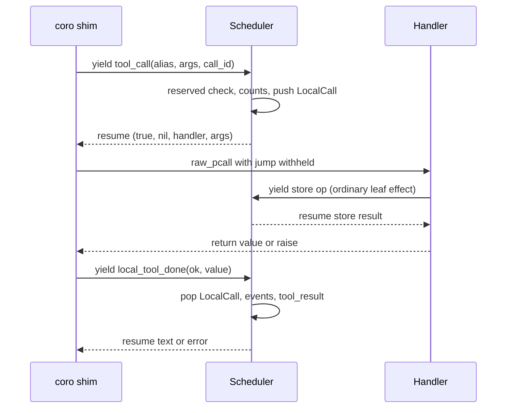

# Run local tool handlers inside the block coroutine

All paths are relative to the `promptforge` repository root.

<product-contract>

## Product Requirements

A local tool's handler cannot use `store`, `tools.call`, or any other call that suspends. The handler runs as a plain Rust-to-Lua call outside the block coroutine, while every one of those calls works by yielding. The fix moves the handler call into the Lua shim, inside the block coroutine, so the handler's own yields reach the driver like any other. Everything a local tool does today keeps working the same way.

- Problem and users:
  - Prompt authors who write `tools['add_local']` handlers, such as the decision-tool recipe, can't read or write the store from the handler. The language guide promises they can: "The handler can use `store` and section-global variables, but it cannot call `jump`" (`guide/src/language/07-tools.md` line 66).
  - How it breaks today, step by step:
    - `add_local` stores the handler under a registry key (`crates/promptforge-internal/lua/src/tools.rs` lines 235-238).
    - The scheduler recognizes a local alias and answers it inline on the driver thread (`crates/promptforge-internal/engine/src/execute/scheduler/tool_call.rs` lines 194-207).
    - The handler then runs through `handler.call(table)` on the VM's main state, never inside a coroutine (`crates/promptforge-internal/lua/src/vm.rs` lines 196-200).
    - After the shared-library replay, section setup replaces every `store` function with a shim that yields (`crates/promptforge-internal/engine/src/execute/section_vm.rs` lines 149-155; `crates/promptforge-internal/lua/src/__impl_coro.lua` lines 285-291).
    - Any store call from the handler therefore fails with "attempt to yield from outside a coroutine".
  - `tools.call` fails the same way, because it also yields (`crates/promptforge-internal/lua/src/__impl_coro.lua` lines 120-124).
- Goals:
  - A handler can call `store.*`, `tools.call`, `models.infer`, `call`, `tasks.*`, and `user_input`, whether a model or a script invoked the local tool.
  - Every existing local-tool behavior listed under the Functional Specification is kept.
- Non-goals:
  - Letting a handler call `jump`.
  - Changing how local tools are advertised, their alias rules, or their parameter schemas.
  - Adding a recursion guard for handlers that call each other.
- Success criteria:
  - A handler's store round trip works both under `models.loop` and through a script `tools.call`.
  - A handler can call a bound tool and another local tool.
  - Every existing local-tool test passes unchanged.
- Constraints:
  - The scheduler stays the single authority on three things: reserved-name priority, call counting, and tool-call events.
  - The facade's public API does not change. `ToolCallOutcome` and `Request` are internal to the lua crate and do not appear in `crates/promptforge/public-api.txt`.
  - The behavior change ships with its tests in the same change.
- Open questions: None

## Functional Specification

A local tool call goes through two steps in the scheduler, with the handler running in Lua in between. When the call arrives, the scheduler resolves and counts it and hands the handler back to the shim. After the handler finishes, the scheduler reports the result. Between those two steps the handler is ordinary Lua inside the block coroutine and can use any suspending call. The error, trust, and counting rules below match today's behavior, except where they are marked new.

- Actors and workflows:
  - The prompt author registers a handler with `tools['add_local'](name, description, params, fn)`.
  - The model calls it during `models.loop` (a model-issued call, which carries the model's call id), or the author's script calls it with `tools.call(alias, args)` (a script call, which has no id).
  - The handler runs inside the block coroutine of the chain that made the call.
  - New: the handler may call any suspending API. A handler's own `tools.call` is always a script call, even when the local tool itself was called by the model.
- Inputs and outputs:
  - The handler receives a fresh Lua table converted from the call's JSON arguments, never the script caller's own table.
  - Return values:
    - Only the first return value counts.
    - nil becomes `""`.
    - A string, integer, number, or boolean becomes its string form.
    - Any other type fails the call.
  - The returned text goes back to the caller, or to the model, verbatim and marked trusted.
- States and validation:
  - The five reserved names `task`, `task_cancel`, `task_status`, `task_events`, and `await_tasks` are checked before any alias lookup. A script call to one of them is refused as unbound, even when a local tool is registered under that name.
  - The call is counted in `tools.calls` when it is dispatched, before the handler runs.
  - `jump` is nil while the handler runs, and it is restored when the handler returns or raises. Nested local calls restore it correctly.
  - While the handler is parked on a store call, `tasks.status` reports the chain as blocked on `store`.
- Errors and recovery:
  - A handler that raises:
    - `TOOL_CALL_FAILED` is reported.
    - The handler's own raised value is raised again at the call site, for script and model-issued calls alike, so `models.loop` ends unless the author wraps it in `pcall`.
    - New: a structured error table keeps its `kind` when it reaches an author `pcall`.
  - A handler that returns an unsupported type: `TOOL_CALL_FAILED` is reported, and the call raises "cannot return a table as a result", or the matching message for the actual type.
  - New: when a handler calls a bound tool and that tool fails, the failure raises inside the handler as kind `tool`, because the handler's call is a script call. The failure is not turned into untrusted text, and no `tool_result` fires under the outer call id.
  - A store error inside the handler raises inside the handler, as it does anywhere else in the script.
- Security and privacy behavior:
  - The handler's output stays trusted, with no untrusted-input wrapper, as today.
  - Untrusted output from a bound tool that the handler calls reaches the handler already wrapped. If the handler returns that text, the wrapper goes with it.
  - A local tool call never becomes an `Effect::ToolCall`. Store and bound-tool calls made inside the handler become ordinary effects and are journaled.
- Acceptance criteria:
  - A handler that writes and then reads the store returns the stored text, both to the model and to a script caller.
  - A handler's call to the `echo_tools()` bound tool succeeds, both calls are counted, and exactly one leaf request is issued.
  - All existing local-tool tests pass unchanged.

</product-contract>
<implementation-contract>

## Technical Design

The shim still yields `tool_call` for every tool call. For a local alias, the scheduler now answers with the handler instead of its result. The shim calls the handler under a yield-safe `pcall` with `jump` withheld, then yields a new `local_tool_done` request so the scheduler can report the result. The scheduler keeps a stack of in-flight local calls on the section frame, so the second yield only has to carry the result.

- Architecture:

  - Why this is possible:
    - `pcall` inside a coroutine can yield on Lua 5.5, which the workspace uses (`Cargo.toml` line 113, `mlua` feature `lua55`). The prelude already depends on this (`crates/promptforge-internal/lua/src/__impl_coro.lua` lines 64-65).
    - The shim calling the handler is a Lua-to-Lua call inside the coroutine, so there is no C boundary to block the yields.
  - Each section frame owns its own VM (`crates/promptforge-internal/engine/src/execute/section_context.rs` lines 53-58), so withholding `jump` affects only the chain that is running the handler.
- Modules and interfaces:
  - Handler storage, in the lua crate:
    - `install_tools` creates one handler table per VM under a named registry key, and `add_local` writes `handlers[alias] = fn` into it.
    - `LocalTools` keeps only `(alias, schema)` pairs, which still serve `contains` and `schemas` (`crates/promptforge-internal/lua/src/vm.rs` lines 106-161).
    - `LocalTools::call` and `SectionVm::call_local_tool` are removed.
  - Protocol answer:
    - `ToolCallOutcome::Local { alias, args }` resumes as `(true, nil, handler, args_table)`.
    - The handler is read from the registry table; a missing entry is an internal error.
    - `args` is converted from JSON with `lua.to_value`.
    - Bound-tool outcomes keep resuming as `(true, result)`.
  - Protocol request:
    - A new `local_tool_done` op is parsed into `Request::LocalToolDone { outcome }`, where `LocalToolOutcome` is `Returned(String)`, `BadReturn(Error)`, or `Raised`.
    - The shim sets every field, so a wrong shape is a malformed yield, never an error at the author's call site.
    - `ok` must be a boolean. When `ok` is true, the existing `scalar_return` rule applies (`crates/promptforge-internal/lua/src/hardening.rs` lines 197-202). When `ok` is false, the outcome is `Raised`.
  - Prelude (`crates/promptforge-internal/lua/src/__impl_coro.lua`, the Lua shims installed into every section VM):
    - `tools_call` and the model-issued form both go through one `dispatch_tool` helper.
    - When the resume includes a handler, `run_local_tool` does the rest:
      - It saves `jump` through a new `swap_jump` capture and calls `raw_pcall(handler, args)`.
      - It restores `jump`, then yields `local_tool_done`, setting `value` only when `ok` is true.
      - Finally, it raises the handler's own failure again with `error(value, 0)`, or `fail`s a rejected return, or returns the text.
    - `install_shim_prelude` passes the `swap_jump` capture, a raw get and set of the global `jump` that returns the old value (`crates/promptforge-internal/lua/src/coro.rs` lines 144-252).
  - Scheduler:
    - The section frame gains a `local_calls` stack of `LocalCall { alias, call_id, report }`.
    - In the local branch of `prepare_tool_call`, counting stays as it is. The branch then pushes the `LocalCall` after every step that can fail, and answers `Local`.
    - A new `dispatch_local_tool_done` replaces `answer_local_tool` (`crates/promptforge-internal/engine/src/execute/scheduler/tool_call.rs` lines 80-114). It pops the `LocalCall`; an empty stack is an internal error. Then:
      - `Returned`: report `TOOL_CALL_SUCCEEDED`, emit a trusted `tool_result` under the call id (or `""`), and answer `Plain(text)`.
      - `BadReturn`: report `TOOL_CALL_FAILED` and answer with the error.
      - `Raised`: report `TOOL_CALL_FAILED` and answer `Plain("")`. The shim ignores this answer and raises the handler's own value.
    - `dispatch.rs` routes the new request, and its blocked-state mapping is none (`crates/promptforge-internal/engine/src/execute/scheduler/dispatch.rs` lines 88-105 and 194-201).
- File and public API changes:
  - Lua crate:
    - `crates/promptforge-internal/lua/src/tools.rs`
    - `crates/promptforge-internal/lua/src/vm.rs`
    - `crates/promptforge-internal/lua/src/coro.rs`
    - `crates/promptforge-internal/lua/src/__impl_coro.lua`
    - `crates/promptforge-internal/lua/src/protocol/answer.rs`
    - `crates/promptforge-internal/lua/src/protocol/render.rs`
    - `crates/promptforge-internal/lua/src/protocol/request.rs`
    - `crates/promptforge-internal/lua/src/protocol/parse.rs`
  - Engine:
    - `crates/promptforge-internal/engine/src/execute/section_context.rs` and its `section_context-construct.rs` sibling
    - `crates/promptforge-internal/engine/src/execute/scheduler/tool_call.rs`
    - `crates/promptforge-internal/engine/src/execute/scheduler/dispatch.rs`
  - Docs:
    - `guide/src/language/07-tools.md`
    - `guide/promptforge-language-guide.md`
  - No change to the facade or to `crates/promptforge/public-api.txt`.
- Data, persistence, failure, security, and privacy constraints:
  - Store and bound-tool calls made inside a handler become ordinary effects, recorded in the journal. A replay answers them from the journal and runs the handler again.
  - The handler's failure is raised again unchanged. A failure raised from a Rust callback stays in mlua's own form, so the host's runtime-error mapping keeps its source.
  - `tool_result` reports the model turn recorded when the call was dispatched, even if the handler runs model rounds of its own.

</implementation-contract>
<verification-contract>

## Testing Plan

Lua crate unit tests pin the new protocol shapes. A shim-level walk pins the handshake's order of yields. Engine behavior tests cover what authors can now do from a handler and what stays refused. Every existing local-tool test must pass unchanged.

- Unit:
  - Parse tests for `local_tool_done`:
    - A returned string, integer, or boolean becomes its text.
    - nil becomes `""`.
    - A table becomes `BadReturn`, with the message "cannot return a table as a result".
    - `ok = false` becomes `Raised`.
    - A missing or non-boolean `ok` is a malformed yield.
  - Render test: `ToolCallOutcome::Local` resumes as `(true, nil, handler, args)`, and an alias with no registered handler is an error.
  - Update `local_tools_schema_and_membership_reads_fail_closed_on_poison` (`crates/promptforge-internal/lua/src/tests.rs` lines 1756-1780) to the `(alias, schema)` entry type. It must still fail closed.
- Integration and end-to-end:
  - Shim walk: drive one block through `tool_call`, then a `Local` answer, then a `store` yield from inside the handler, then `local_tool_done`, then the block's return. The `parse_request` and `resume_with` helpers in `crates/promptforge-internal/engine/src/lua/tests/quota.rs` lines 45-60 show the pattern.
  - In `crates/promptforge-internal/engine/src/execute/tests/local_tools.rs`: a `models.loop` handler that runs `store.write` then `store.read` sends the stored text back to the model.
  - In `crates/promptforge-internal/engine/src/execute/tests/tool_call_arm.rs`: a script `tools.call` to a local tool whose handler uses `store`.
  - A handler that calls `jump` still fails the run. In a separate case, `jump` works in the same block after `models.loop` returns.
  - A handler that returns a table raises "cannot return a table as a result", and `TOOL_CALL_FAILED` is observed.
  - A handler that calls a second local tool through `tools.call` reports both `tool_result` events with the right ids, innermost call first.
  - A handler that calls a bound tool, in `tool_call_arm.rs`:
    - Fixtures: `echo_tools()` binds alias `echo` with its implementation registered (`crates/promptforge-internal/engine/src/execute/tests/models_loop.rs` lines 76-88). `failing_tools()` binds alias `fail`, whose backend always fails (`crates/promptforge-internal/engine/src/execute/tests/tool_call_arm.rs` lines 64-97). Both are passed as the tools argument to `tool_context`.
    - Success: a script `tools.call('grab', ...)` whose handler calls `tools.call('echo', ...)` returns the echo text. `tools.calls.grab` and `tools.calls.echo` are both 1, and `leaf_requests_issued()` is 1.
    - That count is exact because the counter increments for every effect issued through `Scheduler::issue`, whatever its kind (`crates/promptforge-internal/engine/src/execute/scheduler/test_hooks.rs` lines 18-22; `crates/promptforge-internal/engine/src/execute/scheduler.rs` lines 467-474). The one leaf request is the echo call, so the local call itself issued nothing.
    - Failure inside a model-issued call: `tools.call_as_model('call_1', 'grab', ...)` whose handler runs `pcall(tools.call, 'fail', {})` sees `err.kind == 'tool'`, and the inner failure fires no `tool_result` under `call_1`.
- Regression, security, and performance:
  - These existing tests must pass without edits:
    - In `crates/promptforge-internal/engine/src/execute/tests/local_tools.rs`: result returned to the model, several calls in one response, a handler error still reporting `TOOL_CALL_FAILED` and ending the loop after one gateway call, and the two alias-collision tests.
    - In `crates/promptforge-internal/engine/src/execute/tests/tool_call_arm.rs` lines 222-333: no leaf work for a local call, trusted `tool_result` with and without a call id, and reserved names winning over a local registration.
    - The local-tool tests in `models_loop.rs`, `chat_scope.rs`, and `scheduler/live_h1.rs` under `crates/promptforge-internal/engine/src/execute/tests/`.
  - Security: the handler's output stays trusted, and a bound tool's untrusted output stays wrapped when it passes through a handler.
  - Performance: each local call adds one inline yield and resume. No performance test is needed.
- Exit criteria:
  - Every check passes: the workspace test suite and doctests, clippy with warnings denied, the formatter check, rustdoc with warnings denied, and the user guide book build.

</verification-contract>
<decision-record>

## Decision Record

- Decisions:
  - Run the handler from the Lua shim inside the block coroutine.
    - Rationale: it reuses the existing shim and yield machinery, and needs no second coroutine per chain.
    - User's words: "Yeah I was thinking 1. Dispatch local tools in Lua."
  - Keep reserved-name priority, counting, and events in the scheduler, using two yields.
    - Rationale: the priority rule stays in one place. The alternative of checking and counting in Lua would duplicate it.
    - User's words: none; this was a design default.
  - Handlers may call every suspending API, including `tools.call` for bound and local tools.
    - Rationale: running inside the coroutine enables all of them at no extra cost, and restricting them would need new machinery.
    - User's words: "can a local tool call tools?", then "yes" to adding the bound-tool test.
  - Keep `jump` withheld inside handlers.
    - Rationale: the language guide documents that a handler "cannot call `jump`" (`guide/src/language/07-tools.md` line 66), and today's code enforces it by setting `jump` to nil (`crates/promptforge-internal/lua/src/vm.rs` lines 197-203).
    - User's words: none; this keeps the documented contract.
  - Track in-flight local calls on a stack in the section frame.
    - Rationale: it handles nested local calls, keeps each call's identity out of the fields the shim produces, and keeps the reported turn correct when a handler runs its own model rounds.
    - User's words: none; this was a design default.
  - Catch the handler's failure with `raw_pcall` and raise the same value again.
    - Rationale: structured error tables keep their `kind`, and failures from Rust callbacks keep their source for the host's error mapping.
    - User's words: none; this was a design default.
  - Keep the `local_tool_done` parse arm in `crates/promptforge-internal/lua/src/protocol/parse.rs`, even though the file grows past 500 lines.
    - Rationale: the lua crate is not under the 500-line file ceiling. A third `parse-*` sibling file would force the protocol folder into a subdirectory layout.
    - User's words: none.
- Rejected alternatives:
  - Running the handler as its own coroutine started by the scheduler.
    - Reason: each chain frame would need a stack of threads, plus a new continuation variant.
    - Revisit if handlers ever need to run somewhere with no block coroutine.
  - Having the shim decide locally, with a Lua-side reserved-name check and counting through Rust callbacks.
    - Reason: it duplicates the reserved-name priority rule.
    - Revisit if the extra yield per local call shows up in profiles.
  - Echoing the alias, call id, and turn back through `local_tool_done` fields instead of using a frame stack.
    - Reason: the turn would be wrong when a handler runs model rounds, and call identity would ride on fields the shim produces.
    - Revisit if the frame stack proves awkward.
  - Restricting handlers to `store` only.
    - Reason: it needs a new guard mechanism and has no clear benefit.
    - Revisit if a nested suspending call inside a handler causes a real problem.
  - Passing the script caller's own args table to the handler.
    - Reason: the handler could then modify the caller's table, and model-issued and script calls would behave differently.
    - Revisit: never.
- Assumptions, risks, and notes:
  - Accepted tradeoff: when a handler fails, the traceback tail starts where the shim raises the value again, not inside the handler. The error message still starts with the handler's own position prefix, which the line mapper rewrites.
  - Instruction-budget and cancellation errors raised inside a handler are caught by the shim's `raw_pcall` and raised again unchanged after the `local_tool_done` yield.
  - A suspending call still cannot yield through a C function, such as a `table.sort` comparator or a metamethod. This limitation already exists and is unchanged.
  - The doc comment on `LocalTools::call` lists only `call`, `fanout`, and `models.infer` as off limits (`crates/promptforge-internal/lua/src/vm.rs` lines 175-177). It goes away with that method. The module docs in `tool_call.rs`, `coro.rs`, `request.rs`, and `answer.rs` must describe the handshake.
  - `guide/promptforge-language-guide.md` is generated from the chapter files by `cargo run -p build-user-guide` and is never edited by hand. Regenerate it after changing `07-tools.md`.
  - Replay: store and bound-tool calls inside a handler are answered from the journal, and the handler runs again. The handler must therefore be deterministic given its inputs, which is already true of section Lua.

### Deferred and Out of Scope

- Deferred: a depth cap for handlers that recurse through `tools.call`. Revisit if a real prompt hits runaway recursion; until then, the Lua stack and memory limits end the run.
- Deferred: keeping the handler's own frames in the failure traceback. Revisit if diagnosing handler failures proves hard in practice.
- Out of scope: letting handlers call `jump`.
- Out of scope: changing how local tools are advertised, their alias rules, or their parameter schemas.

</decision-record>
<project-survey>

## Project Survey

- Status: complete
- Build command: `cargo build --locked -p gateway` (the workspace default member); the desktop app is `cargo build --locked -p workshop`. There is no workspace-wide build step: the clippy runs below are the compile gate, and AGENTS.md forbids a standalone `cargo check --workspace` beside them.
- Focused test command pattern: `cargo nextest run --locked -p <crate> --all-features <test_name_substring>`. For `workshop`, `workshop-server`, and `workshop-server-api`, drop `--all-features`. To target only a crate's integration binary, add `--test it` (`--test suite` for the `promptforge` facade).
- Component test command pattern: `cargo nextest run --locked -p <crate> --all-features`, then `cargo test -p <crate> --all-features --doc` because nextest skips doctests. For the workshop trio: `cargo nextest run --locked -p workshop -p workshop-server -p workshop-server-api` and `cargo test --doc -p workshop -p workshop-server -p workshop-server-api`.
- Full-suite test command: `cargo nextest run --locked --workspace --exclude workshop --exclude workshop-server --exclude workshop-server-api --all-features`, then `cargo test --workspace --exclude workshop --exclude workshop-server --exclude workshop-server-api --all-features --doc`, then the workshop trio separately with `cargo nextest run --locked -p workshop -p workshop-server -p workshop-server-api`.
  - The workspace run includes `build-xtask`, the boundary and structural harness (tier graph, `## Invariants` marker, 500-line ceiling, product-boundary matrix).
  - UI partition, only when TypeScript changes: `npm run typecheck`, `npm run build`, `npm test` in `crates/workshop/ui` and in `crates/gateway/config-ui/ui`.
- Linter command: `cargo clippy --workspace --exclude workshop --exclude workshop-server --exclude workshop-server-api --all-targets --all-features -- -D warnings`; workshop trio: `cargo clippy -p workshop -p workshop-server -p workshop-server-api --all-targets -- -D warnings`.
  - Headless feature gate (the one allowed standalone check): `cargo check -p gateway --no-default-features`.
  - Facade surface, only when the `promptforge` facade changes: `cargo +<pinned nightly> xtask api --check`, with the nightly named in `crates/build-xtask/src/api/toolchain.rs`.
- Formatter check command: `cargo fmt --all --check` (rustfmt `style_edition = "2024"`; also the pre-commit hook).
- Docs command: with `RUSTDOCFLAGS` set to `-D warnings` (PowerShell: `$env:RUSTDOCFLAGS = "-D warnings"`), run `cargo doc --workspace --no-deps --all-features --exclude workshop --exclude workshop-server --exclude workshop-server-api`, then the facade with default features `cargo doc -p promptforge --no-deps`, then the user guide `cargo xtask site --books-only`.
- Test placement and naming conventions:
  - Unit tests live in the crate under `#[cfg(test)]`, in one of three shapes that follow the flat-directory rule: a small inline `mod tests { use super::*; ... }`; a kebab sibling `foo-tests.rs` wired as `#[cfg(test)] #[path = "foo-tests.rs"] mod tests;`; or, for larger suites, a `foo/tests/` subdirectory of topic files wired by `#[cfg(test)] mod tests;` in `foo.rs` (for example `engine/src/execute/tests/`, `engine/src/lua/tests/`, `lua/src/protocol/tests/`).
  - Test-only helpers sit in a `test_support` module (engine `src/test_support.rs` plus `src/test_support/`) or a `tests-*.rs` sibling (lua `tests-recording.rs`); crate-private test hooks are `#[cfg(test)]` methods named `*_for_test`.
  - Integration tests are one binary per crate at `tests/it/main.rs` with sibling topic modules; the `promptforge` facade uses `tests/suite/`. Shared helpers go in `support.rs`, `fixtures.rs`, or `common/`. Prompt-program fixtures are `.md` files under `tests/prompts/{valid,invalid,execution}/`.
  - Test files are snake_case topic names (`tool_call_arm.rs`, `models_loop.rs`); test functions are snake_case sentences stating the behavior (`a_shim_yield_suspends_and_resumes_across_pcall`). `unwrap` and `expect` are allowed in tests only (`clippy.toml`).
  - Behavior changes ship with tests in the same change; existing product and behavior tests are preserved through refactors.
- Directory map:
  - `crates/`: every Rust crate. The root holds the public layer (`promptforge`, `harness-api`, `gateway-api-types`, `gateway-api-discovery`, `shared-error-source`, `shared-loopback`), `build-*` tooling (`build-xtask`, `build-ui`, `build-workshop`, `build-user-guide`, `build-llama-cuda`), `workspace-hack` (cargo-hakari), and `shared-ui` (a TypeScript and CSS package, not a crate).
  - `crates/promptforge-internal/`: private engine family (`engine`, `lua`, `parser`, `store`, `vfs`, `model-client`, `types`).
  - `crates/gateway/`: private gateway family (`app` is package `gateway`, plus `cloud-providers`, `config`, `config-ui` with its `ui/` SPA, `local`, `logging`, `progress`, `protocol`, `routing`, `web-search`, and the nested `stt/` subsystem).
  - `crates/harness/`: private harness family (`runner`, `models`, `capabilities`, `log`, `sessions`, `web`, `webfetch`, `web-search`).
  - `crates/workshop/`: private workshop family (`desktop` is the Tauri app, package `workshop`; `server`, `server-api`, `gateway`, `menu`, `protocol`, `registry`, `status`, `support`, `user-state`, `workspace`; `ui/` is the npm and esbuild SPA).
  - `guide/`: user guide sources (`src/{language,gateway,workshop}`, `books`, `landing`, `chrome`), built by `cargo xtask site`.
  - `prompts/`: sample prompt programs. `tools/`: Node scripts (gateway sidecar staging, live TTS check) with `.test.mjs` tests, plus a dokuman tool file. `images/`: README banners.
  - `vibe/`: planning workspace (`archdoc.md`, dated monthly folders, `scratch/`).
  - `.github/workflows/`: `ci.yml` is the merge gate (fmt, clippy, test, docs, workshop on Windows and Linux, UI, supply chain, API surface); the rest are release, nightly, Miri, and native-library jobs. `.githooks/`: pre-commit runs fmt; pre-push runs the headless gateway check, clippy, and `cargo deny`.
  - `.config/`: `nextest.toml` (timeouts, heavy STT test group) and `hakari.toml`. `.cargo/config.toml`: `rust-lld` and static CRT on Windows, `xtask` and `workshop` aliases.
  - Root files: `Cargo.toml` (workspace members, dependencies, lints), `deny.toml`, `clippy.toml`, `rustfmt.toml`, `rust-toolchain.toml` (stable), `dist-workspace.toml` (cargo-dist for the gateway only), `AGENTS.md` (repository policy).
  - Local only and gitignored: `local/` (operator profiles, prompts, stores, STT fixtures), `target/`, `target-msrv/`.
- Component boundaries:
  - PromptForge: `promptforge` is the one public crate, a facade over `crates/promptforge-internal/`. Inside, the engine (sans-I/O executor: no I/O, no clock, host interface `Run::new`, `step`, `resume`, `cancel`) depends on lua, parser, store, model-client, and types; store depends on vfs; the Lua VM boundary depends on store and the wire vocabulary only and answers every suspending author function through a yielded `Request`. The family depends on no gateway, workshop, or harness crate.
  - Harness: `harness-api` is the only public surface over `crates/harness/`; harness crates may depend on `promptforge`, the gateway public pair, and shared-* crates, never on workshop crates or private gateway crates.
  - Gateway: the public pair `gateway-api-types` and `gateway-api-discovery`; everything else is private under `crates/gateway/`. Gateway crates depend on no promptforge or workshop crate.
  - Workshop: private under `crates/workshop/`; may name `promptforge`, the gateway public pair, and `harness-api` only. The desktop app depends on `workshop-server-api`, never on `workshop-server`. Internal tiers flow one way: server, then features, then services, then vocabulary.
  - Shared: shared-* crates depend on no product crate.
  - Composed rule: a crate in a family container may depend only on crates at the `crates/` root and its own siblings; `build-*` crates are exempt. The rules bind normal, dev, build, and target-specific dependencies (one exception: promptforge-internal crates may dev-depend on `promptforge` for doc examples only), and `cargo test -p build-xtask` enforces them.
- Conventions summary:
  - Rust edition 2024 on stable, resolver 3; every dependency is declared once in `[workspace.dependencies]` with a comment justifying any pin or feature choice, and every member inherits `workspace-hack`.
  - Workspace lints: `unsafe_code` forbidden outside owned boundaries, `missing_docs`, `missing_debug_implementations`, and `unreachable_pub` warn, clippy `all` and `pedantic` deny, `unwrap_used` and `expect_used` deny outside tests, broken or private intra-doc links deny. Every unsafe block documents its safety invariants immediately before it.
  - Source directories are flat: a subdirectory needs at least three files, otherwise use kebab siblings `foo-bar.rs` wired with `#[path = "foo-bar.rs"] mod bar;`; convert either direction when touching a group on the wrong side of the line.
  - Every workshop-* and harness-* `lib.rs` opens with a `//!` doc containing a `## Invariants` marker listing allowed and forbidden dependencies; no file in a marker crate exceeds 500 lines (split before editing).
  - Error and status messages are written for model consumption: concise, factual, self-contained, naming required versus actual.
  - Comments explain only non-obvious constraints, ordering, or workarounds; workarounds cite an upstream issue URL.
  - Run-log and replay JSON round-trips exactly (canonical sorted keys, finite numbers, `float_roundtrip`, never `preserve_order`).
  - Cargo features gate real constraints (toolchains, heavy native builds), never product shape; library and serve paths return failures instead of exiting or installing process-global state.
  - Prefer types and compiler checks, then behavior tests; new structural checks (parsers, allowlists, counts, topology checks) need explicit user approval, and plans cannot introduce them otherwise.
  - Design order: reuse an existing facility, then make the smallest improvement to one, then add a new facility only with material benefit.
  - SPA: CSS sits beside its TypeScript, component CSS uses `--ws-*` tokens only, and no `localStorage` (persisted UI state goes through the server).

</project-survey>
<execution-plan>

## Execution Instructions

<step-1>

### Step 1: Run local tool handlers inside the block coroutine [completed]

- Component: `none`
- Goal: a `tools['add_local']` handler runs inside the calling chain's block coroutine, so it can call `store.*`, `tools.call`, `models.infer`, `call`, `tasks.*`, and `user_input`, whether a model or a script invoked the local tool. Every existing local-tool behavior stays the same. The code, its tests, and the module docs land in one commit, because the handler table, protocol, prelude, and scheduler changes only compile and pass together.
- Build order inside the step: handler table first (rendering `Local` reads it), then the protocol additions, then the prelude and scheduler, then the tests.
- Handler storage, lua crate:
  - `crates/promptforge-internal/lua/src/tools.rs`: `install_tools` creates one handler table per VM under a named registry key, and `add_local` writes `handlers[alias] = fn` into it.
  - `crates/promptforge-internal/lua/src/vm.rs`: `LocalTools` keeps only `(alias, schema)` entries, which still serve `contains` and `schemas`. Remove `LocalTools::call` and `SectionVm::call_local_tool`.
- Protocol, lua crate:
  - `crates/promptforge-internal/lua/src/protocol/answer.rs`: add `ToolCallOutcome::Local { alias, args }`.
  - `crates/promptforge-internal/lua/src/protocol/render.rs`: render `Local` as the resume `(true, nil, handler, args_table)`. Read the handler from the registry table (a missing entry is an internal error) and convert `args` from JSON with `lua.to_value`, so the handler always gets a fresh table. Bound-tool outcomes keep resuming as `(true, result)`.
  - `crates/promptforge-internal/lua/src/protocol/request.rs`: add `Request::LocalToolDone { outcome }` and `LocalToolOutcome` with `Returned(String)`, `BadReturn(Error)`, and `Raised`.
  - `crates/promptforge-internal/lua/src/protocol/parse.rs`: add the `local_tool_done` arm in this file, not in a new `parse-*` sibling. `ok` must be a boolean, otherwise the yield is malformed. When `ok` is true, apply the existing `scalar_return` rule from `hardening.rs` to `value`; when `ok` is false, the outcome is `Raised`.
- Prelude, lua crate:
  - `crates/promptforge-internal/lua/src/__impl_coro.lua`: add `dispatch_tool`, and route both `tools_call` and the model-issued form through it. Add `run_local_tool`, which runs when the resume carries a handler: it sets `jump` to nil through `swap_jump` and keeps the old value, calls `raw_pcall(handler, args)`, restores `jump`, yields `local_tool_done` with `value` set only when `ok` is true, and then re-raises the handler's own value with `error(value, 0)`, `fail`s a rejected return, or returns the text.
  - `crates/promptforge-internal/lua/src/coro.rs`: `install_shim_prelude` passes the new `swap_jump` capture, a raw get and set of the global `jump` that returns the old value.
- Scheduler, engine crate:
  - `crates/promptforge-internal/engine/src/execute/section_context.rs` and `section_context-construct.rs`: add a `local_calls` stack of `LocalCall { alias, call_id, report }` to the section frame, starting empty.
  - `crates/promptforge-internal/engine/src/execute/scheduler/tool_call.rs`: in the local branch of `prepare_tool_call`, keep the reserved-name check and counting as they are, push the `LocalCall` after every step that can fail, and answer `Local`. Replace `answer_local_tool` with `dispatch_local_tool_done`, which pops the `LocalCall` (an empty stack is an internal error) and then:
    - `Returned`: reports `TOOL_CALL_SUCCEEDED`, emits a trusted `tool_result` under the call id (or `""`) with the model turn recorded at dispatch, and answers `Plain(text)`.
    - `BadReturn`: reports `TOOL_CALL_FAILED` and answers with the error.
    - `Raised`: reports `TOOL_CALL_FAILED` and answers `Plain("")`, which the shim ignores before raising the handler's own value.
  - `crates/promptforge-internal/engine/src/execute/scheduler/dispatch.rs`: route `Request::LocalToolDone` to `dispatch_local_tool_done`, and map it to no blocked state (`None`).
- Rules the change must keep:
  - The five reserved names `task`, `task_cancel`, `task_status`, `task_events`, and `await_tasks` are checked before alias lookup. A script call to one of them is refused as unbound, even with a local registration under that name.
  - The call counts in `tools.calls` at dispatch, before the handler runs.
  - Only the handler's first return value counts. nil becomes `""`; a string, integer, number, or boolean becomes its string form; any other type fails with "cannot return a table as a result" or the matching message for the actual type.
  - The returned text goes back verbatim and trusted. A local call never becomes an `Effect::ToolCall`. Store and bound-tool calls inside the handler are ordinary journaled effects; replay answers them from the journal and runs the handler again.
  - `jump` is nil while the handler runs and is restored on return or raise, including across nested local calls.
  - While the handler is parked on a store call, `tasks.status` reports the chain as blocked on `store`.
  - A raising handler reports `TOOL_CALL_FAILED`, and its own value is raised again at the call site for script and model-issued calls alike, so `models.loop` ends unless the author wraps it in `pcall`. A structured error table keeps its `kind`; a failure from a Rust callback stays in mlua's form so the host's error mapping keeps its source.
  - A handler's own `tools.call` is always a script call. A failing bound tool raises inside the handler as kind `tool`, is not turned into untrusted text, and fires no `tool_result` under the outer call id. A bound tool's untrusted output reaches the handler already wrapped and keeps the wrapper if the handler returns it.
  - Local-tool advertising, alias rules, and parameter schemas do not change. The facade and `crates/promptforge/public-api.txt` do not change.
- Module docs: describe the two-yield handshake in the module docs of `tool_call.rs`, `vm.rs`, `coro.rs`, `request.rs`, and `answer.rs`. The old doc comment on `LocalTools::call` goes away with the method.
- Tests, in the same commit:
  - `crates/promptforge-internal/lua/src/protocol/tests/parse.rs`: `local_tool_done` with a returned string, integer, or boolean becomes its text; nil becomes `""`; a table becomes `BadReturn` with "cannot return a table as a result"; `ok = false` becomes `Raised`; a missing or non-boolean `ok` is a malformed yield.
  - `crates/promptforge-internal/lua/src/protocol/tests/answer.rs`: `ToolCallOutcome::Local` resumes as `(true, nil, handler, args)`, and an alias with no registered handler is an error.
  - `crates/promptforge-internal/lua/src/tests.rs`: move `local_tools_schema_and_membership_reads_fail_closed_on_poison` to the `(alias, schema)` entry type. It must still fail closed.
  - `crates/promptforge-internal/engine/src/lua/tests/shims.rs`: a shim walk that drives one block through `tool_call`, then a `Local` answer, then a `store` yield from inside the handler, then `local_tool_done`, then the block's return. Follow the `parse_request` and `resume_with` pattern in `crates/promptforge-internal/engine/src/lua/tests/quota.rs`.
  - `crates/promptforge-internal/engine/src/execute/tests/local_tools.rs`:
    - A `models.loop` handler that runs `store.write` then `store.read` sends the stored text back to the model.
    - A handler that calls `jump` still fails the run. In a separate case, `jump` works in the same block after `models.loop` returns.
    - A handler that returns a table raises "cannot return a table as a result", and `TOOL_CALL_FAILED` is observed.
  - `crates/promptforge-internal/engine/src/execute/tests/tool_call_arm.rs`:
    - A script `tools.call` to a local tool whose handler uses `store` returns the stored text.
    - Nested local: `tools.call_as_model('call_1', 'outer', ...)` whose handler calls a second local tool through `tools.call` reports both `tool_result` events with the right ids, innermost call first.
    - Bound-tool fixtures: pass `echo_tools()` (alias `echo`, from `models_loop.rs`) and `failing_tools()` (alias `fail`, whose backend always fails) as the tools argument to `tool_context`.
    - Bound-tool success: a script `tools.call('grab', ...)` whose handler calls `tools.call('echo', ...)` returns the echo text, `tools.calls.grab` and `tools.calls.echo` are both 1, and `leaf_requests_issued()` is 1. The count is exact because the counter increments for every effect issued through `Scheduler::issue`, so the one leaf request is the echo call and the local call issued nothing.
    - Bound-tool failure inside a model-issued call: `tools.call_as_model('call_1', 'grab', ...)` whose handler runs `pcall(tools.call, 'fail', {})` sees `err.kind == 'tool'`, and the inner failure fires no `tool_result` under `call_1`.
    - Security: the handler's returned text stays trusted with no untrusted-input wrapper, and a bound tool's untrusted output keeps its wrapper when the handler returns it. `EchoTool` returns trusted output, so for the wrapper case bind `UntrustedEchoTool` (`crates/promptforge-internal/engine/src/execute/tests/fixtures.rs` line 64) with `always_tool(alias, Arc::new(UntrustedEchoTool))` from `models_loop.rs`, and assert the handler's returned text still carries the `<untrusted_input_` markers.
  - These existing tests must pass without edits:
    - `local_tools.rs`: result returned to the model, several calls in one response, a handler error reporting `TOOL_CALL_FAILED` and ending the loop after one gateway call, and the two alias-collision tests.
    - `tool_call_arm.rs`: no leaf work for a local call, trusted `tool_result` with and without a call id, and reserved names winning over a local registration.
    - The local-tool tests in `models_loop.rs`, `chat_scope.rs`, and `scheduler/live_h1.rs` under `crates/promptforge-internal/engine/src/execute/tests/`.
- Verification:
  - `cargo nextest run --locked -p promptforge-lua -p promptforge-engine --all-features`, then `cargo test -p promptforge-lua -p promptforge-engine --all-features --doc`.
  - `cargo clippy --workspace --exclude workshop --exclude workshop-server --exclude workshop-server-api --all-targets --all-features -- -D warnings` and `cargo fmt --all --check`.
  - With `RUSTDOCFLAGS` set to `-D warnings`, `cargo doc -p promptforge-lua -p promptforge-engine --no-deps --all-features`, so no doc link still points at the removed methods.
  - `crates/promptforge/public-api.txt` shows no diff.
- Commit: one commit with the code, tests, and module docs above.

</step-1>

<step-2>

### Step 2: Update the language guide and run the exit gates [completed]

- Component: `none`
- Depends on Step 1, whose behavior the guide now describes.
- `guide/src/language/07-tools.md` line 66: change "The handler can use `store` and section-global variables, but it cannot call `jump`" so it says a handler can use `store`, section-global variables, and the other suspending calls (`tools.call`, `models.infer`, `call`, `tasks.*`, and `user_input`), but still cannot call `jump`. Leave the rest of the paragraph unchanged.
- `guide/promptforge-language-guide.md`: regenerate with `cargo run --locked -q -p build-user-guide`, which rebuilds the combined guide from the chapter files. Only this file and `07-tools.md` should change.
- Verification, the Exit criteria from the Testing Plan:
  - `cargo nextest run --locked --workspace --exclude workshop --exclude workshop-server --exclude workshop-server-api --all-features`, then `cargo test --workspace --exclude workshop --exclude workshop-server --exclude workshop-server-api --all-features --doc`, then `cargo nextest run --locked -p workshop -p workshop-server -p workshop-server-api`.
  - `cargo clippy --workspace --exclude workshop --exclude workshop-server --exclude workshop-server-api --all-targets --all-features -- -D warnings` and `cargo clippy -p workshop -p workshop-server -p workshop-server-api --all-targets -- -D warnings`.
  - `cargo fmt --all --check`.
  - With `RUSTDOCFLAGS` set to `-D warnings`: `cargo doc --workspace --no-deps --all-features --exclude workshop --exclude workshop-server --exclude workshop-server-api`, then `cargo doc -p promptforge --no-deps`, then `cargo xtask site --books-only`.
- Commit: one commit with the two guide files.

</step-2>

</execution-plan>
