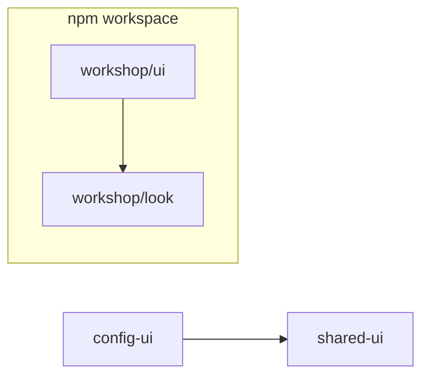

# Fork shared-ui into workshop/look

<product-contract>

## Product Requirements

The Workshop family needs a visual layer it owns, so its products look alike without Gateway changes breaking them. We fork `crates/shared-ui` into `crates/workshop/look` (`@workshop/look`), move the Workshop UI onto the fork, and turn `crates/workshop` into one npm workspace. Gateway keeps `crates/shared-ui` as is until its own decoupling plan retires it.

- Problem and users:
  - `crates/shared-ui` serves both the Workshop UI (`crates/workshop/ui/package.json`, `"shared-ui": "file:../../shared-ui"`) and the Gateway config UI (`crates/gateway/config-ui/ui/package.json` line 21). Sharing it is a maintenance tax; the two products should evolve independently.
  - Workshop family products (the Workshop, future sibling products, and view crates such as a future agent view) must share one look and feel, so they need a visual package inside the family.
  - Users: developers and coding agents working on the Workshop family.
- Goals:
  - `@workshop/look` exists at `crates/workshop/look/`, and the Workshop UI imports only it.
  - `crates/workshop` is one npm workspace: one `npm ci`, one `package-lock.json`, one hoisted copy of each shared dependency (`lucide`, `esbuild`, `typescript`, `jsdom`).
  - `look` holds the family palette, the size and semantic token tiers, the visual components, and the icons.
- Non-goals:
  - Any change to Gateway code or to `crates/shared-ui` code.
  - Any visible change to the Workshop.
- Success criteria:
  - Nothing under `crates/workshop/ui` references `shared-ui`.
  - Gateway installs, typechecks, builds, and tests with unchanged results.
  - A new family package joins by adding one `workspaces` entry, with no CI workflow edit and no `node_modules` ignore line.
- Constraints:
  - Target repository: `promptforge2` (at `c:\Users\Vinnie\cursor\promptforge2`). Every path in this plan is relative to its root, and the survey, file lists, and line numbers were taken from it. The sibling `promptforge` and `promptforge3` checkouts are not targets.
  - `crates/shared-ui` is copied, never moved or deleted.
  - No file under `crates/gateway/` changes, and Gateway's `npm ci` lines in CI stay as they are.
  - The fork may drift from `shared-ui`; there is no sync obligation.
  - The Workshop never builds against both packages or neither: the dependency switch and the import rewrite land together.
- Open questions: None

## Functional Specification

End users see nothing. Developers install once at `crates/workshop`, import `@workshop/look/...`, and get a Cargo rebuild whenever any workspace member changes.

- Actors and workflows:
  - Developer setup: `npm ci --prefix crates/workshop` replaces `npm ci --prefix crates/workshop/ui`. Gateway setup (`npm ci --prefix crates/gateway/config-ui/ui`) is unchanged.
  - Workshop code imports `@workshop/look/<export>`, for example `@workshop/look/dropdown`, `@workshop/look/tokens.css`, `@workshop/look/icons`.
  - `cargo build -p workshop-server` rebuilds the embedded bundle when any workspace member changes, `look` included.
- Inputs and outputs: build input is the workspace root `package.json`, its lockfile, and its members; the bundle behaves as before.
- States and validation: `look` sources import only their own files and `lucide`.
- Errors and recovery: a missing install fails the Cargo build with a message naming the directory to run `npm ci` in.
- Security and privacy behavior: no change.
- Acceptance criteria:
  - The Workshop looks and behaves the same.
  - `git status` is clean after install, build, and test; the hoisted `crates/workshop/node_modules/` is ignored.
  - Editing a file in `look` triggers a Workshop server rebuild; editing a file in `shared-ui` still triggers a Gateway config UI rebuild.

</product-contract>
<implementation-contract>

## Technical Design

`crates/workshop` becomes an npm workspace with members `ui` and `look`; Gateway stays outside it with its own install. `build-ui` learns to find esbuild and the lockfile in ancestor directories and to watch workspace members, which is what keeps Cargo rebuilds correct. The repo's ignore and attributes files widen to cover the hoisted install and the new package.

- Architecture:

  - Workspace root `crates/workshop/package.json`: `private: true`, `workspaces: ["ui", "look"]`, shared tooling (`esbuild`, `typescript`, `jsdom`) as root dev dependencies. Runtime dependencies live in the member that uses them.
  - The Workshop UI depends on `"@workshop/look": "*"`, which npm links to the local member.
  - Future family packages join by adding a `workspaces` entry.
- Modules and interfaces:
  - `@workshop/look` keeps the `exports` map of `crates/shared-ui/package.json` (`tokens.css`, `controls.css`, `shimmer.css`, and `modal`, `dropdown`, `toast`, `status-bar`, `progress`, each with its `.css`) and adds `sizes.css`, `semantic.css`, and `icons`.
  - Token tiers: palette (`tokens.css`), sizes (`sizes.css`, from `crates/workshop/ui/src/tokens/base.css`: the `--ws-size-*` scale and shadow colors), and semantic aliases (`semantic.css`, from `crates/workshop/ui/src/tokens/semantic.css`: border widths, control heights, type sizes, elevation) live in `look`. Component tokens stay with their components; `crates/workshop/ui/src/tokens/component.css` stays in the Workshop.
  - Two component-token blocks stay in `look/tokens.css` for now: the agent-window block ("Component tokens consumed by the agent-window components") and the title bar block (`--titlebar-*`).
  - `look` has no build output. Its only runtime dependency is `lucide`.
- File and public API changes:
  - The lockfile moves from `crates/workshop/ui/package-lock.json` to `crates/workshop/package-lock.json`.
  - `build-ui` (`crates/build-ui/src/lib.rs`): `esbuild_command` (lines 212-236) searches `node_modules/.bin/esbuild` in the UI directory and then each ancestor, as Node resolves packages; Gateway finds its own `ui/node_modules` first. `watch` (lines 125-154) watches the nearest ancestor `package.json` and `package-lock.json` and every member directory listed in the root's `workspaces`; the existing `crates/shared-ui` search (lines 144-154) stays for Gateway. `build-ui` gains `serde_json` (today it depends only on `anyhow` and `workspace-hack`, `crates/build-ui/Cargo.toml`).
  - `.gitignore` line 16 (`/crates/workshop/ui/node_modules/`) becomes `/crates/workshop/**/node_modules/`, covering the root install, member-level installs (npm leaves non-hoisted versions in a member's own `node_modules/`), and future members. `/crates/workshop/ui/dist/` and the Gateway lines stay.
  - `.gitattributes` gains `crates/workshop/look/** text eol=lf` and `crates/workshop/look/**/*.png binary`, mirroring the `ui` lines (12 and 15).
  - No Cargo member change: `Cargo.toml` excludes `crates/workshop` as a container and lists its members explicitly (lines 3 and 13).
- Data, persistence, failure, security, and privacy constraints:
  - A watcher that misses `look` fails silently: Cargo keeps serving a stale bundle.
  - Regenerating the lockfile can shift transitive versions and change the bundle.
  - An unignored hoisted `node_modules` would add thousands of untracked files.
  - One copy per shared module is required; the family's future command and menu registries break silently with two copies, and the workspace guarantees one.

</implementation-contract>
<verification-contract>

## Testing Plan

Every change is behavior-neutral, so verification means the existing suites pass, Gateway is unchanged, and the silent failure modes (watcher, lockfile drift, unignored install) are checked directly. New guards keep `look` self-contained and keep `shared-ui` out of the Workshop.

- Unit:
  - `build-ui`: the ancestor lookup and the workspace member list.
  - `look`: the four component tests moved from `crates/workshop/ui/test/` (`shared-toast.mjs`, `shared-modal.mjs`, `shared-status-bar.mjs`, `workshop-dropdown.mjs`).
- Integration and end-to-end:
  - At `crates/workshop`: `npm ci`, then `typecheck`, `build`, and `test` across the workspaces.
  - `cargo build -p workshop-server` without `headless`; `cargo test -p build-ui`.
  - Watcher in both directions: editing a `look` file rebuilds the Workshop server; editing a `shared-ui` file still rebuilds the Gateway config UI.
  - Gateway config UI: `cargo build -p gateway-config-ui` succeeds after the `build-ui` change, and nothing under `crates/gateway/` changes. Its npm typecheck, build, and test run once, in the final full-suite run, since no earlier step changes anything they exercise.
  - Visual check of the Workshop: no change.
  - Release paths, which pull-request CI does not run, pass on the change that edits the install layout and workflows:
    - `.github/workflows/release-workshop.yml` through a manual run in its non-publishing mode (lines 2 and 20).
    - `.github/workflows/nightly.yml` through a manual run (line 8).
    - `.github/workflows/llama-cuda-blackwell.yml` through a manual run (line 10), if a CUDA run is affordable.
    - The cargo-dist build job. It runs only on tag pushes: `dist-workspace.toml` sets `pr-run-mode = "plan"` (line 26), and `build-local-artifacts` in `.github/workflows/promptforge-gateway-v-release.yml` (line 107) runs only when publishing or in `upload` mode. Exercise it by setting `pr-run-mode = "upload"` on the change's pull request, then restore `plan` before merge.
- Regression, security, and performance:
  - `look/test/boundary.mjs`: sources import only their own files and `lucide`; never `shared-ui`, the Workshop UI, another `@workshop/*` package, or a relative path leaving the package.
  - Workshop guard test: nothing under `crates/workshop/ui/src` or `crates/workshop/ui/test` references `shared-ui`.
  - No Gateway alias name (`--bg-primary`, `--text-secondary`, `--font-mono`, and the rest of the block) remains under `crates/workshop/`.
  - `npm ls lucide` at the workspace root shows one version.
  - `crates/workshop/ui/test/titlebar-style.mjs` and `lazy-css-entry-bundle.mjs` pass after the token move.
  - The lockfile diff is reviewed for transitive version changes.
  - `git status` is clean after install, build, and test; `git check-ignore crates/workshop/node_modules` succeeds; `git ls-files crates/workshop/look` lists exactly the copied files plus the new ones.
- Exit criteria: all of the above pass locally, the CI UI test job runs `typecheck` and `test` across all workspaces, and the release-path runs pass with `pr-run-mode` restored to `plan`.

</verification-contract>
<decision-record>

## Decision Record

- Decisions:
  - Fork, not move. `crates/shared-ui` stays for Gateway and the Workshop takes a copy. Rationale: moving it would break Gateway before its decoupling plan lands. User: "plan it but do NOT move shared-ui. just make a copy, so we don't break Gateway." This refines the earlier direction "So shared-ui is going to become an internal crate to workshop": the Workshop-internal package is the copy.
  - Decouple Workshop and Gateway visuals. Rationale: shared maintenance tax. User: "I want to break the coupling because it is just creating a maintenance tax. they should evolve independently and we dont have to pay for breakage."
  - The family shares one visual layer, and view crates depend on it. Rationale: consistent look and feel across family products. User: "we want the UI to be consistent across views in the Workshop. even a separate product, should have a UI consistent with the Workshop (i.e. we have a product family of executable processes which share a look and feel)".
  - Name it `look`, at `crates/workshop/look/`. Rationale: inside `crates/workshop/`, "shared" is redundant, and `look` says what belongs there (visual; mechanics go elsewhere). User: "how about workshop/look instead of shared-ui".
  - Singular `look`, not `looks`. Rationale: the family has one look; sibling directories are singular nouns (`ui`, `server`, `menu`, `status`, `workspace`); `looks` suggests interchangeable themes. Any future selectable themes live inside `look`. User: "look/ or looks/ ?"
  - Scoped npm name `@workshop/look` (and `@workshop/*` for later family packages). Rationale: bare names such as `look` could collide with public npm packages, and scoped imports read clearly. Adopted during design without objection.
  - One npm workspace at `crates/workshop`, with `lucide` shared. Rationale: `look`'s runtime dependency costs no extra install anywhere, future family packages need no per-package CI edits, and shared modules get one copy. User: "can we just make lucide shared and have only one npm repo".
  - Shared tooling at the workspace root; runtime dependencies in the member that uses them. Rationale: one esbuild version for every member, and each package states what it ships.
  - Mind the ignore files: widen the Workshop `node_modules` ignore line and add per-member `.gitattributes` lines. User: "the plan should mind the gitignores".
  - Family token tiers (palette, sizes, semantic) live in `look`; component tokens live with their components.
  - Keep `build-ui`'s existing `crates/shared-ui` search. Rationale: it leaves Gateway's rebuild behavior untouched; the Gateway plan can remove it.
  - Few steps, proportionate verification. Each step is as large as one set of tests can cover; work is split into another step only when mixing it would hide a change from review (for example, edits to copied files inside the commit that copies them) or would put build and release infrastructure in the same commit as product code. Verification runs what a step can break and no more. User: "keep the number of steps low, balance with verification safety (dont over-verify either)".
- Rejected alternatives:
  - Moving `crates/shared-ui` into `crates/workshop/`: breaks Gateway. Revisit after the Gateway decoupling plan lands.
  - Keeping the name `shared-ui` or a top-level location: the package is family-internal, and "shared" says nothing inside `crates/workshop/`. No revisit condition.
  - `looks`: implies several themes. Revisit only if the family ships selectable themes, and even then keep them inside `look`.
  - Separate npm installs per package (an earlier form of this plan): `look` would need its own dev dependencies and CI steps, and the icons were excluded because `look`'s first runtime dependency would force a `look` install into every Workshop build workflow, including the cargo-dist template. Revisit only if the workspace causes problems.
  - Watching `file:` dependencies parsed from each UI's `package.json`: replaced by watching workspace members.
  - A single `crates/workshop/** text eol=lf` rule: a later broad `eol=lf` line overrides the `*.ps1` and `*.bat` CRLF rules (`.gitattributes` lines 2 and 3) for anything under the Workshop. No revisit condition.
  - Putting `event.ts`, `lifecycle.ts`, `reconnect-backoff.ts` in `look`: they are not visual.
- Assumptions, risks, and notes:
  - Risk: transitive version drift from the lockfile rewrite; mitigated by moving the existing lockfile before `npm install` and reviewing the diff.
  - Risk: a silent stale bundle if the watcher misses `look`; mitigated by the two-direction watcher check.
  - Risk: committing the hoisted install; mitigated by the ignore change plus `git status` and `git check-ignore` checks.
  - Risk: a wrong install or cache path in a workflow that pull-request CI never runs would surface only at release; mitigated by the release-path runs in the Testing Plan.
  - Note: `workspace-hack` may need regenerating (`cargo hakari generate`, config in `.config/hakari.toml`) once `build-ui` depends on `serde_json`.
  - Note: `crates/shared-ui/package.json` declares no runtime dependencies; `look`'s first is `lucide`.
  - Note: `.github/workflows/dist-ci/build-setup.yml` is the cargo-dist build-setup template (`dist-workspace.toml` line 24); its steps are copied into the generated `.github/workflows/promptforge-gateway-v-release.yml` (lines 146-148), which therefore installs the Workshop UI and changes even though it is a Gateway release workflow. `dist-workspace.toml` sets `allow-dirty = ["ci"]` (line 29), so the generated file carries hand edits: edit both files by hand and keep them matching; do not regenerate with `dist generate`.
  - Note: Cursor indexing follows `.gitignore`, so no `.cursorignore` change is needed.
  - Note: the release-path runs need the branch pushed to GitHub, and the `pr-run-mode = "upload"` toggle is never committed to the merged history. They are operator checks on the pushed branch before merge, not part of local step verification.
  - Note: the family's mechanics package (commands, menus, keybindings, context keys, services, panels) is provisionally named `platform`; nothing in this plan depends on its final name.

### Deferred and Out of Scope

- Deferred: removing `crates/shared-ui` and `build-ui`'s `crates/shared-ui` search. Revisit when the Gateway decoupling plan lands.
- Deferred: the agent-window token block leaves `look/tokens.css`. Revisit when the agent view is extracted into its own crate.
- Deferred: the title bar token block leaves `look/tokens.css`. Revisit when the window frame (`shell`) is extracted.
- Deferred: `event.ts`, `lifecycle.ts`, `reconnect-backoff.ts` move to the mechanics package. Revisit with that package's plan.
- Out of scope: renaming the `--ws-` token prefix.
- Out of scope: CSS cascade layers and a scoped reset (the agent view work).
- Out of scope: moving `crates/workshop/ui/src/parts/shared/panel-dialog.ts`.

</decision-record>
<project-survey>

## Project Survey

- Status: complete
- Build command: `cargo workshop` from the repository root. It builds the gateway, stages the gateway sidecar, builds the desktop app in the same profile, then removes the staged copy.
  - Gateway only: `cargo build --locked -p gateway`. Plain `cargo build` does the same thing because the gateway is the only default workspace member.
  - One UI bundle only: `npm run build` in `crates/workshop/ui` or `crates/gateway/config-ui/ui`. The Cargo builds of `workshop-server` and `gateway-config-ui` bundle the same sources into `OUT_DIR` through `build-ui::build_sibling`.
  - One-time setup: `npm ci --prefix crates/workshop/ui` and `npm ci --prefix crates/gateway/config-ui/ui`. `build-ui` runs the local `ui/node_modules/.bin/esbuild` (`esbuild.cmd` on Windows) with no `npx` fallback, so every Cargo build that bundles a UI fails without these installs. Once Step 1 of this plan lands, the Workshop install is `npm ci --prefix crates/workshop` (the npm workspace root), and `build-ui` also finds esbuild in an ancestor `node_modules/.bin`.
  - Sidecar staging, needed before any build, clippy, or test of the `workshop` desktop crate: `cargo build --locked -p gateway --no-default-features`, then `node tools/stage-gateway-sidecar.mjs stage --target x86_64-pc-windows-msvc --source target/debug/promptforge-gateway.exe`. Remove it afterward with `node tools/stage-gateway-sidecar.mjs remove --target x86_64-pc-windows-msvc`. On Linux, use `x86_64-unknown-linux-gnu` and `target/debug/promptforge-gateway`.
- Focused test command pattern:
  - Rust: `cargo nextest run --locked -p <package> <test-name-filter>`. Add `--test it` to select the single integration target in crates that use one.
  - Workshop UI: `node test/<name>.mjs` run from `crates/workshop/ui`. Each file runs standalone. Once Step 4 of this plan lands, `look` tests run the same way from `crates/workshop/look`.
  - Gateway config UI: `node --test src/<path>/<name>.test.mjs` run from `crates/gateway/config-ui/ui`.
- Component test command pattern:
  - Rust: `cargo nextest run --locked -p <package>`, then `cargo test --doc -p <package>`, because nextest does not run doctests.
  - UI packages: `npm test` in `crates/workshop/ui` (`node --test "test/**/*.mjs" "src/**/*.test.mjs"`) or in `crates/gateway/config-ui/ui` (`node --test "src/**/*.test.mjs"`). `crates/shared-ui` has no scripts and no tests of its own. Once Step 1 of this plan lands, `npm test --workspaces --if-present` at `crates/workshop` runs every Workshop member's tests, and `npm test` in a member directory runs that member's.
- Full-suite test command: run these in order. The workshop steps need the staged sidecar described under the build command.
  - `cargo nextest run --locked --workspace --exclude workshop --exclude workshop-server --exclude workshop-server-api --all-features`
  - `cargo test --workspace --exclude workshop --exclude workshop-server --exclude workshop-server-api --all-features --doc`
  - `cargo nextest run --locked -p workshop -p workshop-server -p workshop-server-api`
  - `cargo nextest run --locked -p workshop-workspace --all-features`
  - `cargo nextest run --locked -p workshop-server --features headless`
  - `cargo test --doc -p workshop -p workshop-server -p workshop-server-api`
  - `cargo test -p build-xtask`, which is the boundary and structural harness.
  - In `crates/gateway/config-ui/ui`: `npm run typecheck`, `npm run build`, `npm test`.
  - Workshop npm: at `crates/workshop` once Step 1 of this plan lands, `npm run typecheck --workspaces --if-present`, `npm run build --workspace ui`, `npm test --workspaces --if-present`. Before Step 1, `npm run typecheck`, `npm run build`, `npm test` in `crates/workshop/ui`.
  - The facade surface check, `cargo +<pinned nightly> xtask api --check`, runs only on the nightly named in `crates/build-xtask/src/api/toolchain.rs`. Any other toolchain fails at once.
- Linter command:
  - `cargo clippy --workspace --exclude workshop --exclude workshop-server --exclude workshop-server-api --all-targets --all-features -- -D warnings`
  - `cargo clippy -p workshop -p workshop-server -p workshop-server-api --all-targets -- -D warnings`, which needs the staged sidecar.
  - `cargo check -p gateway --no-default-features`, the headless build-shape check. AGENTS.md forbids any other standalone `cargo check --workspace` alongside clippy.
  - TypeScript and CSS have no linter. `npm run typecheck` (`tsc --noEmit`, strict) in each UI directory is the static check.
- Formatter check command: `cargo fmt --all --check`, which the pre-commit hook also runs. TypeScript and CSS have no formatter configured.
- Docs command: `cargo doc --workspace --no-deps --all-features --exclude workshop --exclude workshop-server --exclude workshop-server-api` with `RUSTDOCFLAGS="-D warnings"` (in PowerShell, `$env:RUSTDOCFLAGS="-D warnings"`).
  - Run `cargo doc -p promptforge --no-deps` and `cargo doc -p harness --no-deps` without `--all-features`.
  - Run `cargo doc --locked --no-deps -p workshop-server --document-private-items`.
  - User guide: `cargo xtask site --books-only`.
- Test placement and naming conventions:
  - Rust unit tests go in an in-file `#[cfg(test)] mod tests` or in a sibling `<stem>-tests.rs` wired as `#[cfg(test)] #[path = "<stem>-tests.rs"] mod tests;`. Large groups use a `src/<module>/tests/` subdirectory.
  - Rust integration tests go in each crate's `tests/`. The gateway app and workshop server use a single `it` target (`tests/it/main.rs` with one module or folder per area), with shared helpers in `tests/common/` and data in `tests/fixtures/`.
  - Workshop UI tests are flat kebab-case files named `crates/workshop/ui/test/<feature>.mjs`, with no `.test` suffix. Stubs and shared boot code go in `test/helpers/`. Each file bundles its target with esbuild, drives it under jsdom with `node:test`, and states its run line (`// Run: node test/<name>.mjs.`) in the header comment.
  - The shared-ui component tests live in the Workshop UI as `shared-modal.mjs`, `shared-status-bar.mjs`, `shared-toast.mjs`, and `workshop-dropdown.mjs`, and they load the sources through `node_modules/shared-ui/`. `run-panel.mjs` also references `shared-ui`.
  - Gateway config UI tests sit next to their source as `src/**/<name>.test.mjs`. Node scripts in `tools/` use `<name>.test.mjs` beside `<name>.mjs`.
- Directory map:
  - The `crates/` root holds the public and meta crates. `promptforge` is the engine facade and `harness` is the host facade. `gateway-api-types` and `gateway-api-discovery` are the gateway's public pair. The shared crates are `shared-error-source`, `shared-loopback`, and `shared-ui`, which is a TypeScript and CSS package, not a Rust crate, and is excluded from the Cargo workspace. `workspace-hack` is the cargo-hakari crate. The `build-*` crates are tooling: `build-ui` bundles UIs with esbuild for `build.rs`, `build-workshop` backs `cargo workshop`, `build-xtask` backs `cargo xtask` (boundary checks, API surface, docs site), and `build-user-guide` and `build-llama-cuda` build the user guide and CUDA llama.
  - `crates/promptforge-internal/` holds engine, types, vfs, lua, parser, store, and model-client.
  - `crates/harness-internal/` holds runner, models, capabilities, log, sessions, web, webfetch, and web-search.
  - `crates/gateway/` holds app, config, config-ui (with its `ui/` TypeScript package), local, cloud-providers, routing, protocol, progress, logging, web-search, and `stt/` (api, engine, backend-whisper, whisper-ffi).
  - `crates/workshop/` holds desktop (package `workshop`), server, server-api, gateway, menu, protocol, registry, status, support, user-state, workspace, and `ui/`, the TypeScript SPA with its own `package.json`, `package-lock.json`, `build.mjs`, `tsconfig.json`, `src/`, and `test/`. `crates/workshop` itself has no `package.json` and no manifest.
  - `guide/` holds the user guide books, landing page, and site chrome. `prompts/` holds example Markdown prompt programs. `tools/` holds Node scripts (sidecar staging, live TTS check) with their tests. `vibe/` holds `archdoc.md`, dated plan and debt records, and design notes. `images/` holds README banners.
  - `.github/workflows/` holds `ci.yml` plus the release, nightly, site, and native-build workflows. `.githooks/` holds pre-commit (fmt) and pre-push (headless check, clippy, deny). `.config/` holds `nextest.toml` and `hakari.toml`. `.cargo/config.toml` sets rust-lld and the static CRT on Windows MSVC and defines the `workshop` and `xtask` aliases.
  - Root files are `Cargo.toml` (workspace members, lints, and pinned dependencies), `rust-toolchain.toml`, `rustfmt.toml`, `clippy.toml`, `deny.toml`, `dist-workspace.toml`, `AGENTS.md`, and `README.md`.
- Component boundaries:
  - There are four products. PromptForge is the sans-I/O executor, public only through `promptforge`. Harness is the executor's only production host, public only through `harness`. Gateway is an independent server process, public only through its two API crates. Workshop is the Tauri desktop app, the in-process Axum server, and the SPA.
  - Dependency directions: harness-* crates depend only on `promptforge`. Workshop crates may name `promptforge`, `harness`, and the gateway public pair, never gateway internals. Gateway crates never depend on promptforge, harness, or workshop crates. PromptForge crates never depend on gateway, workshop, or harness crates. shared-* crates depend on no product crate.
  - Family containers are private. A container crate depends only on `crates/` root crates and its own siblings. `build-*` crates are exempt. Every dependency kind counts: normal, dev, build, and target-specific.
  - Inside PromptForge, the engine depends on store, lua, and the shared substrate. Store sits over vfs, and vfs depends on nothing.
  - The Workshop tiers run server, then features (workspace, user-state), then services (gateway, menu, status), then vocabulary (protocol, registry, support). The desktop app sees only `workshop-server-api`.
  - SPA imports flow from `parts/` to `services/` to `base/`. The one exception is `services/panel-registry.ts` dynamically importing each lazy part's `index.ts`. Lazy panels never import the entry bundle (`main.ts` and its `*.contribution.ts` modules).
  - `crates/shared-ui` is a base layer that imports from neither product UI. Both `crates/workshop/ui` and `crates/gateway/config-ui/ui` consume it as a `file:` dependency, and each UI has its own lockfile and `node_modules`. `build-ui` watches `crates/shared-ui`, so edits there rebuild both bundles. CI installs each UI with `npm ci --prefix` and caches on `crates/*/ui/package-lock.json` and `crates/gateway/*/ui/package-lock.json`.
  - `cargo test -p build-xtask` enforces the tier graph, product boundaries, and container privacy.
- Conventions summary:
  - Rust uses edition 2024, license BSL-1.0, and a single version (0.3.0) from `[workspace.package]`. Every member inherits `[workspace.lints]` and depends on `workspace-hack`. Dependencies are pinned in `[workspace.dependencies]`, with a comment explaining each non-obvious pin.
  - Lints forbid `unsafe_code` and deny clippy `all`, `pedantic`, `unwrap_used`, and `expect_used`. `missing_docs` warns, so public items carry rustdoc. Unsafe code stays in its owned FFI boundary, and each block documents its safety invariants.
  - Every workshop-* and harness-* `lib.rs` opens with a `//!` doc containing `## Invariants`. Files in crates with that marker stay at or under 500 lines.
  - Source directories are flat. A subdirectory needs at least three files; smaller groups become kebab-case siblings (`parent-label.rs`) wired with `#[path]`.
  - Comments explain only non-obvious constraints, and every workaround cites its upstream issue URL.
  - Error and status messages are written for a model to read: concise, stating required versus actual.
  - JSON in the run log round-trips exactly: sorted keys, finite numbers, `float_roundtrip`, and never `preserve_order`.
  - Behavior changes ship with tests. Adding a structural check needs explicit user approval.
  - In the SPA, CSS sits beside its TypeScript. Component CSS uses only `--ws-*` tokens from `src/tokens/`, with primitives in `base.css`, intent aliases in `semantic.css`, and overrides in `component.css`, never raw colors, sizes, or spacing.
  - The SPA never touches `localStorage`; persisted values go through `ui-storage` to the server. Command ids and context keys copy VS Code's exactly, and commands register through `registerAction` in `*.contribution.ts`. Services own no views, and there is no mutable module-global state.
  - TypeScript, CSS, and test files use kebab-case names. Packages are private ES modules (`"type": "module"`) on Node 22 or later with esbuild and strict TypeScript (`noUncheckedIndexedAccess`, `verbatimModuleSyntax`). Third-party derivation notices live in `THIRD_PARTY_NOTICES.md` and must stay intact.
  - CI fails any build that dirties the repository, which is why Cargo UI bundles go to `OUT_DIR`. `npm run build` writes `dist/` for the watch workflow and the jsdom tests.

</project-survey>
<execution-plan>

## Execution Instructions

<step-1>

### Step 1: Make crates/workshop one npm workspace [completed]

- Component: Workshop npm workspace
- Placement: this component comes first because `@workshop/look` can only join a workspace that already installs and builds. It is one step: the `build-ui` lookup and watch changes, the layout, the ignore files, CI, and the install docs are all build and release infrastructure, and moving the lockfile breaks every `npm ci --prefix crates/workshop/ui` line and every Workshop cache key at once, while hoisting moves esbuild out of `crates/workshop/ui/node_modules`, so they land together. No product code changes. The workspace's only member is `ui`, which still consumes `shared-ui`.
- `crates/build-ui/src/lib.rs`:
  - Add `pub fn find_esbuild(ui_dir: &Path) -> Option<PathBuf>`, which checks `node_modules/.bin/esbuild` (`esbuild.cmd` on Windows) in `ui_dir` and then each ancestor, as Node resolves packages, so Gateway still finds its own `ui/node_modules` first. `esbuild_command` (lines 212-236) calls it. When nothing is found, the error names the directory holding the nearest `package-lock.json` at or above `ui_dir` (falling back to `ui_dir`) as the place to run `npm ci`.
  - Add private helpers `nearest_lockfile(ui_dir)` and `workspace_members(ui_dir)`. The second finds the nearest ancestor `package.json` whose `workspaces` field is an array, parsed with `serde_json`, and returns that root plus each listed member directory (literal entries), leaving out `ui_dir` itself.
  - `watch` (lines 128-154) keeps `ui/src`, the static files, and the UI's own `build.mjs`, `package.json`, and `tsconfig.json`; replaces the fixed `ui/package-lock.json` line with the nearest lockfile; and adds the workspace root `package.json` and every other member directory. The UI's own directory is not watched recursively because its inputs are already listed and the jsdom tests write its `dist/`. `watch` emits only paths that exist, since Cargo reruns a build script on every build when a watched path is missing. The `crates/shared-ui` search (lines 144-154) stays for Gateway.
  - Update the doc comments that say `ui/node_modules` or "local esbuild install" on `build`, `build_sibling`, `build_in`, `bundle`, and `esbuild_command`.
- `crates/build-ui/src/lib-tests.rs`, wired as `#[cfg(test)] #[path = "lib-tests.rs"] mod tests;`: temp-directory unit tests for the lookup (a UI-local install wins, an ancestor install is found, no install gives `None`), the nearest lockfile, and the member list (listed members returned, a root without `workspaces` ignored, `ui_dir` left out).
- `crates/build-ui/Cargo.toml`: add `serde_json` from `[workspace.dependencies]`. Run `cargo hakari generate` (config in `.config/hakari.toml`) if `cargo hakari verify` asks for it.
- `crates/build-ui/tests/it/main.rs` (line 24): skip when `build_ui::find_esbuild(&ui_dir)` is `None`, with a message naming where to run `npm ci`.
- Workspace root:
  - Add `crates/workshop/package.json`: `private: true`, `workspaces: ["ui"]`, and root `devDependencies` `esbuild` (^0.28.2), `jsdom` (^30.0.1), and `typescript` (^7.0.2), the ranges in `crates/workshop/ui/package.json` (lines 51-53). Remove those three from `ui/package.json`; `lucide` and `shared-ui` stay there.
  - `git mv crates/workshop/ui/package-lock.json crates/workshop/package-lock.json`, then `npm install` at `crates/workshop` so npm rewrites it minimally. Both root files are tracked.
- `.gitignore` line 16 becomes `/crates/workshop/**/node_modules/`; `/crates/workshop/ui/dist/` and the Gateway lines stay. `.gitattributes` gains `crates/workshop/look/** text eol=lf` and `crates/workshop/look/**/*.png binary` beside the `ui` lines (12 and 15). No `dist` line for `look`.
- Hoist-proof test entries: under `crates/workshop/ui`, `test/shared-toast.mjs` (line 24), `test/shared-modal.mjs` (line 25), `test/shared-status-bar.mjs` (line 25), and `test/workshop-dropdown.mjs` (line 35) build their esbuild entry as `ui/node_modules/shared-ui/<file>.ts`, a path hoisting removes. Resolve the `shared-ui/<export>` specifier through Node module resolution instead (for example `createRequire(import.meta.url).resolve`), still bundling in memory.
- CI, Workshop lines only (Gateway `npm ci` lines stay as they are):
  - `npm ci --prefix crates/workshop/ui` becomes `npm ci --prefix crates/workshop` in `.github/workflows/ci.yml` (lines 47, 92, 137, 176, 269), `.github/workflows/nightly.yml` (lines 69, 102), `.github/workflows/dist-ci/build-setup.yml` (line 16), and its generated copy `.github/workflows/promptforge-gateway-v-release.yml` (line 146).
  - `working-directory: crates/workshop/ui` with `npm ci` becomes `crates/workshop` in `ci.yml` (line 320), `nightly.yml` (line 164), `.github/workflows/release-workshop.yml` (line 120), `.github/workflows/workshop-installer-smoke.yml` (line 31), and `.github/workflows/llama-cuda-blackwell.yml` (line 106).
  - Every `cache-dependency-path` block (`ci.yml` lines 41, 86, 131, 170, 263, 315; `release-workshop.yml` line 115; `nightly.yml` lines 64, 97, 159; `build-setup.yml` line 12) gains `crates/workshop/package-lock.json`, since `crates/*/ui/package-lock.json` no longer matches the Workshop.
  - Edit `build-setup.yml` and the generated release workflow by hand and keep them matching, including the cache block; `dist-workspace.toml` sets `allow-dirty = ["ci"]` (line 29), so never regenerate with `dist generate`.
  - The UI test job in `ci.yml` (lines 305-349) installs at `crates/workshop` and runs `npm run typecheck --workspaces --if-present`, `npm run build --workspace ui`, and `npm test --workspaces --if-present`. `--if-present` lets a member without a script (such as `look` before Step 4, or a future package) join with no workflow edit.
- Install docs: `README.md` (lines 69-75, the command at line 74) and the doc comment in `crates/workshop/server/build.rs` (lines 1-10) say `npm ci --prefix crates/workshop`.
- Verification:
  - `build-ui`: `cargo nextest run --locked -p build-ui` (its differential integration test now runs instead of skipping), `cargo test --doc -p build-ui`, `cargo clippy -p build-ui --all-targets -- -D warnings`, `cargo fmt --all --check`, and `cargo test -p build-xtask` (manifest change).
  - At `crates/workshop`: `npm ci`, then `npm run typecheck --workspaces --if-present`, `npm run build --workspace ui`, and `npm test --workspaces --if-present`. The lockfile diff relocates entries from `ui/` to the root with no transitive version change.
  - `cargo build -p workshop-server` without `headless`; an immediate second `cargo build -v -p workshop-server` reports the build script fresh (no missing watched path), and editing `crates/workshop/package.json` or a `ui/src` file reruns it.
  - Gateway: `cargo build -p gateway-config-ui` succeeds, and editing a `crates/shared-ui` file still reruns its build script. Its npm suite is not rerun, since nothing it runs changes. `git diff --stat` lists nothing under `crates/gateway/` or `crates/shared-ui/`.
  - `git status` is clean after install, build, and test; `git check-ignore crates/workshop/node_modules` succeeds.
  - Release paths, which pull-request CI does not run, as operator checks on the pushed branch before merge: `release-workshop.yml` through a manual run in its non-publishing mode (lines 2 and 20); `nightly.yml` through a manual run (line 8); `llama-cuda-blackwell.yml` through a manual run (line 10) if a CUDA run is affordable; and the cargo-dist build job (`build-local-artifacts`, `promptforge-gateway-v-release.yml` line 107) by setting `pr-run-mode = "upload"` in `dist-workspace.toml` (line 26) on the pull request. Restore `plan` before merge; the toggle never enters merged history.
- Commit: the `build-ui` source, unit and integration test changes, manifest, and any `workspace-hack` regeneration; the root manifest and moved lockfile; the `ui/package.json` edit; the ignore and attributes lines; the four test entry fixes; the workflows; and the install docs.

</step-1>

<step-2>

### Step 2: Copy shared-ui verbatim into crates/workshop/look [completed]

- Component: `@workshop/look`
- Placement: this component follows the workspace because it joins the workspace as a member. Its fork-and-switch piece is sequential: a verbatim copy first and every edit in later commits, so review sees the copy as a copy and each change to the fork on its own.
- Copy every file listed by `git ls-files crates/shared-ui` to the same relative path under `crates/workshop/look/`, including `AGENTS.md` and `THIRD_PARTY_NOTICES.md` (notices travel with derived code). Change nothing: `look/package.json` still says `shared-ui`, and `look` is not yet in `workspaces`, so npm ignores it. `crates/shared-ui` is untouched.
- Verification: `git ls-files crates/workshop/look` matches `git ls-files crates/shared-ui` with the prefix swapped; `git diff --no-index crates/shared-ui crates/workshop/look` shows no difference; `git check-attr text eol -- crates/workshop/look/tokens.css` reports `eol: lf`; `git status` is clean. No build or test runs, since nothing consumes `look` yet.
- Commit: the copied files only.

</step-2>

<step-3>

### Step 3: Name the fork @workshop/look and switch the Workshop onto it

- Component: `@workshop/look`
- Placement: the dependency switch and the import rewrite land together, so the Workshop never builds against both packages or neither. Every later step in this component edits a package the Workshop already consumes.
- `crates/workshop/look/package.json`: name `@workshop/look`, a Workshop-family description, the same `exports` map. No other copied file changes in this step.
- `crates/workshop/package.json`: `workspaces: ["ui", "look"]`. `crates/workshop/ui/package.json`: replace `"shared-ui": "file:../../shared-ui"` with `"@workshop/look": "*"`. Run `npm install` at `crates/workshop`.
- Rewrite every `shared-ui` reference left in `crates/workshop/ui`:
  - Imports: `src/main.ts` (lines 1-3, 11), `src/parts/agent/mode-chip.ts`, `src/parts/chrome/model-picker-trigger.ts`, `src/parts/status/status-bar.ts`, `src/parts/shared/panel-dialog.ts`, `src/parts/layout/run-tab.ts`, `src/parts/chrome/update-view.ts`, `src/parts/layout/panel-types.ts`, `src/parts/workspace/workshop-panel.ts`.
  - Path comments: `src/parts/chatbox/chat-box.ts`, `src/parts/agent/markdown-render.ts`, and these stylesheets under `src/parts/`: `workspace/workshop-panel.css`, `layout/zones.css`, `editor/editor-panel.css`, `chrome/window-chrome.css`, `chrome/token-ring.css`, `chrome/model-picker-trigger.css`, `chrome/command-center.css`, `chrome/about-dialog.css`, `agent/agent-session.css`, `agent/mode-chip.css`, `chatbox/typeahead-popup.css`, `run/run-panel.css`, `quickinput/quick-input.css`, `menu/window-menu.css`. Also `style.css` and `THIRD_PARTY_NOTICES.md`.
  - Tests: the four component tests resolve `@workshop/look/<export>` instead of `shared-ui/<export>` and update their header comments; `test/run-panel.mjs` (line 570) reads `shimmer.css` from `@workshop/look` instead of `crates/shared-ui`.
- Docs: add `look` to the crate list in `crates/workshop/AGENTS.md`; reword the `shared-ui` notes in `Cargo.toml` (lines 4-5) and `crates/README.md` (line 49) to say Gateway consumes it and the Workshop uses its fork; add one line to `crates/shared-ui/AGENTS.md` saying the Workshop no longer consumes it.
- Verification:
  - `rg -l shared-ui crates/workshop/ui -g '!node_modules' -g '!dist'` finds nothing.
  - At `crates/workshop`: `npm ci`, `npm run typecheck --workspaces --if-present`, `npm run build --workspace ui`, and `npm test --workspaces --if-present`. The lockfile diff swaps the `shared-ui` link for the `@workshop/look` link and nothing else.
  - `cargo build -p workshop-server` without `headless`; editing a `look` file reruns its build script (the new member is watched).
  - `git diff --stat` touches nothing under `crates/gateway/` and only `AGENTS.md` under `crates/shared-ui/`; `git status` is clean after install, build, and test. Gateway's suites and the Step 1 watcher checks are not rerun, since nothing they cover changes.
- Commit: the package identity, workspace entry, dependency switch, lockfile, reference rewrite, and doc notes.

</step-3>

<step-4>

### Step 4: Absorb the family visual layer into look and give it tests and guards

- Component: `@workshop/look`
- Placement: last, because it edits `look` as the package the Workshop already consumes and both documentation items describe the final shape. The alias cleanup, token tiers, icons, tests, guards, and docs are built jointly in one commit: they touch disjoint files except `src/main.ts` (token imports) and `workshop-panel.ts` and `chat-box.ts` (icon import lines only), none changes behavior, and one run of the workspace suites plus a visual check covers all of them. The boundary test's `lucide` allowance needs the icons moved in this same step.
- Alias block: in `crates/workshop/look/`, point the 12 alias uses at the Cursor-named tokens they alias (`toast.css` 2, `shimmer.css` 4, `modal.css` 1, `controls.css` 4, `dropdown.css` 1), then delete the "Generic aliases" block in `tokens.css` (from line 268). `crates/shared-ui/tokens.css` keeps its copy; the Workshop UI uses none of these aliases.
- Token tiers: `git mv crates/workshop/ui/src/tokens/base.css crates/workshop/look/sizes.css` and `git mv crates/workshop/ui/src/tokens/semantic.css crates/workshop/look/semantic.css`; add `./sizes.css` and `./semantic.css` to `look`'s `exports`. `src/main.ts` keeps the cascade order `@workshop/look/tokens.css`, `@workshop/look/controls.css`, `@workshop/look/shimmer.css`, `dockview.css`, `@workshop/look/sizes.css`, `@workshop/look/semantic.css`, `./tokens/component.css`. `ui/src/tokens/component.css` stays in the Workshop, and the agent-window and title bar component-token blocks stay in `look/tokens.css`.
- Icons: `git mv crates/workshop/ui/src/parts/shared/icons.ts crates/workshop/look/icons.ts` (exports `ICON_FOLDER_PLUS`, `ICON_TRASH_2`, `ICON_MIC`, `ICON_SEND`) and add `./icons` to `exports`. `src/parts/workspace/workshop-panel.ts` (line 35) and `src/parts/chatbox/chat-box.ts` (line 28) import `@workshop/look/icons`. `look/package.json` gains `lucide` in `dependencies` with the `ui/package.json` range (^1.37.0); `ui` keeps its own `lucide` for `src/parts/chatbox/chip-view.ts`, `src/parts/chrome/model-picker-trigger.ts` (line 12), and `src/parts/agent/mode-chip.ts` (line 19). `test/icons.mjs` (line 20) loads the old `src/parts/shared/icons.ts` path; it moves with the component tests below. Run `npm install` at `crates/workshop`.
- Convention docs: the token rule in `AGENTS.md` (line 89) and `.cursor/rules/workshop-spa.mdc` (line 20) says the sizes and semantic tiers live in `@workshop/look` (`sizes.css`, `semantic.css`), per-component overrides live in `ui/src/tokens/component.css`, and a designer themes the family by editing `look/semantic.css`.
- Move the component tests from `crates/workshop/ui/test/` to `crates/workshop/look/test/` with `git mv`: `shared-toast.mjs`, `shared-modal.mjs`, `shared-status-bar.mjs`, `workshop-dropdown.mjs`, and `icons.mjs`. Each bundles from the package's own files (for example `look/toast.ts`) instead of resolving `@workshop/look`, still in memory (`write: false`), so nothing lands on disk. Header run lines name `crates/workshop/look` as the directory. They need only the root `esbuild` and `jsdom`.
- `workshop-dropdown.mjs` ends with a Workshop check (lines 208-220) that reads `ui/dist/manifest.json` and asserts the bundled `app.css` has the `.menu-item` and `.menu-popup` rules. That block stays in the Workshop as `crates/workshop/ui/test/dropdown-bundle-css.mjs`, since `look` must not read Workshop build output.
- `crates/workshop/look/package.json`: `scripts` `typecheck` (`tsc --noEmit`) and `test` (`node --test "test/**/*.mjs"`), using the root tooling. `crates/workshop/look/tsconfig.json` mirrors the strict settings of `ui/tsconfig.json` (`strict`, `noUncheckedIndexedAccess`, `verbatimModuleSyntax`, no emit) over `look`'s `.ts` sources.
- `crates/workshop/look/test/boundary.mjs`: scans `look`'s `.ts` and `.css` sources outside `test/` and fails on any import or `@import` other than a relative path that stays inside the package or `lucide`, naming the offending file and specifier. `shared-ui`, the Workshop UI, other `@workshop/*` packages, and escaping relative paths all fail.
- `crates/workshop/ui/test/no-shared-ui.mjs`: fails when any file under `crates/workshop/ui/src` or `crates/workshop/ui/test` contains `shared-ui`, skipping its own file.
- Rewrite `crates/workshop/look/AGENTS.md`: the family's visual layer, forked from `shared-ui` on 2026-09-27 with no sync obligation; visual things used or intended across the family belong here, while app-wide mechanics go to the mechanics package; the existing component rules (app-agnostic, no listener or timer outliving its element, overridable defaults, focus via state background or opacity, third-party notices kept); palette, sizes, and semantic tokens live here and component tokens live with their components; the agent-window block leaves `tokens.css` when the agent view becomes its own crate, and the title bar block leaves when the window frame (`shell`) is extracted.
- Document the workspace in `crates/workshop/AGENTS.md`: one install at `crates/workshop`; new packages join `workspaces`; tooling at the root and runtime dependencies in the member that uses them. New members need no `node_modules` ignore line; a member that writes build output adds an anchored ignore line; every member adds its `eol=lf` line to `.gitattributes`.
- Verification:
  - No custom property defined by the deleted alias block (`--bg-primary`, `--text-secondary`, `--font-mono`, and the rest) appears under `crates/workshop/` outside `node_modules`.
  - At `crates/workshop`: `npm ci`, `npm run typecheck --workspaces --if-present`, `npm run build --workspace ui`, and `npm test --workspaces --if-present`. That covers `look`'s typecheck, its five moved tests, and `boundary.mjs` with no CI edit, plus the Workshop suite, including `titlebar-style.mjs`, `lazy-css-entry-bundle.mjs`, `no-shared-ui.mjs`, `dropdown-bundle-css.mjs`, and `docs-claims.mjs`. Focused runs: `node test/<name>.mjs` from `crates/workshop/look` or `crates/workshop/ui`.
  - `npm ls lucide` at `crates/workshop` shows one version; the lockfile diff adds only the `lucide` edge for `look`.
  - A temporary `import "shared-ui/toast"` in a `look` source fails `boundary.mjs`, and a temporary `shared-ui` string under `ui/src` fails `no-shared-ui.mjs`; both are reverted before commit.
  - `cargo build -p workshop-server` without `headless`.
  - `git ls-files crates/workshop/look` lists exactly the Step 2 copies plus `sizes.css`, `semantic.css`, `icons.ts`, `tsconfig.json`, and the files under `test/`; `git status` is clean after install, build, and test.
  - Visual check by the operator: the Workshop looks and behaves the same.
- Commit: the alias repointing and block deletion, the three moved files with their export and import lines, the `lucide` dependency and lockfile, the convention docs, the moved and split tests, `look`'s scripts and `tsconfig.json`, both guards, and both AGENTS.md rewrites.

</step-4>

</execution-plan>
