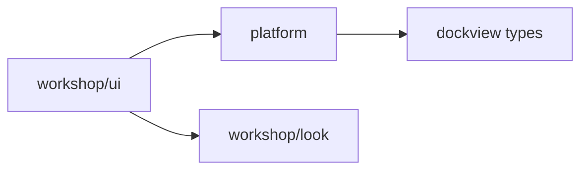
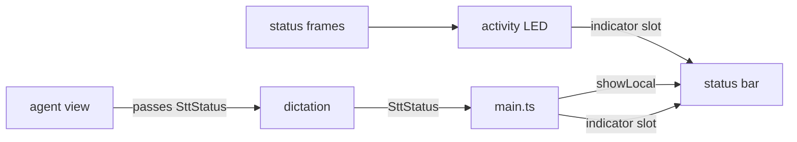

# Platform Extraction and Opening the Workshop Framework

<product-contract>

## Product Requirements

The Workshop SPA's framework (commands, menus, keybindings, context keys, services, panels, lifecycle) is mixed into the product app, and its layout core and status bar name specific features. This plan extracts the framework into its own workspace package and makes the core feature-agnostic, so features plug in by registering themselves and the product only assembles them. It is the framework half of making the agent view an independent package later, and it serves as an existence proof that the Workshop framework is decentralized. Users see the same app, with a tab right-click menu on every closable tab and a save prompt when closing an unsaved editor tab.

- Problem and users:
  - Users are the developers and coding agents working on the Workshop product family: the PromptForge Workshop desktop app and future sibling products that share its look and feel.
  - The mechanics live in `crates/workshop/ui/src/base/` and `crates/workshop/ui/src/services/`, mixed with product services, so a separate feature package (the planned agent view) cannot use them without importing the app.
  - The layout core names features:
    - a closed `PanelType` union and tab-name constants (`crates/workshop/ui/src/services/panel-registry.ts` lines 22-29);
    - five central panel registrations, including the only place where services import feature code (same file, lines 187-223);
    - agent special cases (`crates/workshop/ui/src/parts/layout/zones.ts` line 175, `layout-boot.ts` lines 35 and 38, `layout.contribution.ts` line 50);
    - three feature-specific tab classes, including an `AgentTab` with a hardcoded menu (`crates/workshop/ui/src/parts/layout/panel-types.ts` lines 140-228).
  - The status bar contract hardwires one LED (`setRecording`, `crates/workshop/ui/src/services/status-bar.ts` line 18), and the activity LED logic lives inside the status bar renderer (`crates/workshop/ui/src/parts/status/status-bar.ts` lines 66-113 and 169-188).
- Goals:
  - A new npm workspace member, `@workshop/platform` at `crates/workshop/platform/`, holds the family's browser-side mechanics. The app depends on it, and it imports nothing from the app or from `@workshop/look`.
  - No core module (`platform`, `parts/layout/`, the status bar host) names a feature, panel type, or feature LED. Features register their panel types, tab-menu rows and indicators themselves.
  - Clean wiring, like neatly routed cables in a datacenter:
    - components expose generic, labeled ports;
    - connections are made in one place, the composition root `crates/workshop/ui/src/main.ts`;
    - no component reaches into another's internals.
  - A tab right-click menu driven by the menu registry and evaluated against the clicked tab, with commands that act on the clicked tab.
- Non-goals:
  - The agent view package itself, splitting the agent frames out of `crates/workshop/ui/src/services/protocol.ts`, and the chip format on the wire.
  - Any Rust change: the server's boot-time requirements, `crates/workshop/protocol`, and the server's status vocabulary.
  - Real implementations of tab-menu rows beyond Close and Close Others.
  - Moving the menu, quick-input and keybinding-dispatcher widgets, or extracting the window frame into its own package.
  - Any change to `crates/shared-ui` or the Gateway config UI.
- Success criteria:
  - `platform` exists as a workspace member, and every existing suite passes.
  - A synthetic panel type and a synthetic status indicator, both unknown to the core, work end to end in behavior tests.
  - Dictation recording lights and dims the red LED exactly as before.
  - The default layout, the tree tab without a close button, the run tab shimmer, and multiple agent instances all behave as before.
- Constraints:
  - Target repository: `promptforge` at `C:\Users\Vinnie\cursor\promptforge`, on `master`. The operator redirected the run here from the `promptforge2` worktree, which sat at the same commit. Every path in this plan is relative to its root. The base is `master` at `ee28be77` ("Close plan: look-fork-debts"). `vibe2`, which carries the look fork and its debt removal, was rebased onto `master`'s engine commits and fast-forwarded into `master`. The engine commits don't touch the Workshop TypeScript packages, so every file and line reference below, taken from the pre-rebase tree, still applies.
  - `platform` is TypeScript browser code only. It has no `Cargo.toml`, like `crates/workshop/ui` and `crates/workshop/look`; `workshop-server`'s build script bundles whatever `ui` imports. Node and npm are build-time and test-time tools only.
  - Recording must not break. User: "be certain you dont break recording".
  - No saved-layout compatibility is required. User: "I dont care about saved layouts, no one is using this yet!"
  - Structural enforcement (import walkers, allowlists, source scans, topology checks) needs explicit user approval, per the repository's engineering policy (`AGENTS.md` lines 59-60). Only the platform boundary test is approved.
- Open questions: None

## Functional Specification

Developers import mechanics from `@workshop/platform` and register features from their own contribution modules. Users get the same app, with a registry-driven menu on every closable tab. Close, Close Others and the tab's X button all act on the intended tab and confirm unsaved editors before closing anything. The status bar shows the same two LEDs, now contributed rather than built in.

- Actors and workflows:
  - **A developer adds a feature.** It registers everything from its eager `*.contribution.ts` module: its panel type (type, title, zone, closable, panel id, lazy load), its commands, its menu rows including tab-menu rows, and its indicators. Layout, `platform` and the status bar are untouched.
  - **A user right-clicks a closable tab.** A menu opens at the pointer, showing the rows whose `when` clauses match the clicked tab.
    - Close closes that tab.
    - Close Others closes the group's other closable tabs.
    - Stub rows appear disabled under their final names and shortcuts.
    - A non-closable tab (the workspace tree) opens no menu.
  - **A user clicks a tab's X.** It follows the same confirm-then-close path as the Close command, so an unsaved editor prompts. Today it closes without prompting (verified: `crates/workshop/ui/src/parts/editor/editor-panel.ts` has no close interception, and only `closeActiveEditor` in `crates/workshop/ui/src/parts/editor/editor-commands.ts` lines 79-82 calls `EditorPanel.requestClose`).
  - **A user records dictation.** The red LED lights for a live take and dims when the take ends, is discarded, fails, or the socket drops.
  - **A user opens the app with an old saved layout.** It falls back to the default layout: the tree on the left at 280px and the agent on the right.
- Inputs and outputs:
  - Tab-menu commands receive `{ panelId }` as their first argument. The same commands run from the File menu, the command palette or a keybinding receive none, and act on the active panel.
  - Server status frames over `/ws` drive the activity LED as today: amber while thinking, a green pulse while generating.
- States and validation:
  - Panel identity is `panelId(params)` when the entry defines it, else `type:instance` when `params.instance` is a string, else `type`. Reopening an id that's already open reveals that panel.
  - Registering a duplicate panel type or indicator id throws.
  - `activeEditor` holds the active panel's type id (`editor`, `agent`, `tree`, `run` or `config`), and is unset when no panel is active. Inside the tab menu, it holds the clicked tab's type.
  - An indicator's state is `green`, `amber`, `red`, or off.
- Errors and recovery:
  - Closing with unsaved changes has two phases:
    1. **Confirm.** Each dirty panel is activated and then prompted, one at a time. Cancel, or a failed save, aborts the whole batch, and nothing closes. Saves and discards already made stand.
    2. **Close.** If nothing aborted, every panel in the batch closes.
  - A v4 saved layout is rejected, and the default layout applies.
- Security and privacy behavior: None
- Acceptance criteria:
  - All workspace npm suites pass. `cargo build -p workshop-server` succeeds, and reruns its build script when a `platform` file changes.
  - Operator checks:
    - the default layout, the tree tab, the run shimmer, multiple agents, and relaunch-restore of a layout saved after the change;
    - the tab menu on editor, run and agent tabs, and none on the tree;
    - the X on an unsaved editor prompts;
    - the mic lights and dims the red LED, including with two agent panels open and after a restored layout mounts an agent panel;
    - dictation errors still show on the status bar;
    - the activity LED pulses green and holds amber.

</product-contract>
<implementation-contract>

## Technical Design

The design has four parts. The `platform` package holds the moved mechanics. The panel registry becomes open-ended, with a single generic tab. The tab menu evaluates against the clicked tab through a context overlay and closes through a confirm-then-close path. The status bar hosts indicator slots that features fill. The composition root, `main.ts`, is where the product wires everything together: the layout policy, the recording LED, and dictation's status port.

- Architecture:

  - `platform` (behavior) and `look` (visuals) are independent siblings. Neither imports the other, and neither imports `ui`. `ui` depends on both, and future family feature packages will too.
  - Status bar wiring after the change:

  - The inference LED is driven by the server. Agent sessions run in the harness inside `workshop-server`, and the server's per-session status reporter (`crates/workshop/server/src/agents/status.rs` lines 68-73) publishes thinking and generating on the status bus. The SPA receives them as `/ws` status frames; the browser agent view never touches the LED. `platform` can't own that LED, because the frame type is product protocol (`crates/workshop/ui/src/services/protocol.ts`), so `platform` provides the slot and the product's status part owns the activity LED.
- Modules and interfaces:
  - **`@workshop/platform` contents** (flat package root, one `exports` entry per file):
    - `event`, `lifecycle` and `result` (`Result<T, E>`, `ok`, `err`);
    - `service-registry`, `command-registry` and `menu-registry` (including `MenuId`);
    - `keybinding-parser`, `keybinding-resolver` and `keybinding-registry`;
    - `context-key-expr` and `context-key-service`;
    - `action-registry`, `quick-access-registry` and `reconnect-backoff`;
    - `text-control-service`, `status-bar` (the `StatusBar` contract and `STATUS_BAR` token), `workshop-part`, `panel-registry` and `status-indicators`.
  - **Dockview in `platform`:** imports are type-only. `workshop-part` and `panel-registry` are the DOM- and Dockview-aware modules; everything else is DOM-free apart from `text-control-service`'s focus tracking and `keybinding-parser`'s platform detection through `navigator`.
  - **Panel registry API:** `registerPanelType`, `registerPanelFactory`, `isPanelType`, `panelTypeEntry`, `loadPanelType`, `resolvePanelContent`, `LazyPanelHost`, the `DOCK` token, and the types `ZoneName`, `ZONE_NAMES` and `PanelParams`.
    - Entry: `{ type: string, title: string | ((params) => string), defaultZone, closable?: boolean (default true), panelId?: (params) => string, load: () => Promise<module> }`.
    - `PanelType` is `string`.
    - Registering a duplicate type throws.
    - Params must be JSON-safe, because Dockview serializes them into the saved layout.
  - **Status indicators contract** (`status-indicators`): the `STATUS_INDICATORS` token.
    - `register({ id, name, order, decorative? })` returns `{ set(state, tooltip?), dispose() }`.
    - `state` is `"green" | "amber" | "red" | null`, where null is the unlit lens.
    - `name` becomes the `aria-label`, joined with the current tooltip when there is one, unless `decorative: true`, which sets `aria-hidden`. A tooltip sets the element's `title`.
    - `order` sorts ascending, left to right.
    - Registering a duplicate id throws.
  - **`StatusBar` contract:** `showLocal(label, severity)`, `isVisible` and `setVisible(visible)`. `setRecording` is removed.
  - **`WorkshopPart`:** stores its Dockview panel api in `init`, and adds `confirmClose(): Promise<boolean>`, which resolves `true` by default. `EditorPanel` overrides it: when dirty, it shows its dialog and resolves `true` after Save succeeds or after Don't Save, and `false` on Cancel or a failed save.
  - **Menus:** `MenuId.EditorTitleContext = "editor/title/context"`.
  - **The menu widget** (`crates/workshop/ui/src/parts/menu/menu.ts`) opens with `open(menuId, anchor, context?, overlay?)`. The overlay is a set of context keys checked before the global context service. It governs row `when`, `precondition` and `toggled`, submenus, and keybinding-label lookup.
  - **Product tokens in `crates/workshop/ui/src/services/`:** `LAYOUT_POLICY`, for `LayoutPolicy { anchors: readonly string[]; seed(): void }`, and `STT_STATUS`, for dictation's `SttStatus { showLocal, setRecording }`. The `SttStatus` interface moves there from `crates/workshop/ui/src/parts/stt/stt.ts`.
- File and public API changes:
  - The npm workspace (`crates/workshop/package.json`) gains the member `platform`, and `crates/workshop/ui/package.json` gains `"@workshop/platform": "*"`.
  - Moved into `crates/workshop/platform/` with `git mv`, keeping their file names:
    - from `crates/workshop/ui/src/base/`: `event.ts`, `lifecycle.ts`, `workshop-part.ts`;
    - from `crates/workshop/ui/src/services/`: `service-registry.ts`, `command-registry.ts`, `menu-registry.ts`, `keybinding-parser.ts`, `keybinding-resolver.ts`, `keybinding-registry.ts`, `context-key-expr.ts`, `context-key-service.ts`, `action-registry.ts`, `quick-access-registry.ts`, `reconnect-backoff.ts`, `text-control-service.ts`, `status-bar.ts`;
    - the panel-registry machinery from `crates/workshop/ui/src/services/panel-registry.ts`.

    `crates/workshop/ui/src/base/paths.ts` stays in the app.
  - New files:
    - `platform/result.ts`, `platform/status-indicators.ts`, `platform/AGENTS.md`, `platform/test/boundary.mjs`;
    - `ui/src/parts/layout/panel-tab.ts` (the generic tab) and `ui/src/parts/status/activity-indicator.ts`;
    - `ui/src/services/stt-status.ts` and the `LAYOUT_POLICY` token module.
  - Deleted symbols:
    - `PERMANENT_TAB`, `AGENT_TAB`, `RUN_TAB`, the `PanelType` union and the `tabComponent` entry field;
    - `PermanentTab`, `AgentTab` and `RunTab`;
    - `setRunTabLoading`, which becomes `setTabLoading(panelId, loading)`;
    - `StatusBar.setRecording` and `StatusBar.clearActivity`, which has no caller.
  - `error-catalog.ts` keeps `ErrorCatalog`, `CatalogError`, `isCatalogError` and `errorText`. Its `Result` becomes a type alias of platform's `Result` with the `CatalogError` default.
  - `look` changes:
    - The LED modifier classes are renamed in `crates/workshop/look/status-bar.css`: `--generating` becomes `--green`, `--thinking` becomes `--amber`, and `--recording` becomes `--red`.
    - A new token, `--led-red: #ff2a4d`, is added to `crates/workshop/look/tokens.css`.
  - LED elements become `span.status-bar__led[data-indicator="<id>"]`, with ids `recording` and `activity`, replacing the `status-bar__led--rec` marker class.
  - `LAYOUT_SCHEMA_VERSION` goes from 4 to 5 (`crates/workshop/ui/src/parts/layout/layout-persistence.ts` line 25).
  - New commands: `workbench.action.closeOtherEditors`. `workbench.action.closeActiveEditor` now accepts an optional `{ panelId }`.
- Data, persistence, failure, security, and privacy constraints:
  - **Saved layouts:** a saved v4 layout envelope is rejected and the default layout applies. Panel params are the restore contract, so they must stay JSON-safe.
  - **One copy of each registry.** The registries are module-level singletons. Every import of a moved module must resolve to `@workshop/platform`, never to a leftover relative path; a second copy would split registrations silently. The npm workspace resolves the package to one path.
  - **Registration timing:**
    - Panel types register from contribution modules that evaluate before `applyLayoutOrDefault`.
    - The recording indicator and `STT_STATUS` register before the layout restores. Otherwise a restored agent panel falls back to a silent status port and the red LED dies without an error.
  - **Unsaved editors:** no state, including any intermediate one, may close an unsaved editor without its confirmation, whether through the X, the Close command, or Close Others.
  - **Recording:** the recording path's call sites and timing are unchanged. Only the far end of `setRecording` moves, from the status bar to an indicator handle.

</implementation-contract>
<verification-contract>

## Testing Plan

The existing suites are the invariant. Tests follow the modules they cover, and tests that pin old paths or semantics are updated in the same change as the code. Openness is proven by behavior: a synthetic panel type and a synthetic indicator the core has never heard of must work end to end. The only structural check added is the approved platform boundary test. Recording is verified on the real composition and by an operator check.

- Unit:
  - These tests import only platform modules and no `ui/test/helpers/`, so they move to `crates/workshop/platform/test/` and bundle from absolute paths inside the package, as `crates/workshop/look/test/*.mjs` does: `lifecycle.mjs`, `service-registry.mjs`, `context-keys.mjs`, `keybindings.mjs`, `quick-access.mjs`, `reconnect-backoff.mjs`, `actions.mjs` and `workshop-part.mjs`.
  - These stay in `crates/workshop/ui/test/` because they also import `parts/`: `menus.mjs` (`open-recent.ts`), `menu-registries.mjs` (`menubar.ts`), `text-control-service.mjs` (`edit.contribution.ts`) and `disposable-adoption.mjs`. `helpers/leak-check.mjs` stays with them.
  - `crates/workshop/platform/test/boundary.mjs` (the approved structural exception) mirrors `crates/workshop/look/test/boundary.mjs`: `importSpecifiers` plus a `violation` classifier. It allows relative paths that stay inside the package, and `dockview`. It rejects `@workshop/look`, the Workshop UI, other packages, and relative paths that escape the package.
  - New `crates/workshop/ui/test/status-indicators.mjs`:
    - indicators render in `order` with stable elements;
    - `set` shows exactly one color, and `null` clears it;
    - a tooltip updates `title` and the accessible label;
    - `decorative` sets `aria-hidden`;
    - `dispose` removes the element;
    - a duplicate id throws;
    - a synthetic `"probe"` indicator runs through every color and back to off.
  - `crates/workshop/ui/test/error-catalog.mjs` (lines 69-72) takes `ok` and `err` from `@workshop/platform/result`.
- Integration and end-to-end:
  - About 134 path references in 62 files under `crates/workshop/ui/test/` point at moved modules. The tests that stay rewrite their esbuild stdin specifiers and absolute `entryPoints` to `@workshop/platform/<file>`, which resolves from their existing `resolveDir` (`crates/workshop/ui`) through the workspace link. Update the path comments in `helpers/bundle-seams.mjs` and `helpers/leak-check.mjs`.
  - Dock and zone test bundles must import the contribution modules for the panels they open, or `workbench.contributions.ts`. Otherwise the built-in panel types are missing: `workshop-zones.mjs`, `run-panel.mjs`, `zone-stability.mjs` and `lazy-panel-sizing.mjs` bundle only layout modules today, and `workshop-layout.mjs` (lines 55-57) lacks the agent contribution.
  - `helpers/lazy-feature.mjs` gets `registerPanelFactory` through `globalThis` to avoid a second registry instance (lines 8-11; set by `panel-registry.mjs` line 45). Keep injecting it from the same esbuild graph that bundles `@workshop/platform`.
  - New `crates/workshop/ui/test/layout-open-registry.mjs` registers a synthetic `"probe"` panel type, opened both with and without an `instance` param, plus a custom `panelId` and title function, and a `closable: false` variant. It proves that each of these works for it:
    - opening, instance keying and titles;
    - close buttons and the absent menu on the non-closable variant;
    - zone placement and save-then-restore;
    - throwing on a duplicate registration.
  - Update for the new panel API:
    - `panel-registry.mjs`: its built-in metadata assertions (lines 102-124) move to contribution-registered entries;
    - `workshop-zones.mjs`, `workshop-layout.mjs`, `zone-stability.mjs` and `workspace-switch.mjs`;
    - `run-panel.mjs`: the shimmer rename to `setTabLoading`;
    - `lazy-panel-sizing.mjs`: its synthetic `"sized"` type keeps a unique id;
    - `disposable-adoption.mjs`: lines 37 and 228 use `PERMANENT_TAB`;
    - `boot-ui-storage.mjs`: its seeded layout (lines 122-123) becomes a v5 envelope with the generic tab name.
  - Tab-menu tests:
    - the menu opens at the pointer with the registry rows;
    - a test-only row with `when: "activeEditor == 'agent'"` shows only on agent tabs;
    - Close acts on the clicked tab, not the active one;
    - a non-closable tab opens no menu;
    - `activeEditor` holds the right type for each panel;
    - the X on an unsaved editor prompts, and cancelling keeps the tab;
    - Close Others with two unsaved editors activates and prompts for each one in turn: cancelling either closes nothing, and answering both closes them all, clean panels included.
  - Update the tests that pin the old `activeEditor` semantics:
    - `editor-commands.mjs`: lines 539 and 578 (the preconditions) and 869-876 (`activeEditor === panel.id`, now the type id);
    - `files-actions.mjs` lines 273-275;
    - `editor-settings.mjs` lines 389-390;
    - `menu-spec.mjs`: the stub placements and the dual placement of `moveEditorToNewWindow`.
  - LED test updates:
    - `activity-led.mjs` and `led-error-after-thinking.mjs` move to `--green` and `--amber`.
    - `agent-stt-boot.mjs` (lines 21-101) moves to `--red`.
    - `helpers/boot.mjs` (lines 356-357) selects `[data-indicator="activity"]` and `[data-indicator="recording"]`, which also fixes `barberpole-beside-indicators.mjs` and `workbench-mount.mjs`.
    - `disposable-adoption.mjs` (lines 198-265) constructs and disposes the activity indicator itself, because `StatusBar.render` no longer lights the LED and no longer owns the pulse timer.
    - `crates/workshop/look/test/shared-status-bar.mjs` pins no LED modifiers.
  - Recording on the real composition:
    - `node test/agent-stt-boot.mjs` passes: the LED starts dark, lights red for a live take, and dims when the Realtime socket drops.
    - A booted workbench whose restored layout includes an agent panel still lights the LED. This proves `STT_STATUS` registers before the layout mounts panels.
- Regression, security, and performance:
  - These must pass unchanged: `agent-stt.mjs`, `stt-stream.mjs` and `agent-session-view.mjs`, which use fake `SttStatus` objects, and `status-frames.mjs`.
  - The LED already turns off in every case where the take registry emits `recording: false`: user stop, discard when the wait dies, socket drop, overload and failure. Those paths aren't touched.
  - Ctrl+F4 still closes the active editor while it has text focus. The keybinding's `when: "editorTextFocus"` (`editor.contribution.ts` line 209) is unchanged.
  - Gateway is unaffected: it uses `crates/shared-ui`'s status bar, which keeps its old class names.
  - `docs-claims.mjs` only forbids three phrases in `AGENTS.md` ("TOML config", "three named buckets", "three homes"), none of which the doc edits introduce.
- Exit criteria:
  - At `crates/workshop`: `npm ci`, `npm run typecheck --workspaces --if-present`, `npm run build --workspace ui` and `npm test --workspaces --if-present` all pass. The CI UI job already runs typecheck and test across all workspace members.
  - `npm ls dockview @workshop/platform` shows one copy of each. This is a one-time check, not a committed test.
  - `cargo build -p workshop-server` succeeds, and editing a `platform` file reruns its build script. `build-ui` watches every workspace member (`crates/build-ui/src/lib.rs` lines 150-157), so adding `platform` to `workspaces` covers it.
  - `git status` is clean after install, build and test.
  - Before the operator visual check, delete the local saved workspace, so the app starts from the default layout. Today `C:\Users\Vinnie\.promptforge\last-workspace` names `C:\Users\Vinnie\.promptforge\workspaces\test.pfwork`; delete that file and the pointer. The schema bump makes this redundant, but the user asked for it.
  - The operator checks listed in the Functional Specification's acceptance criteria all pass.

</verification-contract>
<decision-record>

## Decision Record

The design rests on four decisions. Browser-side mechanics become a family package, beside the visual package. Features register themselves, and the core names none of them. Every connection is wired at the composition root. And recording and unsaved work are protected through every change. The user's words and the prior art that shaped each decision are recorded below, along with what was rejected and why.

- Decisions:
  - **A separate behavior package, `@workshop/platform`, next to the visual package `@workshop/look`.** The product family shares both its look and its feel, so the mechanics become a family package that features and products depend on. User: "we want the UI to be consistent across views in the Workshop. even a separate product, should have a UI consistent with the Workshop". It's also an existence proof of a decentralized framework. User: "doing this, acts as an existence proof that the workshop framework is decentralized".
  - **Name: `platform`.** It's VS Code's name for the same layer, and it pairs with `look` (visuals versus behavior). User on the alternative: "I hate the name workbench".
  - **Scope: only the framework.** User: "make a new plan which is JUST platform extraction and opening up the framework"; "we are not doing that part, just the framework refactor".
  - **The framework refactor comes before the agent-view extraction,** so the agent view registers itself against the final API and no throwaway adapter is built. User: "shouldn't we do the workbench refactor first?"
  - **`platform` is browser-only TypeScript with no Rust half.** Its code reaches the product through the existing `workshop-server` bundle build. The server's own framework layer already lives in the Rust crates `workshop-registry`, `workshop-support` and `workshop-protocol`.
  - **Only mechanics move, plus the status bar contract.** Every feature posts status messages, and a separate feature package must be able to name that contract. Product services, the other token-only contracts (`quick-input-service`, `commands-history`, `closed-editors`, `editor-settings-service`), `json-request` and all widgets stay in the app.
  - **`Result`, `ok` and `err` split out of `error-catalog.ts`** into platform `result.ts`, because the moved parsers need them. `CatalogError` and the product error codes stay in the app.
  - **Features register their own panel types** from their eager contribution modules, and the panel registry accepts any string id. This removes the central list and the one place where services imported feature code.
  - **No `multiInstance` flag.** Identity is `panelId(params)`, or `type:instance` when an `instance` param is given, or `type`. That rules out contradictory flags, and follows VS Code's `EditorInput.matches` and Theia's options-keyed widget cache.
  - **Duplicate registrations throw** for panel types and indicators, so decentralized features can't silently overwrite each other. VS Code's `Registry.add` and `MenuId` do the same.
  - **One generic tab for every panel,** through Dockview's `defaultTabComponent` (present in the installed dockview-core, `options.d.ts` line 680), registered under a single name. It lands together with the registry-driven tab menu and has no interim inline menu. That way no intermediate state lets Close Others bypass save prompts on editor tabs, and none drops the agent tab's menu.
  - **The tab's X closes through the same confirm-then-close path as the Close command.** This fixes today's silent loss of unsaved edits. User: chose "Route the X through the same confirm-then-close path as the Close command".
  - **Confirm first, then close, for batches.** Each dirty panel is activated and prompted, one document per prompt. The first cancel or failed save aborts the batch and nothing closes; earlier saves and discards stand. This matches VS Code's `closeEditors` and `handleCloseConfirmation` and Theia's `closeMany`.
  - **`activeEditor` follows VS Code:** it holds the active panel's type id for every panel, as VS Code's `ActiveEditorContext` is `activeEditorPane.getId()`. Editor-only preconditions become `activeEditor == 'editor'`. User: chose "Align with VS Code".
  - **The tab menu is evaluated through a context overlay** that sets `activeEditor` to the clicked tab's type. Commands receive `{ panelId }` as their first argument. The overlay also drives submenus and keybinding labels, as VS Code's scoped tab context does. Passing an explicit panel id is cleaner than Theia's event adapter or JupyterLab's DOM hit test.
  - **Tab-menu rows:** the menu's shape copies the editor-tab menu of Cursor, a VS Code fork. Close and Close Others are real, and its other rows (Close to the Right, Close Saved, Close All, Keep Open, Pin, Reopen Editor With, Move into New Window) are disabled stubs under their final VS Code ids and shortcuts. The split rows are excluded until those commands accept a target.
  - **The Close keybinding is unchanged.** Ctrl+F4 keeps `when: "editorTextFocus"`, and its tab-menu row shows Ctrl+F4 as the label.
  - **The product layout policy moves to the composition root** ("tree left at 280px, agent right"). The policy is resolved as a service token, because both boot and Open Workspace apply it.
  - **Status bar LEDs become contributed indicator slots,** with clean wiring. The user added this to the plan, where it was first drafted as a fourth step. User: "make it a step 4 here but be certain you dont break recording. I want a clean architecture, like neatly routed cables in a datacenter."
  - **The inference LED stays server-driven and product-owned on the client.** User: "the agent view would not drive the LED, it would be driven by the workshop-server's harness".
  - **Indicator states are lamp colors** (`green`, `amber`, `red`), not feature words. `look` themes each color through its `--led-*` tokens, and the contributor decides what a color means.
  - **Indicators carry a required `name`, an optional tooltip, and a `decorative` flag,** for accessibility and a future show-or-hide menu. This follows VS Code's required `name` and `ariaLabel` and Theia's tooltip support. `decorative` keeps today's `aria-hidden` on the activity LED.
  - **No saved-layout compatibility:** the layout schema goes to v5, and the local saved workspace is deleted before the visual check. User: "I dont care about saved layouts, no one is using this yet! just delete my existing workspace sqslite db".
  - **One structural exception, the `platform` import-boundary test.** The `platform`/`look`/`ui` layering is a stable boundary with no ordinary equivalent, because the hoisted workspace install lets every package resolve every other one. User: "Approve: add platform/test/boundary.mjs".
  - **Openness and genericity are proven by behavior tests with synthetic features,** not by source scans, following the repository's preference for types and behavior tests over structural checks.
  - **Documentation and rules are aligned:**
    - tightened: SPA rule globs widened to `look` and `platform`, a new `platform/AGENTS.md`, the panel-registry import exception deleted, the recording red tokenized;
    - loosened: framework contracts may live in `platform` as well as `services/`;
    - vocabulary: `platform` added, `contribution` and `zone` updated, and the window frame no longer called `shell`.
  - **No change to Cargo or `build-xtask`.** They inspect only Rust, and `crates/workshop` is a manifestless container whose Rust members are listed explicitly (root `Cargo.toml` lines 3 and 13).
  - **A targeted prior-art check, not a broad field survey.** The fields were surveyed earlier in the month, and the design was already settled. User: chose "Targeted check".
  - **Straightforward bugs found during the run are fixed in it, in a final step.** User, mid-run: "fix all discovered pre-existing bugs ... if they are reasonably straightforward". This brings in the Delete and Backspace keyboard close, first deferred as pre-existing, and the step 3 tab-title fallback regression. Keyboard close goes through the same confirm-then-close path as the X, because Dockview's handler closes unsaved editors with no prompt.
- Rejected alternatives:
  - **Putting the mechanics in `look`.** `look` is the visual layer, and registries are behavior. Revisit: never.
  - **A convention-only boundary**, where features export plain data and each host writes adapters. Family products share the same mechanics, so shared contracts beat per-host adapters. Revisit if a non-family shell must host a feature.
  - **The names `workbench`, `host-ui` and `shell`.** The user rejected `workbench`. "Host" already means the shell product and would point the dependency the wrong way. `shell` is reserved for a terminal command shell. Revisit: never.
  - **Mapping legacy tab names** for old saved layouts: no one uses the app yet. Revisit if the app gains users with saved workspaces.
  - **A runtime `globalThis` sentinel** against a second copy of `platform`. Many ui tests deliberately load several esbuild bundles in one process, so it would throw there, and workspace resolution plus the boot tests cover the real risk. Revisit if a duplicate copy ever ships.
  - **A committed single-copy bundle check, a layout-core string scan, and a status bar word scan.** These are structural checks, and behavior tests cover the same risks. Revisit: never, unless a regression slips past the behavior tests.
  - **Semantic indicator states** (VS Code's `kind`) in place of colors. VS Code's status items are text, where `kind` themes the text; an LED's color is its primitive. Revisit if text or other non-lamp indicators are added.
  - **ESLint package-boundary rules,** as in Theia: the repository has no linter, and the boundary test covers `platform`. Revisit if the repository adopts ESLint.
  - **A combined save dialog for Close Others:** VS Code and Theia prompt once per document here. Revisit when Close All goes live; VS Code uses a combined prompt there.
  - **An interim inline tab menu** before the registry-driven one: it would let editor tabs close unsaved work without a prompt. Revisit: never.
  - **Keeping the X's silent close:** the user chose to confirm. Revisit: never.
  - **A Rust crate for `platform`:** it has no server-side behavior. Revisit: never; server mechanics belong in the Rust vocabulary crates.
  - **A full field survey** instead of the targeted check: the same references had been surveyed that month, and the plan was settled. Revisit before designing the agent-view package.
- Assumptions, risks, and notes:
  - **Base drift:** file and line references were taken before `vibe2` was rebased onto `master`. The rebase added only engine commits, so the Workshop TypeScript is unchanged. If a reference doesn't match, re-locate it by content before editing.
  - **Prior-art references,** pinned: VS Code `6ed05a17ea68d096e122f0866e8ee3aec612f2c5`, Theia `8b94967c4cfa0dcf688a345d28b3ac2e0d7e298a`, JupyterLab `3daf43dac618ef494341b29d18c8095a70c11586`, Lumino `d9b39db2c6d609af334729eeba2ab9376a11c0a7`.
  - **Deviation:** VS Code's tab menu doesn't override `activeEditor`; it sets resource keys. Workshop panels have no resource URI, so overriding `activeEditor` for the clicked tab stands in for per-tab identity.
  - **Registration order is safe today.** `main.ts` line 36 statically imports `parts/menu/index.ts`, whose line 10 imports `workbench.contributions.ts`, so every contribution runs before `applyLayoutOrDefault` (`main.ts` line 235). Changing that import to a lazy one would break panel restore; a comment at the import must say so.
  - **Recording LED silent-failure risk.** The agent panel factory resolves its status port through `getServiceOrNull` (`crates/workshop/ui/src/parts/agent/index.ts` lines 36-43) and falls back to `SILENT_STATUS`, whose `setRecording` does nothing (`agent-panel.ts` lines 18-25). `STT_STATUS` must be registered beside `STATUS_BAR` (`main.ts` line 173), before `applyLayoutOrDefault`.
  - **Unbound `this` risk.** `StatusBar.showLocal` uses `this.view`, so dictation's port must wrap it in an arrow function, never pass the bare method.
  - **Dropped-argument risk.** `runEditorTask` returns a zero-argument thunk that drops menu arguments (`editor.contribution.ts` lines 59-63; Close at line 211). It must forward `...args`.
  - **Stale-writer risk.** `bindEditorContextKeys` writes `activeEditor` as a panel id (`editor-lifecycle.ts` lines 80-86). That writer must be removed, or it overwrites the type id once the editor chunk loads.
  - **Import-cycle risk.** `parts/menu/index.ts` imports `workbench.contributions.ts`, which imports `layout.contribution.ts`, so layout code must import `parts/menu/menu.ts` directly, never the barrel.
  - **Windows editor ids** like `editor:C:\...` parse correctly only because `panelTypeFromId` splits at the first colon (`zones.ts` lines 185-188). Never split on the last colon.
  - **Close Others must skip `closable: false` panels.** Today's `AgentTab` closes every other panel in its group without a check (`panel-types.ts` lines 199-205) and would close the tree if it shared the group. "Non-closable" governs user gestures only: `toggleWorkshopPanel` (`workshop-panel.ts` lines 420-425) still removes the tree by command.
  - **`when` syntax:** expressions use single-quoted string literals; the parser rejects double quotes (`context-key-expr.ts` lines 153-160).
  - **Chords:** `ctrlcmd+m u`, `ctrlcmd+m w`, `ctrlcmd+m enter` and `ctrlcmd+m shift+enter` are unclaimed. The `ctrlcmd+m` prefix is already claimed by about a dozen chords, so the stubs add no new swallowed keys. None of the stub ids is registered yet.
  - **The pulse duration** is read from `getComputedStyle(document.documentElement)`: `--led-pulse-ms` is defined on `:root` in `crates/workshop/look/tokens.css`, and jsdom falls back to 250 ms.
  - **Naming:** `@workshop/platform/status-bar` (the contract) and `@workshop/look/status-bar` (the view) are different modules. Say which one in reviews.
  - **Third-party notices:** none travel with the moved files, which carry only VS Code pattern comments; `crates/workshop/ui/THIRD_PARTY_NOTICES.md` lists no derived source.
  - **Rule globs:** multiple patterns in `.cursor/rules/*.mdc` use a comma-separated single string, for example `crates/workshop/ui/**,crates/workshop/look/**,crates/workshop/platform/**`.

### Deferred and Out of Scope

- Deferred:
  - Moving the tree's focus and toggle helpers behind a lazy import, so `workshop-panel.ts` leaves the entry bundle (`workspace.contribution.ts` line 38 imports it statically). Pre-existing. Revisit with a startup-bundle size pass.
  - A `common/` and `browser/` split inside `platform`, with a separate entry point for the Dockview-aware part base and panel registry. Revisit when a second consumer needs the DOM-free subset.
  - Per-tab context keys (`activeEditorIsDirty`, `activeEditorIsPinned`, first and last in group). Revisit when the stubbed tab rows go live.
  - One combined save prompt for Close All. Revisit with the Close All implementation.
  - A `rank` for panel order within a zone. Revisit when a zone holds more than one kind of panel by default.
  - Click commands on indicators, and a user menu to show or hide indicators, keyed by their stable ids and names. Revisit when a third indicator exists.
  - Real implementations of Close to the Right, Close All, Close Saved (which needs a generic unsaved-changes capability), Keep Open and Pin (which need preview tabs), the split rows with a target, Move into New Window, and Reopen Editor With. Revisit per row.
  - Moving the menu, quick-input and keybinding-dispatcher widgets and the remaining token-only contracts into `platform`, and extracting the window frame (title bar, dock zones, layout persistence) into its own package, not named `shell`. Revisit when `ui` holds little besides the window frame.
  - The workspace Add Folder rules in `crates/workshop/ui/src/parts/layout/zones.css`. Revisit when that CSS moves with the workspace feature.
  - Server-side decentralization: `compose.rs` requires `Harness` and `AgentSessions` at boot. Revisit with the agent-view extraction.
  - The server's status vocabulary: `Activity::Thinking` and `Activity::Generating` in `crates/workshop/protocol`, published by `crates/workshop/server/src/agents/status.rs` lines 68-73. Revisit with the agent-view extraction.
  - Dictation as its own package, which would take `SttStatus` and `STT_STATUS` with it. Revisit when dictation is extracted.
- Out of scope:
  - The agent view package and its Rust half.
  - Any change to `crates/shared-ui` or the Gateway config UI.
  - Renaming the `--ws-` token prefix.

</decision-record>
<project-survey>

## Project Survey

- Status: complete
- Build command:
  - First run `npm ci` in `crates/workshop`. The npm workspace root has no `node_modules` yet, and `crates/workshop/ui/node_modules` is a stale per-package install that still holds `shared-ui` and no `@workshop/look`.
  - UI bundle: `npm run build --workspace ui` in `crates/workshop` (runs `ui/build.mjs`, writes the gitignored `ui/dist/`).
  - Rust: `cargo build --locked -p workshop-server`. Its build script bundles the UI into `OUT_DIR` through `build-ui::build_sibling("../ui", ...)` and watches the npm workspace root `package.json` plus every workspace member, so adding a member to `crates/workshop/package.json` makes Cargo watch it.
- Focused test command pattern:
  - UI: `node --test test/<name>.mjs` from the owning package directory (`crates/workshop/ui` or `crates/workshop/look`), for example `node --test test/menu-registries.mjs`.
  - Rust: `cargo nextest run --locked -p <crate> <test-name-substring>`, adding `--all-features` for every crate except the workshop trio (`workshop`, `workshop-server`, `workshop-server-api`), which runs without it.
- Component test command pattern:
  - UI: `npm test --workspace <member>` in `crates/workshop`. Members today are `ui` and `look`; the plan adds `platform`.
  - Rust: `cargo nextest run --locked -p <crate>` (same `--all-features` rule), then `cargo test --doc -p <crate>` because nextest skips doctests.
  - Structural and boundary harness: `cargo test -p build-xtask`.
- Full-suite test command:
  - `cargo nextest run --locked --workspace --exclude workshop --exclude workshop-server --exclude workshop-server-api --all-features`
  - `cargo test --workspace --exclude workshop --exclude workshop-server --exclude workshop-server-api --all-features --doc`
  - `cargo nextest run --locked -p workshop -p workshop-server -p workshop-server-api`, plus the CI extras `cargo nextest run --locked -p workshop-workspace --all-features`, `cargo nextest run --locked -p workshop-server --features headless` and `cargo test --doc -p workshop -p workshop-server -p workshop-server-api`
  - UI, in `crates/workshop`: `npm ci`, `npm run typecheck --workspaces --if-present`, `npm run build --workspace ui`, `npm test --workspaces --if-present`
- Linter command:
  - Rust: `cargo clippy --workspace --exclude workshop --exclude workshop-server --exclude workshop-server-api --all-targets --all-features -- -D warnings` and `cargo clippy -p workshop -p workshop-server -p workshop-server-api --all-targets -- -D warnings`, plus the headless gate `cargo check -p gateway --no-default-features`. Never run a standalone `cargo check --workspace` beside clippy.
  - UI: no TypeScript linter is configured (no eslint or biome anywhere). The static gate is `npm run typecheck --workspaces --if-present` in `crates/workshop`, which runs `tsc --noEmit` in each member.
- Formatter check command: `cargo fmt --all --check` (also the pre-commit hook). No TypeScript or CSS formatter is configured (no prettier or biome).
- Docs command:
  - `cargo doc --workspace --no-deps --all-features --exclude workshop --exclude workshop-server --exclude workshop-server-api` with `RUSTDOCFLAGS=-D warnings` (in PowerShell, `$env:RUSTDOCFLAGS="-D warnings"` first).
  - Facades with default features: `cargo doc -p promptforge --no-deps` and `cargo doc -p harness --no-deps`, same flags.
  - `cargo doc --locked --no-deps -p workshop-server --document-private-items`, same flags.
  - User guide: `cargo xtask site --books-only`. Facade surface: `cargo +<pinned nightly> xtask api --check`, with the nightly named in `crates/build-xtask/src/api/toolchain.rs`.
  - UI prose lives in Markdown `AGENTS.md` files; `crates/workshop/ui/test/docs-claims.mjs` fails on known-stale phrases as part of `npm test`.
- Test placement and naming conventions:
  - UI: one kebab-case `.mjs` file per subject in the package's top-level `test/` directory (`crates/workshop/ui/test/menu-registries.mjs`, `crates/workshop/look/test/boundary.mjs`), with shared helpers in `ui/test/helpers/`. No tests sit beside sources; the `src/**/*.test.mjs` glob in the `ui` test script matches nothing. Each file opens with a comment naming the modules it covers, what it covers, and a `// Run: node --test test/<name>.mjs` line. Most bundle the TypeScript under test with esbuild (stdin re-exports from `./src/...`) and drive it against jsdom built from the real `index.html`. Most assert through a local `check(name, condition)` helper that collects failures and exits nonzero; a few use `node:assert/strict` or `node:test`.
  - Rust: unit tests in an inline `#[cfg(test)]` module, a sibling `<stem>-tests.rs` wired with `#[path = "<stem>-tests.rs"]` (`crates/build-ui/src/lib-tests.rs`), or a `src/<module>/tests/<topic>.rs` directory once there are three or more files; integration tests in the crate's `tests/<snake_case>.rs`. Test functions have sentence-style snake_case names that state the behavior, such as `a_direct_launch_recovers_the_lease_from_a_terminated_owner`.
- Directory map:
  - `crates/`: every crate and npm package. Crates at the root are the public layer: the `promptforge` and `harness` facades, `gateway-api-types` and `gateway-api-discovery`, `shared-error-source` and `shared-loopback`, the `build-*` meta tooling (`build-xtask` structural harness and `cargo xtask`, `build-ui` bundling helper, `build-workshop` behind `cargo workshop`, `build-user-guide`, `build-llama-cuda`), and the hakari `workspace-hack`. `shared-ui` is npm-only TypeScript and CSS, excluded from Cargo, that `@workshop/look` forked from on 2026-09-27.
  - `crates/promptforge-internal/`: engine, lua, parser, types, vfs, model-client.
  - `crates/harness-internal/`: runner, sessions, capabilities, log, models, web, web-search, webfetch.
  - `crates/gateway/`: `app` (package `gateway`), cloud-providers, config, config-ui (a crate plus its own npm package in `config-ui/ui/`), local, logging, progress, protocol, routing, web-search, and `stt/` (api, engine, backend-whisper, whisper-ffi).
  - `crates/workshop/`: the npm workspace root (`package.json`, members `ui` and `look`) and the Rust crates `desktop` (package `workshop`, Tauri), `server`, `server-api`, `gateway`, `menu`, `protocol`, `registry`, `status`, `support`, `user-state`, `workspace`. `ui/` is the SPA: `src/base/` (4 files), `src/services/` (39 registries and services), `src/parts/<feature>/` (agent, chatbox, chrome, editor, gateway, layout, menu, quickinput, run, shared, status, stt, take, workspace, workspace-document), `src/tokens/component.css`, `src/main.ts`, plus `test/`, `build.mjs`, `index.html`. `look/` is `@workshop/look`, a flat package root of CSS token tiers and components with its own `test/`.
  - `guide/`: mdBook user guides and site sources. `prompts/`: five sample prompt programs. `tools/`: Node scripts for gateway sidecar staging and TTS checks (with `.test.mjs` files) and `tools/scripts/` Python for the facade-docs workflow. `vibe/`: plans, run records, `archdoc.md` and agent `scratch/`.
  - `.github/workflows/`: `ci.yml` (jobs fmt, clippy, test, docs, Windows check-workshop, check-workshop-linux, ui, supply-chain, api-surface, and the ci-green gate) and release workflows. `.githooks/`: pre-commit and pre-push. `.config/`: nextest and hakari. `.cargo/config.toml`: the `xtask` and `workshop` aliases and the Windows rust-lld linker. `local/` (gitignored) holds local configs; `target/` and `target-msrv/` are build output.
- Component boundaries:
  - Products: PromptForge (sans-I/O executor behind the `promptforge` facade), Harness (the executor's only production host, behind the `harness` facade, depending only on `promptforge`), Gateway (an independent process whose public surface is the `gateway-api-*` pair and which never depends on promptforge or workshop crates), and Workshop (depends on `harness`, `promptforge`, the gateway public pair and shared crates, never gateway internals). Shared crates depend on no product.
  - The four family containers are private: a crate inside one depends only on root crates and its own siblings, and only its facade reaches into it. `build-*` crates are exempt. Dependency rules bind every dependency kind.
  - Workshop Rust tiers flow one way: server, then features, then services, then vocabulary. The desktop app depends on `workshop-server-api`, never `workshop-server`.
  - Workshop SPA: inside `ui`, imports flow from `parts` to `services` to `base`, never back, except that `services/panel-registry.ts` dynamically imports each lazy part's `index.ts`. `main.ts` is the composition root and nothing imports it. Lazy panels never import the entry bundle (`main.ts` and the `*.contribution.ts` modules), and bundle guards in `ui/test/` enforce this. `@workshop/look` imports only its own files and `lucide`, enforced by `look/test/boundary.mjs`; `ui` depends on `look`. The SPA reaches Rust only through `workshop-server`'s build script at build time and the `/ws` socket and HTTP routes at run time.
  - `cargo test -p build-xtask` enforces the Rust tier graph, the product-boundary matrix, container privacy, the `## Invariants` markers and the 500-line ceiling.
- Conventions summary:
  - Reuse an existing facility, then make the smallest improvement to one, and add new machinery only for a material benefit. No new structural enforcement (parsers, allowlists, import walkers, topology checks) without explicit user approval.
  - Behavior changes ship with tests in the same change, and refactors preserve behavior tests.
  - Every workshop-* and harness-* `lib.rs` opens with a `//!` doc holding a `## Invariants` marker, and files in those crates stay at or under 500 lines. Source directories need at least three files; otherwise use `<parent>-<label>.rs` siblings with a `#[path]` attribute.
  - Comments explain only non-obvious constraints, and every workaround cites its upstream issue URL. Error and status messages are written for model consumption: concise, naming what is missing and the required versus actual value.
  - UI mechanics follow VS Code: `registerAction` calls in an eager `parts/<feature>/<feature>.contribution.ts`, verbatim VS Code command ids and context keys, a feature `index.ts` that exports only `register()` and never `export *`, unimplemented menu rows in `parts/menu/stubs.contribution.ts`, and service tokens in `services/` made with `createServiceToken`. Registries are module-level singletons holding registration data; application state lives in services with change emitters passed through constructors, never in mutable module globals.
  - CSS sits beside its TypeScript, with no raw color, size or spacing values: only `--ws-*` tokens from `@workshop/look`, with component overrides in `ui/src/tokens/component.css`.
  - No `localStorage`. Persisted UI values go through the `ui-storage` adapter to `/user/state` or `/workspace/file/state`, and a new key is allow-listed on the server first.
  - TypeScript and CSS file names are kebab-case. CI fails any build that dirties the working tree.

</project-survey>
<execution-plan>

## Execution Instructions

Five components, built in dependency order. The first four are each useful on their own and resemble a shippable package; the fifth fixes bugs found along the way.

- Component order:
  1. **`platform` package** - first, because every other component imports from `@workshop/platform`.
  2. **Open panel registry** - second, because the generic tab reads each entry's `closable`, title and type, and the layout policy reads `defaultZone`.
  3. **Generic tab and tab menu** - third, because it consumes the open registry's entries and must land its tab and menu together.
  4. **Status bar indicators** - last. It depends only on `platform` and could run beside components 2 and 3, but it matches the plan's todo order, and landing last puts the recording rewire on the final `main.ts` instead of under the registry and tab edits.
  5. **Run bug fixes** - added during the run at the operator's request: "fix all discovered pre-existing bugs ... if they are reasonably straightforward". Last, because the keyboard fix lives in the generic tab.
- Verification:
  - Every step runs its focused tests with `node --test test/<name>.mjs` from the owning package (`crates/workshop/platform`, `crates/workshop/ui` or `crates/workshop/look`).
  - The last step of each component (steps 2, 4, 7, 9 and 10) names the component gate in its Tests line: at `crates/workshop`, `npm ci`, `npm run typecheck --workspaces --if-present`, `npm run build --workspace ui` and `npm test --workspaces --if-present`; then `cargo build -p workshop-server`; then a clean `git status`. Verification runs the gate; coding and fix rounds run only focused tests.
- Standing rules for every step:
  - Each documentation edit lands in the step whose code it describes.
  - If a file or line reference doesn't match, re-locate it by content before editing (see Base drift in the decision record).
  - No structural enforcement beyond `platform/test/boundary.mjs`. Openness is proven by behavior tests with synthetic features.
  - No commit, including an intermediate one, closes an unsaved editor without its confirmation, drops the agent tab's menu, or leaves the recording LED dark during a live take.
  - Unchanged by design: `.cursor/rules/workshop-architecture.mdc`, `crates/workshop/server/AGENTS.md`, `crates/shared-ui`, the Gateway config UI, Cargo manifests and `build-xtask`. `docs-claims.mjs` forbids three phrases in `AGENTS.md` ("TOML config", "three named buckets", "three homes"), and no doc edit may introduce them.

<step-1>

### Step 1: Create the `@workshop/platform` package with the result module [completed]

- Component: `platform` package
- Piece: package scaffold. Built before the mechanics move, sequentially, because the moved parsers need `result` and every rewritten import needs the workspace link.
- Changes:
  - `crates/workshop/platform/package.json` and `tsconfig.json`, modeled on `crates/workshop/look/package.json` and `tsconfig.json`: package name `@workshop/platform`, a flat package root, an explicit `exports` map with one entry per file (starting with `./result`), `typecheck` and `test` scripts, and `dockview` as a dependency using `ui`'s version range. No `css.d.ts`, because no moved file imports CSS.
  - `crates/workshop/package.json` adds `"platform"` to `workspaces`, and `crates/workshop/ui/package.json` adds `"@workshop/platform": "*"`. Run `npm install` at `crates/workshop` and commit the updated lockfile, then run `npm ci` there, which replaces the stale, gitignored per-package install under `crates/workshop/ui/node_modules` (it still holds `shared-ui` and its own `dockview`) with the hoisted workspace install. Afterward nothing under `ui/node_modules` may shadow a hoisted package.
  - `.gitattributes` gains `crates/workshop/platform/** text eol=lf` beside the `ui` and `look` lines (lines 12-13), as `crates/workshop/AGENTS.md` line 28 requires of every member.
  - `platform/result.ts` holds `Result<T, E>`, `ok` and `err`, taken from `crates/workshop/ui/src/services/error-catalog.ts`. `error-catalog.ts` keeps `ErrorCatalog`, `CatalogError`, `isCatalogError` and `errorText`, and redefines `Result` as a type alias of platform's `Result` with the `CatalogError` default.
  - The importers of `ok` and `err` switch to `@workshop/platform/result`: `services/context-key-expr.ts`, `services/keybinding-parser.ts` and `services/action-registry.ts` (still in the app until step 2), and `parts/workspace/workspace-drops.ts` (lines 19-26), which keeps `type Result` from `error-catalog` because `grantPath` (line 128) relies on the `CatalogError` default.
  - `platform/AGENTS.md`:
    - `platform` is the family's browser-side UI mechanics, with no visuals and no product vocabulary;
    - it imports only its own files and type-only `dockview`;
    - registries are module-level singletons holding registration data, not application state;
    - framework contracts and their tokens live here, while product contracts stay in `crates/workshop/ui/src/services/`;
    - nothing here names a feature, panel type, or LED.
  - `platform/test/boundary.mjs`, the one approved structural check, mirrors `crates/workshop/look/test/boundary.mjs` with `importSpecifiers` plus a `violation` classifier. It allows relative paths that stay inside the package and `dockview`, and rejects `@workshop/look`, the Workshop UI, other packages, and relative paths that escape the package.
  - Docs: `crates/workshop/AGENTS.md` adds the `platform` member and updates line 23 ("`ui` and `look` today"). `.cursor/rules/workshop-spa.mdc` `globs` becomes the single comma-separated string `crates/workshop/ui/**,crates/workshop/look/**,crates/workshop/platform/**`.
- Tests:
  - `platform/test/boundary.mjs` passes over the package.
  - `crates/workshop/ui/test/error-catalog.mjs` (lines 69-72) takes `ok` and `err` from `@workshop/platform/result`.
  - `workspace-drops.mjs`, `context-keys.mjs`, `keybindings.mjs` and `actions.mjs` pass unchanged.

</step-1>

<step-2>

### Step 2: Move the mechanics into `@workshop/platform` [completed]

- Component: `platform` package
- Piece: mechanics move. Sequential after step 1. No behavior change.
- Changes:
  - `git mv` into `crates/workshop/platform/`, keeping file names, and add each to the `exports` map:
    - from `crates/workshop/ui/src/base/`: `event.ts`, `lifecycle.ts`, `workshop-part.ts`;
    - from `crates/workshop/ui/src/services/`: `service-registry.ts`, `command-registry.ts`, `menu-registry.ts`, `keybinding-parser.ts`, `keybinding-resolver.ts`, `keybinding-registry.ts`, `context-key-expr.ts`, `context-key-service.ts`, `action-registry.ts`, `quick-access-registry.ts`, `reconnect-backoff.ts`, `text-control-service.ts`, `status-bar.ts`.

    `base/paths.ts` stays in the app. `services/panel-registry.ts` stays until step 3.
  - Inside `platform`, flatten imports to `./`: the `../base/lifecycle` and `../base/event` specifiers (for example `service-registry.ts` line 12, `context-key-service.ts` lines 20-25, `text-control-service.ts` lines 20-24) break at a flat package root, and `@workshop/platform/result` becomes `./result`. `workshop-part.ts` keeps its `dockview` import type-only (line 14).
  - Rewrite about 350 imports across `crates/workshop/ui/src` from `./base/`, `./services/`, `../base/`, `../../base/` and `../../services/` to `@workshop/platform/<file>`. No relative import of a moved module may remain, because a second module copy would split registrations silently.
  - Update the stale layer comments in the moved files, `crates/workshop/ui/src/parts/chatbox/types.ts` (lines 4-5), and `crates/workshop/ui/test/chatbox-boundary.mjs` (line 3, which now names `@workshop/platform` as the allowed base).
  - Docs:
    - `crates/workshop/ui/AGENTS.md` lines 5, 11-14 and 17 describe the layers as `parts`, then `services`, then `base`, with `@workshop/platform` available to all of them and the registries living in `platform`. Line 5's rule that tokens always live in `services/` gains the platform home for framework contracts.
    - Root `AGENTS.md` lines 33 and 81 get the shared-code wording, and the vocabulary gains "**platform**: `@workshop/platform`, the family's browser-side UI mechanics (commands, menus, keybindings, context keys, services, panels, lifecycle)." `workbench` keeps meaning the architecture.
    - `.cursor/rules/workshop-spa.mdc` lines 11, 13, 14 and 15 match the `ui/AGENTS.md` wording.
    - `crates/workshop/look/AGENTS.md`: "the mechanics package" becomes `@workshop/platform`, and "the window frame (`shell`)" drops the word `shell`.
    - The shared-code comments in `crates/workshop/ui/build.mjs` (lines 56-57) and `crates/workshop/ui/test/lazy-css-entry-bundle.mjs` (line 5).
- Tests:
  - `git mv` to `crates/workshop/platform/test/`, bundling from absolute paths inside the package as `crates/workshop/look/test/*.mjs` does: `lifecycle.mjs`, `service-registry.mjs`, `context-keys.mjs`, `keybindings.mjs`, `quick-access.mjs`, `reconnect-backoff.mjs`, `actions.mjs` and `workshop-part.mjs`.
  - The tests that stay in `crates/workshop/ui/test/` because they also import `parts/` (`menus.mjs`, `menu-registries.mjs`, `text-control-service.mjs`, `disposable-adoption.mjs`, with `helpers/leak-check.mjs`) and the rest of the about 134 references in 62 files rewrite their esbuild stdin specifiers and absolute `entryPoints` to `@workshop/platform/<file>`, resolved from their existing `resolveDir` (`crates/workshop/ui`) through the workspace link. Update the path comments in `helpers/bundle-seams.mjs` and `helpers/leak-check.mjs`.
  - `platform/test/boundary.mjs` passes over the moved files, and every existing suite passes.
  - Component gate: at `crates/workshop`, `npm ci`, `npm run typecheck --workspaces --if-present`, `npm run build --workspace ui` and `npm test --workspaces --if-present`; then `cargo build -p workshop-server`; then a clean `git status`.
- One-time checks, not committed, run with the component gate: `npm ls dockview @workshop/platform` shows one copy of each, and editing a `platform` file reruns the `workshop-server` build script.

</step-2>

<step-3>

### Step 3: Open the panel registry and let features register their panel types [completed]

- Component: open panel registry
- Piece: registry and self-registration. Built before the layout policy, sequentially, because the policy resolves `defaultZone` from registered entries.
- Changes:
  - Move the machinery from `crates/workshop/ui/src/services/panel-registry.ts` to `platform/panel-registry.ts` and add it to `exports`: `registerPanelType`, `registerPanelFactory`, `isPanelType`, `panelTypeEntry`, `loadPanelType`, `resolvePanelContent`, `LazyPanelHost` and the `DOCK` token.
    - `PanelType` is `string`.
    - Entry: `{ type, title: string | ((params) => string), defaultZone, closable?: boolean (default true), panelId?: (params) => string, load: () => Promise<module> }`.
    - Registering a duplicate type throws.
    - The doc comment states that params must be JSON-safe, because Dockview serializes them into the saved layout.
    - Drop the moved file's feature-naming comments, such as line 35's note on the editor's `activeEditor` and `editorLangId`.
  - Transitional, removed in step 7: the entry keeps an optional generic `tabComponent?: string`, and `openInZone` keeps passing it (`zones.ts` lines 374-378), so the tree keeps its closeless tab and the agent tab keeps its menu until the generic tab lands. The tab-name constants `PERMANENT_TAB`, `AGENT_TAB` and `RUN_TAB` move out of the registry into `crates/workshop/ui/src/parts/layout/panel-types.ts`.
  - Move `ZoneName` and `ZONE_NAMES` (`crates/workshop/ui/src/services/zone-state-service.ts` lines 18-19) and `PanelParams` (from `zones.ts`) into `platform/panel-registry.ts`. `zone-state-service.ts` imports them from there.
  - Delete the five central entries (old `panel-registry.ts` lines 187-223) and their `import("../parts/...")` thunks. Each feature registers its own type from its eager contribution module, with `load: () => import("./index")`:
    - `tree` in `parts/workspace/workspace.contribution.ts`: `closable: false`, left zone, `tabComponent: PERMANENT_TAB`;
    - `editor` in `parts/editor/editor.contribution.ts`: a `panelId` that builds `editor:<path>`, else `editor:untitled-<n>`, else `editor:`, and a basename title;
    - `config` in `parts/gateway/gateway.contribution.ts`: main zone, title "Gateway Config";
    - `agent` in `parts/agent/agent.contribution.ts`: right zone, title "Agent Session", `tabComponent: AGENT_TAB`, instances from the `instance` param;
    - `run` in `parts/run/run.contribution.ts`: main zone, title `Run: <basename>`, `tabComponent: RUN_TAB`, instances from the `instance` param.

    No feature `index.ts` imports its own contribution, so the thunks add no import cycle.
  - `crates/workshop/ui/src/parts/layout/zones.ts`:
    - `panelIdFor` (lines 161-181) applies the identity rule: `panelId(params)` when the entry defines it, else `type:instance` when `params.instance` is a string, else `type`. `openInZone("agent", {})` still yields `"agent"`, and reopening an open id reveals that panel.
    - `panelTypeFromId` keeps splitting at the first colon (lines 185-188), so Windows ids like `editor:C:\...` parse. Never split on the last colon.
    - `titleFor` (lines 338-348) calls the entry's title function when it has one.
    - The zone-role comments lose their feature names.
  - Imports of registry symbols, including `panel-types.ts`'s re-exports (lines 29-38), resolve to `@workshop/platform/panel-registry`.
  - `main.ts` line 36 gets a comment at the `parts/menu/index.ts` import: panel types register through it before layout boot, so it must stay a static import.
  - Docs: `crates/workshop/ui/AGENTS.md` line 5 drops the panel-registry import exception. Root `AGENTS.md` line 88 stops citing `panel-registry.ts:194-222` and describes features registering their own panel types in their contributions, and the `contribution` vocabulary entry (line 37) adds panel types.
- Tests:
  - `helpers/lazy-feature.mjs` keeps getting `registerPanelFactory` through `globalThis` (lines 8-11), injected by `panel-registry.mjs` (line 45) from the same esbuild graph that bundles `@workshop/platform`.
  - `panel-registry.mjs`: its built-in metadata assertions (lines 102-124) move to contribution-registered entries.
  - Dock and zone bundles import the contribution modules for the panels they open, or `workbench.contributions.ts`: `workshop-zones.mjs`, `run-panel.mjs`, `zone-stability.mjs`, `lazy-panel-sizing.mjs` (whose synthetic `"sized"` type keeps a unique id), and `workshop-layout.mjs` (lines 55-57 add the agent contribution). `workspace-switch.mjs` updates for the new API.
  - New `crates/workshop/ui/test/layout-open-registry.mjs` registers a synthetic `"probe"` type unknown to the core, opened with and without an `instance` param, plus a custom `panelId` and title function, and a `closable: false` variant. It proves opening, instance keying, titles, zone placement, save-then-restore, and that a duplicate registration throws. Close-button and menu assertions join in step 7.
  - Multiple agent instances still open side by side.

</step-3>

<step-4>

### Step 4: Move the product layout policy to the composition root [completed]

- Component: open panel registry
- Piece: layout policy. Sequential after step 3, because it opens anchors by registered type and reads their `defaultZone`.
- Changes:
  - New `crates/workshop/ui/src/services/layout-policy.ts` with `LayoutPolicy { anchors: readonly string[]; seed(): void }` and the `LAYOUT_POLICY` token made with `createServiceToken`.
  - `main.ts` builds the product policy ("tree left at 280px, agent right") and registers it under `LAYOUT_POLICY` before the dock boots.
  - Re-planned during the run, as a prerequisite of the 280px check: before this step the tree never held 280px, because the seed sized the tree while it was the dock's only group (a lone group fills the dock) and Dockview doesn't size itself until a resize callback after boot. The policy's seed opens both anchors, then sizes the tree, and `main.ts` lays the dock out to the size of `#dock` before the first layout apply.
  - `applyLayoutOrDefault` (`parts/layout/layout-boot.ts`) resolves the policy with `getService` and loses its agent special cases (lines 35 and 38). Open Workspace (`parts/workspace-document/workspace-document.contribution.ts` line 203) reaches the same policy through it.
  - The Secondary Side Bar toggle (`parts/layout/layout.contribution.ts` line 50) resolves the policy in its run body and opens the policy's anchors whose `defaultZone` is right.
  - Docs: the root `AGENTS.md` `zone` vocabulary entry (line 35) describes the default layout as product policy set at the composition root.
- Tests:
  - `workshop-layout.mjs`: the default layout still puts the tree on the left and the agent on the right.
  - New `layout-policy-boot.mjs` boots the real `main.ts` policy (through a `dockSize` option in `helpers/boot.mjs`, because jsdom reports every element as zero-sized) and checks the tree in the left zone at 280px, the agent on the right, and main empty.
  - `workspace-switch.mjs`: Open Workspace applies the registered policy.
  - Extend `layout-open-registry.mjs`: a test policy whose right anchor is `"probe"` seeds the default layout and drives the Secondary Side Bar toggle, proving the layout core names no feature.
  - Component gate: at `crates/workshop`, `npm ci`, `npm run typecheck --workspaces --if-present`, `npm run build --workspace ui` and `npm test --workspaces --if-present`; then `cargo build -p workshop-server`; then a clean `git status`.

</step-4>

<step-5>

### Step 5: Route Close and Close Others through confirm-then-close [completed]

- Component: generic tab and tab menu
- Piece: close path. Built first in this component, sequentially, because the generic tab's X and its menu rows call these commands, and step 6 widens Close's precondition to every panel type.
- Changes:
  - `platform/workshop-part.ts`: `WorkshopPart` stores its Dockview panel api in `init`, as `EditorPanel` does (lines 103-105), and adds `confirmClose(): Promise<boolean>`, which resolves `true`.
  - `parts/editor/editor-panel.ts`: `EditorPanel.confirmClose()` runs its dirty dialog (lines 446-496), which must now resolve a promise when it closes: `true` at once when clean, `true` after a successful Save or after Don't Save, and `false` on Cancel or a failed save. `requestClose` (line 451) becomes confirm, then close, on top of it.
  - `parts/editor/editor.contribution.ts`: `runEditorTask` (lines 59-63) forwards `...args` to its task instead of dropping menu arguments.
  - `workbench.action.closeActiveEditor` (`editor.contribution.ts` line 205, `closeActiveEditor` in `parts/editor/editor-commands.ts` lines 80-82) takes an optional `{ panelId }`, else the active panel. It awaits `confirmClose()` and closes on `true`. A panel that isn't a `WorkshopPart` closes directly, and a `closable: false` panel is left alone. Its precondition stays `activeEditor`, and Ctrl+F4 keeps `when: "editorTextFocus"` (line 209).
  - New `workbench.action.closeOtherEditors`, registered beside Close through `runEditorTask`. It takes an optional `{ panelId }`, else the active panel, and applies the two-phase batch rule to the other closable panels in that panel's group:
    1. Confirm: activate each dirty panel and await its `confirmClose()`, one at a time. The first Cancel or failed save aborts the batch and nothing closes; saves and discards already made stand.
    2. Close: if nothing aborted, close every panel in the batch, clean ones included.

    It skips `closable: false` panels. "Non-closable" governs user gestures only, so `toggleWorkshopPanel` (`parts/workspace/workshop-panel.ts` lines 420-425) still removes the tree by command.
  - The tab-menu rows for both commands land in step 7.
- Tests (new `crates/workshop/ui/test/close-commands.mjs`):
  - Close with `{ panelId }` closes that panel, not the active one; Close with no argument closes the active panel; a `closable: false` panel stays.
  - Close on an unsaved editor prompts, and Cancel keeps it open.
  - Close Others with two unsaved editors activates and prompts for each in turn: cancelling either closes nothing, and answering both closes every other closable panel, clean ones included. A non-closable panel in the group survives.
  - `editor-commands.mjs`, `editor-save-race.mjs`, `editor-save-timeout.mjs` and `editor-save-as.mjs` still pass, and Ctrl+F4 still closes the active editor while it has text focus.

</step-5>

<step-6>

### Step 6: Make `activeEditor` hold the active panel's type id [completed]

- Component: generic tab and tab menu
- Piece: context semantics. Sequential after step 5, so the Close command this step enables on every panel type already acts correctly, and before step 7, whose overlay sets the same key per tab.
- Changes:
  - Remove the `activeEditor` writer from `bindEditorContextKeys` in `parts/editor/editor-lifecycle.ts` (lines 80-86), so it can't overwrite the type id once the editor chunk loads. `editorLangId` and its `onDidInitEditorPanel` hook stay in the editor part.
  - The layout core binds `activeEditor` to the active panel's `panel.api.component`, which `openInZone` sets to the entry type (`zones.ts` line 376), so the value is right before a lazy chunk loads. The key is unset when no panel is active. The binding lives in `parts/layout/zones.ts` beside the dock's active-panel handling and is wired where the dock is created.
  - Rewrite the editor-only preconditions to `activeEditor == 'editor'`, with single-quoted literals because the parser rejects double quotes (`context-key-expr.ts` lines 153-160):
    - `parts/editor/editor.contribution.ts` line 94 (the CodeMirror rows: Find, Replace, comments, selection, bracket, problems), 126 (Column Selection), 178 (Go to Line), 198 (Save) and 235 (Split Up, Down, Left, Right);
    - `parts/workspace/workspace.contribution.ts` line 107 (Save As, becoming `!isWeb && activeEditor == 'editor'`) and 126 (Revert).

    Close (`editor.contribution.ts` line 208) stays `activeEditor`. Update the comments that describe the key: `editor.contribution.ts` lines 9, 124, 153 and 191, `editor-lifecycle.ts` lines 3 and 72, and `parts/editor/index.ts` line 14.
- Tests:
  - New `crates/workshop/ui/test/active-editor-key.mjs`: `activeEditor` holds `editor`, `agent`, `tree`, `run`, `config` and the synthetic `probe` for each active panel, including before its chunk loads; it stays the type after the editor chunk loads; and it's unset with no active panel.
  - Update the tests that pin the old semantics: `editor-commands.mjs` lines 539 and 578 (the preconditions) and 869-876 (`activeEditor === panel.id`, now the type id), `files-actions.mjs` lines 273-275, and `editor-settings.mjs` lines 389-390.

</step-6>

<step-7>

### Step 7: Replace the tab classes with one generic tab and a registry-driven tab menu [completed]

- Component: generic tab and tab menu
- Piece: tab surface. Built last in this component, jointly in one commit: the tab, its menu, the rows and the removal of the old tabs land together, because an interim inline menu would let editor tabs close unsaved work without a prompt, and a split would drop the agent tab's menu.
- Changes:
  - `platform/menu-registry.ts` adds `MenuId.EditorTitleContext = "editor/title/context"`.
  - `parts/menu/menu.ts`: `open(menuId, anchor, context?, overlay?)` stores the overlay, a set of context keys, beside `context`. `matches` (lines 287-299) looks keys up in the overlay first and falls back to the global context service, for row `when`, `precondition` and `toggled`. `openChild` (lines 395-406) passes the overlay to each child `Menu`, and keybinding-label lookup uses it too.
  - New `parts/layout/panel-tab.ts`, the generic tab, registered under the single name `"panel-tab"`:
    - it shows the title and follows title changes;
    - its close button appears unless the entry says `closable: false`, and executes `workbench.action.closeActiveEditor` with `{ panelId }`, the step 5 confirm-then-close path;
    - `setTabLoading(panelId, loading)`, generalized from `run-tab.ts` `setRunTabLoading` and its panel-id-keyed maps (lines 22-36), uses `look`'s global `.ws-shimmer-text`, so no CSS moves;
    - it keeps Dockview's `dv-default-tab`, `dv-default-tab-content` and `dv-default-tab-action` classes and the close button's `aria-label="Close"`;
    - a right-click on a closable tab creates its own `Menu`, as `menubar.ts` line 80 does, importing `parts/menu/menu.ts` directly and never the `parts/menu/index.ts` barrel (which imports `workbench.contributions.ts` and would form a cycle), and opens `MenuId.EditorTitleContext` at the pointer with context `{ panelId }` and overlay `{ activeEditor: <clicked panel's type> }`. A non-closable tab opens no menu.
  - `main.ts` sets Dockview's `defaultTabComponent` to `"panel-tab"`, and `createPanelTabComponent` in `panel-types.ts` returns the generic tab for that name.
  - `parts/run/run-panel.ts` (lines 29 and 171) calls `setTabLoading`.
  - Delete `PermanentTab`, `AgentTab` and `RunTab` from `panel-types.ts`, the `RunTab` class in `run-tab.ts` (and the file once empty), `PERMANENT_TAB`, `AGENT_TAB` and `RUN_TAB`, the transitional `tabComponent` entry field with the values the tree, agent and run contributions set, and `openInZone`'s `tabComponent` pass-through (`zones.ts` lines 374-378).
  - `LAYOUT_SCHEMA_VERSION` goes from 4 to 5 (`parts/layout/layout-persistence.ts` line 25) in this step, because saved v4 layouts name the deleted tab components. A v4 envelope is rejected and the default layout applies.
  - Rows in `MenuId.EditorTitleContext` group `1_close`: Close (`workbench.action.closeActiveEditor`, labeled Ctrl+F4 through its unchanged keybinding) and Close Others (`workbench.action.closeOtherEditors`).
  - Disabled stub rows in `parts/menu/stubs.contribution.ts` under `MenuId.EditorTitleContext`, with their final VS Code ids and shortcuts: `workbench.action.closeEditorsToTheRight`, `workbench.action.closeUnmodifiedEditors` (`ctrlcmd+m u`), `workbench.action.closeAllEditors` (`ctrlcmd+m w`), `workbench.action.keepEditor` (`ctrlcmd+m enter`), `workbench.action.pinEditor` (`ctrlcmd+m shift+enter`) and `workbench.action.reopenWithEditor`. These chords are unclaimed and share the already-claimed `ctrlcmd+m` prefix. `StubRow.menu` accepts an array (the type at lines 31-46, the loop at 202-215), so `moveEditorToNewWindow` (line 113) also gets a tab-menu row. No split rows.
  - Docs: the `crates/workshop/ui/AGENTS.md` commands and menus section gains the tab-menu slot and the overlay, and the root `AGENTS.md` `contribution` entry adds tab-menu rows.
- Tests:
  - New `crates/workshop/ui/test/tab-menu.mjs`:
    - the menu opens at the pointer with the registry rows;
    - a test-only row with `when: "activeEditor == 'agent'"` shows only on agent tabs;
    - Close acts on the clicked tab, not the active one, and Close Others acts on the clicked tab's group;
    - the Close row shows Ctrl+F4, and the overlay governs submenus;
    - stub rows appear disabled under their final names and shortcuts;
    - a non-closable tab opens no menu;
    - the X on an unsaved editor prompts, and Cancel keeps the tab.
  - Extend `layout-open-registry.mjs`: closable probe variants show a close button and a menu, and the `closable: false` variant shows neither.
  - Update `run-panel.mjs` (the shimmer through `setTabLoading`), `disposable-adoption.mjs` (lines 37 and 228 use `PERMANENT_TAB`), `boot-ui-storage.mjs` (the seeded layout at lines 122-123 becomes a v5 envelope with `"panel-tab"`), `menu-spec.mjs` (the stub placements and the dual placement of `moveEditorToNewWindow`), and any tab-name references in `workshop-zones.mjs`, `workshop-layout.mjs`, `zone-stability.mjs` and `workspace-switch.mjs`.
  - Still true: the tree tab has no close button, the run tab shimmers while loading, and multiple agent instances open.
  - Component gate: at `crates/workshop`, `npm ci`, `npm run typecheck --workspaces --if-present`, `npm run build --workspace ui` and `npm test --workspaces --if-present`; then `cargo build -p workshop-server`; then a clean `git status`.

</step-7>

<step-8>

### Step 8: Add status indicator slots and contribute the activity LED [completed]

- Component: status bar indicators
- Piece: slots and the activity LED. Built jointly, because the status bar host stops lighting the activity LED in the same change that the contributed indicator starts, and before the recording LED, which needs the slot contract.
- Changes:
  - New `platform/status-indicators.ts`, added to `exports`: the `STATUS_INDICATORS` token and `StatusIndicators.register({ id, name, order, decorative? })`, returning `{ set(state, tooltip?), dispose() }`. `state` is `"green" | "amber" | "red" | null`, where null is the unlit lens. `order` sorts ascending, left to right. A duplicate id throws.
  - `parts/status/status-bar.ts` implements `StatusIndicators`:
    - one stable `span.status-bar__led[data-indicator="<id>"]` per id, inserted by `order` into `.status-bar__indicators`, with spacing from its CSS `gap` (`crates/workshop/look/status-bar.css` lines 75-78); this replaces the `status-bar__led--rec` marker class;
    - `set` removes all three color modifiers, then adds the one requested;
    - `name` becomes the `aria-label`, joined with the current tooltip when there is one; a tooltip sets `title`; `decorative: true` sets `aria-hidden` instead of the label;
    - `render(frame)` keeps only the text, tooltip and busy handling, and `reset()` (`main.ts` line 205) never touches indicators;
    - delete `clearActivity`, which has no callers.
  - Transitional, removed in step 9: `StatusBar.setRecording` stays on the `platform/status-bar.ts` contract, and the host implements it through a `recording` slot it registers itself (`order: 0`, name "Recording indicator"), so dictation lights the renamed red LED with no change to its call sites.
  - `look`: rename the LED modifiers in `crates/workshop/look/status-bar.css` (lines 154-186): `--generating` becomes `--green`, `--thinking` becomes `--amber`, and `--recording` becomes `--red`, which uses the new `--led-red: #ff2a4d` token added to `crates/workshop/look/tokens.css` beside `--led-green` and `--led-amber`. Update the comment in `crates/workshop/look/status-bar.ts` that says "the workshop: recording + activity".
  - New `parts/status/activity-indicator.ts`:
    - it takes the pulse, sustain and decay-timer logic verbatim from `status-bar.ts` (lines 66-113 and 169-188);
    - it registers `{ id: "activity", name: "Activity indicator", order: 1, decorative: true }`;
    - it maps thinking to amber and generating to green, with green winning when both are active;
    - it reads `--led-pulse-ms` from `getComputedStyle(document.documentElement)` on every pulse (jsdom falls back to 250 ms).
  - `main.ts` registers the status bar under `STATUS_INDICATORS` beside `STATUS_BAR` (line 173), routes `workshopSocket.onStatus` (line 202) to both `statusBar.render` and the activity indicator before `workshopSocket.connect()`, and disposes the indicator with the other boot disposables.
  - Docs: the `crates/workshop/ui/AGENTS.md` commands and menus section gains indicator slots and names `main.ts` as the one place contributions are wired.
- Tests:
  - New `crates/workshop/ui/test/status-indicators.mjs`: indicators render in `order` with stable elements; `set` shows exactly one color and `null` clears it; a tooltip updates `title` and the accessible label; `decorative` sets `aria-hidden`; `dispose` removes the element; a duplicate id throws; a synthetic `"probe"` indicator runs through every color and back to off.
  - `activity-led.mjs` and `led-error-after-thinking.mjs` move to `--green` and `--amber`, and `agent-stt-boot.mjs` (lines 21-101) moves to `--red`.
  - `helpers/boot.mjs` (lines 356-357) selects `[data-indicator="activity"]` and `[data-indicator="recording"]`, which also fixes `barberpole-beside-indicators.mjs` and `workbench-mount.mjs`.
  - `disposable-adoption.mjs` (lines 198-265) constructs and disposes the activity indicator itself, because `StatusBar.render` no longer lights the LED or owns the pulse timer.
  - Unchanged and passing: `status-frames.mjs`, `crates/workshop/look/test/shared-status-bar.mjs` (it pins no LED modifiers), and `agent-stt-boot.mjs`'s recording behavior. The Gateway keeps `crates/shared-ui`'s status bar and its old class names.

</step-8>

<step-9>

### Step 9: Contribute the recording LED through `STT_STATUS` [completed]

- Component: status bar indicators
- Piece: the recording LED. Built last, sequentially, in its own commit, so the recording rewire can be reviewed and reverted alone. Only the far end of `setRecording` moves, from the status bar to an indicator handle; the recording call sites and timing are unchanged.
- Changes:
  - New `crates/workshop/ui/src/services/stt-status.ts`: the `SttStatus { showLocal, setRecording }` interface, moved from `parts/stt/stt.ts` (lines 75-78), and the `STT_STATUS` token. Its importers switch: `parts/agent/agent-panel.ts` line 13, `parts/agent/agent-session-view.ts` line 44 and `parts/stt/realtime-stt.ts` line 14.
  - `main.ts`, in the same block as `STATUS_BAR` (line 173) and before `applyLayoutOrDefault`, so a restored agent panel never falls back to `SILENT_STATUS`:
    - register `{ id: "recording", name: "Recording indicator", order: 0 }` with `STATUS_INDICATORS`;
    - build `SttStatus = { showLocal: (label, severity) => statusBar.showLocal(label, severity), setRecording: (on) => recording.set(on ? "red" : null) }`, using arrow functions because `showLocal` reads `this.view`;
    - register it under `STT_STATUS`.
  - `parts/agent/index.ts` (lines 36-43) resolves `STT_STATUS` instead of `STATUS_BAR`, keeping `getServiceOrNull` and the `SILENT_STATUS` fallback. `realtime-stt.ts` keeps calling `status.setRecording(effect.recording)` at lines 89-91 and 154.
  - Remove `setRecording` from `platform/status-bar.ts` and the host's transitional recording slot from step 8. The `StatusBar` contract is now `showLocal(label, severity)`, `isVisible` and `setVisible(visible)`.
- Tests:
  - `node test/agent-stt-boot.mjs` passes: the LED starts dark, lights red for a live take, and dims when the Realtime socket drops.
  - New cases in `agent-stt-boot.mjs`: a booted workbench whose restored layout includes an agent panel still lights the LED, proving `STT_STATUS` registers before the layout mounts panels, and the LED still lights with two agent panels open.
  - Unchanged and passing: `agent-stt.mjs`, `stt-stream.mjs` and `agent-session-view.mjs`, which use fake `SttStatus` objects, and `status-frames.mjs`. The take registry's `recording: false` paths (user stop, discard when the wait dies, socket drop, overload, failure) are untouched.
  - Component gate: at `crates/workshop`, `npm ci`, `npm run typecheck --workspaces --if-present`, `npm run build --workspace ui` and `npm test --workspaces --if-present`; then `cargo build -p workshop-server`; then a clean `git status`.

</step-9>

<step-10>

### Step 10: Fix the tab-title fallback, keyboard tab closing and run leftovers [completed]

- Component: run bug fixes
- Piece: bug fixes. Sequential after step 7, because the keyboard fix lives in the generic tab and uses the step 5 close path.
- Changes:
  - Tab-title fallback, a regression from step 3: the `editor` and `run` title functions (`parts/editor/editor.contribution.ts`, `parts/run/run.contribution.ts`) use `baseName`, so an editor opened with no path and no untitled number (panel id `editor:`), or an editor or Run panel with an empty or root path, gets an empty name. Restore the fallback titles the pre-step-3 `titleFor` used; read them from `git show cdba40c9:crates/workshop/ui/src/parts/layout/zones.ts`.
  - Keyboard tab closing, pre-existing: `dockview-core`'s tab container closes the focused tab on Delete and Backspace (`tabsContainer._onKeyDown`) without checking `closable` and without the confirm path, so the tree closes from the keyboard and an unsaved editor closes with no prompt. Confirm the handler in the installed `dockview-core` source first. The generic tab (`parts/layout/panel-tab.ts`) intercepts those keys before Dockview's handler runs, using the narrowest interception the installed source allows: a `closable: false` tab does nothing, and a closable tab executes `workbench.action.closeActiveEditor` with `{ panelId }`, the same confirm-then-close path as its X. The workaround comment cites the upstream `dockview` issue URL when one exists, otherwise the `dockview-core` source location and version.
  - Run leftovers, added after the operator reviewed the run ledger:
    - `crates/workshop/ui/test/close-commands.mjs` sets `activeEditor` to a panel id by hand, the pre-step-6 meaning. Set it to the type id `'editor'`.
    - `platform/panel-registry.ts` still exports an unused `panelFactory`. Remove it after confirming that no source file or test references it.
    - The tab menu's Move row shows the command title "Move Editor into New Window". Check the `workbench.action.moveEditorToNewWindow` row in VS Code's `MenuId.EditorTitleContext` at the pinned commit `6ed05a17ea68d096e122f0866e8ee3aec612f2c5`. When that row uses a shorter title, give the tab-menu row the same title and leave the menubar row unchanged, but only when the menu registry already supports a per-row title. When it doesn't, or the VS Code source can't be read, keep the current title and say so in the return.
- Tests:
  - Extend `tab-menu.mjs` or `close-commands.mjs`: Delete and Backspace on a focused `closable: false` tab leave it open; on a focused unsaved editor tab they prompt, and Cancel keeps the tab; on a focused clean closable tab they close it.
  - Extend `layout-open-registry.mjs` or the editor and run tests: an editor with no path and no untitled number, and a Run panel with an empty path, show the restored fallback titles.
  - `close-commands.mjs` passes with the type id. When the Move row's title changes, `tab-menu.mjs` and `menu-spec.mjs` pin the new tab-menu title and the unchanged menubar title.
  - Component gate: at `crates/workshop`, `npm ci`, `npm run typecheck --workspaces --if-present`, `npm run build --workspace ui` and `npm test --workspaces --if-present`; then `cargo build -p workshop-server`; then a clean `git status`.
- Plan exit, after the plan closes. The orchestrating session does this, never a coding, fix or verification round:
  - Move `C:\Users\Vinnie\.promptforge\workspaces\test.pfwork` and the `C:\Users\Vinnie\.promptforge\last-workspace` pointer aside, recoverably, so the app starts from the default layout.
  - The operator checks: the default layout, the tree tab, the run shimmer, multiple agents, and relaunch-restore of a layout saved after the change; the tab menu on editor, run and agent tabs, and none on the tree; the X on an unsaved editor prompts; Delete on a focused tree tab does nothing and on an unsaved editor tab prompts; the mic lights and dims the red LED, including with two agent panels open and after a restored layout mounts an agent panel; dictation errors still show on the status bar; the activity LED pulses green and holds amber.

</step-10>

</execution-plan>
