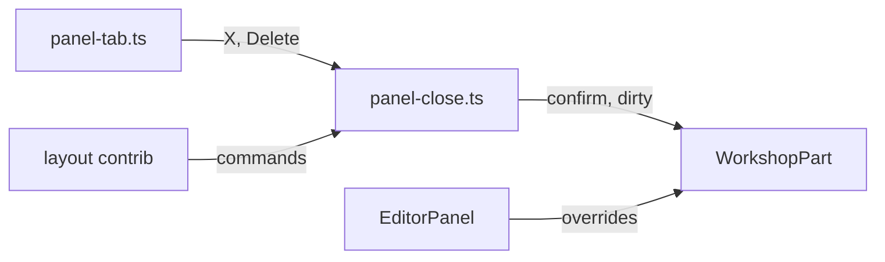

# Platform Extraction Debt Removal

<product-contract>

## Product Requirements

- Scope and target work:
  - Repository: `promptforge` at `C:\Users\Vinnie\cursor\promptforge`, branch `master`, base `67d11533` ("Close plan: platform-extraction"). Every path below is relative to that root, and every line number refers to `67d11533`.
  - Target work: the 11 commits `0c9df5e0` through `67d11533` carrying `Plan: vibe/2026-09-27-3-platform-extraction.md`, which extracted `@workshop/platform`, opened the panel registry, added the generic tab and tab menu, and moved the status LEDs to indicator slots.
  - This plan removes the debt that work introduced or worsened, plus one cheap fix in a file it created.
- Cleanup goals:
  - The layout core owns closing a panel. The generic tab closes any panel type without the editor feature being registered, and without loading the editor chunk.
  - The generic tab's close button and keyboard close behave as Dockview's own tab did: pressing the X does not activate the tab or its group first, the X is not a Tab stop, and a keyboard close leaves focus in the tab strip.
  - A socket disconnect clears the activity LED.
- Non-goals:
  - No change to command ids, keybindings, menu rows, their titles, or saved-layout format.
  - No change to the confirm-then-close semantics: the same prompts, the same batch rule, the same Cancel behavior.
  - No new structural checks (import walkers, source scans, topology checks).
  - Nothing listed under Deferred and Out of Scope.
- Success criteria:
  - A layout-only composition (no editor contribution) closes a synthetic panel through its X and through Delete, and a synthetic dirty part vetoes Close Others the same way an editor does.
  - Pressing the X on a background tab in another group leaves the previously active group and panel active.
  - After Delete on a focused clean tab, focus is on the neighbouring tab.
  - After a disconnect, the activity LED shows no color.
  - Every existing workspace suite passes, including `close-commands.mjs`, `tab-menu.mjs`, `menu-spec.mjs` and `activity-led.mjs`.

## Functional Specification

The user sees the same app. Closing a background tab no longer yanks focus to another group, repeated Delete on the tab strip keeps closing tabs, and the activity light goes dark when the connection drops. Close, Close Others, Ctrl+F4, the File menu row and the tab menu rows work exactly as before.

### Debt Inventory

- Debt added:
  - **D1-1 (introduced, prospective)** - the generic tab's close gesture is owned by the editor feature.
    - Evidence: `crates/workshop/ui/src/parts/layout/panel-tab.ts` line 33 declares `CLOSE_COMMAND = "workbench.action.closeActiveEditor"`, and `closePanel` (lines 36-40) runs it through `Commands.execute`, ignoring the resolved value. The only registrations of `workbench.action.closeActiveEditor` and `workbench.action.closeOtherEditors` are in `crates/workshop/ui/src/parts/editor/editor.contribution.ts` (lines 234-255), through `runEditorTask` (lines 84-88), which does `import("./editor-commands")`. `editor-commands.ts` statically imports five `@codemirror/*` packages and `EditorPanel` (lines 18-37). The generic close logic (`closeTarget`, `isClosable`, `isInDock`, `isUnsaved`, `confirmPanelClose`, `closeActiveEditor`, `closeOtherEditors`, lines 81-178) lives there, and only `isUnsaved` is editor-specific (`asEditor(panel)?.isDirty()`, line 110). `Commands.execute` resolves `false` for an unregistered id (`crates/workshop/platform/command-registry.ts` lines 65-71).
    - Relationship to target: `409ef87b` put the close logic in the editor's command layer, `b614a8ce` enabled Close on every panel type, `1c1d2b53` made the tab's X run the command by string id (trailer `new hidden-dependency @ ...panel-tab.ts::CLOSE_COMMAND`), and `e016fb85` routed Delete and Backspace through the same call.
    - Impact: the first close of an agent, Run or config tab loads the editor chunk and CodeMirror. In any composition without `editor.contribution.ts` (the layout-only test bundle, or a future family product reusing `parts/layout`), the X and Delete do nothing and report nothing.
    - Reversal cost: coordinated edits across the layout core and the editor feature, plus one additive platform method. Command ids stay the same.
    - Target state: the layout core owns the close path and registers both commands; the editor contributes only `EditorPanel.confirmClose` and `EditorPanel.isDirty`.
  - **D1-2 (worsened)** - the generic tab's X activates the tab and its group before closing.
    - Evidence: `panel-tab.ts` lines 99-108 build a native `<button>` with only a `click` listener, no `pointerdown` guard and no `tabIndex`. Dockview's `DefaultTab` action (dockview-core 8.3.1 `dist/package/main.esm.mjs` lines 11853-11877) is a `tabindex="-1"` element whose `pointerdown` calls `preventDefault`; the tab wrapper's `pointerdown` activates the panel and its group unless `defaultPrevented` (lines 5940-5941, 9131-9147).
    - Relationship to target: `1c1d2b53` replaced `DefaultTab` for editor and config tabs. `AgentTab` and `RunTab` already had the unguarded button at baseline, so this is worsened, not introduced.
    - Impact: pressing the X on a clean background tab in another group moves the active group (and `activeEditor`) there; within a group the content switches for one frame; every closable tab's X becomes a sequential Tab stop.
    - Reversal cost: trivial. Target state: the X matches `DefaultTab`'s pointer and focus handling.
  - **D1-3 (introduced)** - keyboard tab close drops Dockview's roving-focus move.
    - Evidence: `PanelTab.interceptCloseKeys` (`panel-tab.ts` lines 133-147) preempts `Tabs._onKeyDown` (dockview-core lines 8966-9000) in the document capture phase, so `Tabs._closeTab`'s `_focusTab(nextIndex)` (lines 9006-9016) never runs, and `closePanel` has no focus handling.
    - Relationship to target: `e016fb85`, the same commit that fixed the unconfirmed keyboard close.
    - Impact: after a keyboard close, focus leaves the tab strip, so repeated Delete stops after the first tab.
    - Reversal cost: cheap. Target state: after a successful keyboard close, focus lands on the neighbouring tab, as Dockview's handler does.
- Cheap fixes:
  - **D1-4 (cheap fix)** - the activity LED stays lit after a disconnect when no pulse is pending.
    - Evidence: `crates/workshop/ui/src/parts/status/activity-indicator.ts` `reset()` (lines 67-69) only sets `sustained = null`; it neither cancels `ledTimer`, clears `lit`, nor calls `applyLed()`. `main.ts` calls it on disconnect under the comment "A dropped socket means every in-flight status is stale." The defect moved verbatim from the baseline `StatusBar.reset` into this file, which `76bb07f1` created; the baseline `clearActivity` had the correct body and no callers.
    - Impact: after a pulse decays onto the sustained thinking state, a disconnect leaves the LED amber for the whole reconnect window.
- Exposed pre-existing debt (reported, not remediated here):
  - **D1-5 (exposed)** - confirm-then-close is enforced per Dockview gesture, because dockview-core 8.3.1 closes panels through `panel.api.close()` with no veto. It needed two corrective episodes in the target (`1c1d2b53` for the X, `e016fb85` for the keys). No present bypass exists. See Deferred.
- Rejected candidates: 29.
  - Residual-but-acceptable (16): plan-reserved or zero-consumer surfaces (`STATUS_INDICATORS`, `LayoutPolicy`, the `error-catalog.ts` `Result` alias), accepted designs (string panel ids, boot-order constraints each with a detecting test, service-locator seams, the v5 schema waiver, singleton registries with one bundled consumer), additive surface growth, bounded overflow-renderer leaks, explicit `Deferred:` stub and split rows, large test files, and stale comments in platform files.
  - Weak/speculative (3): Close Others Discard edge under a focus-trapped modal, value imports of `dockview` admitted by the boundary test, and an over-broad test name.
  - False (5): a second platform module copy, `PanelTab.init` re-running, Dockview's built-in tab menu offering unconfirmed closes, context-aware keybinding labels changing the menubar, and the moved pulse-duration read.
  - Unrelated pre-existing (5): tab and shimmer maps generalized from `run-tab.ts`, anchor re-open after restore, unused registry re-exports, per-prompt disposables, and Open Workspace clearing the dock with no dirty check (C-N1, see Deferred).

</product-contract>
<implementation-contract>

## Technical Design

Closing a panel becomes a layout-core mechanism. Triggers that live in the layout core call it directly; menus, the palette and keybindings reach it through the same two command ids, now registered by the layout contribution. Parts answer two questions through the platform base class: may I close (`confirmClose`) and am I dirty (`isDirty`).

- **`WorkshopPart.isDirty()`** (`crates/workshop/platform/workshop-part.ts`): a new public method returning `false`, documented as "whether the part holds unsaved changes; the close path re-checks it". `EditorPanel.isDirty()` already exists (`crates/workshop/ui/src/parts/editor/editor-panel.ts` line 161) and becomes its override. This is the only platform surface change, and it is additive.
- **New `crates/workshop/ui/src/parts/layout/panel-close.ts`**: the generic close path, moved from `crates/workshop/ui/src/parts/editor/editor-commands.ts` lines 81-178 with its doc comments.
  - `closeTarget`, `isClosable`, `isInDock` and `confirmPanelClose` move unchanged.
  - `isUnsaved(panel)` becomes: resolve `panel.view.content` with `resolvePanelContent`, and return `content instanceof WorkshopPart && content.isDirty()`. It no longer imports `asEditor` or anything from `parts/editor`.
  - `closeActiveEditor(arg?)` keeps its behavior and now resolves `true` when it closed the panel and `false` otherwise, so the keyboard path knows whether to move focus.
  - `closeOtherEditors(arg?)` moves unchanged apart from the generic `isUnsaved`.
  - Imports are limited to `@workshop/platform/*` and `dockview` types. It must not import a `*.contribution.ts`, the `parts/menu` barrel, or any `parts/<feature>` module, because lazy panels import `panel-tab.ts` (for `setTabLoading`), which will import this module.
- **`crates/workshop/ui/src/parts/layout/layout.contribution.ts`** registers the two commands, moved verbatim from `editor.contribution.ts` lines 234-255: `workbench.action.closeActiveEditor` ("Close Editor", `f1: true`, precondition `activeEditor`, keybinding `ctrlcmd+f4` with `when: "editorTextFocus"` and `KeybindingWeight.WorkbenchContrib`, File menu `6_close` order 2), its `MenuId.EditorTitleContext` row ("Close", group `1_close`, order 1), and `workbench.action.closeOtherEditors` ("Close Others", `MenuId.EditorTitleContext` group `1_close` order 2). Their run bodies call `panel-close.ts` directly; there is no lazy import.
- **Editor feature**: delete the two registrations from `editor.contribution.ts` and the moved functions from `editor-commands.ts`. `asEditor` and every editor-specific command stay. `EditorPanel.confirmClose` is unchanged.
- **`crates/workshop/ui/src/parts/layout/panel-tab.ts`**:
  - Delete `CLOSE_COMMAND`, `closePanel`'s `Commands.execute` call and the `Commands` import. The X and the key interception call `closeActiveEditor({ panelId })` from `./panel-close` and report a rejection through the existing `reportCommandFailure("workbench.action.closeActiveEditor", error)`.
  - The X gets `close.tabIndex = -1` and a `pointerdown` listener that calls `event.preventDefault()`, matching dockview-core 8.3.1's `DefaultTab` (lines 11853-11877). The existing `click` handler stays.
  - After a keyboard close resolves `true`, focus moves to the neighbouring tab, mirroring `Tabs._closeTab` (dockview-core lines 9001-9016): record the closing panel's group and index before closing, pick the panel now at that index, else the one before it, and focus its header tab's Dockview wrapper (the header `PanelTab` for that id in the module `tabs` map, then its `element.parentElement`). When the group has no panel left, do nothing.
  - Update the file header comment and the `interceptCloseKeys` doc to describe the direct call and the focus move.
- **`crates/workshop/ui/src/parts/status/activity-indicator.ts`**: `reset()` clears `sustained`, cancels `ledTimer` and sets it to `null`, clears `lit`, and calls `applyLed()`. Its doc says the LED goes dark.
- **Docs**: `crates/workshop/ui/AGENTS.md` line 20 says the generic tab's close button and Delete run the layout core's close path, and that `layout.contribution.ts` registers Close and Close Others. `crates/workshop/platform/workshop-part.ts`'s header names `isDirty()` beside `confirmClose()`.
- Failure and lifecycle constraints:
  - No state, including an intermediate one, may close an unsaved editor without its confirmation, through the X, Delete, Backspace, Close, Close Others or Ctrl+F4.
  - Command ids, keybindings, menu placements and titles are unchanged, so saved layouts and user muscle memory are unaffected.
  - The `panelTypeFromId` first-colon rule and the `closable: false` rule (user gestures only; `toggleWorkshopPanel` still removes the tree by command) are unchanged.

</implementation-contract>
<verification-contract>

## Testing Plan

Existing suites are the invariant; each debt ID adds one behavior check that fails at `67d11533`.

- D1-1:
  - `crates/workshop/ui/test/layout-open-registry.mjs` (its bundle imports `layout.contribution.ts` and no editor contribution): click a closable probe tab's X and assert the panel closes; focus a probe tab's wrapper, press Delete, and assert it closes. Both fail at `67d11533`, where the command is unregistered in that bundle.
  - Same file: a probe type whose part is a `WorkshopPart` subclass reporting `isDirty()` true after confirming triggers the Close Others void rule (nothing closes), proving the re-check is generic.
  - `crates/workshop/ui/test/close-commands.mjs` and `crates/workshop/ui/test/tab-menu.mjs`: re-point their bundles and header comments from `parts/editor/editor-commands.ts` to `parts/layout/panel-close.ts` and `layout.contribution.ts`; every existing assertion passes unchanged, including the confirmed-clean-turns-dirty case (`close-commands.mjs` lines 450-462) and Ctrl+F4 under `editorTextFocus`.
  - `crates/workshop/ui/test/editor-commands.mjs` and `crates/workshop/ui/test/menu-spec.mjs`: update any assertion that expects the close functions on the editor command module or counts palette rows per contribution; the File menu and tab-menu rows and their order are unchanged.
- D1-2, in `tab-menu.mjs`: with two groups, make a panel in group A active, then dispatch `pointerdown` and `click` on the X of a clean background tab in group B; assert group A and its panel stay active and the target closes. Assert every close button has `tabIndex === -1`.
- D1-3, in `tab-menu.mjs` (the keyboard section from line 480): with three tabs in one group, focus the middle tab's wrapper and press Delete; assert `document.activeElement` is the neighbouring tab's wrapper, and a second Delete closes that tab too. Cancel on an unsaved editor keeps the tab (existing).
- D1-4, in `crates/workshop/ui/test/activity-led.mjs`: render a thinking info frame, wait past the pulse window, call `reset()`, and assert the `activity` LED has none of `status-bar__led--green`, `--amber` or `--red`.
- Exit checks, at `crates/workshop`: `npm ci`, `npm run typecheck --workspaces --if-present`, `npm run build --workspace ui`, `npm test --workspaces --if-present`; then `cargo build -p workshop-server`; then a clean `git status`. The bundle guards (lazy panels never import the entry bundle) must pass with `panel-close.ts` in the graph.
- Operator checks: closing a background tab in another group keeps you in your group; holding focus on the tab strip, repeated Delete closes consecutive clean tabs; an unsaved editor still prompts from its X, Delete and Close Others; closing the agent tab before opening any file fetches no editor chunk (DevTools network tab); after stopping `workshop-server` mid-thinking, the activity LED goes dark.

</verification-contract>
<decision-record>

## Decision Record

- User-resolved architecture choice:
  - **The layout core owns closing panels (D1-1, option A).** The generic close path and both command registrations move from the editor feature to `parts/layout`, matching VS Code, where `workbench.action.closeActiveEditor` and `closeOtherEditors` belong to the editor area as a whole rather than to the text editor. User: "option A".
  - **`WorkshopPart.isDirty()` in the platform.** It replaces the editor-specific `asEditor(panel)?.isDirty()` in the Close Others void rule, so any part can hold unsaved state. User: "yes to isDirty".
- Reversible decisions:
  - The tab calls `panel-close.ts` directly instead of dispatching a command id, so a layout-only composition closes panels. Menus, the palette and keybindings still go through the command ids. Tradeoff: two call routes to one function. Verification: the layout-only X and Delete checks.
  - `closeActiveEditor` resolves a boolean so the keyboard path can move focus only after a real close. Tradeoff: a signature change on a function that becomes layout-internal.
  - D1-2 copies `DefaultTab`'s two lines (`pointerdown` `preventDefault`, `tabIndex = -1`) rather than switching back to `DefaultTab`, which cannot run the confirm path.
  - D1-3 mirrors `Tabs._closeTab`'s neighbour rule rather than re-enabling Dockview's handler, which bypasses `confirmClose`.
  - D1-4 restores the deleted `clearActivity` body inside `reset()`; no new method.
- Rejected alternatives:
  - Keeping the commands in the editor and falling back to `confirmClose()` then `api.close()` when the command is unregistered (option B): removes the silent no-op but keeps the editor-chunk fetch and the ownership problem.
  - Accepting the wiring as designed (option C).
  - Dropping the Close Others re-check instead of adding `isDirty()`: weakens the rule that no intermediate state closes unsaved work.
  - A structural check that the layout core imports no feature: the behavior test in a layout-only bundle proves the same thing without a new structural check.
- Assumptions and risks:
  - The Dockview behavior behind D1-2 and D1-3 was traced from dockview-core 8.3.1 source, not observed at runtime; the new tests pin it in jsdom against the real dockview-core.
  - `panel-close.ts` enters the entry bundle through `panel-tab.ts` and `layout.contribution.ts`; it must stay free of feature imports so lazy panels keep importing only `panel-tab.ts`'s tree.
  - Moving the registrations out of `editor.contribution.ts` changes which module registers the commands, not their ids, so `menu-spec.mjs` row placements should not change; if a test pins registration order across contributions, update the expectation, not the order rows appear in.

### Deferred and Out of Scope

- D1-5, exposed: record the close-path facts in the "Dockview facts relied on" list in `crates/workshop/ui/src/parts/layout/zones.ts` (lines 20-39), naming `tab-menu.mjs` as their detecting test: `DefaultTab` is replaced, `Tabs._onKeyDown` is preempted, and the built-in tab and tab-group chip menus stay inert while `getTabContextMenuItems`, `getTabGroupChipContextMenuItems` and `pinnedTabs` are unset. Revisit on any dockview-core upgrade, or before enabling any of those options.
- C-N1, unrelated pre-existing: Open Workspace clears the dock without checking for unsaved editors (`crates/workshop/ui/src/parts/workspace-document/workspace-document.contribution.ts` lines 194-209, `crates/workshop/ui/src/parts/layout/layout-boot.ts` lines 33-35). Whether edits are lost is unverified. Revisit as its own investigation.
- `crates/workshop/platform/panel-registry.ts` line 1 ("every dockview panel kind is declared here once") contradicts line 5 ("it declares no panel kind itself"). Comment only. Revisit with the next edit to that file.
- The stubbed tab-menu rows and the absent split rows stay deferred, as their `Deferred:` trailers in `1c1d2b53` record.

</decision-record>
<project-survey>

## Project Survey

- Status: complete
- Build command: `cargo build --locked -p gateway` (the workspace default member). The desktop app is an explicit build: `cargo build --locked -p workshop`. Cargo builds drive the UI bundles through build scripts, so a fresh clone first needs `npm ci --prefix crates/workshop` and `npm ci --prefix crates/gateway/config-ui/ui`. The Workshop SPA bundle alone: `npm run build --workspace ui` in `crates/workshop`.
- Focused test command pattern: `cargo nextest run --locked -p <crate> --all-features <test-name-filter>`, adding `--test <target>` (for example `it` or `suite`) to pick one integration target. Drop `--all-features` for `workshop`, `workshop-server`, and `workshop-server-api`. UI: `node --test <test/file.mjs>` from the package directory (`crates/workshop/ui`, `crates/workshop/platform`, `crates/workshop/look`, or `crates/gateway/config-ui/ui`).
- Component test command pattern: `cargo nextest run --locked -p <crate> --all-features`, then doctests with `cargo test -p <crate> --all-features --doc` (nextest skips doctests). The three workshop crates above run without `--all-features`; `workshop-server` has an extra `--features headless` run. UI package: `npm test --workspace <ui|platform|look>` in `crates/workshop`; config UI: `npm test` in `crates/gateway/config-ui/ui`. The `ui` and config UI tests load the built `dist/` in jsdom, so run `npm run build` first.
- Full-suite test command: `cargo nextest run --locked --workspace --exclude workshop --exclude workshop-server --exclude workshop-server-api --all-features`, then `cargo test --workspace --exclude workshop --exclude workshop-server --exclude workshop-server-api --all-features --doc`, then `cargo nextest run --locked -p workshop -p workshop-server -p workshop-server-api` and `cargo test --doc -p workshop -p workshop-server -p workshop-server-api`. The boundary and structural checks `cargo test -p build-xtask` run inside the workspace pass and can run alone. UI: `npm run build --workspace ui` then `npm test --workspaces --if-present` in `crates/workshop`, and `npm run build` then `npm test` in `crates/gateway/config-ui/ui`.
- Linter command: `cargo clippy --workspace --exclude workshop --exclude workshop-server --exclude workshop-server-api --all-targets --all-features -- -D warnings` and `cargo clippy -p workshop -p workshop-server -p workshop-server-api --all-targets -- -D warnings`, plus the headless feature gate `cargo check -p gateway --no-default-features`. Never run a standalone `cargo check --workspace` beside clippy. TypeScript: `npm run typecheck --workspaces --if-present` in `crates/workshop` and `npm run typecheck` in `crates/gateway/config-ui/ui`. Supply chain: `cargo deny check` (pre-push hook when installed, and CI) and `cargo audit` (CI). `cargo xtask tidy` exists as a standalone command; no CI step invokes it directly.
- Formatter check command: `cargo fmt --all --check` (also the pre-commit hook; `rustfmt.toml` sets `style_edition = "2024"`). No TypeScript formatter or ESLint is configured.
- Docs command: with `RUSTDOCFLAGS="-D warnings"` (PowerShell: `$env:RUSTDOCFLAGS="-D warnings"`), run `cargo doc --workspace --no-deps --all-features --exclude workshop --exclude workshop-server --exclude workshop-server-api`, the default-feature facade docs `cargo doc -p promptforge --no-deps` and `cargo doc -p harness --no-deps`, and `cargo doc --locked --no-deps -p workshop-server --document-private-items`. User guide: `cargo xtask site --books-only`. Facade surface: `cargo +<pinned nightly> xtask api --check`, where the nightly is named in `crates/build-xtask/src/api/toolchain.rs` and the listing is compared against `crates/promptforge/public-api.txt`; on that nightly CI also runs `cargo nextest run --locked -p build-xtask --run-ignored only`.
- Test placement and naming conventions:
  - Rust unit tests sit beside their module as `<stem>-tests.rs`, wired with `#[cfg(test)] #[path = "<stem>-tests.rs"] mod tests;`. Larger sets use `tests.rs` plus `tests-<label>.rs` siblings, or a `tests/` subdirectory inside `src/` once the group reaches three files.
  - Integration tests live in a crate's top-level `tests/<target>/main.rs` with one module file per area (targets named `it` or `suite`), with fixtures in `tests/fixtures/` or `tests/prompts/` and shared helpers in `tests/common/` or `test_support` / `*-test-support.rs` modules.
  - Test functions are sentence-style snake_case that state the behavior, for example `a_run_is_send` and `a_dropped_answer_resumes_a_waiting_chain_with_the_cancelled_error`.
  - UI tests are `node:test` `.mjs` files under each package's `test/` directory, with helpers and Tauri stubs in `test/helpers/`; `ui` and config UI also pick up `src/**/*.test.mjs`. `crates/workshop/platform/test/boundary.mjs` guards the platform package's imports.
  - Behavior changes ship with tests in the same change; refactors keep product and behavior tests.
- Directory map:
  - `crates/` root: the public layer. Facades `promptforge` and `harness`, gateway public pair `gateway-api-types` and `gateway-api-discovery`, shared crates `shared-error-source` and `shared-loopback`, `workspace-hack` (cargo-hakari), and meta tooling `build-xtask`, `build-ui`, `build-workshop`, `build-user-guide`, `build-llama-cuda`. `crates/shared-ui` is a TypeScript and CSS package for the gateway config UI, not a crate.
  - `crates/promptforge-internal/`: private Engine family (`engine`, `types`, `vfs`, `lua`, `parser`, `model-client`).
  - `crates/harness-internal/`: private Harness family (`runner`, `models`, `capabilities`, `log`, `sessions`, `web`, `webfetch`, `web-search`).
  - `crates/gateway/`: private gateway family; `app` builds the `promptforge-gateway` binary, plus `cloud-providers`, `config`, `config-ui` (with its `ui/` TypeScript app), `local`, `logging`, `progress`, `protocol`, `routing`, `web-search`, and the nested `stt/` subsystem (`api` as `gateway-stt`, `engine`, `backend-whisper`, `whisper-ffi`).
  - `crates/workshop/`: private Workshop family; `desktop` (Tauri app, package `workshop`, binary `promptforge-workshop`), `server`, `server-api`, `gateway`, `menu`, `protocol`, `registry`, `status`, `support`, `user-state`, `workspace`, and an npm workspace of `ui` (the SPA: `src/base`, `src/parts`, `src/services`, `src/tokens`, `src/main.ts`), `platform` (`@workshop/platform`), and `look` (`@workshop/look`).
  - `guide/`: user guide books and sources, built by `cargo xtask site`.
  - `prompts/`: example prompt programs.
  - `tools/`: Node scripts (gateway sidecar staging, TTS live check) and Python helpers in `tools/scripts/`.
  - `vibe/`: `archdoc.md` and dated plan and ledger records.
  - `local/`: gitignored operator config, profiles, and fixtures. `images/`: banners.
  - `.github/workflows/`: CI and release pipelines. `.githooks/`: pre-commit (fmt) and pre-push (headless check, clippy, deny). `.config/`: nextest and hakari config. `.cargo/config.toml`: `cargo xtask` and `cargo workshop` aliases and the Windows `rust-lld` and static CRT settings.
  - `target/` and `target-msrv/`: build output.
- Component boundaries:
  - Executor (`promptforge` facade over `promptforge-internal`): sans-I/O state machine; depends on the Lua VM boundary and shared substrate. promptforge crates must not depend on gateway, workshop, or Harness crates, and outside crates reach the family only through `promptforge`.
  - Harness (`harness` facade over `harness-internal`): the executor's only production caller, which steps it and performs its effects; harness-* crates depend only on `promptforge`, and outside crates reach the family only through `harness`.
  - Gateway: independent server process; its public surface is `gateway-api-types` and `gateway-api-discovery`, and gateway crates must not depend on promptforge or workshop crates.
  - Workshop: depends on `harness`, the gateway public pair, the `promptforge` facade, and shared crates, never on gateway family crates. The desktop app depends on `workshop-server-api`, never `workshop-server`. Tiers flow one way: server, then features, then services, then vocabulary.
  - Shared crates depend on no product crate. build-* crates are exempt from container privacy.
  - A crate inside a family container depends only on root crates and its own siblings; `cargo test -p build-xtask` enforces this matrix.
  - SPA: `@workshop/platform` imports only its own files and type-only `dockview`; `platform` and `look` never import each other; lazy panels never import a module inside the entry bundle.
  - The archdoc names a CLI adapter, but no CLI binary exists in the tree today.
- Conventions summary:
  - Rust edition 2024, resolver 3, stable toolchain. Every dependency is declared in `[workspace.dependencies]` with a comment justifying any pin, and every member inherits `workspace-hack`.
  - Workspace lints: `unsafe_code` forbidden outside owned boundaries (each unsafe block documents its safety invariants), clippy `all` and `pedantic` denied, `unwrap_used` and `expect_used` denied, `missing_docs` warned.
  - Source directories stay flat: one or two related files become `foo-bar.rs` kebab siblings wired with `#[path]`, three or more become a `foo/` subdirectory.
  - Every workshop-* and harness-* `lib.rs` opens with a `## Invariants` doc marker, and files in marker crates stay at or under 500 lines. `cargo xtask new-crate <workshop-name>` scaffolds a Workshop crate.
  - Facades are single-item re-exports grouped into documented role modules; the promptforge surface is committed in `public-api.txt`.
  - Error and status messages are written for model consumption: concise, naming required versus actual.
  - Comments explain only non-obvious constraints; workarounds cite their upstream issue URL.
  - JSON reaching the run log round-trips exactly (`float_roundtrip`, sorted keys, no `preserve_order`).
  - Cargo features gate only real constraints; library and serve paths return errors instead of exiting or installing process-global state.
  - No new structural check (parser, allowlist, count, topology check) without explicit user approval, and plans cannot introduce one.
  - SPA: CSS sits beside its TypeScript, component CSS uses `--ws-*` tokens only, no `localStorage` (persisted state goes through the `ui-storage` adapter), and features self-register from `*.contribution.ts` with a lazy `index.ts` chunk entry.

</project-survey>
<execution-plan>

## Execution Instructions

Three components, built in dependency order. Each is useful on its own and resembles a shippable change: the layout core owning the close path, the generic tab matching Dockview's own close handling, and the activity LED clearing on disconnect.

- Component order:
  1. **Layout close ownership** (D1-1) - first, because it rewrites `closePanel` in `panel-tab.ts` to call the layout core directly and gives `closeActiveEditor` the boolean result that the keyboard focus move needs.
  2. **Generic tab close parity** (D1-2, D1-3) - second, because both of its steps edit the close button and `closePanel` in `panel-tab.ts` after component 1 rewrote them, and its focus move acts on `closeActiveEditor`'s boolean.
  3. **Activity LED reset** (D1-4) - last. It depends on neither close component and could run beside them; it lands last to match the plan's todo order and to keep the two `panel-tab.ts` components back to back.
- Verification:
  - Every step runs its focused tests with `node --test test/<name>.mjs` from `crates/workshop/ui`. Rebuild first with `npm run build --workspace ui` at `crates/workshop` when the test boots the built app through `test/helpers/boot.mjs` (`activity-led.mjs`); the esbuild stdin suites bundle `src/` themselves.
  - The last step of each component (steps 1, 3 and 4) names the component gate in its Tests list: at `crates/workshop`, `npm ci`, `npm run typecheck --workspaces --if-present`, `npm run build --workspace ui` and `npm test --workspaces --if-present`; then `cargo build -p workshop-server`; then a clean `git status`. Verification runs the gate; coding and fix rounds run only focused tests.
- Standing rules for every step:
  - Each documentation edit lands in the step whose code it describes.
  - Line numbers refer to `67d11533`. If a reference doesn't match, re-locate it by content before editing.
  - No commit, including an intermediate one, closes an unsaved editor without its confirmation through the X, Delete, Backspace, Close, Close Others or Ctrl+F4.
  - Unchanged by design: command ids, keybindings, menu placements and titles, the saved-layout format, the confirm prompts, the Close Others batch rule, the `panelTypeFromId` first-colon rule, and the `closable: false` rule (user gestures only; `toggleWorkshopPanel` still removes the tree by command).
  - `crates/workshop/ui/src/parts/layout/panel-close.ts` imports only `@workshop/platform/*` and `dockview` types. It never imports a `*.contribution.ts`, the `parts/menu` barrel, or any `parts/<feature>` module, because lazy panels import `panel-tab.ts` for `setTabLoading`, and `panel-tab.ts` imports `panel-close.ts`.
  - No new structural check. The layout-only behavior tests prove the layout core's independence from the editor feature.
  - Nothing under Deferred and Out of Scope is done here, including the D1-5 note for `zones.ts`.

<step-1>

### Step 1: Move closing a panel into the layout core [completed]

- Component: Layout close ownership
- Piece: platform dirty query and layout close path, built jointly in one commit. The generic `isUnsaved` needs `WorkshopPart.isDirty()`, that method's only tested role is the moved Close Others re-check, and the two command registrations cannot live in the editor and layout contributions at once.
- Changes:
  - `crates/workshop/platform/workshop-part.ts`: add a public `isDirty(): boolean` returning `false`, documented as "whether the part holds unsaved changes; the close path re-checks it". The header comment (line 8) names `isDirty()` beside `confirmClose()`. This is the only platform surface change, and it is additive.
  - `crates/workshop/ui/src/parts/editor/editor-panel.ts`: mark `isDirty()` (line 161) `override`, as `confirmClose()` already is. Its body is unchanged.
  - New `crates/workshop/ui/src/parts/layout/panel-close.ts`, moved from `crates/workshop/ui/src/parts/editor/editor-commands.ts` lines 81-178 with their doc comments, under a file header describing the layout core's close path:
    - `closeTarget`, `isClosable`, `isInDock` and `confirmPanelClose` move unchanged.
    - `isUnsaved(panel)` resolves `panel.view.content` with `resolvePanelContent` and returns `content instanceof WorkshopPart && content.isDirty()`. Its doc says whether the panel's part holds unsaved changes.
    - Exported `closeActiveEditor(arg?: unknown): Promise<boolean>` keeps its behavior and resolves `true` only when it called `panel.api.close()`.
    - Exported `closeOtherEditors(arg?: unknown): Promise<void>` moves unchanged apart from the generic `isUnsaved`.
    - Imports: `DOCK`, `panelTypeEntry` and `resolvePanelContent` from `@workshop/platform/panel-registry`, `getService` from `@workshop/platform/service-registry`, `WorkshopPart` from `@workshop/platform/workshop-part`, and `type IDockviewPanel` from `dockview`.
  - `crates/workshop/ui/src/parts/layout/layout.contribution.ts`: register, verbatim from `editor.contribution.ts` lines 234-255, `workbench.action.closeActiveEditor` ("Close Editor", `f1: true`, precondition `activeEditor`, keybinding `ctrlcmd+f4` with `when: "editorTextFocus"` and `KeybindingWeight.WorkbenchContrib`, File menu `6_close` order 2), its `MenuId.EditorTitleContext` row ("Close", group `1_close`, order 1), and `workbench.action.closeOtherEditors` ("Close Others", `MenuId.EditorTitleContext` group `1_close` order 2). The run bodies call `closeActiveEditor` and `closeOtherEditors` from `./panel-close` directly, with no lazy import.
  - `crates/workshop/ui/src/parts/editor/editor.contribution.ts`: delete the two registrations (lines 234-255). `runEditorTask` and every other registration stay.
  - `crates/workshop/ui/src/parts/editor/editor-commands.ts`: delete lines 81-178 and any import the deletion leaves unused. The header comment (lines 1-16) lists save and cycle as the workshop-level commands, without close. `asEditor` and every editor-specific command stay, and `EditorPanel.confirmClose` is unchanged.
  - `crates/workshop/ui/src/parts/layout/panel-tab.ts`: delete `CLOSE_COMMAND` (line 33) and the `Commands` import (line 23). `closePanel` calls `closeActiveEditor({ panelId })` from `./panel-close` and reports a rejection through the existing `reportCommandFailure("workbench.action.closeActiveEditor", error)`. The file header and the `interceptCloseKeys` doc describe the direct call.
  - `crates/workshop/ui/AGENTS.md` line 20: the generic tab's close button and Delete run the layout core's close path in `parts/layout/panel-close.ts`, and `layout.contribution.ts` registers Close and Close Others.
- Tests:
  - `crates/workshop/ui/test/layout-open-registry.mjs`, whose bundle imports `layout.contribution.ts` and no editor contribution. Each new check fails at `67d11533`, where the close command is unregistered in that bundle or `isUnsaved` ignores non-editors:
    - Click a closable probe tab's X and assert the panel closes.
    - Focus a probe tab's Dockview wrapper, press Delete, and assert the panel closes.
    - Register a dirty-capable probe type whose part is a `WorkshopPart` subclass with a settable dirty flag and a scriptable `confirmClose()`. Export `WorkshopPart` from the test's stdin bundle so the subclass shares the module copy `panel-close.ts` checks with `instanceof`. Open a target and two such probes in one group; the first probe confirms clean, and the second probe's `confirmClose()` marks the first dirty before resolving `true`. Run `workbench.action.closeOtherEditors` with `{ panelId: <target> }` and assert every panel in the group stays open.
  - `crates/workshop/ui/test/close-commands.mjs` and `crates/workshop/ui/test/tab-menu.mjs`: add `import "./src/parts/layout/layout.contribution.ts";` to each stdin bundle beside the editor contribution, and re-point their header comments (`close-commands.mjs` lines 4-5, `tab-menu.mjs` line 6) to `parts/layout/panel-close.ts` and `layout.contribution.ts`. Every existing assertion passes unchanged, including the confirmed-clean-turns-dirty case (`close-commands.mjs` lines 450-462) and Ctrl+F4 under `editorTextFocus`.
  - `crates/workshop/ui/test/editor-commands.mjs`, whose bundle imports only the editor contribution: drop `workbench.action.closeActiveEditor` from `EXPECTED_IDS` (line 520) and from its step-20 comment, and the File menu check (lines 564-573) expects two rows, New Text File and Save. The palette check's `EXPECTED_IDS.length + 4` formula then holds as written.
  - `crates/workshop/ui/test/menu-spec.mjs` runs unchanged, since its bundle imports both contributions and every row placement is explicit. If an expectation pins registration order across contributions, update the expectation, not the order rows appear in.
  - Component gate: at `crates/workshop`, `npm ci`, `npm run typecheck --workspaces --if-present`, `npm run build --workspace ui` and `npm test --workspaces --if-present`; then `cargo build -p workshop-server`; then a clean `git status`. The bundle guards (lazy panels never import the entry bundle) pass with `panel-close.ts` in the graph.

</step-1>

<step-2>

### Step 2: Stop the close button from activating its tab [completed]

- Component: Generic tab close parity
- Piece: close button (D1-2). Built before the keyboard piece, sequentially: the two pieces share `panel-tab.ts` but not code, and this one is the smaller, self-contained change.
- Changes:
  - `crates/workshop/ui/src/parts/layout/panel-tab.ts`, where the X is built (lines 99-108): set `close.tabIndex = -1` and add a `pointerdown` listener that calls `event.preventDefault()`, matching dockview-core 8.3.1's `DefaultTab` action (`dist/package/main.esm.mjs` lines 11853-11877). Dockview's tab wrapper then skips activating the panel and its group (lines 5940-5941, 9131-9147). The existing `click` handler stays.
  - Keep the generic tab; switching back to `DefaultTab` cannot run the confirm path.
- Tests, in `crates/workshop/ui/test/tab-menu.mjs`, each failing at `67d11533`:
  - With two groups, make a panel in group A active, then dispatch `pointerdown` and `click` on the X of a clean background tab in group B. Assert group A and its panel stay active and the target closes.
  - Assert every close button in the dock has `tabIndex === -1`.
  - The existing X confirm-then-close section (from line 454) passes unchanged.

</step-2>

<step-3>

### Step 3: Keep focus in the tab strip after a keyboard close [completed]

- Component: Generic tab close parity
- Piece: keyboard close (D1-3). Sequential after step 2 in the same file, and after step 1 because it acts on `closeActiveEditor`'s boolean result.
- Changes:
  - `crates/workshop/ui/src/parts/layout/panel-tab.ts`: `interceptCloseKeys` (lines 133-147) calls a new module helper `closeAndRefocus(panelId)` instead of `closePanel`. Before closing, it records the panel's group and its index in `group.panels`. When `closeActiveEditor({ panelId })` resolves `true`, it picks the group's panel now at that index, else the one before it, and focuses that panel's header tab wrapper: the `PanelTab` for its id in the module `tabs` map (line 49), then its `element.parentElement`. When the close resolves `false` or the group has no panel left, it does nothing. A rejection is reported through `reportCommandFailure("workbench.action.closeActiveEditor", error)`, as `closePanel` does.
  - This mirrors `Tabs._closeTab` (dockview-core 8.3.1 lines 9001-9016) without re-enabling Dockview's own key handler, which bypasses `confirmClose`.
  - The X's `click` handler keeps calling `closePanel`, with no focus move.
  - The file header and the `interceptCloseKeys` doc describe the focus move.
- Tests, in `crates/workshop/ui/test/tab-menu.mjs`, keyboard section (from line 480):
  - With three clean tabs in one group, focus the middle tab's wrapper and press Delete. Assert `document.activeElement` is the wrapper of the tab now at that index, and that a second Delete closes that tab too. Both checks fail at `67d11533`.
  - Cancel on an unsaved editor keeps the tab (existing, unchanged), and the Delete and Backspace loop (line 494) passes unchanged.
  - Component gate: at `crates/workshop`, `npm ci`, `npm run typecheck --workspaces --if-present`, `npm run build --workspace ui` and `npm test --workspaces --if-present`; then `cargo build -p workshop-server`; then a clean `git status`.

</step-3>

<step-4>

### Step 4: Clear the activity LED on reset [completed]

- Component: Activity LED reset
- Piece: the `reset()` body (D1-4). One piece, one step.
- Changes:
  - `crates/workshop/ui/src/parts/status/activity-indicator.ts` `reset()` (lines 67-69): set `sustained` to `null`, cancel `ledTimer` with `clearTimeout` and set it to `null`, clear `lit`, then call `applyLed()`. This restores the deleted baseline `clearActivity` body inside `reset()`; no new method. Its doc says the LED goes dark after the persistent socket drops.
- Tests:
  - `crates/workshop/ui/test/activity-led.mjs`: append the check inside the existing `bootWorkbench` callback, because the helper exits the process once the callback returns. Take `wsSocket` from the context, emit a thinking info frame (`severity: "info"`, `activity: "thinking"`), sleep past the pulse window, and confirm the LED holds `status-bar__led--amber`. Then drop the socket with `wsSocket().onclose?.()`, as `disconnect-recovery.mjs` does, which runs `main.ts`'s `activityIndicator.reset()`. Assert the LED has none of `status-bar__led--green`, `status-bar__led--amber` or `status-bar__led--red`. This fails at `67d11533`.
  - Run it after `npm run build --workspace ui`, because it boots the built app.
  - Component gate: at `crates/workshop`, `npm ci`, `npm run typecheck --workspaces --if-present`, `npm run build --workspace ui` and `npm test --workspaces --if-present`; then `cargo build -p workshop-server`; then a clean `git status`.

</step-4>

- Exit: after step 4, the checks in the Testing Plan's exit list, then the operator checks.

</execution-plan>

*2026-09-28 00:30 - Claude Opus 5.5 (Cursor agent)*
