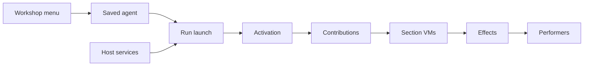
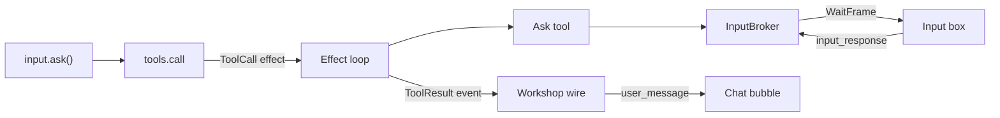

# Capability harness redesign

<product-contract>

## Product Requirements

A capability is a plug-in that gives a prompt more to work with, and today it can hand a run only a list of tools. This redesign lets a capability contribute Lua convenience functions, tools, declared needs, settings, and hooks, all routed through the effect loop (the Harness loop that performs every request the Engine hands out) so the Harness sees everything. The first capability rebuilt this way is user input, which leaves the engine. Capabilities become installable by name so Workshop can offer them from a menu. The plan also closes a small leak found along the way: the guard nonce currently reveals the run seed.

- Problem and users:
  - A capability can contribute only tools: `Contribution` has a single `tools` field ([promptforge/crates/harness-internal/capabilities/src/capability.rs](promptforge/crates/harness-internal/capabilities/src/capability.rs), lines 159-163). Prompt authors cannot extend the Lua surface through a capability.
  - The Harness must hand-construct any capability that takes arguments. `first_party_registry(root, token)` builds `promptforge/web` with `Web::new(root, token)` ([promptforge/crates/harness-internal/sessions/src/environment.rs](promptforge/crates/harness-internal/sessions/src/environment.rs), lines 114-121), so the Harness has to know that capability's constructor.
  - `user_input()` is hard-wired into the engine, with a piece in every layer from the Lua shim to the public API (listed under File and public API changes).
  - Hosts cannot preflight a prompt: a prompt has no way to say "I cannot run without a person" that a Host can check before launch. This is the problem the capabilities work opened with (`promptforge/vibe/2026-09/2026-09-13-1-capabilities-global-naming.md`, line 45).
  - A prompt can use only tools it names in advance. That blocks MCP, the Model Context Protocol, whose whole point is servers offering tools nobody knew about when the prompt was written.
  - The run log stores a tool's full output and a store read's full contents, so a script that reads thousands of files copies every one of them into the log.
  - Workshop users cannot pick capabilities for an agent.
  - The guard nonce reveals the run seed. The docs intend the seed to stay unguessable, but the nonce is the seed passed through a reversible mixer, and the model, transcripts, and the author's Lua all see the nonce.
  - Users are prompt authors, Host builders, capability authors (first-party and DLL), and Workshop users.
- Goals: capability Lua preludes; every capability operation an effect; tool calls that record who made them; `promptforge/user-input` as a core capability backed by a per-run input broker; declared needs enforced at activation; zero-argument factories with JSON configuration; large answers logged as a small record instead of a second copy; a Workshop capability menu with saved agent definitions; an open slot for runtime-only tools; the addon DLL plan's surface revised to one verb plus a JSON manifest; the per-run guard nonce derived with a one-way hash so it no longer reveals the run seed; the 2026-09-19 survey report corrected or superseded.
- Non-goals: executing the addon DLL plan (only its surface is revised); resume and replay; compaction policy; model routing by capabilities.
- Success criteria: the engine has no user-input effect, answer, record, event, or error kind; `chat.md` runs on Workshop with the operator's messages still shown as user messages in the transcript, and is refused on a Host with no broker with a message naming the capability and the missing service; a prompt that declares user input optional runs on a Host with no broker, `input.connected()` is false, `input.ask()` returns the fallback sentence with `available = false`, and the gap is recorded on the activation; a prelude defines a sealed global whose calls appear as `ToolCall` effects, with their origin, in the run log; no `user_input` global remains, and the repo's prompts, tests, and docs call `input.ask()` (engine and runner tests park on a test tool instead); every first-party registry holds `promptforge/user-input`, even when `promptforge/web` cannot be built; the guard nonce no longer reveals the run seed, and envelopes stay byte-identical within a run. These cover the items ready now; once the held factories item is built, a capability is also activated from its id and JSON config alone.
- Constraints:
  - Sans-io engine. The engine "performs no I/O, reads no clock, and holds no host trait objects" (`promptforge/vibe/archdoc.md`, line 9). Anything a capability contributes is data the engine can hold, or code the harness runs when it performs an effect. No step may slip a callback into the engine.
  - No credentials in the engine. "The engine holds no credentials and opens no connections; the harness holds the model client and capability implementations" (`promptforge/vibe/2026-09/2026-09-18-4-sans-io-engine-harness.md`, line 132). Secrets are a harness service, and configuration holds only secret names.
  - The run seed is not a secret. It is a `u64` the harness draws at prepare (`promptforge/crates/harness-internal/runner/src/prepare.rs`, lines 216-260) and records in the run log as `runs.seed` (`promptforge/crates/harness-internal/log/src/schema.rs`), and today every guard tag also reveals it, because the nonce is the seed passed through a reversible mixer. The guard nonce change removes that leak, but the seed stays in the log, so nothing that must be unguessable, such as a handle id or a webhook token, may be derived from it.
  - Guard envelopes stay byte-identical within a run: one nonce per run, because identical content must wrap identically across fanout arms and tool-loop rounds for prompt caching (`promptforge/crates/promptforge/src/lib.md`, lines 219-225; `promptforge/vibe/2026-08/2026-08-22-1-runcontext-seed.md`, lines 173-208). Escaping `<` in untrusted text is the primary defense against forged tags; the nonce is defense in depth.
  - Untrusted text (invariant A6, `promptforge/vibe/archdoc.md`, lines 25-28): "The executor neutralizes chat-template control delimiters in untrusted tool and Lua text, but never rewrites assistant replay or tool-call wire payloads." Webhook payloads and workspace files are untrusted. Operator input is trusted, as it is today: the ask tool's answer reaches the calling script byte-exact, and a prompt that treats pasted text as data wraps it with `untrusted(text)` before handing it to a model (Owner decision in the plan review; see the Decision Record).
  - The Lua boundary (invariant A8, same lines): "The Lua VM boundary accepts scheduler state changes only from typed `Request` variants yielded by the installed shim; direct or malformed yields fail without changing scheduler state." Preludes yield only through `tools.call`.
  - Engine globals in Lua (invariant A9, same lines) are namespace functions over plain values; handles are frozen, inspectable, and methodless; `messages.new()` is the one exception.
  - Interior versus exterior (`promptforge/vibe/2026-09/2026-09-13-1-capabilities-global-naming.md`, line 56): "Never package an interior primitive as a capability; never assume an exterior one." The store, `var`, `log`, the models namespace, cancellation, timers, and observers stay in the runtime.
  - Host configuration, never prompt configuration (same plan, lines 88-89 and 160). Per-capability settings come from the Host, now from the user through the Host's menu, never from prompt frontmatter.
  - Determinism (`promptforge/vibe/2026-09/2026-09-18-4-sans-io-engine-harness.md`, line 81): "Two runs with the same seed, `started_at`, and answers produce identical effect and event sequences." So hooks are pure, handles are released explicitly, and `input.connected()` is fixed for the run.
  - Repository rules in `promptforge/AGENTS.md`. Files in crates that carry the size marker stay at or under 500 lines: "If an edit would push a file past 500, split first, then edit" (line 84). The one-door rule (lines 46-52): each crate family has one public crate, and outside crates depend only on that facade, never on the family's private crates. No structural enforcement (parsers, allowlists, ceilings) without the owner's explicit approval (lines 60-61). Throughout this plan, "the owner" is the project's owner, whose decisions it records.
  - The runtime handles every contribution generically and never branches on which capability produced it. There must never be an `if id == "promptforge/bashkit"` anywhere. (Bashkit is an in-process bash interpreter over an in-memory filesystem that a capability would wrap.) One exception is owner-approved: Workshop's transcript projection maps the ask tool's script-side result to the operator's message, so the transcript keeps showing what the operator typed (see the Decision Record). No other code may name a capability's id.
  - Files and generated artifacts. Every code path is in the `promptforge` repository, which sits inside the workspace at `c:\Users\Vinnie\cursor`; a path that starts with `promptforge/` is relative to the workspace root, and one that starts with `crates/`, `guide/`, `tools/`, or `vibe/` is relative to the repository. Line numbers were checked on 2026-09-27 and are locators once earlier items land: find the named symbol. Retired files move to `cabinet/_trash/` in the workspace and are never deleted; moved files use `git mv`. Generated files are regenerated, never edited by hand: `crates/promptforge/public-api.txt` with `cargo +nightly-2026-09-05 xtask api --bless` (the pinned nightly in `crates/build-xtask/src/api/toolchain.rs`, checked with `--check`), and `guide/promptforge-language-guide.md` with `cargo run --locked -q -p build-user-guide`. A new dependency edge updates `Cargo.lock`, which is committed.
  - Prompt text is a named slot with a trust level, never a list of strings joined in activation order, which loses slot order, trust marking, and prompt-cache stability.
  - Permission checks belong to the Host. A capability supplies the rule; the Host runs the approval prompt.
  - Writing: plain English explained like a colleague; every term defined once, where it first appears; no invented labels; single dashes only, never em dashes or double dashes; a confidence level (high, medium, or low, with a one-phrase reason) on every recommendation; the owner's quotes kept attached to the decisions they justify. This binds the plan's prose and anything the plan asks agents to write, such as the capability's documentation page and the report correction.
- Open questions:
  - **The open slot's syntax and meaning.** Is it declared in frontmatter (the capabilities and global naming plan's `tools: { open: true }`), in a section's Lua, or both? Do "all the extra tools" and "a semantic subset" map to two mechanisms or to the discovery capability alone? How does an extra capability's prelude behave in a closed prompt; does it install at all? Blocks the held open-slot item.
  - **Menu rules.** Confirm: required capabilities locked, optional ones removable, extras only for prompts with an open slot. Blocks the held menu item.
  - **Agent definitions.** Where Workshop stores a saved agent (prompt, capabilities, settings) and in what format. Blocks the held menu item.
  - **Bashkit's mount direction.** PromptForge's files mounted inside bashkit, bashkit's filesystem mounted into the run, or both. Blocks the held DLL surface revision.
  - **Hook points.** The exact set, how a capability declares which it uses, and whether DLL hooks ship in the first version or after in-process hooks. Blocks only the deferred step hook; the DLL surface revision can name `hook.<point>` verbs without settling the exact set.
  - **Answer records.** The size threshold for inlining. Whether a real mount's version stamp is a modification time or a hash. What stamps a read from the run's own store: its claims table keeps happens-before epochs per path region for conflict detection, not a per-path version a read could report (`promptforge/crates/promptforge-internal/vfs/src/handle.rs`, lines 1-37 and 376-398). Blocks the held answer-records item.
  - **Other Host services.** Designs for secrets, schedule, the model client, and the parent environment, each of which has a first consumer in the survey report (`secrets`, `schedule`, output guards with a model judge, `sub-runs`). Blocks only the deferred Host services.
  - **The 2026-09-19 survey report.** Correct it (its "Lua functions" row in Table 2, recommendation 2, its build order, and stale paths) or leave it as a dated snapshot that this plan supersedes. Blocks the held report item.
  - **Backstop timeout for long waits.** The DLL addon loader keeps a per-call timeout as a backstop for addons that ignore `cancel`, while `webhook.wait` can legitimately wait an hour. Decide how the backstop avoids cutting off waits the capability itself bounds. Blocks the held DLL surface revision.
  - **Decisions still marked Proposed.** The owner heard these without ruling; each needs confirmation, or refinement with stated reasons, before the work it governs is built. Those that block held items: the shape of installable-by-name (factories), the menu's seven steps (menu), the small-record remedy (answer records), and the one-verb DLL ABI, DLL mounts through filesystem verbs, and the DLL's own tokio runtime (DLL surface revision). The rest (the survey's findings, the step hook, handles, and webhooks) belong to deferred work and need a ruling only when that work is revisited.
  - The ready items have no open questions. The plan review of 2026-09-27 settled the five that the code raised (trust, the transcript, the question arguments, the answer's shape, and when prelude checks run) with the owner, and recorded the rest as refinements with stated reasons (see the Decision Record).

## Functional Specification

The user creates an agent, picks a prompt, and checks capabilities; the Host supplies its services at run launch; activation checks each capability's needs and the prompt's declarations, then collects contributions. A required capability whose Host service is missing refuses the run; an optional one activates degraded. Everything a capability then does happens as tool calls that the Harness can log, gate, cancel, and replay.

- Actors and workflows:
  - The prompt is a markdown file. It says what it must have ("I need web search") and what it could use if present ("I can talk to a person if one is around"). It can also say that it has room for extra tools it has never heard of; that room is the open slot.
  - A capability is built into the harness or loaded from a DLL. Each one describes itself: its tools, a chunk of Lua called its prelude that gives authors convenient functions, what it needs from the Host, what settings it takes, and what it cannot run alongside.
  - The Host is the application an agent runs inside: Workshop (the interactive Host where users build agents), the command line, or a batch job. Each Host offers a fixed set of services, such as a filesystem, a way to reach a person, and the gateway (the separate PromptForge process that holds vendor credentials and fronts model providers, per invariant A2 in `promptforge/vibe/archdoc.md`, line 21; `promptforge/web` reaches the network through it). Some Hosts lack some services; a batch job has nobody to ask.
  - The user is the person who sets up an agent in Workshop by picking a prompt file and checking capabilities from a menu.
  - Starting a run: the Harness hands every chosen capability the Host's services and the user's settings for it. The capability hands back its tools and its prelude. The prelude defines functions that call the tools, every tool call is an effect, and every effect passes through the Harness. Nothing a capability does is hidden.
  - Creating an agent in Workshop:
    1. Workshop lists every capability it knows about: the built-in ones plus every one found in the DLL folder.
    2. For each, Workshop checks whether this window can supply what the capability needs. Rows it cannot satisfy are greyed out with the reason, for example "needs an operator; this agent runs headless". This works because whether a window has a person is known before Run is pressed.
    3. The prompt's required capabilities appear checked and locked. Its optional ones appear checked and can be unchecked.
    4. Capabilities the prompt never declared can be checked only if the prompt has an open slot.
    5. Conflicting capabilities, such as bashkit and a terminal, appear as a pick-one group.
    6. A capability with a config schema expands into a form rendered from the schema: strings, booleans, path pickers, lists. Workshop does not interpret the fields.
    7. Workshop saves the agent: the prompt, the checked capabilities, and their settings.

    ```toml
    prompt = "agents/research.md"

    [[capabilities]]
    id = "promptforge/user-input"

    [[capabilities]]
    id = "acme/project-files"
    config = { root = "C:/work/repo", writable = false }
    ```

    At Run, Workshop gives each checked capability the window's services and the saved settings, and each capability hands back its contribution.
  - Configuring a capability, walked through with the owner's VFS example: a capability `acme/project-files` that mounts a directory declares the config schema `{ root: path, writable: bool, prefix: string }` and needs the filesystem service. The user checks it and picks a folder; `create` returns a mount contribution for that folder. The Host never learns what "project files" means; it renders a form, stores JSON, and passes it back.
  - When nobody is there, the prompt decides, at one of two strengths. A prompt that declares user input required is checked before anything runs and refused on a Host with no person; Workshop can disable the Run button. That is "fail immediately", done automatically. A prompt that declares user input optional always runs; in its first section it can call `input.connected()` and then stop, or carry on making its own decisions.
  - Asking the operator: a section calls `input.ask()`, which is a `tools.call` of `promptforge/user-input/ask`, and gets back the operator's text and the run's `available` flag. It takes no arguments yet; a question text and choices come later with the Workshop work that shows them (Deferred). The ask tool asks the run's input broker, which opens a wait in the session's `WaitRegistry`, pushes `WaitFrame::Required`, and awaits the answer.
  - What Workshop shows. Its input box is driven by the broker's own `WaitFrame`s (`promptforge/crates/workshop/server/src/agents/socket.rs`, lines 89 and 154-161; `promptforge/crates/workshop/server/src/agents/socket_frames.rs`, lines 18-21; `promptforge/crates/workshop/ui/src/services/agent-socket.ts`, lines 249-253) and keeps working unchanged. Its transcript is a different matter: the operator's chat bubbles come only from the durable `Event::UserInput`, which `wire.rs` frames as `user_message` (`promptforge/crates/workshop/server/src/agents/wire.rs`, line 238; `promptforge/crates/workshop/ui/src/services/agent-session.ts`, lines 234-238 and 283-285). That event goes away, so Workshop's transcript projection instead frames the ask tool's script-side `ToolResult` event as the same `user_message`, and the transcript looks exactly as it does today.
  - The built-in chat agent loops on user input and returns when input is unavailable ([promptforge/crates/harness-internal/sessions/agents/chat.md](promptforge/crates/harness-internal/sessions/agents/chat.md), lines 31-41). Once it declares `promptforge/user-input` required and its loop calls `input.ask()` instead of `user_input()`, a Host with no operator refuses to launch it instead of starting a chat loop that returns at once.
  - Declaring is mandatory. The harness always registers `promptforge/user-input`, but a run activates it only when the prompt declares it, required or optional. A prompt that does not declare it gets no `input` table, so `input.ask()` fails with Lua's own "attempt to index a nil value (global 'input')", and `user_input()` no longer exists anywhere. This is a deliberate language change for existing prompts.
- Inputs and outputs:
  - Prompt declarations: required capabilities, optional capabilities, and an optional open slot.
  - Saved agent: the prompt, the checked capabilities, and each one's config JSON.
  - Host services, supplied per run, any of which may be absent.
  - Contributions: tools and a prelude now; mounts, prompt text, hooks, commands, and saved state later.
  - The ask tool takes no arguments and answers with the operator's text as trusted plain output. `input.ask()` returns that text and `available`, which is the run-fixed value of `input.connected()`. The operator's text arrives byte-exact, as it does today (`promptforge/crates/promptforge/src/input.md`, lines 101-102). Availability is structure, not text: it is a separate return value fixed for the run, so an operator who types the fallback sentence still cannot fake the unavailable state (same page, line 173).
- States and validation:
  - Declaration and Host service combine into four cases:
    - Required, and the Host has the service: the run proceeds normally.
    - Required, and the Host lacks it: refused before the run starts, with a message naming the capability and the missing service, for example "`promptforge/user-input` needs an input broker, and this host provides none."
    - Optional, and the Host has the service: the run proceeds normally.
    - Optional, and the Host lacks it: the capability activates in a degraded form. For user input, `input.connected()` is false, the ask tool answers the fallback sentence, "User input is unavailable in this host; continue without it." (today's `INPUT_UNAVAILABLE_FALLBACK`, `promptforge/crates/promptforge-internal/engine/src/input.rs`, lines 25-32), and `input.ask()` returns it with `available = false`. The gap is recorded on the activation and logged as a warning.
  - Config is validated against the capability's schema when the agent is saved and again at activation, since a newer DLL version may have changed the schema.
  - A path in config is a grant of access, so the Host checks that it sits inside the Host's allowed roots before calling `create`, and checks again at activation, because a saved agent can outlive a change in Host policy. The manifest states intent; the Host intersects it with its own policy.
  - Menu rows the window cannot satisfy are greyed out with the reason; conflicting capabilities form a pick-one group.
- Errors and recovery:
  - A refusal names the capability and the missing service. An optional gap is recorded as a warning, and the run continues.
  - A prelude that fails to load fails the run when a section VM installs it, and the first section VM the run sets up installs every prelude before the run issues any effect. That includes a prelude that calls `tools.call` while loading, which yields outside a coroutine. The message names the capability. A prelude global that collides with a global already bound, with `ui` or `item`, with a frontmatter tool or model alias, or with an earlier prelude's global fails the same way, naming both sides.
  - In the ask tool, a failure outside the prompt raises at the Lua call site, as today (`promptforge/crates/promptforge-internal/engine/src/input.rs`, lines 15-16), now as a tool error: `pcall` catches it, and an uncaught one ends the run as a tool failure where it used to end it as `RunErrorKind::Input`. Nothing in the harness or Workshop matches on that kind. A dropped wait is a cancellation, and the drop guard turns it into `WaitFrame::Cancelled`.
  - On cancel, the effect loop aborts every in-flight performer future and answers every outstanding effect `Dropped` ([promptforge/crates/harness-internal/runner/src/effect_loop.rs](promptforge/crates/harness-internal/runner/src/effect_loop.rs), lines 15-20, 251-294, and 318-328). Tool performers are aborted exactly as input performers are today, so a cancelled ask behaves as a cancelled `user_input()` does.
  - The harness runner applies no timeout to tool calls; the only timeouts under `promptforge/crates/harness-internal/runner/src` are in tests. An hour-long wait for the operator is not cut off.
  - A userdata value inside a tool's argument table is already rejected at the call site today: `tools.call` converts its arguments to JSON and fails with "args must be a JSON-representable table" (`promptforge/crates/promptforge-internal/lua/src/protocol/parse.rs`, lines 397-403). An error that names the path to the offending value comes with the deferred handles work.
  - A chain waiting on the operator reports `blocked = "tool_call"` in `tasks.status`, where it reported `"user_input"` (`promptforge/crates/promptforge-internal/engine/src/execute/scheduler/dispatch.rs`, lines 91-111).
- Security and privacy behavior:
  - Operator input is trusted, as it is today. The ask tool answers with trusted output, so the calling script receives the operator's exact text, and a model the script hands it to sees it unwrapped, exactly as `user_input()` text reaches the model today. A prompt that treats pasted text as data wraps it with `untrusted(text)` first. The reason is structural: an untrusted tool answer is nonce-wrapped before the calling script sees it (`promptforge/crates/promptforge-internal/lua/src/dispatch.rs`, lines 128-140), so untrusted operator text would reach `chat.md`'s model as "data, not instructions" with every `<` escaped.
  - Webhook payloads and workspace content are untrusted and guard-wrapped when they reach a model.
  - Secrets are referred to by name only; the capability asks the secrets service for the value.
  - The model can call the ask tool only if the prompt binds it under a frontmatter alias (for example `tools: { ask: promptforge/user-input/ask }`) and adds that alias with `tools.add` or `tools.always`. `tools.add` rejects a full id, because its alias grammar has no `/` (`promptforge/crates/promptforge-internal/lua/src/alias.rs`, lines 15-29), and the chat arm rejects a model's call to any tool outside the round's advertised scope (`promptforge/crates/promptforge-internal/engine/src/execute/scheduler/chat.rs`, lines 170-179). Until the question arguments land, a model that asks has no way to show the operator what it is asking, so the opt-in is of little use before then.
  - A config path is a grant of access and is intersected with the Host's allowed roots.
  - Handle ids are unguessable per run, so an author cannot forge a handle another chain opened; a capability rejects handles that another capability opened.
- Acceptance criteria: see Testing Plan exit criteria.

</product-contract>
<implementation-contract>

## Technical Design

Capabilities stay entirely in the harness. The engine sees only prelude text, tool bindings, and effects. Host services are a closed typed set in `RunServices`; once the held factories item lands, user settings are JSON and capabilities are zero-argument factories that describe themselves. Every capability operation reaches the run as a `ToolCall` effect that the harness performs. In the engine, preludes are installed at section setup, a script's `tools.call` resolves full tool ids, `ToolCall` effects gain an origin, the user-input facility goes away, and the guard nonce is derived with a one-way hash. In Workshop, the transcript frames the ask tool's result as the operator's message.



One ask, end to end, once the ready items land:



- Architecture:
  - The capability contract lives in [promptforge/crates/harness-internal/capabilities/src/capability.rs](promptforge/crates/harness-internal/capabilities/src/capability.rs): today the `Capability` trait has `id`, `description`, `conflicts`, and `create` (lines 77-107), and the file is 299 lines. The ready items put the broker vocabulary and the user-input capability in new files beside it (`input.rs`, `user_input.rs`), so no file nears 500 lines; the held factories item's manifest will likely need `capability.rs` split first. The registry (`CapabilityRegistry`, `registry.rs`) and per-run `activate` (`activation.rs`, 260 lines) sit beside it. Activation is driven from [promptforge/crates/harness-internal/runner/src/prepare.rs](promptforge/crates/harness-internal/runner/src/prepare.rs) (lines 269-295).
  - The registry and the broker live for different lengths of time. The registry is built once per gateway generation and shared by every session launched under it ([promptforge/crates/harness-internal/sessions/src/environment.rs](promptforge/crates/harness-internal/sessions/src/environment.rs), lines 114-121 and 146-189). The broker is built for each run over that session's wait registry and frame channel, and handed in at launch ([promptforge/crates/harness-internal/sessions/src/session/run.rs](promptforge/crates/harness-internal/sessions/src/session/run.rs), lines 88-102), so it always answers to that session's window. So the broker reaches a capability through the per-run `RunServices`, never as a constructor argument.
  - `harness-runner` depends on `harness-capabilities` (`promptforge/crates/harness-internal/runner/Cargo.toml`, line 16), and not the reverse. A trait defined in the runner is therefore out of a capability's reach, which is why the broker trait moves into `harness-capabilities`.
  - Section setup (`setup_section_vm`, `promptforge/crates/promptforge-internal/engine/src/execute/section_vm.rs`, lines 111-163) runs, in order: Engine injection (`args`, `argv`, `sys`, `var`, `tools`, `models`, `messages`, `compactors`); `log` and `store`, whose store functions are direct closures at this point; `ui` when the Host passed a snapshot; `item` in a fanout arm; `jump` and `list_from_section`; the coroutine yield shims (`models.infer`, `call`, `fanout`, `tools.call`, `tasks`, and the normalized `pcall` and `xpcall`); the `models.loop` shim; the `user_input` shim; the shared-chunk replay (`replay_shared`, `promptforge/crates/promptforge-internal/lua/src/vm.rs`, lines 400-422); the store yield shims; and last `install_captured_bindings` (`vm.rs`, lines 435-471), which raw-sets every frontmatter tool and model alias as a global so a declared alias wins over a same-named shared global. Every section VM, H1's included, runs this one sequence (`section_vm.rs`, lines 1-22). Prelude install goes right after the `models.loop` and `user_input` shim installers (lines 139-140; once engine removal deletes the second, right after the first) and before the shared replay, so the shared chunk can use the sugar. Two consequences shape the prelude rules below: a prelude, like the shared chunk, runs as a main chunk and not a coroutine, so a load-time `tools.call` fails with "attempt to yield from outside a coroutine"; and `install_captured_bindings` would silently replace a prelude global that has the same name as a frontmatter alias, so the collision check must cover aliases. The runtime already runs an Engine-authored Lua chunk in setup: `promptforge/crates/promptforge-internal/lua/src/__impl_fanout.lua` (lines 1-46) builds frozen result tables. A capability prelude is a third source for the same step.
  - Tool calls are performed by the harness tool performer, store effects on the blocking thread pool (`effect_loop.rs`, lines 10-11 and 330-335). A prelude function that must wait, like `webhook.wait(h)`, is a tool call the tool performer awaits.
- Modules and interfaces:
  - `Capability` becomes a zero-argument factory that describes itself with data. First-party and DLL capabilities share this shape:

    ```rust
    pub trait Capability: Send + Sync {
        fn manifest(&self) -> &Manifest;  // id, description, needs, dependencies, conflicts, config_schema, ...
        fn create(&self, services: &RunServices, config: &serde_json::Value)
            -> Result<Contribution, CapabilityError>;
    }
    ```

    Until the held factories item lands, `needs` is a provided method beside `conflicts()` on today's trait, checked by activation before any capability code runs: `fn needs(&self) -> &[Service] { &[] }` (user input returns `&[Service::Input]`). The factories item later moves it into the manifest. Declared dependencies between capabilities (`dependencies`, the ids of the capabilities whose prelude globals this one uses) are deferred until the first capability declares one (Owner decision in the plan review; see Deferred).
  - The registry becomes the set of installed factories: the first-party crates plus whatever the DLL scan found.
  - `Service` is the closed, typed vocabulary of Host services, owned by the harness: `#[non_exhaustive] pub enum Service { Input }` in `harness-capabilities`, with `Service::description` giving the model-readable name a refusal uses ("an input broker") and `RunServices::provides(Service) -> bool` answering whether this run has it. It has one variant now: the filesystem and the cancel handle are always present in `RunServices`, so a need for them could never fail (Refinement). A filesystem variant joins with the held DLL surface revision, where a DLL must declare that need to receive the run's filesystem at all; the gateway binding joins with the held factories item; secrets, schedule, the model client, and the parent environment for sub-runs later. Capabilities stay open-ended, but adding a service is a harness change.
  - Everything a capability might need falls into one of three kinds, sorted by who supplies it:
    - Host service: supplied by the Host, the same set for every capability, as a typed `RunServices` field, per run, possibly `None`.
    - User configuration (a directory to mount, read-only or writable, allowed hosts, resource limits): supplied by the user per agent in the menu, as JSON validated against the capability's schema and passed to `create`.
    - Secret (API keys): configuration holds only a name, and the capability asks the secrets service for the value.
  - `RunServices` today holds only `vfs` and `cancel` (`capability.rs`, lines 109-142). Its doc comment already reserves the slot: "Non-exhaustive so new fields (the input broker, the model client) can be added when a bridge capability needs them without breaking existing capability implementations." It gains `pub input: Option<Arc<dyn InputBroker>>`, set with a new builder method, `RunServices::with_input(self, broker)`, named like the crate's `CapabilityError::with_kind`. `RunServices::new(vfs, cancel)` keeps its signature and leaves the field `None`, so every existing caller and doctest compiles unchanged, and the struct's `Debug` shows only whether a broker is present. The gateway binding joins with the held factories item. `None` is a legitimate answer: Workshop supplies `SessionInputBroker`, a CLI might supply a stdin broker, and a batch or eval Host supplies `None`.
  - `InputBroker` is a new trait in `harness-capabilities` (a new file, `input.rs`), beside a new `InputError` with the same shape as the engine's: a model-safe message plus a hidden source. The engine's own `InputError` stays until engine removal deletes it, because the temporary adapter (below) still answers `UserInput` effects with it.

    ```rust
    #[async_trait::async_trait]
    pub trait InputBroker: Send + Sync {
        /// Waits for the operator's next message and returns it byte-exact.
        async fn wait(&self) -> Result<String, InputError>;
    }
    ```

    This is not today's `InputPerformer` signature, `wait(execution, section) -> BoxFuture<Result<InputOutcome, InputError>>` ([promptforge/crates/harness-internal/runner/src/performers.rs](promptforge/crates/harness-internal/runner/src/performers.rs), lines 82-91), for three reasons found in the code (Refinement). `BoxFuture` is defined in `harness-runner`, which `harness-capabilities` cannot depend on, while the crate's `Tool` trait already uses `async_trait`. The only broker, `SessionInputBroker`, ignores both arguments (`promptforge/crates/harness-internal/sessions/src/input-tool.rs`, lines 108-112): a question reaches the right operator because each run gets a broker bound to its own session. And `InputOutcome::Unavailable` can no longer happen, because a Host without a person supplies no broker and a present broker stays present for the run, so `InputOutcome` is deleted rather than moved.
  - The runner's `Services.input`, today a mandatory `Arc<dyn InputPerformer>` (`prepare.rs`, lines 50-79), becomes `Option<Arc<dyn InputBroker>>` and flows into `RunServices` at activation (`prepare.rs`, line 277). Until the engine-removal item deletes the `UserInput` effect, prepare also fills `Performers.input` from that same broker through a small private adapter: a present broker answers `InputOutcome::Text`, and an absent one answers `InputOutcome::Unavailable`, today's headless policy, so prompts not yet migrated keep working. Engine removal deletes the adapter, `InputPerformer`, and the `input` slot in `Performers` (`performers.rs`, lines 130-143). The capability's `create` reads `services.input` and builds its `ask` tool around whatever it finds.
  - `Contribution` gains `pub prelude: Option<String>` now: Lua source that `create` builds for each run, so it can embed run-fixed facts such as whether a broker is present. Its `Debug` shows only whether a prelude is present. Mounts, prompt text, hooks, commands, and saved state come later. `Contribution` is not `#[non_exhaustive]`, and three callers build it with struct literals that the new field breaks: `harness-internal/web/src/lib.rs` (line 129), `harness-internal/runner/tests/it/prepare.rs` (line 127), and `harness-internal/capabilities/tests/it/support.rs` (line 271). Each gains `prelude: None`.
  - Preludes reach the engine as data, beside the catalog. Activation returns the activated capabilities' preludes in install order as `Activation.preludes: Vec<Prelude>`. `Prelude` is a new public type in `promptforge::capabilities` (defined in `promptforge-types`): `Prelude::new(capability, source)`. The runner hands the list to `Environment::preludes(...)`, a new builder beside `Environment::tools(...)`; `Environment::prepare` copies it onto the run context exactly as it copies the catalog (`promptforge/crates/promptforge-internal/engine/src/execute/environment.rs`, line 100); `RunState::new` keeps it; and `setup_section_vm` installs it. Install order is declaration order, the order activation already uses, so activation order and the catalog's tool order are unchanged. A capability that does not activate contributes no prelude.
  - `Requirements` (defined in the engine's `requirements.rs` and public through `promptforge`, `public-api.txt` lines 730-732) today reports `unmet_requirements`, `missing_required` (the required capability ids that are absent from the registry or fail activation; `promptforge/crates/harness-internal/capabilities/src/activation.rs`, lines 94-104, 138, and 183-187), and `conflicts`. It gains `pub missing_services: Vec<MissingService>`, where `MissingService` is a new public `#[non_exhaustive]` struct, `{ pub capability: CapabilityId, pub service: String }`, with a constructor like `CapabilityConflict::new`. It lists each required capability that is present while the Host lacks a service it needs. The service is recorded as its model-readable name because the engine cannot name the harness's `Service` type. `is_satisfied`, `merge`, and `notice` include the field, and the notice line reads "- promptforge/user-input needs an input broker, and this host provides none". For a required capability with a missing service, activation records the entry and does not call `create`. For an optional one, it calls `create` anyway and records a `ServiceGap { capability, service }` on a new `Activation.service_gaps` field, with a `tracing::warn!`. The capabilities and global naming plan named `ServiceGap` (`promptforge/vibe/2026-09/2026-09-13-1-capabilities-global-naming.md`, lines 648 and 738-743); its third part, "what the degradation is", is dropped, because nothing reads it and the capability's own behavior is the degradation (Refinement). `create` cannot enforce the refusal rule itself, because it never learns whether the prompt declared the capability required or optional; enforcing it there would refuse optional declarations too.
  - `Effect::ToolCall` today carries only `tool`, `alias`, and `args` (`promptforge/crates/promptforge-internal/engine/src/execute/run-effect.rs`, lines 84-96), while `Effect::UserInput` carries `execution` and `section` (lines 97-103). User input does not need them: `SessionInputBroker::wait` ignores both, because the question reaches the right operator by each run getting a broker bound to its own session. The origin serves the run log's attribution now and Host policy later: Hosts will want different policy for the same tool depending on who called it, an author's deterministic script, the model, or a prelude acting for a script, for example allowing an author's reads automatically and prompting on the model's shell commands. So `Effect::ToolCall` and `EffectRecord::ToolCall` gain `origin: ToolCallOrigin`, with new public types in `promptforge::effect`: `ToolCallOrigin { execution: String, section: String, caller: ToolCaller }` and `#[non_exhaustive] enum ToolCaller { Script, Model }`, serialized in snake case. The scheduler's `prepare_tool_call` (`scheduler/tool_call.rs`, lines 128-197) fills it from the chain (`ctx.execution()` and `section_name()`) and from `call_id`: present means `Model`, absent means `Script`. That covers a prelude's calls, because they run in the author's coroutine on its behalf; a third caller kind can be added later if a Host needs to tell prelude calls apart. `execution` is the same for every effect of a run (it is the run's name, already on the run row) and is kept because the owner chose it. The origin stops at the effect and its record: `ToolPerformer::call` and `Tool::call` stay as they are until the first Host policy needs it passed down (Deferred). `Effect` is an exhaustive public enum, so every match that lists `Effect::ToolCall`'s fields gains `origin` or `..`. Old log rows need no migration, because the log stores effect payloads as JSON values and nothing deserializes them back (`promptforge/crates/harness-internal/log/src/read.rs`, lines 59-103).
  - Full-id calls. Today `tools.call` accepts an alias bound in the author's `tools:` frontmatter, or a tool object (`promptforge/crates/promptforge-internal/lua/src/tools/decode.rs`, lines 14-41), and otherwise answers `UnboundToolCall` (`promptforge/crates/promptforge-internal/engine/src/execute/scheduler/dispatch.rs`, lines 30-43; `promptforge/crates/promptforge-internal/engine/src/error.rs`, lines 337-351). The owner's confirmed rule is that a capability's tools are callable by full id, such as `promptforge/user-input/ask`, without being advertised. The smallest change that gives exactly that is a fallback at dispatch rather than a binding step at activation (Refinement). `RunState::new` (`promptforge/crates/promptforge-internal/engine/src/execute/context.rs`, lines 128-173), which receives the prepared context and its catalog (`ctx.tools`) but keeps only the frontmatter tool set today, also builds one `ToolBinding::from_descriptor(full_id, descriptor)` per catalog tool, kept beside the tool set. `prepare_tool_call`, when `call_id` is absent and no frontmatter alias matches, looks the name up there and issues the effect exactly as for a frontmatter binding, with the full id recorded as the alias. These bindings never become globals (`install_captured_bindings` reads only the frontmatter set), are never scoped (`tools.add` validates its aliases, and a full id has `/`; `promptforge/crates/promptforge-internal/lua/src/alias.rs`, lines 15-29), and are never advertised. A frontmatter alias cannot shadow one, because an alias cannot contain `/`. Model-issued calls never reach the fallback, and the chat arm already rejects a model's call to a tool outside the round's advertised scope. Binding is not advertising: a model sees a tool only after Lua calls `tools.add` or `tools.always` (`promptforge/crates/promptforge/src/tools.md`, line 185; `promptforge/crates/promptforge-internal/engine/src/execute/tests/tool_scoping.rs`, lines 14-38).
  - A prelude is a string of Lua source that the engine runs in every section VM. It defines tables and functions, for example `sh.run(script)` as `return tools.call("acme/bashkit/bash", { script = script })`, and reaches its capability's code only through `tools.call`, which is already an installed yield shim (`promptforge/crates/promptforge-internal/lua/src/__impl_coro.lua`, lines 149-156 and 396) and would be the one verb of the proposed DLL ABI. A new function in `promptforge-lua`, called from `setup_section_vm`, installs each prelude:
    - It loads with the chunk name `@capability:<id>`, for example `@capability:acme/bashkit`, so tracebacks name the source, through mlua's `Chunk::set_environment` with a fresh environment table (the VM is Lua 5.5, the `lua55` feature in `promptforge/Cargo.toml`, line 113).
    - The restricted environment. The table's metatable `__index` is a lookup table holding the base-library functions that survive hardening, as bound in `_G` at install time, so `pcall` and `xpcall` are the shim's normalized versions: `assert`, `error`, `getmetatable`, `ipairs`, `next`, `pairs`, `pcall`, `select`, `setmetatable`, `tonumber`, `tostring`, `type`, and `xpcall`; the `string`, `table`, and `math` tables; `tools`, `store`, and `untrusted`; and a read-only view of `var`, an empty proxy whose `__index` reads the VM's `var` and whose `__newindex` raises. `ui`, `argv`, `sys`, `args`, `models`, `messages`, `tasks`, `log`, and every other capability's globals are absent; making a declared dependency's globals visible comes with the deferred dependencies work. Functions the prelude defines keep this environment when authors call them later.
    - Define, don't perform. A prelude defines functions and tables; nothing runs until a section calls it. A `tools.call` at load time yields outside a coroutine and fails, and the load error is reported as "capability `<id>`: its prelude failed to load: <error>. A prelude only defines functions; it must not call tools while loading." A load-time store call is not caught this way, because before the shared replay `store` holds direct closures (`section_vm.rs`, lines 154-161); a prelude must not make one, and the first-party preludes' tests are what hold that line.
    - Its globals. The environment has no `__newindex`, so every global the prelude assigns lands in the environment table itself, and after the chunk returns, that table's own entries are exactly the prelude's globals: no diffing of `_G` and no declared list. Each name is checked against every name bound in `_G` at install time; `ui` and `item`, which are bound only on Hosts with a snapshot and in fanout arms, listed so the check does not vary by Host; every frontmatter tool and model alias; and every earlier prelude's globals. A collision fails setup, naming the capability, the name, and what it collides with. A table is sealed the way `sys` is sealed (`promptforge/crates/promptforge-internal/lua/src/sys.rs`, lines 137-190): an empty proxy whose `__index` reads the hidden table, whose `__newindex` raises, and whose `__metatable` is set. The seal covers the top level only, and `pairs` over the proxy sees nothing, as with `sys`. Any other value installs as it is. Each global is then raw-set into `_G`.
    - When the checks run. Every section VM installs every prelude, and the first section VM the run sets up (H1's, in the usual prompt) does so before the run issues any effect, so a broken prelude or a collision fails the run before it does anything. This replaces the earlier "rejected at prepare" (Owner decision in the plan review): nothing runs Lua at prepare, and checking there would need a probe Lua state with stubbed `tools` and `store`. The failure is reported as `RunErrorKind::Lua`, the existing kind for "a section's Lua phase failed to run or return a usable value" (`promptforge/crates/promptforge-internal/engine/src/execute/error.rs`, lines 31-32), so no new public error kind is added (Refinement from the plan review).
    - Every section VM compiles every active prelude, and the cost counts against the section's memory budget (`promptforge/crates/promptforge-internal/lua/src/vm.rs`, lines 294-298 and 1033-1036). There is no instruction quota to count against: the instruction trip limit is effectively unlimited, and `InstructionBudget` survives only as a cancel hook (`promptforge/crates/promptforge-internal/lua/src/hardening.rs`, lines 79-99).
    - The Engine compiles preludes from source. The sandbox's `load` and `loadstring` stay cleared (`hardening.rs`, lines 12-39), so no chunk or bytecode loading opens to authors.
    - Out of reach of any capability: adding a metamethod to `_G`, changing the hardening pass, and adding a new yield kind. Those are language changes, not capabilities.
  - `promptforge/user-input` lives in `harness-capabilities` as a new module, `user_input.rs`, because its code needs only that crate's traits and the broker it receives through `RunServices` (Refinement; a crate of its own, like `harness-web`, is the heavier alternative). The crate's `lib.rs` invariants and README say it now holds this one core capability. The module exports `UserInput`, built by `UserInput::new()` with no arguments, and `USER_INPUT_ASK_TOOL`, the tool's full id, which the `harness` facade re-exports for Workshop. The facade gains `harness-capabilities` as a dependency, because each of its re-exports names the defining crate (`promptforge/crates/harness/Cargo.toml`, lines 12-18). `needs()` returns `&[Service::Input]`. `create` returns one tool and a prelude:
    - The ask tool: id `promptforge/user-input/ask`, wire name `ask`, the description "Wait for the operator's next message and return its text.", a parameter schema with no properties, and plain output (not structured). With a broker, it returns the broker's text as `ToolOutput::trusted`, byte-exact; a broker failure becomes a `ToolError` carrying the broker's message and source. Without a broker, it returns the fallback sentence, also trusted.
    - The prelude, with `connected` written as `true` or `false` by `create`:

    ```lua
    input = {}
    local connected = true
    function input.connected()
      return connected
    end
    function input.ask(...)
      if select('#', ...) > 0 then
        error("input.ask takes no arguments", 2)
      end
      return tools.call("promptforge/user-input/ask"), connected
    end
    ```

    The prelude defines no `user_input` global. `input.ask()` always issues the tool call, so every ask is an effect the Harness sees, the degraded one included. `available` is `connected`, fixed at activation because a broker cannot appear or vanish mid-run, so it is deterministic and never a tool call. `input.ask()` rejects arguments, as `user_input()` does today (`__impl_coro.lua`, lines 305-308), so a prompt written for the future question arguments fails loudly instead of silently dropping its question. The answer is plain text (Owner decision in the plan review, replacing the structured `{ text, available }` answer): availability is already the run-fixed `connected`, so Workshop's transcript shows the result's text as it is, and a model that a prompt lets ask reads plain text instead of JSON.
    - Registration. `first_party_registry` (`promptforge/crates/harness-internal/sessions/src/environment.rs`, lines 105-122) registers `UserInput` unconditionally and `promptforge/web` only when `Web::new` succeeds, logging the failure as `GatewayResources::build` does now (lines 172-181). Today a web failure leaves the whole registry `None`, which would take user input away from every prompt too. The function becomes infallible and returns the registry.
  - Workshop's transcript. In `AgentEvent::from_event` (`promptforge/crates/workshop/server/src/agents/wire.rs`, lines 226-279), a new arm ahead of the generic `Event::ToolResult` arm frames a `ToolResult` whose `tool_call_id` is empty (a script's call) and whose `alias` is `harness::USER_INPUT_ASK_TOOL` as `AgentEventKind::UserInput` (`user_message`), with the result's `content` and turn 0, exactly the frame `Event::UserInput` produces today. The prelude always calls the tool by its full id, so a script's ask through `input.ask()` always carries that alias; a model-issued ask has a tool-call id and stays a `tool_call_update`. The event carries the alias, not the tool id, so a script that calls the ask tool through a frontmatter alias of its own (for example the `ask` alias it binds for the model opt-in) also shows as a `tool_call_update`; that is accepted, because `input.ask()` is the documented way for a script to ask. The session's reply-id rule ignores both kinds (`promptforge/crates/harness-internal/sessions/src/session.rs`, lines 466-480), and Workshop numbers only framed entries, so indices and reply ids stay as they are. The `Event::UserInput` arm is deleted by engine removal.
- File and public API changes, by work item. Paths are under `promptforge/crates/`.
  - Prelude contribution: `harness-internal/capabilities/src/capability.rs` (`Contribution.prelude`) and `activation.rs` (`Activation.preludes`, in declaration order); the three `Contribution` struct literals in `harness-internal/web/src/lib.rs`, `harness-internal/runner/tests/it/prepare.rs`, and `harness-internal/capabilities/tests/it/support.rs`; `harness-internal/runner/src/prepare.rs` (hands the preludes to `Environment::preludes`); `promptforge-internal/types/src/capabilities.rs` (`Prelude`); `promptforge-internal/engine/src/execute/environment.rs` (the builder and the copy in `prepare`), `config.rs` (the context's private field), `context.rs` (`RunState` keeps the list), and `section_vm.rs` (the install call, after lines 139-140); a new install module in `promptforge-internal/lua/src/` that the engine calls; the facade's `capabilities` re-export of `Prelude` and `promptforge/src/capabilities.md`.
  - Full-id calls: `promptforge-internal/engine/src/execute/context.rs` (the full-id bindings) and `scheduler/tool_call.rs` (the fallback); one paragraph in `promptforge/src/tools.md`.
  - Origin: `promptforge-internal/engine/src/execute/run-effect.rs` (`ToolCallOrigin`, `ToolCaller`, the `Effect::ToolCall` and `EffectRecord::ToolCall` fields, and `Effect::record`) and `scheduler/tool_call.rs`; `harness-internal/runner/src/effect_loop.rs` (the `Effect::ToolCall` match, line 318); every test and test double that lists `Effect::ToolCall`'s fields; the facade's `effect` re-exports and `promptforge/src/effect.md`.
  - Broker: new `harness-internal/capabilities/src/input.rs` (`InputBroker` and `InputError`), `capability.rs` (`RunServices.input` and its builder), `lib.rs`, and `README.md`; `harness-internal/runner/src/prepare.rs` (`Services.input` and the temporary adapter); `harness-internal/sessions/src/input-tool.rs` (`SessionInputBroker` implements `InputBroker` instead of `InputPerformer`, keeping its `WaitGuard`) and `session/run.rs` (passes `Some(broker)`); the comments in `harness-internal/sessions/Cargo.toml`, lines 26-34; the runner and models tests that build `Services` (`runner/tests/it/prepare.rs`, `models/tests/it/end_to_end.rs`), which pass `input: None`; and the sentence in `guide/src/language/12-tools.md` (line 113) that says "A capability receives only the run's filesystem and cancel signal when it activates", which becomes false once `RunServices` can carry a broker, then the combined guide, regenerated. The `WaitRegistry` with its single-use random tokens (`harness-internal/sessions/src/input.rs`) carries over unchanged.
  - Needs: `harness-internal/capabilities/src/capability.rs` (`Service`, `needs`, `provides`) and `activation.rs` (the checks and `Activation.service_gaps`); `promptforge-internal/engine/src/execute/requirements.rs` (`missing_services` and `MissingService`); the facade's re-export of `MissingService` beside `CapabilityConflict`.
  - User-input capability: new `harness-internal/capabilities/src/user_input.rs`, with the half of today's `promptforge/src/input.md` written for Rust callers as its rustdoc, where line 277's "The model has no direct way to ask the operator." becomes the opt-in rule; `harness-internal/sessions/src/environment.rs` (`first_party_registry` and `GatewayResources::build`) and `environment-tests.rs`; `harness/Cargo.toml` and `harness/src/lib.rs` (`USER_INPUT_ASK_TOOL`); `workshop/server/src/agents/wire.rs` (the new arm) and `wire-tests.rs`; `harness-internal/sessions/agents/chat.md`.
  - Engine removal, Lua crate: `promptforge-internal/lua/src/__impl_coro.lua` (the `user_input` shim, lines 300-311, and its export, line 408), `coro.rs` (`install_section_user_input_shim`, lines 396-412), `protocol/request.rs` (`Request::UserInput`, lines 204-207), `protocol/parse.rs` (the `"user_input"` arm, line 226), `protocol/answer.rs` (`Answer::UserInput` and `UserInputOutcome`, lines 136-151 and 264-266), `protocol/render.rs`, `protocol.rs`, `lib.rs`, and their tests.
  - Engine removal, engine crate: `promptforge-internal/engine/src/input.rs`, moved to `cabinet/_trash/`; `lib.rs`, `lua.rs`, and `execute.rs` (the doc line 120); `execute/error.rs` (`RunErrorKind::Input`) and `error.rs` (`Error::Input`, line 434); `execute/run-effect.rs` (the `UserInput` variants of `Effect`, `EffectRecord`, `EffectAnswer`, and `AnswerRecord`, and `InputAnswerRecord`); `scheduler/dispatch.rs` (`dispatch_user_input`, its arm, and `blocked_on`), `scheduler/pending.rs` (`Continuation::UserInput`), `scheduler/apply.rs` (`accept_user_input` and its arms), and `scheduler.rs` (docs); `section_vm.rs`, line 140; the test support (`test_support/tools.rs` `TestBroker`, `host.rs` `input_broker`, `tokio_driver.rs` and `tokio_driver-performers.rs` `user_input`, `recording.rs` and `recording-forward.rs` `on_user_input`).
  - Engine removal, types crate: `promptforge-internal/types/src/event.rs` (`Event::UserInput` and `Event::UserInputWaitStarted`), `event-lifecycle.rs` (`USER_INPUT_WAIT_STARTED`), `emitter.rs` (`Emitter::user_input`), and their tests.
  - Engine removal, facade: `promptforge/src/lib.rs` (the `input` module, lines 195-200, and the `effect::InputAnswerRecord` re-export, line 29); `promptforge/src/input.md`, moved to `cabinet/_trash/` once its author-facing content is in the guide and its content for Rust callers in `user_input.rs`; `effect.md`, `event.md`, and `lib.md`; `public-api.txt`, regenerated.
  - Engine removal, harness and Workshop: `harness-internal/runner/src/performers.rs` (`InputPerformer` and `Performers.input`), `effect_loop.rs` (the `UserInput` arm, lines 324-329), `prepare.rs` (the adapter), and `test_support.rs` (`mock_tag`, lines 12-27, onto a one-effect body such as `return store.exists('x')`); `harness-internal/sessions/src/input.rs` (docs, lines 1-20 and 264-272, where `complete_input_response` says the engine records the operator's text), `lib.rs` (the invariant at lines 27-29, rewritten for the capability), and `README.md`; `workshop/server/src/agents/wire.rs` (the `Event::UserInput` arm, line 238), `workshop/protocol/src/lib.rs` (line 47, "the Workshop's `user_input` tool"), and `workshop/server/src/agents.rs` (the doc at line 186).
  - Engine removal, prompts and docs: every prompt and test body in the repository that calls `user_input()` (Code facts, at the end of Technical Design, lists them); the guide chapters `guide/src/language/01`, `03`, `04`, `05`, `12`, `15`, `16`, `17`, and `18` (chapter 05 documents `user_input()` today and becomes the home of the `input` capability's author-facing page; chapters 15 and 16 mention `blocked = "user_input"`), then the combined guide, regenerated; `tools/scripts/check_docs.py`, a helper of the Dokuman facade-doc tool that checks the `promptforge` facade's rustdoc pages (not a CI gate, and it runs only against a Dokuman checklist), which, with the deletion that rewrites those pages, drops `user_input` from `LUA_GLOBALS` (line 22) and adds `input` to `LUA_TABLES` (line 23), so a code span such as `input.ask()` on a facade page is not mistaken for an unlinked Rust call.
  - Held factories item, for later: in [promptforge/crates/harness-internal/sessions/src/environment.rs](promptforge/crates/harness-internal/sessions/src/environment.rs), `first_party_registry` registers zero-argument factories, web's root and token become the gateway binding Host service, and the registry no longer rebuilds per gateway generation. The `harness-capabilities` README (`promptforge/crates/harness-internal/capabilities/README.md`) gains the manifest types then; the ready items add the broker trait and the user-input capability to it.
  - Guard nonce: `promptforge-internal/types/src/untrusted.rs` derives the nonce with SHA-256 (`from_seed` and its docs, lines 51-78; `splitmix64`, lines 106-117, removed), and `promptforge-types` gains `sha2.workspace = true`. `sha2` is already in the build through `harness-runner`, the hakari `workspace-hack` already lists `digest`, and CI runs `cargo deny` and `cargo audit` but no hakari check, so the only other file that must change is `Cargo.lock`. `.config/hakari.toml` still says CI runs `cargo hakari verify`, so run `cargo hakari generate` once after adding the dependency and commit any diff it makes to `workspace-hack`. The existing nonce tests pin no values: `a_seeded_nonce_is_a_function_of_its_seed_alone`, `display_renders_32_lowercase_hex`, and `method_wrap_produces_the_documented_envelope_byte_for_byte` (`types/src/untrusted-tests.rs`, lines 31-131), the engine's `run_inputs.rs` (lines 47-75), and the Lua test `untrusted_global_wraps_every_call_under_the_run_nonce` (`lua/src/tests.rs`, lines 3069-3080) compare nonces from equal and different seeds, check the 32-hex shape, and build expected envelopes from the nonce itself, so they pass unchanged. One known-answer test is added, so the derivation cannot change silently. `GuardNonce` is not re-exported from the facade, so `public-api.txt` is unaffected.
- Data, persistence, failure, security, and privacy constraints:
  - Large answers are logged as a small record, not a second copy. Today `ToolAnswerRecord { text, trusted }` stores a tool's whole output (`run-effect.rs`, lines 377-382), and `AnswerRecord::Store` holds `Result<StoreOutcome, String>` (lines 328-330), so a successful read logs the file's contents as `StoreOutcome::Text`. Routing `fs` through tools would widen this from the run's scratch store to the real filesystem. The log already records effects as `EffectRecord`, "An [`Effect`] minus its live handles: what a run log stores for the effect" (lines 192-193); the same projection applies to large answers. The engine still receives the full answer once, into a Lua string. The log receives, for a read, the path, the byte length, a content hash, and a version stamp from the mount. Both stamps are open questions: a modification time or a hash for a real directory, and something still to be chosen for the run's own store.
  - Replay without the bytes performs the read again and compares hashes. A mismatch is `ReplayError::Nondeterminism` (`promptforge/crates/promptforge-internal/types/src/replay.rs`, lines 105-111) naming the path. For the run's own store the content is in the run's storage anyway; for a real mount, a changed file is a real nondeterminism and is reported, not hidden behind a stale copy.
  - Anything the model saw is already stored in full in the `Chat` effect record, because that record holds the messages. A file read and then put into a prompt is logged once, in the chat row. A file read and summarized in Lua without going to a model is never stored, which is correct: the run depended on what Lua computed, and the hash pins that.
  - Small answers stay inline, so a debug view shows them without a second lookup. The threshold is an open question. `RunLimits::max_response_bytes` (`promptforge/crates/promptforge-internal/engine/src/execute/config-limits.rs`, lines 49, 72, and 99-100) is not a candidate, although an earlier draft named it: it caps a model response body at 16 MiB by default, so as an inlining threshold it would leave almost every file read inline and defeat the remedy. One log row per operation remains; a row is a few dozen bytes, and hooks still fire per operation.
  - Attribution comes free: the tool id names the capability, and each effect's `Provenance` names the task and sequence number (`promptforge/crates/promptforge-internal/engine/src/execute/run.rs`, lines 39-42; `promptforge/crates/promptforge-internal/types/src/ids.rs`, lines 208-212).
  - Hooks run only in the harness, never in the engine. They are pure functions of the effect or answer record, and the log records effects after hooks have run.
  - Handles are frozen plain tables, `{ cap = "acme/bashkit", kind = "file", id = "<unguessable>" }`, that the author passes back as a first argument (`fs.close(h)`). The capability checks that `cap` is itself and looks up `id` in its own table of live handles. Each id is 128 bits drawn from the thread's secure random generator, the way the input broker's wait tokens are minted today (`promptforge/crates/harness-internal/sessions/src/input.rs`, lines 122-140), so ids are unguessable, and nothing about them derives from the run seed. Determinism holds because an id reaches the engine inside a tool answer, which the log records and replay feeds back. Handles opened by one capability and passed to another are rejected; the VFS is the medium for passing data between capabilities. Handles are released explicitly, with a sweep of live handles at section end and at teardown.
  - Userdata in an argument table. `tools.call` already rejects it at the call site, because the arguments convert to JSON ("args must be a JSON-representable table", `promptforge/crates/promptforge-internal/lua/src/protocol/parse.rs`, lines 397-403), much as `var` rejects "a function, userdata, or thread ... at the assigning line" (`sys.rs`, lines 198-200); only the path to the offending value is missing from the message, and adding it is part of the deferred handles work. Author code cannot create userdata of its own, because the VM loads only the base, string, table, and math libraries (`vm.rs`, lines 289-291), but it does hold PromptForge's: every frontmatter tool and model alias is a userdata handle global (`vm.rs`, lines 435-471). So any userdata in an argument table was created by PromptForge itself, and the set of possible types is closed.
  - The guard nonce. Today `GuardNonce::from_seed` expands the run seed with two SplitMix64 rounds into 32 lowercase hex characters (`promptforge/crates/promptforge-internal/types/src/untrusted.rs`, lines 73-77 and 111-117). It is minted once per run (`promptforge/crates/promptforge-internal/engine/src/execute/context.rs`, near line 152) and shared by every wrap. Untrusted text is wrapped once, when it enters the run: tool output at dispatch (`promptforge/crates/promptforge-internal/lua/src/dispatch.rs`), Lua's `untrusted(s)`, which returns the wrapped string to the script (`promptforge/crates/promptforge-internal/lua/src/host.rs`), and task notices and task events when they are emitted. The envelope's own preface names the nonce, so the model sees it, and it lands in events and the run log inside wrapped content. SplitMix64 is reversible, so one nonce gives back the seed. The change: derive the nonce as SHA-256 over the ASCII domain tag `promptforge.guard-nonce.v1` followed by the seed's 8 bytes in little-endian order, truncated to 128 bits and rendered as the same 32 lowercase hex. It is still one nonce per run, in the same format, deterministic from the seed, and pure computation, which the sans-io engine allows. The seed has only 64 bits, so recovering it from a nonce becomes a brute-force search of 2^64 hashes instead of a direct inversion. That is enough for defense in depth, and widening the seed is not part of this change.

### Build rules

Every step follows these rules. They restate what a builder needs from Product Requirements, so a builder that reads only this contract, the Project Survey, and its own step has them.

- Build only what the step names. Technical Design also describes held and deferred work so it can be picked up later: the `manifest()` factory sketch, configuration JSON, answer records, handles, hooks, mounts, the open slot, the menu, the DLL surface, declared dependencies, the ask tool's question arguments, and passing the origin to tools. None of it is built in this run.
- Sans-io Engine: the Engine exchanges every effect and answer with the Harness as a value. What a capability contributes reaches the engine as data (prelude source, tool bindings) or runs in the harness when it performs an effect; never pass a callback into the engine.
- Generic handling: the runtime never branches on which capability produced a contribution, so no code names a capability's id. The one owner-approved exception is Workshop's transcript arm that frames the ask tool's script-side result as the operator's message.
- Paths: a path that starts with `crates/`, `guide/`, `tools/`, or `vibe/` is relative to the repository, `c:\Users\Vinnie\cursor\promptforge`; one that starts with `promptforge/` is relative to the workspace, `c:\Users\Vinnie\cursor`. Line numbers were checked on 2026-09-27 and are locators only: find the named symbol.
- Retired files move to `c:\Users\Vinnie\cursor\cabinet\_trash\`, outside the repository, and are never deleted. A file moved within the repository uses `git mv`.
- Generated files are regenerated, never edited by hand: `crates/promptforge/public-api.txt` with `cargo +nightly-2026-09-05 xtask api --bless` whenever the `promptforge` facade's surface changes (CI checks it with `--check` on every commit), and `guide/promptforge-language-guide.md` with `cargo run --locked -q -p build-user-guide` whenever a guide chapter changes. A new dependency edge updates `Cargo.lock`, which is committed.
- The 500-line rule and the rule against new structural enforcement, both under Project Survey, Conventions summary, apply to every step.
- Writing: rustdoc, guide pages, and error messages are plain English explained like a colleague, define each term where it first appears, invent no labels, and use single dashes only, never em dashes or double dashes. Error and status messages are written for a model reader and name the capability, name, or service involved.
- Trust: operator input is trusted, so the ask tool answers with `ToolOutput::trusted` and the calling script receives the operator's text byte-exact. Untrusted text (tool output marked untrusted, webhook payloads, workspace files) is guard-wrapped when it reaches a model.
- Determinism: two runs with the same seed, start time, and answers produce identical effect and event sequences, so `input.connected()` is fixed at activation and a prelude only defines functions.

### Code facts

The code facts the ready items rest on, checked on 2026-09-27 and still accurate on 2026-09-28 at `master` `a7e50ec5`, since no Rust file changed in between. Paths are under `promptforge/crates/`.

- Trust at the script boundary: `prepare_dispatch` wraps an untrusted tool answer before the calling script sees it (`promptforge-internal/lua/src/dispatch.rs`, lines 128-140), and a structured binding parses the wrapped text and fails (`promptforge-internal/lua/src/protocol/answer.rs`, lines 61-84). Today `user_input()` hands its text to the script raw, and `chat.md` passes it to `history:user(text)` unwrapped.
- Workshop's transcript builds the operator's bubbles only from `Event::UserInput` (`workshop/server/src/agents/wire.rs`, line 238; `workshop/ui/src/services/agent-session.ts`, lines 234-238 and 283-285), while its input box follows `WaitFrame`s (`workshop/server/src/agents/socket_frames.rs`, lines 18-21). `input_required` carries only a token (`workshop/protocol/src/input.rs`, lines 18-34). The reply-id rule ignores tool results and user input alike (`harness-internal/sessions/src/session.rs`, lines 466-480). A script's `tools.call` emits no framed tool-call item: only lifecycle events, which Workshop does not frame, and a `ToolResult` with an empty `tool_call_id` and the binding's alias (`promptforge-internal/lua/src/dispatch.rs`, lines 119-142).
- The broker: `SessionInputBroker::wait` ignores its execution and section (`harness-internal/sessions/src/input-tool.rs`, lines 108-112) and never answers `Unavailable`; a new one is built for each run over the session's registry and frames (`harness-internal/sessions/src/session/run.rs`, lines 88-97). The only production code that builds `Services` is the Harness's sessions crate; the `harness` facade exports neither `Services` nor the performer traits (`harness/src/lib.rs`). `Services` is not `#[non_exhaustive]` and is built with struct literals in `harness-internal/sessions/src/session/run.rs` (line 88), `harness-internal/runner/tests/it/prepare.rs` (line 58), and `harness-internal/models/tests/it/end_to_end.rs` (line 337).
- Registration: `first_party_registry` fails as a whole when `Web::new` fails, and `GatewayResources::build` then keeps no registry (`harness-internal/sessions/src/environment.rs`, lines 114-122 and 172-181).
- Section setup order, and `install_captured_bindings` raw-setting aliases after the shared replay: `promptforge-internal/engine/src/execute/section_vm.rs`, lines 111-163; `promptforge-internal/lua/src/vm.rs`, lines 435-471. The shared chunk and preludes run as main chunks; the `coroutine` library is stripped after the shims install (`promptforge-internal/lua/src/__impl_coro.lua`, lines 1-24). The VM is Lua 5.5 through mlua 0.12 (`promptforge/Cargo.toml`, line 113), whose `Chunk::set_environment` exists but is not yet used in the repository. The store yield shims (`promptforge-internal/lua/src/coro.rs`, lines 454-465) raw-set their functions into the existing `store` table rather than replacing it, and `tools.call` is set on the same `tools` table that Engine injection created, so a prelude environment that captures `store` and `tools` at install time reaches the yielding versions later. Fanout arms and `tasks.spawn` chains are separate section VMs that run the same setup sequence.
- Tool resolution: `tools.call` accepts any string at parse time (`promptforge-internal/lua/src/tools/decode.rs`, lines 24-41; `protocol/parse.rs`, lines 387-420) and treats absent arguments as `{}`; `tools.add`, `tools.always`, and `tools.add_local` validate aliases, which cannot hold `/` (`promptforge-internal/lua/src/tools.rs`, lines 180, 215, and 266; `alias.rs`, lines 15-29); dispatch resolves only the frontmatter set (`scheduler/tool_call.rs`, lines 175-177); `RunState` holds only the frontmatter set but receives the catalog (`execute/context.rs`, lines 128-173), whose type is `ToolCatalog`, keyed by full `ToolId`; `ToolBinding::from_descriptor(alias, descriptor)` builds a binding under any alias string; the chat arm rejects model calls outside the advertised scope (`scheduler/chat.rs`, lines 120-146 and 170-179). Call counts are only counted, never capped (`promptforge-internal/lua/src/scope.rs`, lines 8-55), and the runner applies no timeout to tool calls.
- Effect matches that list `Effect::ToolCall` or `EffectRecord::ToolCall` fields and so break when `origin` is added: `promptforge-internal/engine/src/execute/run-effect.rs` (two, lines 173-177), `scheduler/tool_call.rs` (one, lines 185-189), `execute/run-tests.rs` (two, lines 83-95), `execute/tests/effects.rs` (two, lines 138 and 165), `harness-internal/runner/src/effect_loop.rs` (one, line 318), and the rustdoc example in `promptforge/src/tools.md` (line 89). Matches written with `..` do not break.
- The run log stores effect and answer payloads as JSON and never deserializes them back; transcripts deserialize event payloads as `Event` (`harness-internal/log/src/read.rs`, lines 59-148; `harness-internal/sessions/src/session.rs`, lines 247-266).
- The guard nonce tests pin no values (`promptforge-internal/types/src/untrusted-tests.rs`, lines 31-131; `promptforge-internal/engine/src/execute/tests/run_inputs.rs`, lines 47-75; `promptforge-internal/lua/src/tests.rs`, lines 3069-3080). `sha2` 0.11 is a workspace dependency already used by `harness-runner`.
- Where `user_input()` is used as a convenient parking point, not as user input, and must move to a fixture tool: the engine suites `execute/tests/model_tasks.rs` (`NeverBroker` and `PARKED_CHILD`, lines 19-38), `model_task_notices.rs` (`DelayedBroker`), `model_task_acceptance.rs`, `model_task_ids_and_scope.rs`, `model_task_awaits.rs`, `model_task_answers.rs`, `tasks.rs`, `task_events.rs`, `run_termination.rs`, and `serial_driver.rs`, and `execute/run-tests.rs` (three tests use `return user_input()` as a one-effect run); the runner's `src/test_support.rs` (`mock_tag`) and `tests/it/support.rs`, `effect_loop.rs` (five tests), `performers.rs` (two), and `spawn.rs`. The Harness in the Engine's tests already dispatches `ToolCall` effects to a `TestToolTable` of `TestTool` fixtures keyed by `ToolId` (`promptforge-internal/engine/src/test_support/tools.rs` and `host.rs`), so a never-answering tool and a delayed tool are the replacements, called by full id once the full-id item lands; the engine's `execute/tests.rs` already has a never-completing `SlowTool` (line 196). The runner's `support::run` builds capability-free runs without prepare (`harness-internal/runner/tests/it/support.rs`, lines 42-58), so it gains a fixture catalog through `Environment::tools(...).prepare(...)`.
- Where `user_input()` is used as user input and moves to `input.ask()` with a declaration: `harness-internal/sessions/agents/chat.md`; the sessions suites `tests/it/session.rs` (the `ASKS` prompt, and the transcript assertion at lines 264-269), `session-infer.rs`, and `session-close.rs`, and `src/input-tests.rs`; the Workshop suites `tests/it/agents.rs` (the echo agent, which compares `text == 'quit'`), `agents/revoke.rs`, and `agents/lifecycle.rs`, with comments in `agents/turns.rs` and `chat_gate/recovery.rs`; and the unit tests that build a sample `Event::UserInput` (`workshop/server/src/agents/wire-tests.rs`, `socket_frames-tests.rs`, `promptforge-internal/types/src/event-tests.rs`, `emitter-tests.rs`, and the Lua protocol tests).
- Nothing in the harness or Workshop matches on `RunErrorKind::Input` or the failure kind `"Input"`.
- File sizes against the 500-line rule, which covers every `harness-*` and `workshop-*` crate (their `lib.rs` carries the `## Invariants` marker) but not the `promptforge-*` crates or the two facades: `harness-internal/runner/src/effect_loop.rs` is 461 lines, the only touched file near the ceiling; `capability.rs` is 299, `activation.rs` 260, `prepare.rs` 347, `sessions/src/environment.rs` 407, and `workshop/server/src/agents/wire.rs` 378.

</implementation-contract>
<verification-contract>

## Testing Plan

Each work item lands with tests at the layer it changes; the user-input migration is proven end to end through Workshop and a headless Host.

- Unit, prelude contribution (engine and Lua crates, with preludes handed in directly):
  - A table global is sealed: assigning a field raises, `getmetatable` returns the seal, and `pairs` sees nothing; a non-table global installs as it is; a prelude that assigns no global installs nothing.
  - Collisions fail setup naming both sides: with a name already in `_G` (for example `store`), with `ui` and with `item` in a run that binds neither, with a frontmatter tool alias and with a model alias, and between two preludes.
  - A prelude that raises while loading, and one that calls `tools.call` while loading, fail the run before its first effect, with the capability named in the message and `@capability:<id>` in the traceback.
  - The restricted environment: `ui`, `argv`, `sys`, `models`, and another capability's global read as nil inside a prelude; `var` is readable and a write to it raises; `pcall` inside a prelude is the normalized one; a prelude function called after setup that uses `store` reaches the yielding store shims, because those shims update the same `store` table in place.
  - The shared chunk sees a prelude's global, and a fanout arm and a `tasks.spawn` chain see it too.
  - Activation returns preludes in declaration order, and a capability that does not activate (absent, conflicting, or failing `create`) contributes none.
- Unit, full-id calls: a script's `tools.call` by full id reaches a catalog tool with no frontmatter alias and records the full id as its alias; that tool is absent from a round's advertised tools until it is bound under an alias and added; `tools.add` with a full id fails alias validation; no full-id global exists; a frontmatter-bound tool is reachable both by its alias and by its full id, and both calls issue the same effect apart from the recorded alias; a name that is neither an alias nor a catalog id is still `UnboundToolCall`, and its message still lists the bound aliases.
- Unit, origin: a script call records `ToolCaller::Script` with its execution and section; a model call records `Model`; a call made inside a prelude function records `Script`; `EffectRecord::ToolCall` round-trips through serde with its origin.
- Unit, broker and needs: `RunServices::new` has no broker and `.with_input(broker)` sets one; `provides(Service::Input)` follows it; activation's four cases, where required and missing records `missing_services` without calling `create` and renders "- promptforge/user-input needs an input broker, and this host provides none", and optional and missing calls `create` and records a `service_gaps` entry; `Requirements::merge`, `is_satisfied`, and `notice` with the new field; during the transition, a prompt still calling `user_input()` gets the broker's text through the adapter, and the unavailable fallback when there is no broker.
- Unit, user-input capability (`harness-capabilities`, with a broker double): the ask tool returns the broker's text trusted and byte-exact, including text equal to the fallback sentence; a broker failure becomes a `ToolError` with the broker's message; with no broker it returns the fallback sentence; the prelude writes `connected` as `true` or `false`; `input.ask(1)` raises "input.ask takes no arguments"; `needs()` is `Service::Input`.
- Unit, guard nonce: a known-answer test pins `GuardNonce::from_seed(7)` to its SHA-256 value, computed once from the documented derivation and written into the test; the existing relation tests pass unchanged.
- Unit, held: config schema validation at save and at activation, with config paths outside the Host's allowed roots rejected at both points (factories and menu items); answer-record projection, where a large read logs path, length, hash, and version, a small one stays inline, and a replay hash mismatch raises `ReplayError::Nondeterminism` naming the path (answer-records item).
- Integration and end-to-end:
  - Workshop: a `chat.md` session (the `chat_gate` suites) shows the operator's message as `user_message`, with the input wait shown and cleared through the broker's `WaitFrame`s; a wire test frames a script-side ask result as `user_message` and a model-issued one as `tool_call_update`; `turns.rs` passes unchanged in its kinds, indices, and reply ids once its echo agent calls `input.ask()`.
  - Runner prepare, with an inline prompt that declares `promptforge/user-input` the way `chat.md` does (the runner tests cannot load `chat.md`, which lives in the sessions crate, and the sessions crate always supplies a broker): a required declaration is refused on a Harness with `input: None`, and the notice holds the missing-service line; an optional declaration runs there, `input.connected()` is false, and `input.ask()` returns the fallback sentence with `available = false`.
  - Sessions: the operator's answer is in the transcript as the ask tool's `ToolResult` (replacing the `user_input` event assertion in `tests/it/session.rs`, lines 264-269); a cancel mid-wait pushes `WaitFrame::Cancelled` and the `ToolCall` effect gets one `Dropped` answer (`session-close.rs`).
  - Prelude calls appear as `ToolCall` effects, with their origin, in the run log.
  - `first_party_registry` with an unusable gateway root or empty token still holds `promptforge/user-input`, and a prompt that needs only user input launches.
  - Held: a capability activated from its id and JSON config alone, including `promptforge/web` reading its gateway binding from `RunServices` without a registry rebuild when the gateway generation changes (factories item).
- Regression, security, and performance:
  - The engine's input tests are relocated to the capability: byte-exact operator text, an operator who types the fallback sentence still reporting `available = true`, a failure outside the prompt raising at the call site, and cancellation.
  - The engine and runner tests that parked on `user_input()` park on a fixture tool instead, and still cover what they covered: parked children, delayed answers, cancel with outstanding effects, a panicking performer, a refused log write, and the timer tests.
  - No engine type mentions user input, and the `public-api.txt` diff shows only the intended changes: removals (the `input` module, the `UserInput` effect, answer, and records, both events, and `RunErrorKind::Input`) and additions (`Prelude`, `Environment::preludes`, `Requirements::missing_services` with `MissingService`, and `ToolCallOrigin` with `ToolCaller` on both `ToolCall` variants).
  - No `user_input` call remains in the repository outside `vibe/`, whose dated plans are records; this is checked by a search at the end of the work, not by a structural test, which `promptforge/AGENTS.md` (lines 60-61) forbids without the owner's approval.
  - Guard envelopes stay byte-identical within a run across fanout arms and tool-loop rounds (the existing tests).
  - The ask tool's answer is trusted and reaches the script byte-exact; `chat.md`'s model receives the operator's text as it was typed, as today.
  - Log size for a many-read script bounded by projection. Held with the answer-records item.
  - Every changed file stays within the 500-line rule.
- Exit criteria: for the ready items, their success criteria are met and every gate in `promptforge/AGENTS.md` (lines 71-79) passes: the full suite and doctests, the workshop suites, clippy for both halves, `cargo fmt --all --check`, the docs builds (`RUSTDOCFLAGS="-D warnings"`, the facade build without `--all-features`, and `cargo xtask site --books-only`), the facade surface check (`cargo +nightly-2026-09-05 xtask api --check`), and `cargo test -p build-xtask`. The combined guide shows no diff after `cargo run --locked -q -p build-user-guide`. Tests marked held apply when their item is built.

</verification-contract>
<decision-record>

## Decision Record

- Decisions:
  - **The model: prompts declare, capabilities describe themselves, Hosts declare services, and activation connects them.** Status: Owner decision, in the owner's own summary. Activation connects each named service to each capability that needs it, which tells the Host exactly which capabilities it can construct, so it can show that subset to the user and construct them dynamically.
    - Owner, 2026-09-27: "a prompt declares its slots for the things that it, that it can use. or the things that it requires. The harness bears the available capabilities, which are dynamically loaded through DLLs or built-in. And the host declares its host services. And then for every capability that requires a named host service, we connect the host service to the capability to, by creating the closure. So we have that instance. So now we can construct with no problem. Now, first, now we know exactly which subset of capabilities are constructible based on whether or not they have host services. We know we can, and we can show that to the user and we can construct them dynamically."
  - **Capabilities contribute far more than tools.** Status: Owner decision on the framing; the survey's findings are Proposed. The owner named the design as a capability that injects Lua, hooks the step loop, and offers tools.
    - Owner, 2026-09-19: "so capabilities can obviously install tools, that's the least interesting case."
    - Owner, 2026-09-27: "did we talk about PromptForge Engine Capability which injects Lua, hooks the step() loop, and offers tools?"
    - The 2026-09-19 report "What a PromptForge capability could contribute besides tools" (`promptforge-design/research/survey-non-tool-capabilities.md`) surveyed everruns (a cloud agent product), zeroclaw (an agent runtime with plugins defined in WIT, the WebAssembly interface language, plus channels, approval, and a sandbox), zed (an editor), bashkit (an in-process bash interpreter over an in-memory filesystem), and eight public frameworks: MCP, Claude Code, the OpenAI Agents SDK, LangGraph, Pydantic AI, Google ADK, Letta, and the Claude Agent SDK. It found thirty capabilities that give a run something besides tools.
    - Between them they need six kinds of contribution: a mount (a filesystem backend placed at a path in the run's VFS); prompt text (a named slot in the system prompt or per-turn context, with a trust level and a flag for text that changes every turn); Lua surface (the report's "Lua functions", now settled as a prelude string); a hook (code at a fixed point in the run); a command (an action an operator runs without the model); and saved state (bytes the harness stores for resume, plus a teardown call when the run ends). Each capability also declares what it needs: Host services, other capabilities, and settings.
    - The three rules every surveyed system follows are recorded under Constraints. Evidence, all in the survey report: everruns states generic handling in four doc comments (line 238); everruns, zed, and zeroclaw each arrived at named, trust-marked prompt slots independently (line 240); and the permission lesson comes from the same systems (line 242).
    - The report rejected four candidates as crossing rules PromptForge has already written down: `budget` (limits are interior to the runtime), `compaction` (author-side Lua policy), `request-shaping` (the gateway owns dialects), and `model-router` (the Harness fills model roles). Each has a reduced form that fits, usually a hook or a per-turn fact.
    - Later decisions change three things in the report: the Lua surface becomes a prelude string instead of Rust handlers, the hook kind would be implemented by the step hook (Proposed and deferred), and the first capability to build changes from `agents-md` to `user-input`.
  - **Everything a capability does is an effect.** Status: Owner decision. A capability's operations reach the run only as effects that the harness performs; reading a file through a capability is a `ToolCall` effect.
    - Owner, 2026-09-19, when the assistant raised the per-operation cost: "The price is a million times worth it, because think about it - reading is an effect, which means it goes through the effect loop which means the host can get at it"
    - What the Harness gets: every hook point sees every capability operation, so there is one kind of operation to intercept; the operation is in the run log with its answer, so replay and resume cover it without a per-capability snapshot hook; cancellation is one mechanism, since a cancelled run answers every outstanding effect `Dropped`; attribution is free; policy is re-read on every call instead of snapshotted at activation, which is the zeroclaw lesson (survey report, line 242); and the DLL boundary and the effect boundary are the same boundary, so a DLL has no second path into the run.
    - The cost is small. An effect is a value returned from `step`, a channel send, a spawned performer, a JSON encode, a channel receive, and a `resume`: tens of microseconds, against model calls measured in seconds. Only a script that reads thousands of files would notice. For that case a capability can offer a batched tool such as `read_many`, which is still one visible effect. The runtime must not batch reads on its own, because that would merge separate reads into one log entry and one hook decision and give back the visibility just gained.
    - This also corrects an assistant error. A synchronous Rust handler doing `fs.read` inside the engine would be the engine performing I/O, which the sans-io design forbids outright. The assistant had waved that away by saying a VFS handle already crosses into the engine for `store`; that was wrong, because the sans-io design makes store operations effects too.
  - **A capability's Lua surface is a prelude string.** Status: Owner decision; the owner proposed it, and it is the turning point of the design. The owner was looking for a way to load a capability as a DLL without a large foreign-function interface, and saw that Rust-side Lua functions would force exporting the Lua C API across the DLL boundary.
    - Owner, 2026-09-19: "I'm trying to figure out how to do this and land the Capability as a shared library / DLL which is dynamically loaded at runtime, without creating a bloated FFI (is that the right term?)"
    - Owner, 2026-09-19: "yeah but in-process, a LuaFunction could call into the Lua C Api and do things. as a DLL this would become challenging without also exporting the entire Lua C API across the shared library boundary"
    - Owner, 2026-09-19: "what if the "Capability" is just a chunk of Lua code that gets injected into each block and it can provide the sugar, e.g. mapping sh.run(script) to tools.call("..."
    - Earlier, the capabilities and global naming plan recorded the owner on the question the prelude later answered (`promptforge/vibe/2026-09/2026-09-13-1-capabilities-global-naming.md`, line 608): "I dont think for example fs can be in a DLL, as this would mean exporting the entire C Lua API through abi_stable?" and "agree with ': Lua surface is in-process only.'" The prelude supersedes that rule: the owner proposed it to solve exactly this DLL problem, and under the proposed DLL ABI a DLL would ship its prelude as a string in its manifest.
    - What it removes: the Rust `LuaHandler`, `LuaNamespace`, and `LuaFunction` types sketched in the capabilities and global naming plan (lines 711-723); the `LuaNamespaceDecl` declarative bridge for DLLs (line 771) and the flags the assistant proposed for it (`lazy`, `resource`, callback ids); the question of exporting the Lua C API; the rule "Lua surface is in-process only"; and any in-process "raw Lua" tier.
    - What it gets for free: invariant A8 holds, because the prelude yields only through `tools.call`; A9 holds, because the prelude defines functions over plain values and the harness seals the resulting tables; determinism holds, because the prelude is Lua; structured results work through `ToolCallOutcome::Structured` for tools whose output is trusted (an untrusted answer is wrapped before the parse, so it fails; `promptforge/crates/promptforge-internal/lua/src/protocol/answer.rs`, lines 61-84); and waiting works, because a waiting prelude function is a tool call the tool performer awaits.
  - **What the runtime needs for preludes.** Status: Owner decision; the owner confirmed the design as written on 2026-09-27. Full-id binding of capability tools without advertising, an install step in section setup after the coroutine shims and before the shared replay, the restricted load environment, define-don't-perform with load-time `tools.call` rejected, sealed globals with collision checks, declared dependencies for load order, and the compile cost accepted in every section VM. The rules are spelled out under Technical Design.
    - Refined in the plan review, 2026-09-27. Owner decision: the load-time and collision checks run when a section VM installs the preludes, and the run's first section VM does so before the run issues any effect, instead of "at prepare", which would need a probe Lua state with stubbed `tools` and `store`, because nothing runs Lua at prepare today. Refinements, from the code: the collision check also covers frontmatter tool and model aliases, because `install_captured_bindings` raw-sets them as globals after the shared replay and would otherwise silently replace a prelude's global; the check compares against what is actually bound in `_G` plus `ui` and `item`, instead of a hand-kept list; a prelude's globals are read off its own environment table, so nothing diffs `_G`; and full-id binding is a fallback at dispatch rather than a binding step at activation (under "Tool calls record their origin" below). Confidence high: each follows from the setup order in `section_vm.rs`, lines 111-163.
    - Deferred in the plan review, 2026-09-27. Owner decision: declared dependencies between capabilities wait for the first capability that declares one. No ready capability has a dependency (user input has none), so building the ordering, the missing-dependency report, and cycle handling now would add code that only its own tests exercise, and the plan had not said whether a dependency reorders only prelude install or activation and the catalog's tool order as well, which guide chapter 04 documents as declaration order. Until then, preludes install in declaration order and a prelude sees no other capability's globals.
    - Refinement from the decomposition review, 2026-09-27, confidence high: a prelude that fails to load or collides fails the run with the existing `RunErrorKind::Lua` rather than a new public kind, because `Lua` already means a section's Lua phase failed to run, and a new variant would widen the facade's surface for one failure path.
  - **The log stores what was read, not a second copy of it.** Status: the concern is the owner's; the remedy (the projection under Technical Design) is Proposed, recommended with medium confidence because it reuses the log's existing projection pattern but the store's version stamp is still unresolved. This is a live problem in today's code, not a new one.
    - Owner, 2026-09-19: "Yeah but think about it. A script reading many thousands of files in a loop is also making copies of everything it reads, because this has to go in the event log."
    - Precedents: zed's `ActionLog` records file read times (`file_read_times`), though the research notes do not establish that it never keeps contents, and it also tracks buffers (`promptforge-design/research/survey-capabilities-zed.md`, line 176). Everruns has a built-in named `tool_output_persistence`, but the notes name it without describing it, so the claim that it moves large outputs to storage and keeps a reference in context is unverified (`promptforge-design/research/survey-capabilities-everruns.md`).

  - **The step hook.** Status: Proposed, and deferred as a build item; recommended with medium confidence, because its rules follow from determinism but the set of hook points is open. It started from the owner's question.
    - Owner, 2026-09-19: "How much functionality can be accomplished by just allowing a hook for each step in the runtime engine? the hook can edit events and talk to the virtual fs"
    - One correction to the premise: events are report-only in the sans-io design, and nothing reads them back into the run. A hook that edits events changes the log and the UI, not the run. For real leverage the hook rewrites effects (the `Chat`, `ToolCall`, `Store`, and `Timer` values the engine hands the harness) and answers (what the harness feeds back through `resume`). It sits in the harness between `step` and the performers, with one more position before the first step (setup) and one at completion or cancel (teardown).
    - Coverage: the first estimate, before the prelude decision, was that of the thirty capabilities it covers about sixteen fully, seven partly, and seven not at all. The seven it missed add something the model or author can reach (Lua functions, commands, live mounts) or hold resources that outlive a step. Now that every capability operation is a `ToolCall` effect, the hook sees all of them, but it still cannot add surface, so mounts, prompt text, commands, and preludes remain their own contribution kinds.
    - Rules: the log records effects after hooks have run, otherwise "why did the model see X" has no answer and replay feeds the engine something it never received; hooks are pure functions of the effect or answer record, because hidden state breaks replay; with several capabilities hooking one point, rewrites apply in declaration order, and for gates (hooks that can block a call) the first block wins; hooks run only in the harness.
    - Candidate hook points, from the survey, with the exact set open: before a tool call is dispatched (approval, guardrails, trust, budget, loop detection); after a tool result arrives (guardrails, citation stamping, the action log); before the tool list goes to the model (discovery, restricted mode); on each chunk of streamed model output (output guards); and when building the model's view of history (a reduced form of compaction).
    - Prompt text is not done by rewriting a `Chat` effect's messages. Three hooks inserting text would have no slot order, no shared trust marking, and no cache-stability rule, so prompt text stays its own typed contribution kind.
  - **Handles and userdata.** Status: Proposed, recommended with high confidence because each rule follows from invariant A9 and determinism; largely moot now that the Lua surface is a prelude, but recorded because the owner asked what a capability does if it receives a table containing userdata. The baseline is to reject userdata at the call site, as `var` already does; a handle that outlives a call is a frozen plain table with an unguessable per-run id, passed back as a first argument; handles are released explicitly with sweeps at section end and teardown (details under Technical Design). The assistant first proposed release on garbage collection and then withdrew it (see Rejected alternatives).
    - Correction from the plan review, 2026-09-27: the earlier reasoning also said a userdata handle breaks invariant A9's "inspectable". It does not: PromptForge's own tool and model handles are userdata, and the Lua crate's rules call them "frozen, inspectable userdata with no methods" (`promptforge/crates/promptforge-internal/lua/AGENTS.md`, line 9). The reasons that stand are that release on garbage collection is nondeterministic, and that neither a prelude nor a DLL can create userdata, so a capability's handle has to be a table.
  - **Handle ids and webhook tokens are random, not derived from the seed.** Status: Owner decision, 2026-09-27. Each is 128 bits from the secure random generator, the same way the input broker's wait tokens are minted; a DLL mints its own the same way, so no key crosses the boundary. The owner asked whether to use a keyed hash in counter mode, keyed from the seed. The primitive is sound, but the key is not: the seed is recorded in the run log, and the guard nonce is the seed passed through two rounds of SplitMix64, a reversible mixer (`promptforge/crates/promptforge-internal/types/src/untrusted.rs`, lines 73-77 and 111-117). So today one guard tag in any prompt gives back the exact seed to the model, to a cloud model provider, to anyone reading a transcript, and to the author's own Lua, since `untrusted(s)` returns the wrapped string, and everything derived from the seed follows. The guard nonce change removes that leak, but the seed stays in the run log, so the rule holds. Random ids leave determinism intact, because an id reaches the engine inside a logged tool answer. A keyed hash waits until resume must regenerate ids (see Deferred).
    - Owner, 2026-09-27: "on the subject of generating the unguessable ids, should we use a cryptographic primitive like a hash function in counter mode or something, keyed from the Run environment's sseed?"
  - **The guard nonce is derived with a one-way hash, still one per run.** Status: Owner decision, 2026-09-27. SHA-256 replaces SplitMix64, so the nonce no longer gives back the seed, while the per-run design, the 32-hex format, and determinism stay as they are. This restores the documented intent that a Harness-drawn seed stays unguessable (`promptforge/crates/promptforge/src/lib.md`, lines 219-225). The assistant first suggested a fresh nonce per wrap, then corrected itself: the project had used per-wrap nonces and replaced them with one per run, because per-call freshness broke the byte-identical envelopes prompt caching needs (`promptforge/vibe/2026-08/2026-08-22-1-runcontext-seed.md`, lines 173-208; `promptforge/vibe/2026-08/2026-08-18-3-untrusted-global-vm-reorder.md`, line 81), and escaping `<` already stops forged closing tags (`promptforge/vibe/2026-08/2026-08-30-1-chat-templates-injection-defense.md`, lines 291-299).
    - The owner chose: "Small fix in this plan: derive the per-run nonce with a one-way hash so it no longer reveals the seed, with no change to caching or determinism".
  - **Tool calls record their origin, and capability tools bind under full ids.** Status: Owner decision on the origin's shape, 2026-09-27: the calling execution and section plus the caller, script or model, with a prelude's calls counting as the script's. The owner confirmed full-id binding as written on the same day. Hosts want per-caller policy, and the run log gains attribution. Zeroclaw's `TurnOrigin`, keyed by who initiated a turn, is the precedent (`promptforge-design/research/survey-capabilities-zeroclaw.md`; the survey report describes the idea as origin stamping on scheduled turns, line 197). Binding under full ids lets preludes call their own tools; advertising still takes `tools.add`.
    - Correction and refinements from the plan review, 2026-09-27. The earlier reasoning said the ask tool needs the calling section to route a question to the right operator. The code says otherwise: `SessionInputBroker::wait` ignores the execution and section it is given (`promptforge/crates/harness-internal/sessions/src/input-tool.rs`, lines 108-112), and a question reaches the right operator because each session's runs get their own broker. So user input does not depend on the origin, and the origin item can be built in any order. Refinement: the origin stops at the effect and its record, and does not reach `Tool::call`, until the first Host policy needs it there (confidence high: nothing consumes it yet, and `Tool` is a documented stable extension point whose signatures should not change for nothing). Refinement: full-id binding is a fallback in the script `tools.call` path against the run's catalog, not a binding step at activation (confidence high: the behavior is identical, and it needs no second binding list in activation and no change to `install_captured_bindings`).
  - **`user_input()` becomes the `promptforge/user-input` capability.** Status: Owner decision on the goal and on its place in a core set of capabilities the harness always provides; the shape (the tool, the prelude, and the answer under Technical Design) was confirmed by the owner on 2026-09-27 and settled further in the plan review the same day. The sub-bullets below record the parts he decided explicitly: the trusted answer, the plain-text answer, no arguments yet, mandatory declaration, removal of `user_input()`, and the model's opt-in.
    - Owner, 2026-09-27: "how can we get rid of user_input() as an explicit facility and replace it with a capability?"
    - Owner, 2026-09-27: "We need the broker because I agree with you, the capability is a harness feature. No question. But user input is also a harness feature. Well, no, user input is a, is a capability and it's it comes with the, a default set of op-optional capabilities, right? And like there's a core set of capabilities that the prompt forge harness will provide, and this is one of them because it's fundamental. But it needs a broker. Why? Because a prompt can declare that it, it can accept user input, but then depending on what host you put it in, the user input may not be available. And so we need a piece on the backend, and that's not resolved. We have the capability API, but when a host installs, when a host installs the capability, how does it specify the input broker?"
    - Today user input is a first-class engine facility with a piece in every layer: a Lua yield shim installed as a global in every section; `Request::UserInput`, `Effect::UserInput`, `EffectAnswer::UserInput`, and their log records; the public `promptforge::input` module (`InputOutcome`, `InputError`, a fixed fallback sentence); `Event::UserInputWaitStarted`, `Event::UserInput`, and `RunErrorKind::Input`; a mandatory `InputPerformer` slot every Host must fill; roughly thirty to forty lines of the public API listing; and the whole `input.md` documentation page.
    - Behavior that carries over: byte-exact operator text; availability as structure, now a separate return value fixed for the run; a failure outside the prompt raising at the call site, now as a tool error; a dropped wait as a cancellation; no timeout on the wait; Workshop's input box, driven by the broker's own `WaitFrame`s; and Workshop's transcript, whose user messages now come from the ask tool's result (the Workshop decision below). What changes: a chain waiting on the operator reports `blocked = "tool_call"` in `tasks.status`, and an uncaught broker failure ends the run as a tool failure instead of `RunErrorKind::Input`.
    - The operator's answer is trusted, as it is today. Status: Owner decision, 2026-09-27, in the plan review, reversing his ruling earlier that day that it be untrusted and guard-wrapped when it reaches a model (whose stated reason was that operators paste outside text and the wrap costs honest input nothing). The review found three costs the ruling did not account for. An untrusted tool answer is nonce-wrapped before the calling script sees it (`promptforge/crates/promptforge-internal/lua/src/dispatch.rs`, lines 128-140), so a script would never see the operator's text, and comparisons like the echo test agent's `text == 'quit'` stop matching. Untrusted structured output always fails to parse (`protocol/answer.rs`, lines 61-84), so `input.ask()` as first written would raise on every call. And `chat.md` would send each user message to the model under the preface "is data, not instructions" with every `<` escaped (`promptforge/crates/promptforge-internal/types/src/untrusted.rs`, lines 130-154), so C++ such as `vector<int>` would arrive as `vector&lt;int>`. A prompt that treats pasted text as data wraps it itself with `untrusted(text)`.
    - The answer is plain text. Status: Owner decision, 2026-09-27, in the plan review, replacing the confirmed structured `{ text, available }` answer. Availability is fixed for the run and already baked into the prelude for `input.connected()`, so `input.ask()` returns the tool's text and that value. Workshop's transcript then shows the result's text as it is, a model that a prompt lets ask reads plain text instead of JSON, and the broker loses its dead `Unavailable` outcome.
    - `input.ask()` takes no arguments for now. Status: Owner decision, 2026-09-27, in the plan review. The tool could take `prompt` and `choices` at no cost, but Workshop's `input_required` frame carries only a wait token (`promptforge/crates/workshop/protocol/src/input.rs`, lines 18-34), so the operator would never see the question; carrying it needs the wait registry, `WaitFrame`, Workshop's frame and fixtures, the TypeScript protocol, and the UI. The arguments land together with that work (Deferred). Until then `input.ask()` rejects arguments, as `user_input()` does.
    - Prompts must declare it. Status: Owner decision, 2026-09-27, chosen over giving every prompt user input as an implicit optional declaration, whether permanently or during a migration window. The owner made this choice with his earlier phrase "a default set of op-optional capabilities" in view: the harness always provides the capability, but a prompt gets it only by declaring it. This is a deliberate language change for existing prompts.
    - `user_input()` is removed now, with no compatibility shim. Status: Owner decision, 2026-09-27; the option he chose was "Remove it now and migrate the repo's prompts in the same change." The repo's prompts, examples, tests, and docs move to `input.ask()` together with the removal.
      - How it lands. Owner decision in the plan review, 2026-09-27: one change, as three commits that each leave the workspace green. First the tests that use `user_input()` only as a parking point move to fixture tools; then the prompts, tests, and guide that use it as user input move to `input.ask()`; then the facility is deleted. This needs no shim, because from the user-input capability item until the deletion, `user_input()` and `input.ask()` both work through the same broker (the adapter answers the first, the ask tool the second). The earlier reasoning, that the removal had to be one piece because nothing bridges the old name, overlooked that the adapter already does.
    - Gains beyond deletion (statuses at the end of this bullet): tool arguments cost the engine nothing, so `input.ask{ prompt = ..., choices = ... }` can later give questions in the style of MCP elicitation, where a server asks the user a structured question, with no engine change; `webhook.wait` becomes the same mechanism with a different tool behind it; and a prompt author can let the model ask the operator by binding the ask tool under a frontmatter alias and calling `tools.add` on that alias. Today `input.md` says "The model has no direct way to ask the operator." (line 277), and the sessions crate says no `user_input` tool is advertised "unless a prompt explicitly adds it" (`promptforge/crates/harness-internal/sessions/src/lib.rs`, lines 27-29). The change turns that prohibition into an opt-in. The owner confirmed the opt-in on 2026-09-27, so this gain is an Owner decision; the question arguments are deferred with the Workshop work (above); and the webhook gain stays Proposed with the webhook capability.
    - Build order: Owner decision, confirmed on 2026-09-27. Build `user-input` first, as the proving case for the prelude contribution, ahead of the survey report's first pick, `agents-md`. It is the smallest capability that exercises a prelude, a tool, and a Host service together, and it proves the design by shrinking the engine: it touches every new mechanism while removing code rather than adding surface.
  - **The input broker is a Host service, supplied per run.** Status: Agreed. The owner framed the need, the assistant proposed the mechanism, and the owner accepted it in his summary of the model ("the host declares its host services ... we connect the host service to the capability"). The owner's crux was the last sentence of the quote above: "We have the capability API, but when a host installs, when a host installs the capability, how does it specify the input broker?" The answer is that the Host does not give the broker to the capability when it installs it; it gives it when a run starts, because the registry is shared across sessions while the broker is per session (Technical Design, Architecture). So the broker cannot be a constructor argument: one capability instance in a shared registry would need a different broker for every session.
    - The survey's `approval` capability, a hook that blocks a tool call until a person answers, would also reach the person through the input broker (survey report, lines 121-123), so the broker is a general Host service rather than a user-input detail.
    - Where the binding happens (the assistant's refinement of the owner's idea, accepted by the owner on 2026-09-27): the owner proposed that the Host inject a closure that attaches a capability to the agent's window. The refinement: the agent window owns a session, the session owns a broker bound to that window, and every run launched from that window receives it in `RunServices`. The binding happens once per window, for every capability that wants it, not once per capability instance; wiring each capability instance to one window at load would send window B's questions to window A, because one loaded capability serves every window. The owner's summary said "we connect the host service to the capability ... by creating the closure"; the refinement is only about when and where that connection is made.
    - Owner, 2026-09-27: "Maybe we need like some kind of adapter. Maybe we need some kind of wrapper. Or we need some kind of API where the capability can have a lambda. It can have a closure. Installed. When we present it to the user, and then if they, and then the host will inject a closure that attaches it to, let's say, the window of the prompt that they're, the agent that they're creating."
    - Refinement from the plan review, 2026-09-27: the broker's signature is `async fn wait(&self) -> Result<String, InputError>`, not today's `InputPerformer` signature. Confidence high, for three reasons in the code: `BoxFuture` lives in `harness-runner`, out of the capability crate's reach; the only broker ignores the execution and section it is given; and `InputOutcome::Unavailable` cannot happen once "nobody there" means "no broker", so `InputOutcome` is deleted. The broker is built for each run over the session's wait registry and frame channel (`promptforge/crates/harness-internal/sessions/src/session/run.rs`, lines 88-97), which is what ties it to one window.
  - **Workshop keeps showing the operator's messages as user messages.** Status: Owner decision, 2026-09-27, in the plan review. Workshop's transcript draws the operator's chat bubbles only from the durable `Event::UserInput`, which `wire.rs` frames as `user_message` (`promptforge/crates/workshop/server/src/agents/wire.rs`, line 238), and the UI deliberately never adds them itself (`promptforge/crates/workshop/ui/src/services/agent-session.ts`, lines 234-238). With the event gone, each `input.ask()` would have appeared as a tool-result item. Workshop's transcript projection therefore frames a script-side `ToolResult` of `promptforge/user-input/ask` as `user_message`. This names one first-party tool id in Workshop, the single owner-approved exception to the rule that no code names a capability's id. The rejected alternatives were a Harness-written log record for the operator's text, which is generic but adds a log record kind and a transcript merge, and accepting tool-result items in the transcript.
  - **Where user input lives and how it is registered.** Status: Refinement from the plan review, 2026-09-27, confidence medium: the code needs nothing else, and a crate of its own is the defensible alternative. The capability is a module of `harness-capabilities`, because it needs only that crate's traits and the broker it receives through `RunServices`. `first_party_registry` registers it unconditionally and registers `promptforge/web` only when web can be built: today a web failure (an unusable gateway root or an empty token) leaves the whole registry `None` (`promptforge/crates/harness-internal/sessions/src/environment.rs`, lines 114-122 and 172-181), which would take user input away from every prompt as well. The ask tool's id is re-exported through the `harness` facade so Workshop names it from one place.

  - **Required plus missing service refuses the run; optional plus missing service degrades.** Status: Owner decision on the refusal rule, rejecting the alternative of degrading in every case; the mechanism (static needs checked by activation, the new `Requirements` entry, `ServiceGap`) was confirmed as written by the owner on 2026-09-27. Refusal lets a prompt state "I cannot run without a person" and lets a Host know that before launching, which is the preflight the capabilities work set out to provide. The optional case keeps today's behavior exactly: the prompt still calls `input.ask()` and branches on `available`. Each capability stays free of policy: it builds the right tool for whatever services it receives, and activation decides whether the run proceeds.
    - Owner, 2026-09-27: "I agree. I would refuse that degradation."
    - Refinements from the plan review, 2026-09-27, confidence high because each removes a part nothing uses: `Service` starts with the one variant `Input`, since the filesystem and the cancel handle are always present in `RunServices` and a need for them could never fail; `ServiceGap` carries the capability and the service but not "what the degradation is", since nothing reads it and the capability's own behavior is the degradation; the refusal is a new `Requirements.missing_services` entry holding the service's model-readable name, since the engine cannot name the harness's `Service` type; and a dependency that is not activated is reported through the existing `missing_required` and `conflicts` fields instead of a new one.
  - **The prompt decides what to do when nobody is there.** Status: Owner decision. It is the refusal rule seen from the prompt's side: required is "fail immediately", done automatically; optional lets the prompt check and choose. `input.connected()` gives the optional case a check that asks nothing, where today the only way to find out is to ask and get "unavailable" back. The owner decided on 2026-09-27 that it is a constant fixed at activation rather than a tool call, which keeps it deterministic, because the broker cannot appear or vanish mid-run. The owner decided on 2026-09-27 that `chat.md` declares it required: a chat loop with nobody to talk to returns at once, so refusing up front is the honest behavior.
    - Owner, 2026-09-27: "for the user input, if the host service is not there, we can say that the user is not connected. And then the prompt can decide if it wants to run. Like the prompt can check , the prompt can say, okay, I, I, I can take user input. And then in the H1, the prompt can say, oh, but if there's users not connected, fail immediately. Or it can say, I'll accept it and I'll just make the decisions on, you know, best I can."
  - **Capabilities are installable by name.** Status: Owner decision on the goal; the shape (zero-argument factories, the manifest, the three kinds of need, and the closed service vocabulary under Technical Design) is Proposed, recommended with high confidence because it follows from the per-run Host service decision and is the shape that lets a menu build capabilities it has never seen. A capability that needs a special constructor would have to be known to the Host, which breaks a menu built from whatever DLLs are loaded. The broker part is already solved by the per-run Host service; the rest is configuration. Web's constructor arguments turn out to be a Host service, not configuration: the gateway root and token are the window's gateway binding, and moving them into `RunServices` also removes the registry rebuild on every gateway generation. For DLLs this adds nothing to the ABI: the manifest gains a `config_schema` field, and `create` receives the configuration as one more JSON payload.
    - Owner, 2026-09-27: "we're going to have a user interface where the user can create an agent by selecting a prompt file, and then the user can dynamically choose which capabilities they want. from like a menu. Right? Like, we'll look at all the loaded DLLs and we'll read it and we'll make a, we'll make a table, and the user can just check off the boxes of the capabilities that, that they want. But that means, that means that a capability which needs a special constructor has to be known to the host. Do you understand the problem? Like, we wanted the capabilities to be installable just by name, binding them at runtime."
    - Owner, 2026-09-27: "What if the capability is something having to do with the virtual file system and you, and there's a configuration associated with it?" The worked answer is the `acme/project-files` walk-through under Functional Specification.
    - A DLL that wants a service the harness does not define cannot get one through a closure, and should not. Zeroclaw argues for exactly this: "Adding a service is an explicit API change, and a store cannot be constructed while a required service is missing." (survey report, line 232). Zeroclaw's rule that the manifest states intent and the Host intersects it with its own policy governs config paths (line 230).
    - Precedents for configuration: everruns attaches capabilities as `{ "ref": id, "config": {...} }` with `config_schema`, `config_ui_schema`, and `validate_config` methods, and warns to pass only a non-secret handle, since capability config is not a secret store (`promptforge-design/research/survey-capabilities-everruns.md`; survey report, line 165). Zeroclaw's plugin manifest has a `config_schema`, and its WIT `config` import gives a plugin the schema-validated, non-secret portion of its configuration (`promptforge-design/research/survey-capabilities-zeroclaw.md`). Zed's context-server configuration JSON drives a setup modal (`promptforge-design/research/survey-capabilities-zed.md`, lines 344-346).
  - **The Workshop capability menu.** Status: Owner decision on the feature; the details (the seven steps under Functional Specification) are Proposed, recommended with medium confidence because each step follows from a settled rule but the owner has not reviewed them.
  - **Prompts can open a slot for tools known only at runtime.** Status: Owner decision. Today a prompt can use only tools it names in advance, which blocks MCP. A prompt needs a way to say, in a section, "put all the extra tools the user added here" or "put the few extra tools most relevant to this task here". A prompt without an open slot stays closed, and users cannot add capabilities to it; a prompt with one can be extended from the menu; a capability the prompt requires is still required, and the open slot covers only additions the prompt did not require. Syntax and semantics are open.
    - Owner, 2026-09-27: "in order for a user to insert novel capabilities into a prompt, the prompt has to declare that it's, it's okay to do that ... right now, the, a prompt can only add named tools, so we, we still need to add a feature that allows the prompt to inject added tools that are only known at runtime, right? In other words, we need a prompt section to be able to say, take all the tools and make them available here. Or take a subset with using a semantic search, but it can't be known ahead of time, right? So that's how the user says, okay, now I'm gonna, now I'm gonna turbocharge this prompt with MCP. But if the prompt required MCP, then, then you can run it without it, right?"
    - The owner confirmed on 2026-09-27 that "then you can run it without it" meant "cannot": a prompt that requires MCP refuses to run without it, like any other required capability.
    - Owner, 2026-09-27: "I mean, of course we need to be able to do that. I mean, how else would MCP work?"
    - Prior design to build on, all deferred in the capabilities and global naming plan: a discovery capability, `promptforge/discovery`, a search tool over the run's catalog whose results mark tools as advertised for the rest of the run (line 643); a Host-pushed `offering: Vec<CapabilityId>` field on `RunContext` (lines 359-360, 656, and 749); and an open posture declared as `tools: { open: true }` (lines 656 and 815). The semantic-subset form is the discovery capability.
  - **The DLL ABI is one verb plus a JSON manifest.** Status: Proposed, meeting the owner's goal of loading capabilities as DLLs "without creating a bloated FFI"; recommended with high confidence because it keeps every locked choice of the addon plan and adds no functions.
    - It starts from the addon DLL plan (`C:\Users\Vinnie\.cursor\plans\addon_dll_abi_435f28aa.plan.md`; all six of its work items still pending), whose locked choices stand (lines 38-51): `cdylib` plus `abi_stable`; JSON strings on the wire; an owned completion object so the addon's async life stays entirely its own; one exact `ABI_VERSION` checked at load; panics caught before every outward `extern "C"` return; libraries never unloaded; addons are trusted first-party code, not a sandbox. The capabilities and global naming plan adds the rule that keeps the FFI small: "everything a DLL offers is declared as data and materialized host-side" (line 198).
    - The whole ABI: `promptforge_addon_init(host_abi_version: u32) -> RResult<AddonModule_Ref, RString>`, unchanged from the addon plan (line 65); `manifest() -> RString`, one JSON document declaring everything static (id, description, needs, conflicts, config schema, tools, prelude source, mounts, hook points, commands, and whether it has saved state); `create(run_id, services: HostServices_TO, config_json) -> RResult<(), RString>` for per-run activation; and `call(run_id, verb, payload_json, completion) -> RResult<(), RString>`, the one verb. `HostServices` is the mirror image: one `#[sabi_trait]` with a single `call(verb, payload_json, completion)` method. Both directions have one method; everything else is a verb string and a JSON payload.
    - Verbs the DLL answers: `tool.<name>`, `hook.<point>` (answering continue, block with a reason, or rewrite with a value), `vfs.<op>` for mounts it provides, `command.<name>`, `state.snapshot` and `state.restore`, `cancel`, and `teardown`. Verbs the Harness answers: `vfs.<op>` on the run's filesystem, `input.wait`, `secrets.get`, `schedule.create`, and `log`. The Harness answers a Harness verb for a service it lacks with "unavailable", so a DLL follows the same refusal and degradation rules. The `lua.*` verbs first proposed are gone, because the prelude is a string in the manifest.
    - Rules that keep it small: every payload carries its own version field, and the ABI version is bumped only for the four functions and the completion trait, so adding a hook field never forces a lockstep rebuild; that atomic-rebuild, pinned-toolchain tax is why the addon plan rejected raw Rust dylibs (line 55). No typed `abi_stable` struct per verb, because once one verb has one the next wants one and the ABI grows back into a vtable; the single exception is `RVec<u8>` for byte bodies, so file contents are not base64-encoded inside JSON. Hot paths are opt-in: only a DLL that lists `pre_chat` or `output_delta` in its manifest pays to receive a message array or every streamed chunk, and a `pre_chat` payload can pass a reference the DLL dereferences through a Harness verb only if it needs the content. Every call takes a completion, even a synchronous one: one reference-counted allocation per call, the price of keeping the addon's async life separate from the Harness's.
    - Trust: an in-process DLL that hooks `pre_chat` sees every message and tool result, and one that calls `secrets.get` sees credentials. That is acceptable for first-party addons. If a third party ever ships one, the same manifest and verbs can run in wasmtime, where the component model supplies the sandbox. That is the argument for keeping the ABI this austere before there is a second vendor.
  - **A DLL adds a virtual path by answering filesystem verbs.** Status: Proposed, recommended with medium confidence because it reuses the existing overlay but bashkit's direction and the backstop timeout are open. The Harness already has the pieces: the `promptforge-vfs` crate defines `Vfs` (`acquire`, `release`, `read_only`) and `VfsAccess` (`read`, `write`, `list`, `stat`, `exists`, `glob`, `remove`, `mkdir`, and others), both synchronous (`promptforge/crates/promptforge-internal/vfs/src/traits.rs`, lines 77-399), and overlaying a backend at a prefix shares the run's claims table, so conflicts are detected across mounts (`promptforge/crates/promptforge-internal/vfs/src/handle.rs`, lines 1446-1475). The capabilities and global naming plan fixes the sequence: "a capability sees the base router during `create` and requests mounts; those mounts are then overlaid onto the run's router afterward" (line 192).
    1. The DLL declares the prefix in its manifest, for example `{ "prefix": "/bashkit", "access": "rw", "ops": ["read", "write", "list", "stat", "exists", "glob", "remove", "mkdir"] }`. The `ops` list says which operations it implements natively. Most `VfsAccess` methods have no default body; only `read_range`, `glob_kind`, `str_replace`, `grep`, `symlink`, `read_link`, and `chmod` do. So the Harness's adapter implements every method, uses a trait default where one exists, and reports "unsupported" for anything else the DLL does not list.
    2. The Harness validates the prefix at activation: absolute, not `/`, not the store mount, not colliding with another capability's mount, and assigned to this capability by Host configuration.
    3. The Harness builds one adapter type implementing `Vfs` and `VfsAccess`, where each operation is one `call("vfs.<op>")` plus a wait on the completion. The wait blocks, because `Vfs` is synchronous by design, which is correct because store effects run on the blocking thread pool (`promptforge/crates/harness-internal/runner/src/effect_loop.rs`, lines 10-11 and 330-335). Byte bodies travel as `RVec<u8>`. The payload includes the caller's identity so a DLL that cares can attribute operations.
    4. The harness overlays the adapter on the run's router. From then on `store.*`, tools, and other capabilities see the prefix routed to the DLL, and claim conflicts are detected as usual.
    5. Teardown releases live sessions and then calls `teardown`.

    The other direction, a DLL reading the run's filesystem (for example bashkit mounting PromptForge's files inside its sandbox), uses the Harness's `vfs.<op>` verbs. That grants read access to everything the run can see, so it is gated by the manifest's needs: a DLL that declares only its own mount never receives the run's filesystem. Which direction bashkit uses is open; both are cheap, and they compose.
  - **A DLL that wants tokio runs its own runtime.** Status: Proposed, following directly from the addon plan's rule "No future or Tokio type crosses the boundary." (line 47); recommended with high confidence for that reason.
    - The DLL creates its own runtime at init, in a `OnceLock`, and never drops it; the addon plan never unloads a library, so the lifetimes match. The Harness's tokio and the DLL's tokio are separate copies with separate thread pools, which is fine because nothing from either crosses the boundary. Two worker threads are enough for I/O-bound addon work.
    - `call` spawns a task on that runtime and returns "accepted" at once. The task completes the completion exactly once; the completion is reference-counted and `Send`, so it moves into the task. To call the Harness from inside async code, the DLL wraps its own oneshot channel in a completion, calls `host.call`, and awaits the receiver.
    - Cancellation: the Harness signals it by dropping its receiver, which the DLL sees as an "abandoned" status on completion. For long work, a `cancel` verb lets the Harness ask the DLL to stop a call early; the DLL keeps a cancellation token per call. The Harness keeps a per-call timeout as a backstop for addons that ignore `cancel` (how it spares legitimately long waits is an open question).
    - Never block inside `call`: it runs on whichever Harness thread invoked the FFI, possibly a tokio worker. Never hand the DLL a Harness runtime handle: its layout is not stable, and entering a runtime built by a different tokio copy is undefined behavior at worst. Never call `tokio::spawn` from a thread outside the DLL's runtime; use the stored runtime's `spawn`.
    - The cost is a few threads per DLL, acceptable for first-party addons and the first thing to revisit if there were ever dozens.
  - **Webhooks are a capability with a prelude and tools.** Status: Proposed, recommended with medium confidence because the listener pattern has a precedent but durability across restart waits on resume. As first answered on 2026-09-19, a webhook was the user-input wait with an HTTP request on the other end of the token; under the effect, prelude, and user-input decisions it becomes a capability.
    - Owner, 2026-09-19: "so we could implement webhooks like this? the Lua could block on a web hook, and this would turn into a listening port"

      ```lua
      local hook = webhook.expect({ path = "/deploy-done", timeout = 3600 })
      notify_ci(hook.url)                  -- hand the URL to whoever will call back
      local payload = webhook.wait(hook)   -- a tool call; this chain waits, others keep running
      ```

    - One process-wide listener, created when the DLL initializes, routes requests by an unguessable per-wait token: 128 bits from the DLL's own secure random generator, never derived from the run seed. Zeroclaw uses this pattern: its runtime runs the listener and deposits each received message into a per-plugin queue (`promptforge-design/research/survey-capabilities-zeroclaw.md`). Per-run listeners would exhaust ports and need firewall changes per run. The port comes from Host configuration, never frontmatter.
    - A webhook payload is untrusted and goes through the guard wrap when it reaches a model. The token authenticates the caller; it is no reason to trust the contents. Optionally require an HMAC signature over the body, keyed by a secret from the secrets service, as GitHub and Stripe do.
    - `expect` carries a timeout. When it expires, the DLL drops the route and the wait fails. On run cancel the wait's effect is answered `Dropped`, and the DLL drops the route when it sees the abandoned completion.
    - Several callbacks on one token are a loop of `wait` calls, each a fresh effect, with the DLL queueing arrivals between waits. An effect gets exactly one answer.
    - A `channel` capability (a chat platform or webhook bound to a run, entry 17 in the survey report) builds on this.
  - **Plain English, explained like a colleague.** Status: Owner decision, binding the plan's prose and anything it asks agents to write (the rules are under Constraints). The owner rejected the survey report's first draft, and later asked for design explanations slowed down, listing the terms that were piling up.
    - Owner, 2026-09-19: "This report is written like a big pile of AI-slop shit. Look at how many places where you have tortured the English language or spewed dense words without context."
    - Owner, 2026-09-27: "Repeat this back to me in plain terms, because things are getting a little complicated here. Like everything what you're describing is very, like capability, constructor argument, host service, configuration, registry, manifest. This is getting very complicated. Pretend like I'm just starting out. Explain it to me like a colleague, go slow."
  - **The plan is a durable record of the decisions.** Status: Owner decision. The plan keeps the owner's design rationale, quotes, and judgment attached to each decision, and keeps what was tried and dropped so nobody proposes it again.
    - Owner, 2026-09-27: "I want everything from this chat which survives. especially my design rationale, quotes from me, judgement from me, so the plan can be enriched as a durable artifact of decisionmaking recorrd"

- Rejected alternatives:
  - Rust handlers for Lua surface (`LuaHandler`, `LuaNamespace`, `LuaFunction`), from the capabilities and global naming plan's sketch and the assistant on 2026-09-19. Replaced by the prelude string: handlers put I/O inside the engine and cannot cross a DLL boundary. Revisit only if a capability needs Lua behavior that a prelude over tool calls cannot express.
  - A declarative Lua bridge for DLLs (`LuaNamespaceDecl`, with the flags `lazy`, `resource`, and callback ids), from the same plan and the assistant on 2026-09-19. Replaced by the prelude string, because Lua does laziness and handles natively. No revisit condition.
  - "Lua surface is in-process only", from the same plan, with the owner's agreement at the time. Superseded, because the prelude string makes Lua surface DLL-safe. Revisit only if the prelude design is abandoned.
  - Exporting the Lua C API across the DLL boundary, raised by the owner as the problem and rejected in the same plan. Still rejected, and now unnecessary. No revisit condition.
  - An in-process "raw Lua" tier for capabilities needing real metamethods, floated by the assistant on 2026-09-27 before the prelude was fully worked through. Dropped: no capability needs it, and metamethods on `_G` are a language change. Revisit only as a language change, if a capability genuinely needs one.
  - A synchronous engine-side `fs.read` handler, justified because a VFS handle already crosses into the engine, from the assistant on 2026-09-19. Wrong under sans-io; reads are effects. No revisit condition.
  - A step hook that edits events, the owner's first framing of the question. Events are report-only, so the hook rewrites effects and answers instead. No revisit condition: editing events changes only the log and the UI.
  - Handles as userdata released on garbage collection (`Drop` or `__gc`), from the assistant on 2026-09-19. Withdrawn: collection timing is nondeterministic, so a release that is an effect or a DLL call would change the effect sequence between replays, and invariant A9 requires handles to be inspectable, which a userdata is not. No revisit condition.
  - Runtime-level batching of reads, implied by cost worries. Rejected: it merges separate reads into one log entry and one hook decision. Batching is a capability's own tool, such as `read_many`. No revisit condition.
  - Logging every read's full contents, today's code (`ToolAnswerRecord`, `AnswerRecord::Store`). Replaced by small records for large answers, a Proposed remedy. Revisit if the owner rejects the projection.
  - Host-specific constructor arguments (`Web::new(root, token)`), today's code. Replaced by zero-argument factories, Host services, and JSON configuration. No revisit condition.
  - The input broker as a capability constructor argument, considered on 2026-09-27. Rejected for the lifetime mismatch: the registry is shared across sessions, while the broker is per session. Revisit only if the registry stops being shared across sessions.
  - A closure injected into each capability instance, the owner's first idea on 2026-09-27. Replaced by one binding per window's session, delivered through `RunServices` at each run, a refinement the owner accepted on 2026-09-27. Revisit only if one loaded capability instance ever stops serving every window.
  - Degrading when a required service is missing, the assistant's stated alternative on 2026-09-27. Refused by the owner: "I would refuse that degradation." No revisit condition.
  - The Host answering `InputOutcome::Unavailable` as the headless policy, today's code and `input.md` (lines 109, 147, and 318). Replaced: the Host supplies no broker, and the capability's declared needs and the prompt's declaration decide. No revisit condition.
  - Marking the ask tool's answer untrusted, so it is guard-wrapped when it reaches a model, the owner's own ruling earlier on 2026-09-27, chosen then over the assistant's proposal to mark it trusted. Reversed by the owner in the plan review: an untrusted answer reaches the calling script as the guard envelope instead of the operator's text, untrusted structured output cannot parse, and `chat.md`'s model would read every user message as "data, not instructions" with every `<` escaped. Revisit only if the engine gains a way to mark a model-bound message untrusted without wrapping it for the script.
  - Trusting the answer when a script asks and not when the model asks, offered in the plan review. Not chosen: it needs the origin passed down to the tool (a new `Tool` method and a performer signature change), and the operator's pasted text reaches the model through a script's `history:user(text)` either way. Revisit with the first Host policy that needs the origin at the tool.
  - The structured `{ text, available }` answer, from the prelude sketch and confirmed on 2026-09-27. Replaced by the owner in the plan review with plain text plus the run-fixed `connected` value: availability never varies within a run, so carrying it in every answer duplicated `input.connected()` and made Workshop parse JSON to show the operator's words. No revisit condition.
  - Checking prelude load failures and name collisions at prepare, with a probe Lua state that loads every prelude against stubbed `tools` and `store`. Replaced by the owner in the plan review with checks when a section VM installs the preludes, which the run's first section VM does before the run issues any effect. Revisit if a Host must learn before launch that a capability's prelude is broken, for example to grey out a menu row.
  - A Harness-written log record for the operator's text, so Workshop's transcript needs no capability id; and accepting tool-result items for the operator's messages. Both offered in the plan review; the owner chose the Workshop mapping. Revisit the log record if a second capability's results must be shown as the operator's words.
  - Carrying `prompt`, or `prompt` and `choices`, to the operator now. Deferred by the owner in the plan review with the Workshop work they need (see Deferred).
  - Giving every prompt user input as an implicit optional declaration, either permanently (the assistant's recommendation on 2026-09-27, read from the owner's phrase "a default set of op-optional capabilities") or only during a migration window. Rejected by the owner: any prompt that asks the operator must declare the capability from day one. No revisit condition.
  - A compatibility `user_input()` shim in the capability's prelude, either kept until the repo's prompts migrate (the earlier prelude sketch and the assistant's recommendation) or kept permanently as an alias. Rejected by the owner: remove it now and migrate the repo's prompts in the same change. No revisit condition.
  - A tool-call origin of section only, or one with a prelude as a third caller kind. Rejected by the owner in favor of section plus script or model. Revisit the third kind if a Host needs to tell prelude calls apart from the script's own.
  - Never giving the model the ask tool, which keeps today's rule that "The model has no direct way to ask the operator." Rejected by the owner on 2026-09-27 in favor of the `tools.add` opt-in, which matches the existing rule that no such tool is advertised unless a prompt explicitly adds it. No revisit condition.
  - `input.connected()` as a tool call on every check. Rejected by the owner on 2026-09-27 in favor of a constant fixed at activation, because broker presence is fixed for the run. Revisit only if a broker can ever come or go mid-run.
  - Per-wrap guard nonces, suggested by the assistant on 2026-09-27 and the project's own earlier design. Rejected: per-call freshness breaks the byte-identical envelopes prompt caching needs, and escaping `<` already covers the forged-closing-tag threat. Revisit only if escaping stops being the primary defense.
  - Leaving the SplitMix64 derivation as it is and relying only on the rule that nothing secret derives from the seed. Rejected by the owner on 2026-09-27 in favor of the one-way hash. No revisit condition.
  - Deriving handle ids or webhook tokens from the run seed with a keyed hash in counter mode, raised by the owner on 2026-09-27. Rejected: the seed is logged and recoverable from any guard tag, so anything derived from it is computable by the model, the model provider, and transcript readers. No revisit condition for values that must stay secret.
  - `chat.md` declaring user input optional and checking `input.connected()` itself. Rejected by the owner on 2026-09-27 in favor of required, so a Host with no person refuses to launch it. No revisit condition.
  - `agents-md` as the first capability to build, from the survey report (lines 18 and 262). Replaced by `user-input` first, as the proving case, confirmed by the owner on 2026-09-27. No revisit condition.
  - The survey report's recommendation 2, "add Lua functions to `Contribution`" (line 264). Replaced by the prelude string. No revisit condition.
- Assumptions, risks, and notes:
  - Status labels: Owner decision means the owner stated or chose it; Agreed means the assistant proposed it and the owner explicitly agreed; Proposed means the assistant proposed it and the owner has not ruled; Superseded marks an earlier position that was replaced, kept so nobody revives it by accident; Open means undecided; Refinement marks a change the planner made in the plan review of 2026-09-27 to how a settled or proposed decision is built, with its reasons and confidence stated, which changes nothing the owner decided and which the owner may overrule. Owner decisions, Agreed items, and Refinements are settled, and the ready items are built with them. Proposed items are confirmed with the owner or refined with stated reasons. Open items are resolved or put to the owner. "In the plan review" marks an owner decision made on 2026-09-27 while this plan was checked against the code; he chose each from options that stated the facts found there.
  - The owner's quotes come from the design conversation of 2026-09-19 and 2026-09-27 (Cursor chat 3a2854ee-1e15-4227-ab0d-e9c78817f3d0), except the two 2026-09-13 quotes, which the capabilities and global naming plan records. The 2026-09-27 messages were dictated and are quoted verbatim, disfluencies included; "..." marks a cut. Consult the conversation only to answer a specific question, never read it whole.
  - Code facts and line numbers were checked against the tree on 2026-09-27 and will drift as work lands. The crates were reorganized after the 2026-09-19 survey report, so the report's paths are stale. The sans-io engine and harness plan (`promptforge/vibe/2026-09/2026-09-18-4-sans-io-engine-harness.md`) has landed; it moved activation and input performance into the harness, which this design builds on.
  - The addon DLL plan targets crates that no longer exist under those names: `promptforge-core` and `promptforge-mcp-server` (addon plan, lines 38, 78, and 80) are absent from `promptforge/crates`. Its locked choices stand; the one-verb manifest widens its surface from tools to the full manifest without adding functions.
  - The survey report remains valid for the thirty capabilities, the six contribution kinds, the three shared rules, the four rejections, and its constraints appendix (Appendix B, lines 299-303). Stale in it: the "Lua functions" row of Table 2 (lines 219-228) and recommendation 2 (line 264), both replaced by the prelude; its build order; its "not yet built" caveats about the harness; and its file paths.
  - The capabilities and global naming plan remains valid for the interior versus exterior rule, `ServiceGap`, the discovery capability, `offering`, the open posture, and the mount overlay sequence. Its Lua surface design and its in-process-only rule are superseded.
  - The five 2026-09-19 survey research notes sit beside the survey report in `promptforge-design/research/`: `survey-capabilities-everruns.md`, `survey-capabilities-zeroclaw.md`, `survey-capabilities-zed.md`, `survey-capabilities-promptforge-bashkit.md`, and `survey-capabilities-field-web.md`. The owner had all five promoted there on 2026-09-27 so they would not be purged; the plan cites the first three, and the other two are the rest of the evidence behind the same report.
  - The architecture document, `promptforge/vibe/archdoc.md`, holds invariants A1 to A9; this plan quotes A6, A8, and A9.
  - Risk: an in-process DLL that hooks `pre_chat` or calls `secrets.get` sees every message or credential. This is acceptable only while addons are first-party.
  - Facts from the plan review that bear on held items, for whoever resumes them:
    - Factories: the parser already accepts a prompt-side `config` on a capability declaration (`CapabilityDecl::config`, `promptforge/crates/promptforge-internal/parser/src/contract.rs`, lines 140-176), which activation never reads. The factories item must decide how it relates to the user's JSON configuration, which the constraints say never comes from the prompt.
    - Open slot: the parser already reserves the `open` key in `tools:` for the deferred open posture (`contract.rs`, lines 99-101).
    - DLL surface revision: the DLL `create` returns nothing and its manifest's prelude is static, while an in-process `create` returns a per-run prelude (user input bakes in `connected`). The revision must let a DLL vary its prelude per run or hand it run-fixed values another way.
    - Menu: `Capability::needs` is the static data a menu greys rows out by, and `Activation.service_gaps` is what it would show for an optional capability the window cannot serve.
    - Answer records: the inlining threshold is still open, and `RunLimits::max_response_bytes` is not a candidate. It caps a model response body (16 MiB by default; `config-limits.rs`, lines 49 and 72), so as a threshold it would leave almost every file read inline.
  - A gap the review found and left alone: a frontmatter tool or model alias that equals a built-in global, such as `store` or `tools`, silently replaces it, because `install_captured_bindings` raw-sets aliases as globals. Prelude globals are protected from this by the collision check; aliases are not, and closing it would be a separate language change.
  - Old run logs. Rows written before engine removal hold `user_input` events and `UserInput` effect and answer records, and `runs.db` persists across restarts (`promptforge/crates/harness-internal/sessions/src/runtime.rs`, lines 31 and 196). Nothing reads them back: sessions live in one process, transcripts are read only for a live session's runs, and effect and answer payloads are stored as JSON and never deserialized. So no migration is needed, but a future viewer of past runs must tolerate event kinds it does not know.
  - Out of scope: the sibling checkouts `promptforge2/` and `promptforge3/` in the workspace, and the dated design and research documents in `promptforge-design/`, also mention `user_input()`. They are not part of the `promptforge` repository and are left as they are.
  - Resuming the held items. The ready items are built by the vibe coder, whose sub-agents edit only code and whose main session marks only step headings, so these notes do not change during that run. After it closes, whoever resumes a held item marks the nine ready todos completed, adds here any fact from the run's commits or ledger that bears on a held item, and leaves the held items, their open questions, and the Proposed decisions they rest on unchanged. To resume, re-check the code citations the held items rely on, because the ready work moves that code: `capability.rs` will likely be split, `RunServices`, `Contribution`, and `Effect::ToolCall` gain fields, and the engine's user-input pieces are gone. Then settle each held item's open questions and Proposed decisions in this plan, one item at a time, and move it to the ready list.

### Deferred and Out of Scope

- Deferred: the step hook. When it is built, its first hook point is the one before a tool call is dispatched, which an approval capability (a hook that blocks a tool call until a person answers) would use. Build that point with the first gate capability, and revisit the other candidate points after it lands.
- Deferred: DLL ABI execution. Revisit when the first DLL capability is scheduled.
- Deferred: declared dependencies between capabilities. A provided `Capability::dependencies` method (later a manifest field), a matching `dependencies` on `Prelude`, install order moved after the dependencies a capability names (a stable topological order), the dependency's sealed globals made visible in the dependent's restricted environment, a dependency that does not activate leaving the dependent unactivated (reported in `missing_required` for a required dependent, skipped with a log line for an optional one), and a cycle reported as a conflict between its members. The first design must also say whether dependencies reorder activation and the catalog's tool order or only prelude install. Revisit when the first capability's prelude uses another capability's globals.
- Deferred: keyed handle ids. When a resumed run or a re-performed call must reproduce the same id, switch to HMAC-SHA256 (`hmac` and `sha2` are already workspace dependencies) keyed by a per-run secret that the harness draws at prepare and never gives to the engine or Lua. Its input is the capability id, the handle kind, and the calling effect's task and sequence number, never a shared running counter, because tool calls run concurrently and a shared counter would number handles in scheduling order. Revisit when saved state and resume land.
- Deferred: the webhook capability, which is a DLL with a process-wide listener. Revisit when the DLL ABI is executed.
- Deferred: webhook durability across restart. A wait that outlives a harness restart needs its token recorded in the run log and re-registered on resume, and a webhook is the case where a run is most likely to be parked for an hour. Revisit with resume.
- Deferred: the mount, prompt text, command, and saved state contribution kinds. Revisit with bashkit and agents-md.
- Deferred: the secrets, schedule, model client, and parent environment Host services. Revisit when each one's first consumer capability is scheduled.
- Deferred: the ask tool's `prompt` and `choices` arguments, with the Workshop work that shows them. The wait registry keeps them per wait, so a reconnect's resend carries them; `WaitFrame::Required` and Workshop's `input_required` frame carry them (with the frame fixtures in `crates/workshop/server/tests/fixtures/agent-frames.json`); the TypeScript protocol and the agent session pass them on; and the UI shows the prompt above the input box and offers the choices. `input.ask` then accepts an options table. Revisit when a prompt, or a model that a prompt lets ask, needs to put a specific question to the operator.
- Deferred: passing the tool-call origin to the tool, through `ToolPerformer::call` and a new provided method on `Tool`, so the stable `call` signature is untouched. Revisit with the first Host policy that decides by caller.
- Out of scope: compaction, model routing, request shaping, and budget as capabilities.

</decision-record>
<project-survey>

## Project Survey

- Status: complete
- Build command: `cargo build --locked -p <package>`. Plain `cargo build` builds only the default member, the `gateway` app. Crates whose build scripts bundle a UI into `OUT_DIR` (`workshop-server`, `gateway-config-ui`, and their dependents) need `npm ci --prefix crates/workshop` and `npm ci --prefix crates/gateway/config-ui/ui` first. Before any `-p workshop` build, CI builds `cargo build --locked -p gateway --no-default-features` and stages it with `node tools/stage-gateway-sidecar.mjs stage --target x86_64-pc-windows-msvc --source target/debug/promptforge-gateway.exe` (undo with `node tools/stage-gateway-sidecar.mjs remove --target x86_64-pc-windows-msvc`). Clippy is a superset of `cargo check`, so never run a standalone `cargo check --workspace` beside it.
- Focused test command pattern: `cargo nextest run --locked -p <package> --all-features <test-name-substring>`, adding `--test it` to target only the crate's integration suite. Drop `--all-features` for `workshop`, `workshop-server`, and `workshop-server-api`. Nextest skips doctests, so a doc example needs `cargo test --locked --doc -p <package>`. One UI test file: `node --test test/<name>.mjs` from `crates/workshop/ui` (or `look`, `platform`).
- Component test command pattern: `cargo nextest run --locked -p <package> --all-features` then `cargo test --locked --doc -p <package> --all-features`, with the same no-`--all-features` exception for the workshop trio; `workshop-server` also has a `--features headless` run. One UI package: `npm test --workspace <ui|look|platform>` from `crates/workshop`; the gateway config UI: `npm test` from `crates/gateway/config-ui/ui`.
- Full-suite test command: `cargo nextest run --locked --workspace --exclude workshop --exclude workshop-server --exclude workshop-server-api --all-features`, then `cargo test --workspace --exclude workshop --exclude workshop-server --exclude workshop-server-api --all-features --doc`, then `cargo nextest run --locked -p workshop -p workshop-server -p workshop-server-api` and `cargo test --doc -p workshop -p workshop-server -p workshop-server-api`. CI adds `cargo nextest run --locked -p workshop-workspace --all-features`, `cargo nextest run --locked -p workshop-server --features headless`, and `npm test --workspaces --if-present` from `crates/workshop`. The workspace run includes `build-xtask`, the structural checks (tier graph, `## Invariants` markers, lint inheritance, 500-line ceiling, product-boundary matrix) that `cargo test -p build-xtask` runs alone.
- Linter command: `cargo clippy --workspace --exclude workshop --exclude workshop-server --exclude workshop-server-api --all-targets --all-features -- -D warnings` and `cargo clippy -p workshop -p workshop-server -p workshop-server-api --all-targets -- -D warnings`, plus the headless gate `cargo check -p gateway --no-default-features` and `cargo deny check`. UI typecheck: `npm run typecheck --workspaces --if-present` from `crates/workshop`, and `npm run typecheck` from `crates/gateway/config-ui/ui`. The `.githooks/pre-push` hook runs the headless check, the workspace clippy, and `cargo deny check`.
- Formatter check command: `cargo fmt --all --check` (`rustfmt.toml` sets `style_edition = "2024"`; `.githooks/pre-commit` runs it). No UI formatter is configured.
- Docs command: `cargo doc --workspace --no-deps --all-features --exclude workshop --exclude workshop-server --exclude workshop-server-api` with `RUSTDOCFLAGS` set to `-D warnings` (PowerShell: `$env:RUSTDOCFLAGS='-D warnings'`). The facades also build alone with default features: `cargo doc -p promptforge --no-deps` and `cargo doc -p harness --no-deps`. CI adds `cargo doc --locked --no-deps -p workshop-server --document-private-items`; the user guide is `cargo xtask site --books-only`. The `promptforge` surface check is `cargo +<nightly> xtask api --check`, with the nightly pinned in `crates/build-xtask/src/api/toolchain.rs`, compared against the committed `crates/promptforge/public-api.txt`.
- Test placement and naming conventions:
  - Unit tests sit in a sibling file `<module>-tests.rs`, wired as `#[cfg(test)] #[path = "<module>-tests.rs"] mod tests;` (for example `engine/src/execute/run-tests.rs`, `types/src/event-tests.rs`, `sessions/src/input-tests.rs`). Larger suites become a `tests/` module directory beside the module, such as `engine/src/execute/tests/` with its `scheduler/` and `suite/` subdirectories; the lua crate keeps one `src/tests.rs`.
  - Integration tests are one `tests/it/` target per crate, selected with `--test it`. Its `main.rs` declares the modules and opens with `#![expect(clippy::expect_used, clippy::unwrap_used, reason = ...)]`; files split into kebab siblings such as `session-infer.rs`, with shared helpers in `support.rs`.
  - Shared fixtures live in `test_support` modules (the engine's `src/test_support/` with `tools.rs` and `host.rs`, the runner's `src/test_support.rs`) or behind a `test-fixtures` feature (the gateway).
  - Test functions are snake_case sentences stating the behavior, such as `a_direct_launch_recovers_the_lease_from_a_terminated_owner`.
  - `clippy.toml` allows `unwrap` and `expect` in tests; the workspace lints deny both elsewhere.
  - UI tests run under `node --test`: `crates/workshop/{ui,look,platform}/test/*.mjs` (the ui package holds about 100, with `test/helpers/`) and `crates/gateway/config-ui/ui/src/**/*.test.mjs`. Node scripts in `tools/` keep a sibling `<name>.test.mjs`.
- Directory map:
  - `crates/`: every Rust crate and UI package. Its root is the public layer: the `promptforge` and `harness` facades, `gateway-api-types`, `gateway-api-discovery`, `shared-error-source`, `shared-loopback`, `shared-ui` (TypeScript, not a crate), the `build-*` tooling crates, and `workspace-hack` (cargo-hakari). `crates/README.md` describes each root crate.
  - `crates/promptforge-internal/`: the engine's private crates `engine`, `types`, `lua`, `parser`, `vfs`, and `model-client`.
  - `crates/harness-internal/`: the harness's private crates `runner`, `models`, `capabilities`, `log`, `sessions`, `web`, `webfetch`, and `web-search`.
  - `crates/workshop/`: `desktop` (the Tauri app, package `workshop`), `server`, `server-api`, `gateway`, `menu`, `protocol`, `registry`, `status`, `support`, `user-state`, and `workspace`, plus the npm workspaces `ui`, `look`, and `platform`.
  - `crates/gateway/`: `app` (package `gateway`), `cloud-providers`, `config`, `config-ui` (with its own `ui/`), `local`, `logging`, `progress`, `protocol`, `routing`, `web-search`, and the nested `stt/` subsystem (`api`, `engine`, `backend-whisper`, `whisper-ffi`).
  - `guide/`: user guide chapter sources (`src/`), mdBook books (`books/`), `landing/`, `chrome/`, and `CONTRIBUTING.md`.
  - `prompts/`: sample prompt programs. `tools/`: Node scripts, chiefly gateway sidecar staging, plus `scripts/`.
  - `vibe/`: `archdoc.md`, dated plan and run records (`YYYY-MM-DD-N-slug.md`, older ones in month folders), and `scratch/`.
  - `.github/workflows/`: `ci.yml` (its `ci-green` job is the single required check) and release, nightly, and native-library workflows. `.githooks/`: pre-commit and pre-push. `.config/`: `nextest.toml` and `hakari.toml`. `.cargo/config.toml`: rust-lld with the static CRT on Windows, and the `cargo workshop` and `cargo xtask` aliases.
  - `local/`, `target/`, and `target-msrv/` are gitignored. `images/` holds README art.
- Component boundaries:
  - Executor: `promptforge` is a facade of single-item re-exports over `promptforge-internal/*`, and the only promptforge crate outside crates may name. `promptforge-*` crates depend on no gateway, workshop, or harness crate.
  - Harness: `harness` is the facade over `harness-internal/*` and the only door into that container. `harness-*` crates depend only on `promptforge` and their siblings, never on gateway, shared, or workshop crates.
  - Workshop: its crates may name `harness`, `promptforge`, the gateway public pair, and `shared-*`, never the gateway family's private crates. The desktop app depends on `workshop-server-api`, never `workshop-server`. Inside the family, dependencies flow one way: server, then features, then services, then vocabulary. In the SPA, lazy panels never import a module inside the entry bundle.
  - Gateway: its private crates depend on the root pair and `shared-*`, never on promptforge, harness, or workshop crates.
  - `shared-*` crates depend on no product crate. A crate in a family container depends only on root crates and its own siblings; `build-*` crates are exempt.
  - Every `workshop-*` and `harness-*` crate's `lib.rs` opens with a `//!` doc holding an `## Invariants` marker listing what it may and may not depend on. `cargo test -p build-xtask` enforces these rules, and `cargo xtask api --check` enforces the `promptforge` surface.
- Conventions summary:
  - Rust 2024 edition on the stable toolchain. Workspace lints that every member inherits through `[lints] workspace = true`: `unsafe_code = "forbid"`, `missing_docs = "warn"`, clippy `pedantic` denied, `unwrap_used` and `expect_used` denied. Unsafe code stays in its owning boundary with a safety comment before each block.
  - Source directories are flat: one or two files beside a parent module are `foo-bar.rs` wired with `#[path = "foo-bar.rs"] mod bar;`; at three files they become a `foo/` subdirectory, and they flatten back below three. Files in marker crates stay at or under 500 lines; split before an edit crosses that.
  - Behavior changes ship with tests in the same change. No new structural enforcement (parsers, allowlists, counts, topology checks) without explicit user approval.
  - Error and status messages are written for a model reader: concise, self-contained, naming required versus actual.
  - Comments explain only non-obvious constraints; every workaround cites its upstream issue URL.
  - JSON that reaches the run log round-trips exactly: sorted keys, finite numbers, `float_roundtrip`, never `preserve_order`.
  - Cargo features gate real constraints (toolchains, heavy native builds), not product shape. Library and serve paths return failures instead of exiting or installing process-global state.
  - Cargo commands pass `--locked`, and CI fails when a build dirties the tree.
  - UI: CSS sits beside its TypeScript, component CSS uses `--ws-*` tokens only, and the SPA never touches `localStorage`.

</project-survey>
<execution-plan>

## Execution Instructions

- Status: the Project Survey and this decomposition are complete, and both were reviewed on 2026-09-27; the plan was spot-checked against `master` on 2026-09-28. Do not rerun Survey or Decomposition unless the design changes; go straight to Run Mode.
- Running from a fresh chat: attach `c:\Users\Vinnie\cursor\tools-public\planning\vibe-coder.md` and this plan file, `c:\Users\Vinnie\.cursor\plans\capability_harness_redesign_e6fbc2d7.plan.md`, name the repository `c:\Users\Vinnie\cursor\promptforge`, and say run. The run copies this plan into `vibe/` as its seed, so any edit before the run starts goes into this file.
- Readiness, checked on 2026-09-28 against local `master` at `a7e50ec5` ("Close plan: platform-extraction-debts"), which matched `origin/master` exactly: the worktree was clean and `vibe/ACTIVE` was absent, so Run Sequence can seed this plan. The two runs that closed since the plan's code facts were gathered (`platform-extraction` and `platform-extraction-debts`) changed only Workshop's TypeScript packages (`crates/workshop/ui`, `look`, and `platform`), one glossary line in `AGENTS.md`, and their own `vibe/` records. No Rust file and neither cited UI file (`agent-session.ts`, `agent-socket.ts`) changed, and a spot-check of the cited anchors found each at its stated line. The pinned `nightly-2026-09-05`, `cargo-nextest`, `cargo-hakari`, and `cargo-deny` were installed, and `crates/workshop` and `crates/gateway/config-ui/ui` had their `node_modules`. If more commits land before the run starts, recheck any Code facts whose files they touch.
- Scope: Steps 1-13 build the nine ready todos, and each step's Todo line names the one it advances. The six held todos (`factories`, `answer-records`, `open-slot`, `menu`, `dll-abi`, and `report`) have no steps and are not built.
- Progress: the ` [completed]` marker on each step heading is the run's progress record. The frontmatter todos and the Decision Record stay unchanged during the run; after it closes, the operator marks the ready todos completed and follows "Resuming the held items" under Assumptions, risks, and notes.
- Reading: this file is too large for one read. The main session reads it section by section. Sub-agents read only the ranges vibe-coder assigns them (Technical Design with its Build rules and Code facts, the Project Survey, and their own step), and each step's Read line points inside those ranges. The Decision Record explains why decisions were made and is not needed to build.

<step-1>

### Step 1: Derive the guard nonce with SHA-256 [completed]

- Component: Guard nonce
- Piece: Nonce derivation, one step
- Todo: `guard-nonce`
- Why here: this component touches only `promptforge-types`, and no other work item touches that code, so it ships first as a self-contained security fix. Nothing depends on it, and it could move anywhere in the order.
- Depends on: nothing
- Read: Technical Design, "Guard nonce" under File and public API changes and "The guard nonce" under Data, persistence, failure, security, and privacy constraints; Build rules; Code facts, the guard nonce bullet; Project Survey.
- Build:
  - `crates/promptforge-internal/types/src/untrusted.rs`: `GuardNonce::from_seed` hashes the ASCII tag `promptforge.guard-nonce.v1` followed by the seed's 8 bytes in little-endian order with SHA-256, keeps the first 16 bytes of the digest, and renders them as the same 32 lowercase hex characters. Its docs say the derivation is one-way, so a nonce no longer gives back the seed, and that there is still one nonce per run. `splitmix64` is removed.
  - `crates/promptforge-internal/types/Cargo.toml`: `sha2.workspace = true`, with `Cargo.lock` updated and committed. Run `cargo hakari generate` once (installed on this machine) and commit any diff it makes to `workspace-hack`.
- Tests: one known-answer test in `types/src/untrusted-tests.rs` pinning `GuardNonce::from_seed(7)` to the value computed once from the derivation above and written into the test. The existing relation tests in `untrusted-tests.rs`, the engine's `execute/tests/run_inputs.rs`, and the Lua test `untrusted_global_wraps_every_call_under_the_run_nonce` pass unchanged, which shows envelopes stay byte-identical within a run.
- Verify: the component test pattern for `promptforge-types`, `promptforge-lua`, and `promptforge-engine`; the workspace clippy run; `cargo fmt --all --check`; `cargo deny check`. `GuardNonce` is not re-exported, so `public-api.txt` does not change.
- Commit: one commit with the derivation, the dependency, `Cargo.lock`, and the known-answer test.
- Done when: the types, Lua, and engine suites pass unchanged apart from the new test.

</step-1>

<step-2>

### Step 2: Resolve script tool calls by full id [completed]

- Component: Tool-call addressing and attribution
- Piece: Full-id resolution, one step
- Todo: `fullid`
- Why here: this component is engine-only and needs nothing from the harness. It comes before the capability contract because the user-input prelude (Step 9) calls its tool by full id and the ported parking tests (Step 11) call fixture tools by full id. Its two pieces, full-id resolution and origin, both edit `prepare_tool_call`, so they are built one after the other; full-id goes first because later work needs it and nothing needs origin.
- Depends on: nothing
- Read: Technical Design, the "Full-id calls" bullet under Modules and interfaces and "Full-id calls" under File and public API changes; Build rules; Code facts, "Tool resolution"; Project Survey.
- Build:
  - `crates/promptforge-internal/engine/src/execute/context.rs`: `RunState::new` also builds one `ToolBinding::from_descriptor(full_id, descriptor)` for each tool in the prepared catalog (`ctx.tools`, a `ToolCatalog` keyed by full `ToolId`) and keeps them in a private map beside the frontmatter tool set. `install_captured_bindings` keeps reading only the frontmatter set, so no full-id global appears.
  - `crates/promptforge-internal/engine/src/execute/scheduler/tool_call.rs`: in `prepare_tool_call`, when `call_id` is absent and no frontmatter alias matches, look the name up in that map and issue the `ToolCall` effect exactly as for a frontmatter binding, with the full id recorded as the alias. Anything else still answers `UnboundToolCall`.
  - `crates/promptforge/src/tools.md`: one paragraph saying a script can call any tool in the run's catalog by its full id, that this binds no global and advertises nothing, and that `tools.add` and `tools.always` still take only aliases.
- Tests, in the engine's `execute/tests/` suites: a script's `tools.call` by full id reaches a catalog tool that has no frontmatter alias and records the full id as its alias; that tool is absent from a round's advertised tools until it is bound under an alias and added; `tools.add` with a full id fails alias validation; no full-id global exists; a frontmatter-bound tool is reachable by its alias and by its full id, and both calls issue the same effect apart from the recorded alias; a name that is neither an alias nor a catalog id is still `UnboundToolCall`, and its message still lists the bound aliases.
- Verify: the component test pattern for `promptforge-engine` and `promptforge` (the doctest run covers `tools.md`); the workspace clippy run; `cargo fmt --all --check`; the docs gate and the facade docs gate.
- Commit: one commit with the fallback, the doc paragraph, and the tests.
- Done when: the new tests pass and the rest of the engine suite passes unchanged.

</step-2>

<step-3>

### Step 3: Record each tool call's origin [completed]

- Component: Tool-call addressing and attribution
- Piece: Origin, one step
- Todo: `origin`
- Why here: second on `prepare_tool_call`, so the origin is filled once on the function's final shape and covers the frontmatter path and the full-id fallback alike.
- Depends on: Step 2
- Read: Technical Design, the `Effect::ToolCall` bullet under Modules and interfaces and "Origin" under File and public API changes; Build rules; Code facts, the bullet on effect matches that break when `origin` is added; Project Survey.
- Build:
  - `crates/promptforge-internal/engine/src/execute/run-effect.rs`: `ToolCallOrigin { execution: String, section: String, caller: ToolCaller }` and `#[non_exhaustive] enum ToolCaller { Script, Model }`, both serialized in snake case; an `origin: ToolCallOrigin` field on `Effect::ToolCall` and `EffectRecord::ToolCall`; `Effect::record` copies it.
  - `scheduler/tool_call.rs`: `prepare_tool_call` fills `origin` from `ctx.execution()`, `section_name()`, and `call_id`, where a present `call_id` means `Model` and an absent one means `Script`.
  - Every match that lists the variant's fields gains `origin` or `..`: the sites Code facts lists (`run-effect.rs`, `tool_call.rs`, `execute/run-tests.rs`, `execute/tests/effects.rs`, `crates/harness-internal/runner/src/effect_loop.rs` near line 318, and the rustdoc example in `promptforge/src/tools.md` near line 89) plus any test double the compiler reports.
  - Facade: `ToolCallOrigin` and `ToolCaller` re-exported from `promptforge::effect` and documented in `promptforge/src/effect.md`. Regenerate `crates/promptforge/public-api.txt` with `cargo +nightly-2026-09-05 xtask api --bless`, because CI runs `xtask api --check` on every commit.
  - `ToolPerformer::call` and `Tool::call` stay as they are.
- Tests: a script call records `ToolCaller::Script` with its execution and section; a model call records `Model`; `EffectRecord::ToolCall` round-trips through serde with its origin. The case "a call made inside a prelude function records `Script`" belongs to this group but moves to Step 7, because preludes do not exist yet.
- Verify: the component test pattern for `promptforge-engine`, `promptforge`, and `harness-runner`; both clippy runs; `cargo fmt --all --check`; the docs gates; `cargo +nightly-2026-09-05 xtask api --check`. `effect_loop.rs` is 461 lines; keep it at or under 500.
- Commit: one commit with the types, the fill, the updated matches, the facade docs, the regenerated `public-api.txt`, and the tests.
- Done when: the origin tests pass, the record round-trips, and the surface check passes.

</step-3>

<step-4>

### Step 4: Supply user input through an optional per-run broker [completed]

- Component: Capability contract
- Piece: Input broker and declared needs (first of two steps)
- Todo: `broker-needs`
- Why here: this component is the harness and engine plumbing that lets a capability receive a Host service, declare what it needs, and contribute a prelude. It needs nothing from the tool-call component, but it comes after it because the prelude's engine wiring edits `context.rs` after full-id does, and the user-input capability needs all of this component. Its two pieces both edit `capability.rs`, `activation.rs`, and `prepare.rs`, so they are built one after the other, broker and needs first as the plan's build order has it. Inside this piece the broker goes first, because the needs check reads `RunServices.input`.
- Depends on: nothing
- Read: Technical Design, the Architecture bullets on registry and broker lifetimes and on the `harness-runner` dependency direction, and the `RunServices`, `InputBroker`, and runner `Services.input` bullets under Modules and interfaces; "Broker" under File and public API changes; Build rules; Code facts, "The broker"; Project Survey.
- Build:
  - New `crates/harness-internal/capabilities/src/input.rs`: `InputBroker`, an `async_trait` trait with `async fn wait(&self) -> Result<String, InputError>`, and `InputError`, a model-safe message plus a hidden source. Export both from the crate's `lib.rs` and name the broker in its `README.md`.
  - `crates/harness-internal/capabilities/src/capability.rs`: `RunServices.input: Option<Arc<dyn InputBroker>>`, set by a new `RunServices::with_input(self, broker)`. `RunServices::new(vfs, cancel)` keeps its signature and leaves it `None`, and `Debug` shows only whether a broker is present.
  - `crates/harness-internal/runner/src/prepare.rs`: `Services.input` becomes `Option<Arc<dyn InputBroker>>` and flows into `RunServices` at activation. A small private adapter fills `Performers.input` from the same broker until Step 13: a present broker answers `InputOutcome::Text`, an absent one `InputOutcome::Unavailable`, and a broker `InputError` maps onto the engine's `InputError`.
  - `crates/harness-internal/sessions/src/input-tool.rs`: `SessionInputBroker` implements `InputBroker` instead of `InputPerformer` and keeps its `WaitGuard`. `session/run.rs` (`run_once`) passes `input: Some(broker)`. Update the comments in `sessions/Cargo.toml`, lines 26-34.
  - The tests that build `Services` with struct literals (`runner/tests/it/prepare.rs`, `models/tests/it/end_to_end.rs`) pass `input: None`, or `Some` of a test broker where a test needs text.
  - `guide/src/language/12-tools.md`, near line 113: correct the sentence "A capability receives only the run's filesystem and cancel signal when it activates" so it also names the optional input broker. Regenerate the combined guide with `cargo run --locked -q -p build-user-guide`.
- Tests: `RunServices::new` has no broker and `.with_input(broker)` sets one (`harness-capabilities`); the adapter's two cases in `harness-runner`: a prompt still calling `user_input()` gets a broker's text, and with no broker it gets the unavailable fallback.
- Verify: the component test pattern for `harness-capabilities`, `harness-runner`, `harness-models`, and `harness-sessions`; the workshop suites; both clippy runs; `cargo fmt --all --check`; the docs gates and `cargo xtask site --books-only`; `cargo test -p build-xtask`. Workshop builds need the `npm ci` and gateway sidecar staging steps under Project Survey, Build command. `prepare.rs` is 347 lines and `capability.rs` 299; keep both at or under 500.
- Commit: one commit with the broker trait, the optional service, the adapter, the session broker, the test updates, the guide sentence, and the regenerated guide.
- Done when: the sessions and Workshop suites, whose prompts still call `user_input()`, pass unchanged through the adapter, and the adapter's two cases pass.

</step-4>

<step-5>

### Step 5: Check declared service needs at activation [completed]

- Component: Capability contract
- Piece: Input broker and declared needs (second of two steps)
- Todo: `broker-needs`
- Depends on: Step 4
- Read: Technical Design, the `needs` paragraph after the `Capability` sketch, the `Service` bullet, and the `Requirements` bullet under Modules and interfaces; "Needs" under File and public API changes; Build rules; Project Survey. The four cases are a capability declared required or optional, on a Host that has or lacks the service it needs: required with the service and optional with the service proceed normally, required without it refuses the run before it starts, and optional without it activates degraded with the gap recorded and logged as a warning.
- Build:
  - `crates/harness-internal/capabilities/src/capability.rs`: `#[non_exhaustive] pub enum Service { Input }` with `Service::description` returning the model-readable name ("an input broker"); `RunServices::provides(Service) -> bool`; and a provided `Capability::needs(&self) -> &[Service]` returning `&[]`, beside `conflicts()`.
  - `crates/promptforge-internal/engine/src/execute/requirements.rs`: `Requirements.missing_services: Vec<MissingService>`, and a new public `#[non_exhaustive]` struct `MissingService { capability: CapabilityId, service: String }` with a constructor like `CapabilityConflict::new`. `is_satisfied`, `merge`, and `notice` include it; the notice line reads "- <capability> needs <service>, and this host provides none".
  - `crates/harness-internal/capabilities/src/activation.rs`: before calling `create`, compare each capability's `needs()` with `RunServices::provides`. Required and missing records a `MissingService` and skips `create`. Optional and missing calls `create`, records a `ServiceGap { capability: CapabilityId, service: Service }` (a new public struct beside `Activation`) on a new `Activation.service_gaps: Vec<ServiceGap>`, and logs a `tracing::warn!` naming both.
  - Facade: re-export `MissingService` beside `CapabilityConflict`, and regenerate `public-api.txt` with `cargo +nightly-2026-09-05 xtask api --bless`.
- Tests: `provides(Service::Input)` follows the broker; activation's four cases with a fake capability that needs `Service::Input`, where required and missing records `missing_services` without calling `create`, and optional and missing calls `create` and records a `service_gaps` entry; `Requirements::merge`, `is_satisfied`, and `notice` with the new field and the notice line's format. The exact line for `promptforge/user-input` is checked with the real capability in Step 9.
- Verify: the component test pattern for `harness-capabilities`, `harness-runner`, `promptforge-engine`, and `promptforge`; the workspace clippy run; `cargo fmt --all --check`; the docs gates; `cargo +nightly-2026-09-05 xtask api --check`.
- Commit: one commit with the service vocabulary, the needs check, the new `Requirements` field, the facade re-export, the regenerated `public-api.txt`, and the tests.
- Done when: the four activation cases and the notice format pass, and the surface check passes.

</step-5>

<step-6>

### Step 6: Install capability preludes in a Lua VM [completed]

- Component: Capability contract
- Piece: Prelude contribution (first of three steps)
- Todo: `prelude`
- Why here: this piece is built bottom up in three steps, the Lua install function, then the engine wiring, then the harness contribution, because each layer calls the one below it and each has its own tests. Step 6 touches only the types and Lua crates and could come earlier; it sits here so the piece's three steps stay together, and Step 8, which edits the harness files that Steps 4 and 5 edit, comes after them.
- Depends on: nothing
- Read: Technical Design, the section setup bullet under Architecture, the "A prelude is a string of Lua source" bullet with all its sub-bullets, and the `Prelude` sentences in the bullet on preludes reaching the engine as data; Build rules (sans-io); Code facts, the section setup bullet; Project Survey.
- Build:
  - `crates/promptforge-internal/types/src/capabilities.rs`: public `Prelude`, built with `Prelude::new(capability, source)`, with accessors for both. The facade re-export waits for Step 7.
  - A new install module in `crates/promptforge-internal/lua/src/` (for example `prelude.rs`) exposing one function the engine will call with the run's preludes in order and the names of the frontmatter tool and model aliases. For each prelude it:
    - loads the source with chunk name `@capability:<id>` through mlua's `Chunk::set_environment` and a fresh environment table, compiling from source without reopening `load` or `loadstring` to authors;
    - gives that table a metatable whose `__index` is a lookup table of the names the spec lists (`assert`, `error`, `getmetatable`, `ipairs`, `next`, `pairs`, `pcall`, `select`, `setmetatable`, `tonumber`, `tostring`, `type`, `xpcall`, `string`, `table`, `math`, `tools`, `store`, and `untrusted`), each read from `_G` at install time, plus a read-only `var` proxy whose `__newindex` raises, with no `__newindex` on the environment itself;
    - reports a load or run error as "capability `<id>`: its prelude failed to load: <error>. A prelude only defines functions; it must not call tools while loading.";
    - reads the prelude's globals off the environment table's own entries, and checks each name against every name bound in `_G` at install time, `ui`, `item`, the alias names, and every earlier prelude's globals, failing with the capability, the name, and what it collides with;
    - seals each table global the way `sys.rs` seals `sys` (an empty proxy whose `__index` reads the hidden table, a raising `__newindex`, and `__metatable` set), leaves other values as they are, and raw-sets each global into `_G`.
- Tests, in the Lua crate on a VM set up with the coroutine yield shims as section setup installs them, with preludes handed in directly: a table global is sealed (assigning a field raises, `getmetatable` returns the seal, `pairs` sees nothing); a non-table global installs as it is; a prelude that assigns no global installs nothing; collisions with `store`, with `ui` and `item` on a VM that binds neither, with a passed-in alias name, and between two preludes each name both sides; a prelude that raises while loading and one that calls `tools.call` while loading fail with the capability named and `@capability:<id>` in the traceback; inside a prelude, `ui`, `argv`, `sys`, `models`, and another prelude's global read as nil, `var` is readable and a write to it raises, and `pcall` is the normalized one.
- Verify: the component test pattern for `promptforge-types` and `promptforge-lua`; the workspace clippy run; `cargo fmt --all --check`; the docs gate.
- Commit: one commit with `Prelude`, the install module, and its tests.
- Done when: the Lua-level prelude tests pass.

</step-6>

<step-7>

### Step 7: Install preludes in every section VM [completed]

- Component: Capability contract
- Piece: Prelude contribution (second of three steps)
- Todo: `prelude`
- Depends on: Step 6; Step 3 for the origin case below
- Read: Technical Design, the section setup bullet under Architecture, the "When the checks run" and compile-cost sub-bullets of the prelude bullet, and the bullet on preludes reaching the engine as data; "Prelude contribution" under File and public API changes; Build rules; Code facts, the section setup bullet; Project Survey.
- Build:
  - `crates/promptforge-internal/engine/src/execute/environment.rs`: `Environment::preludes(...)`, a builder beside `Environment::tools(...)`; `Environment::prepare` copies the list onto the run context the way it copies the catalog (near line 100). `config.rs` holds the context's private field, and `RunState::new` in `context.rs` keeps the list.
  - `crates/promptforge-internal/engine/src/execute/section_vm.rs`: `setup_section_vm` calls the Step 6 install function right after the `models.loop` and `user_input` shim installers (near lines 139-140) and before the shared replay, passing the frontmatter tool and model alias names. An install failure fails the run with `RunErrorKind::Lua`, before the run issues any effect. Because the `user_input` shim is installed first, a prelude global named `user_input` collides instead of being overwritten, until Step 13 deletes the shim.
  - Facade: re-export `Prelude` from `promptforge::capabilities`, document it and `Environment::preludes` in `promptforge/src/capabilities.md`, and regenerate `public-api.txt` with `cargo +nightly-2026-09-05 xtask api --bless`.
- Tests, in the engine with preludes handed to `Environment::preludes` directly: a prelude that fails to load, and one that collides, fail the run with `RunErrorKind::Lua` before its first effect; collisions with a real frontmatter tool alias and a real model alias; a prelude defining `ui` or `item` collides in a run that binds neither; the shared chunk, a fanout arm, and a `tasks.spawn` chain all see a prelude global; a prelude function called after setup that uses `store` reaches the yielding store shims; a prelude global named `user_input` collides; and, moved from Step 3, a tool call made inside a prelude function records `ToolCaller::Script`.
- Verify: the component test pattern for `promptforge-engine` and `promptforge`; the workspace clippy run; `cargo fmt --all --check`; the docs gates; `cargo +nightly-2026-09-05 xtask api --check`.
- Commit: one commit with the builder, the context field, the install call, the facade docs, the regenerated `public-api.txt`, and the tests.
- Done when: the engine prelude tests pass and the surface check passes.

</step-7>

<step-8>

### Step 8: Let capabilities contribute a prelude [completed]

- Component: Capability contract
- Piece: Prelude contribution (third of three steps)
- Todo: `prelude`
- Depends on: Steps 5 and 7
- Read: Technical Design, the `Contribution` bullet and the bullet on preludes reaching the engine as data under Modules and interfaces; "Prelude contribution" under File and public API changes; Build rules; Project Survey.
- Build:
  - `crates/harness-internal/capabilities/src/capability.rs`: `Contribution.prelude: Option<String>`, with `Debug` showing only whether a prelude is present.
  - `prelude: None` in the three `Contribution` struct literals: `crates/harness-internal/web/src/lib.rs` (near line 129), `runner/tests/it/prepare.rs` (near line 127), and `capabilities/tests/it/support.rs` (near line 271).
  - `crates/harness-internal/capabilities/src/activation.rs`: `Activation.preludes: Vec<Prelude>`, in declaration order, so activation order and the catalog's tool order are unchanged; a capability that does not activate contributes none.
  - `crates/harness-internal/runner/src/prepare.rs`: hands `Activation.preludes` to `Environment::preludes(...)`.
- Tests: activation returns preludes in declaration order, and an absent capability, a conflicting one, and one whose `create` fails contribute none (`harness-capabilities`); in the runner's integration suite, a fake capability whose prelude defines a sealed table global that calls the capability's tool by full id, run through prepare, shows each call in the run log as a `ToolCall` effect with origin `ToolCaller::Script` and its execution and section.
- Verify: the component test pattern for `harness-capabilities`, `harness-runner`, and `harness-web`; the workspace clippy run; `cargo fmt --all --check`; the docs gate.
- Commit: one commit with the contribution field, the three struct literal updates, the activation list, the prepare hand-off, and the tests.
- Done when: the prelude tests pass through a fake capability and the run log shows the prelude's calls with their origin.

</step-8>

<step-9>

### Step 9: Build and always register the user-input capability [completed]

- Component: User-input capability
- Piece: `promptforge/user-input` (first of two steps)
- Todo: `userinput-cap`
- Why here: this component needs the prelude (Steps 6-8), full-id calls (Step 2), and the broker and needs (Steps 4-5); it does not need origin. It must exist before any prompt can move to `input.ask()`. Its one piece is built in two steps, one after the other: the capability and its registration first, then Workshop and `chat.md`, because `chat.md`'s required declaration needs a registry that always holds the capability.
- Depends on: Steps 2, 5, and 8
- Read: Technical Design, the `promptforge/user-input` bullet with its prelude and registration sub-bullets, and the `RunServices`, `InputBroker`, and `Requirements` bullets under Modules and interfaces; "User-input capability" under File and public API changes; Build rules (trust, generic handling, and writing); Code facts, "Registration"; Project Survey. A prompt gets the capability only by declaring it, required or optional; a prompt that does not declare it has no `input` global, so `input.ask()` fails with Lua's own "attempt to index a nil value (global 'input')".
- Build:
  - New `crates/harness-internal/capabilities/src/user_input.rs`: `UserInput`, built by `UserInput::new()`; `USER_INPUT_ASK_TOOL`, the full id `promptforge/user-input/ask`; `needs()` returning `&[Service::Input]`; and `create`, which reads `services.input` and returns one tool and a prelude.
    - The ask tool: wire name `ask`, description "Wait for the operator's next message and return its text.", a parameter schema with no properties, plain output. With a broker it returns the broker's text as `ToolOutput::trusted`, byte-exact, and a broker failure becomes a `ToolError` with the broker's message and source. Without a broker it returns the fallback sentence "User input is unavailable in this host; continue without it.", also trusted.
    - The prelude builder writes the Lua under Technical Design with `connected` set to `true` or `false`. It defines no `user_input` global.
    - Rustdoc: the half of `crates/promptforge/src/input.md` written for Rust callers, with its line 277, "The model has no direct way to ask the operator.", replaced by the opt-in rule (bind the ask tool under a frontmatter alias and add that alias with `tools.add` or `tools.always`).
  - `crates/harness-internal/capabilities/src/lib.rs` invariants and `README.md`: the crate now also holds this one core capability.
  - `crates/harness/Cargo.toml` gains `harness-capabilities`, and `crates/harness/src/lib.rs` re-exports `USER_INPUT_ASK_TOOL`.
  - `crates/harness-internal/sessions/src/environment.rs`: `first_party_registry` becomes infallible, registers `UserInput` unconditionally, and registers `promptforge/web` only when `Web::new` succeeds, logging the failure as `GatewayResources::build` does now; `GatewayResources::build` keeps the registry it gets.
- Tests:
  - `harness-capabilities`, with a broker double: the ask tool returns the broker's text trusted and byte-exact, including text equal to the fallback sentence; a broker failure becomes a `ToolError` with the broker's message; with no broker it returns the fallback sentence; the prelude writes `connected` as `true` or `false`; `needs()` is `Service::Input`.
  - `harness-runner` prepare integration, with an inline prompt that declares `promptforge/user-input` the way `chat.md` will: a required declaration on a Harness with `input: None` is refused, and the notice holds "- promptforge/user-input needs an input broker, and this host provides none"; an optional declaration runs there, `input.connected()` is false, `input.ask()` returns the fallback sentence with `available = false`, and the activation records the gap; with a broker double that answers the fallback sentence, `input.ask()` returns it with `available = true`; with a failing broker double, the failure raises at the `input.ask()` call site, `pcall` catches it, and an uncaught one ends the run as a tool failure; `input.ask(1)` raises "input.ask takes no arguments"; a prompt that does not declare the capability has no `input` global.
  - `harness-sessions` `environment-tests.rs`: with an unusable gateway root or an empty token, `first_party_registry` still holds `promptforge/user-input`, and a prompt that needs only user input launches.
- Verify: the component test pattern for `harness-capabilities`, `harness-runner`, `harness-sessions`, and `harness`; both clippy runs; `cargo fmt --all --check`; the docs gates, including `cargo doc -p harness --no-deps`; `cargo test -p build-xtask` for the facade's new dependency. `environment.rs` is 407 lines; keep it at or under 500.
- Commit: one commit with the capability, the crate docs, the facade re-export, the registration change, and the tests.
- Done when: the capability's unit tests, the prepare refusal and degradation tests, and the registry test pass.

</step-9>

<step-10>

### Step 10: Show asks as user messages in Workshop and move `chat.md` to `input.ask()` [completed]

- Component: User-input capability
- Piece: `promptforge/user-input` (second of two steps)
- Todo: `userinput-cap`
- Depends on: Step 9
- Read: Technical Design, "Workshop's transcript", and the `wire.rs` and `chat.md` entries of "User-input capability" under File and public API changes; Build rules (generic handling and its one exception); Code facts, the trust and Workshop transcript bullets; Project Survey. `chat.md` loops on the operator's messages, and with a required declaration a Host with no broker refuses to launch it instead of starting a loop that returns at once.
- Build:
  - `crates/workshop/server/src/agents/wire.rs`, `AgentEvent::from_event`: a new arm ahead of the generic `Event::ToolResult` arm frames a `ToolResult` whose `tool_call_id` is empty and whose `alias` equals `harness::USER_INPUT_ASK_TOOL` as `AgentEventKind::UserInput` (`user_message`), with the result's `content` and turn 0. The `Event::UserInput` arm stays until Step 13.
  - `crates/harness-internal/sessions/agents/chat.md`: declares `promptforge/user-input` required, and its loop calls `input.ask()` instead of `user_input()`.
- Tests: `wire-tests.rs` frames a script-side ask result as `user_message` and a model-issued one, with a tool-call id, as `tool_call_update`; the `chat_gate` suites show the operator's message as `user_message`, with the input wait shown and cleared through the broker's `WaitFrame`s, and `chat.md`'s model receives the operator's text as typed.
- Verify: the workshop suites (`cargo nextest run --locked -p workshop -p workshop-server -p workshop-server-api`, their doctests, and `workshop-server --features headless`); the workshop clippy run; the component test pattern for `harness-sessions`; `cargo fmt --all --check`. Workshop builds need the `npm ci` and gateway sidecar staging steps under Project Survey, Build command. `wire.rs` is 378 lines; keep it at or under 500.
- Commit: one commit with the Workshop arm, `chat.md`, and the tests. They land together because the `chat_gate` suites run `chat.md` and expect `user_message` frames.
- Done when: the wire tests and the Workshop suites pass.

</step-10>

<step-11>

### Step 11: Park engine and runner tests on fixture tools [completed]

- Component: Engine user-input removal
- Piece: The removal change, one change in three commits (first of three steps)
- Todo: `park-tests`
- Why here: this component comes last, because nothing may still call `user_input()` when it is deleted; it needs full-id calls (Step 2) for the ported tests and the capability (Steps 9-10) for the migrated prompts. Its one piece lands as one change in three commits in a fixed order, each leaving the workspace green (Owner decision in the plan review; see the Decision Record). No shim is needed: until Step 13, `user_input()` works through the adapter and `input.ask()` through the ask tool, over the same broker.
- Depends on: Step 2, and follows Step 10 in order
- Read: Build rules; Code facts, the bullet on where `user_input()` is used as a convenient parking point; Project Survey (test placement).
- Build:
  - Engine: `execute/tests/model_tasks.rs` (`NeverBroker` and `PARKED_CHILD`), `model_task_notices.rs` (`DelayedBroker`), `model_task_acceptance.rs`, `model_task_ids_and_scope.rs`, `model_task_awaits.rs`, `model_task_answers.rs`, `tasks.rs`, `task_events.rs`, `run_termination.rs`, and `serial_driver.rs` park on a never-answering tool and a delayed tool in the engine's `TestToolTable` (`test_support/tools.rs`), called by full id. Each test run gets the table's `TestToolTable::catalog()` through `Environment::tools(...)`, so the full-id fallback from Step 2 finds the fixture tools. Reuse or copy the never-completing `SlowTool` in `execute/tests.rs` (near line 196). The three tests in `execute/run-tests.rs` that use `return user_input()` as a one-effect run use a one-effect body instead. A ported assertion of `blocked = "user_input"` becomes `"tool_call"`.
  - Runner: `src/test_support.rs` (`mock_tag`) moves to a one-effect body such as `return store.exists('x')`; `tests/it/support.rs` gives `support::run` a fixture catalog through `Environment::tools(...).prepare(...)`; `effect_loop.rs` (five tests), `performers.rs` (two), and `spawn.rs` park on fixture tools.
- Tests: each ported test still covers what it covered: parked children, delayed answers, cancel with outstanding effects, a panicking performer, a refused log write, and the timer tests.
- Verify: the component test pattern for `promptforge-engine` and `harness-runner`; the workspace clippy run; `cargo fmt --all --check`.
- Commit: one commit, the first of the removal change.
- Done when: the engine and runner suites pass, and the only engine or runner tests still calling `user_input()` are the tests of the input facility itself and of the adapter.

</step-11>

<step-12>

### Step 12: Move prompts, tests, and the guide to `input.ask()` [completed]

- Component: Engine user-input removal
- Piece: The removal change (second of three steps)
- Todo: `migrate-ask`
- Depends on: Steps 10 and 11
- Read: Technical Design, the `promptforge/user-input` bullet (the behavior the guide page documents) and "Engine removal, prompts and docs" under File and public API changes; Build rules (writing binds the new guide page); Code facts, the bullet on where `user_input()` is used as user input; Project Survey.
- Build:
  - Sessions suites: `tests/it/session.rs` (the `ASKS` prompt, and the transcript assertion near lines 264-269, which now checks the ask tool's `ToolResult`), `session-infer.rs`, `session-close.rs`, and `src/input-tests.rs` call `input.ask()` and declare `promptforge/user-input`.
  - Workshop suites: the echo agent in `tests/it/agents.rs` (which compares `text == 'quit'`), `agents/revoke.rs`, and `agents/lifecycle.rs` do the same; the comments in `agents/turns.rs` and `chat_gate/recovery.rs` follow.
  - Guide chapters `guide/src/language/01`, `03`, `04`, `05`, `12`, `15`, `16`, `17`, and `18` move to `input.ask()`. Chapter 05 becomes the `input` capability's author-facing page, built from the author-facing half of `crates/promptforge/src/input.md`: the mandatory declaration (a prompt that does not declare `promptforge/user-input` has no `input` global); required versus optional (a required declaration is refused before the run starts on a Host with nobody to ask, while an optional one always runs and can check `input.connected()` in its first section and stop or carry on); `input.ask()` returning the operator's text and `available`, the run-fixed value of `input.connected()`, with the fallback sentence and `available = false` when nobody is there; byte-exact trusted text, and `untrusted(text)` for a prompt that treats pasted text as data; `input.ask()` taking no arguments yet; and the model's opt-in (bind the ask tool under a frontmatter alias, for example `tools: { ask: promptforge/user-input/ask }`, then add that alias with `tools.add` or `tools.always`). Chapters 15 and 16 show `blocked = "tool_call"`. Regenerate the combined guide.
  - Left for Step 13: the unit tests that build a sample `Event::UserInput`; the rustdoc pages `promptforge/src/input.md`, `effect.md`, `event.md`, and `lib.md`; and both `tools/scripts/check_docs.py` edits, which serve those facade pages.
- Tests: the sessions transcript holds the operator's answer as the ask tool's `ToolResult`; a cancel mid-wait pushes `WaitFrame::Cancelled` and the `ToolCall` effect gets one `Dropped` answer (`session-close.rs`); `turns.rs` passes unchanged in its kinds, indices, and reply ids with its echo agent on `input.ask()`.
- Verify: the component test pattern for `harness-sessions`; the workshop suites; both clippy runs; `cargo fmt --all --check`; the docs gates and `cargo xtask site --books-only`; the combined guide shows no diff after `cargo run --locked -q -p build-user-guide`.
- Commit: one commit, the second of the removal change.
- Done when: the sessions and Workshop suites and the docs builds pass.
- Ad-hoc fix during the run: the commit-message pass found chapter 16 did not yet say what `tasks.status` reports while an ask waits (chapter 16 never mentioned `blocked` before; it documented the removed `user_input` events). One sentence in its Operator input subsection now says the asking task's `blocked` reads `tool_call`, linking chapter 15's Status fields, and the combined guide was regenerated.

</step-12>

<step-13>

### Step 13: Delete the engine's user-input facility [completed]

- Component: Engine user-input removal
- Piece: The removal change (third of three steps)
- Todo: `engine-removal`
- Depends on: Steps 11 and 12
- Read: every "Engine removal" bullet under File and public API changes; Build rules (retired files and generated files); Project Survey. Old run logs need no migration: rows written before this step hold `user_input` events and `UserInput` effect and answer records, but nothing reads them back, because sessions live in one process and effect and answer payloads are stored as JSON and never deserialized.
- Build: everything listed under "Engine removal" in File and public API changes that Steps 11 and 12 did not already move:
  - Lua crate: the `user_input` shim and its export in `__impl_coro.lua`, `install_section_user_input_shim` in `coro.rs`, `Request::UserInput`, the `"user_input"` parse arm, `Answer::UserInput` and `UserInputOutcome`, and the matching pieces of `protocol/render.rs`, `protocol.rs`, `lib.rs`, and their tests.
  - Engine crate: `engine/src/input.rs` moved to `c:\Users\Vinnie\cursor\cabinet\_trash\`, never deleted; `lib.rs`, `lua.rs`, and the doc line in `execute.rs`; `RunErrorKind::Input` and `Error::Input`; the `UserInput` variants of `Effect`, `EffectRecord`, `EffectAnswer`, and `AnswerRecord`, and `InputAnswerRecord`; `dispatch_user_input`, its arm, and `blocked_on`; `Continuation::UserInput`; `accept_user_input` and its arms; the `scheduler.rs` docs; the `user_input` shim call in `section_vm.rs`; the test support (`TestBroker`, `input_broker`, the tokio drivers' `user_input`, and the recording `on_user_input`); the engine's input tests, whose behaviors Step 9's tests now cover; the `user_input` effect test, its test double's `user_input` method, and the module doc's `user_input` mention in `execute/tests/effects.rs`; and Step 7's `user_input` collision case.
  - Types crate: `Event::UserInput`, `Event::UserInputWaitStarted`, `USER_INPUT_WAIT_STARTED`, and `Emitter::user_input`, with their tests, and the unit tests that build a sample `Event::UserInput` (`workshop/server/src/agents/wire-tests.rs`, `socket_frames-tests.rs`, `types/src/event-tests.rs`, `emitter-tests.rs`, and the Lua protocol tests).
  - Facade: the `input` module and the `effect::InputAnswerRecord` re-export in `promptforge/src/lib.rs`; `promptforge/src/input.md` moved to `c:\Users\Vinnie\cursor\cabinet\_trash\`; `effect.md`, `event.md`, and `lib.md` updated.
  - Harness and Workshop: `InputPerformer` and `Performers.input` in `performers.rs`, the `UserInput` arm in `effect_loop.rs`, and the adapter in `prepare.rs` with its two tests; the docs in `sessions/src/input.rs` (lines 1-20 and 264-272), the doc comment in `sessions/src/session.rs` that names a suspended `user_input()` call (near line 197), the invariant in `sessions/src/lib.rs` (lines 27-29, rewritten for the capability), and the sessions `README.md`; the `Event::UserInput` arm in `workshop/server/src/agents/wire.rs`, the sentence at `workshop/protocol/src/lib.rs` line 47, and the doc at `workshop/server/src/agents.rs` line 186.
  - `tools/scripts/check_docs.py`: drop `user_input` from `LUA_GLOBALS` and add `input` to `LUA_TABLES`.
  - Regenerate `public-api.txt` with `cargo +nightly-2026-09-05 xtask api --bless`.
- Tests: no new tests. The Regression checks apply: no engine type mentions user input, the ask tool's answer stays trusted and byte-exact, and guard envelopes stay byte-identical within a run.
- Verify: every Exit criteria gate: the full suite and doctests, the workshop suites, both clippy runs, `cargo fmt --all --check`, the docs gates and `cargo xtask site --books-only`, `cargo +nightly-2026-09-05 xtask api --check`, and `cargo test -p build-xtask`; the combined guide shows no diff after regeneration.
- Commit: one commit, the third of the removal change.
- Done when: the exit criteria hold; the `public-api.txt` diff against its state before Step 1 shows only the intended removals (the `input` module, the `UserInput` effect, answer, and records, both events, and `RunErrorKind::Input`) and additions (`Prelude`, `Environment::preludes`, `Requirements::missing_services` with `MissingService`, and `ToolCallOrigin` with `ToolCaller` on both `ToolCall` variants); a search of the repository outside `vibe/` finds no `user_input()` call and no `user_input` global, and any other `user_input` match is the capability's own module name (`user_input.rs`, `mod user_input`); every changed file in a marker crate is at or under 500 lines.
- After this step: the ready work is done. The six held todos, `factories`, `answer-records`, `open-slot`, `menu` (which also waits on `factories` and `open-slot`), `dll-abi`, and `report`, are built by no step here. Resume them per "Resuming the held items" under Assumptions, risks, and notes, after adding any fact learned during this work that bears on them to that section's list of facts.

</step-13>

<step-14>

### Step 14: Repair the engine's broken private doc links [completed]

- Component: Run follow-ups
- Piece: Engine private docs, one step
- Todo: none. This is an ad-hoc fix added during the run: the operator allowed defects recorded in the run's ledger to be fixed when the fix is confident and tightly scoped, with each such fix recorded in this plan.
- Why here: found while Step 13 was being reviewed, and unrelated to the capability work, so it lands after the ready work as its own commit.
- Depends on: nothing
- Read: Build rules; Project Survey.
- Build: `cargo doc --locked -p promptforge-engine --no-deps --all-features --document-private-items`, run with `RUSTDOCFLAGS` set to `-D warnings`, fails on seven unresolved intra-doc links (`Error::lua`, `ErrorValue`, `super::config_limits::RunLimits`, `super::config_limits::RunLimits::max_concurrency`, `detail`, and `TokioDriver::set_shuffle_for_test`) and three redundant explicit link targets. They sit in `crates/promptforge-internal/engine/src/error.rs`, `execute/scheduler.rs`, `execute/scheduler/tasks.rs`, `execute/section_context.rs`, `test_support/recording.rs`, `test_support/recording-observation.rs`, and `test_support/tokio_driver.rs`, and all of them predate this run. Point each unresolved link at the item it means by a path that resolves; where the item it names no longer exists, rewrite the sentence to name what exists now; drop each redundant explicit target. Change doc comments only.
- Tests: no new tests. The doc build above is the check, and a doc-only change has no failing-test-first shape.
- Verify: that doc build with `-D warnings`; the gated docs builds (the workspace docs and both facades); `cargo fmt --all --check`.
- Commit: one commit with the doc comment repairs.
- Done when: that doc build exits 0 with `-D warnings` and the gated docs builds still pass.

</step-14>

</execution-plan>
