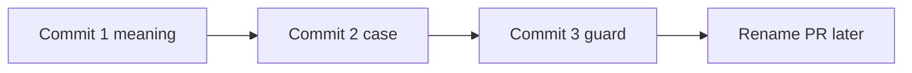

# Engine, Harness, Host terminology sweep

## Outcome

- Every rulebook a coding session reads (the 32 `AGENTS.md` files, the 25 `## Invariants` crate docs, the two `.cursor/rules` files) uses Engine, Harness and Host one way, and only the root `AGENTS.md` defines them.
- In prose, the word "host" appears only as the Host or inside a name another tool defines. Code (identifiers, test names, and message strings) keeps its old names until the follow-up rename PR.
- Engine, Harness and Host are capitalized in prose everywhere, including all of `vibe/`.
- A guard test fails CI if the old wording comes back into a rulebook.

Decided already: three layers (the Host talks to the Harness, the Harness talks to the Engine); all of `vibe/` is swept; all three terms capitalized; the guard is approved; `HostBackend` becomes `RealBackend` in the follow-up PR.



## Size, from the file-by-file roadmap (Appendix A)

- Commit 1 touches about 480 files and about 2,200 prose lines: Engine crates about 200 files and 760 lines, Harness 48 files and 145 lines, Workshop 53 and 105, gateway, shared, build, root and tools 55 and 180, guide 20 and 258, `vibe/` 98 and 750.
- Commit 2 adds several thousand case-only line changes, most of them in `vibe/`.

## Commit 1: meaning

### 1.1 Root AGENTS.md

Add this section directly after the opening paragraph, before `## Principles`:

```markdown
## Definitions

Three words have exactly one meaning each, everywhere in this repository: code comments, docs, rulebooks, and plans. Write them capitalized.

- **Engine**: the `promptforge` crates, `crates/promptforge/` and everything under `crates/promptforge-internal/`; the Structure rules below call this product PromptForge. The Engine parses a prompt and steps a run. Whenever a run needs a model reply, a tool result, a timer, or a file, the Engine emits an effect and waits for the Harness to answer it.
- **Harness**: the `harness` crates, `crates/harness/` and everything under `crates/harness-internal/`. The Harness steps the Engine, performs every effect, returns each answer, and keeps the run log. Production code runs prompts only through the Harness. In Engine tests and examples, the code that steps the Engine plays the Harness's part and is called the Harness too.
- **Host**: an application that runs prompts through the Harness, such as Workshop or Papergate. The Host makes every policy decision. It runs prompts only through the Harness; it may also use the Engine's parser and types to read prompts and show events.

### Using the terms

- "Host", in any capitalization and as hosts, hosted, or hosting, means only the Host. Other meanings use these words:
  - "Engine globals" for the Lua globals the Engine installs in every section, and "Engine call" for a call to one
  - "real files" and "the real filesystem" for the operating system's files
  - "machine" for the computer something runs on
  - the part's own name for a program or UI part that embeds another, such as "the desktop app" or "the container element"
  - "run", "serve", "embed", or "hold" for the verb
- "Engine" and "Harness" mean only the defined terms. Anything else gets a qualified lowercase name: the gateway's speech engine, the database, Rust's built-in test harness. Inside `crates/gateway/stt/`, a bare "engine" means the speech engine. This repository's own checks and test scaffolding are "structural checks", "test support", or "fixtures".
- Names defined outside this repository are used exactly as defined: the HTTP `Host` header and URL host names, the gateway config key `max_per_host`, Cargo's host triple and `harness = false`, GitHub's self-hosted runners, cargo-dist's `host` step and `host-jobs`, CSS `:host`, and the DOM's `ShadowRoot.host`.
- Crate names are written as they are, such as `harness-runner` and `promptforge-engine`. Identifiers that use "host" in another sense, such as `HostBackend`, `RunHost`, and `inject_host`, keep their old names until a rename lands.
- Quotations of people stay verbatim.
```

Same file, other edits:

- `## Roles`: delete the PromptForge and Harness bullets, which the Definitions replace. The Workshop bullet becomes "Workshop is a Host: a user-facing agentic development environment, a Tauri desktop application with an HTML/CSS/TypeScript UI". The Gateway bullet stays.
- Line 3: "for the PromptForge pipeline engine, the harness that hosts it, the inference gateway, and the Workshop desktop product" becomes "for the Engine, the Harness that runs it, the Gateway, and Workshop, a Host".
- Line 37 (chip): "The host owns its kind and payload" becomes "The part that embeds the chat box owns its kind and payload".
- Line 54: "host-support code" becomes "run-support code". Line 56: "the facade paths hosts see" becomes "the facade paths other crates see". Line 79: "Boundary and structural harness" becomes "Boundary and structural checks".
- The new text avoids the phrases `docs-claims.mjs` already bans in this file ("TOML config", "three named buckets", "three homes").

### 1.2 Rulebook statements removed or reworded (main agent, before the workers start)

Removed outright, because they define the Engine, Harness and Host relationship outside the root file or freeze today's session API into a rule:

- `crates/harness-internal/sessions/AGENTS.md`: the "rebuilt when the gateway generation changes" bullet. In the intro, "the bindings a client pushes through the public API (gateway, chat catalog, host snapshot)" becomes "the bindings the Host pushes through the public API"; "The client that owns a socket" becomes "The Host that owns a socket".
- `crates/harness-internal/sessions/src/lib.rs` Invariants: the pushed-bindings bullet ("the gateway, the chat catalog, the host snapshot") and the `LaunchOptions::vfs` "one client-built handle" bullet. Its last sentence, "It is the one place a Plugin provider crate is named, at registration", stays as its own bullet.
- `crates/workshop/server/AGENTS.md`: the whole "Agent sessions run in the harness..." bullet (the dependency rule it restates lives in the root Structure section). In the other bullets, "host-embeddable" becomes "embeddable", and "the host" and "host arguments" become "the embedding binary" and "its arguments".
- `crates/workshop/server/src/lib.rs` Invariants: delete the "The harness reads the server's state as data pushed..." bullet; "and the harness keeps their table" is cut; the input-wait bullet becomes "Every unresolved wait that is dropped yields a cancelled frame, which the agent socket renders as `input_cancelled`."
- `crates/workshop/server/Cargo.toml` lines 14 to 16: cut the list of pushed bindings.
- `crates/harness-internal/runner/src/lib.rs` Invariants: delete the `cancel::CancelHandle` "a host bridges" bullet. In the description, "drawing the host inputs the engine refuses to draw itself" becomes "drawing the inputs the Engine refuses to draw itself".
- `crates/gateway/progress/AGENTS.md`: "The Workshop and the harness consume" becomes "The Workshop consumes" (no Harness crate depends on a gateway crate); "Hosts own forwarding tasks" becomes "Callers own forwarding tasks".
- `crates/harness-internal/models/AGENTS.md` and its `src/lib.rs` description: cut "a host resolves model selections against" and the Workshop dropdown clause; cut "so no host ever sees it", since the sentence already says the vendor credential sits in the gateway; in `AGENTS.md`, "checks the endpoint's host" becomes "checks the endpoint's address".
- `crates/promptforge-internal/model-client/src/lib.rs`: cut "the engine's production host"; "a host resolves and freezes model selections through" becomes "model selections resolve and freeze through".
- `.cursor/rules/workshop-architecture.mdc`: "The sessions subsystem has no crate of its own" becomes "The `agents` subsystem has no crate of its own".

Reworded only, since they are otherwise sound rules:

- `crates/promptforge-internal/engine/AGENTS.md`: "hosts reach it only through the `promptforge` facade" becomes "outside crates reach it only through"; "a host performing a `Store` effect" becomes "the Harness, performing a `Store` effect,"; "host-support vocabulary" becomes "run-support vocabulary".
- `crates/promptforge-internal/types/AGENTS.md`: "host-support primitives" becomes "run-support primitives"; "answered by the host" becomes "answered by the Harness".
- `crates/promptforge-internal/lua/AGENTS.md`: line 7 "the host performs it" becomes "the Harness performs it"; "public for `promptforge-engine`, not host API" becomes "public only for `promptforge-engine`"; "host-visible type" becomes "facade-visible type"; the Lua-surface uses become "Engine globals" and "Engine functions"; "Host code never calls" becomes "Engine code never calls"; "Lua host capabilities are namespace functions" becomes "Engine globals are namespace functions".
- `parser/AGENTS.md`: "they are not host API and must not gain facade status without a design change" becomes "they join the facade only through a design change"; "Lua host surface" becomes "Engine globals". `model-client/AGENTS.md`: "host-visible type" becomes "facade-visible type".
- Verb and other senses: `workshop/desktop/AGENTS.md` ("never hosts" becomes "never runs"), `workshop/ui/AGENTS.md` ("hosts indicator slots" becomes "holds"), `gateway/app/AGENTS.md` ("Gateway-hosted" becomes "The gateway's"), `gateway/stt/engine/AGENTS.md` ("host" becomes "caller"), `shared-loopback/AGENTS.md` (network wording written as the `Host` check and `Host`-authority checks so the guard passes).

The other rules in these files (500-line limit, spawn bans, secrets, tiers) stay.

### 1.3 The area sweep (workers in parallel)

Eleven workers, one per area in Appendix A, each editing only its own files. Each worker's brief contains the Definitions text from 1.1, the sense key below, the resolved patterns in Appendix B, and its Appendix A entry. New words are written in their final form ("Host", "Harness", "Engine globals").

Sense key for each "host":

- The application (Workshop, Papergate, a CLI, a batch job): keep, written "Host".
- The Engine's caller, the effect performer, or whatever does a run's outside work: "Harness" ("host work" becomes "Harness work").
- The Lua globals the Engine installs: "Engine globals", "Engine call".
- The operating system's files: "real file", "real path", "real directory", "the real filesystem"; the type is named `HostBackend` in backticks until the follow-up PR.
- A computer: "machine". A program or UI part that embeds another: its own name. A JavaScript runtime: "environment". The verb: "run", "serve", "embed", "hold".
- Network names, outside tools' names, identifiers, string literals, code blocks, doctest lines, and quotations: unchanged.

Rules every worker follows:

- Work only inside `c:\Users\Vinnie\cursor\promptforge`. Two more checkouts, `promptforge2/` and `promptforge3/`, sit beside it in the workspace and are out of scope.
- Every sentence a worker writes or rewrites says what a thing is or does. For example, write "the Engine emits an effect whenever a run needs something from outside", in place of "the Engine does no I/O".
- Sections 1.1 and 1.2 are already applied when workers start; leave those lines as they are.
- Prose only: markdown outside code, comment text in `.rs`, `.ts`, `.mjs`, `.css` and `.lua`, and `.toml` and `.yml` comments and package `description` strings.
- Capitalization belongs to commit 2. In a line you rewrite, write every term in its final form; do not touch other lines only to capitalize them.
- Where "engine" or "harness" means one specific crate rather than the whole Engine or Harness, write the crate name in backticks (`promptforge-engine`, the `harness` facade).
- In code files, reword in place: never add or remove a line (file-length ceilings, Lua stack-trace line numbers).
- Keep doc-comment list indentation (clippy doc lints run with `-D warnings`).
- Facade pages (`crates/promptforge/src/*.md`, `crates/harness/src/*.md`) never say "the Engine" in any case (cicerone's banned-phrase check); they say "this crate" or "the run". They never name a `promptforge-*` crate.
- Fix every other-sense "harness" and "engine" listed in the worker's Appendix A entry, and do the other-sense renames first where the entry says so.
- Skip `node_modules/`, `target/`, `dist/`, lock files, the generated guide exports, the cargo-dist workflow, `vibe/scratch/*.diff` and `vibe/scratch/*.log`.
- Report any hit that fits none of Appendix B instead of guessing.

### 1.4 Specific rewrites (done by the owning worker)

- `crates/promptforge/src/lib.md` line 9: the program that does the outside work is the Harness; "In production that is the `harness` crate; in these examples your own program plays the Harness's part."
- `guide/src/language/01-what-a-prompt-is.md` section "The prompt and its host": open with one paragraph naming the three layers (the Engine parses the prompt, steps the run, and emits an effect whenever the run needs something from outside; the Harness performs each effect and keeps the run log; the Host launches runs, chooses policy such as the selected model and whether someone can answer `input.ask()`, and can cancel), then keep the contract-key content with Harness and Host in place of host.
- `guide/src/introduction.md` lines 11 to 21: put the Harness between the Host (Workshop, a library user) and the Engine, and have the Harness talk to the gateway.
- `vibe/archdoc.md` lines 5, 9 to 12, 15 and 28: the Engine (executor) exchanges every effect and event with the Harness as a value through its stepping API, `Run::new`, `step`, `resume` and `cancel`; the Harness steps the Engine and performs its effects; a Host line is added; "host capabilities" becomes "Engine globals".
- `tools/cicerone/plans/promptforge.md`: its plan term `host:` is rewritten to the Harness role, so regenerating the facade pages cannot bring the drift back; `tools/cicerone.md` style examples ("small host", "every host writes", "A `Session` is one running prompt", which becomes "A `Session` owns a sequence of runs", and the persona "a test harness", which becomes "a test suite").
- Statements that call the Harness a host: `harness-internal/runner/src/prepare.rs:4`, `effect_loop.rs:1`, `sessions/src/runtime.rs:122`, `workshop/server/src/app/compose.rs:200`, `promptforge-internal/engine/src/lib.md:3`, `test_support/tokio_driver.rs:35-37`, `test_support/mock-gateway-client.rs:3`, `execute/scheduler.rs:4`, and the "only production host" sentence repeated in about eleven `vibe/` plans: each says what the Harness does instead.

### 1.5 Guide headings and anchors

- `01-what-a-prompt-is.md:484` "The prompt and its host" becomes "The prompt, the Host, and the Harness"; slug `the-prompt-and-its-host` becomes `the-prompt-the-host-and-the-harness`; update the links at `01:100`, `02-file-structure.md:91`, `04-how-a-prompt-runs.md:646`, `16-task-events.md:231`.
- `05-lua-environment.md`: "Host globals" becomes "Engine globals" (43), "Failed host calls raise" becomes "Failed Engine calls raise" (149), "Standard Lua and host calls" becomes "Standard Lua and Engine calls" (166; update links at `14-fanout.md:79` and `18-quick-reference.md:259`), "Host calls in every section" becomes "Engine calls in every section" (204).
- "Host state with ui" and "Model ids from the Host" keep their slugs. The fenced example titled "Host Model" is code.
- Four `vibe/` headings and four more in older plans change wording (Appendix A); nothing links to them.

### 1.6 Verification for commit 1

Scripts are scratch, kept out of the repo:

- V1 comment-only: in every changed code file, each changed line is a comment (tracking block comments per language) or a `description = "..."` line, before and after.
- V2 line counts: no changed code file gains lines, and the Lua preludes keep their exact line count. Only the removals in 1.2 shorten a file.
- V4 residual: `rg -i -n "\bhost"` over the repo (same skips as 1.3). Every remaining hit must be "Host" in prose, an exempt name, or code. The leftovers go to a scratch report; fix or explain each, and rerun until the report holds only explained lines.
- V5 anchors: no link uses the five old slugs, and each new slug matches a heading.
- Regenerate the exports with `cargo run --locked -q -p build-user-guide`, then run the root `AGENTS.md` gates: fmt check; both clippy sets; the full nextest and doctest runs (the Lua preludes and the doctest pages changed); workspace and facade `cargo doc` with `-D warnings`; `cargo test -p build-xtask`; `cargo +<pinned nightly> xtask api --check`; `cargo xtask site --books-only`; `npm test --workspaces --if-present` in `crates/workshop`; `npm test` in `crates/gateway/config-ui/ui`.
- If the preflight shows the shell cannot run here, the workers still edit, and Vinnie runs the scripts and gates.

## Commit 2: capitalization, case only

- The same eleven areas and workers. Change "engine" to "Engine" and "harness" to "Harness" in prose wherever the word means the defined term, including "Engine crates", "Harness's", and the headings.
- Leave alone: crate names, paths, and any hyphenated or underscored name, identifiers, code, backticked text, quotations of people, the qualified other senses, and all of `crates/gateway/stt/`. A word that needs more than a case change is reported, not edited, since commit 2 must stay case-only.
- V3 case-only: every changed file keeps its line count, and each line equals its original when compared without case. Plus V1 and V2, and a V6 report of lowercase "engine" and "harness" still in prose for review.
- Regenerate the guide exports and run the same gates as commit 1.

## Commit 3: the guard

Extend `crates/workshop/ui/test/docs-claims.mjs` (an existing facility, approved as a structural check):

- Files: every `AGENTS.md`, every `.cursor/rules/*.mdc`, and the `//!` crate doc of every `lib.rs` or `main.rs` that carries `## Invariants`; skip `node_modules/` and `target/`.
- Strip fenced code and inline code first, and skip the root `AGENTS.md` `## Definitions` section, whose rule text has to name the words it restricts.
- Fail on lowercase "host", "hosts", "hosted" or "hosting", including hyphenated forms, except a short allowlist of network and outside-tool phrases (such as "host-and-address" and "self-hosted"), each with a one-line reason in the test.
- Fail on lowercase "engine" or "harness" as a standalone word, except in "speech engine", "database engine" and "test harness", and except under `crates/gateway/stt/` for "engine". A word that is part of a path or joined by `-`, `_` or `::` (`crates/harness/`, `harness-runner`) is a code name and passes.
- Fail on the retired phrases "production host", "engine's host", "hosts the engine", "harness that hosts", "host globals" and "host-support", in any case.
- Each failure names the file, the line, and the offending text.
- Add the bullet "`crates/workshop/ui/test/docs-claims.mjs` enforces these rules in every `AGENTS.md`, every `## Invariants` crate doc, and every `.cursor/rules` file" to the end of Using the terms. Run `npm test` in `crates/workshop`.

## Risks and the check that catches each

- A wrong sense call (Host where Harness was meant): Appendix B settles the common patterns in advance, workers report anything outside it, and the V4 report plus reading the diff catch the rest. This is the main residual risk; expect a handful of wrong calls in about 2,200 lines, each a wrong word in a comment rather than a break.
- A worker edits code: V1 fails on any changed line that isn't a comment or a package description.
- A worker shifts lines (file-length ceilings, Lua stack-trace lines): V2.
- Capitalization touches something other than prose: V3 requires the text to be unchanged except for letter case, and V1 still applies.
- Broken guide anchors (the guide's own link check covers only `SUMMARY.md`): V5.
- Doc-comment lint and rustdoc breaks: clippy and `cargo doc` with `-D warnings`.
- The shell cannot run here: the preflight finds out first, and then Vinnie runs the scripts and gates.

## Follow-up PR (not in this plan)

Appendix C lists what stays for the rename PR: identifiers, test names, model-facing and user-facing strings that still say "host", and the guide passages that quote those strings. That PR must change each string and its guide quotation together, and it runs `tools/cicerone.md` in update mode for any facade item it renames, as the root `AGENTS.md` requires.

## Appendix A: roadmap by area

Counts are from the read-only sweep on 2026-09-30. "Senses" names the dominant replacements. Every area also has files whose hits are all network names, outside tools' names, or code; those are listed as "no edits".

### A1. Engine facade and small Engine crates (80 files, about 227 lines)

- Facade pages in `crates/promptforge/src/`: `lib.md` (20; mostly Harness; line 9 per 1.4), `capabilities.md` (3), `event.md` (5), `ids.md` (1 prose; lines 54 and 219 are doctest code), `metrics.md` (3; the link text `[host](crate)`), `model.md` (7; Harness 4, Host 3), `prompt.md` (1; Engine global), `transport.md` (1), `vfs.md` (about 12; real filesystem; the `## HostBackend` heading stays), `cancel.md` (1; see Appendix B, cancel).
- `crates/promptforge/Cargo.toml` description; `tests/suite/{main,prepare,support}.rs` comments, where "Shared harness" and "shared harness code" become "shared test support" first.
- `crates/promptforge-internal/README.md` (5); `engine/{README.md, AGENTS.md, Cargo.toml}` and `engine/src/lib.md` (8; "the harness is its production host").
- `types/`: `AGENTS.md`, `README.md`, `Cargo.toml`, and `src/{lib, cancel, plugins, detail, emitter, event, event-lifecycle, ids, models, timestamp, tools, tools/descriptor, tools/registry, untrusted, untrusted/tests, wire}.rs`. Nearly all Harness ("host-support" becomes "run-support", "host-drawn" becomes "Harness-drawn").
- `parser/`: `AGENTS.md`, `Cargo.toml`, `src/{contract, contract/models, contract/tests, contract/tests-plugins, detail, error, prompt}.rs`. Harness and Engine-global senses; the string "a host global" is code.
- `model-client/`: `AGENTS.md`, `Cargo.toml`, `src/{lib, client, client/read, client/stream, client/wire, client/wire-canned, detail, error, model, model/error, model/options}.rs`.
- `vfs/`: `README.md` and `src/{detail, detail-tests, handle, handle/access, handle/scope, handle/store_view, handle/tests/claims, handle/tests/happens_before, handle/tests/sink, host, host/files, host/resolve, host/tests, host/tests/links, memory, memory-tests, observe, path, traits}.rs`. Real-filesystem sense; `path.rs` "Windows hosts" becomes "Windows machines".
- No edits: `src/effect.md` (a text diagram), `src/lib.rs`, `public-api.txt`, `vfs/src/lib.rs`, `vfs/src/host/tests/semantics.rs`.

### A2. Engine Lua crate (48 files, about 199 lines), all under `crates/promptforge-internal/lua/`

- Mostly the Lua sense ("host global", "host injection", "host APIs" become "Engine global", "Engine injection", "Engine globals"). Harness sense in `AGENTS.md:7`, `coro.rs`, `dispatch.rs`, `protocol/*.rs`, `handles.rs`, `error.rs`, `error-value.rs`, `lib.rs`.
- Files: `AGENTS.md`, `README.md`, `Cargo.toml` (description; `harness = false` stays), `benches/surface.rs`, and `src/{alias, argv, compactors, coro, detail, dispatch, error, error-value, globals, globals-tests, handles, hardening, host, host-store, lib, messages, models, models-tests, prelude, prelude-tests, program, prose, protocol, protocol/answer, protocol/render, protocol/request, sys, tests, tests/argv, tests/logging, tests/section_vm, tests/shared_replay, tools, tools/decode, vm, vm/install, vm/run, vm/state}.rs`.
- Lua preludes `src/__impl_{globals,coro,store,fanout,tasks,messages}.lua`: comment words only, same line count. Their byte-identity test compares each file with its own compiled copy, so edits pass after a rebuild.
- `hardening.rs`: its `-- Host userdata` comment sits inside a Lua string literal, so it is code.
- `host.rs`: mixed; the Lua surface becomes Engine globals, the `ui()` snapshot lines are the Host.
- No edits: `tests/{cancellation, sandbox, budgets, store, store_errors, store_reports, tool_scoping}.rs`, `tools/tests.rs`, `messages-tests.rs`.

### A3. Engine executor (49 files, about 249 lines), `crates/promptforge-internal/engine/src/` outside `execute/tests/`

- Heaviest: `execute/config.rs` (36; Harness 28, Host 5, real filesystem 3), `test_support/host.rs` (26), `execute/requirements.rs` (18; Host 9), `test_support.rs` (18), `execute/run/effect.rs` (16), `execute.rs` (15), `run.rs`, `environment.rs`, `section_vm.rs` and `test_support/tokio_driver.rs` (13 each), `execute/scheduler.rs` (12).
- Others: `error.rs`, `error/tests.rs`, `error/value.rs`, `execute/{bindings, context, context-bound, error, fill, protocol, requirements-tests, run/tests, section_context, section_context-construct, support, tests}.rs`, `execute/scheduler/{apply, builtins, chain, dispatch, drive, pending, task_end, task_events, timer, tool_call, waits}.rs`, `lua.rs`, `lua/tests.rs`, `lua/tests/{errors,globals}.rs`, `model.rs`, `model/tests.rs`, `subst.rs`, `test_support/{mock-gateway-client, recording, recording/forward, tokio_driver-performers}.rs`, `tools.rs`.
- Wrong claims to fix: `subst.rs:3` "the harness resolves `{{ path }}` placeholders" becomes "the Engine resolves"; `section_context.rs:68` "The frame's engine" becomes "The frame's VM".
- No edits: `benches/models_loop.rs`, `execute/context-tests.rs`, `model/tests-always.rs`, `model/tests-integration.rs`, `test_support/tools.rs`.

### A4. Engine tests (29 files, about 85 lines), `crates/promptforge-internal/engine/src/execute/tests/`

- First, rename the other-sense harness: `suite/exec_flow.rs:1,5,6` "offline harness", `suite.rs:6`, `suite/support.rs:1` "Shared harness", `suite/support.rs:159`, `gateway.rs:28` become "fixture support" or "fixtures".
- Then the comments in `context.rs`, `context-tools.rs`, `effects.rs`, `exec_flow.rs`, `fanout_acceptance.rs`, `full_id_calls.rs`, `happens_before.rs`, `happens_before-concurrency.rs`, `live_infer.rs`, `model_tasks.rs`, `models_loop.rs`, `observations.rs`, `preludes.rs`, `provenance.rs`, `run_inputs.rs`, `run_termination.rs`, `scheduler.rs`, `scheduler/{concurrency, failures, failures-script-tools, fanout, live_h1}.rs`, `serial_driver.rs`, `suite/exec_flow/{run_setup, store_failures}.rs`, `suite/{prepare, support, vfs}.rs`, `tool_call_arm.rs`.
- `suite/vfs.rs`: its Papergate "production host" lines are the Host; the rest are the Harness.
- No edits: 34 files whose hits are all test names, `RunHost`, variables, or asserted strings.

### A5. Harness (48 files, about 145 lines)

- Most "host" here already means the application, because the Harness's public API is what the Host calls: capitalize it.
- Facade pages: `crates/harness/src/lib.md` (about 45 hits; lines 19 and 255 become Harness; about 28 are doctest code), `cancel.md`, `log.md`, `vfs.md`; the `## HostSnapshot` heading stays. `crates/harness/Cargo.toml` comment (Host).
- plugins: `README.md` (line 5: the Harness puts the broker in `RunServices` when the Host has an operator), `src/lib.rs` (description: the Harness builds the registry and resolves each `ToolCall`), `src/{activation, plugin, input, registry, user_input}.rs`, `tests/it/{activation, assembly, needs, preludes, support}.rs`.
- runner: `src/{lib, cancel, prepare, effect_loop, files, performers, performers-host, performers-tools}.rs`, `tests/it/{prepare, prepare-files, prepare-input, support, effect_loop}.rs`. `effect_loop.rs` is 457 lines; keep its line count.
- sessions: `AGENTS.md`, `src/{lib, runtime, environment, session/files, session/run, transition}.rs`, `tests/it/session-files.rs`.
- models: `AGENTS.md`, `README.md`, `src/{lib, transport, catalog}.rs`, `tests/it/end_to_end.rs`.
- log: `src/{append, record}.rs`; the Turso uses of "engine" in `src/{error, append, read}.rs` become "the database".
- web: `README.md` (the Host provides the gateway address and token, and the Harness passes them to the Plugin), `src/lib.rs` ("at host startup" becomes "at registration").
- No edits: everything in `webfetch/src/` and `web-search/src/` (network sense), `models/src/config.rs`, `models/src/transport/tests/env.rs`, `sessions/src/{environment-tests, input-tests, session/supervisor}.rs`, `plugins/src/{plugin-tests, user_input-tests}.rs`, `crates/harness/src/lib.rs`, and the built-in `sessions/agents/chat.md` (no hits; it is code).

### A6. Workshop (53 files, about 105 lines)

- server: `AGENTS.md` and `Cargo.toml` (after 1.2), `src/{lib, agents, agents/bindings, agents/bindings-tests, agents/socket, agents/state, app, app/compose, fixtures, serve, serve-tests, workshop_socket}.rs`, `tests/common/mod.rs`, `tests/it/agents/revoke.rs`. "host" is either the embedding binary or the Host snapshot.
- desktop: `AGENTS.md`, `Cargo.toml` description, `src/{bridge, config, main, gateway/boot}.rs`.
- Other crates: `gateway/src/resolve.rs`, `support/src/config.rs`, `workspace/src/workspace/{tests.rs, tests/jail.rs, tree.rs}`. `tests.rs` is 491 lines in a crate with a 500-line limit; keep its line count.
- UI: `ui/AGENTS.md`; `ui/src/main.ts`; `ui/src/parts/agent/agent-session-view.ts`; `ui/src/parts/chatbox/{chat-box, chip-view, mention-chip, types}.ts` (the chat box's "host" is the part that embeds it); `ui/src/parts/gateway/gateway-config-panel.ts`; `ui/src/parts/status/{activity-indicator, status-bar}.ts`; `ui/src/parts/stt/{realtime-stt, stt}.ts`; `ui/src/parts/workspace/add-folder.ts`; `ui/src/services/zone-state-service.ts`; `ui/style.css`; `ui/test/{agent-stt, chatbox-boundary, close-commands, gateway-config-bridge, markdown-render, tab-menu, workspace-switch}.mjs`; `look/{modal.css, modal.ts}`; `platform/{status-indicators, text-control-service}.ts`.
- Other senses: `server/tests/it/workshop_socket.rs:5` "shared harness" becomes "shared test fixtures"; `ui/test/agent-stt.mjs:101` "every harness" becomes "every test setup"; the SQLite "engine" in `workspace/src/workspace_file.rs`, `workspace_file/actor.rs`, `workspace/tests/{switch,reopen}.rs` and `server/src/serve-tests.rs:72` becomes "the database".
- No edits: `server/src/cross_site.rs` and the other network-sense files, and about 20 UI and test files where "host" is only a variable, a test string, or `location.host`.

### A7. Gateway, shared, build, root, tools, CI (55 files, about 180 lines)

- Root: `README.md` ("hosts its own server" becomes "runs"), `crates/README.md` ("effects a host performs" becomes "effects the Harness performs"; "the structural harness" becomes "the structural checks"), root `Cargo.toml` ("Host metrics" becomes "Machine metrics"; "Benchmark harness" becomes "Benchmark framework"), `gateway.local.example.toml`, `dist-workspace.toml` (comment only; the `hosting` and `host-jobs` keys stay), `guide/landing/index.html` (3; "hosting a run", "hosts the Harness", "the host's control").
- CI: `.github/workflows/ci.yml:143`, `whisper-lib.yml` ("PromptForge hosts need no compiler" becomes "machines"). The cargo-dist workflow `promptforge-gateway-v-release.yml` is generated; leave it.
- tools: `tools/cicerone.md` (10), `tools/cicerone/plans/promptforge.md` (22, the plan term `host:`), `tools/cicerone/plans/harness.md` (8), per 1.4.
- build-xtask: `src/{site, api/doc_text, api/items, api/load, api/listing, api/listing/compact}.rs` ("hosts" there means crates that depend on the facade: "dependents"). build-llama-cuda: `src/{lib, deps, manifest, bundle}.rs` ("the host" becomes "the machine"; "host triple" stays).
- Shared and API: `gateway-api-types/src/metadata.rs` (Host), `shared-ui/{modal.ts, modal.css}` (container element).
- gateway: `app/{AGENTS.md, README.md, Cargo.toml, build.rs}`, `app/src/{lib, boot, runner, models, speech, tray/logic}.rs`, `app/src/admin/walled/{system, system-tests, reveal, reveal-tests}.rs`, `app/tests/it/cuda.rs`; `progress/{AGENTS.md, src/lib.rs}`; `stt/engine/{AGENTS.md, src/policy.rs, src/worker.rs}`; `stt/api/src/service.rs`; `config/src/{config.rs, config/workshop.rs, config/accessors.rs}`; `local/src/{error, artifacts, artifacts/assets, testsupport}.rs`; `cloud-providers/{src/providers/foundry.rs, tests/sheet_binary.rs}`; `routing/src/queue.rs`; `config-ui/ui/src/{services/gateway-api.ts, pages/cloud-models-page.ts, components/review-diff.ts, components/apply-overlay.ts, components/confirm-modal.ts}`. Mostly the machine and verb senses.
- Speech engine: outside `crates/gateway/stt/`, a bare "engine" meaning the speech engine becomes "speech engine" (`gateway/app/README.md`, `gateway/app/Cargo.toml`).
- No edits: `shared-loopback` except its `AGENTS.md` wording in 1.2, `gateway-api-discovery`, `gateway/web-search`, the other network-sense gateway files, `build-workshop`, the build-xtask toolchain files, `deny.toml`. `config-ui/.../settings-sections.test.mjs` asserts strings with "hosting": code, follow-up PR.

### A8. Guide (20 files, about 258 lines), `guide/src/`

- `language/`: `01-what-a-prompt-is.md` (27; section rewrite in 1.4), `02-file-structure.md` (10), `03-blocks-and-prose.md` (3; "The host installs its globals" becomes "The Engine installs its globals"), `04-how-a-prompt-runs.md` (31; mostly Harness), `05-lua-environment.md` (74; four headings in 1.5), `08-jump-and-call.md` (1), `09-the-store.md` (25), `10-models.md` (24; mostly Host), `11-conversations.md` (10), `12-tools.md` (29; mostly Harness), `13-web-fetch-and-search.md` (46, only about 8 prose lines; the rest are URL hosts and quoted messages), `14-fanout.md` (4), `15-tasks.md` (9), `16-task-events.md` (30), `17-limits-and-errors.md` (42; cancel and failure display are Host, limits and the model connection are Harness), `18-quick-reference.md` (32; its cells mirror the chapters, and "Host-set limits" becomes "Harness-set limits").
- `gateway/`: `02-configuration-file.md`, `04-local-models.md`, `10-config-ui.md`, `11-serving-and-observing.md` (machine and verb senses; `max_per_host` and "diversified by host" stay). A bare "engine" meaning the speech engine becomes "speech engine" in `05-speech.md` (47, 49, 71) and `11-serving-and-observing.md` (41).
- `introduction.md`: no "host", but its architecture paragraph is rewritten per 1.4.
- Quoted exact messages are copied exactly. "and this host provides none" and "User input is unavailable in this host; continue without it." already mean the Host and stay. "host {host} has no allowed address" is the network sense and stays. "a host global" changes only in the follow-up PR, together with the code that produces it.
- No edits: `language/06-arguments.md` (inline code), `gateway/03-remote-models.md` (URL host).
- The exports `guide/promptforge-*-guide.md` are regenerated, never hand-edited.

### A9. `vibe/` top level (32 files, about 372 lines)

- Heaviest: `2026-09-28-2-capability-harness-redesign.md` (184; mostly the Host already, so capitalize; lines 106 to 113 and 325 move effect work from the Host to the Harness), `2026-09-23-1-promptforge-api-firewall.md` (79), `2026-09-28-5-internal-crates-fix-batch.md` (71), `2026-09-26-4-store-into-vfs.md` (70), `2026-09-28-4-internal-crates-critical-fixes.md` (44), `2026-09-27-1-store-vfs-debt.md` (31), `2026-09-22-4-api-runtime-debt.md` (26), plus 24 lighter files.
- `archdoc.md` per 1.4; the live notes `papergate-harness-migration.md` (line 5: "Its only production host is the harness"), `dependency-surface.md`, `agent-runtime-field-comparison-and-adoption.md`.
- Boilerplate: "the harness is the engine's (executor's) only production host" in about eleven plans' context sections gets the same rewrite; "structural harness" and "boundary and structural harness" in about 30 plans become "structural checks".
- Headings: `2026-09-22-4:315` ("test-only host" becomes "test-only `RunHost`"), `2026-09-28-4:254` and `2026-09-28-5:669` (host backend becomes real-filesystem backend), `2026-09-28-5:589` ("host-built completions" becomes "Harness-built completions", since the Harness side builds them).
- No edits: `2026-09-20-2-gateway-api-types-progress.md`, `2026-09-20-3-gateway-route-decentralization.md`, `2026-09-26-1-workshop-debt-removal.md` (network sense only).

### A10. `vibe/2026-09/` (25 files, about 248 lines)

- Heaviest: `2026-09-13-1-capabilities-global-naming.md` (110; its glossary line 819 defines "A host: whatever embeds the executor"), `2026-09-11-3-vfs-foundation.md` (50), `2026-09-10-1-unified-prompt-model.md` (48), `2026-09-19-1-chatbox-extraction.md` (40; the chat box's parent part), `2026-09-18-4-sans-io-engine-harness.md` (38; the origin of "only production host" at lines 54, 96, 115, 163, 323, 403), `2026-09-03-3-gateway-sidecar-decomposition.md` (17; heading "The shell hosts workshop-server" becomes "The shell runs workshop-server"), `2026-09-12-5-one-door-promptforge-api.md` (17), `2026-09-05-2-generic-realtime-stt.md` (13), `2026-09-12-2-dependency-rules-vfs-hook.md` (13), plus 16 lighter files. Heading `2026-09-11-3:621` "host backend" becomes "real-filesystem backend".
- Other senses: "structural harness" boilerplate in about 20 plans; "test harness" meaning this repository's test scaffolding becomes "test support"; the "Agent Harness" product idea in `2026-09-14-2` becomes "a future agent Host"; the frontier "harness tool file" in `2026-09-02-6` becomes "agent tool file".
- No edits: 7 files whose hits are only GitHub runners or network names.

### A11. `vibe/2026-07/`, `vibe/2026-08/`, `vibe/scratch/` (41 files, about 130 lines)

- Heaviest: `2026-08-31-7-interactive-webhook-tool.md` (18), `2026-08-07-3-models-debug-cluster.md` (14; "host default" becomes "Harness default"; the heading "Hosts" stays), `2026-08-28-4-cuda-llama-provisioning.md` (12; machine sense), `2026-08-05-1-section-lua-lifecycle.md` (10), `2026-08-28-2-coroutine-protocol-executor.md` (9), `2026-07-31-1-orchestrator-only.md` (7; heading "Host objects and functions" becomes "Engine objects and functions"), `2026-08-29-5-gateway-config-spa.md` (7), plus 34 lighter files. Headings `2026-08-27-4:155` ("Gateway hosts the workshop" becomes "Gateway embeds the workshop") and `2026-08-29-5:723` ("hosted workshop UI" becomes "workshop UI").
- These plans predate the Harness crates: "the host" meaning whatever ran the prompt and did its outside work becomes "Harness"; an application in its application role stays "Host".
- Other senses: many "harness" uses meaning test scaffolding become "test support" or "fixtures"; outside ideas such as an "agentic harness" (Cursor, Claude Code) or an "eval harness" stay lowercase and qualified; "Jinja engine", "Whisper engine", "transcription engine" stay qualified.
- `vibe/scratch/`: edit the `.md` and `.txt` notes; leave the `.diff` and `.log` files, which are recorded tool output.

## Appendix B: resolved patterns (workers apply these, not their own guesses)

Who does what today: the Harness prepares runs, draws each run's seed, start instant and name, stages the declared files, steps the run, performs every effect, streams deltas, writes the run log, logs Plugin warnings, owns the cancel flag, fetches the gateway's model list, and holds what the Host pushes. The Host builds the Harness, launches runs, pushes the gateway, model list, selection and workspace roots, supplies `ui()` data, presses Stop, answers input waits, and shows events. Classify by today's code, not the planned design.

- Cancel: the request (Stop, Ctrl-C, "when the host cancels a run") is the Host; setting the flag or ending the run is the Harness ("the Harness sets that flag when the Host cancels").
- Model catalog: building it from `GET /v1/models` is the Harness; choosing, selecting, or showing a model is the Host ("the Harness fills every declared role with the model the Host chose").
- Input: the input broker is "the part of the Host that carries a question to a person"; "`input.ask()` still asks the host, so the host sees every question" becomes "still asks the Harness, so the Host sees every question".
- Web search: "The Host provides the gateway address and token; the Harness passes them to the Plugin when it registers it."
- Credentials, server settings, and "gateway access disabled by the host": the Host.
- "production host", "the engine's host", "host of the engine": rewrite to what the Harness does, for example "the Harness, the Engine's only production caller".
- "test host" in Engine or Lua tests: "the Harness" or "this test's Harness", never "test harness".
- "host-support": "run-support". "host-drawn": "Harness-drawn". "host ceiling": "the Harness's ceiling". "host table" (tool implementations): "the Harness's tool table". "the host's process": "the Harness's process". "Host-side failures": "failures outside the prompt".
- "host-facing" and "host-visible" meaning facade consumers: "public" or "facade-visible"; "host API": "facade API".
- "portable across hosts" (limits and ceilings): "portable wherever it runs".
- "hosts can distinguish", "hosts can show", "hosts can filter": the Host.
- "host developers", "embedding hosts", "a library a host embeds": people or programs building applications, so the Host.
- "Host-primitive tools": "Harness-primitive tools". "addon host": "Plugin loader". "trusted-host callers": "trusted callers". "host bind": "catalog bind". "host publication": "gateway publication".
- Speech crates: "host capture policy" becomes "capture policy", "deterministic hosts" becomes "deterministic callers", "host facade" becomes "service facade", "the host can classify" becomes "the caller can classify".
- VFS "host roots", "host folders", "host mount": "real directories" and "real mount". "the host OS": "the operating system". "Windows hosts": "Windows machines". "on this host" (keyboard platform in tests): "on this platform". The UNC "remote host": "remote server".
- Chat box "host": "the part that embeds the chat box" (short form in code comments: "the owning part"). DOM "host element": "container element". Workshop server "the host": "the embedding binary".
- `vibe/` quotations of people: unchanged, even when they use the old sense.

## Appendix C: inventory for the follow-up rename PR

Already correct under the definitions (keep): `HostSnapshot`, `set_host`, the `host` field and getter on the Harness bindings, Workshop's `host_snapshot`, and the tests named after them. The messages "User input is unavailable in this host; continue without it." (`harness-internal/plugins/src/user_input.rs`, sent to models), "..., and this host provides none" (`promptforge-internal/engine/src/execute/requirements.rs`), and the test string "the host withdrew the wait" also keep their wording, because each means the application. The capitalization rule covers prose, not message text, so they stay as written, and prose that quotes them quotes them exactly.

Rename (not the Host sense):

- Real filesystem: `HostBackend` (public; update `public-api.txt` and run cicerone in update mode) to `RealBackend`, plus `HostAccess`, `HostRoot`, `identity_to_host`, the `vfs::host` module and files, and the matching test names.
- Harness role in Engine test support: `RunHost`, `run_with_host`, `run_host`, `test_support/host.rs`, the `fn host(self)` method, `host` locals, and 19 Engine test names such as `a_chat_round_streams_its_deltas_to_the_host`.
- Lua surface: `inject_host`, `inject_host_with_var`, `install_host_apis`, `host_injected`, `Reserved::HostGlobal`, the `lua/src/host.rs` and `host-store.rs` files, the Lua helper `host_type`, the registry key `promptforge.host.store_phase`, and the Lua test names.
- Harness runner: `performers-host.rs` and `mod host`.
- Workshop UI: `LazyPanelHost`, `emptyHost`, `editHost`, DOM `host` parameters, the `host-toolbar` class, the local test helper `harness()` in `ui/test/agent-stt.mjs`, and the `reboot-the-host` action id.
- Other: `SyntheticHost` in build-llama-cuda, `HOSTED_OFFER` in the Foundry provider, and the Engine module named `engine` in `execute.rs:15`.

Strings that models or users see, each changed together with the guide passage that quotes it:

- "a host global" and "which is already a host global" (reserved-name errors, the Lua sense); "the tool the call names has no implementation in the host's table" (the Harness sense); "section VM host values have not been injected" and its siblings (the Lua sense); "the host backend is read-only" (the real-filesystem sense).
- Test assertions and fixture strings that contain "host", such as "the host can drop what it holds" and the `settings-sections.test.mjs` "hosting" strings.

Exempt, never renamed: network and outside-tool names such as `require_loopback_host`, `max_per_host`, `url::Host`, `header::HOST`, `host_triple`, `Hostx64`, and cargo-dist's `host` job.
