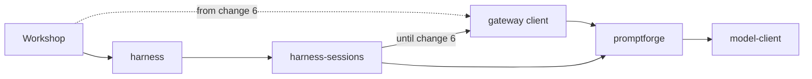

# Change 4: harness-gateway-client

<product-contract>

## Product Requirements

The engine still publishes OpenAI chat-completions wire code as `promptforge::transport`, and the harness still contains its own HTTP model client. This change moves both into one new crate at the `crates/` root, `harness-gateway-client`, which sits beside `harness` and gives every host the standard way to talk to the PromptForge Gateway. It is change 4 of a nine-change effort that moves I/O out of the harness. Changes 1 to 3 have landed: the store-to-VFS rename, the host-owned run log (now `crates/workshop/run-log`), and the transport-neutral failure vocabulary (`CompletionErrorKind` in `crates/promptforge-internal/model-client/src/model/error.rs:29-55`). Nothing observable on the wire or in Workshop changes.

- Problem and users:
  - Team developers working on the engine, the harness, and Workshop. Hosts are Workshop today and Papergate later.
  - The engine family holds OpenAI SSE parsing, the request body builder, and HTTP status classification, all in `crates/promptforge-internal/model-client`. That contradicts the engine being transport-neutral.
  - The harness holds an HTTP client, `crates/harness-internal/models`. The harness should not talk HTTP; inference is moving to a host-supplied broker in change 6.
- Goals:
  - No SSE parsing, OpenAI request or response body handling, or HTTP status mapping remains in any `crates/promptforge-internal` crate, and the facade no longer has a `transport` module. The OpenAI serde shape that `Message` and `ToolSchema` derive stays for now (see Deferred).
  - No HTTP client remains in `crates/harness-internal`. `harness-internal/models` is deleted.
  - `crates/harness-gateway-client` holds everything a host needs to talk to the Gateway: chat completions over SSE, the model-list fetch, endpoint and key configuration, failure mapping, and the reusable wire helpers.
  - The engine's test suites run with no HTTP, against an in-process scripted chat performer.
- Non-goals:
  - Defining the host-supplied broker trait, or having the harness receive the client instead of building it (change 6).
  - Moving streaming into the broker or removing `Delta`, `DeltaSink`, or the `stream` flag (change 7).
  - Removing sessions (change 8) or tokio (change 9).
  - Adding the Gateway search-provider client (change 5). It will land in this crate later.
  - Changing the OpenAI serde shape that `Message` and `ToolSchema` derive.
  - Merging this code with the gateway's own OpenAI types (`crates/gateway/protocol`) or Workshop's admin SSE reader (`crates/workshop/gateway`).
- Success criteria:
  - `crates/promptforge/public-api.txt` has no `promptforge::transport` lines. Today it has 9.
  - No file under `crates/promptforge-internal` parses SSE, builds the OpenAI request body, or maps HTTP status or body text to an error kind.
  - `crates/harness-internal/models` does not exist.
  - Every verification command passes, including Workshop's streaming tests, and a manual Workshop chat still streams its reply in pieces.
- Constraints:
  - `harness-gateway-client` depends only on `promptforge` and third-party crates. It never depends on `harness` or any `harness-internal` crate. `harness-sessions` uses it until change 6, and a dependency on `harness` would form a cycle through the facade.
  - Wire behavior, error-kind mapping, delta timing, bearer-key redaction, and backend-body bounding stay byte-for-byte the same.
  - The new crate has `//! ## Invariants` in `src/lib.rs`, `[lints] workspace = true`, and keeps every file under 500 lines. These checks apply to any `harness-*` name (`crates/build-xtask/src/tidy.rs:275-289`, `:182`, `:204`, `:226`).
- Open questions: None

## Functional Specification

Runtime behavior does not change. The harness still builds a gateway client for each gateway binding and wraps it in its chat performer for each run, as it does today. Only the client's crate changes. A host may now depend on `harness-gateway-client` directly, but no host does yet. Engine tests drive model rounds through an in-process scripted performer instead of an HTTP mock.

- Actors and workflows:
  - `harness-sessions` builds a `GatewayClient` from the pushed gateway binding (`crates/harness-internal/sessions/src/environment.rs`, import at line 21). It wraps the client in `GatewayChatPerformer` for each run (`crates/harness-internal/sessions/src/session/run.rs`, import at line 17, construction at line 96). Both continue unchanged until change 6.
  - Workshop does not depend on the new crate in this change. It reaches the harness only through `harness`.
- Inputs and outputs:
  - Unchanged: `POST {api_root}/chat/completions`, always streaming SSE with a bearer key, and `GET /v1/models` for the model list.
  - Unchanged: live `StreamDelta::Text` and `StreamDelta::Reasoning` pieces through `on_delta` as each payload decodes, forwarded by the performer only when the `Chat` effect's `stream` flag is true.
  - Unchanged: the returned `Completion` holds the result, finish reason, reasoning, served model, `CallMetrics`, metadata diagnostics, and an optional `RawExchange`.
- States and validation:
  - The moved reader builds every `Completion` and `ToolCall` only through public validating constructors (`Completion::from_result`, `ToolCall::from_parts`, and the `with_*` builders). So the neutral checks in model-client run for every broker. Those checks are empty tool-call batch, duplicate call id, blank id or name, and non-object arguments.
  - Wire-only checks move with the reader: the `[DONE]` sentinel, the byte cap, and a tool-call batch cut off by a `length` or `content_filter` finish.
- Errors and recovery:
  - The HTTP-to-kind mapping is unchanged: 400 or 413 plus an overflow phrase maps to `ContextOverflow`. The phrases are `OVERFLOW_PHRASES` (`crates/promptforge-internal/model-client/src/classify.rs:26-39`, status gate at `:86`). In-stream error phrases are mapped by `classify_stream_error` (`classify.rs:135-157`).
  - The moved code builds errors with the public `CompletionError::new`, `CompletionError::context_overflow`, and `CompletionError::with_source`, plus `CompletionErrorKind::phrase`, which becomes public. Today it uses the crate-private `CompletionError::malformed`. Error text and error sources stay the same.
- Security and privacy behavior:
  - The bearer key stays wrapped in `SecretString`, redacted in `Debug`, and absent from `Display` and error text.
  - Backend error bodies stay bounded and control-escaped through `escape_controls` before they are kept.
  - A keyless client remains an explicit choice.
- Acceptance criteria:
  - The success criteria above hold.
  - The engine delta tests `a_chat_round_streams_its_deltas_to_the_harness` and `a_nested_infer_round_streams_no_deltas_to_the_harness` (`crates/promptforge-internal/engine/src/execute/tests/effects.rs:270`, `:296`) pass without edits.
  - The three performer delta tests now in `harness-sessions` pass: wire order, no deltas without a live consumer, and an undrained sink does not fail the round.
  - The four Workshop streaming tests pass: `agents/turns.rs:8`, `chat_gate/protocol.rs:10`, `agents/lifecycle.rs:53`, and `chat_gate/overload.rs:10`, all under `crates/workshop/server/tests/it/`.

</product-contract>
<implementation-contract>

## Technical Design

A new root crate, `harness-gateway-client`, joins the harness family beside `harness`. It depends only on the `promptforge` facade, and outside crates may name it. It receives two bodies of code: the OpenAI wire code from model-client, and the HTTP client from `harness-internal/models`. Model-client gains the public accessors and builders that the moved code needs, so the wire code can live outside the engine. The harness-specific performer adapter moves into `harness-sessions`, where change 6 deletes it.

- Architecture:

  - `gateway client` is `crates/harness-gateway-client`, with library name `harness_gateway_client`.
  - The engine runtime never calls wire code. Its one use of transport data is optional debug capture of `Completion::raw()` (`crates/promptforge-internal/engine/src/execute/support.rs:99-114`), which this change keeps.
- Modules and interfaces:
  - `harness-gateway-client` public API:
    - The former `harness-models` exports except the adapter: `GatewayClient`, `GatewayEndpoint`, `GatewayConfigError`, `SecretString`, `SecretError`, `fetch_model_catalog`, and the re-exported `CompletionError` and `CompletionErrorKind`.
    - The wire helpers the facade published: `ChunkSource`, `build_request_body`, `read_body_capped`, `read_completion_stream`, `escape_controls`, `classify_http_failure`, and `classify_stream_error`. They stay public so another broker can reuse them.
  - Model-client public additions (`crates/promptforge-internal/model-client`), re-exported through `promptforge::model`:
    - Read accessors on `ToolSchema`: `name`, `description`, `parameters`. Today `client/request.rs` reads these `pub(crate)` fields directly, and `detail::tool_schema_*` is not re-exported.
    - Read accessors on `CompletionOptions` (`src/model/options.rs`): `model`, `temperature`, `max_tokens`, `thinking`.
    - `Completion` builders covering `reasoning_content` and `metadata_diagnostics`, which `client/stream.rs` sets today through a struct literal. They sit next to `from_result`, `with_metrics`, `with_raw`, and `with_finish_reason` in `client/wire-canned.rs`.
    - A `Completion::metadata_diagnostics` read accessor, and `CompletionErrorKind::phrase` made public.
  - Model-client keeps the neutral reply checks (`check_call_id`, `check_call_name`, `check_call_arguments`, `check_unique_call_id`, `empty_reply_error`), reached through the validating constructors. It loses the OpenAI body parsing in `src/normalize.rs`: the body walk in `normalize`, `parse_openai_tool_calls`, `extract_reasoning`, and `response_metadata` with its private parsers (`WireUsage` at `:408`, `WireLlamaTimings` at `:456`, `parse_vllm_metrics` at `:488`). These move to the new crate.
  - `GatewayChatPerformer` and `DeltaSink` (`crates/harness-internal/models/src/performer.rs`) move into `harness-sessions` with their tests. They are the only non-test code in `harness-models` that uses `harness-runner` (`harness_runner::performers::{BoxFuture, ChatPerformer}`).
- File and public API changes:
  - Move from `crates/promptforge-internal/model-client/src/`: `client/request.rs`, `client/read.rs`, `client/read-tests.rs`, `client/stream.rs`, `client/stream-tests.rs`, `client/stream-metrics-tests.rs`, `classify.rs`, `classify-tests.rs`, the OpenAI-parsing half of `normalize.rs`, and `normalize-metadata-tests.rs`.
  - Move from `crates/harness-internal/models/`: `src/transport.rs`, `src/transport/tests.rs`, `src/transport/tests/{streaming,limits,env}.rs`, `src/catalog.rs`, `src/config.rs`, and `src/failure.rs`. The invariants in its `AGENTS.md` and README (key never logged, bounded and escaped backend body, explicit keyless client) move into the new crate's `AGENTS.md` and README.
  - Move into `crates/harness-internal/sessions/`: `performer.rs`, `performer-tests.rs`, and `tests/it/end_to_end.rs`.
    - `end_to_end.rs` uses `harness_runner::{effect_loop::drive_run, prepare::{Prepared, Services, prepare_run}, recorder::{MemoryRecorder, Record, RecordKind, RunOutcome}, spawn::spawn_tagged, test_support::mock_tag}`. `harness-sessions` already dev-depends on `axum` and on `harness-runner` with `test-support` (`crates/harness-internal/sessions/Cargo.toml:48-52`).
  - The performer tests import `sse_body`, `sse_client`, and `content_chunk` from `transport::tests` (`performer-tests.rs:15`). Those are `pub(crate)` helpers (`transport/tests.rs:30`, `:43`, `:63`) that stay in the new crate. Copy the three helpers, about 35 lines, into the `harness-sessions` test module, built on `GatewayClient::new` and `axum`.
  - The facade (`crates/promptforge/src/lib.rs:81-91`) loses `pub mod transport` and its 7 re-exports, and `crates/promptforge/src/transport.md` is deleted. Bless `crates/promptforge/public-api.txt`.
  - Delete `crates/harness-internal/models`, including its `clippy.toml`.
    - Remove its entry from the explicit `members` list at root `Cargo.toml:3`. Container crates are listed by hand because `crates/harness-internal` is excluded from the `crates/*` glob.
    - Replace the `harness-models` workspace dependency (`Cargo.toml:46`) with `harness-gateway-client`, and point `crates/harness-internal/sessions/Cargo.toml:24` at the new crate.
  - Doc examples and doc links that name old paths must be rewritten when their files move: `harness_models::` in `transport.rs`, `config.rs`, and `catalog.rs`, and `promptforge::transport` in `classify.rs:64` and `:125`. Otherwise the doctests stop compiling.
  - Engine dev-dependencies `axum`, `reqwest`, and `bytes` (`crates/promptforge-internal/engine/Cargo.toml:40-57`) are used only by the mock gateway and the bench's copy of it. Remove them.
- Data, persistence, failure, security, and privacy constraints:
  - Wire format, `CompletionErrorKind` mapping, delta order and timing, redaction, and backend-body bounding are unchanged. Persisted data is untouched.
  - Mock servers in the moved tests spawn with tokio directly. Today they use `harness_runner::spawn::spawn_tagged` (`transport/tests.rs`, `transport/tests/env.rs`, `transport/tests/limits.rs`, and `catalog.rs` tests). The harness spawn ban applies only to crates under `crates/harness-internal` (`crates/build-xtask/src/harness_bans.rs:1-11`, run from `crates/build-xtask/src/tidy.rs:68-69`), so the new crate needs no `clippy.toml`.
  - Product rules (`crates/build-xtask/src/product.rs`):
    - Widen the facade branch of `boundary_breach` (`:231-233`, keyed on `PUBLIC_HARNESS` at `:140`) so outside crates may name `harness-gateway-client` as well as `harness`.
    - Leave `container_named_exception` (`:277-282`) alone, so the new crate still cannot depend into `crates/harness-internal`.
    - Harness-internal crates may already depend on a root `harness-*` crate.
  - Rule text: `AGENTS.md:69` currently says crates outside the family "reach the Harness only through `harness`". It must name both public harness crates.
  - The test-support leak scan covers the new crate's manifest, but the crate is not a guarded package (`crates/build-xtask/src/test_support_leak.rs:52`, `:74`, `:206-213`). The doc(hidden) ban and the engine dependency guard do not apply to it (`crates/build-xtask/src/doc_hidden.rs:31-39`, `crates/build-xtask/src/engine_guards.rs:49-56`).

</implementation-contract>
<verification-contract>

## Testing Plan

Verification is light: each step runs only its touched crates' tests, and the full exit criteria run once, at the end. Moved tests move with their code and must pass unchanged in their new crates. The engine suites keep their test bodies and switch only their helper layer to an in-process scripted performer, which must reproduce today's delta behavior exactly. Coverage of the OpenAI request shape moves from the engine suites into the new crate's request-builder tests. Streaming has regression checks at every layer: reader, performer, engine, and Workshop.

- Unit:
  - The moved model-client tests pass in `harness-gateway-client`: read, stream, stream metrics, classify, metadata parsing, and request.
  - The moved `harness-models` tests pass in `harness-gateway-client`: transport, streaming, limits, env, catalog, and config.
  - Model-client gains tests for the new public accessors and builders. It keeps the neutral-check tests from `normalize-tests.rs`, and the tests there that exercise the OpenAI body walk move to the new crate.
- Integration and end-to-end:
  - Engine suites: replace `ScriptedGateway` (`crates/promptforge-internal/engine/src/execute/tests/gateway.rs:19`) with `ScriptedChat`. It answers each `Chat` effect from a script and records each effect's messages, tools, and options.
    - Replace `GatewayReply` (`:31`) with a neutral `ScriptedReply`: text (content, finish reason, reasoning, metrics), tool calls, a `CompletionError`, or a delayed reply.
    - Keep the `resp_*` helper signatures (`:349-443`). Replace `resp_status(code, body)` (`:430`) with a failure-kind helper.
    - Convert the 5 direct reply-body sites: `reply_with_usage` in `precheck_anchor.rs`, the reasoning-only empty reply in `exit_rules.rs`, `rich_text_reply` in `chat_arm.rs`, `resp_batch` in `batch_turn.rs`, and `resp_text_with_reasoning` in `debug_and_counts-infer-rounds.rs`. Usage scripted in JSON becomes `CallMetrics` through `with_metrics`.
    - Convert the 26 suite files that read `requests()` or `last_request()` to assertions on the recorded effects.
    - Today `assert_openai_tool_calls` (`:164`) runs on every scripted request. Its OpenAI shape checks move to the new crate's request-builder tests.
    - `OverflowClient` (`:454`) is already an in-process `ChatClient` (used by `chat_arm.rs` and `models_loop_compactors.rs`) and needs no change.
  - Delta parity: when `stream` is true, `ScriptedChat` forwards each text reply as two `StreamDelta::Text` pieces split at the char midpoint, the current `split_for_stream` rule (`gateway.rs:46`). It forwards a `StreamDelta::Reasoning` piece when the reply has reasoning, and nothing when `stream` is false.
    - `RunHarness::on_delta` and the stream gating (`crates/promptforge-internal/engine/src/test_support/harness.rs:125`, `:159`) work unchanged, so `effects.rs:270` and `:296` pass without edits.
  - Delete `crates/promptforge-internal/engine/src/test_support/mock-gateway-client.rs`. Point `test_support/tokio_driver.rs`, `test_support/harness.rs`, and `benches/models_loop.rs` (whose axum `BenchGateway` goes away) at the scripted performer.
  - `harness-sessions`: the three performer delta tests and `tests/it/end_to_end.rs` pass after the move.
  - Workshop: the four streaming tests named in the acceptance criteria pass. Workshop's own SSE mock (`crates/workshop/server/tests/common/mod.rs:185-222`) exercises the moved reader end to end through the harness.
- Regression, security, and performance:
  - Key redaction, backend-body bounding, byte-cap, and timeout tests pass in their new home.
  - `crates/build-xtask` fixtures:
    - Five fixtures pin the current facade rule. `a_non_workshop_outside_crate_depending_past_the_harness_facade_is_reported` (`src/product/harness_tests.rs:111`), `a_build_crate_depending_past_the_harness_facade_is_reported` (`:131`), and `a_workshop_crate_depending_on_a_harness_crate_other_than_the_facade_is_reported` (`src/product/tests.rs:414`) stay valid for other harness crates. `an_outside_crate_depending_into_the_harness_container_is_reported` (`src/product/container_tests.rs:254`) and `the_harness_facade_depending_into_the_harness_container_passes` (`:275`) stay valid unchanged.
    - Add fixtures: a workshop crate depending on `harness-gateway-client` passes, and `harness-gateway-client` depending on a `harness-internal` crate is reported.
    - Rename the fixture crates named `harness-models` in `src/product/harness_tests.rs:33,45,95,102`, `src/product/tests.rs:365,372`, and `src/test_support_leak-tests.rs:265,285,320,341` to a harness-internal crate that still exists.
- Exit criteria:
  - The repository's verification list (`AGENTS.md:92-99`) passes:
    - `cargo nextest run --locked --workspace --exclude workshop --exclude workshop-server --exclude workshop-server-api --all-features`
    - `cargo test --workspace --exclude workshop --exclude workshop-server --exclude workshop-server-api --all-features --doc`
    - `cargo nextest run --locked -p workshop -p workshop-server -p workshop-server-api`
    - `cargo clippy --workspace --exclude workshop --exclude workshop-server --exclude workshop-server-api --all-targets --all-features -- -D warnings`, plus Workshop clippy and `cargo check -p gateway --no-default-features`
    - `cargo fmt --all --check`
    - `RUSTDOCFLAGS="-D warnings" cargo doc --workspace --no-deps --all-features --exclude workshop --exclude workshop-server --exclude workshop-server-api`, and `cargo xtask site --books-only`
    - `RUSTDOCFLAGS="-D warnings" cargo doc -p promptforge --no-deps`
    - `cargo +nightly-2026-09-05 xtask api --check`
    - `cargo test -p build-xtask`
  - `cargo hakari generate`, `cargo hakari manage-deps`, and `cargo hakari verify` succeed (`.config/hakari.toml:3-5`).
  - A message sent through a running Workshop agent window streams its reply in pieces.

</verification-contract>
<decision-record>

## Decision Record

- Decisions:
  - **A root crate parallel to `harness`.** The wire code and the HTTP client go into one new crate at the `crates/` root, not into harness internals or the engine. Rationale: inference becomes a host service, and the harness is dropping tokio, so the harness should not talk HTTP, but every host still needs a standard Gateway client. User's words: "the harness shouldn't really be talking HTTP at all … we want small focused components … we need a shared crate that offers basically a library that does the standard talking to the gateway thing. So my thinking is to make it parallel to harness."
  - **Name and scope `harness-gateway-client`.** The crate holds everything a host needs to talk to the PromptForge Gateway, so change 5's search-provider client for the Gateway's `/v1/tools/web_search` lands here too. The user chose this over an inference-only `harness-model-client`.
  - **Engine suites run in-process.** They switch to a scripted chat performer, and wire-specific tests move to the new crate. The user chose this over keeping the suites on HTTP. Rationale: the engine is sans-IO, so its tests should not need HTTP, and the engine can no longer reach the wire code.
  - **The client depends only on `promptforge`.** Rationale: `harness-sessions` uses the client until change 6, and a dependency on `harness` would form a cycle through the facade.
  - **The performer adapter moves into `harness-sessions`.** Rationale: its only caller is `crates/harness-internal/sessions/src/session/run.rs:96`, and change 6 deletes both the adapter and that call, before change 8 removes sessions. The user raised this ("we are getting rid of sessions in step 8 though"), and the timing answers it.
  - **Copy the three SSE test helpers into `harness-sessions`** instead of adding a `test-support` feature to the new crate. Rationale: the performer and its tests are deleted in change 6.
  - **Keep `RawExchange` on `Completion`.** Rationale: it is already neutral and optional, and the engine's debug capture reads it.
  - **No facade-page tool runs.** This change does not run `tools/cicerone.md` and does not edit `tools/cicerone/`, even though `AGENTS.md:98` normally requires an update-mode run when a facade item is added or removed. The facade docs are kept correct by hand: `transport.md` is deleted, the `crate::transport` links in `model.md` and `event.md` are fixed, and new items get rustdoc comments. The facade docs gate (`RUSTDOCFLAGS="-D warnings" cargo doc -p promptforge --no-deps`) catches broken links. No build or xtask check reads `tools/cicerone/`. User's words: "I dont want any cicerone.md runs."
  - **Few steps.** Decompose into as few steps as the dependencies allow, at most five. Each step is one tested commit that leaves the tree building. User's words: "dont make too many steps."
  - **Light verification.** Each step runs only the tests of the crates it touches, plus `cargo test -p build-xtask` when it changes product rules or fixtures, plus the `xtask api --check` facade-surface check when it changes the facade surface. The full verification list in the Testing Plan's exit criteria runs once, on the final step. User's words: "keep verification light."
  - **Keep the `Serialize` derive on `Message` and `ToolSchema`** for this change. Rationale: `build_request_body` serializes them directly, and reshaping the engine vocabulary is a separate change.
  - **Make `CompletionErrorKind::phrase` public, and add no new `CompletionError` constructor.** Rationale: the moved classify, read, stream, and limits tests assert exact message text, and the `CompletionError::new` docs already tell a broker to build its message from the kind's fixed phrase. The public `CompletionError::with_source` already keeps a decode error as its cause (the stream reader uses it today). This settles the earlier error-text and lost-source risks. The user accepted this addition and the `metadata_diagnostics` accessor below.
  - **Add a public `Completion::metadata_diagnostics` read accessor** beside its builder. Rationale: the moved stream-metrics test reads the diagnostics (`client/stream-metrics-tests.rs:135`), and today only model-client's unexported `detail` module reaches them.
  - **`ToolSchema` stays Engine-built, and no public constructor for an assistant tool-call `Message` is added.** The new crate's tests get `ToolSchema` values and replayed tool-call messages by driving a facade `Run` through one tool round: `ToolDescriptor::new`, `ToolCatalog::new`, and `Environment::tools`, then the second `Chat` effect. Rationale: the `ToolSchemaError` docs state that schemas are built only inside the Engine, and `tool_schema_new` is not on the facade; a public constructor would widen the facade for tests alone.
  - **The request-shape checks land in model-client first.** The step that deletes `assert_openai_tool_calls` from the engine ports its checks into model-client's `build_request_body` tests, and the next step moves those tests into the new crate. Rationale: the engine mock must go before the wire code can leave model-client, and no commit may drop that coverage.
  - **`normalize-tests.rs` splits with the code.** Tests that call the body walk move to the new crate, and model-client keeps the neutral-check tests, driven through `Completion::from_result` and `ToolCall::from_parts`. Rationale: most of that file exercises OpenAI JSON parsing. This replaces the Testing Plan's statement that model-client keeps the file whole.
- Rejected alternatives:
  - Wire code to a root crate now, with a temporary product-rule exception for `harness-models` until change 6. Reason: the harness would keep its HTTP client, and the exception is throwaway work. Revisit if moving the client turns out to be blocked.
  - Fold the wire code into `harness-internal/models`, then promote that crate at change 6. Reason: the harness keeps talking HTTP for three more changes. Revisit never; it was superseded by the parallel-crate decision.
  - A sibling crate inside `crates/promptforge-internal`, still re-exported as `promptforge::transport`. Reason: the engine product would still publish SSE parsing. Revisit never.
  - Keep the engine suites on HTTP. Reason: that requires the engine-sibling option, and the engine should not need HTTP. Revisit never.
  - Put the adapter in `harness-runner`. Reason: the runner must end HTTP-free and tokio-free (change 9). Revisit never.
  - A `test-support` feature on the new crate for the SSE helpers. Reason: the helpers serve tests that die in change 6. Revisit if more crates need the mock helpers.
- Assumptions, risks, and notes:
  - **Risk: the line between parsing and checks inside `normalize`** (`crates/promptforge-internal/model-client/src/normalize.rs`) has to be drawn during the move. The rule: model-client keeps no OpenAI JSON parsing, and every neutral check stays reachable through the validating constructors.
  - **Risk: lost request-shape coverage.** 26 engine suite files read recorded request bodies, and `assert_openai_tool_calls` checks every request today. Any OpenAI shape they guard must be covered by the new crate's request-builder tests before the engine-side checks go.
  - **Note: Workshop stays covered.** Workshop's server tests feed the harness through their own SSE mock (`crates/workshop/server/tests/common/mod.rs:185-222`), and no Workshop code imports `harness-models` or `promptforge::transport`. Workshop source uses only `harness::{Delta, DeltaKind}` and `subscribe_deltas`.
  - **Note: no compatibility shims.** The repository has no stored run logs, so no compatibility concern arises from moved types.
  - **Note: small verification additions.** The steps that create and fill `harness-gateway-client` also run `cargo test -p build-xtask`, because that crate is bound by the `## Invariants`, lint-inheritance, and 500-line checks that only build-xtask's tests enforce. The step that removes the facade `transport` module also runs the `promptforge` doctests and the facade docs gate, because it rewrites a facade doc example and removes link targets. Each step that edits a manifest refreshes `Cargo.lock` and the hakari output, so the `--locked` commands keep working.

### Deferred and Out of Scope

- Deferred: whether `harness-gateway-client` implements the broker trait itself or the host writes a small adapter. Revisit at change 6. The cycle constraint ends once the harness stops building the client.
- Deferred: the name collision with `crates/workshop/gateway`'s own `GatewayClient`, used for admin calls and heartbeat. Revisit at change 6, when Workshop first imports the new crate.
- Deferred: moving the OpenAI serde shape off `Message` and `ToolSchema` into the client. Revisit after change 6.
- Deferred: the `<page-transport>` block in `tools/cicerone/plans/promptforge.md:265-296` goes stale once the `transport` module is removed, because it lists the seven removed items. Revisit the next time the facade pages are regenerated.
- Deferred: adding `harness-gateway-client` to the docs site (`RUSTDOC_SITES` in `crates/build-xtask/src/site.rs`). Revisit when hosts use it, at change 6.
- Out of scope: the broker trait, streaming relocation, session removal, tokio removal, and the search-provider client (changes 5 to 9).
- Out of scope: merging with `crates/gateway/protocol` or `crates/workshop/gateway` SSE code.
- Out of scope: updating the team's planning report on the nine-change effort. It lives outside this repository and is updated separately.

</decision-record>
<project-survey>

## Project Survey

- Status: complete
- Build command: `cargo build --locked -p gateway` (plain `cargo build` builds only `crates/gateway/app`, the default member); `cargo build --locked -p workshop` for the desktop app, or `cargo workshop [--release]` to build the gateway, stage it as the Tauri sidecar, and build Workshop together. Crate build scripts bundle the UIs with esbuild, so run `npm ci --prefix crates/workshop` and `npm ci --prefix crates/gateway/config-ui/ui` once first.
- Focused test command pattern: `cargo nextest run --locked -p <crate> --all-features <test-name-substring>`; add `--test it` to target a crate's integration binary; drop `--all-features` for `workshop`, `workshop-server`, and `workshop-server-api`. Doctests: `cargo test --locked -p <crate> --all-features --doc`. UI: `node --test crates/workshop/ui/test/<name>.mjs` or `node --test <path>.test.mjs`.
- Component test command pattern: `cargo nextest run --locked -p <crate> --all-features`, then `cargo test --locked -p <crate> --all-features --doc` (no `--all-features` for the three workshop crates above). Workshop UI: `npm test --workspace ui` run in `crates/workshop`; gateway config UI: `npm test` run in `crates/gateway/config-ui/ui`.
- Full-suite test command: `cargo nextest run --locked --workspace --exclude workshop --exclude workshop-server --exclude workshop-server-api --all-features`, then `cargo test --workspace --exclude workshop --exclude workshop-server --exclude workshop-server-api --all-features --doc`, then `cargo nextest run --locked -p workshop -p workshop-server -p workshop-server-api`. UI suites: `npm test --workspaces --if-present` in `crates/workshop` and `npm test` in `crates/gateway/config-ui/ui`. The workspace run includes `build-xtask`, whose tests are the boundary and structural checks.
- Linter command: `cargo clippy --workspace --exclude workshop --exclude workshop-server --exclude workshop-server-api --all-targets --all-features -- -D warnings` and `cargo clippy -p workshop -p workshop-server -p workshop-server-api --all-targets -- -D warnings`, plus the headless shape gate `cargo check -p gateway --no-default-features`. Never run a standalone `cargo check --workspace` beside clippy. UI typecheck: `npm run typecheck --workspaces --if-present` in `crates/workshop` and `npm run typecheck` in `crates/gateway/config-ui/ui`. Supply chain: `cargo deny check` (installed locally, run by the pre-push hook).
- Formatter check command: `cargo fmt --all --check` (also the pre-commit hook). No JavaScript or CSS formatter is configured.
- Docs command: with `RUSTDOCFLAGS="-D warnings"` (PowerShell: `$env:RUSTDOCFLAGS="-D warnings"`): `cargo doc --workspace --no-deps --all-features --exclude workshop --exclude workshop-server --exclude workshop-server-api`, `cargo doc -p promptforge --no-deps`, `cargo doc -p harness --no-deps`, and `cargo doc --locked --no-deps --all-features -p promptforge-engine --document-private-items`. User guide: `cargo xtask site --books-only`. Facade surface: `cargo +<pinned nightly> xtask api --check`, with the nightly named in `crates/build-xtask/src/api/toolchain.rs`. A change to a public item of `promptforge` or `harness` normally also runs `tools/cicerone.md` in update mode for that crate. This plan overrides that: there are no `tools/cicerone.md` runs (see Decision Record).
- Test placement and naming conventions:
  - Unit tests live in a sibling file wired as `#[cfg(test)] #[path = "<stem>-tests.rs"] mod tests;`, with extra groups as `<stem>-<label>-tests.rs` wired to `mod <label>_tests;` (for example `normalize-metadata-tests.rs` in `promptforge-model-client`). Module directories use `tests.rs` or a `tests/` subdirectory once a group reaches three files. Inline `mod tests { ... }` blocks also exist.
  - Integration tests compile into one binary per crate at `tests/it/main.rs`, with one module file per area (for example `crates/harness-internal/models/tests/it/end_to_end.rs`); a few crates keep standalone `tests/<name>.rs` files. Shared test support sits in `tests/common/` or a `support.rs` module.
  - Test functions are sentence-style snake_case naming the behavior, such as `an_overflow_phrase_on_another_status_is_not_an_overflow`; async tests use `#[tokio::test]`. `clippy.toml` allows `unwrap` and `expect` only in tests.
  - Nextest config (`.config/nextest.toml`) has `default` and `ci` profiles, a 60s slow timeout, and a `heavy` test group for the STT crates.
  - UI tests are `node --test` files in `crates/workshop/ui/test/*.mjs` plus colocated `src/**/*.test.mjs`, using jsdom; the config UI uses colocated `src/**/*.test.mjs`.
- Directory map:
  - `crates/` root: the public layer. `promptforge` (Engine facade), `harness` (Harness facade), `gateway-api-types` and `gateway-api-discovery` (the Gateway's public pair), `shared-error-source`, `shared-loopback`, `shared-ui` (a TypeScript and CSS package, not a Rust crate), `workspace-hack` (cargo-hakari), and build tooling: `build-xtask` (structural checks, `api`, `site`), `build-workshop` (`cargo workshop`), `build-ui`, `build-user-guide`, `build-llama-cuda`.
  - `crates/promptforge-internal/`: private Engine crates `engine`, `types`, `vfs`, `lua`, `parser`, `model-client`.
  - `crates/harness-internal/`: private Harness crates `runner`, `models`, `plugins`, `sessions`, `web`, `webfetch`, `web-search`.
  - `crates/gateway/`: private Gateway crates `app` (the `promptforge-gateway` binary), `cloud-providers`, `config`, `config-ui` (with an npm package in `ui/`), `local`, `logging`, `progress`, `protocol`, `routing`, `web-search`, and the nested `stt/` subsystem (`api` = `gateway-stt`, `engine`, `backend-whisper`, `whisper-ffi`).
  - `crates/workshop/`: the desktop app `desktop` (package `workshop`, Tauri), `server`, `server-api`, `gateway`, `menu`, `protocol`, `registry`, `status`, `support`, `user-state`, `workspace`, `run-log`, and an npm workspace (`ui`, `look`, `platform`) for the SPA.
  - `guide/`: user guide books and site chrome, built by `cargo xtask site`. `prompts/`: example Markdown prompt programs. `tools/`: `cicerone.md` with its Python scripts and plans, plus Node scripts that stage the gateway sidecar. `vibe/`: `archdoc.md` and dated plan records. `local/` (gitignored), `cabinet/`, `images/`, `target/`, `target-msrv/`: working material, art, and build output.
  - Config: `.github/workflows/ci.yml` (fmt, clippy, test, docs, Windows and Linux workshop checks, UI, supply chain, api-surface on the pinned nightly), `.githooks/` (pre-commit fmt; pre-push headless gateway check, clippy, `cargo deny`), `.config/` (nextest, hakari), `.cargo/config.toml` (`xtask` and `workshop` aliases; Windows `rust-lld` with static CRT).
- Component boundaries:
  - Engine (`promptforge` facade over `crates/promptforge-internal/`) must not depend on gateway, workshop, or Harness crates. Outside crates may name only `promptforge`. The Engine is sans-I/O: it emits effects and the Harness answers them.
  - Harness (`harness` facade over `crates/harness-internal/`): harness-* crates depend only on `promptforge`, never on gateway, shared, or workshop crates. Outside crates reach it only through `harness`. It receives the gateway binding as data the Host pushes in.
  - Gateway (public pair at the root, private crates under `crates/gateway/`) depends on shared-* only, never on promptforge, workshop, or Harness crates. `gateway-stt` is the only crate of `crates/gateway/stt/` visible to the rest of the family.
  - Workshop (a Host) may depend on `harness`, `promptforge`, the gateway public pair, and shared-*, never on private gateway crates. The desktop app depends on `workshop-server-api`, never on `workshop-server`. Workshop tiers flow server, then features, then services, then vocabulary; lower tiers never depend on higher ones. SPA lazy panels never import entry-bundle modules.
  - shared-* crates depend on no product crate. Family container crates may depend only on `crates/` root crates and their own siblings; build-* crates are exempt.
  - Enforced by `cargo test -p build-xtask` (dependency matrix, container privacy, tier graph, `## Invariants` markers, 500-line ceiling) and `cargo xtask api --check` (facade surface against `crates/promptforge/public-api.txt`).
- Conventions summary:
  - Rust 2024 edition, resolver 3, stable toolchain via `rust-toolchain.toml`, rustfmt `style_edition = "2024"`. Every dependency version is centralized in `[workspace.dependencies]` with a comment explaining each pin or feature choice. Commands use `--locked`.
  - Strict workspace lints: `unsafe_code = "forbid"` (unsafe only in owned boundaries, with safety comments right before each block), `missing_docs`, `missing_debug_implementations`, and `unreachable_pub` warn; clippy `all` and `pedantic` deny, `unwrap_used` and `expect_used` deny; CI adds `-D warnings`. Broken intra-doc links deny.
  - Facades are flat lists of single-item `pub use` re-exports grouped into documented role modules, with crate docs in `lib.md`.
  - Every workshop-* and harness-* `lib.rs` opens with a `//! ## Invariants` section listing allowed and forbidden dependencies. Files in those crates stay at or under 500 lines.
  - Source directories are flat: one or two related files sit beside the parent as `foo-bar.rs` with `#[path]`; three or more become a `foo/` subdirectory.
  - Errors use `thiserror` enums. Error and status messages are written for model consumption: concise, naming required versus actual.
  - Engine, Harness, and Host are capitalized defined terms with one meaning each, enforced by `crates/workshop/ui/test/docs-claims.mjs`.
  - JSON that reaches a recorder or replay round-trips exactly: serde_json `float_roundtrip`, sorted keys, never `preserve_order`.
  - Comments explain only non-obvious constraints; workarounds cite an upstream issue URL. Behavior changes ship with tests in the same change. New structural checks need explicit user approval. Cargo features gate real constraints only.
  - SPA rules: CSS sits beside its TypeScript, components use `--ws-*` tokens instead of raw values, and nothing uses `localStorage`.

</project-survey>
<execution-plan>

## Execution Instructions

<step-1>

### Step 1: Publish the neutral model accessors and builders [completed]

- Component: Neutral model surface
- Placement: first. The scripted performer (step 2) and the moved wire code (step 3) build completions and read options through these items, and nothing here depends on later work.
- Pieces: one piece, the model-client additions. They are built together because they share one test run and one `public-api.txt` bless.
- Work:
  - `crates/promptforge-internal/model-client/src/client/wire.rs`: add `ToolSchema::name`, `ToolSchema::description`, and `ToolSchema::parameters` (returning `&str`, `&str`, and `&serde_json::Value`), and add `Completion::metadata_diagnostics` (returning `&[String]`) beside `Completion::reasoning_content`.
  - `src/model/options.rs`: add `CompletionOptions::model`, `temperature`, `max_tokens`, and `thinking` (returning `&str`, `Option<Temperature>`, `Option<NonZeroU32>`, and `Option<bool>`).
  - `src/client/wire-canned.rs`: add `Completion::with_reasoning_content` and `Completion::with_metadata_diagnostics` beside `from_result`, `with_metrics`, `with_raw`, and `with_finish_reason`.
  - `src/model/error.rs`: make `CompletionErrorKind::phrase` public with `#[must_use]`, and point the `CompletionError::new` docs at it. Add no new `CompletionError` constructor, because `with_source` already keeps a cause.
  - Give every new public item a rustdoc comment, with a `promptforge::` doc example where its siblings have one. Leave the `detail::tool_schema_*` helpers and the existing internal callers as they are.
- Tests: accessor and builder tests in `src/client/tests.rs` and `src/model/tests.rs`, and a doc example on `phrase`.
- Verify: `cargo nextest run --locked -p promptforge-model-client --all-features`, `cargo test --locked -p promptforge-model-client --all-features --doc`, then `cargo +nightly-2026-09-05 xtask api --bless` and `cargo +nightly-2026-09-05 xtask api --check`.
- Commit: the model-client changes with their tests and the blessed `crates/promptforge/public-api.txt`.

</step-1>

<step-2>

### Step 2: Run the engine suites against an in-process scripted chat [completed]

- Component: In-process engine suites
- Placement: second. Scripted replies need step 1's `with_reasoning_content`. The HTTP mock client is the engine's only importer of the wire code, so it must go before step 3 moves that code out of model-client.
- Pieces: one piece. The scripted performer, the helper layer, and the suite conversions are built together, because the suites cannot compile against a half-converted helper layer.
- Work:
  - Add `crates/promptforge-internal/engine/src/test_support/scripted-chat.rs`. Mount it in `src/test_support.rs` as `#[cfg(test)] #[path = "test_support/scripted-chat.rs"] pub(crate) mod scripted_chat;` and include it by path from `benches/models_loop.rs`, as `mock-gateway-client.rs` is today, using only paths that resolve in both places. It holds:
    - `ScriptedReply`: text (content, finish reason, reasoning, and `CallMetrics`), tool calls, a failure, and a delayed reply wrapping another reply. A failure stores its kind, message, detail, and finish reason, and builds a fresh `CompletionError` for each answer, because `CompletionError` is not `Clone`.
    - `ScriptedChat`: a shared reply script, a call counter, and a record of each call's `messages`, `tools`, and `options`. Its async `complete` takes what `MockGatewayClient::complete` takes. It applies the run's timeout to a delayed reply and fails with the `Timeout` error and message text the HTTP client produced. When the script runs out, it does what `ScriptedGateway` does today.
    - Reply rules that match the reader: an empty text reply with no tool calls answers with the `EmptyReply` failure the reader raised for it. That failure has the kind's phrase, the `reasoning content was present but ignored` specific when reasoning was scripted, and the scripted finish reason. Tool calls are built with `ToolCall::from_parts` and `Completion::from_result`.
    - Delta parity: `RunHarness` passes a delta hook only when the effect's `stream` flag is true (`src/test_support/harness.rs:125`, `:159`). When `ScriptedChat` gets a hook, it sends one `StreamDelta::Reasoning` piece when the reply has reasoning. It then sends the text as two `StreamDelta::Text` pieces, split at the char midpoint by `split_for_stream`, which moves here from `src/execute/tests/gateway.rs:46`. Keep the order that `sse_events` uses today.
  - `src/test_support.rs`: replace the `ChatClient` impl for `MockGatewayClient` with one for `ScriptedChat`. Point `src/test_support/tokio_driver.rs` and `src/test_support/harness.rs` at it. Delete `src/test_support/mock-gateway-client.rs`.
  - `benches/models_loop.rs`: `BenchClient` wraps `ScriptedChat` with one terminal text reply per round. Delete `BenchGateway` and the axum imports.
  - `src/execute/tests/gateway.rs`:
    - Delete `ScriptedGateway`, `GatewayReply`, `ScriptState`, `sse_events`, and `assert_openai_tool_calls`.
    - Keep the `resp_*` helper signatures (`:349-443`), now returning `ScriptedReply`.
    - Replace `resp_status(code, body)` (`:430`) with a failure-kind helper. Its message and detail match what `classify_http_failure` produced for that status and body, so assertions such as `tool_loop.rs:258-262` stay unchanged.
    - Keep `OverflowClient` (`:454`) as it is.
  - `src/execute/tests/context.rs`: `gateway_client` and `gatewayed` take a `ScriptedChat` instead of a `SocketAddr`. `tool_loop.rs:240` builds its client the same way.
  - Convert the five direct reply-body sites: `reply_with_usage` in `precheck_anchor.rs`, the reasoning-only empty reply in `exit_rules.rs`, `rich_text_reply` in `chat_arm.rs`, `resp_batch` in `batch_turn.rs`, and `resp_text_with_reasoning` in `debug_and_counts-infer-rounds.rs`. Usage scripted as JSON becomes `CallMetrics` through `with_metrics`.
  - Convert the 26 suite files that read `requests()` or `last_request()` to assertions on the recorded effects. Where an old assertion read message JSON, serialize the recorded messages with `serde_json::to_value`. The files are under `src/execute/tests/`:
    - `precheck_anchor.rs`, `tool_loop.rs`, `exec_flow.rs`, `chat_arm.rs`, `chat_scope.rs`, `model_and_reply.rs`, `model_and_reply-handles.rs`, `model_and_reply-globals.rs`, and `unified_pipeline.rs`;
    - `model_tasks.rs`, `model_task_acceptance.rs`, `model_task_ids_and_scope.rs`, `model_task_notices.rs`, `model_task_awaits.rs`, and `fanout_acceptance.rs`;
    - `tool_scoping.rs`, `models_loop.rs`, `local_tools.rs`, `live_infer.rs`, `debug_and_counts.rs`, and `suite/prepare.rs`;
    - `scheduler.rs`, `scheduler/fanout.rs`, `scheduler/walk/driving.rs`, `scheduler/live_h1/pass.rs`, and `scheduler/live_h1/returns_and_prose.rs`.
    - Every other suite file that names `ScriptedGateway` switches to `ScriptedChat` with its test body unchanged.
  - Port every check in `assert_openai_tool_calls` (`gateway.rs:164`) into the `build_request_body` tests in `crates/promptforge-internal/model-client/src/client/request.rs`. Take a body whose messages include an assistant tool-call turn and its tool result. Each call must serialize with `type` `"function"`, a non-blank string `id`, a `function` object with a non-blank `name`, and `arguments` as a JSON-encoded string that decodes to an object. Also add any other OpenAI request shape that the 26 converted files asserted on request bodies.
  - Remove `axum`, `reqwest`, and `bytes` from the `[dev-dependencies]` of `crates/promptforge-internal/engine/Cargo.toml`. Run `cargo hakari generate` and `cargo hakari manage-deps`, and commit any `Cargo.lock` or `crates/workspace-hack` change.
- Tests:
  - The engine suites pass, with test bodies unchanged apart from the converted request assertions.
  - `a_chat_round_streams_its_deltas_to_the_harness` and `a_nested_infer_round_streams_no_deltas_to_the_harness` (`src/execute/tests/effects.rs:270`, `:296`) pass without edits.
  - The new model-client request-shape tests pass.
- Verify: `cargo nextest run --locked -p promptforge-engine -p promptforge-model-client --all-features`, `cargo test --locked -p promptforge-engine --all-features --doc`, and `cargo bench --locked -p promptforge-engine --all-features --no-run`.
- Commit: the scripted performer, the converted suites and bench, the model-client request-shape tests, and the manifest changes. Bench timings from before this commit are not comparable, because rounds no longer cross HTTP.

</step-2>

<step-3>

### Step 3: Create harness-gateway-client with the wire code and drop promptforge::transport [completed]

- Component: harness-gateway-client
- Placement: third. It needs step 1's public accessors and builders, and step 2 removed the last engine import of the wire code.
- Pieces: the first of two sequential pieces, the wire code. It goes first because the HTTP client in step 4 imports it. Meanwhile `harness-models` keeps working by importing the wire code from the new crate.
- Work:
  - Create `crates/harness-gateway-client/`:
    - `Cargo.toml`: package `harness-gateway-client` (library `harness_gateway_client`) with the workspace package fields, a description, and `readme`. Dependencies are `promptforge`, `serde`, `serde_json`, and `workspace-hack`, each with the explanatory comment the repository's manifests use. Add the dev-dependencies the moved tests need, and `[lints] workspace = true`.
    - `src/lib.rs`: open with `//! ## Invariants`. The crate depends only on `promptforge` and third-party crates, never on `harness` or any `crates/harness-internal` crate. It builds every `Completion` and `ToolCall` through the public validating constructors. Add flat `pub use` lines for `ChunkSource`, `build_request_body`, `read_body_capped`, `read_completion_stream`, `escape_controls`, `classify_http_failure`, and `classify_stream_error`.
    - `README.md` and `AGENTS.md`: the crate's purpose and the wire invariants. Those are one request-body builder, the `[DONE]` rule, the byte cap, and bounded, control-escaped backend bodies.
  - Move code out of `crates/promptforge-internal/model-client/src/` into `src/wire/` of the new crate, behind a private `src/wire.rs`:
    - `client/request.rs`; `client/read.rs` with `client/read-tests.rs`; `client/stream.rs` with `client/stream-tests.rs` and `client/stream-metrics-tests.rs`; and `classify.rs` with `classify-tests.rs`.
    - The OpenAI-parsing half of `normalize.rs` goes into `wire/parse.rs`: `turn_context`, `TurnContext`, `normalize`, `NormalizedTurn`, `parse_openai_tool_calls`, `extract_reasoning`, `REASONING_IGNORED`, `response_metadata`, `ResponseMetadata`, `parse_model`, `parse_section`, `WireUsage` with its two token-detail structs, `parse_usage`, `WireLlamaTimings`, `parse_llama_timings`, and `parse_vllm_metrics`.
    - `normalize-metadata-tests.rs` becomes `wire/parse-metadata-tests.rs`, and the tests in `normalize-tests.rs` that call the body walk become `wire/parse-tests.rs`.
    - Add `src/failure.rs` with a crate-private `malformed` helper. It builds a `MalformedResponse` error through `CompletionError::new`, from the kind's phrase and a specific.
    - Keep every file at or under 500 lines.
  - Rewrite the moved code to use public items only:
    - `crate::model`, `crate::client`, and `promptforge_types` paths become `promptforge::model` and `promptforge::metrics`. `crate::Result` becomes `Result<_, CompletionError>`.
    - Field reads use step 1's `ToolSchema` and `CompletionOptions` accessors.
    - The `Completion` struct literal in `stream.rs` becomes `Completion::from_result` plus `with_finish_reason`, `with_reasoning_content`, `with_metadata_diagnostics`, `with_metrics`, and `with_raw`. Each parsed call is built with `ToolCall::from_parts`, so model-client's neutral checks still run.
    - `CompletionError::malformed`, `specific`, and `phrased` become `failure::malformed` and `CompletionError::new(kind, kind.phrase())`. The body walk builds its own empty-reply failure from the phrase, the `REASONING_IGNORED` specific, and `with_finish_reason`. Decode failures keep their cause through `with_source`.
    - The wire-only checks stay with the reader: the `[DONE]` sentinel, the byte cap, and a tool-call batch cut off by a `length` or `content_filter` finish.
    - Error kinds, error text, and delta order stay byte-for-byte the same. The moved tests pin them.
  - Rewrite doc examples and links in the moved files. `promptforge::transport::` becomes `harness_gateway_client::` in `classify.rs:64` and `:125`. Links through `crate::client::` and `super::`, such as the one at `classify.rs:54`, point at the new paths.
  - Moved tests that used crate-private constructors build their inputs through public items:
    - `CompletionOptions` struct literals become `CompletionOptions::new` with its `with_*` builders.
    - `ToolSchema` values and assistant tool-call messages (the `request.rs` tests, including step 2's shape checks) come from a test helper that drives a facade `Run` through one tool round. It offers one tool through `ToolDescriptor::new`, `ToolCatalog::new`, and `Environment::tools`. It answers the first `Chat` effect with a tool call, answers the tool call, and takes the second `Chat` effect's `messages`, `tools`, and `options`.
  - Model-client after the move:
    - `src/client.rs` and `src/lib.rs` drop the moved modules and re-exports. `normalize.rs` keeps `empty_reply_error` and the `check_*` functions. `normalize-tests.rs` keeps the neutral-check tests, driven through `Completion::from_result` and `ToolCall::from_parts`.
    - The `classify_http_failure` test in `src/model/error-tests.rs` (import at line 5) moves to the new crate's classify tests. Drop the `classify_http_failure` link at `src/model/error.rs:114`.
    - Drop the dependencies the move leaves unused. Update the `Cargo.toml` description, which still mentions SSE reassembly. Also update `README.md:12`, `AGENTS.md:5`, `src/lib.rs:29`, and `src/client.rs:20` so they say the wire code lives in `harness-gateway-client`.
  - Facade `crates/promptforge`:
    - Remove `pub mod transport` and its 7 re-exports (`src/lib.rs:81-91`), and delete `src/transport.md`.
    - `src/model.md`: the "Answer a model round" example drops the `transport::classify_http_failure` import (line 171). Step 4 of the example (lines 207-210) builds its failure with `CompletionError::new` from `CompletionErrorKind::Overloaded` and its `phrase()`. Lines 218, 219, and 246 lose their `crate::transport` links and describe the new step 4. Also correct the two statements step 1 made false: that `CompletionOptions` has no public getters, and that a `ToolSchema` cannot be inspected. Name the new readers instead.
    - `src/event.md:289` and `:297`: replace the `crate::transport` links with plain text naming the `harness-gateway-client` crate.
    - `src/lib.md:711`: remove the `transport` line from "Where to go next".
    - Bless `public-api.txt` with `cargo +nightly-2026-09-05 xtask api --bless`. Do not run `tools/cicerone.md`, and do not edit anything under `tools/cicerone/`.
  - Repoint `crates/harness-internal/models`:
    - Add `harness-gateway-client.workspace = true` to its `Cargo.toml`.
    - Switch the imports at `src/transport.rs:17` and `src/catalog.rs:6` to `harness_gateway_client`.
    - Update the `promptforge::transport` mentions in `src/transport.rs:6`, `src/failure.rs:5`, and `AGENTS.md:6`.
  - Root `Cargo.toml`: add `harness-gateway-client = { path = "crates/harness-gateway-client", version = "0.3.0" }` to `[workspace.dependencies]` beside the harness entries. The `crates/*` glob picks up the member. Keep the `harness-models` entry until step 4.
  - `crates/README.md`: add a `harness-gateway-client` entry, and remove "transport" from the `promptforge` entry's vocabulary list.
  - Run `cargo hakari generate` and `cargo hakari manage-deps`, and commit the `Cargo.lock` and `crates/workspace-hack` changes.
- Tests:
  - The moved read, stream, stream-metrics, classify, parse, metadata, and request tests pass in the new crate.
  - Model-client's remaining tests pass.
  - The `harness-models` tests pass against the wire code from the new crate.
  - The facade doctests pass.
- Verify:
  - `cargo nextest run --locked -p harness-gateway-client -p promptforge-model-client -p harness-models -p promptforge --all-features`
  - `cargo test --locked -p harness-gateway-client -p promptforge-model-client -p harness-models -p promptforge --all-features --doc`
  - `cargo +nightly-2026-09-05 xtask api --check`
  - `RUSTDOCFLAGS="-D warnings" cargo doc -p promptforge --no-deps`
  - `cargo test -p build-xtask`
  - Confirm `crates/promptforge/public-api.txt` has no `promptforge::transport` line.
- Commit: the new crate, the model-client and facade changes, the `harness-models` repoint, and the manifest and lock changes.

</step-3>

<step-4>

### Step 4: Move the Gateway client into harness-gateway-client and delete harness-models [completed]

- Component: harness-gateway-client
- Placement: fourth, directly after step 3, so the component's steps stay together.
- Pieces: the second piece, the HTTP client and the performer adapter. It follows the wire code because the client imports it. Within the step, `harness-sessions` is repointed and the adapter moved before `crates/harness-internal/models` is deleted.
- Work:
  - Move these files from `crates/harness-internal/models/src/` into `crates/harness-gateway-client/src/`: `transport.rs`, `transport/tests.rs`, `transport/tests/streaming.rs`, `transport/tests/limits.rs`, `transport/tests/env.rs`, `catalog.rs`, and `config.rs`. Merge `failure.rs` into the step 3 `src/failure.rs`, keeping one `malformed` plus `transport_failure`, `elapsed`, `unavailable`, and their tests.
  - `src/lib.rs`: add `pub use` lines for `GatewayClient`, `GatewayEndpoint`, `GatewayConfigError`, `SecretString`, `SecretError`, and `fetch_model_catalog`, and re-export `promptforge::model::{CompletionError, CompletionErrorKind}`. Extend the Invariants with the client's rules.
  - `Cargo.toml`: add the `harness-models` dependencies except `harness-runner`. Those are `bytes`, `reqwest`, `thiserror`, `tokio` with `sync` and `time`, and `url`. Add its dev-dependencies too: `axum`, `tempfile`, and `tokio` with the features the mocks need.
  - Spawn the test mocks with `tokio::spawn` instead of `harness_runner::spawn::spawn_tagged`, and drop `mock_tag`. This applies to `transport/tests.rs`, `transport/tests/env.rs`, `transport/tests/limits.rs`, and the `catalog.rs` tests. Add no `clippy.toml`.
  - Rewrite the `harness_models::` doc examples as `harness_gateway_client::` in `transport.rs` (from line 96), `config.rs` (from line 61), and `catalog.rs:167-168`.
  - Move the invariants from the `harness-models` `AGENTS.md` and `README.md` into the new crate's `AGENTS.md` and `README.md`: the key is never logged, backend bodies are bounded and escaped, and a keyless client is an explicit choice.
  - `crates/harness-internal/sessions`:
    - Add `src/performer.rs` and `src/performer-tests.rs` (wired with `#[cfg(test)] #[path = "performer-tests.rs"] mod tests;`), importing `harness_gateway_client::GatewayClient`. Export `GatewayChatPerformer` and `DeltaSink` from the crate root, because the moved integration test can reach only public items. `harness` does not re-export them.
    - Copy `sse_body`, `sse_client` (with the `client_for` setup it calls), and `content_chunk` from `transport/tests.rs:17-63` into the performer test module. Build them on `GatewayClient::new`, `GatewayEndpoint::new`, `SecretString::new`, and `axum`. They keep `spawn_tagged` with `harness_runner::test_support::mock_tag`, because the harness spawn ban binds this crate.
    - Move `tests/it/end_to_end.rs` to `crates/harness-internal/sessions/tests/it/end_to_end.rs`, add its module to `tests/it/main.rs`, and switch its `harness_models` imports.
    - Repoint `src/session/run.rs:17` and `src/environment.rs:21`. Change `Cargo.toml:24` to `harness-gateway-client.workspace = true`. Update any `harness-models` mention in its `src/lib.rs` Invariants.
  - Delete `crates/harness-internal/models`, including its `clippy.toml`. In the root `Cargo.toml`, remove `"crates/harness-internal/models"` from `members` (line 3) and remove the `harness-models` workspace dependency (line 46).
  - Run `cargo hakari generate` and `cargo hakari manage-deps`, and commit the `Cargo.lock` and `crates/workspace-hack` changes.
- Tests:
  - The moved transport, streaming, limits, env, catalog, config, and failure tests pass in the new crate. These include key redaction, backend-body bounding, the byte cap, and timeouts.
  - The three performer delta tests pass in `harness-sessions`: wire order, no deltas without a live consumer, and an undrained sink does not fail the round. `tests/it/end_to_end.rs` passes there too.
- Verify:
  - `cargo nextest run --locked -p harness-gateway-client -p harness-sessions --all-features`
  - `cargo test --locked -p harness-gateway-client -p harness-sessions --all-features --doc`
  - `cargo test -p build-xtask`
  - Confirm `crates/harness-internal/models` is gone and only the build-xtask fixtures still name `harness-models`.
- Commit: the client move, the adapter move, the deletion, and the manifest and lock changes.

</step-4>

<step-5>

### Step 5: Open the facade rule to the client and run the exit criteria [completed]

- Component: Boundary rules and records
- Placement: last. The widened rule matters only once the crate exists, the fixture renames follow the `harness-models` deletion, and the full verification list runs once, on the final step.
- Pieces: one piece, the rule with its fixtures and its rule text. They are built together because one `cargo test -p build-xtask` run covers them.
- Work:
  - `crates/build-xtask/src/product.rs`:
    - Widen the facade branch of `boundary_breach` (lines 231-233) so a crate outside the Harness family may name `harness-gateway-client` as well as `harness`.
    - Update the `PUBLIC_HARNESS` doc comment (lines 137-140) and the violation text to name both public crates.
    - Leave `container_named_exception` (lines 277-282) alone, so the new crate still cannot depend into `crates/harness-internal`.
  - Fixtures: add one where a workshop crate depending on `harness-gateway-client` passes, and one where `harness-gateway-client` depending on a `harness-internal` crate is reported. The five existing facade fixtures stay valid. Update their message assertions only if the violation text changes.
  - Rename the `harness-models` fixture crates, and their `harness-internal/models` directories, to a harness-internal crate that still exists, such as `harness-plugins`. They are in `src/product/harness_tests.rs:33,45,95,102`, `src/product/tests.rs:365,372`, and `src/test_support_leak-tests.rs:265,285,320,341`.
  - `AGENTS.md:69`: say that the Harness has two public root crates, `harness` and `harness-gateway-client`, and that crates outside the family reach the Harness only through them.
- Tests: the two new fixtures pass, and the existing product, container, and test-support-leak fixtures pass.
- Verify: run every exit criterion in the Testing Plan:
  - `cargo test -p build-xtask`.
  - The full suite, the doctests, and the Workshop suites, which include the four streaming tests under `crates/workshop/server/tests/it/`.
  - Both clippy runs, and `cargo check -p gateway --no-default-features`.
  - `cargo fmt --all --check`.
  - The workspace docs gate, `cargo xtask site --books-only`, and `RUSTDOCFLAGS="-D warnings" cargo doc -p promptforge --no-deps`.
  - `cargo +nightly-2026-09-05 xtask api --check`.
  - `cargo hakari generate`, `cargo hakari manage-deps`, and `cargo hakari verify`.
  - The success criteria: no `promptforge::transport` line in `crates/promptforge/public-api.txt`; no file under `crates/promptforge-internal` that parses SSE, builds the OpenAI request body, or maps HTTP status or body text to an error kind; and no `crates/harness-internal/models`.
  - A manual check that a message sent through a running Workshop agent window streams its reply in pieces. If it cannot be run here, report it as the one open check.
- Commit: the rule, the fixtures, the rule text, and any formatting or hakari output the exit run produces.

</step-5>

</execution-plan>
