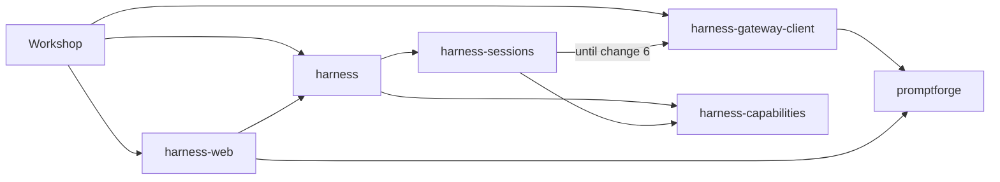

# Change 5: host services and harness-web

<product-contract>

## Product Requirements

The Harness still builds the only outside-world capability itself: on every gateway change it constructs `promptforge/web` from the gateway URL and key, and its service vocabulary is a closed enum with one member. This change makes the Host register every capability and supply every service as a named object, and moves the web bundle out of the Harness core into its own root crate. It first trims every `AGENTS.md` to the rules no test or check enforces, because stale rule files describe the old design and contradict this change. It is change 5 of a nine-change effort that moves I/O out of the Harness. Changes 1 to 4 have landed: the store-to-VFS rename, the Host-owned run recorder (`crates/harness/src/lib.rs:36-47`, `crates/workshop/run-log`), the transport-neutral failure vocabulary, and `harness-gateway-client`.

- Problem and users:
  - Team developers working on the Harness, Workshop, and future Hosts such as Papergate.
  - The Harness decides which capabilities exist: `first_party_registry` always registers user input and registers web whenever the gateway URL and key build it (`crates/harness-internal/sessions/src/environment.rs:104-131`), rebuilt per gateway generation by `Bindings::set_gateway` (`:267-285`) through `GatewayResources::build` (`:155-191`).
  - `Service` is a closed enum with one variant, `Input` (`crates/harness-internal/capabilities/src/capability.rs:125-137`), whose doc says adding a service is a Harness change.
  - The web search tool does its own HTTP to the Gateway with private copies of the endpoint and key types (`crates/harness-internal/web-search/src/endpoint.rs`, `secret.rs`), and the fetch tool assumes an ambient tokio runtime (`crates/harness-internal/webfetch/src/resolver.rs:45-54`).
  - Stale `AGENTS.md` files describe the old design and contradict this change:
    - `crates/harness-gateway-client/AGENTS.md` says the client speaks only chat completions and never puts a backend body in a message, but today's search messages hold the body.
    - `crates/harness-internal/web-search/AGENTS.md` and `webfetch/AGENTS.md` require test mocks through `harness-runner`.
    - Root `AGENTS.md:66` and `:69` name only two public Harness crates.
    - Root `AGENTS.md:98` requires `tools/cicerone.md` runs for facade pages, which recent plans have overridden.
- Goals:
  - Every `AGENTS.md` holds only policy or guarantees that no test or structural check enforces, and no rule requires `tools/cicerone.md` runs.
  - Host services are concrete, named objects. Each service has a string id in the capability id grammar, such as `promptforge/search-provider`, bound once to the Rust type a provider must supply.
  - The Host registers every capability, including `promptforge/user-input`, and supplies every service, through `Harness::new`. The Harness builds no capability.
  - One root crate, `crates/harness-web`, holds the `promptforge/web` bundle. Its search tool calls the Host's search-provider service, and its fetch tool runs on the Host's tokio runtime service.
  - The Gateway search HTTP client lives in `harness-gateway-client`, and Workshop adapts it to the search-provider service.
- Non-goals:
  - Moving the input broker to the Host (change 8). The Harness keeps building the session input broker and now offers it as the named service `promptforge/input-broker`.
  - The inference broker trait, or routing it through host services (change 6).
  - Streaming, session removal, or tokio removal (changes 7 to 9).
  - Per-run capability choice from Workshop's Run window checkboxes (`crates/workshop/ui/src/parts/run/run-rows.ts:133-140`).
- Success criteria:
  - The 10 crate `AGENTS.md` files that the Technical Design lists for deletion are gone. Every other `AGENTS.md` holds only its listed rules.
  - No `crates/harness-internal` crate builds a capability or depends on `reqwest` for web. `crates/harness-internal/{web,webfetch,web-search}` do not exist.
  - `Service` no longer exists. Every capability need and every refusal names a service id.
  - Workshop registers `promptforge/user-input` and `promptforge/web` and supplies both web services, and a Workshop prompt that declares `promptforge/web` still searches and fetches.
- Constraints:
  - `harness-web` depends on `harness` and `promptforge` plus third-party crates, never into `crates/harness-internal` (container privacy, `crates/build-xtask/src/product.rs:161-190`) and never on `harness-gateway-client`.
  - `harness-gateway-client` keeps depending only on `promptforge` and third-party crates. `harness-sessions` still uses it until change 6, so it may not depend on `harness-web`, which depends on `harness`.
  - No `harness-internal` crate may depend on `harness-web`, or Cargo forms a cycle through the facade.
  - Fetch behavior, the fetch `User-Agent` (`harness-webfetch/0.0`), the SSRF policy, every search argument rule and message, the 30-second search deadline, bearer redaction, and backend-body bounding stay the same.
  - New root crates carry `//! ## Invariants`, `[lints] workspace = true`, and files at or under 500 lines.
- Open questions: None

## Functional Specification

A Host builds a capability registry and a host-services map, then passes both to `Harness::new` with its recorder. Each run activates the prompt's declared capabilities against the Host's registry, with the Host's services plus the Harness's per-run input broker. A capability names the service ids it needs; a required capability whose service is missing refuses the run naming the id, and an optional one activates with a gap. Workshop wires the Gateway as the search provider and its server runtime as the tokio runtime.

- Actors and workflows:
  - Workshop's `harness_for` (`crates/workshop/server/src/agents.rs:58-69`) builds the registry with `UserInput::new()` and `Web::new()`, builds `HostServices` with its Gateway search provider and runtime handle, and passes both to `Harness::new`.
  - `harness-sessions` hands the Harness's registry to every run (`crates/harness-internal/sessions/src/session/run.rs:91-106`). A gateway change no longer rebuilds it, so `GatewayResources` keeps only the binding and the model client.
  - Preparation (`crates/harness-internal/runner/src/prepare.rs:331-335`) builds `RunServices` from the Host's services and inserts the session's input broker under `promptforge/input-broker`.
- Inputs and outputs:
  - Search tool arguments, validation, and messages are unchanged (`guide/src/language/13-web-fetch-and-search.md:491-506`).
  - Search output is untrusted text holding compact JSON: `query`, then `results`, each with `title`, `url`, `description`, and `age`, `site_name`, and `extra_snippets` only when present, matching the Gateway's serialization (`crates/gateway/web-search/src/service.rs:113-140`). Fields the Gateway adds later are no longer passed through.
  - Fetch input and output are unchanged.
- States and validation:
  - A `ServiceId` is an id literal in the capability id grammar plus the provider's Rust type. `HostServices` refuses an id that does not parse and a second provider for an id.
  - A provider counts as present only when its id and its type both match the need. A lookup through a key whose type differs from the provider's finds nothing, and `provides` reports it absent, so activation treats the service as missing.
  - `promptforge/web` needs both `promptforge/search-provider` and `promptforge/tokio-runtime`. Required and either missing refuses the run. Optional and either missing activates with gaps and contributes no tools: activation still calls `create` for an optional capability with gaps (`crates/harness-internal/capabilities/src/activation.rs:191-204`), so `Web::create` itself returns no tools when either service is missing.
  - The search tool rejects a result with an empty `url` as a backend failure with today's message. The check moves from the HTTP code into the tool, so it applies to every provider.
- Errors and recovery:
  - A refusal for a missing service names the capability and the service id, for example `promptforge/user-input` needing `promptforge/input-broker`. This replaces today's free text "an input broker", so the notice line becomes "- promptforge/user-input needs promptforge/input-broker, and this host provides none".
  - Search failures keep their tool error kinds and messages (`crates/harness-internal/web-search/src/web_search.rs:326-355`):
    - `web_search: request failed` is `Transport`, and timeouts use the same text.
    - `web_search: backend returned {code}: {body}` and `web_search: backend returned {code}, and its error body could not be read` are `Backend`.
    - `web_search: reading response failed` is `Transport`. `web_search: response body exceeded {limit} bytes`, `web_search: response body was not valid UTF-8`, and `web_search: malformed search response` are `Backend` (`web_search.rs:191-229`, `:364`).
    - The provider reports the kind and the text after the `web_search: ` prefix, which the tool adds.
  - Workshop's search provider fails with `Transport` and the text `request failed` when no usable gateway is bound or its endpoint or key cannot be built. So no endpoint or key detail reaches the model. A launch under such a gateway is refused anyway.
- Security and privacy behavior:
  - The Gateway key stays inside the Host's search provider and `harness-gateway-client`. No capability or prompt sees it.
  - The fetch SSRF resolver, redirect policy, and byte caps stay in `harness-web`.
  - `GatewayEndpoint`'s setup errors stop echoing the URL, which today they do (`crates/harness-gateway-client/src/config.rs:158-164`). So a URL that embeds credentials reaches neither a log nor a message, for chat and search alike.
- Acceptance criteria:
  - The success criteria above hold.
  - A prompt requiring `promptforge/web` prepares in Workshop and is refused on a Harness built without the search provider, naming `promptforge/search-provider`.
  - The moved fetch, search, and Gateway search tests pass in their new crates.

</product-contract>
<implementation-contract>

## Technical Design

Host services become a map from named ids to typed objects, owned by `harness-capabilities` and published through a new `harness::capability` facade module along with the capability-authoring types. The Harness takes the Host's registry and services at construction and stops building capabilities. A new root crate, `harness-web`, implements `promptforge/web` against the facade and defines its two service keys. `harness-gateway-client` gains the Gateway search client, and Workshop adapts it. Before any of that, every `AGENTS.md` is cut to the rules that no test or check enforces.

- Architecture:

- Modules and interfaces:
  - `harness-capabilities` (`crates/harness-internal/capabilities`):
    - `ServiceId`: a `Copy` pair of the id literal (`&'static str`) and the provider's Rust type (held as `fn() -> TypeId`, so it builds in a `const`). The literal is a two-segment name in the capability id grammar: `namespace/name`, with lowercase ASCII letters, digits, `-`, `_`, and `.` (`crates/promptforge-internal/types/src/names.rs:1-8`, `:100-105`). Ids compare, hash, and `Display` by the literal. It is const because `Capability::needs()` returns a static slice, and `CapabilityId::parse` runs at run time over a `Vec<String>` (`names.rs:23-26`). So the grammar is checked by parsing through `promptforge::capabilities::CapabilityId::parse` (`crates/promptforge-internal/types/src/capabilities.rs:56`) in each key's unit test and in `HostServices::provide`, because the segment validator is private (`names.rs:106`).
    - `ServiceKey<T: ?Sized + Send + Sync + 'static>`: `const fn new(&'static str)` binds one service id literal to the type its provider supplies, and `id()` returns its `ServiceId`. The defining crate declares each key once, and a unit test per key proves its literal parses.
    - `HostServices`: cloneable map of id to provider, recording each provider's type. `provide(&ServiceKey<T>, Arc<T>)` refuses an id that does not parse or a duplicate id with a `ServiceError`. `get(&ServiceKey<T>) -> Option<Arc<T>>` finds nothing when the stored type differs. `provides(&ServiceId) -> bool` is true only when the id is present and the stored type matches the id's type, so activation treats a wrong-typed provider as missing.
    - `Capability::needs()` returns `&[ServiceId]`. `ServiceGap.service` becomes a `ServiceId`. `Service` and `Service::description` are deleted.
    - `RunServices` holds `vfs`, `cancel`, and a `HostServices`, with `get` and `provides` delegating to it. `with_input` is replaced by inserting under `INPUT_BROKER`. If the Host's map already holds `promptforge/input-broker`, which only a second key with the same literal can do, the per-run insert replaces it, because the session's broker is the only input broker until change 8.
    - `INPUT_BROKER: ServiceKey<dyn InputBroker>` is `promptforge/input-broker`. `UserInput::needs()` returns it.
    - Activation (`src/activation.rs:185-217`) keeps its required and optional rules and passes the id text to `MissingService::new`. The engine is unchanged: `MissingService::service` is already a `String` (`crates/promptforge/public-api.txt:405`).
    - Today's `Service` users to convert:
      - production: `src/capability.rs`, `src/user_input.rs`, `src/activation.rs`, `src/lib.rs`, and `crates/harness-internal/runner/src/prepare.rs:331-334` (`with_input`);
      - tests: `tests/it/needs.rs`, `src/user_input-tests.rs`, `src/capability-tests.rs`, and `crates/harness-internal/runner/tests/it/prepare-input.rs`.
  - `harness-runner`: `prepare::Services` (`crates/harness-internal/runner/src/prepare.rs:54-87`) gains `services: HostServices`, the Host's. Preparation clones it into each run's `RunServices` and inserts `Services.input`, when present, under `INPUT_BROKER` (`:331-334`).
  - `harness-sessions`:
    - `Harness::new(config, recorder, capabilities: CapabilityRegistry, services: HostServices)` (today `crates/harness-internal/sessions/src/runtime.rs:141`). The Harness holds both and passes them to every run through `prepare::Services`.
    - In the `Harness::new` step, `first_party_registry` (`src/environment.rs:104-131`) stops registering `UserInput`, which the Host now registers, and becomes a temporary built-in web. Each gateway generation's registry is the Host's registry plus the internal `Web`, when the gateway URL and key build it and the Host registered no `promptforge/web`. The built-in `chat` agent requires `promptforge/web` (`agents/chat.md:5-6`), so without this fallback every chat run would be refused until Workshop registers web.
    - In the `harness-web` step, the fallback goes with the internal crates: `first_party_registry`, `GatewayResources.registry`, its supervisor plumbing (`src/supervisor.rs:330`, `gateway.registry()`), its test uses (`src/environment-tests.rs:112`, `:117`), and the `harness-web` dependency. From then on the Harness builds no capability.
    - In the `Harness::new` step Workshop's `harness_for` registers `UserInput` alone, and web still comes from the fallback.
  - Facade `crates/harness`: a new `pub mod capability` with page `src/capability.md`, re-exporting `Capability`, `CapabilityError`, `CapabilityErrorKind`, `CapabilityId`, `CapabilityRegistry`, `RegistryError`, `RegistryErrorKind`, `Contribution`, `Tool`, `RunServices`, `HostServices`, `ServiceId`, `ServiceKey`, `ServiceError`, and `UserInput`. `USER_INPUT_ASK_TOOL` stays at the root. `InputBroker` and `INPUT_BROKER` stay internal until change 8.
  - `harness-gateway-client`: a `search` module exporting `GatewaySearch::new(GatewayEndpoint, SecretString)` and `GatewaySearch::search(&GatewaySearchRequest) -> Result<GatewaySearchResponse, GatewaySearchError>`.
    - It POSTs `{api_root}/tools/web_search` with the bearer key under the 30-second deadline (`REQUEST_TIMEOUT`, `crates/harness-internal/web-search/src/web_search.rs:36`, applied at `:136-147`). It bounds and escapes error bodies, and parses the response into its wire types, which mirror the Gateway's request and response.
    - The error carries the failure kind and today's text after the prefix: `request failed` and `reading response failed` (`Transport`, timeouts included), and `backend returned {code}: {body}`, `backend returned {code}, and its error body could not be read`, `response body exceeded {limit} bytes`, `response body was not valid UTF-8`, and `malformed search response` (`Backend`).
    - It is the HTTP half of `web_search.rs`: the client and deadline (`:136-147`), the response types (`:155-166`), `sanitize_diagnostic` (`:171-186`), `read_bounded` and `read_capped` (`:191-229`), and the send, status, and parse path of `call` (`:318-372`). Move `sanitize_diagnostic`, `read_bounded`, and `read_capped` unchanged. They do not match `escape_controls` and `read_body_capped` byte for byte: `sanitize_diagnostic` has no length cap and leaves an empty body empty, `read_bounded` truncates lossily, and `read_capped` refuses over the cap and requires UTF-8. The trim cuts the client's "one read loop" rule, so a second reader breaks no kept rule.
    - Copy, not move, in this step: the internal `web-search` crate stays the live search tool until the `harness-web` step deletes it.
    - The crate's `endpoint.rs` and `secret.rs` are deleted in favor of `GatewayEndpoint` and `SecretString` (`crates/harness-gateway-client/src/config.rs`). Both apply the same URL rules: http or https with a host, no credentials, query, or fragment, a trailing `/` trimmed, and `/v1` already present.
    - `GatewayEndpoint`'s errors stop echoing the URL (`config.rs:158-164`), as the deleted `EndpointError` never did. That way a URL that embeds credentials reaches no log or message, for the chat client too. Update `gateway_endpoint_keeps_the_url_parse_cause` (`src/transport/tests/env.rs:257-264`), which asserts the echoed URL.
  - `harness-web` (`crates/harness-web`, library `harness_web`):
    - `Web::new()` and `Web::with_fetch_config(FetchConfig)`, with `needs()` returning both service ids. `Web::create` reads both services with `get` and contributes no tools when either is missing.
    - The tests in `crates/harness-internal/web/src/lib.rs` move and adapt to services, except `construction_rejects_an_invalid_gateway_root_or_empty_token`, which retires because `Web::new` takes no gateway arguments.
    - Dependencies: `harness`, `promptforge`, `async-trait` (because `Tool` is an `#[async_trait]` trait, `crates/harness-internal/capabilities/src/tool.rs:94-95`), and the third-party crates `webfetch` uses today, including `reqwest` with `gzip` and `brotli`, and `tokio`.
    - `SearchProvider`: an async trait, `search(SearchQuery) -> Result<SearchResults, SearchError>`.
      - `SearchQuery` holds the validated tool arguments: `query`, `count`, `freshness`, `country`, `search_lang`, `safesearch`, `include_domains`, and `exclude_domains` (`crates/harness-internal/web-search/src/web_search-request.rs:46-70`).
      - `SearchResults` holds `query` and `results`. Each `SearchResult` holds `title`, `url`, `description`, and the optional `age`, `site_name`, and `extra_snippets`.
      - `SearchError` holds a kind (`Transport` or `Backend`), a message, and an optional boxed source. The tool attaches the source with `ToolError::with_source`, so the error chain survives the trait boundary. Workshop's adapter passes the `GatewaySearchError` as the source.
    - `SEARCH_PROVIDER: ServiceKey<dyn SearchProvider>` is `promptforge/search-provider`, and `TOKIO_RUNTIME: ServiceKey<tokio::runtime::Handle>` is `promptforge/tokio-runtime`.
    - The fetch tool spawns each request and its body read onto the runtime handle and awaits the join handle, aborting the task when the call's future is dropped. Today the request is `self.http.get(...).send().await` (`crates/harness-internal/webfetch/src/tool.rs:278-280`). The `reqwest` client stays built once at construction (`tool.rs:60-72`), with DNS through the guarded resolver.
    - The search tool keeps the tool half of `web_search.rs` (the tool type and the `Tool` impl, `:67-135` without the client and `:237-311`, plus argument parsing at `:316` and the untrusted output at `:377`) and the argument rules in `web_search-request.rs`. It calls the provider, applies the empty-`url` check, and renders results as compact JSON in the Gateway's field order and skip rules. It sets no deadline of its own, because the deadline belongs to the provider.
    - It re-exports `FetchConfig`, `FetchConfigBuilder`, and `ConfigError`.
  - Workshop (`crates/workshop/server`):
    - A new agents module implements `harness_web::SearchProvider` over `harness_gateway_client::GatewaySearch`. It caches one `GatewaySearch` per generation.
    - It holds the server's `Registry`, never a subsystem handle, and looks up `registry.state::<GatewayHandles>()` on each call, as `push_bindings` does (`crates/workshop/server/src/agents/bindings.rs:32-34`). A missing registration fails the search with `request failed`.
    - From the handles it reads `binding()` (`crates/workshop/gateway/src/handles.rs:34`) and the `GatewaySnapshot`'s `base_url`, `api_key`, and `generation` (`crates/workshop/gateway/src/binding.rs:55-68`).
    - It maps types and errors, and uses qualified `harness_gateway_client::` paths because `workshop_gateway` has its own `GatewayClient`.
    - `harness_for` registers `Web::new()` beside the `UserInput` it has registered since the `Harness::new` step.
    - `harness_for` supplies `tokio::runtime::Handle::try_current()` under `TOKIO_RUNTIME` when it returns a handle.
      - On the serve path it runs inside the server runtime: `serve.rs:255` (`block_on`), then `app.rs:286`, then `compose.rs:203`, all under `crates/workshop/server/src/`.
      - The synchronous unit test `crates/workshop/server/src/app/tests.rs:165-189` builds the state with no runtime, so `Handle::current()` would panic there. Without a runtime the service is left out, and web is refused or recorded as a gap.
- File and public API changes:
  - The `AGENTS.md` trim:
    - The rule: a line stays only if it states policy or a guarantee the code cannot show, no test or structural check already enforces it, and breaking it would be costly and not obvious from the code. Every other line goes, including inventories, ownership descriptions, and restated dependency rules. Kept rules keep their current wording.
    - Root `AGENTS.md`:
      - Keep `## Definitions` and its heading, because `crates/workshop/ui/test/docs-claims.mjs:86-87` skips that section by its heading. Cut the Engine and Harness definitions' directory lists to "the `promptforge` and `promptforge-*` crates" and "the `harness` and `harness-*` crates". Also drop the Engine clause "the Structure rules below call this product PromptForge", since Structure is cut.
      - Keep `## Principles`, `## Engineering`, and the `## Verification` commands.
      - Keep the flat-source-directory rule (`:106`), which no check enforces, and the SPA token and storage rules (`:111-112`).
      - Cut `## Roles`, `## Vocabulary`, `## Structure`, the facade-pages cicerone rule (`:98`), Structural Rules `:102`, `:104`, and `:105`, and SPA rule `:110`. From `:102`, keep only "If Cargo rejects a dependency cycle, the design is wrong, not the graph."
      - Extend the existing Verification line for `cargo test -p build-xtask` (`:99`) to say what it enforces: the product and container boundaries, the Workshop tier graph, the `## Invariants` marker, lint inheritance, and the 500-line file ceiling.
      - Fix the code comments that point at removed root text: `crates/build-xtask/src/product.rs:1` ("codifies the AGENTS.md dependency matrix") and `crates/build-xtask/src/tidy.rs:49` ("from the `AGENTS.md` structural rules") name the checks themselves instead.
    - Delete these 10 files. Each line in them is an ownership description or inventory the keep rule cuts, or a guarantee pinned by a test, by Cargo, or by the crate's `## Invariants` block. The five gateway crates have no `## Invariants` block, and their behavioral lines are pinned by tests (for example the 25 MiB multipart cap in `batch-tests.rs`):
      - `crates/harness-internal/sessions/AGENTS.md`, `crates/harness-internal/webfetch/AGENTS.md`, `crates/harness-internal/web-search/AGENTS.md`;
      - `crates/promptforge-internal/model-client/AGENTS.md`, `crates/promptforge-internal/parser/AGENTS.md` (its cycle rule is also in the lua file, Cargo's cycle check enforces its executor-import rule, and its `detail` rule shows in the API snapshot);
      - `crates/gateway/local/AGENTS.md`, `crates/gateway/protocol/AGENTS.md`, `crates/gateway/routing/AGENTS.md`, `crates/gateway/web-search/AGENTS.md`, `crates/gateway/stt/api/AGENTS.md`.
    - Cut these 21 files to the listed rules:
      - `crates/harness-gateway-client`: one request-body builder. The "one read loop" rule is cut with the rest.
      - `crates/workshop`: the npm workspace has one install at `crates/workshop` and one lockfile; every member adds its `eol=lf` line to `.gitattributes`. No check enforces either.
      - `crates/promptforge-internal/engine`: providers stay in their provider crates; store access only through the executor's view, which the Harness never widens.
      - `crates/promptforge-internal/lua`: Engine functions stay here, not in the parser; `prepare_dispatch` is the single tool-dispatch body and the crate never calls tools; namespace functions, no colon methods, except `messages.new`.
      - `crates/promptforge-internal/types`: `Event` is report-only; the control-markup inventory is closed and only grows.
      - `crates/promptforge-internal/vfs`: no promptforge policy in the machinery; the public surface is load-bearing, so additions are default methods; origin labels are the most specific.
      - `crates/gateway/app`: the CUDA `llama-server` is a release artifact, never a Cargo build product.
      - `crates/gateway/config`: no network I/O and no process execution.
      - `crates/gateway/logging`: the gateway shuts the logger down last.
      - `crates/gateway/progress`: activity text never holds a credential.
      - `crates/gateway/stt/engine`: decode jobs are stateless; blocking decoders stay on their owning threads; startup deadlines classify non-preemptible work without claiming cancellation.
      - `crates/gateway/stt/whisper-ffi`: a `// SAFETY:` line precedes each unsafe block; drop-owning wrappers never expose `*mut`; a retarget updates the pin in the same change.
      - `crates/workshop/server`: no global tracing or initialization that ignores the embedding binary; no subsystem's handles in another subsystem's constructor, and no per-request panic on a missing registration.
      - `crates/workshop/desktop`: unsafe code only in the bridge, each block with its safety line; the desktop app does not read Gateway config, own discovery, or stop the gateway on ordinary teardown.
      - `crates/workshop/desktop/icons`: icon copies stay synced to their masters; installer assets are hand-made and never regenerated.
      - `crates/workshop/ui`: the target is the Cursor workspace-sidebar agent; no app state in mutable module globals; never `export *` from a feature `index.ts`.
      - `crates/workshop/look`: no sync obligation with `shared-ui`; no timer or document listener outlives its consumer; focus shows through state background and opacity, not outline, ring, or shadow; third-party derivation notices stay.
      - `crates/workshop/platform`: `dockview` imports stay `import type`; framework tokens live here and product tokens in the UI's services; nothing names a feature, panel type, or status light.
      - `crates/shared-ui`: Workshop uses the `look` fork, not this package; it never imports either product UI; a primitive belongs here only if both UIs use it; the lifecycle, focus, and notice rules match `look`.
      - `crates/shared-loopback`: it is the sole owner, and consumers never reimplement it; the gateway and Workshop origin policies never merge.
      - `crates/gateway-api-discovery`: it is the only implementation, and consumers never reimplement its contracts.
    - The only path reference to an `AGENTS.md` outside `vibe/` is `crates/workshop/server/src/lib.rs:35`, and that file stays.
    - `crates/harness-web` gets no `AGENTS.md`: its guarantees are tests, and its dependencies are in its `## Invariants` block.
  - Lay out the moved files in `crates/harness-web/src/` and `crates/harness-gateway-client/src/` by the root flat-source-directory rule. A source subdirectory needs at least three files, and one or two related files sit beside their parent as `foo-bar.rs`, wired with `#[path]`.
  - Move into `crates/harness-web/src/`:
    - from `crates/harness-internal/webfetch/src/`: every file except `lib.rs`, merged;
    - from `crates/harness-internal/web/src/lib.rs`: the capability;
    - from `crates/harness-internal/web-search/src/`: the tool, argument validation, and their tests.
  - Move the HTTP half of `crates/harness-internal/web-search/src/web_search.rs` and its mock-server tests (`web_search-tests.rs`, `web_search-tests-responses.rs`) into `crates/harness-gateway-client/src/search.rs` and sibling test files.
  - Delete `crates/harness-internal/{web,webfetch,web-search}`, including their `clippy.toml` files. In the same step, because the commit does not build or pass `cargo test -p build-xtask` otherwise:
    - Remove them from the root `Cargo.toml` `members` list. The `crates/*` glob already picks up `crates/harness-web`.
    - In `[workspace.dependencies]` (`Cargo.toml:49-51`), point `harness-web` at `crates/harness-web`, and remove `harness-webfetch` and `harness-web-search`.
    - Run `cargo hakari generate` and `cargo hakari manage-deps`, so the new crate gets its `workspace-hack` dependency.
    - Rewrite `the_harness_crates_are_the_six_container_crates_and_the_facade` (`crates/build-xtask/src/harness_bans-tests.rs:152-178`). It reads the real workspace and asserts exactly seven harness crates, so it now expects `runner`, `capabilities`, `sessions`, and the facade, with its name and count message updated.
    - The `harness-web` dependency in `crates/harness-internal/sessions/Cargo.toml:32` is already gone, removed in the `Harness::new` step.
  - `harness-web` dev-dependencies for the moved fetch tests are `axum`, `flate2`, `futures-util`, and `tokio`, but not `harness-runner` (`crates/harness-internal/webfetch/Cargo.toml:33-41`). Its mock servers, today `spawn_server` and `spawn_recording_server` (`tool-tests.rs:316-320`, `:392-393`), switch to `tokio::spawn`.
  - After editing guide chapters 5, 12, and 13, regenerate `guide/promptforge-language-guide.md` with `cargo run --locked -q -p build-user-guide` (`crates/build-user-guide/src/main.rs:1-9`). No check catches a stale export.
  - Every `Harness::new` call gains the two new arguments:
    - `crates/workshop/server/src/agents.rs`;
    - `crates/harness/tests/suite/gateway.rs`;
    - `crates/harness-internal/sessions/tests/it/session.rs` (two calls, `:63` and `:193`) and `session-infer.rs`;
    - the doc examples in `crates/harness/src/lib.md`, `record.md`, `vfs.md`, and `cancel.md`.
  - `crates/workshop/server/Cargo.toml` gains `harness-web` and `harness-gateway-client`.
- Data, persistence, failure, security, and privacy constraints:
  - Product rules: add `harness-web` to `PUBLIC_HARNESS` (`crates/build-xtask/src/product.rs:143`) and update the violation text (`:239`). Leave `container_named_exception` (`:285-290`) unchanged. This lands in the `harness-web` step, before Workshop depends on the crate, because `workspace_respects_the_product_boundary` (`crates/build-xtask/src/product/tests.rs:9-15`) checks the real workspace.
  - Mock servers in tests moved to root crates spawn with `tokio::spawn`. The Harness spawn ban binds only `crates/harness-internal` crates.
  - Nothing is persisted. The refusal text and the search output shape are the only observable changes.

</implementation-contract>
<verification-contract>

## Testing Plan

Moved tests move with their code and pass in their new crates. Their assertions change only where an import or constructor changes, or where a search test splits between the tool and the Gateway client. New unit tests cover the service map, activation by service id, the web capability's both-or-neither rule, the search rendering, and fetch cancellation. Workshop's existing suites must pass with the Host-registered capabilities. The docs test checks the `AGENTS.md` trim, and the exit criteria run once at the end.

- Unit:
  - `harness-capabilities`:
    - Each declared key's literal parses as a `CapabilityId`.
    - `HostServices`: provide and get, duplicate refusal, refusal of an id that does not parse, and a provider under the right id with the wrong type: `get` finds nothing and `provides` is false.
    - Activation by id: required missing refuses and names the id; optional missing records a `ServiceGap` with the id; a wrong-typed provider counts as missing in both cases.
    - `UserInput` needs `promptforge/input-broker`.
    - The refusal text changes in `tests/it/needs.rs` (`:144`, `:172`, `:190`) and `crates/harness-internal/runner/tests/it/prepare-input.rs:196`, `:221`.
  - `harness-web`:
    - Every moved webfetch test.
    - The search tool against a fake `SearchProvider`. Its tests cover:
      - argument messages unchanged, through the four argument tests that stay with the tool (`rejects_missing_query`, `rejects_empty_and_oversized_query`, `rejects_unknown_fields_and_bad_optional_types`, and `rejects_invalid_domain_lists`);
      - the tool's identity, through `descriptor_is_stable_and_faithful` and `the_migrated_id_names_its_contributing_capability`, which move unchanged;
      - rendering equal to the Gateway's serialization for the same results, and the output wrapped as untrusted;
      - an empty `url` rejected as `Backend`, with `success_body_with_empty_url_is_rejected` rewritten against the fake provider;
      - provider error kinds and messages mapped with the `web_search: ` prefix.
    - Capability tests: `needs()` names both services, and `create` contributes no tools when either is missing. Refusal of a required capability is activation behavior, which `harness-web` cannot reach (`activate` is not on the facade), so the Workshop refusal test below pins it.
    - A fetch whose call future is dropped aborts its spawned task.
  - `harness-gateway-client`: the moved mock-server tests run against `GatewaySearch`. They cover the auth header, URL, request body, deadline, status and body-read messages, and body bounding.
    - From `web_search-tests.rs`: `forwards_query_and_returns_untrusted_results` and `forwards_validated_optional_fields`, keeping only their request and parsed-response assertions. `debug_never_leaks_the_bearer_token` is retargeted at `GatewaySearch`.
    - From `web_search-tests-responses.rs`: `transport_failure_is_transport_kind`, `stalling_gateway_times_out_as_transport`, `malformed_success_json_is_backend_error_with_source`, `oversized_success_body_is_rejected`, `oversized_error_body_is_bounded_and_sanitized`, and `error_body_read_failure_is_preserved_as_source`.
    - `constructor_rejects_bad_urls_credentials_query_and_empty_token` is retired, because `GatewaySearch::new` takes an already validated endpoint and key. Before retiring it, confirm the client's `GatewayEndpoint` and `SecretString` tests reject each input it rejects: a bad scheme, credentials, a query, and an empty key. Add any missing case there.
    - `constructor_errors_preserve_sources_without_leaking_secrets` is retargeted at `GatewayEndpoint` and `SecretString`. It pins that their errors keep a source and echo neither the URL nor the key. `gateway_endpoint_keeps_the_url_parse_cause` keeps its source assertion and drops the echoed URL.
    - The unit tests in the deleted `endpoint.rs` and `secret.rs` (`rejects_unusable_or_secret_bearing_urls`, `normalizes_and_preserves_the_parse_source`, and `redacts_everywhere_and_rejects_empty`) retire with those files, after the same coverage check.
  - Source chains: `malformed_success_json_is_backend_error_with_source` and `error_body_read_failure_is_preserved_as_source` keep asserting a source on `GatewaySearchError`. A `harness-web` test pins that the tool's `ToolError` keeps the provider error as its source.
- Integration and end-to-end:
  - `harness-sessions` suites and `crates/harness/tests/suite` pass with Host-supplied registries.
  - Workshop: a test that a prompt declaring `promptforge/web` prepares, a test that a Harness built without the search provider refuses a prompt requiring `promptforge/web` and names `promptforge/search-provider`, and an adapter test that the search provider maps a mock Gateway's search response and error status. No Workshop test exercises web today.
    - Build the mock with `spawn_gateway(Router)` (`crates/workshop/server/src/app/test_helpers.rs:73`, re-exported at `crates/workshop/server/tests/common/mod.rs:147`) and a `/v1/tools/web_search` route, as `crates/workshop/server/tests/it/agents.rs:140-142` builds its router.
    - The existing Workshop suites under `crates/workshop/server/tests/it/` pass.
- Regression, security, and performance:
  - The SSRF policy, redirect, byte-cap, and timeout tests pass in `harness-web`. Key redaction and body bounding pass in `harness-gateway-client`.
  - The `AGENTS.md` trim: `node --test crates/workshop/ui/test/docs-claims.mjs` passes, and no file outside `vibe/` names a deleted `AGENTS.md` path.
  - `crates/build-xtask` fixtures:
    - New: a workshop crate depending on `harness-web` passes, and `harness-web` depending into `crates/harness-internal` is reported.
    - The harness inventory test (`crates/build-xtask/src/harness_bans-tests.rs:152-178`) expects the three remaining container crates and the facade. No test names the three web packages.
- Exit criteria:
  - These commands pass:
    - `cargo nextest run --locked --workspace --exclude workshop --exclude workshop-server --exclude workshop-server-api --all-features`
    - `cargo test --workspace --exclude workshop --exclude workshop-server --exclude workshop-server-api --all-features --doc`
    - `cargo nextest run --locked -p workshop -p workshop-server -p workshop-server-api`
    - `cargo clippy --workspace --exclude workshop --exclude workshop-server --exclude workshop-server-api --all-targets --all-features -- -D warnings`
    - `cargo clippy -p workshop -p workshop-server -p workshop-server-api --all-targets -- -D warnings`
    - `cargo check -p gateway --no-default-features`
    - `cargo fmt --all --check`
    - `RUSTDOCFLAGS="-D warnings" cargo doc --workspace --no-deps --all-features --exclude workshop --exclude workshop-server --exclude workshop-server-api`, `RUSTDOCFLAGS="-D warnings" cargo doc -p harness --no-deps`, and `cargo xtask site --books-only`
    - `cargo +nightly-2026-09-05 xtask api --check`
    - `cargo test -p build-xtask`
    - `node --test crates/workshop/ui/test/docs-claims.mjs`, which checks the term rules in every remaining `AGENTS.md`
  - `cargo hakari generate`, `cargo hakari manage-deps`, and `cargo hakari verify` succeed.
  - A manual Workshop agent run of a prompt that declares `promptforge/web` searches and fetches.

</verification-contract>
<decision-record>

## Decision Record

- Decisions:
  - **Trim every `AGENTS.md` first, by one keep rule, and cut rather than fix.** Rationale: the code changes faster than the rule files, and stale files steer coding sessions toward the old design. The guarantees they held are pinned by tests or stated in `## Invariants` blocks. User's words: "I prefer to cut rather than fix (the AGENTS.md files)" and "cut cicerone and make the trim the first step of this plan. go through all AGENTS.md."
  - **Cut the gateway client's "one read loop" rule.** Its "no transport grows its own copy" clause would forbid the moved search readers, which differ from `read_body_capped` and `escape_controls` and must keep every message. User's choice over narrowing the rule or reusing the chat helpers.
  - **Keep the Workshop npm workspace rules.** One install with one lockfile, and an `eol=lf` line per member, pass the keep rule: no check enforces them, and breaking them is costly and not obvious from the code. So `crates/workshop/AGENTS.md` is cut, not deleted.
  - **Cut the cicerone rule.** The trim removes root `AGENTS.md:98`, which required `tools/cicerone.md` update runs for facade pages, and no plan has to override it again. The new `harness::capability` module gets a hand-written `capability.md` and rustdoc, and the facade docs gate catches broken links. The tool itself stays in `tools/`.
  - **Services are named, not keyed by type and not a closed enum.** Each service has a concrete string id in the capability id grammar, bound once to its provider type through a typed key, so a Host cannot register the wrong object under a name. User's words: "I thought services were keyed by a specific string? capabilities are not supposed to be fuzzy they are supposed to be concrete and named."
  - **A `ServiceId` records the provider's type, and `provides` checks it.** Activation sees only the ids from `needs()` (`crates/harness-internal/capabilities/src/activation.rs:185-190`), so an id-only check would let a provider of the wrong type under the right id pass activation and fail later. With the type in the id, activation treats it as missing and the refusal names the id. User's choice over id-only activation with the failure surfacing in `create`.
  - **Service keys and ids are const, and the grammar is checked by test and at `provide`.** `needs()` returns a static slice, and `CapabilityId::parse` cannot run in a const.
  - **Service ids:** `promptforge/input-broker`, `promptforge/search-provider`, and `promptforge/tokio-runtime`. Rationale: the ids name the object supplied, and they differ from every capability id, so a refusal cannot confuse the two.
  - **Each capability crate owns its service keys.** `harness-capabilities` owns `INPUT_BROKER`, and `harness-web` owns `SEARCH_PROVIDER` and `TOKIO_RUNTIME`. Rationale: the Harness core never names a provider type, and adding a service is no longer a Harness change.
  - **One root crate, `harness-web`, registered by the Host.** It merges `web`, `webfetch`, and the search tool, builds on a new `harness::capability` module, and is registered by Workshop through `Harness::new`. The user chose this over keeping the bundle internal and re-exporting it. Rationale: the Harness stops depending on `reqwest` for web, which change 9 needs.
  - **The Host registers every capability, including `promptforge/user-input`.** Rationale: the Host decides which capabilities exist. A Host with nobody to ask leaves user input unregistered, and its prompts that require it are refused as missing a capability. The Harness still supplies the input broker service until change 8.
  - **`Harness::new` takes the registry and the services as arguments,** like the recorder, rather than through a builder. Rationale: one explicit way, and `HarnessConfig` derives `Eq`, so it cannot hold trait objects.
  - **Typed search results.** `harness-web` defines the provider's types, and the tool renders them back into the Gateway's JSON shape. The user chose this over passing the raw JSON through.
  - **Both or neither.** `promptforge/web` needs both services. The user chose this over contributing whichever tool has its service.
  - **Workshop adapts the Gateway search client.** `harness-gateway-client` cannot implement `SearchProvider`, because it would depend on `harness-web`, which depends on `harness`, which reaches `harness-sessions`, which depends on the client until change 6.
  - **Fetch runs on the Host's runtime handle, with abort-on-drop.** Rationale: the capability stops assuming an ambient tokio runtime, and a cancelled run leaves no fetch running.
  - **The empty-`url` check moves into the search tool, and the 30-second deadline stays in the Gateway search client.** Rationale: the check is neutral, so it should apply to every provider. A deadline needs a timer, which the search tool would have only through the runtime service. `guide/src/language/13-web-fetch-and-search.md:535` then describes the Gateway provider that Workshop supplies.
  - **Workshop reads the runtime with `Handle::try_current()`, and its adapter reports every gateway setup failure as `request failed`.** Rationale: `harness_for` also runs in a synchronous unit test with no runtime. A setup failure is not a model failure, and the model needs only the transport kind.
  - **Retire one search constructor test, and retarget the other.** `GatewaySearch::new` takes an already validated endpoint and key, so the URL and key rules are tested once, in the client's `GatewayEndpoint` and `SecretString` tests. `constructor_errors_preserve_sources_without_leaking_secrets` moves to those types, because once `web-search/AGENTS.md` is gone it is the only record that setup errors echo no URL or key.
  - **`GatewayEndpoint` errors stop echoing the URL.** Rationale: the deleted search endpoint type never echoed one, and a URL can embed credentials. A small fix to the shared type covers the chat client too.
  - **`SearchError` keeps a source.** Rationale: the moved tests assert source chains, and the tool must not flatten a provider failure into text.
  - **Workshop's adapter reads `GatewayHandles` through the registry on each call.** Rationale: subsystems reach each other only through the registry, and no subsystem's handles go into another subsystem's constructor. An unregistered gateway then shows up as a failed search, not as a boot-time dependency. `crates/workshop/server/AGENTS.md` keeps this rule after the trim.
  - **Keep the fetch `User-Agent` `harness-webfetch/0.0`.** Rationale: sites that filter by user agent see no change, and the guide documents it (`guide/src/language/13-web-fetch-and-search.md:276`, `:306`).
- Rejected alternatives:
  - Fixing the stale `AGENTS.md` lines instead of cutting them. Reason: fixed lines go stale again at the next refactor, while tests fail when the code changes. Revisit never.
  - A registry keyed by Rust type. Reason: services must be concrete and named. Revisit never.
  - Keeping the closed `Service` enum with new variants. Reason: every new service would be a Harness change. Revisit never.
  - Keeping the bundle in `crates/harness-internal` and re-exporting `Web`. Reason: `reqwest` and tokio stay in the Harness's dependencies and block change 9. Revisit never.
  - Passing the Gateway's raw JSON through the provider. Reason: it ties every provider to the Gateway's wire shape. Revisit if a provider needs fields the typed results drop.
  - Contributing whichever tool has its service. Reason: a research prompt wants both tools or neither. Revisit if a Host needs search without fetch.
  - Defining `TOKIO_RUNTIME` in `harness-capabilities`. Reason: the Harness core would name a tokio type. Revisit when a second capability crate needs the runtime.
- Assumptions, risks, and notes:
  - Assumption: the change-4 execution preferences hold. Six steps, the `AGENTS.md` trim being the first, each one tested commit. Each step runs only its touched crates' tests, and the full exit criteria run once on the final step. The workspace, product-rule, and hakari edits and Workshop's web wiring sit in the `harness-web` step, and the docs in the final step, because otherwise the `harness-web` commit would fail `cargo test -p build-xtask` and the built-in `chat` agent would lose web.
  - **A temporary built-in web bridges the `Harness::new` and `harness-web` steps.** The built-in `chat` agent requires `promptforge/web` (`crates/harness-internal/sessions/agents/chat.md:5-6`), so a commit where neither the Harness nor Workshop supplies web refuses every chat run (14 Workshop tests). The Harness keeps adding the internal `Web` when the Host registered none, and the `harness-web` step removes that fallback in the same commit where Workshop starts registering web. User's choice over making web optional in `chat.md` for three commits, or merging three steps into one.
  - Risk: splitting tests that cover both halves of search. `forwards_query_and_returns_untrusted_results` checks both the request sent and the untrusted wrapping, so its assertions split between `harness-gateway-client` and `harness-web`, and no assertion may be dropped.
  - Risk: fetch cancellation changes form. Today dropping the performer task drops the fetch future. After this change the spawned task must be aborted on drop, which a test pins.
  - Note: the search output loses fields the Gateway may add later, and `guide/src/language/13-web-fetch-and-search.md:465-471` must stop saying every field is kept.
  - Note: the refusal text for a missing service changes from free text to the id. `crates/promptforge/src/lib.md:570-573` uses "an input broker" only as an example of free text, so the Engine docs need no change.
  - Note: docs to update.
    - `guide/src/language/13-web-fetch-and-search.md:79` says the Harness provides `promptforge/web` as a built-in.
    - `guide/src/language/05-lua-environment.md:727-746` quotes the old refusal line at `:733` and calls the service an input broker.
    - `guide/src/language/12-tools.md:113` says a capability receives only the run's filesystem, its cancel signal, and an input broker.
    - The module doc at `crates/harness-internal/capabilities/src/user_input.rs:93` quotes the old refusal line.
    - `vibe/archdoc.md:10` lists first-party capabilities as a Harness duty.
    - `crates/README.md` (its `harness-gateway-client` entry, `:17-19`; it has no web crate entries), the capabilities `README.md:9`, and `crates/harness-gateway-client/README.md`'s public-surface section describe the old ownership.
    - The root `AGENTS.md` lines that named the public Harness crates (`:66`, `:69`) are cut by the trim, so they need no update.

### Deferred and Out of Scope

- Deferred: whether the inference broker is supplied through `HostServices`. Revisit at change 6.
- Deferred: moving the input broker to the Host, which deletes `INPUT_BROKER` from the Harness's own supply. Revisit at change 8.
- Deferred: renaming one of the two `GatewayClient` types (`workshop_gateway` and `harness_gateway_client`). Revisit at change 6, when Workshop also builds the chat client.
- Deferred: `harness-gateway-client` implementing `SearchProvider` directly. Revisit after change 6, when `harness-sessions` stops depending on the client.
- Deferred: adding `harness-web` to the docs site (`RUSTDOC_SITES` in `crates/build-xtask/src/site.rs`). Revisit with the client at change 6.
- Deferred: trimming the narrative text in `## Invariants` blocks and the two `.cursor/rules` files by the same keep rule. Revisit when a refactor touches them.
- Out of scope: per-run capability choice from Workshop's Run window, and any change to the Gateway's search endpoint.
- Out of scope: removing `tools/cicerone.md` itself. Only the rule that required running it is cut.

</decision-record>
<project-survey>

## Project Survey

- Status: complete
- Build command: `cargo build --locked -p gateway` (the workspace's only default member, so a plain `cargo build` builds just the gateway). The desktop app is an explicit choice: `cargo build --locked -p workshop`, or `cargo workshop [--release]` (alias for `build-workshop`) to build the gateway, stage it as the sidecar, and build Workshop in one step. Build scripts bundle the UIs, so their npm dependencies must be installed first: `npm ci --prefix crates/gateway/config-ui/ui` and `npm ci --prefix crates/workshop` (both are present locally).
- Focused test command pattern: `cargo nextest run --locked -p <crate> --all-features <test-name-filter>`. Add `--test it` (or `--test suite` for the `promptforge` and `harness` facades) to target the integration binary, or `--lib` for unit tests only. For `workshop`, `workshop-server`, and `workshop-server-api`, drop `--all-features`; use `--features headless` for server-only `workshop-server` tests. One doctest: `cargo test --locked -p <crate> --all-features --doc <filter>`.
- Component test command pattern: `cargo nextest run --locked -p <crate> --all-features`, then `cargo test --locked -p <crate> --all-features --doc` because nextest skips doctests. Workshop trio: `cargo nextest run --locked -p workshop -p workshop-server -p workshop-server-api` and `cargo test --doc -p workshop -p workshop-server -p workshop-server-api`, without `--all-features`. Boundary and structural checks: `cargo test -p build-xtask`. A UI package: `npm test` in its directory.
- Full-suite test command: `cargo nextest run --locked --workspace --exclude workshop --exclude workshop-server --exclude workshop-server-api --all-features`, then `cargo test --workspace --exclude workshop --exclude workshop-server --exclude workshop-server-api --all-features --doc`, then the workshop partition `cargo nextest run --locked -p workshop -p workshop-server -p workshop-server-api` (CI also runs `cargo nextest run --locked -p workshop-workspace --all-features`, `cargo nextest run --locked -p workshop-server --features headless`, and the workshop doctests). UI: `npm test --workspaces --if-present` in `crates/workshop` and `npm test` in `crates/gateway/config-ui/ui`.
- Linter command: `cargo clippy --workspace --exclude workshop --exclude workshop-server --exclude workshop-server-api --all-targets --all-features -- -D warnings`, plus `cargo clippy -p workshop -p workshop-server -p workshop-server-api --all-targets -- -D warnings` for the workshop partition, plus the headless build-shape gate `cargo check -p gateway --no-default-features`. Never run a standalone `cargo check --workspace` beside clippy. UI typecheck: `npm run typecheck --workspaces --if-present` in `crates/workshop` and `npm run typecheck` in `crates/gateway/config-ui/ui`. Supply chain: `cargo deny check`.
- Formatter check command: `cargo fmt --all --check` (rustfmt `style_edition = "2024"`; the pre-commit hook runs it).
- Docs command: `cargo doc --workspace --no-deps --all-features --exclude workshop --exclude workshop-server --exclude workshop-server-api` with `RUSTDOCFLAGS=-D warnings` set (PowerShell: `$env:RUSTDOCFLAGS='-D warnings'`). Facade docs with default features: `cargo doc -p promptforge --no-deps` and `cargo doc -p harness --no-deps`. Facade surface: `cargo +nightly-2026-09-05 xtask api --check` (the nightly pinned in `crates/build-xtask/src/api/toolchain.rs`, installed locally). User guide: `cargo xtask site --books-only`. A change that adds, moves, renames, or removes a public item of `promptforge` or `harness` also runs `tools/cicerone.md` in update mode for that crate.
- Test placement and naming conventions: Unit tests sit beside the code they test, usually in a sibling `<stem>-tests.rs` file (variants such as `<stem>-<topic>-tests.rs` and `tests-<topic>.rs` exist) wired with `#[cfg(test)] #[path = "<stem>-tests.rs"] mod tests;`, sometimes as an inline `#[cfg(test)] mod tests`. Three or more test files for one module move into a `tests/` subdirectory under `src/`. Integration tests compile into one binary per crate at `tests/it/main.rs` (`tests/suite/main.rs` for the `promptforge` and `harness` facades), with topic modules beside `main.rs`, shared helpers in `support.rs` or `tests/common/mod.rs`, and data in `tests/fixtures/` or `tests/prompts/`. Test functions are snake_case sentences stating the behavior, such as `a_run_can_move_between_threads_between_calls`. Test-only helpers are exposed through a `test-support` feature (promptforge and harness families) or a `test-fixtures` feature (gateway and workshop families). Clippy allows `unwrap` and `expect` only in tests. UI tests run under `node --test` as `src/**/*.test.mjs` and `test/**/*.mjs`. Criterion benches live in `benches/` of `promptforge-engine` and `promptforge-lua`.
- Directory map:
  - `crates/`: every Rust crate plus the TypeScript UI packages. The root holds the public crates (`promptforge`, `harness`, `harness-gateway-client`, `gateway-api-types`, `gateway-api-discovery`), the `shared-*` crates (`shared-error-source`, `shared-loopback`), the `build-*` tooling crates (`build-xtask`, `build-workshop`, `build-ui`, `build-user-guide`, `build-llama-cuda`), `workspace-hack` (cargo-hakari), and the `shared-ui` TypeScript package used by the gateway config UI.
  - `crates/promptforge-internal/`: private Engine crates `engine`, `lua`, `model-client`, `parser`, `types`, `vfs`.
  - `crates/harness-internal/`: private Harness crates `runner`, `capabilities`, `sessions`, `web`, `webfetch`, `web-search`.
  - `crates/gateway/`: private gateway crates `app` (package `gateway`), `cloud-providers`, `config`, `config-ui`, `local`, `logging`, `progress`, `protocol`, `routing`, `web-search`, and the nested `stt/` subsystem (`api` as `gateway-stt`, `engine`, `backend-whisper`, `whisper-ffi`).
  - `crates/workshop/`: the desktop app (`desktop`, package `workshop`), `server`, `server-api`, and the subsystems `gateway`, `menu`, `protocol`, `registry`, `run-log`, `status`, `support`, `user-state`, `workspace`, plus the npm workspaces `ui`, `look`, and `platform`.
  - `guide/`: user guide sources and books for the gateway, the prompt language, and Workshop, built by `cargo xtask site`.
  - `prompts/`: sample Markdown prompt programs.
  - `tools/`: the `cicerone` facade-pages tool and Node scripts such as `stage-gateway-sidecar.mjs`, each with a `.test.mjs`.
  - `vibe/`: plans filed by month and `archdoc.md`, the architecture summary.
  - `.github/workflows/`: `ci.yml` plus release, nightly, site, installer-smoke, and native-library workflows.
  - `.githooks/`: pre-commit runs the format check; pre-push runs the headless gateway check, clippy, and cargo deny.
  - `.config/`: nextest and hakari configuration. `.cargo/config.toml`: rust-lld and static CRT on Windows, and the `cargo workshop` and `cargo xtask` aliases.
  - `.cursor/rules/`: Workshop architecture and SPA rules.
  - `local/` (gitignored): operator gateway config, profiles, and fixtures. `images/`: README art. `cabinet/`: staging trash. `target/` and `target-msrv/`: build output.
  - Root files: `AGENTS.md` (repository rules and verification commands), `Cargo.toml`, `Cargo.lock`, `deny.toml`, `clippy.toml`, `rustfmt.toml`, `rust-toolchain.toml` (stable channel), `dist-workspace.toml` (cargo-dist releases).
- Component boundaries:
  - Engine: `promptforge` is a facade of single-item re-exports over `promptforge-internal/*`; the sans-I/O executor emits effects and waits for answers. It depends on no gateway, workshop, or Harness crate, and outside crates may name only `promptforge`.
  - Harness: `harness` is a facade over `harness-internal/*`, and `harness-gateway-client` holds the HTTP client and OpenAI wire code for rounds against the Gateway. Harness crates depend only on `promptforge` and each other (`harness-sessions` also uses `harness-gateway-client`), never on gateway, shared, or workshop crates. Outside crates reach the Harness only through `harness` and `harness-gateway-client`.
  - Gateway: an independent server process under `gateway/*` whose public surface is `gateway-api-types` and `gateway-api-discovery`. Gateway crates depend on their own family and `shared-*`, never on promptforge or workshop crates.
  - Workshop, a Host: `workshop-server` composes `harness`, `promptforge`, `shared-loopback`, the gateway public pair (through `workshop-gateway`), and its workshop-* subsystems. The desktop app depends only on `workshop-server-api` and `gateway-api-discovery`, never on `workshop-server`. Workshop crates never name private gateway crates.
  - `shared-*`: cross-product substrate with no product dependencies; Harness crates may not use it.
  - `build-*`: meta tooling, exempt from container privacy, reaching the Harness only through its public pair.
  - Direction: the Host runs prompts through the Harness, the Harness steps the Engine, and Workshop and the Harness reach the Gateway only over its protocol. Inside Workshop, tiers flow server -> features -> services -> vocabulary. `cargo test -p build-xtask` enforces the tier graph, container privacy, and the product-boundary matrix.
- Conventions summary:
  - Rust 2024 edition on the stable toolchain; every crate inherits `[workspace.lints]`.
  - Clippy `all` and `pedantic` are deny, as are `unwrap_used` and `expect_used` outside tests; `missing_docs`, `unreachable_pub`, and `missing_debug_implementations` warn.
  - `unsafe_code` is forbidden workspace-wide; the STT FFI crate (`gateway-whisper-ffi`) is the owned boundary that overrides it, and every unsafe block is preceded by its safety invariants.
  - Every workshop-* and harness-* `lib.rs` opens with a `//!` doc containing `## Invariants` that lists allowed and forbidden dependencies; read it before adding an import. Files in marker crates stay at or under 500 lines; split before an edit would exceed it.
  - Source directories are flat: one or two child files sit beside the parent as `foo-bar.rs` wired with `#[path = "foo-bar.rs"] mod bar;`; three or more become a `foo/` subdirectory.
  - Engine, Harness, and Host are capitalized defined terms with one meaning each, enforced by `crates/workshop/ui/test/docs-claims.mjs`.
  - Behavior changes ship with tests in the same change. Prefer types and behavior tests; no new structural check, allowlist, or source parser without explicit user approval.
  - Comments explain only non-obvious constraints; every workaround cites its upstream issue URL.
  - Error and status messages are written for model consumption: concise and naming required versus actual.
  - JSON that reaches a recorder or replay round-trips exactly: sorted keys, finite numbers, `float_roundtrip`, never `preserve_order`.
  - Library and serve paths return errors instead of exiting or installing process-global state; Cargo features gate only real constraints such as toolchains or heavy native builds.
  - Dependency versions live in `[workspace.dependencies]`, each unusual pin with a comment explaining it; the gateway links exactly one rustls backend (aws-lc-rs).
  - SPA: CSS sits beside its TypeScript, component CSS uses only `--ws-*` tokens, and no `localStorage`; persisted UI state goes through the server.

</project-survey>
<execution-plan>

## Execution Instructions

Five components, in dependency order:

1. Rule-file trim (step 1). It goes first so no later step reads a stale rule. The trim also cuts the gateway client's "one read loop" rule, which step 4's copied readers would otherwise break, and the cicerone rule, which step 3's new facade module would otherwise trigger.
2. Host services (steps 2 and 3). It comes next because the `harness-web` capability and Workshop's wiring are written against `ServiceKey`, `HostServices`, the `harness::capability` module, and the new `Harness::new`.
3. Gateway search client (step 4). It depends only on the trim, so it can be built alongside component 2. It sits after component 2 because nothing there needs it, and before component 4, which does.
4. `harness-web` crate and Workshop web wiring (step 5). It needs component 2's service types and facade module, and component 3's `GatewaySearch`. It deletes the internal web crates and the Harness's temporary built-in web, and in the same commit Workshop registers the root `Web` with its two services, so no commit leaves the built-in `chat` agent without `promptforge/web`.
5. Docs and exit criteria (step 6). It comes last because it describes the finished wiring and runs the full exit criteria once.

Each step is one commit holding its code and its tests. Each step runs only its touched crates' checks; the full exit criteria in the Testing Plan run once, in step 6.

<step-1>

### Step 1: Trim every AGENTS.md [completed]

- Component: Rule-file trim
- Depends on: nothing.
- Pieces: the root file, the 10 deletions, the 21 cuts, and the two build-xtask comments. Built jointly: none depends on another, and one docs check covers them all.
- Apply the keep rule from the Technical Design: a line stays only if it states policy or a guarantee the code cannot show, no test or structural check enforces it, and breaking it would be costly and not obvious from the code. Kept rules keep their current wording.
- Root `AGENTS.md`:
  - Keep `## Definitions` with its heading, because `crates/workshop/ui/test/docs-claims.mjs:86-87` skips that section by heading. Cut the Engine and Harness directory lists to "the `promptforge` and `promptforge-*` crates" and "the `harness` and `harness-*` crates", and drop the Engine clause "the Structure rules below call this product PromptForge".
  - Keep `## Principles`, `## Engineering`, and the `## Verification` commands. Extend the `cargo test -p build-xtask` line (`:99`) to name what it enforces: the product and container boundaries, the Workshop tier graph, the `## Invariants` marker, lint inheritance, and the 500-line file ceiling.
  - Keep the flat-source-directory rule (`:106`), the SPA token and storage rules (`:111-112`), and from `:102` only "If Cargo rejects a dependency cycle, the design is wrong, not the graph."
  - Cut `## Roles`, `## Vocabulary`, `## Structure`, the cicerone facade-pages rule (`:98`), the rest of `:102`, `:104`, `:105`, and SPA rule `:110`.
- Delete the 10 files: `crates/harness-internal/{sessions,webfetch,web-search}/AGENTS.md`, `crates/promptforge-internal/{model-client,parser}/AGENTS.md`, and `crates/gateway/{local,protocol,routing,web-search,stt/api}/AGENTS.md`.
- Cut these 21 files to exactly the rules the Technical Design lists for each: `crates/harness-gateway-client`, `crates/workshop`, `crates/promptforge-internal/{engine,lua,types,vfs}`, `crates/gateway/{app,config,logging,progress,stt/engine,stt/whisper-ffi}`, `crates/workshop/{server,desktop,desktop/icons,ui,look,platform}`, `crates/shared-ui`, `crates/shared-loopback`, and `crates/gateway-api-discovery`.
- Rewrite the comments at `crates/build-xtask/src/product.rs:1` and `crates/build-xtask/src/tidy.rs:49` to name the checks themselves instead of `AGENTS.md` text.
- Tests:
  - `node --test crates/workshop/ui/test/docs-claims.mjs` passes.
  - An `rg` over the repository, excluding `vibe/`, finds no deleted `AGENTS.md` path. `crates/workshop/server/src/lib.rs:35` still names a file that exists.
  - `cargo test -p build-xtask` and `cargo fmt --all --check` pass after the comment edits.

</step-1>

<step-2>

### Step 2: Named, typed service vocabulary [completed]

- Component: Host services
- Depends on: step 1.
- Piece: the service vocabulary in `harness-capabilities` and its one runner caller. Built before step 3 (sequential), because step 3's `Harness::new` and facade module name these types.
- `crates/harness-internal/capabilities`:
  - New `src/service.rs`, with tests in `src/service-tests.rs`, exported from `src/lib.rs`:
    - `ServiceId`: `Copy`; the id literal plus `fn() -> TypeId`; compares, hashes, and displays by the literal.
    - `ServiceKey<T: ?Sized + Send + Sync + 'static>`: `const fn new(&'static str)` and a `const fn id()`, so `needs()` can return a static slice.
    - `HostServices`: `Clone`. `provide(&ServiceKey<T>, Arc<T>)` parses the literal through `promptforge::capabilities::CapabilityId::parse` and refuses an unparseable or duplicate id with a `ServiceError`. `get(&ServiceKey<T>)` and `provides(&ServiceId)` find nothing when the stored type differs.
    - `ServiceError`.
  - `src/capability.rs`: delete `Service` and `Service::description`. `Capability::needs()` returns `&[ServiceId]`, and `ServiceGap.service` becomes a `ServiceId`. `RunServices` holds `vfs`, `cancel`, and a `HostServices`, with `get` and `provides` delegating to it. `with_input` is replaced by an insert under `INPUT_BROKER` that replaces any existing provider. Fix the doctests that name `Service` (`:148`, `:241`).
  - `src/user_input.rs`: `INPUT_BROKER: ServiceKey<dyn InputBroker>` as `promptforge/input-broker`, and `UserInput::needs()` returns its id. Fix the `Service::Input` doc links and doctest (`:91`, `:160`, `:172`) and the quoted refusal line in the module doc (`:93`).
  - `src/activation.rs:185-217`: the same required and optional rules, checking `provides(&ServiceId)` and passing the id text to `MissingService::new`. The Engine is unchanged.
- `crates/harness-internal/runner/src/prepare.rs:331-334`: build each run's `RunServices` with an empty `HostServices`, and insert `Services.input`, when present, under `INPUT_BROKER`. Step 3 swaps the empty map for the Host's.
- Tests:
  - New unit tests in `harness-capabilities`:
    - `INPUT_BROKER`'s literal parses as a `CapabilityId`.
    - `HostServices`: provide and get, duplicate refusal, unparseable-id refusal, and a provider under the right id with the wrong type, where `get` finds nothing and `provides` is false.
    - The `RunServices` input-broker insert replaces an existing provider.
    - Activation by id: required and missing refuses, naming the id; optional and missing records a `ServiceGap` with the id; a wrong-typed provider counts as missing in both cases.
    - `UserInput` needs `promptforge/input-broker`.
  - Converted: `tests/it/needs.rs` (refusal text at `:144`, `:172`, `:190`), `src/user_input-tests.rs`, `src/capability-tests.rs`, and `crates/harness-internal/runner/tests/it/prepare-input.rs` (`:196`, `:221`, and the gap assertion at `:258`). The notice line becomes "- promptforge/user-input needs promptforge/input-broker, and this host provides none".
  - Run `cargo nextest run --locked -p harness-capabilities -p harness-runner --all-features` and `cargo test --locked -p harness-capabilities -p harness-runner --all-features --doc`. Run `cargo clippy -p harness-capabilities -p harness-runner -p harness-sessions -p harness-web -p harness --all-targets --all-features -- -D warnings`, so every dependent still builds.

</step-2>

<step-3>

### Step 3: The Host supplies the registry and services [completed]

- Component: Host services
- Depends on: step 2.
- Piece: the Host-supplied registry and services. Built after step 2 (sequential). `Harness::new`, its callers, and the facade module change in one commit, because the new signature breaks every caller until it can name the facade types.
- `crates/harness-internal/sessions`:
  - `src/runtime.rs:141`: `Harness::new(config, recorder, capabilities: CapabilityRegistry, services: HostServices)`. The Harness holds both and passes them to every run through `prepare::Services`. `src/session/run.rs:91-106` hands the Harness's registry to each run.
  - `src/environment.rs`: `first_party_registry` (`:104-131`) stops registering `UserInput` and becomes a temporary built-in web. Per gateway generation (`GatewayResources::build`, `:155-191`, called from `Bindings::set_gateway`, `:267-285`), the registry handed to runs is the Host's registry plus the internal `Web`, when the gateway URL and key build it and the Host's registry holds no `promptforge/web`. Step 5 deletes it.
  - Keep `GatewayResources.registry`, the supervisor plumbing (`src/supervisor.rs:330`, `gateway.registry()`), and the `harness-web` dependency (`Cargo.toml:32`) until step 5. Update `src/environment-tests.rs` (`:112`, `:117`) to the new behavior.
- `crates/harness-internal/runner/src/prepare.rs`: `Services` (`:54-87`) gains `services: HostServices`. Preparation clones it into each run's `RunServices` before inserting the input broker. Update the runner test helpers that build `Services`.
- Facade `crates/harness`: `pub mod capability` in `src/lib.rs` with a hand-written page `src/capability.md`, re-exporting `Capability`, `CapabilityError`, `CapabilityErrorKind`, `CapabilityId`, `CapabilityRegistry`, `RegistryError`, `RegistryErrorKind`, `Contribution`, `Tool`, `RunServices`, `HostServices`, `ServiceId`, `ServiceKey`, `ServiceError`, and `UserInput`. `USER_INPUT_ASK_TOOL` stays at the root. `InputBroker` and `INPUT_BROKER` stay internal.
- Every `Harness::new` call gains the two arguments:
  - `crates/workshop/server/src/agents.rs`: `harness_for` (`:58-69`) registers `UserInput::new()` alone and passes an empty `HostServices`.
  - `crates/harness/tests/suite/gateway.rs`, `crates/harness-internal/sessions/tests/it/session.rs` (`:63`, `:193`), and `session-infer.rs`.
  - The doc examples in `crates/harness/src/lib.md`, `record.md`, `vfs.md`, and `cancel.md`, and the prose there that describes `Harness::new`'s arguments (`lib.md:62`, `:136`, `:748`, `:756`; `record.md:7`, `:104`).
- No web gap: the built-in `chat` agent requires `promptforge/web` (`crates/harness-internal/sessions/agents/chat.md:5-6`), and the built-in web keeps supplying it until step 5.
- Tests:
  - New, in `crates/harness-internal/runner/tests/it/`: a fixture capability needing a test-only service key activates when the Host's `HostServices` provides it, and records a gap when the Host does not. This proves the Host's map reaches each run.
  - New, in `crates/harness-internal/sessions/tests/it/session.rs`: a Harness whose registry lacks `UserInput` refuses an agent requiring `promptforge/user-input` as a missing required capability.
  - New, in `src/environment-tests.rs`: a Host registry without `promptforge/web` gains the built-in web when the gateway builds it, and keeps only the Host's capabilities when the gateway cannot build it.
  - The existing `harness-runner`, `harness-sessions`, `crates/harness/tests/suite`, and `workshop-server` suites pass with Host-supplied registries, including the Workshop tests that run the built-in `chat` agent.
  - Run `cargo nextest run --locked -p harness-runner -p harness-sessions -p harness --all-features`, `cargo test --locked -p harness-sessions -p harness --all-features --doc`, `cargo nextest run --locked -p workshop-server`, clippy on those crates (`workshop-server` without `--all-features`), `RUSTDOCFLAGS="-D warnings" cargo doc -p harness --no-deps`, and `cargo test -p build-xtask`.

</step-3>

<step-4>

### Step 4: Gateway search client [completed]

- Component: Gateway search client
- Depends on: step 1 only. It can be built alongside steps 2 and 3.
- Pieces: the `GatewayEndpoint` redaction fix and the search client. Built jointly: the client takes a `GatewayEndpoint`, and one retargeted no-leak test pins both.
- `crates/harness-gateway-client/src/config.rs:158-164`: `GatewayEndpoint` setup errors keep their source and stop echoing the URL, for chat and search alike.
- New `search` module in `crates/harness-gateway-client/src/` (`search.rs`, with sibling files by the flat-source-directory rule), exported from `src/lib.rs`:
  - `GatewaySearch::new(GatewayEndpoint, SecretString)` and `GatewaySearch::search(&GatewaySearchRequest) -> Result<GatewaySearchResponse, GatewaySearchError>`. It POSTs `{api_root}/tools/web_search` with the bearer key under the 30-second `REQUEST_TIMEOUT`. `Debug` never shows the key.
  - Wire types `GatewaySearchRequest` and `GatewaySearchResponse`, mirroring the Gateway's request and response.
  - `GatewaySearchError`, holding a `Transport` or `Backend` kind, today's text after the `web_search: ` prefix, and its source. `Transport`, timeouts included: `request failed` and `reading response failed`. `Backend`: `backend returned {code}: {body}`, `backend returned {code}, and its error body could not be read`, `response body exceeded {limit} bytes`, `response body was not valid UTF-8`, and `malformed search response`.
  - Copied unchanged from `crates/harness-internal/web-search/src/web_search.rs`: the client and deadline (`:136-147`), the response types (`:155-166`), `sanitize_diagnostic` (`:171-186`), `read_bounded` and `read_capped` (`:191-229`), and the send, status, and parse path of `call` (`:318-372`).
  - Copy, not move: the internal `web-search` crate stays the live search tool until step 5.
  - Dev-dependencies for the mock-server tests come from `crates/harness-internal/web-search/Cargo.toml`, and the mock servers spawn with `tokio::spawn`. Normal dependencies stay `promptforge` and third-party crates only.
- Tests:
  - Copied from `web_search-tests.rs`: `forwards_query_and_returns_untrusted_results` and `forwards_validated_optional_fields`, keeping only their request and parsed-response assertions. Their untrusted-wrapping assertion moves to the search tool in step 5, so no assertion is dropped. `debug_never_leaks_the_bearer_token` is retargeted at `GatewaySearch`.
  - Copied from `web_search-tests-responses.rs`: `transport_failure_is_transport_kind`, `stalling_gateway_times_out_as_transport`, `malformed_success_json_is_backend_error_with_source`, `oversized_success_body_is_rejected`, `oversized_error_body_is_bounded_and_sanitized`, and `error_body_read_failure_is_preserved_as_source`. The two source tests keep asserting a source on `GatewaySearchError`.
  - `constructor_errors_preserve_sources_without_leaking_secrets`, retargeted at `GatewayEndpoint` and `SecretString`: their errors keep a source and echo neither the URL nor the key. `gateway_endpoint_keeps_the_url_parse_cause` (`src/transport/tests/env.rs:257-264`) keeps its source assertion and drops the echoed URL.
  - Coverage check for step 5's retirements: confirm the client's `GatewayEndpoint` and `SecretString` tests reject a bad scheme, credentials, a query, and an empty key, as `constructor_rejects_bad_urls_credentials_query_and_empty_token`, `rejects_unusable_or_secret_bearing_urls`, `normalizes_and_preserves_the_parse_source`, and `redacts_everywhere_and_rejects_empty` do today. Add any missing case.
  - Run `cargo nextest run --locked -p harness-gateway-client -p harness-sessions --all-features` (sessions also builds `GatewayEndpoint`), `cargo test --locked -p harness-gateway-client --all-features --doc`, clippy on `harness-gateway-client`, and `cargo test -p build-xtask`.

</step-4>

<step-5>

### Step 5: Root harness-web crate replaces the internal web crates, and Workshop wires it [completed]

- Component: harness-web crate and Workshop web wiring
- Depends on: steps 2, 3, and 4.
- Pieces: the fetch tool, the search tool, the capability, the workspace and boundary rules, the removal of the Harness's built-in web, and Workshop's registration with its search-provider adapter. Built jointly in one commit: the new package takes over the name `harness-web` that the internal capability crate holds today (`Cargo.toml:49`), and `cargo test -p build-xtask` reads the real workspace, so the new crate, the deletions, and the rule changes only build and pass together. The built-in `chat` agent requires `promptforge/web` (`crates/harness-internal/sessions/agents/chat.md:5-6`), so the commit that removes the built-in web must also make Workshop supply it.
- Crate `crates/harness-web`, library `harness_web`:
  - `Cargo.toml`: `[lints] workspace = true`. Dependencies are `harness`, `promptforge`, `async-trait`, and the third-party crates `webfetch` and `web-search` use today, including `reqwest` with `gzip` and `brotli`, `serde`, and `tokio`. Dev-dependencies are `axum`, `flate2`, `futures-util`, and `tokio`, not `harness-runner`. It never depends on a `crates/harness-internal` crate or on `harness-gateway-client`, and no `crates/harness-internal` crate depends on it. It gets no `AGENTS.md`.
  - `src/lib.rs`: a `//! ## Invariants` block naming the allowed and forbidden dependencies, and re-exports of `FetchConfig`, `FetchConfigBuilder`, and `ConfigError`. Every file stays at or under 500 lines, laid out by the flat-source-directory rule.
  - Service keys: `SEARCH_PROVIDER: ServiceKey<dyn SearchProvider>` as `promptforge/search-provider`, and `TOKIO_RUNTIME: ServiceKey<tokio::runtime::Handle>` as `promptforge/tokio-runtime`.
  - Fetch: every file of `crates/harness-internal/webfetch/src/` except `lib.rs`, merged. The fetch tool spawns each request and its body read onto the `TOKIO_RUNTIME` handle and awaits the join handle, aborting the task when the call's future is dropped. Today that request is `self.http.get(...).send().await` (`tool.rs:278-280`). The `reqwest` client stays built once at construction (`tool.rs:60-72`) with DNS through the guarded resolver. The `User-Agent` `harness-webfetch/0.0`, the SSRF policy, redirects, and byte caps are unchanged. The test mock servers `spawn_server` and `spawn_recording_server` switch to `tokio::spawn`.
  - Search types: the `SearchProvider` async trait, `search(SearchQuery) -> Result<SearchResults, SearchError>`. `SearchQuery` holds the validated arguments from `web_search-request.rs:46-70`. `SearchResults` holds `query` and `results`. Each `SearchResult` holds `title`, `url`, `description`, and the optional `age`, `site_name`, and `extra_snippets`. `SearchError` holds a `Transport` or `Backend` kind, a message, and an optional boxed source.
  - Search tool: the tool half of `web_search.rs` (`:67-135` without the client, `:237-311`, argument parsing at `:316`, and the untrusted output at `:377`) and the argument rules in `web_search-request.rs`. It calls the provider, rejects an empty `url` as `Backend` with today's message, adds the `web_search: ` prefix, and attaches the provider error with `ToolError::with_source`. It renders compact JSON in the Gateway's field order and skip rules (`crates/gateway/web-search/src/service.rs:113-140`), wraps it as untrusted, and sets no deadline of its own.
  - Capability: `Web::new()` and `Web::with_fetch_config(FetchConfig)`. `needs()` returns both service ids. `create` reads both with `get` and contributes no tools when either is missing.
- Delete `crates/harness-internal/{web,webfetch,web-search}`, including their `clippy.toml` files. This retires `construction_rejects_an_invalid_gateway_root_or_empty_token`, `constructor_rejects_bad_urls_credentials_query_and_empty_token`, and the unit tests in `endpoint.rs` and `secret.rs`, whose coverage step 4 confirmed.
- Remove the Harness's built-in web from `crates/harness-internal/sessions`: delete `first_party_registry` (`src/environment.rs`) and `GatewayResources.registry`, so `GatewayResources::build` and `Bindings::set_gateway` keep only the binding and the model client; remove the supervisor plumbing (`src/supervisor.rs`, `gateway.registry()`) and the built-in web tests in `src/environment-tests.rs`; drop the `harness-web` dependency from `Cargo.toml`. Runs get the Harness's Host registry directly.
- Workshop (`crates/workshop/server`):
  - `Cargo.toml`: add `harness-web` and `harness-gateway-client`.
  - New `src/agents/search.rs`: a type implementing `harness_web::SearchProvider` over `harness_gateway_client::GatewaySearch`, using qualified `harness_gateway_client::` paths because `workshop_gateway` has its own `GatewayClient`.
    - It holds the server's `Registry`, never a subsystem handle, and looks up `registry.state::<GatewayHandles>()` on each call, as `push_bindings` does (`src/agents/bindings.rs:32-34`).
    - From the handles it reads `binding()` (`crates/workshop/gateway/src/handles.rs:34`) and the `GatewaySnapshot`'s `base_url`, `api_key`, and `generation` (`crates/workshop/gateway/src/binding.rs:55-68`). It caches one `GatewaySearch` per generation.
    - A missing registration, no usable gateway, or an endpoint or key that cannot be built fails with `Transport` and the text `request failed`, so no endpoint or key detail reaches the model. Other failures map the `GatewaySearchError` kind and text and pass the error as the source.
  - `src/agents.rs` `harness_for`: register `Web::new()` beside `UserInput::new()`. Supply the adapter under `SEARCH_PROVIDER`. Supply `tokio::runtime::Handle::try_current()` under `TOKIO_RUNTIME` only when it returns a handle: it does on the serve path (`serve.rs:255`, `app.rs:286`, `compose.rs:203`) and under the integration tests' runtime, and not in the synchronous `src/app/tests.rs:165-189`, where web is then refused or recorded as a gap.
- Workspace and boundary rules:
  - Root `Cargo.toml`: remove the three crates from `members`; the `crates/*` glob picks up `crates/harness-web`. In `[workspace.dependencies]` (`:49-51`), point `harness-web` at `crates/harness-web` and remove `harness-webfetch` and `harness-web-search`.
  - Run `cargo hakari generate` and `cargo hakari manage-deps`, so the new crate gets its `workspace-hack` dependency.
  - `crates/build-xtask/src/harness_bans-tests.rs:152-178`: rename `the_harness_crates_are_the_six_container_crates_and_the_facade` and make it expect `runner`, `capabilities`, `sessions`, and the facade, with its count message updated.
  - `crates/build-xtask/src/product.rs`: add `harness-web` to `PUBLIC_HARNESS` (`:143`), and update the violation text (`:239`) and the module doc (`:22`). Leave `container_named_exception` (`:285-290`) unchanged. Update the assertions that match the old violation text (`product/tests.rs:427`, `product/harness_tests.rs:125`, `:146`).
  - New fixtures in `crates/build-xtask/src/product/harness_tests.rs`: a workshop crate depending on `harness-web` passes, and `harness-web` depending into `crates/harness-internal` is reported.
- Tests:
  - Every moved webfetch test, including the SSRF, redirect, byte-cap, and timeout tests.
  - New: a fetch whose call future is dropped aborts its spawned task.
  - The search tool against a fake `SearchProvider`:
    - The four argument tests, messages unchanged: `rejects_missing_query`, `rejects_empty_and_oversized_query`, `rejects_unknown_fields_and_bad_optional_types`, and `rejects_invalid_domain_lists`.
    - `descriptor_is_stable_and_faithful` and `the_migrated_id_names_its_contributing_capability`, moved unchanged.
    - Rendering equal to the Gateway's serialization for the same results, wrapped as untrusted. This holds the tool half of `forwards_query_and_returns_untrusted_results`.
    - `success_body_with_empty_url_is_rejected`, rewritten against the fake provider, rejects as `Backend`.
    - Provider error kinds and messages map with the `web_search: ` prefix, and the `ToolError` keeps the provider error as its source.
  - Capability: the tests in `crates/harness-internal/web/src/lib.rs`, moved and adapted to services. `needs()` names both services, and `create` contributes no tools when either is missing.
  - Each service key's literal parses as a `CapabilityId`.
  - New Workshop tests:
    - A prompt declaring `promptforge/web` prepares.
    - A Harness built without the search provider refuses a prompt requiring `promptforge/web`, naming `promptforge/search-provider`.
    - The adapter maps a mock Gateway's search response and its error status. Build the mock with `spawn_gateway(Router)` (`src/app/test_helpers.rs:73`, re-exported at `tests/common/mod.rs:147`) and a `/v1/tools/web_search` route, as `tests/it/agents.rs:140-142` builds its router.
  - The existing `harness-sessions` suites and the Workshop suites under `crates/workshop/server/tests/it/`, including the tests that run the built-in `chat` agent, pass.
  - Run `cargo nextest run --locked -p harness-web -p harness-sessions --all-features`, `cargo test --locked -p harness-web --all-features --doc`, `cargo nextest run --locked -p workshop-server`, clippy on `harness-web` and `harness-sessions` and on `workshop-server` without `--all-features`, `cargo test -p build-xtask`, and `cargo hakari verify`. An `rg` confirms no test names the three deleted packages.

</step-5>

<step-6>

### Step 6: Docs and exit criteria

- Component: Docs and exit criteria
- Depends on: step 5.
- Pieces: the docs that describe the finished wiring, and the full exit criteria. Built jointly: the docs describe what step 5 wired, and the exit criteria run once here.
- Docs:
  - `crates/README.md`: update the `harness-gateway-client` entry (`:17-19`) for the search client, and add a `harness-web` entry.
  - `vibe/archdoc.md:10`: the Host registers every capability and supplies every service, and first-party capabilities are no longer a Harness duty.
  - Guide chapter 5, `guide/src/language/05-lua-environment.md:727-746`: the refusal line at `:733` and the input broker named as the service `promptforge/input-broker`.
  - Guide chapter 12, `12-tools.md:113`: what a capability receives.
  - Guide chapter 13, `13-web-fetch-and-search.md`: `:79` drops the built-in claim, `:465-471` stops saying every field is kept, and `:535` describes the Gateway provider that Workshop supplies.
  - Regenerate `guide/promptforge-language-guide.md` with `cargo run --locked -q -p build-user-guide`.
  - `crates/harness-internal/capabilities/README.md:9` and the public-surface section of `crates/harness-gateway-client/README.md`.
  - The facade pages `crates/harness/src/capability.md` and `crates/harness/src/lib.md`: drop the temporary built-in web that step 3 described and step 5 removed, so they say the Host registers every capability, `promptforge/web` included.
  - `crates/promptforge-internal/README.md:11`: stop pointing at the root `AGENTS.md` dev-dependency exception that step 1 cut.
- Tests:
  - Exit criteria, run once here: every command in the Testing Plan's exit criteria, including `node --test crates/workshop/ui/test/docs-claims.mjs`; `cargo hakari generate`, `cargo hakari manage-deps`, and `cargo hakari verify`; and a manual Workshop agent run of a prompt that declares `promptforge/web` that searches and fetches.

</step-6>

</execution-plan>
