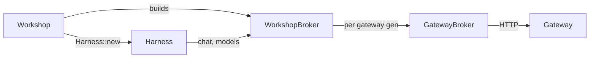

# Change 6: take inference from a Host-supplied broker

<product-contract>

## Product Requirements

The Harness still builds its own model client: each run turns the Host's pushed `GatewayBinding` into a `harness_gateway_client::GatewayClient` and fetches the model catalog over HTTP, and every gateway or catalog change cancels and relaunches the session's run. This change makes the Host supply inference as one trait object, `InferenceBroker`, that serves model rounds and lists models, so the Harness holds no Gateway URL, key, catalog push, or binding generation. It also clears the debt changes 4 and 5 left for this change: the mirrored search types, the two `GatewayClient` names, and the missing docs-site entries. It is change 6 of a nine-change effort that moves I/O out of the Harness; changes 1 to 5 have landed, and changes 7 (streaming in the broker), 8 (removing sessions), and 9 (dropping tokio) follow.

- Problem and users:
  - Team developers working on the Harness and its Hosts: Workshop, and `paperweight` in the wg21-paperflow repository, a one-shot CLI that pins promptforge as a submodule.
  - The Harness's inference seam, `ChatPerformer` (`crates/harness-internal/runner/src/performers.rs:47-58`), has one production impl, `GatewayChatPerformer` (`crates/harness-internal/sessions/src/performer.rs:46-74`), which `run_once` builds per run from the bound gateway's client (`crates/harness-internal/sessions/src/session/run.rs:94`).
  - The Host pushes `GatewayBinding { base_url, key, generation }` and `CatalogBinding { generation, models }` (`crates/harness-internal/sessions/src/environment.rs:32-39`, `:69-75`) through `Harness::set_gateway` and `Harness::set_catalog` (`crates/harness-internal/sessions/src/runtime.rs:176-192`). A new generation of either cancels the session's run and relaunches it over the kept transcript (`crates/harness-internal/sessions/src/session/supervisor.rs:304-343`).
  - Every launch fetches the typed catalog itself with `fetch_model_catalog` to resolve the Host's pick (`current_model`, `crates/harness-internal/sessions/src/environment.rs:327-356`).
  - `harness-sessions` depends on the public `harness-gateway-client` (`crates/harness-internal/sessions/Cargo.toml:24`), which blocks the search fix: the client cannot depend on `harness-web` while the container depends on the client.
  - Carried debt:
    - Search request and result types are mirrored in `harness-gateway-client` (`crates/harness-gateway-client/src/search.rs`) and `harness-web` (`crates/harness-web/src/provider.rs`), and Workshop converts field by field (`crates/workshop/server/src/agents/search.rs:86-122`).
    - `harness_gateway_client::GatewayClient` (`crates/harness-gateway-client/src/transport.rs:33`) collides with `workshop_gateway::GatewayClient` (`crates/workshop/gateway/src/client.rs:99`).
    - `RUSTDOC_SITES` lists only `promptforge` and `harness` (`crates/build-xtask/src/site.rs:38`).
    - `harness-sessions`' performer tests copy the client's SSE helpers (`crates/harness-internal/sessions/src/performer-tests.rs:22-68`).
- Goals:
  - The Host supplies one required `Arc<dyn InferenceBroker>` to `Harness::new`. The broker serves each model round and lists the models the Host offers.
  - The Harness resolves the Host's selected model through the broker at each launch; the model holds for the whole run.
  - `GatewayBinding`, `CatalogBinding`, `set_gateway`, `set_catalog`, binding generations, and generation-driven relaunches leave the Harness. No `harness-internal` crate depends on `harness-gateway-client`.
  - `harness-gateway-client` offers a ready Gateway broker, implements `harness_web::SearchProvider` itself, and keeps its search wire types private.
  - One `GatewayClient` name remains, and `harness-gateway-client` and `harness-web` appear on the docs site.
- Non-goals:
  - Swapping the model in the middle of a run (change 8).
  - Reworking streaming: `stream` on `Effect::Chat`, `Delta`, `DeltaKind`, and `subscribe_deltas` stay (change 7).
  - Removing sessions, reattach, Stop-driven relaunch, or the Harness-owned input broker (change 8).
  - Removing tokio (change 9).
  - Any Engine change: `Effect::Chat`, `EffectAnswer::Chat`, the precheck, and `promptforge`'s public API stay as they are.
  - Workshop UI changes.
- Success criteria:
  - `Harness::new` takes the broker. Nothing named `GatewayBinding`, `CatalogBinding`, `set_gateway`, `set_catalog`, `GatewayResources`, `GatewayGeneration`, `GatewayUnusable`, `ChatPerformer`, or `GatewayChatPerformer` exists under `crates/harness` or `crates/harness-internal`.
  - `crates/harness-internal/sessions/Cargo.toml` has no `harness-gateway-client` dependency, and no `harness-internal` crate depends on `reqwest`.
  - Workshop serves model rounds and model lists through a broker built on `harness-gateway-client`, and a Workshop chat still completes, streams, and searches.
  - `harness-gateway-client` exports no search request or response type, and Workshop's search adapter does no field conversion.
  - `RUSTDOC_SITES` lists `harness-gateway-client` and `harness-web`.
  - The exit criteria in the Testing Plan pass.
- Constraints:
  - `harness-gateway-client` may depend on `harness`, `harness-web`, `promptforge`, and third-party crates, never on `crates/harness-internal/*` (container privacy, `crates/build-xtask/src/product.rs`). No `harness-internal` crate may depend on `harness-gateway-client` or `harness-web`.
  - Every chat and search message, error kind, deadline, header, bearer redaction, and body bound in `harness-gateway-client` stays the same; only type names and visibility change.
  - Files in `harness-*` and `workshop-*` crates stay at or under 500 lines; new test files follow the sibling `<stem>-tests.rs` convention.
- Open questions: None

## Functional Specification

A Host builds an `InferenceBroker` and passes it to `Harness::new` with its recorder, capability registry, and services. At each launch the Harness asks the broker for its model catalog, picks the Host's selected model (or the catalog's first model when none is selected), and binds every declared role to it as today. Each model round goes to the broker with the Engine's binding, messages, tools, and options, plus a delta callback when the round streams. Workshop's broker follows its live gateway binding, so a gateway, catalog, or pick change takes effect without cancelling the running agent.

- Actors and workflows:
  - Workshop's `harness_for` (`crates/workshop/server/src/agents.rs`) builds a Workshop broker over its gateway publication handle and passes it to `Harness::new`.
  - Workshop's `push_bindings` and `forward` (`crates/workshop/server/src/agents/bindings.rs`) push only `HostSnapshot` (selected model and workspace roots) through `Harness::set_host`, re-pushing on menu and granted-roots changes. They stop pushing gateway and catalog bindings.
  - `run_once` resolves the model through the broker, hands the broker to the runner, and gives the runner a delta callback that forwards to the session's delta source (`crates/harness-internal/sessions/src/session.rs:328-342`), so `Session::subscribe_deltas` behaves as today.
  - The effect loop (`crates/harness-internal/runner/src/effect_loop.rs:333-347`) answers `Effect::Chat` by calling the broker, passing the delta callback when `stream` is true and none when it is false.
- Inputs and outputs:
  - A round's inputs are unchanged: `ModelBinding`, `Vec<Message>`, `Vec<ToolSchema>`, and `CompletionOptions`. Its output is `Result<Box<Completion>, CompletionError>`, answered to the Engine as `EffectAnswer::Chat`.
  - A broker should return `Completion.metrics.usage` so the Engine's precheck anchors on measured usage; without it the precheck falls back to its estimate, as today.
  - `models()` returns a `ModelCatalog` (`promptforge::model`). The selection fallback becomes the first model in the broker's catalog instead of the first entry of Workshop's pushed catalog JSON.
- States and validation:
  - The model bound at launch holds for the run. A pick or catalog change reaches the next launch through `set_host` and the next `models()` call.
  - A gateway change no longer cancels or relaunches a run. A round in flight completes or fails on the gateway it started on; the next round goes to whatever gateway the Host's broker now serves.
  - The Harness no longer judges at launch whether a backend is usable.
- Errors and recovery:
  - A `models()` failure, or a selected model absent from the catalog, fails the run at model resolution as `FailureKind::RunFailed`, the path a catalog fetch failure takes today (`crates/harness-internal/sessions/src/session/run.rs:79-81`, `crates/harness-internal/sessions/src/session/supervisor.rs:260-276`).
  - `LaunchError::GatewayUnusable` (`crates/harness-internal/sessions/src/runtime.rs:70`) is removed. Workshop's launch path refuses a launch itself when no usable gateway is bound, with today's text "agent sessions need a usable gateway binding; check the gateway base URL and key", so the agent window shows the same refusal.
  - Workshop's broker answers `chat` and `models` with `CompletionErrorKind::Unavailable` and that kind's fixed phrase when no usable gateway is bound or its endpoint or key cannot be built, so no URL or key detail reaches a message.
  - Workshop's search provider keeps failing with `Transport` and "request failed" in the same case.
- Security and privacy behavior:
  - The Gateway URL and key live only in Workshop and `harness-gateway-client`; the Harness never sees them.
  - Bearer redaction, control escaping, and body bounds stay inside `harness-gateway-client`.
- Acceptance criteria:
  - The success criteria hold.
  - A streaming round's deltas reach `subscribe_deltas`, and a non-streaming round publishes none.
  - Replacing Workshop's gateway while an agent waits for input does not cancel it: no `input_cancelled` followed by a fresh `input_required`.

</product-contract>
<implementation-contract>

## Technical Design

The `ChatPerformer` seam becomes the public `InferenceBroker` trait, defined in `harness-runner` and re-exported from the `harness` facade, with a `models()` method added. `harness-sessions` loses its Gateway code: the performer, the gateway and catalog bindings, the generation watch, and the HTTP dependency. `harness-gateway-client` gains the Gateway implementations of both Host-side traits, the broker and the search provider, so a Gateway Host wraps them instead of rewriting them. Workshop wraps each in a delegator that follows its live gateway binding.



- Architecture:
  - The broker reaches the Harness as a required `Harness::new` parameter, not through `HostServices`: every run needs inference, so a missing broker is a compile error rather than a refusal at prepare.
  - Model selection stays launch-time: `current_model` resolves `HostSnapshot.selected_model` (`crates/harness-internal/sessions/src/environment.rs:80-86`) against `broker.models()`, and the Engine binds every role to that descriptor as today.
  - After the change, `harness-gateway-client` depends on `harness` (for `InferenceBroker`) and `harness-web` (for `SearchProvider`). `harness-sessions` no longer depends on the client, so no cycle forms.
- Modules and interfaces:
  - `InferenceBroker` replaces `ChatPerformer` in `crates/harness-internal/runner/src/performers.rs` and is re-exported as `harness::InferenceBroker`:

    ```rust
    pub type OnDelta = Arc<dyn Fn(StreamDelta) + Send + Sync>;

    pub trait InferenceBroker: Send + Sync {
        fn models(&self) -> BoxFuture<Result<ModelCatalog, CompletionError>>;
        fn chat(
            &self,
            binding: ModelBinding,
            messages: Vec<Message>,
            tools: Vec<ToolSchema>,
            options: CompletionOptions,
            on_delta: Option<OnDelta>,
        ) -> BoxFuture<Result<Box<Completion>, CompletionError>>;
    }
    ```

    `BoxFuture` is the existing `Send + 'static` alias (`performers.rs:43`), made reachable from the facade. `on_delta` replaces the performer's `stream: bool`; `None` means the Harness does not want this round's pieces.
  - `Performers` (`performers.rs:88-95`) and prepare's `Services` (`crates/harness-internal/runner/src/prepare.rs:76`) hold `Arc<dyn InferenceBroker>` plus the run's `OnDelta`. The effect loop passes the callback only when `stream` is true.
  - `harness-sessions`:
    - `Harness::new(config, recorder, broker, capabilities, services)`.
    - `current_model(host, broker)`, and `Bindings` keeps only the host snapshot.
    - Delete `performer.rs`, `performer-tests.rs`, `GatewayResources`, `gateway_client`, the gateway and catalog generation events in `transition.rs`, and the supervisor's generation watch and its retire-and-relaunch path. Stop and reattach relaunches stay.
  - `harness-gateway-client`:
    - `GatewayClient` is renamed `GatewayChat`, pairing with `GatewaySearch`. `workshop_gateway::GatewayClient` keeps its name.
    - A new `GatewayBroker`, built over a `GatewayEndpoint` and `SecretString`, implements `InferenceBroker`. `chat` calls `GatewayChat::complete` and forwards deltas only when `on_delta` is present. `models` calls `fetch_model_catalog`.
    - `GatewaySearch` implements `harness_web::SearchProvider` and takes over the freshness, safe-search, row, and error mapping Workshop does today (`crates/workshop/server/src/agents/search.rs:86-122`). `GatewaySearchRequest`, `GatewaySearchResponse`, and `GatewaySearchResult` become crate-private, and their re-exports (`crates/harness-gateway-client/src/lib.rs:68-73`) go.
  - Workshop (`crates/workshop/server/src/agents/`):
    - A broker that holds the gateway publication handle, keeps one `GatewayBroker` per gateway generation the way `GatewaySearchProvider` caches its client (`search.rs:57-68`), and answers `Unavailable` when no usable gateway is bound.
    - `GatewaySearchProvider` delegates to `GatewaySearch` as a `SearchProvider`, with no field conversion.
    - `bindings.rs` drops `catalog_binding`, `gateway_binding`, and the gateway and catalog watches that only fed the Harness.
    - The launch path refuses a launch with no usable gateway, using the removed `GatewayUnusable` text.
- File and public API changes:
  - `harness` facade (`crates/harness/src/lib.rs:5-6`): remove `GatewayBinding` and `CatalogBinding`, and add `InferenceBroker` and `OnDelta`. `Harness::new` gains the broker. `Harness::set_gateway`, `Harness::set_catalog`, and `LaunchError::GatewayUnusable` are removed.
  - `crates/harness/src/lib.md` replaces its `## CatalogBinding` and `## GatewayBinding` reference entries with `## InferenceBroker` and `## OnDelta`. The facade has no `public-api.txt`, so these pages carry its surface.
  - `harness-gateway-client` adds `GatewayChat`, `GatewayBroker`, and `impl SearchProvider for GatewaySearch`. `GatewayClient` and the three search wire types leave its public surface.
  - `RUSTDOC_SITES` (`crates/build-xtask/src/site.rs:38`) gains `harness-gateway-client` and `harness-web`, and its pin test (`crates/build-xtask/src/site-tests.rs:343-347`) covers both.
  - `promptforge`'s public API (`crates/promptforge/public-api.txt`) does not change.
- Data, persistence, failure, security, and privacy constraints:
  - Recorder output is unchanged: model rounds still record as `Effect::Chat` and `EffectAnswer::Chat`.
  - Failure kinds and messages from `harness-gateway-client` are unchanged. Workshop's no-gateway answers use fixed phrases only.

</implementation-contract>
<verification-contract>

## Testing Plan

Each moved behavior keeps its tests in its new home, and the Harness tests trade their mock gateway for a scripted broker. New tests pin the broker contract at three levels: the effect loop's delta gating, the session's model resolution and delta publication, and Workshop's gateway-following broker. Existing chat, catalog, and search tests move with their code otherwise unchanged.

- Unit:
  - `harness-runner`: a recording broker shows that the effect loop passes a delta callback for a streaming `Effect::Chat` and none for a non-streaming one, and answers the Engine with the broker's result.
  - `harness-sessions`, with a scripted broker:
    - A launch binds the Host's selected model from `models()`.
    - With no selection, it binds the catalog's first model.
    - A selection missing from the catalog, or a `models()` error, fails the run as `RunFailed` carrying the broker's message.
  - `harness-gateway-client`:
    - `GatewayBroker::chat` against a loopback SSE mock forwards deltas only when `on_delta` is present. These tests move from `crates/harness-internal/sessions/src/performer-tests.rs`.
    - `GatewayBroker::models` returns the served catalog.
    - `GatewaySearch` as a `SearchProvider` maps query options, rows, and errors as Workshop's tests do today. These tests move from `crates/workshop/server/src/agents/search-tests.rs`.
  - `build-xtask`: the site test pins both new `RUSTDOC_SITES` entries.
- Integration and end-to-end:
  - `crates/harness-internal/sessions/tests/it/session-infer.rs` (4 tests) and `end_to_end.rs` (1 test) run on a scripted broker instead of `mock_gateway()`. `session.rs` and `session-capabilities.rs`, which bind a dead URL today, use an offline broker that lists an empty catalog and answers `Unavailable` to model rounds.
  - `crates/harness/tests/suite/gateway.rs`, whose 3 tests exercise the removed binding API, is replaced by facade tests showing that a streaming round's deltas reach `subscribe_deltas` and a non-streaming round's do not.
  - Facade doc tours in `crates/harness/src/lib.md`, `vfs.md`, `cancel.md`, `record.md`, and `capability.md` (15 `Harness::new` calls) build the Harness with a hidden offline broker that lists an empty catalog and answers `Unavailable` to model rounds, replacing their dead gateway URLs, and still compile and run.
  - Workshop:
    - The broker answers `Unavailable` with no gateway bound.
    - After a replacement gateway binding is published, the next round reaches the new gateway's mock.
    - Publishing a replacement while an agent waits for input does not cancel it.
    - A launch with no usable gateway is refused with today's text.
- Retired relaunch tests. These assert generation-driven relaunches that this change deletes:
  - Delete:
    - `a_catalog_with_different_models_retires_the_run` (`crates/harness-internal/sessions/tests/it/session.rs`).
    - `an_infer_reply_settles_the_accepted_turn_so_a_new_catalog_retires_the_run` (`session-infer.rs`).
    - The gateway and catalog generation cases in `crates/harness-internal/sessions/src/transition-tests.rs`, including `deferred_catalog_settlement_cancels_and_relaunches_exactly_once`.
    - `gate_profile_switch_relaunches_chat_on_the_new_catalog` and `gate_catalog_replacement_during_acceptance_settles_the_turn_exactly_once` (`crates/workshop/server/tests/it/chat_gate/lifecycle.rs`).
    - `gateway_replacement_interrupts_a_catalog_wait_on_accepted_input`, `retained_catalog_generation_replays_on_the_replacement_gateway`, and `unavailable_catalog_waits_without_relaunching_stale_bindings` (Workshop `agents/replacement.rs`).
  - Rewrite `a_live_chat_session_restarts_on_the_replacement_port_and_key` (`chat_gate/recovery.rs`) so it asserts that the chat's next round reaches the replacement port and key with no relaunch.
  - Keep, and pass unchanged:
    - `a_turn_cancel_relaunches_as_a_second_run_with_indices_continuing`.
    - `gate_cancel_mid_generation_returns_to_waiting_and_next_input_works` (`chat_gate/overload.rs`).
    - The transition cases for start, Stop relaunch, completion, close, and stale events. The catalog wait is deleted, so no wait case remains.
  - Keep the revoke relaunch tests in Workshop `agents/revoke.rs` unless they depend on a gateway or catalog generation, in which case they follow the delete or rewrite rule above.
- Regression, security, and performance:
  - Chat, catalog, and search message and kind tests in `harness-gateway-client` pass, changed only for the type renames.
  - No message from Workshop's broker or search provider contains a gateway URL or key.
  - From the repository root, each leftover search finds nothing:
    - `rg -n '\b(GatewayBinding|CatalogBinding|set_gateway|set_catalog|GatewayResources|GatewayGeneration|GatewayUnusable|ChatPerformer|GatewayChatPerformer)\b' crates/harness crates/harness-internal tools/cicerone`
    - `rg -n 'harness::(GatewayBinding|CatalogBinding)|\bset_(gateway|catalog)\(' crates/workshop --glob '*.rs'`
    - `rg -n 'harness-gateway-client|reqwest' crates/harness-internal --glob Cargo.toml`
    - `rg -n '\bGatewayClient\b' crates/harness-gateway-client`
- Exit criteria:
  - `cargo fmt --all --check`
  - `cargo clippy --workspace --exclude workshop --exclude workshop-server --exclude workshop-server-api --all-targets --all-features -- -D warnings`
  - `cargo clippy -p workshop -p workshop-server -p workshop-server-api --all-targets -- -D warnings`
  - `cargo nextest run --locked --workspace --exclude workshop --exclude workshop-server --exclude workshop-server-api --all-features`, then `cargo test --workspace --exclude workshop --exclude workshop-server --exclude workshop-server-api --all-features --doc`
  - `cargo nextest run --locked -p workshop -p workshop-server -p workshop-server-api`, then `cargo test --doc -p workshop -p workshop-server -p workshop-server-api`
  - With `RUSTDOCFLAGS` set to `-D warnings`: `cargo doc --workspace --no-deps --all-features --exclude workshop --exclude workshop-server --exclude workshop-server-api` and `cargo doc -p harness --no-deps`
  - `cargo +nightly-2026-09-05 xtask api --check`, unchanged
  - `cargo test -p build-xtask`
  - Manual, in Workshop:
    - A chat completes a streamed model round on the Gateway.
    - A prompt declaring `promptforge/web` searches and fetches. This also covers the manual run owed from change 5.

</verification-contract>
<decision-record>

## Decision Record

- Decisions:
  - The broker is a required `Arc<dyn InferenceBroker>` parameter on `Harness::new`, beside the recorder. Every run needs inference, so its absence should fail to compile, not refuse runs at prepare. The operator chose "A required Arc<dyn InferenceBroker> parameter on Harness::new" (2026-10-02).
  - Model selection is launch-time. The broker lists models, the Harness resolves the Host's pick through it at each launch, and the model holds for the run. A gateway change needs no relaunch because the Host's broker follows it; a catalog or pick change applies at the next launch; generation relaunches are deleted. The operator chose "Launch-time ... Mid-run swap waits for change 8" (2026-10-02).
  - `on_delta: Option<OnDelta>` replaces `stream: bool` at the broker, so the broker never sees a session channel. `Effect::Chat` keeps `stream`, and the runner maps it. Change 7 replaces both with a round context.
  - The Gateway broker and the Gateway search provider live in `harness-gateway-client`, so any Gateway Host reuses them; Workshop adds only the gateway-following delegators.
  - `harness_gateway_client::GatewayClient` becomes `GatewayChat`: the public crate's name is the one any Host would collide with, and `GatewayChat` pairs with `GatewaySearch`.
  - `LaunchError::GatewayUnusable` goes, and Workshop refuses the launch itself with the same text, because the Harness can no longer judge a Host's backend without a model round trip.
  - Harness tests and facade tours use scripted or offline brokers written in test code or hidden doc lines, adding no public test API.
  - A broker's `models()` may hold its answer until the Host has a model to offer, and the Harness arms a run's cancel flag before model resolution, so Stop and close still end a run waiting there. Workshop's broker waits for a chat-capable model in its catalog before it lists models. The agent panel launches `chat` as soon as its socket connects (`crates/workshop/ui/src/parts/agent/agent-panel.ts:40-46`), often before the Gateway's catalog arrives; today the Harness's catalog wait holds that run (`gate_delayed_catalog_starts_chat_only_after_a_chat_model_arrives`), and this keeps it held once that wait is deleted. Added during decomposition and accepted before the run (2026-10-02): it is Workshop-internal and keeps today's startup behavior.
  - `GatewayBroker` applies `RunLimits::new()`'s per-receive timeout and response byte cap when it is built, because the broker contract passes no limits. Today `run_once` applies the same defaults to each run's client (`crates/harness-internal/sessions/src/session/run.rs:83-84`), so the deadline and body bound do not change. Added during decomposition (2026-10-02).
- Rejected alternatives:
  - Letting a launch fail its run when no chat model exists yet: the agent panel launches `chat` once, so its window would show a failed session until the operator relaunches it by hand. Workshop refusing that launch ends the same way.
  - The broker in `HostServices` under a service id: a missing broker would refuse every run at prepare. Revisit if a capability needs to call a model itself.
  - Per-round swap inside the broker: the broker could serve a different model than the binding names, but the precheck would keep the launch-bound context window. Revisit at change 8.
  - Per-round rebinding through the Engine via a Host-backed `ModelView` (`crates/promptforge-internal/model-client/src/model/options.rs:343`): it adds a public Engine seam. Revisit at change 8 if a swap must recheck the window.
  - Workshop implementing the broker over `GatewayChat` itself: every Gateway Host would copy it. Revisit if a Host needs a different Gateway policy.
  - A public scripted broker behind `harness`'s `test-support` feature: public test API with no outside user yet. Revisit when an external Host asks for one.
- Assumptions, risks, and notes:
  - Risk is high: the change touches the Harness API, the session supervisor, model resolution, and Workshop's bindings at once. Deleting the generation relaunch path in `supervisor.rs` and `transition.rs` must leave Stop and reattach relaunches intact.
  - The selection fallback changes source: the first model in `fetch_model_catalog`'s result rather than the first in Workshop's pushed catalog JSON. Both come from the Gateway's model list; if their orders differ, Workshop with no pick binds a different default.
  - The Workshop agent window no longer sees an `input_cancelled` and fresh `input_required` pair on gateway or catalog changes.
  - With no selection, every launch asks the broker for its catalog, so a broker whose `models()` fails fails every run, including one that calls no model. The offline brokers in tests and doc tours therefore list an empty catalog and answer `Unavailable` only to model rounds.
  - Accepted regression: the built-in `chat` agent is one long run that loops on `input.ask` (`crates/harness-internal/sessions/agents/chat.md:21-38`). A Gateway profile switch that removes its bound model makes its later rounds fail as `Rejected` (the Gateway answers 404 `model_not_found`, `crates/gateway/app/src/error.rs:17-20`; `crates/harness-gateway-client/src/wire/classify.rs:109`) until its next launch, because nothing relaunches it and the model swap arrives only in change 8. The operator accepted this: "I dont care if profile switches break the agent chat" (2026-10-02).
  - Changes 7 to 9 follow the report "Move the harness's I/O to the host in nine changes" (updated 2026-10-02).
  - `paperweight` (wg21-paperflow `crates/paperweight`) pins promptforge at `be36e078` (2026-09-30), before changes 1 to 5. It calls `Harness::new(HarnessConfig { agents_path, state_dir })`, pushes `GatewayBinding` and `CatalogBinding` once each from environment variables and its own `/v1/models` fetch, sets `HostSnapshot.selected_model` from `--model`, and runs one launch to completion (`crates/paperweight/src/app.rs:187-212` there). It breaks only when its pin is bumped, and the bump already needs changes 2 and 5's `Harness::new` arguments. After this change it builds `harness_gateway_client::GatewayBroker` from the same environment variables and drops its own catalog fetch; its fallback to the catalog's first model is preserved.

### Deferred and Out of Scope

- Deferred:
  - Swapping the model between rounds of a run. Revisit at change 8, where a model change becomes a swap.
  - Moving streaming into the broker's round context: `stream`, `OnDelta`, `Delta`, `DeltaKind`, `subscribe_deltas`, and the session delta channel. Revisit at change 7.
  - D1-1 (the built-in `chat` agent needs web from above the Harness), D1-5 (a recorder failure after `begin_run`), `CapabilityRegistry`'s unused `Clone`, and the input broker's move to the Host. Revisit at change 8.
  - Untagged spawns in `harness-web`. Revisit at change 9.
- Out of scope:
  - Engine, Gateway, and Workshop UI changes.
  - Bumping `paperweight`'s promptforge pin or changing its code; that happens in wg21-paperflow.
  - Workshop's own catalog names (`CatalogSink`, `CatalogBus`, `reconcile_catalog`, `set_gateway_reachable`) and `workshop_gateway::GatewayBinding`, which are not Harness bindings.

</decision-record>
<project-survey>

## Project Survey

- Status: complete
- Build command: `cargo build --locked -p <crate>` for each crate a step touches. Plain `cargo build` builds only `gateway`, the workspace's sole default member. The desktop app builds with `cargo build --locked -p workshop`, or with the Gateway sidecar staged through `cargo workshop` (alias for `build-workshop`). Clippy is the compile check; never run a standalone `cargo check --workspace` beside it. The one extra compile gate is `cargo check -p gateway --no-default-features`. Local toolchain: stable cargo 1.99, cargo-nextest 0.9.128, node 24, and the pinned `nightly-2026-09-05` are installed; the shell is PowerShell on Windows.
- Focused test command pattern: `cargo nextest run --locked -p <crate> --all-features <test-name-substring>`, adding `--test it` to target a crate's integration binary (`--test suite` for `promptforge` and `harness`). The Workshop trio `workshop`, `workshop-server`, and `workshop-server-api` runs without `--all-features`. A focused doctest is `cargo test --locked -p <crate> --all-features --doc <name>`. A focused UI test is `node --test <file>` from the package directory (`crates/workshop/ui`, `crates/workshop/look`, `crates/workshop/platform`, or `crates/gateway/config-ui/ui`).
- Component test command pattern: `cargo nextest run --locked -p <crate> --all-features`, then `cargo test --locked -p <crate> --all-features --doc`, because nextest skips doctests. For the Workshop trio: `cargo nextest run --locked -p workshop -p workshop-server -p workshop-server-api` and `cargo test --doc -p workshop -p workshop-server -p workshop-server-api`. CI also runs `cargo nextest run --locked -p workshop-workspace --all-features` and `cargo nextest run --locked -p workshop-server --features headless`. Workshop UI packages: from `crates/workshop`, `npm run build --workspace ui` then `npm test --workspace <ui|look|platform>`. Gateway config UI: from `crates/gateway/config-ui/ui`, `npm run build` then `npm test`. Structural checks: `cargo test -p build-xtask`.
- Full-suite test command: `cargo nextest run --locked --workspace --exclude workshop --exclude workshop-server --exclude workshop-server-api --all-features`, then `cargo test --workspace --exclude workshop --exclude workshop-server --exclude workshop-server-api --all-features --doc`, then `cargo nextest run --locked -p workshop -p workshop-server -p workshop-server-api` and `cargo test --doc -p workshop -p workshop-server -p workshop-server-api`. The workspace run includes `build-xtask`'s structural checks. UI: from `crates/workshop`, `npm ci`, `npm run build --workspace ui`, `npm test --workspaces --if-present`; from `crates/gateway/config-ui/ui`, `npm ci`, `npm run build`, `npm test`. CI fails if any build step dirties the git tree.
- Linter command: `cargo clippy --workspace --exclude workshop --exclude workshop-server --exclude workshop-server-api --all-targets --all-features -- -D warnings`, and for the Workshop trio `cargo clippy -p workshop -p workshop-server -p workshop-server-api --all-targets -- -D warnings`. UI typecheck: `npm run typecheck --workspaces --if-present` from `crates/workshop` and `npm run typecheck` from `crates/gateway/config-ui/ui`. Supply chain, in CI and the pre-push hook when installed: `cargo deny check`.
- Formatter check command: `cargo fmt --all --check` (also the pre-commit hook). No TypeScript, JavaScript, or CSS formatter is configured.
- Docs command: set `RUSTDOCFLAGS` to `-D warnings` (PowerShell: `$env:RUSTDOCFLAGS='-D warnings'`), then `cargo doc --workspace --no-deps --all-features --exclude workshop --exclude workshop-server --exclude workshop-server-api`, the facades with default features `cargo doc -p promptforge --no-deps` and `cargo doc -p harness --no-deps`, `cargo doc --locked --no-deps --all-features -p promptforge-engine --document-private-items`, and `cargo doc --locked --no-deps -p workshop-server --document-private-items`. User guide: `cargo xtask site --books-only`; the guide's single-file exports regenerate with `cargo run --locked -q -p build-user-guide`. Facade surface: `cargo +nightly-2026-09-05 xtask api --check` against the committed `crates/promptforge/public-api.txt` (the nightly is pinned in `crates/build-xtask/src/api/toolchain.rs`), plus its nightly-only fixtures `cargo +nightly-2026-09-05 nextest run --locked -p build-xtask --run-ignored only`.
- Test placement and naming conventions: Unit tests sit in a `#[cfg(test)]` module in a sibling `<stem>-tests.rs` wired with `#[path = "<stem>-tests.rs"]`, or in a `src/<module>/tests/` directory once there are three or more files (for example `promptforge-internal/engine/src/execute/tests/`). Integration tests compile as one binary per crate rooted at `tests/it/main.rs` (`tests/suite/main.rs` in `promptforge` and `harness`), which declares one `mod` per area; split areas use kebab siblings such as `effect_loop-recorder.rs`. A few crates keep standalone files instead, such as `gateway/stt/engine/tests/*.rs` and `build-workshop/tests/interruption.rs`. Helpers live in `tests/it/support.rs` or `tests/common/`, data in `tests/fixtures/`, and prompt programs in `tests/prompts/`. Test names are snake_case sentences stating the behavior, such as `records_are_events_then_effects_then_answers_per_step`; async tests use `#[tokio::test]`; tests often return `Result` rather than unwrap; test roots opt out of the unwrap and expect lints with `#![expect(..., reason = "...")]`. Test-only APIs sit behind a `test-support` feature (Engine and Harness crates) or `test-fixtures` (gateway and Workshop crates). UI tests use Node's built-in runner over `test/**/*.mjs` and `src/**/*.test.mjs`. New structural checks belong only in `build-xtask` and need explicit user approval.
- Directory map: `crates/` holds every Rust crate plus the TypeScript UI packages, grouped into families with manifestless containers: the Engine facade `promptforge` and its private crates in `promptforge-internal/` (`types`, `engine`, `lua`, `parser`, `vfs`, `model-client`); the Harness facade `harness`, its private crates in `harness-internal/` (`runner`, `capabilities`, `sessions`), and the public `harness-gateway-client` and `harness-web`; the Gateway in `gateway/` (`app`, `cloud-providers`, `config`, `config-ui`, `local`, `logging`, `progress`, `protocol`, `routing`, `web-search`, and `stt/` with `api`, `engine`, `backend-whisper`, `whisper-ffi`) plus the public `gateway-api-types` and `gateway-api-discovery`; Workshop in `workshop/` (Rust: `desktop`, `server`, `server-api`, `gateway`, `menu`, `protocol`, `registry`, `status`, `support`, `user-state`, `workspace`, `run-log`; TypeScript npm workspace: `ui`, `look`, `platform`); shared crates `shared-error-source` and `shared-loopback`, and the TypeScript and CSS package `shared-ui` that the Gateway config UI consumes; tooling crates `build-xtask`, `build-ui`, `build-workshop`, `build-user-guide`, `build-llama-cuda`; and the cargo-hakari `workspace-hack`. `guide/` holds the user guide chapters under `guide/src/<set>/`, the generated `promptforge-*-guide.md` exports, and the mdBook books, chrome, and landing page. `prompts/` holds sample prompt programs. `tools/` holds the `cicerone.md` agent tool for facade rustdoc and Node scripts with `.test.mjs` siblings. `vibe/` holds `archdoc.md` and dated plans. `.github/workflows/` holds CI (`ci.yml`) and the release, nightly, and site workflows. `.githooks/` holds the pre-commit format check and the pre-push headless check, clippy, and deny. `.cargo/config.toml` defines the `cargo xtask` and `cargo workshop` aliases and the Windows `rust-lld` linker with static CRT. `.config/` holds `nextest.toml` and `hakari.toml`. `local/` is gitignored operator config, `images/` is README art, and `target/` and `target-msrv/` are build output.
- Component boundaries: Engine: `promptforge-types` and `promptforge-vfs` are leaves; `promptforge-model-client` depends on types; `promptforge-lua` on model-client, types, and vfs; `promptforge-parser` on lua and types; `promptforge-engine` on all five; the `promptforge` facade re-exports them. No Engine crate depends on Harness, Gateway, Workshop, or shared crates. Harness: `harness-capabilities` and `harness-gateway-client` depend only on `promptforge`; `harness-runner` on capabilities; `harness-sessions` on capabilities, gateway-client, and runner; the `harness` facade on capabilities, runner, and sessions; `harness-web` on `harness`. Harness crates reach the Engine only through `promptforge` and depend on no gateway or shared crate. Gateway: `gateway-api-types` is the leaf wire vocabulary; config, progress, and protocol build on it; routing on config and protocol; local on config, progress, protocol, routing, and `shared-error-source`; web-search on config and protocol; the STT chain runs `whisper-ffi` (the only unsafe boundary) and `stt-engine` up through `backend-whisper` to `gateway-stt`; the `gateway` app crate sits on top. Workshop: tier 0 vocabulary is `workshop-protocol`, `workshop-registry`, and `workshop-support`; `workshop-gateway`, `workshop-menu`, `workshop-status`, `workshop-user-state`, and `workshop-workspace` build on it; `workshop-run-log` depends on `harness`; `workshop-server` composes all of them with `harness`, `harness-gateway-client`, `harness-web`, `promptforge`, `gateway-api-discovery`, and `shared-loopback`; `workshop-server-api` wraps the server and the `workshop` desktop app depends on server-api. Workshop reaches the Gateway only through `gateway-api-types`, `gateway-api-discovery`, and its protocol, never Gateway internals. Tooling crates depend on no workspace crates. `cargo test -p build-xtask` enforces the product and container boundaries, the Workshop tier graph, and the Harness bans.
- Conventions summary: Rust edition 2024 on stable with resolver 3 and rustfmt `style_edition = "2024"`. Every member inherits `[workspace.lints]`: clippy `all` and `pedantic` denied, `unwrap_used` and `expect_used` denied outside tests, `unsafe_code` forbidden, `missing_docs` and `unreachable_pub` warned, and broken intra-doc links denied. Lint suppressions use `#[expect(..., reason = "...")]` rather than `#[allow]`. Library errors are typed with `thiserror`; `anyhow` appears only in tooling, binaries, and Gateway app crates. Crate root docs that opt into tidy checks open with `//! ## Invariants`; those crates, and every `workshop-*` and `harness-*` crate, keep each file under 500 lines. Source directories are flat; one or two related files become `foo-bar.rs` siblings with `#[path]`, three or more become a `foo/` subdirectory. Dependency versions live in `[workspace.dependencies]` with comments justifying each pin, and every member depends on `workspace-hack`. Comments explain constraints only, and workaround comments cite an upstream issue URL. Engine, Harness, and Host are capitalized defined terms, checked by `crates/workshop/ui/test/docs-claims.mjs`. JSON reaching a recorder round-trips exactly through serde_json `float_roundtrip`, never `preserve_order`. Error messages are written for model consumption, naming required versus actual. Workshop CSS uses `--ws-*` tokens and the SPA never touches `localStorage`. Text files are LF except `.ps1` and `.bat`.

</project-survey>
<execution-plan>

## Execution Instructions

Three components, in dependency order:

1. Broker seam (steps 1 to 3). It goes first because the Gateway broker implements its trait and Workshop builds on both. Its three pieces are sequential so that every commit compiles and passes: the runner's trait, then the Host broker that replaces the gateway binding, then the catalog binding's removal. `Harness::new` changes in step 2, so that commit updates every caller, moves the chat performer into `harness-gateway-client` as `GatewayBroker`, and wires Workshop's broker. The catalog binding outlives the gateway binding by one step, so Workshop's catalog-driven tests keep passing until step 3 deletes or rewrites them.
2. Gateway client surface (step 4). It comes after step 2, because `harness-gateway-client` can depend on `harness-web` only once `harness-sessions` no longer depends on the client. It needs nothing from step 3 and can be built alongside it.
3. Docs and exit criteria (step 5). It comes last because it describes the finished wiring and runs the full exit criteria once.

Each step is one commit holding its code and its tests, and runs only its touched crates' checks. The facade pages and their reference entries change in steps 2 and 3, not step 5, because `cargo doc` denies broken intra-doc links and the doc tours compile in every commit. Each step that changes a dependency edge runs `cargo hakari generate`, `cargo hakari manage-deps`, and `cargo hakari verify`.

<step-1>

### Step 1: The inference seam lists models and gates deltas [completed]

- Component: Broker seam
- Depends on: nothing.
- Piece: the runner's inference trait. Built first (sequential), because steps 2 and 3 pass Host brokers through it. Nothing public changes here: the sessions performer adopts the trait, so Workshop and the facade are untouched.
- `crates/harness-internal/runner/src/performers.rs`:
  - Replace `ChatPerformer` with `OnDelta` and `InferenceBroker` exactly as the Technical Design writes them. `BoxFuture` stays.
  - `Performers.chat` becomes `broker: Arc<dyn InferenceBroker>` plus `on_delta: OnDelta`.
  - The module doc's last sentence says the Host supplies the broker.
- `src/prepare.rs`: `Services.chat` (`:76`) becomes `broker` plus `on_delta`, and `prepare` builds `Performers` from them (`:356`).
- `src/effect_loop.rs:333-347`: answer `Effect::Chat` through `broker.chat`, passing `Some(on_delta.clone())` when `stream` is true and `None` when it is false. The file stays under 500 lines (480 today).
- `crates/harness-internal/sessions`:
  - `src/performer.rs`: `GatewayChatPerformer` implements `InferenceBroker` and holds no `DeltaSink`. `chat` sends each delta to `on_delta` when one is present. `models` calls `fetch_model_catalog` with the API root and key the performer is built from. Delete `DeltaSink` and its export (`src/lib.rs:47`).
  - `src/session/run.rs:94`: build the performer from the limited client and the frozen binding's `api_root()` and key. Set `Services.on_delta` to a closure that sends to `core.delta_source` and ignores a closed receiver.
  - `current_model` and the bindings do not change in this step.
- Tests:
  - New `crates/harness-internal/runner/tests/it/effect_loop-broker.rs`, wired from `effect_loop.rs` as `effect_loop-recorder.rs` is. A recording broker shows that a section's own chat round receives a callback, a `models.infer` round receives none, and the Engine gets the broker's completion as each round's answer.
  - Converted to the new trait and fields: `tests/it/support.rs` (`Unused`, `unused()`), `tests/it/prepare.rs:105`, `crates/harness-internal/sessions/src/input-tests.rs` (`NoChat`), and `crates/harness-internal/sessions/tests/it/end_to_end.rs` (`services`, `:319-342`).
  - `src/performer-tests.rs`: the three round tests pass a recording `OnDelta`, or `None`, in place of a sink and `stream`. A new test shows that `models` returns the catalog a mock serves at `/v1/models`. Step 2 moves this file.
  - Run `cargo nextest run --locked -p harness-runner -p harness-sessions --all-features`, `cargo test --locked -p harness-runner -p harness-sessions --all-features --doc`, and `cargo clippy -p harness-runner -p harness-sessions -p harness --all-targets --all-features -- -D warnings`.

</step-1>

<step-2>

### Step 2: The Host's broker replaces the gateway binding [completed]

- Component: Broker seam
- Depends on: step 1.
- Piece: the Host-supplied broker and the gateway binding's removal. Built after step 1 (sequential). It is one commit because the new `Harness::new` breaks every caller, and `harness-sessions` must drop the client in the same commit that Workshop starts building its broker on `GatewayBroker`. The catalog binding, its wait, and its relaunch stay until step 3, so every run still waits for a pushed catalog here.
- `crates/harness-internal/sessions`:
  - `src/runtime.rs`: `Harness::new(config, recorder, broker: Arc<dyn InferenceBroker>, capabilities, services)`. The Harness keeps the broker and hands it to each session through `SessionSeed`. Delete `set_gateway`, `gateway`, `LaunchError::GatewayUnusable`, and the launch's gateway watch and usability check (`:257-270`). Update the docs on the module, `Harness`, `new`, and `launch`.
  - `src/session.rs`: `SessionCore` and `SessionSeed` hold the broker.
  - `src/session/run.rs`: `RunInputs` drops `gateway` and `client`. `run_once` resolves the model with `current_model(&host, &*core.broker)` and builds `Services` with the session's broker and step 1's delta closure. The per-run `with_request_limits` call (`:84`) goes, because `GatewayBroker` applies the same limits.
  - `src/environment.rs`: `current_model(host, broker)` takes the selection, or with none the first model of `broker.models()` (`ModelCatalog::models().first()`), and returns `Ok(None)` for no selection and an empty catalog. A `models()` error or an absent selection stays a `CurrentModelError`, which fails the run as `RunFailed` (`src/session/supervisor.rs:260-276`). Delete `GatewayBinding`, `gateway_client`, `GatewayResources`, and the gateway half of `Bindings`, and rewrite the module doc.
  - `src/transition.rs`: delete `SupervisorEvent::GatewayGeneration`, `gateway_changed`, `CancelOrigin::Gateway`, and the gateway generation in `SupervisorState` and `RelaunchEffect`. `SupervisorState::new()` takes no argument.
  - `src/session/supervisor.rs`: delete the gateway watch, `latest_gateway`, `active_gateway`, `Collected::Gateway`, `gateway_event`, the gateway and client checks in `relaunch` (`:311-329`), and the gateway arm of `report_cancel_origin`. The catalog watch and relaunch stay.
  - Delete `src/performer.rs` and `src/performer-tests.rs`, and `mod performer` and its export in `src/lib.rs`, whose `## Invariants` family line drops `harness-gateway-client`.
  - `Cargo.toml`: remove `harness-gateway-client`, and remove the `axum` dev-dependency once no suite runs a mock gateway.
- `crates/harness-gateway-client`:
  - `Cargo.toml`: depend on `harness`; the description and dependency comments name the broker.
  - New `src/broker.rs`, exported as `GatewayBroker`. `GatewayBroker::new(endpoint: GatewayEndpoint, key: SecretString)` holds a `GatewayClient` with `RunLimits::new()`'s timeout and response byte cap applied, so today's per-run deadline and body bound hold. `chat` is step 1's performer body, and `models` calls `fetch_model_catalog`. `Debug` redacts the key.
  - `src/lib.rs`: export `GatewayBroker`, describe it in the crate doc, and change the `## Invariants` family line to `promptforge`, `harness`, and third-party crates.
- Facade `crates/harness`:
  - `src/lib.rs`: drop the `GatewayBinding` re-export, and re-export `InferenceBroker`, `OnDelta`, and `BoxFuture` from `harness_runner::performers`. The `Cargo.toml` description says the Host supplies the inference broker rather than pushing the gateway binding.
  - Every `Harness::new` call gains the broker: `lib.md` (7 calls), `vfs.md` (3), `cancel.md` (1), `record.md` (3), and `capability.md` (1). Each block defines, in hidden lines written against `promptforge` paths, an offline broker whose `models()` returns an empty catalog and whose `chat` answers `Unavailable` with that kind's fixed phrase. Drop each `set_gateway` push and the `GatewayBinding` imports. The `set_catalog` pushes stay until step 3.
  - `lib.md` prose replaces the stub model server and the gateway with `desk`'s broker, and says a real `desk` passes `harness_gateway_client::GatewayBroker`:
    - "Before you start": the opening paragraphs and the *gateway* definition.
    - "Launch an agent": steps 3 and 6, the generation rules for a gateway push, and the refusal paragraphs.
    - "Stream a reply": the description of the hidden `desk` helper.
    - "The complete program": the `STUB` constant and its push, the gateway half of step 8 and of its explanation, and `set_gateway` in the diagram.
    - Reference: replace `## GatewayBinding` with `## BoxFuture`, `## InferenceBroker`, and `## OnDelta`; update `## Harness` (`new`, the refusal order, and the `set_gateway` bullet), the `## LaunchError` table, and `## SessionState`.
  - `vfs.md:55` and `cancel.md:88` describe the hidden stub model server. Reword both to describe the hidden offline broker, and frame the echoed reply the uncalled launch functions assert as what an echoing model returns.
- Workshop (`crates/workshop/server/src/agents/`):
  - New `gateway.rs`: the one read of a usable gateway, shared by the broker, the search provider, and the launch refusal. From the registry's `GatewayHandles` snapshot it returns the generation, the `GatewayEndpoint` for `{base_url}/v1` (the rule `GatewayBinding::api_root` held), and the `SecretString`, or `None` when no handles are registered or either value cannot be built. It reads no heartbeat health, as today's launch check reads none.
  - New `broker.rs`: `WorkshopBroker` implements `InferenceBroker` over the `Registry` and caches one `GatewayBroker` per gateway generation, as `search.rs:57-68` caches its client. With no usable gateway, `chat` and `models` fail with `CompletionErrorKind::Unavailable` and its fixed phrase, so no URL or key reaches a message.
  - `agents.rs`: `harness_for` passes `Arc::new(WorkshopBroker::new(registry.clone()))` to `Harness::new`. `LaunchRefusal` gains a variant whose text is "agent sessions need a usable gateway binding; check the gateway base URL and key", and `AgentSessions::launch` returns it before `harness.launch` when `gateway.rs` finds no usable gateway. Update the module doc and the `launch` doc.
  - `bindings.rs`: stop pushing the gateway binding, delete `gateway_binding`, and drop `forward`'s gateway watch. The catalog and Host pushes stay.
  - `search.rs`: read the gateway through `gateway.rs` instead of `bindings::gateway_binding`. Behavior is unchanged.
- Run `cargo hakari generate`, `cargo hakari manage-deps`, and `cargo hakari verify`.
- Tests:
  - `harness-sessions`, with a scripted broker and the offline broker in a new `tests/it/support.rs`, declared from `tests/it/main.rs`:
    - New `tests/it/session-model.rs`, wired from `session.rs`. A launch binds the selected model from `models()`. With no selection it binds the catalog's first model. A selection absent from the catalog, or a `models()` error, fails the run as `RunFailed` with the broker's message in the report.
    - `session-infer.rs` (4 tests) and `end_to_end.rs` (1 test) run on the scripted broker instead of `mock_gateway()`, and assert what the broker received where they asserted what the mock saw.
    - `session.rs` and `session-capabilities.rs` use the offline broker and drop `set_gateway`. `an_unknown_agent_and_an_unbound_gateway_are_refused_at_launch` keeps its unknown-agent half and is renamed for it; Workshop's refusal test replaces the gateway half.
    - `src/environment-tests.rs`: delete the four gateway binding tests (`:15-82`) and keep the Host snapshot test. `no_selection_and_no_catalog_binds_no_model_without_a_fetch` becomes no selection and an empty broker catalog binding no model.
    - `src/transition-tests.rs`: drop `GatewayGeneration` from every scenario, delete "gateway replacement coalesces the latest retained catalog", and keep `overlapping_retirement_causes_cancel_only_the_owned_run` without its gateway events.
  - `harness-gateway-client`: new `src/broker-tests.rs` holds the moved performer tests (deltas forwarded only when `on_delta` is present, and a closed consumer not failing the round) and step 1's models test. They use the mock servers in `src/transport/tests.rs` instead of the copies at `performer-tests.rs:20-65`, which spawn through `harness-runner`'s test support that this crate cannot reach.
  - Facade: replace `tests/suite/gateway.rs` with `tests/suite/broker.rs`, declared in `main.rs`. With a scripted broker, a pushed catalog, and a selection, a section's streaming round reaches `Session::subscribe_deltas`, and a `models.infer` round publishes no delta.
  - Workshop:
    - New `src/agents/broker-tests.rs`: with no gateway registered, and with a key that cannot build, `chat` and `models` fail as `Unavailable` with no URL or key in the message. After a replacement binding is published, the next round and the next model list reach the replacement's mock.
    - `src/agents/tests.rs`: `harness_over` passes an offline broker and drops `set_gateway`.
    - `tests/it/agents/replacement.rs`: delete its three tests, each of which asserts a gateway relaunch. Add one where a replacement published while `chat` waits for input sends no `input_cancelled`, the original token still answers, the session keeps one run, and the reply comes from the replacement.
    - Rewrite `a_live_chat_session_restarts_on_the_replacement_port_and_key` (`tests/it/chat_gate/recovery.rs`) and rename it: the original wait answers, its round reaches the replacement port and key, and no relaunch happens.
    - `tests/it/agents/refusals.rs`: a new test publishes a replacement with an empty key, launches, and gets an error frame with the refusal text.
    - Kept unchanged: `a_turn_cancel_relaunches_as_a_second_run_with_indices_continuing`, `gate_cancel_mid_generation_returns_to_waiting_and_next_input_works`, and every catalog-driven Workshop test.
  - Run `cargo nextest run --locked -p harness-sessions -p harness -p harness-gateway-client --all-features`, `cargo test --locked -p harness-sessions -p harness -p harness-gateway-client --all-features --doc`, `cargo nextest run --locked -p workshop-server`, `cargo test --doc -p workshop-server`, clippy on all four crates (`workshop-server` without `--all-features`), `cargo doc -p harness --no-deps` with `RUSTDOCFLAGS` set to `-D warnings`, `cargo test -p build-xtask`, and `node --test crates/workshop/ui/test/docs-claims.mjs`.

</step-2>

<step-3>

### Step 3: The catalog binding and its relaunches leave the Harness [completed]

- Component: Broker seam
- Depends on: step 2.
- Piece: the catalog binding's removal and the Host-side wait that replaces the Harness's catalog wait. Built after step 2 (sequential): the wait lives in step 2's Workshop broker, and only the catalog half of the bindings remains to delete.
- `crates/harness-internal/sessions`:
  - `src/environment.rs`: delete `CatalogBinding` and the catalog half of `Bindings`, which keeps only the Host snapshot. Rewrite the module doc.
  - `src/runtime.rs`: delete `set_catalog`, and update the module and type docs.
  - `src/transition.rs`: delete `CatalogGeneration`, `CatalogDisposition`, `WaitFor` with `SupervisorEffect::Wait`, `Phase::WaitingForCatalog`, `catalog_generation`, `observed_catalog_generation`, `catalog_retirement_pending`, and `RelaunchEffect.catalog_generation`. Delete the accepted-turn settlement too, since it only deferred catalog retirement: `AcceptedInput`, `TerminalSettlement`, `accepted_run`, and `CancelOrigin`, whose only remaining variant would be `Operator`. A new `Starting` phase and `Start` event relaunch run 1. Stop, close, and completion keep their transitions.
  - `src/session/supervisor.rs`: begin with `Start` instead of `initial_catalog_event`. Delete the catalog watch, `latest_catalog`, `active_catalog`, `Collected::Catalog`, `catalog_event`, `classify`, and `report_cancel_origin`. `relaunch` reads only the Host snapshot. Rewrite the module doc.
  - `src/lifecycle.rs`: delete `accept_input`, `settle_current_turn`, and `settle_turn`, and their calls in `src/session.rs` (`:218-222`, `:441`, `:445`). `Session::send_input` keeps `before_resume`. Fix the docs that name the accepted-turn boundary.
  - `src/session/run.rs`: arm the run's cancel flag before model resolution, and return `RunOutcome::Cancelled` when `CancelHandle::cancelled` fires before `current_model` returns, so Stop and close end a run whose broker is still holding `models()`.
  - `Cargo.toml`: the `tokio` comment no longer names generation watches.
- Facade `crates/harness`:
  - `src/lib.rs`: drop the `CatalogBinding` re-export.
  - Drop every `set_catalog` push and `CatalogBinding` import from the five pages.
  - `lib.md` prose:
    - "Before you start": a session makes its first run at launch.
    - "Launch an agent": drop step 4's catalog push and the empty-catalog and generation-0 paragraphs. Say that with no selection a launch binds the first model the broker lists, and that a broker may hold `models()` until it has a model to offer while Stop and close still end the run.
    - "The complete program": drop the catalog half of step 8, the catalog-restart paragraph, and `set_catalog` in the diagram, and reword step 1's account of what restarts a run.
    - Reference: delete `## CatalogBinding`; update `## HostSnapshot` (the fallback and the `selected_model` failure bullet), `## InferenceBroker` (`models()` may wait), and `## SessionState` (only `cancel` and `close` set `Closing`).
- Workshop (`crates/workshop/server/src/agents/`):
  - `bindings.rs`: push only `HostSnapshot`. Delete `catalog_binding` and `forward`'s catalog watch, keeping the menu and granted-roots wakeups. Rewrite the module doc.
  - `broker.rs`: `models` first waits until the menu's `CatalogBus` holds a chat-capable model (`latest_chat()`, woken by `subscribe_chat_generation()`), then reads the usable gateway and delegates. With no menu registered it does not wait. The agent panel launches `chat` as soon as the socket connects (`crates/workshop/ui/src/parts/agent/agent-panel.ts:40-46`), so this keeps that session waiting for the Gateway's catalog, as the Harness's catalog wait does today.
  - Update `agents.rs` and `state.rs:110`, which describe the forwarder pushing the gateway and catalog.
- Tests:
  - `harness-sessions`:
    - `src/transition-tests.rs`: delete the catalog cases, including `deferred_catalog_settlement_cancels_and_relaunches_exactly_once`, `terminal_settlement_is_scoped_to_the_run_that_accepted_input`, and `overlapping_retirement_causes_cancel_only_the_owned_run`. Rewrite the kept start, Stop relaunch, completion, close, and stale-event cases to begin with `Start`. The reducer has no wait left once the catalog goes, so no wait case remains.
    - Delete `a_catalog_with_different_models_retires_the_run` (`tests/it/session.rs`) and `an_infer_reply_settles_the_accepted_turn_so_a_new_catalog_retires_the_run` (`session-infer.rs`), and drop the remaining `set_catalog` calls.
    - `session-model.rs`: with a broker whose `models()` never answers, a close ends the session, and a turn cancel relaunches into the same wait.
  - Facade: `tests/suite/broker.rs` drops its catalog push.
  - Workshop:
    - Delete `gate_profile_switch_relaunches_chat_on_the_new_catalog` and `gate_catalog_replacement_during_acceptance_settles_the_turn_exactly_once` (`tests/it/chat_gate/lifecycle.rs`).
    - `gate_delayed_catalog_starts_chat_only_after_a_chat_model_arrives` passes unchanged on the broker's wait; reword its doc comment and the file doc. Reword the doc comment on `gate_selection_loss_leaves_the_runs_frozen_binding_untouched` (`recovery.rs`), which says a catalog replacement retires the run.
    - Rewrite `a_revoke_during_a_running_session_pushes_roots_without_the_revoked_folder` (`tests/it/agents/revoke.rs`) to relaunch with a turn cancel after the revoke instead of a catalog replacement, still asserting `launch@nil`, and reword its module doc.
    - `src/agents/broker-tests.rs`: `models` waits while the catalog holds no chat-capable model and answers once one is published.
    - Update the forwarder comment in `spawn_agent_server_for_gateway` (`tests/it/agents.rs:158-160`).
  - Run `cargo nextest run --locked -p harness-sessions -p harness --all-features`, `cargo test --locked -p harness-sessions -p harness --all-features --doc`, `cargo nextest run --locked -p workshop-server`, `cargo test --doc -p workshop-server`, clippy on the three crates (`workshop-server` without `--all-features`), `cargo doc -p harness --no-deps` with `RUSTDOCFLAGS` set to `-D warnings`, and `node --test crates/workshop/ui/test/docs-claims.mjs`.

</step-3>

<step-4>

### Step 4: GatewayChat and the Gateway search provider [completed]

- Component: Gateway client surface
- Depends on: step 2, after which no `harness-internal` crate depends on the client. It needs nothing from step 3.
- Pieces: the rename and the search provider. Built jointly: neither depends on the other, and the crate's suite and Workshop's search tests cover both.
- Rename `GatewayClient` to `GatewayChat` in `src/transport.rs`, `src/lib.rs`, `src/broker.rs`, `src/failure.rs:34`, `src/config.rs:206`, and the crate's tests and doctests. Rename the mentions in `crates/gateway/app/README.md:77` (`GatewayClient::from_env`) and the comment at `crates/promptforge-internal/engine/src/execute/tests/model_and_reply.rs:10`. `workshop_gateway::GatewayClient` keeps its name.
- Search provider:
  - `Cargo.toml`: depend on `harness-web` and `async-trait`, and update the description and the `serde` comment that names the public search request and reply.
  - `src/search.rs`: `impl harness_web::SearchProvider for GatewaySearch` takes over Workshop's mapping (`crates/workshop/server/src/agents/search.rs:86-128`): freshness and safe search through `as_str`, each result row field by field, and `GatewaySearchErrorKind::Backend` to `SearchErrorKind::Backend` with every other kind to `Transport`, keeping the `GatewaySearchError` as the source. `GatewaySearchRequest`, `GatewaySearchResponse`, `GatewaySearchResult`, and the inherent `search` become crate-private, and their re-exports (`src/lib.rs:68-73`) go. `GatewaySearchError` and `GatewaySearchErrorKind` stay public. The file stays under 500 lines (374 today).
  - `src/lib.rs`: the crate doc presents `GatewaySearch` as a `SearchProvider`, and the `## Invariants` family line adds `harness-web`.
- `README.md` of the crate: describe `GatewayChat`, `GatewayBroker`, and `GatewaySearch` as a `SearchProvider`, drop the three wire types, and replace "depends only on `promptforge`" with `promptforge`, `harness`, and `harness-web`.
- Workshop `src/agents/search.rs`: `GatewaySearchProvider` calls `SearchProvider::search` on its cached `GatewaySearch` and returns the result unchanged. Delete `gateway_request`, `search_results`, and `search_error`. The no-gateway failure stays `Transport` with `request failed`.
- Run `cargo hakari generate`, `cargo hakari manage-deps`, and `cargo hakari verify`.
- Tests:
  - Move `a_gateway_reply_maps_into_results_and_the_query_into_its_request` and `a_gateway_error_status_maps_as_backend_with_the_gateway_error_as_source` from `crates/workshop/server/src/agents/search-tests.rs` into a new `src/search-tests-provider.rs`, wired from `search-tests.rs` as `search-tests-responses.rs` is, and rewrite them against `GatewaySearch::new` and a mock router.
  - Workshop keeps `a_replaced_gateway_serves_the_next_search` and its two `request failed` tests.
  - The crate's chat, catalog, and search message and kind tests pass, changed only for the rename.
  - Run `cargo nextest run --locked -p harness-gateway-client --all-features`, `cargo test --locked -p harness-gateway-client --all-features --doc`, `cargo nextest run --locked -p workshop-server`, clippy on both crates (`workshop-server` without `--all-features`), and `cargo test -p build-xtask`. `rg -n '\bGatewayClient\b' crates/harness-gateway-client` finds nothing.

</step-4>

<step-5>

### Step 5: Docs, site entries, and exit criteria [completed]

- Component: Docs and exit criteria
- Depends on: steps 3 and 4.
- Pieces: the site entries, the docs that describe the finished wiring, and the exit criteria. Built jointly: the docs describe what steps 1 to 4 built, and the exit criteria run once here.
- Site:
  - `crates/build-xtask/src/site.rs:38`: `RUSTDOC_SITES` becomes four entries, adding `("harness-gateway-client", "harness-gateway-client")` and `("harness-web", "harness-web")`.
  - `guide/landing/index.html:39`: link both new API references beside the Harness's.
  - The `documentation` fields of `crates/harness-gateway-client/Cargo.toml` and `crates/harness-web/Cargo.toml` point at their site folders, as `crates/harness/Cargo.toml` does.
- Docs:
  - `vibe/archdoc.md:10`: the Harness holds no model HTTP client and no gateway binding; it serves every model round and resolves each run's model through the `InferenceBroker` the Host passes to `Harness::new`. Its public surface stays `harness`, `harness-gateway-client`, and `harness-web`.
  - `crates/README.md`: the `harness-gateway-client` entry (`:17-19`) names `GatewayChat`, `GatewayBroker`, and `GatewaySearch` as a `SearchProvider`, and its workspace dependencies `promptforge`, `harness`, and `harness-web`. The `harness-web` entry (`:23`) no longer says no Harness crate depends on it.
  - `crates/harness-internal/sessions/README.md` and `crates/harness-internal/runner/README.md`: every run takes its model rounds and its model resolution from the Host's broker.
  - `tools/cicerone/plans/harness.md`: in the inventory (`:87-91`), replace `harness::CatalogBinding` and `harness::GatewayBinding` with `harness::BoxFuture`, `harness::InferenceBroker`, and `harness::OnDelta`. Reword the *gateway* concept (`:19`) and the "Why" question (`:82`) for the broker.
- Tests:
  - `crates/build-xtask/src/site-tests.rs:343-347`: the pin test covers both new entries. Run `cargo test -p build-xtask`, and `cargo xtask site` once, so both folders build and pass the link check.
  - Each leftover search in the Testing Plan finds nothing.
  - `node --test crates/workshop/ui/test/docs-claims.mjs` and `cargo hakari verify` pass.
  - Every exit criterion in the Testing Plan, run once here.
  - Manual, in Workshop: a chat completes a streamed model round on the Gateway; a prompt declaring `promptforge/web` searches and fetches; replacing the gateway while `chat` waits does not reopen its question; and after a profile switch that removes the bound model, `chat`'s next round fails as `Rejected` until it is relaunched, the regression the operator accepted.

</step-5>

</execution-plan>
