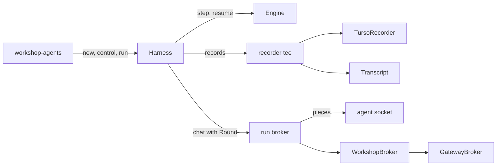

# Changes 7 to 9: a Harness per run, streaming in the broker, and a runtime-agnostic Harness

<product-contract>

## Product Requirements

The Harness still serves Workshop's agent window. One long-lived Harness keeps a table of chat sessions, each session cancels and relaunches its run on Stop, the session relays streamed pieces through its own channel, and every effect runs on a tokio task. This plan finishes the effort to move I/O out of the Harness in one pass: each run gets its own Harness instance, Workshop takes over conversations, the Host's broker takes over streaming and model swaps, and the Harness drops tokio so a Host can await a run on any executor.

- Problem and users:
  - Team developers working on the Harness and its Hosts: Workshop, and `paperweight` in the wg21-paperflow repository, a one-shot CLI that pins promptforge as a submodule at a commit before changes 1 to 5.
  - This plan covers changes 7 to 9 of a nine-change effort that moves I/O out of the Harness. Changes 1 to 6 have landed:
    - change 1, `Vfs` effects answered inline (`vibe/2026-10-01-2-store-to-vfs-inline.md`);
    - change 2, the Host-supplied `RunRecorder` (`crates/harness-internal/runner/src/recorder.rs`), with Workshop's `TursoRecorder` in `crates/workshop/run-log`;
    - change 3, the closed model-failure vocabulary (`CompletionErrorKind`, `crates/promptforge-internal/model-client/src/model/error.rs`);
    - change 4, `harness-gateway-client` (`vibe/2026-10-02-1-gateway-client.md`);
    - change 5, host services and `harness-web` (`vibe/2026-10-02-2-host-services.md`);
    - change 6, the Host-supplied `InferenceBroker` (`vibe/2026-10-02-4-inference-broker.md`).
  - Sessions live in `crates/harness-internal/sessions`: the session table (`src/runtime.rs`), the supervisor and its reducer (`src/session/supervisor.rs`, `src/transition.rs`, `src/transition-interrupt.rs`), the in-memory transcript and reply stamps (`src/session-transcript.rs`), input waits (`src/input.rs`, `src/input-tool.rs`), discovery (`src/discovery.rs`), and the built-in agent (`agents/chat.md`).
  - Stop cancels the whole run and relaunches it (`Session::cancel` in `src/session.rs`, `src/lifecycle.rs`, `src/transition.rs`). The relaunched `chat` starts its Lua `history` empty (`agents/chat.md:33`), so the model forgets the conversation while Workshop still shows it (DEBT-UPM-03, `vibe/2026-09/2026-09-10-2-debt-fixes.md:122-127`).
  - A model picked in Workshop's dropdown reaches a running chat only through that relaunch, so switching models costs the conversation.
  - The Harness can launch only an agent named by a file stem in a configured folder (`HarnessConfig.agents_path`, `Harness::discover`, `LaunchRequest.agent` in `crates/harness-internal/sessions/src/runtime.rs` and `src/discovery.rs`). It reads the file itself (`prepare_run`, `crates/harness-internal/runner/src/prepare.rs:216-227`). A Host that already holds a prompt must write it into a temporary agents folder first: `paperweight` does exactly that (wg21-paperflow `crates/paperweight/src/app.rs:170-185`).
  - Streaming crosses every layer: the Engine marks rounds with `stream: bool` on `Effect::Chat` (`crates/promptforge-internal/engine/src/execute/run/effect.rs:62-78`, set in `scheduler/chat.rs` and `scheduler/dispatch.rs`), the runner hands brokers an `OnDelta` (`crates/harness-internal/runner/src/performers.rs:47`), the session relays pieces on a broadcast channel (`Session::subscribe_deltas`), and it numbers replies by counting events (`reply_stamp`, `src/session-transcript.rs`).
  - Model labels disagree: `EffectRecord::Chat.model` names the launch binding (`effect.rs:142`), while reply events and `ChatAnswerRecord.model` use whatever name the backend's reply reports (`crates/promptforge-internal/engine/src/execute/support.rs:93`, `effect.rs:346`). The Gateway relays the backend's body unchanged, so that name can be a dated id or a llama-server alias rather than the catalog name.
  - tokio remains in the Harness: the effect loop spawns a task per effect and collects answers on a channel (`crates/harness-internal/runner/src/effect_loop.rs`, `src/spawn.rs`), the runner sleeps on `TokioTimer` (`src/performers-builtin.rs`), preparation reads prompt files with `tokio::fs` (`src/prepare.rs:221`), and the facade exposes a tokio cancel module that only its own docs and tests use (`src/cancel.rs`, `harness::cancel`).
  - Debt carried into this work, with ids from `vibe/2026-10-02-3-debt-removal.md`:
    - The built-in `chat` agent requires `promptforge/web`, which only `harness-web`, above the Harness, supplies (D1-1).
    - A recorder failure after `begin_run` drops the run from the session's `run_ids` and transcript (D1-5).
    - `CapabilityRegistry` derives a `Clone` that nothing uses.
    - The Harness builds its own input broker per run and exposes `RunServices::insert_input_broker`, whose parameter type outside crates cannot name.
    - `harness-web` spawns fetches onto the Host's runtime without a tag.
- Goals:
  - The Host builds one Harness instance per run from its recorder, inference broker, timer, capability registry, and services, runs one prompt given as text over a VFS the Host supplies, and gets back a report holding the outcome and the declared output.
  - The Host can stop the work in flight and keep the run going, and can cancel the run.
  - Workshop owns conversations, reattach, input waits, agent discovery, the built-in `chat` agent, and failure reports.
  - The Host's broker can swap the model between rounds, and every record names the model the broker routed each round to.
  - Streaming happens inside the Host's broker, which hands pieces to the Host's own consumers. A headless Host's broker returns each reply whole.
  - The `harness` facade and every `crates/harness-internal` crate are runtime-agnostic, and a run completes on any executor.
- Non-goals:
  - Splitting preparation from the run so gaps return as data before the run starts.
  - Redesigning `ui()` or the fields of `HostSnapshot`.
  - Rebinding a model role inside the Engine, or changing the precheck's context window after a swap.
  - Replay or resume of a recorded run.
  - Workshop UI code: the agent wire frames keep their names and fields.
  - Gateway changes, and `paperweight`'s code or pin.
- Success criteria:
  - The Harness receives every prompt as source text in `RunRequest.source`.
  - `crates/harness-internal/sessions` is deleted. The facade exports exactly the items listed under File and public API changes, and `Harness` offers `new`, `control`, and `run`.
  - In Workshop, a `cancel` frame on the agent socket during a model round returns `chat` to its question, and the next round's request holds every earlier turn. The integration suite proves this through the socket, which is Stop's entry point until the agent window gains a Stop control (`cancelTurn`, `crates/workshop/ui/src/services/agent-socket.ts:187-188`).
  - In Workshop, picking another model between turns sends the next round to it, and that round's reply event and answer record name it.
  - Workshop's agent window still streams replies, with unchanged `agent_delta` and `agent_event` frames.
  - `promptforge`'s public API carries rounds as `Effect::Chat.round`, and `StreamDelta` lives in `harness-gateway-client`.
  - `cargo tree -e normal` shows tokio only under Host-side crates (`harness-gateway-client`, `harness-web`, and Workshop), and a Harness test completes a run on its own thread under a thread-parking `block_on` written in the test, as `crates/promptforge/src/cancel.md:127-145` writes one. The test builds on the workspace's existing dependencies.
  - The exit criteria in the Testing Plan pass.
- Constraints:
  - Product boundaries (`crates/build-xtask/src/product.rs`): `harness-internal` crates depend only on `promptforge` and their siblings; `harness-gateway-client` and `harness-web` depend on `harness`, `promptforge`, and third-party crates, and sit above every `harness-internal` crate.
  - The Workshop tier graph (`crates/build-xtask/src/tidy.rs:26-47`): a feature crate may depend on vocabulary and service crates and on non-Workshop crates such as `harness`, never on another feature crate. `workshop-agents` therefore never names `workshop-run-log`.
  - Files in `harness-*` and `workshop-*` crates stay at or under 500 lines. New tests follow the sibling `<stem>-tests.rs` convention.
  - Every Engine public API change is regenerated into `crates/promptforge/public-api.txt` with `cargo +nightly-2026-09-05 xtask api --bless` and checked with `--check`.
  - Record, event, and run-metadata shapes change in place, and every reader changes with them, because every recorded run so far is disposable.
  - Gateway client messages, error kinds, deadlines, headers, bearer redaction, and body bounds stay as they are.
- Open questions: None

## Functional Specification

A Host builds a Harness for each run, takes a control handle from it, and awaits the run future, which it may spawn on any executor. The Harness resolves the launch model through the broker, puts the input in place, prepares the prompt, writes every record to the Host's recorder, drives the run, and returns a report. Stop drops the work in flight and keeps the run; cancel ends it. Workshop keeps each conversation, its transcript, its questions to the operator, and its streamed pieces in a new Workshop crate, and its broker swaps models per round.

- Actors and workflows:
  - A Host calls `Harness::new(recorder, broker, timer, capabilities, services)`, then `harness.control()` for a cloneable `RunControl`, then awaits `harness.run(request)`. The run future is `Send`, so a Host may spawn it.
  - `RunRequest` holds the run's name, the prompt's source text, the argument text, the optional input text, the VFS, and a `HostSnapshot`. The name becomes every event's `execution` and the run metadata's `name`. The Harness parses the source text, records the parse events, and records a parse failure as a failed run.
  - The Harness resolves the launch model as today: the snapshot's selection in `broker.models()`, or with no selection the catalog's first model. It then puts the input in place at the prompt's declared `input:` path, prepares, records, drives the run, and reads the declared `output:` file.
  - Workshop launches an agent by name, a Workshop-only feature. Its agent menu (`crates/workshop/ui/src/parts/agent/agent-menu.ts`) lists the `.md` files in Workshop's own agents folder setting (`AgentsConfig.path`, `crates/workshop/support/src/config.rs:160`) plus the built-in `chat`. `workshop-agents` accepts only names the menu lists (the check `Harness::launch` makes today), reads the chosen file into text, mints a conversation id that becomes the run's name, and builds the run's pieces:
    - a recorder that writes to `TursoRecorder` and adds each recorded event to the conversation's transcript;
    - a per-run broker that streams the conversation's pieces;
    - its input broker, registered under `INPUT_BROKER` in the run's services.

    The server spawns the run on its tokio runtime.
  - Workshop's agent socket reattaches by conversation id and replays the transcript from an index.
    - The socket's `cancel` frame (`crates/workshop/server/src/agents/socket.rs:272-285`) calls `RunControl::stop_round`.
    - Workshop's explicit close (`AgentSessions::close`, `crates/workshop/server/src/agents.rs:224-231`) calls `RunControl::cancel`.
    - Disposing the agent panel only drops the WebSocket (`agent-socket.ts:114-120`) and leaves the conversation running for reattach, as today.
  - For each model round, the Harness passes the broker a `Round` that holds the round's id and whether it is a section's own round or a nested `models.infer`.
    - Workshop's per-run broker streams pieces only for a section's own round, stamped with that round id.
    - The Engine stamps the same round id on that round's thinking, reply, and tool-call events.
    - Workshop's wire `reply` field carries that id, so the agent window swaps its pending pieces for the finished event as it does today.
  - At each round, Workshop's broker reads the dropdown's current pick. When the pick differs from the model the round's options name, it sends the round to the pick instead. `GatewayBroker` labels every completion with the model name it sent on the wire.
- Inputs and outputs:
  - The record stream still holds effects, answers, and events, with these shape changes:
    - `EffectRecord::Chat` loses `model` and gains `round`.
    - The thinking, reply, and tool-call events gain `round`.
    - `ChatAnswerRecord.model` and every event's `model` name the model the broker routed the round to.
  - `RunMeta.session_id` becomes `name`, and `RunMeta.agent` is removed. Workshop's per-run recorder knows which agent it launched and writes that to its own run-log column itself.
  - `RunReport` holds the run id when the recorder began the run, the `RunOutcome`, and the declared output text or the `OutputError` that explains its absence.
  - Streamed pieces stay inside the Host: the broker hands them straight to the Host's consumers.
- States and validation:
  - `stop_round` drops every effect in flight except a question to the operator (a `ToolCall` to `promptforge/user-input/ask`): chat rounds, other tool calls, and timers. The run's cancel flag stays clear. `Vfs` effects are answered inline as they are issued.
    - The Engine hands a dropped effect's waiting Lua the error directly (`crates/promptforge-internal/engine/src/execute/scheduler/apply.rs:35-43`, `:63-101`). The record holds the effect and its `Dropped` answer, the turn count and the usage anchor keep their values, and Workshop's transcript continues at the next question, as it does after a Stop today.
    - The waiting Lua gets the Engine's `Interrupted` error: kind `cancelled`, message "interrupted by Ctrl-C" (`crates/promptforge-internal/engine/src/error.rs:98`).
    - The `pcall` shim re-raises only when the run is cancelled (`crates/promptforge-internal/lua/src/__impl_coro.lua:74-77`), so `chat`'s `pcall` (`agents/chat.md:37`) catches the error and returns to `input.ask()` with its history intact.
    - `models.loop` passes the error up to the prompt. A prompt that catches it with `pcall` continues, and one that leaves it uncaught ends as `Cancelled`.
    - With only a question in flight, `stop_round` leaves the question open and the run waiting on it. Today the same Stop cancels the question and asks again after the relaunch.
  - `cancel` sets the run's cancel flag, drops every effect in flight including questions, and ends the run as `Cancelled` unless it had already ended.
  - A swap applies from the next round. A round already in flight finishes on its model.
  - After a swap, the precheck still uses the launch model's context window. The usage anchor stays keyed by the launch binding, so the first round after a swap may anchor on the previous model's counts.
  - When the pick's context window is smaller than the launch binding's, Workshop's broker logs a warning naming both windows and still sends the round. The split between the launch model and the pick is logged as debt under Deferred.
  - Lua's `sys.model` and model handles keep naming the launch binding, because they describe the prompt's model slot (`crates/promptforge-internal/lua/src/sys.rs:140`, `models-userdata.rs:57`).
  - The run's `HostSnapshot` is fixed at launch. Granted roots reach a prompt as `ui().workspace_root` (`crates/harness-internal/sessions/src/environment.rs:21-39`), and Workshop's agent runs use an empty in-memory VFS (`crates/harness-internal/sessions/src/session/files.rs:72-73`), so file access is the same before and after a revoke. A revoke reaches the next conversation's snapshot, and a running conversation keeps its launch snapshot. Today a revoke reaches a running chat through Stop's relaunch (`crates/workshop/server/tests/it/agents/revoke.rs:92-105`).
  - The agent window starts its settled reply id at `-1` (`crates/workshop/ui/src/services/agent-session.ts:159`), so Engine round ids starting at 0 work with the UI as it is.
- Errors and recovery:
  - `run` returns `Ok(RunReport)` for every run the recorder could end, including a parse failure, an input staging failure, a refused prompt, and a cancel during model resolution. In that last case `run_id` is `None` and the outcome is `Cancelled`.
  - `run` returns `Err(HarnessError)` in three cases. `Model` means model resolution failed before the run began. `Recorder` means the recorder refused a write; it holds the run id when one was issued, and the records the Host's recorder accepted are the run's history so far. `Stalled` means the run is pending while every effect it issued has been answered.
  - A performer that panics answers its effect `Dropped`, and the panic is logged.
  - Workshop refuses an unknown agent, or a launch with no usable gateway, with today's refusal texts.
- Security and privacy behavior:
  - The Gateway URL and key stay in Workshop and `harness-gateway-client`.
  - Streamed pieces stay in the Host.
  - Bearer redaction, control escaping, and body bounds stay inside `harness-gateway-client`.
- Acceptance criteria:
  - The success criteria hold.
  - Stop during a tool call inside `models.loop` returns `chat` to its question.
  - Stop with only a question open leaves that question open.
  - A cancel with a question open ends the run, and Workshop drops that prompt.
  - A completion whose body names another model, or none, is labeled with the model name the broker sent.

</product-contract>
<implementation-contract>

## Technical Design

The Harness becomes a per-run object over the runner. It holds the Host's recorder, broker, timer, registry, and services, offers a runtime-agnostic control handle, and drives one run as a single future. The record stream carries every event a Host sees. The Engine gains round ids and hands its streaming type to `harness-gateway-client`, which labels completions with the model it routed to and streams pieces to a caller that asks for them. A new Workshop crate, `workshop-agents`, takes the conversation layer; `workshop-server` keeps the socket, status, and broker glue.



- Architecture:
  - One Harness per run, and each run owns its state. A Host shares its recorder, broker, timer, and services behind `Arc`s and clones its `CapabilityRegistry` for each run, so the registry's `Clone` is used.
  - The effect loop is one future:
    - Effects in flight sit in a `FuturesUnordered` as `Abortable` futures under `catch_unwind`, each keyed by its effect id, provenance, and whether it is a question to the operator.
    - The loop waits on the next answer, the Engine cancel handle's `cancelled()`, and the stop signal together, with runtime-agnostic combinators from `futures-util`.
    - Cancel and stop abort the chosen futures and answer each effect `Dropped`. The loop polls every effect inside the run's own future.
    - Performers must not block while polled. A performer that blocks stalls every other effect of the run and the stop and cancel arms with it, where today it ties up only its own task. A performer with blocking or CPU-heavy work hands it to the Host's own runtime, as `harness-web` does with its fetches (`crates/harness-web/src/fetch.rs:375`).
  - `RunControl` holds a clone of the run's Engine `CancelHandle` and a stop flag with an `AtomicWaker`, built from `std` and `futures-util` types.
  - `drive_run` drops its event `sink` parameter, and a Host sees events through its recorder.
  - The Engine numbers rounds in each run in dispatch order. A chain holds its round's id until the answer arrives, then stamps it on that round's events.
- Modules and interfaces:
  - Harness, in `harness-runner` and re-exported from the facade:

    ```rust
    pub struct Harness { /* recorder, broker, timer, capabilities, services, control */ }

    impl Harness {
        pub fn new(
            recorder: Arc<dyn RunRecorder>,
            broker: Arc<dyn InferenceBroker>,
            timer: Arc<dyn Timer>,
            capabilities: CapabilityRegistry,
            services: HostServices,
        ) -> Harness;
        pub fn control(&self) -> RunControl;
        pub async fn run(self, request: RunRequest) -> Result<RunReport, HarnessError>;
    }

    #[derive(Clone)]
    pub struct RunControl { /* cancel handle, stop flag and waker */ }
    impl RunControl {
        pub fn stop_round(&self);
        pub fn cancel(&self);
    }

    pub struct RunRequest {
        pub name: String,
        pub source: String,
        pub args: String,
        pub input_text: Option<String>,
        pub vfs: VfsRef,
        pub host: HostSnapshot,
    }

    pub struct RunReport {
        pub run_id: Option<RunId>,
        pub outcome: RunOutcome,
        pub output: Result<String, OutputError>,
    }

    pub enum HarnessError {
        Model(CurrentModelError),
        Recorder { run: Option<RunId>, source: RecorderError },
        Stalled,
    }

    pub trait InferenceBroker: Send + Sync {
        fn models(&self) -> BoxFuture<Result<ModelCatalog, CompletionError>>;
        fn chat(
            &self,
            binding: ModelBinding,
            messages: Vec<Message>,
            tools: Vec<ToolSchema>,
            options: CompletionOptions,
            round: Round,
        ) -> BoxFuture<Result<Box<Completion>, CompletionError>>;
    }

    pub trait Timer: Send + Sync {
        fn sleep(&self, seconds: f64) -> BoxFuture<()>;
    }
    ```

    `HarnessError`, `RunReport`, and `RunRequest` are `#[non_exhaustive]` where the crate's conventions call for it. `HostSnapshot`, `current_model`, and `CurrentModelError` move from `harness-sessions/src/environment.rs` to the runner. `OutputError` moves from `harness-sessions` to the runner beside `files.rs`. Its `Unfinished` variant describes a session whose run is still going (`crates/harness-internal/sessions/src/session/files.rs:24-47`), so on a report it becomes `NotCompleted`: the report reads the output file of a completed run and reports `NotCompleted` for every other outcome. `Timer` replaces `TimerPerformer`, and `TokioTimer` is deleted.
  - Engine:

    ```rust
    pub struct RoundId(u64);                                  // promptforge::ids
    pub struct Round { pub id: RoundId, pub origin: ReplyOrigin } // promptforge::effect
    // Effect::Chat { binding, messages, tools, options, round: Round }
    // EffectRecord::Chat { alias, round: RoundId, invocation fields, messages, tools }
    // Event::Thinking, AssistantReply, AssistantToolCalls each gain round: RoundId
    impl Completion { pub fn with_model(self, model: impl Into<String>) -> Completion; }
    impl CompletionOptions { pub fn with_model(self, model: impl Into<String>) -> CompletionOptions; }
    ```

    `StreamDelta` leaves `promptforge-types` (`crates/promptforge-internal/types/src/wire.rs:12-17`) and `promptforge::model`.
  - `harness-gateway-client`:
    - `StreamDelta` (`Text`, `Reasoning`) now lives here, used by `GatewayChat::complete`.
    - `GatewayBroker::chat_streaming(binding, messages, tools, options, on_piece: Arc<dyn Fn(StreamDelta) + Send + Sync>)` streams pieces to the caller. `impl InferenceBroker for GatewayBroker` returns the whole reply, which suits a headless Host.
    - Both label the completion with `options.model()` through `Completion::with_model`. Today the label comes from the response body (`crates/harness-gateway-client/src/wire/stream.rs:357`).
    - The metadata diagnostic "completion response named no string `model`; recorded as empty" (`wire/parse.rs:297-302`) says the label came from the request.
  - `workshop-agents`, a new tier-2 crate at `crates/workshop/agents`:
    - The conversation table, keyed by a Workshop-minted id.
    - A conversation's transcript, which numbers every event from zero and stamps `reply` from the event's round.
    - Conversation state (moved `SessionState`) and failure reports (moved `FailureKind` and `SessionFailure`), derived from `ModelTurnFailed` and `ToolCallFailed` events and the run report.
    - The input broker (moved `WaitRegistry`, `WaitFrame`, `WaitError`, and `SessionInputBroker`, implementing `InputBroker`). `InputBroker::wait` is a plain async method over `std` types (`crates/harness-internal/capabilities/src/input.rs:40-46`).
      - Workshop clones its base `HostServices` for each run and calls `provide(&INPUT_BROKER, broker)` on the clone.
      - `provide` refuses a duplicate (`crates/harness-internal/capabilities/src/service.rs:177-190`), and `insert` is crate-private, so the base services leave `INPUT_BROKER` for the per-run clone to fill.
    - Conversation channels that close when the conversation ends, so the status reporter, which ends when its channels close (`crates/workshop/server/src/agents/status.rs:44-58`), ends with it.
    - A recorder tee implementing `RunRecorder` over an inner `Arc<dyn RunRecorder>`. `workshop-server` passes `TursoRecorder` as the inner recorder and writes the run log's `agent` column, because `workshop-run-log` is a feature crate beside `workshop-agents`.
    - Discovery over the agents folder, and the built-in `agents/chat.md`.
    - `TokioTimer`.
  - `workshop-server` (`crates/workshop/server/src/agents*`):
    - `agents.rs` builds each run's Harness and spawns `run` on tokio.
    - `agents/broker.rs`: `WorkshopBroker` substitutes the dropdown's current pick per round with `CompletionOptions::with_model` and gains a streaming method over `chat_streaming`. A new per-run broker streams a section's own rounds into the conversation.
      - It reads the pick from the menu the way `agents/bindings.rs:30-39` builds the snapshot: `menu().latest().selected_model`.
      - It substitutes only the `CompletionOptions` it hands `GatewayBroker`, and `build_request_body` stays the one place that shapes a request body.
      - Today the broker reads the menu only to wait for a chat-capable model (`agents/broker.rs:94-100`).
      - When the pick's window in the menu's catalog (`ModelDescriptor::context`) is smaller than the window `binding` holds (`ModelBinding.context`, the launch model's), it logs a `tracing::warn!` with fixed phrases naming both windows. The comparison is a pure function with its own unit test.
    - `agents/socket.rs`, `socket_frames.rs`, and `status.rs` read the conversation instead of `Session`. Stop maps to `stop_round`, and close maps to `cancel`.
    - The launch reads the current pick and granted roots into the request's `HostSnapshot`, replacing the `set_host` push in `agents/bindings.rs`.
- File and public API changes:
  - Delete `crates/harness-internal/sessions` and its workspace member. Move its surviving code and tests into `workshop-agents` or the runner as listed above.
  - Facade `crates/harness/src/lib.rs`:
    - Exports `Harness`, `RunControl`, `RunRequest`, `RunReport`, `HarnessError`, `HostSnapshot`, `CurrentModelError`, `OutputError`, `InferenceBroker`, `Timer`, `BoxFuture`, `display_chain`, and `USER_INPUT_ASK_TOOL`.
    - `capability` adds `InputBroker`, `InputError`, and `INPUT_BROKER`.
    - `record` keeps its items, with `RunMeta`'s renamed fields.
    - `vfs` keeps its items: `Origin`, `VfsError`, and `VfsRef`.
    - The `cancel` module and `cancel.md` go.
  - `crates/harness-internal/capabilities`: delete `RunServices::insert_input_broker`. A Host supplies its input broker through `HostServices` under `INPUT_BROKER`.
  - Performer trait docs: `InferenceBroker` and `Timer` in the runner, and `Tool` (`crates/harness-internal/capabilities/src/tool.rs:87-93`) and `InputBroker` (`src/input.rs:33-38`) in capabilities, state that a performer must not block while polled. `Tool`'s "must not panic (a panic unwinds the run)" becomes "must not panic (a panic answers its effect `Dropped` and is logged)".
  - `crates/harness-internal/runner`: delete `src/spawn.rs`, `src/cancel.rs`, `TokioTimer`, `prepare_run` and its file read with `PrepareError::Read`, `Services.input`, `Services.on_delta`, `Services.agent`, the effect loop's answer channel and `Answering` guard, and the `tokio` and `tokio-util` dependencies. `Services.session_id` becomes `name`. Add `futures-util`.
  - `HarnessConfig`, `agents_path`, `Harness::discover`, and `LaunchRequest.agent` leave with `harness-sessions`. `RunRequest.source` is the Harness's one prompt input.
  - `promptforge` public API: the Engine items above, regenerated into `crates/promptforge/public-api.txt`.
  - `crates/workshop/run-log`: its `session_id` column becomes `name`. Its `agent` column stays, filled by Workshop's per-run recorder from the agent it launched rather than from `RunMeta`. The sites are the schema (`src/schema.rs:19-22`, `:48-50`, `:71-74`), the reader (`src/read.rs:22-24`), and the meta assertions in `crates/workshop/server/tests/it/agents/lifecycle.rs:229-231`.
  - `crates/build-xtask/src/harness_bans.rs`: replace the spawn ban with a ban on `tokio` and `tokio-util` as normal dependencies of `harness` and every `crates/harness-internal` crate.
    - Today the check scans each crate's `clippy.toml` for the `tokio::spawn` and `spawn_blocking` entries (`harness_bans.rs:18-19`, `:63-102`). The new one parses `Cargo.toml` dependency tables.
    - Its live test (`harness_bans-tests.rs:152-174`) names the sessions crate and is rewritten.
    - Remove the tokio entries from `crates/harness-internal/runner/clippy.toml:11-14` and `crates/harness-internal/capabilities/clippy.toml:11-13`. The runner's entries lack `allow-invalid`, so clippy rejects them once tokio leaves the runner's dependencies.
  - New crate `workshop-agents`:
    - Scaffold it with `cargo xtask new-crate workshop-agents` (`crates/build-xtask/src/new_crate.rs:13-28`).
    - Add it to the root `Cargo.toml` `members` and `[workspace.dependencies]`, which list Workshop crates explicitly.
    - Add `("workshop-agents", "agents")` to the feature tier in `crates/build-xtask/src/tidy.rs:41-45`.
    - Its crate doc opens with `## Invariants` and writes Engine, Harness, and Host capitalized, which `crates/workshop/ui/test/docs-claims.mjs` checks. Its Invariants list its tier as feature and its dependencies as the vocabulary and service crates, `harness`, `promptforge`, and third-party crates.
  - Rule files and docs that the new crate makes false, changed in the Workshop step:
    - Delete the `Tiers:` bullet at `.cursor/rules/workshop-architecture.mdc:12`.
    - Delete "Repository policy binds plans." from root `AGENTS.md:40`, keeping the rest of the line.
    - In `crates/build-xtask/src/tidy.rs:38-40`, the `FEATURES` doc comment drops "The sessions subsystem sits inside the server since Workshop moved onto the Harness, so it has no crate here."
    - In `crates/workshop/server/src/lib.rs:28-36`, the `Tier: server` Invariant adds `workshop-agents` to the feature crates, and the module doc at `:11-17` names `workshop-agents` as the conversation layer.
- Data, persistence, failure, security, and privacy constraints:
  - Record order is unchanged: a step's events reach the recorder before its effects start, and every effect gets exactly one answer, `Dropped` included.
  - The record and event shape changes above replace the old shapes outright.
  - A recorder failure stops the run and returns `HarnessError::Recorder` with the run id.
  - Gateway URLs and keys stay inside Workshop and `harness-gateway-client`, and every message uses fixed phrases.

</implementation-contract>
<verification-contract>

## Testing Plan

Each behavior that moves keeps its tests in its new home, and the session suite becomes Workshop-agents and runner tests. New tests pin the per-run contract (report, stop, cancel, errors), round ids from Engine to wire, routed-model labels, broker-only streaming, and a run on a plain thread-parking executor. Workshop's integration suite proves that a conversation keeps its history across a Stop and that a swap reaches the next round.

- Unit:
  - Engine:
    - Round ids increase in dispatch order across chat and nested-infer rounds.
    - The thinking, reply, and tool-call events of a round carry the id its `Effect::Chat` held, and a nested infer round's `Round` has origin `Infer`.
    - `EffectRecord::Chat` serializes `round` and the slot's alias as the round's identity.
    - `Completion::with_model` and `CompletionOptions::with_model` replace the name, and the reply event's `model` follows `Completion::model`.
    - Rewrite `a_chat_round_streams_its_deltas_to_the_harness` and `a_nested_infer_round_streams_no_deltas_to_the_harness` (`crates/promptforge-internal/engine/src/execute/tests/effects.rs`) to assert each round's origin and id.
    - New, beside `a_dropped_answer_resumes_a_waiting_chain_with_the_cancelled_error` (`crates/promptforge-internal/engine/src/execute/run/tests.rs:250-262`), which covers a `Vfs` effect. A `Chat` effect and a `ToolCall` effect dropped while the run's cancel flag is clear:
      - resume a `pcall` with the cancelled error and let the run continue;
      - leave the record holding the effect and its `Dropped` answer, with the turn count unchanged;
      - end the run as `Cancelled` when uncaught.
  - `harness-runner`, with scripted brokers and timers:
    - `run` returns the declared output and the outcome.
    - `stop_round` drops a chat round and a tool call in flight, a `pcall` around them keeps the run alive, and an uncaught drop ends it `Cancelled`.
    - `stop_round` leaves a question to the operator open, and `cancel` drops it.
    - A `models()` failure returns `HarnessError::Model`, and a cancel during `models()` returns `Ok` with `run_id: None` and `Cancelled`.
    - A recorder failure returns `HarnessError::Recorder` holding the issued run id.
    - `RunMeta` carries the request's name, records arrive in the order they do today, and a panicking broker answers `Dropped`.
    - Source text that fails to parse ends as a recorded failed run, with its parse events recorded.
    - One run completes on the test's own thread under a thread-parking `block_on` in the test.
    - `stop_round` drops a timer in flight. A `Vfs` effect is answered inline as it is issued.
  - `harness-gateway-client`:
    - `chat_streaming` hands pieces to its callback in wire order, and the `InferenceBroker` path returns the whole reply.
    - Every completion is labeled with `options.model()`, including when the body names another model or none.
  - `workshop-agents`:
    - The moved input tests (`crates/harness-internal/sessions/src/input-tests.rs`), discovery tests, and transcript tests.
    - The tee adds an event to the transcript after the inner recorder accepts it, and returns the inner recorder's failure when it refuses one.
    - Failure reports derive from recorded `ModelTurnFailed` and `ToolCallFailed` events and from a failed or cancelled report.
  - `workshop-server`: the window comparison in `agents/broker.rs` warns when the pick's context window is smaller than the binding's, and not when it is equal or larger.
  - `build-xtask`: the changed ban rejects a fixture manifest with tokio as a normal dependency of a `harness-internal` crate and accepts it as a dev-dependency; the tier test covers `workshop-agents`.
- Integration and end-to-end:
  - The facade's `crates/harness/tests/suite/broker.rs` and `launch.rs` become per-run tests: a section's round reaches the broker with origin `Chat` and a nested infer round with `Infer`; a run over a prompt string reports its output.
  - The facade doc pages are rewritten around the per-run API, each with a hidden offline broker and a hidden tokio-backed `Timer`:
    - `crates/harness/src/lib.md` tours: run a prompt; answer the operator by supplying an input broker; stop a round and cancel a run; stream from your own broker.
    - `vfs.md`, `record.md`, and `capability.md` are updated for the per-run API.
  - Checkpoint after the per-run step: with `harness-sessions` rebuilt over the per-run Harness and before any Workshop test is rewritten, `cargo nextest run --locked -p workshop -p workshop-server -p workshop-server-api` and `cargo nextest run --locked -p workshop-server --features headless` pass with test changes only for the `InferenceBroker` signature. The `harness-sessions` suite passes too, changed only where it built runs through `prepare_run` or read the delta sink.
  - Workshop (`crates/workshop/server/tests/it/`):
    - Rewrite `gate_cancel_mid_generation_returns_to_waiting_and_next_input_works` (`chat_gate/overload.rs`) so the next round's request contains the earlier turns.
    - Replace `a_turn_cancel_relaunches_as_a_second_run_with_indices_continuing` with Stop keeping one run while indices continue.
    - New: picking another model between turns sends the next round to it, and the reply event names it.
    - `a_full_turn_streams_deltas_and_indexed_events_sharing_the_reply_id` (`agents/turns.rs`) passes with reply ids from Engine rounds.
    - A reattach replays the transcript from an index.
    - Closing with a question open sends `Cancelled` for it.
    - The refusal tests keep their texts.
    - Rewrite the tests that assert relaunch behavior:
      - The model-switch gate in `chat_gate/lifecycle.rs:11-53` expects the binding frozen until a cancel relaunch. It becomes the per-round substitution test above.
      - `agents/revoke.rs:48-106` relaunches with a cancel to see `launch@nil`. It becomes: a revoke reaches the next conversation's `ui()`, and a running one keeps its launch snapshot.
      - The mid-wait cancel in `agents/turns.rs:134-163` expects `input_cancelled`, then a fresh `input_required`. It becomes: a `cancel` frame with only a question open leaves that question open, and its original token still answers it.
      - `crates/workshop/server/src/agents/tests.rs`, which reads `subscribe_state` and `run_ids` (`:79`, `:87`), reads the conversation's state instead.
      - `agents/replacement.rs` and `chat_gate/recovery.rs` assert `run_ids` has one entry, which now holds by construction. They assert the conversation's single run instead.
    - Every other `chat_gate` and `agents` test passes on the new launch path or is rewritten to it.
  - Workshop UI: `crates/workshop/ui/test/agent-session-service.mjs` and `agent-wire-fixtures.mjs` pass unchanged.
- Regression, security, and performance:
  - Retire the session-only tests: `src/transition-tests.rs`, `src/session-tests.rs` reply-stamp cases, `src/session/run-tests.rs` delta cases, `crates/harness-internal/runner/tests/it/spawn.rs`, and the runner's `cancel.rs` tests.
  - Gateway chat, catalog, and search message and kind tests pass, changed only for the moved `StreamDelta` and the labels.
  - Every literal builder of the three reply events gains `round`:
    - `crates/promptforge-internal/types/src/emitter.rs` and `event-tests.rs`;
    - `crates/promptforge-internal/engine/src/test_support/recording/forward.rs`, `forward-tests.rs`, and `forward-tests-variants.rs`;
    - `crates/workshop/run-log` (its `fidelity` test);
    - the Workshop server's `wire-tests.rs` and `status-tests.rs`.
  - Workshop's broker and refusal messages use fixed phrases.
  - From the repository root, each leftover search returns an empty result:
    - `rg -n '\b(Session|SessionId|SessionEvent|SessionState|SessionFailure|FailureKind|LaunchRequest|LaunchOptions|LaunchError|HarnessConfig|DeltaKind|OnDelta|WaitFrame|subscribe_deltas|insert_input_broker|TokioTimer|spawn_tagged)\b' crates/harness crates/harness-internal`
    - `rg -n 'StreamDelta|stream: (true|false)' crates/promptforge crates/promptforge-internal`
    - `rg -n '\b(agents_path|discover|prompt_path|prepare_run)\b|read_to_string' crates/harness/src crates/harness-internal --glob '*.rs' --glob '!**/tests/**' --glob '!*-tests.rs'`
    - `rg -n '^tokio|^tokio-util' crates/harness/Cargo.toml crates/harness-internal --glob Cargo.toml`, where only `[dev-dependencies]` lines may remain.
- Exit criteria:
  - `cargo fmt --all --check`
  - `cargo clippy --workspace --exclude workshop --exclude workshop-server --exclude workshop-server-api --all-targets --all-features -- -D warnings`
  - `cargo clippy -p workshop -p workshop-server -p workshop-server-api --all-targets -- -D warnings`
  - `cargo nextest run --locked --workspace --exclude workshop --exclude workshop-server --exclude workshop-server-api --all-features`, then `cargo test --workspace --exclude workshop --exclude workshop-server --exclude workshop-server-api --all-features --doc`
  - `cargo nextest run --locked -p workshop -p workshop-server -p workshop-server-api`, then `cargo test --doc -p workshop -p workshop-server -p workshop-server-api`
  - `cargo nextest run --locked -p workshop-server --features headless`, which CI runs (`.github/workflows/ci.yml:207-208`), and `cargo nextest run --locked -p workshop-agents`
  - With `RUSTDOCFLAGS` set to `-D warnings`: `cargo doc --workspace --no-deps --all-features --exclude workshop --exclude workshop-server --exclude workshop-server-api`, `cargo doc -p harness --no-deps`, and `cargo doc -p promptforge --no-deps`
  - `cargo +nightly-2026-09-05 xtask api --check` after the listing is blessed
  - `cargo test -p build-xtask`, `cargo hakari verify`, and `node --test crates/workshop/ui/test/docs-claims.mjs`
  - From `crates/workshop`: `npm run build --workspace ui`, then `npm test --workspaces --if-present`
  - Manual, in Workshop:
    - A chat streams a reply.
    - Pick another model and send: the reply comes from the new model, its label shows the new name, and the run log names it.
    - A prompt declaring `promptforge/web` searches and fetches.
    - Closing the panel and reopening it reattaches to the same conversation.
  - The integration suite proves Stop and close through their entry points today: the socket's `cancel` frame and Workshop's explicit close.

</verification-contract>
<decision-record>

## Decision Record

- Decisions:
  - Changes 7, 8, and 9 ship as one plan. The streaming work builds on the per-run Harness, so each run's own broker identifies the run and the round context holds the round id and origin. The operator chose "One plan covering 7, 8, and 9, where the streaming work builds on the per-run Harness, so its round context needs only a round id and whether the round is user-facing" (2026-10-03).
  - A model swap is broker substitution. The binding and the precheck window stay those of the launch model. The operator chose "The broker serves the Host's current pick under the launch binding. No Engine change, but the precheck keeps the launch model's window" (2026-10-03).
  - Records name the routed model:
    - The broker labels every completion with the catalog name it routed the round to.
    - `EffectRecord::Chat` drops `model` and names only the slot.
    - Reply events and the answer record carry the routed name.

    The operator said "if the InferenceBroker changes models, the model label recorded by the harness/engine should record the new model name" and chose "The broker sets the name it routed the round to (the Host catalog's name, as the dropdown shows it) on every Completion; the effect record drops its model and names only the slot; reply events and the answer record name the new model. Adds Completion::with_model to the Engine" (2026-10-03).
  - The conversation layer moves into Workshop. The operator chose "Into Workshop, the only chat Host; the Harness keeps just prepare and run" (2026-10-03).
  - The Harness takes the prompt as source text. The operator said "The harness is supposed to receive the prompt as a string or a parsed Prompt object equivalent", then chose "Source text: the Harness parses it, records the parse events, and a parse failure is a recorded failed run" (2026-10-03).
  - Workshop's agents folder and agent menu stay as a Workshop-only feature. The operator chose "Keep the menu and folder as a Workshop-only feature: Workshop reads the file and hands the Harness the text" (2026-10-03).
  - One Harness instance per run. The operator said "My instinct tells me one harness instance per run" (2026-09-30).
  - Streaming lives only in the Host's broker. The operator said "the engine, the harness would not know anything about streaming. only the host, through the inference broker. and for headless hosts, they dont need to stream at all" (2026-09-30).
  - The run is one future that polls its effects on one thread, and synchronous VFS work runs inline. The operator said "async i/o on a single-threaded prompt is a beautiful design" and "its ok to block a little. what's 100ms really?" (2026-09-30).
  - Where a line in any `AGENTS.md` or workspace rule file conflicts with this plan, the plan wins, and the conflicting line is deleted in the commit of the step that creates the conflict. Workspace rule files are the `.cursor/rules` files in this repository and in the workspace that holds it. The operator said "if there are conflicts, the plan should win and it should be resolved by deleting the rule from the conflicting AGENTS.md file" and "if any AGENTS.md or workspace rule conflicts with the principle of the plan, the plan has priority and remove the AGENTS.md line or workspace rule" (2026-10-03).
    - A review of the 22 `AGENTS.md` files and the eight rule files (two in `promptforge/.cursor/rules`, six in the workspace's) against the revised plan found two conflicts. Both are deleted in the Workshop step, under its rule-file bullet:
      - `.cursor/rules/workshop-architecture.mdc:12`, the `Tiers:` bullet, ends "The `agents` subsystem has no crate of its own; it lives inside `workshop-server`." The whole bullet goes: `tidy.rs` enforces the tier list, and the operator prefers cutting stale rule lines to fixing them (`vibe/2026-10-02-2-host-services.md`).
      - Root `AGENTS.md:40` opens with "Repository policy binds plans.", the opposite of this decision. Only that sentence goes. The rest of the line, which requires the operator's explicit approval for new structural enforcement, stays, and this plan records that approval for the `harness_bans` change. The operator chose this knowing it applies to every later plan.
    - `## Invariants` blocks and code comments that the plan makes false are updated, not deleted, because `workshop-architecture.mdc` requires every `workshop-*` crate's Invariants to list what it may depend on. Both the deletions and these updates are listed under "Rule files and docs that the new crate makes false" in File and public API changes.
    - The rust rulebook (`tools-public/rulebooks/rust-rulebook.md:1063`, "Never block the executor", and `:1110`, `std::fs` inside an `async fn`) conflicts with the run future's inline VFS work, input staging, and output reads. It is a shared rulebook outside this repository, not a rule file, and stays unchanged. This plan records the exception: a review against the rulebook does not flag those three inline paths. Performers still follow the rulebook's rule. The operator chose "Leave the shared rulebook alone and record the exception in this plan" (2026-10-03).
  - Added during planning (2026-10-03) and accepted by approving this plan:
    - The conversation layer is a new tier-2 crate, `workshop-agents`, so its moved tests run on their own and `workshop-server` stays glue.
    - `stop_round` spares questions to the operator, so Stop while `chat` waits for input leaves the run waiting.
    - `RunControl` is runtime-agnostic from the start, so it survives the tokio removal unchanged.
    - The timer is a required `Harness::new` parameter, like the broker, so every run that sleeps has one.
    - `StreamDelta` moves to `harness-gateway-client`, its only producer.
    - `GatewayBroker` labels completions, so every Gateway Host gets routed labels.
    - The ban in `crates/build-xtask/src/harness_bans.rs` changes from spawns to dependencies, because the spawn ban turns vacuous once tokio leaves. Approving this plan approves that structural change.
  - Added during preflight against the source (2026-10-03) and accepted by approving this plan:
    - A revoke or a roots change reaches the next conversation, and a running conversation keeps its launch snapshot. Roots are `ui()` data, so file access stays as it was. A live `ui()` would need a new channel from the Host into a running run.
    - A `cancel` frame with only a question open leaves the question open. Today it cancels the question and asks again after the relaunch.
    - `OutputError::Unfinished` becomes `NotCompleted` on the report.
    - The runtime-agnostic test uses a thread-parking `block_on` written in the test, so it builds on the workspace's existing dependencies.
    - Workshop supplies its input broker with `HostServices::provide` on a per-run clone of its base services.
  - Added after review (2026-10-03). The operator chose all four review recommendations:
    - The effect loop is written once, in its final single-future form, in the per-run step. Every prerequisite of the tokio removal except the facade's `cancel` module lands in that step, so a stop path built on the tokio loop would be rewritten one step later.
    - `harness-sessions` is replaced in stages. The per-run Harness lands first under `harness-sessions`, which keeps its supervisor, relaunch, and facade exports, so Workshop's unchanged integration suite tests the new effect loop. Workshop then moves to `workshop-agents` with the facade swap, and `harness-sessions` is deleted in its own step once nothing references it.
    - The performer trait docs state that a performer must not block while polled.
    - The model-swap split is logged as debt, and Workshop's broker warns when the pick's context window is smaller than the launch binding's.
  - Found during that review: `StreamDelta` cannot leave the Engine in the Engine step, because the runner's `OnDelta` uses it until the streaming step and `harness-runner` cannot depend on `harness-gateway-client`. It leaves in the streaming step.
  - Code that exists only between steps:
    - From the per-run step to the streaming step, `InferenceBroker::chat` takes an `Option<OnDelta>` beside its `Round`. The Harness always passes `None`, and the Host's per-run broker supplies its own sender for `Chat` rounds.
    - From the per-run step to the deletion step, `RunMeta` keeps `session_id` and `agent`. The Harness writes `RunRequest.name` as `session_id` and leaves `agent` empty, and the Host's recorder tee (`harness-sessions`', then Workshop's) fills `agent` on `begin_run`.
    - Between the Workshop step and the deletion step, `workshop-agents` and the unreferenced `harness-sessions` hold copies of the transcript, waits, discovery, `chat.md`, and `TokioTimer`.
- Rejected alternatives:
  - Rebinding a role through the Engine on a swap: it adds a public Engine seam, and the operator chose substitution. Revisit if a swap must recheck the context window.
  - Keeping the backend-reported name as the label: it can be a dated id or a llama-server alias rather than the name the operator picked. Revisit if a Host needs the backend's own name in records rather than only in debug capture.
  - A run tag in the round context: one Harness per run gives each run its own broker. Revisit if one Harness ever serves several runs again.
  - A public `harness-chat` crate: Workshop is the only chat Host. Revisit when a second chat Host appears.
  - The conversation layer inside `workshop-server`: it would grow the server and leave the moved tests needing a server. Revisit if the new crate's tier placement blocks a needed dependency.
  - Stop dropping only chat rounds: a tool call in flight inside `models.loop` would keep running, so Stop between rounds would leave the agent busy.
  - Landing the per-run Harness, Workshop's move, and the deletion of `harness-sessions` in one commit: the new effect loop would arrive with no unchanged suite above it. Revisit if keeping `harness-sessions` compiling over the per-run Harness costs more than the checkpoint saves.
  - Adding the round stop to the tokio effect loop and replacing that loop in the tokio step: the riskiest code would be written and tested twice.
  - The timer through `HostServices`: a missing timer would surface only at a timed wait inside a run.
  - A parsed `Prompt` in the request: the Host would also have to pass the parse events and the source hash, and a parse failure would happen in the Host, outside the record. Revisit with the deferred split of preparation from the run, where a Host inspects a prompt before running it.
  - Removing the agents folder from Workshop too: the agent menu launches any prompt in that folder, and dropping it needs UI work. Revisit if the menu is redesigned.
- Assumptions, risks, and notes:
  - Risk is high. This work deletes the supervisor and reshapes Workshop's agent window, and the transcript, waits, and failure reports must keep the wire behavior the UI expects.
  - The agent window drops a piece whose `reply` is at or below the highest settled id (`foldDelta`, `crates/workshop/ui/src/services/agent-session.ts:344-347`). Engine round ids increase in dispatch order, so a single chain's rounds behave as today. Concurrent rounds from a fanout can settle out of order, as they can today.
  - After a swap to a model with a smaller window, the precheck can pass a request the new model rejects. The broker then reports `ContextOverflow`, and compaction proceeds as for any backend overflow. Workshop's broker logs a warning at each round where this can happen.
  - Labels carry the catalog name, and the backend's own model name stays in debug capture's raw response.
  - `paperweight` migrates when its pin moves:
    - It builds a Harness per run with `GatewayBroker`, a recorder (for example `MemoryRecorder`), and a tokio `Timer`.
    - It passes its prompt as text in a `RunRequest`, and drops its temporary agents and state folders (`crates/paperweight/src/app.rs:170-185` there), its binding pushes (`:186-203`), its own model-list fetch (`:370-411`), and its session-channel loop (`:248-294`).
    - It reads the output from the `RunReport`.
    - It replaces any `harness::cancel` use with `RunControl::cancel`.
  - D1-5 dissolves: the Host's recorder holds every record it accepted, and `HarnessError::Recorder` returns the run id.
  - D1-1 dissolves: the built-in `chat` agent moves to Workshop, which registers `promptforge/web`.
  - The `harness-web` tag debt dissolves with the spawn wrappers.

### Deferred and Out of Scope

- Deferred:
  - Splitting preparation from the run so gaps return as data. Revisit when a Host needs to refuse work before a run begins.
  - Passing `ui()` data as opaque JSON. Revisit with the next prompt-language change.
  - Rebinding a role in the Engine on a swap. Revisit if window rechecks become necessary.
  - Debt, the model-swap split. After a swap, the Engine's `sys.model`, precheck window, and usage anchor still describe the launch model while the broker and the records name the pick, and the `ModelBinding` a broker receives names the launch model while `options.model()` names the pick. Tokenizers differ between models, so the usage anchor can mix counts from both. Workshop's smaller-window warning is the only guard. Revisit with the Engine rebinding item above, which removes the split.
  - Tying a failed round's `ModelTurnFailed` event to its round id. Revisit if the agent window needs to drop exactly that round's pending pieces.
  - A Stop control in the agent window, wired to the socket's existing `cancelTurn`. Revisit when UI work is scheduled.
  - Clearing a dropped round's pending pieces in the agent window. Pending pieces clear on the round's settling reply or tool-call event (`crates/workshop/ui/src/services/agent-session.ts:378-395`), and a dropped round ends before that event, as a cancelled round does today. Revisit with the Stop control.
- Out of scope:
  - Gateway changes and Workshop UI code.
  - Bumping `paperweight`'s pin or changing its code; that happens in wg21-paperflow.

</decision-record>
<project-survey>

## Project Survey

- Status: complete
- Build command: `cargo build --locked -p gateway` (the workspace's only default member, so plain `cargo build` builds the same thing); desktop app: `cargo build --locked -p workshop`; headless gateway shape: `cargo build --locked -p gateway --no-default-features`. The UI bundles build through the crates' build scripts after `npm ci --prefix crates/workshop` and `npm ci --prefix crates/gateway/config-ui/ui`.
- Focused test command pattern: `cargo nextest run --locked -p <crate> --all-features <name-filter>`; add `--test it` (most crates) or `--test suite` (`harness`, `promptforge`) to target the integration binary. For `workshop`, `workshop-server`, and `workshop-server-api`, omit `--all-features`. JS: `node --test <file>` from the package directory (`crates/workshop/ui`, `crates/workshop/look`, `crates/workshop/platform`, or `crates/gateway/config-ui/ui`).
- Component test command pattern: `cargo nextest run --locked -p <crate> --all-features`, then `cargo test --locked -p <crate> --all-features --doc`; for `workshop`, `workshop-server`, and `workshop-server-api` drop `--all-features` (CI also runs `cargo nextest run --locked -p workshop-server --features headless` and `cargo nextest run --locked -p workshop-workspace --all-features`). JS packages: `npm test --workspace <ui|look|platform>` in `crates/workshop`; `npm test` in `crates/gateway/config-ui/ui`.
- Full-suite test command: `cargo nextest run --locked --workspace --exclude workshop --exclude workshop-server --exclude workshop-server-api --all-features`, then `cargo test --workspace --exclude workshop --exclude workshop-server --exclude workshop-server-api --all-features --doc`, then `cargo nextest run --locked -p workshop -p workshop-server -p workshop-server-api` and `cargo test --doc -p workshop -p workshop-server -p workshop-server-api`; UI: `npm test --workspaces --if-present` in `crates/workshop` and `npm test` in `crates/gateway/config-ui/ui`. The structural checks (`cargo test -p build-xtask`) run inside the workspace nextest run.
- Linter command: `cargo clippy --workspace --exclude workshop --exclude workshop-server --exclude workshop-server-api --all-targets --all-features -- -D warnings` and `cargo clippy -p workshop -p workshop-server -p workshop-server-api --all-targets -- -D warnings`, plus the headless gate `cargo check -p gateway --no-default-features` (never a standalone `cargo check --workspace`). TypeScript: `npm run typecheck --workspaces --if-present` in `crates/workshop` and `npm run typecheck` in `crates/gateway/config-ui/ui`. Supply chain: `cargo deny check`.
- Formatter check command: `cargo fmt --all --check` (also the pre-commit hook). No JS formatter is configured.
- Docs command: `RUSTDOCFLAGS="-D warnings" cargo doc --workspace --no-deps --all-features --exclude workshop --exclude workshop-server --exclude workshop-server-api`, then the facade with default features: `RUSTDOCFLAGS="-D warnings" cargo doc -p promptforge --no-deps`. User guide: `cargo xtask site --books-only`. Facade surface: `cargo +<pinned nightly> xtask api --check`, with the nightly named in `crates/build-xtask/src/api/toolchain.rs`. On this Windows machine, set `$env:RUSTDOCFLAGS="-D warnings"` in PowerShell first.
- Test placement and naming conventions:
  - Unit tests live in `#[cfg(test)]` modules (384 source files). Larger groups use a `tests.rs` module with topic files under a sibling `tests/` directory (for example `promptforge-internal/parser/src/tests/`, `engine/src/execute/tests/`, `vfs/src/handle/tests/`).
  - Each crate has one integration test binary: `tests/it/main.rs` (most crates; `--test it`) or `tests/suite/main.rs` (`harness`, `promptforge`; `--test suite`), with one file per topic. Kebab sibling files such as `effect_loop-broker.rs` follow the flat-directory rule. Shared helpers go in `support.rs` or `tests/common/`, data in `tests/fixtures/`, prompt fixtures in `tests/prompts/`.
  - Test functions are snake_case sentences that state the behavior, such as `a_context_minimum_above_the_current_models_is_reported`.
  - JS tests use `node:test`: Workshop UI in `crates/workshop/ui/test/*.mjs` and `src/**/*.test.mjs`, `look` and `platform` in `test/**/*.mjs`, config UI in `src/**/*.test.mjs`, and tool scripts beside their source as `tools/*.test.mjs`.
  - Structural checks live only in `build-xtask` and need explicit user approval to add.
- Directory map:
  - `crates/`: every Rust crate plus the TypeScript packages, grouped by family. `promptforge` (the Engine facade, with `public-api.txt`) and `promptforge-internal/` (engine, lua, parser, types, vfs, model-client). `harness`, `harness-gateway-client`, `harness-web`, and `harness-internal/` (runner, capabilities, sessions). `gateway/` (app binary and private crates, including `stt/` and `config-ui/` with its TS `ui/`), plus `gateway-api-types` and `gateway-api-discovery`. `workshop/` (Tauri `desktop`, `server`, `server-api` facade, tier crates, and the npm workspace `ui`, `look`, `platform`). `shared-error-source`, `shared-loopback`, and the `shared-ui` TS package. `build-xtask`, `build-workshop`, `build-ui`, `build-user-guide`, `build-llama-cuda` (build tooling). `workspace-hack` (cargo-hakari).
  - `guide/`: user guide books and site sources (built by `cargo xtask site`).
  - `prompts/`: example prompt programs.
  - `local/`: local gateway config, profiles, prompts, and STT fixtures for development runs.
  - `tools/`: Node scripts (gateway sidecar staging, live TTS) with their tests, and the cicerone tool.
  - `vibe/`: dated plans (`YYYY-MM-DD-N-slug.md`, older months archived in `vibe/YYYY-MM/`) and `archdoc.md`.
  - `.github/workflows/`: CI, release, nightly, and site workflows. `.githooks/`: pre-commit format check; pre-push headless check, clippy, and `cargo deny`. `.cargo/config.toml`: `xtask` and `workshop` aliases, `rust-lld` with static CRT on Windows. `.config/`: nextest and hakari config. `.cursor/rules/`: Workshop architecture and SPA rules.
  - `images/`: README art. `cabinet/`: staging (only `_trash`). `target/`, `target-msrv/`: build output.
- Component boundaries:
  - Engine (`promptforge` facade over `promptforge-internal/*`): a sans-I/O state machine. It depends on the Lua VM boundary, the VFS layer, and shared substrate model wire vocabulary only. Its public surface is pinned by `crates/promptforge/public-api.txt`.
  - Harness (`harness`, `harness-gateway-client`, `harness-web`, `harness-internal/*`): reaches the Engine only through `promptforge`. No gateway or shared crate dependencies; models come through the Host-supplied `InferenceBroker`.
  - Hosts (Workshop, CLI) depend on the Harness. Workshop also attaches to the gateway over its protocol.
  - Gateway: an independent process that depends on the shared substrate. Outside consumers read only `gateway-api-types`.
  - Workshop tiers run one way: vocabulary (`workshop-protocol`, `workshop-registry`, `workshop-support`) <- services (`workshop-gateway`, `workshop-menu`, `workshop-status`) <- features (`workshop-run-log`, `workshop-user-state`, `workshop-workspace`) <- `workshop-server`. Same-tier crates never depend on each other, except registry on protocol. The desktop `workshop` crate depends only on `workshop-server-api`.
  - The VFS layer (`promptforge-vfs`) and the shared substrate depend on nothing in the workspace.
  - Cargo's graph and `cargo test -p build-xtask` enforce these boundaries.
- Conventions summary:
  - Rust 2024 edition on stable, resolver 3. Nearly every member inherits `[lints] workspace = true`: `unsafe_code` forbidden, clippy `all` and `pedantic` denied, `unwrap_used` and `expect_used` denied (allowed in tests), `missing_docs` and `unreachable_pub` warned.
  - Every dependency is declared in `[workspace.dependencies]`, with a comment explaining each pin or feature choice. `workspace-hack` (cargo-hakari) is in every member.
  - Source directories stay flat. One or two files sit beside the parent as `parent-label.rs` with `#[path = ...]`; three or more become a subdirectory. Workshop crates have a 500-line file ceiling.
  - `lib.rs` is a facade (docs, attributes, `mod`, `pub use`), and its `//!` doc carries a `## Invariants` section listing allowed and forbidden dependencies.
  - The capitalized terms Engine, Harness, and Host have exactly one meaning each, enforced by `crates/workshop/ui/test/docs-claims.mjs`.
  - Errors are `thiserror` enums, and messages are written for a model reader, naming required versus actual.
  - Comments only explain non-obvious constraints. Workarounds cite the upstream issue URL.
  - Behavior changes ship with tests in the same change. No new structural enforcement without user approval.
  - JSON that is recorded or replayed round-trips exactly (`float_roundtrip`, sorted keys, never `preserve_order`).
  - UI code is TypeScript bundled by esbuild. It uses `--ws-*` design tokens instead of raw values and never uses `localStorage`; persisted state goes through the server.

</project-survey>
<execution-plan>

## Execution Instructions

Six components, in dependency order:

1. Engine round vocabulary (step 1). It goes first because every later step names `Round`, and Workshop's transcript in step 3 stamps `reply` from the round ids this step puts on reply events. It changes only the Engine's public API and the code that builds its values, so it ships on its own.
2. Per-run Harness (step 2). It comes next because Workshop's move in step 3 builds each conversation's run on `Harness::new`, `RunControl`, and `RunReport`. It lands under `harness-sessions`, rebuilt on it, so Workshop's unchanged suite tests the new effect loop before anything above the facade moves.
3. Workshop conversations (steps 3 and 4). It comes after step 2 because `workshop-agents` builds a per-run Harness for each conversation. Its two pieces are sequential: Workshop moves with the facade swap first, and `harness-sessions` is deleted once nothing references it.
4. Broker streaming and routing (steps 5 and 6). It comes after step 4, because `harness-sessions`' per-run broker uses the `Option<OnDelta>` that step 5 removes, and it builds on step 1's rounds and step 3's per-run broker. Its two pieces are sequential: streaming moves into the brokers first, then the brokers route model swaps and label completions, so the labels land once over both the whole-reply path and the streaming path.
5. Runtime-agnostic Harness (step 7). It comes after step 5, keeping the plan's order, and after step 4, which removed the last tokio channels in the Harness tier. It needs nothing from step 6, so the two can be built side by side.
6. Docs and exit criteria (step 8). It comes last because it describes the finished wiring and runs every exit criterion once.

Each step is one commit holding its code and its tests, and runs only its touched crates' checks. Each step that changes an Engine public item (steps 1 and 5) runs `cargo +nightly-2026-09-05 xtask api --bless`, then `--check`. Each step that changes a dependency edge runs `cargo hakari generate`, `cargo hakari manage-deps`, and `cargo hakari verify`. The facade's doc pages change in steps 2, 3, 5, and 7, each time an item they name changes, because `cargo doc` denies broken intra-doc links and the tours run as doctests. Set `$env:RUSTDOCFLAGS='-D warnings'` in PowerShell before each `cargo doc` run. Every file in a `harness-*` or `workshop-*` crate stays at or under 500 lines, so split a file before an edit takes it past the limit, and new tests follow the sibling `<stem>-tests.rs` convention. Step 2 ends at the checkpoint in the Testing Plan, and step 3 starts only after it passes.

<step-1>

### Step 1: The Engine numbers each round and lets a broker rename its model [completed]

- Component: Engine round vocabulary
- Depends on: nothing.
- Piece: the round vocabulary and the two model setters. One piece in one commit: the new `Effect::Chat` shape breaks every reader of `stream`, and the new event fields break every literal builder, so each changes with it. `StreamDelta` stays in the Engine until step 5, because the runner's `OnDelta` uses it.
- `crates/promptforge-internal/types`:
  - `src/ids.rs`: add `RoundId(u64)`, exported as `promptforge::ids::RoundId`.
  - `src/event.rs`: `Event::Thinking`, `AssistantReply`, and `AssistantToolCalls` gain `round: RoundId`. `ReplyOrigin` (`:147-153`) keeps its two variants, `Chat` and `Infer`.
  - `src/emitter.rs` and `src/event-tests.rs`: every literal builder of the three events gains `round`.
- `crates/promptforge-internal/model-client`: add `Completion::with_model` (`src/client/wire.rs:361`) and `CompletionOptions::with_model` (`src/model/options.rs:192`). Each replaces the model name and returns the value.
- `crates/promptforge-internal/engine/src/execute/`:
  - `run/effect.rs`: add `Round { pub id: RoundId, pub origin: ReplyOrigin }`, exported as `promptforge::effect::Round`. `Effect::Chat` (`:58`) replaces `stream: bool` with `round: Round`. `EffectRecord::Chat` (`:179`, built from the effect at `:134`) drops `model` and gains `round: RoundId`, so a record names its round by id and its slot by alias.
  - `scheduler.rs`: a `next_round` counter beside `next_effect` numbers the run's rounds from 0 in dispatch order, chat and nested-infer rounds alike.
  - `scheduler/pending.rs:18-72`: the chat and infer `Continuation` hold their round's id until the answer arrives, then stamp it on that round's events.
  - `scheduler/chat.rs`: rename the private `struct Round` (`:259-263`) so it no longer collides with the public name. Build `round` with origin `Chat` where `stream: true` is set today (`:167-174`), and stamp the id on the tool-call batch (`:365-366`).
  - `scheduler/dispatch.rs:248-255`: build `round` with origin `Infer` where `stream: false` is set today.
  - `support.rs:85-156`: `report_model_turn` stamps the id on the thinking and reply events. The reply event's `model` and `ChatAnswerRecord.model` keep following `Completion::model`.
- Engine test support (`crates/promptforge-internal/engine/src/test_support/`): `harness.rs:143-160` and `tokio_driver.rs` hand the delta hook to rounds whose origin is `Chat` instead of reading `stream`. `recording/forward.rs`, `forward-tests.rs`, and `forward-tests-variants.rs` build the three events with `round`.
- `crates/promptforge`: export `Round` and `RoundId`. `src/effect.md`, `event.md`, and `model.md` describe rounds, the record's slot identity, and `with_model`. Bless `public-api.txt`.
- `crates/harness-internal/runner/src/effect_loop.rs:333-347`: hand the broker `on_delta` when `round.origin` is `ReplyOrigin::Chat`. The `InferenceBroker` signature does not change in this step.
- Other literal builders: `crates/harness-gateway-client/src/wire/request-tests.rs:82` (`Effect::Chat`), the `fidelity` test in `crates/workshop/run-log`, and `crates/workshop/server/src/agents/wire-tests.rs` and `status-tests.rs`.
- Tests:
  - New Engine tests: round ids increase in dispatch order across chat and nested-infer rounds; the thinking, reply, and tool-call events of a round hold the id its `Effect::Chat` held, and a nested infer round's `Round` has origin `Infer`; `EffectRecord::Chat` serializes `round` and the alias; both `with_model` setters replace the name, and the reply event's `model` follows `Completion::model`.
  - Rewrite `a_chat_round_streams_its_deltas_to_the_harness` and `a_nested_infer_round_streams_no_deltas_to_the_harness` (`execute/tests/effects.rs`) to assert each round's origin and id. Update the hand-built effects and records in `execute/run/tests.rs:55-68` and `execute/tests/effects.rs:89`.
  - New, beside `a_dropped_answer_resumes_a_waiting_chain_with_the_cancelled_error` (`execute/run/tests.rs:250-262`), which covers a `Vfs` effect: a `Chat` effect and a `ToolCall` effect dropped while the run's cancel flag is clear resume a `pcall` with the cancelled error and the run continues; the record holds the effect and its `Dropped` answer, and the turn count is unchanged; an uncaught drop ends the run `Cancelled`.
  - The runner's `tests/it/effect_loop-broker.rs` still shows that a section's round gets the callback and an infer round gets none.
  - Run `cargo nextest run --locked -p promptforge-types -p promptforge-model-client -p promptforge-engine -p promptforge -p harness-runner -p harness-sessions -p harness -p harness-gateway-client -p workshop-run-log --all-features`, the same crates under `cargo test --locked --all-features --doc`, `cargo nextest run --locked -p workshop-server`, clippy on all of them (`workshop-server` without `--all-features`), `cargo doc -p promptforge --no-deps`, and `cargo +nightly-2026-09-05 xtask api --check`.

</step-1>

<step-2>

### Step 2: A per-run Harness drives one prompt as a single future [completed]

- Component: Per-run Harness
- Depends on: step 1.
- Pieces: the runner's per-run API and its effect loop, the Host-supplied input broker in capabilities, and `harness-sessions` rebuilt on both. Built jointly in one commit: `prepare` loses its file read and its input broker, `spawn.rs` goes, and `InferenceBroker::chat` changes, so `harness-sessions` and every broker break unless they change in the same commit. `Harness::new` takes its final shape here, once. The facade's exports stay those of `harness-sessions`, except that `HostSnapshot` now comes from the runner and `InferenceBroker::chat` gains its `Round`.
- `crates/harness-internal/runner`:
  - New `src/harness.rs`: `Harness` with `new`, `control`, and `run`, plus `RunRequest`, `RunReport`, and `HarnessError`, as the Technical Design writes them and `#[non_exhaustive]` where the crate's conventions call for it. `run`'s future is `Send`. It resolves the launch model as today, puts the input in place at the declared `input:` path, prepares from `RunRequest.source`, records, drives the run, and reads the declared `output:` file. `RunRequest.name` becomes every event's `execution`. A cancel during `models()` returns `Ok` with `run_id: None` and `Cancelled`. `DriveError::Stalled` (`src/effect_loop.rs:73`) becomes `HarnessError::Stalled`.
  - New `src/harness-control.rs`, wired from `harness.rs` with `#[path]`: `RunControl`, holding a clone of the run's Engine `CancelHandle` and a stop flag with a `futures-util` `AtomicWaker`. `stop_round` sets the flag and wakes the loop; `cancel` sets the Engine cancel flag.
  - New `src/environment.rs`: `HostSnapshot`, `current_model`, and `CurrentModelError`, moved from `crates/harness-internal/sessions/src/environment.rs`, with the `current_model` and Host snapshot tests from its `environment-tests.rs`.
  - `src/files.rs`: `OutputError` moves here from `crates/harness-internal/sessions/src/session/files.rs:24-47`, with `Unfinished` renamed `NotCompleted`. The report reads the output file of a completed run inline and reports `NotCompleted` for every other outcome.
  - `src/performers.rs`: `InferenceBroker::chat` takes `round: Round` and, until step 5, `on_delta: Option<OnDelta>`. `Timer` replaces `TimerPerformer`. The `InferenceBroker` and `Timer` docs say a performer must not block while polled and hands blocking or CPU-heavy work to the Host's own runtime. Delete `TokioTimer` from `src/performers-builtin.rs`, and fix the module doc (`:18`) that names it.
  - `src/effect_loop.rs`, written once in its final single-future form:
    - Effects in flight sit in a `FuturesUnordered` of `Abortable` futures under `catch_unwind`, each keyed by its effect id, its provenance, and whether it is a question to the operator. `InFlight` (`:105-110`) drops its join handle, and `perform` (`:350-357`) records whether a `ToolCall` names `USER_INPUT_ASK_TOOL`.
    - The loop waits on the next answer, the cancel handle's `cancelled()`, and the stop flag together, with `futures-util` combinators.
    - A stop aborts every effect in flight except questions to the operator and answers each `Dropped`, leaving the cancel flag clear. A cancel keeps today's `run.cancel()` path (`:170-171`, `:234-236`) and drops every effect, questions included. `drop_outstanding` (`:274-302`) becomes a drop that takes a filter.
    - A panicking performer answers its effect `Dropped`, and the loop logs the panic.
    - `drive_run` (`:92`) drops its event `sink` parameter and passes `None` as every broker call's `on_delta`.
    - Delete `src/effect_loop-answering.rs`, the answer channel, and the `Drop` impl that aborts join handles. If the file would pass 500 lines (481 today), move the in-flight set into a sibling `src/effect_loop-flight.rs`.
  - `src/prepare.rs`: `prepare` takes the source text and parses it, recording the parse events, so a parse failure ends as a recorded failed run (`PrepareError::Parse`, `Input`, and `Refused` already hold the run id and events, `:151-190`). Delete `prepare_run` and `PrepareError::Read` (`:216-227`). `Services` drops `input`, `on_delta`, and `agent`, and its `session_id` becomes `name`. The timer comes from the Host (replacing `:368-369`), the input broker comes from the Host's services (deleting `:345-349`), and input staging runs inline (replacing `spawn_blocking_launch`, `:398-401`). Inline VFS work, input staging, and the output read are the rulebook exception the Decision Record grants.
  - `src/recorder.rs`: `RunMeta` keeps `session_id` and `agent` until step 4. The Harness writes `RunRequest.name` as `session_id` and leaves `agent` empty.
  - Delete `src/spawn.rs` and `tests/it/spawn.rs`. `src/test_support.rs:15` stops naming the wrapper.
  - `src/lib.rs`: declare the new modules. The module doc (`:1-8`) and the spawn Invariant (`:19-23`) say the Harness polls every effect inside the run's future, uses `futures-util` for its async needs, and requires that performers not block while polled.
  - `clippy.toml`: the comment stops naming the `spawn` module. Its entries stay until step 7.
  - `Cargo.toml`: add `futures-util`. tokio stays only for `cancel.rs` until step 7, so trim its features to what `cancel.rs` uses. The description (`:9`) drops "on tokio" and the spawn wrapper.
- `crates/harness-internal/capabilities`:
  - `src/capability.rs`: delete `RunServices::insert_input_broker` (`:193-220`), so a run's input broker comes only from `HostServices` under `INPUT_BROKER`. Fix the docs that name it (`src/user_input.rs:43`, `:71`).
  - `src/tool.rs:87-93` and `src/input.rs:33-38`: a performer must not block while polled. `Tool`'s "must not panic (a panic unwinds the run)" becomes "must not panic (a panic answers its effect `Dropped` and is logged)".
  - `src/lib.rs:30-32`: the spawn Invariant becomes the runner's new rule.
  - `CapabilityRegistry` keeps its `Clone`, which each run's clone now uses.
- `crates/harness-internal/sessions`, rebuilt on the per-run Harness with its supervisor, relaunch, and facade exports kept:
  - New `src/spawn.rs`: `spawn_session` and `spawn_blocking_launch`, moved from the runner with their `#[expect(clippy::disallowed_methods)]`. This crate still spawns sessions and reads agent files on tokio until step 4 (`src/runtime.rs:22`, `:229`, `:241`), and its `clippy.toml` bans the raw calls. `src/input-tests.rs` (`:13`, `:188`, `:216`, `:240`) spawns through it.
  - `src/session/run.rs`: each run builds its own `Harness` from a recorder tee, a per-run broker, `TokioTimer`, a clone of the registry, and a per-run clone of the base services with the session's input broker supplied by `HostServices::provide(&INPUT_BROKER, ...)`. Its `RunRequest` holds the agent file's text as `source` and a `HostSnapshot` built from the bindings, so a revoke still reaches a relaunch.
  - New `src/session/tee.rs`: a `RunRecorder` over the shared recorder that feeds the transcript in place of `drive_run`'s sink and fills `RunMeta.agent` on `begin_run`.
  - The per-run broker over the shared broker hands it the session's delta sender for rounds whose origin is `Chat`.
  - New `src/timer.rs`: `TokioTimer`, moved from the runner.
  - `src/session/files.rs`: the session's output comes from `RunReport.output`, so the `spawn_blocking_launch` read (`:89`) goes. The session keeps its own `OutputError`, with `Unfinished`, for the facade until step 3.
  - `src/environment.rs` keeps the bindings and uses the runner's `HostSnapshot` and `current_model`.
  - Turn-cancel and close call `RunControl::cancel`, so Stop still cancels and relaunches. `stop_round` is tested only in the runner until step 3.
- Facade `crates/harness`: `src/lib.rs` re-exports `HostSnapshot` from `harness_runner`. Every hidden broker in `lib.md`, `vfs.md`, `cancel.md`, `record.md`, and `capability.md` takes `round: promptforge::effect::Round`.
- Brokers: `GatewayBroker::chat` (`crates/harness-gateway-client/src/broker.rs:97`) and `WorkshopBroker::chat` (`crates/workshop/server/src/agents/broker.rs:82`) take the new parameter and stream as today when handed a sender.
- `harness-web` does not change. Its untagged fetch spawns stop being debt once the spawn wrappers go.
- Run `cargo hakari generate`, `cargo hakari manage-deps`, and `cargo hakari verify`.
- Tests:
  - New runner suites with scripted brokers and timers: `tests/it/harness.rs`, plus `harness-stop.rs` and `harness-errors.rs` wired from it as `effect_loop-broker.rs` is from `effect_loop.rs`:
    - `run` returns the declared output and the outcome, `RunMeta.session_id` holds the request's name, and records arrive in today's order;
    - source text that fails to parse ends as a recorded failed run with its parse events;
    - `stop_round` drops a chat round, a tool call, and a timer in flight, a `pcall` around them keeps the run alive, and an uncaught drop ends it `Cancelled`;
    - a prompt shaped like `chat` (a `pcall` around `models.loop`, then `input.ask()`) returns to its question after a stop during a tool call;
    - `stop_round` leaves a question to the operator open, and `cancel` drops it;
    - a `models()` failure returns `HarnessError::Model`, a cancel during `models()` returns `Ok` with `run_id: None` and `Cancelled`, and a recorder failure returns `HarnessError::Recorder` holding the issued run id;
    - a panicking broker answers `Dropped`, and a `Vfs` effect is answered inline as it is issued;
    - one run completes on the test's own thread under a thread-parking `block_on` written in the test, as `crates/promptforge/src/cancel.md:127-145` writes one, built on the workspace's existing dependencies.
  - Converted runner tests: `tests/it/support.rs`, `effect_loop.rs`, `effect_loop-broker.rs` (the broker receives each round's `Round`, origin `Chat` or `Infer`, and the Harness passes no `on_delta`), `effect_loop-recorder.rs`, `effect_loop-vfs.rs`, `performers.rs` (a scripted `Timer` in place of `TokioTimer`), and the five `prepare*.rs` files (source text in place of a prompt path).
  - Capabilities: `src/user_input-tests.rs:56`, `src/capability-tests.rs:143-173`, and `tests/it/needs.rs:114` supply the broker through `HostServices::provide`.
  - `harness-sessions`: the suite passes, changed only where it built runs through `prepare_run` or read the delta sink (`tests/it/end_to_end.rs`, `tests/it/support.rs`) and for the broker signature.
  - Brokers and facade: `crates/harness/tests/suite/broker.rs`, `crates/harness-gateway-client/src/broker-tests.rs`, and `crates/workshop/server/src/agents/tests.rs` take the new parameter.
  - Run `cargo nextest run --locked -p harness-runner -p harness-capabilities -p harness-sessions -p harness -p harness-gateway-client --all-features`, the same crates under `cargo test --locked --all-features --doc`, clippy on them with `--all-targets --all-features -- -D warnings`, `cargo doc -p harness --no-deps`, and `cargo test -p build-xtask`.
  - Checkpoint: `cargo nextest run --locked -p workshop -p workshop-server -p workshop-server-api` and `cargo nextest run --locked -p workshop-server --features headless` pass with test changes only for the `InferenceBroker` signature. Stop here until they pass.

</step-2>

<step-3>

### Step 3: Workshop owns its conversations through `workshop-agents` [completed]

- Component: Workshop conversations
- Depends on: step 2 and its checkpoint.
- Pieces: the new `workshop-agents` crate, `workshop-server` rewired onto it, the facade swap with its doc pages, and the rule-file and doc edits the new crate makes necessary. Built jointly in one commit, because the facade's `Harness` changes meaning, so Workshop and the facade must move together. `harness-sessions` stays in the workspace, compiling and unreferenced.
- New crate `crates/workshop/agents`, scaffolded with `cargo xtask new-crate workshop-agents` (`crates/build-xtask/src/new_crate.rs:13-28`):
  - Root `Cargo.toml`: add it to `members` and `[workspace.dependencies]`. `crates/build-xtask/src/tidy.rs:41-45`: add `("workshop-agents", "agents")` to the feature tier.
  - `src/lib.rs`: the crate doc opens with `## Invariants`, names its tier as feature and its dependencies as the vocabulary and service crates, `harness`, `promptforge`, and third-party crates, and writes Engine, Harness, and Host capitalized. It never names `workshop-run-log`.
  - Adapted from `harness-sessions`, with their tests:
    - the conversation table, keyed by a Workshop-minted id that becomes each run's name (from `src/runtime.rs`);
    - each conversation's state and failure reports (the moved `SessionState`, `FailureKind`, and `SessionFailure`), derived from recorded `ModelTurnFailed` and `ToolCallFailed` events and from the `RunReport`;
    - the transcript (from `src/session-transcript.rs`), numbering every event from zero and stamping `reply` from the event's `round` in place of `reply_stamp`;
    - the input broker and its waits (the moved `WaitRegistry`, `WaitFrame`, `WaitError`, and `SessionInputBroker`, from `src/input.rs` and `src/input-tool.rs`), implementing `harness::capability::InputBroker`;
    - discovery over Workshop's agents folder (`AgentsConfig.path`, `crates/workshop/support/src/config.rs:160`), from `src/discovery.rs`, accepting only the names the agent menu lists, and the built-in `agents/chat.md`;
    - `TokioTimer`;
    - conversation channels that close when the conversation ends, so the status reporter, which ends when its channels close (`crates/workshop/server/src/agents/status.rs:44-58`), ends with it;
    - a recorder tee over an inner `Arc<dyn RunRecorder>` that adds each event to the transcript after the inner recorder accepts it, returns the inner recorder's failure when it refuses one, and fills `RunMeta.agent` on `begin_run` until step 4.
- `crates/workshop/server`:
  - `src/agents.rs`: the launch checks the agent name, reads its file into text, and builds the run's Harness from the tee over `TursoRecorder`, a per-run broker, `TokioTimer`, a clone of the registry, and a per-run clone of the base services with the conversation's input broker under `INPUT_BROKER`. The base services leave `INPUT_BROKER` empty, because `provide` refuses a duplicate. The launch reads the current pick and the granted roots into the request's `HostSnapshot` and spawns `run` on tokio. Close (`AgentSessions::close`, `:224-231`) calls `RunControl::cancel`. An unknown agent and a launch with no usable gateway keep today's refusal texts. Workshop registers `promptforge/web`, so the moved `chat` agent's requirement is met (D1-1).
  - `src/agents/broker.rs`: a new per-run broker over `WorkshopBroker` hands it the conversation's delta sender for `Chat` rounds, stamped with the round id.
  - `src/agents/bindings.rs`: delete the `set_host` push, which the launch's snapshot replaces.
  - `src/agents/socket.rs`, `socket_frames.rs`, `status.rs`, `state.rs`, and `wire.rs` read the conversation instead of `Session`. The socket's `cancel` frame (`socket.rs:272-285`) calls `RunControl::stop_round`. The comments that name `harness-sessions` (`status.rs:69`, `socket_frames.rs:33`, `status-tests.rs:141`, `socket_frames-tests.rs:42`) name the conversation's types instead.
  - `src/lib.rs`: the `Tier: server` Invariant (`:28-36`) adds `workshop-agents` to the feature crates, and the module doc (`:11-17`) names `workshop-agents` as the conversation layer.
  - `Cargo.toml`: depend on `workshop-agents`.
- Facade `crates/harness`:
  - `src/lib.rs`: export `Harness`, `RunControl`, `RunRequest`, `RunReport`, `HarnessError`, `HostSnapshot`, `CurrentModelError`, `OutputError`, `InferenceBroker`, `Timer`, `BoxFuture`, `display_chain`, `USER_INPUT_ASK_TOOL`, and, until step 5, `OnDelta`. `capability` adds `InputBroker`, `InputError`, and `INPUT_BROKER`. `record` and `vfs` keep their items, and `cancel` stays until step 7. `Cargo.toml` drops `harness-sessions`.
  - `src/lib.md` tours: run a prompt; answer the operator by supplying an input broker; stop a round and cancel a run; stream from your own broker. `vfs.md`, `record.md`, and `capability.md` move to the per-run API. Each block has a hidden offline broker and a hidden tokio-backed `Timer`.
  - `src/cancel.md`: rewrite its hidden `desk` and its loop (`:16-90`) on the per-run API, because they build a session Harness, and point its run-stopping prose (`:7`, `:123`) at `RunControl`. Step 7 deletes the page.
  - `tests/suite/broker.rs` and `launch.rs` become per-run tests: a section's round reaches the broker with origin `Chat` and a nested infer round with `Infer`, and a run over a prompt string reports its output.
- Rule files and docs:
  - Delete the `Tiers:` bullet at `.cursor/rules/workshop-architecture.mdc:12`.
  - Delete "Repository policy binds plans." from root `AGENTS.md:40`, keeping the rest of the line.
  - `crates/build-xtask/src/tidy.rs:38-40`: the `FEATURES` doc comment drops "The sessions subsystem sits inside the server since Workshop moved onto the Harness, so it has no crate here."
- Run `cargo hakari generate`, `cargo hakari manage-deps`, and `cargo hakari verify`.
- Tests:
  - `workshop-agents`: the moved input tests (`crates/harness-internal/sessions/src/input-tests.rs`), discovery tests, and transcript tests; the tee adds an event to the transcript after the inner recorder accepts it and returns the inner recorder's failure when it refuses one; failure reports derive from recorded `ModelTurnFailed` and `ToolCallFailed` events and from a failed or cancelled report.
  - `build-xtask`: the tier test covers `workshop-agents`.
  - Workshop integration (`crates/workshop/server/tests/it/`):
    - `chat_gate/overload.rs`: `gate_cancel_mid_generation_returns_to_waiting_and_next_input_works` asserts that the next round's request holds the earlier turns.
    - New in `agents/turns.rs`, replacing `a_turn_cancel_relaunches_as_a_second_run_with_indices_continuing`, which lives in `crates/harness-internal/sessions/tests/it/session.rs` and leaves with that crate in step 4: Stop keeps the conversation's one run while transcript indices continue.
    - `agents/turns.rs`: `a_full_turn_streams_deltas_and_indexed_events_sharing_the_reply_id` passes with reply ids from Engine rounds, and `reconnect_replays_the_log_and_resends_the_pending_wait` replays the transcript from an index. `turn_cancel_returns_to_waiting_with_input_cancelled_and_no_error_frame` (`:134-163`) becomes: a `cancel` frame with only a question open leaves that question open, and its original token still answers it.
    - `agents/lifecycle.rs`: `teardown_cancels_pending_waits_and_leaks_none` shows that closing with a question open sends `Cancelled` for it.
    - `agents/revoke.rs:48-106`: a revoke reaches the next conversation's `ui()`, and a running one keeps its launch snapshot.
    - `chat_gate/lifecycle.rs:11-53`: the model-switch gate drops its relaunch half (from `:42`), which needs Stop to relaunch, and keeps its first two turns. From this step until step 6, a pick reaches only the next conversation. Step 6 rewrites the gate into the per-round substitution test.
    - `agents/replacement.rs:79` and `chat_gate/recovery.rs:67` assert the conversation's one run instead of reading `run_ids`.
    - `src/agents/tests.rs:79` and `:87` read the conversation's state instead of `subscribe_state` and `run_ids`.
    - `agents/refusals.rs` keeps its texts. Every other `chat_gate` and `agents` test passes on the new launch path or is rewritten to it.
  - Workshop UI: `crates/workshop/ui/test/agent-session-service.mjs` and `agent-wire-fixtures.mjs` pass unchanged.
  - Run `cargo nextest run --locked -p workshop-agents -p harness --all-features`, the same crates under `cargo test --locked --all-features --doc`, `cargo nextest run --locked -p workshop -p workshop-server -p workshop-server-api`, `cargo test --doc -p workshop -p workshop-server -p workshop-server-api`, `cargo nextest run --locked -p workshop-server --features headless`, clippy on `workshop-agents`, `harness`, and `harness-sessions` with `--all-features` and on Workshop's three crates without it, `cargo doc -p harness --no-deps`, `cargo test -p build-xtask`, `node --test crates/workshop/ui/test/docs-claims.mjs`, and, from `crates/workshop`, `npm test --workspace ui`.

</step-3>

<step-4>

### Step 4: `harness-sessions` is deleted, and runs are named [completed]

- Component: Workshop conversations
- Depends on: step 3.
- Piece: the deletion of `harness-sessions` and the `RunMeta` rename it blocked. Built after step 3 (sequential), once nothing references the crate. `RunMeta` changes here because both recorder tees that fill `agent` exist until this step.
- Delete `crates/harness-internal/sessions`, with its session-only tests (`src/transition-tests.rs`, the reply-stamp cases in `src/session-tests.rs`, and the delta cases in `src/session/run-tests.rs`), its `members` entry, and its `[workspace.dependencies]` line (root `Cargo.toml:48`).
- `crates/harness-internal/runner/src/recorder.rs:117-119`: `RunMeta.session_id` becomes `name`, and `agent` goes. The Harness writes `RunRequest.name` there. Update `src/recorder-memory.rs` and the facade's `record.md`.
- `crates/workshop/run-log`: the `session_id` column becomes `name` in the schema (`src/schema.rs:19-22`, `:48-50`, `:71-74`) and the reader (`src/read.rs:22-24`). The `agent` column stays: `TursoRecorder` gains a per-run handle that holds the launched agent and writes it on `begin_run`, and `workshop-server`'s launch passes that handle to the tee as its inner recorder.
- `workshop-agents`: the tee stops filling `RunMeta.agent`.
- `crates/build-xtask/src/harness_bans-tests.rs:152-174`: the live test expects `runner` and `capabilities` beside the facade, since it names `sessions` today and would fail here. Step 7 rewrites it for the new ban.
- Run `cargo hakari generate`, `cargo hakari manage-deps`, and `cargo hakari verify`.
- Tests:
  - `crates/workshop/server/tests/it/agents/lifecycle.rs:229-231`: the meta assertions read `name` and the agent column Workshop wrote.
  - Runner tests that assert `RunMeta` read `name`, and the `workshop-run-log` tests read the renamed column.
  - `rg -n '\b(agents_path|discover|prompt_path|prepare_run)\b|read_to_string' crates/harness/src crates/harness-internal --glob '*.rs' --glob '!**/tests/**' --glob '!*-tests.rs'` returns nothing.
  - Run `cargo nextest run --locked -p harness-runner -p harness -p workshop-run-log -p workshop-agents --all-features`, the same crates under `cargo test --locked --all-features --doc`, `cargo nextest run --locked -p workshop-server`, `cargo nextest run --locked -p workshop-server --features headless`, clippy on these crates (`workshop-server` without `--all-features`), `cargo doc -p harness --no-deps`, and `cargo test -p build-xtask`.

</step-4>

<step-5>

### Step 5: Streaming lives only in the Host's broker [completed]

- Component: Broker streaming and routing
- Depends on: steps 1, 3, and 4.
- Piece: the streaming seam. Built before step 6 (sequential), so `chat_streaming` exists when the labels land.
- `crates/harness-internal/runner/src/performers.rs`: `InferenceBroker::chat` drops its `on_delta` parameter, and `OnDelta` goes. `src/effect_loop.rs` stops passing it.
- Facade `crates/harness`: drop the `OnDelta` export. Every hidden broker in the five pages drops the parameter, and the `lib.md` tour "stream from your own broker" streams from a broker's own sender for `Chat` rounds.
- Engine:
  - `StreamDelta` leaves `crates/promptforge-internal/types/src/wire.rs:12-17` and `promptforge::model` (`crates/promptforge/src/lib.rs` and `model.md`). Bless `public-api.txt`.
  - The Engine's test support stops streaming: `DeltaHook` (`src/test_support.rs`), `RunHarness::on_delta` (`src/test_support/harness.rs`), the scripted chat's pieces (`src/test_support/scripted-chat.rs`), `src/test_support/tokio_driver.rs`, `benches/models_loop.rs`, and `src/execute/tests/gateway.rs` and `effects.rs`, whose two round tests keep asserting origin and id.
  - Remove the mentions in `crates/promptforge-internal/model-client/src/lib.rs` and `README.md`, and in `crates/promptforge-internal/types/src/lib.rs:12` and `README.md`.
- `crates/harness-gateway-client`:
  - `StreamDelta` (`Text`, `Reasoning`) moves here and is exported from `src/lib.rs`. `GatewayChat::complete` (`src/transport.rs:300`) and the wire reader (`src/wire/read.rs`, `src/wire/stream.rs`) use it.
  - `src/broker.rs`: `GatewayBroker::chat_streaming(binding, messages, tools, options, on_piece: Arc<dyn Fn(StreamDelta) + Send + Sync>)` streams pieces to the caller, and `impl InferenceBroker for GatewayBroker` returns the whole reply.
- Workshop (`crates/workshop/server/src/agents/broker.rs`): `WorkshopBroker` gains a streaming method over `chat_streaming`, and the per-run broker streams `Chat` rounds through it, mapping each `StreamDelta` into the conversation's piece with its round id. The `agent_delta` and `agent_event` frames do not change.
- Run `cargo hakari generate`, `cargo hakari manage-deps`, and `cargo hakari verify`.
- Tests:
  - `harness-gateway-client`: `chat_streaming` hands pieces to its callback in wire order, and the `InferenceBroker` path returns the whole reply (`src/broker-tests.rs`). `src/transport/tests/streaming.rs` and `src/wire/stream-tests.rs` use the moved type. The chat, catalog, and search message and kind tests pass, changed only for the move.
  - Runner: `tests/it/effect_loop-broker.rs` asserts only each round's `Round`. Facade: `tests/suite/broker.rs` drops the parameter.
  - Workshop: `a_full_turn_streams_deltas_and_indexed_events_sharing_the_reply_id` (`tests/it/agents/turns.rs`) passes on the streaming method, and `src/agents/broker-tests.rs` covers it.
  - `rg -n 'StreamDelta|stream: (true|false)' crates/promptforge crates/promptforge-internal` returns nothing, and so does the Testing Plan's first leftover search, for `Session`, `OnDelta`, `TokioTimer`, `spawn_tagged`, and the other removed names in `crates/harness` and `crates/harness-internal`.
  - Run `cargo nextest run --locked -p promptforge-types -p promptforge-model-client -p promptforge-engine -p promptforge -p harness-runner -p harness -p harness-gateway-client --all-features`, the same crates under `cargo test --locked --all-features --doc`, `cargo nextest run --locked -p workshop-server`, `cargo nextest run --locked -p workshop-server --features headless`, clippy on these crates (`workshop-server` without `--all-features`), `cargo doc -p promptforge --no-deps`, `cargo doc -p harness --no-deps`, and `cargo +nightly-2026-09-05 xtask api --check`.

</step-5>

<step-6>

### Step 6: The brokers route model swaps and label each completion [completed]

- Component: Broker streaming and routing
- Depends on: step 5.
- Piece: routed-model labels and per-round substitution. Built after step 5 (sequential), so one change labels both `chat` and `chat_streaming`.
- `crates/harness-gateway-client`: both paths label the completion with `options.model()` through `Completion::with_model`, in place of the response body's name (`src/wire/stream.rs:357`). The metadata diagnostic "completion response named no string `model`; recorded as empty" (`src/wire/parse.rs:297-302`) says the label came from the request.
- `crates/workshop/server/src/agents/broker.rs`:
  - At each round, `WorkshopBroker` reads `menu().latest().selected_model`, the way `agents/bindings.rs:30-39` builds the snapshot. When the pick differs from `options.model()`, it substitutes the pick with `CompletionOptions::with_model` on the options it hands `GatewayBroker`. `build_request_body` stays the one place that shapes a request body. A round already in flight finishes on its model.
  - A pure function compares the pick's `ModelDescriptor::context` in the menu's catalog with `ModelBinding.context` on the round's `binding`. When the pick's window is smaller, the broker logs a `tracing::warn!` with fixed phrases naming both windows and still sends the round.
- Tests:
  - `harness-gateway-client`: every completion, whole or streamed, is labeled with `options.model()`, including when the body names another model or none.
  - `src/agents/broker-tests.rs`: the window comparison warns when the pick's window is smaller than the binding's, and not when it is equal or larger.
  - `tests/it/chat_gate/lifecycle.rs`: the model-switch gate becomes the per-round substitution test. Picking another model between turns sends the next round to it, and that round's reply event and the run log's answer record name it.
  - Run `cargo nextest run --locked -p harness-gateway-client --all-features`, `cargo test --locked -p harness-gateway-client --all-features --doc`, `cargo nextest run --locked -p workshop-server`, `cargo nextest run --locked -p workshop-server --features headless`, and clippy on both crates (`workshop-server` without `--all-features`).

</step-6>

<step-7>

### Step 7: The Harness drops tokio [completed]

- Component: Runtime-agnostic Harness
- Depends on: step 5, and through it step 4, which removed the last tokio channels in the Harness tier. It needs nothing from step 6.
- Pieces: the tokio removal and the ban that keeps tokio out. Built jointly, because the spawn ban turns vacuous the moment tokio leaves, and the new ban's live test passes only once it has.
- `crates/harness-internal/runner`: delete `src/cancel.rs` and `src/cancel-tests.rs`, and remove `tokio` and `tokio-util` from `[dependencies]` (`Cargo.toml:31-32`) with their comments. Dev-dependencies may keep tokio. The description and keywords drop tokio. Remove the tokio entries from `clippy.toml:11-14`, which lack `allow-invalid`, so clippy rejects them once tokio leaves.
- `crates/harness-internal/capabilities/clippy.toml:11-13`: remove the tokio entries.
- Facade `crates/harness`: delete the `cancel` module (`src/lib.rs:26-35`) and `src/cancel.md`, and fix every link to that page from `lib.md` and `record.md`.
- `crates/build-xtask/src/harness_bans.rs`: replace the clippy-ban check with a ban on `tokio` and `tokio-util` as normal dependencies of `harness` and every `crates/harness-internal` crate, read from each `Cargo.toml`'s dependency tables. Rewrite the module doc (`:1-13`).
- `## Invariants` in `crates/harness-internal/runner/src/lib.rs` and `crates/harness-internal/capabilities/src/lib.rs`: the no-runtime rule names the ban that enforces it.
- Run `cargo hakari generate`, `cargo hakari manage-deps`, and `cargo hakari verify`.
- Tests:
  - `crates/build-xtask/src/harness_bans-tests.rs`: a fixture manifest with tokio as a normal dependency of a `harness-internal` crate is rejected, and one with tokio as a dev-dependency is accepted. The clippy fixtures go, and the live test (`:152-174`) checks the real crates under the new ban.
  - `rg -n '^tokio|^tokio-util' crates/harness/Cargo.toml crates/harness-internal --glob Cargo.toml` shows only `[dev-dependencies]` lines.
  - For `harness`, `harness-runner`, and `harness-capabilities`, `cargo tree --locked -e normal -p <crate> --prune workspace-hack` lists no `tokio` or `tokio-util`. The prune is needed because `workspace-hack` lists tokio as a normal dependency (`crates/workspace-hack/Cargo.toml:67`) and every member depends on it.
  - Step 2's thread-parking `block_on` test still passes.
  - Run `cargo nextest run --locked -p harness-runner -p harness-capabilities -p harness -p build-xtask --all-features`, the same crates under `cargo test --locked --all-features --doc`, clippy on them, and `cargo doc -p harness --no-deps`.

</step-7>

<step-8>

### Step 8: The docs describe the per-run Harness, and the exit criteria pass [completed]

- Component: Docs and exit criteria
- Depends on: steps 6 and 7.
- Pieces: the docs that describe the finished wiring, and the exit criteria. Built jointly: the docs describe what steps 1 to 7 built, and the exit criteria run once here. The Engine and facade pages already changed with their items in steps 1, 2, 3, 5, and 7.
- `vibe/archdoc.md`: the Harness bullet (`:10`) says the Harness runs one prompt per instance for a Host that supplies its recorder, broker, timer, registry, and services, polls every effect inside the run's future, and owns no runtime, sessions, supervisor, or transcripts. The workshop UI bullet (`:15`) says Workshop drives its agent conversations through `workshop-agents` over a per-run Harness.
- `crates/README.md`: the `harness-gateway-client` entry (`:19`) names `chat_streaming`, `StreamDelta`, and routed-model labels.
- Crate READMEs: `crates/harness-internal/runner/README.md` and `crates/harness-internal/capabilities/README.md` describe the per-run Harness, the Host-supplied timer and input broker, and the absence of a runtime. `crates/harness-gateway-client/README.md` describes streaming and labels. `crates/workshop/run-log/README.md` names the `name` column.
- `tools/cicerone/plans/harness.md`: the concepts and tours that describe sessions, deltas, and relaunch (`:18-26`, `:38-76`, `:146-202`) describe the per-run API, `<page-cancel>` (`:112-142`) goes, and the inventory (`:88-104`) lists the facade's final exports.
- Guide:
  - `guide/src/language/11-conversations.md:267`: the Host's broker streams a section's own rounds, a `models.infer` round reaches the broker marked as an infer round, and the Harness streams nothing.
  - `guide/src/language/16-limits-and-errors.md`, "Calls waiting during a cancel" (`:589-621`): add the Host's round stop. The waiting call gets the same interrupted error, a caught stop keeps the run going, and a question to the operator stays open.
  - Regenerate the exports with `cargo run --locked -q -p build-user-guide`. `git diff --stat -- guide` lists only those two chapters and `guide/promptforge-language-guide.md`. Then run `cargo xtask site --books-only`.
- Tests and exit criteria:
  - Each leftover search in the Testing Plan returns nothing, except that the tokio search shows only `[dev-dependencies]` lines.
  - Step 7's `cargo tree --locked -e normal -p <crate> --prune workspace-hack` check still lists no tokio for the three Harness crates.
  - Every exit criterion in the Testing Plan, run once here, including `cargo nextest run --locked -p workshop-server --features headless` and `cargo nextest run --locked -p workshop-agents`.
  - Manual, in Workshop: a chat streams a reply; picking another model and sending gets the reply from the new model, with its label and the run log naming it; a prompt declaring `promptforge/web` searches and fetches; closing the panel and reopening it reattaches to the same conversation.

</step-8>

</execution-plan>
