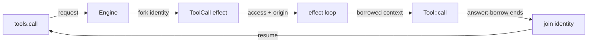

# Tool context: `Tool::call(&self, cx, args)`

<product-contract>

## Product Requirements

Tools today receive only their JSON arguments, so no tool can read or write the run's files the way the section that called it does. This change gives every tool call a context that lends the tool a filesystem access, plus the call's origin, for as long as the call runs. It is the first step toward making the store a tool and adding a virtual shell. Both must work on the run's files without conflicting with the section that called them.

- Problem and users:
  - `Tool::call(&self, args)` takes no context (`crates/harness-internal/capabilities/src/tool.rs` line 123). A tool cannot reach the run's filesystem the way its caller does, and cannot tell whether a script or a model called it.
  - The users are the authors of tools in Harness capabilities and Host crates, which today means the user-input capability and `harness-web`. They also include the next planned tools: the store as a tool, and a virtual shell.
- Goals:
  - A tool reads and writes the run's whole filesystem as part of the chain that called it. It sees the chain's earlier writes, the chain sees its writes, and neither conflicts with the other.
  - A tool cannot keep the access after its call ends, and the compiler enforces this.
  - The context is the only way a tool reaches the run's files, because capabilities no longer receive the run's `VfsRef`.
  - A tool learns the call's origin: the execution, the section, and whether a script or a model made the call.
  - Once tool calls run concurrently, two calls touching the same path, at least one of them writing, conflict, as concurrent tasks do.
- Non-goals:
  - Making the store a tool, adding the shell, making the VFS async, and running tool calls concurrently. Each is listed under Deferred and Out of Scope.
  - Any kind of permissioning.
- Success criteria:
  - The tests in the Testing Plan pass.
  - A tool that stores the access, or moves it into a spawned task or a thread, fails to compile.
  - Run records keep their current format.
  - Every verification command in the Execution Instructions passes.
- Constraints:
  - Breaking the `Tool` trait is acceptable. The owner (Vinnie Falco): "I dont care about breaking the trait."
  - The Engine performs no I/O and holds no Host trait objects. It forks and joins identities only through the Engine-only VFS functions in `crates/promptforge-internal/vfs/src/detail.rs` (module doc, lines 1-9).
  - The Harness depends on no particular async runtime, so nothing in the context may depend on tokio.
  - Run records must not change. `Effect::record` already leaves live handles out (`crates/promptforge-internal/engine/src/execute/run/effect.rs` lines 153-195).
- Open questions: None

## Functional Specification

A tool call starts when a section's Lua calls `tools.call` or a model round asks for a tool. The Engine gives the call its own filesystem identity, forked from the calling chain. While the call runs, the Harness lends the tool a borrowed access and the call's origin. When the answer is applied, the Engine joins the call's identity back into the chain before the chain resumes.

- Actors and workflows:
  - A chain is one running sequence of sections in the Engine's scheduler. The root walk is a chain, and each spawned task is its own chain.
  - A section's script or a model round asks for a bound tool. The Engine's `prepare_tool_call` forks the call's identity and issues a `ToolCall` effect that holds the forked access. The Harness's effect loop gives the access and origin to its tool performer, which calls `Tool::call` with a `ToolContext`. The answer goes back to the Engine, whose `apply_answer` joins the identity and resumes the chain.
  - Local Lua tools and the model's task built-ins issue no effect and are unchanged.
  - `Capability::create` no longer receives the run's filesystem, so a capability can no longer write files before the run starts. No production capability does that today: the user-input capability and `harness-web` never read `RunServices::vfs`.
- Inputs and outputs:
  - The tool receives a `ToolContext<'_>` and its JSON arguments. The context's `access()` returns `&Access` and its `origin()` returns `&ToolCallOrigin`. The output is unchanged: `Result<ToolOutput, ToolError>`.
  - The access is rooted at `/` and reaches the run's whole filesystem, not only the store. In the default handle the store is mounted at `/` (`crates/promptforge-internal/vfs/src/lib.rs` lines 46-55). So a tool that writes `/notes.md` writes the file Lua reads with `store.read("notes.md")`.
- States and validation:
  - The call's identity is forked when the effect is built, used only while the call runs, and joined into the chain when the answer is applied, `Dropped` answers included.
  - The tool's borrow ends when `call` returns, or when its future is dropped, as happens on Stop.
- Errors and recovery:
  - The fork fails only when the run has ended or the backend refuses. The call then fails at its caller with a store error, like any other preparation failure, and a script's `pcall` can catch it.
  - A VFS failure inside a tool, such as a conflict, a missing file, or a read-only mount, reaches the tool as a `VfsError`, and the tool reports it as a `ToolError`. A `store.*` conflict ends the run, but in this change a conflict inside a tool does not.
  - A tool that panics is answered `Dropped`, as it is today.
- Security and privacy behavior:
  - There is no new trust boundary. A tool reaches the same filesystem as its calling chain, including read-only and real-directory mounts, under the handle's existing policy.
  - Permissioning stays deferred. The owner: "no security whatsoever, no approvals, nothing" until everything works.
- Acceptance criteria:
  - A tool reads a file the chain wrote just before the call, and the chain reads a file the tool wrote, with no conflict either way.
  - A tool called inside a spawned task runs under the task's identity, and the task's owner reads the tool's write after awaiting the task.
  - A call answered `Dropped` is still joined.
  - Through the Harness, a fixture tool's write through `cx.access()` shows up in the prompt's next `store.read`, and `cx.origin().caller` reports the script caller.
  - The only change to the facade's API listing is the new `Effect::ToolCall::access` field.
  - `RunServices` has no filesystem field, and no capability test writes files at activation.

</product-contract>
<implementation-contract>

## Technical Design

The design uses two mechanisms that do different jobs. The borrowed context makes every tool give the access up when its call ends. The per-call identity, forked and joined the same way a task's identity is, orders each call within its chain and keeps concurrent calls apart. The Engine adds one field to the public `ToolCall` effect, and forks and joins identities in its scheduler. The Harness changes the `Tool` signature, adds `ToolContext`, and passes the access through its internal tool performer; paths in this plan are relative to the `promptforge` repository root unless they name another repository.

- Architecture:
  - **The borrow makes the tool give the access up.** `ToolContext<'a>` holds `&'a Access` and `&'a ToolCallOrigin`.
    - The borrow lasts only as long as the call. The compiler rejects storing the access, moving it into `tokio::spawn`, `spawn_blocking`, or a thread, or wrapping it in an `Arc`.
    - `Access` has no public method that returns an owned `Access` (`crates/promptforge/public-api.txt` lines 644-658), so there is no way around the borrow.
    - On Stop, the Harness drops the call's future and the borrow ends with it, so nothing the tool started can still hold the access.
    - A scoped thread can use the borrow, but it must finish before `call` returns.
  - **The borrow is shared.** Every `Access` operation takes `&self`, and `Access` is `Send` and `Sync` (`crates/promptforge/public-api.txt` line 176). So concurrent calls can each hold a borrow.
  - **The per-call identity keeps calls ordered.** The VFS treats everything one identity does as a single sequence: the identity's own clock entry advances once per admitted operation (`crates/promptforge-internal/vfs/src/handle/scope.rs` lines 57-60). If two concurrent calls shared one identity, they would race and no conflict would be reported. So for each call, the Engine forks a fresh identity from the chain's access with `access_spawn`, and joins it back with `access_join` (`crates/promptforge-internal/vfs/src/detail.rs` lines 74-101). Tasks use the same pair (`crates/promptforge-internal/engine/src/execute/scheduler/tasks.rs` lines 207-218; `crates/promptforge-internal/engine/src/execute/scheduler/task_end.rs` lines 111-123).
  - **The fork never conflicts with the chain.** The fork orders everything the chain did before the call ahead of the tool's first operation. The join orders everything the tool did ahead of the chain's next step (`crates/promptforge-internal/vfs/src/handle/scope.rs` lines 186-211 and 226-268). The chain is parked while its call runs, so nothing else uses the chain's identity in between.
  - **What does conflict.** A fresh scope from `VfsRef::acquire` or `acquire_store` is never ordered with a live chain, so its claims always conflict (`crates/promptforge-internal/vfs/src/handle.rs` lines 13-37). The test `acquire_store_is_a_scope_of_its_own` shows this (`crates/promptforge-internal/vfs/src/detail-tests.rs` lines 459-471). Tools therefore reach the run's files through the context. After `RunServices::vfs` is removed, a capability has no `VfsRef` to hand its tools, so they have nothing to open a fresh scope from.
- Modules and interfaces:
  - `Tool::call` in `crates/harness-internal/capabilities/src/tool.rs` becomes `async fn call(&self, cx: ToolContext<'_>, args: serde_json::Value) -> Result<ToolOutput, ToolError>`.
  - `pub struct ToolContext<'a>`, in the same file, has the private fields `access: &'a Access` and `origin: &'a ToolCallOrigin`. It has a constructor `new` and the accessors `access() -> &'a Access` and `origin() -> &'a ToolCallOrigin`.
  - The runner's internal `ToolPerformer::call` becomes `(tool, alias, access: Arc<Access>, origin: ToolCallOrigin, args)` (`crates/harness-internal/runner/src/performers.rs` lines 80-92). The trait is not in the `harness` facade, so no Host breaks.
  - The future of the runner's `ActivatedTools` owns the access and the origin, lends them to the tool, and drops them when it finishes or is dropped (`crates/harness-internal/runner/src/performers-tools.rs` lines 42-65).
  - The Engine's `ToolCallContinuation` gains the call's `ExecId`, which the join needs (`crates/promptforge-internal/engine/src/execute/scheduler/pending.rs` lines 54-65).
  - `RunServices` keeps only the cancellation flag and the Host services. Its public `vfs` field goes (`crates/harness-internal/capabilities/src/capability.rs` lines 103-106), and its constructors become `RunServices::new(cancel)` and `RunServices::with_host(cancel, host)` (lines 117-130). The runner stops passing the `VfsRef` when it builds them (`crates/harness-internal/runner/src/prepare.rs` line 295). The run's `VfsRef` still reaches the Engine's context as before.
- File and public API changes:
  - `Effect::ToolCall` gains `access: Arc<Access>` (`crates/promptforge-internal/engine/src/execute/run/effect.rs` lines 101-115). Its doc states four things: the access is the call's own identity, forked from the calling chain when the call is issued; it is joined when the answer is applied; it is rooted at `/`; and the caller must not use it after answering.
  - The facade listing `crates/promptforge/public-api.txt` gains `Effect::ToolCall::access`, next to that variant's existing fields (lines 797-801).
  - In the effect module doc, "the store access capability" (`effect.rs` lines 13-17) becomes "a filesystem access". The `Vfs` variant's sentence "A tool or the application reading files reaches the VFS by its own route" (lines 121-123) is rewritten, because a tool now uses its `ToolCall` access.
  - The `vfs::detail` module doc (`crates/promptforge-internal/vfs/src/detail.rs` lines 1-9) adds tool calls to the things the Engine forks and joins.
  - The `Tool` trait's "Compatibility policy" paragraph (`tool.rs` lines 28-33) is deleted.
  - The trait's "must not block while polled" invariant (`tool.rs` lines 49-52) is reworded:
    - Operations through `cx.access()` run inside the call. The VFS is synchronous today, so on real directories they block the poll briefly, as `store.*` does.
    - Other blocking or CPU-heavy work still goes to the Host's runtime, without the access.
  - `harness-capabilities` exports `ToolContext` from `crates/harness-internal/capabilities/src/lib.rs`.
  - The `harness` facade's `capability` module (`crates/harness/src/lib.rs` lines 25-47) re-exports `ToolContext`, `ToolCallOrigin`, and `ToolCaller`. Its `vfs` module (lines 64-71) re-exports `Access`. Today the facade re-exports neither `ToolCallOrigin` nor `Access`, so a Host-side tool could not name the types the context hands it.
  - Removing `RunServices::vfs` and the constructors' `vfs` parameter is a public API change, because the `harness` facade re-exports `RunServices` (`crates/harness/src/lib.rs` line 40). It affects only a Host that implements `Capability`, and none in the repository do.
  - Docs that describe capabilities receiving the filesystem are reworded:
    - The `RunServices` doc, "The filesystem, cancellation flag, and services a capability receives" (`capability.rs` line 96), drops the filesystem.
    - The runner's doc for its prepare input's `vfs` field, which says the `VfsRef` is "handed to the capabilities as the run's services" (`crates/harness-internal/runner/src/prepare.rs` lines 63-66), drops that clause.
- Data, persistence, failure, security, and privacy constraints:
  - Run records are unchanged, because `Effect::record` leaves the access out.
  - The join runs on every `ToolCall` answer, `Dropped` included, right after `apply_answer` removes the pending entry (`crates/promptforge-internal/engine/src/execute/scheduler/apply.rs` lines 64-103). It is skipped when the chain no longer has an access, as `join_task` does.
  - The Harness holds the effect's `Arc<Access>` only inside the call's future. As with the `Vfs` effect's access today, the access must not be used after the answer.
  - Each call leaves one identity record in the run's scope until the run ends, because the scope keeps records for late joins (`crates/promptforge-internal/vfs/src/handle/scope.rs` lines 39-44).
  - Operations through `cx.access()` are synchronous and briefly block the effect loop on real directories, the same cost `store.*` has today.

</implementation-contract>
<verification-contract>

## Testing Plan

New tests cover the Engine's fork and join, and the whole path through the Harness. The compile-time guarantee needs no test of its own, because the function signature is the guarantee. Existing suites are updated to the new signature and must keep passing. The activation tests lose their checks of files written during `create`, because that behavior is removed.

- Unit:
  - The record test in `crates/promptforge-internal/engine/src/execute/run/tests.rs` (lines 122-141) builds the `ToolCall` effect with an access from `VfsRef::default()`, the way the `Vfs` test below it does, and asserts that the record leaves the access out.
  - The capability tool tests in `crates/harness-internal/capabilities/src/tool-tests.rs` and `crates/harness-internal/capabilities/src/user_input-tests.rs` call tools through a test fixture that owns an access and an origin and lends a `ToolContext`.
  - The activation fixture in `crates/harness-internal/capabilities/tests/it/support.rs` stops writing and reading `activated.txt` in `create` (lines 134-162) and drops the `marker` field from `Observed` (lines 94-102). It still records the cancellation handle it received.
- Integration and end-to-end:
  - Engine tests go in a new file under `crates/promptforge-internal/engine/src/execute/tests/`. Their driver answers `ToolCall` by using the effect's access.
    - A tool reads a file the chain's Lua wrote just before the call, with no conflict. This checks the fork.
    - The chain's Lua reads a file the tool wrote, with no conflict. This checks the join.
    - A tool called inside a spawned task forks from the task's identity, and the owner reads the tool's write after awaiting the task, with no conflict.
    - A tool that writes and is then answered `Dropped` is still joined: the chain catches the cancellation with `pcall` and reads the file with no conflict.
  - A Harness test goes in `crates/harness-internal/runner/tests/it/`. A fixture tool writes `/from-tool.md` through `cx.access()` and returns `cx.origin().caller`. A prompt calls it with `tools.call`; `store.read("from-tool.md")` then returns the content, and the tool's output reports the script caller.
- Regression, security, and performance:
  - Every existing suite passes after the updates listed in the Execution Instructions.
  - The two activation tests in `crates/harness-internal/capabilities/tests/it/activation.rs` lose their marker checks, because capabilities can no longer write files at activation.
    - The test around lines 110-133 keeps its checks that `create` ran once and received the run's cancellation handle.
    - `the_run_path_activates_over_the_store_the_run_reads` (lines 208-222) becomes a test that the run path activates exactly once. The `READS_ACTIVATION_MARKER` prompt (lines 41-48) goes or is simplified to match.
  - The facade API check passes with only `Effect::ToolCall::access` added.
  - Two concurrent calls that conflict can't be tested until the Engine issues concurrent calls. The fork and join tests above cover the mechanism that will make that case correct.
- Exit criteria:
  - All new and existing tests pass, and every verification command in the Execution Instructions passes.

</verification-contract>
<decision-record>

## Decision Record

- Decisions:
  - **A tool receives the calling chain's filesystem access through a context argument.** The store as a tool and the shell must work on the run's files the way the section does. The owner, in the earlier design discussion: "when a tool is invoked, it needs to receive the VfsAccess for the section it is called from". And in this one: "the tool needs the access, the VFS access of the chain, right?"
  - **The context lends borrows, so the compiler makes the tool give the access up.** No runtime machinery is needed, and a Stop that drops the call's future ends the borrow with it. The owner first: "The tool can't keep the access. ... it has to give it up, after the call is done". Then: "isn't there a way for the language to enforce this in the function signature? the tool gets a borrowed mutable access or something, and the compiler forces it to be given up on the return?"
  - **The borrow is shared (`&Access`), not mutable.** The lifetime alone forces the tool to give the access up. Every `Access` operation takes `&self`, and a shared borrow lets concurrent calls each hold one. The owner had suggested "a borrowed mutable access or something".
  - **Each call runs under its own identity, forked from the chain when the call is issued and joined when it is answered.**
    - Why: concurrent calls sharing one identity would race with no conflict reported. Fork and join order each call within its chain, and tasks already work this way.
    - The owner: "tool calls are async though, what about when we want to support multiple concurrent tool calls, how can they share a borrow of the chain's access".
    - It also answers his earlier concern: "the tool should, should have the same access as the section, right? Or else, how could that work if we make the store a tool? It'll always conflict". The forked identity sees everything the section wrote and never conflicts with it. Only a fresh scope always conflicts.
  - **The join also runs on `Dropped`.** A tool may have written before the Harness gave up. Joining orders those writes ahead of the chain's next step, so the chain's later reads don't falsely conflict.
  - **The Engine forks and joins; the Harness only passes the access along.** The fork and join functions are Engine-only. The Engine owns ordering decisions, and the Harness performs effects.
  - **The trait's compatibility promise is deleted, and `call` changes directly.** The owner: "I dont care about breaking the trait."
  - **`ToolContext` keeps its fields private behind accessors.** Later changes can add to the context without breaking every tool.
  - **`ToolContext` derives only `Debug`.** Its accessors return borrows for the full `'a`, which outlive the context value, so a tool never needs to copy or clone the context itself. Deriving `Clone` or `Copy` could not be undone without breaking tools, and it would rule out later fields that cannot be copied. This is an agent proposal with the same standing as the private fields.
  - **The `harness` facade re-exports `ToolContext`, `ToolCallOrigin`, `ToolCaller`, and `Access`.** A Host-side tool must be able to name every type the context hands it.
  - **`RunServices` no longer holds the run's `VfsRef`.**
    - It was the one way a tool could reach the run's files without the context: a capability could hand its tools the `VfsRef`, and a tool could open a fresh scope mid-run that always conflicts with the live chain.
    - No production capability reads it; the only reader is one test fixture.
    - The capability redesign would make it worse. That design creates a capability's per-run part on the run's first tool call into it, so even activation-time writes would land while chains are live.
    - Mounts replace the one real use. A capability that provides files contributes a backend for the Harness to mount, and the planned Turso run-database mount works the same way.
    - The owner asked, "should we remove the VfsRef from the RunServices?", and after hearing the costs: "remove it yes."
  - **Execution uses as few steps as the work allows.** Each step is the largest slice one set of tests can cover, and related work shares a step instead of being split into pieces. The owner: "do not bloat the plan with too many steps. keep it tight".
  - **The VFS becomes async in a later change, after the store becomes a tool and before the shell.**
    - The owner: "if they were async it would work nicely with Turso, with Bashkit". Later: "I expect a mount backed by Turso. An agents run database gets mounted into the vfs in a way that the model can see files inside (backed by sqlite BLOB)".
    - This change is unaffected: `ToolContext` still lends `&Access`, and tools will then `.await` its operations.
- Rejected alternatives:
  - **Running the tool as the chain's own identity, with no fork.** Concurrent calls would race with nothing to catch it. Revisit only if tool calls are guaranteed never to run concurrently.
  - **A tool acquiring its own access from the run's `VfsRef`.** A fresh scope always conflicts with a live chain. Not to be revisited for the run's files: the context is the supported way in.
  - **An owned `Arc<Access>` in the context, plus a documented "don't keep it" rule.** Nothing enforces the rule. A tool could hand work to a background thread that outlives a Stop and keeps writing as the chain, and nothing would notice. Revisit if a tool ever must hand file work to a background thread.
  - **An owned access, plus a lease the Engine switches off when the answer lands.**
    - It costs about 60 lines of VFS and Engine code for a runtime check that the compiler gives for free. An operation already in progress when the lease ends would still finish.
    - The owner asked what it meant and how much code it took, then proposed the borrow instead.
    - Revisit under the same condition as the previous item.
  - **A mutable borrow (`&mut Access`).** It adds nothing, and it would stop a tool from using the access in two places within one call. Not to be revisited.
  - **Public fields on `ToolContext`.** Adding a field later would break every tool. Not to be revisited.
  - **Keeping `Tool::call` stable behind a new provided method.** The owner waived trait stability. Not to be revisited.
  - **Keeping `RunServices::vfs` and documenting that tools must not use it.** Nothing would enforce the rule, and its only benefit, writing files at activation, has no production user. Revisit if a capability must write into the run's filesystem before the run starts and a mount cannot serve it.
- Assumptions, risks, and notes:
  - Removing `RunServices::vfs` removes a tested behavior on purpose: a capability writing files during `create`. It is tested only through the activation fixture, and no production capability relies on it.
  - A Host still holds its own `VfsRef` and can touch the run's files outside the Engine, as the `harness` suite's simulated desk edit does (`crates/harness/tests/suite/vfs.rs` lines 66-78). That is Host code rather than capability code, and this change leaves it alone.
  - Today the tool calls of one model round are dispatched one at a time (`crates/promptforge-internal/lua/src/__impl_coro.lua` lines 287-292). The per-call identity is ready for when they run concurrently.
  - The owner raised concurrency as a question, and the per-call identity is the agent's answer. The owner moved on without objecting but did not explicitly approve it. The shared borrow, the private fields, and the facade re-exports are also agent proposals with the same standing. Removing `RunServices::vfs` is an explicit owner decision.

### Deferred and Out of Scope

- Deferred:
  - **The store as a tool.** Revisit once this change lands.
    - The store tool needs the store view of `cx.access()`, and today only the Engine can build that view (`crates/promptforge-internal/vfs/src/detail.rs` lines 47-59). Whatever exposes it must return a borrow tied to the access, or a tool could keep the view.
    - Today a store conflict ends the run. Once the store is a tool, a conflict arrives inside a tool error, so the store tool's design must keep it fatal.
  - **An async VFS.** Revisit after the store becomes a tool. That change deletes the `Vfs` effect, the inline answer path, and the store calls made while `lua shared` loads (`crates/promptforge-internal/lua/src/engine_globals-store.rs` lines 1-3).
    - The traits say they are synchronous "because the Lua VM and the single thread that drives a run are both synchronous" (`crates/promptforge-internal/vfs/src/traits.rs` lines 77-78). That stops being true once Lua reaches the store only through effects.
    - The Engine has one other synchronous VFS call, the store probe in `Run::new` (`crates/promptforge-internal/engine/src/execute/run.rs` line 261). It moves to the Harness.
    - Backend operations must be safe to cancel: dropping one partway leaves either the old contents or the new, never a half-written file.
  - **A Turso-backed mount of an agent's run database.** Revisit along with the async VFS.
    - The mount must reuse the database's existing connection. Under turso 0.7.2, two handles opened on the same file share one write-ahead log, and closing either one loses the writes that come after (`crates/workshop/workspace/src/workspace/backing.rs` lines 157-164).
    - A mount over the run log must be read-only, because the log is append-only (`crates/workshop/run-log/src/lib.rs` lines 17-21).
    - Replay needs its own approach for this mount, because the mount's contents change during the run.
  - **Concurrent tool calls.** Revisit when parallel tool calls are wanted. This is a scheduler change; the per-call identities already handle it.
  - **The virtual shell.** Revisit after the async VFS.
    - bashkit holds its filesystem as a `'static` `Arc<dyn FileSystem>` (in the `bashkit` repository, `crates/bashkit/src/lib.rs` line 2010), so its adapter can't hold the borrowed access.
    - Instead, the adapter sends each filesystem request over a channel to the running call, which performs it and replies. Once the call returns, late requests fail.
- Out of scope:
  - Capability manifests, the tool offering, and static preludes.
  - Security and permissioning.
  - Hooks around tool dispatch.

</decision-record>
<project-survey>

## Project Survey

- Status: complete
- Build command: `cargo build --locked -p gateway` (the workspace's only default member). The desktop app builds only on request: `cargo build --locked -p workshop`. The headless gateway shape: `cargo check -p gateway --no-default-features`. The crates this plan touches build with `cargo build --locked -p promptforge-engine -p promptforge-vfs -p harness-capabilities -p harness-runner -p harness`.
- Focused test command pattern: `cargo nextest run --locked -p <crate> --all-features <test-name-substring>`, such as `cargo nextest run --locked -p harness-capabilities --all-features activation`. For `workshop`, `workshop-server`, and `workshop-server-api`, drop `--all-features`. A UI test file: `node --test <file>.mjs` from its package directory under `crates/workshop/` (`ui`, `look`, or `platform`).
- Component test command pattern: `cargo nextest run --locked -p <crate> --all-features` (same `--all-features` exception for the three workshop crates). Structural checks: `cargo test -p build-xtask` (`cargo xtask tidy` prints the same report on demand). A UI package: `npm test --workspace <ui|look|platform>` from `crates/workshop`.
- Full-suite test command: `cargo nextest run --locked --workspace --exclude workshop --exclude workshop-server --exclude workshop-server-api --all-features`, then `cargo nextest run --locked -p workshop -p workshop-server -p workshop-server-api`. No doctest run is needed: the `no_doctests` check in `build-xtask` bans compiled code blocks in every doc comment. UI: `npm test --workspaces --if-present` from `crates/workshop`, and `npm test` from `crates/gateway/config-ui/ui`. Nightly-only fixtures: `cargo +nightly-2026-09-05 nextest run --locked -p build-xtask --run-ignored only`.
- Linter command: with `CARGO_BUILD_WARNINGS=deny` set (PowerShell: `$env:CARGO_BUILD_WARNINGS="deny"`), `cargo clippy --workspace --exclude workshop --exclude workshop-server --exclude workshop-server-api --all-targets --all-features` and `cargo clippy -p workshop -p workshop-server -p workshop-server-api --all-targets`. Never run a standalone `cargo check --workspace` beside them; the one extra check is `cargo check -p gateway --no-default-features`. Also `cargo deny check` (pre-push and CI), and the UI typechecks `npm run typecheck --workspaces --if-present` from `crates/workshop` and `npm run typecheck` from `crates/gateway/config-ui/ui`.
- Formatter check command: `cargo fmt --all --check` (also the pre-commit hook).
- Docs command: with `RUSTDOCFLAGS=-D warnings` set (PowerShell: `$env:RUSTDOCFLAGS="-D warnings"`), `cargo doc --workspace --no-deps --all-features --exclude workshop --exclude workshop-server --exclude workshop-server-api`, then the default-feature facade docs `cargo doc -p promptforge --no-deps` and `cargo doc -p harness --no-deps`, then `cargo doc --locked --no-deps --all-features -p promptforge-engine --document-private-items`. Facade surface: `cargo +nightly-2026-09-05 xtask api --check`, and `cargo +nightly-2026-09-05 xtask api --bless` to rewrite `crates/promptforge/public-api.txt` (the pin lives in `crates/build-xtask/src/api/toolchain.rs`; that nightly is installed on this machine). User guide: `cargo xtask site --books-only` with `PROMPTFORGE_DOCS` set to `c:\Users\Vinnie\cursor\promptforge-docs`; this plan changes no guide chapter.
- Test placement and naming conventions:
  - Unit tests sit in an inline `#[cfg(test)] mod tests` (about 395 files contain `#[cfg(test)]`), in a sibling `foo-tests.rs` wired as `#[cfg(test)] #[path = "foo-tests.rs"] mod tests;` (about 170 files, such as `crates/harness-internal/capabilities/src/tool-tests.rs`), or in a `src/<module>/tests/` directory once a module has three or more test files.
  - The Engine's execution tests live in `crates/promptforge-internal/engine/src/execute/tests/`, and each file is declared as `mod <name>;` in `execute/tests.rs`, so a new file there needs its `mod` line. Kebab files in that directory, such as `context-tools.rs`, are wired by `#[path]` from their parent module.
  - Integration tests are one binary per crate: `tests/it/main.rs` (as in `harness-runner`, `harness-capabilities`, `gateway`, and `workshop-server`) or `tests/suite/main.rs` (as in `harness` and `promptforge`), with one module per topic plus a `support.rs`. Each `main.rs` opens with a crate-level `#![expect(clippy::expect_used, clippy::unwrap_used, reason = "...")]`. Prompt fixtures sit under `tests/prompts/` (`valid`, `invalid`, `execution`).
  - Test functions are snake_case behavior sentences, such as `activation_receives_the_runs_own_services` and `the_run_path_activates_over_the_store_the_run_reads`.
  - Harness suites drive runs on tokio, declared only in `[dev-dependencies]`.
  - Each `build-xtask` check has a sibling `*-tests.rs` that builds fixture crates.
  - UI tests are `node --test` `.mjs` files in `crates/workshop/ui/test/` and `src/**/*.test.mjs`, and `src/**/*.test.mjs` in the gateway config UI. `crates/workshop/ui/test/docs-claims.mjs` checks the Engine, Harness, and Host vocabulary in every `AGENTS.md`, `## Invariants` crate doc, and `.cursor/rules` file.
- Directory map:
  - `crates/`: every crate. The top level holds the public and shared layer: the `promptforge` facade, the `harness` facade, the Host plug-ins `harness-web` and `harness-gateway-client`, `gateway-api-types`, `gateway-api-discovery`, `shared-loopback`, `shared-error-source`, the build tooling (`build-xtask`, `build-ui`, `build-workshop`, `build-user-guide`, `build-llama-cuda`, `build-ceiling`), and `workspace-hack` (cargo-hakari).
  - Manifestless containers under `crates/` hold each family's private crates: `promptforge-internal/` (`types`, `engine`, `lua`, `parser`, `vfs`, `model-client`), `harness-internal/` (`runner`, `capabilities`), `gateway/` (`app`, `config`, `config-ui`, `local`, `protocol`, `routing`, `logging`, `progress`, `web-search`, `cloud-providers`, and the speech-to-text crates under `stt/`), and `workshop/` (the Rust crates plus the TypeScript packages `ui`, `look`, and `platform`, with one npm install at `crates/workshop`). `crates/shared-ui` is a TypeScript and CSS package, not a Rust crate.
  - `guide/`: the docs site's `chrome/`, `landing/`, and one `books/<book>/book.toml` each for `gateway`, `language`, and `workshop`. The chapter text lives in the separate `promptforge-docs` checkout.
  - `prompts/`: example prompt programs. `local/` (gitignored): machine-local gateway config, profiles, prompts, and speech-to-text fixtures.
  - `tools/`: Node scripts for staging the gateway sidecar and for live TTS, each with a `.test.mjs`.
  - `vibe/`: dated plans, with older months under `2026-07/`, `2026-08/`, and `2026-09/`, and a gitignored `scratch/`. `images/`: README art. `cabinet/`: untracked staging.
  - `.github/workflows/`: CI, release, nightly, site, Miri, and smoke jobs. `.githooks/`: pre-commit fmt, and pre-push headless check, clippy, and deny.
  - `.cargo/config.toml`: the `xtask` and `workshop` aliases, and rust-lld with a static CRT on Windows. `.config/`: nextest (a `heavy` test group for the speech-to-text crates) and hakari. `.cursor/rules/`: two Workshop rules.
  - Root config: `Cargo.toml`, `clippy.toml`, `deny.toml`, `rustfmt.toml`, `rust-toolchain.toml` (stable), `dist-workspace.toml` (cargo-dist), and `gateway.local.example.toml`. `target/` and `target-msrv/` are build output.
- Component boundaries:
  - The Engine: the `promptforge` facade depends on every `promptforge-internal` crate. Inside, `promptforge-engine` depends on `lua`, `parser`, `model-client`, `types`, and `vfs`; `promptforge-lua` on `model-client`, `types`, and `vfs`; `promptforge-parser` on `lua` and `types`; `promptforge-model-client` on `types`. `promptforge-types` and `promptforge-vfs` depend on nothing. The Engine is sans-I/O, and only Engine crates reach the VFS `detail` module, which forks, joins, and ends identities and derives the store view.
  - The Harness reaches the Engine only through the `promptforge` facade. `harness-capabilities` depends on `promptforge`; `harness-runner` on `harness-capabilities` and `promptforge`; the `harness` facade on both plus `promptforge`. The `harness` facade and the `harness-internal` crates may not declare tokio outside `[dev-dependencies]` (the `harness_bans` check).
  - The Host plug-ins at the top level depend on the Harness: `harness-web` on `harness` and `promptforge`, and `harness-gateway-client` on those plus `harness-web`. Both use tokio as a normal dependency.
  - The gateway family: the `gateway` app depends on its private family crates plus `gateway-api-types`, `gateway-api-discovery`, and `shared-loopback`. Family crates reach outside the family only through `gateway-api-types` and `shared-error-source`.
  - Workshop, a Host: `workshop` (desktop) depends on `workshop-server-api`, which depends on `workshop-server`. `workshop-server` depends on the Harness crates, `promptforge`, `gateway-api-discovery`, `shared-loopback`, and the lower Workshop tiers. `workshop-agents` and `workshop-run-log` depend on `harness`. No Workshop crate depends on a gateway private crate, and the Workshop tiers form a one-way graph.
  - The build crates, `gateway-api-types`, and the `shared-*` crates depend on no workspace crate.
  - For this plan: the `Tool` trait and `RunServices` live in `crates/harness-internal/capabilities/src/tool.rs` and `capability.rs`; `ToolPerformer` and `ActivatedTools` in `crates/harness-internal/runner/src/performers.rs` and `performers-tools.rs`; `Effect` in `crates/promptforge-internal/engine/src/execute/run/effect.rs`; the fork and join sites in `crates/promptforge-internal/engine/src/execute/scheduler/`.
  - `cargo test -p build-xtask` enforces the product and container boundaries, the Workshop tier graph, the Engine manifest guard, the retired-symbol scan, the `test-support` leak guard, both facades' source shape, the `doc(hidden)` ban, the doctest ban, the unsafe allowlist, lint inheritance, the `## Invariants` marker, and the wiring of the 500-line file ceiling. `cargo xtask api --check` keeps the `promptforge` facade surface closed against `crates/promptforge/public-api.txt`.
- Conventions summary:
  - Rust 2024 on stable. Dependencies are centralized in `[workspace.dependencies]`, with a comment justifying each pin, and every crate inherits `workspace-hack` and the workspace lint table.
  - Lints: clippy `all` and `pedantic` deny, `unwrap_used`, `expect_used`, and `allow_attributes` deny (suppressions use `#[expect(..., reason = "...")]`), `unsafe_code` deny outside the unsafe allowlist, `missing_docs` and `unreachable_pub` warn (failures under the `CARGO_BUILD_WARNINGS=deny` gate), and rustdoc broken and private intra-doc links deny.
  - Source directories are flat, with kebab `foo-bar.rs` siblings wired by `#[path]` until a group reaches three files, then a subdirectory. Each crate's build script runs `build_ceiling::check()`, which fails any file over 500 lines.
  - Engine, Harness, and Host are capitalized defined terms. Engine docs call the stepping code "the caller" and never name the Harness.
  - Doc comments hold no compiled code blocks; examples use `text`, `lua`, `json`, or `toml` fences. Crate docs have an `## Invariants` section.
  - Error messages are written for a model to read, naming required versus actual. Comments explain constraints and cite upstream issue URLs for workarounds.
  - Recorded JSON round-trips exactly (`float_roundtrip`, sorted keys, finite numbers).
  - Behavior changes ship with tests. CI commands pass `--locked`, and no build step may dirty the tree.
  - Workshop CSS uses `@workshop/look` tokens, and persisted UI state goes through the `ui-storage` adapter to the server.

</project-survey>
<execution-plan>

## Execution Instructions

<step-1>

### Step 1: Fork and join a per-call identity in the Engine [completed]

- Component: Engine per-call tool identity
- Placement: first. The Harness tool context in Step 2 reads the new `Effect::ToolCall::access` field, so the Engine must issue it first. This component touches only Engine crates and the `promptforge` facade listing, and it ships on its own: the Harness's effect loop matches `Effect::ToolCall { tool, alias, args, .. }` and every other driver matches `Effect::ToolCall { .. }`, so they compile unchanged and ignore the access until Step 2.
- Construction: one piece built as one step. The field, the fork, and the join are one behavior the four Engine tests cover together. A field with no fork, or a fork with no join, has no test that passes on its own.
- Effect (`crates/promptforge-internal/engine/src/execute/run/effect.rs`):
  - Add `access: Arc<Access>` to `Effect::ToolCall`. Its doc states four things: the access is the call's own identity, forked from the calling chain when the call is issued; it is joined when the answer is applied; it is rooted at `/`; and the caller must not use it after answering.
  - `Effect::record` (its `Effect::ToolCall` arm near line 180) ignores the new field, so `EffectRecord::ToolCall` and run records stay unchanged.
  - In the module doc (lines 13-17), "the store access capability" becomes "a filesystem access". Rewrite the `Vfs` variant's sentence "A tool or the application reading files reaches the VFS by its own route" (lines 121-123), because a tool now uses its `ToolCall` access.
- VFS doc: the `vfs::detail` module doc (`crates/promptforge-internal/vfs/src/detail.rs` lines 1-9) adds tool calls to the things the Engine forks and joins.
- Fork, in `prepare_tool_call` (`crates/promptforge-internal/engine/src/execute/scheduler/tool_call.rs`), after `counts.increment(binding.alias())` and before `Effect::ToolCall` is built:
  - Fork the call's identity from the chain's `access()` with `access_spawn`. Label it with `prompt_origin`, using the tool's id as the label and the calling section's blocks as the position, the way a task's spawn in `scheduler/tasks.rs` (lines 206-218) labels its identity.
  - Map a failed fork to `Error::store`, so the call fails at its caller like any other preparation failure and a script's `pcall` can catch it. The counts already taken stay taken.
  - Record the fork's `access_id` before the access moves into the effect.
- Continuation: `ToolCallContinuation` (`scheduler/pending.rs`) gains `exec: ExecId`, the forked identity, with a doc saying the answer joins it.
- Join, in `apply_answer` (`scheduler/apply.rs`): right after `self.pending.remove(&id)` succeeds and before the answer is matched, when the resume is `Continuation::ToolCall`, join its `exec` into the parked chain's access with `access_join`. This covers every `ToolCall` answer, `Dropped` included. Skip the join when the chain no longer has an access, as `join_task` (`scheduler/task_end.rs` lines 111-123) does. `apply_answer`'s doc says so.
- Leave unchanged:
  - The orphan path in `abort_effect` (`scheduler/chain.rs` lines 280-288). An aborted chain's in-flight `ToolCall` is orphaned and its answer discarded, so the call is never joined. Its late file work stays unordered with the owner, as an orphaned store effect's does today.
  - The Engine's `TestTool` helper (`crates/promptforge-internal/engine/src/test_support/tools.rs` line 46) and every driver that matches `Effect::ToolCall { .. }`.
- Tests:
  - The record test in `crates/promptforge-internal/engine/src/execute/run/tests.rs` (lines 122-141) builds the `ToolCall` effect with an access acquired from `VfsRef::default()`, the way the `Vfs` test below it does, and asserts that the record leaves the access out.
  - A new file `crates/promptforge-internal/engine/src/execute/tests/tool_call_access.rs`, declared as `mod tool_call_access;` in `execute/tests.rs`. It binds one test tool. Its driver answers `ToolCall` by using the effect's access, and answers store effects with `run_store_op` as `perform_locally` in `serial_driver.rs` does. A conflict ends the run, so "no conflict" means the run succeeds. Its four tests:
    - A tool reads a file the chain's Lua wrote just before the call, with no conflict. This checks the fork.
    - The chain's Lua reads a file the tool wrote, with no conflict. This checks the join.
    - A tool called inside a spawned task forks from the task's identity, and the owner reads the tool's write after awaiting the task, with no conflict.
    - A tool that writes and is then answered `Dropped` is still joined: the chain catches the cancellation with `pcall` and reads the file with no conflict.
- Facade listing: rewrite `crates/promptforge/public-api.txt` with `cargo +nightly-2026-09-05 xtask api --bless` (the pin lives in `crates/build-xtask/src/api/toolchain.rs`). The only change is `Effect::ToolCall::access`, next to that variant's existing fields (lines 797-801).
- Verification, all passing:
  - `cargo nextest run --locked -p promptforge-engine -p promptforge-vfs -p promptforge -p harness-runner -p harness-gateway-client --all-features`
  - `cargo clippy -p promptforge-engine -p promptforge-vfs -p promptforge --all-targets --all-features` with `CARGO_BUILD_WARNINGS=deny`
  - `cargo fmt --all --check`
  - With `RUSTDOCFLAGS="-D warnings"`: `cargo doc -p promptforge --no-deps` and `cargo doc --locked --no-deps --all-features -p promptforge-engine --document-private-items`
  - `cargo +nightly-2026-09-05 xtask api --check`
- Commit: one commit holding the Engine change, the doc updates, the facade listing, and the tests.

</step-1>

<step-2>

### Step 2: Lend each tool a `ToolContext`

- Component: Harness tool context
- Placement: second. It reads `Effect::ToolCall::access` from Step 1, and it gives tools the supported way into the run's files before Step 3 removes the unsupported one.
- Construction: one piece built as one step. The `Tool::call` change compiles only once every implementation and caller is updated, and the end-to-end test needs the trait, the performer, and the effect loop to change together.
- Trait (`crates/harness-internal/capabilities/src/tool.rs`):
  - Add `pub struct ToolContext<'a>` with the private fields `access: &'a Access` and `origin: &'a ToolCallOrigin`, a constructor `new(access, origin)`, and the accessors `access() -> &'a Access` and `origin() -> &'a ToolCallOrigin`. It derives `Debug` only, per the Decision Record.
  - `Tool::call` becomes `async fn call(&self, cx: ToolContext<'_>, args: serde_json::Value) -> Result<ToolOutput, ToolError>`, still under `#[async_trait::async_trait]`. Its doc describes `cx`: the access is the calling chain's, rooted at `/`, and the borrow ends when `call` returns or its future is dropped.
  - Delete the "Compatibility policy" paragraph (lines 28-33). Reword the "must not block while polled" invariant (lines 49-52): operations through `cx.access()` run inside the call and, on real directories, block the poll briefly as `store.*` does; other blocking or CPU-heavy work still goes to the Host's runtime, without the access.
  - Export `ToolContext` from `crates/harness-internal/capabilities/src/lib.rs`, beside `Tool`.
- Facade (`crates/harness/src/lib.rs`): the `capability` module re-exports `ToolContext`, `promptforge::effect::ToolCallOrigin`, and `promptforge::effect::ToolCaller`. The `vfs` module re-exports `promptforge::vfs::Access`, and its module doc mentions the access a tool call receives.
- Runner:
  - `ToolPerformer::call` (`crates/harness-internal/runner/src/performers.rs` lines 80-92) becomes `(tool, alias, access: Arc<Access>, origin: ToolCallOrigin, args)`, and its doc says the future owns both until it finishes.
  - `ActivatedTools` (`performers-tools.rs`): its boxed future owns the access and the origin, passes `ToolContext::new(&access, &origin)` to `implementation.call`, and drops both when it finishes or is dropped.
  - `effect_loop.rs` (lines 340-347): destructure `access` and `origin` from `Effect::ToolCall` and pass them to the performer. The file is at 481 of the 500-line ceiling, so keep the arm compact.
- Tool implementations, nine in seven files, all ignoring `cx` for now:
  - `Ask` in `crates/harness-internal/capabilities/src/user_input.rs`
  - `WebFetch` in `crates/harness-web/src/fetch.rs` and `WebSearch` in `crates/harness-web/src/search.rs`
  - `FixtureTool` and `CatalogFixtureTool` in `crates/harness-internal/capabilities/src/tool-tests.rs`
  - `FixtureTool` and `BadWireTool` in `crates/harness-internal/capabilities/tests/it/support.rs`
  - `HoldTool` in `crates/harness-internal/runner/tests/it/scripted.rs` and `Echo` in `crates/harness-internal/runner/tests/it/prepare.rs`
- Callers:
  - About 42 direct `tool.call(...)` calls in tests: `crates/harness-internal/capabilities/src/user_input-tests.rs` (6), `crates/harness-internal/capabilities/src/tool-tests.rs` (1), `crates/harness-web/src/fetch/tests.rs` (1), `crates/harness-web/src/fetch/tests-body.rs` (17), `crates/harness-web/src/fetch/tests-policy.rs` (11), and `crates/harness-web/src/search-tests.rs` (6).
  - `harness-capabilities` and `harness-web` each get one `#[cfg(test)]` fixture module, declared in the crate's `lib.rs`, that owns an access acquired from `VfsRef::default()` and a script `ToolCallOrigin` and lends a `ToolContext` from a method. `fetch/tests.rs` is at 452 lines, so its one call stays compact.
  - The seven test `ToolPerformer` implementations: `Unused`, `TextTool`, `PendingTool`, `PanickingTool`, `ClosingTool`, and `GatedTool` in `crates/harness-internal/runner/tests/it/support.rs`, and `DelayedTool` in `crates/harness-internal/runner/tests/it/performers.rs`.
  - The direct `ActivatedTools::call` in `the_tool_performer_refuses_an_id_the_table_does_not_hold` (`crates/harness-internal/runner/tests/it/prepare.rs` lines 361-376), which now passes an access from `VfsRef::default()` and a script origin.
- Test: a new `crates/harness-internal/runner/tests/it/tool_context.rs`, declared as `mod tool_context;` in `tests/it/main.rs`. A fixture capability, registered the way `fixture_registry` in `tests/it/prepare.rs` registers its tool, contributes a tool that writes `/from-tool.md` through `cx.access()` and returns `cx.origin().caller`. A prompt modeled on that file's `CALLS_ECHO` calls it with `tools.call`; `store.read("from-tool.md")` then returns the tool's content, and the tool's output reports the script caller. The run goes through `prepare` and `drive_run`. The compile-time guarantee needs no test of its own, because the signature is the guarantee.
- Verification, all passing:
  - `cargo nextest run --locked -p harness-capabilities -p harness-runner -p harness -p harness-web -p harness-gateway-client --all-features`
  - `cargo clippy -p harness-capabilities -p harness-runner -p harness -p harness-web -p harness-gateway-client --all-targets --all-features` with `CARGO_BUILD_WARNINGS=deny`
  - `cargo fmt --all --check`
  - `cargo doc -p harness --no-deps` with `RUSTDOCFLAGS="-D warnings"`
  - `cargo +nightly-2026-09-05 xtask api --check`, unchanged from Step 1, because the listing covers only the `promptforge` facade.
- Commit: one commit holding the trait, the runner, the facade re-exports, every updated implementation and caller, and the new test.

</step-2>

<step-3>

### Step 3: Stop handing capabilities the run's filesystem

- Component: Capability services without a filesystem
- Placement: last. The compiler does not tie it to Steps 1 and 2, but it comes after Step 2 so the supported way into the run's files (the context) exists before the unsupported one (`RunServices::vfs`) goes. It also edits two test files Step 2 edits, `crates/harness-internal/capabilities/src/user_input-tests.rs` and `crates/harness-internal/capabilities/tests/it/support.rs`, so it is built after Step 2 rather than beside it.
- Construction: one piece built as one step. Removing the field compiles only once every construction of `RunServices` and the activation fixture are updated, and the rewritten activation tests cover the result.
- `RunServices` (`crates/harness-internal/capabilities/src/capability.rs` lines 96-157): remove the `vfs` field and its doc, the `vfs` parameter so the constructors become `RunServices::new(cancel)` and `RunServices::with_host(cancel, host)`, the field in the `Debug` impl, and the unused `VfsRef` import. The struct doc (line 96) drops "The filesystem," and names only the cancellation flag and services.
- Docs that say capabilities receive the filesystem:
  - The doc of `activate` (`crates/harness-internal/capabilities/src/activation.rs` lines 135-136) drops "the run's VFS" from its list of what `services` holds.
  - In `crates/harness-internal/runner/src/prepare.rs`: the `Services::vfs` field doc (lines 63-66) drops "and handed to the capabilities as the run's services"; the comment above `stage_input` (lines 256-259) drops "the capabilities activate over the same filesystem"; and the comment above activation (lines 285-292) stops saying the filesystem is handed to the capabilities' services.
- Construction sites:
  - `crates/harness-internal/runner/src/prepare.rs` line 295 becomes `RunServices::with_host(ctx.cancel_handle(), host)`. The run's `VfsRef` still reaches the Engine through `ctx.vfs(vfs)`.
  - Drop the `VfsRef` argument from the 16 test constructions: `crates/harness-internal/capabilities/src/capability-tests.rs` (7), `crates/harness-internal/capabilities/src/user_input-tests.rs` (2), `crates/harness-internal/capabilities/src/activation-tests.rs` (1), `crates/harness-internal/capabilities/tests/it/support.rs` (1, line 49), `crates/harness-internal/capabilities/tests/it/preludes.rs` (1), `crates/harness-internal/capabilities/tests/it/needs.rs` (1), `crates/harness-internal/runner/tests/it/prepare-input.rs` (1), `crates/harness-internal/runner/tests/it/prepare-host-services.rs` (1), and `crates/harness-web/src/web-tests.rs` (1).
  - Leave `services.vfs` in `crates/harness-internal/runner/tests/it/prepare-files.rs` line 39 alone: it sets the runner's prepare `Services`, not `RunServices`.
- Activation fixture and tests:
  - `crates/harness-internal/capabilities/tests/it/support.rs`: the fixture's `create` stops writing and reading `activated.txt` (lines 134-162), and `Observed` drops its `marker` field (lines 94-102). It still records the cancellation handle it received.
  - `crates/harness-internal/capabilities/tests/it/activation.rs`: `activation_receives_the_runs_own_services` (lines 96-133) loses its marker checks and keeps its checks that `create` ran once and received the run's cancellation handle. `the_run_path_activates_over_the_store_the_run_reads` (lines 208-222) becomes a test that the run path activates exactly once, renamed to say so, and the `READS_ACTIVATION_MARKER` prompt (line 43) goes or is simplified to match.
- Verification: this step is the plan's exit gate, so every plan-wide command passes:
  - `cargo nextest run --locked --workspace --exclude workshop --exclude workshop-server --exclude workshop-server-api --all-features`
  - `cargo nextest run --locked -p workshop -p workshop-server -p workshop-server-api`
  - With `CARGO_BUILD_WARNINGS=deny`: `cargo clippy --workspace --exclude workshop --exclude workshop-server --exclude workshop-server-api --all-targets --all-features` and `cargo clippy -p workshop -p workshop-server -p workshop-server-api --all-targets`
  - `cargo fmt --all --check`
  - With `RUSTDOCFLAGS="-D warnings"`: `cargo doc --workspace --no-deps --all-features --exclude workshop --exclude workshop-server --exclude workshop-server-api`, `cargo doc -p promptforge --no-deps`, and `cargo doc -p harness --no-deps`
  - `cargo +nightly-2026-09-05 xtask api --check`, with only `Effect::ToolCall::access` added since the start of the plan
  - `cargo test -p build-xtask`
- Commit: one commit holding the `RunServices` change, the reworded docs, and the updated fixture and tests.

</step-3>

</execution-plan>
