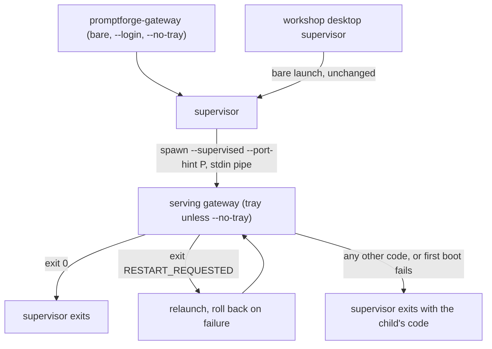
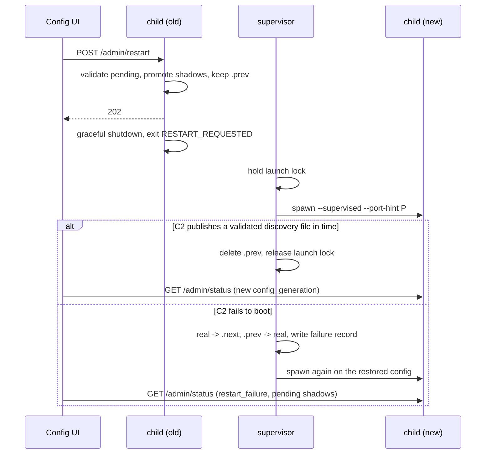

# Restart to Apply and Gateway Supervisor

## Problem

Currently, 'Apply' promotes shadows (the `.next` files, such as `gateway.toml.next` and `gateway.env.next`) to the real files. When the change touches a section the process reads once at boot (`RESTART_SECTIONS` in `crates/gateway/app/src/commands-apply.rs:30`) or the env file (`commands-apply.rs:110`), 'Apply' reports `restart_required` and the gateway keeps running the old config until someone restarts it by hand. Until then the files and the UI show one config and the process runs another. Every API key edit takes this path, because the env file reaches the process only at boot (`runner.rs:1221`, `load_env_file`).

Three further defects come from the same gap:

- A restart cannot fail safely. `load_startup` errors are fatal (`main.rs:154-172`), promotion keeps no previous copy (`gateway/config/src/shadow.rs:164-207`, the backup is deleted on success), and the config UI is served by the process that just failed to boot.
- The restart banner (`config-ui/ui/src/main.ts:238`) can only clear when `[server]` names a fixed port. The generated default binds `127.0.0.1:0` (`boot.rs:544`), so a restarted gateway answers on a new port and the open tab never sees it.
- A new provider's API key cannot be used until the gateway has restarted with it:
  1. On the Secrets tab, add an `ANTHROPIC_API_KEY` and save. The value lands in `gateway.env.next`.
  2. On the Cloud Models page, pick an Anthropic model and click Add Model. `mergeCloudModel` (`config-ui/ui/src/services/cloud-merge.ts:41-66`) adds the provider's endpoint with `api_key = "${ANTHROPIC_API_KEY}"` and saves the whole document through `PUT /admin/config`.
  3. The save is refused with `UnresolvedVar` for `ANTHROPIC_API_KEY`, shown in the Add Model dialog, and nothing is staged.

  Applying the Secrets change first does not help: `gateway.env` then holds the key, but the running process still does not. Only a restart makes the save succeed. 
  The cause is save-time validation: `save_config_shadow` (`gateway/config/src/shadow.rs:325-350`) runs the document through `Config::parse_toml_at`, which validates every `${VAR}` against the process environment (`config/src/config/interpolate.rs:44`). Since the process environment holds only what the boot loaded from `gateway.env` (`runner.rs:1221`), a key entered since boot is invisible to it, whether staged or applied. Typing `${VAR}` into an endpoint's API key on the Settings page goes through the same route and validation, so it fails the same way. The documented workflow (enter the key on the Secrets tab, then add the provider) therefore takes three trips: save the key, apply and restart, then add the model.

## Solution in brief

When a change requires a restart, the gateway will restart itself as part of applying it (and communicate that to the user), so the files and the running gateway never disagree.

To make that possible, starting the gateway will start two processes instead of one. A small, background supervisor starts first and runs the real gateway beneath it. When the gateway needs a restart, it shuts itself down and requests a restart from the supervisor through its exit code, and the supervisor starts a fresh gateway. Because the supervisor stays running throughout, anything that tries to start or connect to the gateway during the gap waits for the new one instead of starting a second gateway. The new gateway comes back on the same port, so an open config UI tab reconnects by itself.

The changes, in the order they will be made:

1. **Check new settings against new secrets.** Today, adding a model from the Cloud Models page fails if its provider's API key was entered on the Secrets tab after the gateway started, even once that key has been applied. Config edits will be checked against the keys on file, so the model can be added straight after its key.
2. **Teach the gateway to ask for a restart.** A new admin request applies the pending changes, keeps a copy of the files it replaced, and restarts the gateway.
3. **Add a way to choose the port at startup.** A new command line option asks the gateway to use a given port when its config lets the system choose one. Nothing uses it yet; the supervisor in the next change uses it to bring each restarted gateway back on the previous port, so the address stays the same.
4. **Add the supervisor.** It starts the gateway and restarts it when asked. If a restarted gateway fails to start, the supervisor puts the previous config back, returns the rejected edit to the pending list, and starts the gateway again on the old config, which then reports what went wrong. The supervisor relaunches only for restart requests. A gateway that fails on its first start, or crashes while running, ends the supervisor exactly as the gateway ends today, so systemd and the Workshop desktop app recover from crashes as they do now.
5. **Replace Apply with Restart to Apply in the config UI.** When pending changes need a restart, the Apply button becomes Restart to Apply and does both in one step. The UI waits for the gateway to return, and if the restart was rolled back it shows why, with the edit still pending.
6. **Update the documentation.**

What stays the same: the tray icon (it belongs to the gateway, so it disappears for a moment during a restart), the systemd unit file, how the Workshop desktop app starts and supervises its gateway, and changes that already apply without a restart.

## Target shape

## Decisions

- **Restart is an exit code, not a spawn.** A child that wants a restart shuts down gracefully and exits with `RESTART_REQUESTED`, one constant in the gateway crate (value 75) that `main` and the supervisor both name. The child never launches its successor, so the lease and port races of a self-restart do not exist. The code is private to the supervisor and its child; the supervisor never exits with it, so the value carries no meaning outside the pair beyond being distinct from 0 and 1 and below the 128+N signal range.
- **No service-manager special case.** The shipped unit (`crates/gateway/app/packaging/gateway.service`) runs `promptforge-gateway --config ... --profile main` with `Restart=on-failure`; that launch becomes a supervisor like any other, and the supervisor's own exit behaves as the gateway's does today: 0 on a stop, and the child's own non-zero code at once when the first boot fails or a running gateway dies, so systemd's restart policy applies unchanged and on the same schedule. A UI restart happens inside the supervisor and systemd never sees it. `--supervised` is an internal flag between the supervisor and its child, not documented for users. The unit file does not change.
- **The supervisor is the same binary.** A bare launch, `--login`, and `--no-tray` run the supervisor; `--supervised` runs the serving gateway as today, tray included unless `--no-tray` is also given. The Windows Run key, the Linux autostart file, macOS `SMAppService`, the installer, and the workshop desktop's bare launch (`workshop/desktop/src/gateway/boot.rs:166-173`) all keep working with no change to what they launch.
- **The child keeps the instance lease; the supervisor uses the launch election.** The discovery file and the lease identify the serving process by pid and image (`runner.rs:1071`, `gateway-api-discovery/src/validated.rs:16-19`), so they stay with the child and `settle_gateway_startup` is untouched. The supervisor settles its own start with `launch_or_attach` (`gateway-api-discovery/src/lock.rs:106`): `Attach` is today's second-launch handoff (open Settings unless `--login`), `Launch(lock)` spawns the first child. Across a restart the supervisor takes `gateway.json.lock` before the old child exits and holds it until the new child publishes. The desktop supervisor, which sees the gap as `Missing` on its 5 s probe (`workshop/desktop/src/gateway/supervisor.rs:88-108`), then waits in its own `launch_or_attach` and attaches to the new child instead of launching a competitor. This reuses the election exactly as the lock's doc describes it ("a Workshop parent may hold the launch election while the spawned Gateway acquires this lease", `lock.rs:35-37`).
- **Orphan safety through a stdin pipe.** The supervisor gives the child a piped stdin; a supervised child watches it on a thread and fires `ShutdownSignal` on EOF. Killing the supervisor closes the pipe on every OS, so the child shuts down gracefully and its `llama-server` children drop through `ServerGuard::drop` (`gateway/local/src/server.rs:586-594`). No Job Object, `PR_SET_PDEATHSIG`, or new unsafe code. Orphaned `llama-server` children after a hard kill of the serving process itself are a pre-existing gap and out of scope.
- **Retries belong to restarts only.** The supervisor relaunches only after a child exits with `RESTART_REQUESTED`. A first boot that fails, or a running child that exits with any other code, ends the supervisor with that child's exit code, exactly as the gateway process ends today; the desktop supervisor and systemd keep owning crash recovery. Within a restart, failed launches retry with backoff from 250 ms doubling, at most 5 launches in all; a restart that exhausts them ends the supervisor with the last child's code.
- **Rollback is file state, not IPC.** `POST /admin/restart` writes `<file>.prev` for every real file it promotes. The supervisor reads the presence of `.prev` files as "this restart carries a change". On success it deletes them; on failure it moves each real file back to `<file>.next` (the rejected edit becomes pending again, visible and fixable in the UI) and each `.prev` back to the real path, then relaunches. A child that also fails on the restored config is retried within the restart's cap.
- **The failure record is a run-directory file.** On rollback the supervisor writes `restart-failure.json` beside the discovery file; the next child reads it, deletes it, and reports it once. A file carries the stderr tail without command-line length limits and needs no new channel.
- **Health is publication.** A new child counts as booted when it publishes a discovery file that `ValidatedConnection` accepts, within 30 s (the desktop's `RECOVERY_TIMEOUT`, `workshop/desktop/src/gateway/supervisor/launch.rs:14`). The boot load of local models runs after publication (`boot_load.rs`) and does not fail the boot, so it is not part of the criterion.
- **The tray stays with the serving gateway.** The supervisor is windowless and the tray code is untouched: it keeps reading in-process state through `GatewayHandle` and `AppState`. Quit stops the child, which exits 0, and the supervisor exits on 0. During a restart the icon disappears and returns once the new child starts, before its bind. When a restart exhausts its retries the supervisor exits and nothing is on screen, which matches today, where a boot failure ends the process. Moving the tray into the supervisor (a persistent icon, a Restarting phase, an Error state while no child runs) would replace every in-process tray coupling with HTTP, and is left for a follow-up if the icon gap proves a problem.
- **Restart to Apply is decided by the server.** `GET /admin/config-dirty` gains `restart_required`, computed by the same census `capture_apply` uses, so `RESTART_SECTIONS` stays the only list.

## Repo conventions that bind this plan

- `crates/gateway/app` has no `## Invariants` marker, so the 500-line ceiling does not bind it; split large new modules anyway. A new `supervisor` area with three or more files goes in `src/supervisor/` beside `src/supervisor.rs`; one or two files are `supervisor-<label>.rs` siblings with `#[path]`.
- Unit tests live in `<parent>-tests.rs` siblings. Integration tests join `tests/it/main.rs` as a new `supervisor` module; `support.rs`'s `GatewayProcess` (`tests/it/support.rs:46-199`) is the spawning helper and gains a graceful-stop method.
- Error and status messages are written for model consumption: name what is missing or unmet, required versus actual.
- No structural checks are added. Gateway crates still depend on no workshop crate; the desktop is not modified by this plan.
- Per step: `cargo clippy -p gateway --all-targets --all-features -- -D warnings`, `cargo nextest run --locked -p gateway --all-features`, `cargo check -p gateway --no-default-features`, `cargo fmt --all --check`; UI steps add `npm test` and `npm run typecheck` in `crates/gateway/config-ui/ui`. Full gates from `AGENTS.md` once, after the last step. One commit per step carrying code, tests, and this file's todo status.

## Step 1: Validate against the pending env

Fixes the reproduced Secrets-then-Cloud-Models failure in Problem: validation of pending config resolves `${VAR}` against the environment the next boot will have, not only the environment this process booted with.

- Write the failing test first, at the route level in `admin/walled/config-tests.rs`: stage `gateway.env.next` holding a variable no test process sets (a unique name such as `PF_TEST_STAGED_KEY`), then `PUT /admin/config` with a document that adds an `openai` endpoint whose `api_key` is `"${PF_TEST_STAGED_KEY}"`, the shape `mergeCloudModel` sends. Today it fails with `UnresolvedVar`; after this step it stages.
- `gateway-config` interpolation takes a lookup (`VarLookupFn`, `config/src/config/interpolate.rs`) instead of calling `std::env::var` directly. `Config::parse_toml_at` passes the process environment, so the boot path does not change; `Config::parse_toml_with_lookup` takes the caller's lookup. `save_config_shadow` and `load_pending_config` gain a `lookup` parameter and resolve through it.
- The env file is read in the gateway app, not the config crate, which keeps its rule of loading no env files (`vibe/2026-08/2026-08-23-1-dominion-refactor.md:284`). `PendingEnv` in `app/src/config_shadow.rs` reads the pending env file into a map without touching the process environment: `gateway.env.next` when staged, else `gateway.env`. `read_env_file` there replaces `env_file.rs`'s `parse_env`, so `GET /admin/env` and `PendingEnv` share one reader. The three app callers (`admin/walled/config.rs`, `admin/walled/config_pending.rs`, `commands/apply.rs`) pass `PendingEnv::resolve_var`; the save builds it inside `blocking`.
- Precedence is file first, then the process environment, so a key edited in the UI validates with its new value even when the boot loaded an older one from `gateway.env`. Two cases differ from the next boot, documented on `resolve_var` and accepted because a user who sets a key in the launching shell does not also edit it in the UI: a variable the launching process exports resolves to the file's value, while the boot keeps the export; and a variable deleted from the pending file still resolves from the process environment, which loaded it at boot (Step 4's rollback catches a boot that then fails). Telling external variables from file-loaded ones would need `load_env_file` to record the names it set; not done.
- Consequence for live reload: `capture_apply` loads the pending config through `load_pending_config`, so a live-reload Apply now builds the remote routing table with a key the file holds and the process does not. The endpoint works at once instead of after a restart. This is the right outcome; Step 2's census still marks every env shadow `restart_required`, because `HF_TOKEN` and the other direct readers of the process environment only change at boot.
- Tests:
  - Route (`admin/walled/config-tests.rs`): the reproduction above, a key only in `gateway.env.next`, stages; a variable in neither file is refused with 422 naming it and stages nothing. A route test for a key applied to `gateway.env` was dropped as redundant with the unit test that reads the real file.
  - Unit (`app/src/config_shadow-tests.rs`): `.next` wins over the real file; no env file is empty and an unset variable is `NotPresent`; the file wins over the process environment (`PATH=from-file`); a variable only in the process resolves from it; a malformed env file is an error.
- Commit: `Validate pending config against the pending env file`

## Step 2: The child's restart contract

- `--supervised` in `parse_args` (`main.rs:339`): runs the tray loop (`run_with_tray`) or, with `--no-tray`, the headless loop (`run_headless`, `runner.rs:1140`); starts the stdin watchdog; never opens a browser, and on a lease handoff exits 0 silently. It is mutually exclusive with `--print-url` and `--browser`.
- Exit status: `run` and friends return an outcome that distinguishes a restart request from a plain stop; `main` maps it to `ExitCode::from(RESTART_REQUESTED)`; the constant sits beside the supervisor module's other exit handling and is the only place the value appears. `ShutdownSignal` (`src/shutdown.rs:20`) gains the restart intent so `POST /shutdown` keeps meaning stop.
- `POST /admin/restart` (walled, `admin/walled/restart.rs`, registered in `walled.rs` and the registry):
  - Refuses with 409 when the process is not supervised: `restart unavailable: the gateway was started without --supervised; restart it by hand`.
  - Takes the apply lock, runs `capture_apply`, validates the pending config with Step 1's lookup, promotes through `promote_captures` after copying each real file to `<file>.prev`, fires the restart intent, and answers 202 before the drain (same ordering as `/shutdown`, `admin/walled/shutdown.rs`).
  - With nothing pending it is a plain restart.
- `GET /admin/config-dirty` gains `restart_required: bool` from the shadow census (`config_shadow.rs:28`), factored out of `capture_apply` so both read one function.
- `/admin/status` gains `supervised: bool` so the UI knows which button to show.
- Tests: route refuses unsupervised; promotes with `.prev` and sets the intent; validation failure promotes nothing and writes no `.prev`; dirty reply flags env shadows and boot-read sections only; registry sweep covers the new route; `main` maps the intent to `RESTART_REQUESTED`.
- Commit: `Add the supervised restart contract`

## Step 3: A port option

This step only adds the option; nothing passes it yet. Step 4's supervisor is its caller, giving each relaunched child the port the previous one bound.

- `--port-hint PORT` (supervised only): when the config's bind port is 0, bind that port on the configured address; when that bind fails, fall back to port 0 and log it. A non-zero configured port ignores the hint.
- `serve_thread` binds through `tokio::net::TcpSocket` with `set_reuseaddr(true)` on Unix so a port with connections in `TIME_WAIT` rebinds at once, matching the workshop server (`crates/workshop/server/src/serve.rs:346-357`). Windows keeps the default; `SO_REUSEADDR` there allows port stealing.
- Tests: hint honored for port 0, ignored for a fixed port, fallback when the hinted port is held; rebind immediately after a served connection closes.
- Commit: `Add a --port-hint option for a port-0 bind`

## Step 4: Supervisor mode

- New `src/supervisor.rs` + `src/supervisor/` (spawn, loop, rollback): entered for a bare launch, `--login`, and `--no-tray`. The supervisor has no tray and no window in any mode.
- Start: `launch_or_attach` in the run directory. `Attach` hands off as `relaunch.rs` does today. `Launch(lock)` spawns the child and holds the lock until the child publishes.
- Child spawn: `current_exe()` with `--supervised`; `--no-tray`, `--config`, and `--profile` passed through when the supervisor received them; and `--port-hint` after the first boot (read from the discovery file). Stdin piped, stdout null, stderr piped and retained (last 64 lines) for the failure record. Windows adds `CREATE_NO_WINDOW` like `production_command` (`gateway/local/src/server-support.rs:102-106`).
- Loop on child exit:
  - 0: the supervisor exits 0.
  - `RESTART_REQUESTED`: take the launch lock and relaunch. A launch fails when the child exits or does not publish within 30 s. The first failure with `.prev` files present rolls back as in Decisions; every failure relaunches after a backoff from 250 ms doubling, at most 5 launches per restart. Success commits (deletes `.prev`), releases the lock, and resets the count.
  - Anything else, or no publication within 30 s on the first boot: no relaunch. The supervisor exits with the child's code (1 when the child died by a signal, or published nothing and was stopped), having logged the child's last stderr lines and printed them on its own stderr.
- Failure record: on rollback the supervisor writes `restart-failure.json` in the run directory (`{"at", "exit", "stderr_tail"}`); the next child reads and deletes it at boot and reports it once in `/admin/status` as `restart_failure`.
- Ctrl-C in headless mode stops the child through `request_shutdown` (`gateway-api-discovery/src/shutdown.rs`) and waits, then exits.
- Integration tests (`tests/it/supervisor.rs`, real binary):
  - `/admin/restart` yields a new child pid on the same port, and the supervisor pid is unchanged.
  - A promoted config that cannot load (unresolvable `${VAR}`) rolls back: the real file matches the previous content, the rejected edit is `.next`, `/admin/status` reports `restart_failure`.
  - Killing the supervisor stops the child within the drain bound and removes its discovery file.
  - `POST /shutdown` to the child ends both processes with exit 0.
  - A second bare launch during a restart attaches to the new child (lock held across the gap).
  - A config that fails the first boot ends the supervisor at once with the child's exit code and no relaunch.
  - A running child killed from outside ends the supervisor with a non-zero code and no relaunch.
  - A restart whose every launch fails (the config is broken and no `.prev` exists) stops after 5 launches and ends the supervisor with the last child's code.
- Commit: `Run the gateway under a restarting supervisor`

## Step 5: Config UI

- `services/gateway-api.ts`: `DirtyReport.restart_required`, `StatusReply.supervised` and `restart_failure`, `restart()` for `POST /admin/restart`.
- `main.ts`:
  - The tab-bar Apply button reads **Restart to Apply** when the dirty report says `restart_required` and the gateway is supervised. Clicking it opens the apply overlay with "Restarting gateway", calls `restart()`, and waits on `config_generation` (`watchForRestart`, `main.ts:243-272`) with a 60 s bound before failing the overlay.
  - The restart banner gains a **Restart now** button for the profile switch path (`profile-switcher.ts:170`, `profiles-page.ts:198-229`), the only remaining source of a restart that is not a pending file.
  - When `restart_failure` is present, show an error banner: "Restart failed; your changes were restored as pending" with the stderr tail in a disclosure.
  - Unsupervised gateways keep today's Apply plus banner text.
- `discover-page.ts:771` toast text follows the new button wording.
- Tests: extend `harness.mjs` with `supervised`, `restart_required`, `restart_failure`, and a restart stub that advances `configGenerationAfterApply`; cases in `apply-revert.test.mjs` (label switches, restart path, overlay failure on timeout), `profile-switcher.test.mjs` (Restart now), and a rollback-banner case.
- Commit: `Restart to Apply in the config UI`

## Step 6: Docs

- The gateway book's chapters live in the separate `promptforge-docs` checkout (`crates/build-xtask/src/site.rs:4-5`, located through `PROMPTFORGE_DOCS`), not in this repo; that change is a commit there. Find the pages that describe starting the gateway, the tray, Apply, the env file, the config UI's restart banner, and profile selection, and update them for: the supervisor model (one visible behavior change: the tray icon disappears briefly during a restart), Restart to Apply, `.prev` files and rollback, and the end of "restart the gateway by hand" for supervised gateways. Nothing about systemd changes.
- `crates/gateway/app/README.md`: "System tray", "The `[server]` section", "Process-owned sections"; the new route.
- Build the books with `PROMPTFORGE_DOCS` set and `cargo xtask site --books-only`.
- Commit: `Document the gateway supervisor and Restart to Apply`

## Follow-up plans

- **Workshop profile switch.** `workshop_socket-menu.rs:228-248` restarts a sidecar with `request_shutdown`. With this plan that stops the whole supervisor, and the desktop's 5 s probe relaunches it, so it keeps working. A follow-up switches it to `POST /admin/restart`, which is faster and keeps the supervisor up; it touches workshop crates, so it is not part of this plan.
- **Tray in the supervisor.** Only if the brief icon gap during a restart proves a problem (see the tray decision).
- **`PendingEnv` in `gateway-config`.** Moving the pending-env reader into the config crate would let `save_config_shadow` and `load_pending_config` build it themselves and drop the public `lookup` parameter and `VarLookupFn`, at the cost of a `dotenvy` dependency and reversing the dominion refactor's no-env-file rule for the config crate.

## Constraints

- Behavior that must not change: the gateway under systemd and the shipped unit file; a second launch while a gateway runs opens its Settings page; the desktop attaches to and relaunches its sidecar exactly as before; `POST /shutdown` stops everything; a live-reload Apply (no boot-read section, no env shadow) stays in-process with no restart.
- Do not touch: `gateway-api-discovery`'s lease and election semantics, `shared-loopback`, the desktop supervisor.
- Stop condition: two consecutive failures on one step stop the run for a re-plan.
