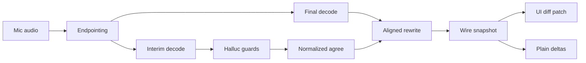
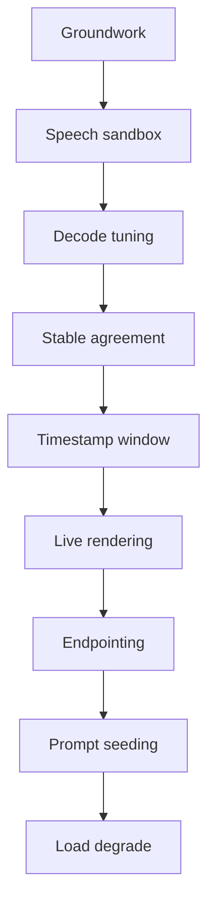

# PromptForge Real-Time STT: Two-Model Commit, Reconcile, and Render Upgrade

<product-contract>

## Product Requirements

Dictation in the workshop editor shows words forming as the user speaks, from a fast `base.en` interim pass every 500 ms and a slower `small.en` final pass that trails behind. Today the visible text flickers because the agreed prefix is an exact token match, the final text replaces whole stretches, the interim pass re-decodes the full window with default whisper settings, the editor rewrites the whole take on every update, and overload fails the take. This plan makes the prefix stable and growing, lets the accurate pass refine only the words that differ, cuts interim cost, renders a styled tentative tail, and measures all of it.

- Problem and users:
  - Users dictating in the workshop editor (push-to-talk) and plain OpenAI-Realtime clients of the gateway's `/v1/realtime` endpoint.
  - Instability comes from: exact-equality agreement (`crates/gateway/stt/api/src/take/agreement.rs:11`), an agreed span recomputed each tick so it can shrink (`crates/gateway/stt/api/src/take/window.rs:68-145`), final text appended over interim for its range (`crates/gateway/stt/api/src/take/state.rs:234-261`), and a UI that replaces the whole owned range with `event.transcript` (`crates/workshop/ui/src/parts/take/take-registry-events.ts:264-298`, `crates/workshop/ui/src/parts/take/take-registry-state.ts:52-108`).
- Goals:
  - A committed prefix that never shrinks within a window and ignores case and punctuation flips.
  - The accurate pass refines text by aligned rewrite: the accurate text wins, only differing words change on screen, and newer fast-model words stay visible after it.
  - Lower interim decode cost per tick.
  - A UI that styles committed against tentative text and patches only changed words.
  - Better endpointing, hallucination guards, and graceful degradation under load.
  - A speech-sandbox that measures instability and latency, gating every behavior change.
- Non-goals:
  - Replacing `base.en` or `small.en`, Whisper-internal decoder changes, adaptive lag, and admission control (see Deferred).
  - Multilingual support or language detection.
  - Changes to batch transcription.
- Success criteria:
  - The speech-sandbox reports baseline and post-change values for UPWR, UPSR, partial latency, commit lag, agreed-shrink events, and interim decode time (definitions in the Technical Design speech-sandbox contract).
  - Agreed-shrink events are zero after the commit-rule work.
  - UPWR does not increase after any behavior step and decreases after the commit-rule and render work.
  - Partial latency and commit lag do not regress by more than 10 percent against the recorded baseline, except where a step's own criterion says otherwise.
  - Interim decode time decreases after the parameter work, with the native `jfk.wav` transcript contract unchanged.
  - No take fails because the per-take final queue is full.
- Constraints:
  - Every crate's `build.rs` runs a compile-time file-size ceiling (`crates/gateway/stt/api/build.rs`); new logic goes in sibling files using the existing `#[path = "x-tests.rs"]` pattern.
  - The TypeScript decoder rejects unknown keys and enforces `transcript === finalized + agreed + tentative` (`crates/workshop/ui/src/services/realtime-event-decoder.ts:123-137,353-380`); new wire fields must be opt-in.
  - `include` accepts only empty or exactly `["item.input_audio_transcription.hypothesis"]` and is frozen at first append (`crates/gateway/stt/api/src/realtime/route.rs:279-291`, `crates/gateway/stt/api/src/realtime/session.rs:40-46,300-325`).
  - The whisper runtime is pinned to `b4938` (`crates/gateway/stt/whisper-ffi/src/raw.rs:1`, `crates/gateway/local/src/artifacts/assets/whisper_rows.rs`, `.github/workflows/whisper-lib.yml`); every new FFI field or function must exist in that library with a matching layout.
  - Follow `AGENTS.md` verification and structural rules. Current vibe logs live at `vibe/YYYY-MM-DD-N-slug.md`; older ones are archived under `vibe/YYYY-MM/`.
- Open questions: None

## Functional Specification

A word moves through three states: tentative (latest fast-pass guess), agreed (stable across fast passes), and finalized (produced by the accurate pass). The gateway decides transitions and reports them on the wire; the workshop UI draws them and patches only what changed. Plain clients receive append-only deltas from the stable prefix during the take. A full final queue and a dropped socket keep already-accepted text instead of discarding the take.

- Actors and workflows:
  - Workshop user holds push-to-talk; the AudioWorklet streams 24 kHz PCM16 in 100 ms chunks; release sends `commit`; `completed` delivers the final transcript. Turn boundaries remain push-to-talk; endpointing only decides where final segments close.
  - Plain OpenAI client streams audio and receives `conversation.item.input_audio_transcription.delta` and `completed`.
  - Developer runs the speech-sandbox against committed fixtures and the native fixture.
- Inputs and outputs:
  - Input: `input_audio_buffer.append`, `commit`, `clear`, `session.update` (unchanged).
  - Output for opted-in clients: the existing hypothesis event (`event_id`, `item_id`, `content_index`, `revision`, `transcript`, `finalized`, `agreed`, `tentative`, `audio_start_ms`, `audio_end_ms`, per `crates/gateway/stt/api/src/realtime/wire/server.rs:86-110,183-195`), plus `finalized_through_ms` (audio milliseconds covered by finalized text) and `finalized_seq` (count of final outcomes applied to the item) only when a second include token is negotiated.
  - Output for plain clients: live append-only deltas during the take, built from finalized text plus agreed text minus its last 2 words, instead of deltas queued until commit (`crates/gateway/stt/api/src/realtime/session/route.rs:23-31,112-155`). `completed` is unchanged and remains the authoritative text.
- States and validation:
  - Tentative to agreed: a word's normalized form (alphanumeric characters only, lowercased, the rule `equivalent_token` uses at `crates/gateway/stt/api/src/take/agreement.rs:42`) matches at the same position in at least 2 fast passes whose audio end positions differ by at least 0.5 s. Both thresholds are named constants tuned with the speech-sandbox.
  - Agreed never shrinks within a window. A hypothesis that neither extends the agreed prefix nor reaches 0.35 normalized-token similarity with any of the last 5 hypotheses is held as an outlier and adopted only when the next hypothesis is similar to it.
  - Agreed to finalized: when a final lands for a sample range, its text is authoritative for that range. The bounded token alignment maps the final's last word onto the previously displayed text; displayed words after that point stay as agreed or tentative when at least 2 normalized tokens before them match the final's tail, capped at 5 words, until the next fast pass re-derives them. Without that anchor they are dropped.
  - Revision increments only when an emitted snapshot differs from the last emitted one.
  - The UI drops any hypothesis whose revision is at or below the last applied one.
- Errors and recovery:
  - Per-take final queue full: keep the accepted interim text for that range (the skipped-range mechanism in `crates/gateway/stt/api/src/take/final_outcome.rs:62-118`) and retry the final decode when the queue has room, instead of raising `TakeFailure::SegmentCapacity` (`crates/gateway/stt/api/src/take/finalization.rs:68-70,101-103`). When the 30 s retained PCM cap forces release of a pending range, its accepted interim text becomes final.
  - Process-wide worker queue full (`TranscribeError::Overloaded`, `crates/gateway/stt/engine/src/worker.rs:74-83`): skip that interim tick without failing the take.
  - Socket loss: keep finalized and agreed text in the editor and drop only the tentative tail, instead of `rollbackAll` restoring the take's original text (`crates/workshop/ui/src/parts/take/take-registry-events.ts:372-389`). Reconnect backoff gains jitter.
  - A hypothesis vetoed by the hallucination guards never enters agreement history.
- Security and privacy behavior:
  - No new persisted data in production.
  - Replay fixtures contain only scripted sequences, streams generated from the existing `jfk.wav`, or developer-recorded sessions with consent. No user recordings are committed.
- Acceptance criteria:
  - Commit-rule tests show a punctuation or case flip does not block or reverse an agreed word, and agreed never shrinks across a scripted hypothesis sequence.
  - Aligned-rewrite tests show a final that differs in one word changes one word in the snapshot and keeps the anchored fast suffix.
  - Revision tests show no increment when the snapshot is suppressed or unchanged.
  - UI tests show only changed words are replaced, tentative text carries a distinct decoration, stale revisions are ignored, and one dictation is one undo step.
  - Segmenter tests show a short close when the latest interim text ends in terminal punctuation and the 2 s close otherwise.
  - Overload tests show a full final queue no longer fails the take.

</product-contract>
<implementation-contract>

## Technical Design

The change stays inside the existing layering: whisper FFI, model backend, backend-neutral engine, the take and session in the API crate, and the workshop registry. New behavior enters as per-role decode parameters, a normalized evidence-based agreement inside the window state, an aligned reconcile in the take state that reuses the existing bounded token alignment, an opt-in wire extension, and a diff-patching renderer. Public wire compatibility is preserved by negotiation.

- Architecture:
  - Interim and final passes keep separate roles via `DecodeRequest.mode` (`crates/gateway/stt/engine/src/decoder.rs:12-158`); the role now selects a parameter profile, not only `single_segment` and the prompt (`crates/gateway/stt/backend-whisper/src/model.rs:109-245`).
  - Agreement state lives in `WholeWindowState` (`crates/gateway/stt/api/src/take/window.rs`); finalized state in `FinalizedState` (`crates/gateway/stt/api/src/take/state.rs`); both keep absolute u64 sample indices.
  - The aligned rewrite reuses the bounded banded token alignment used for forced boundaries (`crates/gateway/stt/api/src/take/agreement-final-overlap.rs`: band 8 tokens, at most 96 tokens, edit ratio 1/5).
  - The segmenter receives a sentence-end hint (whether the latest accepted interim text ends in `.`, `?`, or `!`) from the take; it does not read interim text itself.
- Modules and interfaces:
  - `whisper-ffi`: new `FullParams` setters beside the existing `set_*` methods and wired in `apply` (`crates/gateway/stt/whisper-ffi/src/params.rs:37-202`) for temperature increment, audio context, max tokens, thread count, token timestamps, and entropy, log-probability, and no-speech thresholds. New context getters beside `segment_count` and `segment_text` (`crates/gateway/stt/whisper-ffi/src/context.rs:184-198`) for per-token probability and timestamps, and per-segment no-speech probability when the `b4938` library exports it. Flash attention is a context parameter in whisper.cpp; expose it only if `raw.rs` mirrors it for `b4938`.
  - `backend-whisper`: per-role parameter profiles. Interim: temperature fallback disabled, `audio_ctx = max(512, roundup64(50 x window_seconds + 128))`, `max_tokens` about 4 per second of window, `n_threads = max(1, min(4, available_parallelism / 2))`. Final: fallback kept, same thread rule.
  - `api/take`: normalized comparison and per-token evidence (observation count, first and latest audio end) in agreement; monotonic agreed; outlier hold; aligned reconcile and anchored fast suffix in state; interim window start at the end of the last agreed word once token timestamps exist (`crates/gateway/stt/api/src/take.rs:120-121,135-139`).
  - `api/segment`: hangover, 0.5 s pre-roll, hint-aware close silence, and a pure three-rule endpoint function (`crates/gateway/stt/api/src/segment.rs:22-34,94-175`, `crates/gateway/stt/engine/src/policy.rs:7,95-96`).
  - `api/realtime`: revision bump only on change; second include token for extended fields; live plain-client deltas with a 2-word hold-back.
  - Workshop UI: revision guard, word-level minimal diff in `replaceTake`, tentative decorations from part lengths, a 1-word render hold-back, undo grouping, a hidden polite accessibility region, and socket-loss keep; jitter in `crates/workshop/platform/reconnect-backoff.ts:47-62`.
  - Dictation targets: the take registry writes through the `SttInputTarget` interface (`crates/workshop/ui/src/parts/stt/stt.ts:17-24`). The live target is the agent chat box (`crates/workshop/ui/src/parts/agent/agent-session-view.ts:258`), a TipTap editor over ProseMirror whose `replaceRange` takes ProseMirror positions (`crates/workshop/ui/src/parts/chatbox/chat-box.ts:506`); a plain-textarea adapter also exists (`stt.ts:41`). The CodeMirror file editor (`crates/workshop/ui/src/parts/editor/editor-surface.ts`) is not a dictation target. `SttInputTarget` gains an optional tentative-range method: the chat box implements it with a ProseMirror decoration plugin, and the textarea adapter omits it, so a textarea shows no tentative styling but still gets the diff patch and hold-back.
- File and public API changes:
  - Wire: the include token `item.input_audio_transcription.hypothesis.ranges` is accepted only together with the existing hypothesis token and is frozen at first append like it; the ranges token alone is rejected. When negotiated, hypothesis events add `finalized_through_ms` and `finalized_seq`. The TS decoder accepts those keys only when it requested the token. Existing clients see no change.
  - Speech-sandbox contract (shared by the Rust take, the native capture, and the Workshop UI tests):
    - Fixtures live in `crates/gateway/stt/api/tests/fixtures/replay/`: scripted `scripted-*.json`, the native `jfk-native.json`, golden `<fixture>.snapshots.json`, a fixed `baseline.json` recorded before any behavior change, and `metrics.json` holding the current numbers.
    - The replay test regenerates golden snapshots and `metrics.json` when `PROMPTFORGE_REPLAY_UPDATE=1` is set; every behavior step commits its regenerated snapshots and metrics, so the history carries the numbers. `baseline.json` never changes after it is recorded.
    - Metrics, over one take's interim snapshots and its final transcript: UPWR is the count of displayed words a later snapshot changes or removes, divided by the final transcript's word count; UPSR is the fraction of snapshots that change or remove at least one previously displayed word; partial latency is the mean delay from a word's audio end to its first appearance; commit lag is the mean delay from a word's first appearance to agreed; agreed-shrink events count snapshots whose agreed text does not extend the previous agreed text within the same window; interim decode time is wall time per interim decode on the native path.
    - Thresholds the replay test enforces against `baseline.json`: UPWR never above baseline; partial latency and commit lag at most 110 percent of baseline unless a step states otherwise; agreed-shrink events zero once the commit rule lands.
    - Lower latency is always preferred. When a setting trades latency against stability, choose the lowest-latency value that still meets the step's stability gates; the 110 percent ceiling is a guardrail, not a budget to spend.
  - Plain clients: deltas arrive during the take instead of only at commit; `completed` is unchanged.
  - No config schema change is required; if per-role decode settings are exposed, their defaults reproduce the values above.
- Data, persistence, failure, security, and privacy constraints:
  - Do not change the RAII PCM budget and absolute sample indexing (`crates/gateway/stt/api/src/take/pcm.rs`), epoch cancellation and the abort flag, the digest-pinned model pair and drift test (`crates/gateway/config/src/config/stt.rs`), or the transcript concatenation invariant.
  - FFI layout must match `b4938` exactly; a mismatch is undefined behavior.
  - A range awaiting a retried final keeps its PCM reserved against the 30 s cap; when the cap forces release, the accepted interim text stands as final.

</implementation-contract>
<verification-contract>

## Testing Plan

Characterization tests pin today's behavior before anything changes, then each behavior change flips the relevant test to the new invariant. Rust tests stay co-located through sibling `*-tests.rs` files and the `it` integration directory; UI tests stay under `crates/workshop/ui/test/`. The speech-sandbox provides the numbers that gate every behavior step.

- Unit:
  - Agreement: normalized comparison, evidence threshold, monotonic agreed, outlier hold (`crates/gateway/stt/api/src/take/agreement.rs` inline tests, `window-tests.rs`, `window-tests-live-prefix.rs`).
  - Reconcile: a one-word difference changes one word; the anchored suffix is kept and capped at 5 words; no anchor drops the suffix (`state-tests.rs`).
  - Params: `audio_ctx` formula and floor, per-role profile values, thread rule, veto thresholds, n-gram loop collapse, phrase list.
  - Segmenter: hangover, pre-roll, hint-aware close, three-rule endpoint function.
  - Session: revision increments only on an emitted change (`crates/gateway/stt/api/src/realtime/session/route.rs:117-134`).
  - UI: revision guard, word-level diff patch, decorations from part lengths, hold-back, undo grouping, socket-loss keep (`crates/workshop/ui/test/take-registry.mjs`, `take-registry-regressions.mjs`, `realtime-wire-fixtures.mjs`); reconnect jitter with injected randomness (`crates/workshop/platform/test/reconnect-backoff.mjs`).
- Integration and end-to-end:
  - JSON sequence fixtures in the `it` directory updated for the revision rule, the second include token, and live plain-client deltas.
  - Native whisper ignored tests (`crates/gateway/stt/backend-whisper/tests/native_whisper.rs`, notably `packaged_runtime_preserves_native_transcription_contract`) keep the `jfk.wav` transcript contract after parameter changes.
  - Speech-sandbox: the replay test computes UPWR, UPSR, partial latency, commit lag, agreed-shrink events, and interim decode time as defined in the speech-sandbox contract in Technical Design, and fails when a threshold there is broken.
- Regression, security, and performance:
  - Full suite: `cargo nextest run --locked --workspace --exclude workshop --exclude workshop-server --exclude workshop-server-api --all-features`.
  - Miri: `cargo +nightly-2026-09-05 miri test -p gateway-stt-engine --features test-fixtures miri_` and the same for `-p gateway-stt` (`.github/workflows/stt-miri.yml`).
  - Native: provision `ggml-tiny.en.bin` and `jfk.wav`, then run the ignored native tests for `gateway-stt-backend-whisper`, `gateway-whisper-ffi --lib`, and `gateway-stt --lib` and `--test it` with `--test-threads=1`.
  - UI: `node --test "test/**/*.mjs" "src/**/*.test.mjs"` in `crates/workshop/ui`.
  - FFI layout check against the `b4938` `whisper.h` before any new setter or getter ships.
- Exit criteria:
  - All suites above pass.
  - The speech-sandbox baseline is recorded before the first behavior change, and final numbers meet the success criteria.
  - No file exceeds the build ceiling.

</verification-contract>
<decision-record>

## Decision Record

- Decisions:
  - Safe fixes and characterization tests first, then this order: speech-sandbox; decode parameters with hallucination guards; commit rule; aligned rewrite; token timestamps; wire and rendering; endpointing; interim prompt seeding; degradation under load. Rationale: safe fixes remove known contradictions at near-zero risk, characterization tests make each later behavior change a visible test flip, and the order follows payoff with shared files grouped. User: "Follow the ordering of the report, and before hand get any obvious safe fixes in first (including tests as needed)."
  - Aligned rewrite for the accurate pass. Rationale: the accurate model exists to refine what the user sees, and alignment-based partial rewriting reduced partial WER with negligible latency in published work and in a working project (sources below). User chose: "Aligned rewrite: the accurate text wins, but only the words that differ change on screen, and the fast model's newer words stay after it."
  - Normalized, evidence-based, monotonic commit rule. Rationale: punctuation, spacing, and casing flips were 45.9 percent of partial instability in one measured recognizer, and four independent projects commit by agreement across passes with a never-retract frontier (sources below).
  - The speech-sandbox gates behavior changes. Rationale: the pipeline has no latency or quality test today, and two reference projects measure commit behavior by replay with a frozen clock (sources below).
  - New wire fields are opt-in through a second include token. Rationale: the TS decoder rejects unknown keys, so unnegotiated fields would break existing clients.
  - Live plain-client deltas come from the monotonic prefix with a 2-word hold-back. Rationale: once agreed cannot shrink, append-only deltas are safe except near the boundary an aligned rewrite can touch; a production server holds back 5 unfixed tokens for the same reason, and OpenAI keys events on `item_id` because `completed` can arrive out of order (sources below).
  - Experimental findings are deferred. User chose: "Defer them with revisit conditions tied to the replay harness numbers." (The replay harness was later renamed speech-sandbox.)
  - The extended include token is exactly `item.input_audio_transcription.hypothesis.ranges`, accepted only together with the base hypothesis token and frozen at first append like it; the ranges token alone is rejected. Rationale: a public wire name is hard to change once clients adopt it, and requiring the base token keeps the extended event a strict superset of the hypothesis event.
  - Word end times cross the speech engine through a new `Decoder::decode` return type carrying the text plus per-word end offsets in samples from the request start, empty when the role did not request timestamps. Rationale: the engine stays backend-neutral, and scripted and native decoders share one path to the take's window trimming.
  - Speech-sandbox metrics live in the repository: a fixed `baseline.json` and a regenerated `metrics.json` committed with each behavior step. Rationale: the evidence for every threshold decision survives in git history instead of a chat or scratch log.
  - The interim hallucination veto runs in `backend-whisper` and turns a vetoed decode into an empty transcript. Rationale: token statistics stay inside the backend instead of crossing the engine boundary, and the session already discards empty interim transcripts before agreement.
  - Lower latency is always preferred over higher latency; tunables take the lowest-latency value that meets their stability gates, and the commit rule's evidence spread starts at 0.5 s instead of 0.6 s. User: "does it need to be said that I prefer lower latency to higher latency?"
  - Disputing hypotheses add evidence after the aligned cut, and only a punctuated last word waits for a later hypothesis to continue past it (every last word only if the gates require it). Rationale: evidence from extending hypotheses alone stalls agreement for the rest of a window after one disputed word; deferring every last word would cost a tick on each edge word, while deferring only punctuated ones fixes the observed failure (a frozen "Americans." rewritten by the forced final) at the lowest latency. Rejected: keeping agreed interim wording over a forced final (contradicts the aligned rewrite, where the final wins) and leaving the stall (hides missing agreement from the commit-lag metric).
- Rejected alternatives:
  - Never rewrite committed text (transcribe.cpp's finalize rule). Reason: discards `small.en` corrections on text the user already sees. Revisit if the speech-sandbox shows aligned rewrite raises UPWR above baseline.
  - Adopting Silero VAD immediately. Reason: the subject recorded it as too heavy (`crates/gateway/stt/api/src/segment.rs:8-10`) and no reference publishes per-frame cost. Revisit after the cheap endpointing changes, with a measured CPU cost.
  - Range-keyed segments with per-segment revisions now (sherpa-onnx style). Reason: large protocol change; the two new fields cover the need. Revisit if late finals still cause visible errors.
  - Granite Speech TurboCTC as the final model. Reason: it accepts no glossary prompt, losing the final pass's glossary conditioning.
  - Beam search for the final pass. Reason: it needs an FFI variant and no whisper.cpp benchmark was found.
  - Admission control at session start in this plan. Reason: how the session reacts to `TranscribeError::Overloaded` was not established, and rejecting sessions needs a wire error choice. Revisit after the degrade work shows overload in practice.
- Assumptions, risks, and notes:
  - The FFI claims `b4938` and its `FullParams` mirror includes VAD fields and `carry_initial_prompt` (`crates/gateway/stt/whisper-ffi/src/raw.rs:1,97,127-129`); which upstream release introduced those was not established. A layout mismatch is undefined behavior, so the layout check blocks every new setter and getter.
  - The per-segment no-speech probability getter may be absent from `b4938`; when it is, the veto uses average token log-probability and the loop and phrase checks only.
  - Token timestamp accuracy on `base.en` and its interaction with `single_segment` are unmeasured; the timestamp work is medium confidence.
  - Too small an `audio_ctx` truncates audio; the formula keeps a floor of 512 and a margin of 128.
  - Prompts can be re-emitted as hallucinations, and a glossary prompt has been reported to cause hallucination; the interim prompt change ships only if the speech-sandbox shows less flicker and no re-emission.
  - The evidence thresholds (2 observations, 0.5 s) let a word agree after two consecutive 500 ms ticks, the lowest spread that still requires two distinct passes; the earlier 0.6 s value needed three ticks and was dropped for latency.
  - How the session reacts to `TranscribeError::Overloaded` today was not established; the degrade work starts by reading it.
  - The dictation target is read-only while any take exists (`crates/workshop/ui/src/parts/take/take-registry.ts:164-169`, `crates/workshop/ui/src/parts/stt/realtime-stt.ts:109-118`), so caret preservation during a take is not needed.
  - The workshop uses CodeMirror 6 for its file editor, but dictation writes into the TipTap/ProseMirror chat box, so decorations and undo grouping use ProseMirror's mechanisms (a decoration plugin, and `addToHistory: false` transaction metadata).
  - The 15 s window never binds because the forced stride closes at 10 s with 8 s overlap (`crates/gateway/config/src/config/stt.rs:6`, `crates/gateway/stt/api/src/segment.rs:23-24`) and the window starts at the segmenter's consumed cursor (`crates/gateway/stt/api/src/take.rs:135-139`); the default moves to 10 s only after interim windows start at the last agreed word, not as a safe fix.
  - If a characterization test cannot reproduce a described behavior (for example agreed shrinkage), record that in the test file and treat the corresponding invariant as already holding.
  - External sources were accessed 2026-10-06. The Baranski hallucination figure was seen through an aggregator.
  - Reference licenses: RealtimeSTT, whisper_streaming, transcribe.cpp, and Handy are MIT; WhisperLiveKit and sherpa-onnx are Apache-2.0; franken_whisper is MIT with a non-standard rider and is cited for design only. Ideas are reimplemented, not copied.

### Sources by work item

- Revision only on emitted change: transcribe.cpp bumps its revision only on a real change, https://github.com/handy-computer/transcribe.cpp/blob/5bb2deb2a4afb1fd50534ecb51cfcb521ef94944/include/transcribe.h#L2040-L2108
- Reconnect jitter: WhisperLiveKit's jittered reconnect that keeps the display, https://github.com/QuentinFuxa/WhisperLiveKit/blob/363e4f6d029694d9c81ae548beddd9d3c88a3637/whisperlivekit/web/live_transcription.js#L384-L418
- Speech-sandbox:
  - RealtimeSTT replay evaluator, https://github.com/KoljaB/RealtimeSTT/blob/777727553eedfa19aead15337ce66bab549add3f/tools/evaluate_realtime_text_stabilizer.py
  - whisper_streaming frozen-clock simulation, https://github.com/ufal/whisper_streaming/blob/6da90b44b7e50d79695e68166d2a2c7609c75abb/whisper_online.py#L911-L939
  - Instability metrics: https://www.bruguier.com/pub/deflickering.pdf (UPWR 0.08 to 0.03 for 1 ms), https://arxiv.org/abs/2506.17077, https://arxiv.org/abs/2006.01416
  - Per-tick acceptance counters: https://docs.vllm.ai/en/latest/features/speculative_decoding/acceptance_metrics/
- Decode parameters:
  - `audio_ctx`: `base.en` total time 204 s to 60 s with no WER loss on that set, https://github.com/ggerganov/whisper.cpp/issues/1855 and https://github.com/ggml-org/whisper.cpp/discussions/297
  - Temperature fallback and token cap (4 times the seconds; `temperature_inc` of -1.0 disables fallback), https://github.com/ggerganov/whisper.cpp/issues/412 and https://github.com/ggml-org/whisper.cpp/blob/master/examples/stream/stream.cpp
  - Threads: 16 threads 5.2 s against 32 threads 124 s or more on one 16-core machine, https://github.com/ggml-org/whisper.cpp/issues/200
  - Flash attention pinning, https://github.com/ggerganov/whisper.cpp/pull/2152
  - Padded-encoder cost: encoder latency 602 to 218 ms with WER within 1 percent, https://arxiv.org/abs/2507.10860
  - `suppress_regex` runs a regex over the whole vocabulary each decode step (whisper.cpp source), so it is avoided.
- Hallucination guards:
  - No-speech above 0.6 with average log-probability below -1.0, https://github.com/openai/whisper/discussions/1606
  - Delooping plus phrase list plus VAD, WER from over 100 percent to 6.5 percent on noisy speech, https://arxiv.org/abs/2501.11378
  - Packaged phrase lists and loop collapse, https://docs.rs/whisper-guard/latest/src/whisper_guard/segments.rs.html
- Commit rule:
  - 45.9 percent of partial instability from punctuation, spacing, and casing (Table 2), https://arxiv.org/abs/2006.01416
  - RealtimeSTT evidence count and never-retract frontier, https://github.com/KoljaB/RealtimeSTT/blob/777727553eedfa19aead15337ce66bab549add3f/RealtimeSTT/core/realtime_text_stabilizer.py#L581-L610 and outlier hold, https://github.com/KoljaB/RealtimeSTT/blob/777727553eedfa19aead15337ce66bab549add3f/RealtimeSTT/core/realtime_text_stabilizer.py#L414-L458
  - LocalAgreement frontier, https://github.com/ufal/whisper_streaming/blob/6da90b44b7e50d79695e68166d2a2c7609c75abb/whisper_online.py#L371-L417 and https://arxiv.org/abs/2307.14743
  - transcribe.cpp agreement across the last 3 hypotheses, https://github.com/handy-computer/transcribe.cpp/blob/5bb2deb2a4afb1fd50534ecb51cfcb521ef94944/src/transcribe-asr.cpp#L510-L538
  - WhisperLiveKit committed-time guard, https://github.com/QuentinFuxa/WhisperLiveKit/blob/363e4f6d029694d9c81ae548beddd9d3c88a3637/whisperlivekit/simul_whisper/backend.py#L40-L47
- Aligned rewrite:
  - Partial rewriting: partial WER down 10 to 19 percent on four of five sets with under 10 ms latency change, https://arxiv.org/abs/2312.09463
  - RealtimeSTT bounded anchored suffix, https://github.com/KoljaB/RealtimeSTT/blob/777727553eedfa19aead15337ce66bab549add3f/RealtimeSTT/core/realtime_merge.py#L194-L231 and https://github.com/KoljaB/RealtimeSTT/blob/777727553eedfa19aead15337ce66bab549add3f/RealtimeSTT/core/realtime_merge.py#L651-L821
  - RealtimeSTT tail-only accurate splice, https://github.com/KoljaB/RealtimeSTT/blob/777727553eedfa19aead15337ce66bab549add3f/RealtimeSTT/core/tail_transcription.py#L239-L497
  - Azure second pass replaces only the final, https://learn.microsoft.com/en-us/azure/ai-services/speech-service/how-to-recognize-speech
  - Google caption study (N=123), alignment plus merging beat raw output, https://research.google/blog/modeling-and-improving-text-stability-in-live-captions/
  - Rejected rule (never rewrite committed bytes), https://github.com/handy-computer/transcribe.cpp/blob/5bb2deb2a4afb1fd50534ecb51cfcb521ef94944/src/transcribe-asr.cpp#L577-L600
- Token timestamps and trimming:
  - whisper_streaming trims behind the commit frontier, https://github.com/ufal/whisper_streaming/blob/6da90b44b7e50d79695e68166d2a2c7609c75abb/whisper_online.py#L544-L575
  - WhisperLiveKit trims at sentence or segment ends, https://github.com/QuentinFuxa/WhisperLiveKit/blob/363e4f6d029694d9c81ae548beddd9d3c88a3637/whisperlivekit/local_agreement/online_asr.py#L189-L351
  - Trim at the last committed word's end timestamp, https://arxiv.org/pdf/2604.25611v1
  - DTW token timestamps, https://github.com/ggerganov/whisper.cpp/pull/1485
- Wire and rendering:
  - Time-range watermark, https://developer.apple.com/documentation/speech/speechtranscriber/result
  - Final versus speaker-done, https://developers.deepgram.com/docs/understand-endpointing-interim-results
  - Out-of-order `completed`, key on `item_id`, revision handling, https://platform.openai.com/docs/guides/realtime-transcription and https://developers.openai.com/api/docs/guides/realtime-transcription
  - Plain-client hold-back of 5 unfixed tokens, http://mstar.stanford.edu/mstar/_modules/mstar/api_server/openai/serving_realtime.html
  - Segment-id replacement on the client, https://github.com/k2-fsa/sherpa-onnx/blob/99ddefaa92129858b80a71a426903dd4215c83fa/sherpa-onnx/python/sherpa_onnx/display.py#L11-L61
  - Minimal-diff patching, https://yorkie.dev/docs/sdks/prosemirror
  - Volatile versus final styling, https://developer.apple.com/videos/play/wwdc2025/277/
  - Last segment treated as incomplete, https://github.com/collabora/WhisperLive/issues/132
  - Decorations and undo grouping in ProseMirror (decoration sets; history skips transactions whose `addToHistory` metadata is false), https://prosemirror.net/docs/ref/#view.Decorations and https://prosemirror.net/docs/ref/#history
  - Not to copy: WhisperLiveKit's line-diff protocol leaves a stale line when the last line grows, https://github.com/QuentinFuxa/WhisperLiveKit/blob/363e4f6d029694d9c81ae548beddd9d3c88a3637/whisperlivekit/diff_protocol.py#L72-L99
- Endpointing:
  - Three-rule endpoint, https://github.com/k2-fsa/sherpa-onnx/blob/99ddefaa92129858b80a71a426903dd4215c83fa/sherpa-onnx/csrc/endpoint.cc#L74-L93
  - 0.5 s holdback as pre-roll, https://github.com/k2-fsa/sherpa-onnx/blob/99ddefaa92129858b80a71a426903dd4215c83fa/python-api-examples/two-pass-speech-recognition-from-microphone.py#L401-L408
  - VAD state machine with pre-roll and tail flush, https://github.com/ufal/whisper_streaming/blob/6da90b44b7e50d79695e68166d2a2c7609c75abb/whisper_online.py#L629-L727
  - Vendor soft-endpoint silence of 128 to 500 ms with a content check, https://www.assemblyai.com/docs/streaming/turn-detection, https://www.assemblyai.com/docs/streaming/migration-guides/universal-to-universal-3-5-pro-streaming, https://learn.microsoft.com/en-us/azure/ai-services/speech-service/how-to-recognize-speech
- Interim prompt seeding:
  - Committed text that has left the buffer as prompt, https://github.com/ufal/whisper_streaming/blob/6da90b44b7e50d79695e68166d2a2c7609c75abb/whisper_online.py#L458-L475
  - Only finalized text is fed back, https://github.com/ggerganov/whisper.cpp/pull/141
  - Risks: https://github.com/vllm-project/vllm/issues/35276 and https://github.com/openai/whisper/discussions/1606
- Degrade instead of fail:
  - Coalescing sample-bounded queue, https://github.com/QuentinFuxa/WhisperLiveKit/blob/363e4f6d029694d9c81ae548beddd9d3c88a3637/whisperlivekit/processing_queue.py#L22-L146
  - Bounded tail queue falling back to live text, https://github.com/KoljaB/RealtimeSTT/blob/777727553eedfa19aead15337ce66bab549add3f/RealtimeSTT/core/preview_transcription.py#L101-L222
  - Keep last interim on failure, https://github.com/gabrielgydu/nvim-dictation
  - Admission control (deferred), https://github.com/k2-fsa/sherpa-onnx/blob/99ddefaa92129858b80a71a426903dd4215c83fa/python-api-examples/two-pass-wss.py#L599-L612

### Deferred and Out of Scope

- Deferred: streaming-native fast model (Moonshine Streaming Small, 123M, MIT; https://arxiv.org/abs/2602.12241). Revisit when the speech-sandbox shows interim decode time still limits cadence after the parameter and timestamp work.
- Deferred: Whisper-internal re-encode avoidance (AlignAtt, https://arxiv.org/abs/2406.10052; speculative prefill, https://huggingface.co/blog/whisper-speculative-decoding). Revisit only if the FFI can expose per-position logits or cross-attention.
- Deferred: adaptive hold-back and evidence span from observed revision depth (https://webrtchacks.com/how-webrtcs-neteq-jitter-buffer-provides-smooth-audio/). Revisit when the speech-sandbox shows a fixed hold-back is wrong for some speakers.
- Deferred: Silero or whisper.cpp built-in VAD (https://github.com/ggml-org/whisper.cpp/pull/3065, streaming follow-up https://github.com/ggml-org/whisper.cpp/pull/3677). Revisit after the cheap endpointing changes, with measured per-frame CPU cost.
- Deferred: admission control at session start. Revisit after the degrade work shows overload in practice.
- Out of scope: language selection and multilingual models.
- Out of scope: batch transcription and the config UI.

</decision-record>
<project-survey>

## Project Survey

- Status: complete
- Build command: `cargo build --locked` builds only the default member, package `gateway` in `crates/gateway/app` (binary `promptforge-gateway`), per `default-members` in `Cargo.toml`. The gateway's default features are `local`, `web-search`, `config-ui`, and `stt` (`crates/gateway/app/Cargo.toml`); `cargo build --locked -p gateway --no-default-features` is the headless shape, which stubs the speech route and refuses a configuration declaring `[[stt_model]]`. The Workshop desktop app is opt-in: `cargo build --locked -p workshop` (CI first stages the gateway sidecar with `node tools/stage-gateway-sidecar.mjs stage --target <triple> --source <gateway binary>`), or `cargo workshop`, the `.cargo/config.toml` alias for `crates/build-workshop`. UI bundles build into `$OUT_DIR` through build scripts, so CI runs `npm ci --prefix crates/workshop` and `npm ci --prefix crates/gateway/config-ui/ui` before any cargo build (`.github/workflows/ci.yml`).
- Focused test command pattern: `cargo nextest run --locked -p <crate> --all-features <test-name-filter>`; add `--test it` for a crate's `tests/it` binary or `--test <stem>` for a flat `tests/<stem>.rs` target. Drop `--all-features` for `workshop`, `workshop-server`, and `workshop-server-api`. Gateway process tests: `cargo test --locked -p gateway --no-default-features --features test-fixtures --test it <test-name>`. Native whisper tests are `#[ignore]`d and read `PROMPTFORGE_WHISPER_LIBRARY`, `PROMPTFORGE_WHISPER_MODEL`, `PROMPTFORGE_WHISPER_AUDIO`, and optionally `PROMPTFORGE_WHISPER_BACKEND`; run them as `cargo test --locked -p <gateway-stt|gateway-stt-backend-whisper|gateway-whisper-ffi> <--lib|--test it|--test native_whisper> <filter> -- --ignored --test-threads=1` (`.github/workflows/stt-miri.yml`). Miri: `cargo +nightly-2026-09-05 miri test -p <gateway-stt|gateway-stt-engine> --features test-fixtures miri_`. One JS test file: `node --test <file>` from its package directory.
- Component test command pattern: `cargo nextest run --locked -p <crate> --all-features` (the three Workshop app crates without `--all-features`). The STT subsystem as a unit: `cargo nextest run --locked -p gateway-stt -p gateway-stt-engine -p gateway-stt-backend-whisper -p gateway-whisper-ffi --all-features`. Structural checks: `cargo test -p build-xtask`. Workshop JS packages: `npm test --workspace <ui|look|platform>` from `crates/workshop`. Gateway config UI: `npm test` from `crates/gateway/config-ui/ui`.
- Full-suite test command: `cargo nextest run --locked --workspace --exclude workshop --exclude workshop-server --exclude workshop-server-api --all-features`, then `cargo nextest run --locked -p workshop -p workshop-server -p workshop-server-api` (`AGENTS.md`, `.github/workflows/ci.yml`). The workspace run includes `build-xtask`. CI also runs `cargo nextest run --locked -p workshop-workspace --all-features`, `cargo nextest run --locked -p workshop-server --features headless`, the Miri and self-hosted native whisper jobs in `.github/workflows/stt-miri.yml`, `npm test --workspaces --if-present` in `crates/workshop`, and `npm test` in `crates/gateway/config-ui/ui`.
- Linter command: `CARGO_BUILD_WARNINGS=deny cargo clippy --workspace --exclude workshop --exclude workshop-server --exclude workshop-server-api --all-targets --all-features` and `CARGO_BUILD_WARNINGS=deny cargo clippy -p workshop -p workshop-server -p workshop-server-api --all-targets`, plus `cargo check -p gateway --no-default-features` for the headless build shape. Never add a standalone `cargo check --workspace` (`AGENTS.md`). TypeScript: `npm run typecheck --workspaces --if-present` in `crates/workshop` and `npm run typecheck` in `crates/gateway/config-ui/ui`. Supply chain: `cargo deny check`, `cargo audit`, `cargo hakari verify`, and a `cargo tree` check that `ring` stays out of the gateway's normal closure (`.github/workflows/ci.yml`). `.githooks/pre-push` runs the headless check, the workspace clippy, and `cargo deny`.
- Formatter check command: `cargo fmt --all --check` (`rustfmt.toml` sets `style_edition = "2024"`; `.githooks/pre-commit` runs it). No JS formatter configuration found.
- Docs command: `RUSTDOCFLAGS="-D warnings" cargo doc --workspace --no-deps --all-features --exclude workshop --exclude workshop-server --exclude workshop-server-api`; with the same `RUSTDOCFLAGS`, also `cargo doc -p promptforge --no-deps`, `cargo doc -p harness --no-deps`, `cargo doc --locked --no-deps --all-features -p promptforge-engine --document-private-items`, and `cargo doc --locked --no-deps -p workshop-server --document-private-items`. Facade surface: `cargo +nightly-2026-09-05 xtask api --check` (pin in `crates/build-xtask/src/api/toolchain.rs`, checked against `crates/promptforge/public-api.txt`), then `cargo nextest run --locked -p build-xtask --run-ignored only` on the same nightly.
- Test placement and naming conventions:
  - Unit tests live in `#[cfg(test)] mod tests`, inline or in a sibling `<stem>-tests.rs` wired with `#[cfg(test)] #[path = "<stem>-tests.rs"] mod tests;` (`crates/gateway/stt/api/src/audio.rs`, `crates/gateway/stt/engine/src/worker.rs`). A module may have several, such as `batch-tests.rs` and `batch-native-tests.rs` beside `crates/gateway/stt/api/src/batch.rs`.
  - Most crates compile integration tests into one binary at `tests/it/main.rs` (`crates/gateway/app`, `crates/gateway/stt/api`, `crates/harness-internal/runner`, every Workshop library crate). `crates/harness` and `crates/promptforge` use `tests/suite/`. Some crates use flat `tests/<stem>.rs` targets: `crates/gateway/stt/engine/tests/` (`engine_contract.rs`, `feature_boundary.rs`, `startup_cleanup.rs`), `crates/gateway/stt/backend-whisper/tests/native_whisper.rs`, `crates/gateway/cloud-providers/tests/sheet_binary.rs`, and `crates/build-workshop/tests/interruption.rs`. Data goes in `tests/fixtures/`, prompts in `tests/prompts/`, helpers in `tests/common/`.
  - Test names are snake_case sentences stating the behavior, such as `batch_selects_each_loaded_physical_model_by_name` and `zero_window_is_rejected_before_backend_construction`. Miri-safe tests are prefixed `miri_` so the Miri job's filter selects them. Native tests carry `#[ignore = "requires packaged whisper, model, and audio fixtures"]`.
  - STT test doubles sit behind a `test-fixtures` feature (`src/test_fixtures/` in `gateway-stt` and `gateway-stt-engine`); `gateway-stt` and `gateway` dev-depend on themselves with that feature so every test target gets it without a flag.
  - `clippy.toml` allows `unwrap` and `expect` only in tests. `.config/nextest.toml` sets a 60s slow timeout and runs `gateway-stt` and `gateway-stt-backend-whisper` in a `heavy` group at four threads per test.
  - JS tests run under `node --test` over `test/**/*.mjs` (Workshop packages) and `src/**/*.test.mjs` (Workshop `ui` and the gateway config UI).
- Directory map:
  - `crates/promptforge/`: the Engine facade, the family's one public crate, with `public-api.txt` as the committed surface listing. `crates/promptforge-internal/`: private Engine crates `engine`, `lua`, `model-client`, `parser`, `types`, `vfs`.
  - `crates/harness/`, `crates/harness-gateway-client/`, `crates/harness-web/`: the public Harness crates. `crates/harness-internal/`: private `runner` and `plugins`.
  - `crates/gateway/`: the private gateway family: `app` (package `gateway`), `cloud-providers`, `config`, `config-ui` (TypeScript UI in `ui/`), `local`, `logging`, `progress`, `protocol`, `routing`, `web-search`, and `stt/`.
  - `crates/gateway/stt/`: the speech-to-text subsystem. `api` (package `gateway-stt`) is the gateway-owned speech facade and HTTP endpoints: artifact preparation, one-time publication and admission for the single speech runtime (`generation.rs`), the speech-model identity an active generation advertises (`model.rs`), batch transcription, Realtime transcription (`src/realtime/`), and per-take state and finalization (`src/take/`). `engine` (`gateway-stt-engine`) is backend-neutral decoding on dedicated worker threads; its `SttEngine` owns an interim decoder and an optional final decoder, and backends implement `ModelFactory` and `Decoder`. `backend-whisper` (`gateway-stt-backend-whisper`) is the safe whisper backend for that engine. `whisper-ffi` (`gateway-whisper-ffi`) holds runtime-loaded safe bindings for the pinned whisper.cpp API.
  - `crates/gateway-api-types/`, `crates/gateway-api-discovery/`: the gateway's public pair.
  - `crates/workshop/`: the Workshop Host. Rust crates `desktop` (Tauri app, package `workshop`), `server`, `server-api`, `gateway`, `menu`, `protocol`, `registry`, `status`, `support`, `user-state`, `workspace`, `run-log`, `agents`; npm workspace packages `ui`, `look`, `platform`.
  - `crates/shared-error-source/`, `crates/shared-loopback/`: shared leaf crates. `crates/shared-ui/`: a TypeScript and CSS package for the gateway config UI, not a Rust crate.
  - `crates/build-*`: tooling. `build-xtask` (structural checks run as tests, plus the `api`, `tidy`, `site`, and `new-crate` subcommands), `build-workshop`, `build-ui`, `build-user-guide`, `build-llama-cuda`, `build-ceiling`. `crates/workspace-hack/`: the cargo-hakari crate (`.config/hakari.toml`).
  - `guide/`: user guide books, chrome, and landing page. `prompts/`: example prompts. `tools/`: Node scripts for staging the gateway sidecar and a live TTS check. `vibe/`: plan records. `.github/workflows/`: `ci.yml`, `stt-miri.yml` (STT Miri plus native whisper on a self-hosted Windows CUDA runner), `whisper-lib.yml` (builds the runtime-loadable whisper.cpp bundles), and release workflows. `.githooks/`: pre-commit and pre-push.
  - `local/`: gitignored developer files: gateway config and env files, profiles, prompts, and `stt-fixtures/` (whisper and ggml runtime DLLs, CUDA runtime DLLs, `ggml-tiny.en.bin`, `jfk.wav`, `whisper.h`, and `parakeet.dll`).
- Component boundaries (enforced by `cargo test -p build-xtask` through `crates/build-xtask/src/product.rs`, `tidy.rs`, and the guards they run):
  - Engine (`promptforge`, `promptforge-*`) depends on no gateway, Workshop, or Harness crate, and its manifests declare no async runtime and no HTTP client (`engine_deps.rs`). Crates outside the family reach it only through `promptforge`.
  - Harness (`harness`, `harness-*`) names only `promptforge` and `workspace-hack` outside its family and declares no normal `tokio` or `tokio-util` dependency (`harness_bans.rs`). Others reach it only through `harness`, `harness-gateway-client`, and `harness-web`.
  - Gateway (`gateway`, `gateway-*`) depends on no Engine, Workshop, or Harness crate. `crates/gateway/` is private to the family; Workshop crates may name only `gateway-api-types` and `gateway-api-discovery`.
  - STT: `crates/gateway/stt/` is a nested private container whose only crate the rest of the gateway family may name is `gateway-stt`, and only `gateway` depends on it, behind its `stt` feature. Inside, `gateway-stt` depends on `gateway-stt-engine`, `gateway-stt-backend-whisper`, `gateway-config`, `gateway-local`, and `gateway-progress`; `gateway-stt-backend-whisper` depends on `gateway-stt-engine`, `gateway-whisper-ffi`, and `gateway-progress`; `gateway-stt-engine` and `gateway-whisper-ffi` name no workspace crate besides `workspace-hack` and `build-ceiling`.
  - Workshop tiers: vocabulary (`workshop-protocol`, `workshop-registry`, `workshop-support`) names no Workshop crate; services (`workshop-gateway`, `workshop-menu`, `workshop-status`) name vocabulary only; features (`workshop-agents`, `workshop-run-log`, `workshop-user-state`, `workshop-workspace`) name vocabulary and services; `workshop-server` may name every lower tier. The desktop app `workshop` names only `workshop-server-api`, which names only `workshop-server`.
  - `shared-*` crates depend on no product crate. Only `crates/gateway/app`, `crates/gateway/stt/whisper-ffi`, `crates/gateway-api-discovery`, and `crates/workshop/desktop` may relax `unsafe_code` (`unsafe_allowlist.rs`). A Cargo cycle rejection means the design is wrong, not the graph (`AGENTS.md`).
- Conventions summary:
  - Rust edition 2024 on stable (`rust-toolchain.toml`), resolver 3. Every dependency version lives in root `[workspace.dependencies]` with a comment justifying each pin or feature choice, and every member inherits `workspace-hack`. whisper.cpp is loaded at runtime through `libloading` rather than linked into Cargo builds (`Cargo.toml`), in line with the rule that runtime and serve paths never compile native dependencies (`AGENTS.md`).
  - Members inherit `[workspace.lints]`: clippy `all` and `pedantic` at deny; `unwrap_used`, `expect_used`, `allow_attributes`, and `allow_attributes_without_reason` at deny (suppress with `#[expect(lint, reason = "...")]`); `unsafe_code` at deny; `missing_docs` and `unreachable_pub` at warn, which the gate denies. `clippy.toml` bans process-global installers outside binary entry points.
  - Every crate's `build.rs` runs `build_ceiling::check()`, which fails the build when a Rust file under `src`, `tests`, `benches`, or `examples` exceeds 500 lines (`crates/build-ceiling/src/lib.rs`).
  - Source directories stay flat: one or two child files sit beside the parent as `foo-bar.rs` wired by `#[path]`, three or more become a `foo/` directory, and a group on the wrong side is converted when touched (`AGENTS.md`).
  - No doc comment may hold a code block rustdoc would compile (`crates/build-xtask/src/no_doctests.rs`).
  - Every `workshop-*` and `harness-*` crate's docs carry `//! ## Invariants`. STT crates keep invariants in a crate `AGENTS.md`: `crates/gateway/stt/engine/AGENTS.md` (stateless decode jobs, blocking decoders on their owning threads, startup deadlines that classify without claiming cancellation, shutdown that joins every worker) and `crates/gateway/stt/whisper-ffi/AGENTS.md` (unsafe confined to the crate, raw pointers only behind Drop-owning wrappers, a C ABI pin retargeted together with its size assertions).
  - Engine, Harness, Host, and Plugin are capitalized defined terms with one meaning each; inside `crates/gateway/stt/` a bare "engine" means the speech engine (`AGENTS.md`). `crates/workshop/ui/test/docs-claims.mjs` enforces the terms in every `AGENTS.md`, `## Invariants` doc, and `.cursor/rules` file.
  - Comments explain only non-obvious constraints, and every workaround cites its upstream issue URL. Error and status messages are written for model consumption, naming required versus actual. Long-running gateway work reports through `gateway-progress`.
  - Behavior changes ship with tests in the same change. A Cargo feature gates a real constraint, such as a toolchain requirement or heavy native build, not product shape. Pinned native artifacts in CI are verified by SHA-256 (`.github/workflows/stt-miri.yml`).
  - Commits use short imperative subjects; a finished plan gets a `Close plan: <slug>` commit, and plan records live in `vibe/YYYY-MM-DD-N-<slug>.md`.

</project-survey>
<execution-plan>

## Execution Instructions

Execute the steps in numeric order. Each step is one commit holding its code and its tests. When a step is done, append ` [completed]` to its heading and leave its tags unchanged. Line numbers refer to the tree at plan time (HEAD `0a367c8f8`); earlier steps shift them, so locate code by the named symbol.

### Components

Each component is useful on its own and lands in this order.

1. Groundwork (Steps 1-4): safe fixes, the FFI layout check, and characterization tests. Placed first because the plan requires them before any other work: they remove known contradictions at near-zero risk, make the FFI safe to extend, and turn each later behavior change into a visible test flip.
2. Speech-sandbox (Steps 5-7): metrics, replay fixtures, and the recorded baseline. Placed second because every behavior step is gated on speech-sandbox metrics against that baseline.
3. Decode tuning (Steps 8-10): FFI parameter and token-data surface, per-role whisper profiles, interim hallucination guards. Placed third because it needs only the layout check, gives the cheapest measured payoff (interim decode time), and keeps hallucinated text out of agreement history before the commit rule depends on that history.
4. Stable agreement (Steps 11-12): commit rule, then aligned rewrite. Placed after decode tuning per the plan's order; the aligned rewrite anchors on the monotonic agreed prefix the commit rule creates.
5. Timestamped window (Steps 13-14): word end times through the speech engine, then window trimming. Needs the FFI timestamp getters and a monotonic agreed boundary to trim behind.
6. Live rendering (Steps 15-19): opt-in wire fields, live plain-client deltas, and the workshop UI. Consumes the stable prefix and finalized range data that components 4 and 5 produce.
7. Endpointing (Steps 20-21): pure endpoint function, then the sentence-end hint. Placed after rendering per the plan; the hint reads accepted interim text, which is stable only after component 4.
8. Interim prompt seeding (Step 22): an experiment kept or reverted on speech-sandbox metrics, so it runs against a settled pipeline.
9. Load degradation (Steps 23-24): degrade instead of fail. Placed last per the plan; it changes finalization, which components 4 and 5 reshape first.

### Pieces

- Groundwork: safe fixes (Steps 1-2) are built jointly - gateway and UI fixes share no files and either may go first. The FFI layout check (Step 3) is sequential because it must precede Steps 8 and 13. Characterization tests (Step 4) come after the safe fixes so later flips reflect only behavior work.
- Speech-sandbox: Rust replay and metrics (Step 5), native capture (Step 6), UI replay (Step 7), sequential - Step 6 writes into the fixture and baseline formats Step 5 defines, and Step 7 consumes the golden snapshots both produce.
- Decode tuning: FFI surface (Step 8), role profiles (Step 9), guards (Step 10), sequential - profiles call the new setters and guards read the new getters.
- Stable agreement: commit rule (Step 11), aligned rewrite (Step 12), sequential - the anchored suffix is defined against agreed text.
- Timestamped window: word end times (Step 13), trimming (Step 14), sequential - trimming needs the end time of the last agreed word.
- Live rendering: server wire (Steps 15-16), then UI (Steps 17-19), sequential - UI negotiation needs the server token, the diff patch sits behind the revision guard, and socket-loss keep uses the part lengths the decorations introduce.
- Endpointing: endpoint function (Step 20), sentence-end hint (Step 21), sequential - the hint changes one input of the extracted function.
- Interim prompt seeding: one piece (Step 22).
- Load degradation: final-queue retry (Step 23) and overloaded-interim skip (Step 24) touch independent paths and could be built jointly; they go in this order because the full final queue is the failure users see today.

### Gates

- Each step is verified at the scope its position requires: focused checks within a component, the formatter, linter, and component tests at a component's last step, and the full build, formatter, linter, docs, and full suite at Step 24 (commands in Project Survey). A step whose Tests line names Miri or ignored native commands runs them as written.
- From Step 8 on, every behavior step regenerates the replay snapshots and `metrics.json` and commits them; the replay test enforces the thresholds in the Technical Design speech-sandbox contract. In addition, Rust replay UPWR is below the baseline after Step 11, and UI replay UPWR is below the baseline after Step 18.
- No Rust file may exceed 500 lines. Files already close to the ceiling: `crates/gateway/stt/api/src/realtime/session.rs` (496), `take/finalization.rs` (486), `realtime/route.rs` (424), `segment.rs` (412), `realtime/wire/server.rs` (405), `take/state.rs` (400), `take/agreement-final-overlap.rs` (400). When a touched file would cross the ceiling, move its inline tests into a sibling `<stem>-tests.rs`; when a module gains a third child file, convert it to a `<stem>/` directory per the flat-sources rule in `AGENTS.md`.
- Replay fixtures are scripted sequences, streams generated from `jfk.wav`, or developer-recorded sessions with consent. Never commit user recordings.
- Two consecutive verification failures with the same failure signature on one step stop the work for a re-plan.
- The run's plan record is `vibe/YYYY-MM-DD-N-stt-two-model-upgrade.md`. After Step 24, commit `Close plan: stt-two-model-upgrade`.

<step-1>

### Step 1: Gateway safe fixes [completed]

- Component: Groundwork
- Piece: safe fixes
- Changes:
  - `crates/gateway/stt/api/src/segment.rs:26-29`: the comment says 700 ms while `MIN_SILENCE_SAMPLES` (line 30) is 2 s. Correct the comment.
  - `crates/gateway/stt/api/src/realtime/session/route.rs:129-134`: `hypothesis_revision` increments even when `next_window_snapshot` returns `None`. Increment only when the emitted snapshot differs from the last emitted one; a suppressed or unchanged snapshot keeps the current revision. The UI ignores revision today, so no client breaks.
  - `crates/gateway/stt/backend-whisper/src/model.rs:19` and `prompt.rs:6` both define `MAX_PROMPT_TOKENS = 224`. Keep the `prompt.rs` definition as `pub(crate)` and use it from `model.rs`.
- Tests: `realtime/session/route-tests.rs` shows no increment on a suppressed or unchanged snapshot and the next number on the next emitted change. Update revision values in `crates/gateway/stt/api/tests/fixtures/realtime/valid-sequences.json` and `tests/it/realtime_fixtures/sequences.rs` where they assert the old rule. Existing `prompt.rs` tests cover the constant.
- Commit: `Fix STT revision bumps, silence comment, and duplicate prompt cap`

</step-1>

<step-2>

### Step 2: Reconnect jitter [completed]

- Component: Groundwork
- Piece: safe fixes
- Changes: `crates/workshop/platform/reconnect-backoff.ts:47-62` doubles to the cap with no jitter. Use equal jitter - half the computed delay fixed plus a random share of the other half - with an injectable random source that defaults to `Math.random`. Cap and reset behavior are unchanged.
- Tests: `crates/workshop/platform/test/reconnect-backoff.mjs` with injected randomness at 0 and just under 1 shows the delay bounds, the cap, and unchanged reset.
- Commit: `Add equal jitter to Workshop reconnect backoff`

</step-2>

<step-3>

### Step 3: Verify the whisper FFI layout against b4938 [completed]

- Component: Groundwork
- Piece: FFI layout check
- Changes:
  - Compare `crates/gateway/stt/whisper-ffi/src/raw.rs` (notably lines 70-129) field by field - order, type, and size - with `whisper.h` at the `b4938` tag that `.github/workflows/whisper-lib.yml` builds. `local/stt-fixtures/whisper.h` is a local copy; confirm it matches the tag before relying on it. Fix any mismatch before other work.
  - Extend the size and alignment assertions in `crates/gateway/stt/whisper-ffi/src/lib.rs:55-57` with `std::mem::offset_of!` assertions for every `FullParams` field already set and every field the plan will set: `temperature_inc`, `audio_ctx`, `max_tokens`, `n_threads`, `token_timestamps`, `entropy_thold`, `logprob_thold`, `no_speech_thold`.
  - List which functions the `b4938` library exports among per-token probability (`whisper_full_get_token_p`), token data with timestamps (`whisper_full_get_token_data`), and per-segment no-speech probability (`whisper_full_get_segment_no_speech_prob`), and whether `ContextParams` carries flash attention. Record the list beside the ABI pin in `crates/gateway/stt/whisper-ffi/AGENTS.md`.
- Tests: the offset assertions are compile-time constants checked by `cargo nextest run --locked -p gateway-whisper-ffi --all-features`.
- Commit: `Pin whisper FFI field offsets to b4938`

</step-3>

<step-4>

### Step 4: Characterization tests [completed]

- Component: Groundwork
- Piece: characterization tests
- Changes: tests only, each named for today's behavior with a `characterize_` prefix so the later step that flips it can find it.
  - `crates/gateway/stt/api/src/take/window-tests.rs`: agreed text can shrink across a scripted hypothesis sequence (`window.rs:68-145`). Flipped by Step 11.
  - `crates/gateway/stt/api/src/take/agreement.rs` inline tests: `matching_token_prefix_end` (line 11) stops at a token that differs only by punctuation or case. Flipped by Step 11.
  - `crates/gateway/stt/api/src/take/state-tests.rs`: a final replaces interim text for its whole range (`record_natural_outcome`, `state.rs:234-261`). Flipped by Step 12.
  - `crates/gateway/stt/api/src/take/finalization.rs` is 486 lines; first move its inline `mod tests` (from line 307) into a sibling `finalization-tests.rs` wired by `#[path]`, then add a test that a full per-take final queue records `TakeFailure::SegmentCapacity` (lines 68-70 and 101-103). Flipped by Step 23.
  - `crates/workshop/ui/test/take-registry-regressions.mjs`: `applySnapshot` (`take-registry-events.ts:264-298`) replaces the whole owned range on every hypothesis. Flipped by Step 18.
- If a described behavior cannot be reproduced (for example agreed shrinkage), record that in the test file and treat the corresponding invariant as already holding.
- Commit: `Pin current STT agreement, finalization, and take rendering`

</step-4>

<step-5>

### Step 5: Rust speech-sandbox with scripted baseline [completed]

- Component: Speech-sandbox
- Piece: Rust replay and metrics
- Changes:
  - `crates/gateway/stt/api/src/test_fixtures/replay.rs`, exported from `test_fixtures.rs` behind `test-fixtures`: a `ReplayTake` driver that runs a realtime session with the hypothesis include over the scripted engine doubles from `gateway-stt-engine`'s `test-fixtures`, so session-level rules (revision and snapshot suppression) are measured along with the take and `WholeWindowState`. It feeds scripted interim transcripts (with sample ranges) and finals, triggers each interim tick by calling the session's interim scheduling entry point directly, and uses each tick's fixture timestamp as the clock; it adds no clock abstraction to production code. It returns the emitted snapshot sequence plus the final transcript.
  - `crates/gateway/stt/api/tests/it/replay.rs` with `tests/it/replay/metrics.rs`, registered in `tests/it/main.rs`: UPWR, UPSR, partial latency, commit lag, and agreed-shrink events exactly as defined in the Technical Design speech-sandbox contract.
  - Scripted fixtures `crates/gateway/stt/api/tests/fixtures/replay/scripted-*.json` covering at least punctuation and case flips, a shrinking agreed prefix, a final differing in one word, and a sliding window. Each tick carries `at_ms`, `audio_start_ms`, `audio_end_ms`, and `transcript` (the interim decoder's raw output for that window, not a composed snapshot); each final carries `at_ms`, its sample range, and text. The driver applies ticks and finals in `at_ms` order, and each final's sample range must be a range the take actually finalizes.
  - Golden snapshot files `tests/fixtures/replay/<fixture>.snapshots.json` that the replay test compares against and regenerates when `PROMPTFORGE_REPLAY_UPDATE=1` is set: a `snapshots` array of emitted hypothesis events reduced to their deterministic fields (`at_ms` of the fixture event that produced it, `revision`, `transcript`, `finalized`, `agreed`, `tentative`, `audio_start_ms`, `audio_end_ms`; no `event_id` or `item_id`), plus the take's `completed` transcript. Step 7 replays these through the UI.
  - Metric computation, frozen with the baseline. Words are whitespace-delimited and compared exactly, since case and punctuation are what the user sees. A take's sequence is its golden snapshots' `transcript` values followed by its `completed` transcript. UPWR: for each consecutive pair, count the earlier element's words after the longest common word prefix with the later element; sum, then divide by the `completed` word count. UPSR: the fraction of consecutive pairs with a nonzero count. The word at position k first appears at the `at_ms` of the first snapshot whose transcript has more than k words, and becomes stable at the first snapshot whose `finalized` plus `agreed` has more than k words. Its audio end is interpolated by its position within the final that covers it: the j-th of n words of a final over [s, e] ends at s + (e - s) x j / n. Partial latency is the mean of first appearance minus audio end; commit lag is the mean of stable minus first appearance, over positions that become stable before `completed`. An agreed-shrink event is a snapshot whose `finalized` and `audio_start_ms` (the same window) equal the previous snapshot's and whose `agreed` words do not start with the previous snapshot's `agreed` words.
  - `tests/fixtures/replay/baseline.json`: per-fixture metrics recorded now, before any behavior change; Steps 6 and 7 add its `native` and `ui` sections, and it is never edited after Step 7. `tests/fixtures/replay/metrics.json`: the current numbers. Each writer owns its sections and preserves the others when it regenerates under `PROMPTFORGE_REPLAY_UPDATE=1`: the Rust replay test owns the per-fixture sections, the native timing test (Step 6) owns `native`, and the UI replay (Step 7) owns `ui`.
- Tests: metric unit tests on hand-computed sequences; a replay test that recomputes every fixture's metrics, compares them with `metrics.json`, and fails when a metric breaks the speech-sandbox thresholds against `baseline.json`. Thresholds apply this way: UPWR per fixture never above its baseline; partial latency and commit lag as aggregate means over all words of all fixtures; agreed-shrink events per fixture. Wherever a step requires UPWR below the baseline, it means the aggregate UPWR (total counted words over total `completed` words across fixtures) is below the baseline aggregate.
- Commit: `Add STT speech-sandbox with scripted baseline`

</step-5>

<step-6>

### Step 6: Native jfk replay capture and interim decode timing [completed]

- Component: Speech-sandbox
- Piece: native capture
- Changes:
  - `crates/gateway/stt/api/tests/it/replay/native_capture.rs`: an ignored test (`#[ignore = "requires packaged whisper, model, and audio fixtures"]`) that streams `jfk.wav` through a realtime session in 100 ms PCM16 chunks with the hypothesis include, using `tests/common/native_runtime.rs` and `test_fixtures::native`, and writes the interim and final decoder outputs (each window's raw decoded text and range, not the composed hypothesis events) to `tests/fixtures/replay/jfk-native.json` in the Step 5 fixture format. It triggers an interim tick after every 500 ms of appended audio through the session test fixture instead of a wall-clock timer, and records each event's `at_ms` as the audio position when its decode was issued plus that decode's measured wall time. The fixture uses whatever model the native runtime loads (the provisioned `ggml-tiny.en.bin`) and is a fixed input: later steps never overwrite it, and re-capturing is only for adding a new fixture. The non-ignored replay test replays the committed file like any other fixture.
  - `crates/gateway/stt/backend-whisper/tests/native_interim_timing.rs` (a new flat target; `native_whisper.rs` is already 409 lines): an ignored test that decodes successive interim windows of `jfk.wav` in the interim role and reports wall time per decode (mean and maximum). Write the numbers to the `native` sections of `baseline.json` and `metrics.json`; later runs under `PROMPTFORGE_REPLAY_UPDATE=1` rewrite only the `native` section of `metrics.json`.
- Tests: the replay test covers `jfk-native.json`; the native tests run with `--ignored --test-threads=1`.
- Commit: `Capture native jfk replay fixture and interim decode timing`

</step-6>

<step-7>

### Step 7: Replay fixtures through the workshop take reducer [completed]

- Component: Speech-sandbox
- Piece: UI replay
- Changes: `crates/workshop/ui/test/stt-replay.mjs` loads every `crates/gateway/stt/api/tests/fixtures/replay/*.snapshots.json` by relative path, feeds the events through the take registry reducer, computes rendered-text UPWR and UPSR (editor words changed or removed by later updates, counted the way Step 5 counts them), and checks them against a `ui` section it adds to `baseline.json`, using the Step 5 threshold rule. Under `PROMPTFORGE_REPLAY_UPDATE=1` it rewrites only the `ui` section of `metrics.json`.
- Tests: the file itself, run by `node --test "test/**/*.mjs"` in `crates/workshop/ui`.
- Commit: `Replay STT fixtures through the Workshop take reducer`

</step-7>

<step-8>

### Step 8: FFI decode parameters and token data [completed]

- Component: Decode tuning
- Piece: FFI surface
- Changes:
  - `crates/gateway/stt/whisper-ffi/src/params.rs`: setters beside the existing `set_*` methods, wired in `apply` (lines 37-202): `set_temperature_inc`, `set_audio_ctx`, `set_max_tokens`, `set_n_threads`, `set_token_timestamps`, `set_entropy_thold`, `set_logprob_thold`, `set_no_speech_thold`.
  - `crates/gateway/stt/whisper-ffi/src/context.rs`: getters beside `segment_count` and `segment_text` (lines 184-198) for per-segment token count, per-token probability, and per-token start and end times; a per-segment no-speech probability getter only if Step 3 found it exported. Load new symbols in `library.rs` and mirror their signatures in `raw.rs`.
  - Flash attention: expose it only if Step 3 found it in `ContextParams` at `b4938`.
- Tests: Step 3 offset assertions cover every field the new setters write; unit tests that each setter lands in `FullParams`; ignored native tests in `gateway-whisper-ffi --lib` that read token data and probabilities from a `jfk.wav` decode.
- Commit: `Expose whisper decode thresholds and token data through the FFI`

</step-8>

<step-9>

### Step 9: Per-role whisper decode profiles [completed]

- Component: Decode tuning
- Piece: role profiles
- Changes:
  - `crates/gateway/stt/backend-whisper/src/profile.rs` (new, wired from `lib.rs`): a `RoleProfile` for interim and final roles; `interim_audio_ctx(window_seconds) = max(512, roundup64(50 x window_seconds + 128))`; interim `max_tokens` of about 4 per second of window; `decode_threads(available_parallelism) = max(1, min(4, n / 2))` for both roles; interim temperature fallback disabled, final fallback kept. Confirm the fallback-disabling `temperature_inc` value against `b4938` source before using it.
  - `crates/gateway/stt/backend-whisper/src/model.rs` `transcribe_blocking`: apply the request role's profile instead of selecting only `single_segment` and the prompt. The window length comes from the configured `window_seconds` here; Step 14 switches it to the actual window.
- Tests: `profile.rs` unit tests for the `audio_ctx` formula, its 512 floor and 64 rounding, the thread rule at 1, 2, 8, and 32 cores, and each role's values; `packaged_runtime_preserves_native_transcription_contract` in `native_whisper.rs` still holds; the Step 6 timing test shows lower interim decode time, recorded in the `native` section of `metrics.json`.
- Commit: `Apply per-role whisper decode profiles`

</step-9>

<step-10>

### Step 10: Interim hallucination guards [completed]

- Component: Decode tuning
- Piece: guards
- Changes:
  - `crates/gateway/stt/backend-whisper/src/guard.rs` (new): a veto when segment no-speech probability is above 0.6 and average token log-probability is below -1.0 (log-probability alone when the no-speech getter is absent); collapse of repeated n-gram loops; a short named list of silence-hallucination phrases that vetoes a hypothesis consisting only of one. Do not use `suppress_regex`.
  - `crates/gateway/stt/backend-whisper/src/model.rs`: for the interim role only, compute token statistics from the Step 8 getters and apply the guard. A vetoed interim decode returns an empty transcript, which `realtime/session/route.rs:109-111` already discards before `next_window_snapshot`, so it never reaches `WholeWindowState::try_next`.
- Tests: `guard.rs` unit tests at each threshold boundary, the absent-getter path, loop collapse, and the phrase list; a test in `crates/gateway/stt/api/tests/it/realtime_session/interim.rs` that an empty interim transcript leaves the snapshot and agreement unchanged; regenerate the replay snapshots and `metrics.json` with the speech-sandbox thresholds holding.
- Commit: `Veto hallucinated interim hypotheses before agreement`

</step-10>

<step-11>

### Step 11: Normalized, evidence-based, monotonic commit rule [completed]

- Component: Stable agreement
- Piece: commit rule
- Changes:
  - `crates/gateway/stt/api/src/take/agreement.rs`: a prefix comparison that uses the `equivalent_token` normalization instead of exact equality.
  - `crates/gateway/stt/api/src/take/window.rs`: per-token evidence (normalized form, observation count, first and latest audio end) in a new child file; with `window-tests.rs` and `window-tests-live-prefix.rs` that is a third child, so convert `window` to a `take/window/` directory. Named constants: `MIN_AGREEMENT_OBSERVATIONS = 2`, a minimum audio-end spread of 0.5 s in samples, `OUTLIER_SIMILARITY = 0.35`, `OUTLIER_HISTORY = 5`. A token becomes agreed when its normalized form matches at the same position in at least `MIN_AGREEMENT_OBSERVATIONS` hypotheses whose audio ends differ by at least the spread; agreed never shrinks within a window; a hypothesis that neither extends agreed nor reaches the similarity threshold with any of the last 5 hypotheses is held and adopted only when the next hypothesis is similar to it.
  - Refinement after review: a hypothesis that disputes an agreed word still records evidence for the words after the aligned cut, so agreement keeps advancing past a disputed word instead of stalling until the final. A hypothesis's last word that ends in punctuation is not promoted until a later hypothesis continues past it, because the window edge is where whisper attaches sentence punctuation that the normalized comparison ignores but the display shows. If the speech-sandbox gates still fail, defer every hypothesis's last word the same way. The agreed-shrink metric in `tests/it/replay/metrics.rs` also requires an unchanged `audio_start_ms`, matching the contract's "within a window": a forced-stride window handoff, where the pending forced final rewrites agreed text, is the final winning rather than agreed text shrinking. `baseline.json` stays unchanged, since the zero-shrink gate is absolute from this step on.
- Tests: flip the Step 4 shrink and punctuation characterization tests; window tests show a punctuation or case flip neither blocks nor reverses an agreed word, agreed never shrinks across a scripted sequence, promotion needs 2 observations 0.5 s apart, and an outlier is held then adopted or dropped. Speech-sandbox: regenerate snapshots and `metrics.json`; agreed-shrink events are zero on every fixture and UPWR is below the baseline. If commit lag exceeds 110 percent of baseline, return blocked with the measured numbers.
- Commit: `Agree on normalized tokens with evidence and never shrink`

</step-11>

<step-12>

### Step 12: Aligned rewrite of final text [completed]

- Component: Stable agreement
- Piece: aligned rewrite
- Changes:
  - `crates/gateway/stt/api/src/take/state.rs` `record_natural_outcome` (lines 234-261): the final text is authoritative for its sample range. Reuse the bounded banded alignment in `agreement-final-overlap.rs` (band 8 tokens, at most 96 tokens, edit ratio 1/5) to map the final's last word onto the previously displayed text. Displayed words after that point stay agreed or tentative when at least 2 normalized tokens before them match the final's tail, capped at 5 words, until the next fast pass re-derives them; otherwise they are dropped. Name the 2 and the 5 as constants.
  - `state.rs` is 400 lines with two child files; put the reconcile logic in a new child and convert `state` to a `take/state/` directory.
- Tests: flip the Step 4 final-overwrite characterization test; state tests show a final differing in one word changes one word in the snapshot, the anchored suffix is kept and capped at 5 words, and a missing anchor drops it; `transcript == finalized + agreed + tentative` holds. If the speech-sandbox shows UPWR above the baseline, stop and re-plan (the rejected never-rewrite alternative's revisit condition).
- Commit: `Rewrite final text by alignment and keep the anchored suffix`

</step-12>

<step-13>

### Step 13: Interim word end times through the speech engine [completed]

- Component: Timestamped window
- Piece: word end times
- Changes:
  - `crates/gateway/stt/engine/src/decoder.rs`: `Decoder::decode` returns a `DecodeOutput` holding the text plus per-word end offsets in samples from the request start, empty when the role did not request timestamps. Update `worker.rs`, `engine.rs`, the scripted doubles in `crates/gateway/stt/engine/src/test_fixtures.rs` and `test_fixtures/scenarios.rs`, and every other `Decoder` implementor (seven at plan time, including `WhisperDecoder` and the `gateway-stt` test-fixture decoders).
  - `crates/gateway/stt/backend-whisper/src/profile.rs` and `model.rs`: enable token timestamps on the interim role and build word end times from the Step 8 token getters by merging subword tokens into whitespace-delimited words. If token times come back empty while `no_timestamps` is set, set `no_timestamps` to false for the interim role only. Resolved during the run: at `b4938` token times are empty with `no_timestamps` set, so the interim role turns it off. That drops the comma after "for you" from the interim `jfk.wav` text, which is accepted because agreement compares normalized tokens; the final role keeps `no_timestamps` and its transcript is unchanged. Pin the interim-role `jfk.wav` transcript in its own constant rather than changing the final-role one.
  - `crates/gateway/stt/api` session and take path: carry word ends with the transcript into `next_window_snapshot`, unused until Step 14.
- Tests: `crates/gateway/stt/engine/tests/engine_contract.rs` and the `miri_` tests pass with the new type; word-merge unit tests in `backend-whisper`; an ignored native test that `jfk.wav` interim word ends are monotonic and inside the window; the final-role `jfk.wav` transcript contract is unchanged, and the interim-role transcript is pinned separately.
- Commit: `Carry interim word end times through the speech engine`

</step-13>

<step-14>

### Step 14: Start interim windows at the last agreed word

- Component: Timestamped window
- Piece: trimming
- Changes:
  - `crates/gateway/stt/api/src/take.rs` `interim_window` (lines 120-121 and 135-139): start the next interim window at the later of the last agreed word's end and the segmenter's consumed cursor, instead of the consumed cursor alone. `take.rs` is 334 lines with inline tests from line 229; move them into the `take/` directory if new tests would cross the ceiling.
  - `take/window/`: when the window cap forces the start past words that are not yet agreed, promote them to agreed first so their text is not lost; rebase per-token evidence whenever the window start moves.
  - Preserve the skipped-range fill: `assemble_completion` and `skipped_outcomes_exactly_cover` (`take/final_outcome.rs:62-118`) need accepted interim text that exactly covers skipped segment ranges, and Step 23 reuses that path. If a moving window start breaks that coverage, record agreed words with their end samples and build the skipped-range text from them instead.
  - `crates/gateway/stt/backend-whisper/src/profile.rs`: derive `audio_ctx` from the request's actual sample count.
  - Set `DEFAULT_STT_WINDOW_SECONDS` in `crates/gateway/config/src/config/stt.rs:6` from 15 to 10 so the cap matches the 10 s forced stride, and update config tests, `gateway.local.example.toml`, and any guide page that states the 15 s default.
- Tests: take and window tests show the window start at the later of the last agreed word's end and the consumed cursor, promotion before a forced start move, and evidence rebased on start moves; a final-outcome test shows a skipped range still filled from interim text; profile tests for the actual-window `audio_ctx`; regenerate the replay snapshots and `metrics.json` with interim decode time and partial latency within the speech-sandbox thresholds.
- Commit: `Start interim windows at the last agreed word`

</step-14>

<step-15>

### Step 15: Negotiate finalized range fields on hypothesis events

- Component: Live rendering
- Piece: server wire
- Changes:
  - `crates/gateway/stt/api/src/realtime/route.rs:279-291` and `realtime/wire/client.rs:181-184,340-364`: accept `item.input_audio_transcription.hypothesis.ranges` only together with the base hypothesis token, frozen at first append like the base token.
  - `crates/gateway/stt/api/src/realtime/session.rs:40-46,300-325`: carry the negotiated flag. The file is 496 lines; first move its inline tests (from line 258) into the `realtime/session/` directory.
  - `crates/gateway/stt/api/src/realtime/wire/server.rs:86-110,183-195`: add `finalized_through_ms` and `finalized_seq` to hypothesis events only when negotiated, sourced from the take's finalized state. Keep the file under the ceiling, using `wire/server-events.rs` if needed.
- Tests: `realtime/wire/tests.rs`; fixtures `tests/fixtures/realtime/client-events.json`, `effective-sessions.json`, `server-events.json`, `valid-sequences.json`, and `invalid-sequences.json` show the extended fields only with both tokens, the ranges token alone rejected, and existing sessions unchanged.
- Commit: `Negotiate finalized range fields on hypothesis events`

</step-15>

<step-16>

### Step 16: Live append-only deltas for plain clients

- Component: Live rendering
- Piece: server wire
- Changes: `crates/gateway/stt/api/src/realtime/session/route.rs:23-31,112-155`: for sessions without the hypothesis include, send `conversation.item.input_audio_transcription.delta` events during the take built from finalized text plus agreed text minus its last 2 words (a named constant), append-only against text already sent, instead of queuing them in `pending_interim` until commit. When the stable text stops extending what was sent, send nothing until it does. At commit, send one delta for the rest of the finalized plus agreed text, without the hold-back, when it extends what was sent; this matches what commit flushes today. `completed` is unchanged and stays authoritative.
- Tests: `realtime/session/route-tests.rs` for the 2-word hold-back and append-only behavior; `tests/fixtures/realtime/valid-sequences.json` and `tests/it/realtime_session/interim.rs` show deltas arriving before commit.
- Commit: `Stream append-only transcription deltas to plain Realtime clients`

</step-16>

<step-17>

### Step 17: Workshop negotiation and revision guard

- Component: Live rendering
- Piece: workshop UI
- Changes:
  - `crates/workshop/ui/src/services/realtime-transcription.ts`: request the ranges token together with the base hypothesis token.
  - `crates/workshop/ui/src/services/realtime-event-decoder.ts:123-137,353-380`: accept `finalized_through_ms` and `finalized_seq` only when the session requested the ranges token; keep rejecting unknown keys otherwise.
  - `crates/workshop/ui/src/parts/take/take-registry-events.ts`: drop any hypothesis whose revision is at or below the last applied revision for its `item_id`.
- Tests: `crates/workshop/ui/test/realtime-wire-fixtures.mjs` for accept-when-requested and reject-otherwise; `test/take-registry.mjs` shows stale revisions ignored.
- Commit: `Negotiate range fields and ignore stale hypotheses in Workshop`

</step-17>

<step-18>

### Step 18: Word-level patching and tentative styling

- Component: Live rendering
- Piece: workshop UI
- Changes:
  - `crates/workshop/ui/src/parts/take/take-registry-state.ts` `replaceTake`: replace whole-range writes with a word-level minimal diff that patches only changed words and shifts later regions by the length delta.
  - `take-registry-events.ts` `applySnapshot` (lines 264-298): pass the `finalized`, `agreed`, and `tentative` parts through.
  - `take-registry.ts` and `take-registry-events.ts`: compute the tentative range from the part lengths and emit it as a new editor effect; hide the last tentative word at render time (a 1-word hold-back constant) until the next update or `completed`.
  - `crates/workshop/ui/src/parts/stt/stt.ts`: add an optional tentative-range method to `SttInputTarget`; `realtime-stt.ts` routes the new effect to it when present. `crates/workshop/ui/src/parts/chatbox/chat-box.ts` implements it with a ProseMirror decoration plugin registered as a TipTap extension, styling the range with a CSS class and clearing it on `completed`; `textareaSttTarget` leaves it unimplemented.
- Tests: flip the Step 4 whole-range characterization test; `test/take-registry.mjs` shows only changed words replaced, the tentative-range effect covering exactly the tentative span, and the hold-back; a chat-box test shows the decoration applied and cleared without changing the document text; Step 7 UI replay UPWR is below the baseline.
- Commit: `Patch changed dictation words and style the tentative tail`

</step-18>

<step-19>

### Step 19: Undo grouping, live region, and socket-loss keep

- Component: Live rendering
- Piece: workshop UI
- Changes:
  - Keep interim edits out of undo history so one dictation is one undo step: `take-registry.ts` marks interim replace effects as transient, and `chat-box.ts` `replaceRange` applies transient replaces with `addToHistory: false` transaction metadata, so only the text that lands on `completed` enters ProseMirror history. The textarea adapter keeps its current behavior.
  - `crates/workshop/ui/src/parts/stt/realtime-stt.ts`: a hidden polite live region updated at sentence ends and on `completed`.
  - `take-registry-events.ts:372-389`, `take-registry.ts:286`, and `rollbackAll` in `take-registry-state.ts`: on socket loss keep finalized and agreed text, drop only the tentative tail, and end the take as completed with the kept text, releasing it and clearing the editor's read-only state, instead of restoring the take's original text.
- Tests: `test/take-registry-regressions.mjs` and a chat-box test show one undo step per dictation, socket loss keeping finalized and agreed text and releasing the take, and live-region updates only at sentence or `completed` boundaries.
- Commit: `Keep dictated text on socket loss and undo it as one step`

</step-19>

<step-20>

### Step 20: Three-rule endpoint with hangover and pre-roll

- Component: Endpointing
- Piece: endpoint function
- Changes:
  - `crates/gateway/stt/api/src/segment.rs` (lines 22-34 and 94-175) and `crates/gateway/stt/engine/src/policy.rs` (lines 7 and 95-96): extract a pure endpoint function over segmenter state with three rules that reproduce today's timing: silence with no speech never opens a segment, silence after speech closes at `MIN_SILENCE_SAMPLES` (2 s), and speech closes at the 10 s forced stride. The only timing changes in this step are a hangover (a named constant, 100 ms) and a 0.5 s pre-roll; the pre-roll never reaches before the previous segment's end or the consumed cursor.
  - `segment.rs` is 412 lines with inline tests from line 178 and one child (`segment-boundary.rs`); moving the tests out and adding an endpoint file makes three children, so convert `segment` to a `segment/` directory.
- Tests: endpoint unit tests for each rule, the hangover, and the pre-roll; existing segment tests and `tests/it/realtime_forced_windows.rs` still pass; regenerate the replay snapshots and `metrics.json` with the speech-sandbox thresholds holding.
- Commit: `Extract a three-rule endpoint with hangover and pre-roll`

</step-20>

<step-21>

### Step 21: Sentence-end hint for short closes

- Component: Endpointing
- Piece: sentence-end hint
- Changes: `crates/gateway/stt/api/src/take.rs` sets a sentence-end hint when the latest accepted interim text ends in `.`, `?`, or `!` and passes it to the segmenter; the endpoint function closes after 0.6 s of silence when the hint is set and keeps the 2 s close (`MIN_SILENCE_SAMPLES`) otherwise. The segmenter never reads interim text.
- Tests: segmenter tests for the 0.6 s close with the hint and the 2 s close without it; a take test that the hint follows the latest accepted interim text; regenerate the replay snapshots and `metrics.json` with commit lag and partial latency within the speech-sandbox thresholds.
- Commit: `Close segments early after sentence-ending interim text`

</step-21>

<step-22>

### Step 22: Interim prompt seeding experiment

- Component: Interim prompt seeding
- Piece: interim prompt
- Changes:
  - `crates/gateway/stt/backend-whisper/src/prompt.rs:5-100`: an interim prompt from the finalized tail the final pass already receives, capped at 32 tokens, with the glossary trimmed to 64 tokens; both caps are named starting values.
  - `crates/gateway/stt/backend-whisper/src/model.rs`: apply it on the interim role. The take passes finalized text only - never agreed or tentative - in interim `DecodeRequest`s (`finalized()` in `crates/gateway/stt/engine/src/decoder.rs`).
- Tests: `prompt.rs` unit tests for both caps and finalized-only input; rerun the speech-sandbox; then run the Step 6 native capture twice into scratch files that never replace `jfk-native.json`, once with seeding off and once with it on, and replay both through the current pipeline (scripted fixtures cannot show a prompt effect, and `jfk-native.json` predates the decode changes). Keep the change only if the seeded capture's UPWR is lower than the unseeded capture's and the seeded capture re-emits no prompt text. Otherwise revert the prompt change and instead commit a `prompt.rs` test that pins the interim prompt as glossary-only, whose doc comment states the measured UPWR and re-emission result that rejected seeding.
- Commit: `Seed the interim prompt with the finalized tail`, or `Record rejected interim prompt seeding` when reverted

</step-22>

<step-23>

### Step 23: Keep interim text when the final queue is full

- Component: Load degradation
- Piece: final-queue retry
- Changes:
  - `crates/gateway/stt/api/src/take/finalization.rs` (lines 22 and 68-103): on a full per-take final queue, keep the accepted interim text through the skipped-range path in `take/final_outcome.rs:62-118` and retry the final decode when the queue has room, instead of recording `TakeFailure::SegmentCapacity`. A range awaiting a retry keeps its PCM reserved against the 30 s cap (`take/pcm.rs` unchanged). When reserving new audio would exceed the cap, release the oldest pending-retry range first and make its accepted interim text final; only when no pending range remains does the existing `too_much_unfinalized_audio` failure apply. Put the retry logic in a new child file beside `finalization-tests.rs`.
  - Apply the same rule where `ForcedPrecommitFailure::FinalSegmentOverload` maps to `SegmentCapacity` (`realtime/route.rs:80`) and where `realtime/result_mailbox.rs:18` handles it; remove `SegmentCapacity` only if nothing else produces it.
- Tests: flip the Step 4 queue-full characterization test; finalization tests show the retry decoding once room opens and the cap release keeping interim text as final; `tests/it/realtime_forced_windows/hour.rs` shows no take failure.
- Commit: `Keep interim text and retry when the final queue is full`

</step-23>

<step-24>

### Step 24: Skip overloaded interim ticks

- Component: Load degradation
- Piece: overloaded-interim skip
- Changes: read how the session handles `TranscribeError::Overloaded` (`crates/gateway/stt/engine/src/worker.rs:74-83`) on the interim path, where `realtime/session/route.rs` maps a transcript error to `SessionError::Inference`. Make an overloaded interim tick a skip that leaves the take running.
- Tests: a session test with a scripted interim decoder returning `TranscribeError::Overloaded` shows no failure event, an unchanged snapshot, and the next tick applying normally.
- Commit: `Skip interim ticks when the speech worker is overloaded`

</step-24>

</execution-plan>
