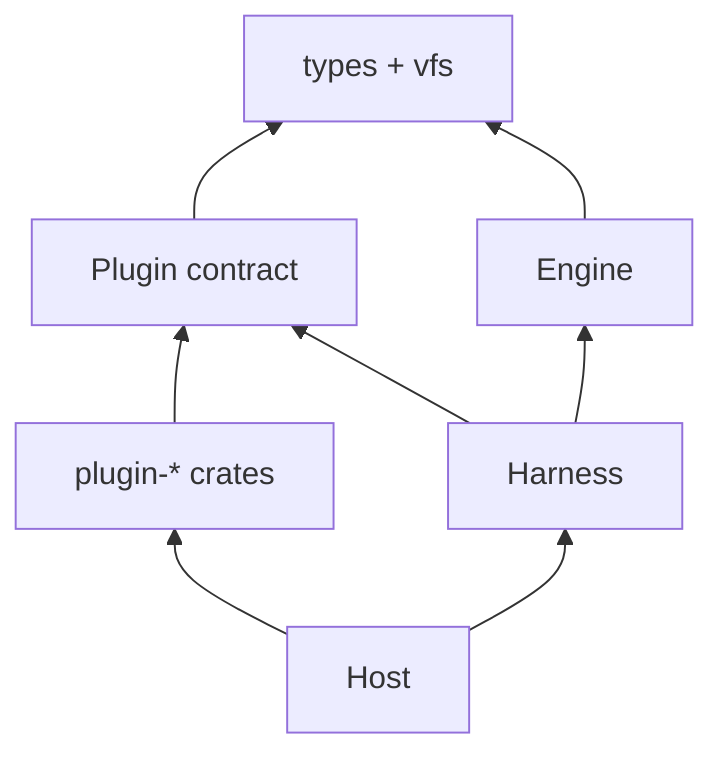

# Plugin API: contract crate, HostContext, dispatch by name

<product-contract>

## Product Requirements

Plugins live inside the Harness today, carry two-segment ids their authors fix, and are rebuilt at the start of every run. This work gives Plugins a small contract crate of their own, lets the Host install each Plugin once under a short local name it chooses, and has the Harness send each tool call to the Plugin its tool id names. The two existing Plugins move to the new shape, and the Harness's old Plugin layer is deleted. Every run receives every usable Plugin's tools: the Plugins a prompt declares give it their preludes and its named slots, and the rest form an offering that a section's Lua can hand to the model with `tools.offered()`. Tool-call events also start recording the real tool id, so a Host can tell which tool ran.

- Problem and users:
  - Host authors, such as Workshop in this repository, install Plugins and give them services. Plugin authors write the Plugin crates. Prompt authors declare Plugins and tool slots in a prompt's frontmatter.
  - `crates/harness-internal/plugins/` (package `harness-plugins`) holds the Plugin trait, per-run activation (`Plugin::create`, `Contribution`, `RunServices`, `activate`), `PluginRegistry`, the `Tool` trait, and the user-input Plugin. `crates/harness-web/` is a Harness crate. Plugin ids are fixed pairs such as `promptforge/web`, and tool ids are triples such as `promptforge/web/fetch`.
  - A run's catalog holds only the Plugins its prompt declares (`crates/harness-internal/plugins/src/activation.rs`, `activate`), so an agent such as Workshop's chat can't use a Plugin its prompt didn't anticipate.
  - Tool-call and tool-result events record only the alias a call used, so a Host can't tell which tool ran. Workshop spots the operator's typed answer by matching the literal `promptforge/user-input/ask` (`crates/workshop/server/src/agents/wire.rs`), and the Harness's stop logic matches the same literal (`crates/harness-internal/runner/src/effect_loop.rs`).
- Terms, as this plan uses them. Engine, Harness, Host, and Plugin are capitalized defined terms in the root `AGENTS.md`, and these entries match it:
  - **Engine:** the `promptforge` and `promptforge-*` crates. It parses a prompt and steps a run, and asks its caller for every model reply, tool result, timer, and file through effects. It performs no I/O and holds no Plugin code.
  - **Harness:** the `harness` and `harness-*` crates. It steps the Engine, performs every effect, and records the run. One `Harness` object serves one run.
  - **Host:** an application that runs prompts through the Harness, such as Workshop. It makes every policy decision.
  - **Plugin:** a named unit of tools, and optionally a Lua prelude, that the Host installs for its runs. After this work, a Plugin is one installed instance of a Package, under a local name.
  - **Package:** a Plugin crate's label, the constant `PACKAGE`: its `vendor/name` package name, its prelude, the per-run services it needs, and its build function, `construct`.
  - **Local name:** the one-segment name a Plugin is installed under, such as `web`. It is the first segment of every tool id the Plugin offers, as in `web/fetch`.
  - **Prelude:** Lua source a Plugin contributes. It runs in every section's Lua VM of a prompt that declares the Plugin, and defines globals such as `input`.
  - **Tool slot:** a frontmatter `tools:` entry that binds a prompt-local alias to a tool id, such as `fetch: web/fetch`. A slot's tool can be exposed to the model with `tools.add` or `tools.always`.
  - **Catalog:** the tool descriptors the Harness gives the Engine for one run, in an `Environment`.
  - **Offering:** the catalog tools of Plugins the prompt doesn't declare, bound under model-facing names such as `web_fetch`. The model sees an offered tool only after a section's Lua adds it.
  - **Snapshot:** the per-run view of every installed Plugin that `HostContext::begin_run` takes. It doesn't change during the run.
  - **Host-wide and per-run services:** two `HostServices` maps, which look up shared objects by a typed key. Host-wide services, such as the search provider, reach only a Package's `construct`. Per-run services, such as a conversation's input broker, reach only tool calls.
  - **Stop and cancel:** a stop drops the calls in flight, except those whose descriptor sets `survives_stop`, and lets the run go on. A cancel ends every call and the run.
- Goals:
  - A public contract crate, `promptforge-plugin`, that Plugin crates depend on instead of the Harness.
  - A Host-built `HostContext` that installs each Plugin once, under a local name the Host chooses, and that every run shares.
  - One-segment Plugin names (`web`) and tool ids of two or more segments (`web/fetch`). The Harness dispatches a call by its tool id's first segment.
  - `plugin-web` and `plugin-user-input` replace `harness-web` and the user-input Plugin in `harness-plugins`, and `harness-plugins` is deleted.
  - Structural checks keep `plugin-*` crates below the Harness.
  - A descriptor flag, `survives_stop`, marks calls a stop leaves running, replacing the hard-coded ask id.
  - Tool-call and tool-result events record the bound tool id, and Workshop recognizes the ask tool by the name it installed user-input under.
  - Every usable Plugin's tools reach every run. The tools of Plugins the prompt doesn't declare form the offering, which a section exposes to the model only when its Lua adds them, as in `tools.add(tools.offered())`.
- Non-goals: DLL Plugins, MCP, and the other items under Deferred and Out of Scope.
- Success criteria:
  - Every Exit criteria command in the Testing Plan passes at the end of each step.
  - Workshop's chat agent declares `web` and `user-input`, binds `web/fetch` and `web/search`, reaches the operator through `input.ask()`, opts in to the offering, and a stop leaves an open question open.
  - A prompt that doesn't declare an installed Plugin can call that Plugin's tools by full id, gets none of its prelude, and shows the model none of its tools unless its Lua adds them from `tools.offered()`.
  - `harness-plugins` no longer exists, and no prompt, fixture, or code in the repository names a `promptforge/web/...` or `promptforge/user-input/...` id. The package names `promptforge/web` and `promptforge/user-input` remain.
- Constraints:
  - Repository `promptforge2` at `c:\Users\Vinnie\cursor\promptforge2`. Work happens on a branch named `plugin-api`, created from `upstream/master` at commit `3e917d209`. That commit already gives each tool call its own filesystem identity, forked from the calling chain's and ended when the call ends (`access_spawn` in `crates/promptforge-internal/engine/src/execute/scheduler/tool_call.rs`).
  - Every path in this plan is relative to the repository root, including the targets of its Markdown links.
  - Crate linking only: a Plugin is a Rust crate the Host links and installs in code.
  - `promptforge-plugin` is an Engine crate by name, and Engine crates may not depend on `tokio`, `tokio-util`, `async-trait`, or `reqwest` (`crates/build-xtask/src/engine_deps.rs`).
  - The Host makes every policy decision: which Plugins are installed, under which names, and with which configuration and services.
  - The existing refusal line `- {plugin} needs {service}, and this host provides none` keeps its wording.
- Open questions: None

## Functional Specification

A Host builds one `HostContext` at startup with its Host-wide services and installs each Plugin package once. Each Harness gets the shared `HostContext` plus its run's own services. When a run starts, the Harness snapshots every installed Plugin, gives the Engine every usable Plugin's tools and the declared Plugins' preludes, and refuses the run with reasons when a declared Plugin or tool is unavailable. The tools of undeclared Plugins form the run's offering, which the model sees only when a section's Lua adds them. During the run each tool call goes to the Plugin its id names, and a stop spares only calls marked `survives_stop`.

- Actors and workflows:
  - Host at startup: builds `HostContext::new(host_wide_services)`, then calls `install(plugin_x::PACKAGE, name, config)` once per Plugin and keeps the names it returns.
  - Plugin at install: its `construct` runs once with the local name, the JSON configuration, and the Host-wide services, and returns the one Plugin object every run shares.
  - Prompt author: declares `plugins: [web]` and slots such as `fetch: web/fetch` in frontmatter. A declared Plugin is required and installs its prelude. A section may also expose the offering with `tools.add(tools.offered())`, or any subset of its records.
  - Run start: the Harness reads each Plugin's `tools()` once, builds a catalog of every usable Plugin's tools, declared or not, gives the Engine the preludes of the declared Plugins, and computes the run's requirements.
  - Offering: the Engine binds each catalog tool whose Plugin the prompt doesn't declare under a model-facing name. `tools.offered()` returns those tools as records, `tools.add` exposes one record or a list of records to the model for the current section, and `tools.call` accepts a record as well as an alias or a full id.
  - Tool call: the Harness finds the Plugin named by the tool id's first segment and calls it with a `ToolContext` holding the tool id, the call's filesystem access, the call's origin, and the run's own services.
  - Stop and cancel: a stop drops every call in flight except those whose descriptor sets `survives_stop`, and lets the run go on. A cancel ends every call and the run.
- Inputs and outputs:
  - `install` takes a package label, an optional local name, and JSON configuration, and returns the name it used or an `InstallError`.
  - A tool call takes JSON arguments and returns a `ToolOutput`, marked trusted or untrusted, or a `ToolError`.
  - `ToolCallEvent::tool` and `Event::ToolResult::tool` hold the bound tool id, or nothing for Lua-local tools, the task built-ins, and names outside the round's scope. A call to an offered tool counts as bound.
  - `tools.offered()` returns a Lua list of records `{ id = "github/search_issues", name = "github_search_issues", plugin = "github", description = "..." }`, sorted by id. `name` is the model-facing name: the id with `/` and `.` replaced by `_`.
- States and validation:
  - In each run, every installed Plugin is usable, unavailable because its `construct` failed, or missing per-run services its package `needs`.
  - A tool from `tools()` is kept only when its id sits under its Plugin's name, its id is not repeated, and its wire name is legal. Any other tool is logged and dropped.
  - `install` refuses a package name that isn't a `vendor/name` pair or whose second segment isn't a valid one-segment name. It also refuses a name that equals an installed one or differs from it only by `-`, `_`, or `.`.
  - web accepts only `null` or `{}` as configuration.
  - The same package may be installed more than once under different names. Each install is a separate Plugin with its own configuration and its own object, and `install` checks only names, never whether a package is already installed.
  - Only an installed Plugin has configuration: the JSON given to `install`. A package, an individual tool, and a prompt have none. A prompt only names Plugins and passes arguments to tool calls.
  - An offered tool is left out of the offering, with a log line, when its name equals a frontmatter tool alias or a task built-in name, isn't a legal model tool name, or repeats an earlier offered name. Install already refuses Plugin names that differ only by `-`, `_`, or `.`, so two Plugins' tools rarely share a name.
  - Offered tools never become Lua globals, and `tools.always` takes only frontmatter aliases. A Lua-local tool registered under an offered tool's name wins in that section's scope, and `tools.add_local` never refuses a name because a Plugin offers it, so installing a Plugin can't break a prompt's local tool.
  - The offering is fixed for the run, like the rest of the snapshot.
- Errors and recovery:
  - A `construct` failure doesn't stop the Host. The Plugin stays installed as unavailable, and a run that declares it is refused with `- {plugin} is unavailable: {reason}`.
  - A run whose slot names a tool its present Plugin doesn't offer is refused with `- missing tool: {tool}; {plugin} does not offer it`.
  - A Plugin reported as unavailable is not also reported as missing.
  - An input broker's failure is a `ToolError` that becomes the ask call's error unchanged.
- Security and privacy behavior:
  - Output trust is unchanged: a Plugin marks each output trusted or untrusted, and the Engine wraps untrusted output.
  - Host-wide services reach only `construct`. A call sees only its run's own services and its own filesystem access, which ends when the call ends.
  - A service is read through a typed key, and a provider supplied as a different type counts as missing.
- Acceptance criteria:
  - The Workshop scenarios in Success criteria hold.
  - A prompt that declares a Plugin whose `construct` failed is refused, and the notice gives the reason.
  - While web is installed, a prompt with a slot naming `web/missing` is refused with a missing-tool line.
  - In Workshop, a script's ask result frames as the operator's message, and a model's ask stays a tool result.
  - Events for calls to bound tools carry the tool id.
  - A prompt that doesn't declare an installed Plugin `p` can call `p/tool` from Lua, its model sees `p_tool` only after `tools.add` with that tool's record, and `p`'s prelude doesn't install.

</product-contract>
<implementation-contract>

## Technical Design

The contract crate sits beside the Engine's types and filesystem crates. Plugin crates and the Harness depend on it, and the Engine doesn't. `HostContext` (public) and `HostRunContext` (crate-private) live in `harness-runner`. Engine changes are limited to the id grammar, the descriptor flag, the event fields, two refusal lines, the prelude argument, the offering, and removing Plugin conflicts and optional Plugins. Workshop installs both Plugins and keeps the ask tool's id.

- Architecture: dependency levels, lowest at the bottom. The Engine does not depend on the contract; it sees only descriptors, preludes, and ids.



- Modules and interfaces: each H3 below declares one module's public items and their behavior.
- File and public API changes:
  - New crates: `crates/promptforge-plugin/`, `crates/plugin-web/` (renamed from `crates/harness-web/`), and `crates/plugin-user-input/`.
  - Deleted: `crates/harness-internal/plugins/`, and `crates/harness-internal/runner/src/performers-tools.rs` (`ActivatedTools` and its `ToolTable`, which `HostRunContext` replaces).
  - `crates/promptforge/public-api.txt` is regenerated in every step that changes the facade's surface: steps 1, 2, 3, and 6 at least. `xtask api --check` in the Exit criteria catches any other step that does.
  - Steps 4 and 5 add workspace crates, so each updates `Cargo.lock` (one build without `--locked`) and runs `cargo hakari generate` and `cargo hakari manage-deps` before the gates.
- Data, persistence, failure, security, and privacy constraints:
  - Events logged before this change still load: the new event fields are `Option`s with `#[serde(default, skip_serializing_if = "Option::is_none")]`, and `ToolDescriptor::survives_stop` uses `#[serde(default)]`.
  - Host-wide services reach only `construct`, and per-run services reach only calls. Nothing merges the two maps.
  - A Plugin cleans up in `Drop`, which runs when the `HostContext` holding it is dropped. There is no shutdown hook.
  - The rules today's `Tool` trait documents (`crates/harness-internal/plugins/src/tool.rs`) carry over to `Plugin::call` and its docs:
    - `call` must not block while polled, because the Harness polls every effect of a run on the same task. Blocking or CPU-heavy work goes to the Host's runtime, which is why web takes `TOKIO_RUNTIME`.
    - `call` must not panic. If it does, the Harness answers the effect `Dropped` and logs the panic, as the effect loop already does for performer futures.
    - `call` marks every output's trust correctly: output that embeds data an attacker can influence is `ToolOutput::untrusted`.
    - `call` is cancellation-aware: the Harness drops its future on a stop or cancel.
  - Comments inside the declaration blocks explain the declarations for review. Code gets doc comments in the repository's own style, not copies of these comments.

### Plugin contract crate `promptforge-plugin`

Location: `crates/promptforge-plugin/`. It's an Engine crate by name, is public, and depends on `promptforge-types`, `promptforge-vfs`, `serde_json`, and `workspace-hack`. It has no `async-trait`, so it passes the Engine manifest guard. Its `test-support` feature adds `testing::TestCall`, described under Boundary rules.

`src/lib.rs`:

```rust
// The contract crate's front page. A Plugin crate depends on this one crate
// and imports everything it needs from here.
mod context; // ToolContext: what one tool call receives
mod plugin;  // the Plugin trait and the types around it
mod service; // HostServices: shared objects looked up by name
#[cfg(feature = "test-support")]
pub mod testing; // TestCall: lends a ToolContext to a Plugin crate's own tests

pub use context::ToolContext;
pub use plugin::{Package, Plugin, PluginFuture};
pub use service::{HostServices, ServiceError, ServiceId, ServiceKey};

// Names defined in the Engine's types crate and the filesystem crate, passed
// through so a Plugin author never has to find or depend on those crates.
pub use promptforge_types::plugins::{PluginId, PluginIdError, PluginIdErrorKind};
pub use promptforge_types::tools::{
    OutputTrust, ToolCallOrigin, ToolCaller, ToolDescriptor, ToolError, ToolErrorKind, ToolId,
    ToolIdError, ToolIdErrorKind, ToolOutput,
};
pub use promptforge_vfs::{Access, Entry, FileType, PathReason, Stat, VfsError};
```

`src/plugin.rs`. `call`, the one async method, returns a boxed future with a single lifetime, and an implementation wraps its body in `Box::pin(async move { ... })`. Native `async fn` in traits can't be used here, because the Harness holds Plugins as `dyn Plugin`. `#[async_trait]` can't be used on an implementation either, because the macro's expansion uses different lifetime parameters than this trait:

```rust
// PluginFuture: a boxed future.
// - A future is Rust's name for work that finishes later, like a JavaScript
//   promise. An `async` block makes one, and `.await` waits for it.
// - Every `async` block has its own unnamed type, so two Plugins' `call`
//   methods would return two different types. A method called through
//   `dyn Plugin` must return one type for every Plugin.
// - `Box` puts the future on the heap behind a pointer, which gives it one
//   shared type: "some future that produces a T".
// - `Pin` promises the future stays put in memory once it starts, which Rust
//   requires before anything can await it.
// - `Send` lets the future move between threads. `'a` lets it borrow things
//   (the Plugin, the ToolContext) that live at least that long.
/// A boxed future that may borrow for `'a`, the same type as `futures::future::BoxFuture`.
pub type PluginFuture<'a, T> = Pin<Box<dyn Future<Output = T> + Send + 'a>>;

// The Plugin trait: the methods every Plugin object has.
// - `Send + Sync` means the object is safe to use from several threads at
//   once. One object serves every run, and runs can be on different threads.
// - `call` isn't written `async fn`, because Rust can't call an
//   `async fn` trait method through `dyn Plugin` (a pointer to "some Plugin,
//   type decided at runtime"), and the Harness holds Plugins that way.
//   Returning a PluginFuture is the hand-written equivalent: the caller
//   still awaits it, and the Plugin writes `Box::pin(async move { ... })`.
// Cleanup, such as stopping a child process, goes in the Plugin's `Drop`,
// which runs when the HostContext holding it is dropped.
pub trait Plugin: Send + Sync {
    // The tools the Plugin offers right now. The Harness reads the list once
    // when each run starts, so a Plugin whose tools change (an MCP server, for
    // example) returns its current list. A Plugin still coming up returns
    // what it has so far.
    fn tools(&self) -> Vec<ToolDescriptor>;

    // Performs one tool call. `cx` says which tool was called and lends the
    // call's filesystem access, caller, and the run's services. `args` is the
    // JSON the model or script passed. Finishes later with the output or an
    // error.
    fn call<'a>(
        &'a self,
        cx: ToolContext<'a>,
        args: serde_json::Value,
    ) -> PluginFuture<'a, Result<ToolOutput, ToolError>>;
}

// A Plugin crate's label, exported as a constant such as `plugin_web::PACKAGE`.
// It is fixed data the Host can read before anything is built. Passing it to
// `HostContext::install` is also what makes the compiler link the crate.
// `&'static` means text or a list compiled into the program itself.
// `Clone, Copy` because it is a few pointers and cheap to duplicate.
#[derive(Clone, Copy)]
pub struct Package {
    pub name: &'static str,            // "vendor/name", such as "promptforge/web"
    pub prelude: Option<&'static str>, // Lua run for each prompt that declares the Plugin, if any
    pub needs: &'static [ServiceId],   // per-run services its tools read; a run without them can't use the Plugin
    // The build function: a plain function with no hidden state, which
    // `install` calls once. It receives the local name the Host chose, the
    // Host's JSON configuration, and the Host-wide services, and returns the
    // one shared Plugin object. A failure is a ToolError, the same error type
    // a call returns; its message appears in the run's refusal notice.
    pub construct: fn(
        name: &PluginId,
        config: serde_json::Value,
        services: &HostServices,
    ) -> Result<Arc<dyn Plugin>, ToolError>,
}
// impl fmt::Debug for Package: name, whether a prelude exists, needs
```

`Package` field rules:

- **`name`:** `vendor/name`, two segments.
- **`prelude`:** runs as a chunk whose `...` is the Plugin's local name, and installs only for prompts that declare the Plugin.
- **`needs`:** the per-run services that calls read. Host-wide services never reach a call; a Plugin keeps any it needs from `construct`.
- **`construct`:** receives the Host-wide services. If a Host-wide service it needs is missing, it fails with a `ToolError`.

`src/context.rs`:

```rust
// What one tool call receives. Every field is borrowed (`&'a`), so the
// context is valid only while the call runs, and a Plugin can't keep it.
#[derive(Debug)]
pub struct ToolContext<'a> {
    tool: &'a ToolId,           // which tool was called, such as web/fetch
    access: &'a Access,         // this call's view of the run's filesystem
    origin: &'a ToolCallOrigin, // who made the call: the model or a script
    services: &'a HostServices, // the run's own services, such as its input broker
}

// The Harness builds one per call with `new`. Plugins only read it, through
// the four getters.
impl<'a> ToolContext<'a> {
    #[must_use]
    pub fn new(
        tool: &'a ToolId,
        access: &'a Access,
        origin: &'a ToolCallOrigin,
        services: &'a HostServices,
    ) -> Self;
    #[must_use]
    pub fn tool(&self) -> &'a ToolId;
    #[must_use]
    pub fn access(&self) -> &'a Access;
    #[must_use]
    pub fn origin(&self) -> &'a ToolCallOrigin;
    // Looks up a service by its typed key and returns it as the right Rust
    // type, or None when this run doesn't have it. `?Sized` lets T be a trait,
    // such as `dyn InputBroker`.
    #[must_use]
    pub fn service<T: ?Sized + Send + Sync + 'static>(&self, key: &ServiceKey<T>) -> Option<Arc<T>>;
}
```

`src/service.rs` moves from [crates/harness-internal/plugins/src/service.rs](crates/harness-internal/plugins/src/service.rs), with `ServiceId`, `ServiceKey<T>`, `HostServices::{new, provide, get, provides}`, and `ServiceError` unchanged. Only two things change: the `GlobalName` import comes from `promptforge_types` instead of the `promptforge` facade, and the module docs stop linking `Plugin::needs` and `RunServices`. `provide` keeps its own check that an id literal has exactly one `/`, so service ids stay two-segment after `GlobalName` accepts any count. `HostServices` is a map from a service name (such as `promptforge/input-broker`) to a shared object. A Host fills two of them: the Host-wide map it gives `HostContext::new`, read only by `construct`, and each Harness's per-run map, read only by calls.

### Engine type changes

[crates/promptforge-internal/types/src/names.rs](crates/promptforge-internal/types/src/names.rs):

```rust
// The shared parser for slash-separated names such as `web` or `web/fetch`.
// PluginId and ToolId are both built on it and add their own segment-count
// rule. The derive line gets printing, copying, comparing, hashing, and
// sorting generated automatically, so these names can be map keys.
#[derive(Debug, Clone, PartialEq, Eq, Hash, PartialOrd, Ord)]
pub struct GlobalName { segments: Vec<String> }        // one or more segments
impl GlobalName {
    pub fn parse(s: &str) -> Result<GlobalName, GlobalNameError>;
    pub(crate) fn segments(&self) -> &[String];        // pub(crate): visible inside the types crate only
}                                                       // removed: namespace(), plugin(), plugin_prefix()
// Why parsing failed. SegmentCount leaves, because counting segments is now
// the job of PluginId and ToolId.
#[non_exhaustive]
pub enum GlobalNameErrorKind { Empty, Control }         // removed: SegmentCount
```

[crates/promptforge-internal/types/src/plugins.rs](crates/promptforge-internal/types/src/plugins.rs):

```rust
// Today a Plugin's id is two segments, `promptforge/web`, fixed by its author.
// Now it is one segment that the Host picks at install, `web` by default.
/// The local name a Host installs a Plugin under: one segment, such as `web`.
#[derive(Debug, Clone, PartialEq, Eq, Hash, PartialOrd, Ord)]
#[non_exhaustive]
pub struct PluginId(GlobalName);
impl PluginId {
    pub fn parse(name: &str) -> Result<PluginId, PluginIdError>;   // exactly one segment
    // True when the tool belongs to this Plugin: `web` contains `web/fetch`.
    #[must_use]
    pub fn contains(&self, tool: &ToolId) -> bool;                 // the tool's first segment
    // Used by ToolId::plugin() to turn a tool's first segment into a PluginId.
    pub(crate) fn from_segment(segment: GlobalName) -> PluginId;
}                                                                   // removed: namespace(), name(), from_prefix()
// Why parsing failed. SegmentCount now means more than one segment.
#[non_exhaustive]
pub enum PluginIdErrorKind { SegmentCount, Empty, Control }       // SegmentCount: more than one segment
// Prelude: unchanged type; docs state the chunk receives the Plugin's name as `...`
```

[crates/promptforge-internal/types/src/tools/ids.rs](crates/promptforge-internal/types/src/tools/ids.rs):

```rust
// A tool's routing name, such as `web/fetch`. Today it is three segments,
// `promptforge/web/fetch`. The first segment says which Plugin gets the call,
// and the rest is the Plugin's own name for the tool.
/// A tool's identity: its Plugin's local name, then one or more segments the Plugin chooses.
#[derive(Debug, Clone, PartialEq, Eq, Hash, PartialOrd, Ord)]
#[non_exhaustive]
pub struct ToolId(GlobalName);
impl ToolId {
    pub fn parse(id: &str) -> Result<ToolId, ToolIdError>;   // two or more segments
    // `fetch`. A Plugin's `call` matches on this to pick the tool.
    #[must_use]
    pub fn name(&self) -> &str;                               // last segment
    // `web`. The Harness looks this up to find the Plugin that gets the call.
    #[must_use]
    pub fn plugin(&self) -> PluginId;                         // first segment
}
// Why parsing failed. SegmentCount now means fewer than two segments.
#[non_exhaustive]
pub enum ToolIdErrorKind { SegmentCount, Empty, Separator, Control }   // SegmentCount: fewer than two
```

[crates/promptforge-internal/types/src/tools/descriptor.rs](crates/promptforge-internal/types/src/tools/descriptor.rs):

```rust
// Plain data describing one tool. The Engine shows it to a model and binds it
// to a prompt's tool slots without knowing any Plugin code.
// Serialize and Deserialize mean it can be written to and read from JSON.
#[derive(Debug, Clone, PartialEq, Eq, Serialize, Deserialize)]
#[non_exhaustive]
pub struct ToolDescriptor {
    pub id: ToolId,                // the routing name, such as web/fetch
    pub wire_name: String,         // the name the model sees, such as web_fetch, since models reject `/`
    pub description: String,       // what the model reads to decide when to use it
    pub parameters_schema: Value,  // JSON Schema for the arguments
    pub structured_output: bool,   // the result is JSON, and scripts get it as a Lua table
    // Whether a stop leaves this call running. A stop cancels every other call
    // in flight and lets the run go on; a cancel still ends this one. The ask
    // tool sets it, so its question stays open. Old JSON without the field
    // reads as false.
    /// A stop leaves this call in flight; only a cancel ends it.
    #[serde(default)]
    pub survives_stop: bool,
}                                                                // removed: conflicts
// `new` builds a descriptor with both flags false. `structured` and
// `survives_stop` each return a copy with one flag set, so a Plugin
// writes `ToolDescriptor::new(...).survives_stop(true)`.
impl ToolDescriptor {
    pub fn new(id: ToolId, wire_name: impl Into<String>, description: impl Into<String>, parameters_schema: Value) -> ToolDescriptor;
    pub fn structured(self, structured: bool) -> ToolDescriptor;
    pub fn survives_stop(self, survives: bool) -> ToolDescriptor;     // new
}                                                                // removed: with_conflicts
```

`ToolCallOrigin` and `ToolCaller` move verbatim from `engine/src/execute/run/effect.rs` to a new `types/src/tools/origin.rs`. `effect.rs` re-exports them, so the path `promptforge::effect::ToolCallOrigin` is unchanged.

[crates/promptforge-internal/types/src/metrics.rs](crates/promptforge-internal/types/src/metrics.rs), [crates/promptforge-internal/types/src/event.rs](crates/promptforge-internal/types/src/event.rs), and [crates/promptforge-internal/types/src/emitter.rs](crates/promptforge-internal/types/src/emitter.rs):

```rust
// One call in a model's tool-call batch, as the event log records it. Today
// it has only the name the model typed. `tool` adds the real tool it went to.
pub struct ToolCallEvent {
    pub id: String,
    pub name: String,                    // the name the model called: the prompt's alias, such as `fetch`
    pub arguments: serde_json::Value,
    /// The bound tool `name` resolved to; `None` for a Lua-local tool, a task built-in, or a name outside the round's scope.
    #[serde(default, skip_serializing_if = "Option::is_none")]
    pub tool: Option<ToolId>,            // new: such as `web/fetch`
}

pub enum Event {
    // ...other variants unchanged...
    // One tool call's result. `alias` stays as the name the call used; `tool`
    // adds the real tool, with the same `None` cases as ToolCallEvent.
    ToolResult {
        // ...execution, section, provenance, turn, tool_call_id unchanged...
        alias: String,
        #[serde(default, skip_serializing_if = "Option::is_none")]
        tool: Option<ToolId>,            // new
        content: String,
        trusted: bool,
    },
}

impl Emitter {
    // Gains the `tool` argument, which it copies into the event.
    pub fn tool_result(&self, section: &str, turn: u32, tool_call_id: &str, alias: &str, tool: Option<&ToolId>, content: &str, trust: OutputTrust);
}
```

Where the Engine fills `tool`:

- **[crates/promptforge-internal/engine/src/execute/scope.rs](crates/promptforge-internal/engine/src/execute/scope.rs):** `DispatchTarget::Bound` becomes `Bound(ToolId)`, taken from the binding it is built from (line 88).
- **[crates/promptforge-internal/engine/src/execute/scheduler/chat.rs](crates/promptforge-internal/engine/src/execute/scheduler/chat.rs):** `tool_calls` sets each `ToolCallEvent::tool` from the round's `advertised` map: `Some` for a `Bound` target, `None` otherwise.
- **[crates/promptforge-internal/lua/src/dispatch.rs](crates/promptforge-internal/lua/src/dispatch.rs):** both `tool_result` calls (lines 142 and 179) pass `Some(&binding.id)`.
- **`crates/promptforge-internal/engine/src/execute/scheduler/tool_call.rs`** (Lua-local tools) and **`scheduler/builtins.rs`** beside it (task built-ins) pass `None`.

[crates/promptforge-internal/parser/src/build-frontmatter.rs](crates/promptforge-internal/parser/src/build-frontmatter.rs):

```rust
// A prompt's header block. Its `plugins:` list becomes plain names, such as
// `plugins: [web]`. The old entry type also had a map form with `ref`,
// `optional`, and `config`; the whole map form goes away. Nothing outside
// the parser's own tests reads `config`, so dropping it loses no behavior,
// and a prompt that still uses the map form fails to parse.
pub struct Frontmatter {
    // ...unchanged fields...
    #[serde(default)]
    plugins: Vec<PluginId>,              // was Vec<PluginDecl>
}
impl Frontmatter { pub fn plugins(&self) -> &[PluginId]; }
// removed from contract.rs: PluginDecl, PluginDeclVisitor, parse_plugin_id, check_slot_plugins, declares
```

[crates/promptforge-internal/engine/src/execute/requirements.rs](crates/promptforge-internal/engine/src/execute/requirements.rs):

```rust
// Every reason a run can't start. When any list is non-empty the run is
// refused, and each entry becomes one line of the refusal notice.
#[derive(Debug, Clone, Default, PartialEq, Eq)]
#[non_exhaustive]
pub struct Requirements {
    pub unmet_requirements: Vec<UnmetRequirement>, // the model falls short, such as too small a context
    pub missing_required: Vec<PluginId>,           // the prompt names a Plugin the Host didn't install
    pub missing_services: Vec<MissingService>,     // installed, but this run lacks a service it needs
    pub unavailable: Vec<UnavailablePlugin>,   // new: installed, but it failed to build or reports Unavailable
    pub missing_tools: Vec<ToolId>,            // new: the Plugin is there but doesn't offer a tool the prompt names
}                                              // removed: conflicts

// One `unavailable` entry: which Plugin, and the reason to show.
#[derive(Debug, Clone, PartialEq, Eq)]
#[non_exhaustive]
pub struct UnavailablePlugin {
    pub plugin: PluginId,
    pub reason: String,
}
impl UnavailablePlugin { #[must_use] pub fn new(plugin: PluginId, reason: impl Into<String>) -> UnavailablePlugin; }
// removed: PluginConflict
```

The refusal notice gains the lines `- {plugin} is unavailable: {reason}` and `- missing tool: {tool}; {plugin} does not offer it`. `merge` also drops a `missing_required` entry whose Plugin is listed in `unavailable`.

Behavior changes in [fill.rs](crates/promptforge-internal/engine/src/execute/fill.rs) and [lua/src/prelude.rs](crates/promptforge-internal/lua/src/prelude.rs):

- If a slot's Plugin is present but the tool is missing, the tool is reported in `missing_tools` instead of the slot being left unbound.
- A prelude chunk runs with `.call::<()>(plugin.to_string())` instead of `.exec()`.

`promptforge-lua` `ToolBinding` (in [handles.rs](crates/promptforge-internal/lua/src/handles.rs)) drops `pub conflicts: Vec<PluginId>`.

### The offering: `tools.offered()`

The Engine already binds every catalog tool under its full id for a script's `tools.call` and never advertises those bindings (`catalog_bindings` in [context-bound.rs](crates/promptforge-internal/engine/src/execute/context-bound.rs)). Once the catalog holds every usable Plugin's tools, the offering is a second set of bindings, under model-facing names, for the tools of Plugins the prompt doesn't declare. The existing lookups find them, so `tools.add`, the round's scope, model-call dispatch, call counts, and the event's `tool` all work unchanged.

[handles.rs](crates/promptforge-internal/lua/src/handles.rs):

```rust
// The run's tool set gains the offering. Its bindings never become Lua
// globals (globals come from `bindings` alone) and never enter a section's
// scope until `tools.add` names them.
pub struct ToolSet {
    pub bindings: Vec<ToolBinding>,  // unchanged: the frontmatter's filled slots
    pub always: Vec<String>,         // unchanged
    pub offered: Vec<ToolBinding>,   // new: undeclared Plugins' tools, sorted by tool id, each under its model-facing name
}
impl ToolSet {
    pub fn binding(&self, alias: &str) -> Option<&ToolBinding>;         // unchanged: frontmatter slots only
    pub fn offered(&self) -> &[ToolBinding];                            // new
    pub fn offered_binding(&self, name: &str) -> Option<&ToolBinding>;  // new
    // from_parts and for_test gain the `offered` list; ToolView gains matching snapshot methods.
}
```

Where it is built and read:

- **[context-bound.rs](crates/promptforge-internal/engine/src/execute/context-bound.rs) `bound_tool_set`** fills `offered`: every catalog tool whose `id.plugin()` is not in `Frontmatter::plugins`, bound with `ToolBinding::from_descriptor(name, tool)`, where `name` is the id with `/` and `.` replaced by `_` (`web/fetch` becomes `web_fetch`). It leaves out, with a log line, a name that equals a frontmatter tool alias or a task built-in name (`RESERVED_TOOL_NAMES` in `scheduler/tool_call.rs`), that isn't a legal model tool name (the check `tool_schema_new` makes), or that repeats an earlier one.
- **Three lookups** check `binding`, then `offered_binding`: the `tools.add` check in [lua/src/tools.rs](crates/promptforge-internal/lua/src/tools.rs), `binding_for_scope` in [vm/state.rs](crates/promptforge-internal/lua/src/vm/state.rs), and `prepare_tool_call` in [scheduler/tool_call.rs](crates/promptforge-internal/engine/src/execute/scheduler/tool_call.rs), for both script and model calls.
- **Unchanged on purpose:** `tools.always` and the `tools.add_local` duplicate check keep using `binding` alone. `prepare_scoped_tools` in [scope.rs](crates/promptforge-internal/engine/src/execute/scope.rs) leaves out an offered binding whose name a Lua-local tool also uses, so the local tool wins.

Lua surface, in [lua/src/tools.rs](crates/promptforge-internal/lua/src/tools.rs) and [tools/decode.rs](crates/promptforge-internal/lua/src/tools/decode.rs):

- **`tools.offered()`** returns a fresh list of plain records `{ id, name, plugin, description }`, one per offered binding, in id order.
- **Records in `tools.add` and `tools.call`:** a table with a string `name` field is one record and stands for that name. Any other table is a list whose elements are aliases, Tool handles, or records. `tool_alias` reads a record's `name`, so `tools.call(record, args)` works through the same decode.

```lua
-- Expose every tool the prompt didn't declare, for this section only.
tools.add(tools.offered())

-- Or pick a subset with plain Lua.
for _, tool in ipairs(tools.offered()) do
  if tool.plugin == "github" then tools.add(tool) end
end
```

### Harness

New `crates/harness-internal/runner/src/host.rs` and `host-run.rs`. `HostContext` and `InstallError` are public and re-exported by the `harness` facade. `HostRunContext` is crate-private.

```rust
// Built once by the Host at startup and shared by every run. It holds the
// Host-wide services and every installed Plugin. Dropping it drops the
// Plugins, which is where a Plugin cleans up.
pub struct HostContext {
    services: HostServices,     // Host-wide services, such as the search provider; read only by construct
    installed: Vec<Installed>,  // in install order
}
// One installed Plugin: its local name, its label, and the built object or
// the reason building failed. `Result` holds either a success or an error.
// `Arc<dyn Plugin>` is a shared pointer to "some type that implements Plugin",
// which lets one list hold different Plugin types.
struct Installed {
    name: PluginId,
    package: Package,
    plugin: Result<Arc<dyn Plugin>, String>,   // Err: construction failed, with the reason
}
impl HostContext {
    // Starts with no Plugins and the given Host-wide services.
    #[must_use]
    pub fn new(services: HostServices) -> HostContext;
    /// Builds the Plugin with `package.construct` and adds it under `name`, or under the package name's second segment when `name` is `None`, and returns the name it used.
    /// A `construct` failure is not an error here: the Plugin is stored as unavailable, with the reason.
    pub fn install(&mut self, package: Package, name: Option<PluginId>, config: serde_json::Value) -> Result<PluginId, InstallError>;
    // Used by the Harness's prepare, not by Hosts: takes one run's snapshot
    // and builds what the Engine needs for `prompt`. `services` are the run's
    // own, such as the conversation's input broker. Environment is the
    // Engine's existing holder of a tool catalog and preludes.
    pub(crate) fn begin_run(&self, services: HostServices, prompt: &Prompt) -> (HostRunContext, Environment, Requirements);
}

// Mistakes `install` refuses outright, so the Host's author sees them at
// startup. A Plugin whose construct fails is not one of these; it is stored
// as unavailable instead. `thiserror::Error` generates the error text from
// each `#[error(...)]` line.
// - InvalidPackage: the label's name isn't "vendor/name", or its second
//   segment isn't a valid one-segment name
// - NameTaken: the name is already installed (`existing` equals `name`), or
//   differs from an installed one only by '-', '_' or '.', like `user-input`
//   and `user_input`, which a model reading the tool list can't tell apart
#[derive(Debug, Clone, PartialEq, Eq, thiserror::Error)]
#[non_exhaustive]
pub enum InstallError {
    #[error("Plugin package name `{package}` is not a vendor/name pair")]
    InvalidPackage { package: &'static str },
    #[error("Plugin name {name} is taken by the installed {existing}; install it under another name")]
    NameTaken { name: PluginId, existing: PluginId },
}

// Crate-private. One run's frozen snapshot of every installed Plugin, plus
// the run's own services. It is also the object that performs the run's tool
// calls.
pub(crate) struct HostRunContext {
    services: HostServices,                   // the run's own services
    plugins: BTreeMap<PluginId, RunPlugin>,   // BTreeMap: a map kept sorted by key
}
// What one Plugin looks like to this run.
enum RunPlugin {
    // Can serve. `tools` is its `tools()` list after validation.
    Usable { package: Package, plugin: Arc<dyn Plugin>, tools: Vec<ToolDescriptor> },
    // Its construct failed. The text is the reason.
    Unavailable(String),
    // This run lacks the listed services from the Package's `needs`.
    NeedsUnmet(Vec<ServiceId>),
}
// When the Engine asks for a tool call, take the tool id's first segment,
// find that Plugin in the map, and call it.
impl ToolPerformer for HostRunContext { /* resolves tool.plugin(), calls Plugin::call */ }
```

Rules for `begin_run`:

- **`install` splits the package name itself:** at its one `/`, then `PluginId::parse` on the second half. `GlobalName::segments()` stays crate-private to the types crate, so `harness-runner` can't use it.
- **It reads each Plugin's `tools()` once,** so the snapshot is fixed for the run.
- **A Plugin is usable** when its `construct` succeeded and the run's services satisfy every id in `package.needs`.
- **Tools are validated as the old `activate`'s `assemble` did:** a tool must sit under its Plugin's name, must not repeat an id, and must have a legal wire name. A tool that fails is logged and dropped.
- **It returns three things:**
  - an `Environment` holding a catalog of every usable Plugin's tools, declared or not, which is what the Engine's offering draws on, and the preludes for the declared, usable Plugins, in declaration order;
  - requirements covering every declared Plugin and every Plugin named by a slot (`missing_required`, `unavailable`, `missing_services`);
  - the `HostRunContext`, which becomes the run's tool performer in place of `ActivatedTools` in `runner/src/performers-tools.rs`.

[performers.rs](crates/harness-internal/runner/src/performers.rs), [harness.rs](crates/harness-internal/runner/src/harness.rs), [prepare.rs](crates/harness-internal/runner/src/prepare.rs):

```rust
// The Harness's internal interface for "perform this tool call".
// HostRunContext implements it, and tests can supply a fake.
pub trait ToolPerformer: Send + Sync {
    // Performs one call. BoxFuture is the same boxed-future idea as PluginFuture.
    fn call(&self, tool: ToolId, alias: String, access: Arc<Access>, origin: ToolCallOrigin, args: Value) -> BoxFuture<Result<ToolOutput, ToolError>>;
    // Whether a stop leaves this call running: the descriptor's survives_stop
    // flag. A stop cancels every other call in flight.
    fn survives_stop(&self, tool: &ToolId) -> bool;                 // new; replaces USER_INPUT_ASK_TOOL in effect_loop.rs
}

// The object a Host makes to run prompts, one per conversation in Workshop.
pub struct Harness {
    recorder: Arc<dyn RunRecorder>,     // where run events are written (unchanged)
    broker: Arc<dyn InferenceBroker>,   // sends model requests (unchanged)
    timer: Arc<dyn Timer>,              // performs sleeps (unchanged)
    host: Arc<HostContext>,      // was plugins: PluginRegistry
    services: HostServices,      // the run's own services
    control: RunControl,                // stop and cancel (unchanged)
}
impl Harness {
    pub fn new(recorder: Arc<dyn RunRecorder>, broker: Arc<dyn InferenceBroker>, timer: Arc<dyn Timer>, host: Arc<HostContext>, services: HostServices) -> Harness;
}

// Everything the Harness bundles to prepare and start one run. Only the
// first field changes; the rest is shown for context. `prepare` calls
// `host.begin_run(services, &prompt)` where it calls `activate` today.
// Integration tests build this struct directly, so every field type is public.
pub struct Services {            // prepare.rs
    pub host: Arc<HostContext>,  // was registry: Option<Arc<PluginRegistry>>
    pub services: HostServices,  // unchanged: the run's own services
    pub vfs: VfsRef,
    pub input_text: Option<String>,
    pub cancel: CancelHandle,
    pub recorder: Arc<dyn RunRecorder>,
    pub broker: Arc<dyn InferenceBroker>,
    pub timer: Arc<dyn Timer>,
    pub name: String,
    pub model: Option<ModelDescriptor>,
    pub ui: Option<serde_json::Value>,
}
```

Facade [harness/src/lib.rs](crates/harness/src/lib.rs):

```rust
// What a Host imports from the `harness` crate, such as
// `harness::plugin::HostContext`. The Plugin crates themselves come in as
// their own dependencies.
pub mod plugin {
    pub use harness_runner::{HostContext, InstallError};
    pub use promptforge_plugin::{HostServices, PluginId};
}
// removed: USER_INPUT_ASK_TOOL and every other harness_plugins re-export,
// and the ToolCallOrigin and ToolCaller re-exports, which callers take from
// promptforge::effect
```

### Plugins

`crates/plugin-web/`, renamed from `harness-web`:

```rust
// The web Plugin crate's public face. PACKAGE is the only thing the Host
// needs; it has no prelude and needs no per-run services.
pub const PACKAGE: Package = Package { name: "promptforge/web", prelude: None, needs: &[], construct };
// Runs once at install and builds the shared Web object.
fn construct(name: &PluginId, config: Value, services: &HostServices) -> Result<Arc<dyn Plugin>, ToolError>;
// The Plugin object: its tool list and the two tools.
struct Web { tools: Vec<ToolDescriptor>, fetch: WebFetch, search: WebSearch }   // now private
// still public: SEARCH_PROVIDER, TOKIO_RUNTIME, SearchProvider and its query/result/error types
// now private to the crate: FetchConfig, FetchConfigBuilder, ConfigError, Web::with_fetch_config
```

`construct` does the following:

- accepts a config of `null` or `{}` and refuses anything else;
- reads `SEARCH_PROVIDER` and `TOKIO_RUNTIME` from the Host-wide services, and fails with an error naming whichever is missing;
- builds `{name}/fetch` (wire name `web_fetch`) and `{name}/search` (wire name `web_search`), which `tools()` returns.

`call` matches on `cx.tool().name()`.

**Worked example: the whole Plugin side of `plugin-web`.**

A Plugin crate has three parts:

- **the `PACKAGE` constant,** its label, which the Host passes to `HostContext::install`;
- **`construct`,** which runs once, at install, and builds the one Plugin object every run shares;
- **the `impl Plugin` block,** which runs on every tool call, from any run.

`WebFetch` and `WebSearch` are today's tool structs, unchanged inside. Their `description`, `parameters_schema`, and `call` methods become inherent methods instead of `Tool` trait methods, and `call` drops its `ToolContext` argument, which neither one uses.

```rust
pub const PACKAGE: Package = Package {
    name: "promptforge/web",
    prelude: None,
    needs: &[],
    construct,
};

// Runs once, at install.
fn construct(
    name: &PluginId,
    config: Value,
    services: &HostServices,
) -> Result<Arc<dyn Plugin>, ToolError> {
    // web has no settings yet, so anything but null or {} is a mistake.
    if !(config.is_null() || config == serde_json::json!({})) {
        return Err(ToolError::message("web takes no configuration"));
    }
    // Fetch the two shared objects the Host must provide, or fail naming the
    // missing one. The `?` returns the error early.
    let provider = services.get(&SEARCH_PROVIDER).ok_or_else(|| {
        ToolError::message("web needs promptforge/search-provider, and this host provides none")
    })?;
    let runtime = services.get(&TOKIO_RUNTIME).ok_or_else(|| {
        ToolError::message("web needs promptforge/tokio-runtime, and this host provides none")
    })?;
    // A small helper that makes `web/fetch` from "fetch", using whatever name
    // the Host installed the Plugin under.
    let id = |tool: &str| {
        ToolId::parse(&format!("{name}/{tool}"))
            .map_err(|e| ToolError::with_source("web could not name its tools", e))
    };
    let fetch = FetchClient::new().tool(Handle::clone(&runtime));
    let search = WebSearch::new(provider);
    let tools = vec![
        ToolDescriptor::new(id("fetch")?, "web_fetch", fetch.description(), fetch.parameters_schema()),
        ToolDescriptor::new(id("search")?, "web_search", search.description(), search.parameters_schema()),
    ];
    Ok(Arc::new(Web { tools, fetch, search }))
}

// The one object every run shares.
struct Web {
    tools: Vec<ToolDescriptor>,
    fetch: WebFetch,
    search: WebSearch,
}

impl Plugin for Web {
    // A copy of the fixed list, read once per run.
    fn tools(&self) -> Vec<ToolDescriptor> {
        self.tools.clone()
    }

    // Runs on every tool call.
    fn call<'a>(
        &'a self,
        cx: ToolContext<'a>,
        args: Value,
    ) -> PluginFuture<'a, Result<ToolOutput, ToolError>> {
        // `Box::pin(async move { ... })` turns the async block into the
        // PluginFuture the trait returns. Inside it, `.await` works as usual.
        Box::pin(async move {
            // Pick the tool by the last segment of its id.
            match cx.tool().name() {
                "fetch" => self.fetch.call(args).await,
                "search" => self.search.call(args).await,
                other => Err(ToolError::message(format!("web has no tool named {other}"))),
            }
        })
    }
}
```

`plugin-user-input` follows the same shape. Its `call` shows how a Plugin reads a per-run service:

```rust
impl Plugin for UserInput {
    fn tools(&self) -> Vec<ToolDescriptor> {
        self.tools.clone()
    }

    fn call<'a>(
        &'a self,
        cx: ToolContext<'a>,
        _args: Value,
    ) -> PluginFuture<'a, Result<ToolOutput, ToolError>> {
        Box::pin(async move {
            // The input broker is a per-run service: this run's channel to
            // the person. Wait for their answer and return it as trusted
            // text. A broker failure is already a ToolError and passes through.
            let broker = cx
                .service(&INPUT_BROKER)
                .ok_or_else(|| ToolError::message("no operator is connected to this run"))?;
            broker.wait().await.map(ToolOutput::trusted)
        })
    }
}
```

The missing-broker branch is defensive. Because `PACKAGE.needs` names `INPUT_BROKER`, a run without a broker never sees the ask tool. Today's `tool_error`, which turned an `InputError` into a `ToolError`, goes away with `InputError`.

On the Harness side, `HostRunContext`'s `ToolPerformer::call` owns everything the context borrows, so the returned future is `'static`:

```rust
// Copy the shared pointers into the future, so it borrows nothing from
// HostRunContext and can keep running after this function returns. That is
// what `'static` means here: no borrowed data inside.
let plugin = Arc::clone(plugin);          // looked up by tool.plugin()
let services = self.services.clone();
Box::pin(async move {
    let cx = ToolContext::new(&tool, &access, &origin, &services);
    plugin.call(cx, args).await
})
```

`crates/plugin-user-input/`, new; the contents move from `harness-plugins`:

```rust
// The label. It has a prelude and needs the input broker for each run.
pub const PACKAGE: Package = Package { name: "promptforge/user-input", prelude: Some(PRELUDE), needs: NEEDS, construct };
// The ask tool's last segment, so its full id is `<name>/ask`.
pub const ASK: &str = "ask";
// The typed key for the per-run input broker. The Host provides the broker
// under it, and the tool reads it back with the same key.
pub const INPUT_BROKER: ServiceKey<dyn InputBroker> = ServiceKey::new("promptforge/input-broker");
// The Package's `needs`: a run without a broker can't use this Plugin.
const NEEDS: &[ServiceId] = &[INPUT_BROKER.id()];
// What the Host implements to deliver the person's answer. This crate may use
// the `async_trait` macro because it isn't an Engine crate. A failure, such
// as the person disconnecting, is a ToolError, which becomes the ask call's
// error unchanged.
#[async_trait::async_trait]
pub trait InputBroker: Send + Sync { async fn wait(&self) -> Result<String, ToolError>; }   // was Result<String, InputError>
// removed: InputError
// The Plugin object. It only needs its one-tool list.
struct UserInput { tools: Vec<ToolDescriptor> }                                            // private
// Lua that defines `input.ask()` for prompts that declare the Plugin.
// `local plugin = ...` receives the name the Host installed it under, so the
// call goes to `<name>/ask` whatever that name is.
const PRELUDE: &str = r#"local plugin = ...
input = {}
function input.ask(...)
  if select('#', ...) > 0 then
    error("input.ask takes no arguments", 2)
  end
  return tools.call(plugin .. "/ask")
end
"#;
```

The ask tool is `{name}/ask`, with wire name `ask`, marked `.survives_stop(true)`. It reads the broker through `cx.service(&INPUT_BROKER)`. Removed: `input.connected()`, the second return value of `input.ask()`, and the fallback sentence.

### Workshop

- **[routes/prompts.rs](crates/workshop/server/src/routes/prompts.rs):** `struct PluginDto { id: String }` holds the local name. `optional` is removed. [run-api.ts](crates/workshop/ui/src/services/run-api.ts): `RunContractPlugin { readonly id: string }`, plus the checkbox row in `crates/workshop/ui/src/parts/run/run-rows.ts` that `optional` enabled.
- **[agents.rs](crates/workshop/server/src/agents.rs):** `Inner { host: Arc<HostContext>, ask: Option<ToolId>, ... }` replaces `plugins` and `services`.
  - `fn host_context(registry: &Registry) -> (HostContext, Option<ToolId>)` builds `HostContext::new(services(&registry))` and installs `plugin_web::PACKAGE` and `plugin_user_input::PACKAGE` with `None` for the name and `Value::Null` for the config. It replaces the old `plugins()` function. From the name the user-input install returns, it builds the ask tool's id, `<name>/ask` with `plugin_user_input::ASK`. It is `None` only if that install was refused.
  - `services(registry)` is unchanged: it provides `SEARCH_PROVIDER` and, when built inside a runtime, `TOKIO_RUNTIME`.
  - `harness_for` passes `Arc::clone(&host)` and `conversation.run_services()`.
- **[conversation-run.rs](crates/workshop/agents/src/conversation-run.rs):** `pub fn run_services(&self) -> HostServices` returns only the input broker. It replaces `services(base)`.
- **[wire.rs](crates/workshop/server/src/agents/wire.rs)** stops matching the string `USER_INPUT_ASK_TOOL`. A tool result frames as the operator's `user_message` when it is a script's call (empty `tool_call_id`, as today) and its `tool` equals the ask tool id from `Inner`, whatever name Workshop installed user-input under.
  - `AgentEvent::from_event` and `AgentEventFrame::new` take `ask: Option<&ToolId>`, and `crates/workshop/server/src/agents/socket_frames.rs` passes it from `Attached` (defined in `crates/workshop/server/src/agents/socket.rs`), which gains `ask: Option<ToolId>` from `Inner`.
  - Step 3 makes this switch with the ask id built from the fixed `USER_INPUT_ASK_TOOL`; step 5 replaces that with the id built from the name `install` returns.
  - `wire-tests.rs` and `socket_frames-tests.rs`, beside them in `crates/workshop/server/src/agents/`, build their events with a `tool` and pass the matching ask id.
  - Events logged before this change have no `tool`, so a script's ask in them renders as a plain tool result. Step 1's id change already breaks the old string match for them.
- **[chat.md](crates/workshop/agents/agents/chat.md)** opts in to the offering: the Conversation section calls `tools.add(tools.offered())` before its loop. Workshop installs only web and user-input, and chat declares both, so its offering is empty today; a Plugin added later reaches the chat model without editing the prompt.
- **[input-tool.rs](crates/workshop/agents/src/input-tool.rs)** and **[search.rs](crates/workshop/server/src/agents/search.rs)** import from `plugin_user_input` and `plugin_web`. The broker's cancelled wait returns `ToolError::message("the user-input wait was cancelled").with_kind(ToolErrorKind::Backend)`, the kind today's `tool_error` gave it.

### Boundary rules (`build-xtask`)

[product.rs](crates/build-xtask/src/product.rs):

- Add `Family::Plugin` for crates named `plugin-*`.
- A `plugin-*` crate may depend on `promptforge-plugin`, `shared-*` crates, `workspace-hack`, and outside libraries only. `workspace-hack` must be named, because the matrix treats it as an unaffiliated workspace crate, as the Harness rule already does (`WORKSPACE_HACK`).
- The matrix checks dev-dependencies too (`DEP_KINDS`), and keeps them in one flat list with normal ones, so a Plugin crate's tests get no extra dependency. A test needs `VfsRef` and `Origin` to build the `Access` a `ToolContext` borrows, and the contract re-exports neither, so `promptforge-plugin` gains a `test-support` feature, following the Engine crates' existing `test-support` features. It holds one item, `testing::TestCall`: it owns a fresh in-memory `Access`, a script origin, a `ToolId`, and `HostServices`, and lends a `ToolContext` through `context()`, the same shape as today's `harness-web/src/test_support.rs`. Plugin crates enable it in `[dev-dependencies]` only.
- `promptforge`, Gateway, and Harness crates may not depend on `plugin-*`, dev-dependencies included. The one exception is `harness-gateway-client`, which implements web's `SearchProvider`. Harness tests therefore use fixture Plugins, and the real user-input prelude is covered end to end by Workshop's tests.
- `PUBLIC_PROMPTFORGE` becomes `["promptforge", "promptforge-plugin"]`, and the Harness rule's error text names `promptforge-plugin` beside `promptforge` and `workspace-hack`.
- `PUBLIC_HARNESS` drops `harness-web`.
- `container_named_exception` returns a list, and `promptforge-internal` admits both `promptforge` and `promptforge-plugin`.

Other `build-xtask` files:

- **[engine_guards.rs](crates/build-xtask/src/engine_guards.rs):** `ENGINE_ROOT_CRATES` becomes `["promptforge", "promptforge-plugin"]`.
- **[tidy.rs](crates/build-xtask/src/tidy.rs):** `family_requires_marker` also covers `plugin-*`.
- **`site.rs` and `tidy-wiring.rs`:** use the new crate names.

</implementation-contract>
<verification-contract>

## Testing Plan

Each step lands with tests for the behavior it adds, and each step ends with every repository gate passing. The tests pin the id grammar, the install and snapshot rules, dispatch, stop behavior, the refusal lines, the event fields, the offering, and Workshop's ask recognition.

- Unit:
  - Id grammar: `PluginId::parse` accepts one segment and refuses more with `SegmentCount`; `ToolId::parse` requires two or more segments; `ToolId::plugin()` and `ToolId::name()` return the first and last segments; `PluginId::contains` matches a tool's first segment.
  - `ToolDescriptor::survives_stop`: the builder sets it, and JSON without the field reads as `false`.
  - `Requirements`: the notice lines for `unavailable` and `missing_tools`, and `merge` dropping a `missing_required` entry whose Plugin is unavailable.
  - Fill: a slot whose Plugin is present but whose tool is absent lands in `missing_tools`.
  - Preludes: a prelude chunk receives its Plugin's local name as `...`.
  - Events: `ToolCallEvent::tool` and `Event::ToolResult::tool` are set for bound tools and are `None` for Lua-local tools and task built-ins, and events serialized without the field still deserialize.
  - `HostContext::install`: the default name is the package name's second segment, and `install` returns the name it used. It returns `InvalidPackage` for a bad package name, and `NameTaken` for an exact duplicate and for a punctuation twin. A `construct` failure is stored as unavailable.
  - `begin_run`: tools outside the Plugin's name, repeated ids, and illegal wire names are dropped; a Plugin missing a needed service is hidden and reported; preludes cover only declared, usable Plugins, in declaration order.
  - `HostRunContext`: calls dispatch by the tool id's first segment, `survives_stop` reads the descriptor flag, and an unknown Plugin name returns a `ToolError`.
  - plugin-web: `construct` refuses non-empty configuration, fails naming a missing `SEARCH_PROVIDER` or `TOKIO_RUNTIME`, names its tools under the installed name, and `call` dispatches on the tool's last segment through a `testing::TestCall` context.
  - plugin-user-input: the ask tool is `<name>/ask` with `survives_stop`, a broker's `ToolError` passes through a `testing::TestCall` context, and the prelude text calls `<name>/ask`.
  - Offering (Engine and Lua): `offered` holds only undeclared Plugins' tools, sorted by id, under names with `/` and `.` replaced by `_`; a name equal to a frontmatter alias or a task built-in, an illegal name, and a repeated name are left out; offered tools are not globals; `tools.offered()` returns the records; `tools.add` takes one record and a list of records; `tools.call` takes a record; `tools.always` refuses an offered name; `tools.add_local` accepts an offered name and the local tool wins in the scope; a model call to an added offered tool dispatches and its events carry the tool id.
  - Workshop `wire.rs`: a script's result whose `tool` equals the ask id frames as `user_message`, and a model's ask stays a tool result.
- Integration and end-to-end:
  - Runner integration tests (`crates/harness-internal/runner/tests/it/`) prepare runs through `prepare::Services` with a `HostContext`. Every test that uses the real `UserInput` today switches to a shared fixture Plugin with an ask tool, a prelude, and a broker need: `harness-stop.rs` and `harness-stop-timing.rs` (whose ask tool sets `survives_stop`, and a stop leaves it in flight), `prepare-input.rs`, and `prepare-host-services.rs`. Step 2 already deletes the `prepare-input.rs` cases for `input.connected()` returning false and for the fallback sentence, with the degraded activation behind them.
  - Runner offering test: a `HostContext` with a fixture Plugin the prompt doesn't declare. The prompt calls its tool by full id, `tools.offered()` lists it, the model round advertises it only after `tools.add`, and its prelude doesn't install.
  - The facade suite (`crates/harness/tests/suite/`), whose `host.rs` and `vfs.rs` switch to the fixture Plugin, and the example `crates/harness/examples/run-prompt.rs` build and run against the new API.
  - Workshop server and agents tests run with both Plugins installed, and they are now the end-to-end coverage of the real user-input prelude.
- Regression, security, and performance:
  - Existing refusal text for missing Plugins and missing services stays identical.
  - Output trust handling is unchanged.
  - `cargo test -p build-xtask` enforces the `plugin-*` family rules, the Engine guards over `promptforge-plugin`, and the `## Invariants` marker on the new crates.
- Exit criteria: at the end of every step, these pass:
  - `cargo nextest run --locked --workspace --exclude workshop --exclude workshop-server --exclude workshop-server-api --all-features` and `cargo nextest run --locked -p workshop -p workshop-server -p workshop-server-api`.
  - `cargo clippy --workspace --exclude workshop --exclude workshop-server --exclude workshop-server-api --all-targets --all-features` and `cargo clippy -p workshop -p workshop-server -p workshop-server-api --all-targets`, both with `CARGO_BUILD_WARNINGS=deny`, plus `cargo check -p gateway --no-default-features`.
  - `cargo fmt --all --check`.
  - `cargo doc --workspace --no-deps --all-features --exclude workshop --exclude workshop-server --exclude workshop-server-api`, `cargo doc -p promptforge --no-deps`, `cargo doc -p harness --no-deps`, and `cargo doc --locked --no-deps -p workshop-server --document-private-items`, all with `RUSTDOCFLAGS="-D warnings"`. The last one is the only docs check over Workshop, which steps 2, 3, and 5 edit.
  - `cargo +nightly-2026-09-05 xtask api --check`, the nightly pinned in `crates/build-xtask/src/api/toolchain.rs`.
  - `cargo test -p build-xtask`.
  - `cargo hakari verify` and `cargo deny check`, which CI runs and which new crates can break.
  - In `crates/workshop/ui`: `npm test`, which runs `test/docs-claims.mjs`, and `npm run typecheck`.

</verification-contract>
<decision-record>

## Decision Record

Plugins are built once and shared, named by the Host, and reached by name. Every run receives every usable Plugin's tools, and the prompt's Lua decides what the model sees. The public API was cut to the smallest form that keeps every behavior. DLL Plugins, MCP, and tool-call display wait for later work.

- Decisions:
  - Plugins are built once, at install, and every run shares them; there is no per-run creation step. Per-run services reach a call through `ToolContext::service`, so `create`, `Contribution`, and `RunServices` go away, and `HostRunContext` is the per-run object.
  - The Harness dispatches by name: it resolves `tool.plugin()` with one map lookup. `Effect::ToolCall` stays unchanged, so the Engine stays pure data.
  - `ToolDescriptor::survives_stop` marks a call that a stop leaves running. It replaces the hard-coded ask id, which breaks once the Host chooses names, and any Plugin whose call waits on a person can set it. The user asked to "rename the bool to indicate what it actually does ... instead of referring to user input".
  - The default local name is the package name's second segment, so `Package` needs no separate field for it.
  - A Plugin reports only its current tools. There is no starting state and no failure after install, so a `construct` failure is the only way a Plugin is unavailable.
  - Plugin conflicts and optional Plugins are removed. No Plugin declares a conflict.
  - Every usable Plugin's tools go into every run's catalog, declared or not. The owner decided this in the 2026-10-04 Plugin design discussion, and the reasoning is short:
    - The Host pours everything into one place, and each prompt takes what it needs. A prompt never has to anticipate every tool it might use, so the agent window can pick up a Plugin added later, and a child prompt can start using a new tool without its caller changing.
    - Availability and exposure are separate. A model sees only the tools a section's Lua exposes, with `tools.add` or `tools.always`. So installing a Plugin never changes what a prompt shows its model unless the prompt asks, and a fixed pipeline behaves the same whether one Plugin is installed or fifty.
    - The Host decides what is available, never what the model sees. A Host that pushed tools into a model's list would break prompts not written for them.
    - Declaring a Plugin does two things: it installs the Plugin's prelude, because a prelude defines Lua globals and so changes what a prompt's Lua can call, and it makes the Plugin required, so a prompt is refused before any Lua runs when the Plugin is missing. An undeclared Plugin's prelude never installs, so the set of globals never changes because the Host installed something.
    - Today's catalog holds only declared Plugins, so this is a deliberate change, not a side effect of `begin_run`.
  - The offering is the tools of the Plugins the prompt doesn't declare. The user: "anything that the prompt declares is explicitly part of the tool catalog ... all the plugins that it didn't declare, they go into an overflow bucket called offered." A broader version, every tool not bound to a slot, was set aside: it would put a declared Plugin's unslotted tools, such as chat's own ask tool, into `tools.add(tools.offered())`.
  - `tools.offered()` lands in this work rather than later. It is small because the Engine already binds every catalog tool by full id for scripts (`catalog_bindings` in `crates/promptforge-internal/engine/src/execute/context-bound.rs`), and the existing scope, dispatch, and counting code finds offered bindings through one more lookup.
  - An offered tool's model-facing name comes from its id (`/` and `.` become `_`), not from its descriptor's `wire_name`, so two installs of one package never share a name. Install already refuses Plugin names that differ only by punctuation.
  - The offering is fixed for the run. Two refinements wait for mid-run snapshot updates: reading the offering only when Lua first asks for it, and refreshing it between model turns so a Plugin added mid-run appears in a running conversation.
  - Plugin crates test `call` through `promptforge-plugin`'s `test-support` feature rather than a dev-dependency on the facade, because the boundary matrix doesn't distinguish dependency kinds.
  - web takes no JSON configuration yet, and `FetchConfig` becomes private to the crate.
  - `Plugin::call` returns a boxed future with one lifetime, `PluginFuture<'a, T>`, because `dyn Plugin` can't use `async fn` and Engine crates can't use `async-trait`. Each implementation wraps its body in `Box::pin(async move { ... })`.
  - The Host installs each Plugin explicitly, with one `install(plugin_x::PACKAGE, ...)` call per crate. That line is the reference that makes the compiler link the crate.
  - Tool-call and tool-result events record the bound tool id. Workshop recognizes the ask tool by the id it builds from the name `install` returned. The user chose to "add the groundwork" for tool-call display in this work.
  - The public API was reduced to its smallest form with the same results, at the user's request to see "what can be simplified, what can be removed, without losing functionality":
    - `Plugin::tools() -> Vec<ToolDescriptor>` replaces a manifest with starting, ready, and unavailable states.
    - There is no `shutdown` on `Plugin` or `HostContext`; cleanup goes in `Drop`.
    - `construct` and `InputBroker::wait` return the Engine's `ToolError`, so there is no `PluginError` or `InputError`.
    - `Package::construct` spells its function type inline, so there is no `Construct` alias.
    - Host-wide services reach only `construct`, so there is no `HostServices::overlay`.
    - `install` takes `Option<PluginId>` and returns the name it used, so there is no `HostContext::package` and no `InvalidName` error.
    - One `NameTaken` error covers exact duplicates and punctuation twins.
    - `HostRunContext` and `begin_run` are crate-private, and `begin_run` returns the Engine's `Environment` instead of a new view type.
    - The contract re-exports neither `VfsRef` nor `Origin`.
  - The Host passes the Tokio runtime explicitly, as the `TOKIO_RUNTIME` service. The user: "passing the runtime explicitly is better than implicitly I think?"

- Rejected alternatives:
  - Ambient Plugin registration through link-time lists (`linkme`, `ctor`): rustc links a crate only when code references it, so each crate still needs a reference, and the lists add `unsafe` and ordering problems. Revisit with the build-script registry under Deferred.
  - Plugin objects attached to `Effect::ToolCall`: with one object per Plugin, the attachment buys nothing and makes the Engine carry Harness objects. Revisit if per-call Plugin state appears.
  - `async-trait`, or `futures-core`'s `BoxFuture`, for the trait: the Engine guard bans `async-trait`, and `futures-core` adds a dependency for one name. Revisit if Rust allows `async fn` through `dyn`.
  - Two-segment ids with the package name as the default local name: this would skip the id sweep, but short Host-chosen names are a goal, and the two-segment API (`namespace()`, `plugin()`, `from_prefix()`) is larger. Revisit if Host-chosen names are dropped.
  - `survives_stop` carried on `Effect::ToolCall`: it changes a public Engine type to save one internal trait method. Revisit if a tool performer can't see descriptors.
  - Filling event tool ids through `ToolBindings::alias_id`: the scheduler's `tool_calls` receives only the round's dispatch map, so carrying the id on `DispatchTarget::Bound` is the smaller change. Revisit if `tool_calls` gains the run's bindings.
  - `install` returning `construct` errors, so a failed Plugin is merely missing: the refusal notice would lose the reason. Revisit if Hosts want startup to fail instead.
  - One shared type for `MissingService` and `UnavailablePlugin`: it saves one type but rewrites existing Engine types and merge rules. Revisit if a third entry of the same shape appears.
  - The contract as a module of the `promptforge` facade: every Plugin would compile and see the whole Engine, and the Engine would export a contract it never uses. Revisit if the separate crate's structural rules prove costly.
  - web taking the runtime it is installed in (`Handle::try_current()`): the Host's choice of runtime would become implicit. Revisit never, unless the Host stops choosing runtimes.
  - Keeping `HostContext::package` and passing the `HostContext` into Workshop's event framing: the name `install` returns gives Workshop the same answer with a smaller API. Revisit when tool-call display needs a name-to-package lookup that Workshop's own map can't give.
  - A catalog of declared Plugins only, as today: it leaves the offering empty, and an agent could never use a Plugin its prompt didn't anticipate. Revisit never: the owner decided that every prompt receives every tool.
  - The offering as every tool not bound to a slot: chat declares user-input for its prelude, so `tools.add(tools.offered())` would hand the chat model its own ask tool. Revisit if a prompt needs a declared Plugin's unslotted tools exposed without a slot.
  - The descriptor's `wire_name` as the offered name: the Plugin picks it, so two installs of one package collide (web builds `web_fetch` under any name). Revisit if Plugins need to choose model-facing names.
  - `tools.offered()` in a later plan: it would leave the offering reachable only by full id from scripts, and the work is small. Revisit never.
  - A dev-dependency on the `promptforge` facade for Plugin crate tests: the matrix keeps one flat dependency list, so allowing it for tests would allow it everywhere. Revisit if the matrix learns dependency kinds.
- Assumptions, risks, and notes:
  - `promptforge2` is on a detached HEAD at `3e917d209`, so the `plugin-api` branch must exist before the first commit.
  - Events logged before this change have no `tool`, so a script's ask in them renders as a plain tool result. Step 1's id change already breaks the old string match for them.
  - Service keys with a concrete type, such as `ServiceKey<Handle>` for the runtime, need the Host and plugin-web to link the same tokio crate. A second tokio version makes the service read as missing, not as the wrong type.
  - Workshop builds its `HostContext` where it builds its services today: once, in `AgentSessions::new`, which production reaches inside `runtime.block_on` (`crates/workshop/server/src/serve.rs`), so `TOKIO_RUNTIME` is present. Sync tests with no current runtime leave it out, and web is unavailable there, as today.
  - `fill.rs` counts a Plugin as present when any catalog tool sits under it. A usable Plugin whose `tools()` comes back empty is therefore reported as a missing Plugin. No current Plugin does that; it matters once MCP servers can list zero tools.

### Deferred and Out of Scope

- Deferred:
  - Prompts in other repositories (`tools-public`) and the `promptforge-docs` guide still use `promptforge/web/...`. Revisit after this lands.
  - Plugin states and cleanup for MCP: a defaulted trait method that reports a Plugin as still starting or failed with a reason, and a defaulted async `shutdown`. Adding a defaulted method doesn't break existing Plugins. Revisit when an MCP Plugin is planned.
  - MCP shape, settled for later: one installed Plugin per MCP server. The Host reads its server list from its own settings and calls `install(plugin_mcp::PACKAGE, Some(server_name), server_json)` once per server, so tools are named like `github/create_issue` and prompts declare servers one at a time. Every server shares the package name, so tool-call display keys must include the server's local name. Revisit with MCP.
  - Tool-call display in Workshop. Revisit after this lands. It covers:
    - sending each call's package-qualified key (package name plus tool name) to the browser, using a name-to-package map Workshop builds from its `install` calls;
    - a UI table of renderers keyed by it, with a one-call label, a group label such as "Read 3 files", and whether consecutive calls merge, plus today's generic card for anything not in the table;
    - folding consecutive mergeable calls into one expandable line;
    - optionally, a plain-English `title` that third-party tools supply.
  - Change notification, waiting on Plugins that are still starting, snapshot updates attached to answers, refreshing the offering at turn boundaries, group paths, JSON configuration for web, package pins, and a public API listing for `promptforge-plugin`. Revisit with MCP, or when a Host needs one of them.
  - Ambient discovery: a build script that reads the Host's direct dependencies, with each Plugin crate declaring a `links` key and announcing itself. Revisit when a Host must install Plugins it doesn't name in code.
  - DLL Plugins: a C interface with JSON in and out, wrapped by an adapter package installed once per DLL. DLL Plugins get no Host services and no filesystem access. The user: "we might just have to settle for DLLs not being able to use host services". Revisit when a Plugin must ship outside the Host's build.
  - Workshop settings: a `plugins` table that gives each installed Plugin its name and JSON configuration. Revisit when Workshop needs a third Plugin or Plugin configuration.
- Out of scope:
  - MCP.
  - Mid-run snapshot updates.
  - The explorer, tool state, and mounts.
  - Configuration tiers.
  - Merging parse and run into one call.

</decision-record>
<project-survey>

## Project Survey

- Status: complete
- Build command: `cargo build --locked` builds the workspace default member, package `gateway` in `crates/gateway/app` (binary `promptforge-gateway`), per `default-members` in `Cargo.toml`. The Workshop desktop app is opt-in: `cargo build --locked -p workshop` (CI first installs Tauri system packages on Linux and stages the gateway sidecar with `node tools/stage-gateway-sidecar.mjs stage --target <triple> --source <gateway binary>`), or the `cargo workshop` alias for the `crates/build-workshop` orchestrator (`.cargo/config.toml`). UI bundles reach `$OUT_DIR/ui-dist` through build scripts, so CI runs `npm ci --prefix crates/workshop` and `npm ci --prefix crates/gateway/config-ui/ui` before any build.
- Focused test command pattern: `cargo nextest run --locked -p <crate> --all-features <test-name-filter>`; add `--test it` to target a crate's `tests/it` integration binary. Drop `--all-features` for `workshop`, `workshop-server`, and `workshop-server-api`. Gateway process tests run as `cargo test --locked -p gateway --no-default-features --features test-fixtures --test it <test-name>` (`.github/workflows/ci.yml`). A single JS test file runs with `node --test <file>` from its package directory.
- Component test command pattern: `cargo nextest run --locked -p <crate> --all-features` (the three Workshop app crates without `--all-features`). Structural checks: `cargo test -p build-xtask`. Workshop JS packages: `npm test --workspace <ui|look|platform>` run from `crates/workshop`. Gateway config UI: `npm test` run from `crates/gateway/config-ui/ui`.
- Full-suite test command: `cargo nextest run --locked --workspace --exclude workshop --exclude workshop-server --exclude workshop-server-api --all-features`, then `cargo nextest run --locked -p workshop -p workshop-server -p workshop-server-api` (`AGENTS.md`, `.github/workflows/ci.yml`). The workspace run includes `build-xtask`. CI also runs `npm run build --workspace ui` then `npm test --workspaces --if-present` in `crates/workshop`, and `npm run build` then `npm test` in `crates/gateway/config-ui/ui`; the Workshop boot tests load the gitignored built bundle in `crates/workshop/ui/dist/`, so any `npm test` run there, including the Exit criteria's, builds first. CI also runs Windows-only `cargo nextest run --locked -p workshop-workspace --all-features` and `cargo nextest run --locked -p workshop-server --features headless`.
- Linter command: `CARGO_BUILD_WARNINGS=deny cargo clippy --workspace --exclude workshop --exclude workshop-server --exclude workshop-server-api --all-targets --all-features` and `CARGO_BUILD_WARNINGS=deny cargo clippy -p workshop -p workshop-server -p workshop-server-api --all-targets`, plus the headless build-shape check `cargo check -p gateway --no-default-features`. Never add a standalone `cargo check --workspace` (`AGENTS.md`). TypeScript: `npm run typecheck --workspaces --if-present` in `crates/workshop` and `npm run typecheck` in `crates/gateway/config-ui/ui`. Supply chain: `cargo deny check`, `cargo hakari verify`, and CI also runs `cargo audit`.
- Formatter check command: `cargo fmt --all --check` (`rustfmt.toml`; also the `.githooks/pre-commit` hook). No JS formatter found.
- Docs command: `RUSTDOCFLAGS="-D warnings" cargo doc --workspace --no-deps --all-features --exclude workshop --exclude workshop-server --exclude workshop-server-api`, plus, with the same `RUSTDOCFLAGS`, `cargo doc -p promptforge --no-deps`, `cargo doc -p harness --no-deps`, `cargo doc --locked --no-deps --all-features -p promptforge-engine --document-private-items`, and `cargo doc --locked --no-deps -p workshop-server --document-private-items`. Facade surface: `cargo +nightly-2026-09-05 xtask api --check` (pin in `crates/build-xtask/src/api/toolchain.rs`; `--bless` updates the committed `crates/promptforge/public-api.txt`), then `cargo nextest run --locked -p build-xtask --run-ignored only` on the same nightly.
- Test placement and naming conventions:
  - Unit tests live in `#[cfg(test)] mod tests`, either inline, in a sibling `<stem>-tests.rs` wired with `#[path = "<stem>-tests.rs"] mod tests;` (`crates/harness-internal/runner/src/environment.rs`), or in a `src/<module>/tests/` directory once there are three or more files (`crates/promptforge-internal/engine/src/execute/tests/`).
  - Integration tests compile into one binary per crate at `tests/it/main.rs` with modules beside it (`crates/gateway/app/tests/it/`, `crates/harness-internal/runner/tests/it/`, every Workshop library crate that has them). `crates/harness` and `crates/promptforge` use `tests/suite/`. Prompt fixtures go in `tests/prompts/`, data in `tests/fixtures/`, and helpers in `tests/common/` or `tests/it/support/`.
  - Test names are snake_case sentences stating the behavior, such as `a_direct_launch_recovers_the_lease_from_a_terminated_owner`.
  - `clippy.toml` allows `unwrap` and `expect` only in tests. `build-xtask` fixtures that need rustdoc JSON are `#[ignore]`d on stable. `.config/nextest.toml` sets a 60s slow timeout and a `heavy` group for `gateway-stt` and `gateway-stt-backend-whisper`.
  - JS tests run under `node --test` over `test/**/*.mjs` and `src/**/*.test.mjs`.
- Directory map:
  - `crates/promptforge/`: the Engine facade, the family's one public crate; `public-api.txt` is the committed surface listing.
  - `crates/promptforge-internal/`: private Engine crates `engine`, `lua`, `model-client`, `parser`, `types`, `vfs`.
  - `crates/harness/`, `crates/harness-gateway-client/`, `crates/harness-web/`: the public Harness crates. `crates/harness-internal/`: private `runner` and `plugins`.
  - `crates/gateway/`: the private gateway family: `app` (package `gateway`), `cloud-providers`, `config`, `config-ui` (TypeScript UI in `ui/`), `local`, `logging`, `progress`, `protocol`, `routing`, `web-search`, and the nested `stt/` subsystem (`api` as package `gateway-stt`, `engine`, `backend-whisper`, `whisper-ffi`).
  - `crates/gateway-api-types/`, `crates/gateway-api-discovery/`: the gateway's public pair.
  - `crates/workshop/`: the Workshop Host. Rust crates `desktop` (Tauri app, package `workshop`), `server`, `server-api`, `gateway`, `menu`, `protocol`, `registry`, `status`, `support`, `user-state`, `workspace`, `run-log`, `agents`; npm workspace packages `ui`, `look`, `platform`.
  - `crates/shared-error-source/`, `crates/shared-loopback/`: shared leaf crates. `crates/shared-ui/`: a TypeScript and CSS package for the gateway config UI, not a Rust crate.
  - `crates/build-*`: tooling. `build-xtask` (structural checks and the `api`, `tidy`, `site`, `new-crate` subcommands), `build-workshop` (`cargo workshop`), `build-ui`, `build-user-guide`, `build-llama-cuda`, `build-ceiling`. `crates/workspace-hack/` is the cargo-hakari crate (`.config/hakari.toml`).
  - `guide/`: user guide books, chrome, and landing page. `prompts/`: example prompts. `images/`: marketing and site assets. `tools/`: Node scripts for staging the gateway sidecar and a live TTS check. `vibe/`: plan records. `.github/workflows/`: CI and release workflows. `.githooks/`: pre-commit fmt; pre-push headless check, clippy, and `cargo deny`.
- Component boundaries (enforced by `cargo test -p build-xtask` through `crates/build-xtask/src/product.rs` and `crates/build-xtask/src/tidy.rs`):
  - Engine (`promptforge`, `promptforge-*`) depends on no gateway, Workshop, or Harness crate. Other families reach it only through `promptforge`, the one outside crate allowed into `crates/promptforge-internal/` besides the family itself.
  - Harness (`harness`, `harness-*`) names only `promptforge` and `workspace-hack` outside its family, so no gateway, shared, Workshop, or `build-*` crate. Other crates reach it only through `harness`, `harness-gateway-client`, and `harness-web`. `crates/harness-internal/` is open only to the family's crates inside it and `harness`.
  - Gateway (`gateway`, `gateway-*`) depends on no Engine, Workshop, or Harness crate. `crates/gateway/` is private to the family. Workshop crates may name only `gateway-api-types` and `gateway-api-discovery`. Within the family, the `crates/gateway/stt/` subsystem is reachable only through `gateway-stt`.
  - Workshop tiers: vocabulary crates (`workshop-protocol`, `workshop-registry`, `workshop-support`) name no Workshop crate; services (`workshop-gateway`, `workshop-menu`, `workshop-status`) name vocabulary only; features (`workshop-agents`, `workshop-run-log`, `workshop-user-state`, `workshop-workspace`) name vocabulary and services; `workshop-server` may name every lower tier. The desktop app `workshop` names only `workshop-server-api`, which names only `workshop-server`.
  - `shared-*` crates depend on no product crate. A Cargo cycle rejection means the design is wrong, not the graph (`AGENTS.md`).
- Conventions summary:
  - Rust edition 2024 on stable (`rust-toolchain.toml`), resolver 3. Every dependency version lives in root `[workspace.dependencies]`, with a comment justifying each pin or feature choice, and every member inherits `workspace-hack`.
  - Members inherit `[workspace.lints]`: clippy `all` and `pedantic` at deny, `unwrap_used`, `expect_used`, and `allow_attributes` at deny (suppress with `#[expect(lint, reason = "...")]`), `unsafe_code` at deny, `missing_docs` and `unreachable_pub` at warn, which the gate denies. `clippy.toml` bans process-global installers outside binary entry points.
  - Every crate's `build.rs` runs the `build-ceiling` check, which fails the build when any Rust file in the crate is over 500 lines (`crates/build-ceiling/src/lib.rs`). Harness crates include its source by `#[path]` instead of depending on it.
  - Source directories stay flat: one or two child files sit beside the parent as `foo-bar.rs` wired by `#[path]`, three or more become a `foo/` directory, and a group on the wrong side is converted when touched (`AGENTS.md`).
  - Every `workshop-*` and `harness-*` crate's crate docs carry a `## Invariants` section; Workshop crates state their tier there (`crates/workshop/server/src/lib.rs`).
  - Engine, Harness, Host, and Plugin are capitalized defined terms with one meaning each, enforced by `crates/workshop/ui/test/docs-claims.mjs` in every `AGENTS.md`, `## Invariants` doc, and `.cursor/rules` file.
  - Comments explain only non-obvious constraints, and every workaround cites its upstream issue URL. Error and status messages are written for model consumption, naming required versus actual.
  - Behavior changes ship with tests in the same change. JSON that reaches a recorder or replay comparison round-trips exactly (`serde_json` with `float_roundtrip`, sorted keys, finite numbers).
  - Workshop UI CSS uses tokens from `@workshop/look` and `ui/src/tokens/component.css`; persisted UI values go through the `ui-storage` adapter.
  - Commits use short imperative subjects; a finished plan gets a `Close plan: <slug>` commit, and plan records live in `vibe/YYYY-MM-DD-N-<slug>.md`.

</project-survey>
<execution-plan>

## Execution Instructions

Seven components, in dependency order:

1. Engine id grammar (step 1). First, because every later component speaks one-segment Plugin names and tool ids of two or more segments. The 53-file literal sweep and the registry's one-segment punctuation rule land here, so nothing still names `promptforge/web/...` as a Plugin or tool id.
2. Removals (step 2). Conflicts, optional Plugins, and the `PluginDecl` map form go before anything new is added, so no later step has to decide what a failed optional Plugin means. They delete code on today's activation path and need nothing from `HostContext`.
3. Engine additive Plugin surface (step 3). `survives_stop`, the event `tool` fields, `Requirements::unavailable` and `missing_tools`, the moved `ToolCallOrigin`, and named preludes are the Engine surface that `HostContext`, Workshop's ask recognition, and the Plugin crates consume. The stop flag and the event field each get their real consumer here, on today's activation path, so step 5 only changes where the ask id comes from.
4. Plugin contract crate (step 4). Plugin crates and `HostContext` depend on `promptforge-plugin`, and the Engine does not. It re-exports `ToolCallOrigin` from its new home, so it follows step 3. Until step 5 deletes `harness-plugins`, that crate re-exports the moved service types so its callers keep compiling.
5. Host install and name dispatch (step 5). Needs components 1 to 4. `HostContext`, `HostRunContext`, the Plugin crates, Workshop's install wiring, deleting `harness-plugins`, and the `plugin-*` boundary rules ship as one joint piece: no green intermediate exists in which Workshop's chat agent lacks both Plugins under Host-chosen names.
6. The offering (step 6). The Engine and Lua work needs only a catalog, but the catalog holds undeclared Plugins only after step 5, and the runner test that proves the whole flow needs `HostContext`.
7. Docs and invariants (step 7). Last; it describes the finished shape and rewrites every crate doc that still names activation, two-segment ids, or a declared-only catalog.

The steps form one chain of commits on one branch, so they run in order. Within each step, the Exit criteria commands can run in parallel.

Before the first commit, the session that runs the steps creates branch `plugin-api` from `upstream/master` at `3e917d209`. Each step is one commit of its code and tests, and ends with every Exit criteria command in the Testing Plan passing.

<step-1>

### Step 1: One-segment Plugin ids and the literal sweep [completed]

- Component: Engine id grammar
- Placement: first. `HostContext`, the Plugin crates, prompts, and fixtures all need the new segment counts before any install-by-name work.
- Construction: one piece built as one step. The parsers, the 53-file sweep, and the registry's one-segment punctuation check are one behavior: every test that parses a Plugin or tool id must pass together.
- Grammar (`crates/promptforge-internal/types/src/`):
  - `names.rs`: `GlobalName` keeps one or more segments; drop `namespace()`, `plugin()`, `plugin_prefix()`, and `GlobalNameErrorKind::SegmentCount`.
  - `plugins.rs`: `PluginId::parse` accepts exactly one segment; add `contains(&ToolId)` (the tool's first segment) and the crate-private `from_segment`; drop `namespace()`, `name()`, and `from_prefix()`. `PluginIdErrorKind::SegmentCount` means more than one segment.
  - `tools/ids.rs`: `ToolId::parse` requires two or more segments; `name()` is the last segment; `plugin()` is the first, as a `PluginId`. `ToolIdErrorKind::SegmentCount` means fewer than two.
- Literal sweep: every path that `rg "promptforge/(web|user-input)"` finds outside `vibe/` and `target/` (53 files at `3e917d209`), including `crates/workshop/agents/agents/chat.md` and `prompts/research-person.md`, moves its Plugin and tool ids to `web`, `user-input`, `web/fetch`, `web/search`, and `user-input/ask`. Package-name prose, such as `crates/harness-gateway-client/Cargo.toml` and `crates/workshop/protocol/src/lib.rs`, keeps `promptforge/web` and `promptforge/user-input`. Service ids such as `promptforge/input-broker` are unchanged.
- `USER_INPUT_ASK_TOOL` in `crates/harness-internal/plugins/src/user_input.rs` becomes `user-input/ask`, and `effect_loop.rs` still matches that constant.
- Registry (`crates/harness-internal/plugins/src/registry.rs`): the punctuation-twin refusal compares one-segment local names (`-`, `_`, `.`).
- Frontmatter and parser call sites that assume two-segment Plugin ids move to one segment. `PluginDecl`, `optional`, and conflicts stay until step 2.
- Tests: `PluginId`, `ToolId`, and `GlobalName` unit tests for the new segment rules, `contains`, `plugin()`, and `name()`; every updated fixture and prompt; registry punctuation twins on one-segment names.
- Regenerate `crates/promptforge/public-api.txt` with `cargo +nightly-2026-09-05 xtask api --bless`.
- Verification: every Exit criteria command in the Testing Plan.
- Commit: grammar, sweep, registry punctuation, `public-api.txt`, and tests.

</step-1>

<step-2>

### Step 2: Remove conflicts, optional Plugins, and the PluginDecl map form [completed]

- Component: Removals
- Placement: second. The parser and activation already speak one-segment ids after step 1. Removing `optional` before step 3 means an activation failure has one meaning when step 3 maps it into `unavailable`.
- Construction: one piece built as one step. The Engine, parser, activation, and Workshop halves of `optional` and conflicts reference each other, so they go together.
- Engine and Lua: `ToolDescriptor::conflicts` and `with_conflicts`; `Requirements::conflicts`, `PluginConflict`, and the conflict notice line; `ToolBinding::conflicts` (`crates/promptforge-internal/lua/src/handles.rs`).
- Parser (`crates/promptforge-internal/parser/src/contract.rs`, `build-frontmatter.rs`, `parse.rs`): `PluginDecl`, `PluginDeclVisitor`, `parse_plugin_id`, `check_slot_plugins`, and `declares` go; `Frontmatter::plugins` becomes `Vec<PluginId>`. The map form (`ref`, `optional`, `config`) is refused with a parse error; nothing outside parser tests reads `config`.
- Activation (`crates/harness-internal/plugins/src/activation.rs`, `plugin.rs`): `activate` iterates `PluginId`s, every declared Plugin is required, and the conflict pass and `Plugin::conflicts` go. Degraded activation goes too, because only an optional Plugin reaches it: `ServiceGap` and the path that activates a Plugin without a service it needs. A declared user-input without a broker is now always refused with the missing-service line, so its prelude's `connected` is always true until step 5 rewrites it. The `prepare-input.rs` cases for `input.connected()` returning false and for the fallback sentence are deleted here.
- Workshop: `PluginDto` in `crates/workshop/server/src/routes/prompts.rs` and `RunContractPlugin` in `crates/workshop/ui/src/services/run-api.ts` drop `optional`, along with the checkbox row in `crates/workshop/ui/src/parts/run/run-rows.ts` that `optional` enabled.
- Fixtures that use the map form or `optional: true` move to plain names:
  - `crates/promptforge-internal/parser/src/contract/tests.rs` and `tests-plugins.rs`;
  - `crates/promptforge/tests/suite/prompt.rs`;
  - `crates/harness-internal/plugins/tests/it/activation.rs`, `needs.rs`, and `preludes.rs`, and `crates/harness-internal/plugins/src/activation-tests.rs`;
  - `crates/harness-internal/runner/tests/it/prepare-input.rs` and `prepare-host-services.rs`;
  - `crates/workshop/server/src/routes/prompts-tests.rs`;
  - `crates/workshop/ui/test/run-api.mjs` and `run-panel.mjs`.
  
  A test that pinned optional or conflict behavior is deleted with it. A search for `ref:` and `optional: true` in Rust, Markdown, and `.mjs` files outside `vibe/` and `target/` finds them all; matches in `.github/workflows/` and in `args` declarations are unrelated.
- Tests: the map form is refused with a message naming the plain-name form; a declared Plugin whose activation yields nothing refuses the run.
- Regenerate `crates/promptforge/public-api.txt`.
- Verification: every Exit criteria command in the Testing Plan.
- Commit: removals, fixture updates, `public-api.txt`, and tests.

</step-2>

<step-3>

### Step 3: survives_stop, event tool ids, and refusal fields [completed]

- Component: Engine additive Plugin surface
- Placement: third. `HostContext`'s stop path, Workshop's ask framing, and the fill and refusal lines need these Engine fields before step 5. It comes after the removals so its API review sees only additions.
- Construction: one piece built as one step. The descriptor flag, event fields, `Requirements`, fill, prelude argument, and `ToolCallOrigin` move share one public-API and test surface, and the stop flag and the event field each get their consumer in the same commit.
- `ToolCallOrigin` and `ToolCaller`: move verbatim from `crates/promptforge-internal/engine/src/execute/run/effect.rs` to `crates/promptforge-internal/types/src/tools/origin.rs`. `crates/promptforge-internal/types/src/tools.rs` re-exports them beside its other items, so step 4 imports them as `promptforge_types::tools::{ToolCallOrigin, ToolCaller}`. `effect.rs` re-exports them, so `promptforge::effect::ToolCallOrigin` is unchanged.
- `ToolDescriptor` (`crates/promptforge-internal/types/src/tools/descriptor.rs`): add `survives_stop` with `#[serde(default)]` and the builder `survives_stop(self, bool)`.
- Stop flag, wired on today's path: `ToolPerformer` (`crates/harness-internal/runner/src/performers.rs`) gains `survives_stop(&self, tool: &ToolId) -> bool`; `ActivatedTools` (`crates/harness-internal/runner/src/performers-tools.rs`) answers it from its descriptors; the user-input ask tool overrides the provided `Tool::descriptor` method (`crates/harness-internal/plugins/src/tool.rs`) to add `.survives_stop(true)` in `crates/harness-internal/plugins/src/user_input.rs`; `crates/harness-internal/runner/src/effect_loop.rs` asks the performer instead of comparing with `USER_INPUT_ASK_TOOL`. The test performers in `crates/harness-internal/runner/tests/it/support.rs` and `performers.rs` implement the method.
- Events: `ToolCallEvent::tool` and `Event::ToolResult::tool` as `Option<ToolId>` with `#[serde(default, skip_serializing_if = "Option::is_none")]`; `Emitter::tool_result` gains `tool: Option<&ToolId>`.
- Fill sites, under `crates/promptforge-internal/engine/src/execute/` unless named in full: `DispatchTarget::Bound(ToolId)` in `scope.rs`, taken from the binding it is built from; `scheduler/chat.rs` sets `ToolCallEvent::tool` from `advertised`; `crates/promptforge-internal/lua/src/dispatch.rs` passes `Some(&binding.id)` at both `tool_result` calls; Lua-local tools (`scheduler/tool_call.rs`) and task built-ins (`scheduler/builtins.rs`) pass `None`.
- Workshop ask recognition, wired on today's path: `crates/workshop/server/src/agents/wire.rs` frames a script's tool result (empty `tool_call_id`) as `user_message` when its `tool` equals the ask id, instead of matching the alias against `USER_INPUT_ASK_TOOL`. `AgentEvent::from_event` and `AgentEventFrame::new` take `ask: Option<&ToolId>`; `Inner` (`crates/workshop/server/src/agents.rs`) and `Attached` (`crates/workshop/server/src/agents/socket.rs`) hold the id, built here by parsing `USER_INPUT_ASK_TOOL`; `wire-tests.rs` and `socket_frames-tests.rs` in the same directory build events with a `tool`.
- `Requirements` (`crates/promptforge-internal/engine/src/execute/requirements.rs`): add `unavailable: Vec<UnavailablePlugin>` and `missing_tools: Vec<ToolId>`, with the refusal lines `- {plugin} is unavailable: {reason}` and `- missing tool: {tool}; {plugin} does not offer it`. `merge` drops a `missing_required` entry whose Plugin is in `unavailable`.
- `fill.rs`: a present Plugin missing a slotted tool reports it in `missing_tools`. In `harness-plugins`, an activation failure maps into `unavailable`, keeping its reason.
- Preludes (`crates/promptforge-internal/lua/src/prelude.rs`): a prelude runs with `.call::<()>(plugin.to_string())` instead of `.exec()`, and the `Prelude` docs state that the chunk receives its Plugin's local name as `...`.
- Tests: descriptor serde default; the stop tests pass with the flag in place of the constant; event fields set, `None`, and round-tripped; Workshop's ask framing by `tool`; `Requirements` notice lines and merge; fill missing-tool; prelude receives its name; the origin path unchanged at `promptforge::effect::ToolCallOrigin`.
- Regenerate `crates/promptforge/public-api.txt`.
- Verification: every Exit criteria command in the Testing Plan.
- Commit: additive Engine changes, their consumers, `public-api.txt`, and tests.

</step-3>

<step-4>

### Step 4: Add the `promptforge-plugin` contract crate [completed]

- Component: Plugin contract crate
- Placement: fourth. `HostContext` and every `plugin-*` crate depend on it, and the Engine never does. It re-exports `ToolCallOrigin` from `promptforge-types`, where step 3 moved it. It ships alone so the contract surface can be reviewed before the Host migration.
- Construction: one piece built as one step. `Package`, `Plugin`, `PluginFuture`, `ToolContext`, `testing::TestCall`, and the moved `HostServices` are one API that a Plugin author links.
- New crate `crates/promptforge-plugin/`: an Engine crate by name, depending on `promptforge-types`, `promptforge-vfs`, `serde_json`, and `workspace-hack`, with no `tokio`, `async-trait`, or `reqwest`. Modules `context`, `plugin`, `service`, and the `test-support`-gated `testing`, as in the Technical Design. `lib.rs` re-exports `ToolContext`, `Package`, `Plugin`, `PluginFuture`, `HostServices`, `ServiceError`, `ServiceId`, `ServiceKey`, and the Engine id, tool, and filesystem names listed there.
- `service.rs`: moves from `crates/harness-internal/plugins/src/service.rs`, with its `GlobalName` import taken from `promptforge_types` and the module docs' links to `Plugin::needs` and `RunServices` removed.
- `Plugin::call` returns `PluginFuture<'a, _>` through `Box::pin(async move { ... })`, with no `async-trait`.
- Workspace and structural checks: add the crate to the workspace and to root `[workspace.dependencies]`, with a `build.rs` running the `build-ceiling` check like other crates. In `crates/build-xtask/src/`, `ENGINE_ROOT_CRATES` (`engine_guards.rs`) and `PUBLIC_PROMPTFORGE` (`product.rs`) become `["promptforge", "promptforge-plugin"]`, `container_named_exception` (`product.rs`) returns a list so `promptforge-internal` admits both `promptforge` and `promptforge-plugin`, and the Harness rule's error text names `promptforge-plugin`. These land here because the bridge below needs a Harness crate to name `promptforge-plugin`.
- Bridge: `harness-plugins` depends on `promptforge-plugin` and re-exports the moved service types, so Workshop, the runner, and `harness-web` keep compiling until step 5.
- Lockfile and hakari: update `Cargo.lock` with one build without `--locked`, then run `cargo hakari generate` and `cargo hakari manage-deps`.
- Tests: `HostServices` provide, get, and wrong-type lookups; `ToolContext` getters; `TestCall` lends a working context; a fixture `Package` and `Plugin` with a `construct` and a `call`. No `HostContext` yet.
- Verification: every Exit criteria command in the Testing Plan.
- Commit: new crate, service move, structural-check updates, the `harness-plugins` re-export bridge, `Cargo.lock`, hakari changes, and tests.

</step-4>

<step-5>

### Step 5: HostContext, Plugin crates, Workshop install, delete harness-plugins [completed]

- Component: Host install and name dispatch
- Placement: fifth. It needs the contract and the Engine additive surface. The Plugin crates, Workshop, the runner switch, and the boundary rules are joint: Workshop's chat agent must install both Packages in the same commit that deletes activation.
- Construction: one joint piece. `HostContext::install`, `begin_run`, `HostRunContext` dispatch, `plugin-web`, `plugin-user-input`, Workshop's ask id, and `Family::Plugin` are one end-to-end behavior that the runner and Workshop suites cover together.
- Host objects (`crates/harness-internal/runner/src/host.rs` and `host-run.rs`): public `HostContext` and `InstallError`; crate-private `HostRunContext` and `RunPlugin`; `install`, with the package-name split described under Rules for `begin_run`; `begin_run`, whose catalog holds every usable Plugin's tools, declared or not; tool validation (under its Plugin's name, no repeated id, legal wire name); `ToolPerformer` for `HostRunContext`, returning `'static` futures that clone the Plugin `Arc` and the run's services into `ToolContext::new`, and answering `survives_stop` from its snapshot's descriptors.
- Harness switch: `Harness::new` takes `Arc<HostContext>` and the per-run `HostServices`; in `prepare::Services`, `host: Arc<HostContext>` replaces `registry`, and `prepare` calls `begin_run`.
- Facade `crates/harness/src/lib.rs`: `plugin` re-exports `HostContext`, `InstallError`, `HostServices`, and `PluginId`; remove `USER_INPUT_ASK_TOOL`, every `harness_plugins` re-export, and the `ToolCallOrigin` and `ToolCaller` re-exports.
- Delete `crates/harness-internal/plugins/` (`activate`, `PluginRegistry`, `Contribution`, `RunServices`, the `Tool` trait, and the user-input Plugin) and `crates/harness-internal/runner/src/performers-tools.rs` (`ActivatedTools` and `ToolTable`).
- `crates/plugin-web/`: renamed from `crates/harness-web/`. Public `PACKAGE`, `SEARCH_PROVIDER`, `TOKIO_RUNTIME`, `SearchProvider`, and its query, result, and error types; private `construct` and `Web`; tools `{name}/fetch` and `{name}/search`; configuration only `null` or `{}`; `FetchConfig`, `FetchConfigBuilder`, `ConfigError`, and `Web::with_fetch_config` private to the crate.
- `crates/plugin-user-input/`: new. `PACKAGE`, `ASK`, `INPUT_BROKER`, and `InputBroker` returning `ToolError`; the ask tool `{name}/ask` with `.survives_stop(true)`; the prelude `local plugin = ...` calling `plugin .. "/ask"`. `input.connected()`, `input.ask()`'s second return value, the fallback sentence, `InputError`, and `tool_error` are gone.
- `## Invariants` sections for `plugin-web` (carried from `harness-web`, with its crate name updated) and `plugin-user-input`, because the `plugin-*` marker rule lands in this step.
- Workshop: `host_context` installs both Packages with `None` for the name and `Value::Null` for the configuration, and builds the ask id `<name>/ask` from the name the user-input install returns, replacing step 3's parse of `USER_INPUT_ASK_TOOL`; `Inner` (`crates/workshop/server/src/agents.rs`) holds `host` and `ask` in place of `plugins` and `services`, `harness_for` passes `Arc::clone(&host)` and `conversation.run_services()`, and `run_services` in `crates/workshop/agents/src/conversation-run.rs` replaces `services(base)`, as the Technical Design's Workshop section describes; imports move to `plugin_web` and `plugin_user_input`; the broker in `crates/workshop/agents/src/input-tool.rs` returns `ToolError` with kind `Backend`.
- Callers: `harness-gateway-client`, `crates/harness/examples/run-prompt.rs`, the facade suite, and the runner's `tests/it`. Every Harness test that used the real `UserInput` switches to a shared fixture Plugin (ask tool with `survives_stop`, a prelude, a broker need, and a broker returning `ToolError`): `harness-stop.rs`, `harness-stop-timing.rs`, `prepare-input.rs`, and `prepare-host-services.rs` in `crates/harness-internal/runner/tests/it/`, and `host.rs` and `vfs.rs` in `crates/harness/tests/suite/`. Harness crates can't name `plugin-*`, dev-dependencies included.
- Plugin crate tests: `plugin-web` and `plugin-user-input` enable `promptforge-plugin`'s `test-support` feature in `[dev-dependencies]` and build contexts with `testing::TestCall`. `harness-web`'s `test_support.rs` goes, and the fetch and search tests call the tools' inherent `call` directly.
- Boundary rules (`crates/build-xtask/src/`): `Family::Plugin` for `plugin-*` crates and its dependency allow-list (`promptforge-plugin`, `shared-*`, `workspace-hack`, outside libraries); `promptforge`, Gateway, and Harness crates may not depend on `plugin-*`, except `harness-gateway-client`; `PUBLIC_HARNESS` drops `harness-web`; `family_requires_marker` (`tidy.rs`) covers `plugin-*`; `site.rs` and `tidy-wiring.rs` use the new crate names.
- Lockfile and hakari: update `Cargo.lock` with one build without `--locked`, then run `cargo hakari generate` and `cargo hakari manage-deps`.
- Regenerate `crates/promptforge/public-api.txt` if the facade changed.
- Tests: install's default name, `InvalidPackage`, `NameTaken` (exact duplicate and punctuation twin), and construct failure stored as unavailable; `begin_run` dropping bad tools, hiding Plugins with unmet needs, putting an undeclared Plugin's tools in the catalog without its prelude, and prelude order; dispatch by first segment; `survives_stop`; `plugin-web` and `plugin-user-input` construct and call; Workshop's ask framing with the installed name; the stop integration fixtures; `cargo test -p build-xtask`.
- Verification: every Exit criteria command in the Testing Plan.
- Commit: Host objects, Plugin crates, Workshop, the deletion, fixture Plugins, boundary rules, `Cargo.lock`, hakari changes, and tests.

</step-5>

<step-6>

### Step 6: The offering and `tools.offered()`

- Component: The offering
- Placement: sixth. The Engine and Lua work needs only a catalog and the declared Plugin list, but production catalogs hold undeclared Plugins only after step 5, and the runner test that proves the whole flow needs `HostContext`.
- Construction: one piece built as one step. `ToolSet::offered`, the three lookups, the Lua function, and the record decode are one behavior that the Lua, Engine, and runner tests cover together.
- `ToolSet` (`crates/promptforge-internal/lua/src/handles.rs`): add `offered`, `offered()`, and `offered_binding()`; `from_parts`, `for_test`, and `ToolView` gain the list.
- `bound_tool_set` (`crates/promptforge-internal/engine/src/execute/context-bound.rs`): fill `offered` from the catalog tools whose Plugin `Frontmatter::plugins` doesn't list, named by id with `/` and `.` replaced by `_`, leaving out and logging a name that equals a frontmatter tool alias or a task built-in name (`RESERVED_TOOL_NAMES` in `crates/promptforge-internal/engine/src/execute/scheduler/tool_call.rs`), isn't a legal model tool name (the check `tool_schema_new` makes, as `prepare_scoped_tools` in `scope.rs` uses it), or repeats an earlier one.
- Lookups: `binding`, then `offered_binding`, in the `tools.add` check (`crates/promptforge-internal/lua/src/tools.rs`), `binding_for_scope` (`crates/promptforge-internal/lua/src/vm/state.rs`), and `prepare_tool_call` (`crates/promptforge-internal/engine/src/execute/scheduler/tool_call.rs`). `tools.always` and the `tools.add_local` duplicate check stay on `binding`. `prepare_scoped_tools` (`crates/promptforge-internal/engine/src/execute/scope.rs`) leaves out an offered binding whose name a Lua-local tool also uses.
- Lua: `tools.offered()` in `install_tools` (`crates/promptforge-internal/lua/src/tools.rs`); record decoding in `crates/promptforge-internal/lua/src/tools/decode.rs`, where a table with a string `name` field is one record and `tool_alias` reads it, so `tools.add` and `tools.call` both take records.
- `crates/workshop/agents/agents/chat.md`: the Conversation section calls `tools.add(tools.offered())` before its loop.
- Tests: the offering unit cases listed in the Testing Plan; the runner offering test with an undeclared fixture Plugin through `HostContext`; Workshop's chat tests still pass with the opt-in and an empty offering.
- Regenerate `crates/promptforge/public-api.txt`.
- Verification: every Exit criteria command in the Testing Plan.
- Commit: the offering, the chat opt-in, `public-api.txt`, and tests.

</step-6>

<step-7>

### Step 7: Rewrite Plugin docs and Invariants

- Component: Docs and invariants
- Placement: last. Step 5 fixes the crate names and the install shape, and step 6 the offering.
- Construction: one piece built as one step. The root definition, the new crates' Invariants, and leftover activation, two-segment, and declared-only docs are one docs-claims and rustdoc surface. Earlier steps already fix any broken doc link, because the rustdoc gates deny warnings at every step; this step fixes prose that is still accurate Rust but wrong about behavior.
- Root `AGENTS.md`: a Plugin is a `plugin-*` crate implementing `promptforge-plugin`, installed into a `HostContext` under a local name the Host chooses. Every run receives every usable Plugin's tools; declaring a Plugin installs its prelude and makes it required, and the prompt's Lua decides what the model sees.
- Write the `## Invariants` section for `promptforge-plugin`, including the `Plugin::call` rules from the Technical Design, and bring the `plugin-web` and `plugin-user-input` sections in line with the finished shape.
- Update the docs in `harness-runner`, the `harness` facade, `crates/harness-internal/runner/src/harness-control.rs` (a stop spares calls whose descriptor sets `survives_stop`), `promptforge-types`, and `promptforge-lua` (the `tools` namespace: `tools.offered()` and the record forms) that still describe activation, two-segment ids, or a declared-only catalog.
- Tests: `npm test` in `crates/workshop/ui` (docs claims) and the rustdoc gates.
- Verification: every Exit criteria command in the Testing Plan.
- Commit: prose and Invariants only.

</step-7>

</execution-plan>
