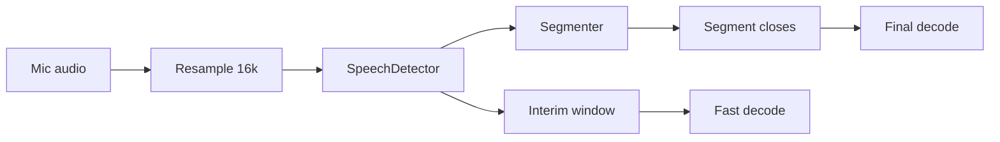
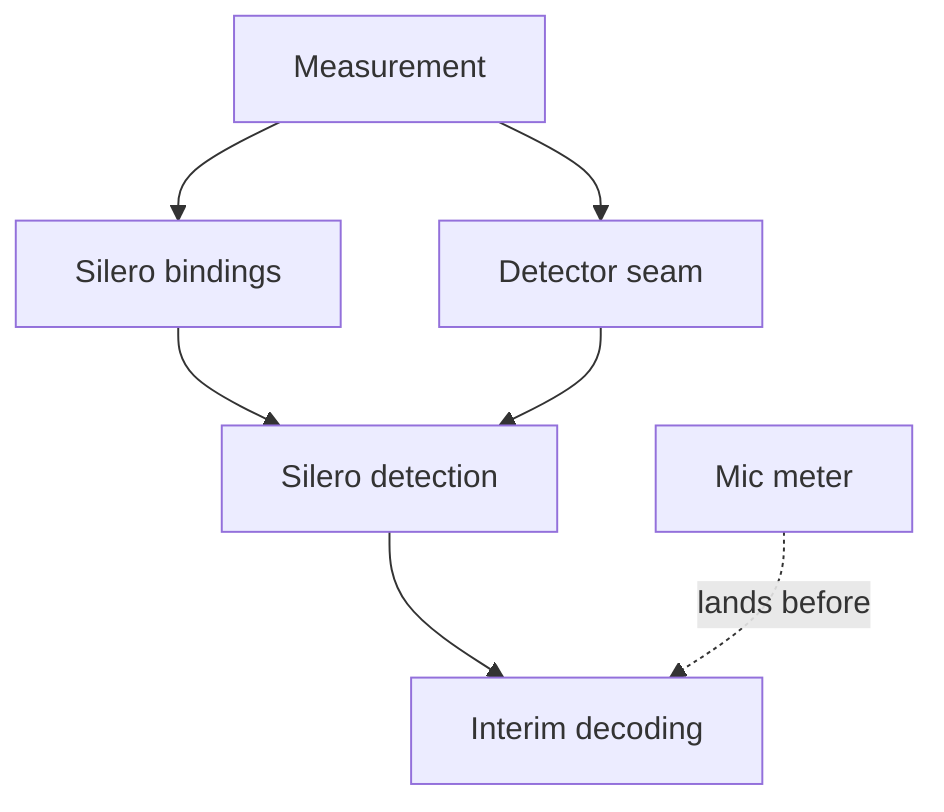

# PromptForge STT: Silero Speech Detection and Mic Meter

<product-contract>

## Product Requirements

PromptForge decides speech versus silence with a loudness threshold, which published measurements rank far below a neural voice detector, and the fast model hears whole trailing pauses, which is where Whisper invents text. This plan replaces every speech and silence decision with whisper.cpp's built-in streaming Silero detector, ends interim windows shortly after speech, and keeps today's loudness rule only as a fallback. It also adds a microphone meter to the Workshop status bar, so the user can see from anywhere in the app that dictation is live and which agent receives it. Success is measured end to end on the user's own recorded dictation with the production model pair.

- Problem and users:
  - Users dictating in the Workshop chat box and plain clients of `/v1/realtime`.
  - Speech is decided per 30 ms frame by RMS below 0.001 (`crates/gateway/stt/engine/src/policy.rs` `EnginePolicy::is_silence`, `crates/gateway/stt/api/src/segment.rs` `FRAME_SAMPLES`). In a published comparison, RMS energy reached a best MCC of 0.11 against 0.72 for Silero (https://arxiv.org/abs/2601.17270).
  - Interim windows end at the latest appended sample (`crates/gateway/stt/api/src/take.rs` `Take::interim_window`), so the fast model decodes trailing pauses and invents text over them. In a native capture of the dictation fixture (Testing Plan), a near-repeat of line 8 ("...TypeScript promptforges uses whisper, rust and TypeScript") stayed on screen for 1.6 s; the text-level guards (stock-phrase list, echo trim, confidence veto) catch only exact or obvious cases.
  - The only app-wide recording signal is a red LED (`crates/workshop/ui/src/main.ts`, the `recording` indicator). Capture keeps running when the dictating agent panel is hidden or covered, because `SpeechCaptureService` (`crates/workshop/ui/src/services/speech-capture.ts`) is one shared service per window owned by an opaque symbol, so a user working in another agent cannot see that audio is flowing or where it goes.
- Goals:
  - Silero decides speech for segment closes (2 s silence close, 0.6 s sentence-end close, 100 ms hangover, 0.5 s pre-roll, 10 s forced stride), the 250 ms click rule, the short-run skipped classification, proven-silent spans of skipped ranges, the echo trim's speech test, and interim decode skipping.
  - Each interim window ends at the last detected speech plus a bounded silence tail, long enough for Whisper to emit sentence-final punctuation.
  - Interim decodes are skipped when no new speech has arrived since the last decoded window.
  - When Silero cannot load or fails, the take falls back to today's loudness rule and reports it.
  - A status bar microphone meter shows a short scrolling loudness history while dictation is live, names the receiving agent in its tooltip, and reveals that agent on click.
- Non-goals:
  - Changing the Whisper models, the wire protocol, or adding user-facing configuration.
  - Starting interim windows at the last agreed word (still deferred).
  - Enabling Silero inside `whisper_full` decodes, semantic turn detection, and multilingual support.
- Success criteria (measured with the gateway-level native capture on the dictation fixture described in the Testing Plan, base.en interim plus small.en final on CUDA, against the loudness baseline that work item 1 records at the starting commit):
  - No text the speaker did not say appears on screen during any pause, including the line 8 near-repeat.
  - Final text keeps terminal punctuation at least as often as the loudness run, and sentence-ending lines close at 0.6 s or sooner.
  - Time from end of speech to final text per line is no more than 10 percent above the loudness run (0.4 to 0.85 s today).
  - Completed-transcript word errors are no worse, and the speech-sandbox gates hold.
  - Silero costs under 1 ms per 32 ms chunk at p99 on one CPU core of the development machine.
  - With the Silero model missing or unloadable, dictation still works on the loudness rule and the cause is reported.
  - The status bar reads, left to right, the barberpole, the mic meter, the record LED, and the inference LED. The meter moves only while capture is live, its tooltip names the receiving agent, and clicking it reveals that agent's panel even when another agent is focused or the dictating panel is covered.
- Constraints:
  - The whisper runtime stays pinned at `b4938`; every new FFI struct and function must match its layout exactly; `unsafe` stays inside `gateway-whisper-ffi`.
  - The speech engine stays backend-neutral; dependency directions in the Project Survey hold.
  - 500-line file ceiling and flat-sources rule (`AGENTS.md`); runtime paths never compile native dependencies.
  - The dictation fixture stays in gitignored `local/`; no user audio is committed.
  - The meter is client-side only: it reads audio the capture service already emits and changes no gateway code or wire event.
- Open questions: None

## Functional Specification

Every 16 kHz chunk of resampled input audio is classified by a speech detector before the segmenter sees it. The segmenter applies today's timing rules to those decisions. The take uses the same decisions to choose interim window ends and to skip decodes. Wire events and their shapes do not change. In the Workshop, the status bar meter follows the captured audio wherever the user is working.

- Actors and workflows:
  - A take creates its speech detector when it starts: Silero when the pinned model is available and loads, otherwise the loudness rule.
  - Audio appended to a take is split into 512-sample (32 ms) chunks, classified in order, and passed to the segmenter with its speech decision.
  - While dictation runs, the user can switch to another agent, cover or hide the dictating panel, and still see the meter moving; hovering it names the receiving agent, and clicking it reveals and focuses that agent's panel.
- Inputs and outputs:
  - Input: resampled 16 kHz PCM from `UncommittedInput::append_base64` (`crates/gateway/stt/api/src/realtime/input.rs`) through `Take::append`.
  - Output: unchanged events. Hypothesis `audio_end_ms` reports the interim window end, which is now speech end plus tail rather than the buffer end.
  - Meter input: the PCM16 chunks `SpeechCaptureService` already emits through `onAudio` (24 kHz, about 100 ms each), plus the owner's display label and reveal action.
- States and validation:
  - Silero speech starts when a chunk's probability reaches 0.5 and ends when it falls below 0.35 (hysteresis, named constants; the defaults of Silero's own `VADIterator` and of LiveKit's Silero plugin).
  - The sentence-end close silence is a named constant starting at today's 0.6 s, tuned per the Testing Plan.
  - Hangover, pre-roll, close timings, stride, click, and short-run rules keep their current sample values and apply to detector decisions.
  - Short-burst close: a segment whose speech is shorter than a named limit (starting at 1 s, tuned per the Testing Plan) closes after the 0.6 s sentence-end silence even when the interim text has no terminal punctuation; longer unpunctuated speech keeps the 2 s close.
  - An interim window ends at the earlier of the buffer end and the last speech chunk's end plus the speech tail (named constant, starting at 300 ms, tuned per the Testing Plan).
  - An interim decode is skipped when no speech chunk has ended since the last decoded window end.
  - Meter: 9 rounded bars. Each bar is one capture chunk's loudness (RMS on a logarithmic scale, clamped); the newest bar enters on the right and older bars scroll left. With capture idle, the bars rest as flat dots. The bar count and scale are named constants.
- Errors and recovery:
  - Model missing, digest mismatch, or context init failure: the take uses the loudness rule, and the cause is reported once through gateway progress and logs.
  - Inference error during a take: that take switches to the loudness rule from the next chunk and reports once; chunks are never reordered or dropped.
  - If the dictating panel is closed, its STT handle stops capture (`dispose` and `discardIfRecording` in `crates/workshop/ui/src/parts/stt/realtime-stt.ts`) and the meter returns to idle; a click with no owner does nothing.
- Security and privacy behavior:
  - The Silero model is a digest-pinned artifact fetched like the other speech artifacts. No audio is persisted.
- Acceptance criteria:
  - The success criteria above, plus: every existing timing rule has a test driven by detector decisions, and the loudness fallback reproduces today's decisions on the same audio.

</product-contract>
<implementation-contract>

## Technical Design

A backend-neutral speech detector trait sits in the speech engine. The whisper backend implements it with whisper.cpp's streaming Silero API, the engine provides the loudness implementation, and test fixtures provide a scripted one. The take owns one detector, and the segmenter consumes its decisions instead of calling the loudness rule. The Silero model is pinned and provisioned next to the Whisper models. On the Workshop side, the shared capture service carries owner metadata and a per-chunk loudness stream, and the status bar gains an ordered non-LED slot for the meter.

- Architecture:
  - `SpeechDetector` (new, `crates/gateway/stt/engine`): classifies one 512-sample chunk and returns a speech decision; `EnergyDetector` wraps today's `EnginePolicy::is_silence` rule.
  - `SileroDetector` (new, `crates/gateway/stt/backend-whisper`): owns a whisper-ffi `VadContext`, keeps streaming state with the no-reset call, and applies the 0.5 and 0.35 thresholds.
  - The detector runs inline where the segmenter runs today (on the session task inside `Take::append`), because reference Silero cost is about 0.2 to 0.3 ms per 32 ms chunk. If the measured whisper.cpp port exceeds 1 ms per chunk at p99, detection moves to a session-dedicated blocking thread that preserves chunk order.
- Modules and interfaces:
  - `gateway-whisper-ffi`: bindings for the standalone VAD API declared in `include/whisper.h` lines 192-199 and 695-750 at `b4938`, which is whisper.cpp v1.9.3, commit `371b5a7` (https://github.com/ggml-org/whisper.cpp/blob/b4938/include/whisper.h#L192-L199, https://github.com/ggml-org/whisper.cpp/blob/b4938/include/whisper.h#L695-L750): `whisper_vad_default_context_params`, `whisper_vad_init_from_file_with_params` (NULL on failure), `whisper_vad_detect_speech_no_reset` (false only when graph allocation fails), `whisper_vad_reset_state`, `whisper_vad_n_probs`, `whisper_vad_probs`, and `whisper_vad_free`. A 512-sample call yields exactly one probability, and the detector's internal state carries across calls until reset. The probability buffer is rebuilt on every call and its pointer is invalid after the next call, so the value is copied immediately.
  - The mirrored `whisper_vad_context_params` is `{ int n_threads; bool use_gpu; int gpu_device; }` (offsets 0, 4, 8; size 12; alignment 4), pinned with size and offset assertions. The safe `VadContext` frees on Drop and always sets `use_gpu = false` and `n_threads = 1`: detection computes on the CPU regardless, and `use_gpu = true` aborted on CUDA builds (https://github.com/ggml-org/whisper.cpp/issues/3508).
  - Every detect call writes four INFO lines through the whisper log callback (about 125 lines per second); the existing log-to-tracing bridge (`crates/gateway/stt/whisper-ffi/src/log.rs` `TRACING_BRIDGE`, installed through `whisper_log_set` in `library.rs`) drops or demotes those VAD lines.
  - A failed window compute still returns true, so `SileroDetector` treats a non-finite probability, or one outside 0 to 1, as an inference error.
  - `gateway-stt-backend-whisper`: `SileroDetector` construction from the model path.
  - `gateway-stt` segmenter (`crates/gateway/stt/api/src/segment.rs`, `segment/endpoint.rs`): `FRAME_SAMPLES` becomes 512 for both detectors, and `Segmenter::poll` takes per-frame decisions from the detector.
  - `gateway-stt` take: `Take::interim_window` ends windows at speech end plus tail; `Session::schedule_interim` (`crates/gateway/stt/api/src/realtime/session/route.rs`) skips decodes without new speech instead of running whole-window RMS; `Segmenter::speech_before` (echo trim, `crates/gateway/stt/api/src/take/window/echo.rs`) and the proven-silent span of skipped ranges (`silent_through`, `crates/gateway/stt/api/src/take/finalization.rs`) read detector speech runs.
  - Artifacts: a Silero model pin beside `RECOMMENDED_STT_MODELS` in `crates/gateway/config/src/config/stt.rs`: `https://huggingface.co/ggml-org/whisper-vad/resolve/main/ggml-silero-v6.2.0.bin`, SHA-256 `2aa269b785eeb53a82983a20501ddf7c1d9c48e33ab63a41391ac6c9f7fb6987`, 885,098 bytes, MIT, byte-identical to the test model whisper.cpp ships at `b4938`. It has a live-URL drift test, its digest is verified before `whisper_vad_init_from_file_with_params` (a malformed file can throw a C++ exception across the FFI boundary), and it is fetched by `artifacts::prepare_impl` (`crates/gateway/stt/api/src/artifacts.rs`) through `ensure_model_with_cancellation` into `~/.promptforge/models/`, with its path carried through `generation.rs`.
  - Workshop capture (`crates/workshop/ui/src/services/speech-capture.ts`): an owner registers a display label and a reveal action with the capture it owns; the service derives one loudness value per emitted chunk and exposes it with the owner metadata alongside the existing `onOwnerChange`.
  - Workshop agent view (`crates/workshop/ui/src/parts/stt/realtime-stt.ts`, `crates/workshop/ui/src/parts/agent/agent-session-view.ts`): supplies the agent name and session title as the label, and a reveal action that calls `openInZone` (`crates/workshop/ui/src/parts/layout/zones.ts`) with its panel instance (`agent:<instance>`).
  - Workshop status bar: the `StatusIndicators` contract (`crates/workshop/platform/status-indicators.ts`) and `StatusBar` (`crates/workshop/ui/src/parts/status/status-bar.ts`) gain an ordered non-LED slot for an element with a tooltip and a click action. The meter registers before the record LED (order 0, `crates/workshop/ui/src/main.ts`) and the inference LED (activity indicator, order 1, `crates/workshop/ui/src/parts/status/activity-indicator.ts`); the barberpole already sits beside the indicators group (`crates/workshop/look/status-bar.ts`).
  - A new meter part under `crates/workshop/ui/src/parts/status/` draws the bars with `requestAnimationFrame` only while capture is live, takes colors from `crates/workshop/look/tokens.css`, and renders as a button whose accessible label names the receiving agent.
- File and public API changes:
  - No wire, config schema, or facade changes. A new internal engine trait and a new speech artifact pin are added. In the Workshop, the internal status-indicator contract gains a non-LED slot, and `SpeechCaptureService` gains owner metadata and a loudness stream.
- Data, persistence, failure, security, and privacy constraints:
  - The PCM budget, absolute sample indexing, epoch cancellation, and the digest-pinned model pair stay unchanged. The whisper backend's existing silence check on decode buffers stays.
  - FFI layouts must match `b4938` exactly; a mismatch is undefined behavior, so layout verification precedes every binding.

</implementation-contract>
<verification-contract>

## Testing Plan

Detector decisions get unit tests through a scripted detector, so every timing rule stays deterministic in replays. Native tests check the Silero bindings and cost on real audio. The gateway-level native capture on the dictation fixture is the acceptance measurement.

- Unit:
  - FFI size and offset assertions for the VAD structs at `b4938`.
  - `EnergyDetector` reproduces today's per-frame decisions; Silero thresholds and hysteresis; every segmenter rule driven by scripted decisions; window end plus tail; decode skipping; fallback on load failure and on inference error.
  - Meter: loudness from PCM16 chunks, right-to-left scrolling and the idle state, status bar order (barberpole, meter, record LED, inference LED), tooltip with the owner label, click calling the owner's reveal, updates continuing while a second agent view is active, and return to idle when the owner disposes (`crates/workshop/ui/test/status-indicators.mjs`, `speech-capture.mjs`, `agent-stt.mjs`, `crates/workshop/look/test/shared-status-bar.mjs`).
- Integration and end-to-end:
  - Dictation fixture: `local/stt-fixtures/dictation-01.wav` (gitignored, never copied anywhere tracked) is a consented 69.3 s developer recording, 16 kHz mono 16-bit PCM, of this script with the pauses marked:
    - Line 1: "Okay, listen up. This is what I want. I want you to create a plan." (4 s pause)
    - Line 2: "Hey." (3 s pause)
    - Line 3: "The commit rule needs two passes, half a second apart." (1 s pause) The same sentence again. (3 s pause)
    - Line 4: "Can you check whether the gateway is running?" (3 s pause)
    - Line 5: "Thank you." (3 s pause)
    - Line 6: "First, open the settings page. Then turn off the old model and restart the app." (1 s pause)
    - Line 7: "This next sentence is deliberately long, so keep talking without stopping, because I want the recorder to cut a window in the middle of my speech and then stitch the two halves back together without losing or repeating any of the words I said." (3 s pause; over 10 s of continuous speech, so a forced cut falls inside it)
    - Line 8: "PromptForge uses Whisper, Rust, and TypeScript." (3 s pause)
    - Line 9: "That worked!" (2 s pause)
    - Line 10: "Bye." (about 4 s of silence)
  - Running the capture: set `PROMPTFORGE_WHISPER_BACKEND=cuda`, `PROMPTFORGE_WHISPER_MODEL` to the cached `ggml-base.en.bin` and `PROMPTFORGE_WHISPER_FINAL_MODEL` to the cached `ggml-small.en.bin` under `~/.promptforge/models/`, `PROMPTFORGE_WHISPER_AUDIO` to the fixture, and `PROMPTFORGE_REALTIME_CAPTURE` to an output file outside the repository, then run `cargo nextest run --locked -p gateway --all-features --run-ignored only --no-capture -E 'test(native_realtime_capture_records_every_server_event_at_real_time_pace)'`. The capture records every server event with its receive time; render the hypothesis events through the Workshop take reducer as `crates/workshop/ui/test/stt-replay.mjs` does to see what the editor showed.
  - Loudness baseline: work item 1 records, at the starting commit, each line's time from end of speech to its final text, whether its final keeps terminal punctuation, anything shown during pauses that was not said, and the completed transcript, into `local/stt-fixtures/dictation-01-loudness-baseline.json`. For reference, the last loudness capture before this plan (base.en plus small.en, CUDA) showed final text at about +0.80 s (line 1), +2.10 s (line 2, "Hey." waits for the 2 s close because the fast model gives it no period), +0.81 to +0.85 s (line 3), +0.69 s (line 4), +0.72 s (line 5), +0.84 s (line 6), +0.83 s (line 7, finalized only at +8.22 s), +2.08 s (line 8, with "prompt for users" shown for 3.7 s before it), +0.55 s (line 9), and +0.70 s (line 10). Nothing changed during the trailing silence, and the completed transcript had one wrong word ("reorganizer" for "recorder"), a stray capital "So" at line 7's forced cut, and "That worked." for "That worked!".
  - Replay fixtures drive a scripted detector derived from each fixture's `speech_samples`, so goldens change only where behavior intends to change; regenerated snapshots and metrics are committed, and existing `baseline.json` numbers are never edited.
  - Ignored native tests: Silero probabilities on `jfk.wav` and `dictation-01.wav` (high during speech, low over pauses and appended silence; streaming no-reset chunks agree with whole-buffer probabilities within a stated tolerance); a per-call timing test for single 512-sample calls, including the per-call graph rebuild (p50 and p99 on CPU); and a noise test over developer-provisioned noise-only clips in `local/stt-fixtures/` from MUSAN (https://openslr.org/17/) or DEMAND (https://zenodo.org/records/1227121), both cleared for commercial use (ESC-50, https://github.com/karolpiczak/ESC-50, is non-commercial), expecting no speech decisions and no interim text.
  - Gateway-level native capture (`crates/gateway/app/tests/it/realtime_stt/capture.rs`) on `dictation-01.wav` and `jfk.wav` with base.en interim and small.en final; the speech tail is set to the shortest value in 100 ms steps between 100 and 500 ms that keeps final punctuation and shows no invented text during pauses. The short-burst limit is set to the largest value between 0.5 and 1.5 s that closes line 2's "Hey." at the sentence-end silence without splitting any multi-word line of the recording. The sentence-end silence is set to the lowest value in 100 ms steps between 0.2 and 0.6 s that splits no sentence of the recording.
- Regression, security, and performance:
  - Full suite, Miri in WSL for the engine and `gateway-stt`, native whisper tests, structural checks, and the gateway app suite after every step that changes speech behavior; Workshop npm tests and typecheck for the meter.
- Exit criteria:
  - All suites pass, the success criteria hold on the dictation-01 capture against the recorded loudness baseline, and the tuning table (each value tried, with punctuation kept, text shown during pauses, and per-line timings) is recorded in `local/stt-fixtures/dictation-01-tuning.json` and summarized in the commit that sets the constants.

</verification-contract>
<decision-record>

## Decision Record

- Decisions:
  - Standalone streaming Silero replaces the loudness rule for every speech decision. Rationale: Silero pre-segmentation cut measured Whisper hallucinations from 21.3 to 0.2 percent (https://arxiv.org/abs/2501.11378), and RMS energy ranked far below it (https://arxiv.org/abs/2601.17270). User chose: "Standalone streaming Silero (per-chunk, keeps state) replaces the loudness check everywhere."
  - Fallback to the loudness segmenter with a report when Silero is unavailable. User chose: "Fall back to today's loudness segmenter and report it through gateway progress/logs."
  - Interim windows keep a bounded silence tail instead of ending at the last word. Rationale: Whisper uses the trailing pause for sentence-final punctuation, and the 0.6 s sentence-end close depends on interim punctuation. User: "we need some silence or else how do we get trailing sentence punctuation."
  - Lower latency is preferred: each tunable takes the lowest-latency value that meets its stability and punctuation checks.
  - Short unpunctuated bursts close at 0.6 s of silence. Rationale: on the dictation fixture, line 2's "Hey." waited about 2.1 s for its final because the fast model gave it no period, and Silero's speech end is more reliable than loudness for deciding the burst is over. User chose: "Yes, add it to the Silero plan and tune the length limit on the dictation-01 capture."
  - One 512-sample frame for both detectors, matching Silero's window.
  - The detector reads one contiguous 512-sample grid from the take's first sample, so each sample is classified exactly once and in order. The forced stride rounds up to whole frames (313 frames, 10.016 s), so it never restarts the grid. Rationale: Silero's streaming state assumes contiguous input, and today's stride rule resumes scanning at the exact 10 s mark, mid-frame (`crates/gateway/stt/api/src/segment/endpoint.rs` `endpoint`, `Segmenter::frame_grid_origin`), which would feed up to 511 samples to Silero twice. 16 ms more on a 10 s cap changes nothing the user sees. Added during step decomposition.
  - The Silero model is a pinned artifact, not a configured `[[stt_model]]`, because `SttRole` covers only interim and final roles.
  - Pin Silero v6.2.0 rather than v5.1.2. Rationale: both load at `b4938`, and v6 rejects noise-only clips far better (87 against 61 percent of ESC-50 files) with ROC-AUC 0.97 against 0.96 (https://github.com/snakers4/silero-vad/wiki/Quality-Metrics).
  - Detection runs on one CPU thread with `use_gpu` off, so it never competes with the Whisper decoders on the GPU.
  - The sentence-end close is tuned down from 0.6 s as far as the recording allows. Rationale: lower latency is preferred, and AssemblyAI's newest streaming model ends a turn 100 ms after terminal punctuation (https://www.assemblyai.com/docs/streaming/migration-guides/universal-to-universal-3-5-pro-streaming).
  - The mic meter lives in the status bar, not beside the chat box. User: "The status bar is better because if you click away the agent window, like if you put another window on top or even close it while it's recording, it's still recording, and on the status bar you can see that it's actually doing something."
  - The status bar order is barberpole, meter, record LED, inference LED. User: "the status bar will have 4 items: (barberpol) (waveform) (record LED) (inference LED)."
  - The meter shows a short scrolling loudness history. User chose: "A short loudness history: bars scroll right to left, each one a recent moment."
  - The meter's tooltip names the receiving agent and a click reveals it. User chose: "Tooltip names the receiving agent, and clicking the meter jumps to that agent."
  - The meter reads the PCM chunks the capture service already emits instead of adding an `AnalyserNode`, because a history of 100 ms moments needs no finer timing.
  - Silero detection runs inline on the session task. Rationale: single 512-sample `detect_chunk` calls measured p50 131 to 132 µs and p99 140 to 158 µs over three runs of 2,198 chunks of `dictation-01.wav` (slowest call 741 µs), about six times under the 1 ms budget. Measured on an AMD Ryzen Threadripper PRO 9995WX (AVX2), Windows build 26200, whisper.cpp `b4938` CUDA DLL with VAD forced to one CPU thread, unoptimized test profile, tracing log bridge installed. Slower CPUs are unmeasured.
  - Final decodes skip ranges with no detector speech, including the commit-time flush. Rationale: this was deferred until a capture showed final decodes of noise, and during Step 10 the gateway-level noise test did: with Silero classifying no chunk of a 29.9 s DEMAND kitchen clip as speech, the commit flush sent the whole take to small.en, which invented "Okay." and, on repeat runs, other sentences. Interim gating held; only the flush leaked. Pulled into Step 10 by the vibe coder because the trigger fired and the change serves the first success criterion; it is cheap to reverse.
- Rejected alternatives:
  - The `whisper_full` VAD flag on interim decodes. Reason: it strips the trailing pause Whisper needs for punctuation, reruns detection on every call, and does not touch endpointing. Revisit if the standalone detector leaves invented text inside decoded windows.
  - WebRTC VAD. Reason: best MCC of 0.41 (https://arxiv.org/abs/2601.17270), and it accepted every noise-only ESC-50 file as speech (https://github.com/snakers4/silero-vad/wiki/Quality-Metrics).
  - TEN VAD. Reason: its Apache 2.0 license adds a clause barring deployment that competes with Agora's offerings (https://github.com/TEN-framework/ten-vad/blob/22a3bcd4509d0faaa8eef4881e8af5f39c178950/LICENSE).
  - Picovoice Cobra. Reason: proprietary, billed per monthly active user through enterprise sales, with an access key checked at startup (https://picovoice.ai/docs/faq/general/).
  - FireRedVAD. Reason: no runtime outside Python was found during planning.
  - A user-facing detector setting. Reason: the fallback covers failure, and tests select detectors in code. Revisit if users need to disable Silero.
- Assumptions, risks, and notes:
  - Silero's speech-to-silence lag depends on the background level during pauses. A competitor claims "a delay of several hundred milliseconds" (https://github.com/TEN-framework/ten-vad/blob/22a3bcd4509d0faaa8eef4881e8af5f39c178950/README.md), and Silero's maintainer disputes it (https://github.com/snakers4/silero-vad/discussions/692). In an unpublished synthetic test run during planning on Silero's bundled reference model, the probability fell below 0.35 within one 32 ms chunk after a cut to digital silence, with a median of 32 ms over a -60 dBFS noise floor, and a median of about 260 ms (90th percentile about 416 ms) over a -45 dBFS floor. Our capture enables browser noise suppression, so pauses should be quiet, but the per-line timing criterion catches any delay in closes.
  - The whisper.cpp ggml port pads each 512-sample window by mirroring its own edges, while Silero's reference wrapper carries the previous window's last 64 samples; the accuracy effect is unmeasured, so the native probability tests on real audio decide whether it matters.
  - The ggml port has no published timing for single-chunk calls; user logs of whole-file runs work out to about 0.04 to 0.18 ms per window (port introduced in https://github.com/ggml-org/whisper.cpp/pull/3065), but each call also rebuilds its compute graph. The cost measurement decides inline versus thread.
  - Silero misses more quiet speech at low signal-to-noise ratios and on compressed or gated audio; one dictation app measured 5 to 14 percent of speech lost at segment edges in 4 of 102 files with a 30 ms pad (https://github.com/OpenWhispr/openwhispr/issues/1458). The 100 ms hangover, the 0.5 s pre-roll, and the speech tail protect word edges.
  - Silero's behavior on browser-processed audio (echo cancellation and noise suppression) and on our 24 to 16 kHz resampling is unmeasured; the dictation-01 capture is the first check.
  - A separate end threshold gave Silero no measured benefit in one study (MCC 0.72 against 0.71, https://arxiv.org/abs/2601.17270); hysteresis stays because it costs nothing and guards against flicker between frames.
  - The dictation-01 recording is one speaker on one microphone; results may differ for other voices and rooms.
  - Starting state: the plan was written at HEAD `ec0368dda` on top of the closed STT two-model upgrade (`vibe/2026-10-06-1-stt-two-model-upgrade.md`). Behavior this plan builds on, added after that run: a landed final refreshes the on-screen snapshot during silence (`4b2a7c0a5`); skipped ranges settle only text past the finalized watermark (`8e617095c`); echoes of finalized words are dropped (`6da8e1678`); trailing repeats over silence are cut using `Segmenter::speech_before`, only for words no earlier pass decoded (`ee1434132`, `d542f5081`); a short word followed by silence keeps its text and short runs past the 250 ms click rule are decoded by the final model (`a84b31b6d`, `ec0368dda`); the final pass is prompted only with text final decodes produced (`0edd4267c`); the interim stock-phrase list no longer contains "you", "bye", or "thank you" (`53f4a2307`); and the native capture harnesses accept `PROMPTFORGE_WHISPER_FINAL_MODEL`, with the gateway-level capture test added in `efba1cf47` (`24b48663a`). File and line references in this plan are to that HEAD.
  - The short-burst close could split a short word followed by a thinking pause ("Hey, [pause] there"); the tuning step checks multi-word lines, and the final pass still joins the text correctly when it splits.

### Deferred and Out of Scope

- Deferred: starting interim windows at detected speech boundaries instead of token timestamps. Revisit after this plan lands, gated on a fresh native capture meeting UPWR.
- Deferred: tinting the meter when the gateway's detector hears speech. It needs a new wire field; revisit after this plan lands.
- Deferred: Earshot (pure Rust, MIT or Apache-2.0, about 95 KiB, about 5 microseconds per frame, https://github.com/pykeio/earshot/tree/ffd32d426f556c55a8c84490c12745743ee4bd79; one independent test put its error rate at 26.5 against Silero's 23.9 percent, https://github.com/ekhodzitsky/polyvoice/blob/e35db215/benchmarks/results/earshot-vad-notes.md) as the fallback instead of the loudness rule. Revisit if fallback sessions prove common.
- Deferred: fuzzy near-repeat matching in the echo trim (the line 8 copies differed by one word). Revisit if near-repeats still show after the speech tail ends interim windows.
- Deferred: a cross-attention rewind guard (stop decoding when attention jumps back to transcribed audio), which cut hallucination on unpadded input from 34.4 to 0 percent on Whisper base (https://arxiv.org/abs/2607.01108). It needs cross-attention weights through the FFI; revisit if repeats persist.
- Deferred: look-ahead punctuation at segment joins (emitting a sentence only after the next one starts improved sentence-boundary F0.5 by 13.9 percent, https://arxiv.org/abs/2301.03819). Revisit if boundary punctuation and casing errors persist, such as the stray "So" at the 10 s cut.
- Deferred: glossary size and ordering for product names (about 100 words helped, 500 or more gave negligible gain, likely words last beat first, and prompting only expected words caused insertions, https://www.isca-archive.org/interspeech_2025/hou25_interspeech.pdf). Revisit if product-name misrecognitions persist.
- Deferred: stutter suppression such as n-gram blocking through the logits callback. No measured effect on Whisper exists and it can forbid real repeats; revisit with a measurement.
- Out of scope: semantic turn detection, wire protocol changes, and model replacement.

</decision-record>
<project-survey>

## Project Survey

- Status: complete
- Build command: `cargo build --locked` builds the default member, package `gateway` (`crates/gateway/app`, binary `promptforge-gateway`) with default features `local`, `web-search`, `config-ui`, and `stt`; `cargo build --locked -p gateway --no-default-features` is the headless shape. CI runs `npm ci --prefix crates/workshop` and `npm ci --prefix crates/gateway/config-ui/ui` before any cargo build.
- Focused test command pattern: `cargo nextest run --locked -p <crate> --all-features <filter>`; add `--test it` for a crate's `tests/it` binary or `--test <stem>` for flat targets. Native whisper tests are `#[ignore]`d and read `PROMPTFORGE_WHISPER_LIBRARY`, `PROMPTFORGE_WHISPER_MODEL`, `PROMPTFORGE_WHISPER_AUDIO`, optional `PROMPTFORGE_WHISPER_FINAL_MODEL`, and, on the gateway path, `PROMPTFORGE_WHISPER_BACKEND` (`cpu` or `cuda`); run with nextest's `--run-ignored only --test-threads 1` (nextest rejects `-- --ignored`). The gateway-level capture writes to the path in `PROMPTFORGE_REALTIME_CAPTURE`. Local fixtures are in `local/stt-fixtures/` (whisper DLLs, `ggml-tiny.en.bin`, `jfk.wav`, `dictation-01.wav`); production models are cached under `~/.promptforge/models`. Miri: `cargo +nightly-2026-09-05 miri test -p <gateway-stt|gateway-stt-engine> --features test-fixtures miri_`, which on this Windows machine must run in WSL Ubuntu because the `workspace-hack` command line exceeds the Windows limit. One JS test file: `node --test <file>` from its package.
- Component test command pattern: `cargo nextest run --locked -p <crate> --all-features`; the STT subsystem: `cargo nextest run --locked -p gateway-stt -p gateway-stt-engine -p gateway-stt-backend-whisper -p gateway-whisper-ffi --all-features`; the gateway app: `cargo nextest run --locked -p gateway --all-features`; structural checks: `cargo test -p build-xtask`; Workshop JS: `npm test --workspaces --if-present` from `crates/workshop`.
- Full-suite test command: `cargo nextest run --locked --workspace --exclude workshop --exclude workshop-server --exclude workshop-server-api --all-features`, then `cargo nextest run --locked -p workshop -p workshop-server -p workshop-server-api`, then `npm test --workspaces --if-present` in `crates/workshop`.
- Linter command: `CARGO_BUILD_WARNINGS=deny cargo clippy --workspace --exclude workshop --exclude workshop-server --exclude workshop-server-api --all-targets --all-features`, `CARGO_BUILD_WARNINGS=deny cargo clippy -p workshop -p workshop-server -p workshop-server-api --all-targets`, `cargo check -p gateway --no-default-features`, `npm run typecheck --workspaces --if-present` in `crates/workshop`, plus `cargo deny check`, `cargo audit`, and `cargo hakari verify`. In PowerShell set `$env:CARGO_BUILD_WARNINGS='deny'`.
- Formatter check command: `cargo fmt --all --check`.
- Docs command: `RUSTDOCFLAGS="-D warnings" cargo doc --workspace --no-deps --all-features --exclude workshop --exclude workshop-server --exclude workshop-server-api`, plus `cargo +nightly-2026-09-05 xtask api --check`.
- Test placement and naming conventions:
  - Unit tests in `#[cfg(test)] mod tests`, inline or in a sibling `<stem>-tests.rs` wired by `#[path]`; integration tests in `tests/it/main.rs`; flat targets in `crates/gateway/stt/engine/tests/` and `crates/gateway/stt/backend-whisper/tests/`.
  - Snake_case sentence names; Miri-safe tests prefixed `miri_`; native tests `#[ignore = "requires packaged whisper, model, and audio fixtures"]`; STT doubles behind the `test-fixtures` feature.
  - Speech-sandbox replay fixtures in `crates/gateway/stt/api/tests/fixtures/replay/` with goldens, `metrics.json`, and a frozen `baseline.json`; regenerate with `PROMPTFORGE_REPLAY_UPDATE=1`.
- Directory map:
  - `crates/gateway/stt/`: `api` (package `gateway-stt`: artifacts, generation, realtime sessions, takes, segmenter), `engine` (`gateway-stt-engine`: backend-neutral decoding on worker threads, `EnginePolicy`), `backend-whisper` (`gateway-stt-backend-whisper`: whisper backend, decode profiles, guards), `whisper-ffi` (`gateway-whisper-ffi`: runtime-loaded bindings for whisper.cpp `b4938`).
  - `crates/gateway/config/` (speech config and model pins), `crates/gateway/local/` (artifact store and runtime bundle pins), `crates/gateway/app/` (gateway binary and end-to-end tests), `crates/workshop/` (desktop app and UI), `vibe/` (plan records), `local/` (gitignored developer fixtures).
- Component boundaries:
  - Only `gateway` depends on `gateway-stt`. `gateway-stt` depends on the engine, the whisper backend, `gateway-config`, `gateway-local`, and `gateway-progress`; the whisper backend depends on the engine, whisper-ffi, and `gateway-progress`; the engine and whisper-ffi name no workspace crate besides `workspace-hack` and `build-ceiling`.
  - Only `crates/gateway/stt/whisper-ffi` (among STT crates) may relax `unsafe_code`; whisper-ffi keeps raw pointers behind Drop-owning wrappers and retargets its ABI pin together with its size assertions (`crates/gateway/stt/whisper-ffi/AGENTS.md`).
  - The engine keeps decode jobs stateless and blocking work on its owning worker threads (`crates/gateway/stt/engine/AGENTS.md`).
- Conventions summary:
  - Rust 2024 edition on stable; clippy `all` and `pedantic` denied; lints suppressed only with `#[expect(..., reason = "...")]`; every crate's `build.rs` enforces a 500-line ceiling; flat sources with `#[path]` siblings until a module has three children.
  - Comments state only non-obvious constraints; behavior changes ship with tests; commits use short imperative subjects; plan records live in `vibe/YYYY-MM-DD-N-<slug>.md`.

</project-survey>
<execution-plan>

## Execution Instructions

Execute the steps in numeric order. Each step is one commit holding its code and its tests. When a step is done, append ` [completed]` to its heading and leave its tags unchanged. File references point at the tree at plan time (HEAD `ec0368dda`). The current HEAD `5ed2b8a8a` adds only one line to `crates/workshop/ui/src/parts/chatbox/chat-box.css`. Earlier steps shift line numbers, so locate code by the named symbol.

### Components

Each component is useful on its own and lands in this order.

1. Capture measurement (Step 1): a committed scorer for gateway-level captures, and the loudness baseline. Placed first because the baseline must be recorded before any speech behavior changes, and Step 12 scores its tuning and verification captures with the same tool.
2. Silero bindings (Steps 2-3): the whisper.cpp VAD API in `gateway-whisper-ffi` and its measured cost. Placed second because it depends on no other workspace crate, and an ABI mismatch or a cost over budget stops the plan before any segmenter code changes.
3. Detector seam (Steps 4-5): the backend-neutral detector trait, and the segmenter running on its decisions with the loudness detector. It does not depend on component 2; it follows it only so a block there lands first. Silero detection and interim gating both plug into it.
4. Silero detection (Steps 6-7): the pinned model artifact and the per-take Silero detector with loudness fallback. Needs the bindings and the seam.
5. Mic meter (Steps 8-9): the Workshop status bar meter. Independent of every speech change; placed before the last component so its closing verification covers it.
6. Interim decoding (Steps 10-12): speech-aware interim windows and decode skipping, the short-burst close, then tuning and full verification. Placed last because tuning needs Silero decisions, every new rule, and the baseline, and it sets the constants the success criteria are judged on.

### Pieces

- Capture measurement: one piece (Step 1).
- Silero bindings: VAD binding (Step 2), then cost measurement (Step 3), sequential - the timing test calls the binding, and its result decides how Step 7 runs detection.
- Detector seam: engine detectors (Step 4), then the segmenter on detector decisions (Step 5), sequential - the segmenter owns the engine's fallback detector.
- Silero detection: model artifact (Step 6), then detector selection (Step 7), sequential - selection needs the verified model path the generation carries.
- Mic meter: capture owner and level (Step 8), then the status bar meter (Step 9), sequential - the meter reads the level stream and owner presence Step 8 adds.
- Interim decoding: interim gating (Step 10), short-burst close (Step 11), tuning and verification (Step 12), sequential - tuning sets the Step 10 speech tail and the Step 11 short-burst limit together with the sentence-end silence.

### Gates

- Verification scope: focused tests within a step; the formatter, linter, and component tests at each component's last step; the full build, formatter, linter, docs, structural checks, and full suite at Step 12 (commands in Project Survey). Ignored native tests and Miri run where a step names them, with `--run-ignored only --test-threads 1` for native tests.
- From Step 5 on, every step that changes speech behavior (5, 7, 10, 11, 12) regenerates the replay snapshots and `metrics.json` with `PROMPTFORGE_REPLAY_UPDATE=1`, commits them, and runs the gateway app suite. `baseline.json` is never edited, and its replay thresholds must hold. Steps that touch `gateway-stt-engine` or `gateway-stt` (4, 5, 7, 10, 11, 12) run Miri in WSL.
- Workshop steps (1, 8, 9) run `npm test --workspaces --if-present` and `npm run typecheck --workspaces --if-present` in `crates/workshop`.
- No file may exceed 500 lines. Touched files already close: `crates/gateway/stt/api/src/take.rs` (485), `crates/gateway/stt/api/src/artifacts.rs` (461), `crates/gateway/stt/api/src/take/state.rs` (448), `crates/gateway/config/src/config/stt.rs` (418). When a touched file would cross the ceiling, move code into a `#[path]` sibling or its inline tests into `<stem>-tests.rs`; when a module gains a third child file, convert it to a directory per the flat-sources rule in `AGENTS.md`.
- `dictation-01.wav`, the noise clips, line files, baselines, and the tuning table stay in gitignored `local/stt-fixtures/`; captures go outside the repository. Never commit user audio or capture files.
- Two consecutive verification failures with the same failure signature on one step stop the work for a re-plan.
- The run's plan record is `vibe/YYYY-MM-DD-N-silero-speech-detection.md`. After Step 12, commit `Close plan: silero-speech-detection`.

<step-1>

### Step 1: Capture scorer and loudness baseline [completed]

- Component: Capture measurement
- Piece: capture scorer
- Changes:
  - `crates/workshop/ui/test/take-reducer-loader.mjs` (new, beside the existing `*-fixtures.mjs` helpers): the esbuild loader for `createTakeRegistry` and `reduceTakeRegistry` that `crates/workshop/ui/test/stt-replay.mjs` defines today, moved here so both files share it.
  - `crates/workshop/ui/test/stt-capture-score.mjs` (new): scoring functions plus node tests. Given a capture written by `crates/gateway/app/tests/it/realtime_stt/capture.rs` and a line file, it renders the hypothesis events through the take reducer and reports, per line: final latency (receive time of the final that completes the line minus the line's speech end), whether the final keeps the script's terminal punctuation, and any words rendered during the following pause beyond the normalized script words spoken so far. For the take, it reports the completed transcript and its word errors against the script. With `PROMPTFORGE_REALTIME_CAPTURE` naming a capture, `PROMPTFORGE_CAPTURE_LINES` a line file, and `PROMPTFORGE_CAPTURE_SCORE` an output path, it scores that capture into the output; otherwise only the synthetic tests run.
  - Line files (gitignored, never committed): `local/stt-fixtures/dictation-01-lines.json` and `local/stt-fixtures/jfk-lines.json`, holding each line's script text and speech start and end in ms. Measure them once from the fixture waveform (loudness runs grouped at the scripted pauses in the reference facts below), cross-check them against the scripted pause lengths and the word timings in the baseline capture, and never change them afterward, so every later run is scored against the same reference.
  - Baseline: with no speech change since the plan's starting HEAD, run the gateway-level capture with the recipe below (base.en interim, small.en final, CUDA) on `dictation-01.wav` and `jfk.wav`, and score them into `local/stt-fixtures/dictation-01-loudness-baseline.json` and `local/stt-fixtures/jfk-loudness-baseline.json`. If the dictation numbers disagree with the reference capture below beyond run-to-run noise, fix the scorer or the line file before committing.
- Reference facts for the line files and the baseline check:
  - `dictation-01.wav` is a 69.3 s, 16 kHz mono 16-bit recording of this script, with the pauses that follow each line in parentheses:
    1. "Okay, listen up. This is what I want. I want you to create a plan." (4 s)
    2. "Hey." (3 s)
    3. "The commit rule needs two passes, half a second apart." (1 s) then the same sentence again (3 s)
    4. "Can you check whether the gateway is running?" (3 s)
    5. "Thank you." (3 s)
    6. "First, open the settings page. Then turn off the old model and restart the app." (1 s)
    7. "This next sentence is deliberately long, so keep talking without stopping, because I want the recorder to cut a window in the middle of my speech and then stitch the two halves back together without losing or repeating any of the words I said." (3 s; over 10 s of continuous speech, so a forced cut falls inside it)
    8. "PromptForge uses Whisper, Rust, and TypeScript." (3 s)
    9. "That worked!" (2 s)
    10. "Bye." (about 4 s of silence)
  - Capture recipe: set `PROMPTFORGE_WHISPER_BACKEND=cuda`, `PROMPTFORGE_WHISPER_MODEL` to the cached `ggml-base.en.bin` and `PROMPTFORGE_WHISPER_FINAL_MODEL` to the cached `ggml-small.en.bin` under `~/.promptforge/models/`, `PROMPTFORGE_WHISPER_AUDIO` to the clip, and `PROMPTFORGE_REALTIME_CAPTURE` to an output file outside the repository, then run `cargo nextest run --locked -p gateway --all-features --run-ignored only --no-capture -E 'test(native_realtime_capture_records_every_server_event_at_real_time_pace)'`.
  - Each baseline records, per line, the time from end of speech to its final text, whether the final keeps terminal punctuation, and anything shown during the following pause that was not said; and for the take, the completed transcript.
  - Reference loudness capture (base.en plus small.en, CUDA) to agree with within run-to-run noise: final text at about +0.80 s (line 1), +2.10 s (line 2, which waits for the 2 s close because the fast model gives "Hey." no period), +0.81 to +0.85 s (line 3), +0.69 s (line 4), +0.72 s (line 5), +0.84 s (line 6), +0.83 s (line 7, finalized only at +8.22 s), +2.08 s (line 8, with "prompt for users" shown for 3.7 s before it), +0.55 s (line 9), and +0.70 s (line 10). Nothing changed during the trailing silence. The completed transcript had one wrong word ("reorganizer" for "recorder"), a stray capital "So" at line 7's forced cut, and "That worked." for "That worked!".
- Tests: `stt-capture-score.mjs` scores a small synthetic capture built inline (events only, no audio): latency per line, punctuation kept and lost, unsaid words during a pause counted and said words not counted, and word errors on the completed transcript. `stt-replay.mjs` still passes on the shared loader. Workshop npm tests and typecheck.
- Commit: `Add STT capture scorer for dictation baselines`

</step-1>

<step-2>

### Step 2: Bind whisper.cpp streaming VAD [completed]

- Component: Silero bindings
- Piece: VAD binding
- Changes:
  - Download the pinned v6.2.0 model from the Technical Design URL to `local/stt-fixtures/ggml-silero-v6.2.0.bin` (gitignored) and confirm its SHA-256 and size; `PROMPTFORGE_SILERO_MODEL` names this file in every later native test.
  - Verify first, and return blocked on any difference from the Technical Design: the seven prototypes and `whisper_vad_context_params` in `local/stt-fixtures/whisper.h` match `include/whisper.h` at `b4938`; `local/stt-fixtures/whisper.dll` exports all seven symbols; and note the text of the per-call VAD log lines at the tag for `log.rs` to match.
  - `crates/gateway/stt/whisper-ffi/src/raw.rs`: `#[repr(C)] VadContextParams { n_threads: c_int, use_gpu: bool, gpu_device: c_int }` (distinct from the existing `VadParams` inside `FullParams`), an opaque VAD context type, and the seven function pointer types.
  - `crates/gateway/stt/whisper-ffi/src/library.rs`: resolve the seven symbols in `WhisperLibrary::load` with `load_symbol`, like the existing set.
  - `crates/gateway/stt/whisper-ffi/src/lib.rs`: size 12, alignment 4, and offsets 0, 4, and 8 assertions for `VadContextParams` beside the existing layout assertions.
  - `crates/gateway/stt/whisper-ffi/src/vad.rs` (new): `VadContext`, holding the library and the context pointer and freeing it in `Drop`. `VadContext::new(library, path)` starts from `whisper_vad_default_context_params`, forces `use_gpu = false` and `n_threads = 1`, and maps NULL to an error. `detect_chunk` takes exactly one 512-sample chunk, calls `whisper_vad_detect_speech_no_reset`, requires `whisper_vad_n_probs` to be 1, and copies the probability before returning. `probabilities` returns every probability of a longer buffer for the agreement test. `reset` calls `whisper_vad_reset_state`. The type is `Send` but not `Sync`, with its safety argument beside the impl.
  - `crates/gateway/stt/whisper-ffi/src/error.rs`: variants for VAD init failure, detect failure, and an unexpected probability count.
  - `crates/gateway/stt/whisper-ffi/src/log.rs`: `TRACING_BRIDGE` demotes the per-call VAD lines to trace, matched on the text noted above.
  - `crates/gateway/stt/whisper-ffi/AGENTS.md`: the VAD symbol set and the Silero model pin (URL, SHA-256, size, license) beside the ABI pin, and the rule that a VAD context never enables the GPU (https://github.com/ggml-org/whisper.cpp/issues/3508).
- Tests: the layout assertions; unit tests for the log demotion; and in `crates/gateway/stt/whisper-ffi/src/vad-tests.rs` (new `#[path]` sibling of `vad.rs`), ignored native tests reading `PROMPTFORGE_WHISPER_LIBRARY`, `PROMPTFORGE_WHISPER_AUDIO`, and `PROMPTFORGE_SILERO_MODEL`, and checking the model's SHA-256 before init. The tests check that the model loads; that on `jfk.wav` and `dictation-01.wav` probabilities are high inside speech and low over the pauses in the Step 1 line files and over 1 s of appended digital silence; that streaming `detect_chunk` calls agree with `probabilities` over the whole buffer within a tolerance the test states; and that a wrong-length chunk is rejected. Run on both audio files.
- Commit: `Bind whisper.cpp streaming VAD in whisper-ffi`

</step-2>

<step-3>

### Step 3: Measure Silero cost per chunk [completed]

- Component: Silero bindings
- Piece: cost measurement
- Changes:
  - `crates/gateway/stt/whisper-ffi/src/vad-tests.rs`: an ignored timing test that warms up, then times every single 512-sample `detect_chunk` call over `dictation-01.wav` on one CPU thread and prints p50 and p99. Each call includes whisper.cpp's per-call graph rebuild.
  - Record p50, p99, and the machine in this plan's Decision Record and in the commit message. At or under 1 ms p99, detection runs inline on the session task, as the Technical Design says. Above 1 ms, return blocked with the numbers: the success criterion requires under 1 ms, so moving to a session thread needs a re-plan decision.
- Tests: the timing test, which fails above 1 ms p99 so later manual runs catch a regression.
- Commit: `Measure per-chunk Silero VAD cost`

</step-3>

<step-4>

### Step 4: Speech detector trait with energy, fallback, and scripted detectors [completed]

- Component: Detector seam
- Piece: engine detectors
- Changes:
  - `crates/gateway/stt/engine/src/policy.rs`: `EnginePolicy::DETECTOR_CHUNK_SAMPLES` (512).
  - `crates/gateway/stt/engine/src/detector.rs` (new, exported from `lib.rs`):
    - `pub trait SpeechDetector: Send` with `classify(&mut self, chunk: &[f32]) -> Result<bool, DetectorError>` over one chunk.
    - `EnergyDetector` applies `EnginePolicy::is_silence` and never fails.
    - `FallbackDetector` holds an optional boxed primary and an `EnergyDetector`. Its infallible `classify` returns the primary's decision until the primary errs. From then on it answers with loudness, including the failed chunk, so no chunk is dropped. `take_fault` hands out the first error exactly once, for reporting. `FallbackDetector::energy()` has no primary.
  - `crates/gateway/stt/engine/src/error.rs`: `DetectorError`, with load and inference cases that carry a source message.
  - `crates/gateway/stt/engine/src/test_fixtures/detector.rs` (new, behind `test-fixtures`): `ScriptedDetector`, built from absolute `[start, end)` sample runs. It counts chunks from sample 0, reads a chunk as speech when it overlaps any run, records each chunk start it saw, and can be told to fail at a given chunk.
- Tests: `EnergyDetector` matches `is_silence` on silent, quiet, and loud chunks. `FallbackDetector` passes primary decisions through, switches on the first error without skipping the failed chunk, reports the fault once, and never calls the primary again. `ScriptedDetector` handles chunks at run edges. Pure tests are prefixed `miri_`; run Miri for `gateway-stt-engine` in WSL.
- Commit: `Add speech detector trait with energy and fallback detectors`

</step-4>

<step-5>

### Step 5: Segmenter on detector decisions [completed]

- Component: Detector seam
- Piece: segmenter on detector decisions
- Changes:
  - `crates/gateway/stt/api/src/segment.rs`:
    - `FRAME_SAMPLES` becomes `EnginePolicy::DETECTOR_CHUNK_SAMPLES`.
    - `Segmenter` owns the take's `FallbackDetector` through `Segmenter::new(detector)`. `Default` goes away, and `TakeState` builds it with `FallbackDetector::energy()` until Step 7.
    - A new `Segmenter::classify(&mut self, buffer, buffer_origin)` classifies every newly complete chunk exactly once, in order, on one grid from sample 0. It updates `speech_end` and queues the decisions as compact speech runs; a take without a final pipeline does not queue them.
    - `poll` reads the queued decisions instead of calling `EnginePolicy::is_silence`.
    - `speech_before` keys on the classified frontier instead of the poll cursor.
  - `crates/gateway/stt/api/src/segment/endpoint.rs`: `FORCED_STRIDE_SAMPLES` rounds up to whole frames (313 frames, 10.016 s), so a stride ends on a frame boundary and never restarts the grid (Decision Record). Every other timing constant keeps its sample value.
  - Remove the grid-restart tracking: `Segmenter::frame_grid_origin`, `TakeMetrics::frame_grid_origin`, its copy in `crates/gateway/stt/api/src/test_fixtures/hour.rs`, and `grid_origins` in `crates/gateway/stt/api/tests/it/replay/native_capture.rs`. `native_capture/audio.rs` `speech_runs` scans the same 512-sample grid with `EnergyDetector`.
  - `crates/gateway/stt/api/src/take.rs`: `Take::append` classifies newly complete chunks right after `append_releasing`, whether or not the take has a final pipeline. `poll_closed` (`take/finalization/retry.rs`) then only applies the endpoint rules. Keep `take.rs` under the ceiling.
  - The echo trim (`take/window/echo.rs`, through `Segmenter::speech_before`) and the proven-silent span of skipped ranges (the `silent_through` field, set from `Segmenter::scanned` in `take/finalization/retry.rs`) now read detector decisions with no change to their logic.
  - Replay: `crates/gateway/stt/api/src/test_fixtures/replay.rs` and `replay-script.rs` give each replayed take a `ScriptedDetector` built from the fixture's `speech_samples`, through a test-fixtures `Take::with_detector`. Goldens then no longer depend on the loudness of synthesized audio. Regenerated snapshots and `metrics.json` may differ only through 512-sample quantization and the stride rounding.
- Tests:
  - `segment/tests.rs` and the `endpoint.rs` tests drive every rule with `ScriptedDetector` decisions: the 2 s close, the 0.6 s sentence-end close, the 100 ms hangover, the 0.5 s pre-roll, the frame-aligned 10.016 s stride with its overlap, the 250 ms click rule, the short-run skipped classification, and the proven-silent span.
  - Across two strides, every chunk is classified once and in order, checked against the scripted detector's recorded starts.
  - A take without a final pipeline still classifies, and its echo trim cuts a repeat over scripted silence.
  - With `EnergyDetector`, the existing loudness tests close within one frame of their previous positions. Expected values change only by that quantization.
  - Miri for `gateway-stt` and `gateway-stt-engine` in WSL; gateway app suite.
- Commit: `Drive the STT segmenter from speech detector decisions`

</step-5>

<step-6>

### Step 6: Pin and provision the Silero model [completed]

- Component: Silero detection
- Piece: model artifact
- Changes:
  - `crates/gateway/config/src/config/stt.rs`: a `SILERO_VAD_MODEL` pin beside `RECOMMENDED_STT_MODELS`, with the Technical Design's URL, SHA-256, size (885,098 bytes), and MIT license, exposing `source()` and `sha256()` like the recommended pins. It is not an `[[stt_model]]`, and the config schema does not change.
  - `crates/gateway/stt/api/src/artifacts-silero.rs` (new `#[path]` sibling, because `artifacts.rs` is at 461 lines): `artifacts::prepare_impl` fetches the model through `ensure_model_with_cancellation` into `~/.promptforge/models/`. Its SHA-256 is checked on every prepare, cache hits included; reuse the store's check if it already covers cache hits. A failed fetch or digest mismatch yields no path plus a cause, and the generation still loads.
  - `crates/gateway/stt/api/src/generation.rs` and `generation-lease.rs`: the generation carries the verified Silero path or the cause, and `GenerationLease` exposes it. A cause is reported once per generation through gateway progress and logs.
  - `crates/gateway/app/src/admin/walled/orphans.rs` `admin_orphans`: the Silero pin's source joins the STT sources the scan diffs against, so `GET /admin/orphans` never reports the provisioned Silero model as an orphan. Test in `orphans-tests.rs`.
- Tests: a pin shape test beside the recommended-model tests; the Silero pin added to the live drift test under its existing `#[ignore = "downloads large live artifacts to detect upstream URL or digest drift"]`; artifact tests with a stubbed store showing that the verified path reaches the lease, and that a digest mismatch or failed fetch leaves no path, reports once, and still loads the generation. Gateway app suite.
- Commit: `Pin and provision the Silero VAD model`

</step-6>

<step-7>

### Step 7: Silero detector per take with loudness fallback [completed]

- Component: Silero detection
- Piece: detector selection
- Changes:
  - `crates/gateway/stt/backend-whisper/src/silero.rs` (new, exported from `lib.rs`): `SileroDetector`, owning a whisper-ffi `VadContext` built from the backend's loaded whisper library (exposed from `WhisperModelFactory` in `model.rs`) and the verified model path. It implements `SpeechDetector` with one `detect_chunk` per chunk and no reset between chunks. A non-finite probability, or one outside 0 to 1, becomes a `DetectorError`. Hysteresis lives in a pure `Hysteresis` helper with `SPEECH_START_PROBABILITY` (0.5) and `SPEECH_END_PROBABILITY` (0.35).
  - Per-take selection in `gateway-stt` (`GenerationLease::speech_detector` and `TakeState` construction): `Take::new` gives the segmenter a `FallbackDetector` with a Silero primary when the lease has a verified path and the context initializes. Init failure gives `FallbackDetector::energy()` and one report for that take. A missing path was already reported by the generation in Step 6.
  - After each `Segmenter::classify`, a `take_fault` result is reported once through gateway progress and logs.
  - Detection runs inline on the session task, per the Step 3 decision.
  - `crates/gateway/stt/api/tests/it/replay/native_capture.rs` records `speech_samples` from the take's detector decisions, through a test-fixtures record of the segmenter's speech runs, instead of rerunning loudness in `native_capture/audio.rs`.
- Tests:
  - `Hysteresis` starts speech at 0.5, holds it above 0.35, ends it below 0.35, and does not flicker on values alternating between the two.
  - Probability validation maps NaN, infinity, negative values, and values above 1 to errors.
  - Take-level tests with a `ScriptedDetector` primary: a scripted load failure and a scripted mid-take inference error both fall back to loudness, report once, and keep every chunk in order.
  - Provision the noise clips before writing the native tests: download at least three DEMAND 16 kHz environments without background speech (for example `DKITCHEN_16k.zip`, `DWASHING_16k.zip`, `STRAFFIC_16k.zip`, `TCAR_16k.zip`, https://zenodo.org/records/1227121), take `ch01.wav` from each, cut it to its first 30 s, and save it as 16 kHz mono 16-bit `local/stt-fixtures/noise/<environment>.wav`. Skip environments with background speech (`PCAFETER`, `PRESTO`, `SPSQUARE`). Return blocked when no clip can be fetched.
  - Ignored native tests in `crates/gateway/stt/backend-whisper/tests/native_silero.rs` (new), reading the Step 2 environment variables plus `PROMPTFORGE_NOISE_CLIPS`, which names `local/stt-fixtures/noise/`. On `jfk.wav` and `dictation-01.wav`, speech decisions cover each line's span in the Step 1 line files, and none falls more than 0.5 s inside a pause of 1 s or longer. On every noise clip there is no speech decision.
  - Miri for `gateway-stt` in WSL. Regenerate replays; scripted replays should not change. Gateway app suite.
- Commit: `Detect speech with Silero and fall back to loudness`

</step-7>

<step-8>

### Step 8: Capture owner presence and level stream [completed]

- Component: Mic meter
- Piece: capture owner and level
- Changes:
  - `crates/workshop/ui/src/services/speech-level.ts` (new): `chunkLevel(pcm16: ArrayBuffer): number`, the chunk's RMS on a logarithmic scale clamped to 0 to 1, with the floor and ceiling as named constants.
  - `crates/workshop/ui/src/services/speech-capture.ts`: `start(owner, presence)` takes a `SpeechCapturePresence` with `label(): string` and `reveal(): void`. The service exposes `presence` (null with no owner) alongside `owner` and `onOwnerChange`, plus `onLevel: Event<number>`, which fires once per chunk `onAudio` emits. Presence clears whenever the owner does.
  - `crates/workshop/ui/src/parts/stt/realtime-stt.ts`: accepts a presence from its creator and passes it to `capture.start`.
  - `crates/workshop/ui/src/parts/agent/agent-session-view.ts`: supplies a label naming the agent and its session title, read on each call so a rename shows, and a reveal that calls `openInZone` (`crates/workshop/ui/src/parts/layout/zones.ts`) for its own panel instance (`agent:<instance>`).
  - No gateway code or wire event changes.
- Tests:
  - `crates/workshop/ui/test/speech-capture.mjs`: one level per emitted chunk, silence near 0 and full scale near 1. Presence is set on start, cleared on release, and never set by a `busy` start.
  - `crates/workshop/ui/test/agent-stt.mjs`: the agent view's label and reveal reach the service, and reveal opens its own instance. Level events keep flowing while a second agent view is active. Closing the dictating panel stops capture and clears presence.
  - Workshop npm tests and typecheck.
- Commit: `Expose speech capture owner and level for the status bar`

</step-8>

<step-9>

### Step 9: Status bar mic meter [completed]

- Component: Mic meter
- Piece: status bar meter
- Changes:
  - `crates/workshop/platform/status-indicators.ts`: an ordered non-LED slot on `StatusIndicators`. `registerSlot(options)` takes `id`, `name`, `order`, and an `activate` callback, and returns a handle that exposes its host element, sets the tooltip and accessible label, and disposes. Ids stay unique across LEDs and slots.
  - `crates/workshop/ui/src/parts/status/status-bar.ts`: implements `registerSlot` with a `<button>` host in the indicators group, ordered among the LEDs by the same insert rule.
  - `crates/workshop/ui/src/parts/status/mic-meter.ts` (new): `MicMeter` registers a slot at order -1, left of the record LED (0) and the inference LED (1). It keeps the last `METER_BARS` (9) levels from `onLevel` and draws them newest on the right with `requestAnimationFrame`, only while capture has an owner. Idle, the bars rest as flat dots. Colors come from `crates/workshop/look/tokens.css`. The tooltip and accessible label come from `presence.label()`. A click calls `presence.reveal()` and does nothing with no owner.
  - Meter styles go beside the existing status bar LED styles.
  - `crates/workshop/ui/src/main.ts`: creates `MicMeter` with the status bar and the window's shared `speechCapture` (the instance registered under `SPEECH_CAPTURE`).
  - Confirm the barberpole still sits immediately left of the indicators group (`crates/workshop/look/status-bar.ts`, covered today by `crates/workshop/ui/test/barberpole-beside-indicators.mjs`).
- Tests:
  - `crates/workshop/ui/test/status-indicators.mjs`: a slot orders among LEDs, rejects a duplicate id, sets tooltip and label, runs `activate` on click, and disposes.
  - `crates/workshop/look/test/shared-status-bar.mjs` and `crates/workshop/ui/test/barberpole-beside-indicators.mjs`: the bar reads barberpole, meter, record LED, inference LED.
  - `crates/workshop/ui/test/mic-meter.mjs` (new): bars scroll right to left as levels arrive; idle shows dots and schedules no frames; the tooltip names the owner; a click calls the owner's reveal; a click with no owner does nothing; the meter returns to idle when the owner disposes.
  - Workshop npm tests and typecheck.
- Commit: `Add status bar mic meter`

</step-9>

<step-10>

### Step 10: Speech-aware interim windows and decode skipping [completed]

- Component: Interim decoding
- Piece: interim gating
- Changes:
  - Move `Take::interim_window` and `InterimAudioWindow` from `crates/gateway/stt/api/src/take.rs` into `crates/gateway/stt/api/src/take/interim.rs`, which keeps `take.rs` under the ceiling. The window ends at the earlier of the buffer end and the segmenter's last speech end plus `SPEECH_TAIL_SAMPLES` (300 ms, named constant). The start rule is unchanged, measured from the new end.
  - `crates/gateway/stt/api/src/realtime/session/route.rs` `Session::schedule_interim`: drop the whole-window `EnginePolicy::is_silence` check. Skip the decode when the new window's end has not moved past the last decoded window's end, kept in `realtime/session/state.rs`. This applies the spec's "no speech chunk has ended since the last decoded window end" so that a tail cut short by the buffer end is decoded once more when it completes.
  - Hypothesis `audio_end_ms` keeps reporting the window end, which is now speech end plus tail.
  - The whisper backend's silence check on decode buffers (`crates/gateway/stt/backend-whisper/src/model.rs`) and the final pass's check in `take/final_decode.rs` stay.
  - Final decodes skip ranges with no detector speech (Decision Record): a final decode whose sample range holds no speech run the take's detector recorded is not sent to the model and settles with no text. This covers the commit-time flush of the remaining buffer (the commit branch of `run_final_pipeline` through `process_samples`), which today decodes a whole speechless take. The loudness checks above stay as a second gate; under the loudness fallback the recorded runs are loudness runs, so fallback behavior is unchanged.
- Tests:
  - Final-decode gating: a commit over a take whose detector recorded no speech decodes nothing and emits no final text; a commit over a take with a scripted speech run still decodes it; a fallback take decodes as before.
  - Window tests: the end sits at speech end plus tail, capped at the buffer end, with the start clamped to the segment.
  - `realtime/session/route-tests.rs`: decodes run while speech continues, one more runs when a partial tail completes, then decodes stop through silence and resume with new speech. Hypothesis `audio_end_ms` equals the window end.
  - An ignored gateway-level test, `crates/gateway/app/tests/it/realtime_stt/noise.rs` (new), streams each `.wav` clip in the directory `PROMPTFORGE_NOISE_CLIPS` names (the same directory, read the same way, as Step 7's `native_silero.rs`) and asserts no hypothesis or final text.
  - Native gateway fixture prerequisite: `native_speech_service_with` in `crates/gateway/app/tests/it/realtime_stt/native.rs` builds the service's `[local] cache_dir` in a `tempfile::TempDir` that is dropped as soon as loading finishes, so every take's Silero init later fails to open the model and the take falls back to loudness. Return the `TempDir` with the service and hold it in every caller (the capture, noise, and incremental-span tests) until the service shuts down. Make the gateway-level capture and noise tests fail when any take reports a loudness fallback, so a run on the fallback can never pass as a Silero measurement.
  - `.config/nextest.toml`: a `slow-timeout` override for the ignored native realtime tests (`realtime_stt::noise::` and `realtime_stt::capture::` in package `gateway`) long enough for real-time streaming of every clip plus startup; the default terminates at 180 s and the noise test takes about 178 s.
  - Regenerate replays; Miri for `gateway-stt` in WSL; gateway app suite.
- Commit: `End interim windows at speech plus tail and skip silent decodes`

</step-10>

<step-11>

### Step 11: Short-burst close [completed]

- Component: Interim decoding
- Piece: short-burst close
- Changes:
  - `crates/gateway/stt/api/src/segment/endpoint.rs`: `SHORT_BURST_SAMPLES` (1 s, named constant). A tracked speech run shorter than it closes after `SENTENCE_END_SILENCE_SAMPLES` of silence even without the sentence-end hint. Longer unpunctuated runs keep `MIN_SILENCE_SAMPLES`.
  - `crates/gateway/stt/api/src/segment.rs`: a const assertion that the short-burst limit exceeds `MIN_SPEECH_SAMPLES` (the 250 ms click rule).
- Tests: endpoint tests with scripted decisions. A burst under the limit closes at the sentence-end silence, a burst at the limit waits for the 2 s close, a hinted segment is unchanged, and a burst under 250 ms is still skipped as a click. Regenerate replays; Miri for `gateway-stt` in WSL; gateway app suite.
- Commit: `Close short speech bursts at the sentence-end silence`

</step-11>

<step-12>

### Step 12: Tune on the dictation capture and verify

- Component: Interim decoding
- Piece: tuning and verification
- Changes:
  - Tune with the gateway-level capture on `dictation-01.wav` and `jfk.wav`, scoring every run with the Step 1 scorer against the Step 1 line files and baselines in `local/stt-fixtures/`. Capture recipe: set `PROMPTFORGE_WHISPER_BACKEND=cuda`, `PROMPTFORGE_WHISPER_MODEL` to the cached `ggml-base.en.bin` and `PROMPTFORGE_WHISPER_FINAL_MODEL` to the cached `ggml-small.en.bin` under `~/.promptforge/models/`, `PROMPTFORGE_WHISPER_AUDIO` to the clip, and `PROMPTFORGE_REALTIME_CAPTURE` to an output file outside the repository, then run `cargo nextest run --locked -p gateway --all-features --run-ignored only --no-capture -E 'test(native_realtime_capture_records_every_server_event_at_real_time_pace)'`. Set each candidate by editing its constant and rebuilding; no configuration surface is added. Confirm from each run's progress events or logs that its takes used Silero; a run on the loudness fallback is invalid and is repeated after fixing the cause. In order:
    1. `SPEECH_TAIL_SAMPLES`: the shortest value from 100 to 500 ms, in 100 ms steps, that keeps final punctuation at least as often as the baseline and shows no unsaid text during pauses. It goes first because the tail decides interim punctuation, which drives the sentence-end close.
    2. `SENTENCE_END_SILENCE_SAMPLES`: the lowest value from 0.2 to 0.6 s, in 100 ms steps, that splits no sentence of the recording.
    3. `SHORT_BURST_SAMPLES`: the largest value from 0.5 to 1.5 s, in 0.25 s steps, that closes line 2's "Hey." at the sentence-end silence without splitting any multi-word line.
    4. `SPEECH_START_PROBABILITY` and `SPEECH_END_PROBABILITY` stay at 0.5 and 0.35 unless a run shows a pause read as speech, or a speech end late enough to break the per-line timing criterion. Any change reruns items 1 to 3.
  - Write every value tried, with punctuation kept, text shown during pauses, and per-line timings, to `local/stt-fixtures/dictation-01-tuning.json`. Set the chosen constants, regenerate replays and `metrics.json`, and record the chosen values with a summary of the tuning table (each value tried, punctuation kept, unsaid text during pauses, worst per-line latency) in this plan's Decision Record, so the commit diff carries it.
  - Run Miri in WSL for `gateway-stt` and `gateway-stt-engine` and every ignored native test from Steps 2, 3, 7, and 10. The full build, formatter, linter (including `cargo check -p gateway --no-default-features`, `cargo deny check`, `cargo audit`, and `cargo hakari verify`), docs (including `cargo +nightly-2026-09-05 xtask api --check`), structural checks, full suite, and Workshop npm tests and typecheck run in this step's full-scope verification, not in the coding pass.
  - Check every success criterion on the final tuned capture against the Step 1 baselines:
    - No unsaid text appears during pauses, including the line 8 near-repeat.
    - Final punctuation is kept at least as often as in the baseline, and every sentence-ending line's final latency stays below the 2 s close, which shows the tuned sentence-end close (0.6 s or less) fired.
    - Per-line final latency is at most 10 percent above the baseline.
    - Completed-transcript word errors are no worse, and the replay gates hold.
    - The Step 3 cost is under 1 ms at p99.
    - The fallback tests from Steps 6 and 7 pass.
    - The meter tests from Steps 8 and 9 pass.
    - Return blocked with the scored numbers when any criterion fails.
- Tests: the scored tuning captures, Miri, the ignored native tests, and the success-criteria check above; the full suite runs in full-scope verification.
- Commit: `Tune Silero speech tail and closes on the dictation capture`

</step-12>

</execution-plan>
