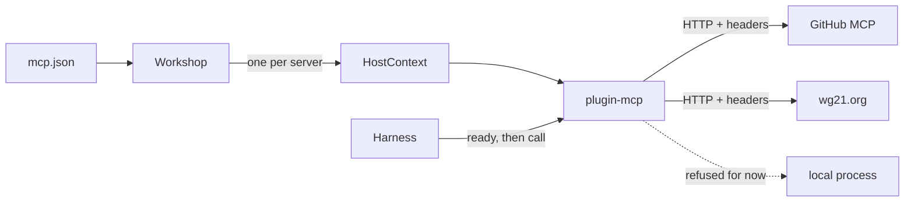

# MCP client Plugin

<product-contract>

## Product Requirements

PromptForge prompts can't reach MCP servers today. This work adds one Plugin crate that acts as an MCP client, installed once per server. Workshop installs the servers listed in an `mcp.json` file its config names, such as the operator's Cursor file, so their tools reach Workshop chat and any prompt. This change reaches remote servers over Streamable HTTP. Local servers, which a later change adds, are recognized now and installed as unavailable with a reason. Each run waits for servers that are still starting. The public API change is held to the short budget in the Technical Design.

- Problem and users:
  - The operator has MCP servers configured for Cursor in `%USERPROFILE%\.cursor\mcp.json` (read 2026-10-08 for names, launchers, URLs, and `env` and header keys; no secret values were read) and wants Workshop to connect to the same ones. None uses OAuth. There are four, two remote and two local:
    - `github`, remote: GitHub's hosted MCP server at `https://api.githubcopilot.com/mcp/`, with an `Authorization: Bearer <PAT>` header and an `X-MCP-Tools` header naming 21 tools. On 2026-10-08 the operator switched this entry from the local `npx` server `@modelcontextprotocol/server-github`, kept the same classic PAT that was in its `env`, and backed the file up beside itself as `mcp.json.bak-2026-10-08`.
    - `wg21-papers`, remote: `https://wg21.org/mailing/mcp`, with an `Authorization` header.
    - `pinecone-search`, local: `npx` running `@will-cppa/pinecone-read-only-mcp@0.4.0`, with `env` keys `PINECONE_PUBLIC_API_KEY`, `PINECONE_PRIVATE_API_KEY`, and `PINECONE_SOURCES`.
    - `wg21-wiki`, local: `uvx` with `--from git+https://github.com/cppalliance/wg21-wiki-mcp.git@v0.2.0 wg21-wiki-mcp`, with `env` keys `WIKI_USER_USERNAME` and `WIKI_USER_PASSWORD`.
  - So this change reaches `github` and `wg21-papers`, and it installs `pinecone-search` and `wg21-wiki` as unavailable until local servers arrive. The facts about GitHub's hosted server are under Assumptions, risks, and notes.
  - Prompt authors want MCP tools as ordinary tools: bound in `tools:` frontmatter, required through `plugins:`, or picked from `tools.offered()`.
- Goals:
  - A new crate `crates/plugin-mcp`, the MCP client Plugin. The Host installs it once per server under the server's name, so tools are named like `wg21-papers/<tool>`.
  - Workshop installs every server in the `mcp.json` file that `[agents] mcp` in `workshop.toml` names. Without that setting, Workshop starts no MCP server.
  - One transport in this change: Streamable HTTP with static headers. An entry with `command` is recognized as a local server and refused at `construct` with `local MCP servers (command) are not supported yet`, so Workshop installs it as unavailable. A later change adds local servers, and nothing in this one forecloses it.
  - Each run waits until installed servers are ready or have failed, so the first chat after startup sees their tools.
  - The Host's tokio runtime service is named by the Plugin contract rather than by `plugin-web`, so no Plugin owns a service every tokio-based Plugin reads.
  - The reserved Lua `mcp` request, which nothing produces and which the Plugin route makes dead, is removed.
- Non-goals:
  - No change to the `web` or `user-input` Plugins' behavior.
  - No change to persisted run-log or event formats, and no change to `crates/promptforge/public-api.txt`.
  - Local (stdio) servers, OAuth, server restarts, MCP features other than tools, structured tool output, tool-list change notifications, a server status UI, and mid-run tool refresh wait for later work (see Deferred and Out of Scope).
- Success criteria:
  - With `[agents] mcp` pointing at the operator's `mcp.json`, Workshop installs every server in it. Both remote servers, `github` and `wg21-papers`, have their tools offered in chat, and one call to each returns a result.
  - Both local servers, `pinecone-search` and `wg21-wiki`, are installed as unavailable with the not-supported reason, and a prompt that declares one is refused with that reason.
  - The API surface check, the dependency checks, and every exit criterion in the Testing Plan pass.
- Constraints:
  - Work happens in the linked worktree `c:\Users\Vinnie\cursor\promptforge2`, on its current branch `vibe2`, and no branch is created. On 2026-10-08 `vibe2` was at `3f4de6a15` with a clean worktree: `upstream/master` (`4471d3812`) plus the four speech-to-text commits `58fc9d97c` through `3f4de6a15` from local `master`. The main checkout `c:\Users\Vinnie\cursor\promptforge` is where the operator's speech-to-text work happens. Nothing in this work runs git there or touches any file under `crates/gateway/stt/`.
  - Plugin crates may depend only on `promptforge-plugin`, `shared-*` crates, `workspace-hack`, and outside libraries (`crates/build-xtask/src/product.rs`; stated in the `## Invariants` of `crates/plugin-web/src/lib.rs`). So `plugin-mcp` cannot name `plugin-web`.
  - `plugin-mcp` references no repository crate except `promptforge-plugin` and the structural crates every member depends on. The operator: "I do not want this crate to reference anything in the repo outside the plugin api crate, if possible", then: "structural crate dependencies like xhack or build ceiling, those are ok." What that means in practice:
    - A Plugin crate whose only product dependency is `promptforge-plugin` passes the boundary rules (`crates/build-xtask/src/product.rs` lines 274-294).
    - `plugin-mcp` depends on `workspace-hack` like the other Plugin crates (`crates/plugin-web/Cargo.toml`). The root `Cargo.toml` (line 74) describes it as a convention every member inherits.
    - The structural checks require `[lints] workspace = true` and a package-root `build.rs` that calls `build_ceiling::check()` (`crates/build-xtask/src/tidy.rs` lines 179-274, `crates/build-xtask/src/tidy-wiring.rs` lines 22-97). A `build-ceiling` build-dependency breaks the Plugin boundary, so Plugin crates include `crates/build-ceiling/src/lib.rs` by path from their build script (`crates/plugin-web/build.rs`, `crates/plugin-user-input/build.rs`). That is a build-time reference to a repository file; nothing from it links into the Plugin.
    - Today the Host's runtime handle is offered under the `promptforge/tokio-runtime` literal, defined only as `plugin-web`'s public `TOKIO_RUNTIME` key (`crates/plugin-web/src/web.rs` lines 37-41, named in the `PACKAGE` docs from line 24, and re-exported at `crates/plugin-web/src/lib.rs` line 85). `promptforge-plugin` defines no runtime service, and as an Engine crate it cannot depend on `tokio` (`crates/promptforge-plugin/src/lib.rs` lines 20-26). This work moves the service's name into the contract.
  - `promptforge-plugin` is bound by the Engine manifest guard: no async runtime, no `async-trait`, no HTTP client (`crates/promptforge-plugin/src/lib.rs`).
  - `harness-runner` has no `tokio` in its normal dependencies but has `futures-util` (`crates/harness-internal/runner/Cargo.toml`).
  - JSON that reaches a recorder must round-trip exactly with sorted keys, and the root `Cargo.toml` enables `serde_json`'s `float_roundtrip`. A dependency that turns on `serde_json`'s `preserve_order` or `arbitrary_precision` would break that for the whole workspace.
  - The workspace links one rustls crypto backend, `aws-lc-rs`, and keeps `ring` out (the comment on `reqwest` in the root `Cargo.toml`).
- Open questions: None

## Functional Specification

The operator names an `mcp.json` file in `workshop.toml`, and Workshop installs each server in it at startup. Each remote server's Plugin connects in the background and becomes ready or failed, and each local server's Plugin is refused as not supported yet. A run waits for the remote ones, then sees the ready servers' tools. Calls go to the server and come back as untrusted text, and a dropped call tells the server to drop the request.

- Actors and workflows:
  - Operator: adds `[agents] mcp = "<path to mcp.json>"` to the `workshop.toml` Workshop loads, for example `mcp = "${USERPROFILE}/.cursor/mcp.json"`, since `workshop.toml` interpolates `${VAR}` in string values (`crates/workshop/support/src/config.rs`). That interpolation expands an unset variable to an empty string rather than failing (lines 234-236 and 266-268), so a mistyped variable names a file that doesn't exist, and Workshop then starts no MCP server. The desktop app looks for `workshop.toml` beside its executable, then in the current directory, then in `~/.promptforge` (`crates/workshop/desktop/src/config.rs` lines 24-33). The operator had none on 2026-10-08. A new file must also hold a `[gateway]` table with `base_url` and `api_key`, both of which may be empty.
  - Workshop (the Host): in `AgentSessions::new`, it reads the named file once. It installs `web`, then `user-input`, then each MCP server sorted by name, passing each server's entry verbatim as that Plugin's configuration (`with_plugins` in `crates/workshop/server/src/agents.rs`).
  - `plugin-mcp`: `construct` validates the entry. A local entry is refused there. A remote entry gets one background connection task on the Host's runtime, which opens the Streamable HTTP transport, runs the MCP handshake, and lists tools across all pages.
  - Harness: before each run's snapshot, it waits on every installed Plugin that built, racing the waits against the run's cancel.
  - Stop and close in Workshop chat: the chat's Stop sends a `{"type":"cancel"}` frame that the server turns into `stop_round()` (`crates/workshop/server/src/agents/socket.rs` lines 278-283), not a run cancel. A stop reaches only effects in flight, and the effect loop lowers it at the run's first step with nothing to drop (`crates/harness-internal/runner/src/effect_loop.rs` lines 236-245), so a Stop during the readiness wait does nothing. Closing the chat (`Conversation::close`, `crates/workshop/agents/src/conversation.rs` lines 237-245) fires the run's cancel, which ends the wait. Workshop spawns each run (`AgentSessions::launch`, `crates/workshop/server/src/agents.rs` lines 225-232), so the wait never holds up the UI, and the run's `RunControl` is held before `harness.run` starts (`crates/workshop/agents/src/conversation-run.rs` lines 60-68), so a close during the wait reaches the run.
  - Prompts: chat's `tools.add(tools.offered())` (`crates/workshop/agents/agents/chat.md`) offers every undeclared server's tools to the model. Other prompts bind a tool in `tools:` or declare a server in `plugins:`.
  - A call to a `wg21-papers/<tool>` tool from the model or a script reaches the Plugin, which sends `tools/call` with the original MCP tool name.
- Inputs and outputs:
  - The file has the shape `{ "mcpServers": { "<name>": <entry> } }`; other top-level keys are ignored. A missing file means no servers. An unreadable or malformed file is logged as a warning, and Workshop starts with no MCP servers.
  - Entry format, owned entirely by `plugin-mcp`. A remote entry has `url` and optional `headers`. A local entry has `command`, optional `args`, `env`, and `cwd`. The format recognizes the local shape so the later local-server change only replaces its refusal, and this change refuses it at `construct` with `local MCP servers (command) are not supported yet`. That reason may name the entry's shape but never an `env` value. `type` is ignored, except that `"sse"` is refused, naming the legacy transport. Unknown fields are ignored, because the format is defined outside this repository.
  - Headers: `headers` may not set `accept`, `Mcp-Session-Id`, or `Last-Event-Id`, in any letter case, because rmcp owns them. `construct` refuses such an entry naming the key, since rmcp would refuse it only on the first request.
  - Variables: `plugin-mcp` resolves `${env:NAME}` and `${userHome}` in an entry's string values. An unset `${env:NAME}` is refused, naming `NAME`. Any other `${...}` form is passed through verbatim, as Cursor does: the `pinecone-search` entry's `env.PINECONE_SOURCES` holds `${PINECONE_PUBLIC_API_KEY}` and `${PINECONE_PRIVATE_API_KEY}`, which that server expands itself from its sibling `env` keys. A local entry is refused before its variables are resolved, so its reason is always the not-supported one.
  - Names: a Plugin name is the server name lowercased in ASCII, and it must then parse as a Plugin name, whose segments allow `a-z`, `0-9`, `-`, `_`, and `.` with no length limit (`crates/promptforge-internal/types/src/names.rs` lines 87-108), or the server is skipped with a warning naming the rule. Tool names follow the same rule. A tool that fails it, or that collides with another after lowercasing, is dropped with a warning. A model-facing name is the tool id with each `/` and `.` replaced by `_` (`crates/promptforge-internal/engine/src/execute/context-bound.rs` lines 38-64), and the Engine checks it only for the characters `[A-Za-z0-9_.-]` (`crates/promptforge-internal/model-client/src/detail.rs` lines 65-84), never for length. `plugin-mcp` adds no length rule either; the provider cap on name length is a noted risk (see Assumptions, risks, and notes).
  - Descriptors: the description is the MCP tool's `description`, else its `title`, else its name. The parameters schema is its `inputSchema`. No descriptor is marked structured, and none survives a stop.
  - Outputs: text blocks are joined with blank lines, and embedded text resources are included. Images, audio, and binary resources become placeholders such as `[image omitted: image/png]`, and resource links become `[resource: <uri>]`. A content kind this change doesn't know becomes `[unsupported content omitted]`. When a result has no content blocks but has `structuredContent`, that JSON is the text.
- States and validation:
  - Each server moves from starting to ready or failed, and it never returns to starting. This change has no transition from ready to failed. The state machine and its `watch` channel allow one, which the later local-server change uses when a process ends.
  - The tool list is read once, when the server becomes ready, and stays fixed after that.
  - An invalid entry fails `construct`, and so does a local entry, so the Plugin is installed as unavailable with that reason and a warning is logged (`crates/harness-internal/runner/src/host.rs` lines 98-111).
  - A server name that fails the name rule, or one already taken (`web`, `user-input`, or a twin differing only by `-`, `_`, `.`), is refused at install. The twin rule applies only at install (`crates/harness-internal/runner/src/host.rs` lines 87-97, with `normalize` at lines 196-203), so tool names never meet it. The refusal is logged and the other servers continue.
- Errors and recovery:
  - Startup can fail: an HTTP error, a handshake error, or the 2-minute startup deadline. The server is then failed with a reason. A prompt that declares the server or names it in a slot is refused with that reason; otherwise the server is just absent from the run's offering.
  - A local server is refused at `construct` the same way: a prompt that declares it is refused with `local MCP servers (command) are not supported yet`, and chat simply doesn't see it.
  - A Stop during the readiness wait does nothing, and the run goes on once the wait ends. Closing the chat cancels the run, which ends the wait. Plugins that have not resolved are then snapshotted as they stand, so a still-starting Plugin has no tools. A refusal that follows, such as a slot naming one of its tools, ends the run as cancelled, the outcome a cancel already gives, rather than as refused. A run with no refusal ends through the effect loop's existing cancel path. No new error, variant, or outcome exists for this.
  - An `isError` result becomes a `ToolError` of kind `Backend` whose message is the server's text. A transport failure, a lost connection, or a call that passes the 5-minute call deadline becomes kind `Transport`.
  - A remote server that fails after becoming ready keeps its tools listed, and its calls fail as `Transport` errors. rmcp re-initializes an expired HTTP session on its own (see Assumptions, risks, and notes).
  - A failed server is not restarted until Workshop restarts.
  - A stop or cancel drops the call, and the server receives `notifications/cancelled` for that request.
- Security and privacy behavior:
  - Server output can contain attacker-influenced data, so every output is `ToolOutput::untrusted`, which is nonce-wrapped before it reaches a model (`crates/promptforge-internal/types/src/tools/output.rs`).
  - No reason, log line, `Debug` output, or `ToolError` names an `env` or `headers` value; they may name keys.
  - Workshop installs nothing unless `[agents] mcp` is set, because chat offers every installed server's tools to its model. Server URLs and headers come only from the file the operator named.
  - This change starts no process: a local entry is refused before anything runs.
  - HTTP uses rmcp's default `reqwest` client, with rustls on `aws-lc-rs` and the OS trust store. That client refuses redirects, which keeps the configured headers off redirect targets, and GitHub's hosted server sends none. The model never supplies a URL to this Plugin.
- Acceptance criteria:
  - The tools of both remote servers, `github` and `wg21-papers`, are offered in Workshop chat, and one call to each returns a result.
  - Both local servers, `pinecone-search` and `wg21-wiki`, are installed as unavailable with the not-supported reason, and a prompt that declares one is refused with it.
  - A chat launched while servers are starting gets their tools once they are ready.
  - A broken entry leaves the other servers working, and a prompt that declares the broken server is refused with its reason.
  - Stopping a chat mid-call cancels the call.
  - Without `[agents] mcp`, Workshop reads no `mcp.json` and starts no MCP server.

</product-contract>
<implementation-contract>

## Technical Design

One defaulted method joins the Plugin contract, and the Harness awaits it before each run's snapshot. The contract also takes over the name of the Host's tokio runtime service from `plugin-web`. A new Plugin crate wraps the official Rust MCP SDK's Streamable HTTP client and exports only its package label. Workshop reads the named `mcp.json` and installs that crate once per server. The public API budget and the dependency budget below are complete lists: anything outside them is out of plan.

- Architecture:



- Modules and interfaces:
  - The contract gains one defaulted method in `crates/promptforge-plugin/src/plugin.rs`:

```rust
fn ready(&self) -> PluginFuture<'_, Result<(), ToolError>> {
    Box::pin(async { Ok(()) })
}
```

  - The rules for `ready`, stated in its docs and in the crate's `## Invariants`:
    - It resolves `Ok` once `tools()` is complete, or `Err` with a reason a model can read when it never will be.
    - It resolves within a bound the Plugin owns. The Plugin's own task enforces that bound, because `ready` may be polled outside any particular runtime and so uses no runtime timer.
    - It is cancellation-safe, and after its first resolution it answers at once unless the Plugin's state has changed.
  - Harness readiness pass, all crate-private:
    - `HostContext` gains an async pass that polls the `ready` futures of every Plugin whose `construct` succeeded, concurrently (`futures_util::future::join_all`). It races them against the run's `CancelHandle::cancelled()` (`crates/promptforge-internal/types/src/cancel.rs` line 221) and returns the `Err` reasons by Plugin name.
    - `prepare` (`crates/harness-internal/runner/src/prepare.rs`) awaits the pass right before it calls `host.begin_run`. `begin_run` takes the failures, and `HostRunContext::snapshot` (`crates/harness-internal/runner/src/host-run.rs`) marks each as `RunPlugin::Unavailable(reason)` for that run, so the existing refusal path reports it.
    - A refusal whose run cancel has fired ends as the existing `RunOutcome::Cancelled`. A refusal becomes an outcome in two places that must agree: `prepare` ends the refused run at the recorder with `failed_outcome(&error)` before it returns `PrepareError::Refused` (`prepare.rs` lines 292-297), and `Harness::run_to_end` builds the report from `PrepareError::ended`, which derives `failed_outcome(&error)` again (`crates/harness-internal/runner/src/harness.rs` lines 231-242, `prepare.rs` lines 170-181). The report's docs promise that the recorder holds the report's outcome whenever `run_id` is `Some` (`harness.rs` lines 89-90). So `prepare` records `Cancelled` in place of `failed_outcome(&error)` when the cancel has fired, and `run_to_end` reports `Cancelled` for a `PrepareError::Refused` when it has. This is the outcome the pre-prepare cancel path already returns (`harness.rs` lines 206-212).
    - The Harness adds no timeout of its own, no `PrepareError` variant or field, no outcome, and no event.
  - Runtime service name: `promptforge-plugin` exports `pub const TOKIO_RUNTIME: &str = "promptforge/tokio-runtime"`, documented as the Host-wide service that supplies the Host's runtime as a `tokio::runtime::Handle`. A Plugin that runs on tokio, and the Host that provides the service, each build `ServiceKey::<Handle>::new(promptforge_plugin::TOKIO_RUNTIME)`. `ServiceKey::new` allows that because it is a `const fn` taking the literal (`crates/promptforge-plugin/src/service.rs`). The contract names no tokio type, so the handle type is documented rather than checked there; a provider of another type reads as missing, because `HostServices::get` returns `None` on a type mismatch. The literal is unchanged, so behavior is unchanged.
  - `plugin-mcp` lifecycle (the constraints a reader of the crate can't infer from its interface):
    - `PACKAGE = Package::new("promptforge/mcp", construct)`, with no prelude and no needs.
    - `construct` does only synchronous work: it validates the entry, refuses a local entry with `local MCP servers (command) are not supported yet`, resolves variables, refuses a reserved header naming its key, and reads the runtime through a crate-private key built from the contract's name, failing with a reason that names the service when it is missing. It then spawns one connection task on that runtime and returns. Everything that touches the network runs in that task.
    - The connection task builds the transport: `StreamableHttpClientTransport::from_config(StreamableHttpClientTransportConfig::with_uri(url).custom_headers(headers))`, with header names and values as `reqwest::header` types. It never uses a caller-built client, and never `auth_header`, which takes a bare token and adds `Bearer` itself, so an `Authorization` value taken from the file would be doubled.
    - The task then runs the client handshake (`serve`) with a `ClientConfig` as its handler, whose `Implementation` names PromptForge, and then `list_all_tools()`, all under the 2-minute startup deadline. The `ClientConfig` declares no client capabilities beyond rmcp's defaults, which are none: it is built from `ClientCapabilities::default()`, and no capability or extension is added. An optional extension such as `io.modelcontextprotocol/ui` would make GitHub's server switch its write tools to interactive forms that this Plugin can't show. rmcp sets no handshake timeout of its own, and `list_all_tools` has no guard against a server that repeats a cursor, so this deadline bounds both. rmcp sets no call timeout either, which the call deadline below covers. The task publishes ready or failed through a tokio `watch` channel. A remote server stays ready, and its later failures surface as `Transport` errors on calls, as the Functional Specification states.
    - The ready state holds a `Peer<RoleClient>` clone, which `call` sends through, and the tool list. After publishing ready, the connection task awaits the running service's `waiting()`, so the service lives until its transport ends or the task is aborted, and that end changes no state.
    - `ready` waits on the `watch` channel until the state is no longer starting. `tools` borrows the current state and returns nothing unless the server is ready.
    - `call` follows `plugin-web`'s fetch pattern (the `AbortOnDrop` guard in `crates/plugin-web/src/fetch.rs` lines 248-255, spawned and then awaited at lines 370-374). It spawns the request onto the Host's runtime and awaits it, aborting on drop. The request is `ClientRequest::CallToolRequest(CallToolRequest::new(CallToolRequestParams::new(name).with_arguments(map)))`, sent through `send_cancellable_request` with `PeerRequestOptions::with_timeout` set to the 5-minute call deadline.
    - Cancel on drop: rmcp sends `notifications/cancelled` itself on a timeout, but dropping a `RequestHandle` or its response future sends nothing. So before the spawned task awaits the response, it takes a small guard holding a `Peer<RoleClient>` clone and the `RequestId`, read from the `RequestHandle`'s public `peer` and `id` fields, plus the runtime `Handle`. When the task is aborted, its future is dropped on the Host's runtime, and the guard's `Drop` spawns `peer.notify_cancelled(CancelledNotificationParam::new(Some(id), None))` onto that runtime. A call that completes or times out disarms the guard first.
    - Dropping the Plugin aborts the connection task, which drops the running service; rmcp's worker then ends the HTTP session.
  - Later local servers, which this change must not foreclose:
    - `entry.rs` already parses the local shape (`command`, `args`, `env`, `cwd`), so the later change replaces only the refusal.
    - `connect.rs` holds the one transport arm and is the single place a second arm goes, because rmcp's `serve` accepts any transport.
    - The server state machine (starting, then ready or failed) and its `watch` channel already allow a later transition from ready to failed, for a process that ends.
    - Workshop installs every entry whatever its transport, so the later change touches only `plugin-mcp` and the dependency budget.
    - No stdio code is written in this change.
  - Workshop: `AgentsConfig` gains `mcp: Option<PathBuf>`. `AgentSessions::new` passes it to `host_context`, which reads the file through a private function and hands the entries to `with_plugins`. The documented promise of `AgentSessions::new` that nothing is spawned and nothing touches the filesystem (`crates/workshop/server/src/agents.rs` lines 166-169) is amended to name the one file read and the connections it starts.
- File and public API changes:
  - Public API budget, the complete list:
    - `promptforge-plugin`: `Plugin::ready` (defaulted) and `pub const TOKIO_RUNTIME: &str`, re-exported from the crate root.
    - `plugin-web`: removes its public `TOKIO_RUNTIME` key and adds nothing.
    - `plugin-mcp`: `pub const PACKAGE: Package` and nothing else. Every other item is private or `pub(crate)`.
    - `workshop-support`: `pub mcp: Option<PathBuf>` on `AgentsConfig`.
    - Nothing is added to `promptforge`, `harness`, `harness-runner`, `workshop-server`, or `workshop-server-api`, and `crates/promptforge/public-api.txt` stays unchanged.
    - No new Cargo feature, service key, event, run-log record, persisted key, or public error type. The runtime name moves; it is not a new service.
  - Dependency budget, the complete list:
    - The root `[workspace.dependencies]` gains only `rmcp` (version 3.5.1, `default-features = false`, with a pin comment) and `plugin-mcp`.
    - `plugin-mcp` normal dependencies: `promptforge-plugin` and `workspace-hack`. `rmcp` with exactly the features `client`, `transport-streamable-http-client-reqwest`, and `reqwest`. `reqwest` from the workspace, for header types, because the workspace has no `http` crate. `tokio`, `serde`, `serde_json`, and `tracing` from the workspace; the root `tokio` (version 1 with `macros`, `rt-multi-thread`, `net`, `time`, and `sync`) covers what `plugin-mcp` needs. No `thiserror`, and no error enum: failures are `ToolError` messages.
    - `plugin-mcp` dev-dependencies: `promptforge-plugin` with `test-support`, `tokio` with `macros` and `rt-multi-thread`, and the workspace's `axum` 0.8 for the HTTP fixture. No rmcp features are enabled in `[dev-dependencies]`, so rmcp builds with one feature set everywhere.
    - `workshop-server` gains `plugin-mcp` and `promptforge-plugin`. Crates outside the promptforge family may name `promptforge-plugin` (`crates/build-xtask/src/product.rs` lines 144 and 250-253), so the `harness` facade needs no re-export.
    - The rmcp 3.5.1 facts behind the feature list come from its manifest at tag `rmcp-v3.5.1` (https://raw.githubusercontent.com/modelcontextprotocol/rust-sdk/rmcp-v3.5.1/crates/rmcp/Cargo.toml). It was published 2026-10-05, with `rust-version` 1.88 and edition 2024. Its defaults are `base64`, `macros`, and `server`. It depends on `reqwest` `^0.13.2` with default features off, which the workspace lock's 0.13.4 satisfies. `transport-streamable-http-client-reqwest` enables `reqwest` with no TLS, and the `reqwest` feature adds `reqwest`'s `rustls`, which in reqwest 0.13 is `aws-lc-rs` plus `rustls-platform-verifier` (the OS trust store), with no `ring`. The three features enable no `schemars`, `macros`, `server`, or `auth`.
    - `cargo deny` uses `multiple-versions = warn` and already bans `serde_json`'s `preserve_order`, so a second copy of a crate warns rather than fails.
  - Files:
    - `promptforge-plugin`: `src/plugin.rs`, `src/service.rs`, `src/lib.rs`, `src/service-tests.rs`.
    - `plugin-web`: `src/web.rs` (lines 24-41 and 66-71), `src/lib.rs` (lines 16-22 and 85), and `src/web-tests.rs` (lines 13, 41, 99, and 169). The crate docs link to the contract's name instead of the removed key, because the root `Cargo.toml` denies broken intra-doc links.
    - `harness-runner`: `src/host.rs`, `src/host-run.rs`, `src/prepare.rs`, `src/harness.rs`, `src/host-tests.rs`, and `tests/it/`.
    - `plugin-mcp` (new): `Cargo.toml`, `build.rs`, `src/lib.rs` (docs, `## Invariants`, `PACKAGE`, `construct`), `src/entry.rs` (the entry, its variables, the local-shape refusal, and the reserved headers), `src/connect.rs` (the HTTP transport, handshake, listing, startup deadline), `src/server.rs` (state, `ready`, `tools`, `call`, the cancel guard, the tool-name rule), and `src/result.rs` (result to output or error). Each module with unit tests has a `-tests.rs` sibling, and `tests/it/` holds `main.rs` and the fixture. The crate's manifest sets `[lints] workspace = true`, and its `build.rs` includes `crates/build-ceiling/src/lib.rs` by path and calls `build_ceiling::check()`, as `crates/plugin-web` does.
    - `workshop-support`: `src/config.rs` and `tests/it/config.rs`.
    - `workshop-server`: `Cargo.toml`, `src/agents.rs` (plus a private `src/agents/mcp.rs` only if `agents.rs` would pass 500 lines), `src/agents/tests.rs` (lines 16, 87, 101-103, 120, and 133), `tests/it/agents.rs` line 108, and `tests/it/chat_gate.rs` line 130. The last two are the only `AgentsConfig` struct literals.
    - `build-xtask`: `src/product.rs` and its tests, only if the boundary check refuses a new edge; `src/site.rs` gains `plugin-mcp` in its crate list.
    - Workshop UI tests: `crates/workshop/ui/test/docs-claims.mjs`, whose `PLUGIN_DOC_DIRS` gains `crates/plugin-mcp`.
    - Lua request removal: `crates/promptforge-internal/lua/src/protocol/request.rs` (`Request::Mcp`, `Request::mcp_reserved`), `crates/promptforge-internal/lua/src/protocol/parse.rs` (the `"mcp"` arm and `parse_mcp`), `crates/promptforge-internal/engine/src/execute/scheduler/dispatch.rs` (lines 8, 100, 123, and 209), and `crates/promptforge-internal/lua/src/protocol/tests/parse.rs` (line 2 and the two tests at lines 348-369). `Request::Mcp` does not appear in `crates/promptforge/public-api.txt`.
- Data, persistence, failure, security, and privacy constraints:
  - No persisted format changes. An MCP `inputSchema` enters a descriptor as `serde_json::Value`, and its keys stay sorted because `serde_json`'s map is ordered by key while `preserve_order` is off.
  - The 2-minute startup deadline and the 5-minute call deadline are fixed constants. The startup deadline is a parameter of the crate-private connect function, so a unit test can drive it with a short value. The public path always passes the constant.
  - Every output is untrusted, and entry values never appear in reasons or logs, as the Functional Specification states.
  - Change rules every step follows:
    - Work only in `c:\Users\Vinnie\cursor\promptforge2`. Run no git command in `c:\Users\Vinnie\cursor\promptforge`, and touch nothing under `crates/gateway/stt/`.
    - Stay inside the public API budget and the dependency budget above. A change that needs anything outside them stops and reports what it needs and why.
    - Non-test code writes no protocol mechanics: no JSON-RPC framing, event-stream parsing, session headers, or tool-list paging. rmcp provides them, and a missing rmcp hook stops the change.
    - Tests reach no network beyond loopback, spawn no real MCP server, and never call `std::env::set_var`. `plugin-mcp`'s integration tests use only `PACKAGE`, `testing::TestCall`, and the hand-written fixture.
    - Docs and comments use Engine, Harness, Host, and Plugin only in their defined senses. Comments state only constraints the code can't show. Doc examples use `text` fences. Lint suppressions use `#[expect(lint, reason = "...")]`.
    - Every reason and error message names what is missing or unmet, with required versus actual where both exist.
    - Every `.rs` file stays within 500 lines. When a module would pass that, split it under the flat-directory rule: one or two sibling files as `parent-label.rs` beside the parent, three or more as a subdirectory.
    - In PowerShell, set `$env:CARGO_BUILD_WARNINGS = "deny"` before clippy and `$env:RUSTDOCFLAGS = "-D warnings"` before docs.

</implementation-contract>
<verification-contract>

## Testing Plan

Tests reach `plugin-mcp` only through its package label and a hand-written fixture server, so testing needs no extra API. The Harness wait, Workshop's file reading and install, and the protocol removal each get focused tests. Two checks enforce the budgets: a diff scan for new public items, and `cargo tree` scans for features and crypto backends. After the run, the operator's live check against the configured servers confirms the work.

- Unit:
  - `promptforge-plugin`: a key built from `TOKIO_RUNTIME` is accepted by `HostServices::provide`, and a provider supplied under it reads back through a second key built from the same name. The test uses a stand-in provider type, so the contract crate gains no `tokio` dependency (`crates/promptforge-plugin/src/service-tests.rs`).
  - `plugin-mcp` entry: remote and local shapes, with a local entry refused as `local MCP servers (command) are not supported yet` and no `env` value in that reason; both, neither, and wrong value types; `type: "sse"`; `${env:NAME}` and `${userHome}`; an unset `${env:NAME}` refused naming `NAME`; an unknown `${...}` form, such as `${PINECONE_PUBLIC_API_KEY}`, passed through unchanged; and `accept`, `Mcp-Session-Id`, and `Last-Event-Id` headers, in mixed letter case, each refused naming the key. The resolver takes the environment and home directory as parameters, and tests never call `std::env::set_var`, which edition 2024 makes `unsafe` while the workspace denies `unsafe_code`. No message or `Debug` output contains an `env` or `headers` value.
  - `plugin-mcp` names: lowercasing, a name that still fails, and two names that collide after lowercasing.
  - `plugin-mcp` results: every content kind, the `[unsupported content omitted]` placeholder when a test can construct a kind the catch-all arm meets, `isError`, the `structuredContent` fallback, untrusted marking on every path, and a timeout mapped to `Transport`.
  - `plugin-mcp` connect: the startup deadline, driven with a short value against a fixture that never answers.
  - Workshop's `mcp.json` reader: no setting, a missing file, an unreadable or malformed file, and a valid file read back sorted by name.
  - Workshop's `with_plugins`: one install per entry, lowercased names, and skipped invalid and taken names. Tests use entries that `construct` refuses, such as local entries, or run outside a runtime, so no Workshop test opens a connection.
  - `workshop-support`: `[agents] mcp` parses to `Some(path)`, and an absent key gives `None`.
- Integration and end-to-end:
  - `crates/harness-internal/runner/tests/it/`: a Plugin with a slow `ready` gets its tools into the run; a failed declared Plugin refuses the run naming its reason; a failed undeclared Plugin leaves the run going without its tools; a cancel during the wait, while a declared Plugin whose tool fills a slot is still starting, ends the run as cancelled in both the report and the recorder; a Plugin that doesn't override `ready` behaves as before.
  - `crates/plugin-mcp/tests/it/`, through `PACKAGE` and `testing::TestCall` only, against a hand-written axum Streamable HTTP fixture. The fixture:
    - answers JSON-RPC requests in JSON;
    - answers `initialize` naming protocol version `2025-11-25`, the newest that keeps the handshake and session, so the tests cover the session path;
    - answers notifications (`notifications/initialized` and `notifications/cancelled`) with `202 Accepted` and no body, because rmcp requires accepted-or-JSON for `initialized` at startup;
    - answers `-32601` only to requests it doesn't implement;
    - issues a session id;
    - answers `405` to `GET`, as GitHub's hosted server does by design, which makes rmcp skip the event stream quietly where other SDKs have hung;
    - accepts `DELETE` or answers it `405`, since rmcp sends `DELETE` when its worker exits and treats `405` as success;
    - records the `initialize` request, the headers, and the notifications it receives.
  - The `plugin-mcp` integration tests cover:
    - The `initialize` request names PromptForge in `clientInfo` and carries empty `capabilities`.
    - `ready` resolves, and a tool list spread over two pages comes back complete.
    - The configured headers arrive on every request.
    - A call returns untrusted text, and an `isError` result becomes a `Backend` error.
    - A dropped call makes the fixture receive `notifications/cancelled` with that call's request id.
    - A local entry makes `construct` fail with `local MCP servers (command) are not supported yet`.
    - A missing runtime service makes `construct` fail naming `promptforge/tokio-runtime`.
  - The Lua protocol's existing `an_unknown_op_is_rejected` (`crates/promptforge-internal/lua/src/protocol/tests/parse.rs` line 390) covers a request of kind `mcp` after the removal, so the two reserved-request tests are deleted and none is added.
  - Live check, run by the operator after the run ends, because it drives the desktop app by hand. A failure is fixed in a follow-up change.
    1. Quit every running Workshop, because the desktop app is single-instance.
    2. Build the desktop app in the worktree with `cargo build --locked -p workshop`.
    3. Beside the built executable, write a `workshop.toml` with a `[gateway]` table (`base_url = ""`, `api_key = ""`) and an `[agents]` table holding `mcp = "${USERPROFILE}/.cursor/mcp.json"`. An unset variable expands to an empty string, so check that `USERPROFILE` is set in the shell that launches Workshop.
    4. Make sure the gateway is running, and launch the built Workshop.
    5. Open a chat at once. Once the servers are ready, confirm the chat offers the tools of both remote servers, `github` and `wg21-papers`, and make one call to each that returns a result. `github` may list fewer than 21 tools, because the server filters the `X-MCP-Tools` list by the classic PAT's scopes. Either server may reply with an event stream instead of JSON, and this check is the only coverage of that path.
    6. Confirm that Workshop's log shows `pinecone-search` and `wg21-wiki` installed as unavailable with `local MCP servers (command) are not supported yet`, and that a prompt declaring one of them in `plugins:` is refused with that reason.
    7. Start a slow call and stop the chat mid-call. The call must end.
    8. Restart Workshop. While the servers are still starting, open a chat and press Stop: nothing happens, and the chat goes on once they are ready. Then open another chat while they are starting and close it: its run ends as cancelled, not refused. The window is short for HTTP servers, so a miss here is retried rather than failed.
    9. Exit Workshop, and remove the live-check `workshop.toml`.
- Regression, security, and performance:
  - `cargo tree -e features -i ring` finds nothing for `workshop` or `gateway`.
  - `cargo tree -e features -i serde_json` shows neither `preserve_order` nor `arbitrary_precision`.
  - `cargo tree -e features -i rmcp` shows none of `server`, `macros`, `schemars`, `auth`, `reqwest-native-tls`, or `transport-child-process`, and no other `native-tls` crate enters the tree.
  - `cargo tree -i process-wrap --workspace` finds nothing.
  - The existing `web` and `user-input` tests pass. `web`'s tests and Workshop's `agents` tests change only to build the runtime key from the contract's name. `web`'s missing-runtime error still names `promptforge/tokio-runtime`, and Workshop still leaves the runtime out when no runtime is current.
  - API surface check, against `3f4de6a15`, where the run starts: `git diff -U0 3f4de6a15...HEAD -- crates ':!*tests*' ':!crates/workspace-hack' | rg '^\+\s*pub (async |const |unsafe )?(const|fn|struct|enum|trait|type|use|mod|static) |^\+\s*pub [a-z_]+:'`. It may list only:
    - the `TOKIO_RUNTIME` constant and the crate-root `pub use` that re-exports it in `promptforge-plugin`;
    - the rewritten `pub use` in `crates/plugin-web/src/lib.rs`;
    - `PACKAGE` in `plugin-mcp`;
    - the `mcp` field of `AgentsConfig`.
    `Plugin::ready` has no `pub` keyword, so check it by reading the trait.
  - Size guide, soft: `plugin-mcp`'s non-test source stays near 450 lines. Past 650, look for hand-written code that rmcp already provides before going on.
- Exit criteria:
  - Before any Workshop clippy or test run in the worktree: `npm ci --prefix crates/workshop`, `npm ci --prefix crates/gateway/config-ui/ui`, `cargo build --locked -p gateway --no-default-features`, then `node tools/stage-gateway-sidecar.mjs stage --target x86_64-pc-windows-msvc --source target/debug/promptforge-gateway.exe` (the order in `.github/workflows/ci.yml`).
  - `cargo nextest run --locked --workspace --exclude workshop --exclude workshop-server --exclude workshop-server-api --all-features`, then `cargo nextest run --locked -p workshop -p workshop-server -p workshop-server-api`.
  - With `$env:CARGO_BUILD_WARNINGS = "deny"`: `cargo clippy --workspace --exclude workshop --exclude workshop-server --exclude workshop-server-api --all-targets --all-features`, `cargo clippy -p workshop -p workshop-server -p workshop-server-api --all-targets`, and `cargo check -p gateway --no-default-features`.
  - `cargo fmt --all --check`.
  - With `$env:RUSTDOCFLAGS = "-D warnings"`: `cargo doc --workspace --no-deps --all-features --exclude workshop --exclude workshop-server --exclude workshop-server-api`, `cargo doc -p promptforge --no-deps`, and `cargo doc -p harness --no-deps`.
  - `cargo +nightly-2026-09-05 xtask api --check`; the nightly pin lives in `crates/build-xtask/src/api/toolchain.rs`.
  - `cargo test -p build-xtask`, `cargo hakari verify`, and `cargo deny check`.
  - In `crates/workshop`: `npm run build --workspace ui`, then `npm test --workspaces --if-present` and `npm run typecheck --workspaces --if-present`.
  - The API surface check and the four `cargo tree` checks above.

</verification-contract>
<decision-record>

## Decision Record

- Decisions:
  - HTTP first: this change ships Streamable HTTP with static headers only, with no OAuth, and local (stdio) servers come in a later change. HTTP with static headers covers both configured remote servers, `github` and `wg21-papers`, and none needs OAuth. The operator first asked: "I want to access MCP servers over the internet? Is that HTTP? How do you connect to the MCP servers I have configured? I want to connect to those." On 2026-10-08, about local launchers such as `npx` and `uvx`, the operator said: "I don't understand. Why do we need a small program. That's a mess", then chose "HTTP first: ship HTTP now, add local servers in a later change", then said: "yeah lets stick with HTTP for now, and dont do anything that would foreclose the other thing later".
  - The `github` entry uses GitHub's hosted MCP server with a static PAT header and an `X-MCP-Tools` list of 21 read and write tools. On 2026-10-08 the operator switched it from the deprecated local `npx` server, so this change reaches GitHub without local servers, and chose: "Yes, with the 21-tool list (read and write)". The list keeps chat's offering to those 21 tools, where the default toolsets give about 45, including write tools such as `delete_repository`.
  - Local entries are recognized and refused, not ignored, so nothing forecloses the later change. The entry format still parses `command`, `args`, `env`, and `cwd`, and `construct` refuses a local entry with `local MCP servers (command) are not supported yet`. Workshop then installs it as unavailable (`crates/harness-internal/runner/src/host.rs` lines 98-111), a prompt that declares it learns why, and chat simply doesn't see it. The later change replaces only that refusal: `connect.rs` is the one place a second transport arm goes, because rmcp's `serve` accepts any transport; the server state machine (starting, then ready or failed) and its `watch` channel already allow a later transition from ready to failed; and Workshop installs every entry whatever its transport, so the later change touches only `plugin-mcp` and the dependency budget. No stdio code is written now. This choice came out of the plan review.
  - The variable rule resolves `${env:NAME}` and `${userHome}`, refuses an unset `${env:NAME}` naming `NAME`, and passes any other `${...}` form through verbatim. The `pinecone-search` entry's `env.PINECONE_SOURCES` holds `${PINECONE_PUBLIC_API_KEY}` and `${PINECONE_PRIVATE_API_KEY}`, placeholders the server expands from its sibling `env` keys. Cursor passes such forms through, and that server works in Cursor today, so refusing them would break it the day local servers arrive. This choice came out of the plan review.
  - Runs wait for readiness through a defaulted `Plugin::ready`, and a startup failure refuses a run that requires the server, naming the reason. The operator chose: "Wait for it: add a defaulted async Plugin::ready() to the contract, and the Harness awaits it for declared or slotted Plugins before taking the run's snapshot. A startup failure refuses the run with the server's reason."
  - The wait covers every installed Plugin, not only declared or slotted ones. Workshop chat is one long run whose offering is fixed when it starts (`crates/workshop/agents/agents/chat.md`), so a chat opened while a server is starting would otherwise never see that server. Asked which scope governs, the operator chose: "Every installed server. While servers start, each run waits up to the slowest one (2 minutes at most), and then chat always sees them."
  - One installed Plugin per server, named after the server, so prompts declare servers one at a time and every tool id begins with its server's name. The same shape is recorded in `vibe/2026-10-07-1-plugin-api-minimal.md` line 1021.
  - The client uses `rmcp`, the official Rust MCP SDK. It tracks protocol revisions, covers Streamable HTTP now and stdio for the later change, handles JSON and event-stream replies and sessions, and fits the workspace's `reqwest` 0.13 and `aws-lc-rs` pins. Non-test code writes no protocol mechanics that rmcp provides.
  - The contract owns the runtime service's name as a `&'static str`, and each tokio-based Plugin and the Host build their typed key from it. The runtime is a Host-wide service any Plugin may need, so no Plugin should own it. A name is the smallest form the contract can hold, because the contract cannot depend on `tokio`. The operator: "this is weird, the tokio runtime key should not be owned by web. what makes web special? nothing".
  - `plugin-mcp` runs on the Host's tokio runtime, read through that service, because it is a linked crate. The operator: "mcp plugin should use the host's tokio runtime as long as the plugin is a linked crate and not a DLL".
  - `plugin-mcp` has the same structural plumbing as the other Plugin crates: `workspace-hack`, the by-path `build-ceiling` include in its build script, and the workspace's lints. The operator: "structural crate dependencies like xhack or build ceiling, those are ok."
  - Workshop reads an `mcp.json` only when `[agents] mcp` names one; there is no default path. Chat offers every installed server's tools to its model, so a default would hand the model the operator's write-capable tools without any Workshop setting. A default would also make every test that builds a default config start real servers with real tokens. The operator's goal, "I want to connect to those", is met by one line in `workshop.toml`. This choice came out of the plan review.
  - The setting lives in `[agents]` rather than a new `[mcp]` table. The agent-sessions subsystem builds the `HostContext` every Workshop run uses (`crates/workshop/server/src/agents.rs`), and `AgentsConfig` appears as a struct literal at 2 sites, where `Config` appears at 12. This choice came out of the plan review.
  - `plugin-mcp` owns the whole entry format, variables included, so any Host passes entries verbatim. Workshop's own `${VAR}` interpolation for `workshop.toml` stays separate. This choice came out of the plan review.
  - The name rule is ASCII lowercasing only, with no character mapping, so a tool id never differs from its MCP name except in case. It adds no length rule, and neither the Plugin name rule nor the Engine has one. This choice came out of the plan review.
  - The first version returns text only and reads each tool list once. Each of these removes a code path that no configured server needs. This choice came out of the plan review.
  - Calls run as tasks on the Host's runtime and abort on drop, following `plugin-web`'s fetch pattern, and an aborted call sends `notifications/cancelled` for its request id through a guard in the task. In rmcp 3.5.1, dropping a `RequestHandle` or its response future sends nothing; only `RequestHandle::cancel`, which is async and consumes the handle, and rmcp's own timeout path send the notification. A dropped future can't await, so the guard spawns `Peer::notify_cancelled` onto the Host's runtime instead.
  - A cancel during the readiness wait adds no error type, variant, or outcome. A refusal whose run cancel has fired ends as the existing `Cancelled` outcome, because a close that cuts the wait short leaves a still-starting Plugin with zero tools, and a slot naming one of its tools would otherwise report that Plugin missing (`crates/promptforge-internal/engine/src/execute/fill.rs` lines 42-50) and end a cancelled run as refused. Both places that turn a refusal into an outcome, `prepare`'s recorder write and `Harness::run_to_end`'s report, apply the rule, so the report and the record agree, apart from the narrow window in the next decision. This choice came out of the plan review.
  - One gap is accepted: a close that lands during `prepare`'s own recorder write, for a refusal the wait didn't cause, makes the run report cancelled while its record says failed. It is accepted because it lasts one recorder write, and closing it needs a public field on `PrepareError::Refused` or moving the refusal's recorder write out of `prepare` (both under Rejected alternatives). This choice came out of the plan review.
  - A Stop during the readiness wait does nothing, and no Workshop change is planned for it. Workshop's Stop is a `stop_round`, which reaches only effects in flight, and closing the chat is the cancel that ends the wait. This choice came out of the plan review.
  - `plugin-mcp` is tested through its package label against a hand-written fixture, so the crate needs no test-only API, and rmcp's server features never enter `[dev-dependencies]`.
  - The reserved Lua `mcp` request is removed, because nothing produces it and MCP tools now arrive as ordinary Plugin tools.
  - The work uses a separate worktree, reusing `promptforge2`. On 2026-10-08 it was a linked worktree of this repository on branch `plugin-api` at `9ca613247`, with no uncommitted changes, and that commit is in `master`'s history (`master` at `4471d3812`). Its build output is already warm. The operator asked: "Are you going to use a separate worktree to not conflict with the stt fixes?", then chose: "Reuse promptforge2: it has no uncommitted changes, its plugin-api branch is already in master, and it already has a build, so nothing rebuilds from scratch. A new plugin-mcp branch is made from master there." The operator later rebased the worktree: "Switch the plan to @promptforge2/ which is upstream/master plus the 4 commits from local master." So the work runs on `promptforge2`'s current branch `vibe2` instead of a new `plugin-mcp` branch.
- Rejected alternatives:
  - Shipping stdio in this change: each local server needs a launcher program (`npx`, `uvx`), a job object or process group so the server dies with Workshop, and Windows `.cmd` shim handling, which the operator called "a mess". Revisit in the later local-server change (see Deferred).
  - Ignoring local entries silently: chat would look the same, but a prompt that declares one would report a missing Plugin with no reason. Revisit never.
  - Refusing every `${...}` form other than the two resolved ones: it would refuse the `pinecone-search` entry, which works in Cursor. Revisit never.
  - Mapping a cancelled refusal only in `Harness::run_to_end`: `prepare` has already ended the run at the recorder as failed by then, so the report would say cancelled while the record says failed. Revisit never.
  - Closing the record-versus-report window with a field on `PrepareError::Refused`: `PrepareError` is public in `harness-runner`, whose budget is zero, and an existing test matches `Refused` without `..` (`crates/harness-internal/runner/tests/it/prepare-host-services.rs` line 99). Revisit if the window shows up in practice.
  - Closing the same window by moving a refusal's recorder write out of `prepare` and into `run_to_end`: `prepare` is public and its own tests read a refused run's outcome from the recorder (`crates/harness-internal/runner/tests/it/prepare.rs` lines 189-206). Revisit if the window shows up in practice.
  - Refusing at once with a "still starting" reason through a defaulted `Plugin::status()`: a chat opened during startup would miss the servers or be refused. Revisit if waiting at run start proves too slow.
  - No contract change, so a server lists no tools until it is up: a run during startup would see the server as missing. Revisit if the Harness gains mid-run offering refresh.
  - Blocking in `construct` until the server is ready: `construct` is synchronous and runs at Workshop startup through `AgentSessions::new` (`crates/workshop/server/src/agents.rs`), so Workshop would start only as fast as its slowest server. Revisit if `construct` becomes async.
  - Waiting only on declared or slotted Plugins: chat would miss servers that finish starting after it opens. Revisit if startup waits slow fixed pipelines that never use MCP tools.
  - A Harness-side readiness timeout: it would put a policy in the Harness that belongs to each Plugin. Revisit if a Plugin's `ready` hangs in practice.
  - OAuth now: none of the configured servers uses it. Revisit when a configured server requires it.
  - A hand-written JSON-RPC client: fewer dependencies, but it would have to track protocol revisions and implement Streamable HTTP's event streams and sessions. Revisit if rmcp's dependency tree conflicts with the workspace's pins.
  - Defaulting to `~/.cursor/mcp.json`: the consent and test hazards above. Revisit if the operator wants Cursor's servers on without a setting.
  - A top-level `[mcp]` table: it touches 12 `Config` literals for a single path. Revisit when MCP gains settings beyond the file path.
  - Copying the servers into `workshop.toml`: it duplicates secrets and drifts from Cursor's file. Revisit if the operator wants servers in Workshop that Cursor doesn't have.
  - A general `[plugins]` table in `workshop.toml` that names and configures every Plugin: MCP doesn't need it yet. Revisit when `web` takes configuration or a Plugin needs a Host-chosen name.
  - Workshop resolving entry variables: it would split the entry format across two crates. Revisit if a Host needs variables only it can know, such as a workspace folder.
  - Mapping invalid name characters to `-` or `_`: it hides renames from the operator. Revisit if a configured server's names fail the lowercase rule.
  - Structured output now: it adds a second output path that no current prompt reads. Revisit when a script needs MCP results as data.
  - Handling tool-list change notifications now: no configured server changes its tools at runtime. Revisit when one does.
  - Capturing a local server's stderr into failure reasons: a server can print secrets, and reasons reach refusal notices. Revisit when local servers arrive and a startup failure can't be diagnosed from its reason.
  - rmcp's server features as the test fixture: dev-only features would give rmcp a second feature set and could pull server code into `workspace-hack`. Revisit if the hand-written fixture drifts from real servers.
  - A test-only transport injection point: it adds surface for tests alone. Revisit never.
  - A caller-built `reqwest::Client` for HTTP: it would lose rmcp's default redirect refusal, which keeps headers off redirect targets. Revisit if a server needs a proxy or client certificate.
  - A brand-new worktree: Cargo builds into each checkout's own `target/` (`.cargo/config.toml` sets no target directory), so a new worktree would rebuild the whole workspace from scratch. Revisit if `promptforge2` is needed for other work.
  - Keeping the runtime key in `plugin-web` and reusing its literal in `plugin-mcp`: it leaves a Host-wide service owned by one Plugin, which the operator rejected. Revisit never.
  - A runtime-agnostic spawn service in the contract (a `Spawn` trait object under its own key) in place of a `tokio` handle: it needs no tokio type at all, but `web` would have to rebuild its abort-on-drop fetches on it, and every tokio-based Plugin still needs its tasks to run inside a tokio runtime. Revisit when a Host runs on a runtime other than tokio, or when a Plugin must link a different tokio than the Host.
  - A typed `ServiceKey<tokio::runtime::Handle>` in the contract, either directly or behind a Cargo feature: the contract is an Engine crate and may not depend on `tokio` in normal dependencies. Revisit if that guard changes.
  - A new shared crate holding tokio-typed keys: `plugin-mcp` would then name a repository crate other than `promptforge-plugin`, and the Plugin boundary would need a new allowed crate. Revisit if the contract grows several runtime-typed services.
  - Each MCP Plugin running its own private tokio runtime on its own thread: it needs no Host service, but the Host would no longer choose where Plugin work runs, and the contract's `## Invariants` send blocking work to the Host's runtime (`crates/promptforge-plugin/src/lib.rs` lines 36-39). Revisit if `plugin-mcp` ships as a DLL Plugin.
- Assumptions, risks, and notes:
  - rmcp 3.5.1 facts, read at tag `rmcp-v3.5.1` under `crates/rmcp/src/`:
    - `service.rs` and `service/client.rs`: `serve` runs the handshake. `().serve(transport)` works, because `()` implements `ClientHandler`, but it announces the client as `rmcp 3.5.1`, so this change serves a `ClientConfig` whose `Implementation` names PromptForge. `ClientInfo` is deprecated, which fails under `-D warnings`. `list_all_tools` pages until no cursor remains and has no guard against a repeating cursor. rmcp sets no handshake or call timeout by default, which the startup and call deadlines cover.
    - Handshake and capabilities: `ServiceExt::serve` keeps the legacy `initialize` and `notifications/initialized` handshake (`ClientLifecycleMode` in `service/client.rs`), and sends the handler's `ClientConfig` as the `initialize` params unchanged. `ClientConfig` is an alias of `InitializeRequestParams`, whose default uses `ClientCapabilities::default()` (`model.rs`). `ClientCapabilities` derives `Default`, and its five fields (`experimental`, `extensions`, `roots`, `sampling`, `elicitation`) are `Option`s skipped when `None` (`model/capabilities.rs`). So rmcp's default `ClientConfig` advertises no capabilities, and a `ClientConfig::new(ClientCapabilities::default(), ..)` doesn't either.
    - Protocol version: `ProtocolVersion::default()` is `LATEST`, `2026-07-28`, which `initialize` proposes. A server that answers `initialize` with `2026-07-28`, a version with no handshake, moves the client to per-request `_meta` (`legacy_startup` in `service/client.rs`). The fixture answers `2025-11-25` to keep the session path, so only the live check covers a server that answers `2026-07-28`.
    - `service.rs` cancellation: `RequestHandle` (lines 540-549) is `#[non_exhaustive]` with public fields `peer: Peer<R>` and `id: RequestId`. `RequestHandle::cancel(self, reason: Option<String>)` is async and consumes the handle. On a timeout set by `PeerRequestOptions::with_timeout`, rmcp sends `notifications/cancelled` itself (lines 564-610). Dropping a handle or its response future sends nothing.
    - `service/client.rs` and `model.rs`: `Peer<RoleClient>::notify_cancelled(&self, params: CancelledNotificationParam) -> Result<(), ServiceError>` is async, generated by `method!(peer_not notify_cancelled CancelledNotification(CancelledNotificationParam))`, and sends `notifications/cancelled`. `CancelledNotificationParam` is `#[non_exhaustive]` with `request_id: Option<RequestId>`, `reason: Option<String>`, and `meta`, so it is built with `CancelledNotificationParam::new(Some(id), None)`.
    - `model.rs` names `plugin-mcp` uses: `ContentBlock` (variants `Text`, `Image`, `Audio`, `Resource` holding an `EmbeddedResource` whose `ResourceContents` is `TextResourceContents` or `BlobResourceContents`, and `ResourceLink`); `CallToolRequestParams::new(name).with_arguments(map)`; `ClientRequest::CallToolRequest(CallToolRequest::new(params))`; `CallToolResult { content, structured_content, is_error, .. }`; and `Tool { name, title, description, input_schema: Arc<JsonObject>, .. }`. Most model types are `#[non_exhaustive]`, which is why `result.rs` has a catch-all arm.
    - `transport/streamable_http_client.rs` and `transport/common/http_header.rs` (lines 20-45): `custom_headers` refuses `accept`, `Mcp-Session-Id`, and `Last-Event-Id` with `ReservedHeaderConflict` on the first request, not when the config is built. `auth_header` takes a bare token and adds `Bearer` itself. The client handles JSON and event-stream replies and the session id, and re-initializes after a `404`. It requires `202 Accepted` or a JSON reply for `notifications/initialized`, skips the event stream quietly when `GET` gets `405`, and sends `DELETE` when its worker exits, treating `405` as success. Its default client refuses redirects.
  - Tested in Step 2: a close during the readiness wait ends the run as cancelled in both the report and the record, including when a still-starting declared Plugin's tool fills a slot.
  - The cancelled-refusal rule reads the run's cancel flag in two places: `prepare`, right before its recorder write for a refusal, and `run_to_end`, after `prepare` returns. The flag never clears once set, so the two agree, except when a close lands during that one recorder write for a refusal the snapshot didn't cause. That run then reports cancelled while its record says failed. The window is as long as one recorder write, and it is accepted (see Decisions).
  - A model provider may reject a server's `inputSchema`. Because chat offers every server's tools, such a schema could fail every chat round. The live check catches this for the configured servers, and schema cleanup is deferred.
  - Major model providers cap tool names at 64 characters. Because chat offers every server's tools, one long model-facing name could fail every chat round in the same way. The remote servers' names are short: the longest the `github` entry yields is `github_update_pull_request_branch` at 33 characters, and `wg21-papers` stays within the 36-character longest measured across the four servers as first configured, which came from the local `pinecone-search` server this change doesn't reach. A length guard is deferred.
  - GitHub's hosted MCP server, from the github/github-mcp-server docs (`remote-server.md`, `server-configuration.md`, `install-cursor.md`, `scope-filtering.md`), the docs.github.com MCP setup page, and the GA changelog of 2025-09-04:
    - `@modelcontextprotocol/server-github`, the entry's old local server, is deprecated: its last release is 2025.4.8, it was archived on 2025-05-28, and it points to github/github-mcp-server.
    - The hosted server speaks Streamable HTTP, has been generally available since 2025-09-04, needs no Copilot license, and accepts a static `Authorization: Bearer <PAT>` header with no OAuth.
    - It is POST-only and answers `GET` with `405` by design. rmcp treats a `405` on `GET` as "no event stream" and skips it quietly, which is why the fixture's `405` case matters; other SDKs have hung on it.
    - It may answer a POST with a JSON body or an event-stream body. rmcp handles both, but the fixture answers in JSON only, so the live check is the only coverage of an event-stream reply.
    - It sends no redirects: unauthenticated POSTs, checked live, got `401` directly.
    - `X-MCP-Tools` limits the tool list. An invalid tool name in it stops the server from starting, which surfaces as that server's startup failure reason. Without it, the default toolsets give about 45 tools, including write tools such as `delete_repository`. Other headers exist (`X-MCP-Toolsets`, `X-MCP-Readonly`, `X-MCP-Exclude-Tools`), and rmcp reserves none of them.
    - With a classic PAT, the server filters tools by the token's scopes at startup, so fewer than 21 tools may be listed.
    - Several tool names changed from the old npm server with no aliases. For example, `create_issue` and `update_issue` became `issue_write` with a `method` argument, and search tools take `query` instead of `q`. Nothing in this plan depends on tool names.
    - A client that advertises an optional extension such as `io.modelcontextprotocol/ui` makes the server switch write tools to interactive forms, which is why the `ClientConfig` advertises no capabilities.
    - At rmcp's default protocol version, `2026-07-28`, the server returns typed `structuredContent`. The result mapping uses it only when a result has no content blocks.
  - Workshop installs every server in the named file. It cannot know about servers the operator turned off in another tool's settings.
  - The 2-minute startup deadline is generous for HTTP. It was sized for a launcher's first package download, which local servers will need.
  - While servers start, every run waits for the slowest one, up to the deadline.
  - The desktop app is single-instance (`crates/workshop/desktop/src/main.rs` line 127), so a second launch hands off to a running Workshop. Quit every running Workshop before the live check. The desktop app always binds an OS-assigned loopback port (`crates/workshop/desktop/src/config.rs` lines 20-22), so ports never collide.
  - For the live check, a `workshop.toml` beside the worktree's built desktop executable takes precedence over every other location. It keeps that run's state beside the executable, under the git-ignored `target/` (`.gitignore` line 2).
  - The speech-to-text edits that were uncommitted in the main checkout at the start of 2026-10-08 were committed to `master` that morning (`58fc9d97c` through `3f4de6a15`, under `crates/gateway/stt/` and `crates/gateway/app/`), and by 04:20 the main checkout was clean. `vibe2` already contains those commits. This work touches neither directory, so merging it should conflict only if later speech-to-text work changes `Cargo.lock` or `crates/workspace-hack`.
  - Per-checkout setup comes from `.github/workflows/ci.yml` and `tools/stage-gateway-sidecar.mjs`. Workshop crates bundle their UIs at build time, so they need `node_modules` in `crates/workshop` and `crates/gateway/config-ui/ui`, plus the gateway sidecar staged at `crates/workshop/desktop/binaries/`. All of these are gitignored and per checkout.
  - Plugin crate tests lend a call context through `promptforge-plugin`'s `test-support` feature (`testing::TestCall`), enabled only in `[dev-dependencies]`.

### Deferred and Out of Scope

- Deferred:
  - Local (stdio) servers. This change refuses them at `construct`, and the later change replaces that refusal with a child-process arm in `connect.rs`. The design this plan first described, condensed: resolve the command with rmcp's `which_command`; wrap it with `process-wrap` in a job object on Windows or a process group elsewhere, with kill-on-drop; give it `Stdio::null()` for stderr, so nothing a server prints reaches a reason, a log, or a model; spawn it through rmcp's `TokioChildProcess::builder`; let the child inherit the Host's environment plus the entry's `env`; publish failed when a ready server's process ends; and check live that no process started for an MCP server is left after Workshop exits. That needs rmcp's `transport-child-process` and `which-command` features and a root `process-wrap` dependency. Facts verified at rmcp tag `rmcp-v3.5.1` and process-wrap v10.0.1, so the later change starts from them:
    - process-wrap sets `JOB_OBJECT_LIMIT_KILL_ON_JOB_CLOSE` only when both the `JobObject` and `KillOnDrop` wrappers are applied.
    - `CommandWrap::wrap` returns `&mut Self`, so bind the wrapper to a variable before passing it to `TokioChildProcess::builder`.
    - `JobObject`'s pre-spawn hook overwrites the creation flags, so `CREATE_NO_WINDOW` must come from the `CreationFlags` wrapper, or the desktop app may flash console windows.
    - Without a job object, killing `npx.cmd` kills only `cmd.exe` and orphans `node`.
    - `RunningService::is_closed()` does not notice the child exiting, so clone the `Peer` and await `waiting()`, or poll `peer.is_transport_closed()`.
    - The builder's stderr defaults to inherit.
    - rmcp's `ChildWithCleanup::drop` calls `tokio::spawn`, so it panics outside a runtime.
    - rmcp does not re-export `process_wrap`, so a direct `process-wrap` 10 dependency is needed.
    - `which` 8, behind `which_command`, honors `PATHEXT`, which `.cmd` shims such as `npx` need. Rust refuses batch-file arguments it can't escape safely, and that refusal becomes the failure reason.
    - The `wg21-wiki` server launches with `uvx`, not `npx`.
    - The `pinecone-search` entry needs the pass-through variable rule, which this change already has.
    - When Workshop is launched from a shortcut, its `PATH` may lack `npx` or `uvx`, so the failure reason names the command that wasn't found.
    - Revisit as the next MCP change.
  - A DLL build of `plugin-mcp`. DLL Plugins are planned to get no Host services (`vibe/2026-10-07-1-plugin-api-minimal.md` line 1029) and would not share the Host's tokio instance, so a DLL build would own its runtime. Revisit when DLL Plugins are planned.
  - OAuth sign-in for remote servers. Revisit when a configured server requires it.
  - Restarting a local server whose process ends. rmcp already re-initializes an expired HTTP session. Revisit when a server failure forces a Workshop restart in practice.
  - Marking tools that declare an `outputSchema` as structured, so scripts receive data. Revisit when a prompt script needs MCP results as data.
  - Acting on `notifications/tools/list_changed`. Revisit when a configured server changes its tools at runtime.
  - Capturing a local server's stderr for diagnosis. Revisit when a startup failure can't be diagnosed from its reason.
  - Cleaning up input schemas that a model provider rejects. Revisit when the live check or use shows a rejection.
  - A tool-name length guard, so a tool whose model-facing name passes a provider's 64-character cap is left out with a warning instead of failing every chat round. Revisit when a configured server has a name that long.
  - Refreshing a running conversation's tools mid-run. Revisit with mid-run snapshot updates.
  - A Workshop UI showing each server's state. Revisit with the tool-call display work.
  - Stop ends the readiness wait. Today Workshop's Stop is a round stop that does nothing during the wait, and only closing the chat ends it. Revisit with the server status UI.
  - Configurable startup and call deadlines. Revisit when a server needs more time.
  - A slot naming a tool of a server that is ready but lists zero tools still reports a missing Plugin (`crates/promptforge-internal/engine/src/execute/fill.rs` lines 42-50). Revisit when a configured server lists zero tools.
  - Tool-call display keys that include the server's local name, since every server shares the package name. Revisit with the tool-call display work.
- Out of scope:
  - MCP resources, prompts, sampling, roots, and elicitation.
  - Acting as an MCP server.
  - Server lists from any source other than one `mcp.json`-format file.

</decision-record>
<project-survey>

## Project Survey

- Status: complete
- Build command: `cargo build --locked` builds only the default member `crates/gateway/app` (package `gateway`); build a single crate with `cargo build --locked -p <crate>`, and the desktop app explicitly with `cargo build --locked -p workshop`. UI bundles build inside crate build scripts into `OUT_DIR`, so run `npm ci --prefix crates/workshop` and `npm ci --prefix crates/gateway/config-ui/ui` first on a fresh clone (`.github/workflows/ci.yml`). The headless shape gate is `cargo check -p gateway --no-default-features`. Aliases in `.cargo/config.toml`: `cargo xtask` runs `build-xtask`, `cargo workshop` runs `build-workshop`. Windows links with `rust-lld` and static CRT.
- Focused test command pattern: `cargo nextest run --locked -p <crate> --all-features <test-name-substring>` (or `-E 'test(<regex>)'`). Drop `--all-features` for `workshop`, `workshop-server`, and `workshop-server-api`. `promptforge-plugin`'s integration suite is `#![cfg(feature = "test-support")]` (`crates/promptforge-plugin/tests/it/main.rs`), so it compiles to nothing without `--all-features` or `--features test-support`. Local tools present: cargo-nextest 0.9.128, cargo-deny 0.20.2, cargo-hakari 0.9.38, Node 24.
- Component test command pattern: `cargo nextest run --locked -p <crate> --all-features`, for example `-p promptforge-plugin -p plugin-web -p plugin-user-input -p harness -p harness-runner`. Workshop trio: `cargo nextest run --locked -p workshop -p workshop-server -p workshop-server-api`; extra shapes `-p workshop-workspace --all-features` and `-p workshop-server --features headless`. Structural and boundary checks: `cargo test -p build-xtask`.
- Full-suite test command: `cargo nextest run --locked --workspace --exclude workshop --exclude workshop-server --exclude workshop-server-api --all-features`, then `cargo nextest run --locked -p workshop -p workshop-server -p workshop-server-api` (`AGENTS.md` Verification). UI suites: `npm test --workspaces --if-present` in `crates/workshop` and `npm test` in `crates/gateway/config-ui/ui`.
- Linter command: `CARGO_BUILD_WARNINGS=deny cargo clippy --workspace --exclude workshop --exclude workshop-server --exclude workshop-server-api --all-targets --all-features`, and for the trio `CARGO_BUILD_WARNINGS=deny cargo clippy -p workshop -p workshop-server -p workshop-server-api --all-targets` (PowerShell: `$env:CARGO_BUILD_WARNINGS='deny'`). Never run a standalone `cargo check --workspace` beside clippy. Supply chain: `cargo deny check`, `cargo audit`, `cargo hakari verify`. UI typecheck: `npm run typecheck --workspaces --if-present` in `crates/workshop`, `npm run typecheck` in `crates/gateway/config-ui/ui`.
- Formatter check command: `cargo fmt --all --check` (`rustfmt.toml` sets `style_edition = "2024"`; `.githooks/pre-commit` runs it). No formatter is configured for the TypeScript UI packages.
- Docs command: `RUSTDOCFLAGS="-D warnings" cargo doc --workspace --no-deps --all-features --exclude workshop --exclude workshop-server --exclude workshop-server-api`, plus default-feature facade docs `cargo doc -p promptforge --no-deps` and `cargo doc -p harness --no-deps`, and private-item docs `cargo doc --locked --no-deps --all-features -p promptforge-engine --document-private-items` and `cargo doc --locked --no-deps -p workshop-server --document-private-items`, all with `-D warnings`. Facade surface: `cargo +<pinned nightly> xtask api --check` against `crates/promptforge/public-api.txt`, nightly named in `crates/build-xtask/src/api/toolchain.rs`.
- Test placement and naming conventions:
  - Unit tests live in a sibling `<stem>-tests.rs` wired as `#[cfg(test)] #[path = "<stem>-tests.rs"] mod tests;` (`crates/promptforge-plugin/src/service.rs`, `crates/plugin-web/src/config.rs`), in `<stem>/tests.rs` or `<stem>/tests/` once a module is a directory (`crates/plugin-web/src/fetch/tests.rs`, `tests-body.rs`, `tests-policy.rs`), or as a small inline `mod tests { }` (`crates/plugin-web/src/address.rs`).
  - Integration tests are one binary per crate at `tests/it/main.rs` declaring `mod <topic>;` per file (`crates/plugin-user-input/tests/it/`), and a topic's sibling files are wired from the topic file by `#[path]`, as `crates/harness-internal/runner/tests/it/prepare.rs` wires the `prepare-*.rs` files (lines 33-40); `harness` and `promptforge` use `tests/suite/`. Shared helpers go in `tests/common/`, data in `tests/fixtures/`.
  - Test functions are full snake_case behavior sentences, such as `the_package_is_promptforge_user_input_and_needs_the_input_broker`. Test binary roots open with `#![expect(clippy::expect_used, reason = "...")]`.
  - Plugin crates test without a Harness through `promptforge_plugin::testing::TestCall`, enabled only from `[dev-dependencies]` with `features = ["test-support"]` (a leak guard in `build-xtask` enforces this).
  - UI tests run under `node --test` from `test/**/*.mjs` and `src/**/*.test.mjs`.
- Directory map:
  - `crates/promptforge` (Engine facade, `public-api.txt`), `crates/promptforge-plugin` (Plugin contract: `Package`, `Plugin`, `ToolContext`, `HostServices`, `ServiceKey`), and the private container `crates/promptforge-internal/` (`types`, `engine`, `lua`, `parser`, `vfs`, `model-client`).
  - `crates/harness` (Harness facade), `crates/harness-gateway-client` (Gateway client; implements plugin-web's `SearchProvider`), and the private container `crates/harness-internal/runner` (`HostContext` in `src/host.rs`).
  - `crates/plugin-web` (`web/fetch`, `web/search`) and `crates/plugin-user-input` (the ask tool), the existing Plugin crates.
  - `crates/gateway/` private container: `app` (package `gateway`), `cloud-providers`, `config`, `config-ui` (with TypeScript `ui/`), `local`, `logging`, `progress`, `protocol`, `routing`, `web-search`, and the nested `stt/` subsystem (`api`, `engine`, `backend-whisper`, `whisper-ffi`). Public pair outside it: `crates/gateway-api-types`, `crates/gateway-api-discovery`.
  - `crates/workshop/` container: `desktop` (Tauri package `workshop`), `server`, `server-api`, `gateway`, `menu`, `protocol`, `registry`, `status`, `support`, `user-state`, `workspace`, `run-log`, `agents`, plus the npm workspace `ui/`, `look/`, `platform/`.
  - `crates/shared-error-source`, `crates/shared-loopback`, and `crates/shared-ui` (TypeScript and CSS, not a Rust crate).
  - `crates/build-xtask` (structural checks as tests; `cargo xtask tidy|api|site|new-crate`), `crates/build-ceiling` (500-line Rust file cap run from every `build.rs`), `build-ui`, `build-workshop`, `build-user-guide`, `build-llama-cuda`, and `crates/workspace-hack` (cargo-hakari).
  - `guide/` (user guide and docs site sources), `prompts/` (example prompts), `tools/` (Node scripts for Gateway sidecar staging and TTS checks), `vibe/` (dated plan archive, September plans under `vibe/2026-09/`), `.github/workflows/` (CI), `.githooks/` (pre-commit fmt, pre-push headless check, clippy, deny), `.config/` (nextest, hakari), `.cursor/rules/` (Workshop architecture and SPA rules).
- Component boundaries (enforced by `cargo test -p build-xtask`, matrix in `crates/build-xtask/src/product.rs`):
  - Engine crates depend on no gateway, workshop, or Harness crate. `promptforge-plugin` depends only on `promptforge-types`, `promptforge-vfs`, `workspace-hack`, and `serde_json`, and declares no async runtime, no `async-trait`, and no HTTP client.
  - `plugin-*` crates may depend only on `promptforge-plugin`, `shared-*` crates, `workspace-hack`, and outside libraries; they name no `build-*` crate, so their `build.rs` includes `build-ceiling` source through `#[path]` (`crates/plugin-web/build.rs`). No Engine, gateway, or Harness crate may depend on a `plugin-*` crate except `harness-gateway-client`.
  - Harness crates name, outside their family, only `promptforge`, `promptforge-plugin`, and `workspace-hack`. Outside crates reach the Engine only through `promptforge` and `promptforge-plugin`, and the Harness only through `harness` and `harness-gateway-client`. Container crates are private to their family.
  - Gateway crates depend on no promptforge, workshop, or Harness crate. Workshop crates reach the gateway only through `gateway-api-types` and `gateway-api-discovery`; Workshop tiers flow server, features, services, vocabulary; the desktop app depends only on `workshop-server-api`, which depends only on `workshop-server`.
  - The Host installs Plugins: `crates/workshop/server/src/agents.rs` calls `host.install(plugin_web::PACKAGE, None, Value::Null)` and the same for `plugin_user_input::PACKAGE`; `workshop-agents` also depends on `plugin-user-input`.
- Conventions summary:
  - Rust edition 2024 on stable (`rust-toolchain.toml`), resolver 3. Every dependency is declared once in root `[workspace.dependencies]` with a comment explaining any pin or feature choice; members use `.workspace = true`, depend on `workspace-hack`, set `publish = false`, and inherit `[lints] workspace = true`.
  - Lints are strict: clippy `all` and `pedantic` deny, `unwrap_used` and `expect_used` deny outside tests, `allow` attributes banned in favor of `#[expect(..., reason = "...")]`, `unsafe_code` deny, `missing_docs` and `unreachable_pub` warn (fatal under the gate). Process-global installers are `disallowed-methods` outside binary entry points (`clippy.toml`).
  - Every `lib.rs` opens with a `//!` crate doc ending in a `## Invariants` section listing allowed dependencies and behavioral guarantees; `lib.rs` is a facade of `mod` declarations and `pub use` re-exports.
  - Rust files stay at or under 500 lines (`build-ceiling`). Source directories are flat: one or two child files sit beside the parent as `foo-bar.rs` with `#[path]`, three or more become `foo/`.
  - Engine, Harness, Host, and Plugin are capitalized defined terms, and a Plugin is never called a capability, pack, or addon; `crates/workshop/ui/test/docs-claims.mjs` enforces this in docs and rules. Engine crates say "the caller", never the Host.
  - A Plugin crate exports `PACKAGE` built with `Package::new` (a `vendor/name` label, optional Lua prelude, per-run services, `construct`). `construct` runs once per Host install and every tool sits under the installed name; `Plugin::call` must not block or panic, must mark attacker-influenced output `ToolOutput::untrusted`, and must be cancellation-aware.
  - Error and status messages are written for model consumption: concise, naming required versus actual. Comments state non-obvious constraints and cite upstream issue URLs for workarounds. Behavior changes ship with tests in the same change.
  - JSON reaching a recorder or replay round-trips exactly (`serde_json` with `float_roundtrip`, sorted keys, finite numbers).
  - Commit subjects are short imperative sentences with no prefix; a finished plan lands as `Close plan: <slug>`.

</project-survey>
<execution-plan>

## Execution Instructions

Four components, in dependency order:

1. Plugin contract additions (Steps 1 and 2). First, because `plugin-mcp` builds its runtime key from the contract's `TOKIO_RUNTIME` name and overrides `Plugin::ready`, and each addition is useful to any Plugin on its own. Two pieces, built sequentially because they share no code and no tests:
   - Runtime service name (Step 1). First, because it moves a name without changing behavior, so the existing `web` and Workshop tests verify it, and it gives `workshop-server` its `promptforge-plugin` edge before Step 4 needs it.
   - Readiness wait (Step 2). New behavior with its own Harness tests. It needs nothing from Step 1.
2. MCP client Plugin (Step 3). Second, because it needs both contract pieces and Workshop installs it. One joint piece: `PACKAGE` is the crate's only public item and the integration tests reach the crate only through it, so `entry`, `connect`, `server`, and `result` have no lint-clean, tested state until `construct` wires them together.
3. Workshop MCP install (Step 4). Third, because it installs `plugin-mcp`. One joint piece: the `[agents] mcp` setting has no behavior until `workshop-server` reads it, and both `AgentsConfig` struct literals live in `workshop-server`'s tests.
4. Lua reserved request removal (Step 5). Last. It shares no file with the other components, the request is dead once Steps 3 and 4 give MCP the Plugin route, and as the last step it runs the branch-wide gate.

The steps form one chain of five commits on one branch, so they run in order. Step 1 and Step 2 stay separate commits, because each is a complete change with its own tests, and Step 5 shares nothing with the others.

Before the run's first commit, the session that runs the steps prepares `c:\Users\Vinnie\cursor\promptforge2`. Nothing here is committed:

- Confirm `vibe2` is checked out, the worktree is clean, and `3f4de6a15` is an ancestor of `HEAD`. No branch is created. When `vibe/ACTIVE` names this plan, the run is resuming and skips this setup.
- Run the Testing Plan's first exit criterion there, in order: `npm ci --prefix crates/workshop`, `npm ci --prefix crates/gateway/config-ui/ui`, `cargo build --locked -p gateway --no-default-features`, then `node tools/stage-gateway-sidecar.mjs stage --target x86_64-pc-windows-msvc --source target/debug/promptforge-gateway.exe`. Their outputs are gitignored.

Rules for every step:

- Follow the change rules in the Technical Design. Clippy runs with `$env:CARGO_BUILD_WARNINGS = "deny"` and docs with `$env:RUSTDOCFLAGS = "-D warnings"`.
- A step that adds a dependency edge updates `Cargo.lock` with one build without `--locked` before its `--locked` checks.
- When `cargo tree -i <crate>` fails because no package matches the spec, that counts as finding nothing.
- Each step's **Tests** bullet lists the commands its verification runs as written. Its **Test cases** bullet lists the behaviors its new tests cover.
- After the run ends, the operator runs the Testing Plan's live check. A failure is fixed in a follow-up change.

<step-1>

### Step 1: Name the tokio runtime service in the Plugin contract [completed]

- Component: Plugin contract additions
- Placement: first. Step 3 builds `plugin-mcp`'s runtime key from this name, and Step 4 builds on the `workshop-server -> promptforge-plugin` edge added here.
- Construction: one piece built as one step. The contract's name, `web`'s private key, and Workshop's provider key are one rename that the `web` and Workshop suites cover together, and Workshop stops compiling as soon as `web` stops exporting its key.
- `promptforge-plugin`:
  - `src/service.rs`: `pub const TOKIO_RUNTIME: &str = "promptforge/tokio-runtime"`, documented as the Host-wide service that supplies the Host's runtime as a `tokio::runtime::Handle`. Its docs say each user builds `ServiceKey::<Handle>::new(TOKIO_RUNTIME)`, and that a provider of another type reads as missing because `HostServices::get` returns `None` on a type mismatch.
  - `src/lib.rs`: re-export `TOKIO_RUNTIME` from the crate root.
  - `src/service-tests.rs`: a key built from `TOKIO_RUNTIME` is accepted by `HostServices::provide`, and a stand-in provider supplied under it reads back through a second key built from the same name. The crate gains no `tokio` dependency.
- `plugin-web`:
  - `src/web.rs`: `TOKIO_RUNTIME` (lines 24-41) becomes a crate-private `ServiceKey<Handle>` built from `promptforge_plugin::TOKIO_RUNTIME`; `construct` (lines 66-71) reads it, and its missing-runtime message is unchanged. The `PACKAGE` docs (line 26) link to `promptforge_plugin::TOKIO_RUNTIME` instead of the private key, because the doc gate rejects a public item's doc that links a private one.
  - `src/lib.rs`: the crate docs (lines 16-22) link to `promptforge_plugin::TOKIO_RUNTIME`, and the `pub use` at line 85 drops `TOKIO_RUNTIME`.
  - `src/web-tests.rs`: lines 13, 41, and 169 build the key from the contract's name, and the missing-runtime assertion at line 99 still names `promptforge/tokio-runtime`.
- `workshop-server`:
  - `Cargo.toml`: `promptforge-plugin.workspace = true`.
  - `src/agents.rs`: the `plugin_web` import (line 49) keeps only `SEARCH_PROVIDER`; `services` (lines 104-116) provides the runtime under a key built from `promptforge_plugin::TOKIO_RUNTIME`, and its doc names the contract's service.
  - `src/agents/tests.rs` (lines 16, 101, and 133): build the same key.
- Rules: the literal and `web`'s missing-runtime message stay as they are; Workshop still leaves the runtime out when no runtime is current; `harness` gains no re-export; `promptforge-plugin` gains no dependency.
- Test cases: the new `service-tests.rs` case, plus the existing `web` and Workshop `agents` tests, changed only in how they build the key.
- Tests:
  - `cargo nextest run --locked -p promptforge-plugin -p plugin-web --all-features` and `cargo nextest run --locked -p workshop -p workshop-server -p workshop-server-api`.
  - `cargo clippy -p promptforge-plugin -p plugin-web --all-targets --all-features` and `cargo clippy -p workshop-server --all-targets`.
  - `cargo doc --no-deps --all-features -p promptforge-plugin -p plugin-web`.
  - `cargo test -p build-xtask` and `cargo fmt --all --check`.
  - `rg -n 'plugin_web::.*TOKIO_RUNTIME' crates` finds nothing, which also catches the braced import.
- Stop if the boundary check refuses `workshop-server -> promptforge-plugin`.
- Commit: `Name the tokio runtime service in the Plugin contract`.

</step-1>

<step-2>

### Step 2: Wait for Plugins to be ready before each run's snapshot

- Component: Plugin contract additions
- Placement: second. Step 3's `ready` override needs the method, and Step 4's first chat after startup needs the wait. It follows Step 1 only because both pieces belong to one component.
- Construction: one piece built as one step. The contract method and the Harness pass are one behavior: no test can observe `ready` until the Harness awaits it. The cancelled-refusal rule belongs here too, because only a wait cut short by a cancel makes a cancelled run look refused.
- `promptforge-plugin`:
  - `src/plugin.rs`: the defaulted `fn ready(&self) -> PluginFuture<'_, Result<(), ToolError>>` from the Technical Design, resolving `Ok(())`. Its docs state the three rules: it resolves `Ok` once `tools()` is complete, or `Err` with a reason a model can read when it never will be; it resolves within a bound the Plugin owns and enforces in its own task, using no runtime timer; it is cancellation-safe and, after its first resolution, answers at once unless the Plugin's state has changed.
  - `src/lib.rs`: the same rules in `## Invariants`.
- `harness-runner`:
  - `src/host.rs`: a crate-private async readiness pass on `HostContext`. It polls `ready` on every `Installed` whose `plugin` is `Ok`, concurrently with `futures_util::future::join_all`, races the join against `CancelHandle::cancelled()`, and returns the `Err` reasons by Plugin name. `begin_run` gains a failures parameter.
  - `src/host-run.rs`: `HostRunContext::snapshot` marks each failed Plugin `RunPlugin::Unavailable(reason)` for that run, so the existing refusal path reports a declared or slotted one, and an undeclared one leaves the offering.
  - `src/prepare.rs`:
    - `prepare` awaits the pass right before `host.begin_run` (line 289), racing a clone of the run's `cancel` taken before it moves into `RunContext` (line 275).
    - The refusal block (lines 292-297) ends the run at the recorder with `RunOutcome::Cancelled` in place of `failed_outcome(&error)` when that clone reports `is_cancelled()`, and still returns `PrepareError::Refused { run_id, error }` either way.
    - The module docs on the snapshot and on a refusal (lines 8-24), the comment on the snapshot ceremony (lines 283-287), and `prepare`'s docs (lines 184-198) include the wait and the cancelled refusal.
  - `src/harness.rs`:
    - In `run_to_end`, the `Err(error)` arm after `prepare` (lines 233-242) reports `RunOutcome::Cancelled`, with `run_id: Some(run_id)` and `OutputError::NotCompleted`, for a `PrepareError::Refused` when `control.cancel_handle().is_cancelled()`. Every other case keeps `error.ended()` (`prepare.rs` lines 170-181), and `ended` itself is unchanged. This matches the pre-prepare cancel path's outcome (lines 206-212).
    - `run`'s docs (lines 160-179), which list what ends a run as failed and what returns `Cancelled`, name the cancelled refusal.
  - `src/host-tests.rs`: existing `begin_run` calls pass no failures, a mechanical change only.
  - `tests/it/prepare-ready.rs`, wired from `tests/it/prepare.rs` by `#[path]` like the other `prepare-*.rs` files (lines 33-40): the five Harness tests below.
- Rules:
  - Only Plugins whose `construct` succeeded are awaited, and their futures are polled concurrently.
  - A cancel during the wait ends it: Plugins that have not resolved are snapshotted as they stand. A refusal that follows ends the run as `Cancelled` in both the record and the report. A run with no refusal ends through the effect loop's existing cancel path.
  - No Harness timeout, no `PrepareError` variant or field, no new type or outcome, and no event. `harness-runner` gains no normal dependency on `tokio`.
- Test cases:
  - A Plugin with a slow `ready` gets its tools into the run.
  - A failed declared Plugin refuses the run, naming its reason.
  - A failed undeclared Plugin leaves the run going without its tools.
  - A cancel during the wait, while a declared Plugin whose tool fills a slot is still starting, ends the run as cancelled: the report's outcome is `Cancelled`, and the recorder holds `Cancelled` too, not a refusal.
  - A Plugin that doesn't override `ready` behaves as before.
- Tests:
  - `cargo nextest run --locked -p promptforge-plugin -p plugin-web -p plugin-user-input -p harness-runner -p harness -p harness-gateway-client --all-features`.
  - `cargo clippy -p promptforge-plugin -p plugin-web -p plugin-user-input -p harness-runner -p harness -p harness-gateway-client --all-targets --all-features`.
  - `cargo doc --no-deps --all-features -p promptforge-plugin` and `cargo doc -p harness --no-deps`.
  - `cargo test -p build-xtask` and `cargo fmt --all --check`.
- Stop if the cancel test can pass only with a new type, outcome, `PrepareError` variant, or field.
- Commit: `Wait for Plugins to be ready before each run's snapshot`.

</step-2>

<step-3>

### Step 3: Add the MCP client Plugin

- Component: MCP client Plugin
- Placement: third. It reads the runtime through Step 1's name and overrides Step 2's `ready`, and Step 4 installs it.
- Construction: one joint piece built as one step, for the reasons in the component list. The Testing Plan's size guide applies: non-test source near 450 lines, and past 650, look for hand-written code that rmcp already provides before going on.
- Workspace:
  - Root `Cargo.toml` `[workspace.dependencies]`: `rmcp` at 3.5.1 with `default-features = false` and a pin comment, and `plugin-mcp` by path. Nothing else. The `crates/*` member glob already includes the crate.
  - Update `Cargo.lock`, then run `cargo hakari generate` and `cargo hakari manage-deps`.
- `crates/plugin-mcp/Cargo.toml`: `publish = false` and `[lints] workspace = true`.
  - Normal dependencies, exactly: `promptforge-plugin` and `workspace-hack`; `rmcp` with `client`, `transport-streamable-http-client-reqwest`, and `reqwest`; and `reqwest`, `tokio`, `serde`, `serde_json`, and `tracing` from the workspace.
  - Dev-dependencies: `promptforge-plugin` with `test-support`, `tokio` with `macros` and `rt-multi-thread`, and `axum` from the workspace. No `rmcp` entry.
- `crates/plugin-mcp/build.rs`: include `crates/build-ceiling/src/lib.rs` by `#[path]` and call `build_ceiling::check()`, as `crates/plugin-web/build.rs` does.
- `src/lib.rs`: `mod` declarations, `pub const PACKAGE: Package = Package::new("promptforge/mcp", construct)` with no prelude and no needs, and the private `construct`. `construct` does only synchronous work: it parses the entry through `entry`, which refuses a local entry as not supported yet, reads the runtime through a crate-private `ServiceKey<Handle>` built from `promptforge_plugin::TOKIO_RUNTIME` (failing with a reason naming `promptforge/tokio-runtime` when it is missing), spawns one connection task from `connect` on that runtime, and returns the `server` Plugin. The crate docs describe what the Plugin does, the entry format and its variables, the local-entry refusal, the name rule, and the output rules. `## Invariants` states:
  - It may depend only on `promptforge-plugin`, `shared-*` crates, `workspace-hack`, and outside libraries, and it exports only `PACKAGE`.
  - Every output is untrusted.
  - No reason, log line, `Debug` output, or error names an `env` or `headers` value.
  - It runs on the Host's runtime, read through the contract's `TOKIO_RUNTIME` service, and `construct` does no I/O.
  - It starts no process: a local entry is refused at `construct`.
  - A dropped call tells the server.
- `src/entry.rs`: the entry, its variables, and its headers.
  - Remote shape: `url` and optional `headers`. Local shape: `command`, optional `args`, `env`, and `cwd`, parsed so the later change can replace its refusal, and refused with `local MCP servers (command) are not supported yet` before its variables are resolved. Both shapes, neither, or a wrong value type is refused. `type` is ignored except `"sse"`, which is refused naming the legacy transport. Unknown fields are ignored.
  - A resolver that takes the environment and home directory as parameters expands `${env:NAME}` and `${userHome}` in string values, refuses an unset `${env:NAME}` naming `NAME`, and passes any other `${...}` form through verbatim.
  - A `headers` key equal to `accept`, `Mcp-Session-Id`, or `Last-Event-Id` in any letter case is refused naming the key, because rmcp refuses it with `ReservedHeaderConflict` only on the first request (`transport/common/http_header.rs` lines 20-45). Header names and values become `reqwest::header` types here, and an invalid one is refused naming its key.
  - `Debug` and every message name `env` and `headers` keys only, never values.
- `src/connect.rs`: the connection task, which publishes the server's state on a tokio `watch` channel. It is the one place a transport is built, so the later local-server arm joins the HTTP one here.
  - Transport: `StreamableHttpClientTransport::from_config(StreamableHttpClientTransportConfig::with_uri(url).custom_headers(headers))`, never a caller-built client and never `auth_header`, which takes a bare token and would double `Bearer`, so rmcp's default client, which refuses redirects, sends the headers.
  - Then `serve` with a `ClientConfig` handler built as `ClientConfig::new(ClientCapabilities::default(), ..)`, whose `Implementation` names PromptForge, not the deprecated `ClientInfo`, and `list_all_tools()`, under the startup deadline, a parameter of this crate-private function that the public path always sets to the 2-minute constant. Publish ready, carrying a `Peer<RoleClient>` clone and the tool list, or failed with a reason. After publishing ready, the task awaits the running service's `waiting()`, so the service lives until its transport ends or the task is aborted, and that end changes no state. A remote server stays ready, and its later calls fail as `Transport`, as the Functional Specification states. No state returns to starting.
- `src/server.rs`: the Plugin.
  - State: starting, ready with a `Peer<RoleClient>` clone for calls and the tool list read once, or failed with a reason. `ready` waits on the `watch` channel until the state is no longer starting. `tools` borrows the state and returns nothing unless ready.
  - Tool-name rule: a tool's MCP name lowercased in ASCII must form a valid tool id under the Plugin's name. A tool that fails it, or collides with another after lowercasing, is dropped with a warning naming the rule. No length rule.
  - Descriptors: the description is `description`, else `title`, else the name; the parameters are `inputSchema` as a `serde_json::Value`; none is structured or `survives_stop`.
  - `call`: spawn the request on the Host's runtime and await it behind an abort-on-drop guard like `AbortOnDrop` in `crates/plugin-web/src/fetch.rs` (lines 248-255, spawned and awaited at lines 370-374). The request is `ClientRequest::CallToolRequest(CallToolRequest::new(CallToolRequestParams::new(name).with_arguments(map)))` with the original MCP tool name, sent through `send_cancellable_request` with `PeerRequestOptions::with_timeout` at the 5-minute constant.
  - Cancel guard: before the spawned task awaits the response, it builds a guard from the `RequestHandle`'s public `peer` and `id` fields (a `Peer<RoleClient>` clone and the `RequestId`) and the runtime `Handle`. When the task is aborted, its future is dropped on the Host's runtime, and the guard's `Drop` spawns `peer.notify_cancelled(CancelledNotificationParam::new(Some(id), None))` onto that runtime. A call that completes or times out disarms the guard, since rmcp already sends the notification on a timeout.
  - Dropping the Plugin aborts the connection task, which drops the running service.
- `src/result.rs`: a `CallToolResult` (`content`, `structured_content`, `is_error`) to `ToolOutput::untrusted` text or a `ToolError`. `ContentBlock::Text` blocks join with blank lines, and a `ContentBlock::Resource` holding `TextResourceContents` is included. `Image`, `Audio`, and `BlobResourceContents` become placeholders such as `[image omitted: image/png]`, and `ResourceLink` becomes `[resource: <uri>]`. These rmcp types are `#[non_exhaustive]`, so a catch-all arm yields `[unsupported content omitted]`. A result with no content blocks but with `structured_content` gives that JSON as the text. `is_error` becomes kind `Backend` with the server's text; a transport failure, a lost connection, or the call deadline becomes kind `Transport`.
- Unit tests, each in a `<stem>-tests.rs` sibling wired with `#[cfg(test)] #[path = "<stem>-tests.rs"] mod tests;`:
  - `src/entry-tests.rs`: remote and local shapes, with a local entry refused as `local MCP servers (command) are not supported yet` and no `env` value in that reason; both, neither, and wrong value types; `type: "sse"`; both resolved variables; an unset `${env:NAME}` refused naming `NAME`; an unknown `${...}` form, such as `${PINECONE_PUBLIC_API_KEY}`, passed through unchanged; `accept`, `Mcp-Session-Id`, and `Last-Event-Id` headers in mixed letter case, each refused naming the key; no message or `Debug` output contains an `env` or `headers` value.
  - `src/server-tests.rs`: lowercasing, a name that still fails, and two names that collide after lowercasing.
  - `src/result-tests.rs`: every content kind, the `[unsupported content omitted]` placeholder when a test can construct a kind the catch-all arm meets, `is_error`, the `structured_content` fallback, untrusted marking on every path, and a timeout mapped to `Transport`.
  - `src/connect-tests.rs`: the startup deadline, driven with a short value against a loopback listener that never answers.
- Integration tests in `tests/it/`: `main.rs` holds the cases and the binary root's `#![expect(clippy::expect_used, reason = "...")]`, and `fixture.rs` holds the hand-written axum Streamable HTTP server. The fixture answers JSON-RPC requests in JSON; answers `initialize` naming protocol version `2025-11-25`, so the tests cover the session path; answers notifications (`notifications/initialized` and `notifications/cancelled`) with `202 Accepted` and no body, because rmcp requires accepted-or-JSON for `initialized` at startup; answers `-32601` only to requests it doesn't implement; issues a session id; answers `405` to `GET`, as GitHub's hosted server does, which makes rmcp skip the event stream quietly; accepts `DELETE` or answers it `405`, which rmcp sends when its worker exits and treats as success; and records the `initialize` request, the headers, and the notifications it receives. Through `PACKAGE` and `testing::TestCall` only:
  - The `initialize` request names PromptForge in `clientInfo` and carries empty `capabilities`.
  - `ready` resolves, and a tool list spread over two pages comes back complete.
  - The configured headers arrive on every request.
  - A call returns untrusted text, and an `isError` result becomes a `Backend` error.
  - A dropped call makes the fixture receive `notifications/cancelled` with that call's request id.
  - A local entry makes `construct` fail with `local MCP servers (command) are not supported yet`.
  - A missing runtime service makes `construct` fail naming `promptforge/tokio-runtime`.
- `crates/build-xtask/src/site.rs`: `RUSTDOC_SITES` grows to five entries with a `plugin-mcp` row, and `the_rustdoc_sites_document_each_public_harness_crate_and_the_web_plugin` in `site-tests.rs` also names `plugin-mcp`.
- `crates/workshop/ui/test/docs-claims.mjs`: `PLUGIN_DOC_DIRS` (lines 172-181) gains `crates/plugin-mcp`, so the Plugin-activation guard reads the new crate's comments as it reads `plugin-web` and `plugin-user-input`. The repository-wide terminology test already reads `plugin-mcp`'s crate docs, because it scans every `lib.rs` whose `//!` docs carry `## Invariants`.
- Rules:
  - The only public item is `PACKAGE`. No `thiserror` and no error enum; failures are `ToolError` messages naming what is missing or unmet.
  - The rmcp features are exactly the three listed, and no rmcp feature is enabled in `[dev-dependencies]`.
  - No stdio code is written, and the `cargo tree` checks below confirm rmcp's local transport stays out.
  - The `ClientConfig` advertises no capabilities: it starts from `ClientCapabilities::default()`, and no capability builder or extension is added.
  - The startup deadline is a parameter only of the crate-private connect function.
  - Integration tests use only `PACKAGE`, `testing::TestCall`, and the fixture.
  - The crate docs in `src/lib.rs` keep MCP's own words in code spans or reword them, because the terminology test flags prose `capabilit`, a lowercase `host`, `hosted`, or `hosting`, and a lowercase `plugin` outside inline code (`crates/workshop/ui/test/docs-claims.mjs` lines 101-124). For example, write `capabilities` in backticks, and call GitHub's server remote rather than hosted.
- Tests:
  - `cargo nextest run --locked -p plugin-mcp --all-features`.
  - `cargo clippy -p plugin-mcp --all-targets --all-features`.
  - `cargo doc --no-deps --all-features -p plugin-mcp`.
  - `cargo hakari verify` and `cargo deny check`.
  - `cargo tree -e features -i ring -p plugin-mcp` finds nothing; `cargo tree -e features -i serde_json --workspace` shows neither `preserve_order` nor `arbitrary_precision`; `cargo tree -e features -i rmcp --workspace` shows none of `server`, `macros`, `schemars`, `auth`, `reqwest-native-tls`, or `transport-child-process`; `cargo tree -i process-wrap --workspace` finds nothing; and `cargo tree -i native-tls --workspace` finds nothing.
  - `rg -n 'rmcp' crates/workspace-hack/Cargo.toml` shows no `server`, `macros`, `schemars`, or `transport-child-process` feature.
  - `cargo test -p build-xtask`, `cargo fmt --all --check`, and `node --test test/docs-claims.mjs` run from `crates/workshop/ui` for the terminology rules over `## Invariants` and the Plugin-activation guard.
- Stop if:
  - an rmcp hook the Technical Design names is missing from 3.5.1;
  - the boundary check in `cargo test -p build-xtask` refuses one of `plugin-mcp`'s edges, because the Plugin boundary and the operator's dependency constraint fix them;
  - a dependency check, `cargo deny check`, or `cargo hakari verify` fails.
- Commit: `Add the MCP client Plugin`.

</step-3>

<step-4>

### Step 4: Install MCP servers in Workshop from a named mcp.json

- Component: Workshop MCP install
- Placement: fourth. It installs Step 3's `PACKAGE`, and its first chat after startup relies on Step 2's wait.
- Construction: one joint piece built as one step, for the reasons in the component list.
- `workshop-support`:
  - `src/config.rs`: `AgentsConfig` gains `pub mcp: Option<PathBuf>`, and its `Default` impl sets `None`. The doc says the setting names an `mcp.json`-format file whose servers Workshop installs, that leaving it out means no MCP servers, that `${VAR}` interpolation applies and expands an unset variable to an empty string, and that the path is kept verbatim like other explicit paths, so `anchor_path_defaults` leaves it alone.
  - `tests/it/config.rs`: `[agents] mcp` parses to `Some(path)`, and an absent key gives `None`.
- `workshop-server`:
  - `Cargo.toml`: `plugin-mcp.workspace = true`.
  - `src/agents.rs`: a private reader takes the setting, reads the file once, and returns the `mcpServers` entries sorted by name, ignoring other top-level keys. No setting or a missing file gives no entries; an unreadable or malformed file logs a warning and gives no entries. `host_context` (line 72) takes the setting and hands the entries to `with_plugins` (line 81), which installs `web`, then `user-input`, then each server under its name lowercased in ASCII and parsed as a `PluginId`, with the entry verbatim as its configuration, whatever its transport. A local entry needs no special case here: `plugin-mcp` refuses it, and the install records it as unavailable. A name that fails to parse is skipped with a warning naming the rule; an `InstallError` for a taken name or a punctuation twin is logged, and the other servers continue. `AgentSessions::new` (line 171) passes `config.agents.mcp`, and its doc (lines 166-169) names the one file it reads and the connections it starts.
  - The reader and the install loop move to a private `src/agents/mcp.rs` only if `agents.rs`, 335 lines on 2026-10-08, would pass 500.
  - `src/agents/tests.rs`: the `host_context` and `with_plugins` calls at lines 87, 103, and 120 pass no setting or no entries, and the new tests below join them.
  - `tests/it/agents.rs` (line 108) and `tests/it/chat_gate.rs` (line 130), the only `AgentsConfig` struct literals: add `mcp: None`.
- `build-xtask`: `src/product.rs` and its tests change only if the boundary check refuses `workshop-server -> plugin-mcp`, and then only as far as admitting that edge needs.
- Rules:
  - Installs go `web`, then `user-input`, then MCP servers sorted by name.
  - Without the setting, Workshop reads no file and starts nothing.
  - `workshop-server` and `workshop-server-api` gain no public item, and log lines name the server and the rule, never entry values.
  - No Workshop test opens a connection: tests use entries that `construct` refuses, such as local entries, or run outside a runtime.
- Test cases:
  - The reader: no setting, a missing file, an unreadable or malformed file, and a valid file read back sorted by name.
  - `with_plugins`: one install per entry, lowercased names, and skipped invalid and taken names.
  - The `workshop-support` parse cases above.
- Tests:
  - `cargo nextest run --locked -p workshop-support --all-features` and `cargo nextest run --locked -p workshop -p workshop-server -p workshop-server-api`.
  - `cargo clippy -p workshop -p workshop-server -p workshop-server-api --all-targets` and `cargo clippy -p workshop-support --all-targets --all-features`.
  - `cargo doc --locked --no-deps -p workshop-server --document-private-items`.
  - `cargo hakari verify`; when it fails, run `cargo hakari generate` and include the change.
  - `cargo tree -e features -i ring -p workshop -p gateway` finds nothing, and Step 3's `serde_json`, `rmcp`, `process-wrap`, and `native-tls` checks still pass now that `workshop` links `plugin-mcp`.
  - `cargo test -p build-xtask` and `cargo fmt --all --check`.
- Commit: `Install MCP servers in Workshop from a named mcp.json`.

</step-4>

<step-5>

### Step 5: Remove the reserved Lua mcp request

- Component: Lua reserved request removal
- Placement: last, for the reasons in the component list.
- Construction: one piece built as one step. The variant, its parse, its dispatch arms, and its tests reference each other and go together.
- `crates/promptforge-internal/lua/src/protocol/request.rs`: `Request::Mcp` (line 201) and `Request::mcp_reserved` (line 233), with their docs.
- `crates/promptforge-internal/lua/src/protocol/parse.rs`: the `"mcp"` arm (line 220) and `parse_mcp` (line 435), with its doc.
- `crates/promptforge-internal/engine/src/execute/scheduler/dispatch.rs`: the module doc sentence at line 8, the `Request::Mcp` arms at lines 100 and 209, and the `mcp` clause of `dispatch`'s `# Errors` at line 123.
- `crates/promptforge-internal/lua/src/protocol/tests/parse.rs`: the reserved `mcp` mention in the module doc (line 2) and the tests `mcp_reserved_fields_parse` and `a_received_mcp_request_is_a_typed_protocol_error` (lines 348-369). The existing `an_unknown_op_is_rejected` (line 390) covers a request of kind `mcp` afterwards, so no test is added.
- Parser fixtures that use `mcp` as a Plugin name, such as `crates/promptforge-internal/parser/src/contract/tests.rs`, are unrelated and stay.
- Rules: `crates/promptforge/public-api.txt` stays unchanged; `Request::Mcp` does not appear in it.
- Tests:
  - `cargo nextest run --locked -p promptforge-lua -p promptforge-engine -p promptforge --all-features`.
  - `cargo clippy -p promptforge-lua -p promptforge-engine --all-targets --all-features`.
  - `cargo doc --locked --no-deps --all-features -p promptforge-engine --document-private-items`.
  - `rg -n 'Request::Mcp|mcp_reserved|parse_mcp' crates` finds nothing.
  - Branch-wide, because this is the last step: every exit criterion in the Testing Plan after the prerequisites.
    - `cargo nextest run --locked --workspace --exclude workshop --exclude workshop-server --exclude workshop-server-api --all-features`, then `cargo nextest run --locked -p workshop -p workshop-server -p workshop-server-api`.
    - `cargo clippy --workspace --exclude workshop --exclude workshop-server --exclude workshop-server-api --all-targets --all-features`, `cargo clippy -p workshop -p workshop-server -p workshop-server-api --all-targets`, and `cargo check -p gateway --no-default-features`.
    - `cargo fmt --all --check`.
    - `cargo doc --workspace --no-deps --all-features --exclude workshop --exclude workshop-server --exclude workshop-server-api`, `cargo doc -p promptforge --no-deps`, and `cargo doc -p harness --no-deps`.
    - `cargo +nightly-2026-09-05 xtask api --check`, passing with `crates/promptforge/public-api.txt` unchanged.
    - `cargo test -p build-xtask`, `cargo hakari verify`, and `cargo deny check`.
    - In `crates/workshop`: `npm run build --workspace ui`, then `npm test --workspaces --if-present` and `npm run typecheck --workspaces --if-present`.
    - The four `cargo tree` checks from the Testing Plan, with `-p workshop -p gateway` for `ring`.
    - The API surface check: `git diff -U0 3f4de6a15...HEAD -- crates ':!*tests*' ':!crates/workspace-hack' | rg '^\+\s*pub (async |const |unsafe )?(const|fn|struct|enum|trait|type|use|mod|static) |^\+\s*pub [a-z_]+:'` lists only the `TOKIO_RUNTIME` constant and its crate-root `pub use` in `promptforge-plugin`, the rewritten `pub use` in `crates/plugin-web/src/lib.rs`, `PACKAGE` in `plugin-mcp`, and the `mcp` field of `AgentsConfig`. Read the `Plugin` trait to confirm `ready` is its only new method.
- Commit: `Remove the reserved Lua mcp request`.

</step-5>

</execution-plan>
